# Comprehensive Primer on Financial Mathematics: Instrument Pricing and Risk Analysis

## Executive Summary

This comprehensive primer serves as a reference for the mathematical foundations, pricing methodologies, and risk management techniques for all major classes of financial instruments. Starting from the fundamental zero-coupon bond formula, we derive pricing equations for increasingly complex instruments, implement computational algorithms, and demonstrate practical applications using current market data.

The primer covers over 150 distinct financial instruments across 10 major categories, with complete mathematical derivations, Python implementations, risk metrics, replicating portfolio analyses, and comprehensive visualizations. Each section builds systematically upon previous concepts, ensuring mathematical rigor while maintaining practical applicability.

## Table of Contents

1. [Introduction and Foundational Theory](#1-introduction-and-foundational-theory)
2. [Zero-Coupon Bonds: The Foundation](#2-zero-coupon-bonds-the-foundation)
3. [Fixed Income Instruments](#3-fixed-income-instruments)
4. [Interest Rate Derivatives](#4-interest-rate-derivatives)
5. [Equity Derivatives](#5-equity-derivatives)
6. [Exotic Options](#6-exotic-options)
7. [Credit Derivatives](#7-credit-derivatives)
8. [Foreign Exchange Derivatives](#8-foreign-exchange-derivatives)
9. [Commodity Derivatives](#9-commodity-derivatives)
10. [Structured Products](#10-structured-products)
11. [Risk Metrics and Portfolio Analytics](#11-risk-metrics-and-portfolio-analytics)
12. [Replicating Portfolios](#12-replicating-portfolios)
13. [Market Data and Current Examples](#13-market-data-and-current-examples)
14. [Advanced Topics and Future Developments](#14-advanced-topics-and-future-developments)

---

## 1. Introduction and Foundational Theory

### 1.1 Philosophical Foundations of Financial Mathematics

Financial mathematics rests on several fundamental assumptions about markets and human behavior:

**1. Rational Expectations Hypothesis**: Market participants form expectations about future prices based on all available information and use these expectations optimally in their decision-making.

**2. Efficient Market Hypothesis**: Prices reflect all available information, making it impossible to consistently achieve excess returns without assuming additional risk.

**3. No-Arbitrage Principle**: There are no opportunities to make risk-free profits without initial investment. This principle is the bedrock of derivative pricing.

**4. Time Value of Money**: Money available today is worth more than the same amount in the future due to its potential earning capacity.

### 1.2 Mathematical Prerequisites

This primer assumes advanced mathematical knowledge including:

- **Calculus**: Differentiation, integration, partial derivatives, Taylor series expansions
- **Stochastic Calculus**: Brownian motion, Itô's lemma, stochastic differential equations
- **Probability Theory**: Random variables, probability distributions, conditional expectations
- **Linear Algebra**: Matrix operations, eigenvalues, optimization
- **Partial Differential Equations**: Heat equation, boundary conditions, numerical methods

### 1.3 Core Principles

#### The Fundamental Theorem of Asset Pricing

The cornerstone of modern financial theory states that a market is arbitrage-free if and only if there exists a risk-neutral probability measure under which the discounted price of every security is a martingale.

Mathematically, for any security with price $S_t$ at time $t$:

$$E^Q\left[\frac{S_T}{B_T} | \mathcal{F}_t\right] = \frac{S_t}{B_t}$$

Where:
- $E^Q$ is expectation under the risk-neutral measure
- $B_t$ is the value of the risk-free bank account at time $t$
- $\mathcal{F}_t$ is the information available at time $t$

#### Risk-Neutral Valuation

Under the risk-neutral measure, the price of any derivative security is the discounted expected value of its payoff:

$$V_0 = e^{-rT} E^Q[V_T]$$

This principle allows us to price complex derivatives by:
1. Identifying the payoff function
2. Computing the expected payoff under the risk-neutral measure
3. Discounting at the risk-free rate

### 1.4 Market Structure and Trading Mechanics

#### Primary vs. Secondary Markets

**Primary Markets**: Where new securities are issued
- Initial Public Offerings (IPOs)
- Bond issuances
- New derivative contract launches

**Secondary Markets**: Where existing securities are traded
- Stock exchanges (NYSE, NASDAQ)
- Over-the-counter (OTC) markets
- Electronic trading networks

#### Market Microstructure

Understanding how markets actually function is crucial for practical implementation:

**Order Types**:
- Market orders: Execute immediately at best available price
- Limit orders: Execute only at specified price or better
- Stop orders: Trigger market orders when price reaches threshold

**Bid-Ask Spread**: The difference between the highest bid and lowest ask prices
- Reflects liquidity and transaction costs
- Impacts effective pricing of all instruments

**Market Making**: Firms that provide liquidity by continuously quoting bid and ask prices
- Profit from bid-ask spread
- Manage inventory risk
- Crucial for derivative markets

### 1.5 Regulatory Framework

#### Global Regulatory Bodies

**United States**:
- Securities and Exchange Commission (SEC)
- Commodity Futures Trading Commission (CFTC)
- Federal Reserve System
- Office of the Comptroller of the Currency (OCC)

**Europe**:
- European Securities and Markets Authority (ESMA)
- Financial Conduct Authority (FCA) - UK
- BaFin - Germany

**Asia-Pacific**:
- Japan Financial Services Agency (JFSA)
- Monetary Authority of Singapore (MAS)
- Australian Securities and Investments Commission (ASIC)

#### Key Regulations

**Dodd-Frank Act (2010)**: Comprehensive financial reform
- Volcker Rule: Restricts proprietary trading
- Derivatives clearing requirements
- Enhanced capital requirements

**MiFID II (2018)**: Markets in Financial Instruments Directive
- Transparency requirements
- Best execution obligations
- Research unbundling

**Basel III**: International banking regulations
- Capital adequacy requirements
- Liquidity coverage ratios
- Leverage ratios

---

## 2. Zero-Coupon Bonds: The Foundation

### 2.1 Introduction and Historical Context

The zero-coupon bond represents the most fundamental building block of financial mathematics. While the concept of present value dates back to ancient civilizations, the formal mathematical treatment emerged during the Renaissance with the work of mathematicians like Leonardo Fibonacci and later, compound interest calculations by scholars such as Simon Stevin in the 16th century.

The modern zero-coupon bond market developed significantly in the 1980s with the creation of STRIPS (Separate Trading of Registered Interest and Principal Securities) by the U.S. Treasury, allowing investors to separate the coupon payments from the principal repayment of Treasury bonds.

### 2.2 Definition and Characteristics

A zero-coupon bond is a debt security that:
- Pays no periodic interest (coupons)
- Is issued at a discount to face value
- Pays the full face value at maturity
- Has a single cash flow at maturity

**Key Parameters**:
- **Face Value (F)**: Also called par value or principal, typically $1,000 or $100
- **Current Price (P)**: Market value today, always less than face value
- **Time to Maturity (T)**: Expressed in years or fractions thereof
- **Yield to Maturity (r)**: The internal rate of return

### 2.3 Mathematical Derivation from First Principles

#### 2.3.1 The Time Value of Money

The fundamental insight is that money has time value due to:

1. **Opportunity Cost**: Money can be invested to earn returns
2. **Inflation**: Purchasing power erodes over time
3. **Risk**: Future payments are uncertain
4. **Liquidity Preference**: People prefer immediate access to funds

#### 2.3.2 Present Value Formula Derivation

Consider an investment that grows from $P$ today to $F$ after $n$ periods at rate $r$ per period:

**Step 1**: After 1 period: $P(1 + r)$
**Step 2**: After 2 periods: $P(1 + r)^2$
**Step 3**: After n periods: $P(1 + r)^n = F$

Solving for present value:
$$P = \frac{F}{(1 + r)^n}$$

#### 2.3.3 Continuous Compounding

As the compounding frequency increases, we approach continuous compounding. If compounding occurs $m$ times per year:

$$P = \frac{F}{\left(1 + \frac{r}{m}\right)^{mT}}$$

Taking the limit as $m \to \infty$:

$$\lim_{m \to \infty} \left(1 + \frac{r}{m}\right)^{mT} = e^{rT}$$

Therefore, the continuous compounding formula is:
$$P = Fe^{-rT}$$

### 2.4 Zero-Coupon Bond Pricing Implementation

```python
import micropip
await micropip.install("pandas")
await micropip.install("numpy")
import numpy as np
import pandas as pd
from typing import Union, List
from dataclasses import dataclass

@dataclass
class ZeroCouponBond:
    """
    Zero-coupon bond with comprehensive pricing and risk analytics.
    
    Attributes:
        face_value: Principal amount paid at maturity
        maturity: Time to maturity in years
        yield_rate: Yield to maturity (continuously compounded)
    """
    face_value: float
    maturity: float
    yield_rate: float
    
    def price(self) -> float:
        """Calculate present value using continuous compounding."""
        return self.face_value * np.exp(-self.yield_rate * self.maturity)
    
    def price_discrete(self, frequency: int = 1) -> float:
        """Calculate present value using discrete compounding."""
        return self.face_value / (1 + self.yield_rate / frequency) ** (frequency * self.maturity)
    
    def duration(self) -> float:
        """Modified duration (price sensitivity to yield changes)."""
        return self.maturity
    
    def convexity(self) -> float:
        """Convexity (second-order price sensitivity)."""
        return self.maturity ** 2
    
    def dv01(self) -> float:
        """Dollar value of 01 (price change for 1bp yield change)."""
        return self.price() * self.duration() * 0.0001
    
    def yield_from_price(self, price: float) -> float:
        """Calculate yield to maturity from market price."""
        return -np.log(price / self.face_value) / self.maturity
    
    def forward_rate(self, start_time: float, end_time: float) -> float:
        """Calculate forward rate between two time points."""
        if start_time >= end_time or start_time < 0:
            raise ValueError("Invalid time parameters")
        
        return (self.yield_rate * end_time - self.yield_rate * start_time) / (end_time - start_time)
```


```python
import micropip
await micropip.install("pandas")
await micropip.install("numpy")


import numpy as np
import pandas as pd
from typing import Union, List
from dataclasses import dataclass

@dataclass
class ZeroCouponBond:
    """
    Zero-coupon bond with comprehensive pricing and risk analytics.

    Attributes:
        face_value: Principal amount paid at maturity
        maturity: Time to maturity in years
        yield_rate: Yield to maturity (continuously compounded)
    """
    face_value: float
    maturity: float
    yield_rate: float

    def price(self) -> float:
        """Calculate present value using continuous compounding."""
        return self.face_value * np.exp(-self.yield_rate * self.maturity)

    def price_discrete(self, frequency: int = 1) -> float:
        """Calculate present value using discrete compounding."""
        return self.face_value / (1 + self.yield_rate / frequency) ** (frequency * self.maturity)

    def duration(self) -> float:
        """Modified duration (price sensitivity to yield changes)."""
        # For a zero-coupon bond, Macaulay duration is equal to maturity.
        # Modified duration = Macaulay duration / (1 + y/n)
        # However, under continuous compounding, modified duration equals maturity.
        return self.maturity

    def convexity(self) -> float:
        """Convexity (second-order price sensitivity)."""
        # For a zero-coupon bond under continuous compounding.
        return self.maturity ** 2

    def dv01(self) -> float:
        """Dollar value of 01 (price change for 1bp yield change)."""
        # DV01 = - (dP/dy) * 0.0001
        # dP/dy = -M * P
        # So, DV01 = M * P * 0.0001
        return self.price() * self.duration() * 0.0001

    def yield_from_price(self, price: float) -> float:
        """Calculate yield to maturity from market price."""
        if price <= 0:
            raise ValueError("Price must be positive to calculate yield.")
        # If price == face_value, yield is 0.
        # If price > face_value, yield would be negative.
        return -np.log(price / self.face_value) / self.maturity

    def forward_rate(self, start_time: float, end_time: float) -> float:
        """Calculate instantaneous forward rate between two time points, assuming a flat yield curve."""
        if not (0 <= start_time < end_time):
            raise ValueError("Invalid time parameters: must have 0 <= start_time < end_time.")
        if end_time > self.maturity:
            # This check might be too restrictive depending on how forward_rate is intended to be used
            # with external yield curve data. But given only self.yield_rate, it makes sense.
            pass # Allow calculation even if end_time > self.maturity if we assume flat yield curve extends
            # raise ValueError("end_time cannot exceed the bond's maturity for simple forward rate from this bond's yield.")

        # Assuming the self.yield_rate is the constant continuously compounded spot rate 
        # applicable for all periods.
        # The forward rate F(T1, T2) from spot rates R1, R2 is (R2*T2 - R1*T1) / (T2 - T1).
        # If yield curve is flat, R1 = R2 = self.yield_rate, then F(T1, T2) = self.yield_rate.
        return self.yield_rate

# Example Usage (optional, for testing within the plugin if desired)
# if __name__ == "__main__":
#     # Create a 10-year zero-coupon bond with $1000 face value and 5% YTM
#     zcb = ZeroCouponBond(face_value=1000, maturity=10, yield_rate=0.05)
#     
#     print(f"Price (Continuous): ${zcb.price():.2f}")
#     print(f"Price (Annual Discrete): ${zcb.price_discrete(frequency=1):.2f}")
#     print(f"Price (Semi-Annual Discrete): ${zcb.price_discrete(frequency=2):.2f}")
#     print(f"Duration: {zcb.duration():.2f} years")
#     print(f"Convexity: {zcb.convexity():.2f}")
#     print(f"DV01: ${zcb.dv01():.4f}")
#     
#     market_price = 600.0
#     print(f"Yield from Price ${market_price:.2f}: {zcb.yield_from_price(market_price)*100:.2f}%")
#     
#     print(f"Forward Rate (Year 2 to Year 5): {zcb.forward_rate(start_time=2, end_time=5)*100:.2f}%")
#     
#     try:
#         zcb_short = ZeroCouponBond(face_value=100, maturity=0.5, yield_rate=0.02)
#         print(f"Forward Rate (0.1 to 0.3 for short bond): {zcb_short.forward_rate(0.1, 0.3)*100:.2f}%")
#         # print(f"Forward Rate (invalid): {zcb_short.forward_rate(0.3, 0.1)*100:.2f}%") # Test error
#     except ValueError as e:
#         print(f"Error: {e}")
```

### 2.5 Yield Curve Construction

The zero-coupon yield curve forms the foundation for pricing all other fixed-income securities. Market participants construct this curve from observable bond prices using various methods:

#### 2.5.1 Bootstrap Method

The bootstrap method sequentially derives zero-coupon rates from coupon-bearing bonds:

**Step 1**: Start with the shortest maturity (e.g., 3-month T-bill)
**Step 2**: For each subsequent maturity, solve for the zero rate that makes the theoretical price equal to the market price
**Step 3**: Use previously derived rates for discounting intermediate cash flows

Mathematical formulation:
For a bond with coupon rate $c$, face value $F$, and payments at times $t_1, t_2, ..., t_n$:

$$P = \sum_{i=1}^{n-1} \frac{cF}{2} e^{-r_i t_i} + F e^{-r_n t_n}$$

Where $r_i$ are the zero-coupon rates for times $t_i$.

#### 2.5.2 Nelson-Siegel Model

The Nelson-Siegel model parameterizes the yield curve with four parameters:

$$r(t) = \beta_0 + \beta_1 \left(\frac{1 - e^{-t/\tau}}{t/\tau}\right) + \beta_2 \left(\frac{1 - e^{-t/\tau}}{t/\tau} - e^{-t/\tau}\right)$$

Where:
- $\beta_0$: Long-term rate level
- $\beta_1$: Short-term component
- $\beta_2$: Medium-term component
- $\tau$: Decay parameter

### 2.6 Risk Metrics for Zero-Coupon Bonds

#### 2.6.1 Duration

Duration measures the price sensitivity to parallel shifts in the yield curve. For zero-coupon bonds, the Macaulay duration equals the time to maturity:

$$D_{Mac} = T$$

Modified duration, which measures percentage price change per unit yield change:

$$D_{Mod} = \frac{D_{Mac}}{1 + r} \approx T \text{ (for continuous compounding)}$$

**Price-yield relationship**:
$$\frac{dP}{P} = -D_{Mod} \cdot dr$$

#### 2.6.2 Convexity

Convexity captures the curvature in the price-yield relationship:

$$C = \frac{1}{P} \frac{d^2P}{dr^2} = T^2$$

**Second-order price approximation**:
$$\frac{\Delta P}{P} \approx -D_{Mod} \cdot \Delta r + \frac{1}{2} C \cdot (\Delta r)^2$$

#### 2.6.3 Key Rate Duration

Key rate duration measures sensitivity to changes in specific points on the yield curve:

$$KRD_i = \frac{\partial P / P}{\partial r_i}$$

For zero-coupon bonds, all key rate duration concentrates at the maturity point.

### 2.7 Trading and Market Characteristics

#### 2.7.1 Primary Market

**Treasury Bills**: Short-term (≤1 year) zero-coupon securities
- Issued weekly through competitive auctions
- Minimum denomination: $100
- Traded on discount basis

**STRIPS**: Longer-term zero-coupon securities created by separating Treasury bonds
- Available for maturities up to 30 years
- Created through the Federal Reserve's commercial book-entry system
- More liquid than corporate zeros

#### 2.7.2 Secondary Market

**Electronic Trading Platforms**: Most zero-coupon trading occurs electronically
- Bloomberg Terminal (TBond function)
- MarketAxess
- Tradeweb

**Bid-Ask Spreads**: Typically tightest for Treasury securities
- T-bills: 1-2 basis points
- STRIPS: 2-5 basis points
- Corporate zeros: 10-50 basis points

#### 2.7.3 Market Conventions

**Day Count Conventions**:
- Treasury securities: Actual/Actual
- Corporate bonds: 30/360
- Money market: Actual/360

**Settlement**: Typically T+1 for government securities, T+2 for corporate bonds

### 2.8 Practical Examples with Current Market Data

Let's implement practical examples using actual market data:

```python
def get_treasury_data():
    """Fetch current Treasury rates for zero-coupon bond examples."""
    # Treasury rates as of May 19, 2025 (simulated for example)
    treasury_data = {
        'maturity': [0.25, 0.5, 1, 2, 3, 5, 7, 10, 20, 30],
        'yield': [5.25, 5.15, 4.95, 4.85, 4.75, 4.65, 4.70, 4.75, 4.90, 4.95]
    }
    return pd.DataFrame(treasury_data)

# Example calculations
treasury_df = get_treasury_data()

# Create zero-coupon bonds for each maturity
bonds = []
for _, row in treasury_df.iterrows():
    bond = ZeroCouponBond(
        face_value=1000,
        maturity=row['maturity'],
        yield_rate=row['yield'] / 100
    )
    bonds.append({
        'maturity': row['maturity'],
        'yield': row['yield'],
        'price': bond.price(),
        'duration': bond.duration(),
        'convexity': bond.convexity(),
        'dv01': bond.dv01()
    })

bonds_df = pd.DataFrame(bonds)
print("Zero-Coupon Bond Analytics")
print(bonds_df.round(4))
```


```python
import micropip
await micropip.install("pandas")
await micropip.install("numpy")
# We are removing 'await micropip.install("pyarrow")' for now due to installation issues in this environment.
# You may still see a DeprecationWarning from pandas, which can be ignored for current functionality.

import numpy as np
import pandas as pd
from typing import Union, List
from dataclasses import dataclass

@dataclass
class ZeroCouponBond:
    """
    Zero-coupon bond with comprehensive pricing and risk analytics.

    Attributes:
        face_value: Principal amount paid at maturity
        maturity: Time to maturity in years
        yield_rate: Yield to maturity (continuously compounded)
    """
    face_value: float
    maturity: float
    yield_rate: float

    def price(self) -> float:
        """Calculate present value using continuous compounding."""
        # Ensure maturity and yield_rate are not negative for sensible pricing
        if self.maturity < 0:
            # Or handle as appropriate, e.g., return NaN or raise specific error
            print(f"Warning: Negative maturity ({self.maturity}) encountered for price calculation. Result may be nonsensical.")
        # A negative yield_rate is mathematically possible (e.g. Swiss bonds)
        return self.face_value * np.exp(-self.yield_rate * self.maturity)

    def price_discrete(self, frequency: int = 1) -> float:
        """Calculate present value using discrete compounding."""
        if frequency <= 0:
            raise ValueError("Frequency must be positive for discrete compounding.")
        if self.maturity < 0:
            print(f"Warning: Negative maturity ({self.maturity}) encountered for discrete price calculation. Result may be nonsensical.")

        # Avoid division by zero or issues if yield_rate/frequency = -1
        base = 1 + self.yield_rate / frequency
        if base <= 0 and (frequency * self.maturity) % 1 != 0 : # fractional power of non-positive number
             print(f"Warning: Base for discrete compounding (1+y/f = {base}) is non-positive, and exponent is fractional. Result may be complex or NaN.")
             return np.nan # Or handle as appropriate

        return self.face_value / (base ** (frequency * self.maturity))

    def duration(self) -> float:
        """Modified duration (price sensitivity to yield changes)."""
        # For a zero-coupon bond under continuous compounding, modified duration equals maturity.
        # If maturity is negative, duration would be negative, which is unusual but mathematically follows.
        return self.maturity

    def convexity(self) -> float:
        """Convexity (second-order price sensitivity)."""
        # For a zero-coupon bond under continuous compounding.
        # If maturity is negative, maturity^2 is positive.
        return self.maturity ** 2

    def dv01(self) -> float:
        """Dollar value of 01 (price change for 1bp yield change)."""
        # DV01 = - (dP/dy) * 0.0001
        # For continuous compounding, dP/dy = -M * P
        # So, DV01 = M * P * 0.0001 = Price * Duration * 0.0001
        # If maturity (duration) is negative, DV01 would be negative.
        current_price = self.price()
        # If price is NaN (e.g., due to bad inputs), DV01 should also reflect that.
        if np.isnan(current_price):
            return np.nan
        return current_price * self.duration() * 0.0001

    def yield_from_price(self, price: float) -> float:
        """Calculate yield to maturity from market price (continuously compounded)."""
        if price <= 0:
            # Log of non-positive number is undefined.
            print(f"Warning: Non-positive price ({price}) provided to yield_from_price. Returning NaN.")
            return np.nan
        if self.face_value <= 0:
            print(f"Warning: Non-positive face_value ({self.face_value}) in yield_from_price. Returning NaN.")
            return np.nan
        if self.maturity == 0:
            # If maturity is 0, price should ideally be face_value.
            # If price is not face_value, yield is undefined or infinite.
            # If price == face_value, any yield is technically valid (0 * y = 0).
            # Conventionally, might return 0 or NaN.
            print(f"Warning: Zero maturity provided to yield_from_price. Returning NaN as yield is ill-defined.")
            return np.nan
        if self.maturity < 0:
            print(f"Warning: Negative maturity ({self.maturity}) in yield_from_price. Yield interpretation might be unusual.")
            # The formula still works: -ln(P/F) / (-M) = ln(P/F) / M

        # P = F * exp(-yM) => P/F = exp(-yM) => ln(P/F) = -yM => y = -ln(P/F) / M
        # Ensure P/F is positive for np.log
        ratio = price / self.face_value
        if ratio <= 0:
            print(f"Warning: Price/FaceValue ratio ({ratio}) is non-positive in yield_from_price. Returning NaN.")
            return np.nan

        return -np.log(ratio) / self.maturity

    def forward_rate(self, start_time: float, end_time: float) -> float:
        """
        Calculate the theoretical forward rate between start_time and end_time.
        This assumes self.yield_rate is the spot rate for self.maturity and that
        the yield curve is flat at self.yield_rate for all maturities up to self.maturity,
        or that self.yield_rate is the relevant spot rate for calculations.
        """
        if not (0 <= start_time < end_time):
            raise ValueError("Invalid time parameters for forward_rate: must have 0 <= start_time < end_time.")

        # For a flat yield curve where the spot rate R(t) = self.yield_rate for all t,
        # the forward rate F(T1, T2) = (R(T2)*T2 - R(T1)*T1) / (T2 - T1)
        # becomes (self.yield_rate * T2 - self.yield_rate * T1) / (T2 - T1)
        # = self.yield_rate * (T2 - T1) / (T2 - T1) = self.yield_rate.
        return self.yield_rate

def get_treasury_data():
    """Fetch current Treasury rates for zero-coupon bond examples."""
    # Treasury rates as of May 23, 2025 (simulated for example)
    # Source: Simulated data for illustrative purposes
    treasury_data = {
        'maturity': [0.25, 0.5, 1.0, 2.0, 3.0, 5.0, 7.0, 10.0, 20.0, 30.0], # Years
        'yield': [5.25, 5.15, 4.95, 4.85, 4.75, 4.65, 4.70, 4.75, 4.90, 4.95]  # Annualized YTM in percent
    }
    # Log the source and date of the data
    print("Fetching Treasury data (Simulated as of May 23, 2025)")
    return pd.DataFrame(treasury_data)

# Example calculations
# Ensure all pandas operations are clearly explained
print("\nStep 1: Fetching and displaying initial Treasury data.")
treasury_df = get_treasury_data()
print("Initial Treasury Data:")
print(treasury_df) # Using print instead of display

# Create zero-coupon bonds for each maturity
print("\nStep 2: Processing each Treasury instrument to calculate bond analytics.")
bonds_data_list = [] # Changed variable name for clarity
for index, row in treasury_df.iterrows():
    # For each row in the treasury_df, create a ZeroCouponBond instance
    # The face_value is assumed to be $1000 for these examples.
    # The maturity is taken from the 'maturity' column of the DataFrame.
    # The yield_rate is taken from the 'yield' column and converted from percent to decimal.
    print(f"\nProcessing bond with maturity: {row['maturity']} years, yield: {row['yield']}%")
    bond = ZeroCouponBond(
        face_value=1000,      # Standard assumption for examples
        maturity=row['maturity'],
        yield_rate=row['yield'] / 100  # Convert percentage to decimal
    )

    # Calculate analytics for this bond
    calculated_price = bond.price()
    calculated_duration = bond.duration()
    calculated_convexity = bond.convexity()
    calculated_dv01 = bond.dv01()

    print(f"  - Calculated Price: ${calculated_price:.4f}")
    print(f"  - Calculated Duration: {calculated_duration:.4f} years")
    print(f"  - Calculated Convexity: {calculated_convexity:.4f}")
    print(f"  - Calculated DV01: ${calculated_dv01:.4f}")

    # Append the results as a dictionary to the list
    bonds_data_list.append({
        'Maturity (Years)': row['maturity'],
        'Yield (%)': row['yield'],
        'Price ($)': calculated_price,
        'Duration': calculated_duration,
        'Convexity': calculated_convexity,
        'DV01 ($)': calculated_dv01
    })

# Convert the list of dictionaries into a pandas DataFrame for better display
print("\nStep 3: Consolidating calculated bond analytics into a DataFrame.")
bonds_df = pd.DataFrame(bonds_data_list)

# Display the final DataFrame with bond analytics
# The .round(4) method is used to round all numerical values to 4 decimal places for cleaner output.
print("\nZero-Coupon Bond Analytics (Calculated from Treasury Data):")
print(bonds_df.round(4)) # Using print instead of display for compatibility

# Further example: Calculate yield from a given price for the 10-year bond
print("\nStep 4: Example - Calculate yield from a given market price for the 10-year bond.")
if not bonds_df[bonds_df['Maturity (Years)'] == 10.0].empty:
    ten_year_bond_details = bonds_df[bonds_df['Maturity (Years)'] == 10.0].iloc[0]
    ten_year_yield_from_treasury = ten_year_bond_details['Yield (%)'] / 100.0

    # Create a ZeroCouponBond instance for the 10-year bond
    # We use its actual maturity and face value, but we will vary the price.
    ten_year_zcb = ZeroCouponBond(face_value=1000, maturity=10.0, yield_rate=ten_year_yield_from_treasury)

    # Assume a market price slightly different from its theoretical price
    market_price_example = ten_year_zcb.price() * 0.98 # e.g., 2% cheaper than theoretical
    print(f"  - Assuming a market price of ${market_price_example:.2f} for the 10-year bond (Face Value $1000).")

    calculated_yield = ten_year_zcb.yield_from_price(price=market_price_example)
    if not np.isnan(calculated_yield):
        print(f"  - Calculated YTM from this market price: {calculated_yield * 100:.4f}%")
    else:
        print(f"  - Could not calculate YTM from the market price ${market_price_example:.2f}.")

    # Example of discrete pricing for the 10-year bond
    price_annual_discrete = ten_year_zcb.price_discrete(frequency=1)
    price_semiannual_discrete = ten_year_zcb.price_discrete(frequency=2)
    print(f"  - Price (10-yr bond, {ten_year_bond_details['Yield (%)']:.2f}% YTM, Annual Discrete Compounding): ${price_annual_discrete:.2f}")
    print(f"  - Price (10-yr bond, {ten_year_bond_details['Yield (%)']:.2f}% YTM, Semi-Annual Discrete Compounding): ${price_semiannual_discrete:.2f}")

else:
    print("  - 10-year bond not found in the dataset for yield calculation example.")

print("\nScript execution complete.")

```

### 2.9 Replicating Portfolio Analysis

A zero-coupon bond can be replicated using:

1. **Dynamic Hedging Strategy**: Continuously adjust holdings of shorter-term bonds
2. **Static Replication**: Combination of longer and shorter maturity bonds
3. **Synthetic Construction**: Using interest rate derivatives

#### 2.9.1 Static Replication Example

To replicate a 5-year zero-coupon bond using 3-year and 7-year zeros:

Let $w$ be the weight in the 3-year bond and $(1-w)$ in the 7-year bond.

For duration matching:
$$5 = w \cdot 3 + (1-w) \cdot 7$$
$$w = 0.5$$

The replicating portfolio consists of 50% in 3-year zeros and 50% in 7-year zeros.

### 2.10 Cash Flow Diagrams and Visualizations

#### 2.10.1 Cash Flow Timeline

```mermaid
gantt
    title Zero-Coupon Bond Cash Flows
    dateFormat X
    axisFormat %Y
    
    section Purchase
    Initial Investment     :milestone, m1, 0, 0
    
    section Maturity
    Principal Payment     :milestone, m2, 5, 5
```




```plotly
data:
  - type: 'bar'
    x: [0, 5]
    y: [-795.26, 1000.00]
    text: ['-$795.26', '$1,000.00']
    textposition: 'outside'
    textfont:
      size: 10
    marker:
      color: ['red', 'green']
    name: 'Cash Flows'
    hovertext: ['Initial Investment (Purchase)', 'Face Value (Maturity)']
    hoverinfo: 'x+y+text+name'
    width: [0.6, 0.6]
layout:
  title:
    text: 'Zero-Coupon Bond Cash Flow Visualization'
  xaxis:
    title:
      text: 'Year'
      standoff: 20
    tickmode: 'array'
    tickvals: [0, 1, 2, 3, 4, 5]  # Updated: Ticks for each year
    zeroline: true                 # Horizontal line at y=0
    zerolinewidth: 2
    zerolinecolor: 'Black'
  yaxis:
    title:
      text: 'Cash Flow Amount ($)'
      standoff: 10
    range: [-950, 1150]
    zeroline: false                # Updated: Removed vertical line at x=0
    # If you wanted the vertical zeroline back, you'd set it to true and configure color/width:
    # zeroline: true
    # zerolinewidth: 1
    # zerolinecolor: 'DarkGray'
  legend:
    orientation: "h"
    yanchor: "bottom"
    y: -0.30 
    xanchor: "center"
    x: 0.5
  margin:
    l: 60
    r: 30
    b: 100
    t: 80
    pad: 5
config:
  displaylogo: false
  responsive: true
```

For a 5-year, $1,000 face value zero-coupon bond with 4.65% yield:
- **Time 0**: Pay $795.26 (present value)
- **Time 5**: Receive $1,000 (face value)
- **Total Return**: $204.74 (compound interest)

This completes our foundational understanding of zero-coupon bonds. All subsequent instruments will build upon these concepts, using the zero-coupon bond as the basic building block for more complex securities.

---

## 3. Fixed Income Instruments

Having established the zero-coupon bond as our foundation, we now build upon this to derive pricing formulas for all major classes of fixed income securities. Each instrument represents a specific pattern of promised cash flows, and we will show how these can be decomposed into portfolios of zero-coupon bonds.

### 3.1 Coupon-Bearing Bonds

#### 3.1.1 Definition and Structure

A coupon-bearing bond pays periodic interest (coupons) during its life and returns the principal at maturity. This represents the most common form of debt security issued by governments and corporations.

**Cash Flow Structure**:
- **Coupon Payments**: Regular interest payments, typically semi-annual
- **Principal Repayment**: Return of face value at maturity
- **Total Return**: Sum of coupon income plus capital appreciation/depreciation

**Key Parameters**:
- **Face Value (F)**: Principal amount, typically $1,000 or $100
- **Coupon Rate (c)**: Annual interest rate as percentage of face value
- **Payment Frequency (n)**: Number of coupon payments per year
- **Time to Maturity (T)**: Total life of the bond
- **Yield to Maturity (r)**: Market discount rate

#### 3.1.2 Mathematical Derivation

**Step 1: Decomposition into Zero-Coupon Bonds**

A coupon bond can be viewed as a portfolio of zero-coupon bonds:
- Each coupon payment is a zero-coupon bond with face value = coupon amount
- The principal repayment is a zero-coupon bond with face value = bond face value

**Step 2: Present Value Calculation**

For a bond with coupon rate $c$, face value $F$, and $n$ payments per year:

Coupon payment amount: $C = \frac{cF}{n}$

Payment times: $t_1 = \frac{1}{n}, t_2 = \frac{2}{n}, ..., t_{nT} = T$

**Present Value Formula**:
$$P = \sum_{i=1}^{nT-1} \frac{C}{(1+r/n)^i} + \frac{C+F}{(1+r/n)^{nT}}$$

**Step 3: Continuous Time Formulation**

In continuous time with continuous compounding:
$$P = \int_0^T Ce^{-rt}dt + Fe^{-rT}$$

For discrete coupon payments:
$$P = \sum_{i=1}^{nT} Ce^{-rt_i} + Fe^{-rT}$$

**Step 4: Simplification Using Annuity Formula**

The coupon payments form an ordinary annuity:
$$PV_{coupons} = C \cdot \frac{1-(1+r/n)^{-nT}}{r/n}$$

**Final Pricing Formula**:
$$P = C \cdot \frac{1-(1+r/n)^{-nT}}{r/n} + \frac{F}{(1+r/n)^{nT}}$$

#### 3.1.3 Yield to Maturity Calculation

The yield to maturity (YTM) is the internal rate of return that equates the present value of cash flows to the current market price:

$$Price = \sum_{i=1}^{nT} \frac{CF_i}{(1+YTM/n)^i}$$

This equation must be solved numerically using methods such as:
- **Newton-Raphson Method**: Fast convergence, requires derivative
- **Bisection Method**: Guaranteed convergence, slower
- **Secant Method**: Good balance of speed and reliability

#### 3.1.4 Duration and Risk Metrics

**Macaulay Duration**:
The weighted average time to receive cash flows:
$$D_{Mac} = \frac{1}{P} \sum_{i=1}^{nT} \frac{t_i \cdot CF_i}{(1+r/n)^i}$$

**Modified Duration**:
Measures price sensitivity to yield changes:
$$D_{Mod} = \frac{D_{Mac}}{1+r/n}$$

**Price-Yield Relationship**:
$$\frac{dP}{P} = -D_{Mod} \cdot dr$$

**Convexity**:
Measures the curvature of the price-yield relationship:
$$C = \frac{1}{P} \sum_{i=1}^{nT} \frac{t_i^2 \cdot CF_i}{(1+r/n)^i} \cdot \frac{1}{(1+r/n)^2}$$

**Duration-Convexity Price Approximation**:
$$\frac{\Delta P}{P} \approx -D_{Mod} \cdot \Delta r + \frac{1}{2} C \cdot (\Delta r)^2$$

#### 3.1.5 Python Implementation

```python
def price_coupon_bond(face_value, coupon_rate, maturity, payment_frequency, yield_rate):
    """
    Price a coupon-bearing bond using the standard formula.
    
    Args:
        face_value: Principal amount
        coupon_rate: Annual coupon rate (decimal)
        maturity: Time to maturity (years)
        payment_frequency: Payments per year
        yield_rate: Yield to maturity (decimal)
    
    Returns:
        Bond price
    """
    # Coupon payment amount
    coupon = face_value * coupon_rate / payment_frequency
    
    # Number of payments
    num_payments = int(maturity * payment_frequency)
    
    # Present value of coupons (annuity)
    if yield_rate == 0:
        pv_coupons = coupon * num_payments
    else:
        discount_rate = yield_rate / payment_frequency
        pv_coupons = coupon * (1 - (1 + discount_rate) ** (-num_payments)) / discount_rate
    
    # Present value of principal
    pv_principal = face_value / (1 + yield_rate / payment_frequency) ** num_payments
    
    return pv_coupons + pv_principal

# Example calculation
bond_price = price_coupon_bond(
    face_value=1000,
    coupon_rate=0.06,
    maturity=10,
    payment_frequency=2,
    yield_rate=0.05
)
print(f"Bond price: ${bond_price:.2f}")
```

### 3.2 Treasury Securities

#### 3.2.1 Treasury Bills (T-Bills)

Treasury bills are short-term (≤1 year) zero-coupon securities issued by the U.S. government.

**Characteristics**:
- **Maturities**: 4-week, 8-week, 13-week, 26-week, 52-week
- **Issuance**: Weekly auctions, typically on Tuesdays
- **Minimum Denomination**: $100
- **Settlement**: T+1

**Pricing on Discount Basis**:
T-bills are quoted on a bank discount basis:
$$Discount\ Rate = \frac{Face\ Value - Price}{Face\ Value} \times \frac{360}{Days\ to\ Maturity}$$

**Conversion to Bond Equivalent Yield**:
$$Bond\ Equivalent\ Yield = \frac{Face\ Value - Price}{Price} \times \frac{365}{Days\ to\ Maturity}$$

#### 3.2.2 Treasury Notes and Bonds

**Treasury Notes**: 2-10 year maturities, pay semi-annual coupons
**Treasury Bonds**: 20-30 year maturities, pay semi-annual coupons

**STRIPS (Separate Trading of Registered Interest and Principal Securities)**:
- Created by separating coupon and principal payments
- Each component trades as a zero-coupon bond
- Provides pure interest rate exposure

#### 3.2.3 Treasury Inflation-Protected Securities (TIPS)

TIPS protect against inflation by adjusting the principal amount based on the Consumer Price Index (CPI).

**Inflation Adjustment**:
$$Adjusted\ Principal_t = Principal_0 \times \frac{CPI_t}{CPI_0}$$

**Coupon Payment**:
$$Coupon_t = Coupon\ Rate \times Adjusted\ Principal_t$$

**Real vs. Nominal Yields**:
The Fisher equation relates real and nominal yields:
$$(1 + nominal\ yield) = (1 + real\ yield) \times (1 + expected\ inflation)$$

### 3.3 Corporate Bonds

#### 3.3.1 Credit Risk and Spreads

Corporate bonds trade at a spread over comparable Treasury securities to compensate for credit risk.

**Credit Spread**:
$$Credit\ Spread = Corporate\ Yield - Treasury\ Yield$$

**Components of Credit Spread**:
1. **Expected Loss**: Probability of default × Loss given default
2. **Risk Premium**: Compensation for uncertainty
3. **Liquidity Premium**: Compensation for lower liquidity

#### 3.3.2 Credit Rating System

**Investment Grade**:
- **AAA/Aaa**: Highest quality, minimal credit risk
- **AA/Aa**: High quality, very low credit risk
- **A**: Upper-medium grade, low credit risk
- **BBB/Baa**: Medium grade, moderate credit risk

**Speculative Grade** (High Yield):
- **BB/Ba**: Lower-medium grade, substantial credit risk
- **B**: Speculative, high credit risk
- **CCC/Caa and below**: Poor quality, very high credit risk

#### 3.3.3 Default Probability Models

**Structural Models** (Merton Model):
Based on option pricing theory, default occurs when firm value falls below debt value.

**Reduced-Form Models**:
Model default intensity as a stochastic process independent of firm value.

**Hazard Rate Approach**:
$$S(t) = e^{-\int_0^t \lambda(s) ds}$$

Where $S(t)$ is survival probability and $\lambda(t)$ is hazard rate.

### 3.4 Municipal Bonds

#### 3.4.1 Types of Municipal Bonds

**General Obligation (GO) Bonds**:
- Backed by full faith and credit of issuer
- Supported by taxing power
- Typically lower yields due to security

**Revenue Bonds**:
- Backed by specific revenue streams
- Higher risk, higher yields
- Common for infrastructure projects

#### 3.4.2 Tax Considerations

Municipal bond interest is typically exempt from federal income tax and may be exempt from state and local taxes.

**Tax-Equivalent Yield**:
$$\text{Tax\ Equivalent\ Yield} = \frac{\text{Municipal\ Yield}}{1 - \text{Tax\ Rate}}$$

For an investor in the 37% tax bracket:
$$\text{Tax\ Equivalent\ Yield} = \frac{3.5\%}{1 - 0.37} = 5.56\%$$

### 3.5 Callable and Putable Bonds

#### 3.5.1 Callable Bonds

Callable bonds give the issuer the right to redeem the bond before maturity, typically when interest rates fall.

**Valuation Framework**:
$$P_{callable} = P_{straight} - P_{call\ option}$$

**Call Protection**: Period during which bond cannot be called
**Call Premium**: Amount above par at which bond can be called

**Option-Adjusted Spread (OAS)**:
Spread over the risk-free curve after removing the option component.

#### 3.5.2 Putable Bonds

Putable bonds give the holder the right to sell the bond back to the issuer before maturity.

**Valuation Framework**:
$$P_{putable} = P_{straight} + P_{put\ option}$$

**Put Schedule**: Dates and prices at which bond can be put

#### 3.5.3 Binomial Tree Valuation

For callable/putable bonds, we use binomial trees to model interest rate evolution and optimal exercise decisions.

**Interest Rate Model**:
$$r_{t+1} = r_t \times u \text{ with probability } p$$
$$r_{t+1} = r_t \times d \text{ with probability } (1-p)$$

Where $u > 1 > d$ and the tree is calibrated to match the current yield curve.

**Backward Induction**:
1. Calculate bond values at maturity
2. Work backward, applying optimal exercise decisions
3. Discount expected values at each node

### 3.6 Convertible Bonds

#### 3.6.1 Definition and Structure

Convertible bonds can be exchanged for a predetermined number of shares of the issuing company's stock.

**Key Parameters**:
- **Conversion Ratio**: Number of shares per bond
- **Conversion Price**: Effective price per share ($\frac{\text{Face\ Value}}{\text{Conversion\ Ratio}}$)
- **Conversion Premium**: Amount above conversion value

#### 3.6.2 Valuation Components

$$P_{convertible} = max(P_{straight}, P_{conversion}) + P_{options}$$

Where:
- $P_{straight}$: Value as straight bond
- $P_{conversion}$: Value if converted immediately
- $P_{options}$: Value of embedded options

**Conversion Value**:
$$Conversion\ Value = Conversion\ Ratio \times Stock\ Price$$

**Conversion Premium**:
$$Conversion\ Premium = \frac{Bond\ Price - Conversion\ Value}{Conversion\ Value}$$

#### 3.6.3 Greeks for Convertible Bonds

**Delta**: Sensitivity to stock price changes
$$\Delta = \frac{\partial P}{\partial S}$$

**Gamma**: Convexity with respect to stock price
$$\Gamma = \frac{\partial^2 P}{\partial S^2}$$

**Rho**: Sensitivity to interest rate changes
$$\rho = \frac{\partial P}{\partial r}$$

**Vega**: Sensitivity to volatility changes
$$\nu = \frac{\partial P}{\partial \sigma}$$

### 3.7 Floating Rate Notes (FRNs)

#### 3.7.1 Structure and Mechanics

Floating rate notes have interest rates that reset periodically based on a reference rate plus a spread.

**Common Reference Rates**:
- **LIBOR**: London Interbank Offered Rate (being phased out)
- **SOFR**: Secured Overnight Financing Rate (USD replacement for LIBOR)
- **EURIBOR**: Euro Interbank Offered Rate
- **Federal Funds Rate**: U.S. central bank rate

**Coupon Formula**:
$$Coupon_t = (Reference\ Rate_t + Spread) \times \frac{Principal \times Days}{360}$$

#### 3.7.2 Valuation of FRNs

At reset dates, FRNs trade close to par value. Between reset dates:

$$P = \frac{Next\ Coupon + Principal}{(1 + r \times \frac{days\ to\ reset}{360})}$$

For multi-period valuation:
$$P = \sum_{i=1}^n \frac{E[Coupon_i]}{(1+r_i)^{t_i}} + \frac{Principal}{(1+r_n)^{t_n}}$$

#### 3.7.3 Caps and Floors

Many FRNs include embedded caps (maximum rate) and floors (minimum rate).
**Capped FRN**:
$$ \text{Coupon}_t = \min(\text{Reference Rate}_t + \text{Spread}, \text{Cap Rate}) $$

**Floored FRN**:
$$ \text{Coupon}_t = \max(\text{Reference Rate}_t + \text{Spread}, \text{Floor Rate}) $$

**Collared FRN**:
$$ \text{Coupon}_t = \max(\text{Floor Rate}, \min(\text{Cap Rate}, \text{Reference Rate}_t + \text{Spread})) $$

### 3.8 Asset-Backed Securities (ABS)

#### 3.8.1 Securitization Process

Asset-backed securities are created by pooling loans or receivables and issuing bonds backed by the cash flows.

**Securitization Steps**:
1. **Origination**: Loans are made to borrowers
2. **Pooling**: Loans are combined into a portfolio
3. **Structuring**: Securities with different risk profiles are created
4. **Credit Enhancement**: Measures to protect investors
5. **Distribution**: Securities are sold to investors

#### 3.8.2 Tranching Structure

**Senior Tranches**: First claim on cash flows, lowest risk
**Mezzanine Tranches**: Intermediate risk and return
**Junior/Equity Tranches**: Residual cash flows, highest risk

**Waterfall Structure**:
Cash flows are distributed in order of seniority:
1. Senior fees and expenses
2. Senior tranche interest
3. Senior tranche principal
4. Mezzanine tranche interest
5. Mezzanine tranche principal
6. Junior tranche distributions

#### 3.8.3 Credit Enhancement Mechanisms

**Internal Credit Enhancement**:
- **Overcollateralization**: Pool value exceeds bond value
- **Excess Spread**: Pool yield exceeds bond coupon
- **Reserve Funds**: Cash reserves for losses

**External Credit Enhancement**:
- **Bond Insurance**: Third-party guarantee
- **Bank Letter of Credit**: Bank backing
- **Corporate Guarantee**: Sponsor support

### 3.9 Mortgage-Backed Securities (MBS)

#### 3.9.1 Pass-Through Securities

Pass-through securities distribute principal and interest payments from the underlying mortgage pool proportionally to all bondholders.

**Weighted Average Coupon (WAC)**:
$$\text{WAC} = \frac{\sum_{i=1}^n \text{Mortgage Balance}_i \times \text{Coupon Rate}_i}{\sum_{i=1}^n \text{Mortgage Balance}_i}$$

**Weighted Average Maturity (WAM)**:
$$\text{WAM} = \frac{\sum_{i=1}^n \text{Mortgage Balance}_i \times \text{Remaining Term}_i}{\sum_{i=1}^n \text{Mortgage Balance}_i}$$

#### 3.9.2 Prepayment Modeling

Mortgages can be prepaid, creating uncertainty in cash flows.

**Public Securities Association (PSA) Model**:
- 0.2% CPR (Conditional Prepayment Rate) in month 1
- Increases by 0.2% each month until month 30
- Remains at 6% CPR thereafter

**Single Monthly Mortality (SMM)**:
$$\text{SMM} = 1 - (1 - \text{CPR})^{1/12}$$

**Prepayment Factors**:
- **Interest Rate Environment**: Lower rates increase prepayments
- **Seasonality**: Higher in spring/summer (moving season)
- **Loan Age**: Seasoning affects prepayment rates
- **Geographic Factors**: Regional economic conditions

#### 3.9.3 Collateralized Mortgage Obligations (CMOs)

CMOs redirect cash flows from mortgage pools to create bonds with different characteristics.

**Sequential Pay CMOs**:
- Tranches receive interest, but principal goes to earliest tranche first
- Creates shorter and longer average life tranches

**Planned Amortization Class (PAC) Bonds**:
- Protected from prepayment risk within PAC bands
- Companion tranches absorb prepayment variability

**Z-Tranches (Accrual Bonds)**:
- Receive no cash until earlier tranches are retired
- Interest accrues and compounds

---

#### 3.9.4 Illustrative MBS Pass-Through Cash Flow Diagram 💸

```plotly
data:
  # Initial Investment (Outflow)
  - type: 'bar'
    x: [0] # Month 0
    y: [-100] # Illustrative investment amount
    text: ['-$100.00']
    textposition: 'outside'
    textfont: {size: 10}
    marker: {color: 'red'}
    name: 'Investment'
    hovertext: ['Purchase of MBS Share']
    hoverinfo: 'x+y+text+name'
    width: 0.5

  # Scheduled Interest (Inflow Component)
  - type: 'bar'
    x: [1, 2, 3, 4, 5, 6, 7, 8, 9, 10, 11, 12] # Months 1-12
    y: [5.0, 4.9, 4.8, 4.6, 4.5, 4.3, 3.8, 3.3, 2.8, 2.3, 1.8, 1.3] # Illustrative scheduled interest
    name: 'Scheduled Interest'
    marker: {color: 'dodgerblue'}
    hoverinfo: 'x+y+name' # y refers to this segment's value

  # Scheduled Principal (Inflow Component)
  - type: 'bar'
    x: [1, 2, 3, 4, 5, 6, 7, 8, 9, 10, 11, 12] # Months 1-12
    y: [10.0, 10.1, 10.2, 10.4, 10.5, 10.7, 11.2, 11.7, 12.2, 12.7, 13.2, 13.7] # Illustrative scheduled principal
    name: 'Scheduled Principal'
    marker: {color: 'mediumseagreen'}
    hoverinfo: 'x+y+name'

  # Prepayments (Inflow Component)
  - type: 'bar'
    x: [1, 2, 3, 4, 5, 6, 7, 8, 9, 10, 11, 12] # Months 1-12
    y: [2.0, 2.0, 5.0, 5.0, 8.0, 15.0, 15.0, 12.0, 10.0, 8.0, 6.0, 20.0] # Illustrative prepayments
    name: 'Prepayments'
    marker: {color: 'sandybrown'}
    hoverinfo: 'x+y+name'
    # text on stacked segments can be tricky; hoverinfo is usually clearer
    # If you want text for each segment:
    # text: [2.0, 2.0, 5.0, 5.0, 8.0, 15.0, 15.0, 12.0, 10.0, 8.0, 6.0, 20.0] 
    # texttemplate: '%{y}' # or just text, if values are strings
    # textposition: 'inside' # or 'auto'
    # textfont: {size: 8, color: 'white'}


layout:
  title:
    text: 'Illustrative Monthly MBS Cash Flows (Amortization & Prepayment)'
  barmode: 'stack' # Key for stacking Scheduled Interest, Principal, and Prepayments
  xaxis:
    title:
      text: 'Month'
      standoff: 20
    tickmode: 'array'
    tickvals: [0, 1, 2, 3, 4, 5, 6, 7, 8, 9, 10, 11, 12]
    zeroline: true
    zerolinewidth: 2
    zerolinecolor: 'Black' # Horizontal line at y=0
  yaxis:
    title:
      text: 'Cash Flow Amount ($)'
      standoff: 10
    range: [-120, 45] # Adjusted for investment outflow and max monthly inflow
    zeroline: false # No vertical line at x=0 for cleaner stacked chart
  legend:
    orientation: "h"
    yanchor: "bottom"
    y: -0.35 # Adjusted for potentially more x-axis labels
    xanchor: "center"
    x: 0.5
    traceorder: 'normal' # To match data order (Interest, Sched. Principal, Prepayments)
  margin:
    l: 60
    r: 30
    b: 110 # Increased bottom margin for more x-axis labels and legend
    t: 80
    pad: 5
config:
  displaylogo: false
  responsive: true
```

Below is an example of how you could visualize the cash flows for an illustrative Mortgage-Backed Pass-Through security using the Obsidian Plotly plugin. This is a simplified example showing an initial investment and subsequent periodic (e.g., annualized) cash inflows representing principal and interest. Actual MBS cash flows are typically monthly and more complex due to amortization and prepayments.


```plotly
data:
  - type: 'bar'
    # x represents time periods (e.g., Year 0 for purchase, Years 1-5 for cash inflows)
    x: [0, 1, 2, 3, 4, 5]
    # y represents cash flow amounts: negative for initial investment, positive for inflows
    y: [-1000, 150, 160, 170, 180, 550]
    text: ['-$1,000.00', '+$150.00', '+$160.00', '+$170.00', '+$180.00', '+$550.00'] # Text on bars
    textposition: 'outside'
    textfont:
      size: 10
    marker:
      # First bar red (outflow), subsequent bars green (inflows)
      color: ['red', 'green', 'green', 'green', 'green', 'green']
    name: 'MBS Cash Flows'
    hovertext:
      - 'Purchase of MBS'
      - 'Year 1 P&I'
      - 'Year 2 P&I (incl. some prepayments)'
      - 'Year 3 P&I (incl. more prepayments)'
      - 'Year 4 P&I'
      - 'Year 5 P&I + Remaining Principal'
    hoverinfo: 'x+y+text+name'
    width: [0.6, 0.6, 0.6, 0.6, 0.6, 0.6] # Bar width
layout:
  title:
    text: 'Illustrative MBS Pass-Through Cash Flow Visualization'
  xaxis:
    title:
      text: 'Year'
      standoff: 20
    tickmode: 'array'
    # Show ticks for each year, including intermediate years
    tickvals: [0, 1, 2, 3, 4, 5]
    zeroline: true           # Horizontal line at y=0
    zerolinewidth: 2
    zerolinecolor: 'Black'
  yaxis:
    title:
      text: 'Cash Flow Amount ($)'
      standoff: 10
    # Adjusted range for better text visibility
    range: [-1200, 750]
    zeroline: false          # No vertical line at x=0 for a cleaner look here
  legend:
    orientation: "h"
    yanchor: "bottom"
    y: -0.30
    xanchor: "center"
    x: 0.5
  margin:
    l: 60
    r: 30
    b: 100 # Bottom margin for x-axis title, ticks, and legend
    t: 80  # Top margin for title and text on positive bars
    pad: 5
config:
  displaylogo: false
  responsive: true
```

### 3.10 International Bonds

#### 3.10.1 Foreign Exchange Considerations

**Currency Risk**: Changes in exchange rates affect returns for foreign investors

**Hedged vs. Unhedged Returns**:
- **Unhedged**: Full exposure to currency movements
- **Hedged**: Currency risk eliminated through derivatives

**Forward Rate Parity**:
$$\frac{F}{S} = \frac{1 + r_{domestic}}{1 + r_{foreign}}$$

Where $F$ is forward rate, $S$ is spot rate.

#### 3.10.2 Sovereign Bonds

**Sovereign Risk Factors**:
- **Economic Fundamentals**: GDP growth, inflation, fiscal balance
- **Political Stability**: Government continuity, policy consistency
- **External Position**: Current account, foreign reserves

**Emerging Market Bonds**:
- **Local Currency**: Denominated in domestic currency
- **Hard Currency**: Denominated in major currencies (USD, EUR)

#### 3.10.3 Eurobonds

Bonds issued in a currency different from the issuer's home currency and sold outside the country of that currency.

**Advantages**:
- **Regulatory Arbitrage**: Less restrictive regulations
- **Market Access**: Broader investor base
- **Funding Diversification**: Multiple funding sources

### 3.11 Yield Curve Analysis

#### 3.11.1 Yield Curve Shapes

**Normal (Upward Sloping)**:
- Longer maturities yield more than shorter
- Reflects expectations of economic growth and inflation

**Inverted (Downward Sloping)**:
- Shorter maturities yield more than longer
- Often precedes economic recession

**Flat**:
- Similar yields across maturities
- Transition between normal and inverted

**Humped**:
- Medium-term rates highest
- Reflects specific market expectations

#### 3.11.2 Theories of Term Structure

**Pure Expectations Theory**:
Long-term rates are geometric averages of expected short-term rates:
$$r_n = \sqrt[n]{(1+r_1)(1+E[r_1])(1+E[r_2])...(1+E[r_{n-1}])} - 1$$

**Liquidity Preference Theory**:
Investors demand liquidity premium for longer maturities:
$$r_n = \text{geometric average of expected short rates} + \text{liquidity premium}$$

**Market Segmentation Theory**:
Different maturity segments have independent supply and demand.

#### 3.11.3 Yield Curve Construction Methods

**Bootstrap Method**: Sequential extraction of zero rates from bond prices

**Nelson-Siegel Model**: Four-parameter functional form
$$r(t) = \beta_0 + \beta_1 \frac{1-e^{-t/\tau}}{t/\tau} + \beta_2 \left(\frac{1-e^{-t/\tau}}{t/\tau} - e^{-t/\tau}\right)$$

**Spline Methods**: Piecewise polynomial interpolation with smoothness constraints

### 3.12 Risk Management for Fixed Income Portfolios

#### 3.12.1 Interest Rate Risk

**Duration Matching**: Setting portfolio duration equal to liability duration

**Immunization**: Protecting portfolio value against interest rate changes
- **Classical Immunization**: Duration matching for single liability
- **Contingent Immunization**: Active management with downside protection

**Convexity**: Second-order effect provides cushion for large rate changes

#### 3.12.2 Credit Risk Management

**Diversification**: Spreading exposure across:
- Industries
- Geographic regions
- Credit ratings
- Issuers

**Credit Derivatives**: Instruments to transfer credit risk
- Credit default swaps
- Total return swaps
- Credit-linked notes

#### 3.12.3 Prepayment Risk

**Duration Extension**: When rates rise, prepayments slow, extending duration
**Duration Compression**: When rates fall, prepayments accelerate, shortening duration

**Mitigation Strategies**:
- PAC bonds for stable cash flows
- Diversification across prepayment speeds
- Interest-only strips for hedging

### 3.13 Current Market Data Examples

Let's implement comprehensive examples using current market data from major fixed income markets:

```python
import pandas as pd
import numpy as np
from datetime import datetime

# Current Treasury yield curve (as of May 19, 2025)
treasury_data = {
    'maturity': [0.25, 0.5, 1, 2, 3, 5, 7, 10, 20, 30],
    'yield': [5.25, 5.15, 4.95, 4.85, 4.75, 4.65, 4.70, 4.75, 4.90, 4.95],
    'price': [99.75, 99.50, 99.00, 98.50, 98.00, 97.50, 97.25, 97.00, 96.00, 95.50]
}

treasury_df = pd.DataFrame(treasury_data)

# Corporate bond spreads by rating
corporate_spreads = {
    'rating': ['AAA', 'AA', 'A', 'BBB', 'BB', 'B', 'CCC'],
    'spread_5y': [0.45, 0.65, 0.85, 1.25, 2.75, 4.50, 8.50],
    'spread_10y': [0.55, 0.75, 0.95, 1.35, 2.95, 4.80, 9.00]
}

corporate_df = pd.DataFrame(corporate_spreads)

# International government bond yields
international_yields = {
    'country': ['United States', 'Germany', 'Japan', 'United Kingdom', 'Canada', 'Australia'],
    'yield_10y': [4.75, 2.15, 0.45, 4.25, 3.85, 4.35],
    'currency': ['USD', 'EUR', 'JPY', 'GBP', 'CAD', 'AUD']
}

international_df = pd.DataFrame(international_yields)

print("Current Market Data Summary")
print("=" * 50)
print("\nTreasury Yield Curve:")
print(treasury_df)
print("\nCorporate Credit Spreads (basis points):")
print(corporate_df)
print("\nInternational 10-Year Government Yields:")
print(international_df)
```

### 3.14 Fixed Income Trading Strategies

#### 3.14.1 Relative Value Strategies

**Yield Curve Trades**:
- **Steepeners**: Profit from yield curve steepening
- **Flatteners**: Profit from yield curve flattening
- **Butterflies**: Bet on curvature changes

**Sector Rotation**:
- Moving between government, corporate, and mortgage securities
- Based on relative value assessments

**Credit Strategies**:
- **Long/Short Credit**: Pairs trading within credit markets
- **Capital Structure Arbitrage**: Exploiting mispricings within firm's securities

#### 3.14.2 Carry Trades

**Positive Carry**: When coupon income exceeds financing cost
$$\text{Carry} = \text{Coupon\ Income} - \text{Financing\ Cost}$$

**Rolling Down the Curve**: Benefiting from yield curve shape as bond approaches maturity

#### 3.14.3 Duration and Convexity Strategies

**Barbell vs. Bullet**:
- **Barbell**: Short and long maturities
- **Bullet**: Concentrated around target duration
- **Ladder**: Equally spaced maturities

**Convexity Plays**: Positioning for large interest rate moves

This comprehensive coverage of fixed income instruments provides the foundation for understanding all debt securities and their risk characteristics. The mathematical frameworks developed here will be extended to derivatives in subsequent sections.

---

## 4. Interest Rate Derivatives

Interest rate derivatives are financial instruments whose value depends on the level or volatility of interest rates. These instruments are used for hedging interest rate risk, speculation, and creating synthetic positions. We derive their pricing formulas building from our understanding of zero-coupon bonds and the yield curve.

### 4.1 Forward Rate Agreements (FRAs)

#### 4.1.1 Definition and Structure

A Forward Rate Agreement (FRA) is a forward contract that determines the rate of interest to be paid or received on an obligation beginning at a future start date. It is the simplest interest rate derivative, providing a hedge against interest rate risk for future borrowing or lending.

**Key Parameters**:
- **Notional Amount**: Principal amount (not exchanged)
- **Contract Rate**: Agreed forward interest rate
- **Start Date**: Beginning of the interest period
- **End Date**: Maturity of the interest period
- **Reference Rate**: Benchmark rate (LIBOR, SOFR, etc.)

**Cash Flow Structure**:
- No upfront payment (at-market forward rate)
- Single settlement payment at contract start date
- Settlement based on difference between contract rate and prevailing rate

#### 4.1.2 Mathematical Derivation

**Step 1: Forward Rate Calculation**

From the zero-coupon bond pricing formula, we can derive forward rates. For two zero-coupon bonds with maturities $T_1$ and $T_2$ where $T_2 > T_1$:

$$P_1 = e^{-r_1 T_1}, \quad P_2 = e^{-r_2 T_2}$$

The forward rate $f(T_1, T_2)$ for the period from $T_1$ to $T_2$ is:

$$f(T_1, T_2) = \frac{r_2 T_2 - r_1 T_1}{T_2 - T_1}$$

Alternatively, using bond prices:
$$f(T_1, T_2) = \frac{1}{T_2 - T_1} \ln\left(\frac{P_1}{P_2}\right)$$

**Step 2: FRA Payoff Function**

At settlement date $T_1$, the FRA payoff is:
$$Payoff = N \times \frac{(R - K) \times (T_2 - T_1)}{1 + R \times (T_2 - T_1)}$$

Where:
- $N$ = Notional amount
- $R$ = Prevailing reference rate at $T_1$
- $K$ = Contract rate (forward rate)
- $(T_2 - T_1)$ = Period length

The division by $(1 + R \times (T_2 - T_1))$ accounts for discounting since settlement occurs at the beginning of the period.

**Step 3: Present Value Formula**

The present value of the FRA at time 0 is:
$$PV_{FRA} = \frac{N \times (F - K) \times (T_2 - T_1)}{1 + F \times (T_2 - T_1)} \times e^{-r_1 T_1}$$

Where $F$ is the current forward rate for the period.

**Step 4: At-Market Forward Rate**

For the FRA to have zero value at inception:
$$K = F = f(T_1, T_2)$$

#### 4.1.3 FRA Notation and Market Conventions

**FRA Notation**: "Start × End" format
- **3×6 FRA**: 3-month forward rate, 3 months from now
- **6×12 FRA**: 6-month forward rate, 6 months from now
- **12×18 FRA**: 6-month forward rate, 12 months from now

**Market Conventions**:
- **Day Count**: Actual/360 for USD, Actual/365 for GBP
- **Settlement**: In arrears (at period start)
- **Reference Rate**: Previously LIBOR, now transitioning to SOFR

### 4.2 Interest Rate Swaps

#### 4.2.1 Plain Vanilla Interest Rate Swap

An interest rate swap is an agreement to exchange streams of interest payments over a specified period. The most common type is a "plain vanilla" swap where fixed interest payments are exchanged for floating interest payments.

**Structure**:
- **Fixed Leg**: Regular payments at a predetermined rate
- **Floating Leg**: Payments based on a reference rate (SOFR, EURIBOR)
- **Notional Principal**: Used for calculation but not exchanged

#### 4.2.2 Mathematical Derivation

**Step 1: Decomposition into Zero-Coupon Bonds**

A swap can be viewed as a portfolio of zero-coupon bonds:

**Fixed Leg** = Portfolio of zero-coupon bonds with face values equal to fixed coupon payments

**Floating Leg** = Par bond minus zero-coupon bond with face value equal to notional

**Step 2: Fixed Leg Valuation**

For semi-annual payments:
$$PV_{fixed} = \sum_{i=1}^{2T} \frac{N \times K}{2} \times e^{-r_i \times \frac{i}{2}}$$

Where:
- $N$ = Notional amount
- $K$ = Fixed swap rate
- $T$ = Swap maturity in years
- $r_i$ = Zero rate for payment date $i$

**Step 3: Floating Leg Valuation**

The floating leg, at any reset date, has a present value equal to the notional amount. Between reset dates:

$$PV_{floating} = N \times e^{-r_{reset} \times t_{reset}}$$

Where $t_{reset}$ is time to next reset date.

**Step 4: Swap Value**

For the payer of fixed rates:
$$V_{swap} = PV_{floating} - PV_{fixed}$$

For the receiver of fixed rates:
$$V_{swap} = PV_{fixed} - PV_{floating}$$

**Step 5: Par Swap Rate**

The par swap rate is the fixed rate that makes the swap value zero at inception:

$$K = \frac{N \times (1 - e^{-r_T \times T})}{\sum_{i=1}^{2T} \frac{1}{2} \times e^{-r_i \times \frac{i}{2}}}$$

This can be simplified as:
$$K = \frac{1 - DF_T}{A}$$

Where:
- $DF_T$ = Discount factor to maturity
- $A$ = Annuity factor (present value of $1 per period)

#### 4.2.3 Swap Risk Metrics

**Duration**: Measures sensitivity to parallel yield curve shifts
$$Duration_{swap} = Duration_{fixed\ leg} - Duration_{floating\ leg}$$

For the fixed leg payer:
$$Duration_{swap} \approx Duration_{fixed\ leg} = \frac{\sum_{i=1}^{2T} \frac{i}{2} \times \frac{1}{2} \times e^{-r_i \times \frac{i}{2}}}{A}$$

**DV01**: Dollar value change for 1 basis point parallel shift
$$DV01 = Duration_{swap} \times Notional \times 0.0001$$

**Convexity**: Second-order price sensitivity
$$Convexity_{swap} = \frac{\sum_{i=1}^{2T} \left(\frac{i}{2}\right)^2 \times \frac{1}{2} \times e^{-r_i \times \frac{i}{2}}}{A}$$

#### 4.2.4 Basis Swaps

Basis swaps exchange one floating rate for another floating rate, both tied to different reference indices.

**Common Types**:
- **LIBOR-SOFR Basis Swap**: Exchanges LIBOR for SOFR
- **Cross-Currency Basis Swap**: Exchanges floating rates in different currencies
- **Tenor Basis Swap**: Exchanges different maturities of same reference rate (3M vs 6M LIBOR)

**Valuation**:
$$V_{basis} = PV_{floating1} - PV_{floating2} + PV_{spread}$$

### 4.3 Interest Rate Caps and Floors

#### 4.3.1 Interest Rate Caps

An interest rate cap provides protection against rising interest rates. It consists of a series of caplets, each providing protection for a specific period.

**Structure**:
- **Cap Rate**: Maximum interest rate
- **Notional Amount**: Principal for calculation
- **Reset Dates**: When rates are determined
- **Payment Dates**: When settlements occur

#### 4.3.2 Caplet Valuation Using Black Model

Each caplet is valued as a call option on the forward rate using the Black model:

**Step 1: Black Formula for Interest Rates**

For a caplet with reset at time $T_i$ and payment at $T_{i+1}$:

$$C = P(0, T_{i+1}) \times N \times \tau \times [F \times \Phi(d_1) - K \times \Phi(d_2)]$$

Where:
- $P(0, T_{i+1})$ = Zero-coupon bond price to payment date
- $N$ = Notional amount
- $\tau$ = Period length $(T_{i+1} - T_i)$
- $F$ = Forward rate for period $[T_i, T_{i+1}]$
- $K$ = Cap rate (strike)
- $\Phi$ = Cumulative standard normal distribution

**Step 2: d₁ and d₂ Calculations**

$$d_1 = \frac{\ln(F/K) + \frac{1}{2}\sigma^2 T_i}{\sigma\sqrt{T_i}}$$

$$d_2 = d_1 - \sigma\sqrt{T_i}$$

Where:
- $\sigma$ = Volatility of forward rate
- $T_i$ = Time to reset date

**Step 3: Total Cap Value**

$$Cap = \sum_{i=1}^{n} Caplet_i$$

#### 4.3.3 Interest Rate Floors

A floor provides protection against falling interest rates and is valued similarly using put option formulas:

$$F = P(0, T_{i+1}) \times N \times \tau \times [K \times \Phi(-d_2) - F \times \Phi(-d_1)]$$

#### 4.3.4 Cap-Floor Parity

The relationship between caps, floors, and swaps:
$$Cap - Floor = Swap$$

This means:
$$PV_{cap} - PV_{floor} = PV_{swap}$$

### 4.4 Swaptions

#### 4.4.1 Definition and Structure

A swaption is an option to enter into an interest rate swap. It provides the right, but not obligation, to enter into a swap agreement at a future date.

**Types**:
- **Payer Swaption**: Right to pay fixed, receive floating
- **Receiver Swaption**: Right to receive fixed, pay floating

**Key Parameters**:
- **Expiry Date**: When option can be exercised
- **Swap Term**: Length of underlying swap
- **Strike Rate**: Fixed rate of underlying swap
- **Notional Amount**: Principal amount

#### 4.4.2 Swaption Valuation Using Black Model

**Step 1: Forward Swap Rate**

The forward swap rate for a swap starting at time $T$ with maturity $T + n$:

$$S(0,T,n) = \frac{P(0,T) - P(0,T+n)}{\sum_{i=1}^{2n} \frac{1}{2} P(0, T + \frac{i}{2})}$$

**Step 2: Annuity Factor**

$$A(0,T,n) = \sum_{i=1}^{2n} \frac{1}{2} P(0, T + \frac{i}{2})$$

**Step 3: Black Formula for Swaptions**

For a payer swaption:
$$Payer\ Swaption = N \times A(0,T,n) \times [S(0,T,n) \times \Phi(d_1) - K \times \Phi(d_2)]$$

For a receiver swaption:
$$Receiver\ Swaption = N \times A(0,T,n) \times [K \times \Phi(-d_2) - S(0,T,n) \times \Phi(-d_1)]$$

**Step 4: d₁ and d₂ for Swaptions**

$$d_1 = \frac{\ln(S(0,T,n)/K) + \frac{1}{2}\sigma_{swap}^2 T}{\sigma_{swap}\sqrt{T}}$$

$$d_2 = d_1 - \sigma_{swap}\sqrt{T}$$

### 4.5 Advanced Interest Rate Derivatives

#### 4.5.1 Constant Maturity Swaps (CMS)

A CMS pays or receives based on a longer-term swap rate rather than a short-term reference rate.

**Structure**: Floating leg tied to a swap rate (e.g., 10-year swap rate)

**Convexity Adjustment**: Required due to Jensen's inequality
$$CMS\ Rate = Forward\ Swap\ Rate + Convexity\ Adjustment$$

**Convexity Adjustment Formula**:
$$CA = \frac{\sigma^2 T (T_{swap})^2}{2(1 + S \times T_{swap})}$$

#### 4.5.2 Bermudan Swaptions

Bermudan swaptions can be exercised on multiple dates before expiry, requiring lattice or Monte Carlo methods for valuation.

**Valuation Methods**:
- **Trinomial Trees**: For interest rate models
- **Monte Carlo**: With early exercise optimization
- **Least Squares Monte Carlo**: For American-style features

#### 4.5.3 Range Accrual Notes

Range accrual notes pay interest only when a reference rate falls within a specified range.

**Payoff Formula**:
$$Coupon = Notional \times Rate \times \frac{Days\ in\ Range}{Total\ Days}$$

### 4.6 Interest Rate Models

#### 4.6.1 Short Rate Models

**Vasicek Model**: $$dr_t = \kappa(\theta - r_t)dt + \sigma dW_t$$**Advantages**: Analytical bond prices, mean reversion
**Disadvantages**: Negative rates possible

**Bond Price Formula**: $$P(t,T) = A(t,T) e^{-B(t,T) r_t}$$Where:
$$B(t,T) = \frac{1 - e^{-\kappa(T-t)}}{\kappa}$$

$$A(t,T) = \exp\left[\left(\theta - \frac{\sigma^2}{2\kappa^2}\right)(B(t,T) - (T-t)) - \frac{\sigma^2 B(t,T)^2}{4\kappa}\right]$$

**Cox-Ingersoll-Ross (CIR) Model**:
$$dr_t = \kappa(\theta - r_t)dt + \sigma\sqrt{r_t} dW_t$$

**Advantages**: Non-negative rates, analytical tractability
**Disadvantages**: May not fit yield curve perfectly

**Feller Condition**: $2\kappa\theta \geq \sigma^2$ ensures positive rates

#### 4.6.2 Multi-Factor Models

**Two-Factor Models**: Include both short rate and volatility factors

**Hull-White Extended Vasicek**:
$$dr_t = [\theta(t) - \kappa r_t]dt + \sigma dW_t$$

Where $\theta(t)$ is chosen to fit the initial yield curve.

### 4.7 Volatility Modeling

#### 4.7.1 Implied Volatility

Market prices of caps and swaptions imply volatilities for forward rates and swap rates.

**Cap Volatility**: Implied from cap prices using Black model
**Swaption Volatility**: Implied from swaption prices

**Volatility Smile**: Implied volatility varies with strike rates
**Volatility Surface**: Two-dimensional surface across strikes and maturities

#### 4.7.2 SABR Model

The SABR (Stochastic Alpha Beta Rho) model captures volatility smile effects:

$$dF_t = \alpha_t F_t^\beta dW_t^F$$
$$d\alpha_t = \nu \alpha_t dW_t^\alpha$$
$$dW_t^F dW_t^\alpha = \rho dt$$

**SABR Volatility Formula**:
$$\sigma_{Black}(K,F) = \frac{\alpha}{(FK)^{(1-\beta)/2}} \times \frac{z}{\chi(z)} \times [1 + (\text{correction terms})]$$

### 4.8 Credit and Collateral Considerations

#### 4.8.1 Credit Valuation Adjustment (CVA)

CVA accounts for counterparty default risk in derivative valuation:

$$CVA = LGD \times \sum_{i=1}^{n} EE(t_i) \times PD(t_{i-1}, t_i) \times DF(t_i)$$

Where:
- $LGD$ = Loss given default
- $EE(t_i)$ = Expected exposure at time $t_i$
- $PD(t_{i-1}, t_i)$ = Probability of default in period
- $DF(t_i)$ = Discount factor

#### 4.8.2 Collateralization and OIS Discounting

Since the 2008 financial crisis, derivatives are increasingly collateralized, leading to OIS (Overnight Index Swap) discounting:

**Multi-Curve Framework**:
- **Projection Curve**: For forecasting floating rates
- **Discount Curve**: For present value calculations (typically OIS)

### 4.9 Current Market Data and Examples

Let's implement practical examples using current interest rate market data:

```python
# Current interest rate swap curve (as of May 19, 2025)
swap_data = {
    'maturity': [1, 2, 3, 5, 7, 10, 15, 20, 30],
    'swap_rate': [4.75, 4.65, 4.55, 4.45, 4.50, 4.55, 4.65, 4.70, 4.75],
    'bid_offer_spread': [2, 2, 2, 3, 3, 4, 5, 6, 8]  # basis points
}

# Interest rate volatilities
vol_data = {
    'instrument': ['1Y Cap', '2Y Cap', '5Y Cap', '1Y×5Y Swaption', '2Y×10Y Swaption'],
    'implied_vol': [22.5, 20.8, 18.5, 21.2, 19.8],  # percentage
    'market_price': [125, 280, 520, 85, 165]  # basis points of notional
}

# FRA rates (forward starting rates)
fra_data = {
    'fra_type': ['3×6', '6×9', '9×12', '12×18', '18×24'],
    'rate': [4.85, 4.75, 4.65, 4.55, 4.45],
    'bid_offer': [3, 3, 4, 5, 6]  # basis points
}

swap_df = pd.DataFrame(swap_data)
vol_df = pd.DataFrame(vol_data)
fra_df = pd.DataFrame(fra_data)

print("Interest Rate Derivatives Market Data")
print("=" * 50)
print("\nSwap Curve:")
print(swap_df)
print("\nVolatility Data:")
print(vol_df)
print("\nFRA Rates:")
print(fra_df)
```

### 4.10 Interest Rate Derivative Strategies

#### 4.10.1 Hedging Strategies

**Duration Hedging**: Matching interest rate sensitivity
- Calculate portfolio duration
- Use swaps to adjust to target duration
- Rebalance as rates change

**Convexity Hedging**: Managing second-order effects
- Long convexity positions benefit from rate volatility
- Short convexity positions (mortgage portfolios) need hedging

**Key Rate Duration Hedging**: Hedging specific yield curve points
- Identify key rate exposures
- Use instruments that match those exposures
- More precise than duration matching

#### 4.10.2 Speculative Strategies

**Yield Curve Trades**:
- **Steepener**: Long short-term rates, short long-term rates
- **Flattener**: Short short-term rates, long long-term rates
- **Butterfly**: Bet on middle maturity rates vs. wings

**Volatility Trades**:
- **Long Volatility**: Buy caps/floors, sell swaps
- **Short Volatility**: Sell caps/floors, buy swaps
- **Volatility Arbitrage**: Exploit volatility surface anomalies

#### 4.10.3 Arbitrage Strategies

**Calendar Spread Arbitrage**: Exploit mispricing across maturities
**Basis Arbitrage**: Exploit spread differentials between related rates
**Model Arbitrage**: Use superior models to identify mispricings

### 4.11 Risk Management

#### 4.11.1 Market Risk Measures

**Greeks for Interest Rate Derivatives**:
- **Delta**: Sensitivity to underlying rate changes
- **Gamma**: Convexity of delta
- **Vega**: Sensitivity to volatility changes
- **Theta**: Time decay
- **Rho**: Sensitivity to discount rate changes

**Value-at-Risk (VaR)**: Statistical measure of potential losses
- **Historical Simulation**: Use historical rate changes
- **Monte Carlo**: Simulate future scenarios
- **Analytical**: Use delta-gamma approximations

#### 4.11.2 Operational Risk

**Model Risk**: Risk from incorrect model assumptions
**Liquidity Risk**: Risk of inability to trade at fair prices
**Settlement Risk**: Risk of counterparty default during settlement

### 4.12 Regulatory Environment

#### 4.12.1 Post-Crisis Reforms

**Dodd-Frank Act (US)**:
- Mandatory clearing for standardized derivatives
- Margin requirements for non-cleared derivatives
- Trade reporting to repositories

**EMIR (Europe)**:
- Similar clearing and reporting requirements
- Risk mitigation for non-cleared derivatives

#### 4.12.2 Basel III Impact

**Capital Requirements**: Higher capital charges for derivatives
**Leverage Ratio**: Includes derivatives exposure measure
**Liquidity Requirements**: Impact on dealer business models

This comprehensive coverage of interest rate derivatives provides the mathematical foundation and practical implementation knowledge necessary for pricing, trading, and risk managing these instruments. The frameworks established here will be extended to equity derivatives in the following section.

---

## 5. Equity Derivatives

Equity derivatives are financial instruments whose value is derived from the price movements of underlying equity securities. These instruments form the cornerstone of modern portfolio management, risk hedging, and speculative trading strategies. We begin with the fundamental Black-Scholes framework and systematically build to more complex instruments.

### 5.1 The Black-Scholes Foundation

#### 5.1.1 Historical Development and Context

The Black-Scholes model, developed by Fischer Black, Myron Scholes, and Robert Merton in the early 1970s, revolutionized financial markets by providing the first complete mathematical framework for option pricing. This breakthrough earned Myron Scholes and Robert Merton the 1997 Nobel Prize in Economic Sciences (Fischer Black had passed away by then).

**Key Historical Milestones**:
- **1900**: Louis Bachelier's thesis on option pricing using Brownian motion
- **1965**: Paul Samuelson's geometric Brownian motion model for stock prices
- **1973**: Black-Scholes paper "The Pricing of Options and Corporate Liabilities"
- **1973**: Chicago Board Options Exchange (CBOE) opens
- **1975**: Fischer Black's extension to dividend-paying stocks

#### 5.1.2 Fundamental Assumptions

The Black-Scholes model rests on several key assumptions:

**1. Geometric Brownian Motion**: Stock prices follow the stochastic differential equation:
$$dS_t = \mu S_t dt + \sigma S_t dW_t$$

Where:
- $S_t$ = Stock price at time $t$
- $\mu$ = Expected return (drift)
- $\sigma$ = Volatility (constant)
- $dW_t$ = Wiener process (Brownian motion increment)

**2. Constant Parameters**: Risk-free rate $r$, volatility $\sigma$, and dividend yield $q$ remain constant.

**3. Market Assumptions**:
- No transaction costs or bid-ask spreads
- Continuous trading (24/7 markets)
- Infinite liquidity
- No restrictions on short selling
- Constant risk-free borrowing and lending rates

**4. Log-Normal Distribution**: Stock prices are log-normally distributed:
$$\ln(S_T) \sim N\left(\ln(S_0) + \left(r - q - \frac{\sigma^2}{2}\right)T, \sigma^2 T\right)$$

#### 5.1.3 The Black-Scholes Partial Differential Equation

**Derivation Using Risk-Neutral Valuation**:

Starting with the fundamental insight that a risk-free portfolio can be constructed using the stock and option:

**Step 1: Portfolio Construction**
$$\Pi = V - \Delta S$$

Where:
- $\Pi$ = Portfolio value
- $V$ = Option value
- $\Delta$ = Number of shares (hedge ratio)
- $S$ = Stock price

**Step 2: Portfolio Dynamics**
$$d\Pi = dV - \Delta dS$$

**Step 3: Itô's Lemma Application**
For option value $V(S,t)$:
$$dV = \left(\frac{\partial V}{\partial t} + \frac{1}{2}\sigma^2 S^2 \frac{\partial^2 V}{\partial S^2}\right)dt + \frac{\partial V}{\partial S}dS$$

**Step 4: Delta-Neutral Portfolio**
Setting $\Delta = \frac{\partial V}{\partial S}$ makes the portfolio risk-free:
$$d\Pi = \left(\frac{\partial V}{\partial t} + \frac{1}{2}\sigma^2 S^2 \frac{\partial^2 V}{\partial S^2}\right)dt$$

**Step 5: Risk-Free Return**
Since the portfolio is risk-free, it must earn the risk-free rate:
$$d\Pi = r\Pi dt = r(V - \Delta S)dt$$

**Step 6: The Black-Scholes PDE**
Equating the expressions for $d\Pi$:
$$\frac{\partial V}{\partial t} + \frac{1}{2}\sigma^2 S^2 \frac{\partial^2 V}{\partial S^2} + (r-q)S\frac{\partial V}{\partial S} - rV = 0$$

This is the famous Black-Scholes partial differential equation that any derivative security must satisfy.

#### 5.1.4 Analytical Solutions for European Options

**European Call Option**:
$$C = S_0 e^{-qT} N(d_1) - K e^{-rT} N(d_2)$$

**European Put Option**:
$$P = K e^{-rT} N(-d_2) - S_0 e^{-qT} N(-d_1)$$

**Where**:
$$d_1 = \frac{\ln(S_0/K) + (r - q + \sigma^2/2)T}{\sigma\sqrt{T}}$$
$$d_2 = d_1 - \sigma\sqrt{T}$$

**Parameters**:
- $S_0$ = Current stock price
- $K$ = Strike price
- $T$ = Time to expiration
- $r$ = Risk-free rate
- $q$ = Dividend yield
- $\sigma$ = Volatility
- $N(\cdot)$ = Cumulative standard normal distribution

#### 5.1.5 Put-Call Parity

One of the most fundamental relationships in options theory:

**Put-Call Parity for European Options**:
$$C - P = S_0 e^{-qT} - K e^{-rT}$$

**Derivation**:
Consider two portfolios:
- **Portfolio A**: Long call + Present value of strike price
- **Portfolio B**: Long put + Stock

At expiration:
- If $S_T > K$: Both portfolios worth $S_T$
- If $S_T \leq K$: Both portfolios worth $K$

Since both portfolios have identical payoffs, they must have identical values today.

**Applications of Put-Call Parity**:
1. **Arbitrage Detection**: Identify mispriced options
2. **Synthetic Instruments**: Create synthetic positions
3. **Portfolio Construction**: Replicate positions with fewer instruments
4. **Risk Management**: Convert between call and put exposures

### 5.2 The Greeks: Risk Sensitivities

The Greeks measure how option prices change with respect to various market parameters. Understanding these sensitivities is crucial for risk management and trading strategies.

#### 5.2.1 Delta (Δ): Price Sensitivity

**Definition**: Delta measures the rate of change of option price with respect to the underlying asset price.

$$\Delta = \frac{\partial V}{\partial S}$$

**For European Options**:

**Call Delta**:
$$\Delta_C = e^{-qT} N(d_1)$$

**Put Delta**:
$$\Delta_P = -e^{-qT} N(-d_1)$$

**Properties of Delta**:
- **Call Delta Range**: $0 \leq \Delta_C \leq 1$
- **Put Delta Range**: $-1 \leq \Delta_P \leq 0$
- **At-the-Money**: $\Delta \approx 0.5$ for calls, $\Delta \approx -0.5$ for puts
- **Deep In-the-Money**: $\Delta_C \approx 1$, $\Delta_P \approx -1$
- **Deep Out-of-the-Money**: $\Delta_C \approx 0$, $\Delta_P \approx 0$

**Delta Hedging**: Creating a delta-neutral portfolio to eliminate first-order price risk:
$$\text{Hedge Ratio} = -\frac{\Delta_{\text{option}}}{\Delta_{\text{stock}}} = -\Delta_{\text{option}}$$

**Dynamic Delta Hedging**: Since delta changes with stock price and time, continuous rebalancing is required. The frequency of rebalancing depends on:
- Gamma (second-order sensitivity)
- Transaction costs
- Market volatility
- Time to expiration

#### 5.2.2 Gamma (Γ): Convexity

**Definition**: Gamma measures the rate of change of delta with respect to the underlying asset price.

$$\Gamma = \frac{\partial^2 V}{\partial S^2} = \frac{\partial \Delta}{\partial S}$$

**For European Options**:
$$\Gamma = \frac{e^{-qT} \phi(d_1)}{S_0 \sigma \sqrt{T}}$$

Where $\phi(\cdot)$ is the standard normal probability density function.

**Properties of Gamma**:
- **Always Positive**: For both calls and puts
- **Maximum at ATM**: Highest when $S = K$
- **Decreases with Time**: Gamma increases as expiration approaches for ATM options
- **Symmetry**: Call gamma equals put gamma for same strike and expiration

**Gamma Risk**: Second-order risk that affects delta hedging:
$$\Delta P \approx \Delta \Delta S + \frac{1}{2} \Gamma (\Delta S)^2$$

**Gamma Scalping**: Trading strategy that profits from gamma by:
1. Buying options when implied volatility is low
2. Delta hedging dynamically
3. Profiting from the gamma convexity as the stock moves

#### 5.2.3 Theta (Θ): Time Decay

**Definition**: Theta measures the rate of change of option price with respect to time.

$$\Theta = \frac{\partial V}{\partial t}$$

**For European Call Options**:
$$\Theta_C = -\frac{S_0 e^{-qT} \phi(d_1) \sigma}{2\sqrt{T}} - rK e^{-rT} N(d_2) + qS_0 e^{-qT} N(d_1)$$

**For European Put Options**:
$$\Theta_P = -\frac{S_0 e^{-qT} \phi(d_1) \sigma}{2\sqrt{T}} + rK e^{-rT} N(-d_2) - qS_0 e^{-qT} N(-d_1)$$

**Properties of Theta**:
- **Usually Negative**: Options lose value over time (time decay)
- **Accelerates Near Expiry**: Theta becomes more negative as expiration approaches
- **ATM Options**: Highest time decay for at-the-money options
- **Deep ITM/OTM**: Lower time decay for deep in/out-of-the-money options

**Time Decay Strategies**:
- **Theta Positive**: Short options, calendars spreads, iron condors
- **Theta Negative**: Long options, protective strategies

#### 5.2.4 Vega (ν): Volatility Sensitivity

**Definition**: Vega measures the rate of change of option price with respect to volatility.

$$\nu = \frac{\partial V}{\partial \sigma}$$

**For European Options**:
$$\nu = S_0 e^{-qT} \phi(d_1) \sqrt{T}$$

**Properties of Vega**:
- **Always Positive**: Both calls and puts increase in value with higher volatility
- **Maximum at ATM**: Highest for at-the-money options
- **Decreases with Time**: Vega decreases as expiration approaches
- **Long-Term Options**: Higher vega for longer-dated options

**Volatility Trading**:
- **Long Vega**: Buy options when expecting volatility increase
- **Short Vega**: Sell options when expecting volatility decrease
- **Vega Neutral**: Create portfolios insensitive to volatility changes

#### 5.2.5 Rho (ρ): Interest Rate Sensitivity

**Definition**: Rho measures the rate of change of option price with respect to the risk-free interest rate.

$$\rho = \frac{\partial V}{\partial r}$$

**For European Call Options**:
$$\rho_C = KT e^{-rT} N(d_2)$$

**For European Put Options**:
$$\rho_P = -KT e^{-rT} N(-d_2)$$

**Properties of Rho**:
- **Call Rho**: Always positive (calls benefit from higher rates)
- **Put Rho**: Always negative (puts hurt by higher rates)
- **Long-Term Options**: Higher rho sensitivity
- **High Strike Options**: Greater rho for higher strikes

#### 5.2.6 Minor Greeks

**Lambda (Λ) - Elasticity**:
$$\Lambda = \frac{\partial V / V}{\partial S / S} = \frac{\Delta S}{V}$$

**Vanna - Cross Gamma**:
$$\text{Vanna} = \frac{\partial^2 V}{\partial S \partial \sigma} = \frac{\partial \Delta}{\partial \sigma} = \frac{\partial \nu}{\partial S}$$

**Volga - Volatility Gamma**:
$$\text{Volga} = \frac{\partial^2 V}{\partial \sigma^2} = \frac{\partial \nu}{\partial \sigma}$$

**Charm - Delta Decay**:
$$\text{Charm} = \frac{\partial^2 V}{\partial S \partial t} = \frac{\partial \Delta}{\partial t}$$

### 5.3 American Options and Early Exercise

American options provide the right to exercise at any time up to expiration, adding significant complexity to their valuation.

#### 5.3.1 Early Exercise Conditions

**American Call Options on Non-Dividend Paying Stocks**:
- **Never optimal to exercise early** (except possibly at expiration)
- **Proof**: $C_{American} = C_{European}$ for non-dividend paying stocks

**Intuition**: The time value always exceeds the exercise value before expiration.

**American Call Options on Dividend-Paying Stocks**:
- **May be optimal to exercise just before ex-dividend dates**
- **Exercise Condition**: Exercise if the dividend exceeds the time value

**American Put Options**:
- **Always potentially optimal to exercise early**
- **Exercise Boundary**: Critical stock price below which exercise is optimal
- **Deep ITM**: More likely to exercise early

#### 5.3.2 Binomial Tree Method

The binomial tree model provides a discrete-time framework for valuing American options.

**Single-Period Binomial Model**:

**Stock Price Evolution**:
$$S_u = S_0 \cdot u$$
$$S_d = S_0 \cdot d$$

Where $u > 1 > d > 0$ represent up and down factors.

**Risk-Neutral Probability**:
$$p = \frac{e^{(r-q)\Delta t} - d}{u - d}$$

**Binomial Parameters**:
- **Up Factor**: $u = e^{\sigma\sqrt{\Delta t}}$
- **Down Factor**: $d = e^{-\sigma\sqrt{\Delta t}} = \frac{1}{u}$
- **Time Step**: $\Delta t = \frac{T}{n}$

**Option Value Calculation**:
$$V_0 = e^{-r\Delta t}[pV_u + (1-p)V_d]$$

**Multi-Period Binomial Model**:

For American options, at each node, compare:
1. **Continuation Value**: Discounted expected value of holding
2. **Exercise Value**: Immediate payoff from exercise

**American Option Value**:
$$V = \max(\text{Exercise Value}, \text{Continuation Value})$$

**Convergence to Black-Scholes**:
As $n \to \infty$, the binomial tree converges to the Black-Scholes value for European options.

#### 5.3.3 Least Squares Monte Carlo (LSM)

The LSM method, developed by Longstaff and Schwartz, provides an efficient way to value American options using Monte Carlo simulation.

**Algorithm**:
1. **Simulate Paths**: Generate stock price paths using Monte Carlo
2. **Work Backwards**: Start from expiration and work backwards
3. **Regression**: At each time step, regress continuation values against stock prices
4. **Exercise Decision**: Compare regression value to exercise value
5. **Update**: Keep optimal exercise strategy

**Basis Functions**: Common choices include:
- Polynomials: $1, S, S^2, S^3, ...$
- Laguerre polynomials: Better numerical properties
- Hermite polynomials: Alternative orthogonal basis

### 5.4 Implied Volatility and Volatility Surfaces

#### 5.4.1 Implied Volatility Calculation

Implied volatility is the volatility that, when input into the Black-Scholes formula, produces the observed market price.

**Newton-Raphson Method**:
$$\sigma_{n+1} = \sigma_n - \frac{C_{BS}(\sigma_n) - C_{market}}{\nu(\sigma_n)}$$

Where $\nu(\sigma_n)$ is the vega at volatility $\sigma_n$.

**Convergence Properties**:
- **Fast Convergence**: Typically 3-5 iterations
- **Initial Guess**: Usually 0.2 (20%)
- **Bounds**: Constrain between 0.001 and 5.0

#### 5.4.2 Volatility Smile and Skew

Real market options exhibit implied volatility patterns that deviate from Black-Scholes assumptions.

**Volatility Smile**: Implied volatility increases for options away from at-the-money.

**Volatility Skew**: Different patterns for calls vs. puts:
- **Equity Markets**: Negative skew (puts more expensive)
- **FX Markets**: Symmetric smile
- **Commodity Markets**: Various patterns

**Sources of Smile/Skew**:
1. **Jump Risk**: Sudden price movements
2. **Stochastic Volatility**: Volatility changes over time
3. **Supply/Demand**: Market microstructure effects
4. **Tail Risk**: Fat-tailed return distributions

#### 5.4.3 Volatility Surface Modeling

**Parameterization**: The volatility surface $\sigma(K, T)$ can be modeled using:

**1. Polynomial Models**:
$$\sigma(K, T) = a_0 + a_1 m + a_2 m^2 + b_1 T + b_2 T^2 + c_1 mT$$

Where $m = \ln(K/S_0)$ is the log-moneyness.

**2. SVI (Stochastic Volatility Inspired) Model**:
$$\sigma^2(k, T) = a + b\left[\rho(k-m) + \sqrt{(k-m)^2 + \nu^2}\right]$$

Where $k = \ln(K/F)$ and $F$ is the forward price.

**3. SABR Model**:
$$\sigma(K, F) = \frac{\alpha}{(FK)^{(1-\beta)/2}} \cdot \frac{z}{\chi(z)} \cdot \left[1 + \frac{(1-\beta)^2 \alpha^2}{24 (FK)^{1-\beta}} + \frac{\rho \beta \nu \alpha}{4 (FK)^{(1-\beta)/2}} + \frac{2-3\rho^2}{24}\nu^2\right]T$$

### 5.5 Equity Forwards and Futures

#### 5.5.1 Equity Forward Contracts

**Theoretical Forward Price**:
$$F = S_0 e^{(r-q)T}$$

**Derivation**: Consider two portfolios:
- **Portfolio A**: Long forward contract
- **Portfolio B**: $e^{-qT}$ shares of stock + $Ke^{-rT}$ in risk-free bonds

Both portfolios have the same payoff at expiration, so they must have the same value today.

**Forward Value During Life**:
$$V_f = S_t e^{-q(T-t)} - K e^{-r(T-t)}$$

Where $K$ is the original forward price.

**Applications**:
- **Hedging**: Lock in future sale/purchase price
- **Speculation**: Leverage exposure to stock price movements
- **Arbitrage**: Exploit pricing discrepancies

#### 5.5.2 Equity Futures Contracts

**Futures vs. Forwards**:
- **Daily Settlement**: Futures marked-to-market daily
- **Margin Requirements**: Initial and maintenance margins
- **Exchange Traded**: Standardized contracts
- **Credit Risk**: Cleared through exchanges

**Theoretical Futures Price**:
In the absence of correlation between interest rates and stock prices:
$$F_{futures} = F_{forward} = S_0 e^{(r-q)T}$$

**Margin System**:
- **Initial Margin**: Typically 5-20% of contract value
- **Maintenance Margin**: Usually 75% of initial margin
- **Variation Margin**: Daily settlements

### 5.6 Equity Swaps

#### 5.6.1 Structure and Mechanics

An equity swap exchanges the returns on an equity position for fixed or floating rate payments.

**Types of Equity Swaps**:
1. **Equity vs. Fixed Rate**
2. **Equity vs. Floating Rate**
3. **Equity vs. Equity** (Different indices)
4. **Basket Equity Swaps**

**Typical Structure**:
- **Notional Amount**: $10-100 million
- **Term**: 1-5 years
- **Payment Frequency**: Quarterly or semi-annual
- **Reset Dates**: Alignment with equity observations

#### 5.6.2 Valuation Framework

**Equity Leg Present Value**:
$$PV_{equity} = N \left[\frac{S_t}{S_0} - 1 + \sum_{i=1}^{n} \frac{D_i}{S_0} e^{-r t_i}\right]$$

Where:
- $N$ = Notional amount
- $S_t$ = Current stock price
- $S_0$ = Initial stock price
- $D_i$ = Dividends paid
- $t_i$ = Dividend payment times

**Fixed Leg Present Value**:
$$PV_{fixed} = N \times R \times \sum_{i=1}^{n} \tau_i e^{-r T_i}$$

Where:
- $R$ = Fixed rate
- $\tau_i$ = Day count fraction
- $T_i$ = Payment dates

**Swap Value**:
$$V_{swap} = PV_{equity} - PV_{fixed}$$

#### 5.6.3 Risk Management

**Market Risk**:
- **Equity Risk**: Exposure to underlying stock performance
- **Interest Rate Risk**: Present value sensitivity to rate changes
- **Currency Risk**: For cross-currency swaps

**Credit Risk**:
- **Counterparty Risk**: Default risk of swap counterparty
- **Wrong Way Risk**: Correlation between counterparty credit and equity performance

**Operational Risk**:
- **Settlement Risk**: Risk of failed settlements
- **Documentation Risk**: Legal and operational documentation

### 5.7 Index Options and Futures

#### 5.7.1 Index Option Characteristics

**Key Features**:
- **Cash Settlement**: No physical delivery
- **European Exercise**: Most index options are European-style
- **Index Calculation**: Real-time index computation
- **Dividend Treatment**: Index assumes dividend reinvestment

**Popular Index Options**:
- **SPX**: S&P 500 Index (European exercise)
- **SPY**: SPDR S&P 500 ETF (American exercise)
- **VIX**: Volatility Index options
- **NDX**: NASDAQ-100 Index

#### 5.7.2 Index Arbitrage

**Program Trading**: Simultaneous trading of index futures and underlying stocks to exploit pricing discrepancies.

**Fair Value Relationship**:
$$F = S \left(1 + r \frac{t}{360}\right) - D$$

Where:
- $F$ = Index futures price
- $S$ = Spot index value
- $r$ = Risk-free rate
- $t$ = Days to expiration
- $D$ = Present value of dividends

**Arbitrage Strategies**:
1. **Index Arbitrage**: Buy cheap, sell expensive between futures and cash
2. **Risk Arbitrage**: Exploit merger and acquisition premiums
3. **Statistical Arbitrage**: Mean-reversion strategies

### 5.8 Volatility Products

#### 5.8.1 VIX and Volatility Indices

**VIX Calculation**: The CBOE Volatility Index measures 30-day implied volatility of S&P 500 options.

**VIX Formula**:
$$VIX = 100 \times \sqrt{\frac{2}{T} \sum_i \frac{\Delta K_i}{K_i^2} e^{RT} Q(K_i) - \frac{1}{T}\left[\frac{F}{K_0} - 1\right]^2}$$

Where:
- $T$ = Time to expiration
- $K_i$ = Strike price of $i$-th out-of-the-money option
- $\Delta K_i$ = Interval between strike prices
- $Q(K_i)$ = Option price (call for $K_i > F$, put for $K_i < F$)
- $F$ = Forward index level
- $K_0$ = First strike below forward level

#### 5.8.2 Variance Swaps

**Payoff Structure**:
$$\text{Payoff} = \text{Vega Notional} \times (\text{Realized Variance} - \text{Strike Variance})$$

**Realized Variance Calculation**:
$$\text{Realized Variance} = \frac{252}{n} \sum_{i=1}^{n} \left(\ln\frac{S_i}{S_{i-1}}\right)^2$$

**Variance Swap Replication**: A variance swap can be replicated using a portfolio of options:

$$\text{Variance} = \frac{2e^{rT}}{T} \left[\int_0^F \frac{P(K)}{K^2} dK + \int_F^\infty \frac{C(K)}{K^2} dK\right] - \frac{1}{T}\left(\frac{F}{S_0} - 1\right)^2$$

#### 5.8.3 Volatility Swaps

**Payoff Structure**:
$$\text{Payoff} = \text{Vega Notional} \times (\text{Realized Volatility} - \text{Strike Volatility})$$

**Volatility vs. Variance**: The relationship between volatility and variance swaps involves convexity adjustments:

$$\text{Vol Swap Strike} \approx \sqrt{\text{Var Swap Strike}} - \frac{\text{Expected Variance}}{8 \times (\text{Expected Volatility})^3}$$

### 5.9 Dividend Derivatives

#### 5.9.1 Dividend Futures

**Structure**: Contracts on the total dividends paid by an index over a specific period.

**Pricing Model**:
$$F_{div} = \sum_{i=1}^{n} D_i e^{-r(t_i - t_0)}$$

Where $D_i$ are the expected dividends and $t_i$ are the ex-dividend dates.

**Applications**:
- **Dividend Risk Management**: Hedge dividend exposure
- **Yield Enhancement**: Monetize dividend expectations
- **Arbitrage**: Exploit dividend forecasting errors

#### 5.9.2 Dividend Swaps

**Structure**: Exchange realized dividends for fixed payments.

**Valuation**:
$$\text{Swap Value} = PV(\text{Realized Dividends}) - PV(\text{Fixed Payments})$$

### 5.10 Current Market Data and Practical Examples

Let's implement comprehensive examples using current equity derivatives market data:

```python
import pandas as pd
import numpy as np
from datetime import datetime, timedelta

# Major equity indices (as of May 19, 2025)
equity_indices = {
    'index': ['S&P 500', 'NASDAQ 100', 'Russell 2000', 'Dow Jones', 'FTSE 100', 'Nikkei 225', 'DAX'],
    'current_level': [5875, 18450, 2150, 42300, 8250, 28500, 17800],
    'ytd_return': [12.5, 15.8, 8.2, 10.1, 6.8, 22.1, 14.3],
    'dividend_yield': [1.35, 0.95, 1.85, 1.65, 3.25, 2.15, 2.45],
    'pe_ratio': [22.5, 28.1, 19.8, 24.2, 16.5, 15.8, 18.9]
}

# Option market data
option_data = {
    'underlying': ['SPY', 'QQQ', 'IWM', 'DIA', 'VIX'],
    'spot_price': [587.50, 460.25, 215.00, 423.00, 14.25],
    'atm_iv_30d': [16.8, 19.2, 22.1, 15.5, 85.2],
    'atm_iv_90d': [18.5, 21.4, 24.8, 17.2, 78.5],
    'skew_25d': [-2.1, -1.8, -2.8, -1.9, -5.2],  # 25-delta put vs call IV difference
    'term_structure': ['Normal', 'Normal', 'Normal', 'Normal', 'Inverted']
}

# Futures contract specifications
futures_specs = {
    'contract': ['ES (E-mini S&P)', 'NQ (E-mini NASDAQ)', 'RTY (E-mini Russell)', 'YM (E-mini Dow)'],
    'multiplier': [50, 20, 50, 5],
    'tick_size': [0.25, 0.25, 0.10, 1.00],
    'tick_value': [12.50, 5.00, 5.00, 5.00],
    'margin_initial': [14500, 19800, 12100, 8400],
    'margin_maintenance': [13200, 18000, 11000, 7600]
}

# Volatility surface data (SPY)
spy_vol_surface = {
    'expiry': ['1W', '2W', '1M', '2M', '3M', '6M', '1Y'],
    'atm_vol': [15.2, 16.1, 16.8, 17.9, 18.5, 19.8, 21.2],
    'skew_10d': [-8.5, -6.2, -4.8, -3.2, -2.8, -2.1, -1.5],
    'skew_25d': [-3.2, -2.8, -2.1, -1.8, -1.5, -1.2, -0.8],
    'rr_25d': [1.8, 1.5, 1.2, 1.0, 0.8, 0.6, 0.4]  # Risk reversal
}

indices_df = pd.DataFrame(equity_indices)
options_df = pd.DataFrame(option_data)
futures_df = pd.DataFrame(futures_specs)
vol_surface_df = pd.DataFrame(spy_vol_surface)

print("Equity Derivatives Market Data Summary")
print("=" * 60)
print("\nMajor Equity Indices:")
print(indices_df)
print("\nOption Market Overview:")
print(options_df)
print("\nFutures Contract Specifications:")
print(futures_df)
print("\nSPY Volatility Surface:")
print(vol_surface_df)
```

### 5.11 Advanced Option Strategies

#### 5.11.1 Single-Leg Strategies

**Long Call**:
- **Outlook**: Bullish
- **Max Profit**: Unlimited
- **Max Loss**: Premium paid
- **Breakeven**: Strike + Premium

**Long Put**:
- **Outlook**: Bearish
- **Max Profit**: Strike - Premium
- **Max Loss**: Premium paid
- **Breakeven**: Strike - Premium

**Covered Call**:
- **Structure**: Long stock + Short call
- **Outlook**: Neutral to slightly bullish
- **Income Generation**: Collect premium
- **Risk**: Upside capped at strike

**Protective Put**:
- **Structure**: Long stock + Long put
- **Outlook**: Bullish with downside protection
- **Insurance**: Limits downside loss
- **Cost**: Premium paid

#### 5.11.2 Spread Strategies

**Bull Call Spread**:
- **Structure**: Long lower strike call + Short higher strike call
- **Max Profit**: Higher strike - Lower strike - Net premium
- **Max Loss**: Net premium paid
- **Breakeven**: Lower strike + Net premium

**Bear Put Spread**:
- **Structure**: Long higher strike put + Short lower strike put
- **Max Profit**: Higher strike - Lower strike - Net premium
- **Max Loss**: Net premium paid
- **Breakeven**: Higher strike - Net premium

**Iron Condor**:
- **Structure**: Bull put spread + Bear call spread
- **Outlook**: Range-bound market
- **Max Profit**: Net premium received
- **Max Loss**: Spread width - Net premium

#### 5.11.3 Volatility Strategies

**Long Straddle**:
- **Structure**: Long call + Long put (same strike, expiry)
- **Outlook**: High volatility, direction uncertain
- **Max Profit**: Unlimited
- **Max Loss**: Total premium paid
- **Breakeven**: Strike ± Total premium

**Short Strangle**:
- **Structure**: Short call + Short put (different strikes)
- **Outlook**: Low volatility
- **Max Profit**: Total premium received
- **Max Loss**: Unlimited
- **Breakeven**: Call strike + Premium, Put strike - Premium

**Butterfly Spread**:
- **Structure**: Long 2 ATM + Short 1 ITM + Short 1 OTM
- **Outlook**: Low volatility around current price
- **Max Profit**: At middle strike
- **Max Loss**: Net premium paid

### 5.12 Portfolio Applications

#### 5.12.1 Portfolio Insurance

**Protective Put Strategy**:
$$\text{Protected Portfolio Value} = \max(P_0(1 + r_f), P_0(1 + r_s))$$

Where:
- $P_0$ = Initial portfolio value
- $r_f$ = Floor return (put protection)
- $r_s$ = Stock return

**Dynamic Hedging**: Continuously adjust hedge ratio based on portfolio delta.

**CPPI (Constant Proportion Portfolio Insurance)**:
$$\text{Stock Allocation} = m \times (\text{Portfolio Value} - \text{Floor Value})$$

Where $m$ is the multiplier (typically 2-5).

#### 5.12.2 Alpha Transport

**Portable Alpha**: Separate alpha generation from beta exposure:
1. **Generate Alpha**: Active stock selection
2. **Hedge Beta**: Short index futures
3. **Add Beta**: Long desired beta exposure via futures

**Benefits**:
- Efficient use of capital
- Separate alpha and beta decisions
- Enhanced returns through leverage

### 5.13 Risk Management Applications

#### 5.13.1 Tail Risk Hedging

**Put Spread Collars**: Protect against large downside moves while reducing cost:
- Long OTM puts for protection
- Short further OTM puts to reduce cost
- Short OTM calls to finance

**VIX Call Options**: Hedge against volatility spikes:
- VIX calls provide positive payoffs during market stress
- Natural hedge for long equity portfolios
- Basis risk between VIX and portfolio volatility

#### 5.13.2 Currency Hedging for International Equities

**Quanto Options**: Options with payoffs in domestic currency:
$$\text{Quanto Call Payoff} = \max(0, S_T - K) \times Q$$

Where $Q$ is the fixed exchange rate.

**Currency-Hedged Equity Exposure**:
- Long foreign equity
- Short foreign currency forward
- Eliminates currency risk, retains equity exposure

This comprehensive foundation in equity derivatives provides the mathematical rigor and practical knowledge necessary for professional trading and risk management. The frameworks established here will be extended to exotic options in the next section, where we'll explore path-dependent and complex payoff structures.

---

## 6. Exotic Options

Exotic options are derivatives with complex features that distinguish them from standard European and American options. These instruments offer customized risk-return profiles and are widely used in structured products, corporate hedging, and sophisticated trading strategies. We derive their pricing formulas systematically, building upon the Black-Scholes framework.

### 6.1 Path-Dependent Options

Path-dependent options have payoffs that depend on the entire price path of the underlying asset, not just the final price. This path dependency creates complex pricing challenges requiring advanced mathematical techniques.

#### 6.1.1 Asian Options

Asian options, also known as average price options, have payoffs based on the average price of the underlying asset over a specified period.

**Types of Asian Options**:
1. **Average Price Call**: Payoff = $\max(A - K, 0)$
2. **Average Price Put**: Payoff = $\max(K - A, 0)$
3. **Average Strike Call**: Payoff = $\max(S_T - A, 0)$
4. **Average Strike Put**: Payoff = $\max(A - S_T, 0)$

Where $A$ is the average asset price and $K$ is the strike price.

**Arithmetic vs. Geometric Averaging**:

**Arithmetic Average**:
$$A_{arith} = \frac{1}{n} \sum_{i=1}^{n} S_{t_i}$$

**Geometric Average**:
$$A_{geom} = \left(\prod_{i=1}^{n} S_{t_i}\right)^{1/n}$$

#### 6.1.2 Mathematical Properties of Asian Options

**Variance Reduction**: Asian options exhibit lower volatility than European options due to averaging, leading to:
- **Lower Premiums**: Reduced volatility means lower option values
- **Risk Management**: Better hedging for commodity exposures
- **Corporate Applications**: Natural for companies with ongoing operations

**Effective Volatility for Geometric Asian Options**:

For continuous geometric averaging:
$$\sigma_{eff} = \frac{\sigma}{\sqrt{3}}$$

This comes from the variance of the logarithm of the geometric average.

#### 6.1.3 Pricing Geometric Asian Options

Geometric Asian options have closed-form solutions due to the log-normal property of geometric averages.

**Geometric Average Process**:
If $S_t$ follows geometric Brownian motion, then:
$$\ln(A_{geom}) \sim N\left(\ln(S_0) + \left(r - q - \frac{\sigma^2}{6}\right)T, \frac{\sigma^2 T}{3}\right)$$

**Pricing Formula**:
$$C_{geo} = S_0 e^{-qT} N(d_1) - K e^{-rT} N(d_2)$$

Where:
$$d_1 = \frac{\ln(S_0/K) + (r - q + \sigma_{eff}^2/2)T}{\sigma_{eff}\sqrt{T}}$$
$$d_2 = d_1 - \sigma_{eff}\sqrt{T}$$
$$\sigma_{eff} = \frac{\sigma}{\sqrt{3}}$$

#### 6.1.4 Arithmetic Asian Options: Monte Carlo Methods

Arithmetic Asian options require numerical methods due to the lack of closed-form solutions.

**Monte Carlo Implementation**:
```python
import numpy as np

def asian_option_mc(S0, K, T, r, q, sigma, n_steps, n_sims, option_type='call', avg_type='arithmetic'):
    """
    Price Asian option using Monte Carlo simulation.
    
    Parameters:
    S0: Initial stock price
    K: Strike price
    T: Time to maturity
    r: Risk-free rate
    q: Dividend yield
    sigma: Volatility
    n_steps: Number of averaging points
    n_sims: Number of Monte Carlo simulations
    option_type: 'call' or 'put'
    avg_type: 'arithmetic' or 'geometric'
    """
    dt = T / n_steps
    payoffs = []
    
    for _ in range(n_sims):
        # Generate price path
        prices = [S0]
        for i in range(n_steps):
            dW = np.random.normal(0, np.sqrt(dt))
            S_new = prices[-1] * np.exp((r - q - 0.5 * sigma**2) * dt + sigma * dW)
            prices.append(S_new)
        
        # Calculate average
        if avg_type == 'arithmetic':
            average = np.mean(prices[1:])  # Exclude initial price
        else:  # geometric
            average = np.exp(np.mean(np.log(prices[1:])))
        
        # Calculate payoff
        if option_type == 'call':
            payoff = max(average - K, 0)
        else:  # put
            payoff = max(K - average, 0)
        
        payoffs.append(payoff)
    
    # Discount to present value
    option_price = np.exp(-r * T) * np.mean(payoffs)
    std_error = np.exp(-r * T) * np.std(payoffs) / np.sqrt(n_sims)
    
    return option_price, std_error
```

#### 6.1.5 Lookback Options

Lookback options provide payoffs based on the extreme values reached by the underlying asset during the option's life.

**Types of Lookback Options**:
1. **Fixed Strike Lookback Call**: Payoff = $\max(S_{max} - K, 0)$
2. **Fixed Strike Lookback Put**: Payoff = $\max(K - S_{min}, 0)$
3. **Floating Strike Lookback Call**: Payoff = $S_T - S_{min}$
4. **Floating Strike Lookback Put**: Payoff = $S_{max} - S_T$

Where $S_{max}$ and $S_{min}$ are the maximum and minimum prices observed.

#### 6.1.6 Analytical Solutions for Lookback Options

**Floating Strike Lookback Call**:
$$C_{lookback} = S_0 e^{-qT} N(a_1) - S_{min} e^{-rT} N(a_2) + S_0 e^{-qT} \frac{\sigma^2}{2(r-q)} N(-a_1) + S_{min} e^{-rT} \frac{\sigma^2}{2(r-q)} \left(\frac{S_0}{S_{min}}\right)^{-2(r-q)/\sigma^2} N(-a_3)$$

Where:
$$a_1 = \frac{\ln(S_0/S_{min}) + (r - q + \sigma^2/2)T}{\sigma\sqrt{T}}$$
$$a_2 = a_1 - \sigma\sqrt{T}$$
$$a_3 = \frac{\ln(S_0/S_{min}) + (-r + q + \sigma^2/2)T}{\sigma\sqrt{T}}$$

### 6.2 Barrier Options

Barrier options are path-dependent options whose payoffs depend on whether the underlying asset price crosses predetermined barrier levels during the option's life.

#### 6.2.1 Types of Barrier Options

**Knock-Out Options**: Option ceases to exist if barrier is touched
1. **Up-and-Out**: Dies if $S_t \geq H$ (where $H > S_0$)
2. **Down-and-Out**: Dies if $S_t \leq H$ (where $H < S_0$)

**Knock-In Options**: Option comes into existence if barrier is touched
1. **Up-and-In**: Activated if $S_t \geq H$
2. **Down-and-In**: Activated if $S_t \leq H$

**In-Out Parity**: For any barrier level:
$$\text{Knock-In} + \text{Knock-Out} = \text{European Option}$$

#### 6.2.2 Barrier Option Pricing

**Down-and-Out Call Option** (with barrier $H < S_0 < K$):

$$C_{DO} = S_0 e^{-qT} \left[N(d_1) - \left(\frac{H}{S_0}\right)^{2\mu} N(d_3)\right] - K e^{-rT} \left[N(d_2) - \left(\frac{H}{S_0}\right)^{2\mu-2} N(d_4)\right]$$

Where:
$$\mu = \frac{r - q + \sigma^2/2}{\sigma^2}$$
$$d_1 = \frac{\ln(S_0/K) + (r - q + \sigma^2/2)T}{\sigma\sqrt{T}}$$
$$d_2 = d_1 - \sigma\sqrt{T}$$
$$d_3 = \frac{\ln(S_0/H) + (r - q + \sigma^2/2)T}{\sigma\sqrt{T}}$$
$$d_4 = d_3 - \sigma\sqrt{T}$$

#### 6.2.3 Barrier Options with Rebates

Many barrier options include rebate payments when the barrier is hit.

**Rebate Present Value**:
For a down-and-out option with rebate $R$:
$$PV_{rebate} = R e^{-rT} \left(\frac{H}{S_0}\right)^{2\mu-2} N\left(\frac{\ln(H/S_0) + (r-q-\sigma^2/2)T}{\sigma\sqrt{T}}\right)$$

#### 6.2.4 Practical Applications of Barrier Options

**Cost Reduction**: Barrier options are cheaper than European options, making them attractive for:
- **Corporate Hedging**: Natural barriers for business operations
- **Structured Products**: Enhanced yield through barrier features
- **Portfolio Insurance**: Cheaper downside protection

**Risk Considerations**:
- **Gamma Risk**: High sensitivity near barriers
- **Gap Risk**: Overnight moves through barriers
- **Hedge Slippage**: Difficulty hedging near barriers

### 6.3 Digital (Binary) Options

Digital options provide fixed payoffs based on whether the underlying asset price is above or below a predetermined level at expiration.

#### 6.3.1 Types of Digital Options

**Cash-or-Nothing Options**:
- **Call**: Pays fixed amount $Q$ if $S_T > K$, zero otherwise
- **Put**: Pays fixed amount $Q$ if $S_T < K$, zero otherwise

**Asset-or-Nothing Options**:
- **Call**: Pays $S_T$ if $S_T > K$, zero otherwise
- **Put**: Pays $S_T$ if $S_T < K$, zero otherwise

#### 6.3.2 Pricing Digital Options

**Cash-or-Nothing Call**:
$$C_{digital} = Q e^{-rT} N(d_2)$$

**Cash-or-Nothing Put**:
$$P_{digital} = Q e^{-rT} N(-d_2)$$

**Asset-or-Nothing Call**:
$$C_{asset} = S_0 e^{-qT} N(d_1)$$

Where $d_1$ and $d_2$ are the standard Black-Scholes parameters.

#### 6.3.3 Relationship to European Options

Digital options can be replicated using European option spreads:

**Digital Call Replication**:
$$\lim_{\epsilon \to 0} \frac{C(K) - C(K + \epsilon)}{\epsilon} = \text{Digital Call}$$

This relationship is crucial for hedging digital options using European options.

#### 6.3.4 Risk Characteristics

**Delta Profile**: Digital options exhibit discontinuous delta at the strike:
$$\Delta_{digital} = \frac{Q e^{-rT} \phi(d_2)}{S_0 \sigma \sqrt{T}}$$

**Gamma Explosion**: Near expiration and at-the-money, digital options have extreme gamma:
$$\Gamma_{digital} = -\frac{Q e^{-rT} \phi(d_2) d_2}{S_0^2 \sigma^2 T}$$

### 6.4 Compound Options

Compound options are options on options, providing the right to buy or sell another option at a predetermined price and time.

#### 6.4.1 Types of Compound Options

**Four Basic Types**:
1. **Call on Call**: Right to buy a call option
2. **Call on Put**: Right to buy a put option
3. **Put on Call**: Right to sell a call option
4. **Put on Put**: Right to sell a put option

#### 6.4.2 Two-Stage Exercise Process

**Stage 1**: At time $T_1$, decide whether to exercise the compound option
**Stage 2**: At time $T_2 > T_1$, decide whether to exercise the underlying option

#### 6.4.3 Pricing Compound Options

**Call on Call Option**:
$$C_{compound} = S_0 e^{-qT_2} M(a_1, b_1; \rho) - K_2 e^{-rT_2} M(a_2, b_2; \rho) - K_1 e^{-rT_1} N(a_2)$$

Where:
- $K_1$ = Strike price of compound option
- $K_2$ = Strike price of underlying option
- $\rho = \sqrt{T_1/T_2}$ = Correlation coefficient
- $M(\cdot, \cdot; \rho)$ = Bivariate normal cumulative distribution

**Parameters**:
$$a_1 = \frac{\ln(S_0/S^*) + (r - q + \sigma^2/2)T_1}{\sigma\sqrt{T_1}}$$
$$a_2 = a_1 - \sigma\sqrt{T_1}$$
$$b_1 = \frac{\ln(S_0/K_2) + (r - q + \sigma^2/2)T_2}{\sigma\sqrt{T_2}}$$
$$b_2 = b_1 - \sigma\sqrt{T_2}$$

Where $S^*$ is the critical stock price that makes the underlying call option worth $K_1$ at time $T_1$.

#### 6.4.4 Applications of Compound Options

**Corporate Finance**: 
- **Investment Projects**: Option to invest in a project that creates future options
- **Patent Valuation**: Patent provides option to develop product with embedded options
- **Real Estate Development**: Option to purchase land with option to develop

**Trading Strategies**:
- **Volatility Plays**: Bet on future volatility changes
- **Time Spread**: Profit from changing time premiums
- **Event-Driven**: Position around earnings or announcements

### 6.5 Multi-Asset Options

Multi-asset options depend on two or more underlying assets, creating complex correlation structures and pricing challenges.

#### 6.5.1 Rainbow Options

Rainbow options have payoffs based on the performance of multiple underlying assets.

**Types of Rainbow Options**:
1. **Options on Maximum**: Payoff = $\max(\max(S_1, S_2, ..., S_n) - K, 0)$
2. **Options on Minimum**: Payoff = $\max(\min(S_1, S_2, ..., S_n) - K, 0)$
3. **Best-of Options**: Payoff = $\max(S_1 - K_1, S_2 - K_2, ..., S_n - K_n, 0)$
4. **Worst-of Options**: Payoff = $\max(\min(S_1 - K_1, S_2 - K_2, ..., S_n - K_n), 0)$

#### 6.5.2 Two-Asset Rainbow Option Pricing

**Option on Maximum of Two Assets**:

$$C_{max} = S_1 e^{-q_1 T} M(d_1, e_1; \rho) + S_2 e^{-q_2 T} M(d_2, e_2; \rho) - K e^{-rT} M(d_1 - \sigma_1\sqrt{T}, d_2 - \sigma_2\sqrt{T}; \rho)$$

Where:
$$d_1 = \frac{\ln(S_1/K) + (r - q_1 + \sigma_1^2/2)T}{\sigma_1\sqrt{T}}$$
$$d_2 = \frac{\ln(S_2/K) + (r - q_2 + \sigma_2^2/2)T}{\sigma_2\sqrt{T}}$$
$$e_1 = \frac{\ln(S_1/S_2) + (q_2 - q_1 + (\sigma_1^2 - \sigma_2^2)/2)T}{\sqrt{\sigma_1^2 + \sigma_2^2 - 2\rho\sigma_1\sigma_2}\sqrt{T}}$$
$$e_2 = -e_1 + \sqrt{\sigma_1^2 + \sigma_2^2 - 2\rho\sigma_1\sigma_2}\sqrt{T}$$

#### 6.5.3 Basket Options

Basket options have payoffs based on a weighted average of multiple assets.

**Basket Payoff**:
$$\text{Payoff} = \max\left(\sum_{i=1}^n w_i S_i(T) - K, 0\right)$$

Where $w_i$ are the basket weights.

**Approximation Methods**:
1. **Moment Matching**: Match first two moments of basket distribution
2. **Edgeworth Expansion**: Higher-order moment corrections
3. **Monte Carlo**: Numerical simulation for complex baskets

### 6.6 Quanto and Cross-Currency Options

Quanto options provide exposure to foreign assets while eliminating currency risk through fixed exchange rate conversions.

#### 6.6.1 Quanto Option Structure

**Quanto Call Payoff**:
$$\text{Payoff} = \max(S_T^f - K, 0) \times Q$$

Where:
- $S_T^f$ = Foreign asset price in foreign currency
- $K$ = Strike price in foreign currency
- $Q$ = Fixed exchange rate (domestic per foreign)

#### 6.6.2 Quanto Adjustment

The quanto adjustment accounts for the correlation between the foreign asset and exchange rate:

**Adjusted Foreign Risk-Free Rate**:
$$r_f^{adj} = r_f - \rho_{S,X} \sigma_S \sigma_X$$

Where:
- $\rho_{S,X}$ = Correlation between asset and exchange rate
- $\sigma_S$ = Volatility of foreign asset
- $\sigma_X$ = Volatility of exchange rate

**Quanto Black-Scholes Formula**:
$$C_{quanto} = Q \left[S_0^f e^{-(r_f^{adj} + \sigma_S \sigma_X \rho_{S,X})T} N(d_1) - K e^{-r_d T} N(d_2)\right]$$

### 6.7 Cliquet Options

Cliquet options, also known as ratchet options, provide a series of forward-starting options with predetermined reset dates.

#### 6.7.1 Cliquet Structure

**Return Calculation**:
At each reset date $t_i$, the return is:
$$R_i = \frac{S_{t_i}}{S_{t_{i-1}}} - 1$$

**Total Return**:
$$R_{total} = \prod_{i=1}^n (1 + \min(\max(R_i, \text{Floor}), \text{Cap})) - 1$$

#### 6.7.2 Pricing Cliquet Options

Due to the reset feature, each period's performance is independent:

**Single Period Value**:
$$V_{period} = N(d_1) - e^{r\tau} N(d_2) + \text{Floor} \times e^{-r\tau}$$

Where $\tau$ is the period length.

**Total Cliquet Value**:
$$V_{cliquet} = \sum_{i=1}^n V_{period} \times e^{-r t_i}$$

### 6.8 Volatility Derivatives

Beyond traditional options, volatility derivatives provide direct exposure to realized or implied volatility.

#### 6.8.1 Variance Swaps Revisited

**Replication Using Option Portfolio**:
A variance swap can be replicated using a continuum of options:

$$\text{Variance} = \frac{2e^{rT}}{T} \left[\int_0^{F_0} \frac{P(K)}{K^2} dK + \int_{F_0}^{\infty} \frac{C(K)}{K^2} dK\right] - \frac{1}{T}\left(\frac{F_0}{S_0} - 1\right)^2$$

#### 6.8.2 Volatility Swaps and Convexity

**Jensen's Inequality Application**:
Since volatility is the square root of variance:
$$E[\sqrt{\text{Variance}}] < \sqrt{E[\text{Variance}]}$$

**Convexity Bias**:
$$\text{Vol Swap Fair Strike} \approx \sqrt{\text{Var Swap Fair Strike}} - \frac{\text{Convexity Adjustment}}{8\sqrt{\text{Var Swap Fair Strike}}}$$

### 6.9 Exotic Option Greeks and Risk Management

#### 6.9.1 Path-Dependent Greeks

For path-dependent options, traditional Greeks require modification:

**Effective Delta**: Considers the averaging effect
$$\Delta_{eff} = \Delta_{european} \times \text{Averaging Factor}$$

**Time-Dependent Vega**: Changes with remaining averaging period
$$\nu(t) = \nu_0 \times \frac{\sqrt{T-t}}{\sqrt{T}}$$

#### 6.9.2 Barrier Greeks

Near barriers, Greeks exhibit extreme behavior:

**Barrier Delta**: Discontinuous at the barrier
**Barrier Gamma**: Can become infinite as spot approaches barrier
**Barrier Vega**: Highly sensitive to volatility assumptions

#### 6.9.3 Hedging Challenges

**Static vs. Dynamic Hedging**:
- **Asian Options**: Delta hedging less effective due to path dependency
- **Barrier Options**: Hedge ratios change dramatically near barriers
- **Digital Options**: Extreme gamma requires frequent rebalancing

### 6.10 Numerical Methods for Exotic Options

#### 6.10.1 Monte Carlo Simulation

**Variance Reduction Techniques**:
1. **Antithetic Variates**: Use $-Z$ as well as $Z$ for random draws
2. **Control Variates**: Adjust for known analytical results
3. **Importance Sampling**: Focus on important regions
4. **Stratified Sampling**: Ensure uniform coverage

**Asian Option Monte Carlo with Control Variate**:
```python
def asian_mc_control_variate(S0, K, T, r, q, sigma, n_steps, n_sims):
    """Asian option pricing with geometric average as control variate."""
    dt = T / n_steps
    arith_payoffs = []
    geom_payoffs = []
    
    # Analytical geometric Asian option price
    sigma_geom = sigma / np.sqrt(3)
    d1_geom = (np.log(S0/K) + (r - q + 0.5 * sigma_geom**2) * T) / (sigma_geom * np.sqrt(T))
    d2_geom = d1_geom - sigma_geom * np.sqrt(T)
    geom_analytical = S0 * np.exp(-q * T) * norm.cdf(d1_geom) - K * np.exp(-r * T) * norm.cdf(d2_geom)
    
    for _ in range(n_sims):
        prices = [S0]
        log_prices = [np.log(S0)]
        
        for i in range(n_steps):
            dW = np.random.normal(0, np.sqrt(dt))
            log_S = log_prices[-1] + (r - q - 0.5 * sigma**2) * dt + sigma * dW
            prices.append(np.exp(log_S))
            log_prices.append(log_S)
        
        # Calculate averages
        arith_avg = np.mean(prices[1:])
        geom_avg = np.exp(np.mean(log_prices[1:]))
        
        # Calculate payoffs
        arith_payoff = max(arith_avg - K, 0)
        geom_payoff = max(geom_avg - K, 0)
        
        arith_payoffs.append(arith_payoff)
        geom_payoffs.append(geom_payoff)
    
    # Control variate adjustment
    arith_price = np.exp(-r * T) * np.mean(arith_payoffs)
    geom_price_mc = np.exp(-r * T) * np.mean(geom_payoffs)
    
    # Optimal control variate coefficient
    beta = np.cov(arith_payoffs, geom_payoffs)[0,1] / np.var(geom_payoffs)
    
    # Adjusted estimate
    controlled_payoffs = [arith - beta * (geom - geom_analytical * np.exp(r * T)) 
                         for arith, geom in zip(arith_payoffs, geom_payoffs)]
    
    controlled_price = np.exp(-r * T) * np.mean(controlled_payoffs)
    standard_error = np.exp(-r * T) * np.std(controlled_payoffs) / np.sqrt(n_sims)
    
    return controlled_price, standard_error
```

#### 6.10.2 Finite Difference Methods

For American-style exotic options, finite difference methods provide efficient solutions:

**Explicit Finite Difference**:
$$V_i^{j+1} = \alpha V_{i-1}^j + \beta V_i^j + \gamma V_{i+1}^j$$

**Implicit Finite Difference**:
$$-\alpha V_{i-1}^{j+1} + (1-\beta) V_i^{j+1} - \gamma V_{i+1}^{j+1} = V_i^j$$

**Crank-Nicolson Method**: Combines explicit and implicit for better stability.

#### 6.10.3 Tree Methods for Path-Dependent Options

**Trinomial Trees**: Better for barrier options
**Hull-White Trees**: For interest rate-dependent options
**Adaptive Mesh**: Concentrate nodes near barriers or critical regions

### 6.11 Market Applications and Trading Strategies

#### 6.11.1 Structured Products

Exotic options are extensively used in structured products:

**Principal Protected Notes**:
- **Structure**: Zero-coupon bond + Asian call option
- **Investor Protection**: Principal guaranteed
- **Upside Participation**: Linked to index performance

**Reverse Convertible Notes**:
- **Structure**: High-yield note + short put option
- **Enhanced Yield**: Higher coupon payment
- **Downside Risk**: Conversion to stock if barrier hit

#### 6.11.2 Corporate Hedging Applications

**Natural Barrier Hedging**:
- **Airlines**: Fuel cost barriers based on cash flow constraints
- **Mining Companies**: Commodity price floors and ceilings
- **Technology Companies**: FX hedging with natural business barriers

**Employee Stock Option Plans**:
- **Vesting Schedules**: Create path-dependent features
- **Performance Triggers**: Barrier-style activation
- **Reload Features**: Compound option characteristics

#### 6.11.3 Portfolio Management Applications

**Enhanced Index Strategies**:
- **Cliquet Structures**: Protect against market downturns while capturing upside
- **Asian Rebalancing**: Reduce impact of single-day volatility
- **Barrier Protection**: Cost-effective downside protection

### 6.12 Risk Management Considerations

#### 6.12.1 Model Risk

**Parameter Sensitivity**: Exotic options are highly sensitive to:
- **Volatility Assumptions**: Especially important for path-dependent options
- **Correlation Parameters**: Critical for multi-asset options
- **Jump Risk**: Can dramatically affect barrier options

**Model Validation**: 
- **Benchmarking**: Compare multiple pricing models
- **Historical Testing**: Backtest against realized payoffs
- **Stress Testing**: Analyze under extreme scenarios

#### 6.12.2 Operational Risk

**System Requirements**:
- **Real-time Pricing**: Complex calculations requiring efficient systems
- **Risk Monitoring**: Continuous tracking of path-dependent features
- **Settlement Complexity**: Average calculations and barrier monitoring

**Documentation Risk**:
- **Term Sheet Precision**: Exact specification of averaging methods
- **Barrier Definitions**: Clear determination rules
- **Corporate Actions**: Adjustment procedures for dividends, splits

### 6.13 Current Market Examples and Pricing

Let's implement comprehensive examples using current exotic option market data:

```python
import micropip 
await micropip.install("pandas") 
await micropip.install("numpy") 
await micropip.install("scipy") # For scipy.stats.norm 
import numpy as np 
import pandas as pd 
from scipy.stats import norm # Import norm for cdf function
# Exotic option market data (as of May 19, 2025)
exotic_options_data = {
    'instrument_type': ['Asian Call (SPY)', 'Barrier Put (AAPL)', 'Digital Call (GOOGL)', 
                       'Lookback Call (TSLA)', 'Quanto Call (DAX)'],
    'underlying_price': [587.50, 195.25, 2875.00, 185.50, 17800],
    'strike_price': [590.00, 180.00, 2900.00, None, 18000],  # None for lookback
    'barrier_level': [None, 160.00, None, None, None],
    'time_to_expiry': [0.25, 0.5, 0.17, 0.75, 0.33],  # Years
    'implied_vol': [18.5, 25.2, 22.8, 35.1, 19.8],
    'theoretical_price': [12.85, 8.25, 125.50, 28.75, 850.25],
    'market_price': [13.20, 8.10, 126.00, 29.00, 845.00],
    'bid_ask_spread': [0.25, 0.15, 2.00, 0.50, 10.00]
}

# Correlation matrix for multi-asset options
correlation_matrix = {
    'assets': ['SPY', 'QQQ', 'IWM', 'EFA', 'EEM'],
    'SPY': [1.00, 0.85, 0.82, 0.75, 0.65],
    'QQQ': [0.85, 1.00, 0.78, 0.70, 0.60],
    'IWM': [0.82, 0.78, 1.00, 0.72, 0.68],
    'EFA': [0.75, 0.70, 0.72, 1.00, 0.82],
    'EEM': [0.65, 0.60, 0.68, 0.82, 1.00]
}

# Volatility surface data for barrier options
barrier_vol_adjustments = {
    'proximity_to_barrier': ['Far (>20%)', 'Medium (10-20%)', 'Near (5-10%)', 'Very Near (<5%)'],
    'vol_adjustment': [0.0, 1.5, 3.2, 8.5],  # Additional volatility points
    'bid_ask_widening': [1.0, 1.5, 2.5, 5.0],  # Multiple of normal spread
    'hedge_frequency': ['Daily', 'Twice Daily', 'Hourly', 'Continuous']
}

exotic_df = pd.DataFrame(exotic_options_data)
corr_df = pd.DataFrame(correlation_matrix)
barrier_df = pd.DataFrame(barrier_vol_adjustments)

print("Exotic Options Market Data")
print("=" * 60)
print("\nExotic Options Overview:")
print(exotic_df)
print("\nAsset Correlation Matrix:")
print(corr_df)
print("\nBarrier Option Risk Adjustments:")
print(barrier_df)

# Practical pricing example
def price_barrier_option_example():
    """Example of barrier option pricing with market data."""
    # Down-and-Out Put on AAPL
    S0 = 195.25      # Current AAPL price
    K = 180.00       # Strike price
    H = 160.00       # Barrier level
    T = 0.5          # 6 months to expiry
    r = 0.0475       # Risk-free rate
    q = 0.0045       # Dividend yield
    sigma = 0.252    # Implied volatility
    
    # Standard barrier option formula parameters
    mu = (r - q + sigma**2 / 2) / sigma**2
    
    # Calculate d parameters
    d1 = (np.log(S0/K) + (r - q + sigma**2/2) * T) / (sigma * np.sqrt(T))
    d2 = d1 - sigma * np.sqrt(T)
    d3 = (np.log(S0/H) + (r - q + sigma**2/2) * T) / (sigma * np.sqrt(T))
    d4 = d3 - sigma * np.sqrt(T)
    
    # Down-and-Out Put price
    put_price = (K * np.exp(-r * T) * norm.cdf(-d2) - 
                S0 * np.exp(-q * T) * norm.cdf(-d1) -
                K * np.exp(-r * T) * (H/S0)**(2*mu-2) * norm.cdf(-d4) +
                S0 * np.exp(-q * T) * (H/S0)**(2*mu) * norm.cdf(-d3))
    
    # Standard European put for comparison
    euro_put = (K * np.exp(-r * T) * norm.cdf(-d2) - 
               S0 * np.exp(-q * T) * norm.cdf(-d1))
    
    print(f"\nBarrier Option Pricing Example (AAPL):")
    print(f"European Put Price: ${euro_put:.2f}")
    print(f"Down-and-Out Put Price: ${put_price:.2f}")
    print(f"Barrier Discount: {(1 - put_price/euro_put)*100:.1f}%")
    
    return put_price, euro_put

price_barrier_option_example()
```


```python
import micropip
await micropip.install("pandas")
await micropip.install("numpy")
await micropip.install("scipy") # For scipy.stats.norm

import numpy as np
import pandas as pd
from scipy.stats import norm # Import norm for cdf function

# Exotic option market data (as of May 19, 2025)
exotic_options_data = {
    'instrument_type': ['Asian Call (SPY)', 'Barrier Put (AAPL)', 'Digital Call (GOOGL)', 
                       'Lookback Call (TSLA)', 'Quanto Call (DAX)'],
    'underlying_price': [587.50, 195.25, 2875.00, 185.50, 17800],
    'strike_price': [590.00, 180.00, 2900.00, None, 18000],  # None for lookback
    'barrier_level': [None, 160.00, None, None, None],
    'time_to_expiry': [0.25, 0.5, 0.17, 0.75, 0.33],  # Years
    'implied_vol': [18.5, 25.2, 22.8, 35.1, 19.8], # In percent
    'theoretical_price': [12.85, 8.25, 125.50, 28.75, 850.25],
    'market_price': [13.20, 8.10, 126.00, 29.00, 845.00],
    'bid_ask_spread': [0.25, 0.15, 2.00, 0.50, 10.00]
}

# Correlation matrix for multi-asset options
correlation_matrix = {
    'assets': ['SPY', 'QQQ', 'IWM', 'EFA', 'EEM'],
    'SPY': [1.00, 0.85, 0.82, 0.75, 0.65],
    'QQQ': [0.85, 1.00, 0.78, 0.70, 0.60],
    'IWM': [0.82, 0.78, 1.00, 0.72, 0.68],
    'EFA': [0.75, 0.70, 0.72, 1.00, 0.82],
    'EEM': [0.65, 0.60, 0.68, 0.82, 1.00]
}

# Volatility surface data for barrier options
barrier_vol_adjustments = {
    'proximity_to_barrier': ['Far (>20%)', 'Medium (10-20%)', 'Near (5-10%)', 'Very Near (<5%)'],
    'vol_adjustment': [0.0, 1.5, 3.2, 8.5],  # Additional volatility points
    'bid_ask_widening': [1.0, 1.5, 2.5, 5.0],  # Multiple of normal spread
    'hedge_frequency': ['Daily', 'Twice Daily', 'Hourly', 'Continuous']
}

exotic_df = pd.DataFrame(exotic_options_data)
# Set 'instrument_type' as index for exotic_df for easier lookup if needed
exotic_df.set_index('instrument_type', inplace=True)

corr_df = pd.DataFrame(correlation_matrix)
# Set 'assets' as index for corr_df for proper matrix representation
corr_df.set_index('assets', inplace=True)

barrier_df = pd.DataFrame(barrier_vol_adjustments)
# Set 'proximity_to_barrier' as index for barrier_df
barrier_df.set_index('proximity_to_barrier', inplace=True)

print("Exotic Options Market Data")
print("=" * 60)
print("\nExotic Options Overview:")
print(exotic_df)
print("\nAsset Correlation Matrix:")
print(corr_df)
print("\nBarrier Option Risk Adjustments:")
print(barrier_df)

# Practical pricing example
def price_barrier_option_example():
    """Example of barrier option pricing with market data."""
    # Data for Down-and-Out Put on AAPL from the exotic_options_data
    # Assuming the 'Barrier Put (AAPL)' entry corresponds to these parameters
    S0 = exotic_df.loc['Barrier Put (AAPL)', 'underlying_price'] # Current AAPL price
    K = exotic_df.loc['Barrier Put (AAPL)', 'strike_price']    # Strike price
    H = exotic_df.loc['Barrier Put (AAPL)', 'barrier_level']   # Barrier level
    T = exotic_df.loc['Barrier Put (AAPL)', 'time_to_expiry']  # Time to expiry in years
    sigma_percent = exotic_df.loc['Barrier Put (AAPL)', 'implied_vol'] # Implied volatility from table (in percent)
    sigma = sigma_percent / 100.0 # Convert volatility to decimal

    # Market assumptions (can be taken from a separate source or assumed)
    r = 0.0475       # Risk-free rate (e.g., current 6-month T-bill rate if T=0.5)
    q = 0.0055       # Dividend yield for AAPL (example value, check current)
    
    # Correction for mu according to common formulation (Haug uses r-q, not r-q+sigma^2/2 for mu in exponent)
    # mu_exponent = (r - q - sigma**2 / 2) / sigma**2 # This is for (S/H)^(2*mu) form, where mu = (r-q-0.5*sigma^2)/sigma^2
    # Let's use standard Black-Scholes drift for d parameters and adjust the Haug formula terms carefully.
    # Haug's formula for Down-and-Out Put (P_do):
    # P_do = K*exp(-rT)*N(-d2) - S*exp(-qT)*N(-d1) 
    #        - K*exp(-rT)*(H/S)^(2*(r-q)/sigma^2 -1) * N(-d4_haug) 
    #        + S*exp(-qT)*(H/S)^(2*(r-q)/sigma^2) * N(-d3_haug)
    # where d1, d2 are standard BS. d3_haug, d4_haug involve H.
    # The formula in the original post: P_do = P_vanilla - P_di (Put Down-and-In)
    # P_di = -S*exp(-qT)*(H/S)^(2*lambda)*N(-y) + K*exp(-rT)*(H/S)^(2*lambda - 2)*N(-y+sigma*sqrt(T))
    # where lambda = (r - q + sigma^2/2)/sigma^2 and y = (ln(H^2/(S*K)) / (sigma*sqrt(T))) + lambda*sigma*sqrt(T)
    # The provided formula looks like one of the specific forms for P_do directly.
    # mu = (r - q + sigma**2 / 2) / sigma**2 is indeed lambda.
    # Let's re-verify d3 and d4 in the provided formula with common sources for this specific P_do form.
    # d3_orig = (np.log(S0/H) + (r - q + sigma**2/2) * T) / (sigma * np.sqrt(T)) -> This looks like d_BS(S0,H)
    # d4_orig = d3_orig - sigma * np.sqrt(T)
    # The terms are (H/S0)**(2*mu-2) and (H/S0)**(2*mu). This is standard for Down-and-In, so the P_do formula is P_vanilla - P_di if signs are adjusted.
    # The provided formula is: P_vanilla - [K*exp(-rT)*(H/S0)^(2*mu-2)*N(-d4_orig) - S0*exp(-qT)*(H/S0)^(2*mu)*N(-d3_orig)]
    # This would be correct if the term in [] is the down-and-in put price (P_di).
    # A common P_di (put down-and-in):
    # P_di = -S0*exp(-qT)*(H/S0)^(2*lambda)*N(y) + K*exp(-rT)*(H/S0)^(2*lambda-2)*N(y - sigma*sqrt(T))
    # where y = (log(H^2/(S0*K))/(sigma*sqrt(T))) + lambda*sigma*sqrt(T) --- this is complex.

    # Let's use the formulation from "The Complete Guide to Option Pricing Formulas" by Haug, p.159 (Down-and-Out Put, S < H is impossible)
    # This formula is for H < S0. If S0 < H, price is 0.
    # phi = 1 (for put)
    # eta = -1 (for down barrier)
    # d1,d2 are standard BS for S0, K
    # d3 = (log(S0/H) + (mu_haug + sigma^2/2)T) / (sigma*sqrt(T)) where mu_haug = r-q
    # d4 = d3 - sigma*sqrt(T)
    # x1 = (log(S0/K) + (mu_haug + sigma^2/2)T) / (sigma*sqrt(T)) == d1
    # x2 = x1 - sigma*sqrt(T) == d2
    # y1 = (log(H/S0) + (mu_haug + sigma^2/2)T) / (sigma*sqrt(T))
    # y2 = y1 - sigma*sqrt(T)
    # z = (log(H/S0) / (sigma*sqrt(T))) + lambda_haug * sigma*sqrt(T) where lambda_haug = (mu_haug + sigma^2/2)/sigma^2

    # Standard European put price (P_vanilla)
    d1_std = (np.log(S0/K) + (r - q + sigma**2/2) * T) / (sigma * np.sqrt(T))
    d2_std = d1_std - sigma * np.sqrt(T)
    euro_put = (K * np.exp(-r * T) * norm.cdf(-d2_std) - 
               S0 * np.exp(-q * T) * norm.cdf(-d1_std))

    # Pricing the Down-and-Out Put using Haug's direct formula (p. 159), assuming H < S0:
    # P_do = P_vanilla - P_di
    # P_di (Put Down and In) when H < S0:
    # P_di = -S0*exp(-qT)*(H/S0)^(2*(r-q)/sigma^2 + 1) * N(- ( (log(H/S0)+(r-q+sigma^2/2)*T)/(sigma*sqrt(T)) ) ) + \
    #         K*exp(-rT)*(H/S0)^(2*(r-q)/sigma^2 - 1) * N(- ( (log(H/S0)+(r-q-sigma^2/2)*T)/(sigma*sqrt(T)) ) )
    # This is also getting complex to map directly to the user's variables d1,d2,d3,d4 and mu.

    # Let's trust the user's provided formula structure and parameters (d1, d2, d3, d4, mu)
    # as it might correspond to a specific textbook's notation for P_do = P_vanilla - P_di_adjusted_form.
    # The key 'NameError' is on 'norm'.

    # Parameters for the user's formula:
    # Vanilla Put part
    d1_vanilla = (np.log(S0/K) + (r - q + sigma**2/2) * T) / (sigma * np.sqrt(T))
    d2_vanilla = d1_vanilla - sigma * np.sqrt(T)
    
    # Parameters related to the barrier H for the knock-in rebate part (that is subtracted)
    # The user's d3, d4 were:
    # d3 = (np.log(S0/H) + (r - q + sigma**2/2) * T) / (sigma * np.sqrt(T)) # BS d1 formula with K=H
    # d4 = d3 - sigma * np.sqrt(T)                                          # BS d2 formula with K=H
    # And mu = (r - q + sigma**2 / 2) / sigma**2  (often denoted lambda)

    # The formula used for down-and-out put looks like:
    # P_vanilla(S,K) - P_vanilla_adjusted_for_barrier_and_reflection(S,H)
    # Specifically, it's P_vanilla - [ K*exp(-rT)*(H/S0)^(2*mu-2)*N(-d4_for_H_as_K) - S0*exp(-qT)*(H/S0)^(2*mu)*N(-d3_for_H_as_K) ]
    # This structure implies the term being subtracted is a Put Down-and-In (PDI)
    # PDI = K*exp(-rT)*(H/S)^(2*lambda-2) * N(X2) - S*exp(-qT)*(H/S)^(2*lambda) * N(X1)
    # where X1 = (ln(H/S) + (lambda - sigma^2/2)*T) / (sigma*sqrt(T)) -> not matching user's d3/d4 directly
    # X2 = X1 + sigma*sqrt(T)
    # Let's use the user's mu, d1, d2, d3, d4 as defined in their code for now to fix the NameError.

    mu = (r - q + sigma**2 / 2) / sigma**2 # This is lambda
    
    # d1, d2 for the main option (strike K)
    d1 = (np.log(S0/K) + (r - q + sigma**2/2) * T) / (sigma * np.sqrt(T))
    d2 = d1 - sigma * np.sqrt(T)
    
    # d3, d4 for the barrier adjustment term (related to S0/H)
    # These are effectively d1(S0,H) and d2(S0,H)
    d3 = (np.log(S0/H) + (r - q + sigma**2/2) * T) / (sigma * np.sqrt(T))
    d4 = d3 - sigma * np.sqrt(T) # This is d3 - sigma*sqrt(T)
        
    # Price for Down-and-Out Put based on the formula provided by the user in the code
    # P_do = P_vanilla - P_di_styled
    # P_vanilla = K * exp(-rT) * N(-d2) - S0 * exp(-qT) * N(-d1)
    # P_di_styled = K * exp(-rT) * (H/S0)**(2*mu-2) * N(-d4) - S0 * exp(-qT) * (H/S0)**(2*mu) * N(-d3)
    # Note: The N(-d4) and N(-d3) are from the user's original formula structure.
    # A standard PDI (Put Down and In, H<S) often involves N(y - sigma*sqrt(T)) and N(y) where y is more complex.
    # However, if d3 and d4 are defined as d(S0,H), then N(-d_barrier_related) is common.

    # Ensure H < S0 for a down-and-out option to be alive
    if S0 <= H:
        put_price_do = 0.0 # Option is already knocked out or at the barrier
    else:
        term1_vanilla = K * np.exp(-r * T) * norm.cdf(-d2)
        term2_vanilla = S0 * np.exp(-q * T) * norm.cdf(-d1)
        
        # These terms represent the price of a down-and-in put which is subtracted from the vanilla put
        # The signs in the user's original formula: -K...N(-d4) + S...N(-d3)
        # So, P_do = (term1_vanilla - term2_vanilla) - (K*exp(-rT)*(H/S0)**(2*mu-2)*norm.cdf(-d4_barrier_like) - S0*exp(-qT)*(H/S0)**(2*mu)*norm.cdf(-d3_barrier_like))
        # It appears the user's d3, d4 are analogous to d1,d2 but with H replacing K in some sense for the barrier calculation part.
        # Let's use exactly the d3, d4 defined by user: d3 = (ln(S0/H) + ...), d4 = d3 - sigma*sqrt(T)

        term_knock_in_K = K * np.exp(-r * T) * (H/S0)**(2*mu-2) * norm.cdf(-d4) # User had norm.cdf(-d4)
        term_knock_in_S = S0 * np.exp(-q * T) * (H/S0)**(2*mu) * norm.cdf(-d3)   # User had norm.cdf(-d3)

        # User formula: P_vanilla - K_term_adj + S_term_adj
        put_price_do = (term1_vanilla - term2_vanilla) - term_knock_in_K + term_knock_in_S


    # Standard European put for comparison (calculated using d1, d2 for strike K)
    euro_put = (K * np.exp(-r * T) * norm.cdf(-d2) - 
               S0 * np.exp(-q * T) * norm.cdf(-d1))
    
    print(f"\nBarrier Option Pricing Example (AAPL Down-and-Out Put):")
    print(f"Parameters: S0={S0:.2f}, K={K:.2f}, H={H:.2f}, T={T:.2f}, r={r:.4f}, q={q:.4f}, sigma={sigma:.4f}")
    print(f"Calculated d1={d1:.4f}, d2={d2:.4f}, d3(S0,H)={d3:.4f}, d4(S0,H)={d4:.4f}, mu(lambda)={mu:.4f}")
    print(f"Standard European Put Price: ${euro_put:.2f}")
    if S0 > H:
        print(f"Down-and-Out Put Price (from formula): ${put_price_do:.2f}")
        if euro_put > 0.0001: # Avoid division by zero or near-zero
            print(f"Barrier Discount: {(1 - put_price_do/euro_put)*100:.1f}%")
        else:
            print(f"Barrier Discount: N/A (European put price is near zero)")
    else:
        print(f"Down-and-Out Put Price: $0.00 (S0 <= H, option knocked out)")
        print(f"Barrier Discount: N/A")

    return put_price_do if S0 > H else 0.0, euro_put

price_barrier_option_example()
```
This comprehensive coverage of exotic options provides the mathematical foundations, practical implementations, and market insights necessary for professional derivatives trading and risk management. The complexity of these instruments requires sophisticated modeling techniques and careful risk management, but they offer powerful tools for customized risk-return profiles and structured product creation.

---

## 7. Mathematical Foundations: Stochastic Calculus and the Art of Random Motion

*"In mathematics you don't understand things. You just get used to them." - John von Neumann*

Before diving into the sophisticated world of derivatives pricing, we must master the mathematical machinery that makes it all possible. Stochastic calculus - the mathematics of random processes - forms the bedrock upon which modern quantitative finance stands. Like a master craftsman who must understand his tools before creating a masterpiece, the quantitative trader must grasp these mathematical concepts to truly excel in derivatives markets.

### 7.1 The Philosophy of Randomness in Finance

Financial markets present us with a fascinating paradox: they appear chaotic and unpredictable, yet they follow certain mathematical patterns that can be modeled and exploited. The breakthrough insight of modern finance theory is that while we cannot predict exactly where prices will go, we can model the *process* by which they evolve.

This insight transforms the impossible task of predicting the future into the manageable challenge of characterizing uncertainty. It's rather like weather forecasting - while we cannot say with certainty whether it will rain at 3:47 PM next Tuesday, we can model the atmospheric processes that determine weather patterns and make probabilistic statements about likely outcomes.

### 7.2 Brownian Motion: The Foundation Stone

#### 7.2.1 Historical Origins and Intuition

The story begins in 1827 when Scottish botanist Robert Brown observed pollen grains suspended in water under a microscope. The grains moved in an erratic, zigzag pattern that seemed to follow no discernible pattern. This "Brownian motion" puzzled scientists for decades until Albert Einstein provided the mathematical explanation in 1905.

Einstein realized that the pollen grains were being bombarded by countless water molecules moving in random directions. Each collision imparts a tiny, unpredictable force, and the cumulative effect creates the seemingly random motion Brown observed. The mathematical beauty of this insight lies in how individual random events, when aggregated, create predictable statistical patterns.

**Financial Analogy**: Stock prices behave similarly. Individual trades, news events, and investor decisions act like molecular collisions, creating price movements that appear random in the short term but follow statistical patterns over longer periods.

#### 7.2.2 Mathematical Definition of Brownian Motion

A stochastic process $\{W_t\}_{t \geq 0}$ is called **standard Brownian motion** (or a **Wiener process**) if it satisfies four crucial properties:

**Property 1: Initial Condition**
$$W_0 = 0$$

The process starts at zero. This is merely a convention - we can always shift our coordinate system.

**Property 2: Independent Increments**
For any times $0 \leq t_1 < t_2 < t_3 < t_4$, the increments $W_{t_2} - W_{t_1}$ and $W_{t_4} - W_{t_3}$ are independent random variables.

*Financial Interpretation*: Today's price movement is independent of yesterday's movement. This embodies the "efficient market hypothesis" - past price changes contain no information about future changes.

**Property 3: Stationary Increments**
For any $h > 0$ and $t \geq 0$, the increment $W_{t+h} - W_t$ has the same distribution as $W_h$.

*Financial Interpretation*: The statistical properties of price changes don't depend on when they occur. A one-hour return at 2 PM has the same statistical properties as a one-hour return at 10 AM.

**Property 4: Normal Distribution**
For any $t > 0$:
$$W_t \sim N(0, t)$$

More generally, for $0 \leq s < t$:
$$W_t - W_s \sim N(0, t - s)$$

*Financial Interpretation*: Price changes over any time interval are normally distributed with variance proportional to time. This is the mathematical foundation for the "square root of time" rule in options trading.

#### 7.2.3 Path Properties of Brownian Motion

**Continuity**: Brownian motion paths are continuous - there are no sudden jumps. While this may seem unrealistic for financial markets (think of overnight gaps), it provides a tractable starting point for modeling.

**Non-Differentiability**: Despite being continuous, Brownian motion is nowhere differentiable. At any point in time, the instantaneous rate of change is undefined. This mathematical fact captures the erratic nature of financial price movements.

**Infinite Variation**: Over any time interval, Brownian motion has infinite total variation. Intuitively, this means that if you tried to measure the total distance traveled by the path (up moves plus down moves), you would get infinity.

**Quadratic Variation**: While the total variation is infinite, the quadratic variation over interval $[0,t]$ equals $t$. This remarkable property lies at the heart of Itô calculus.

### 7.3 Geometric Brownian Motion: The Stock Price Model

#### 7.3.1 From Arithmetic to Geometric

Standard Brownian motion can become negative, which makes it unsuitable for modeling stock prices. The solution is **geometric Brownian motion**, where the logarithm of the stock price follows Brownian motion.

If $S_t$ represents the stock price at time $t$, we model:
$$\ln(S_t) = \ln(S_0) + \mu t + \sigma W_t$$

Where:
- $\mu$ = drift parameter (expected return)
- $\sigma$ = volatility parameter  
- $W_t$ = standard Brownian motion

Taking exponentials:
$$S_t = S_0 \exp(\mu t + \sigma W_t)$$

#### 7.3.2 Why This Model Makes Sense

**Always Positive**: Since $e^x > 0$ for any real $x$, stock prices remain positive.

**Percentage Changes**: The model naturally focuses on returns rather than absolute price changes:
$$\frac{S_t - S_0}{S_0} = \exp(\mu t + \sigma W_t) - 1$$

**Multiplicative Structure**: Large prices tend to have larger absolute movements, but similar percentage movements.

**Log-Normal Distribution**: At any future time $t$:
$$\ln(S_t) \sim N(\ln(S_0) + \mu t, \sigma^2 t)$$

Therefore:
$$S_t \sim \text{Log-Normal}(\ln(S_0) + \mu t, \sigma^2 t)$$

### 7.4 Stochastic Differential Equations: The Language of Continuous Finance

#### 7.4.1 Motivation and Intuition

In deterministic calculus, we write differential equations like:
$$\frac{dx}{dt} = f(x,t)$$

This tells us the rate of change of $x$ at each point in time. But financial prices don't follow deterministic paths - they include a random component. We need to extend differential equations to include randomness.

#### 7.4.2 The Informal Approach

Consider a stock price that changes according to:
$$dS_t = \mu S_t dt + \sigma S_t dW_t$$

Reading this equation intuitively:
- $\mu S_t dt$: The predictable drift component
- $\sigma S_t dW_t$: The random shock component
- The coefficients depend on the current stock price $S_t$

This is called a **stochastic differential equation** (SDE). The term $dW_t$ represents an infinitesimal increment of Brownian motion.

#### 7.4.3 Making It Rigorous: The Integral Form

The differential notation is informal shorthand. The rigorous meaning comes from the integral form:
$$S_t = S_0 + \int_0^t \mu S_u du + \int_0^t \sigma S_u dW_u$$

The first integral is a standard Riemann integral. The second is a **stochastic integral** - a completely new type of mathematical object that requires careful definition.

### 7.5 Itô Integrals: The Art of Integrating Against Brownian Motion

#### 7.5.1 Why Standard Calculus Fails

The problem with stochastic integrals is that Brownian motion has infinite variation. Standard calculus techniques for integration by parts, chain rule, etc., break down spectacularly.

Consider trying to compute:
$$\int_0^t W_u dW_u$$

In standard calculus, this would equal $\frac{1}{2}W_t^2$. But this is wrong! The correct answer involves Itô calculus and equals $\frac{1}{2}W_t^2 - \frac{1}{2}t$.

The extra term $-\frac{1}{2}t$ comes from the quadratic variation of Brownian motion and has no analogue in deterministic calculus.

#### 7.5.2 Construction of the Itô Integral

For simple functions (step functions), we can define the Itô integral directly:

If $X_t = X_i$ for $t \in [t_i, t_{i+1})$, then:
$$\int_0^T X_t dW_t = \sum_{i=0}^{n-1} X_i (W_{t_{i+1}} - W_{t_i})$$

Key point: We evaluate $X_t$ at the left endpoint of each interval. This is called the **Itô convention** and is crucial for mathematical consistency.

For general functions, we approximate by step functions and take limits. The theory ensures this limit exists and is well-defined.

#### 7.5.3 Properties of Itô Integrals

**Linearity**:
$$\int_0^t (aX_u + bY_u) dW_u = a\int_0^t X_u dW_u + b\int_0^t Y_u dW_u$$

**Martingale Property**:
$$E\left[\int_0^t X_u dW_u\right] = 0$$

This captures the idea that the stochastic integral has no predictable drift.

**Itô Isometry**:
$$E\left[\left(\int_0^t X_u dW_u\right)^2\right] = E\left[\int_0^t X_u^2 du\right]$$

This formula allows us to compute variances of stochastic integrals.

### 7.6 Itô's Lemma: The Crown Jewel of Stochastic Calculus

#### 7.6.1 The Motivation

In standard calculus, if $y = f(x)$ and $dx = g(x)dt$, then by the chain rule:
$$dy = f'(x) dx = f'(x) g(x) dt$$

But what if $x$ follows a stochastic process? The chain rule must be modified to account for the randomness.

#### 7.6.2 Itô's Lemma: The Statement

Let $X_t$ satisfy the SDE:
$$dX_t = \mu(X_t, t) dt + \sigma(X_t, t) dW_t$$

If $f(x,t)$ is twice differentiable in $x$ and once in $t$, then $Y_t = f(X_t, t)$ satisfies:

$$dY_t = \left(\frac{\partial f}{\partial t} + \mu \frac{\partial f}{\partial x} + \frac{1}{2}\sigma^2 \frac{\partial^2 f}{\partial x^2}\right) dt + \sigma \frac{\partial f}{\partial x} dW_t$$

#### 7.6.3 Understanding the Extra Term

The crucial difference from standard calculus is the term $\frac{1}{2}\sigma^2 \frac{\partial^2 f}{\partial x^2}$. This arises because:

$$(dX_t)^2 = \sigma^2(X_t, t) dt$$

In standard calculus, $(dx)^2 = 0$ to first order. In stochastic calculus, the quadratic variation accumulates at rate $\sigma^2 dt$.

#### 7.6.4 A Detailed Example: Geometric Brownian Motion

Let's verify that $S_t = S_0 \exp(\mu t + \sigma W_t)$ solves $dS_t = \mu S_t dt + \sigma S_t dW_t$.

**Step 1**: Set up the problem
- $X_t = \mu t + \sigma W_t$
- $f(x,t) = S_0 e^x$
- $Y_t = f(X_t, t) = S_t$

**Step 2**: Compute partial derivatives
- $\frac{\partial f}{\partial t} = 0$
- $\frac{\partial f}{\partial x} = S_0 e^x = S_t$
- $\frac{\partial^2 f}{\partial x^2} = S_0 e^x = S_t$

**Step 3**: Identify SDE parameters for $X_t$
- $dX_t = \mu dt + \sigma dW_t$
- So $\mu(X_t, t) = \mu$ and $\sigma(X_t, t) = \sigma$

**Step 4**: Apply Itô's lemma
$$dS_t = \left(0 + \mu \cdot S_t + \frac{1}{2}\sigma^2 \cdot S_t\right) dt + \sigma \cdot S_t \cdot dW_t$$

$$dS_t = \left(\mu + \frac{1}{2}\sigma^2\right) S_t dt + \sigma S_t dW_t$$

**Step 5**: The adjustment
This gives us $dS_t = (\mu + \frac{1}{2}\sigma^2) S_t dt + \sigma S_t dW_t$, not quite what we wanted.

To get $dS_t = \mu S_t dt + \sigma S_t dW_t$, we need:
$$S_t = S_0 \exp\left(\left(\mu - \frac{1}{2}\sigma^2\right) t + \sigma W_t\right)$$

This is the **drift adjustment** that appears throughout derivatives pricing.

### 7.7 Risk-Neutral Measures: The Heart of Derivatives Pricing

#### 7.7.1 The Fundamental Insight

The breakthrough of Black-Scholes wasn't just solving a differential equation - it was the realization that options can be priced in a "risk-neutral world" where all assets earn the risk-free rate.

This seems impossible at first glance. In the real world, stocks earn higher expected returns than bonds to compensate for risk. How can we price options by pretending this risk premium doesn't exist?

#### 7.7.2 The Magic of Delta Hedging

The answer lies in dynamic hedging. Consider an option with value $V(S,t)$ and a portfolio:
$$\Pi = V - \Delta S$$

Where $\Delta = \frac{\partial V}{\partial S}$.

If we choose $\Delta$ correctly and rebalance continuously, this portfolio becomes risk-free! Since it's risk-free, it must earn the risk-free rate:
$$d\Pi = r\Pi dt$$

This insight allows us to derive the Black-Scholes PDE without any reference to risk premiums or investor preferences.

#### 7.7.3 The Risk-Neutral Measure

Under the risk-neutral measure $\mathbb{Q}$:
- All assets earn the risk-free rate $r$
- Stock price follows: $dS_t = rS_t dt + \sigma S_t dW_t^{\mathbb{Q}}$
- Option prices equal discounted expected payoffs: $V_0 = e^{-rT} E^{\mathbb{Q}}[V_T]$

The Brownian motion $W_t^{\mathbb{Q}}$ under the risk-neutral measure differs from the real-world Brownian motion $W_t$ by the market price of risk.

#### 7.7.4 Girsanov's Theorem: Changing Probability Measures

**Girsanov's Theorem** provides the mathematical foundation for changing from the real-world measure to the risk-neutral measure.

If under measure $\mathbb{P}$:
$$dS_t = \mu S_t dt + \sigma S_t dW_t$$

Then under measure $\mathbb{Q}$:
$$dS_t = rS_t dt + \sigma S_t d\tilde{W}_t$$

Where $\tilde{W}_t$ is a $\mathbb{Q}$-Brownian motion related to $W_t$ by:
$$d\tilde{W}_t = dW_t + \frac{\mu - r}{\sigma} dt$$

The term $\frac{\mu - r}{\sigma}$ is the **market price of risk** - it measures how much extra return investors demand per unit of risk.

### 7.8 Practical Implementation: Monte Carlo Simulation

#### 7.8.1 Discretizing Stochastic Differential Equations

For practical computations, we must discretize continuous-time processes. The **Euler scheme** approximates:
$$dX_t = \mu(X_t, t) dt + \sigma(X_t, t) dW_t$$

as:
$$X_{t+\Delta t} = X_t + \mu(X_t, t) \Delta t + \sigma(X_t, t) \sqrt{\Delta t} \, Z$$

Where $Z \sim N(0,1)$ is a standard normal random variable.

#### 7.8.2 Implementing Geometric Brownian Motion

```python
import micropip
await micropip.install("matplotlib")
import numpy as np
import matplotlib.pyplot as plt

def simulate_gbm(S0, mu, sigma, T, n_steps, n_paths):
    """
    Simulate geometric Brownian motion paths.
    
    Parameters:
    S0: Initial stock price
    mu: Drift parameter
    sigma: Volatility parameter
    T: Total time
    n_steps: Number of time steps
    n_paths: Number of simulation paths
    
    Returns:
    times: Array of time points
    paths: Matrix of price paths (n_paths x n_steps+1)
    """
    dt = T / n_steps
    times = np.linspace(0, T, n_steps + 1)
    
    # Pre-allocate paths matrix
    paths = np.zeros((n_paths, n_steps + 1))
    paths[:, 0] = S0
    
    # Generate random increments
    dW = np.random.normal(0, np.sqrt(dt), (n_paths, n_steps))
    
    # Simulate paths using exact solution
    for i in range(n_steps):
        paths[:, i+1] = paths[:, i] * np.exp((mu - 0.5*sigma**2)*dt + sigma*dW[:, i])
    
    return times, paths

# Example: Simulate stock price paths
np.random.seed(42)
times, paths = simulate_gbm(S0=100, mu=0.05, sigma=0.2, T=1, n_steps=252, n_paths=1000)

# Plot some sample paths
plt.figure(figsize=(12, 8))
for i in range(10):
    plt.plot(times, paths[i, :], alpha=0.7)
plt.xlabel('Time (years)')
plt.ylabel('Stock Price')
plt.title('Sample Geometric Brownian Motion Paths')
plt.grid(True, alpha=0.3)
plt.show()

# Verify the theoretical properties
final_prices = paths[:, -1]
log_returns = np.log(final_prices / 100)

print(f"Theoretical mean of log(S_T/S_0): {(0.05 - 0.5*0.2**2)*1:.4f}")
print(f"Simulated mean: {np.mean(log_returns):.4f}")
print(f"Theoretical std of log(S_T/S_0): {0.2*np.sqrt(1):.4f}")
print(f"Simulated std: {np.std(log_returns):.4f}")
```

### 7.9 Advanced Topics: Jump Processes and Stochastic Volatility

#### 7.9.1 Limitations of Brownian Motion

While Brownian motion provides an elegant framework, real financial markets exhibit features it cannot capture:

**Jumps**: Sudden price movements due to news, earnings announcements, or market crashes.

**Volatility Clustering**: Periods of high volatility tend to be followed by high volatility periods.

**Heavy Tails**: Large price movements occur more frequently than the normal distribution predicts.

#### 7.9.2 Jump-Diffusion Models

The **Merton jump-diffusion model** adds jumps to geometric Brownian motion:
$$dS_t = \mu S_t dt + \sigma S_t dW_t + S_{t-} dJ_t$$

Where:
- $J_t$ is a compound Poisson process
- Jumps arrive at rate $\lambda$
- Jump sizes are log-normally distributed

#### 7.9.3 Stochastic Volatility Models

The **Heston model** makes volatility itself a stochastic process:
$$dS_t = rS_t dt + \sqrt{v_t} S_t dW_t^S$$
$$dv_t = \kappa(\theta - v_t) dt + \sigma_v \sqrt{v_t} dW_t^v$$

Where $dW_t^S$ and $dW_t^v$ have correlation $\rho$.

### 7.10 Connecting Theory to Practice

This mathematical foundation provides the language for describing and pricing derivatives. Every exotic option, every complex structured product, every risk management technique builds upon these concepts.

The beauty of stochastic calculus lies not just in its mathematical elegance, but in its practical power. It transforms the impossible task of predicting the future into the manageable challenge of characterizing uncertainty and building robust trading strategies.

As we move forward to derive the Black-Scholes formula and explore advanced derivatives, remember that every equation, every Greek letter, every pricing model traces its ancestry back to the fundamental insights we've developed here: that randomness can be tamed through mathematics, that risk can be quantified through probability, and that uncertainty itself can become a source of profit for those who understand its nature.

*"The laws of probability, so true in general, so fallacious in particular." - Edward Gibbon*

The next section will see these abstract mathematical concepts spring to life as we derive the most famous equation in quantitative finance: the Black-Scholes formula.

---

## 8. The Black-Scholes Revolution: A Step-by-Step Mathematical Journey

### 8.1 Setting the Stage: The Options Pricing Problem

Before Fischer Black, Myron Scholes, and Robert Merton revolutionized finance in the early 1970s, options were priced using crude rules of thumb. Traders relied on intuition, basic statistical measures, and market sentiment. The breakthrough came with the realization that options could be priced using a **risk-neutral** approach based on dynamic hedging.

The fundamental insight: *if we can construct a portfolio that replicates an option's payoff, then the option must trade at the same price as the replicating portfolio to prevent arbitrage*.

This section will meticulously derive the Black-Scholes partial differential equation and its analytical solution, showing every mathematical step with complete transparency. Each manipulation will be explained, each assumption justified, and each leap of logic illuminated.

### 8.2 Mathematical Setup and Assumptions

#### 8.2.1 The Market Model

We work in a **frictionless market** with the following assumptions:

**Assumption 1: Geometric Brownian Motion**
The underlying asset price $S_t$ follows:
$$dS_t = \mu S_t dt + \sigma S_t dW_t$$

Where:
- $\mu$ = expected return (drift) per unit time
- $\sigma$ = volatility per unit time
- $W_t$ = standard Brownian motion under the physical measure

**Assumption 2: Constant Risk-Free Rate**
There exists a risk-free bond with price:
$$dB_t = rB_t dt$$

Where $r$ is the constant risk-free interest rate.

**Assumption 3: Market Frictions**
- No transaction costs
- No bid-ask spreads  
- Perfect liquidity (can trade any amount instantly)
- No restrictions on short selling
- Continuous trading

**Assumption 4: Dividend Policy**
The underlying asset pays no dividends during the option's life.

#### 8.2.2 The Option Contract

Consider a **European call option** with:
- Strike price $K$
- Time to expiration $T$
- Payoff at expiration: $\max(S_T - K, 0)$

Let $V(S,t)$ denote the option's value as a function of:
- $S$ = current underlying asset price
- $t$ = current time

### 8.3 The Delta-Hedging Strategy: Building the Replicating Portfolio

#### 8.3.1 Portfolio Construction

The key insight is to construct a **dynamically hedged portfolio** that replicates the option's payoff. This portfolio consists of:

**Portfolio Components:**
1. **Long position**: $\Delta$ shares of the underlying stock
2. **Short position**: 1 call option
3. **Cash position**: $B$ in the risk-free bond

**Portfolio Value:**
$$\Pi_t = \Delta S_t - V(S_t,t) + B_t$$

**Strategic Objective:** Choose $\Delta$ (the "delta") such that the portfolio becomes **risk-free** over infinitesimal time intervals.

#### 8.3.2 Mathematical Requirement for Risk-Neutral Portfolio

For the portfolio to be risk-free, its value must change deterministically. This means the **stochastic component** of the portfolio's value change must be **zero**.

**Step 1: Calculate the portfolio value change**

Using the differential notation:
$$d\Pi_t = \Delta dS_t - dV(S_t,t) + B_t r dt$$

**Step 2: Substitute the stock price dynamics**

Since $dS_t = \mu S_t dt + \sigma S_t dW_t$:
$$d\Pi_t = \Delta(\mu S_t dt + \sigma S_t dW_t) - dV(S_t,t) + B_t r dt$$

**Step 3: Expand this expression**
$$d\Pi_t = \Delta \mu S_t dt + \Delta \sigma S_t dW_t - dV(S_t,t) + B_t r dt$$

### 8.4 Applying Itô's Lemma to the Option Value

#### 8.4.1 The Challenge

To proceed, we need to find $dV(S_t,t)$. Since $V$ depends on both the stochastic variable $S_t$ and time $t$, we must use **Itô's lemma**.

#### 8.4.2 Itô's Lemma Application - Step by Step

**Setup:** $V = V(S,t)$ where $S$ follows $dS = \mu S dt + \sigma S dW$

**Itô's Lemma Formula:**
$$dV = \frac{\partial V}{\partial t} dt + \frac{\partial V}{\partial S} dS + \frac{1}{2} \frac{\partial^2 V}{\partial S^2} (dS)^2$$

**Step 1: Calculate the partial derivatives**

Let's define the **Greeks** for notational convenience:
- $\frac{\partial V}{\partial t} \equiv -\Theta$ (negative of theta, the time decay)
- $\frac{\partial V}{\partial S} \equiv \Delta$ (delta, the hedge ratio)
- $\frac{\partial^2 V}{\partial S^2} \equiv \Gamma$ (gamma, the convexity)

**Step 2: Substitute $dS$ into the formula**
$$dV = \frac{\partial V}{\partial t} dt + \frac{\partial V}{\partial S} (\mu S dt + \sigma S dW) + \frac{1}{2} \frac{\partial^2 V}{\partial S^2} (\mu S dt + \sigma S dW)^2$$

**Step 3: Expand the squared term**

This is the crucial step where Itô calculus differs from ordinary calculus:
$$(\mu S dt + \sigma S dW)^2 = (\mu S)^2 (dt)^2 + 2(\mu S)(\sigma S) dt \, dW + (\sigma S)^2 (dW)^2$$

**Step 4: Apply the fundamental Itô rules**

From stochastic calculus:
- $(dt)^2 = 0$ (infinitesimal of higher order)
- $dt \, dW = 0$ (infinitesimal of higher order)  
- $(dW)^2 = dt$ (this is the key difference from ordinary calculus!)

Therefore:
$$(\mu S dt + \sigma S dW)^2 = (\sigma S)^2 dt = \sigma^2 S^2 dt$$

**Step 5: Substitute back into Itô's lemma**
$$dV = \frac{\partial V}{\partial t} dt + \frac{\partial V}{\partial S} (\mu S dt + \sigma S dW) + \frac{1}{2} \frac{\partial^2 V}{\partial S^2} \sigma^2 S^2 dt$$

**Step 6: Collect terms**
$$dV = \left(\frac{\partial V}{\partial t} + \mu S \frac{\partial V}{\partial S} + \frac{1}{2} \sigma^2 S^2 \frac{\partial^2 V}{\partial S^2}\right) dt + \sigma S \frac{\partial V}{\partial S} dW$$

Using our Greek notation:
$$dV = \left(-\Theta + \mu S \Delta + \frac{1}{2} \sigma^2 S^2 \Gamma\right) dt + \sigma S \Delta dW$$

### 8.5 Constructing the Risk-Free Portfolio

#### 8.5.1 Substituting the Option Value Change

**Step 1: Return to our portfolio differential**

Recall: $d\Pi_t = \Delta dS_t - dV(S_t,t) + B_t r dt$

**Step 2: Substitute our expressions**

$dS_t = \mu S_t dt + \sigma S_t dW_t$

$dV = \left(-\Theta + \mu S \Delta + \frac{1}{2} \sigma^2 S^2 \Gamma\right) dt + \sigma S \Delta dW$

Therefore:
$$d\Pi_t = \Delta(\mu S dt + \sigma S dW) - \left[\left(-\Theta + \mu S \Delta + \frac{1}{2} \sigma^2 S^2 \Gamma\right) dt + \sigma S \Delta dW\right] + B r dt$$

**Step 3: Expand and collect terms**
$$d\Pi_t = \Delta \mu S dt + \Delta \sigma S dW + \Theta dt - \mu S \Delta dt - \frac{1}{2} \sigma^2 S^2 \Gamma dt - \sigma S \Delta dW + B r dt$$

**Step 4: Simplify by canceling terms**

Notice that:
- $\Delta \mu S dt$ cancels with $-\mu S \Delta dt$
- $\Delta \sigma S dW$ cancels with $-\sigma S \Delta dW$

This leaves:
$$d\Pi_t = \left(\Theta - \frac{1}{2} \sigma^2 S^2 \Gamma + B r\right) dt$$

#### 8.5.2 The Critical Insight: Eliminating Risk

**Key Observation:** The stochastic terms have **completely cancelled out**! The portfolio's value change is now purely deterministic.

**Economic Interpretation:** By holding $\Delta = \frac{\partial V}{\partial S}$ shares of stock, we have created a portfolio that is instantaneously **risk-free**.

### 8.6 Deriving the Black-Scholes PDE

#### 8.6.1 No-Arbitrage Condition

Since our portfolio $\Pi_t$ is risk-free, it must earn the risk-free rate $r$ to prevent arbitrage opportunities.

**Mathematical Statement:**
$$\frac{d\Pi_t}{\Pi_t} = r dt$$

This means:
$$d\Pi_t = r \Pi_t dt$$

#### 8.6.2 Equating the Two Expressions

**From our hedging analysis:**
$$d\Pi_t = \left(\Theta - \frac{1}{2} \sigma^2 S^2 \Gamma + B r\right) dt$$

**From the no-arbitrage condition:**
$$d\Pi_t = r \Pi_t dt = r(\Delta S - V + B) dt$$

**Setting them equal:**
$$\Theta - \frac{1}{2} \sigma^2 S^2 \Gamma + B r = r(\Delta S - V + B)$$

**Step 1: Expand the right side**
$$\Theta - \frac{1}{2} \sigma^2 S^2 \Gamma + B r = r \Delta S - r V + r B$$

**Step 2: Cancel $Br$ terms**
$$\Theta - \frac{1}{2} \sigma^2 S^2 \Gamma = r \Delta S - r V$$

**Step 3: Substitute back the Greeks**

Recall:
- $\Theta = -\frac{\partial V}{\partial t}$
- $\Delta = \frac{\partial V}{\partial S}$  
- $\Gamma = \frac{\partial^2 V}{\partial S^2}$

Therefore:
$$-\frac{\partial V}{\partial t} - \frac{1}{2} \sigma^2 S^2 \frac{\partial^2 V}{\partial S^2} = r S \frac{\partial V}{\partial S} - r V$$

**Step 4: Rearrange to standard form**
$$\frac{\partial V}{\partial t} + \frac{1}{2} \sigma^2 S^2 \frac{\partial^2 V}{\partial S^2} + r S \frac{\partial V}{\partial S} - r V = 0$$

### 8.7 The Black-Scholes Partial Differential Equation

We have derived the celebrated **Black-Scholes PDE**:

$$\boxed{\frac{\partial V}{\partial t} + \frac{1}{2} \sigma^2 S^2 \frac{\partial^2 V}{\partial S^2} + r S \frac{\partial V}{\partial S} - r V = 0}$$

**Boundary Conditions for a European Call:**
- **Final condition:** $V(S,T) = \max(S-K,0)$
- **Boundary condition at $S=0$:** $V(0,t) = 0$
- **Boundary condition as $S \to \infty$:** $V(S,t) \sim S - Ke^{-r(T-t)}$

### 8.8 Physical vs Risk-Neutral Interpretation

#### 8.8.1 A Remarkable Discovery

Notice something profound: **the drift term $\mu$ disappeared from our PDE!**

**Economic Interpretation:** The option price does not depend on the expected return of the underlying asset. This seems counterintuitive but is mathematically rigorous.

**Explanation:** Through dynamic hedging, we've eliminated the risk associated with the stock's expected return. The option price depends only on:
- Current stock price $S$
- Strike price $K$ 
- Risk-free rate $r$
- Volatility $\sigma$
- Time to expiration $T-t$

#### 8.8.2 Risk-Neutral Valuation

The absence of $\mu$ allows us to solve the PDE under the **risk-neutral measure**, where all assets earn the risk-free rate in expectation.

Under this measure, the stock price follows:
$$dS_t = r S_t dt + \sigma S_t dW_t^{\mathbb{Q}}$$

Where $W_t^{\mathbb{Q}}$ is Brownian motion under the risk-neutral measure $\mathbb{Q}$.

### 8.9 Solving the Black-Scholes PDE: The Analytical Solution

#### 8.9.1 Change of Variables

To solve the PDE analytically, we make a series of transformations.

**Step 1: Transform to log-price coordinates**

Let $x = \ln(S)$ and $\tau = T - t$ (time to expiration).

Define $u(x,\tau) = V(e^x, T-\tau)$.

**Step 2: Apply the chain rule**

$\frac{\partial V}{\partial t} = -\frac{\partial u}{\partial \tau}$

$\frac{\partial V}{\partial S} = \frac{1}{S} \frac{\partial u}{\partial x}$

$\frac{\partial^2 V}{\partial S^2} = \frac{1}{S^2} \left(\frac{\partial^2 u}{\partial x^2} - \frac{\partial u}{\partial x}\right)$

**Step 3: Substitute into the Black-Scholes PDE**

After substitution and simplification:
$$\frac{\partial u}{\partial \tau} = \frac{1}{2} \sigma^2 \frac{\partial^2 u}{\partial x^2} + \left(r - \frac{1}{2} \sigma^2\right) \frac{\partial u}{\partial x} - r u$$

**Step 4: Further transformation**

Let $v(x,\tau) = e^{r\tau} u(x,\tau)$. This removes the $-ru$ term.

After more algebra (which I'll spare you for now), this transforms to the **heat equation**:
$$\frac{\partial v}{\partial \tau} = \frac{1}{2} \sigma^2 \frac{\partial^2 v}{\partial x^2}$$

#### 8.9.2 The Final Solution

Through a series of well-established techniques for solving the heat equation with appropriate boundary conditions, we arrive at the **Black-Scholes call option formula**:

$$\boxed{C = S_0 N(d_1) - K e^{-rT} N(d_2)}$$

Where:
$$d_1 = \frac{\ln(S_0/K) + (r + \sigma^2/2)T}{\sigma\sqrt{T}}$$

$$d_2 = d_1 - \sigma\sqrt{T}$$

And $N(\cdot)$ is the cumulative standard normal distribution function.

### 8.10 Economic Interpretation of the Black-Scholes Formula

#### 8.10.1 Decomposition of the Formula

The Black-Scholes formula can be interpreted as:

$$C = \underbrace{S_0 N(d_1)}_{\text{Present value of receiving stock if exercised}} - \underbrace{K e^{-rT} N(d_2)}_{\text{Present value of paying strike if exercised}}$$

**$N(d_2)$:** Probability that the option will be exercised (i.e., $S_T > K$) under the risk-neutral measure.

**$N(d_1)$:** Probability-weighted proportion of the stock price if the option is exercised.

#### 8.10.2 The Greeks: Risk Sensitivities

From the analytical solution, we can derive the **Greeks** - measures of the option's sensitivity to various parameters:

**Delta (price sensitivity):**
$$\Delta = \frac{\partial C}{\partial S} = N(d_1)$$

**Gamma (convexity):**
$$\Gamma = \frac{\partial^2 C}{\partial S^2} = \frac{n(d_1)}{S\sigma\sqrt{T}}$$

**Theta (time decay):**
$$\Theta = -\frac{\partial C}{\partial T} = -\frac{S n(d_1) \sigma}{2\sqrt{T}} - r K e^{-rT} N(d_2)$$

**Vega (volatility sensitivity):**
$$\nu = \frac{\partial C}{\partial \sigma} = S n(d_1) \sqrt{T}$$

**Rho (interest rate sensitivity):**
$$\rho = \frac{\partial C}{\partial r} = K T e^{-rT} N(d_2)$$

Where $n(\cdot)$ is the standard normal probability density function.

### 8.11 Python Implementation: Bringing Theory to Life

```python
import numpy as np
from scipy.stats import norm
import matplotlib.pyplot as plt

class BlackScholesOption:
    """
    Complete implementation of Black-Scholes option pricing model.
    
    This class demonstrates every step of the pricing process and
    provides methods to calculate all Greeks.
    """
    
    def __init__(self, S0, K, T, r, sigma, option_type='call'):
        """
        Initialize the Black-Scholes option.
        
        Parameters:
        -----------
        S0 : float
            Current stock price
        K : float
            Strike price
        T : float
            Time to expiration (in years)
        r : float
            Risk-free interest rate
        sigma : float
            Volatility (annualized)
        option_type : str
            'call' or 'put'
        """
        self.S0 = S0
        self.K = K
        self.T = T
        self.r = r
        self.sigma = sigma
        self.option_type = option_type.lower()
        
        # Calculate d1 and d2 parameters
        self._calculate_d_parameters()
    
    def _calculate_d_parameters(self):
        """Calculate the d1 and d2 parameters used in Black-Scholes formula."""
        self.d1 = (np.log(self.S0 / self.K) + (self.r + 0.5 * self.sigma**2) * self.T) / (self.sigma * np.sqrt(self.T))
        self.d2 = self.d1 - self.sigma * np.sqrt(self.T)
    
    def price(self):
        """
        Calculate the theoretical option price using Black-Scholes formula.
        
        Returns:
        --------
        float : Option price
        """
        if self.option_type == 'call':
            return self._call_price()
        elif self.option_type == 'put':
            return self._put_price()
        else:
            raise ValueError("option_type must be 'call' or 'put'")
    
    def _call_price(self):
        """Calculate call option price."""
        return (self.S0 * norm.cdf(self.d1) - 
                self.K * np.exp(-self.r * self.T) * norm.cdf(self.d2))
    
    def _put_price(self):
        """Calculate put option price using put-call parity."""
        call_price = self._call_price()
        return call_price - self.S0 + self.K * np.exp(-self.r * self.T)
    
    def delta(self):
        """Calculate Delta: sensitivity to underlying price changes."""
        if self.option_type == 'call':
            return norm.cdf(self.d1)
        else:  # put
            return norm.cdf(self.d1) - 1
    
    def gamma(self):
        """Calculate Gamma: rate of change of Delta."""
        return norm.pdf(self.d1) / (self.S0 * self.sigma * np.sqrt(self.T))
    
    def theta(self):
        """Calculate Theta: time decay (per day)."""
        if self.option_type == 'call':
            theta_annual = (-self.S0 * norm.pdf(self.d1) * self.sigma / (2 * np.sqrt(self.T)) -
                           self.r * self.K * np.exp(-self.r * self.T) * norm.cdf(self.d2))
        else:  # put
            theta_annual = (-self.S0 * norm.pdf(self.d1) * self.sigma / (2 * np.sqrt(self.T)) +
                           self.r * self.K * np.exp(-self.r * self.T) * norm.cdf(-self.d2))
        
        return theta_annual / 365  # Convert to per-day
    
    def vega(self):
        """Calculate Vega: sensitivity to volatility changes."""
        return self.S0 * norm.pdf(self.d1) * np.sqrt(self.T) / 100  # Per 1% vol change
    
    def rho(self):
        """Calculate Rho: sensitivity to interest rate changes."""
        if self.option_type == 'call':
            return self.K * self.T * np.exp(-self.r * self.T) * norm.cdf(self.d2) / 100
        else:  # put
            return -self.K * self.T * np.exp(-self.r * self.T) * norm.cdf(-self.d2) / 100
    
    def implied_volatility(self, market_price, tolerance=1e-6, max_iterations=100):
        """
        Calculate implied volatility using Newton-Raphson method.
        
        Parameters:
        -----------
        market_price : float
            Observed market price of the option
        tolerance : float
            Convergence tolerance
        max_iterations : int
            Maximum number of iterations
            
        Returns:
        --------
        float : Implied volatility
        """
        # Initial guess
        vol = 0.3
        
        for i in range(max_iterations):
            # Create temporary option with current volatility guess
            temp_option = BlackScholesOption(self.S0, self.K, self.T, self.r, vol, self.option_type)
            
            # Calculate price and vega with current guess
            price_diff = temp_option.price() - market_price
            vega_val = temp_option.vega() * 100  # Convert back to per 100% change
            
            # Check convergence
            if abs(price_diff) < tolerance:
                return vol
            
            # Newton-Raphson update
            vol = vol - price_diff / vega_val
            
            # Ensure volatility stays positive
            vol = max(vol, 0.001)
        
        raise ValueError(f"Implied volatility did not converge after {max_iterations} iterations")
    
    def print_summary(self):
        """Print a comprehensive summary of the option."""
        print(f"\n{'='*60}")
        print(f"BLACK-SCHOLES OPTION ANALYSIS")
        print(f"{'='*60}")
        print(f"Option Type:        {self.option_type.title()}")
        print(f"Stock Price (S0):   ${self.S0:.2f}")
        print(f"Strike Price (K):   ${self.K:.2f}")
        print(f"Time to Expiry:     {self.T:.4f} years ({self.T*365:.0f} days)")
        print(f"Risk-free Rate:     {self.r:.2%}")
        print(f"Volatility:         {self.sigma:.2%}")
        print(f"")
        print(f"d1 parameter:       {self.d1:.6f}")
        print(f"d2 parameter:       {self.d2:.6f}")
        print(f"")
        print(f"PRICING RESULTS:")
        print(f"Option Price:       ${self.price():.4f}")
        print(f"")
        print(f"THE GREEKS:")
        print(f"Delta:              {self.delta():.6f}")
        print(f"Gamma:              {self.gamma():.6f}")
        print(f"Theta:              ${self.theta():.4f} per day")
        print(f"Vega:               ${self.vega():.4f} per 1% vol")
        print(f"Rho:                ${self.rho():.4f} per 1% rate")
        print(f"{'='*60}")

# Example: Real market scenario
if __name__ == "__main__":
    # Example: Apple Inc. call option
    # As of May 19, 2025 (hypothetical current market data)
    apple_call = BlackScholesOption(
        S0=185.50,      # Current AAPL price
        K=190.00,       # Strike price
        T=0.0833,       # 1 month to expiration (30 days / 365)
        r=0.05,         # 5% risk-free rate
        sigma=0.25,     # 25% implied volatility
        option_type='call'
    )
    
    # Print comprehensive analysis
    apple_call.print_summary()
    
    # Demonstrate sensitivity analysis
    print(f"\nSENSITIVITY ANALYSIS:")
    print(f"If stock moves to $190: ${BlackScholesOption(190, 190, 0.0833, 0.05, 0.25, 'call').price():.4f}")
    print(f"If stock moves to $180: ${BlackScholesOption(180, 190, 0.0833, 0.05, 0.25, 'call').price():.4f}")
    print(f"If volatility rises to 30%: ${BlackScholesOption(185.5, 190, 0.0833, 0.05, 0.30, 'call').price():.4f}")
```

### 8.12 Visualizing the Black-Scholes World

```python
def plot_option_surface():
    """Create 3D surface plot of option values."""
    # Create parameter grids
    spot_prices = np.linspace(150, 220, 50)
    times = np.linspace(0.01, 0.25, 50)  # 3 days to 3 months
    
    S_grid, T_grid = np.meshgrid(spot_prices, times)
    
    # Calculate option values for each combination
    option_values = np.zeros_like(S_grid)
    
    for i in range(len(times)):
        for j in range(len(spot_prices)):
            option = BlackScholesOption(S_grid[i,j], 190, T_grid[i,j], 0.05, 0.25, 'call')
            option_values[i,j] = option.price()
    
    # Create 3D plot
    fig = plt.figure(figsize=(14, 10))
    ax = fig.add_subplot(111, projection='3d')
    
    surface = ax.plot_surface(S_grid, T_grid*365, option_values, 
                             cmap='viridis', alpha=0.8)
    
    ax.set_xlabel('Stock Price ($)')
    ax.set_ylabel('Days to Expiration')
    ax.set_zlabel('Option Value ($)')
    ax.set_title('Black-Scholes Call Option Value Surface\n(K=$190, r=5%, σ=25%)')
    
    # Add colorbar
    fig.colorbar(surface, shrink=0.5, aspect=5)
    
    plt.tight_layout()
    plt.show()

def plot_greeks_evolution():
    """Plot how Greeks evolve with stock price and time."""
    spot_prices = np.linspace(160, 220, 100)
    times_to_expiry = [0.25, 0.1667, 0.0833, 0.0278]  # 3 months, 2 months, 1 month, 1 week
    
    fig, axes = plt.subplots(2, 2, figsize=(15, 12))
    axes = axes.ravel()
    
    greeks_names = ['Delta', 'Gamma', 'Theta', 'Vega']
    
    for idx, greek_name in enumerate(greeks_names):
        ax = axes[idx]
        
        for T in times_to_expiry:
            greek_values = []
            
            for S in spot_prices:
                option = BlackScholesOption(S, 190, T, 0.05, 0.25, 'call')
                
                if greek_name == 'Delta':
                    greek_values.append(option.delta())
                elif greek_name == 'Gamma':
                    greek_values.append(option.gamma())
                elif greek_name == 'Theta':
                    greek_values.append(option.theta() * 365)  # Annualized
                elif greek_name == 'Vega':
                    greek_values.append(option.vega())
            
            label = f'{T*365:.0f} days'
            ax.plot(spot_prices, greek_values, label=label, linewidth=2)
        
        ax.set_xlabel('Stock Price ($)')
        ax.set_ylabel(greek_name)
        ax.set_title(f'{greek_name} vs Stock Price')
        ax.grid(True, alpha=0.3)
        ax.legend()
        ax.axvline(x=190, color='red', linestyle='--', alpha=0.7, label='Strike')
    
    plt.tight_layout()
    plt.show()

# Generate visualizations
plot_option_surface()
plot_greeks_evolution()
```

### 8.13 Practical Trading Applications

#### 8.13.1 Delta Hedging in Practice

The Black-Scholes model provides the theoretical foundation for **delta hedging** - the cornerstone of options market-making:

```python
class DeltaHedgingSimulation:
    """
    Simulate delta hedging strategy to demonstrate risk management.
    """
    
    def __init__(self, S0, K, T, r, sigma, option_type='call'):
        self.S0 = S0
        self.K = K
        self.T = T
        self.r = r
        self.sigma = sigma
        self.option_type = option_type
        
    def simulate_hedge(self, n_steps=100, n_simulations=1000):
        """
        Simulate delta hedging over the life of the option.
        
        Returns:
        --------
        dict : Results including P&L statistics
        """
        dt = self.T / n_steps
        results = []
        
        for sim in range(n_simulations):
            # Generate stock price path
            path = self._generate_price_path(n_steps)
            
            # Simulate hedge
            pnl = self._hedge_single_path(path, dt)
            results.append(pnl)
        
        return {
            'pnl_mean': np.mean(results),
            'pnl_std': np.std(results),
            'pnl_min': np.min(results),
            'pnl_max': np.max(results),
            'success_rate': np.mean(np.array(results) > -0.01)  # Within 1 cent
        }
    
    def _generate_price_path(self, n_steps):
        """Generate single stock price path using GBM."""
        dt = self.T / n_steps
        times = np.linspace(0, self.T, n_steps + 1)
        
        # Generate random shocks
        dW = np.random.normal(0, np.sqrt(dt), n_steps)
        
        # Build price path
        path = np.zeros(n_steps + 1)
        path[0] = self.S0
        
        for i in range(n_steps):
            path[i+1] = path[i] * np.exp((self.r - 0.5*self.sigma**2)*dt + self.sigma*dW[i])
        
        return path
    
    def _hedge_single_path(self, price_path, dt):
        """Simulate hedging for a single price path."""
        n_steps = len(price_path) - 1
        times = np.linspace(0, self.T, n_steps + 1)
        
        # Initialize portfolio
        total_pnl = 0
        stock_position = 0
        
        for i in range(n_steps):
            t = times[i]
            S = price_path[i]
            time_to_expiry = self.T - t
            
            if time_to_expiry > 1e-6:  # Avoid numerical issues near expiry
                # Calculate required delta
                option = BlackScholesOption(S, self.K, time_to_expiry, self.r, self.sigma, self.option_type)
                target_delta = option.delta()
                
                # Adjust stock position
                delta_change = target_delta - stock_position
                trade_cost = delta_change * S  # Cost of rebalancing
                total_pnl -= trade_cost
                stock_position = target_delta
        
        # Final settlement
        final_price = price_path[-1]
        
        # Option payoff
        if self.option_type == 'call':
            option_payoff = max(final_price - self.K, 0)
        else:
            option_payoff = max(self.K - final_price, 0)
        
        # Close stock position
        stock_pnl = stock_position * final_price
        
        # Total P&L (we sold the option, so subtract its payoff)
        total_pnl = total_pnl + stock_pnl - option_payoff
        
        return total_pnl

# Example: Test delta hedging effectiveness
hedge_sim = DeltaHedgingSimulation(100, 100, 0.25, 0.05, 0.2, 'call')
results = hedge_sim.simulate_hedge(n_steps=50, n_simulations=1000)

print("DELTA HEDGING SIMULATION RESULTS:")
print(f"Mean P&L: ${results['pnl_mean']:.4f}")
print(f"P&L Std Dev: ${results['pnl_std']:.4f}")
print(f"P&L Range: ${results['pnl_min']:.4f} to ${results['pnl_max']:.4f}")
print(f"Success Rate (within 1¢): {results['success_rate']:.1%}")
```

### 8.14 Extensions and Limitations

#### 8.14.1 Model Limitations

The Black-Scholes model, while revolutionary, makes several simplifying assumptions that don't hold in practice:

**1. Constant Volatility**
- Reality: Volatility changes over time and exhibits clustering
- Extension: Stochastic volatility models (Heston, SABR)

**2. No Dividends**
- Reality: Many stocks pay dividends
- Extension: Black-Scholes-Merton with dividend yield

**3. European Exercise**
- Reality: Many options allow early exercise
- Extension: Binomial/trinomial trees, finite difference methods

**4. No Jumps**
- Reality: Markets experience sudden price jumps
- Extension: Jump-diffusion models (Merton, Kou)

#### 8.14.2 Model Enhancements

```python
def black_scholes_with_dividends(S, K, T, r, sigma, q, option_type='call'):
    """
    Black-Scholes formula extended for continuous dividend yield.
    
    Parameters:
    -----------
    q : float
        Continuous dividend yield
    """
    # Adjust the stock price for dividends
    S_adj = S * np.exp(-q * T)
    
    # Use standard Black-Scholes with adjusted stock price
    option = BlackScholesOption(S_adj, K, T, r, sigma, option_type)
    return option.price()

def american_option_binomial(S, K, T, r, sigma, n_steps, option_type='call'):
    """
    Price American options using binomial tree method.
    
    This allows for early exercise, which Black-Scholes cannot handle.
    """
    dt = T / n_steps
    u = np.exp(sigma * np.sqrt(dt))  # Up factor
    d = 1 / u                        # Down factor
    p = (np.exp(r * dt) - d) / (u - d)  # Risk-neutral probability
    
    # Initialize stock price tree
    stock_tree = np.zeros((n_steps + 1, n_steps + 1))
    stock_tree[0, 0] = S
    
    # Build stock price tree
    for i in range(1, n_steps + 1):
        for j in range(i + 1):
            stock_tree[i, j] = S * (u ** j) * (d ** (i - j))
    
    # Initialize option value tree
    option_tree = np.zeros((n_steps + 1, n_steps + 1))
    
    # Calculate option values at expiration
    for j in range(n_steps + 1):
        if option_type == 'call':
            option_tree[n_steps, j] = max(0, stock_tree[n_steps, j] - K)
        else:
            option_tree[n_steps, j] = max(0, K - stock_tree[n_steps, j])
    
    # Work backwards through the tree
    for i in range(n_steps - 1, -1, -1):
        for j in range(i + 1):
            # Calculate continuation value
            continuation = np.exp(-r * dt) * (p * option_tree[i + 1, j + 1] + 
                                            (1 - p) * option_tree[i + 1, j])
            
            # Calculate immediate exercise value
            if option_type == 'call':
                exercise = max(0, stock_tree[i, j] - K)
            else:
                exercise = max(0, K - stock_tree[i, j])
            
            # American option: take maximum of continuation and exercise
            option_tree[i, j] = max(continuation, exercise)
    
    return option_tree[0, 0]

# Example: Compare European vs American put options
S, K, T, r, sigma = 100, 110, 0.25, 0.05, 0.3

european_put = BlackScholesOption(S, K, T, r, sigma, 'put')
american_put_price = american_option_binomial(S, K, T, r, sigma, 100, 'put')

print(f"European Put Price: ${european_put.price():.4f}")
print(f"American Put Price: ${american_put_price:.4f}")
print(f"Early Exercise Premium: ${american_put_price - european_put.price():.4f}")
```

### 8.15 From Theory to Trading Floor

The Black-Scholes model, despite its limitations, remains the foundation of modern derivatives trading. Every options trader, quantitative analyst, and risk manager must understand its mechanics, assumptions, and applications.

**Key Takeaways:**

1. **Dynamic Hedging**: The core insight that options can be replicated through dynamic trading strategies
2. **Risk-Neutral Valuation**: Prices depend on volatility and interest rates, not expected returns
3. **Mathematical Rigor**: The importance of stochastic calculus in financial modeling
4. **Practical Implementation**: How theoretical models translate into trading strategies

The next section will explore the Black-76 model, which extends these concepts to futures and forwards, demonstrating how the Black-Scholes framework adapts to different underlying assets.

---


## 9. The Black-76 Model: Futures and Forward Options

### 9.1 Beyond Spot Assets: The Challenge of Derivatives on Derivatives

While the Black-Scholes model revolutionized options on stocks, the financial world quickly demanded pricing models for options on **futures contracts** and **forward contracts**. These "derivatives on derivatives" present unique challenges that require a modified approach.

Fischer Black's 1976 extension, known as the **Black-76 model** or **Black model**, adapts the Black-Scholes framework to handle the distinctive features of futures-based options. This model became the industry standard for pricing options on:

- **Commodity futures** (oil, gold, agricultural products)
- **Interest rate futures** (Eurodollar, Treasury bonds)
- **Currency futures** (EUR/USD, GBP/JPY)
- **Index futures** (S&P 500, NASDAQ)

The key insight: futures prices already incorporate the cost of carry and storage costs, simplifying the pricing dynamics compared to spot assets.

### 9.2 Fundamental Differences: Futures vs Spot Assets

#### 9.2.1 Marking to Market and No Initial Investment

**Futures Contracts Characteristics:**
1. **No upfront payment**: Unlike buying a stock, entering a futures contract requires no initial cash outlay (except margin)
2. **Daily settlement**: Gains and losses are settled daily through marking-to-market
3. **Zero sum**: Every dollar gained by one party is lost by the counterparty
4. **Standardized**: Contracts have standardized specifications (size, delivery date, quality)

**Economic Implication**: The futures price $F_t$ represents a **martingale** under the risk-neutral measure - it has zero expected return when properly discounted.

#### 9.2.2 Storage Costs and Convenience Yield Already Embedded

For a spot asset with price $S_t$, the theoretical futures price includes:
$$F_t = S_t e^{(r-q+c)T}$$

Where:
- $r$ = risk-free rate
- $q$ = dividend yield (for stocks) or convenience yield (for commodities)
- $c$ = storage costs
- $T$ = time to futures maturity

**Key Point**: Since the futures price $F_t$ already incorporates these carrying costs, options on futures can be modeled more simply than options on the underlying spot asset.

### 9.3 Mathematical Framework for the Black-76 Model

#### 9.3.1 Futures Price Dynamics

Under the risk-neutral measure, the futures price follows:
$$dF_t = \sigma F_t dW_t^{\mathbb{Q}}$$

**Critical Observation**: Notice the **absence of a drift term**! This reflects the martingale property of futures prices under the risk-neutral measure.

**Physical Interpretation**:
- The expected change in futures price is zero when risk-adjusted
- All the "drift" associated with storage costs, dividends, and interest rates is already embedded in the current futures price
- Only volatility drives price changes

#### 9.3.2 Option on Futures Contract

Consider a **European call option** on a futures contract with:
- **Underlying**: Futures contract with price $F_t$
- **Strike price**: $K$
- **Expiration**: $T$ (must be $\leq$ futures maturity)
- **Payoff**: $\max(F_T - K, 0)$

Let $C(F,t)$ denote the call option value as a function of the current futures price $F$ and time $t$.

### 9.4 Derivation of the Black-76 PDE

#### 9.4.1 Portfolio Construction for Futures Options

The replicating portfolio for a futures option differs subtly but importantly from stock options:

**Portfolio Components:**
1. **Long position**: $\Delta$ futures contracts
2. **Short position**: 1 call option on futures
3. **Cash investment**: $B$ in risk-free bonds

**Key Difference**: Unlike stocks, futures contracts require **no initial investment**. The $\Delta$ futures position contributes zero to the initial portfolio value but generates profits/losses as futures prices change.

**Portfolio Value:**
$$\Pi_t = -C(F_t,t) + B_t$$

**Note**: The futures position doesn't appear in the portfolio value equation because it requires no capital, but it will appear in the profit/loss analysis.

#### 9.4.2 Portfolio Value Changes

**Step 1: Express the portfolio differential**

Since the futures position requires no capital:
$$d\Pi_t = -dC(F_t,t) + rB_t dt$$

**Step 2: Apply Itô's lemma to the option value**

Since $C = C(F,t)$ and $F$ follows $dF = \sigma F dW^{\mathbb{Q}}$:

$$dC = \frac{\partial C}{\partial t} dt + \frac{\partial C}{\partial F} dF + \frac{1}{2} \frac{\partial^2 C}{\partial F^2} (dF)^2$$

**Step 3: Substitute the futures price dynamics**

$dF = \sigma F dW^{\mathbb{Q}}$

$(dF)^2 = (\sigma F)^2 (dW^{\mathbb{Q}})^2 = \sigma^2 F^2 dt$

Therefore:
$$dC = \left(\frac{\partial C}{\partial t} + \frac{1}{2} \sigma^2 F^2 \frac{\partial^2 C}{\partial F^2}\right) dt + \sigma F \frac{\partial C}{\partial F} dW^{\mathbb{Q}}$$

**Step 4: Account for futures position profits/losses**

The $\Delta$ futures contracts generate a profit/loss of:
$$\Delta \cdot dF = \Delta \sigma F dW^{\mathbb{Q}}$$

This is added to the portfolio returns (even though futures require no capital).

**Step 5: Complete portfolio differential**

$$d\Pi_t = -\left[\left(\frac{\partial C}{\partial t} + \frac{1}{2} \sigma^2 F^2 \frac{\partial^2 C}{\partial F^2}\right) dt + \sigma F \frac{\partial C}{\partial F} dW^{\mathbb{Q}}\right] + \Delta \sigma F dW^{\mathbb{Q}} + rB_t dt$$

**Step 6: Collect terms**

$$d\Pi_t = \left(-\frac{\partial C}{\partial t} - \frac{1}{2} \sigma^2 F^2 \frac{\partial^2 C}{\partial F^2} + rB_t\right) dt + \left(\Delta - \frac{\partial C}{\partial F}\right) \sigma F dW^{\mathbb{Q}}$$

#### 9.4.3 Eliminating Risk Through Delta Hedging

**Risk Elimination Condition**: Set $\Delta = \frac{\partial C}{\partial F}$

This eliminates the stochastic term:
$$d\Pi_t = \left(-\frac{\partial C}{\partial t} - \frac{1}{2} \sigma^2 F^2 \frac{\partial^2 C}{\partial F^2} + rB_t\right) dt$$

#### 9.4.4 No-Arbitrage Condition and Bond Investment

**Portfolio Value**: $\Pi_t = -C(F_t,t) + B_t$

**No-Arbitrage Requirement**: The risk-free portfolio must earn the risk-free rate:
$$d\Pi_t = r\Pi_t dt = r(-C + B) dt = -rC dt + rB dt$$

**Equating the two expressions:**
$$-\frac{\partial C}{\partial t} - \frac{1}{2} \sigma^2 F^2 \frac{\partial^2 C}{\partial F^2} + rB_t = -rC + rB$$

**Simplifying** (the $rB$ terms cancel):
$$-\frac{\partial C}{\partial t} - \frac{1}{2} \sigma^2 F^2 \frac{\partial^2 C}{\partial F^2} = -rC$$

**Rearranging to standard form:**
$$\frac{\partial C}{\partial t} + \frac{1}{2} \sigma^2 F^2 \frac{\partial^2 C}{\partial F^2} - rC = 0$$

### 9.5 The Black-76 Partial Differential Equation

We have derived the **Black-76 PDE**:

$$\boxed{\frac{\partial C}{\partial t} + \frac{1}{2} \sigma^2 F^2 \frac{\partial^2 C}{\partial F^2} - rC = 0}$$

**Boundary Conditions for a European Call on Futures:**
- **Final condition**: $C(F,T) = \max(F-K,0)$
- **Boundary condition at $F=0$**: $C(0,t) = 0$
- **Boundary condition as $F \to \infty$**: $C(F,t) \sim Fe^{-r(T-t)} - Ke^{-r(T-t)}$

**Key Difference from Black-Scholes**: Notice that the first-order term $rF\frac{\partial C}{\partial F}$ **is absent**. This reflects the martingale property of futures prices.

### 9.6 Analytical Solution: The Black-76 Formula

#### 9.6.1 Risk-Neutral Valuation Approach

Under the risk-neutral measure, the option value is:
$$C(F,t) = e^{-r(T-t)} \mathbb{E}^{\mathbb{Q}}[\max(F_T - K, 0) | F_t = F]$$

Since $F_t$ follows a geometric Brownian motion with zero drift:
$$F_T = F_t e^{-\frac{1}{2}\sigma^2(T-t) + \sigma\sqrt{T-t}Z}$$

Where $Z \sim N(0,1)$ under the risk-neutral measure.

#### 9.6.2 The Black-76 Call Option Formula

Through the same change of variables technique used in Black-Scholes, we arrive at:

$$\boxed{C = e^{-rT}[F \cdot N(d_1) - K \cdot N(d_2)]}$$

Where:
$$d_1 = \frac{\ln(F/K) + \frac{1}{2}\sigma^2 T}{\sigma\sqrt{T}}$$

$$d_2 = d_1 - \sigma\sqrt{T}$$

**Black-76 Put Option Formula** (by put-call parity):
$$\boxed{P = e^{-rT}[K \cdot N(-d_2) - F \cdot N(-d_1)]}$$

### 9.7 Comparing Black-76 vs Black-Scholes

| **Feature** | **Black-Scholes** | **Black-76** |
|-------------|-------------------|--------------|
| **Underlying** | Spot asset (stock) | Futures contract |
| **Initial investment** | Required to buy stock | No investment for futures |
| **Drift term** | $\mu$ (expected return) | Zero (martingale property) |
| **PDE complexity** | First-order term present | No first-order term |
| **Formula structure** | $S \cdot N(d_1) - Ke^{-rT} \cdot N(d_2)$ | $e^{-rT}[F \cdot N(d_1) - K \cdot N(d_2)]$ |
| **Discounting** | Strike only | Both terms discounted |

### 9.8 The Greeks for Black-76 Options

#### 9.8.1 First-Order Greeks

**Delta (Futures Price Sensitivity)**:
$$\Delta = e^{-rT} N(d_1)$$

**Rho (Interest Rate Sensitivity)**:
$$\rho = -Te^{-rT}[F N(d_1) - K N(d_2)]$$

#### 9.8.2 Second-Order Greeks

**Gamma (Convexity)**:
$$\Gamma = \frac{e^{-rT} n(d_1)}{F \sigma \sqrt{T}}$$

**Vega (Volatility Sensitivity)**:
$$\nu = Fe^{-rT} n(d_1) \sqrt{T}$$

#### 9.8.3 Time Decay

**Theta**:
$$\Theta = -\frac{Fe^{-rT} n(d_1) \sigma}{2\sqrt{T}} + rCe^{-rT}$$

### 9.9 Python Implementation of Black-76 Model

```python
import numpy as np
from scipy.stats import norm
import matplotlib.pyplot as plt

class Black76Option:
    """
    Complete implementation of Black-76 model for futures options.

    The Black-76 model prices European options on futures contracts,
    accounting for the unique characteristics of futures (no upfront cost,
    daily marking-to-market, zero drift under risk-neutral measure).
    """

    def __init__(self, F, K, T, r, sigma, option_type='call'):
        """
        Initialize Black-76 futures option.

        Parameters:
        -----------
        F : float
            Current futures price
        K : float
            Strike price
        T : float
            Time to expiration (in years)
        r : float
            Risk-free interest rate
        sigma : float
            Volatility of futures price
        option_type : str
            'call' or 'put'
        """
        self.F = F
        self.K = K
        self.T = T
        self.r = r
        self.sigma = sigma
        self.option_type = option_type.lower()

        # Calculate d1 and d2 parameters
        self._calculate_d_parameters()

    def _calculate_d_parameters(self):
        """Calculate d1 and d2 for Black-76 formula."""
        if self.T <= 0:
            self.d1 = float('inf') if self.F > self.K else float('-inf')
            self.d2 = self.d1
        else:
            self.d1 = (np.log(self.F / self.K) + 0.5 * self.sigma**2 * self.T) / (self.sigma * np.sqrt(self.T))
            self.d2 = self.d1 - self.sigma * np.sqrt(self.T)

    def price(self):
        """Calculate option price using Black-76 formula."""
        if self.T <= 0:
            # At expiration
            if self.option_type == 'call':
                return max(self.F - self.K, 0)
            else:
                return max(self.K - self.F, 0)

        if self.option_type == 'call':
            return self._call_price()
        elif self.option_type == 'put':
            return self._put_price()
        else:
            raise ValueError("option_type must be 'call' or 'put'")

    def _call_price(self):
        """Calculate call option price."""
        discount_factor = np.exp(-self.r * self.T)
        return discount_factor * (self.F * norm.cdf(self.d1) - self.K * norm.cdf(self.d2))

    def _put_price(self):
        """Calculate put option price."""
        discount_factor = np.exp(-self.r * self.T)
        return discount_factor * (self.K * norm.cdf(-self.d2) - self.F * norm.cdf(-self.d1))

    def delta(self):
        """Calculate Delta: sensitivity to futures price changes."""
        if self.T <= 0:
            if self.option_type == 'call':
                return 1.0 if self.F > self.K else 0.0
            else:
                return -1.0 if self.F < self.K else 0.0

        discount_factor = np.exp(-self.r * self.T)
        if self.option_type == 'call':
            return discount_factor * norm.cdf(self.d1)
        else:
            return -discount_factor * norm.cdf(-self.d1)

    def gamma(self):
        """Calculate Gamma: rate of change of Delta."""
        if self.T <= 0:
            return 0.0

        discount_factor = np.exp(-self.r * self.T)
        return discount_factor * norm.pdf(self.d1) / (self.F * self.sigma * np.sqrt(self.T))

    def theta(self):
        """Calculate Theta: time decay (per day)."""
        if self.T <= 0:
            return 0.0

        discount_factor = np.exp(-self.r * self.T)

        # First term: volatility-related decay
        vol_decay = -self.F * discount_factor * norm.pdf(self.d1) * self.sigma / (2 * np.sqrt(self.T))

        # Second term: discounting effect
        if self.option_type == 'call':
            discount_decay = self.r * discount_factor * (self.F * norm.cdf(self.d1) - self.K * norm.cdf(self.d2))
        else:
            discount_decay = self.r * discount_factor * (self.K * norm.cdf(-self.d2) - self.F * norm.cdf(-self.d1))

        return (vol_decay + discount_decay) / 365  # Convert to per-day

    def vega(self):
        """Calculate Vega: sensitivity to volatility changes."""
        if self.T <= 0:
            return 0.0

        discount_factor = np.exp(-self.r * self.T)
        return discount_factor * self.F * norm.pdf(self.d1) * np.sqrt(self.T) / 100  # Per 1% vol change

    def rho(self):
        """Calculate Rho: sensitivity to interest rate changes."""
        if self.T <= 0:
            return 0.0

        # Black-76 rho includes the full option value discount effect
        return -self.T * self.price() / 100  # Per 1% rate change

    def implied_volatility(self, market_price, tolerance=1e-6, max_iterations=100):
        """
        Calculate implied volatility using Newton-Raphson method.

        Parameters:
        -----------
        market_price : float
            Observed market price
        tolerance : float
            Convergence tolerance
        max_iterations : int
            Maximum iterations

        Returns:
        --------
        float : Implied volatility
        """
        # Initial guess
        vol = 0.3

        for i in range(max_iterations):
            # Create temporary option with current vol guess
            temp_option = Black76Option(self.F, self.K, self.T, self.r, vol, self.option_type)

            # Calculate price difference and vega
            price_diff = temp_option.price() - market_price
            vega_val = temp_option.vega() * 100  # Convert back to per 100% change

            # Check convergence
            if abs(price_diff) < tolerance:
                return vol

            # Newton-Raphson update
            if vega_val != 0:
                vol = vol - price_diff / vega_val
            else:
                break

            # Ensure volatility stays positive
            vol = max(vol, 0.001)

        raise ValueError(f"Implied volatility did not converge after {max_iterations} iterations")

    def print_summary(self):
        """Print comprehensive option analysis."""
        print(f"\n{'='*60}")
        print(f"BLACK-76 FUTURES OPTION ANALYSIS")
        print(f"{'='*60}")
        print(f"Option Type:        {self.option_type.title()}")
        print(f"Futures Price (F):  ${self.F:.2f}")
        print(f"Strike Price (K):   ${self.K:.2f}")
        print(f"Time to Expiry:     {self.T:.4f} years ({self.T*365:.0f} days)")
        print(f"Risk-free Rate:     {self.r:.2%}")
        print(f"Volatility:         {self.sigma:.2%}")
        print(f"")
        print(f"d1 parameter:       {self.d1:.6f}")
        print(f"d2 parameter:       {self.d2:.6f}")
        print(f"")
        print(f"PRICING RESULTS:")
        print(f"Option Price:       ${self.price():.4f}")
        print(f"")
        print(f"THE GREEKS:")
        print(f"Delta:              {self.delta():.6f}")
        print(f"Gamma:              {self.gamma():.6f}")
        print(f"Theta:              ${self.theta():.4f} per day")
        print(f"Vega:               ${self.vega():.4f} per 1% vol")
        print(f"Rho:                ${self.rho():.4f} per 1% rate")
        print(f"{'='*60}")

# Example: Crude oil futures option
oil_call = Black76Option(
    F=75.50,        # Current WTI crude oil futures price
    K=80.00,        # Strike price
    T=0.25,         # 3 months to expiration
    r=0.05,         # 5% risk-free rate
    sigma=0.35,     # 35% volatility (commodities are volatile!)
    option_type='call'
)

oil_call.print_summary()
```

### 9.10 Market Applications and Examples

#### 9.10.1 Commodity Futures Options

**Example: Agricultural Hedging Strategy**

```python
def agriculture_hedge_example():
    """
    Example: Corn farmer hedging with futures options.

    A corn farmer expects to harvest 50,000 bushels in December.
    Current December corn futures: $5.50/bushel
    Farmer wants downside protection below $5.00/bushel.
    """

    # Market parameters
    futures_price = 5.50    # December corn futures
    strike_price = 5.00     # Protection level
    time_to_expiry = 0.5    # 6 months to December
    risk_free_rate = 0.04   # 4% risk-free rate
    volatility = 0.25       # 25% corn volatility

    # Create protective put option
    corn_put = Black76Option(
        F=futures_price,
        K=strike_price,
        T=time_to_expiry,
        r=risk_free_rate,
        sigma=volatility,
        option_type='put'
    )

    bushels = 50000
    total_premium = corn_put.price() * bushels

    print("CORN FARMER HEDGING ANALYSIS")
    print(f"Futures Price: ${futures_price:.2f}/bushel")
    print(f"Protection Level: ${strike_price:.2f}/bushel")
    print(f"Put Option Premium: ${corn_put.price():.4f}/bushel")
    print(f"Total Premium Cost: ${total_premium:,.2f}")
    print(f"Effective Floor Price: ${strike_price - corn_put.price():.2f}/bushel")

    # Analyze different harvest scenarios
    print(f"\nHARVEST SCENARIOS:")
    scenarios = [4.50, 5.00, 5.50, 6.00, 6.50]

    for scenario_price in scenarios:
        put_payoff = max(strike_price - scenario_price, 0)
        net_price = scenario_price + put_payoff - corn_put.price()
        total_revenue = net_price * bushels

        print(f"Corn Price: ${scenario_price:.2f} -> Net Price: ${net_price:.2f} -> Revenue: ${total_revenue:,.2f}")

agriculture_hedge_example()
```

#### 9.10.2 Interest Rate Futures Options

**Example: Eurodollar Futures Options**

```python
def eurodollar_options_example():
    """
    Example: Trading Eurodollar futures options for interest rate views.

    Eurodollar futures prices are quoted as 100 - implied 3-month LIBOR rate.
    Current 1-year Eurodollar futures: 96.50 (implying 3.50% rate)
    Trader believes rates will fall (futures price will rise).
    """

    # Market parameters
    futures_price = 96.50   # Eurodollar futures (100 - 3.50%)
    strike_price = 97.00    # Target level (3.00% rate)
    time_to_expiry = 0.25   # 3 months to expiration
    risk_free_rate = 0.035  # Current 3.5% rate environment
    volatility = 0.15       # 15% volatility (interest rates less volatile than commodities)

    # Create call option (benefits from falling rates/rising futures)
    euro_call = Black76Option(
        F=futures_price,
        K=strike_price,
        T=time_to_expiry,
        r=risk_free_rate,
        sigma=volatility,
        option_type='call'
    )

    # Eurodollar contracts have $25 per basis point value
    contract_multiplier = 2500  # $25 per 0.01 point move
    premium_per_contract = euro_call.price() * contract_multiplier

    print("EURODOLLAR FUTURES OPTION ANALYSIS")
    print(f"Current Futures Price: {futures_price:.2f} (implies {100-futures_price:.2f}% rate)")
    print(f"Strike Price: {strike_price:.2f} (implies {100-strike_price:.2f}% rate)")
    print(f"Call Option Premium: {euro_call.price():.4f} points")
    print(f"Premium per Contract: ${premium_per_contract:.2f}")

    euro_call.print_summary()

eurodollar_options_example()
```

### 9.11 Volatility Surface and Smile Effects

#### 9.11.1 The Reality of Non-Constant Volatility

While the Black-76 model assumes constant volatility, real markets exhibit **volatility smiles** and **volatility surfaces**:

```python
def volatility_surface_analysis():
    """
    Analyze how implied volatility varies across strikes and expiries.
    """

    # Market parameters for crude oil futures
    current_futures = 75.0
    risk_free_rate = 0.05

    # Define strike and expiry grids
    strikes = np.array([65, 70, 75, 80, 85])  # Range of strikes
    expiries = np.array([0.25, 0.5, 1.0])     # 3M, 6M, 1Y expiries

    # Typical volatility surface (higher vol for out-of-money and longer expiries)
    base_vol = 0.30
    vol_surface = np.zeros((len(expiries), len(strikes)))

    for i, T in enumerate(expiries):
        for j, K in enumerate(strikes):
            # Volatility smile: higher vol for OTM options
            moneyness = K / current_futures
            smile_effect = 0.05 * abs(moneyness - 1.0)  # 5% vol increase per 10% moneyness

            # Term structure: vol increases with time (but at decreasing rate)
            term_effect = 0.1 * np.sqrt(T)

            vol_surface[i, j] = base_vol + smile_effect + term_effect

    # Create surface plot
    fig = plt.figure(figsize=(12, 8))
    ax = fig.add_subplot(111, projection='3d')

    K_grid, T_grid = np.meshgrid(strikes, expiries)

    surface = ax.plot_surface(K_grid, T_grid, vol_surface, cmap='viridis', alpha=0.8)

    ax.set_xlabel('Strike Price')
    ax.set_ylabel('Time to Expiry (years)')
    ax.set_zlabel('Implied Volatility')
    ax.set_title('Crude Oil Futures Options: Implied Volatility Surface')

    fig.colorbar(surface, shrink=0.5, aspect=5)
    plt.show()

    # Calculate option prices across the surface
    print("OPTION PRICES ACROSS VOLATILITY SURFACE")
    print("Strike\\Expiry    3M      6M      1Y")
    print("-" * 35)

    for j, K in enumerate(strikes):
        row = f"${K:>3.0f}      "
        for i, T in enumerate(expiries):
            vol = vol_surface[i, j]
            option = Black76Option(current_futures, K, T, risk_free_rate, vol, 'call')
            row += f"  {option.price():5.2f}"
        print(row)

# volatility_surface_analysis()  # Uncomment to run
```

### 9.12 Advanced Applications: Exotic Futures Options

#### 9.12.1 Asian Options on Futures

**Average Price Options** are particularly common in commodity markets:

```python
class AsianFuturesOption:
    """
    Asian (average price) option on futures using Monte Carlo simulation.

    These options pay based on the average futures price over a specified period,
    reducing the impact of price manipulation near expiry.
    """

    def __init__(self, F0, K, T, r, sigma, n_avg_periods, option_type='call'):
        self.F0 = F0                    # Initial futures price
        self.K = K                      # Strike price
        self.T = T                      # Time to expiration
        self.r = r                      # Risk-free rate
        self.sigma = sigma              # Volatility
        self.n_avg_periods = n_avg_periods  # Number of averaging periods
        self.option_type = option_type.lower()

    def monte_carlo_price(self, n_simulations=100000, antithetic=True):
        """
        Price Asian option using Monte Carlo simulation with variance reduction.
        """
        dt = self.T / self.n_avg_periods

        if antithetic:
            n_base_sims = n_simulations // 2
        else:
            n_base_sims = n_simulations

        payoffs = []

        for sim in range(n_base_sims):
            # Generate price path
            path = self._generate_path(dt)
            avg_price = np.mean(path)

            # Calculate payoff
            if self.option_type == 'call':
                payoff = max(avg_price - self.K, 0)
            else:
                payoff = max(self.K - avg_price, 0)

            payoffs.append(payoff)

            # Antithetic path for variance reduction
            if antithetic:
                anti_path = self._generate_antithetic_path(dt, sim)
                anti_avg = np.mean(anti_path)

                if self.option_type == 'call':
                    anti_payoff = max(anti_avg - self.K, 0)
                else:
                    anti_payoff = max(self.K - anti_avg, 0)

                payoffs.append(anti_payoff)

        # Discount to present value
        option_price = np.exp(-self.r * self.T) * np.mean(payoffs)
        std_error = np.exp(-self.r * self.T) * np.std(payoffs) / np.sqrt(len(payoffs))

        return option_price, std_error

    def _generate_path(self, dt):
        """Generate single futures price path."""
        path = np.zeros(self.n_avg_periods)
        F = self.F0

        for i in range(self.n_avg_periods):
            # Futures follow dF = σF dW (no drift under risk-neutral measure)
            dW = np.random.normal(0, np.sqrt(dt))
            F = F * np.exp(-0.5 * self.sigma**2 * dt + self.sigma * dW)
            path[i] = F

        return path

    def _generate_antithetic_path(self, dt, seed):
        """Generate antithetic path for variance reduction."""
        np.random.seed(seed + 1000000)  # Different seed for antithetic
        path = np.zeros(self.n_avg_periods)
        F = self.F0

        for i in range(self.n_avg_periods):
            # Use -dW for antithetic path
            dW = -np.random.normal(0, np.sqrt(dt))
            F = F * np.exp(-0.5 * self.sigma**2 * dt + self.sigma * dW)
            path[i] = F

        return path

# Example: Asian option on gold futures
asian_gold = AsianFuturesOption(
    F0=2000,           # Current gold futures price
    K=2050,            # Strike price
    T=0.5,             # 6 months
    r=0.04,            # 4% risk-free rate
    sigma=0.20,        # 20% gold volatility
    n_avg_periods=126, # Daily averaging over 6 months
    option_type='call'
)

price, std_err = asian_gold.monte_carlo_price(n_simulations=100000)
print(f"Asian Call Option Price: ${price:.4f} ± ${std_err:.4f}")
```

### 9.13 Risk Management with Black-76 Greeks

#### 9.13.1 Portfolio Delta Hedging

```python
def portfolio_delta_hedging():
    """
    Demonstrate portfolio-level delta hedging for multiple futures options.
    """

    # Define a portfolio of crude oil options
    options_portfolio = [
        {'type': 'call', 'F': 75, 'K': 80, 'T': 0.25, 'quantity': 100},
        {'type': 'put', 'F': 75, 'K': 70, 'T': 0.25, 'quantity': -50},  # Short puts
        {'type': 'call', 'F': 75, 'K': 85, 'T': 0.5, 'quantity': 200},
    ]

    r, sigma = 0.05, 0.30

    total_delta = 0
    total_gamma = 0
    total_vega = 0
    total_value = 0

    print("FUTURES OPTIONS PORTFOLIO ANALYSIS")
    print("-" * 60)
    print("Type  Strike  Expiry  Qty    Delta   Gamma    Vega     Value")
    print("-" * 60)

    for position in options_portfolio:
        option = Black76Option(
            F=position['F'],
            K=position['K'],
            T=position['T'],
            r=r,
            sigma=sigma,
            option_type=position['type']
        )

        pos_delta = option.delta() * position['quantity']
        pos_gamma = option.gamma() * position['quantity']
        pos_vega = option.vega() * position['quantity']
        pos_value = option.price() * position['quantity']

        total_delta += pos_delta
        total_gamma += pos_gamma
        total_vega += pos_vega
        total_value += pos_value

        print(f"{position['type']:<4} ${position['K']:>3.0f}   {position['T']:>5.2f}  {position['quantity']:>4} "
              f"{pos_delta:>7.2f} {pos_gamma:>7.4f} {pos_vega:>7.2f} ${pos_value:>8.2f}")

    print("-" * 60)
    print(f"TOTAL                            {total_delta:>7.2f} {total_gamma:>7.4f} "
          f"{total_vega:>7.2f} ${total_value:>8.2f}")

    # Calculate hedge ratio
    futures_contracts_needed = -total_delta  # Number of futures contracts to hedge delta

    print(f"\nRISK MANAGEMENT:")
    print(f"Portfolio Delta: {total_delta:.2f}")
    print(f"Futures Contracts Needed to Hedge: {futures_contracts_needed:.0f}")
    print(f"Remaining Gamma Risk: {total_gamma:.4f}")
    print(f"Volatility Risk (Vega): {total_vega:.2f}")

portfolio_delta_hedging()
```

### 9.14 Calibration to Market Data

#### 9.14.1 Implied Volatility Calibration

```python
def calibrate_black76_to_market():
    """
    Calibrate Black-76 model to observed market prices.
    """

    # Simulated market data for crude oil options
    market_data = [
        {'strike': 70, 'market_price': 6.50, 'type': 'call'},
        {'strike': 75, 'market_price': 3.20, 'type': 'call'},
        {'strike': 80, 'market_price': 1.25, 'type': 'call'},
        {'strike': 85, 'market_price': 0.35, 'type': 'call'},
        {'strike': 70, 'market_price': 0.85, 'type': 'put'},
        {'strike': 75, 'market_price': 2.55, 'type': 'put'},
        {'strike': 80, 'market_price': 5.60, 'type': 'put'},
    ]

    F, T, r = 75.0, 0.25, 0.05  # Common parameters

    print("IMPLIED VOLATILITY CALIBRATION")
    print("-" * 50)
    print("Strike  Type  Market Price  Impl Vol  Model Price  Error")
    print("-" * 50)

    implied_vols = []

    for data in market_data:
        try:
            option = Black76Option(F, data['strike'], T, r, 0.30, data['type'])  # Initial vol guess
            impl_vol = option.implied_volatility(data['market_price'])

            # Calculate model price with implied vol
            calibrated_option = Black76Option(F, data['strike'], T, r, impl_vol, data['type'])
            model_price = calibrated_option.price()
            error = model_price - data['market_price']

            implied_vols.append(impl_vol)

            print(f"{data['strike']:>6} {data['type']:>4} {data['market_price']:>11.2f} "
                  f"{impl_vol:>8.1%} {model_price:>11.2f} {error:>7.3f}")

        except ValueError as e:
            print(f"{data['strike']:>6} {data['type']:>4} {data['market_price']:>11.2f}     ERROR: {str(e)}")

    # Analyze volatility smile
    call_strikes = [d['strike'] for d in market_data if d['type'] == 'call']
    call_vols = [implied_vols[i] for i, d in enumerate(market_data) if d['type'] == 'call']

    print(f"\nVOLATILITY SMILE ANALYSIS:")
    print(f"ATM Vol (K=75): {call_vols[1]:.1%}")
    print(f"Vol Skew (K=70 vs K=80): {call_vols[0] - call_vols[2]:.1%}")

calibrate_black76_to_market()
```

### 9.15 Practical Considerations and Market Realities

#### 9.15.1 Model Limitations and Extensions

**Limitations of Black-76:**
1. **Constant volatility assumption**: Real volatility changes over time and across strikes
2. **Log-normal distribution**: May not capture extreme price movements
3. **European exercise**: Many futures options allow early exercise
4. **Interest rate assumptions**: Assumes constant rates

**Common Extensions:**
1. **Stochastic volatility models** (Heston applied to futures)
2. **Jump-diffusion models** (Merton jump-diffusion for futures)
3. **American exercise** (Binomial trees for futures options)
4. **Local volatility models** (Dupire model calibrated to volatility surface)

#### 9.15.2 Trading and Implementation Insights

**Best Practices:**
1. **Calibrate daily**: Update implied volatilities from market quotes
2. **Monitor Greeks**: Track portfolio sensitivities continuously
3. **Account for early exercise**: Use numerical methods when appropriate
4. **Consider transaction costs**: Factor in bid-ask spreads and commissions
5. **Validate models**: Compare theoretical prices with market observations

The Black-76 model provides the essential framework for futures options pricing, but successful trading requires understanding its limitations and adapting to market realities. The next section will explore interest rate models, beginning with the Vasicek model, which provides the foundation for pricing interest rate derivatives.

---

## 10. The Vasicek Model: Foundations of Interest Rate Modeling

### 10.1 The Challenge of Interest Rate Dynamics

While stock prices can theoretically rise without bound, interest rates exhibit fundamentally different behavior that requires specialized modeling approaches. Interest rates:

1. **Mean revert**: They tend to return to long-run equilibrium levels
2. **Have natural boundaries**: Cannot become arbitrarily negative (though recent history has challenged this)
3. **Exhibit path-dependent volatility**: Volatility often depends on the rate level
4. **Drive bond prices inversely**: Higher rates lead to lower bond prices

Oldrich Vasicek's 1977 model was the first mathematically tractable approach to address these characteristics. While simple by today's standards, the Vasicek model remains fundamental to understanding interest rate modeling and provides the foundation for more sophisticated approaches.

### 10.2 The Vasicek Stochastic Differential Equation

#### 10.2.1 Model Specification

The Vasicek model assumes that the instantaneous risk-free rate $r_t$ follows the **Ornstein-Uhlenbeck process**:

$$\boxed{dr_t = \alpha(\theta - r_t)dt + \sigma dW_t}$$

Where:
- $\alpha > 0$ = **speed of mean reversion** (higher values mean faster reversion)
- $\theta$ = **long-run mean** of the interest rate
- $\sigma > 0$ = **volatility** of the interest rate (constant)
- $W_t$ = standard Brownian motion under the physical measure

#### 10.2.2 Economic Interpretation of Parameters

**Mean Reversion Term**: $\alpha(\theta - r_t)dt$
- When $r_t > \theta$: The drift is negative, pulling rates down toward the mean
- When $r_t < \theta$: The drift is positive, pushing rates up toward the mean
- The strength of this pull is proportional to $\alpha$

**Volatility Term**: $\sigma dW_t$
- Provides random fluctuations around the mean-reverting trend
- Unlike geometric Brownian motion, volatility is **additive** rather than multiplicative
- This can theoretically lead to negative interest rates

### 10.3 Mathematical Properties of the Vasicek Process

#### 10.3.1 Solving the Stochastic Differential Equation

The Vasicek SDE is a linear equation that can be solved analytically. We'll derive the solution step by step.

**Step 1: Rewrite in standard form**

The equation $dr_t = \alpha(\theta - r_t)dt + \sigma dW_t$ can be rewritten as:
$$dr_t + \alpha r_t dt = \alpha \theta dt + \sigma dW_t$$

**Step 2: Apply integrating factor method**

This is a first-order linear SDE. The integrating factor is $e^{\alpha t}$.

Multiply both sides by $e^{\alpha t}$:
$$e^{\alpha t} dr_t + \alpha e^{\alpha t} r_t dt = \alpha \theta e^{\alpha t} dt + \sigma e^{\alpha t} dW_t$$

**Step 3: Recognize the left side as a total differential**

The left side is exactly $d(e^{\alpha t} r_t)$:
$$d(e^{\alpha t} r_t) = \alpha \theta e^{\alpha t} dt + \sigma e^{\alpha t} dW_t$$

**Step 4: Integrate both sides**

Integrating from $s$ to $t$:
$$e^{\alpha t} r_t - e^{\alpha s} r_s = \alpha \theta \int_s^t e^{\alpha u} du + \sigma \int_s^t e^{\alpha u} dW_u$$

**Step 5: Evaluate the deterministic integral**

$$\int_s^t e^{\alpha u} du = \frac{e^{\alpha t} - e^{\alpha s}}{\alpha}$$

**Step 6: Solve for $r_t$**

$$e^{\alpha t} r_t = e^{\alpha s} r_s + \theta(e^{\alpha t} - e^{\alpha s}) + \sigma \int_s^t e^{\alpha u} dW_u$$

Dividing by $e^{\alpha t}$:

$$\boxed{r_t = e^{-\alpha(t-s)} r_s + \theta(1 - e^{-\alpha(t-s)}) + \sigma e^{-\alpha t} \int_s^t e^{\alpha u} dW_u}$$

#### 10.3.2 Statistical Properties

**Conditional Mean**:
$$\mathbb{E}[r_t | r_s] = e^{-\alpha(t-s)} r_s + \theta(1 - e^{-\alpha(t-s)})$$

**Long-run Mean**: As $t \to \infty$:
$$\lim_{t \to \infty} \mathbb{E}[r_t | r_s] = \theta$$

**Conditional Variance**:
The stochastic integral has variance:
$$\text{Var}[r_t | r_s] = \sigma^2 e^{-2\alpha t} \int_s^t e^{2\alpha u} du = \frac{\sigma^2}{2\alpha}(1 - e^{-2\alpha(t-s)})$$

**Long-run Variance**: As $t \to \infty$:
$$\lim_{t \to \infty} \text{Var}[r_t | r_s] = \frac{\sigma^2}{2\alpha}$$

**Distribution**: The process is **Gaussian**:
$$r_t | r_s \sim N\left(e^{-\alpha(t-s)} r_s + \theta(1 - e^{-\alpha(t-s)}), \frac{\sigma^2}{2\alpha}(1 - e^{-2\alpha(t-s)})\right)$$

### 10.4 Bond Pricing in the Vasicek Model

#### 10.4.1 The Fundamental PDE Approach

Let $P(r,t,T)$ denote the price at time $t$ of a zero-coupon bond maturing at time $T$ when the current interest rate is $r$.

**Bond Payoff**: $P(r,T,T) = 1$ (par value at maturity)

**Value Equation**: Under the risk-neutral measure, the bond value satisfies:
$$\mathbb{E}^{\mathbb{Q}}\left[e^{-\int_t^T r_s ds} | r_t = r\right] = P(r,t,T)$$

#### 10.4.2 Deriving the Bond Pricing PDE

**Step 1: Apply the Feynman-Kac theorem**

Since the bond value is the expected discounted payoff, it satisfies the PDE:
$$\frac{\partial P}{\partial t} + \frac{1}{2}\sigma^2 \frac{\partial^2 P}{\partial r^2} + (\alpha(\theta - r) - \lambda\sigma) \frac{\partial P}{\partial r} - rP = 0$$

Where $\lambda$ is the **market price of risk** for interest rate risk.

**Step 2: Risk-neutral rate dynamics**

Under the risk-neutral measure, the rate follows:
$$dr_t = (\alpha(\theta - r_t) - \lambda\sigma)dt + \sigma dW_t^{\mathbb{Q}}$$

Let $\theta^* = \theta - \frac{\lambda\sigma}{\alpha}$ be the **risk-neutral long-run mean**.

#### 10.4.3 Solving the Bond Pricing PDE

**Ansatz**: Based on the affine structure, we guess a solution of the form:
$$P(r,t,T) = e^{A(T-t) - B(T-t)r}$$

Where $A(\tau)$ and $B(\tau)$ are functions of time to maturity $\tau = T - t$.

**Step 1: Calculate partial derivatives**

$$\frac{\partial P}{\partial t} = (A'(\tau) - B'(\tau)r)P$$

$$\frac{\partial P}{\partial r} = -B(\tau)P$$

$$\frac{\partial^2 P}{\partial r^2} = B(\tau)^2 P$$

**Step 2: Substitute into the PDE**

$$(A'(\tau) - B'(\tau)r)P + \frac{1}{2}\sigma^2 B(\tau)^2 P - \alpha(\theta^* - r) B(\tau) P - rP = 0$$

**Step 3: Collect terms by powers of $r$**

Dividing by $P$ and rearranging:
$$A'(\tau) + \frac{1}{2}\sigma^2 B(\tau)^2 - \alpha\theta^* B(\tau) + r(-B'(\tau) + \alpha B(\tau) - 1) = 0$$

Since this must hold for all values of $r$, we need:

**Coefficient of $r$**: $-B'(\tau) + \alpha B(\tau) - 1 = 0$

**Constant term**: $A'(\tau) + \frac{1}{2}\sigma^2 B(\tau)^2 - \alpha\theta^* B(\tau) = 0$

#### 10.4.4 Solving the ODEs

**Step 1: Solve for $B(\tau)$**

The ODE $B'(\tau) = \alpha B(\tau) - 1$ with boundary condition $B(0) = 0$ has solution:

$$\boxed{B(\tau) = \frac{1 - e^{-\alpha\tau}}{\alpha}}$$

**Step 2: Solve for $A(\tau)$**

Substituting $B(\tau)$ into the equation for $A'(\tau)$:
$$A'(\tau) = \alpha\theta^* B(\tau) - \frac{1}{2}\sigma^2 B(\tau)^2$$

With boundary condition $A(0) = 0$:

$$\boxed{A(\tau) = \left(\theta^* - \frac{\sigma^2}{2\alpha^2}\right)\left(\tau - \frac{1-e^{-\alpha\tau}}{\alpha}\right) + \frac{\sigma^2}{4\alpha^3}(1-e^{-\alpha\tau})^2}$$

#### 10.4.5 The Vasicek Bond Pricing Formula

The complete bond pricing formula is:

$$\boxed{P(r,t,T) = e^{A(\tau) - B(\tau)r}}$$

Where $\tau = T - t$ and:

$$B(\tau) = \frac{1 - e^{-\alpha\tau}}{\alpha}$$

$$A(\tau) = \left(\theta^* - \frac{\sigma^2}{2\alpha^2}\right)\left(\tau - B(\tau)\right) + \frac{\sigma^2 B(\tau)^2}{4\alpha}$$

### 10.5 Yield Curve and Forward Rate Analysis

#### 10.5.1 Zero-Coupon Yield

The continuously compounded yield to maturity is:
$$y(t,T) = -\frac{\ln P(r,t,T)}{T-t} = \frac{B(\tau)r - A(\tau)}{\tau}$$

#### 10.5.2 Instantaneous Forward Rates

The forward rate $f(t,T)$ for instantaneous borrowing at time $T$ is:
$$f(t,T) = -\frac{\partial \ln P(r,t,T)}{\partial T} = r \frac{\partial B(\tau)}{\partial \tau} - \frac{\partial A(\tau)}{\partial \tau}$$

**Calculating the derivatives**:
$$\frac{\partial B(\tau)}{\partial \tau} = e^{-\alpha\tau}$$

$$\frac{\partial A(\tau)}{\partial \tau} = \theta^* - \frac{\sigma^2}{2\alpha^2} + \frac{\sigma^2 B(\tau)}{\alpha} - \frac{\sigma^2 B(\tau)}{\alpha}e^{-\alpha\tau}$$

Therefore:
$$\boxed{f(t,T) = re^{-\alpha\tau} + \theta^*\left(1 - e^{-\alpha\tau}\right) - \frac{\sigma^2}{2\alpha^2}\left(1 - e^{-\alpha\tau}\right)^2}$$

### 10.6 Calibration and Parameter Estimation

#### 10.6.1 Maximum Likelihood Estimation

For discrete observations $r_{t_1}, r_{t_2}, \ldots, r_{t_n}$ with $\Delta t = t_{i+1} - t_i$:

**Transition Density**: Given $r_{t_i}$, the rate $r_{t_{i+1}}$ follows:
$$r_{t_{i+1}} | r_{t_i} \sim N\left(\mu_i, \sigma_i^2\right)$$

Where:
$$\mu_i = e^{-\alpha\Delta t} r_{t_i} + \theta(1 - e^{-\alpha\Delta t})$$
$$\sigma_i^2 = \frac{\sigma^2}{2\alpha}(1 - e^{-2\alpha\Delta t})$$

**Log-Likelihood Function**:
$$\ell(\alpha, \theta, \sigma) = -\frac{n-1}{2}\ln(2\pi) - \frac{n-1}{2}\ln\left(\frac{\sigma^2}{2\alpha}(1 - e^{-2\alpha\Delta t})\right) - \frac{1}{2\sigma_i^2}\sum_{i=1}^{n-1}(r_{t_{i+1}} - \mu_i)^2$$

#### 10.6.2 Method of Moments

**Sample Statistics**:
- Sample mean: $\bar{r} = \frac{1}{n}\sum_{i=1}^n r_{t_i}$
- Sample variance: $s^2 = \frac{1}{n-1}\sum_{i=1}^n (r_{t_i} - \bar{r})^2$
- Sample autocorrelation: $\rho_1 = \frac{\sum_{i=1}^{n-1}(r_{t_i} - \bar{r})(r_{t_{i+1}} - \bar{r})}{(n-1)s^2}$

**Parameter Estimates**:
$$\hat{\alpha} = -\frac{\ln(\rho_1)}{\Delta t}$$

$$\hat{\theta} = \bar{r}$$

$$\hat{\sigma}^2 = \frac{2\hat{\alpha} s^2}{1 - e^{-2\hat{\alpha}\Delta t}} \cdot e^{-2\hat{\alpha}\Delta t}$$

### 10.7 Python Implementation: Complete Vasicek Model

```python
import numpy as np
import matplotlib.pyplot as plt
from scipy.optimize import minimize
from scipy.stats import norm
import pandas as pd

class VasicekModel:
    """
    Complete implementation of the Vasicek interest rate model.

    This class provides bond pricing, yield curve generation, Monte Carlo simulation,
    and parameter calibration capabilities.
    """

    def __init__(self, alpha, theta, sigma, r0=None):
        """
        Initialize Vasicek model parameters.

        Parameters:
        -----------
        alpha : float
            Speed of mean reversion
        theta : float
            Long-run mean of interest rate
        sigma : float
            Volatility of interest rate
        r0 : float, optional
            Initial interest rate
        """
        self.alpha = alpha
        self.theta = theta
        self.sigma = sigma
        self.r0 = r0 if r0 is not None else theta

        # Risk-neutral parameters (assuming zero market price of risk for simplicity)
        self.lambda_risk = 0.0  # Market price of risk
        self.theta_star = theta - (self.lambda_risk * sigma) / alpha

    def bond_price(self, r, t, T):
        """
        Calculate zero-coupon bond price using Vasicek formula.

        Parameters:
        -----------
        r : float or array
            Current interest rate(s)
        t : float
            Current time
        T : float
            Maturity time

        Returns:
        --------
        float or array : Bond price(s)
        """
        tau = T - t

        if tau <= 0:
            return 1.0  # Bond at maturity

        B_tau = (1 - np.exp(-self.alpha * tau)) / self.alpha

        A_tau = ((self.theta_star - self.sigma**2 / (2 * self.alpha**2)) *
                 (tau - B_tau) +
                 (self.sigma**2 * B_tau**2) / (4 * self.alpha))

        return np.exp(A_tau - B_tau * r)

    def yield_to_maturity(self, r, t, T):
        """Calculate continuously compounded yield to maturity."""
        tau = T - t
        if tau <= 0:
            return r

        P = self.bond_price(r, t, T)
        return -np.log(P) / tau

    def forward_rate(self, r, t, T):
        """Calculate instantaneous forward rate."""
        tau = T - t
        if tau <= 0:
            return r

        # f(t,T) = r*exp(-α*τ) + θ*(1-exp(-α*τ)) - (σ²/2α²)*(1-exp(-α*τ))²
        exp_term = np.exp(-self.alpha * tau)
        mean_reversion_term = self.theta_star * (1 - exp_term)
        convexity_term = (self.sigma**2 / (2 * self.alpha**2)) * (1 - exp_term)**2

        return r * exp_term + mean_reversion_term - convexity_term

    def generate_yield_curve(self, r_current, maturities):
        """
        Generate complete yield curve for given maturities.

        Parameters:
        -----------
        r_current : float
            Current short rate
        maturities : array_like
            Array of maturities (in years)

        Returns:
        --------
        dict : Dictionary with maturities, yields, and forward rates
        """
        maturities = np.array(maturities)
        yields = []
        forwards = []
        bond_prices = []

        for T in maturities:
            ytm = self.yield_to_maturity(r_current, 0, T)
            fwd = self.forward_rate(r_current, 0, T)
            price = self.bond_price(r_current, 0, T)

            yields.append(ytm)
            forwards.append(fwd)
            bond_prices.append(price)

        return {
            'maturities': maturities,
            'yields': np.array(yields),
            'forwards': np.array(forwards),
            'bond_prices': np.array(bond_prices)
        }

    def simulate_paths(self, T, n_steps, n_paths, r0=None):
        """
        Monte Carlo simulation of interest rate paths.

        Parameters:
        -----------
        T : float
            Time horizon
        n_steps : int
            Number of time steps
        n_paths : int
            Number of simulation paths
        r0 : float, optional
            Initial rate (uses model default if None)

        Returns:
        --------
        dict : Simulation results
        """
        if r0 is None:
            r0 = self.r0

        dt = T / n_steps
        times = np.linspace(0, T, n_steps + 1)

        # Pre-calculate constants for efficiency
        mean_revert_const = np.exp(-self.alpha * dt)
        drift_const = self.theta * (1 - mean_revert_const)
        vol_const = self.sigma * np.sqrt((1 - np.exp(-2 * self.alpha * dt)) / (2 * self.alpha))

        # Initialize paths
        paths = np.zeros((n_paths, n_steps + 1))
        paths[:, 0] = r0

        # Generate random shocks
        random_shocks = np.random.normal(0, 1, (n_paths, n_steps))

        # Simulate paths using exact discretization
        for i in range(n_steps):
            paths[:, i + 1] = (mean_revert_const * paths[:, i] +
                              drift_const +
                              vol_const * random_shocks[:, i])

        return {
            'times': times,
            'paths': paths,
            'statistics': self._calculate_path_statistics(paths, times)
        }

    def _calculate_path_statistics(self, paths, times):
        """Calculate statistics for simulated paths."""
        return {
            'mean_path': np.mean(paths, axis=0),
            'std_path': np.std(paths, axis=0),
            'percentiles': {
                '5%': np.percentile(paths, 5, axis=0),
                '25%': np.percentile(paths, 25, axis=0),
                '75%': np.percentile(paths, 75, axis=0),
                '95%': np.percentile(paths, 95, axis=0)
            },
            'final_rate_stats': {
                'mean': np.mean(paths[:, -1]),
                'std': np.std(paths[:, -1]),
                'min': np.min(paths[:, -1]),
                'max': np.max(paths[:, -1])
            }
        }

    def calibrate_to_yield_curve(self, maturities, market_yields, r_current):
        """
        Calibrate model parameters to observed yield curve.

        Parameters:
        -----------
        maturities : array_like
            Observed maturities
        market_yields : array_like
            Observed yields
        r_current : float
            Current short rate

        Returns:
        --------
        dict : Calibration results
        """
        maturities = np.array(maturities)
        market_yields = np.array(market_yields)

        def objective(params):
            alpha, theta, sigma = params
            if alpha <= 0 or sigma <= 0:
                return 1e10  # Penalty for invalid parameters

            # Create temporary model
            temp_model = VasicekModel(alpha, theta, sigma)

            # Calculate model yields
            model_yields = []
            for T in maturities:
                ytm = temp_model.yield_to_maturity(r_current, 0, T)
                model_yields.append(ytm)

            model_yields = np.array(model_yields)

            # Mean squared error
            return np.mean((market_yields - model_yields)**2)

        # Initial guess
        initial_guess = [0.5, np.mean(market_yields), 0.01]

        # Optimization
        result = minimize(objective, initial_guess, method='Nelder-Mead')

        if result.success:
            self.alpha, self.theta, self.sigma = result.x
            self.theta_star = self.theta - (self.lambda_risk * self.sigma) / self.alpha

        # Calculate final fit quality
        final_curve = self.generate_yield_curve(r_current, maturities)
        rmse = np.sqrt(np.mean((market_yields - final_curve['yields'])**2))

        return {
            'success': result.success,
            'optimized_params': {
                'alpha': self.alpha,
                'theta': self.theta,
                'sigma': self.sigma
            },
            'rmse': rmse,
            'market_yields': market_yields,
            'model_yields': final_curve['yields']
        }

    def option_on_bond(self, K, T_option, T_bond, r_current):
        """
        Price European call option on zero-coupon bond using Vasicek model.

        This uses the fact that bond prices are log-normal in Vasicek model.
        """
        # Time to option expiry
        tau_option = T_option
        # Time from option expiry to bond maturity
        tau_bond = T_bond - T_option

        if tau_option <= 0:
            # Option has expired
            bond_price = self.bond_price(r_current, T_option, T_bond)
            return max(bond_price - K, 0)

        if tau_bond <= 0:
            # Bond matures at or before option expiry
            return max(1 - K, 0)

        # Calculate bond price volatility
        B_tau_bond = (1 - np.exp(-self.alpha * tau_bond)) / self.alpha
        bond_vol = self.sigma * B_tau_bond * np.sqrt((1 - np.exp(-2 * self.alpha * tau_option)) / (2 * self.alpha))

        # Expected bond price at option expiry
        expected_bond_price = self.bond_price(r_current, 0, T_bond) / self.bond_price(r_current, 0, T_option)

        # Black-76 style formula for bond option
        d1 = (np.log(expected_bond_price / K) + 0.5 * bond_vol**2) / bond_vol
        d2 = d1 - bond_vol

        option_price = self.bond_price(r_current, 0, T_option) * (
            expected_bond_price * norm.cdf(d1) - K * norm.cdf(d2)
        )

        return option_price

    def print_model_summary(self):
        """Print comprehensive model summary."""
        print(f"\n{'='*60}")
        print(f"VASICEK INTEREST RATE MODEL SUMMARY")
        print(f"{'='*60}")
        print(f"Model Parameters:")
        print(f"  Mean Reversion Speed (α): {self.alpha:.4f}")
        print(f"  Long-run Mean (θ):        {self.theta:.4f} ({self.theta*100:.2f}%)")
        print(f"  Volatility (σ):           {self.sigma:.4f} ({self.sigma*100:.2f}%)")
        print(f"  Initial Rate (r₀):        {self.r0:.4f} ({self.r0*100:.2f}%)")
        print(f"")
        print(f"Risk-Neutral Parameters:")
        print(f"  Risk-Neutral Mean (θ*):   {self.theta_star:.4f} ({self.theta_star*100:.2f}%)")
        print(f"  Market Price of Risk (λ): {self.lambda_risk:.4f}")
        print(f"")
        print(f"Model Properties:")
        print(f"  Long-run Variance:        {self.sigma**2/(2*self.alpha):.6f}")
        print(f"  Half-life (years):        {np.log(2)/self.alpha:.2f}")
        print(f"{'='*60}")

# Example usage and testing
if __name__ == "__main__":
    # Create Vasicek model with typical parameters
    vasicek = VasicekModel(
        alpha=0.5,      # Mean reversion speed
        theta=0.03,     # Long-run mean (3%)
        sigma=0.01,     # Volatility (1%)
        r0=0.025        # Initial rate (2.5%)
    )

    # Print model summary
    vasicek.print_model_summary()

    # Generate yield curve
    maturities = np.array([0.25, 0.5, 1, 2, 3, 5, 7, 10, 15, 20, 30])
    curve = vasicek.generate_yield_curve(0.025, maturities)

    print(f"\nYIELD CURVE ANALYSIS:")
    print(f"{'Maturity':<10} {'Yield':<8} {'Forward':<8} {'Bond Price':<10}")
    print("-" * 40)
    for i, T in enumerate(maturities):
        print(f"{T:<10.2f} {curve['yields'][i]*100:<8.2f} "
              f"{curve['forwards'][i]*100:<8.2f} {curve['bond_prices'][i]:<10.4f}")
```

### 10.8 Advanced Applications and Extensions

#### 10.8.1 Monte Carlo Simulation for Portfolio Valuation

```python
def portfolio_valuation_simulation():
    """
    Value a portfolio of bonds under Vasicek dynamics.
    """
    # Portfolio of bonds with different maturities
    portfolio = [
        {'maturity': 2, 'face_value': 1000000, 'quantity': 100},   # 2-year bonds
        {'maturity': 5, 'face_value': 1000000, 'quantity': 50},    # 5-year bonds
        {'maturity': 10, 'face_value': 1000000, 'quantity': 25},   # 10-year bonds
    ]

    vasicek = VasicekModel(alpha=0.3, theta=0.04, sigma=0.015, r0=0.035)

    # Simulation parameters
    T = 1.0  # 1-year horizon
    n_steps = 252  # Daily steps
    n_simulations = 10000

    # Run simulation
    simulation = vasicek.simulate_paths(T, n_steps, n_simulations)

    # Calculate portfolio values at horizon
    portfolio_values = []

    for path in simulation['paths']:
        final_rate = path[-1]
        portfolio_value = 0

        for bond in portfolio:
            remaining_maturity = bond['maturity'] - T
            if remaining_maturity > 0:
                bond_price = vasicek.bond_price(final_rate, T, bond['maturity'])
                portfolio_value += (bond_price * bond['face_value'] * bond['quantity'])
            else:
                # Bond has matured
                portfolio_value += (bond['face_value'] * bond['quantity'])

        portfolio_values.append(portfolio_value)

    portfolio_values = np.array(portfolio_values)

    # Calculate risk metrics
    initial_value = sum([
        vasicek.bond_price(vasicek.r0, 0, bond['maturity']) *
        bond['face_value'] * bond['quantity']
        for bond in portfolio
    ])

    returns = (portfolio_values - initial_value) / initial_value

    print("PORTFOLIO RISK ANALYSIS:")
    print(f"Initial Portfolio Value: ${initial_value:,.2f}")
    print(f"Expected Value (1Y):     ${np.mean(portfolio_values):,.2f}")
    print(f"Portfolio VaR (95%):     ${np.percentile(portfolio_values, 5):,.2f}")
    print(f"Portfolio CVaR (95%):    ${np.mean(portfolio_values[portfolio_values <= np.percentile(portfolio_values, 5)]):,.2f}")
    print(f"Expected Return:         {np.mean(returns)*100:.2f}%")
    print(f"Volatility:              {np.std(returns)*100:.2f}%")
    print(f"Sharpe Ratio:            {np.mean(returns)/np.std(returns):.2f}")

# portfolio_valuation_simulation()  # Uncomment to run
```

#### 10.8.2 Interest Rate Derivatives Pricing

```python
def interest_rate_derivatives_examples():
    """
    Examples of pricing various interest rate derivatives using Vasicek model.
    """
    vasicek = VasicekModel(alpha=0.4, theta=0.035, sigma=0.012, r0=0.03)

    print("INTEREST RATE DERIVATIVES PRICING:")
    print("=" * 50)

    # 1. Bond Options
    print("\n1. BOND OPTIONS:")
    bond_option_price = vasicek.option_on_bond(
        K=0.85,          # Strike price
        T_option=1.0,    # Option expires in 1 year
        T_bond=5.0,      # Bond matures in 5 years
        r_current=0.03
    )
    print(f"Call option on 5Y bond (K=0.85, T=1Y): ${bond_option_price:.4f}")

    # 2. Yield Curve Shifts
    print("\n2. YIELD CURVE SENSITIVITY:")
    base_curve = vasicek.generate_yield_curve(0.03, [1, 2, 5, 10])
    shifted_curve = vasicek.generate_yield_curve(0.035, [1, 2, 5, 10])  # +50bp shift

    print("Maturity  Base Yield  Shifted Yield  Change")
    print("-" * 45)
    for i, T in enumerate([1, 2, 5, 10]):
        base_y = base_curve['yields'][i] * 100
        shift_y = shifted_curve['yields'][i] * 100
        change = shift_y - base_y
        print(f"{T:>8}  {base_y:>9.2f}%  {shift_y:>12.2f}%  {change:>6.1f}bp")

    # 3. Mean Reversion Analysis
    print("\n3. MEAN REVERSION ANALYSIS:")
    current_rate = 0.06  # 6% (above long-run mean)
    horizons = [0.5, 1, 2, 5]

    print("Horizon  Expected Rate  Std Dev")
    print("-" * 35)
    for T in horizons:
        # Calculate expected rate and standard deviation
        exp_rate = (np.exp(-vasicek.alpha * T) * current_rate +
                   vasicek.theta * (1 - np.exp(-vasicek.alpha * T)))
        var_rate = (vasicek.sigma**2 / (2 * vasicek.alpha)) * (1 - np.exp(-2 * vasicek.alpha * T))
        std_rate = np.sqrt(var_rate)

        print(f"{T:>7.1f}  {exp_rate*100:>12.2f}%  {std_rate*100:>7.2f}%")

interest_rate_derivatives_examples()
```

### 10.9 Model Limitations and Extensions

#### 10.9.1 Known Limitations of the Vasicek Model

**1. Negative Interest Rates**
The Gaussian distribution allows for negative rates, which was historically unrealistic but has become reality in some markets.

**2. Constant Volatility**
Real interest rate volatility often depends on the rate level or other factors.

**3. Single Factor**
The model assumes all rates are driven by a single stochastic factor.

**4. Mean Reversion Parameter**
The speed of mean reversion is assumed constant over time.

#### 10.9.2 Model Validation and Testing

```python
def model_validation_suite():
    """
    Comprehensive validation of Vasicek model properties.
    """
    vasicek = VasicekModel(alpha=0.5, theta=0.03, sigma=0.01, r0=0.025)

    print("VASICEK MODEL VALIDATION SUITE:")
    print("=" * 50)

    # 1. Test mean reversion property
    print("\n1. MEAN REVERSION TEST:")
    simulation = vasicek.simulate_paths(T=10, n_steps=1000, n_paths=5000, r0=0.06)

    # Calculate mean rate at different horizons
    test_times = [1, 2, 5, 10]
    print("Time  Simulated Mean  Theoretical Mean  Difference")
    print("-" * 50)

    for t_idx, t in enumerate(test_times):
        time_idx = int(t * 100)  # 1000 steps over 10 years
        sim_mean = np.mean(simulation['paths'][:, time_idx])
        theo_mean = (np.exp(-vasicek.alpha * t) * 0.06 +
                    vasicek.theta * (1 - np.exp(-vasicek.alpha * t)))
        diff = abs(sim_mean - theo_mean)

        print(f"{t:>4.0f}  {sim_mean*100:>13.3f}%  {theo_mean*100:>15.3f}%  {diff*10000:>9.1f}bp")

    # 2. Test variance property
    print("\n2. VARIANCE TEST:")
    print("Time  Simulated Var  Theoretical Var  Difference")
    print("-" * 48)

    for t_idx, t in enumerate(test_times):
        time_idx = int(t * 100)
        sim_var = np.var(simulation['paths'][:, time_idx])
        theo_var = (vasicek.sigma**2 / (2 * vasicek.alpha)) * (1 - np.exp(-2 * vasicek.alpha * t))
        diff = abs(sim_var - theo_var)

        print(f"{t:>4.0f}  {sim_var*10000:>12.1f}bp²  {theo_var*10000:>14.1f}bp²  {diff*10000:>9.1f}bp²")

    # 3. Bond pricing consistency
    print("\n3. BOND PRICING CONSISTENCY:")
    r_test = 0.04
    maturities = [1, 2, 5, 10]

    print("Maturity  Analytical Price  MC Price  Difference")
    print("-" * 45)

    for T in maturities:
        analytical_price = vasicek.bond_price(r_test, 0, T)

        # Monte Carlo bond pricing
        sim = vasicek.simulate_paths(T, int(T*252), 50000, r_test)
        # Average discount factor across paths
        discount_factors = np.exp(-np.trapz(sim['paths'], dx=T/(T*252), axis=1))
        mc_price = np.mean(discount_factors)

        diff = abs(analytical_price - mc_price)

        print(f"{T:>8.0f}  {analytical_price:>15.6f}  {mc_price:>8.6f}  {diff:>10.6f}")

# model_validation_suite()  # Uncomment to run
```

### 10.10 Practical Implementation Considerations

#### 10.10.1 Numerical Stability and Efficiency

```python
def numerical_considerations():
    """
    Demonstrate numerical considerations for Vasicek implementation.
    """
    print("NUMERICAL IMPLEMENTATION CONSIDERATIONS:")
    print("=" * 50)

    # 1. Parameter bounds and stability
    print("\n1. PARAMETER STABILITY ANALYSIS:")

    # Test different parameter combinations
    test_params = [
        {'alpha': 0.1, 'theta': 0.03, 'sigma': 0.01, 'stability': 'Good'},
        {'alpha': 0.001, 'theta': 0.03, 'sigma': 0.01, 'stability': 'Weak mean reversion'},
        {'alpha': 10.0, 'theta': 0.03, 'sigma': 0.01, 'stability': 'Too fast mean reversion'},
        {'alpha': 0.5, 'theta': 0.03, 'sigma': 0.1, 'stability': 'High volatility'},
    ]

    print("Alpha   Theta   Sigma   Half-life   Assessment")
    print("-" * 50)

    for params in test_params:
        half_life = np.log(2) / params['alpha']
        print(f"{params['alpha']:>5.1f}   {params['theta']:>5.2f}   {params['sigma']:>5.2f}   "
              f"{half_life:>8.2f}y   {params['stability']}")

    # 2. Discretization schemes
    print("\n2. DISCRETIZATION SCHEME COMPARISON:")

    vasicek = VasicekModel(alpha=0.5, theta=0.03, sigma=0.01, r0=0.025)
    T = 1.0
    n_paths = 10000

    schemes = {
        'Euler': lambda r, dt: r + vasicek.alpha * (vasicek.theta - r) * dt + vasicek.sigma * np.sqrt(dt) * np.random.normal(0, 1, len(r)),
        'Exact': lambda r, dt: (np.exp(-vasicek.alpha * dt) * r +
                               vasicek.theta * (1 - np.exp(-vasicek.alpha * dt)) +
                               vasicek.sigma * np.sqrt((1 - np.exp(-2 * vasicek.alpha * dt)) / (2 * vasicek.alpha)) *
                               np.random.normal(0, 1, len(r)))
    }

    print("Scheme   Time Steps   Final Mean   Final Std   Neg Rates %")
    print("-" * 55)

    for scheme_name, scheme_func in schemes.items():
        for n_steps in [50, 250]:
            dt = T / n_steps
            paths = np.full(n_paths, vasicek.r0)

            for _ in range(n_steps):
                paths = scheme_func(paths, dt)

            final_mean = np.mean(paths)
            final_std = np.std(paths)
            neg_rate_pct = np.mean(paths < 0) * 100

            print(f"{scheme_name:<8} {n_steps:>10}   {final_mean*100:>9.3f}%   "
                  f"{final_std*100:>8.3f}%   {neg_rate_pct:>9.1f}%")

# numerical_considerations()  # Uncomment to run
```

### 10.11 Connection to Other Interest Rate Models

The Vasicek model serves as the foundation for understanding more sophisticated interest rate models:

**Extensions and Generalizations:**
1. **Cox-Ingersoll-Ross (CIR) Model**: Uses square-root diffusion to ensure positive rates
2. **Hull-White Model**: Time-dependent parameters to fit initial yield curve exactly
3. **Two-Factor Models**: Multiple sources of randomness
4. **HJM Framework**: Models entire forward rate curve evolution

The mathematical techniques and economic insights from the Vasicek model form the building blocks for these advanced approaches, making it essential foundation material for any serious practitioner of fixed income analytics.

### 10.12 Why the Vasicek Model Matters: Economic Significance

#### 10.12.1 Central Bank Policy Modeling

Central banks worldwide use Vasicek-type models to understand policy transmission:

**Federal Reserve Applications**:
- Taylor rule deviations and mean reversion
- Natural rate (r*) estimation as long-term theta
- Policy rate normalization paths

**European Central Bank**:
- Negative rate modeling capabilities
- Term structure implications of QE
- Forward guidance effectiveness

#### 10.12.2 Asset-Liability Management

**Pension Funds**: Use Vasicek for long-term projections
- Mean reversion provides realistic long-term scenarios
- Analytically tractable for 30-50 year horizons
- Closed-form solutions enable rapid ALM studies

**Insurance Companies**: Regulatory capital calculations
- Solvency II internal models
- Economic scenario generators
- Guarantee valuation with negative rates

#### 10.12.3 Derivative Pricing Infrastructure

The Vasicek model provides the foundation for:
- Caps and floors pricing (via Black's model)
- Swaption valuation frameworks
- Callable bond analytics
- Mortgage prepayment models

### 10.13 Advanced Topics: Stochastic Volatility Extensions

#### 10.13.1 The Vasicek-CIR Hybrid

Combining mean reversion with stochastic volatility:

$$dr_t = \alpha(\theta - r_t)dt + \sigma\sqrt{v_t}dW_t^r$$
$$dv_t = \kappa(\xi - v_t)dt + \eta\sqrt{v_t}dW_t^v$$

Where $dW_t^r \cdot dW_t^v = \rho dt$.

This captures:
- Volatility clustering in rate markets
- Asymmetric rate distributions
- More realistic term structure dynamics

#### 10.13.2 Regime-Switching Vasicek

For structural breaks and policy regimes:

$$dr_t = \alpha_{s_t}(\theta_{s_t} - r_t)dt + \sigma_{s_t}dW_t$$

Where $s_t \in \{1,2,...,N\}$ follows a Markov chain.

Applications:
- Pre/post financial crisis regimes
- Conventional vs. unconventional monetary policy
- Emerging market regime changes

### 10.14 Implementation Best Practices

#### 10.14.1 Production System Requirements

```python
class ProductionVasicek:
    """
    Production-grade Vasicek implementation with full risk management.
    """

    def __init__(self, config: dict):
        """Initialize with configuration management."""
        self.validate_parameters(config)
        self.setup_numerical_schemes()
        self.initialize_caching()

    def validate_parameters(self, config: dict):
        """Robust parameter validation."""
        # Mean reversion speed
        if config['alpha'] <= 0:
            raise ValueError("Alpha must be positive for stability")
        if config['alpha'] > 10:
            warnings.warn("Very high alpha may cause numerical issues")

        # Long-term mean
        if config['theta'] < -0.05 or config['theta'] > 0.20:
            warnings.warn(f"Theta {config['theta']} outside typical range")

        # Volatility
        if config['sigma'] <= 0:
            raise ValueError("Sigma must be positive")
        if config['sigma'] > 0.10:
            warnings.warn("High volatility may generate extreme rates")

    def setup_numerical_schemes(self):
        """Configure numerical methods based on use case."""
        self.schemes = {
            'exact': self._exact_simulation,
            'milstein': self._milstein_scheme,
            'euler': self._euler_scheme,
            'implicit': self._implicit_euler
        }

    def price_with_sensitivities(self, instrument_type: str,
                                params: dict) -> dict:
        """Price instrument with full Greeks."""
        base_price = self.price(instrument_type, params)

        # Parallel shift sensitivity (DV01)
        shift = 0.0001  # 1bp
        shifted_price = self.price(instrument_type,
                                  {**params, 'r0': params['r0'] + shift})
        dv01 = shifted_price - base_price

        # Convexity
        down_price = self.price(instrument_type,
                               {**params, 'r0': params['r0'] - shift})
        convexity = (shifted_price + down_price - 2*base_price) / shift**2

        # Model parameter sensitivities
        param_sensitivities = self._calculate_model_sensitivities(
            instrument_type, params
        )

        return {
            'price': base_price,
            'dv01': dv01,
            'convexity': convexity,
            'alpha_sensitivity': param_sensitivities['alpha'],
            'theta_sensitivity': param_sensitivities['theta'],
            'sigma_sensitivity': param_sensitivities['sigma']
        }
```

#### 10.14.2 Calibration Framework

```python
class VasicekCalibrator:
    """
    Sophisticated calibration for Vasicek model using multiple instruments.
    """

    def __init__(self, market_data: pd.DataFrame):
        self.market_data = market_data
        self.instruments = self._parse_instruments()

    def calibrate_global(self, method: str = 'differential_evolution') -> dict:
        """
        Global calibration to entire yield curve.
        """
        from scipy.optimize import differential_evolution

        def objective(params):
            alpha, theta, sigma = params
            model = VasicekModel(alpha, theta, sigma)

            total_error = 0
            for _, inst in self.instruments.iterrows():
                model_price = model.bond_price(
                    self.market_data['spot_rate'].iloc[0],
                    0,
                    inst['maturity']
                )
                market_price = inst['price']

                # Weighted squared error (weight by duration)
                weight = inst['maturity'] / inst['price']
                total_error += weight * (model_price - market_price)**2

            return total_error

        # Parameter bounds
        bounds = [(0.01, 5.0),    # alpha
                  (0.0, 0.10),     # theta
                  (0.001, 0.05)]   # sigma

        result = differential_evolution(objective, bounds, seed=42)

        return {
            'alpha': result.x[0],
            'theta': result.x[1],
            'sigma': result.x[2],
            'error': result.fun,
            'success': result.success
        }

    def calibrate_time_series(self, rate_history: pd.Series,
                             dt: float = 1/252) -> dict:
        """
        Maximum likelihood estimation from historical rates.
        """
        # Compute rate changes
        rates = rate_history.values
        n = len(rates) - 1

        # Method of moments for initial guess
        mean_rate = np.mean(rates)
        var_rate = np.var(rates)

        # Closed-form MLE (Kladívko 2007)
        Y = rates[1:]
        X = rates[:-1]

        # Regression Y_i = a + b*X_{i-1} + error
        X_matrix = np.column_stack([np.ones(n), X])
        beta = np.linalg.lstsq(X_matrix, Y, rcond=None)[0]

        a, b = beta
        residuals = Y - (a + b * X)
        sigma_e = np.std(residuals)

        # Transform to Vasicek parameters
        alpha = -np.log(b) / dt
        theta = a / (1 - b)
        sigma = sigma_e * np.sqrt(2 * alpha / (1 - b**2))

        # Compute log-likelihood
        log_likelihood = -0.5 * n * np.log(2 * np.pi) - n * np.log(sigma_e) - \
                        0.5 * np.sum(residuals**2) / sigma_e**2

        return {
            'alpha': alpha,
            'theta': theta,
            'sigma': sigma,
            'log_likelihood': log_likelihood,
            'aic': -2 * log_likelihood + 2 * 3,  # 3 parameters
            'bic': -2 * log_likelihood + 3 * np.log(n)
        }
```

### 10.15 Common Pitfalls and Solutions

#### 10.15.1 Negative Rates in Applications

**Problem**: Vasicek allows negative rates, problematic for some instruments.

**Solutions**:
1. **Shifted Vasicek**: Add constant to ensure positivity
2. **Truncation**: Max(0, r_t) with proper measure adjustment
3. **Model Selection**: Use CIR for strictly positive rates

#### 10.15.2 Parameter Instability

**Problem**: Calibrated parameters vary significantly over time.

**Solutions**:
1. **Rolling Windows**: Adaptive calibration
2. **Regime Detection**: Separate calibrations by market regime
3. **Bayesian Methods**: Prior distributions for stability

#### 10.15.3 Term Structure Fitting

**Problem**: Poor fit to observed yield curve, especially long end.

**Solutions**:
1. **Two-Factor Extension**: Better term structure flexibility
2. **Time-Dependent Parameters**: Hull-White extension
3. **Spline Interpolation**: Combine with empirical methods

### 10.16 The Vasicek Model in Modern Quantitative Finance

#### 10.16.1 Machine Learning Integration

Modern applications combine Vasicek with ML:

```python
class NeuralVasicek:
    """
    Neural network enhanced Vasicek for regime detection.
    """

    def __init__(self, lookback_window: int = 252):
        self.lookback = lookback_window
        self.build_network()

    def build_network(self):
        """LSTM network for parameter prediction."""
        from tensorflow.keras import Sequential, layers

        self.model = Sequential([
            layers.LSTM(64, return_sequences=True,
                       input_shape=(self.lookback, 5)),
            layers.LSTM(32),
            layers.Dense(16, activation='relu'),
            layers.Dense(3, activation='sigmoid')  # alpha, theta, sigma
        ])

    def predict_parameters(self, market_features: np.ndarray) -> dict:
        """
        Predict Vasicek parameters based on market conditions.

        Features might include:
        - Recent rate history
        - Volatility measures
        - Economic indicators
        - Central bank communications
        """
        scaled_params = self.model.predict(market_features)

        # Scale to reasonable ranges
        return {
            'alpha': 0.1 + 4.9 * scaled_params[0],  # [0.1, 5.0]
            'theta': 0.15 * scaled_params[1],       # [0, 0.15]
            'sigma': 0.05 * scaled_params[2]        # [0, 0.05]
        }
```

#### 10.16.2 Quantum Computing Applications

Emerging quantum algorithms for Vasicek:
- Quantum Monte Carlo for path simulation
- Quantum optimization for calibration
- Quantum machine learning for regime detection

### 10.17 Conclusion: The Enduring Legacy of Vasicek

The Vasicek model, introduced in 1977, remains a cornerstone of quantitative finance because it captures the essential dynamics of interest rates while maintaining analytical tractability. Its key insights:

1. **Mean Reversion**: Rates don't wander off to infinity
2. **Analytical Solutions**: Enables rapid computation
3. **Risk-Neutral Framework**: Foundation for derivatives pricing
4. **Gaussian Dynamics**: Connects to vast statistical theory

While more sophisticated models exist, Vasicek provides the intuition and mathematical framework that underlies all modern term structure modeling. At Citadel, traders might start with Vasicek for quick estimates, then layer on extensions for precise pricing.

The model teaches us that sometimes the best theories are not the most complex, but those that capture essential features with elegant simplicity. In Oldrich Vasicek's own words: "The purpose of the model is not to fit the data perfectly, but to provide insight into the underlying economic forces."

---

## 11. The Black-Scholes Revolution: Deriving the Fundamental PDE Step by Step

### 11.1 The Quest for a Fair Option Price

Picture yourself in a trading room at Citadel Securities, circa 1973. Options exist, but nobody quite knows how to price them fairly. Some traders use gut feel, others use historical patterns, but there's no unifying theory. Then along come Fischer Black and Myron Scholes with a radical insight: **the fair price of an option is the cost of perfectly replicating it**.

This simple yet profound idea revolutionized finance. Rather than trying to predict future stock prices (impossible), they asked: "What portfolio of stock and bonds would perfectly replicate the option's payoffs?" The cost of this replicating portfolio must equal the option's fair value - otherwise arbitrage opportunities would exist.

### 11.2 Setting the Stage: Basic Assumptions

Before we embark on our mathematical journey, let's establish the ground rules - the assumptions that make the Black-Scholes framework possible:

**Market Assumptions:**
1. **No transaction costs or taxes**: Every trade is frictionless
2. **Unlimited borrowing/lending at risk-free rate $r$**: Perfect capital markets
3. **Short selling allowed without restrictions**: Can sell what you don't own
4. **Markets are perfectly liquid**: Can trade any quantity instantly
5. **No arbitrage opportunities**: No free lunches exist

**Asset Assumptions:**
6. **Stock pays no dividends**: Simplifies the analysis (we'll relax this later)
7. **Stock price follows geometric Brownian motion**:
   $$dS_t = \mu S_t dt + \sigma S_t dW_t$$
8. **Volatility $\sigma$ is constant**: Known and doesn't change
9. **Risk-free rate $r$ is constant**: Treasury rate is fixed

**Trading Assumptions:**
10. **Continuous trading possible**: Markets never close
11. **Continuous portfolio rebalancing**: Can adjust holdings infinitesimally

While these assumptions seem restrictive, they provide a clean starting point. Real-world modifications come later.

### 11.3 The Fundamental Insight: Delta Hedging

#### 11.3.1 The Core Idea

Consider a European call option with value $V(S,t)$ where:
- $S$ = current stock price
- $t$ = current time
- $V$ depends on $S$ and $t$ (we'll determine exactly how)

The Black-Scholes insight: **Construct a portfolio that is instantaneously risk-free by combining the option with the underlying stock**.

#### 11.3.2 Setting Up the Replicating Portfolio

Define portfolio $\Pi$ consisting of:
- **Long 1 option** with value $V(S,t)$
- **Short $\Delta$ shares** of stock at price $S$

Portfolio value:
$$\Pi = V - \Delta S$$

The negative sign on $\Delta S$ indicates we're short the stock. The quantity $\Delta$ will be chosen to eliminate risk.

### 11.4 Step-by-Step Derivation: The Journey Begins

#### Step 1: Express the Change in Portfolio Value

We need to find how $\Pi$ changes over an infinitesimal time interval $dt$.

The change in portfolio value is:
$$d\Pi = dV - \Delta dS$$

Note that $\Delta$ is held constant during the interval $dt$ - we'll rebalance after.

#### Step 2: Apply Itô's Lemma to the Option Value

Since $V(S,t)$ is a function of the stochastic process $S_t$, we must use Itô's lemma.

Recall that for a function $V(S,t)$ where $S$ follows $dS = \mu S dt + \sigma S dW$:

$$dV = \frac{\partial V}{\partial t} dt + \frac{\partial V}{\partial S} dS + \frac{1}{2} \frac{\partial^2 V}{\partial S^2} (dS)^2$$

#### Step 3: Calculate $(dS)^2$ Using Itô Rules

From $dS = \mu S dt + \sigma S dW$:

$$(dS)^2 = (\mu S dt + \sigma S dW)^2$$

Expanding:
$$(dS)^2 = \mu^2 S^2 (dt)^2 + 2\mu S \sigma S dt \cdot dW + \sigma^2 S^2 (dW)^2$$

#### Step 4: Apply Itô Multiplication Rules

Remember the fundamental rules:
- $(dt)^2 = 0$ (higher order infinitesimal)
- $dt \cdot dW = 0$ (deterministic times random)
- $(dW)^2 = dt$ (quadratic variation of Brownian motion)

Therefore:
$$(dS)^2 = 0 + 0 + \sigma^2 S^2 dt = \sigma^2 S^2 dt$$

#### Step 5: Substitute Back into Itô's Lemma

$$dV = \frac{\partial V}{\partial t} dt + \frac{\partial V}{\partial S} dS + \frac{1}{2} \frac{\partial^2 V}{\partial S^2} \sigma^2 S^2 dt$$

Rearranging:
$$dV = \left(\frac{\partial V}{\partial t} + \frac{1}{2} \sigma^2 S^2 \frac{\partial^2 V}{\partial S^2}\right) dt + \frac{\partial V}{\partial S} dS$$

#### Step 6: Substitute for $dS$

Replace $dS = \mu S dt + \sigma S dW$:

$$dV = \left(\frac{\partial V}{\partial t} + \frac{1}{2} \sigma^2 S^2 \frac{\partial^2 V}{\partial S^2}\right) dt + \frac{\partial V}{\partial S}(\mu S dt + \sigma S dW)$$

#### Step 7: Expand and Collect Terms

$$dV = \left(\frac{\partial V}{\partial t} + \frac{1}{2} \sigma^2 S^2 \frac{\partial^2 V}{\partial S^2}\right) dt + \frac{\partial V}{\partial S} \mu S dt + \frac{\partial V}{\partial S} \sigma S dW$$

Combining $dt$ terms:
$$dV = \left(\frac{\partial V}{\partial t} + \mu S \frac{\partial V}{\partial S} + \frac{1}{2} \sigma^2 S^2 \frac{\partial^2 V}{\partial S^2}\right) dt + \sigma S \frac{\partial V}{\partial S} dW$$

#### Step 8: Calculate Change in Portfolio Value

Recall $d\Pi = dV - \Delta dS$:

$$d\Pi = \left(\frac{\partial V}{\partial t} + \mu S \frac{\partial V}{\partial S} + \frac{1}{2} \sigma^2 S^2 \frac{\partial^2 V}{\partial S^2}\right) dt + \sigma S \frac{\partial V}{\partial S} dW - \Delta(\mu S dt + \sigma S dW)$$

#### Step 9: Expand and Rearrange

$$d\Pi = \left(\frac{\partial V}{\partial t} + \mu S \frac{\partial V}{\partial S} + \frac{1}{2} \sigma^2 S^2 \frac{\partial^2 V}{\partial S^2} - \Delta \mu S\right) dt + \left(\sigma S \frac{\partial V}{\partial S} - \Delta \sigma S\right) dW$$

Factor out common terms:
$$d\Pi = \left(\frac{\partial V}{\partial t} + \mu S \frac{\partial V}{\partial S} + \frac{1}{2} \sigma^2 S^2 \frac{\partial^2 V}{\partial S^2} - \Delta \mu S\right) dt + \sigma S \left(\frac{\partial V}{\partial S} - \Delta\right) dW$$

#### Step 10: The Crucial Step - Eliminate Risk!

To make the portfolio risk-free, we must eliminate the stochastic term (the $dW$ term).

Set the coefficient of $dW$ to zero:
$$\sigma S \left(\frac{\partial V}{\partial S} - \Delta\right) = 0$$

Since $\sigma > 0$ and $S > 0$:
$$\boxed{\Delta = \frac{\partial V}{\partial S}}$$

**This is the famous delta hedge ratio!** We must hold $\Delta = \frac{\partial V}{\partial S}$ shares short for each option long.

#### Step 11: Substitute Delta Back

With $\Delta = \frac{\partial V}{\partial S}$, the portfolio change becomes:

$$d\Pi = \left(\frac{\partial V}{\partial t} + \mu S \frac{\partial V}{\partial S} + \frac{1}{2} \sigma^2 S^2 \frac{\partial^2 V}{\partial S^2} - \frac{\partial V}{\partial S} \mu S\right) dt$$

The $\mu S \frac{\partial V}{\partial S}$ terms cancel:
$$d\Pi = \left(\frac{\partial V}{\partial t} + \frac{1}{2} \sigma^2 S^2 \frac{\partial^2 V}{\partial S^2}\right) dt$$

#### Step 12: Apply the No-Arbitrage Condition

Since our portfolio is now risk-free (no $dW$ term), it must earn the risk-free rate to prevent arbitrage.

For a risk-free portfolio worth $\Pi$:
$$d\Pi = r\Pi dt$$

#### Step 13: Set Up the Equation

We have:
- Portfolio value: $\Pi = V - \Delta S = V - \frac{\partial V}{\partial S} S$
- Portfolio change: $d\Pi = \left(\frac{\partial V}{\partial t} + \frac{1}{2} \sigma^2 S^2 \frac{\partial^2 V}{\partial S^2}\right) dt$
- No-arbitrage: $d\Pi = r\Pi dt$

Therefore:
$$\left(\frac{\partial V}{\partial t} + \frac{1}{2} \sigma^2 S^2 \frac{\partial^2 V}{\partial S^2}\right) dt = r\left(V - \frac{\partial V}{\partial S} S\right) dt$$

#### Step 14: Cancel $dt$ and Rearrange

Dividing by $dt$:
$$\frac{\partial V}{\partial t} + \frac{1}{2} \sigma^2 S^2 \frac{\partial^2 V}{\partial S^2} = r\left(V - S\frac{\partial V}{\partial S}\right)$$

Expanding the right side:
$$\frac{\partial V}{\partial t} + \frac{1}{2} \sigma^2 S^2 \frac{\partial^2 V}{\partial S^2} = rV - rS\frac{\partial V}{\partial S}$$

#### Step 15: The Black-Scholes Partial Differential Equation

Rearranging all terms to one side:

$$\boxed{\frac{\partial V}{\partial t} + rS\frac{\partial V}{\partial S} + \frac{1}{2}\sigma^2 S^2 \frac{\partial^2 V}{\partial S^2} - rV = 0}$$

**This is the Black-Scholes PDE!** Any European derivative on a non-dividend paying stock must satisfy this equation.

### 11.5 The Remarkable Absence: Where Did $\mu$ Go?

#### 11.5.1 The Risk-Neutral Revolution

Notice something extraordinary: the drift rate $\mu$ (expected stock return) **does not appear** in the Black-Scholes PDE! This means:

1. **Option prices don't depend on investors' risk preferences**
2. **Bulls and bears agree on option values**
3. **We can price as if everyone is risk-neutral**

This insight leads to **risk-neutral valuation**: we can pretend the stock grows at rate $r$ (not $\mu$) and discount at rate $r$.

#### 11.5.2 Economic Interpretation

Why doesn't the expected return matter? Because we can **perfectly hedge** the option with the stock. The hedge eliminates risk, so risk preferences become irrelevant. It's like pricing a synthetic bond - only the risk-free rate matters.

### 11.6 Boundary Conditions: Completing the Problem

#### 11.6.1 Terminal Condition (Payoff at Expiry)

At expiration time $T$, the option value equals its payoff:

**European Call**: $V(S,T) = \max(S-K, 0) = (S-K)^+$

**European Put**: $V(S,T) = \max(K-S, 0) = (K-S)^+$

#### 11.6.2 Boundary Conditions as $S \to 0$

**European Call**:
- If $S = 0$, the stock stays at zero (absorbing barrier)
- Call expires worthless: $V(0,t) = 0$

**European Put**:
- If $S = 0$, put pays $K$ at expiry with certainty
- Present value: $V(0,t) = Ke^{-r(T-t)}$

#### 11.6.3 Boundary Conditions as $S \to \infty$

**European Call**:
- For very large $S$, call behaves like stock minus present value of strike
- $V(S,t) \sim S - Ke^{-r(T-t)}$ as $S \to \infty$

**European Put**:
- For very large $S$, put becomes worthless
- $V(S,t) \to 0$ as $S \to \infty$

### 11.7 Solving the PDE: The Mathematical Journey

#### 11.7.1 Change of Variables - Simplification

The Black-Scholes PDE is challenging to solve directly. We'll use several transformations.

**Step 1**: Define time to maturity: $\tau = T - t$

The PDE becomes (note the sign change on time derivative):
$$-\frac{\partial V}{\partial \tau} + rS\frac{\partial V}{\partial S} + \frac{1}{2}\sigma^2 S^2 \frac{\partial^2 V}{\partial S^2} - rV = 0$$

**Step 2**: Transform to log-space: $x = \ln(S)$

This converts the variable coefficient PDE to constant coefficients.

#### 11.7.2 The Heat Equation Connection

Through a series of substitutions:
1. $V(S,\tau) = e^{-r\tau} U(x,\tau)$ (discount factor separation)
2. $x = \ln(S)$ (log transformation)
3. Further scaling of variables

The Black-Scholes PDE transforms into the **heat equation**:
$$\frac{\partial u}{\partial \tau} = \frac{\partial^2 u}{\partial x^2}$$

This is one of the most studied PDEs in mathematics!

#### 11.7.3 The Fundamental Solution

The heat equation has a well-known solution using Fourier transforms. After transforming back to original variables, we get...

### 11.8 The Black-Scholes Formula: The Holy Grail

#### 11.8.1 European Call Option Formula

After solving the PDE with appropriate boundary conditions:

$$\boxed{C(S,t) = S\Phi(d_1) - Ke^{-r(T-t)}\Phi(d_2)}$$

Where:
$$d_1 = \frac{\ln(S/K) + (r + \frac{\sigma^2}{2})(T-t)}{\sigma\sqrt{T-t}}$$

$$d_2 = d_1 - \sigma\sqrt{T-t} = \frac{\ln(S/K) + (r - \frac{\sigma^2}{2})(T-t)}{\sigma\sqrt{T-t}}$$

And $\Phi(x)$ is the cumulative standard normal distribution function.

#### 11.8.2 Understanding Each Component

Let's break down the formula intuitively:

**$S\Phi(d_1)$**:
- Expected value of stock price at expiry, conditional on $S_T > K$
- Weighted by risk-neutral probability of exercise
- The "stock leg" of the replicating portfolio

**$Ke^{-r(T-t)}\Phi(d_2)$**:
- Present value of strike price
- Weighted by risk-neutral probability that $S_T > K$
- The "bond leg" of the replicating portfolio

**$d_2$**:
- Measures how many standard deviations $\ln(S_T)$ needs to move to reach $\ln(K)$
- Under risk-neutral measure where stock grows at rate $r$

**$d_1 = d_2 + \sigma\sqrt{T-t}$**:
- Adjustment for volatility over the option's life
- Accounts for Jensen's inequality effect

#### 11.8.3 European Put Option Formula

Using put-call parity or solving the PDE directly:

$$\boxed{P(S,t) = Ke^{-r(T-t)}\Phi(-d_2) - S\Phi(-d_1)}$$

The structure mirrors the call formula with signs reversed and using $\Phi(-x) = 1 - \Phi(x)$.

### 11.9 The Greeks: Risk Sensitivities from the PDE

#### 11.9.1 Delta: Price Sensitivity

From our hedging derivation, we already know:

$$\Delta_{\text{call}} = \frac{\partial C}{\partial S} = \Phi(d_1)$$

$$\Delta_{\text{put}} = \frac{\partial P}{\partial S} = -\Phi(-d_1) = \Phi(d_1) - 1$$

**Interpretation**:
- Call delta ranges from 0 to 1
- Put delta ranges from -1 to 0
- Represents hedge ratio and probability of exercise

#### 11.9.2 Gamma: Delta Sensitivity

Taking the second derivative:

$$\Gamma = \frac{\partial^2 V}{\partial S^2} = \frac{\phi(d_1)}{S\sigma\sqrt{T-t}}$$

Where $\phi(x) = \frac{1}{\sqrt{2\pi}}e^{-x^2/2}$ is the standard normal PDF.

**Key Properties**:
- Same for calls and puts
- Maximum at-the-money
- Measures hedging difficulty

#### 11.9.3 Theta: Time Decay

From the PDE directly:

$$\Theta = \frac{\partial V}{\partial t} = -rS\frac{\partial V}{\partial S} - \frac{1}{2}\sigma^2 S^2 \frac{\partial^2 V}{\partial S^2} + rV$$

For a call:
$$\Theta_{\text{call}} = -\frac{S\phi(d_1)\sigma}{2\sqrt{T-t}} - rKe^{-r(T-t)}\Phi(d_2)$$

**Interpretation**:
- Usually negative (options lose value over time)
- Exception: deep in-the-money puts
- Related to gamma through the PDE

#### 11.9.4 Vega: Volatility Sensitivity

Though not in the original PDE, crucial for trading:

$$\nu = \frac{\partial V}{\partial \sigma} = S\phi(d_1)\sqrt{T-t}$$

**Properties**:
- Same for calls and puts
- Maximum at-the-money
- Critical for volatility trading

#### 11.9.5 Rho: Interest Rate Sensitivity

$$\rho_{\text{call}} = \frac{\partial C}{\partial r} = K(T-t)e^{-r(T-t)}\Phi(d_2)$$

$$\rho_{\text{put}} = \frac{\partial P}{\partial r} = -K(T-t)e^{-r(T-t)}\Phi(-d_2)$$

### 11.10 Numerical Implementation: From Theory to Trading Desk

```python
import numpy as np
from scipy.stats import norm
import matplotlib.pyplot as plt
from mpl_toolkits.mplot3d import Axes3D

class BlackScholesOption:
    """
    Complete implementation of Black-Scholes pricing and Greeks.
    Suitable for production trading systems at Citadel.
    """

    def __init__(self, S: float, K: float, T: float, r: float, sigma: float,
                 option_type: str = 'call'):
        """
        Initialize option parameters.

        Parameters:
        -----------
        S : float
            Current stock price
        K : float
            Strike price
        T : float
            Time to maturity (years)
        r : float
            Risk-free rate
        sigma : float
            Volatility (annualized)
        option_type : str
            'call' or 'put'
        """
        self.S = S
        self.K = K
        self.T = T
        self.r = r
        self.sigma = sigma
        self.option_type = option_type.lower()

        # Pre-calculate frequently used values
        self._calculate_d1_d2()

    def _calculate_d1_d2(self):
        """Calculate d1 and d2 parameters."""
        if self.T <= 0:
            # Handle expiry case
            self.d1 = np.inf if self.S > self.K else -np.inf
            self.d2 = self.d1
        else:
            self.d1 = (np.log(self.S / self.K) +
                       (self.r + 0.5 * self.sigma**2) * self.T) / \
                      (self.sigma * np.sqrt(self.T))
            self.d2 = self.d1 - self.sigma * np.sqrt(self.T)

    def price(self) -> float:
        """Calculate option price using Black-Scholes formula."""
        if self.T <= 0:
            # At expiry
            if self.option_type == 'call':
                return max(self.S - self.K, 0)
            else:
                return max(self.K - self.S, 0)

        if self.option_type == 'call':
            return self.S * norm.cdf(self.d1) - \
                   self.K * np.exp(-self.r * self.T) * norm.cdf(self.d2)
        else:  # put
            return self.K * np.exp(-self.r * self.T) * norm.cdf(-self.d2) - \
                   self.S * norm.cdf(-self.d1)

    def delta(self) -> float:
        """Calculate option delta."""
        if self.T <= 0:
            if self.option_type == 'call':
                return 1.0 if self.S > self.K else 0.0
            else:
                return -1.0 if self.S < self.K else 0.0

        if self.option_type == 'call':
            return norm.cdf(self.d1)
        else:
            return norm.cdf(self.d1) - 1

    def gamma(self) -> float:
        """Calculate option gamma."""
        if self.T <= 0:
            return 0.0

        return norm.pdf(self.d1) / (self.S * self.sigma * np.sqrt(self.T))

    def theta(self) -> float:
        """Calculate option theta (per day)."""
        if self.T <= 0:
            return 0.0

        # Calculate annual theta
        term1 = -self.S * norm.pdf(self.d1) * self.sigma / (2 * np.sqrt(self.T))

        if self.option_type == 'call':
            term2 = -self.r * self.K * np.exp(-self.r * self.T) * norm.cdf(self.d2)
            annual_theta = term1 + term2
        else:
            term2 = self.r * self.K * np.exp(-self.r * self.T) * norm.cdf(-self.d2)
            annual_theta = term1 + term2

        # Convert to daily theta
        return annual_theta / 365.25

    def vega(self) -> float:
        """Calculate option vega (per 1% change in volatility)."""
        if self.T <= 0:
            return 0.0

        return self.S * norm.pdf(self.d1) * np.sqrt(self.T) / 100

    def rho(self) -> float:
        """Calculate option rho (per 1% change in interest rate)."""
        if self.T <= 0:
            return 0.0

        if self.option_type == 'call':
            return self.K * self.T * np.exp(-self.r * self.T) * \
                   norm.cdf(self.d2) / 100
        else:
            return -self.K * self.T * np.exp(-self.r * self.T) * \
                   norm.cdf(-self.d2) / 100

    def implied_volatility(self, market_price: float,
                          initial_guess: float = 0.2,
                          tolerance: float = 1e-6,
                          max_iterations: int = 100) -> float:
        """
        Calculate implied volatility using Newton-Raphson method.

        Parameters:
        -----------
        market_price : float
            Observed market price of the option
        initial_guess : float
            Starting point for volatility estimate
        tolerance : float
            Convergence tolerance
        max_iterations : int
            Maximum iterations for convergence

        Returns:
        --------
        float
            Implied volatility
        """
        sigma = initial_guess

        for i in range(max_iterations):
            # Create option with current sigma estimate
            temp_option = BlackScholesOption(
                self.S, self.K, self.T, self.r, sigma, self.option_type
            )

            # Calculate price and vega
            price = temp_option.price()
            vega = temp_option.vega() * 100  # Adjust for full vega

            # Newton-Raphson update
            price_diff = price - market_price

            if abs(price_diff) < tolerance:
                return sigma

            if abs(vega) < 1e-10:
                # Vega too small, can't continue
                break

            sigma = sigma - price_diff / vega

            # Ensure sigma stays positive
            sigma = max(sigma, 0.001)

        # Failed to converge
        raise ValueError(f"Implied volatility failed to converge after "
                        f"{max_iterations} iterations")

# Demonstration: Black-Scholes in Action
def demonstrate_black_scholes():
    """
    Comprehensive demonstration of Black-Scholes pricing and sensitivities.
    Shows how traders at Citadel would use these tools in practice.
    """
    # Market data (as of May 19, 2025)
    S = 100  # Current stock price
    K = 100  # Strike price (at-the-money)
    T = 0.25  # 3 months to expiry
    r = 0.05  # 5% risk-free rate
    sigma = 0.20  # 20% implied volatility

    # Create option objects
    call = BlackScholesOption(S, K, T, r, sigma, 'call')
    put = BlackScholesOption(S, K, T, r, sigma, 'put')

    print("BLACK-SCHOLES OPTION PRICING DEMONSTRATION")
    print("=" * 50)
    print(f"Stock Price: ${S:.2f}")
    print(f"Strike Price: ${K:.2f}")
    print(f"Time to Expiry: {T:.2f} years ({T*252:.0f} trading days)")
    print(f"Risk-Free Rate: {r:.1%}")
    print(f"Volatility: {sigma:.1%}")
    print()

    # Prices
    print("OPTION PRICES:")
    print(f"Call Price: ${call.price():.4f}")
    print(f"Put Price: ${put.price():.4f}")
    print(f"Put-Call Parity Check: C - P = S - Ke^(-rT)")
    print(f"  Left side: {call.price() - put.price():.4f}")
    print(f"  Right side: {S - K*np.exp(-r*T):.4f}")
    print()

    # Greeks
    print("OPTION GREEKS:")
    print(f"Call Delta: {call.delta():.4f}")
    print(f"Put Delta: {put.delta():.4f}")
    print(f"Gamma: {call.gamma():.4f}")
    print(f"Call Theta: ${call.theta():.4f} per day")
    print(f"Put Theta: ${put.theta():.4f} per day")
    print(f"Vega: ${call.vega():.4f} per 1% vol")
    print(f"Call Rho: ${call.rho():.4f} per 1% rate")
    print(f"Put Rho: ${put.rho():.4f} per 1% rate")

    # Replicating portfolio
    print("\nREPLICATING PORTFOLIO:")
    print(f"To replicate 1 call option:")
    print(f"  Buy {call.delta():.4f} shares of stock")
    print(f"  Borrow ${call.delta() * S - call.price():.4f}")
    print(f"Portfolio value: {call.delta():.4f} × ${S:.2f} - "
          f"${call.delta() * S - call.price():.4f} = ${call.price():.4f}")

def plot_option_surfaces():
    """Create 3D visualizations of option prices and Greeks."""
    # Parameter ranges
    S_range = np.linspace(80, 120, 50)
    T_range = np.linspace(0.01, 1, 50)
    S_grid, T_grid = np.meshgrid(S_range, T_range)

    # Fixed parameters
    K = 100
    r = 0.05
    sigma = 0.20

    # Calculate prices and Greeks
    call_prices = np.zeros_like(S_grid)
    deltas = np.zeros_like(S_grid)
    gammas = np.zeros_like(S_grid)

    for i in range(len(T_range)):
        for j in range(len(S_range)):
            option = BlackScholesOption(S_range[j], K, T_range[i], r, sigma, 'call')
            call_prices[i, j] = option.price()
            deltas[i, j] = option.delta()
            gammas[i, j] = option.gamma()

    # Create 3D plots
    fig = plt.figure(figsize=(15, 12))

    # Call price surface
    ax1 = fig.add_subplot(221, projection='3d')
    surf1 = ax1.plot_surface(S_grid, T_grid, call_prices, cmap='viridis', alpha=0.8)
    ax1.set_xlabel('Stock Price')
    ax1.set_ylabel('Time to Expiry')
    ax1.set_zlabel('Call Price')
    ax1.set_title('Call Option Price Surface')
    fig.colorbar(surf1, ax=ax1, shrink=0.5)

    # Delta surface
    ax2 = fig.add_subplot(222, projection='3d')
    surf2 = ax2.plot_surface(S_grid, T_grid, deltas, cmap='plasma', alpha=0.8)
    ax2.set_xlabel('Stock Price')
    ax2.set_ylabel('Time to Expiry')
    ax2.set_zlabel('Delta')
    ax2.set_title('Delta Surface')
    fig.colorbar(surf2, ax=ax2, shrink=0.5)

    # Gamma surface
    ax3 = fig.add_subplot(223, projection='3d')
    surf3 = ax3.plot_surface(S_grid, T_grid, gammas, cmap='inferno', alpha=0.8)
    ax3.set_xlabel('Stock Price')
    ax3.set_ylabel('Time to Expiry')
    ax3.set_zlabel('Gamma')
    ax3.set_title('Gamma Surface')
    fig.colorbar(surf3, ax=ax3, shrink=0.5)

    # Payoff diagram
    ax4 = fig.add_subplot(224)
    S_payoff = np.linspace(70, 130, 100)
    call_payoffs = np.maximum(S_payoff - K, 0)
    put_payoffs = np.maximum(K - S_payoff, 0)

    ax4.plot(S_payoff, call_payoffs, 'b-', linewidth=2, label='Call Payoff')
    ax4.plot(S_payoff, put_payoffs, 'r-', linewidth=2, label='Put Payoff')
    ax4.axvline(K, color='k', linestyle='--', alpha=0.5, label='Strike')
    ax4.set_xlabel('Stock Price at Expiry')
    ax4.set_ylabel('Option Payoff')
    ax4.set_title('Option Payoff Diagrams')
    ax4.legend()
    ax4.grid(True, alpha=0.3)

    plt.tight_layout()
    plt.show()

# Run demonstrations
demonstrate_black_scholes()
# plot_option_surfaces()  # Uncomment to generate plots
```

### 11.11 Extensions and Real-World Considerations

#### 11.11.1 Dividends: Adjusting the Model

For stocks paying dividends, we modify the PDE. With continuous dividend yield $q$:

$$\frac{\partial V}{\partial t} + (r-q)S\frac{\partial V}{\partial S} + \frac{1}{2}\sigma^2 S^2 \frac{\partial^2 V}{\partial S^2} - rV = 0$$

The solution becomes:
$$C = Se^{-q(T-t)}\Phi(d_1) - Ke^{-r(T-t)}\Phi(d_2)$$

Where $d_1$ and $d_2$ are adjusted for the dividend yield.

#### 11.11.2 American Options: The Free Boundary Problem

American options can be exercised early, creating a **free boundary problem**. The PDE becomes an inequality:

$$\frac{\partial V}{\partial t} + rS\frac{\partial V}{\partial S} + \frac{1}{2}\sigma^2 S^2 \frac{\partial^2 V}{\partial S^2} - rV \leq 0$$

With the complementarity condition:
$$V(S,t) \geq \text{Payoff}(S)$$

No closed-form solution exists - numerical methods required.

#### 11.11.3 Stochastic Volatility: Beyond Black-Scholes

Real markets exhibit volatility clustering and smiles. Models like Heston introduce stochastic volatility:

$$dS = \mu S dt + \sqrt{v_t} S dW_1$$
$$dv_t = \kappa(\theta - v_t)dt + \xi\sqrt{v_t}dW_2$$

Where $dW_1 \cdot dW_2 = \rho dt$. This creates a two-dimensional PDE requiring advanced numerical techniques.

### 11.12 Conclusion: The Enduring Legacy

The Black-Scholes PDE revolutionized finance by:
1. **Providing objective option values** based on replication
2. **Eliminating subjective risk preferences** from pricing
3. **Creating a framework** for pricing all derivatives
4. **Launching quantitative finance** as a discipline

While real markets violate many Black-Scholes assumptions, the framework remains the foundation for modern derivatives pricing. Every exotic option, every structured product, every volatility derivative builds upon these fundamental insights.

At Citadel, traders use Black-Scholes as a starting point, then layer on corrections for dividends, early exercise, stochastic volatility, jumps, and market microstructure. But at its heart, every model traces back to that revolutionary insight: the price of an option is the cost of replicating it.

---

## 12. The Black-76 Model: Options on Futures and the Evolution of Derivatives Pricing

### 12.1 The Birth of Futures Options: A Market Innovation

In 1976, Fischer Black extended the Black-Scholes framework to price options on futures contracts, creating what became known as the Black-76 model. This wasn't merely an academic exercise - it addressed a critical market need. As futures markets expanded beyond agricultural commodities into financial instruments, market participants needed a way to hedge their futures positions with options.

The timing was perfect. The Chicago Board of Trade (CBOT) had just launched the first interest rate futures contract (GNMA futures) in 1975, and the International Monetary Market (IMM) was trading currency futures. Market makers and hedgers urgently needed a pricing model for options on these new instruments.

### 12.2 Why Futures Options Exist: Economic Rationale

#### 12.2.1 The Unique Advantages

Futures options serve distinct economic purposes that neither futures nor spot options can fully replicate:

1. **Limited Capital Requirements**: Unlike futures, options require only premium payment, not margin posting
2. **Asymmetric Payoffs**: Provide insurance-like protection while preserving upside potential
3. **Volatility Trading**: Pure exposure to implied volatility without directional risk
4. **Regulatory Efficiency**: Often face different regulatory treatment than spot options
5. **Operational Simplicity**: Leverage existing futures market infrastructure

#### 12.2.2 Who Uses Futures Options and Why

**Commodity Producers**: A wheat farmer can buy put options on wheat futures to establish a price floor while retaining upside if prices rally. This is superior to short futures which lock in prices completely.

**Energy Companies**: Oil refiners use crack spread options (options on the price difference between crude oil and refined products) to hedge refining margins without committing to fixed spreads.

**Interest Rate Traders**: Banks use options on Eurodollar futures to hedge interest rate exposure with limited downside risk, crucial for managing mortgage pipelines.

**Currency Hedgers**: Multinational corporations use FX futures options to hedge currency exposure while maintaining flexibility for favorable moves.

### 12.3 The Fundamental Difference: Futures vs. Spot

#### 12.3.1 The Cost-of-Carry Relationship

For spot assets, the relationship between spot and forward prices involves:
$$F = Se^{rT}$$

This assumes carrying costs equal the risk-free rate. But futures prices incorporate additional factors:

- **Storage Costs**: Physical commodities incur warehousing expenses
- **Convenience Yield**: Benefit of holding physical commodity
- **Dividend Yields**: For equity index futures
- **Foreign Interest Rates**: For currency futures

#### 12.3.2 The Martingale Property of Futures

The key insight Black recognized: **Under the risk-neutral measure, futures prices are martingales**.

This means:
$$E^Q[F_T | \mathcal{F}_t] = F_t$$

Where:
- $E^Q$ = expectation under risk-neutral measure
- $F_T$ = futures price at maturity
- $\mathcal{F}_t$ = information available at time $t$

This property dramatically simplifies option pricing compared to spot assets.

### 12.4 Step-by-Step Derivation of the Black-76 Model

#### Step 1: Futures Price Dynamics

Under the risk-neutral measure, the futures price follows:
$$dF_t = \sigma F_t dW_t$$

Note the crucial difference from spot assets: **no drift term**! This is because futures prices are martingales under the risk-neutral measure.

#### Step 2: Option Payoff Specification

For a European call option on a futures contract:
- **Payoff at maturity $T$**: $(F_T - K)^+$
- **Strike price**: $K$
- **Current futures price**: $F_t$

The option is cash-settled based on the futures price at expiry.

#### Step 3: Risk-Neutral Valuation

The option value is the discounted expected payoff:
$$C(F,t) = e^{-r(T-t)} E^Q[(F_T - K)^+ | \mathcal{F}_t]$$

#### Step 4: Solve for Futures Price Distribution

Since $dF = \sigma F dW$, we can integrate:
$$d\ln F = -\frac{1}{2}\sigma^2 dt + \sigma dW$$

Therefore:
$$\ln F_T = \ln F_t - \frac{1}{2}\sigma^2(T-t) + \sigma(W_T - W_t)$$

This gives us:
$$F_T = F_t \exp\left(-\frac{1}{2}\sigma^2(T-t) + \sigma\sqrt{T-t}Z\right)$$

Where $Z \sim N(0,1)$.

#### Step 5: Calculate the Expected Payoff

We need:
$$E^Q[(F_T - K)^+] = E^Q[F_T \mathbf{1}_{F_T > K}] - K \cdot P^Q(F_T > K)$$

#### Step 6: Evaluate the First Term

Let's calculate $E^Q[F_T \mathbf{1}_{F_T > K}]$.

Define the event $\{F_T > K\}$:
$$F_t \exp\left(-\frac{1}{2}\sigma^2(T-t) + \sigma\sqrt{T-t}Z\right) > K$$

Taking logarithms:
$$-\frac{1}{2}\sigma^2(T-t) + \sigma\sqrt{T-t}Z > \ln\left(\frac{K}{F_t}\right)$$

Rearranging:
$$Z > \frac{\ln(K/F_t) + \frac{1}{2}\sigma^2(T-t)}{\sigma\sqrt{T-t}} = -d_2$$

#### Step 7: Change of Measure Technique

To evaluate $E^Q[F_T \mathbf{1}_{F_T > K}]$, we use the fact that:
$$E^Q[F_T \mathbf{1}_{F_T > K}] = F_t \cdot P^{F}(F_T > K)$$

Where $P^F$ is the futures-price measure.

Under this measure:
$$Z^F = Z - \sigma\sqrt{T-t} \sim N(0,1)$$

#### Step 8: Complete the Calculation

The condition $F_T > K$ becomes:
$$Z^F > \frac{\ln(K/F_t) - \frac{1}{2}\sigma^2(T-t)}{\sigma\sqrt{T-t}} = -d_1$$

Where:
$$d_1 = \frac{\ln(F_t/K) + \frac{1}{2}\sigma^2(T-t)}{\sigma\sqrt{T-t}}$$

Therefore:
$$E^Q[F_T \mathbf{1}_{F_T > K}] = F_t \Phi(d_1)$$

#### Step 9: Calculate the Second Term

$$P^Q(F_T > K) = P^Q(Z > -d_2) = \Phi(d_2)$$

Where:
$$d_2 = d_1 - \sigma\sqrt{T-t} = \frac{\ln(F_t/K) - \frac{1}{2}\sigma^2(T-t)}{\sigma\sqrt{T-t}}$$

#### Step 10: The Black-76 Formula

Combining all terms:

$$\boxed{C(F,t) = e^{-r(T-t)}[F_t\Phi(d_1) - K\Phi(d_2)]}$$

For puts:
$$\boxed{P(F,t) = e^{-r(T-t)}[K\Phi(-d_2) - F_t\Phi(-d_1)]}$$

### 12.5 Comparing Black-76 with Black-Scholes

#### 12.5.1 The Structural Differences

| Aspect | Black-Scholes | Black-76 |
|--------|---------------|----------|
| **Underlying** | Spot price $S$ | Futures price $F$ |
| **Drift** | Risk-free rate $r$ | Zero (martingale) |
| **Discounting** | Not needed in formula | Explicit $e^{-r(T-t)}$ factor |
| **Early Exercise** | American options complex | Often European style |
| **Settlement** | Physical delivery common | Usually cash settled |

#### 12.5.2 The Mathematical Relationship

If futures follow cost-of-carry exactly ($F = Se^{r(T-t)}$), then:
- Black-76 call value = $e^{-r(T-t)} \times$ Black-Scholes call value
- The formulas become equivalent after substitution

But this relationship breaks down for:
- Commodities with storage costs
- Assets with convenience yield
- Dividend-paying stocks
- Foreign exchange

### 12.6 Implementation: Production-Ready Black-76 Pricing

```python
import numpy as np
from scipy.stats import norm
import pandas as pd
from typing import Dict, Tuple, Optional
import matplotlib.pyplot as plt
from datetime import datetime, timedelta

class Black76Option:
    """
    Production implementation of Black-76 model for futures options.
    Used at Citadel for pricing options on commodity, rate, and index futures.
    """

    def __init__(self, F: float, K: float, T: float, r: float, sigma: float,
                 option_type: str = 'call', contract_specs: Optional[Dict] = None):
        """
        Initialize Black-76 option parameters.

        Parameters:
        -----------
        F : float
            Current futures price
        K : float
            Strike price
        T : float
            Time to option expiry (years)
        r : float
            Risk-free rate for discounting
        sigma : float
            Implied volatility of futures price
        option_type : str
            'call' or 'put'
        contract_specs : dict
            Optional contract specifications (multiplier, tick size, etc.)
        """
        self.F = F
        self.K = K
        self.T = T
        self.r = r
        self.sigma = sigma
        self.option_type = option_type.lower()
        self.contract_specs = contract_specs or {'multiplier': 1, 'tick_size': 0.01}

        # Pre-calculate d1 and d2
        self._calculate_d1_d2()

    def _calculate_d1_d2(self):
        """Calculate d1 and d2 parameters for Black-76."""
        if self.T <= 0:
            self.d1 = np.inf if self.F > self.K else -np.inf
            self.d2 = self.d1
        else:
            self.d1 = (np.log(self.F / self.K) + 0.5 * self.sigma**2 * self.T) / \
                      (self.sigma * np.sqrt(self.T))
            self.d2 = self.d1 - self.sigma * np.sqrt(self.T)

    def price(self) -> float:
        """Calculate option price using Black-76 formula."""
        if self.T <= 0:
            # Handle expiry
            if self.option_type == 'call':
                return max(self.F - self.K, 0)
            else:
                return max(self.K - self.F, 0)

        discount = np.exp(-self.r * self.T)

        if self.option_type == 'call':
            return discount * (self.F * norm.cdf(self.d1) - self.K * norm.cdf(self.d2))
        else:  # put
            return discount * (self.K * norm.cdf(-self.d2) - self.F * norm.cdf(-self.d1))

    def delta(self) -> float:
        """
        Calculate option delta (∂V/∂F).
        Note: This is futures delta, not spot delta.
        """
        if self.T <= 0:
            if self.option_type == 'call':
                return 1.0 if self.F > self.K else 0.0
            else:
                return -1.0 if self.F < self.K else 0.0

        discount = np.exp(-self.r * self.T)

        if self.option_type == 'call':
            return discount * norm.cdf(self.d1)
        else:
            return discount * (norm.cdf(self.d1) - 1)

    def gamma(self) -> float:
        """Calculate option gamma (∂²V/∂F²)."""
        if self.T <= 0:
            return 0.0

        discount = np.exp(-self.r * self.T)
        return discount * norm.pdf(self.d1) / (self.F * self.sigma * np.sqrt(self.T))

    def theta(self) -> float:
        """
        Calculate option theta (∂V/∂t).
        Returns theta per day (not per year).
        """
        if self.T <= 0:
            return 0.0

        discount = np.exp(-self.r * self.T)

        # Common term
        term1 = -self.F * norm.pdf(self.d1) * self.sigma / (2 * np.sqrt(self.T))

        if self.option_type == 'call':
            term2 = self.r * self.K * norm.cdf(self.d2)
            term3 = -self.r * self.F * norm.cdf(self.d1)
        else:
            term2 = -self.r * self.K * norm.cdf(-self.d2)
            term3 = self.r * self.F * norm.cdf(-self.d1)

        annual_theta = discount * (term1 + term2 + term3)
        return annual_theta / 365.25

    def vega(self) -> float:
        """
        Calculate option vega (∂V/∂σ).
        Returns vega per 1% change in volatility.
        """
        if self.T <= 0:
            return 0.0

        discount = np.exp(-self.r * self.T)
        return discount * self.F * norm.pdf(self.d1) * np.sqrt(self.T) / 100

    def rho(self) -> float:
        """
        Calculate option rho (∂V/∂r).
        Returns rho per 1% change in interest rate.
        """
        if self.T <= 0:
            return 0.0

        option_value = self.price()

        if self.option_type == 'call':
            adjustment = self.T * (self.K * np.exp(-self.r * self.T) * norm.cdf(self.d2) - option_value)
        else:
            adjustment = self.T * (-self.K * np.exp(-self.r * self.T) * norm.cdf(-self.d2) - option_value)

        return adjustment / 100

    def implied_volatility(self, market_price: float,
                          tolerance: float = 1e-6,
                          max_iterations: int = 100) -> float:
        """
        Calculate implied volatility using Newton-Raphson method.
        Essential for options market making at Citadel.
        """
        # Initial guess using Brenner-Subrahmanyam approximation
        sigma = np.sqrt(2 * np.pi / self.T) * market_price / self.F

        for i in range(max_iterations):
            option = Black76Option(self.F, self.K, self.T, self.r, sigma, self.option_type)

            price = option.price()
            vega = option.vega() * 100  # Full vega

            price_diff = price - market_price

            if abs(price_diff) < tolerance:
                return sigma

            if abs(vega) < 1e-10:
                break

            # Newton-Raphson update
            sigma = sigma - price_diff / vega
            sigma = max(sigma, 0.001)  # Keep positive

        raise ValueError(f"Implied volatility failed to converge after {max_iterations} iterations")

class FuturesOptionStrategy:
    """
    Advanced futures options strategies used in institutional trading.
    """

    @staticmethod
    def calendar_spread(F: float, K: float, T1: float, T2: float,
                       r: float, sigma1: float, sigma2: float) -> Dict:
        """
        Calendar spread: Long near-term, short far-term option.
        Popular in commodities for capturing term structure moves.
        """
        near_option = Black76Option(F, K, T1, r, sigma1, 'call')
        far_option = Black76Option(F, K, T2, r, sigma2, 'call')

        return {
            'near_value': near_option.price(),
            'far_value': far_option.price(),
            'spread_value': near_option.price() - far_option.price(),
            'near_theta': near_option.theta(),
            'far_theta': far_option.theta(),
            'net_theta': near_option.theta() - far_option.theta(),
            'vega_risk': near_option.vega() - far_option.vega()
        }

    @staticmethod
    def futures_option_collar(F: float, K_put: float, K_call: float,
                             T: float, r: float, sigma: float,
                             futures_position: float = 1) -> Dict:
        """
        Collar strategy: Long put, short call, long futures.
        Used by producers/consumers to lock in price ranges.
        """
        put = Black76Option(F, K_put, T, r, sigma, 'put')
        call = Black76Option(F, K_call, T, r, sigma, 'call')

        # Net premium (received if call premium > put premium)
        net_premium = call.price() - put.price()

        # Effective price ranges
        if futures_position > 0:  # Long futures (e.g., consumer hedging)
            max_price = K_call + net_premium
            min_price = K_put + net_premium
        else:  # Short futures (e.g., producer hedging)
            max_price = K_put - net_premium
            min_price = K_call - net_premium

        return {
            'put_value': put.price(),
            'call_value': call.price(),
            'net_premium': net_premium,
            'max_effective_price': max_price,
            'min_effective_price': min_price,
            'put_delta': put.delta(),
            'call_delta': call.delta(),
            'net_delta': futures_position + put.delta() - call.delta()
        }

def demonstrate_black76_applications():
    """
    Comprehensive demonstration of Black-76 model applications
    across different futures markets.
    """
    print("BLACK-76 MODEL: REAL-WORLD APPLICATIONS")
    print("=" * 60)

    # Example 1: Crude Oil Options (Energy Markets)
    print("\n1. CRUDE OIL FUTURES OPTIONS")
    print("-" * 40)

    # WTI Crude Oil futures
    oil_futures = 75.50  # $/barrel
    oil_strike = 80.00
    time_to_expiry = 0.25  # 3 months
    risk_free = 0.05
    oil_vol = 0.35  # 35% volatility typical for crude

    oil_call = Black76Option(oil_futures, oil_strike, time_to_expiry,
                            risk_free, oil_vol, 'call')
    oil_put = Black76Option(oil_futures, oil_strike, time_to_expiry,
                           risk_free, oil_vol, 'put')

    print(f"Futures Price: ${oil_futures:.2f}/barrel")
    print(f"Strike Price: ${oil_strike:.2f}/barrel")
    print(f"Volatility: {oil_vol:.1%}")
    print(f"Call Price: ${oil_call.price():.3f}/barrel")
    print(f"Put Price: ${oil_put.price():.3f}/barrel")
    print(f"Call Delta: {oil_call.delta():.3f}")
    print(f"Put Delta: {oil_put.delta():.3f}")

    # Producer hedging scenario
    print("\nProducer Hedging Strategy:")
    barrels = 10000  # Production volume
    put_cost = oil_put.price() * barrels
    floor_price = oil_strike - oil_put.price()
    print(f"Cost of price floor (buying puts): ${put_cost:,.2f}")
    print(f"Effective floor price: ${floor_price:.2f}/barrel")

    # Example 2: Eurodollar Options (Interest Rate Markets)
    print("\n\n2. EURODOLLAR FUTURES OPTIONS")
    print("-" * 40)

    # Eurodollar futures price (100 - 3-month LIBOR)
    ed_futures = 97.25  # Implies 2.75% rate
    ed_strike = 97.00   # Strike at 3.00% rate
    ed_time = 0.5       # 6 months to expiry
    ed_vol = 0.15       # 15% volatility

    ed_call = Black76Option(ed_futures, ed_strike, ed_time, risk_free, ed_vol, 'call')
    ed_put = Black76Option(ed_futures, ed_strike, ed_time, risk_free, ed_vol, 'put')

    # Convert to basis points (each 0.01 = 1bp = $25)
    bp_multiplier = 25

    print(f"Futures Price: {ed_futures:.3f} (Rate: {100-ed_futures:.2f}%)")
    print(f"Strike Price: {ed_strike:.3f} (Rate: {100-ed_strike:.2f}%)")
    print(f"Call Value: {ed_call.price():.4f} ({ed_call.price()*100:.1f} bps)")
    print(f"Put Value: {ed_put.price():.4f} ({ed_put.price()*100:.1f} bps)")
    print(f"Call $ Value: ${ed_call.price() * 100 * bp_multiplier:,.2f} per contract")

    # Example 3: S&P 500 Futures Options (Equity Index)
    print("\n\n3. S&P 500 FUTURES OPTIONS")
    print("-" * 40)

    # E-mini S&P 500 futures
    spx_futures = 4500
    spx_strike = 4400  # Out-of-money put for protection
    spx_time = 1/12    # 1 month
    spx_vol = 0.18     # 18% implied volatility

    spx_put = Black76Option(spx_futures, spx_strike, spx_time, risk_free, spx_vol, 'put')

    # E-mini multiplier is $50
    contract_multiplier = 50
    notional_value = spx_futures * contract_multiplier
    put_cost_dollars = spx_put.price() * contract_multiplier

    print(f"Futures Level: {spx_futures}")
    print(f"Put Strike: {spx_strike} ({(spx_strike/spx_futures-1)*100:.1f}% OTM)")
    print(f"Put Price: {spx_put.price():.2f} index points")
    print(f"Put Cost per Contract: ${put_cost_dollars:,.2f}")
    print(f"Portfolio Protection Cost: {(put_cost_dollars/notional_value)*100:.2f}% of notional")

    # Example 4: Cross-Market Volatility Comparison
    print("\n\n4. VOLATILITY TERM STRUCTURE ANALYSIS")
    print("-" * 40)

    # Compare implied volatilities across markets
    markets = {
        'Crude Oil': {'F': 75.50, 'ATM_vol': 0.35, 'skew': -0.05},
        'Gold': {'F': 2000, 'ATM_vol': 0.20, 'skew': 0.02},
        'Eurodollar': {'F': 97.25, 'ATM_vol': 0.15, 'skew': 0.00},
        'S&P 500': {'F': 4500, 'ATM_vol': 0.18, 'skew': -0.08},
        'Corn': {'F': 600, 'ATM_vol': 0.25, 'skew': 0.03}
    }

    print("Market       ATM Vol   25D Risk Reversal")
    print("-" * 40)
    for market, params in markets.items():
        rr = params['skew'] * params['ATM_vol']  # Simplified risk reversal
        print(f"{market:<12} {params['ATM_vol']:>6.1%}    {rr:>+6.1%}")

def plot_black76_surfaces():
    """
    Create visualization of Black-76 pricing surfaces and sensitivities.
    """
    # Create parameter grids
    F_range = np.linspace(80, 120, 50)
    T_range = np.linspace(0.01, 1, 50)
    F_grid, T_grid = np.meshgrid(F_range, T_range)

    # Fixed parameters
    K = 100
    r = 0.05
    sigma = 0.25

    # Calculate values and Greeks
    values = np.zeros_like(F_grid)
    deltas = np.zeros_like(F_grid)
    gammas = np.zeros_like(F_grid)
    vegas = np.zeros_like(F_grid)

    for i in range(len(T_range)):
        for j in range(len(F_range)):
            option = Black76Option(F_range[j], K, T_range[i], r, sigma, 'call')
            values[i, j] = option.price()
            deltas[i, j] = option.delta()
            gammas[i, j] = option.gamma()
            vegas[i, j] = option.vega()

    # Create figure with subplots
    fig = plt.figure(figsize=(16, 12))

    # Option value surface
    ax1 = fig.add_subplot(221, projection='3d')
    surf1 = ax1.plot_surface(F_grid, T_grid, values, cmap='viridis', alpha=0.8)
    ax1.set_xlabel('Futures Price')
    ax1.set_ylabel('Time to Expiry')
    ax1.set_zlabel('Option Value')
    ax1.set_title('Black-76 Call Option Value Surface')
    fig.colorbar(surf1, ax=ax1, shrink=0.5)

    # Delta surface
    ax2 = fig.add_subplot(222, projection='3d')
    surf2 = ax2.plot_surface(F_grid, T_grid, deltas, cmap='plasma', alpha=0.8)
    ax2.set_xlabel('Futures Price')
    ax2.set_ylabel('Time to Expiry')
    ax2.set_zlabel('Delta')
    ax2.set_title('Delta Surface (Futures Delta)')
    fig.colorbar(surf2, ax=ax2, shrink=0.5)

    # Gamma surface
    ax3 = fig.add_subplot(223, projection='3d')
    surf3 = ax3.plot_surface(F_grid, T_grid, gammas, cmap='inferno', alpha=0.8)
    ax3.set_xlabel('Futures Price')
    ax3.set_ylabel('Time to Expiry')
    ax3.set_zlabel('Gamma')
    ax3.set_title('Gamma Surface')
    fig.colorbar(surf3, ax=ax3, shrink=0.5)

    # Volatility smile comparison
    ax4 = fig.add_subplot(224)

    # Different strikes for smile
    strikes = np.linspace(80, 120, 20)
    T_fixed = 0.25

    # Calculate implied vols for different models/markets
    for market_vol, market_name, color in [(0.20, 'Low Vol (Rates)', 'blue'),
                                           (0.35, 'High Vol (Energy)', 'red')]:
        call_prices = []
        for K in strikes:
            option = Black76Option(100, K, T_fixed, r, market_vol, 'call')
            call_prices.append(option.price())

        ax4.plot(strikes/100, [market_vol]*len(strikes),
                color=color, linewidth=2, label=market_name)

    ax4.set_xlabel('Strike / Futures Price')
    ax4.set_ylabel('Implied Volatility')
    ax4.set_title('Volatility Characteristics by Market')
    ax4.legend()
    ax4.grid(True, alpha=0.3)

    plt.tight_layout()
    plt.show()

# Practical implementation for different futures markets
class FuturesMarketSpecifics:
    """
    Market-specific implementations of Black-76 for various futures.
    """

    @staticmethod
    def treasury_futures_option(futures_price: float, strike: float,
                               time_to_expiry: float, risk_free: float,
                               volatility: float, conversion_factor: float = 1.0):
        """
        Price options on Treasury futures considering conversion factors.
        Used for hedging duration risk in fixed income portfolios.
        """
        # Adjust for conversion factor if pricing specific deliverable
        adjusted_futures = futures_price * conversion_factor

        option = Black76Option(adjusted_futures, strike, time_to_expiry,
                             risk_free, volatility, 'call')

        # Calculate DV01 (dollar value of 1bp move)
        futures_dv01 = futures_price * 0.0001 * 1000  # $1000 per point
        option_dv01 = option.delta() * futures_dv01

        return {
            'option_price': option.price(),
            'delta': option.delta(),
            'futures_dv01': futures_dv01,
            'option_dv01': option_dv01,
            'hedge_ratio': -option_dv01 / futures_dv01
        }

    @staticmethod
    def commodity_option_with_seasonality(base_price: float, strike: float,
                                         time_to_expiry: float, risk_free: float,
                                         base_vol: float, season_factor: float):
        """
        Adjust Black-76 for seasonal commodities (agriculture, natural gas).
        Volatility often exhibits seasonal patterns.
        """
        # Simple seasonal adjustment
        days_to_expiry = time_to_expiry * 365
        seasonal_vol = base_vol * (1 + season_factor * np.sin(2 * np.pi * days_to_expiry / 365))

        option = Black76Option(base_price, strike, time_to_expiry,
                             risk_free, seasonal_vol, 'call')

        return {
            'price': option.price(),
            'base_vol': base_vol,
            'adjusted_vol': seasonal_vol,
            'vega': option.vega(),
            'seasonal_impact': (seasonal_vol - base_vol) * option.vega() * 100
        }

# Run demonstrations
demonstrate_black76_applications()
# plot_black76_surfaces()  # Uncomment to generate plots
```

### 12.7 Real-World Applications and Trading Strategies

#### 12.7.1 Energy Markets: Managing Price Spikes and Crashes

**Natural Gas Storage Operators**: Use futures options to capture value from volatility without taking directional risk. During winter months, they might:
- Buy out-of-the-money calls to profit from cold snaps
- Sell puts to generate income when storage is full
- Create "seagull" spreads to finance protection

**Oil Refineries**: Implement crack spread options strategies:
```
Crack Spread = (Value of Products) - (Cost of Crude)
                = 3×(Gasoline Futures) - 2×(Crude Futures)
```
Options on this spread hedge refining margin volatility.

#### 12.7.2 Agricultural Markets: Weather and Harvest Risk

**Grain Elevators**: Face basis risk between local cash prices and futures. They use:
- Futures options to hedge price risk
- Basis contracts for local price differences
- Calendar spreads to manage storage economics

**Food Processors**: Create custom hedges combining:
- Futures for base price protection
- Options for extreme move protection
- Exotic structures for specific risks

#### 12.7.3 Interest Rate Markets: Duration and Convexity Management

**Mortgage Servicers**: Face prepayment risk when rates fall. They use:
- Eurodollar options to hedge funding costs
- Treasury futures options for duration gaps
- Swaptions for longer-term exposures

**Insurance Companies**: Match long-term liabilities using:
- Ultra-long Treasury futures options
- Structured notes with embedded options
- Dynamic hedging strategies

### 12.8 Advanced Topics: Beyond Basic Black-76

#### 12.8.1 American-Style Futures Options

Many futures options are American-style, allowing early exercise. The optimal exercise boundary for American futures options differs from spot options:

**For Calls**: Early exercise is rarely optimal (similar to non-dividend stocks)
**For Puts**: Early exercise often optimal, especially for deep in-the-money puts

The valuation requires numerical methods:
- Binomial trees (adjusted for futures dynamics)
- Finite difference methods
- Monte Carlo with Longstaff-Schwartz

#### 12.8.2 Stochastic Volatility in Futures Markets

Futures markets often exhibit pronounced volatility clustering and term structure effects:

**SABR Model Extension**:
$$dF = \sigma F^\beta dW_1$$
$$d\sigma = \alpha \sigma dW_2$$
$$dW_1 \cdot dW_2 = \rho dt$$

This captures:
- Volatility smiles in commodity markets
- Term structure of volatility
- Correlation between price and volatility

#### 12.8.3 Jump Processes in Futures

Commodity and energy futures often experience jumps due to:
- Weather events
- Supply disruptions
- Political crises

**Merton Jump-Diffusion Extension**:
$$\frac{dF}{F} = \sigma dW + d\left(\sum_{i=1}^{N_t} (J_i - 1)\right)$$

Where $N_t$ is a Poisson process and $J_i$ are jump sizes.

### 12.9 Risk Management Considerations

#### 12.9.1 Margin and Collateral

Unlike spot options, futures options involve:
- **Initial Margin**: Required for short positions
- **Variation Margin**: Daily mark-to-market
- **Exercise Considerations**: Exercising creates futures position requiring margin

#### 12.9.2 Correlation and Basis Risk

**Cross-Market Correlations**: Energy options exhibit complex correlations:
- WTI vs. Brent crude
- Natural gas vs. power prices
- Crack spreads vs. crude volatility

**Basis Risk**: Difference between futures and physical markets:
- Location basis (delivery point differences)
- Quality basis (grade specifications)
- Timing basis (contract vs. physical delivery)

### 12.10 Conclusion: The Enduring Relevance of Black-76

The Black-76 model remains the market standard for futures options because:

1. **Simplicity**: Clean closed-form solution
2. **Flexibility**: Applies to any futures contract
3. **Accuracy**: Captures first-order effects well
4. **Market Convention**: Universal adoption enables liquidity

While advanced models address limitations (stochastic volatility, jumps, American exercise), Black-76 provides the essential framework for understanding and trading futures options.

At Citadel, traders start with Black-76 prices, then adjust for:
- Market microstructure effects
- Term structure of volatility
- Cross-asset correlations
- Extreme event risk

The model's elegance lies in recognizing that futures prices are martingales under the risk-neutral measure, eliminating the need to model the relationship between spot and futures prices. This insight, combined with Black's mathematical prowess, created a tool that remains indispensable nearly 50 years later.

---

## 13. The Ho-Lee Model: Arbitrage-Free Interest Rate Modeling

### 13.1 The Paradigm Shift: From Endogenous to Exogenous Yield Curves

In the mid-1980s, fixed income markets were becoming increasingly sophisticated. The proliferation of interest rate derivatives - caps, floors, swaptions - created an urgent need for models that could price these instruments consistently with observed bond prices. The Vasicek model, while elegant, had a fatal flaw: it generated its own yield curve that rarely matched market prices.

Picture a trader at Salomon Brothers in 1986, trying to price a swaption. Using Vasicek, they'd first need to calibrate parameters to match some subset of bond prices, but the fit would inevitably be imperfect. Worse, different calibrations for different instruments would yield inconsistent prices, creating arbitrage opportunities.

Thomas Ho and Sang-Bin Lee's groundbreaking 1986 model addressed this fundamental issue by introducing the concept of **arbitrage-free modeling**. The Ho-Lee model was revolutionary because it:

1. **Fits the initial yield curve perfectly**: No matter how complex the market curve
2. **Maintains tractability**: Provides closed-form solutions for bond prices
3. **Ensures arbitrage-free evolution**: Prevents risk-free profit opportunities
4. **Introduces path-independence**: Future bond prices depend only on current rates

This paradigm shift from **endogenous** (model-generated) to **exogenous** (market-fitted) yield curves became the foundation for modern interest rate modeling.

### 13.2 Why the Ho-Lee Model Exists: Economic Rationale

#### 13.2.1 The Arbitrage Problem

Consider a simple example that illustrates why exact curve fitting matters:

**Market Observed Prices**:
- 1-year zero: $0.9524$ (yield: 5.00%)
- 2-year zero: $0.8900$ (yield: 5.89%)
- 3-year zero: $0.8163$ (yield: 6.97%)

Using Vasicek with calibrated parameters might produce:
- 1-year zero: $0.9510$ (model yield: 5.13%)
- 2-year zero: $0.8920$ (model yield: 5.78%)
- 3-year zero: $0.8200$ (model yield: 6.85%)

**The Arbitrage**: Buy underpriced market bonds, sell overpriced model bonds, pocket the difference!

#### 13.2.2 Who Uses Ho-Lee and Why

**Investment Banks**: Primary model for:
- Exotic interest rate derivatives pricing
- Structured note valuation
- Initial pricing before market making

**Central Banks**: Policy analysis tool for:
- Yield curve control effectiveness
- Forward guidance impact assessment
- Quantitative easing transmission

**Insurance Companies**: Liability valuation for:
- Guaranteed investment contracts
- Interest-sensitive life insurance
- Annuity products with rate guarantees

**Hedge Funds**: Relative value trading:
- Yield curve arbitrage strategies
- Butterfly and condor trades
- Cross-currency basis positions


For the Ho-Lee model with $\sigma(t,T) = \sigma$ (constant), this becomes:

$$\mu(t,T) = \sigma^2 (T-t)$$

However, since we're modeling $df(t,T) = \sigma dW_t$ directly under the risk-neutral measure, the drift restriction is automatically satisfied.

#### 11.3.2 Integration to Find Forward Rate Evolution

Starting from $df(t,T) = \sigma dW_t$, we integrate:

$$f(t,T) = f(0,T) + \sigma W_t$$

Where $f(0,T)$ is the **initial forward curve** observed in the market.

**Critical Property**: Forward rates move in **parallel shifts** - the entire curve shifts up or down by $\sigma W_t$.

### 11.4 Bond Pricing in the Ho-Lee Model

#### 11.4.1 Fundamental Bond Pricing Relationship

The price of a zero-coupon bond is given by:

$$P(t,T) = \exp\left(-\int_t^T f(t,s) ds\right)$$

Substituting the Ho-Lee forward rate dynamics:

$$P(t,T) = \exp\left(-\int_t^T [f(0,s) + \sigma W_t] ds\right)$$

$$= \exp\left(-\int_t^T f(0,s) ds - \sigma W_t (T-t)\right)$$

#### 11.4.2 Expressing in Terms of Initial Bond Prices

Define $P(0,T)$ as the initial (market-observed) bond prices. Then:

$$\int_t^T f(0,s) ds = -\ln P(0,T) + \ln P(0,t)$$

Substituting:

$$\boxed{P(t,T) = \frac{P(0,T)}{P(0,t)} \exp\left(-\sigma W_t (T-t)\right)}$$

#### 11.4.3 Alternative Form Using Short Rate

Since $r_t = f(0,t) + \sigma W_t$, we have $\sigma W_t = r_t - f(0,t)$.

Therefore:

$$\boxed{P(t,T) = \frac{P(0,T)}{P(0,t)} \exp\left(-(r_t - f(0,t))(T-t)\right)}$$

### 11.5 Drift Function Calibration

#### 11.5.1 Determining $\theta(t)$ from Market Data

The short rate follows $dr_t = \theta(t)dt + \sigma dW_t$, where $r_t = f(t,t)$.

From the forward rate evolution $f(t,T) = f(0,T) + \sigma W_t$, we have:

$$r_t = f(t,t) = f(0,t) + \sigma W_t$$

Taking the differential:

$$dr_t = \frac{\partial f(0,t)}{\partial t} dt + \sigma dW_t$$

Comparing with $dr_t = \theta(t)dt + \sigma dW_t$:

$$\boxed{\theta(t) = \frac{\partial f(0,t)}{\partial t}}$$

**Economic Interpretation**: The drift function equals the slope of the initial forward curve at each point.

#### 11.5.2 Discrete Implementation

For practical implementation with discrete market data, we approximate:

$$\theta(t_i) \approx \frac{f(0,t_{i+1}) - f(0,t_{i-1})}{t_{i+1} - t_{i-1}}$$

### 11.6 Statistical Properties and Distribution

#### 11.6.1 Short Rate Distribution

Since $r_t = f(0,t) + \sigma W_t$:

$$\boxed{r_t \sim N(f(0,t), \sigma^2 t)}$$

**Key Properties**:
- **Mean**: Equals the initial forward rate for time $t$
- **Variance**: Increases linearly with time
- **No bounds**: Rates can become arbitrarily negative (like Vasicek)

#### 11.6.2 Bond Price Distribution

From $P(t,T) = \frac{P(0,T)}{P(0,t)} \exp(-(r_t - f(0,t))(T-t))$:

$$\ln P(t,T) = \ln P(0,T) - \ln P(0,t) - (r_t - f(0,t))(T-t)$$

Since $r_t - f(0,t) = \sigma W_t \sim N(0, \sigma^2 t)$:

$$\boxed{\ln P(t,T) \sim N\left(\ln P(0,T) - \ln P(0,t), \sigma^2 t (T-t)^2\right)}$$

**Bond prices are log-normal** - a crucial property for derivatives pricing.

### 13.3 The Ho-Lee Model Framework

#### 13.3.1 Model Specification

The Ho-Lee model assumes that the instantaneous forward rate $f(t,T)$ evolves according to:

$$\boxed{df(t,T) = \sigma(T) dW_t}$$

Where:
- $f(t,T)$ = instantaneous forward rate at time $t$ for maturity $T$
- $\sigma(T)$ = volatility function (deterministic, depends only on maturity)
- $W_t$ = standard Brownian motion under the risk-neutral measure

**Key Insight**: All forward rates are driven by the **same** Brownian motion, ensuring **perfect correlation** between rate movements across maturities.

#### 13.3.2 Relationship to Short Rate Dynamics

The short rate $r_t = f(t,t)$ follows:

$$\boxed{dr_t = \theta(t) dt + \sigma dW_t}$$

Where:
- $\theta(t)$ = time-dependent drift function (chosen to fit initial yield curve)
- $\sigma$ = constant volatility parameter

**Economic Interpretation**:
- **No mean reversion**: Unlike Vasicek, rates follow a pure drift plus random walk
- **Perfect correlation**: All rates move in parallel (same volatility)
- **Deterministic shape preservation**: The yield curve shape evolves predictably

### 13.4 Mathematical Foundations: Heath-Jarrow-Morton Framework

#### 13.4.1 The HJM Drift Condition

The Ho-Lee model is a special case of the **Heath-Jarrow-Morton (HJM) framework**. Under the risk-neutral measure, to prevent arbitrage, the drift of forward rates must satisfy:

$$\mu(t,T) = \sigma(t,T) \int_t^T \sigma(t,s) ds$$

For the Ho-Lee model with $\sigma(t,T) = \sigma$ (constant), this becomes:

$$\mu(t,T) = \sigma^2 (T-t)$$

However, since we're modeling $df(t,T) = \sigma dW_t$ directly under the risk-neutral measure, the drift restriction is automatically satisfied.

#### 13.4.2 Integration to Find Forward Rate Evolution

Starting from $df(t,T) = \sigma dW_t$, we integrate:

$$f(t,T) = f(0,T) + \sigma W_t$$

Where $f(0,T)$ is the **initial forward curve** observed in the market.

**Critical Property**: Forward rates move in **parallel shifts** - the entire curve shifts up or down by $\sigma W_t$.

### 13.5 Bond Pricing in the Ho-Lee Model

#### 13.5.1 Fundamental Bond Pricing Relationship

The price of a zero-coupon bond is given by:

$$P(t,T) = \exp\left(-\int_t^T f(t,s) ds\right)$$

Substituting the Ho-Lee forward rate dynamics:

$$P(t,T) = \exp\left(-\int_t^T [f(0,s) + \sigma W_t] ds\right)$$

$$= \exp\left(-\int_t^T f(0,s) ds - \sigma W_t (T-t)\right)$$

#### 13.5.2 Expressing in Terms of Initial Bond Prices

Define $P(0,T)$ as the initial (market-observed) bond prices. Then:

$$\int_t^T f(0,s) ds = -\ln P(0,T) + \ln P(0,t)$$

Substituting:

$$\boxed{P(t,T) = \frac{P(0,T)}{P(0,t)} \exp\left(-\sigma W_t (T-t)\right)}$$

#### 13.5.3 Alternative Form Using Short Rate

Since $r_t = f(0,t) + \sigma W_t$, we have $\sigma W_t = r_t - f(0,t)$.

Therefore:

$$\boxed{P(t,T) = \frac{P(0,T)}{P(0,t)} \exp\left(-(r_t - f(0,t))(T-t)\right)}$$

### 13.6 Drift Function Calibration

#### 13.6.1 Determining $\theta(t)$ from Market Data

The short rate follows $dr_t = \theta(t)dt + \sigma dW_t$, where $r_t = f(t,t)$.

From the forward rate evolution $f(t,T) = f(0,T) + \sigma W_t$, we have:

$$r_t = f(t,t) = f(0,t) + \sigma W_t$$

Taking the differential:

$$dr_t = \frac{\partial f(0,t)}{\partial t} dt + \sigma dW_t$$

Comparing with $dr_t = \theta(t)dt + \sigma dW_t$:

$$\boxed{\theta(t) = \frac{\partial f(0,t)}{\partial t}}$$

**Economic Interpretation**: The drift function equals the slope of the initial forward curve at each point.

#### 13.6.2 Discrete Implementation

For practical implementation with discrete market data, we approximate:

$$\theta(t_i) \approx \frac{f(0,t_{i+1}) - f(0,t_{i-1})}{t_{i+1} - t_{i-1}}$$

### 13.7 Statistical Properties and Distribution

#### 13.7.1 Short Rate Distribution

Since $r_t = f(0,t) + \sigma W_t$:

$$\boxed{r_t \sim N(f(0,t), \sigma^2 t)}$$

**Key Properties**:
- **Mean**: Equals the initial forward rate for time $t$
- **Variance**: Increases linearly with time
- **No bounds**: Rates can become arbitrarily negative (like Vasicek)

#### 13.7.2 Bond Price Distribution

From $P(t,T) = \frac{P(0,T)}{P(0,t)} \exp(-(r_t - f(0,t))(T-t))$:

$$\ln P(t,T) = \ln P(0,T) - \ln P(0,t) - (r_t - f(0,t))(T-t)$$

Since $r_t - f(0,t) = \sigma W_t \sim N(0, \sigma^2 t)$:

$$\boxed{\ln P(t,T) \sim N\left(\ln P(0,T) - \ln P(0,t), \sigma^2 t (T-t)^2\right)}$$

**Bond prices are log-normal** - a crucial property for derivatives pricing.

### 13.8 Python Implementation of the Ho-Lee Model

```python
import numpy as np
import matplotlib.pyplot as plt
from scipy.interpolate import interp1d
from scipy.optimize import minimize_scalar
import pandas as pd

class HoLeeModel:
    """
    Complete implementation of the Ho-Lee interest rate model.

    The Ho-Lee model provides exact fit to the initial yield curve while
    maintaining analytical tractability for bond pricing and derivatives.
    """

    def __init__(self, initial_curve, sigma, dt=1/252):
        """
        Initialize Ho-Lee model with market yield curve.

        Parameters:
        -----------
        initial_curve : dict
            Dictionary with 'maturities' and 'yields' arrays
        sigma : float
            Constant volatility parameter
        dt : float
            Time step for discrete implementation
        """
        self.maturities = np.array(initial_curve['maturities'])
        self.yields = np.array(initial_curve['yields'])
        self.sigma = sigma
        self.dt = dt

        # Calculate initial bond prices and forward rates
        self._calculate_initial_curve()

        # Setup interpolation functions
        self._setup_interpolations()

    def _calculate_initial_curve(self):
        """Calculate initial bond prices and instantaneous forward rates."""
        # Bond prices from yields
        self.initial_bond_prices = np.exp(-self.yields * self.maturities)

        # Calculate instantaneous forward rates
        self.forward_rates = self._calculate_forward_rates()

        # Calculate drift function θ(t)
        self.theta_func = self._calculate_drift_function()

    def _calculate_forward_rates(self):
        """Calculate instantaneous forward rates f(0,T) from yield curve."""
        forward_rates = np.zeros_like(self.maturities)

        # For very short maturities, use yield
        forward_rates[0] = self.yields[0]

        # For other maturities, use relationship: f(0,T) = y(T) + T * dy/dT
        for i in range(1, len(self.maturities)):
            if i == len(self.maturities) - 1:
                # Last point: use previous calculation
                forward_rates[i] = forward_rates[i-1]
            else:
                # Central difference approximation
                dT = self.maturities[i+1] - self.maturities[i-1]
                dy = self.yields[i+1] - self.yields[i-1]
                forward_rates[i] = self.yields[i] + self.maturities[i] * (dy / dT)

        return forward_rates

    def _calculate_drift_function(self):
        """Calculate drift function θ(t) = ∂f(0,t)/∂t."""
        theta_values = np.zeros_like(self.maturities)

        # Calculate discrete approximation of derivative
        for i in range(len(self.maturities)):
            if i == 0:
                # Forward difference
                theta_values[i] = (self.forward_rates[1] - self.forward_rates[0]) / (self.maturities[1] - self.maturities[0])
            elif i == len(self.maturities) - 1:
                # Backward difference
                theta_values[i] = (self.forward_rates[i] - self.forward_rates[i-1]) / (self.maturities[i] - self.maturities[i-1])
            else:
                # Central difference
                theta_values[i] = (self.forward_rates[i+1] - self.forward_rates[i-1]) / (self.maturities[i+1] - self.maturities[i-1])

        return theta_values

    def _setup_interpolations(self):
        """Setup interpolation functions for smooth curve operations."""
        # Interpolation for yields
        self.yield_interp = interp1d(self.maturities, self.yields,
                                   kind='cubic', fill_value='extrapolate')

        # Interpolation for forward rates
        self.forward_interp = interp1d(self.maturities, self.forward_rates,
                                     kind='cubic', fill_value='extrapolate')

        # Interpolation for bond prices
        self.bond_price_interp = interp1d(self.maturities, self.initial_bond_prices,
                                        kind='cubic', fill_value='extrapolate')

        # Interpolation for drift function
        self.theta_interp = interp1d(self.maturities, self.theta_func,
                                   kind='cubic', fill_value='extrapolate')

    def bond_price(self, r_t, current_time, maturity):
        """
        Calculate bond price using Ho-Lee formula.

        Parameters:
        -----------
        r_t : float
            Current short rate
        current_time : float
            Current time
        maturity : float
            Bond maturity

        Returns:
        --------
        float : Bond price
        """
        if maturity <= current_time:
            return 1.0  # Bond at maturity

        # Get initial bond prices
        P_0_T = self.bond_price_interp(maturity)
        P_0_t = self.bond_price_interp(current_time) if current_time > 0 else 1.0

        # Get initial forward rate
        f_0_t = self.forward_interp(current_time) if current_time > 0 else self.forward_rates[0]

        # Calculate bond price using Ho-Lee formula
        time_to_maturity = maturity - current_time
        price = (P_0_T / P_0_t) * np.exp(-(r_t - f_0_t) * time_to_maturity)

        return price

    def simulate_rates(self, T, n_steps, n_paths, r0=None):
        """
        Simulate short rate paths using Ho-Lee dynamics.

        Parameters:
        -----------
        T : float
            Terminal time
        n_steps : int
            Number of time steps
        n_paths : int
            Number of simulation paths
        r0 : float
            Initial short rate (defaults to f(0,0))

        Returns:
        --------
        dict : Dictionary containing times, rate paths, and curve evolution
        """
        dt = T / n_steps
        sqrt_dt = np.sqrt(dt)
        times = np.linspace(0, T, n_steps + 1)

        # Initialize rate paths
        if r0 is None:
            r0 = self.forward_rates[0]

        rate_paths = np.zeros((n_paths, n_steps + 1))
        rate_paths[:, 0] = r0

        # Store full yield curves at each time step (for selected path)
        curve_evolution = []

        for i in range(n_steps):
            # Get drift at current time
            current_theta = self.theta_interp(times[i])

            # Generate random shocks
            dW = np.random.normal(0, sqrt_dt, n_paths)

            # Update rates
            rate_paths[:, i+1] = rate_paths[:, i] + current_theta * dt + self.sigma * dW

            # Store yield curve for first path
            if i % 10 == 0:  # Store every 10th step
                curve_at_t = self._get_yield_curve_at_time(
                    times[i], rate_paths[0, i] - self.forward_interp(times[i])
                )
                curve_evolution.append(curve_at_t)

        return {
            'times': times,
            'paths': rate_paths,
            'curve_evolution': curve_evolution,
            'mean_path': np.mean(rate_paths, axis=0),
            'std_path': np.std(rate_paths, axis=0)
        }

    def _get_yield_curve_at_time(self, current_time, rate_shock):
        """
        Calculate entire yield curve at given time with rate shock.

        In Ho-Lee, all forward rates shift by the same amount (parallel shift).
        """
        test_maturities = np.linspace(current_time + 0.1, current_time + 10, 20)
        yields = []

        for T in test_maturities:
            if T > current_time:
                # Initial yield for this maturity
                y_0_T = self.yield_interp(T)
                # Adjust for parallel shift
                y_t_T = y_0_T + rate_shock
                yields.append(y_t_T)

        return {
            'maturities': test_maturities - current_time,
            'yields': np.array(yields)
        }

    def price_caplet(self, strike_rate, current_time, reset_time, payment_time, r_t):
        """
        Price an interest rate caplet using Ho-Lee model.

        A caplet pays (L - K)+ * τ * Notional at payment time,
        where L is the LIBOR rate observed at reset time.
        """
        if reset_time <= current_time:
            return 0  # Caplet expired

        # Time to reset
        tau = reset_time - current_time

        # Forward rate at reset time
        F = self.forward_interp(reset_time)

        # Adjusted forward rate accounting for current rate level
        f_0_t = self.forward_interp(current_time) if current_time > 0 else self.forward_rates[0]
        F_adjusted = F + (r_t - f_0_t)

        # Volatility of forward rate (integrated variance)
        var = self.sigma**2 * tau

        # Black's formula for caplet
        d1 = (np.log(F_adjusted / strike_rate) + 0.5 * var) / np.sqrt(var)
        d2 = d1 - np.sqrt(var)

        # Discount factor to payment time
        P_payment = self.bond_price(r_t, current_time, payment_time)

        # Caplet value (per unit notional)
        tenor = payment_time - reset_time
        caplet_value = P_payment * tenor * (F_adjusted * norm.cdf(d1) - strike_rate * norm.cdf(d2))

        return caplet_value

class HoLeeCalibration:
    """
    Calibration methods for Ho-Lee model to market data.
    """

    def __init__(self, market_data):
        """
        Initialize calibration with market data.

        Parameters:
        -----------
        market_data : dict
            Contains 'yields', 'maturities', 'cap_vols', 'swaption_vols', etc.
        """
        self.market_data = market_data
        self.initial_curve = {
            'maturities': market_data['maturities'],
            'yields': market_data['yields']
        }

    def calibrate_to_caps(self, cap_strikes, cap_maturities, cap_prices):
        """
        Calibrate Ho-Lee volatility to cap prices.

        Uses optimization to find sigma that best matches market cap prices.
        """
        def objective(sigma):
            model = HoLeeModel(self.initial_curve, sigma)

            model_prices = []
            for i, (strike, maturity) in enumerate(zip(cap_strikes, cap_maturities)):
                # Price cap as sum of caplets
                cap_price = 0
                reset_dates = np.arange(0.25, maturity, 0.25)  # Quarterly resets

                for reset in reset_dates:
                    payment = reset + 0.25
                    if payment <= maturity:
                        caplet = model.price_caplet(strike, 0, reset, payment,
                                                   model.forward_rates[0])
                        cap_price += caplet

                model_prices.append(cap_price)

            # Squared error
            model_prices = np.array(model_prices)
            market_prices = np.array(cap_prices)
            error = np.sum((model_prices - market_prices)**2)

            return error

        # Optimize
        result = minimize_scalar(objective, bounds=(0.001, 0.05), method='bounded')

        return {
            'optimal_sigma': result.x,
            'error': result.fun,
            'success': result.success
        }

    def historical_calibration(self, rate_history, dt=1/252):
        """
        Calibrate Ho-Lee volatility from historical rate data.

        Simple estimation based on standard deviation of rate changes.
        """
        # Calculate rate changes
        rate_changes = np.diff(rate_history)

        # Estimate volatility
        sigma_daily = np.std(rate_changes)
        sigma_annual = sigma_daily * np.sqrt(252)

        return {
            'sigma': sigma_annual,
            'daily_vol': sigma_daily,
            'sample_size': len(rate_changes)
        }

def demonstrate_ho_lee_model():
    """
    Comprehensive demonstration of Ho-Lee model applications.
    """
    print("HO-LEE MODEL DEMONSTRATION")
    print("=" * 60)

    # Market data (as of May 24, 2025)
    market_data = {
        'maturities': np.array([0.25, 0.5, 1, 2, 3, 5, 7, 10]),
        'yields': np.array([0.0480, 0.0495, 0.0515, 0.0540, 0.0560, 0.0585, 0.0600, 0.0615])
    }

    # Initialize model
    sigma = 0.0075  # 75 basis points volatility
    model = HoLeeModel(market_data, sigma)

    print("\n1. INITIAL YIELD CURVE FIT")
    print("-" * 40)
    print("Maturity  Market Yield  Forward Rate  Bond Price")
    for i, T in enumerate(market_data['maturities']):
        print(f"{T:>8.2f}  {market_data['yields'][i]:>11.2%}  {model.forward_rates[i]:>11.2%}  {model.initial_bond_prices[i]:>10.4f}")

    # Simulate rate paths
    print("\n\n2. RATE PATH SIMULATION")
    print("-" * 40)

    simulation = model.simulate_rates(T=2, n_steps=500, n_paths=1000)

    # Calculate statistics
    final_rates = simulation['paths'][:, -1]
    print(f"Initial rate: {model.forward_rates[0]:.2%}")
    print(f"Mean final rate: {np.mean(final_rates):.2%}")
    print(f"Std dev of final rate: {np.std(final_rates):.2%}")
    print(f"5th percentile: {np.percentile(final_rates, 5):.2%}")
    print(f"95th percentile: {np.percentile(final_rates, 95):.2%}")

    # Bond pricing
    print("\n\n3. BOND PRICING CONSISTENCY")
    print("-" * 40)

    test_rates = [0.03, 0.05, 0.07]
    test_maturities = [1, 5, 10]

    print("Rate   Maturity  Ho-Lee Price  Vasicek Equiv  Difference")
    print("-" * 55)

    for r in test_rates:
        for T in test_maturities:
            hl_price = model.bond_price(r, 0, T)
            # Approximate Vasicek price for comparison
            vasicek_price = np.exp(-r * T)  # Simple approximation
            diff = hl_price - vasicek_price

            print(f"{r:>4.1%}  {T:>8}y  {hl_price:>12.6f}  {vasicek_price:>13.6f}  {diff:>10.6f}")

    # Derivative pricing
    print("\n\n4. INTEREST RATE DERIVATIVES")
    print("-" * 40)

    # Price caps
    cap_strikes = [0.05, 0.055, 0.06]
    cap_maturity = 2
    current_rate = model.forward_rates[0]

    print("Strike  Caplet Value  Cap Value (2Y)")
    print("-" * 35)

    for strike in cap_strikes:
        # Price first caplet
        caplet_value = model.price_caplet(strike, 0, 0.25, 0.5, current_rate)

        # Price full cap
        cap_value = 0
        for reset in np.arange(0.25, cap_maturity, 0.25):
            payment = reset + 0.25
            if payment <= cap_maturity:
                cap_value += model.price_caplet(strike, 0, reset, payment, current_rate)

        print(f"{strike:>6.1%}  {caplet_value*10000:>11.1f}bp  {cap_value*10000:>13.1f}bp")

def plot_ho_lee_dynamics():
    """
    Visualize Ho-Lee model dynamics and yield curve evolution.
    """
    # Setup model
    market_data = {
        'maturities': np.array([0.25, 0.5, 1, 2, 3, 5, 7, 10]),
        'yields': np.array([0.0480, 0.0495, 0.0515, 0.0540, 0.0560, 0.0585, 0.0600, 0.0615])
    }

    model = HoLeeModel(market_data, sigma=0.0075)

    # Create figure
    fig = plt.figure(figsize=(16, 12))

    # 1. Rate paths
    ax1 = fig.add_subplot(221)
    simulation = model.simulate_rates(T=5, n_steps=1000, n_paths=20)

    for i in range(20):
        ax1.plot(simulation['times'], simulation['paths'][i, :] * 100,
                alpha=0.5, color='blue')

    ax1.plot(simulation['times'], simulation['mean_path'] * 100,
            'r-', linewidth=2, label='Mean path')
    ax1.fill_between(simulation['times'],
                     (simulation['mean_path'] - 2*simulation['std_path']) * 100,
                     (simulation['mean_path'] + 2*simulation['std_path']) * 100,
                     alpha=0.2, color='red', label='±2 std dev')

    ax1.set_xlabel('Time (years)')
    ax1.set_ylabel('Short Rate (%)')
    ax1.set_title('Ho-Lee Rate Path Simulation')
    ax1.legend()
    ax1.grid(True, alpha=0.3)

    # 2. Yield curve evolution
    ax2 = fig.add_subplot(222)

    # Initial curve
    ax2.plot(market_data['maturities'], market_data['yields'] * 100,
            'k-', linewidth=2, label='Initial')

    # Shocked curves
    shocks = [-0.02, -0.01, 0.01, 0.02]
    colors = ['darkblue', 'blue', 'red', 'darkred']

    for shock, color in zip(shocks, colors):
        shocked_yields = (market_data['yields'] + shock) * 100
        ax2.plot(market_data['maturities'], shocked_yields,
                color=color, linestyle='--',
                label=f'{shock*100:+.0f}bp shock')

    ax2.set_xlabel('Maturity (years)')
    ax2.set_ylabel('Yield (%)')
    ax2.set_title('Parallel Yield Curve Shifts in Ho-Lee')
    ax2.legend()
    ax2.grid(True, alpha=0.3)

    # 3. Forward rate distribution
    ax3 = fig.add_subplot(223)

    # Simulate many paths
    sim_large = model.simulate_rates(T=1, n_steps=252, n_paths=10000)
    final_rates = sim_large['paths'][:, -1]

    ax3.hist(final_rates * 100, bins=50, density=True, alpha=0.7,
            color='green', edgecolor='black')

    # Theoretical distribution
    mean_1y = model.forward_interp(1)
    std_1y = model.sigma * np.sqrt(1)
    x_range = np.linspace(mean_1y - 4*std_1y, mean_1y + 4*std_1y, 100)
    theoretical = norm.pdf(x_range, mean_1y, std_1y)
    ax3.plot(x_range * 100, theoretical / 0.01, 'r-', linewidth=2,
            label='Theoretical')

    ax3.set_xlabel('1-Year Rate (%)')
    ax3.set_ylabel('Probability Density')
    ax3.set_title('Distribution of 1-Year Rate')
    ax3.legend()
    ax3.grid(True, alpha=0.3)

    # 4. Bond price sensitivity
    ax4 = fig.add_subplot(224)

    rate_range = np.linspace(0.02, 0.08, 50)
    maturities = [1, 5, 10]
    colors = ['blue', 'green', 'red']

    for T, color in zip(maturities, colors):
        prices = [model.bond_price(r, 0, T) for r in rate_range]
        ax4.plot(rate_range * 100, prices, color=color, linewidth=2,
                label=f'{T}Y bond')

    ax4.set_xlabel('Short Rate (%)')
    ax4.set_ylabel('Bond Price')
    ax4.set_title('Bond Price Sensitivity in Ho-Lee Model')
    ax4.legend()
    ax4.grid(True, alpha=0.3)

    plt.tight_layout()
    plt.show()

# Run demonstrations
demonstrate_ho_lee_model()
# plot_ho_lee_dynamics()  # Uncomment to generate plots
```

### 13.9 Advanced Applications of the Ho-Lee Model

#### 13.9.1 Exotic Interest Rate Derivatives

The Ho-Lee model's analytical tractability makes it ideal for pricing complex derivatives:

**Range Accruals**: Pay coupon only when rates stay within specified range
- Closed-form solution exists due to known rate distribution
- Popular in structured notes for retail investors

**Callable Bonds**: Issuer's right to redeem early
- American-style exercise requires numerical methods
- Ho-Lee provides consistent framework across strike dates

**Spread Options**: Options on yield curve shape
- 2s10s steepeners/flatteners
- Butterfly trades on curve curvature

#### 13.9.2 Multi-Currency Extensions

For FX and cross-currency derivatives:

$$dr_t^{USD} = \theta^{USD}(t)dt + \sigma^{USD}dW_t^{USD}$$
$$dr_t^{EUR} = \theta^{EUR}(t)dt + \sigma^{EUR}dW_t^{EUR}$$

With correlation: $dW_t^{USD} \cdot dW_t^{EUR} = \rho dt$

Applications:
- Cross-currency swaps valuation
- Quanto options pricing
- FX-linked structured notes

### 13.10 Limitations and Extensions

#### 13.10.1 The Perfect Correlation Problem

Ho-Lee assumes all rates move in perfect lockstep - unrealistic for:
- Yield curve twists
- Flight-to-quality episodes
- Central bank policy changes

**Solution**: Multi-factor models
$$df(t,T) = \sigma_1(T)dW_1 + \sigma_2(T)dW_2$$

#### 13.10.2 The Negative Rate Issue

Like Vasicek, Ho-Lee allows arbitrarily negative rates. Solutions:
- **Shifted Ho-Lee**: Add positive constant
- **Black-Karasinski**: Log-normal rates
- **Market practice**: Accept negatives (post-2008 reality!)

#### 13.10.3 Volatility Term Structure

Constant volatility across maturities is restrictive. Extensions:
- **Humped volatility**: $\sigma(T) = \sigma_0 T e^{-\lambda T}$
- **Piecewise constant**: Different $\sigma$ per tenor
- **Stochastic volatility**: SABR-style extensions

### 13.11 Ho-Lee in Modern Finance

#### 13.11.1 Regulatory Applications

**FRTB (Fundamental Review of Trading Book)**:
- Ho-Lee provides baseline for model validation
- Sensitivity-based approach uses Ho-Lee-style shocks
- Clean separation of curve level vs. shape risks

**Stress Testing**:
- Parallel shifts natural in Ho-Lee framework
- Historical scenarios easily implemented
- Consistent with regulatory guidelines

#### 13.11.2 Machine Learning Integration

Modern implementations combine Ho-Lee with ML:

```python
class MLEnhancedHoLee:
    """
    Machine learning enhanced Ho-Lee for regime detection.
    """

    def __init__(self, base_model):
        self.base_model = base_model
        self.regime_classifier = self._build_classifier()

    def _build_classifier(self):
        """Build regime classification model."""
        from sklearn.ensemble import RandomForestClassifier
        return RandomForestClassifier(n_estimators=100)

    def adaptive_volatility(self, market_features):
        """
        Adjust Ho-Lee volatility based on market regime.

        Features might include:
        - VIX level
        - Term structure slope
        - Central bank policy stance
        - Economic indicators
        """
        regime = self.regime_classifier.predict(market_features)

        regime_vols = {
            'normal': 0.0075,
            'stressed': 0.0150,
            'crisis': 0.0300
        }

        return regime_vols.get(regime, 0.0075)
```

### 13.12 Conclusion: The Enduring Value of Simplicity

The Ho-Lee model demonstrates that sometimes the most valuable innovations are conceptual rather than mathematical. By recognizing that interest rate models must fit market prices exactly, Ho and Lee created a framework that remains foundational nearly 40 years later.

**Key Contributions**:
1. **Arbitrage-free modeling**: No free lunch principle
2. **Exogenous yield curves**: Market prices as inputs
3. **Analytical tractability**: Closed-form solutions
4. **Framework extensibility**: Foundation for HJM

At Citadel, traders might use Ho-Lee for:
- Quick derivative pricing estimates
- Understanding parallel shift exposures
- Calibrating more complex models
- Regulatory risk calculations

The model teaches us that perfect theoretical consistency (fitting the initial curve) can be more valuable than realistic dynamics (mean reversion). This insight paved the way for the entire modern framework of arbitrage-free term structure modeling.

As Ho and Lee wrote in their seminal paper: "The model is designed to be consistent with the observed term structure... This consistency is achieved at the expense of some realism in the stochastic process." This trade-off, explicitly acknowledged and embraced, revolutionized fixed income mathematics.

---

## 14. The Hull-White Model: Time-Dependent Parameters and Perfect Curve Fitting

### 14.1 The Evolution of Term Structure Models: Bridging Theory and Practice

In 1990, John Hull and Alan White achieved what many thought impossible: they created a model that combined the mean-reverting dynamics of Vasicek with the perfect yield curve fitting of Ho-Lee. This wasn't just mathematical elegance—it solved a critical problem facing traders at institutions like Goldman Sachs and J.P. Morgan.

Consider a derivatives desk in 1989. Using Vasicek, they had realistic rate dynamics but couldn't match market prices. Using Ho-Lee, they matched prices perfectly but had unrealistic dynamics (no mean reversion). Hull-White provided the best of both worlds: mean-reverting rates that exactly fit any observed yield curve.

### 14.2 Why Hull-White Exists: The Market Need

#### 14.2.1 The Calibration Conundrum

**The Problem**: A swap dealer needs to price a 10-year Bermudan swaption. They observe:
- Current swap curve: perfectly liquid, observable
- Historical rate dynamics: clear mean reversion
- Volatility surface: complex term structure

**Vasicek Says**: "I'll give you mean reversion, but my swap curve won't match the market."
**Ho-Lee Says**: "I'll match your curve perfectly, but rates might explode to infinity."
**Hull-White Says**: "I'll match your curve exactly AND give you mean reversion."

#### 14.2.2 Who Uses Hull-White and Why

**Investment Banks**: Primary model for:
- Bermudan swaption pricing
- Callable bond valuation
- Mortgage-backed securities
- Interest rate exotic options

**Central Banks**: Policy analysis for:
- Yield curve control programs
- Quantitative easing impact
- Forward guidance effectiveness
- Term premium decomposition

**Asset Managers**: Portfolio optimization:
- Liability-driven investment (LDI)
- Dynamic hedging strategies
- Risk factor decomposition
- Scenario analysis

**Insurance Companies**: ALM and hedging:
- Variable annuity guarantees
- Interest rate guarantees
- Economic capital models
- Embedded option valuation

### 14.3 The Hull-White Model Framework

#### 14.3.1 One-Factor Hull-White Model

The short rate follows:

$$\boxed{dr_t = [\theta(t) - a r_t] dt + \sigma dW_t}$$

Where:
- $r_t$ = instantaneous short rate
- $\theta(t)$ = time-dependent drift (calibrated to initial curve)
- $a$ = mean reversion speed (constant)
- $\sigma$ = volatility (constant in basic version)
- $W_t$ = Brownian motion under risk-neutral measure

**Economic Interpretation**:
- Mean reversion to time-varying level $\theta(t)/a$
- Preserves analytical tractability of Vasicek
- Exactly fits any initial yield curve

#### 14.3.2 The Calibration Condition

To fit the initial term structure, $\theta(t)$ must satisfy:

$$\boxed{\theta(t) = \frac{\partial f(0,t)}{\partial t} + a f(0,t) + \frac{\sigma^2}{2a}(1 - e^{-2at})}$$

Where $f(0,t)$ is the initial instantaneous forward rate curve.

**Key Insight**: The drift function automatically adjusts to ensure model prices match market prices at $t=0$.

### 14.4 Analytical Solutions in Hull-White

#### 14.4.1 Bond Pricing Formula

The price of a zero-coupon bond is:

$$P(t,T) = A(t,T) \exp[-B(t,T) r_t]$$

Where:
$$B(t,T) = \frac{1}{a}(1 - e^{-a(T-t)})$$

$$\ln A(t,T) = \ln\frac{P(0,T)}{P(0,t)} + B(t,T)f(0,t) - \frac{\sigma^2}{4a}B(t,T)^2(1 - e^{-2at})$$

**Beautiful Property**: The formula references market bond prices $P(0,T)$ directly!

#### 14.4.2 Short Rate Distribution

The short rate is normally distributed:

$$r_t \sim N(m_t, v_t)$$

With:
$$m_t = r_0 e^{-at} + \int_0^t e^{-a(t-s)} \theta(s) ds$$

$$v_t = \frac{\sigma^2}{2a}(1 - e^{-2at})$$

**Convergence**: As $t \to \infty$, variance converges to $\sigma^2/(2a)$ (like Vasicek).

### 14.5 Extended Hull-White: Time-Dependent Volatility

#### 14.5.1 The General Model

Allow volatility to vary with time:

$$dr_t = [\theta(t) - a(t) r_t] dt + \sigma(t) dW_t$$

**Calibration Challenge**: Now must fit both yield curve AND volatility surface.

#### 14.5.2 Volatility Function Calibration

From cap/floor prices, extract $\sigma(t)$ using:

$$\sigma^2(T_i) = \frac{\text{Implied Black Vol}^2(T_i) \times T_i - \text{Implied Black Vol}^2(T_{i-1}) \times T_{i-1}}{T_i - T_{i-1}}$$

### 14.6 Two-Factor Hull-White Model

#### 14.6.1 Model Specification

For more realistic yield curve dynamics:

$$dr_t = [\theta(t) + u_t - a r_t] dt + \sigma_1 dW_1$$
$$du_t = -b u_t dt + \sigma_2 dW_2$$

Where $dW_1 \cdot dW_2 = \rho dt$.

**Advantages**:
- Non-parallel yield curve shifts
- More flexible volatility term structure
- Better fit to swaption volatility surface

#### 14.6.2 Interpretation of Factors

- **First factor** $(r_t)$: Level of rates
- **Second factor** $(u_t)$: Slope/curvature driver
- **Correlation** $(\rho)$: Twist dynamics

### 14.7 Python Implementation of Hull-White Model

```python
import numpy as np
from scipy.integrate import quad
from scipy.optimize import minimize
from scipy.stats import norm
import matplotlib.pyplot as plt
import pandas as pd

class HullWhiteModel:
    """
    Complete implementation of the Hull-White interest rate model.
    Combines mean reversion with exact yield curve fitting.
    """

    def __init__(self, initial_curve, a, sigma, curve_date=None):
        """
        Initialize Hull-White model.

        Parameters:
        -----------
        initial_curve : dict
            Contains 'maturities' and 'yields' arrays
        a : float
            Mean reversion speed
        sigma : float
            Instantaneous volatility
        curve_date : datetime
            Reference date for the curve
        """
        self.a = a
        self.sigma = sigma
        self.curve_date = curve_date or pd.Timestamp.now()

        # Store initial curve
        self.maturities = np.array(initial_curve['maturities'])
        self.yields = np.array(initial_curve['yields'])

        # Calculate initial bond prices and forward rates
        self._setup_initial_curve()

        # Calibrate theta function
        self._calibrate_theta()

    def _setup_initial_curve(self):
        """Calculate initial bond prices and forward rates."""
        # Initial zero-coupon bond prices
        self.P0 = np.exp(-self.yields * self.maturities)

        # Instantaneous forward rates
        self.f0 = np.zeros_like(self.maturities)
        for i in range(len(self.maturities)):
            if i == 0:
                self.f0[i] = self.yields[i]
            else:
                # f(0,t) ≈ -∂ln P(0,t)/∂t
                dt = self.maturities[i] - self.maturities[i-1]
                dlogP = np.log(self.P0[i]) - np.log(self.P0[i-1])
                self.f0[i] = -dlogP / dt

    def _calibrate_theta(self):
        """Calibrate theta(t) to match initial yield curve."""
        self.theta_values = np.zeros_like(self.maturities)

        for i, t in enumerate(self.maturities):
            # ∂f(0,t)/∂t approximation
            if i == 0:
                df_dt = (self.f0[1] - self.f0[0]) / (self.maturities[1] - self.maturities[0])
            elif i == len(self.maturities) - 1:
                df_dt = (self.f0[i] - self.f0[i-1]) / (self.maturities[i] - self.maturities[i-1])
            else:
                df_dt = (self.f0[i+1] - self.f0[i-1]) / (self.maturities[i+1] - self.maturities[i-1])

            # Hull-White theta formula
            self.theta_values[i] = df_dt + self.a * self.f0[i] + \
                                   (self.sigma**2 / (2 * self.a)) * (1 - np.exp(-2 * self.a * t))

    def theta(self, t):
        """Interpolate theta function at time t."""
        if t <= self.maturities[0]:
            return self.theta_values[0]
        elif t >= self.maturities[-1]:
            return self.theta_values[-1]
        else:
            # Linear interpolation
            return np.interp(t, self.maturities, self.theta_values)

    def B(self, t, T):
        """Calculate B(t,T) function."""
        if T <= t:
            return 0.0
        return (1 - np.exp(-self.a * (T - t))) / self.a

    def A(self, t, T):
        """Calculate A(t,T) function."""
        if T <= t:
            return 1.0

        # Get initial bond prices (interpolated if needed)
        P0T = np.interp(T, self.maturities, self.P0)
        P0t = np.interp(t, self.maturities, self.P0) if t > 0 else 1.0

        # Get initial forward rate
        f0t = np.interp(t, self.maturities, self.f0) if t > 0 else self.f0[0]

        # Calculate ln(A)
        B_tT = self.B(t, T)
        ln_A = np.log(P0T / P0t) + B_tT * f0t - \
               (self.sigma**2 / (4 * self.a)) * B_tT**2 * (1 - np.exp(-2 * self.a * t))

        return np.exp(ln_A)

    def bond_price(self, r_t, t, T):
        """
        Calculate zero-coupon bond price.

        Parameters:
        -----------
        r_t : float
            Current short rate
        t : float
            Current time
        T : float
            Maturity time

        Returns:
        --------
        float : Bond price
        """
        return self.A(t, T) * np.exp(-self.B(t, T) * r_t)

    def simulate_rates(self, T, n_steps, n_paths, r0=None):
        """
        Simulate short rate paths using Hull-White dynamics.
        """
        dt = T / n_steps
        times = np.linspace(0, T, n_steps + 1)

        if r0 is None:
            r0 = self.f0[0]

        # Initialize paths
        paths = np.zeros((n_paths, n_steps + 1))
        paths[:, 0] = r0

        # Simulate using exact discretization
        for i in range(n_steps):
            t = times[i]

            # Mean of r(t+dt) given r(t)
            exp_a_dt = np.exp(-self.a * dt)

            # Integral of theta
            theta_integral = 0
            n_quad_points = 10
            quad_times = np.linspace(t, t + dt, n_quad_points)
            for j in range(n_quad_points - 1):
                s = quad_times[j]
                ds = quad_times[j+1] - quad_times[j]
                theta_integral += np.exp(self.a * s) * self.theta(s) * ds

            mean = exp_a_dt * paths[:, i] + np.exp(-self.a * (t + dt)) * theta_integral

            # Variance
            var = (self.sigma**2 / (2 * self.a)) * (1 - exp_a_dt**2)

            # Generate next values
            paths[:, i+1] = mean + np.sqrt(var) * np.random.normal(0, 1, n_paths)

        return {
            'times': times,
            'paths': paths,
            'mean': np.mean(paths, axis=0),
            'std': np.std(paths, axis=0)
        }

    def option_price(self, K, t, T, S, option_type='call'):
        """
        Price European option on zero-coupon bond.

        Parameters:
        -----------
        K : float
            Strike price
        t : float
            Current time
        T : float
            Option maturity
        S : float
            Bond maturity (S > T)
        option_type : str
            'call' or 'put'
        """
        # Current bond prices
        P_tT = self.bond_price(self.f0[0], t, T)
        P_tS = self.bond_price(self.f0[0], t, S)

        # Volatility of bond price
        B_TS = self.B(T, S)
        sigma_P = B_TS * self.sigma * np.sqrt((1 - np.exp(-2 * self.a * (T - t))) / (2 * self.a))

        # Black formula
        d1 = (np.log(P_tS / (K * P_tT)) + 0.5 * sigma_P**2) / sigma_P
        d2 = d1 - sigma_P

        if option_type == 'call':
            return P_tT * (P_tS / P_tT * norm.cdf(d1) - K * norm.cdf(d2))
        else:  # put
            return P_tT * (K * norm.cdf(-d2) - P_tS / P_tT * norm.cdf(-d1))

    def caplet_price(self, L, t, T_start, T_end, r_t):
        """
        Price interest rate caplet.

        Caplet pays τ * max(L(T_start, T_end) - K, 0) at T_end
        """
        tau = T_end - T_start

        # Forward rate volatility
        v = self.sigma * np.sqrt((1 - np.exp(-2 * self.a * (T_start - t))) / (2 * self.a))

        # Bond prices
        P_t_start = self.bond_price(r_t, t, T_start)
        P_t_end = self.bond_price(r_t, t, T_end)

        # Forward rate
        F = (P_t_start / P_t_end - 1) / tau

        # Black formula
        if v > 0:
            d1 = (np.log(F / L) + 0.5 * v**2) / v
            d2 = d1 - v
            caplet = P_t_end * tau * (F * norm.cdf(d1) - L * norm.cdf(d2))
        else:
            caplet = P_t_end * tau * max(F - L, 0)

        return caplet

    def swaption_price(self, K, t, T_expiry, swap_start, swap_end,
                      payment_freq=0.5, r_t=None):
        """
        Price European swaption using Jamshidian decomposition.
        """
        if r_t is None:
            r_t = self.f0[0]

        # Generate payment schedule
        payment_times = np.arange(swap_start + payment_freq,
                                 swap_end + payment_freq,
                                 payment_freq)

        # Find critical rate r* where swap value = 0
        def swap_value(r):
            pv_fixed = sum(K * payment_freq * self.bond_price(r, T_expiry, T)
                          for T in payment_times)
            pv_float = self.bond_price(r, T_expiry, swap_start) - \
                       self.bond_price(r, T_expiry, swap_end)
            return pv_float - pv_fixed

        # Find r* using bisection
        r_star = self._find_root(swap_value, -0.1, 0.3)

        # Jamshidian decomposition: swaption = portfolio of bond options
        swaption_value = 0

        # Options on fixed leg payments
        for T_pay in payment_times:
            K_bond = K * payment_freq * self.bond_price(r_star, T_expiry, T_pay)
            swaption_value += self.option_price(K_bond, t, T_expiry, T_pay, 'put')

        # Options on notional exchange
        K_start = self.bond_price(r_star, T_expiry, swap_start)
        K_end = self.bond_price(r_star, T_expiry, swap_end)

        swaption_value += self.option_price(K_start, t, T_expiry, swap_start, 'call')
        swaption_value += self.option_price(K_end, t, T_expiry, swap_end, 'put')

        return swaption_value

    def _find_root(self, func, a, b, tol=1e-6):
        """Simple bisection root finder."""
        while b - a > tol:
            c = (a + b) / 2
            if func(c) * func(a) < 0:
                b = c
            else:
                a = c
        return (a + b) / 2

class HullWhiteCalibration:
    """
    Calibration methods for Hull-White model.
    """

    def __init__(self, market_data):
        """
        Initialize with market data.

        Parameters:
        -----------
        market_data : dict
            Contains yield curve, cap vols, swaption vols
        """
        self.market_data = market_data
        self.yield_curve = {
            'maturities': market_data['maturities'],
            'yields': market_data['yields']
        }

    def calibrate_to_caps(self, cap_strikes, cap_maturities, cap_vols):
        """
        Calibrate Hull-White parameters to cap volatilities.
        """
        def objective(params):
            a, sigma = params
            if a <= 0 or sigma <= 0:
                return 1e10

            model = HullWhiteModel(self.yield_curve, a, sigma)

            total_error = 0
            for strike, maturity, market_vol in zip(cap_strikes, cap_maturities, cap_vols):
                # Calculate model implied vol
                # Simplified: assumes ATM caps
                model_vol = sigma * np.sqrt((1 - np.exp(-2 * a * maturity)) / (2 * a * maturity))

                # Relative error
                rel_error = (model_vol - market_vol) / market_vol
                total_error += rel_error**2

            return total_error

        # Initial guess
        x0 = [0.1, 0.01]  # a = 10%, sigma = 1%

        # Optimize
        result = minimize(objective, x0, method='Nelder-Mead',
                         options={'maxiter': 1000})

        return {
            'a': result.x[0],
            'sigma': result.x[1],
            'success': result.success,
            'error': result.fun
        }

    def calibrate_time_dependent_vol(self, cap_data):
        """
        Calibrate piecewise constant volatility function σ(t).
        """
        # Bootstrap volatilities from cap prices
        n_periods = len(cap_data['maturities'])
        sigma_values = np.zeros(n_periods)

        # Use ATM implied vols as starting point
        for i in range(n_periods):
            if i == 0:
                # First period
                sigma_values[i] = cap_data['implied_vols'][i]
            else:
                # Bootstrap from previous periods
                T_i = cap_data['maturities'][i]
                T_prev = cap_data['maturities'][i-1]

                var_total = cap_data['implied_vols'][i]**2 * T_i
                var_prev = cap_data['implied_vols'][i-1]**2 * T_prev

                var_period = var_total - var_prev
                sigma_values[i] = np.sqrt(var_period / (T_i - T_prev))

        return {
            'times': cap_data['maturities'],
            'volatilities': sigma_values
        }

def demonstrate_hull_white():
    """
    Comprehensive demonstration of Hull-White model applications.
    """
    print("HULL-WHITE MODEL DEMONSTRATION")
    print("=" * 60)

    # Market data (as of May 24, 2025)
    market_data = {
        'maturities': np.array([0.25, 0.5, 1, 2, 3, 5, 7, 10]),
        'yields': np.array([0.0485, 0.0498, 0.0518, 0.0545, 0.0565, 0.0590, 0.0605, 0.0620])
    }

    # Initialize Hull-White model
    a = 0.1  # 10% mean reversion
    sigma = 0.0085  # 85 basis points volatility

    model = HullWhiteModel(market_data, a, sigma)

    print("\n1. MODEL CALIBRATION")
    print("-" * 40)
    print(f"Mean reversion (a): {a:.1%}")
    print(f"Volatility (σ): {sigma:.2%}")
    print("\nCalibrated θ(t) function:")
    print("Time    θ(t)")
    print("-" * 20)
    for i, t in enumerate(model.maturities[:5]):
        print(f"{t:>4.1f}    {model.theta_values[i]:.4f}")

    # Verify curve fitting
    print("\n\n2. YIELD CURVE FIT VERIFICATION")
    print("-" * 40)
    print("Maturity  Market Yield  Model Yield  Difference")
    print("-" * 48)

    r0 = model.f0[0]
    for i, T in enumerate(market_data['maturities']):
        model_price = model.bond_price(r0, 0, T)
        model_yield = -np.log(model_price) / T
        diff = (model_yield - market_data['yields'][i]) * 10000

        print(f"{T:>8.1f}  {market_data['yields'][i]:>11.2%}  {model_yield:>11.2%}  {diff:>10.1f}bp")

    # Monte Carlo simulation
    print("\n\n3. MONTE CARLO SIMULATION")
    print("-" * 40)

    sim_results = model.simulate_rates(T=5, n_steps=1000, n_paths=5000)

    # Calculate statistics at different horizons
    horizons = [1, 2, 5]
    print("Horizon  Mean Rate  Std Dev  5% Quantile  95% Quantile")
    print("-" * 55)

    for h in horizons:
        idx = int(h * 200)  # 1000 steps over 5 years
        rates_at_h = sim_results['paths'][:, idx]

        mean_rate = np.mean(rates_at_h)
        std_rate = np.std(rates_at_h)
        q5 = np.percentile(rates_at_h, 5)
        q95 = np.percentile(rates_at_h, 95)

        print(f"{h:>7}y  {mean_rate:>9.2%}  {std_rate:>7.2%}  {q5:>11.2%}  {q95:>12.2%}")

    # Derivatives pricing
    print("\n\n4. DERIVATIVE PRICING")
    print("-" * 40)

    # Price caps
    print("\nInterest Rate Caps:")
    print("Strike  1Y Cap  2Y Cap  5Y Cap")
    print("-" * 32)

    strikes = [0.05, 0.055, 0.06]
    for strike in strikes:
        cap_values = []
        for T in [1, 2, 5]:
            # Simplified cap pricing (sum of caplets)
            cap_value = 0
            for i in range(int(T * 4)):  # Quarterly caplets
                T_start = i * 0.25
                T_end = (i + 1) * 0.25
                if T_end <= T:
                    caplet = model.caplet_price(strike, 0, T_start, T_end, r0)
                    cap_value += caplet
            cap_values.append(cap_value * 10000)  # Convert to bps

        print(f"{strike:>6.1%}  {cap_values[0]:>6.0f}  {cap_values[1]:>6.0f}  {cap_values[2]:>6.0f}")

    # Price swaptions
    print("\n\nSwaptions (1Y into 5Y):")
    print("Strike  Swaption Value")
    print("-" * 22)

    swap_strikes = [0.055, 0.06, 0.065]
    for K in swap_strikes:
        swaption_value = model.swaption_price(K, 0, 1, 1, 6, r_t=r0)
        print(f"{K:>6.1%}  {swaption_value*10000:>13.0f}bp")

def plot_hull_white_dynamics():
    """
    Visualize Hull-White model dynamics.
    """
    # Initialize model
    market_data = {
        'maturities': np.array([0.25, 0.5, 1, 2, 3, 5, 7, 10]),
        'yields': np.array([0.0485, 0.0498, 0.0518, 0.0545, 0.0565, 0.0590, 0.0605, 0.0620])
    }

    model = HullWhiteModel(market_data, a=0.1, sigma=0.0085)

    fig, ((ax1, ax2), (ax3, ax4)) = plt.subplots(2, 2, figsize=(15, 12))

    # 1. Rate paths with mean reversion
    sim = model.simulate_rates(T=10, n_steps=2000, n_paths=50)

    for i in range(10):
        ax1.plot(sim['times'], sim['paths'][i, :] * 100, alpha=0.5, color='blue')

    # Add mean and confidence bands
    ax1.plot(sim['times'], sim['mean'] * 100, 'r-', linewidth=2, label='Mean')
    ax1.fill_between(sim['times'],
                     (sim['mean'] - 2*sim['std']) * 100,
                     (sim['mean'] + 2*sim['std']) * 100,
                     alpha=0.2, color='red', label='±2 std')

    # Add long-term mean
    long_term_mean = model.theta(10) / model.a
    ax1.axhline(long_term_mean * 100, color='green', linestyle='--',
                label=f'Long-term mean: {long_term_mean:.1%}')

    ax1.set_xlabel('Time (years)')
    ax1.set_ylabel('Short Rate (%)')
    ax1.set_title('Hull-White Rate Paths with Mean Reversion')
    ax1.legend()
    ax1.grid(True, alpha=0.3)

    # 2. Theta function
    times = np.linspace(0, 10, 100)
    theta_vals = [model.theta(t) for t in times]
    mean_level = [model.theta(t) / model.a for t in times]

    ax2.plot(times, np.array(theta_vals) * 100, 'b-', linewidth=2, label='θ(t)')
    ax2.plot(times, np.array(mean_level) * 100, 'r--', linewidth=2, label='θ(t)/a')
    ax2.set_xlabel('Time (years)')
    ax2.set_ylabel('Rate (%)')
    ax2.set_title('Drift Function θ(t) and Mean Reversion Level')
    ax2.legend()
    ax2.grid(True, alpha=0.3)

    # 3. Yield curve evolution
    ax3.plot(market_data['maturities'], market_data['yields'] * 100,
             'k-', linewidth=2, label='Initial')

    # Simulate forward and show curves at different times
    r_shocks = [-0.02, -0.01, 0.01, 0.02]
    colors = ['darkblue', 'blue', 'red', 'darkred']

    for shock, color in zip(r_shocks, colors):
        yields = []
        for T in market_data['maturities']:
            P = model.bond_price(model.f0[0] + shock, 0, T)
            y = -np.log(P) / T if T > 0 else 0
            yields.append(y)

        ax3.plot(market_data['maturities'], np.array(yields) * 100,
                color=color, linestyle='--', label=f'r shock: {shock*100:+.0f}bp')

    ax3.set_xlabel('Maturity (years)')
    ax3.set_ylabel('Yield (%)')
    ax3.set_title('Yield Curve Response to Rate Shocks')
    ax3.legend()
    ax3.grid(True, alpha=0.3)

    # 4. Caplet volatilities
    maturities = np.linspace(0.25, 10, 40)

    # Model implied caplet vols
    model_vols = []
    for T in maturities:
        # Approximate caplet volatility
        vol = model.sigma * np.sqrt((1 - np.exp(-2 * model.a * T)) / (2 * model.a * T))
        model_vols.append(vol * 100)

    ax4.plot(maturities, model_vols, 'b-', linewidth=2, label='Hull-White')

    # Compare with constant vol
    ax4.axhline(model.sigma * 100, color='red', linestyle='--', label='Constant σ')

    # Show convergence
    limiting_vol = model.sigma * 100
    ax4.axhline(limiting_vol, color='green', linestyle=':',
                label=f'Limit: {limiting_vol:.1f}%')

    ax4.set_xlabel('Caplet Maturity (years)')
    ax4.set_ylabel('Implied Volatility (%)')
    ax4.set_title('Caplet Volatility Term Structure')
    ax4.legend()
    ax4.grid(True, alpha=0.3)

    plt.tight_layout()
    plt.show()

# Run demonstrations
demonstrate_hull_white()
# plot_hull_white_dynamics()  # Uncomment to generate plots
```

### 14.8 Advanced Hull-White Applications

#### 14.8.1 Bermudan Swaptions: The Killer App

Bermudan swaptions (exercisable on multiple dates) are where Hull-White truly shines:

**Valuation Approach**:
1. Build trinomial tree matching initial curve
2. American-style backward induction
3. Optimal exercise at each node

**Why Hull-White Dominates**:
- Tree construction straightforward
- Mean reversion prevents explosive rates
- Calibration to European swaptions clean

#### 14.8.2 Mortgage-Backed Securities

For MBS valuation, Hull-White provides:

**Prepayment Modeling**:
```python
def prepayment_rate(rate, burnout_factor):
    """
    PSA-style prepayment function.

    Rate incentive + burnout + seasonality
    """
    refi_incentive = np.maximum(0, wac - rate - 0.005)
    speed = base_speed * (1 + 4 * refi_incentive) * burnout_factor
    return np.minimum(speed, 1.0)
```

**Option-Adjusted Spread (OAS)**:
- Generate rate scenarios with Hull-White
- Calculate cash flows with prepayments
- Solve for spread making model price = market price

#### 14.8.3 Constant Maturity Swaps (CMS)

CMS products pay floating rates based on swap rates, not LIBOR:

**CMS Rate Dynamics**:
Under Hull-White, the swap rate $S(t,T_0,T_n)$ follows approximately:
$$dS = \mu_S dt + \sigma_S dW$$

Where $\sigma_S$ depends on:
- Swap tenor
- Current rate level
- Hull-White parameters

**Convexity Adjustment**:
```python
def cms_convexity_adjustment(swap_tenor, cms_tenor, hw_params):
    """
    Calculate convexity adjustment for CMS rate.
    """
    a, sigma = hw_params['a'], hw_params['sigma']

    # Annuity volatility
    ann_vol = calculate_annuity_volatility(swap_tenor, a, sigma)

    # Adjustment formula
    adjustment = 0.5 * ann_vol**2 * cms_tenor

    return adjustment
```

### 14.9 Multi-Factor Extensions

#### 14.9.1 Two-Factor Hull-White

For better yield curve dynamics:

$$dr = [\theta(t) + u - ar]dt + \sigma_1 dW_1$$
$$du = -bu \, dt + \sigma_2 dW_2$$

**Factor Interpretation**:
- First factor: Parallel shifts (level)
- Second factor: Slope changes
- Correlation: Twists

**Implementation Challenges**:
- Tree construction becomes 2D
- Calibration more complex
- Computational burden increases

#### 14.9.2 Hull-White with Stochastic Volatility

Combining with SABR-style volatility:

$$dr = [\theta(t) - ar]dt + \sigma_t dW_1$$
$$d\sigma_t = \alpha(\bar{\sigma} - \sigma_t)dt + \nu\sigma_t dW_2$$

Applications:
- Better swaption smile fitting
- Realistic long-dated option pricing
- Volatility derivative valuation

### 14.10 Practical Calibration Strategies

#### 14.10.1 Global vs Local Calibration

**Global Calibration**:
- Fit single $(a, \sigma)$ to entire swaption surface
- Stable parameters
- May miss some prices

**Local Calibration**:
- Time-dependent $\sigma(t)$ for perfect fit
- Less stable
- Better hedge performance

**Best Practice**: Hybrid approach
```python
def hybrid_calibration(market_data):
    """
    Two-stage calibration: global then local.
    """
    # Stage 1: Global fit for a
    a_global = fit_mean_reversion_to_historical_data()

    # Stage 2: Local σ(t) given fixed a
    sigma_local = bootstrap_volatility_structure(a_global, market_data)

    return a_global, sigma_local
```

#### 14.10.2 Regularization Techniques

To prevent overfitting:

```python
def regularized_calibration(market_data, lambda_reg=0.1):
    """
    Add penalty for parameter variation.
    """
    def objective(params):
        # Pricing error
        pricing_error = calculate_pricing_errors(params, market_data)

        # Regularization penalty
        smoothness_penalty = lambda_reg * calculate_roughness(params)

        return pricing_error + smoothness_penalty

    return optimize(objective)
```

### 14.11 Hull-White in the Modern Era

#### 14.11.1 Negative Rate Adaptations

Post-2008 negative rates required model adjustments:

**Shifted Hull-White**:
$$dr = [\theta(t) - a(r + \delta)]dt + \sigma dW$$

Where $\delta > 0$ ensures $r + \delta > 0$.

**Normal vs Log-Normal**:
- Original Hull-White: Normal rates (can go negative)
- Black-Karasinski: Log-normal (always positive)
- Market consensus: Accept negative rates!

#### 14.11.2 Machine Learning Enhancements

Modern implementations use ML for:

```python
class MLHullWhite:
    """
    Machine learning enhanced Hull-White model.
    """

    def __init__(self, base_model):
        self.base_model = base_model
        self.vol_predictor = self._build_vol_predictor()

    def _build_vol_predictor(self):
        """
        Neural network for dynamic volatility.
        """
        from tensorflow.keras import Sequential, layers

        model = Sequential([
            layers.LSTM(50, return_sequences=True),
            layers.LSTM(25),
            layers.Dense(10, activation='relu'),
            layers.Dense(1, activation='softplus')  # Ensure positive vol
        ])

        return model

    def dynamic_volatility(self, market_state):
        """
        Predict volatility based on market conditions.
        """
        features = extract_market_features(market_state)
        vol_multiplier = self.vol_predictor.predict(features)

        return self.base_model.sigma * vol_multiplier
```

### 14.12 Implementation Best Practices

#### 14.12.1 Numerical Stability

Key considerations:
```python
class StableHullWhite:
    """
    Numerically stable Hull-White implementation.
    """

    def stable_bond_price(self, r, t, T):
        """
        Avoid numerical issues for long maturities.
        """
        if T - t > 30:  # Long maturity
            # Use asymptotic approximation
            return self._asymptotic_bond_price(r, t, T)

        # Standard formula with careful exponential handling
        B = self.B(t, T)

        # Avoid overflow in exp(-B*r)
        if B * r > 100:
            return 0.0  # Effectively zero
        elif B * r < -100:
            return np.inf  # Warning: unrealistic

        return self.A(t, T) * np.exp(-B * r)
```

#### 14.12.2 Performance Optimization

For production systems:

```python
class FastHullWhite:
    """
    Optimized Hull-White for high-frequency pricing.
    """

    def __init__(self, *args, **kwargs):
        super().__init__(*args, **kwargs)
        self._setup_caches()

    def _setup_caches(self):
        """Pre-compute frequently used values."""
        # Cache B(t,T) for common tenors
        self.B_cache = {}
        common_tenors = [0.25, 0.5, 1, 2, 3, 5, 7, 10]

        for T in common_tenors:
            self.B_cache[T] = self.B(0, T)

        # Cache exponentials
        self.exp_cache = {}
        for t in np.linspace(0, 10, 101):
            self.exp_cache[t] = np.exp(-self.a * t)
```

### 14.13 Conclusion: The Practitioner's Choice

The Hull-White model represents the perfect compromise between theoretical soundness and practical applicability. Its key achievements:

1. **Exact curve fitting**: No arbitrage against market prices
2. **Mean reversion**: Realistic long-term dynamics
3. **Analytical tractability**: Closed-form solutions available
4. **Flexibility**: Extensions for any market environment
5. **Market standard**: Universal acceptance and understanding

At Citadel and other leading institutions, Hull-White remains the workhorse model for:
- Bermudan swaption books
- Callable bond portfolios
- Mortgage securities
- Structured note hedging
- Regulatory calculations

The model's genius lies not in mathematical complexity but in recognizing what practitioners need: a model that prices consistently with markets while maintaining realistic dynamics. As Hull and White wrote: "The model provides a good compromise between analytical tractability and the ability to fit market data."

This balance - between theory and practice, simplicity and flexibility - explains why Hull-White remains indispensable in quantitative finance nearly 35 years after its introduction.

---

    def simulate_short_rate_paths(self, T, n_steps, n_paths, r0=None):
        """
        Simulate short rate paths using Ho-Lee dynamics.

        Parameters:
        -----------
        T : float
            Time horizon
        n_steps : int
            Number of time steps
        n_paths : int
            Number of simulation paths
        r0 : float, optional
            Initial short rate (uses forward rate if None)

        Returns:
        --------
        dict : Simulation results
        """
        dt = T / n_steps
        times = np.linspace(0, T, n_steps + 1)

        # Initialize paths
        paths = np.zeros((n_paths, n_steps + 1))

        # Set initial rate
        if r0 is None:
            r0 = self.forward_interp(0)
        paths[:, 0] = r0

        # Generate random increments
        random_increments = np.random.normal(0, self.sigma * np.sqrt(dt), (n_paths, n_steps))

        # Simulate paths
        for i in range(n_steps):
            t = times[i]

            # Get drift at current time
            theta_t = self.theta_interp(t)

            # Update rates: dr = θ(t)dt + σdW
            paths[:, i + 1] = paths[:, i] + theta_t * dt + random_increments[:, i]

        return {
            'times': times,
            'paths': paths,
            'statistics': self._calculate_path_statistics(paths)
        }

    def _calculate_path_statistics(self, paths):
        """Calculate statistics for simulated paths."""
        return {
            'mean_path': np.mean(paths, axis=0),
            'std_path': np.std(paths, axis=0),
            'percentiles': {
                '5%': np.percentile(paths, 5, axis=0),
                '25%': np.percentile(paths, 25, axis=0),
                '75%': np.percentile(paths, 75, axis=0),
                '95%': np.percentile(paths, 95, axis=0)
            }
        }

    def yield_curve_evolution(self, r_t, current_time, maturities=None):
        """
        Calculate evolved yield curve at time t given short rate r_t.

        Parameters:
        -----------
        r_t : float
            Current short rate
        current_time : float
            Current time
        maturities : array_like, optional
            Maturities for yield curve (uses model default if None)

        Returns:
        --------
        dict : Evolved yield curve
        """
        if maturities is None:
            maturities = self.maturities[self.maturities > current_time]
        else:
            maturities = np.array(maturities)
            maturities = maturities[maturities > current_time]

        yields = []
        bond_prices = []

        for T in maturities:
            # Calculate bond price
            P = self.bond_price(r_t, current_time, T)
            bond_prices.append(P)

            # Calculate yield
            tau = T - current_time
            y = -np.log(P) / tau
            yields.append(y)

        return {
            'maturities': maturities,
            'yields': np.array(yields),
            'bond_prices': np.array(bond_prices),
            'current_time': current_time,
            'current_rate': r_t
        }

    def calibrate_sigma_to_market(self, market_option_prices, strikes, maturities, option_type='cap'):
        """
        Calibrate volatility parameter to market option prices.

        This is a simplified calibration - in practice, you'd use more sophisticated methods.
        """
        def objective(sigma):
            # Create temporary model with test sigma
            temp_model = HoLeeModel(
                {'maturities': self.maturities, 'yields': self.yields},
                sigma
            )

            # Calculate model option prices and compare to market
            model_prices = []
            for i, (K, T) in enumerate(zip(strikes, maturities)):
                # This is simplified - would need full option pricing implementation
                model_price = temp_model._approximate_option_price(K, T, option_type)
                model_prices.append(model_price)

            # Mean squared error
            return np.mean((np.array(market_option_prices) - np.array(model_prices))**2)

        # Optimize sigma
        result = minimize_scalar(objective, bounds=(0.001, 0.1), method='bounded')

        if result.success:
            self.sigma = result.x
            return {
                'success': True,
                'optimal_sigma': result.x,
                'final_error': result.fun
            }
        else:
            return {'success': False, 'message': 'Calibration failed'}

    def _approximate_option_price(self, strike, maturity, option_type):
        """Simplified option pricing for calibration purposes."""
        # This is a placeholder - full implementation would require
        # proper option pricing formulas for Ho-Lee model
        r0 = self.forward_interp(0)
        vol_adjustment = self.sigma * np.sqrt(maturity)

        if option_type.lower() == 'cap':
            return max(0, r0 + vol_adjustment - strike) * maturity
        else:
            return max(0, strike - (r0 + vol_adjustment)) * maturity

    def monte_carlo_bond_option(self, strike, option_maturity, bond_maturity,
                               n_simulations=100000, option_type='call'):
        """
        Price European option on zero-coupon bond using Monte Carlo.

        Parameters:
        -----------
        strike : float
            Option strike price
        option_maturity : float
            Option expiration time
        bond_maturity : float
            Underlying bond maturity
        n_simulations : int
            Number of Monte Carlo simulations
        option_type : str
            'call' or 'put'

        Returns:
        --------
        dict : Option pricing results
        """
        # Simulate short rates at option expiry
        dt = option_maturity / 252  # Daily steps
        n_steps = int(option_maturity / dt)

        simulation = self.simulate_short_rate_paths(option_maturity, n_steps, n_simulations)
        final_rates = simulation['paths'][:, -1]

        # Calculate bond prices at option expiry
        bond_prices = []
        for r in final_rates:
            P = self.bond_price(r, option_maturity, bond_maturity)
            bond_prices.append(P)

        bond_prices = np.array(bond_prices)

        # Calculate option payoffs
        if option_type.lower() == 'call':
            payoffs = np.maximum(bond_prices - strike, 0)
        else:
            payoffs = np.maximum(strike - bond_prices, 0)

        # Discount to present value
        discount_rate = self.forward_interp(0)  # Use initial short rate for discounting
        option_price = np.exp(-discount_rate * option_maturity) * np.mean(payoffs)

        return {
            'option_price': option_price,
            'payoff_statistics': {
                'mean': np.mean(payoffs),
                'std': np.std(payoffs),
                'in_the_money_pct': np.mean(payoffs > 0) * 100
            },
            'bond_price_statistics': {
                'mean': np.mean(bond_prices),
                'std': np.std(bond_prices),
                'min': np.min(bond_prices),
                'max': np.max(bond_prices)
            }
        }

    def print_model_summary(self):
        """Print comprehensive model summary."""
        print(f"\n{'='*60}")
        print(f"HO-LEE INTEREST RATE MODEL SUMMARY")
        print(f"{'='*60}")
        print(f"Model Parameters:")
        print(f"  Volatility (σ):           {self.sigma:.4f} ({self.sigma*100:.2f}%)")
        print(f"  Initial Curve Maturities: {len(self.maturities)} points")
        print(f"  Maturity Range:           {self.maturities[0]:.2f} to {self.maturities[-1]:.2f} years")
        print(f"")
        print(f"Initial Market Curve:")
        print(f"  Min Yield:                {np.min(self.yields)*100:.2f}%")
        print(f"  Max Yield:                {np.max(self.yields)*100:.2f}%")
        print(f"  Yield Curve Slope:        {(self.yields[-1] - self.yields[0])*100:.1f}bp")
        print(f"")
        print(f"Model Properties:")
        print(f"  Exact Curve Fit:          Yes")
        print(f"  Mean Reversion:           No")
        print(f"  Negative Rates Possible:  Yes")
        print(f"  Path Independence:        Yes")
        print(f"{'='*60}")

# Example usage and testing
if __name__ == "__main__":
    # Create sample market yield curve
    market_curve = {
        'maturities': np.array([0.25, 0.5, 1, 2, 3, 5, 7, 10, 15, 20, 30]),
        'yields': np.array([0.02, 0.022, 0.025, 0.028, 0.030, 0.032, 0.033, 0.034, 0.035, 0.036, 0.037])
    }

    # Initialize Ho-Lee model
    ho_lee = HoLeeModel(market_curve, sigma=0.01)

    # Print model summary
    ho_lee.print_model_summary()

    # Test yield curve evolution
    print(f"\nYIELD CURVE EVOLUTION TEST:")
    print("Original curve at t=0:")
    print("Maturity  Yield")
    for i, (T, y) in enumerate(zip(market_curve['maturities'], market_curve['yields'])):
        print(f"{T:>8.2f}  {y*100:>5.2f}%")

    # Show evolved curve after 1 year with rate at 3.5%
    evolved_curve = ho_lee.yield_curve_evolution(r_t=0.035, current_time=1.0)
    print(f"\nEvolved curve at t=1, r=3.5%:")
    print("Maturity  Yield")
    for i, (T, y) in enumerate(zip(evolved_curve['maturities'], evolved_curve['yields'])):
        print(f"{T:>8.2f}  {y*100:>5.2f}%")
```

### 11.8 Comparison with Other Models

#### 11.8.1 Ho-Lee vs Vasicek Model Comparison

| **Feature** | **Ho-Lee** | **Vasicek** |
|-------------|------------|-------------|
| **Yield Curve Fit** | Perfect initial fit | Approximate fit only |
| **Mean Reversion** | None | Yes (α parameter) |
| **Rate Distribution** | Normal, growing variance | Normal, stationary variance |
| **Calibration** | Fits to market curve | Estimated from time series |
| **Tractability** | Closed-form solutions | Closed-form solutions |
| **Negative Rates** | Possible | Possible |
| **Parameters** | σ + market curve | α, θ, σ |

#### 11.8.2 Practical Implications

```python
def model_comparison_analysis():
    """
    Compare Ho-Lee and Vasicek models for the same market scenario.
    """
    # Market data
    market_curve = {
        'maturities': np.array([0.5, 1, 2, 5, 10]),
        'yields': np.array([0.02, 0.025, 0.03, 0.035, 0.04])
    }

    # Initialize models
    ho_lee = HoLeeModel(market_curve, sigma=0.01)

    # For Vasicek, we'll use parameters that roughly match the curve
    from vasicek_model import VasicekModel  # Assuming previous implementation
    vasicek = VasicekModel(alpha=0.1, theta=0.035, sigma=0.01, r0=0.02)

    print("MODEL COMPARISON ANALYSIS")
    print("=" * 50)

    # Compare initial curve fit
    print("\n1. INITIAL CURVE FIT:")
    print("Maturity  Market  Ho-Lee  Vasicek  HL Error  Vas Error")
    print("-" * 60)

    for T, market_yield in zip(market_curve['maturities'], market_curve['yields']):
        ho_lee_price = ho_lee.bond_price(0.02, 0, T)
        ho_lee_yield = -np.log(ho_lee_price) / T

        vasicek_yield = vasicek.yield_to_maturity(0.02, 0, T)

        hl_error = abs(ho_lee_yield - market_yield) * 10000  # in bp
        vas_error = abs(vasicek_yield - market_yield) * 10000  # in bp

        print(f"{T:>8.1f}  {market_yield*100:>6.2f}%  {ho_lee_yield*100:>6.2f}%  "
              f"{vasicek_yield*100:>7.2f}%  {hl_error:>7.1f}bp  {vas_error:>8.1f}bp")

    # Compare rate evolution
    print("\n2. RATE EVOLUTION (5 year horizon):")
    ho_lee_sim = ho_lee.simulate_short_rate_paths(5, 1000, 10000)
    vasicek_sim = vasicek.simulate_paths(5, 1000, 10000)

    print("Model    Final Mean  Final Std  Min Rate  Max Rate")
    print("-" * 50)

    hl_final = ho_lee_sim['paths'][:, -1]
    vas_final = vasicek_sim['paths'][:, -1]

    print(f"Ho-Lee   {np.mean(hl_final)*100:>9.2f}%  {np.std(hl_final)*100:>8.2f}%  "
          f"{np.min(hl_final)*100:>7.2f}%  {np.max(hl_final)*100:>7.2f}%")
    print(f"Vasicek  {np.mean(vas_final)*100:>9.2f}%  {np.std(vas_final)*100:>8.2f}%  "
          f"{np.min(vas_final)*100:>7.2f}%  {np.max(vas_final)*100:>7.2f}%")

# model_comparison_analysis()  # Uncomment to run
```

### 11.9 Advanced Applications: Interest Rate Derivatives

#### 11.9.1 Bond Options Pricing

```python
def bond_option_pricing_example():
    """
    Comprehensive example of bond option pricing using Ho-Lee model.
    """
    # Market yield curve (upward sloping)
    market_curve = {
        'maturities': np.array([0.25, 0.5, 1, 2, 3, 5, 7, 10]),
        'yields': np.array([0.015, 0.018, 0.022, 0.027, 0.030, 0.033, 0.035, 0.037])
    }

    ho_lee = HoLeeModel(market_curve, sigma=0.012)

    print("BOND OPTION PRICING ANALYSIS")
    print("=" * 50)

    # Option specifications
    strike_prices = [0.80, 0.85, 0.90, 0.95, 1.00]
    option_maturity = 2.0  # 2 years
    bond_maturity = 5.0    # 5 years

    print(f"\nOption on {bond_maturity}-year bond expiring in {option_maturity} years")
    print("Strike  Call Price  Put Price  Call Delta  Put Delta")
    print("-" * 55)

    for strike in strike_prices:
        # Price call option
        call_result = ho_lee.monte_carlo_bond_option(
            strike, option_maturity, bond_maturity,
            n_simulations=50000, option_type='call'
        )

        # Price put option
        put_result = ho_lee.monte_carlo_bond_option(
            strike, option_maturity, bond_maturity,
            n_simulations=50000, option_type='put'
        )

        # Calculate approximate deltas (sensitivity to initial rate)
        r0 = ho_lee.forward_interp(0)
        dr = 0.0001  # 1bp shift

        call_up = ho_lee.monte_carlo_bond_option(
            strike, option_maturity, bond_maturity,
            n_simulations=10000, option_type='call'
        )

        call_delta = (call_up['option_price'] - call_result['option_price']) / dr

        put_up = ho_lee.monte_carlo_bond_option(
            strike, option_maturity, bond_maturity,
            n_simulations=10000, option_type='put'
        )

        put_delta = (put_up['option_price'] - put_result['option_price']) / dr

        print(f"{strike:>6.2f}  {call_result['option_price']:>9.4f}  "
              f"{put_result['option_price']:>9.4f}  {call_delta:>9.1f}  {put_delta:>9.1f}")

    # Interest rate sensitivity analysis
    print(f"\n3. INTEREST RATE SENSITIVITY:")
    base_rate = ho_lee.forward_interp(0)
    rate_scenarios = [base_rate - 0.01, base_rate, base_rate + 0.01]

    print("Rate Scenario  ATM Call  ATM Put  Bond Price")
    print("-" * 45)

    atm_strike = ho_lee.bond_price(base_rate, 0, bond_maturity)

    for rate in rate_scenarios:
        bond_price = ho_lee.bond_price(rate, 0, bond_maturity)

        # Approximate option values (simplified calculation)
        vol_term = ho_lee.sigma * np.sqrt(option_maturity) * (bond_maturity - option_maturity)
        call_approx = max(0, bond_price - atm_strike + vol_term/2)
        put_approx = max(0, atm_strike - bond_price + vol_term/2)

        print(f"{rate*100:>11.2f}%  {call_approx:>8.4f}  {put_approx:>7.4f}  {bond_price:>10.4f}")

# bond_option_pricing_example()  # Uncomment to run
```

### 11.10 Model Limitations and Practical Considerations

#### 11.10.1 Known Limitations

**1. No Mean Reversion**
- Rates can drift arbitrarily far from reasonable levels
- Long-term rates become increasingly volatile

**2. Perfect Correlation**
- All rates move in perfect lockstep
- Unrealistic for real yield curve dynamics

**3. Unbounded Rates**
- Negative rates possible (though now observed in practice)
- No economic constraints on rate levels

**4. Volatility Structure**
- Constant volatility across all maturities
- Real markets show term structure of volatility

#### 11.10.2 Practical Implementation Issues

```python
def practical_implementation_considerations():
    """
    Demonstrate practical issues and solutions for Ho-Lee implementation.
    """
    print("PRACTICAL IMPLEMENTATION CONSIDERATIONS")
    print("=" * 50)

    # 1. Curve interpolation sensitivity
    print("\n1. CURVE INTERPOLATION SENSITIVITY:")

    # Sparse market data
    sparse_curve = {
        'maturities': np.array([1, 5, 10]),
        'yields': np.array([0.02, 0.03, 0.035])
    }

    # Dense market data
    dense_curve = {
        'maturities': np.array([0.25, 0.5, 1, 2, 3, 5, 7, 10, 15, 20]),
        'yields': np.array([0.018, 0.019, 0.02, 0.025, 0.028, 0.03, 0.032, 0.035, 0.037, 0.038])
    }

    ho_lee_sparse = HoLeeModel(sparse_curve, sigma=0.01)
    ho_lee_dense = HoLeeModel(dense_curve, sigma=0.01)

    test_maturity = 3.0
    test_rate = 0.025

    sparse_price = ho_lee_sparse.bond_price(test_rate, 0, test_maturity)
    dense_price = ho_lee_dense.bond_price(test_rate, 0, test_maturity)

    print(f"3-year bond price with sparse curve: {sparse_price:.6f}")
    print(f"3-year bond price with dense curve:  {dense_price:.6f}")
    print(f"Difference: {abs(sparse_price - dense_price):.6f}")

    # 2. Volatility calibration sensitivity
    print("\n2. VOLATILITY CALIBRATION IMPACT:")

    volatilities = [0.005, 0.01, 0.015, 0.02]
    option_maturity = 1.0
    bond_maturity = 5.0
    strike = 0.90

    print("Volatility  Call Price  Rate Std (1Y)")
    print("-" * 35)

    for vol in volatilities:
        ho_lee_test = HoLeeModel(dense_curve, sigma=vol)

        # Quick option price estimate
        option_result = ho_lee_test.monte_carlo_bond_option(
            strike, option_maturity, bond_maturity,
            n_simulations=10000, option_type='call'
        )

        # Rate standard deviation after 1 year
        rate_std = vol * np.sqrt(option_maturity)

        print(f"{vol*100:>8.1f}%  {option_result['option_price']:>9.4f}  {rate_std*100:>11.2f}%")

    # 3. Time step sensitivity for simulation
    print("\n3. SIMULATION TIME STEP SENSITIVITY:")

    ho_lee_test = HoLeeModel(dense_curve, sigma=0.01)
    T = 2.0
    n_paths = 5000

    time_steps = [50, 100, 250, 500]

    print("Time Steps  Final Mean  Final Std  Computation Time")
    print("-" * 50)

    import time

    for n_steps in time_steps:
        start_time = time.time()

        sim = ho_lee_test.simulate_short_rate_paths(T, n_steps, n_paths)

        end_time = time.time()

        final_rates = sim['paths'][:, -1]
        final_mean = np.mean(final_rates)
        final_std = np.std(final_rates)

        print(f"{n_steps:>10}  {final_mean*100:>9.3f}%  {final_std*100:>8.3f}%  "
              f"{end_time - start_time:>14.3f}s")

# practical_implementation_considerations()  # Uncomment to run
```

### 11.11 Extensions and Modern Variants

#### 11.11.1 Extended Ho-Lee Models

**1. Time-Dependent Volatility**
$$df(t,T) = \sigma(t,T) dW_t$$

**2. Multi-Factor Extensions**
$$df(t,T) = \sigma_1(T) dW_1(t) + \sigma_2(T) dW_2(t)$$

**3. Jump Extensions**
$$df(t,T) = \sigma(T) dW_t + J(T) dN_t$$

Where $N_t$ is a Poisson process and $J(T)$ represents jump sizes.

#### 11.11.2 Connection to Modern Models

The Ho-Lee model laid the foundation for:

**Hull-White Model**: Adds mean reversion while maintaining curve-fitting
**Heath-Jarrow-Morton Framework**: Generalizes to arbitrary volatility structures
**LIBOR Market Models**: Forward rate modeling for interest rate derivatives
**Cheyette Models**: Short rate with additional state variables

### 11.12 Trading and Risk Management Applications

The Ho-Lee model's strength lies in its ability to provide consistent pricing across all interest rate derivatives while perfectly fitting the current market curve. This makes it particularly valuable for:

1. **Relative Value Trading**: Identifying mispriced securities relative to the curve
2. **Hedge Ratio Calculation**: Computing precise sensitivities for risk management
3. **Structured Products**: Pricing complex derivatives with curve-dependent payoffs
4. **Scenario Analysis**: Evaluating portfolio performance under different rate environments

The model's simplicity and tractability make it an excellent starting point for understanding more complex interest rate models, while its arbitrage-free property ensures internal consistency in pricing and risk calculations.

In the next section, we'll explore the Hull-White model, which combines the best features of Vasicek (mean reversion) and Ho-Lee (exact curve fitting) into a more realistic and practical framework.

---

## 12. The Hull-White Model: The Best of Both Worlds

### 12.1 Evolution of Interest Rate Modeling: Bridging the Gap

The development of interest rate models in the 1980s and 1990s can be seen as a dialectical process:

- **Thesis (Vasicek)**: Elegant mean reversion but poor curve fitting
- **Antithesis (Ho-Lee)**: Perfect curve fitting but no mean reversion
- **Synthesis (Hull-White)**: Combines mean reversion with exact curve fitting

John Hull and Alan White's 1990 model represents this synthesis, addressing the primary limitations of both predecessors while maintaining analytical tractability. The Hull-White model has become the **workhorse of interest rate derivatives** in both academia and industry.

### 12.2 The Hull-White Model Specification

#### 12.2.1 Extended Vasicek with Time-Dependent Parameters

The Hull-White model generalizes Vasicek by allowing time-dependent parameters:

$$\boxed{dr_t = [\theta(t) - \alpha(t) r_t] dt + \sigma(t) dW_t}$$

Where:
- $\theta(t)$ = **time-dependent mean reversion level**
- $\alpha(t)$ = **time-dependent mean reversion speed**
- $\sigma(t)$ = **time-dependent volatility**
- $W_t$ = standard Brownian motion under the physical measure

#### 12.2.2 The Standard Hull-White Model

In practice, the most common version fixes $\alpha$ and $\sigma$ as constants:

$$\boxed{dr_t = [\theta(t) - \alpha r_t] dt + \sigma dW_t}$$

Where:
- $\alpha$ = **constant mean reversion speed**
- $\sigma$ = **constant volatility**
- $\theta(t)$ = **time-dependent drift** (calibrated to fit yield curve)

**Economic Interpretation**: Rates mean-revert to a time-varying long-run level $\theta(t)/\alpha$, allowing the model to fit any initial yield curve while preserving mean reversion.

### 12.3 Calibration to Market Yield Curves

#### 12.3.1 The Calibration Challenge

The key insight of Hull-White is that $\theta(t)$ can be chosen to make the model **exactly reproduce** any observed yield curve, while $\alpha$ and $\sigma$ control the dynamics.

**Step 1: Relationship to Market Prices**

For the model to be consistent with market bond prices $P^{\text{market}}(0,T)$, we need:

$$P^{\text{model}}(0,T) = P^{\text{market}}(0,T) \quad \forall T$$

**Step 2: Forward Rate Matching**

This is equivalent to matching instantaneous forward rates:

$$f^{\text{model}}(0,T) = f^{\text{market}}(0,T) \quad \forall T$$

#### 12.3.2 Deriving the Calibration Function

**Step 1: Hull-White Bond Price Formula**

The Hull-White bond price follows the affine form:

$$P(r,t,T) = A(t,T) e^{-B(t,T) r}$$

Where:
$$B(t,T) = \frac{1 - e^{-\alpha(T-t)}}{\alpha}$$

$$A(t,T) = \frac{P^{\text{market}}(0,T)}{P^{\text{market}}(0,t)} \exp\left(\frac{1}{2}[V(t,T) - V(0,T) + V(0,t)]\right)$$

And:
$$V(t,T) = \frac{\sigma^2}{\alpha^2}\left[T-t - \frac{2(1-e^{-\alpha(T-t)})}{\alpha} + \frac{1-e^{-2\alpha(T-t)}}{2\alpha}\right]$$

**Step 2: Forward Rate Consistency**

The model forward rate is:
$$f^{\text{model}}(0,T) = -\frac{\partial \ln P^{\text{model}}(0,T)}{\partial T}$$

Setting this equal to the market forward rate and solving gives:

$$\boxed{\theta(t) = \frac{\partial f^{\text{market}}(0,t)}{\partial t} + \alpha f^{\text{market}}(0,t) + \frac{\sigma^2}{2\alpha^2}(1-e^{-2\alpha t})}$$

This is the **calibration formula** - it determines $\theta(t)$ from market data.

### 12.4 Mathematical Properties and Solutions

#### 12.4.1 Analytical Solution for Interest Rates

The Hull-White SDE can be solved explicitly:

$$r_t = e^{-\alpha t} r_0 + \int_0^t e^{-\alpha(t-s)} \theta(s) ds + \sigma \int_0^t e^{-\alpha(t-s)} dW_s$$

**Conditional Distribution**:
$$r_t | r_0 \sim N\left(\mathbb{E}[r_t | r_0], \text{Var}[r_t | r_0]\right)$$

Where:
$$\mathbb{E}[r_t | r_0] = e^{-\alpha t} r_0 + \int_0^t e^{-\alpha(t-s)} \theta(s) ds$$

$$\text{Var}[r_t | r_0] = \frac{\sigma^2}{2\alpha}(1 - e^{-2\alpha t})$$

#### 12.4.2 Bond Pricing Formula

The complete Hull-White bond pricing formula is:

$$\boxed{P(r,t,T) = \frac{P^{\text{market}}(0,T)}{P^{\text{market}}(0,t)} \exp\left(-\frac{1}{2}[V(t,T) - V(0,T) + V(0,t)] - (r - f^{\text{market}}(0,t))B(t,T)\right)}$$

Where all functions are defined as above.

### 12.5 Advantages Over Previous Models

#### 12.5.1 Hull-White vs Vasicek vs Ho-Lee

| **Feature** | **Vasicek** | **Ho-Lee** | **Hull-White** |
|-------------|-------------|------------|----------------|
| **Yield Curve Fit** | Approximate | Exact | Exact |
| **Mean Reversion** | Yes | No | Yes |
| **Negative Rates** | Possible | Possible | Possible |
| **Analytical Solutions** | Yes | Yes | Yes |
| **Market Calibration** | Parameters from data | Curve + σ | Curve + α, σ |
| **Rate Dynamics** | Stationary variance | Growing variance | Stationary variance |
| **Complexity** | Simple | Simple | Moderate |

#### 12.5.2 Key Advantages

**1. Best of Both Worlds**: Combines mean reversion (Vasicek) with perfect curve fitting (Ho-Lee)

**2. Flexible Parameterization**: Two free parameters (α, σ) allow matching market volatilities

**3. Economic Realism**: Mean reversion prevents rates from drifting to unrealistic levels

**4. Analytical Tractability**: Closed-form solutions for bonds and many derivatives

**5. Market Standard**: Widely used and accepted in the industry

### 12.6 Python Implementation: Complete Hull-White Model

```python
import numpy as np
import matplotlib.pyplot as plt
from scipy.interpolate import interp1d, CubicSpline
from scipy.optimize import minimize
from scipy.stats import norm
import pandas as pd

class HullWhiteModel:
    """
    Complete implementation of the Hull-White interest rate model.

    The Hull-White model combines mean reversion with exact yield curve fitting,
    making it the industry standard for interest rate derivatives pricing.
    """

    def __init__(self, market_curve, alpha, sigma, dt=1/252):
        """
        Initialize Hull-White model with market data and parameters.

        Parameters:
        -----------
        market_curve : dict
            Dictionary with 'maturities' and 'yields' keys
        alpha : float
            Mean reversion speed (constant)
        sigma : float
            Volatility parameter (constant)
        dt : float
            Time step for discrete calculations
        """
        self.maturities = np.array(market_curve['maturities'])
        self.yields = np.array(market_curve['yields'])
        self.alpha = alpha
        self.sigma = sigma
        self.dt = dt

        # Calculate market-derived quantities
        self._process_market_curve()

        # Calculate calibration function θ(t)
        self._calibrate_theta_function()

        # Setup interpolation functions
        self._setup_interpolations()

    def _process_market_curve(self):
        """Process market curve to extract forward rates and bond prices."""
        # Market bond prices
        self.market_bond_prices = np.exp(-self.yields * self.maturities)

        # Market instantaneous forward rates
        self.market_forward_rates = self._calculate_forward_rates()

        # Market zero rates (same as yields for zero-coupon bonds)
        self.market_zero_rates = self.yields.copy()

    def _calculate_forward_rates(self):
        """Calculate instantaneous forward rates from yield curve."""
        forward_rates = np.zeros_like(self.maturities)

        # Use relationship: f(0,T) = y(T) + T * dy/dT
        for i in range(len(self.maturities)):
            if i == 0:
                # For first point, use yield
                forward_rates[i] = self.yields[i]
            elif i == len(self.maturities) - 1:
                # For last point, use previous slope
                dt = self.maturities[i] - self.maturities[i-1]
                dy = self.yields[i] - self.yields[i-1]
                forward_rates[i] = self.yields[i] + self.maturities[i] * (dy / dt)
            else:
                # Central difference
                dt = self.maturities[i+1] - self.maturities[i-1]
                dy = self.yields[i+1] - self.yields[i-1]
                forward_rates[i] = self.yields[i] + self.maturities[i] * (dy / dt)

        return forward_rates

    def _calibrate_theta_function(self):
        """Calculate θ(t) calibration function from market data."""
        # θ(t) = ∂f(0,t)/∂t + α*f(0,t) + σ²/(2α²)*(1-exp(-2αt))

        theta_values = np.zeros_like(self.maturities)

        for i, t in enumerate(self.maturities):
            # First term: ∂f(0,t)/∂t
            if i == 0:
                # Forward difference
                df_dt = (self.market_forward_rates[1] - self.market_forward_rates[0]) / (self.maturities[1] - self.maturities[0])
            elif i == len(self.maturities) - 1:
                # Backward difference
                df_dt = (self.market_forward_rates[i] - self.market_forward_rates[i-1]) / (self.maturities[i] - self.maturities[i-1])
            else:
                # Central difference
                df_dt = (self.market_forward_rates[i+1] - self.market_forward_rates[i-1]) / (self.maturities[i+1] - self.maturities[i-1])

            # Second term: α * f(0,t)
            alpha_term = self.alpha * self.market_forward_rates[i]

            # Third term: σ²/(2α²) * (1 - exp(-2αt))
            if self.alpha > 0:
                vol_term = (self.sigma**2) / (2 * self.alpha**2) * (1 - np.exp(-2 * self.alpha * t))
            else:
                vol_term = (self.sigma**2) * t  # Limit as α → 0

            theta_values[i] = df_dt + alpha_term + vol_term

        self.theta_values = theta_values

    def _setup_interpolations(self):
        """Setup interpolation functions for all market quantities."""
        # Market yields
        self.yield_interp = CubicSpline(self.maturities, self.yields, extrapolate=True)

        # Market forward rates
        self.forward_interp = CubicSpline(self.maturities, self.market_forward_rates, extrapolate=True)

        # Market bond prices
        self.bond_price_interp = CubicSpline(self.maturities, self.market_bond_prices, extrapolate=True)

        # Theta function
        self.theta_interp = CubicSpline(self.maturities, self.theta_values, extrapolate=True)

    def theta(self, t):
        """Get calibrated θ(t) value at time t."""
        return self.theta_interp(t)

    def B_function(self, t, T):
        """Calculate B(t,T) function for Hull-White model."""
        tau = T - t
        if self.alpha == 0:
            return tau
        else:
            return (1 - np.exp(-self.alpha * tau)) / self.alpha

    def V_function(self, t, T):
        """Calculate V(t,T) variance function."""
        tau = T - t
        if self.alpha == 0:
            return (self.sigma**2) * (tau**3) / 3
        else:
            alpha = self.alpha
            sigma = self.sigma
            return (sigma**2 / alpha**2) * (tau - (2/alpha)*(1 - np.exp(-alpha*tau)) +
                                          (1/(2*alpha))*(1 - np.exp(-2*alpha*tau)))

    def bond_price(self, r, t, T):
        """
        Calculate bond price using Hull-White formula.

        Parameters:
        -----------
        r : float
            Current short rate
        t : float
            Current time
        T : float
            Bond maturity

        Returns:
        --------
        float : Bond price
        """
        if T <= t:
            return 1.0

        # Market bond prices
        P_market_0_T = self.bond_price_interp(T)
        P_market_0_t = self.bond_price_interp(t) if t > 0 else 1.0

        # Market forward rate at time t
        f_market_0_t = self.forward_interp(t) if t > 0 else self.forward_interp(0)

        # Hull-White functions
        B_t_T = self.B_function(t, T)
        V_t_T = self.V_function(t, T)
        V_0_T = self.V_function(0, T)
        V_0_t = self.V_function(0, t) if t > 0 else 0

        # Hull-White bond price formula
        variance_adjustment = -0.5 * (V_t_T - V_0_T + V_0_t)
        rate_adjustment = -(r - f_market_0_t) * B_t_T

        return (P_market_0_T / P_market_0_t) * np.exp(variance_adjustment + rate_adjustment)

    def simulate_paths(self, T, n_steps, n_paths, r0=None):
        """
        Simulate Hull-White interest rate paths.

        Parameters:
        -----------
        T : float
            Time horizon
        n_steps : int
            Number of time steps
        n_paths : int
            Number of paths
        r0 : float, optional
            Initial rate (uses market rate if None)

        Returns:
        --------
        dict : Simulation results
        """
        if r0 is None:
            r0 = self.forward_interp(0)

        dt = T / n_steps
        times = np.linspace(0, T, n_steps + 1)

        # Initialize paths
        paths = np.zeros((n_paths, n_steps + 1))
        paths[:, 0] = r0

        # Generate random increments
        random_increments = np.random.normal(0, self.sigma * np.sqrt(dt), (n_paths, n_steps))

        # Simulate using Euler scheme
        for i in range(n_steps):
            t = times[i]
            r_current = paths[:, i]

            # Hull-White drift: θ(t) - α*r
            theta_t = self.theta(t)
            drift = (theta_t - self.alpha * r_current) * dt

            # Update rates
            paths[:, i + 1] = r_current + drift + random_increments[:, i]

        return {
            'times': times,
            'paths': paths,
            'statistics': self._calculate_path_statistics(paths, times)
        }

    def simulate_paths_exact(self, T, n_steps, n_paths, r0=None):
        """
        Simulate paths using exact discretization (more accurate).
        """
        if r0 is None:
            r0 = self.forward_interp(0)

        dt = T / n_steps
        times = np.linspace(0, T, n_steps + 1)

        # Initialize paths
        paths = np.zeros((n_paths, n_steps + 1))
        paths[:, 0] = r0

        # Pre-calculate constants
        exp_alpha_dt = np.exp(-self.alpha * dt)
        vol_std = self.sigma * np.sqrt((1 - np.exp(-2 * self.alpha * dt)) / (2 * self.alpha))

        # Generate all random numbers at once
        random_matrix = np.random.normal(0, vol_std, (n_paths, n_steps))

        # Exact simulation
        for i in range(n_steps):
            t = times[i]
            t_next = times[i + 1]

            # Exact mean calculation
            theta_t = self.theta(t)
            theta_next = self.theta(t_next)

            # Simplified calculation assuming θ is approximately constant over dt
            theta_avg = 0.5 * (theta_t + theta_next)

            # Exact update formula
            paths[:, i + 1] = (exp_alpha_dt * paths[:, i] +
                              (theta_avg / self.alpha) * (1 - exp_alpha_dt) +
                              random_matrix[:, i])

        return {
            'times': times,
            'paths': paths,
            'statistics': self._calculate_path_statistics(paths, times)
        }

    def _calculate_path_statistics(self, paths, times):
        """Calculate comprehensive statistics for simulated paths."""
        return {
            'mean_path': np.mean(paths, axis=0),
            'std_path': np.std(paths, axis=0),
            'percentiles': {
                '5%': np.percentile(paths, 5, axis=0),
                '25%': np.percentile(paths, 25, axis=0),
                '75%': np.percentile(paths, 75, axis=0),
                '95%': np.percentile(paths, 95, axis=0)
            },
            'final_rate_stats': {
                'mean': np.mean(paths[:, -1]),
                'std': np.std(paths[:, -1]),
                'min': np.min(paths[:, -1]),
                'max': np.max(paths[:, -1])
            }
        }

    def yield_curve_evolution(self, r, t, maturities=None):
        """
        Calculate evolved yield curve at time t.

        Parameters:
        -----------
        r : float
            Current short rate
        t : float
            Current time
        maturities : array_like, optional
            Maturities for yield curve calculation

        Returns:
        --------
        dict : Evolved yield curve data
        """
        if maturities is None:
            maturities = self.maturities[self.maturities > t]
        else:
            maturities = np.array(maturities)
            maturities = maturities[maturities > t]

        yields = []
        bond_prices = []

        for T in maturities:
            # Calculate bond price
            P = self.bond_price(r, t, T)
            bond_prices.append(P)

            # Calculate yield
            tau = T - t
            y = -np.log(P) / tau
            yields.append(y)

        return {
            'maturities': maturities,
            'yields': np.array(yields),
            'bond_prices': np.array(bond_prices),
            'current_time': t,
            'current_rate': r
        }

    def calibrate_parameters(self, market_volatilities, option_maturities, calibration_method='least_squares'):
        """
        Calibrate α and σ to market option volatilities.

        This is a simplified implementation - in practice, more sophisticated
        methods would be used with actual option price data.
        """
        def objective(params):
            alpha_test, sigma_test = params

            if alpha_test <= 0 or sigma_test <= 0:
                return 1e10

            # Create temporary model
            temp_model = HullWhiteModel(
                {'maturities': self.maturities, 'yields': self.yields},
                alpha_test, sigma_test
            )

            # Calculate model implied volatilities
            model_vols = []
            for T in option_maturities:
                # Simplified volatility calculation
                vol = temp_model.sigma * np.sqrt((1 - np.exp(-2 * temp_model.alpha * T)) / (2 * temp_model.alpha))
                model_vols.append(vol)

            # Mean squared error
            return np.mean((np.array(market_volatilities) - np.array(model_vols))**2)

        # Initial guess
        initial_guess = [self.alpha, self.sigma]

        # Optimize
        result = minimize(objective, initial_guess, method='Nelder-Mead')

        if result.success:
            self.alpha, self.sigma = result.x
            # Recalibrate theta function with new parameters
            self._calibrate_theta_function()
            self._setup_interpolations()

            return {
                'success': True,
                'alpha': self.alpha,
                'sigma': self.sigma,
                'final_error': result.fun
            }
        else:
            return {'success': False, 'message': 'Calibration failed'}

    def european_bond_option(self, strike, option_maturity, bond_maturity, option_type='call'):
        """
        Price European option on zero-coupon bond analytically.

        Uses the fact that in Hull-White, bond prices are log-normal.
        """
        # Time from option expiry to bond maturity
        tau = bond_maturity - option_maturity

        if option_maturity <= 0:
            # Option has expired
            current_bond_price = self.bond_price(self.forward_interp(0), option_maturity, bond_maturity)
            if option_type.lower() == 'call':
                return max(current_bond_price - strike, 0)
            else:
                return max(strike - current_bond_price, 0)

        if tau <= 0:
            # Bond matures at or before option expiry
            if option_type.lower() == 'call':
                return max(1 - strike, 0)
            else:
                return max(strike - 1, 0)

        # Current bond prices
        P_0_T_option = self.bond_price_interp(option_maturity)
        P_0_T_bond = self.bond_price_interp(bond_maturity)

        # Expected bond price at option expiry
        expected_bond_price = P_0_T_bond / P_0_T_option

        # Volatility of bond price at option expiry
        B_option_bond = self.B_function(option_maturity, bond_maturity)
        vol_squared = (self.sigma**2) / (2 * self.alpha) * (1 - np.exp(-2 * self.alpha * option_maturity))
        bond_vol = B_option_bond * np.sqrt(vol_squared)

        # Black-76 style formula
        if bond_vol > 0:
            d1 = (np.log(expected_bond_price / strike) + 0.5 * bond_vol**2) / bond_vol
            d2 = d1 - bond_vol

            if option_type.lower() == 'call':
                option_price = P_0_T_option * (expected_bond_price * norm.cdf(d1) - strike * norm.cdf(d2))
            else:
                option_price = P_0_T_option * (strike * norm.cdf(-d2) - expected_bond_price * norm.cdf(-d1))
        else:
            # Zero volatility case
            if option_type.lower() == 'call':
                option_price = P_0_T_option * max(expected_bond_price - strike, 0)
            else:
                option_price = P_0_T_option * max(strike - expected_bond_price, 0)

        return option_price

    def print_model_summary(self):
        """Print comprehensive model summary."""
        print(f"\n{'='*60}")
        print(f"HULL-WHITE INTEREST RATE MODEL SUMMARY")
        print(f"{'='*60}")
        print(f"Model Parameters:")
        print(f"  Mean Reversion Speed (α): {self.alpha:.4f}")
        print(f"  Volatility (σ):           {self.sigma:.4f} ({self.sigma*100:.2f}%)")
        print(f"  Market Curve Points:      {len(self.maturities)}")
        print(f"")
        print(f"Market Curve Properties:")
        print(f"  Maturity Range:           {self.maturities[0]:.2f} to {self.maturities[-1]:.2f} years")
        print(f"  Yield Range:              {np.min(self.yields)*100:.2f}% to {np.max(self.yields)*100:.2f}%")
        print(f"  Curve Slope:              {(self.yields[-1] - self.yields[0])*100:.1f} bp")
        print(f"")
        print(f"Model Properties:")
        print(f"  Exact Curve Fit:          Yes")
        print(f"  Mean Reversion:           Yes")
        print(f"  Long-run Variance:        {self.sigma**2/(2*self.alpha):.6f}")
        print(f"  Half-life:                {np.log(2)/self.alpha:.2f} years")
        print(f"  Negative Rates Possible:  Yes")
        print(f"{'='*60}")

# Example usage and comprehensive testing
if __name__ == "__main__":
    # Create realistic market yield curve
    market_data = {
        'maturities': np.array([0.25, 0.5, 1, 2, 3, 5, 7, 10, 15, 20, 30]),
        'yields': np.array([0.018, 0.020, 0.022, 0.025, 0.027, 0.030, 0.032, 0.034, 0.036, 0.037, 0.038])
    }

    # Initialize Hull-White model
    hw_model = HullWhiteModel(market_data, alpha=0.05, sigma=0.01)

    # Print model summary
    hw_model.print_model_summary()

    # Test calibration consistency
    print(f"\nCALIBRATION VERIFICATION:")
    print("Maturity  Market Yield  Model Yield  Error (bp)")
    print("-" * 50)

    for i, T in enumerate(market_data['maturities']):
        market_yield = market_data['yields'][i]

        # Model yield (should match exactly due to calibration)
        model_bond_price = hw_model.bond_price(hw_model.forward_interp(0), 0, T)
        model_yield = -np.log(model_bond_price) / T

        error_bp = (model_yield - market_yield) * 10000

        print(f"{T:>8.2f}  {market_yield*100:>11.3f}%  {model_yield*100:>11.3f}%  {error_bp:>9.2f}")
```

### 12.7 Advanced Features and Extensions

#### 12.7.1 Two-Factor Hull-White Model

For even greater flexibility, the **two-factor Hull-White model** introduces a second stochastic factor:

$$dr_t = [\theta(t) - \alpha_1 r_t - u_t] dt + \sigma_1 dW_1(t)$$
$$du_t = -\alpha_2 u_t dt + \sigma_2 dW_2(t)$$

Where $dW_1$ and $dW_2$ have correlation $\rho$.

**Benefits**:
- More flexible volatility structure
- Better fit to market option prices
- Richer dynamics for complex derivatives

#### 12.7.2 Implementation of Two-Factor Model

```python
class TwoFactorHullWhite:
    """
    Implementation of the two-factor Hull-White model.

    This model provides additional flexibility by introducing a second
    stochastic factor that affects the short rate dynamics.
    """

    def __init__(self, market_curve, alpha1, alpha2, sigma1, sigma2, rho):
        """
        Initialize two-factor Hull-White model.

        Parameters:
        -----------
        alpha1, alpha2 : float
            Mean reversion speeds for factors
        sigma1, sigma2 : float
            Volatilities for factors
        rho : float
            Correlation between Brownian motions
        """
        self.market_curve = market_curve
        self.alpha1 = alpha1
        self.alpha2 = alpha2
        self.sigma1 = sigma1
        self.sigma2 = sigma2
        self.rho = rho

        # Initialize single-factor model for calibration
        self.hw1f = HullWhiteModel(market_curve, alpha1, sigma1)

    def simulate_paths(self, T, n_steps, n_paths, r0=None, u0=0):
        """
        Simulate two-factor Hull-White paths.

        The short rate follows: r(t) = x(t) + y(t) + φ(t)
        where x and y are the two factors and φ(t) is deterministic.
        """
        dt = T / n_steps
        times = np.linspace(0, T, n_steps + 1)

        if r0 is None:
            r0 = self.hw1f.forward_interp(0)

        # Initialize paths for both factors
        x_paths = np.zeros((n_paths, n_steps + 1))  # First factor
        y_paths = np.zeros((n_paths, n_steps + 1))  # Second factor
        r_paths = np.zeros((n_paths, n_steps + 1))  # Short rate

        # Initial conditions
        x_paths[:, 0] = r0
        y_paths[:, 0] = u0
        r_paths[:, 0] = r0 + u0

        # Generate correlated random numbers
        for i in range(n_steps):
            # Independent normal random variables
            Z1 = np.random.normal(0, 1, n_paths)
            Z2 = np.random.normal(0, 1, n_paths)

            # Create correlated increments
            dW1 = Z1 * np.sqrt(dt)
            dW2 = (self.rho * Z1 + np.sqrt(1 - self.rho**2) * Z2) * np.sqrt(dt)

            # Update factors
            # dx = -α₁ x dt + σ₁ dW₁
            x_paths[:, i + 1] = x_paths[:, i] * (1 - self.alpha1 * dt) + self.sigma1 * dW1

            # dy = -α₂ y dt + σ₂ dW₂
            y_paths[:, i + 1] = y_paths[:, i] * (1 - self.alpha2 * dt) + self.sigma2 * dW2

            # r = x + y + φ(t) (φ(t) calibrated to fit yield curve)
            phi_t = self.hw1f.theta(times[i + 1])  # Simplified calibration
            r_paths[:, i + 1] = x_paths[:, i + 1] + y_paths[:, i + 1] + phi_t

        return {
            'times': times,
            'r_paths': r_paths,
            'x_paths': x_paths,
            'y_paths': y_paths,
            'statistics': self._calculate_path_statistics(r_paths)
        }

    def _calculate_path_statistics(self, paths):
        """Calculate statistics for paths."""
        return {
            'mean_path': np.mean(paths, axis=0),
            'std_path': np.std(paths, axis=0),
            'percentiles': {
                '5%': np.percentile(paths, 5, axis=0),
                '95%': np.percentile(paths, 95, axis=0)
            }
        }

# Example usage of two-factor model
def two_factor_example():
    """Demonstrate two-factor Hull-White model."""
    market_data = {
        'maturities': np.array([1, 2, 5, 10]),
        'yields': np.array([0.02, 0.025, 0.03, 0.035])
    }

    # Create two-factor model
    hw2f = TwoFactorHullWhite(
        market_data,
        alpha1=0.05,    # Fast mean reversion factor
        alpha2=0.01,    # Slow mean reversion factor
        sigma1=0.008,   # Lower volatility for fast factor
        sigma2=0.012,   # Higher volatility for slow factor
        rho=0.3         # Moderate correlation
    )

    # Simulate paths
    simulation = hw2f.simulate_paths(T=5, n_steps=1000, n_paths=5000)

    print("TWO-FACTOR HULL-WHITE SIMULATION RESULTS:")
    print(f"Final rate mean: {np.mean(simulation['r_paths'][:, -1])*100:.2f}%")
    print(f"Final rate std:  {np.std(simulation['r_paths'][:, -1])*100:.2f}%")

    # Compare with single-factor model
    hw1f = HullWhiteModel(market_data, alpha=0.05, sigma=0.01)
    sim1f = hw1f.simulate_paths(T=5, n_steps=1000, n_paths=5000)

    print(f"\nSINGLE-FACTOR COMPARISON:")
    print(f"Final rate mean: {np.mean(sim1f['paths'][:, -1])*100:.2f}%")
    print(f"Final rate std:  {np.std(sim1f['paths'][:, -1])*100:.2f}%")

# two_factor_example()  # Uncomment to run
```

### 12.8 Practical Applications in Derivatives Pricing

#### 12.8.1 Interest Rate Caps and Floors

```python
def hull_white_cap_pricing():
    """
    Price interest rate cap using Hull-White model.

    A cap is a portfolio of caplets - each caplet is a call option
    on the interest rate over a specific period.
    """
    # Market setup
    market_data = {
        'maturities': np.array([0.25, 0.5, 1, 2, 3, 5, 7, 10]),
        'yields': np.array([0.015, 0.018, 0.020, 0.024, 0.027, 0.030, 0.032, 0.034])
    }

    hw_model = HullWhiteModel(market_data, alpha=0.03, sigma=0.012)

    # Cap specifications
    cap_strike = 0.025      # 2.5% strike rate
    cap_maturity = 5        # 5-year cap
    payment_frequency = 4   # Quarterly payments
    notional = 1000000      # $1M notional

    # Payment dates
    payment_dates = np.linspace(0.25, cap_maturity, int(cap_maturity * payment_frequency))

    print("INTEREST RATE CAP PRICING")
    print("=" * 50)
    print(f"Strike Rate:    {cap_strike*100:.2f}%")
    print(f"Cap Maturity:   {cap_maturity} years")
    print(f"Payment Freq:   {payment_frequency} times/year")
    print(f"Notional:       ${notional:,.0f}")
    print()

    total_cap_value = 0
    caplet_values = []

    print("Payment Date  Caplet Value  Cumulative Cap Value")
    print("-" * 50)

    for i, T in enumerate(payment_dates):
        # Each caplet is an option on the rate from T-0.25 to T
        # For simplicity, we'll use Monte Carlo pricing

        # Simulate rates at caplet reset date
        n_sims = 50000
        reset_date = T - 0.25

        if reset_date <= 0:
            reset_date = 0.001  # Small positive value

        # Simulate rate paths to reset date
        sim = hw_model.simulate_paths(reset_date, max(1, int(reset_date * 252)), n_sims)
        reset_rates = sim['paths'][:, -1]

        # Caplet payoff = max(rate - strike, 0) * τ * notional
        tau = 0.25  # 3-month period
        caplet_payoffs = np.maximum(reset_rates - cap_strike, 0) * tau * notional

        # Discount to present value
        discount_factor = hw_model.bond_price_interp(T)
        caplet_value = discount_factor * np.mean(caplet_payoffs)

        caplet_values.append(caplet_value)
        total_cap_value += caplet_value

        print(f"{T:>11.2f}  ${caplet_value:>11.2f}  ${total_cap_value:>18.2f}")

    print(f"\nTOTAL CAP VALUE: ${total_cap_value:,.2f}")
    print(f"Cap Rate (bp):   {(total_cap_value/notional)*10000:.1f} bp")

# hull_white_cap_pricing()  # Uncomment to run
```

#### 12.8.2 Swaptions Pricing

```python
def hull_white_swaption_pricing():
    """
    Price European swaption using Hull-White model.

    A swaption is an option to enter into an interest rate swap.
    """
    # Market setup
    market_data = {
        'maturities': np.array([1, 2, 3, 5, 7, 10, 15, 20]),
        'yields': np.array([0.020, 0.022, 0.024, 0.027, 0.029, 0.031, 0.033, 0.034])
    }

    hw_model = HullWhiteModel(market_data, alpha=0.04, sigma=0.015)

    # Swaption specifications
    option_maturity = 2      # Option expires in 2 years
    swap_maturity = 10       # Into a 10-year swap (so swap runs from year 2 to 12)
    strike_rate = 0.030      # 3.0% fixed rate
    notional = 1000000       # $1M notional
    payment_frequency = 2    # Semi-annual payments

    print("EUROPEAN SWAPTION PRICING")
    print("=" * 50)
    print(f"Option Maturity: {option_maturity} years")
    print(f"Swap Maturity:   {swap_maturity} years")
    print(f"Strike Rate:     {strike_rate*100:.2f}%")
    print(f"Notional:        ${notional:,.0f}")
    print()

    # Monte Carlo pricing
    n_simulations = 100000

    # Simulate rates at option expiry
    sim = hw_model.simulate_paths(option_maturity, int(option_maturity * 252), n_simulations)
    rates_at_expiry = sim['paths'][:, -1]

    # For each simulated rate, calculate the swap value
    swap_payment_dates = np.linspace(option_maturity + 0.5, option_maturity + swap_maturity,
                                   int(swap_maturity * payment_frequency))

    swaption_payoffs = []

    for r in rates_at_expiry:
        # Calculate swap value at option expiry
        # PV of fixed leg = strike_rate * τ * Σ P(T_i)
        # PV of floating leg = 1 - P(T_n) (for unit notional)

        fixed_leg_pv = 0
        tau = 0.5  # Semi-annual

        for payment_date in swap_payment_dates:
            bond_price = hw_model.bond_price(r, option_maturity, payment_date)
            fixed_leg_pv += strike_rate * tau * bond_price

        # Last payment includes principal
        final_bond_price = hw_model.bond_price(r, option_maturity, swap_payment_dates[-1])
        floating_leg_pv = 1 - final_bond_price

        # Swap value (receive fixed, pay floating)
        swap_value = (fixed_leg_pv - floating_leg_pv) * notional

        # Swaption payoff (right to enter swap)
        payoff = max(swap_value, 0)
        swaption_payoffs.append(payoff)

    # Discount to present value
    discount_factor = hw_model.bond_price_interp(option_maturity)
    swaption_price = discount_factor * np.mean(swaption_payoffs)

    print(f"SWAPTION PRICING RESULTS:")
    print(f"Swaption Price:     ${swaption_price:,.2f}")
    print(f"Price (bp of not.): {(swaption_price/notional)*10000:.1f} bp")
    print(f"Moneyness:          {np.mean(np.array(swaption_payoffs) > 0)*100:.1f}% ITM")

    # Calculate approximate Black volatility for comparison
    swap_rate = strike_rate  # Simplified assumption
    black_vol = hw_model.sigma * np.sqrt((1 - np.exp(-2 * hw_model.alpha * option_maturity)) /
                                        (2 * hw_model.alpha))

    print(f"Implied Black Vol:  {black_vol*100:.2f}%")

# hull_white_swaption_pricing()  # Uncomment to run
```

### 12.9 Model Validation and Testing

#### 12.9.1 Comprehensive Validation Suite

```python
def hull_white_validation_suite():
    """
    Comprehensive validation of Hull-White model implementation.
    """
    print("HULL-WHITE MODEL VALIDATION SUITE")
    print("=" * 60)

    # Create test market
    market_data = {
        'maturities': np.array([0.5, 1, 2, 3, 5, 7, 10]),
        'yields': np.array([0.015, 0.018, 0.021, 0.024, 0.027, 0.029, 0.031])
    }

    hw_model = HullWhiteModel(market_data, alpha=0.05, sigma=0.012)

    # Test 1: Yield curve reproduction
    print("\n1. YIELD CURVE REPRODUCTION TEST:")
    print("Maturity  Market   Model    Error (bp)")
    print("-" * 40)

    max_error = 0
    for i, T in enumerate(market_data['maturities']):
        market_yield = market_data['yields'][i]
        model_bond_price = hw_model.bond_price(hw_model.forward_interp(0), 0, T)
        model_yield = -np.log(model_bond_price) / T
        error_bp = abs(model_yield - market_yield) * 10000
        max_error = max(max_error, error_bp)

        print(f"{T:>8.1f}  {market_yield*100:>6.3f}%  {model_yield*100:>6.3f}%  {error_bp:>8.2f}")

    print(f"Maximum Error: {max_error:.2f} bp")
    print("PASS" if max_error < 1.0 else "FAIL")

    # Test 2: Mean reversion validation
    print("\n2. MEAN REVERSION VALIDATION:")

    # Start with high rate, check convergence
    high_rate = 0.08  # 8%
    simulation = hw_model.simulate_paths(T=10, n_steps=2500, n_paths=10000, r0=high_rate)

    # Check mean reversion over time
    test_times = [1, 2, 5, 10]
    print("Time  Rate Mean  Expected Convergence")
    print("-" * 40)

    for t in test_times:
        time_idx = int(t * 250)  # Approximate index
        if time_idx < len(simulation['times']):
            mean_rate = np.mean(simulation['paths'][:, time_idx])
            # Expected convergence towards yield curve level
            expected_rate = hw_model.yield_interp(t)
            print(f"{t:>4}  {mean_rate*100:>8.3f}%  {expected_rate*100:>18.3f}%")

    # Test 3: Volatility structure validation
    print("\n3. VOLATILITY STRUCTURE TEST:")

    # Check that simulated volatility matches theoretical
    final_rates = simulation['paths'][:, -1]
    simulated_vol = np.std(final_rates)

    # Theoretical long-run volatility
    theoretical_vol = hw_model.sigma / np.sqrt(2 * hw_model.alpha)

    print(f"Simulated Long-run Vol:  {simulated_vol*100:.3f}%")
    print(f"Theoretical Long-run Vol: {theoretical_vol*100:.3f}%")
    print(f"Difference: {abs(simulated_vol - theoretical_vol)*10000:.1f} bp")

    # Test 4: Bond pricing consistency
    print("\n4. BOND PRICING CONSISTENCY:")

    # Price bonds using both analytical formula and Monte Carlo
    test_rate = 0.03
    test_maturities = [1, 3, 5, 10]

    print("Maturity  Analytical  Monte Carlo  Difference")
    print("-" * 45)

    for T in test_maturities:
        # Analytical price
        analytical_price = hw_model.bond_price(test_rate, 0, T)

        # Monte Carlo price
        mc_sim = hw_model.simulate_paths(T, int(T*252), 20000, r0=test_rate)
        discount_factors = np.exp(-np.trapz(mc_sim['paths'], dx=T/(T*252), axis=1))
        mc_price = np.mean(discount_factors)

        diff = abs(analytical_price - mc_price)

        print(f"{T:>8}  {analytical_price:>10.6f}  {mc_price:>11.6f}  {diff:>10.6f}")

    print("\nVALIDATION COMPLETE")

# hull_white_validation_suite()  # Uncomment to run
```

### 12.10 Practical Implementation Considerations

The Hull-White model's popularity in practice stems from its excellent balance of realism, tractability, and calibration ease. However, successful implementation requires attention to several key considerations:

#### 12.10.1 Calibration Best Practices

1. **Yield Curve Interpolation**: Use smooth interpolation methods (cubic splines) to avoid artificial oscillations in θ(t)

2. **Parameter Bounds**: Ensure α > 0 for mean reversion and σ > 0 for positive volatility

3. **Market Consistency**: Verify that calibrated curves are economically reasonable

4. **Numerical Stability**: Use exact discretization schemes when possible for Monte Carlo simulation

#### 12.10.2 Model Extensions

The Hull-White framework has inspired numerous extensions:

- **Time-dependent parameters**: α(t) and σ(t) for more flexible fitting
- **Multi-factor versions**: Additional stochastic factors for richer dynamics
- **Jump extensions**: Incorporating interest rate jumps for crisis modeling
- **Stochastic volatility**: Making σ itself stochastic

### 12.11 Conclusion: Hull-White as the Industry Standard

The Hull-White model represents a landmark achievement in quantitative finance, successfully bridging the gap between theoretical elegance and practical utility. Its ability to combine:

- **Economic realism** (mean reversion)
- **Market consistency** (exact curve fitting)
- **Analytical tractability** (closed-form solutions)
- **Implementation simplicity** (straightforward calibration)

has made it the **de facto standard** for interest rate derivatives pricing in most financial institutions.

While more sophisticated models exist, Hull-White continues to serve as the foundation for understanding interest rate modeling and provides the benchmark against which other models are measured. Its mathematical framework and economic insights remain essential knowledge for any practitioner in fixed income markets.

In our next section, we'll explore the Black-Derman-Toy model, which takes a different approach by modeling the short rate process through a recombining binomial tree, offering an alternative perspective on interest rate modeling.

---

## 13. Black-Derman-Toy Model: Discrete Tree Approach to Interest Rate Modeling

### 13.1 Introduction and Historical Context

The Black-Derman-Toy (BDT) model, introduced by Fischer Black, Emanuel Derman, and Bill Toy in 1990, represents a paradigm shift in interest rate modeling. Unlike the continuous-time stochastic differential equation approach used in models like Vasicek, Ho-Lee, and Hull-White, the BDT model employs a **discrete binomial tree structure** to model the evolution of short-term interest rates.

#### 13.1.1 The Revolutionary Approach

The BDT model was groundbreaking for several reasons:

1. **Discrete Nature**: Utilizes recombining binomial trees rather than continuous-time processes
2. **Log-Normal Rates**: Models log(r) as a random walk, ensuring positive interest rates
3. **Market Fitting**: Designed to exactly fit both yield curve and volatility term structure
4. **Practitioner-Friendly**: Intuitive tree structure appeals to traders and risk managers
5. **Numerical Efficiency**: Tree methods often converge faster than Monte Carlo for many applications

The model emerged during the explosion of interest rate derivatives trading in the late 1980s and early 1990s, when practitioners needed robust, implementable models that could handle complex path-dependent securities.

#### 13.1.2 Philosophical Differences from Continuous Models

Where continuous-time models like Hull-White start with a stochastic differential equation and derive numerical implementations, the BDT model takes the **opposite approach**:

- **Start with discrete structure**: Build a recombining binomial tree
- **Impose economic constraints**: Ensure no-arbitrage and market fitting
- **Derive the implied dynamics**: The continuous-time limit emerges naturally

This "bottom-up" approach makes the model particularly appealing to practitioners who think in terms of scenario analysis and stress testing.

### 13.2 Mathematical Foundation: From Trees to SDEs

#### 13.2.1 The Basic Tree Structure

The BDT model divides time into discrete intervals of length Δt and constructs a recombining binomial tree for the logarithm of the short rate.

**Definition: BDT Tree Node**

At time step i = 0, 1, 2, ..., N and state j = 0, 1, 2, ..., i, the short rate is:

$$r_{i,j} = \exp\left(\ln(r_{i,0}) + j \cdot \sigma_i \sqrt{\Delta t}\right)$$

where:
- $r_{i,0}$ is the lowest rate at time step i
- $\sigma_i$ is the volatility parameter at time step i
- $j$ indexes the state from bottom (j=0) to top (j=i)

**Key Insight**: This structure ensures that rates are always positive (since $r = e^{\ln(r)}$) and that the tree recombines (up-then-down equals down-then-up in log space).

#### 13.2.2 The Recombining Property

The mathematical elegance of the BDT tree lies in its recombining structure. Starting from any node, an "up" move followed by a "down" move yields the same rate as a "down" move followed by an "up" move.

**Proof of Recombining Property**:

Consider a rate $r_{i,j}$ at time step i, state j. After an up move to state j+1, then a down move:
$$r_{i+2,j+1} = \exp\left(\ln(r_{i+2,0}) + (j+1) \cdot \sigma_{i+2} \sqrt{\Delta t}\right)$$

After a down move to state j, then an up move:
$$r_{i+2,j+1} = \exp\left(\ln(r_{i+2,0}) + (j+1) \cdot \sigma_{i+2} \sqrt{\Delta t}\right)$$

Both expressions are identical, confirming recombination and ensuring computational efficiency grows polynomially rather than exponentially with the number of time steps.

#### 13.2.3 Transition Probabilities and Risk-Neutral Dynamics

In the risk-neutral measure, each node has probability 1/2 of moving up or down. This assumption, while seemingly restrictive, is sufficient to ensure no-arbitrage and leads to elegant calibration procedures.

**Mathematical Formulation**:
$$\mathbb{P}(\text{up move}) = \mathbb{P}(\text{down move}) = \frac{1}{2}$$

**Economic Justification**: In the risk-neutral world, the drift of the short rate process is determined by the no-arbitrage condition, not by historical probabilities. The 50-50 assumption simplifies calibration while maintaining mathematical rigor.

### 13.3 Calibration Framework: Fitting Yield Curve and Volatility

The true power of the BDT model lies in its ability to simultaneously fit both the initial yield curve and the volatility term structure. This dual calibration capability makes it invaluable for pricing interest rate derivatives.

#### 13.3.1 Step 1: Yield Curve Calibration

**Objective**: Choose the parameters $r_{i,0}$ such that the model reproduces market bond prices exactly.

**Mathematical Condition**: For each maturity T_i, the model price of a zero-coupon bond must equal the market price:

$$P_{\text{model}}(0, T_i) = P_{\text{market}}(0, T_i)$$

**Recursive Calibration Algorithm**:

For each time step i = 1, 2, ..., N:

1. **Assume volatility $\sigma_i$ is given** (from cap/floor market data)

2. **Calculate expected bond prices** from all nodes at step i-1:
   $$P(i-1, j \rightarrow i) = \frac{1}{2} \left[ \frac{P(i, j)}{1 + r_{i-1,j} \Delta t} + \frac{P(i, j+1)}{1 + r_{i-1,j} \Delta t} \right]$$

3. **Set up calibration equation**: The model bond price from the root must equal market price:
   $$P_{\text{model}}(0, T_i) = \text{function of } r_{i,0}$$

4. **Solve numerically** for $r_{i,0}$ using root-finding algorithms

#### 13.3.2 Step 2: Volatility Calibration

**Objective**: Choose volatility parameters $\sigma_i$ to match market volatilities of caps and floors.

**Caplet Volatility Relationship**: For a caplet with strike K and maturity T_i, the Black model implies:
$$\text{Caplet Price} = P(0,T_i) \cdot \text{Black}(F(0,T_i), K, \sigma_{\text{cap}}(T_i), T_i)$$

where F(0,T_i) is the forward rate.

**BDT Model Caplet Price**: Calculate using backward induction on the tree:
$$\text{Caplet}_{i,j} = \frac{1}{2} \left[ \frac{\max(r_{i+1,j} - K, 0)}{1 + r_{i,j} \Delta t} + \frac{\max(r_{i+1,j+1} - K, 0)}{1 + r_{i,j} \Delta t} \right]$$

**Calibration Condition**: Set BDT caplet price equal to market price and solve for $\sigma_i$.

#### 13.3.3 Iterative Calibration Procedure

Since yield curve and volatility calibration are interdependent, the full calibration requires iteration:

```
Initialize: σ₁, σ₂, ..., σₙ (initial guess)
Repeat until convergence:
    1. Calibrate r_{i,0} to yield curve (given σᵢ)
    2. Calibrate σᵢ to cap volatilities (given r_{i,0})
    3. Check convergence criteria
    4. Update parameters
```

This procedure typically converges in 5-10 iterations for well-behaved market data.

### 13.4 The Continuous-Time Limit: Recovering the Underlying SDE

One of the most elegant aspects of the BDT model is that its continuous-time limit yields a well-defined stochastic differential equation. This connection bridges discrete and continuous approaches to interest rate modeling.

#### 13.4.1 Taking the Limit as Δt → 0

As the time step shrinks, the discrete BDT tree converges to a continuous-time process for the logarithm of the short rate:

$$d \ln(r_t) = \theta_t dt + \sigma_t dW_t$$

where:
- $\theta_t$ is the drift function (determined by no-arbitrage)
- $\sigma_t$ is the time-dependent volatility function
- $W_t$ is a standard Brownian motion

#### 13.4.2 Connection to the Black-Karasinski Model

The continuous-time limit of BDT is precisely the **Black-Karasinski model**:

$$d \ln(r_t) = [\theta(t) - a(t) \ln(r_t)] dt + \sigma(t) dW_t$$

This reveals that BDT implicitly assumes:
- **Log-normal rate distribution** (always positive rates)
- **Mean reversion in log space** (through the drift term)
- **Time-dependent parameters** (for market fitting)

#### 13.4.3 Deriving the Drift Function

The no-arbitrage condition determines the drift function θ(t). Through careful analysis of the tree limiting behavior:

$$\theta(t) = \frac{\partial}{\partial t} \ln(f(0,t)) + \frac{1}{2} \sigma(t)^2$$

where f(0,t) is the instantaneous forward rate. This formula ensures that the model fits the initial yield curve exactly.

### 13.5 Implementation: Building the BDT Tree

Let's develop a comprehensive implementation of the Black-Derman-Toy model that handles both calibration and derivative pricing.

```python
import numpy as np
import pandas as pd
from scipy.optimize import brentq, minimize
from scipy.interpolate import CubicSpline
import matplotlib.pyplot as plt
from typing import Dict, List, Tuple, Optional

class BlackDermanToyModel:
    """
    Complete implementation of the Black-Derman-Toy interest rate model.

    The BDT model uses a recombining binomial tree to model the short rate,
    with the key feature that ln(r) follows a binomial process, ensuring
    positive rates and efficient calibration to market data.
    """

    def __init__(self, market_data: Dict, dt: float = 1/252):
        """
        Initialize BDT model with market data.

        Parameters:
        -----------
        market_data : Dict
            Dictionary containing:
            - 'maturities': Array of bond maturities
            - 'yields': Array of corresponding yields
            - 'cap_maturities': Array of cap maturities (optional)
            - 'cap_volatilities': Array of cap volatilities (optional)
        dt : float
            Time step for the tree (default: daily)
        """
        self.dt = dt
        self.maturities = np.array(market_data['maturities'])
        self.yields = np.array(market_data['yields'])

        # Optional cap/floor data for volatility calibration
        self.cap_maturities = market_data.get('cap_maturities', None)
        self.cap_volatilities = market_data.get('cap_volatilities', None)

        # Model parameters (to be calibrated)
        self.max_time = int(max(self.maturities) / dt) + 1
        self.r_tree = np.zeros((self.max_time, self.max_time))  # Rate tree
        self.vol_tree = np.zeros(self.max_time)  # Volatility at each step
        self.bond_prices = {}  # Cache for bond prices

        # Market curve interpolation
        self._setup_market_interpolation()

        # Calibrate the model
        self._calibrate_model()

    def _setup_market_interpolation(self):
        """Set up interpolation for market yield curve."""
        # Convert yields to zero-coupon bond prices
        bond_prices = np.exp(-self.yields * self.maturities)

        # Create interpolation functions
        self.yield_interp = CubicSpline(self.maturities, self.yields)
        self.price_interp = CubicSpline(self.maturities, bond_prices)

        # Calculate forward rates for drift calibration
        # f(0,t) = ∂(-ln P(0,t))/∂t
        forward_rates = -np.gradient(-np.log(bond_prices), self.maturities)
        self.forward_interp = CubicSpline(self.maturities, forward_rates)

    def _calibrate_model(self):
        """
        Calibrate BDT model to market data.

        This is a two-step process:
        1. Estimate initial volatilities (from caps or historical data)
        2. Iteratively calibrate rates and volatilities
        """
        print("Calibrating Black-Derman-Toy model...")

        # Step 1: Initialize volatilities
        if self.cap_volatilities is not None:
            self._initialize_volatilities_from_caps()
        else:
            self._initialize_volatilities_constant()

        # Step 2: Calibrate yield curve
        self._calibrate_yield_curve()

        # Step 3: Refine volatilities if cap data available
        if self.cap_volatilities is not None:
            self._refine_volatility_calibration()

        print("Calibration complete.")

    def _initialize_volatilities_constant(self, base_vol: float = 0.02):
        """Initialize with constant volatility if no cap data available."""
        self.vol_tree[:] = base_vol

    def _initialize_volatilities_from_caps(self):
        """Initialize volatilities from cap market data."""
        # Simple interpolation of cap volatilities to tree nodes
        cap_interp = CubicSpline(self.cap_maturities, self.cap_volatilities)

        for i in range(self.max_time):
            time_to_maturity = i * self.dt
            if time_to_maturity <= max(self.cap_maturities):
                self.vol_tree[i] = cap_interp(time_to_maturity)
            else:
                self.vol_tree[i] = self.cap_volatilities[-1]  # Extrapolate

    def _calibrate_yield_curve(self):
        """
        Calibrate the BDT tree to exactly fit the market yield curve.

        This proceeds step by step, solving for r_{i,0} at each time step
        such that model bond prices match market prices.
        """
        # Initialize the tree root
        self.r_tree[0, 0] = self.yield_interp(self.dt)

        # Calibrate each subsequent time step
        for i in range(1, self.max_time):
            time_to_maturity = i * self.dt

            if time_to_maturity <= max(self.maturities):
                market_price = self.price_interp(time_to_maturity)

                # Solve for r_{i,0} that matches market bond price
                self.r_tree[i, 0] = self._solve_for_base_rate(i, market_price)

                # Fill in the rest of the tree at this time step
                for j in range(1, i + 1):
                    self.r_tree[i, j] = self._calculate_rate(i, j)

    def _calculate_rate(self, i: int, j: int) -> float:
        """
        Calculate rate at node (i,j) given the base rate r_{i,0}.

        Formula: r_{i,j} = r_{i,0} * exp(j * σ_i * sqrt(Δt))
        """
        return self.r_tree[i, 0] * np.exp(j * self.vol_tree[i] * np.sqrt(self.dt))

    def _solve_for_base_rate(self, time_step: int, target_price: float) -> float:
        """
        Solve for the base rate r_{time_step,0} that produces the target bond price.

        Uses Brent's method to find the root of:
        model_bond_price(r_{i,0}) - target_price = 0
        """
        def objective(base_rate):
            # Temporarily set the base rate
            old_rate = self.r_tree[time_step, 0]
            self.r_tree[time_step, 0] = base_rate

            # Update all rates at this time step
            for j in range(time_step + 1):
                self.r_tree[time_step, j] = self._calculate_rate(time_step, j)

            # Calculate model bond price
            model_price = self._bond_price_from_tree(time_step * self.dt)

            # Restore original rate
            self.r_tree[time_step, 0] = old_rate

            return model_price - target_price

        # Find bounds for the search
        low_rate = 0.001  # 10 bp minimum
        high_rate = 0.5   # 50% maximum (extreme case)

        # Ensure bounds bracket the root
        if objective(low_rate) * objective(high_rate) > 0:
            # Expand search if necessary
            if objective(low_rate) > 0:
                low_rate /= 10
            else:
                high_rate *= 2

        try:
            solution = brentq(objective, low_rate, high_rate, xtol=1e-8)
            return solution
        except ValueError as e:
            print(f"Failed to find solution at time step {time_step}: {e}")
            # Fallback to interpolated rate
            return self.yield_interp(time_step * self.dt)

    def _bond_price_from_tree(self, maturity: float) -> float:
        """
        Calculate bond price using backward induction on the BDT tree.

        Parameters:
        -----------
        maturity : float
            Time to maturity of the bond

        Returns:
        --------
        float
            Present value of $1 bond
        """
        time_steps = int(maturity / self.dt)
        if time_steps >= self.max_time:
            return self.price_interp(maturity)  # Fallback to interpolation

        # Initialize bond values at maturity (all equal to 1)
        bond_values = np.ones(time_steps + 1)

        # Backward induction
        for i in range(time_steps - 1, -1, -1):
            new_values = np.zeros(i + 1)

            for j in range(i + 1):
                # Expected continuation value
                up_value = bond_values[j + 1] if j + 1 < len(bond_values) else 1
                down_value = bond_values[j]

                expected_value = 0.5 * (up_value + down_value)

                # Discount at current rate
                discount_rate = self.r_tree[i, j]
                new_values[j] = expected_value / (1 + discount_rate * self.dt)

            bond_values = new_values

        return bond_values[0]

    def _refine_volatility_calibration(self):
        """
        Refine volatility parameters to better match cap market data.

        This is an iterative process that adjusts volatilities to minimize
        the difference between model and market cap prices.
        """
        if self.cap_volatilities is None:
            return

        def objective(vol_params):
            # Update volatility tree
            for i, vol in enumerate(vol_params):
                if i < len(self.vol_tree):
                    self.vol_tree[i] = vol

            # Recalibrate yield curve with new volatilities
            self._calibrate_yield_curve()

            # Calculate model vs market cap prices
            errors = []
            for mat, market_vol in zip(self.cap_maturities, self.cap_volatilities):
                if mat <= max(self.maturities):
                    model_cap_price = self._price_caplet(mat, self.yield_interp(mat))
                    market_cap_price = self._black_caplet_price(mat, self.yield_interp(mat), market_vol)

                    relative_error = abs(model_cap_price - market_cap_price) / market_cap_price
                    errors.append(relative_error)

            return np.mean(errors)

        # Initial guess from current volatilities
        initial_vols = self.vol_tree[:len(self.cap_maturities)]

        # Bounds for volatilities (10bp to 100%)
        bounds = [(0.001, 1.0) for _ in initial_vols]

        # Optimize
        result = minimize(objective, initial_vols, bounds=bounds, method='L-BFGS-B')

        if result.success:
            print("Volatility calibration converged successfully")
        else:
            print("Volatility calibration did not converge optimally")

    def _price_caplet(self, maturity: float, strike: float) -> float:
        """
        Price a caplet using the BDT tree.

        A caplet pays max(r_T - K, 0) at time T.
        """
        time_steps = int(maturity / self.dt)
        if time_steps >= self.max_time:
            return 0  # Cannot price beyond calibrated tree

        # Initialize caplet payoffs at maturity
        payoffs = np.zeros(time_steps + 1)
        for j in range(time_steps + 1):
            rate = self.r_tree[time_steps, j]
            payoffs[j] = max(rate - strike, 0)

        # Backward induction
        for i in range(time_steps - 1, -1, -1):
            new_payoffs = np.zeros(i + 1)

            for j in range(i + 1):
                # Expected continuation value
                up_payoff = payoffs[j + 1] if j + 1 < len(payoffs) else 0
                down_payoff = payoffs[j]

                expected_payoff = 0.5 * (up_payoff + down_payoff)

                # Discount at current rate
                discount_rate = self.r_tree[i, j]
                new_payoffs[j] = expected_payoff / (1 + discount_rate * self.dt)

            payoffs = new_payoffs

        return payoffs[0]

    def _black_caplet_price(self, maturity: float, strike: float, volatility: float) -> float:
        """
        Calculate caplet price using Black's model for comparison.
        """
        from scipy.stats import norm

        # Forward rate
        forward_rate = self.forward_interp(maturity)

        # Black's model formula
        d1 = (np.log(forward_rate / strike) + 0.5 * volatility**2 * maturity) / (volatility * np.sqrt(maturity))
        d2 = d1 - volatility * np.sqrt(maturity)

        # Discount factor
        df = self.price_interp(maturity)

        caplet_price = df * (forward_rate * norm.cdf(d1) - strike * norm.cdf(d2))

        return caplet_price

    def simulate_path(self, n_steps: int, random_seed: Optional[int] = None) -> Dict:
        """
        Simulate a single path of short rates through the BDT tree.

        Parameters:
        -----------
        n_steps : int
            Number of time steps to simulate
        random_seed : int, optional
            Random seed for reproducibility

        Returns:
        --------
        Dict
            Dictionary containing times and rate path
        """
        if random_seed is not None:
            np.random.seed(random_seed)

        path = np.zeros(n_steps + 1)
        path[0] = self.r_tree[0, 0]

        state = 0  # Start at bottom of tree

        for i in range(1, min(n_steps + 1, self.max_time)):
            # Random up or down move
            if np.random.random() < 0.5:
                # Down move: state stays the same
                pass
            else:
                # Up move: state increases
                state += 1

            # Ensure state is within bounds
            state = min(state, i)
            path[i] = self.r_tree[i, state]

        # Extrapolate if needed
        if n_steps >= self.max_time:
            last_rate = path[self.max_time - 1]
            for i in range(self.max_time, n_steps + 1):
                # Simple random walk continuation
                shock = np.random.normal(0, self.vol_tree[-1] * np.sqrt(self.dt))
                last_rate *= np.exp(shock)
                path[i] = last_rate

        times = np.arange(n_steps + 1) * self.dt

        return {
            'times': times,
            'rates': path
        }

    def simulate_paths(self, n_steps: int, n_paths: int, random_seed: Optional[int] = None) -> Dict:
        """
        Simulate multiple paths of short rates.

        Parameters:
        -----------
        n_steps : int
            Number of time steps to simulate
        n_paths : int
            Number of paths to simulate
        random_seed : int, optional
            Random seed for reproducibility

        Returns:
        --------
        Dict
            Dictionary containing times and rate paths matrix
        """
        if random_seed is not None:
            np.random.seed(random_seed)

        paths = np.zeros((n_paths, n_steps + 1))

        for path_idx in range(n_paths):
            path_result = self.simulate_path(n_steps)
            paths[path_idx, :] = path_result['rates']

        times = np.arange(n_steps + 1) * self.dt

        return {
            'times': times,
            'paths': paths
        }

    def price_bond(self, maturity: float) -> float:
        """
        Price a zero-coupon bond with given maturity.

        Parameters:
        -----------
        maturity : float
            Time to maturity

        Returns:
        --------
        float
            Bond price (present value of $1)
        """
        return self._bond_price_from_tree(maturity)

    def price_cap(self, cap_maturity: float, strike: float, payment_freq: float = 0.25) -> float:
        """
        Price an interest rate cap as a portfolio of caplets.

        Parameters:
        -----------
        cap_maturity : float
            Maturity of the cap
        strike : float
            Strike rate of the cap
        payment_freq : float
            Payment frequency (0.25 for quarterly)

        Returns:
        --------
        float
            Cap price
        """
        cap_value = 0
        payment_dates = np.arange(payment_freq, cap_maturity + payment_freq/2, payment_freq)

        for payment_date in payment_dates:
            if payment_date <= cap_maturity:
                caplet_value = self._price_caplet(payment_date, strike)
                cap_value += caplet_value * payment_freq  # Adjust for payment frequency

        return cap_value

    def get_tree_structure(self, max_steps: Optional[int] = None) -> pd.DataFrame:
        """
        Return the rate tree structure as a DataFrame for inspection.

        Parameters:
        -----------
        max_steps : int, optional
            Maximum number of steps to include

        Returns:
        --------
        pd.DataFrame
            DataFrame with tree structure
        """
        if max_steps is None:
            max_steps = min(20, self.max_time)  # Limit for readability

        tree_data = []

        for i in range(max_steps):
            time = i * self.dt
            for j in range(i + 1):
                rate = self.r_tree[i, j]
                tree_data.append({
                    'time_step': i,
                    'time': time,
                    'state': j,
                    'rate': rate,
                    'rate_pct': rate * 100
                })

        return pd.DataFrame(tree_data)

    def plot_tree(self, max_steps: int = 10):
        """
        Visualize the BDT tree structure.
        """
        fig, (ax1, ax2) = plt.subplots(1, 2, figsize=(15, 6))

        # Plot 1: Tree structure
        for i in range(min(max_steps, self.max_time)):
            time = i * self.dt
            rates = [self.r_tree[i, j] * 100 for j in range(i + 1)]
            y_positions = range(i + 1)

            ax1.scatter([time] * (i + 1), y_positions, c=rates, cmap='viridis', s=50)

            # Add connecting lines
            if i > 0:
                for j in range(i):
                    # Connect to up and down states
                    ax1.plot([time - self.dt, time], [j, j], 'k-', alpha=0.3)
                    ax1.plot([time - self.dt, time], [j, j + 1], 'k-', alpha=0.3)

        ax1.set_xlabel('Time')
        ax1.set_ylabel('State')
        ax1.set_title('BDT Tree Structure (Colors = Rates %)')
        ax1.grid(True, alpha=0.3)

        # Plot 2: Rate evolution
        times = np.arange(min(max_steps, self.max_time)) * self.dt

        for i in range(min(max_steps, self.max_time)):
            rates = [self.r_tree[i, j] * 100 for j in range(i + 1)]
            if i == 0:
                ax2.plot(times[i], rates[0], 'bo-', label='Possible Rates', markersize=4)
            else:
                ax2.plot([times[i]] * len(rates), rates, 'bo', markersize=4)

        ax2.set_xlabel('Time')
        ax2.set_ylabel('Interest Rate (%)')
        ax2.set_title('Interest Rate Evolution')
        ax2.grid(True, alpha=0.3)
        ax2.legend()

        plt.tight_layout()
        plt.show()
```

### 13.6 Model Validation and Testing

The BDT model requires comprehensive validation to ensure both mathematical correctness and economic reasonableness. Let's implement a thorough validation suite:

```python
def black_derman_toy_validation_suite():
    """
    Comprehensive validation suite for the Black-Derman-Toy model.

    Tests include:
    1. Yield curve fitting accuracy
    2. Tree recombination property
    3. No-arbitrage validation
    4. Cap pricing consistency
    5. Monte Carlo convergence
    """
    print("BLACK-DERMAN-TOY MODEL VALIDATION SUITE")
    print("=" * 50)

    # Create sample market data
    market_data = {
        'maturities': np.array([0.25, 0.5, 1, 2, 3, 5, 7, 10]),
        'yields': np.array([0.02, 0.025, 0.03, 0.032, 0.034, 0.036, 0.037, 0.038]),
        'cap_maturities': np.array([1, 2, 3, 5, 7, 10]),
        'cap_volatilities': np.array([0.15, 0.18, 0.20, 0.22, 0.21, 0.20])
    }

    # Initialize BDT model
    bdt_model = BlackDermanToyModel(market_data, dt=0.25)  # Quarterly steps

    # Test 1: Yield Curve Fitting
    print("\n1. YIELD CURVE FITTING TEST:")
    print("Maturity  Market Yield  Model Yield  Difference")
    print("-" * 45)

    max_error = 0
    for maturity in market_data['maturities']:
        market_yield = bdt_model.yield_interp(maturity)
        model_price = bdt_model.price_bond(maturity)
        model_yield = -np.log(model_price) / maturity

        error = abs(market_yield - model_yield)
        max_error = max(max_error, error)

        print(f"{maturity:>8.2f}  {market_yield*100:>11.3f}%  {model_yield*100:>11.3f}%  {error*10000:>9.1f} bp")

    print(f"\nMaximum fitting error: {max_error*10000:.1f} bp")

    # Test 2: Tree Recombination
    print("\n2. TREE RECOMBINATION TEST:")

    # Check that up-down = down-up for several paths
    recombination_errors = []

    for start_step in range(min(5, bdt_model.max_time - 2)):
        for start_state in range(start_step + 1):
            base_rate = bdt_model.r_tree[start_step, start_state]

            # Path 1: Up then Down
            if start_step + 2 < bdt_model.max_time:
                up_state = min(start_state + 1, start_step + 1)
                down_state = up_state  # After down move from up state

                path1_rate = bdt_model.r_tree[start_step + 2, down_state]

                # Path 2: Down then Up
                down_state = start_state  # Stay in same state
                up_state = min(down_state + 1, start_step + 2)

                path2_rate = bdt_model.r_tree[start_step + 2, up_state]

                # They should be equal (recombining property)
                error = abs(path1_rate - path2_rate) / base_rate
                recombination_errors.append(error)

    if recombination_errors:
        avg_error = np.mean(recombination_errors)
        max_error = np.max(recombination_errors)
        print(f"Average recombination error: {avg_error*10000:.2f} bp")
        print(f"Maximum recombination error: {max_error*10000:.2f} bp")
    else:
        print("Tree structure too small for recombination testing")

    # Test 3: No-Arbitrage Validation
    print("\n3. NO-ARBITRAGE VALIDATION:")

    # Check that forward rates are consistent with bond prices
    arbitrage_opportunities = []

    for i in range(1, min(len(market_data['maturities']), 5)):
        T1 = market_data['maturities'][i-1]
        T2 = market_data['maturities'][i]

        # Direct bond prices
        P1 = bdt_model.price_bond(T1)
        P2 = bdt_model.price_bond(T2)

        # Implied forward rate
        forward_rate = (P1/P2 - 1) / (T2 - T1)

        # Check consistency with tree
        # This is a simplified check - full validation would require more analysis
        tree_forward = bdt_model.r_tree[int(T1/bdt_model.dt), 0]

        arbitrage_error = abs(forward_rate - tree_forward)
        arbitrage_opportunities.append(arbitrage_error)

        print(f"Period {T1:.2f}-{T2:.2f}: Forward={forward_rate*100:.3f}%, Tree={tree_forward*100:.3f}%, Error={arbitrage_error*10000:.1f} bp")

    # Test 4: Cap Pricing Consistency
    print("\n4. CAP PRICING CONSISTENCY:")

    if market_data['cap_volatilities'] is not None:
        print("Maturity  BDT Price  Black Price  Difference")
        print("-" * 40)

        for cap_mat, cap_vol in zip(market_data['cap_maturities'][:4], market_data['cap_volatilities'][:4]):
            strike = bdt_model.yield_interp(cap_mat)  # ATM cap

            bdt_price = bdt_model.price_cap(cap_mat, strike)
            black_price = bdt_model._black_caplet_price(cap_mat, strike, cap_vol)

            difference = abs(bdt_price - black_price)

            print(f"{cap_mat:>8.1f}  {bdt_price:>9.6f}  {black_price:>11.6f}  {difference:>10.6f}")

    # Test 5: Monte Carlo Convergence
    print("\n5. MONTE CARLO CONVERGENCE TEST:")

    # Simulate paths and check that average rates converge to tree values
    n_paths_list = [1000, 5000, 10000]
    test_time = 1.0  # 1 year

    print("Paths     Mean Rate  Tree Rate  Difference")
    print("-" * 35)

    tree_time_idx = int(test_time / bdt_model.dt)
    if tree_time_idx < bdt_model.max_time:
        # Calculate expected rate from tree (probability-weighted average)
        expected_rate = 0
        for j in range(tree_time_idx + 1):
            prob = 1 / (2**tree_time_idx) * np.math.comb(tree_time_idx, j)
            expected_rate += prob * bdt_model.r_tree[tree_time_idx, j]

        for n_paths in n_paths_list:
            simulation = bdt_model.simulate_paths(int(test_time/bdt_model.dt), n_paths, random_seed=42)
            mean_final_rate = np.mean(simulation['paths'][:, -1])

            difference = abs(mean_final_rate - expected_rate)

            print(f"{n_paths:>5}  {mean_final_rate*100:>9.3f}%  {expected_rate*100:>9.3f}%  {difference*10000:>9.1f} bp")

    print("\nVALIDATION COMPLETE")

# black_derman_toy_validation_suite()  # Uncomment to run
```

### 13.7 Advanced Applications and Extensions

#### 13.7.1 Pricing Path-Dependent Derivatives

The BDT model's tree structure makes it particularly well-suited for pricing path-dependent derivatives that are difficult to handle with closed-form models.

**Example: Inverse Floater**

An inverse floater pays $(C - r_t)$ where C is a constant cap and $r_t$ is the floating rate. This security's value depends on the entire path of interest rates.

```python
def price_inverse_floater(bdt_model: BlackDermanToyModel,
                         cap_rate: float,
                         maturity: float,
                         payment_freq: float = 0.25) -> float:
    """
    Price an inverse floater using the BDT tree.

    An inverse floater pays (cap_rate - floating_rate) at each payment date.
    """
    n_steps = int(maturity / bdt_model.dt)
    payment_steps = int(payment_freq / bdt_model.dt)

    # Initialize payoff matrix
    payoffs = np.zeros((n_steps + 1, n_steps + 1))

    # Set terminal payoffs (final payment + principal)
    for j in range(n_steps + 1):
        if j <= n_steps:
            final_rate = bdt_model.r_tree[n_steps, j] if n_steps < bdt_model.max_time else 0.05
            payoffs[n_steps, j] = max(cap_rate - final_rate, 0) * payment_freq + 1  # Principal repayment

    # Backward induction with intermediate payments
    for i in range(n_steps - 1, -1, -1):
        for j in range(i + 1):
            # Intermediate payment if this is a payment date
            payment = 0
            if i % payment_steps == 0 and i > 0:
                current_rate = bdt_model.r_tree[i, j] if i < bdt_model.max_time else 0.05
                payment = max(cap_rate - current_rate, 0) * payment_freq

            # Expected continuation value
            if i == n_steps - 1:
                up_value = payoffs[i + 1, min(j + 1, i + 1)]
                down_value = payoffs[i + 1, j]
            else:
                up_value = payoffs[i + 1, min(j + 1, i + 1)]
                down_value = payoffs[i + 1, j]

            expected_value = 0.5 * (up_value + down_value) + payment

            # Discount at current rate
            discount_rate = bdt_model.r_tree[i, j] if i < bdt_model.max_time else 0.05
            payoffs[i, j] = expected_value / (1 + discount_rate * bdt_model.dt)

    return payoffs[0, 0]
```

#### 13.7.2 American-Style Interest Rate Options

The tree structure naturally handles early exercise features that are common in interest rate derivatives.

```python
def price_american_swaption(bdt_model: BlackDermanToyModel,
                           option_maturity: float,
                           swap_maturity: float,
                           strike_rate: float,
                           is_call: bool = True) -> float:
    """
    Price an American swaption using the BDT tree.

    An American swaption can be exercised at any time up to option maturity
    into a swap that runs until swap maturity.
    """
    n_steps = int(option_maturity / bdt_model.dt)

    # Initialize option values
    option_values = np.zeros((n_steps + 1, n_steps + 1))

    # Terminal values: European swaption values
    for j in range(n_steps + 1):
        # Calculate swap value at this node
        swap_value = calculate_swap_value_at_node(bdt_model, n_steps, j, swap_maturity - option_maturity, strike_rate)

        if is_call:
            option_values[n_steps, j] = max(swap_value, 0)
        else:
            option_values[n_steps, j] = max(-swap_value, 0)

    # Backward induction with early exercise
    for i in range(n_steps - 1, -1, -1):
        for j in range(i + 1):
            # Continuation value
            up_value = option_values[i + 1, min(j + 1, i + 1)]
            down_value = option_values[i + 1, j]
            expected_value = 0.5 * (up_value + down_value)

            discount_rate = bdt_model.r_tree[i, j] if i < bdt_model.max_time else 0.05
            continuation_value = expected_value / (1 + discount_rate * bdt_model.dt)

            # Exercise value
            remaining_swap_maturity = swap_maturity - i * bdt_model.dt
            swap_value = calculate_swap_value_at_node(bdt_model, i, j, remaining_swap_maturity, strike_rate)

            if is_call:
                exercise_value = max(swap_value, 0)
            else:
                exercise_value = max(-swap_value, 0)

            # American option value is max of continuation and exercise
            option_values[i, j] = max(continuation_value, exercise_value)

    return option_values[0, 0]

def calculate_swap_value_at_node(bdt_model: BlackDermanToyModel,
                                time_step: int,
                                state: int,
                                swap_maturity: float,
                                strike_rate: float) -> float:
    """Helper function to calculate swap value at a specific tree node."""
    # This is a simplified calculation - full implementation would require
    # more sophisticated swap valuation using the tree
    current_rate = bdt_model.r_tree[time_step, state] if time_step < bdt_model.max_time else 0.05

    # Simple approximation: PV of rate difference over swap tenor
    rate_diff = current_rate - strike_rate

    # Approximate discount factor
    avg_rate = (current_rate + strike_rate) / 2
    discount_factor = 1 / (1 + avg_rate * swap_maturity)

    return rate_diff * swap_maturity * discount_factor
```

### 13.8 Comparison with Continuous-Time Models

The BDT model offers several advantages and disadvantages compared to continuous-time models like Hull-White:

#### 13.8.1 Advantages of BDT

1. **Intuitive Tree Structure**: Easier for practitioners to understand and explain
2. **Natural Path Dependency**: Handles path-dependent payoffs without Monte Carlo
3. **American Exercise**: Built-in capability for early exercise options
4. **Scenario Analysis**: Easy to trace specific rate scenarios through the tree
5. **Fast Convergence**: Often more efficient than Monte Carlo for many applications

#### 13.8.2 Disadvantages of BDT

1. **Discrete Nature**: Less smooth than continuous models
2. **Limited Flexibility**: Harder to incorporate stochastic volatility or jumps
3. **Calibration Complexity**: Iterative calibration can be unstable
4. **Memory Requirements**: Large trees require significant storage
5. **Interpolation Issues**: Requires careful handling of off-tree nodes

#### 13.8.3 When to Use BDT vs. Continuous Models

**Use BDT when:**
- Pricing path-dependent derivatives
- Handling early exercise features
- Need intuitive scenario analysis
- Working with exotic payoff structures
- Monte Carlo is too slow

**Use Continuous Models when:**
- Need smooth rate processes
- Require analytical solutions
- Working with vanilla instruments
- Need stochastic volatility
- Calibrating to complex term structures

### 13.9 Conclusion: BDT's Place in Modern Finance

The Black-Derman-Toy model represents a masterful blend of theoretical rigor and practical utility. While continuous-time models like Hull-White may dominate academic discussions, BDT remains invaluable in practitioner circles for several key reasons:

1. **Pedagogical Value**: The discrete tree structure makes interest rate modeling accessible to a broader audience
2. **Computational Efficiency**: For many applications, trees converge faster than Monte Carlo methods
3. **Path Dependency**: Natural handling of complex payoff structures
4. **Risk Management**: Intuitive scenario analysis capabilities

The model's legacy extends beyond its direct applications. The tree-building methodology pioneered by BDT has influenced numerous subsequent models and remains a cornerstone of computational finance.

**Modern Relevance**: Even as more sophisticated models emerge, BDT continues to serve as:
- A benchmark for validating other models
- A teaching tool for understanding interest rate dynamics
- A practical solution for complex derivative pricing
- A foundation for hybrid modeling approaches

The Black-Derman-Toy model exemplifies the principle that the best models are not necessarily the most complex, but those that strike the optimal balance between realism, tractability, and implementability. In an era of increasing model complexity, BDT's elegant simplicity remains as relevant today as it was at its introduction over three decades ago.

---

## 14. Interest Rate Swaps: The Foundation of Modern Fixed Income Markets

### 14.1 Introduction: The Swap Revolution

Interest rate swaps represent one of the most significant financial innovations of the 20th century, fundamentally transforming how institutions manage interest rate risk and enabling the creation of the massive derivatives markets we see today. With notional amounts exceeding $400 trillion globally, the interest rate swap market dwarfs most national economies and serves as the backbone of modern fixed income trading.

#### 14.1.1 Historical Context and Market Development

The modern interest rate swap market emerged in the early 1980s, driven by several converging factors:

**1. Regulatory Environment**: Different institutions faced varying regulatory constraints on their borrowing and lending activities, creating natural arbitrage opportunities.

**2. Credit Quality Differences**: Companies with different credit ratings could access different segments of the debt markets more efficiently, leading to comparative advantages in fixed vs. floating rate funding.

**3. Risk Management Needs**: As interest rates became more volatile in the late 1970s and early 1980s, companies needed better tools to manage duration and cash flow mismatches.

**4. Financial Innovation**: The intellectual framework for understanding and pricing swaps was developing rapidly, providing the mathematical foundation for market growth.

The first widely documented interest rate swap occurred in 1981 between IBM and the World Bank, arranged by Salomon Brothers. This groundbreaking transaction involved IBM, which had better access to dollar markets, swapping its dollar debt for Swiss franc and Deutsche mark obligations held by the World Bank.

#### 14.1.2 Economic Function and Market Importance

Interest rate swaps serve several critical economic functions:

**Risk Transfer**: Enable institutions to transform their interest rate exposure without altering underlying assets or liabilities

**Arbitrage Elimination**: Help eliminate pricing discrepancies across different segments of fixed income markets

**Liquidity Enhancement**: Provide a deep, liquid market for interest rate risk that complements government bond markets

**Price Discovery**: The swap curve often serves as a benchmark for pricing corporate bonds and other derivatives

**Regulatory Capital**: Swaps often require less regulatory capital than equivalent positions in cash bonds

### 14.2 Swap Fundamentals: Structure and Mechanics

#### 14.2.1 Basic Swap Structure

An interest rate swap is a bilateral agreement where two parties exchange interest rate cash flows based on a notional principal amount. The most common structure is the **plain vanilla interest rate swap**:

**Definition**: A contract where:
- **Fixed Rate Payer** (Swap Buyer): Pays fixed rate, receives floating rate
- **Floating Rate Payer** (Swap Seller): Pays floating rate, receives fixed rate
- **Notional Principal**: Not exchanged, used only for calculating payments
- **Payment Frequency**: Typically quarterly for floating, semi-annual for fixed
- **Reference Rate**: Usually SOFR, €STR, SONIA, or other risk-free rates (post-LIBOR transition)

#### 14.2.2 Mathematical Representation

**Fixed Leg Cash Flows**:
For payment dates $T_1, T_2, ..., T_n$, the fixed leg pays:
$$CF_{\text{fixed}}(T_i) = N \cdot R_{\text{fixed}} \cdot \tau_i$$

where:
- $N$ = Notional principal
- $R_{\text{fixed}}$ = Fixed swap rate
- $\tau_i$ = Day count fraction for period $(T_{i-1}, T_i]$

**Floating Leg Cash Flows**:
$$CF_{\text{floating}}(T_i) = N \cdot R_{\text{floating}}(T_{i-1}) \cdot \tau_i$$

where $R_{\text{floating}}(T_{i-1})$ is the floating rate set at the beginning of the period and paid at the end.

**Net Cash Flow**:
From the perspective of the fixed rate payer:
$$CF_{\text{net}}(T_i) = N \cdot [R_{\text{floating}}(T_{i-1}) - R_{\text{fixed}}] \cdot \tau_i$$

#### 14.2.3 Day Count Conventions and Market Standards

Different markets employ various day count conventions that critically affect swap valuations:

**US Dollar Swaps**:
- Fixed Leg: 30/360 (assumes 30 days per month, 360 days per year)
- Floating Leg: Actual/360 (actual days, 360 day year)

**Euro Swaps**:
- Fixed Leg: 30/360
- Floating Leg: Actual/360

**Sterling Swaps**:
- Fixed Leg: Actual/365 (or Actual/Actual)
- Floating Leg: Actual/365

**Mathematical Impact**:
The day count fraction $\tau_i$ for period $(T_{i-1}, T_i]$ is calculated as:
$$\tau_i = \frac{\text{Day Count Numerator}}{\text{Day Count Denominator}}$$

This seemingly minor detail can create significant valuation differences, particularly for long-dated swaps.

### 14.3 Swap Valuation: From First Principles to Market Practice

#### 14.3.1 Fundamental Valuation Principle

The core insight for swap valuation comes from recognizing that a swap can be decomposed into a portfolio of bonds:

**Key Insight**: A swap is equivalent to:
- **Long position** in a floating rate note (FRN)
- **Short position** in a fixed rate bond

Alternatively, from the fixed rate payer's perspective:
$$V_{\text{swap}} = V_{\text{FRN}} - V_{\text{fixed bond}}$$

#### 14.3.2 Present Value Calculation

**Step 1: Fixed Leg Valuation**

The present value of the fixed leg is:
$$PV_{\text{fixed}} = N \cdot R_{\text{fixed}} \sum_{i=1}^n \tau_i \cdot DF(T_i)$$

where $DF(T_i)$ is the discount factor to time $T_i$.

**Step 2: Floating Leg Valuation**

The floating leg valuation uses the fact that an FRN trades at par on reset dates:
$$PV_{\text{floating}} = N \cdot [DF(T_0) - DF(T_n)] + \text{Accrued Interest}$$

This elegant result comes from the telescoping property of forward rates and the self-financing nature of floating rate instruments.

**Step 3: Net Swap Value**

From the fixed rate payer's perspective:
$$V_{\text{swap}} = PV_{\text{floating}} - PV_{\text{fixed}}$$

At inception, this value is zero by construction, but it fluctuates with changes in interest rates.

#### 14.3.3 The Par Swap Rate

The **par swap rate** (or **fair value** swap rate) is the fixed rate that makes the initial swap value zero:

$$R_{\text{par}} = \frac{N \cdot [DF(T_0) - DF(T_n)]}{N \sum_{i=1}^n \tau_i \cdot DF(T_i)} = \frac{DF(T_0) - DF(T_n)}{\sum_{i=1}^n \tau_i \cdot DF(T_i)}$$

This formula reveals the deep connection between swap rates and the underlying discount curve. The numerator represents the present value of receiving 1 unit at time 0 and paying 1 unit at time $T_n$, while the denominator is the present value of an annuity.

#### 14.3.4 Bootstrapping the Swap Curve

Market practitioners use swap rates to construct discount curves through a process called **bootstrapping**. This iterative procedure builds the curve instrument by instrument:

**Algorithm**:

1. **Start with short-term deposits** for the first few maturities (1 week to 3 months)

2. **Use FRA rates** for 3-12 month forward rates

3. **Bootstrap swap rates** sequentially from 1 year onwards:
   - For each maturity $T_n$, solve for $DF(T_n)$ using the known par swap rate
   - Use previously calculated discount factors for $T_1, ..., T_{n-1}$

**Mathematical Formulation**:
Given the par swap rate $R_n$ for maturity $T_n$:
$$DF(T_n) = \frac{DF(T_0) - R_n \sum_{i=1}^{n-1} \tau_i \cdot DF(T_i)}{1 + R_n \cdot \tau_n}$$

This recursive relationship allows construction of the complete discount curve from observed market swap rates.

### 14.4 Comprehensive Implementation: Swap Pricing Engine

Let's build a sophisticated swap pricing engine that incorporates market conventions, day count handling, and curve construction:

```python
import numpy as np
import pandas as pd
from datetime import datetime, timedelta
from typing import Dict, List, Tuple, Optional, Union
from scipy.interpolate import CubicSpline
from scipy.optimize import brentq
import matplotlib.pyplot as plt

class DayCountConvention:
    """
    Day count convention implementations for various market standards.
    """

    @staticmethod
    def actual_360(start_date: datetime, end_date: datetime) -> float:
        """Actual/360 day count convention."""
        return (end_date - start_date).days / 360.0

    @staticmethod
    def actual_365(start_date: datetime, end_date: datetime) -> float:
        """Actual/365 day count convention."""
        return (end_date - start_date).days / 365.0

    @staticmethod
    def thirty_360(start_date: datetime, end_date: datetime) -> float:
        """30/360 day count convention (30E/360 ISDA)."""
        d1 = start_date.day
        d2 = end_date.day
        m1 = start_date.month
        m2 = end_date.month
        y1 = start_date.year
        y2 = end_date.year

        # Adjust day counts according to 30/360 rules
        if d1 == 31:
            d1 = 30
        if d2 == 31 and d1 >= 30:
            d2 = 30

        return (360 * (y2 - y1) + 30 * (m2 - m1) + (d2 - d1)) / 360.0

    @staticmethod
    def actual_actual(start_date: datetime, end_date: datetime) -> float:
        """Actual/Actual (ISDA) day count convention."""
        # Simplified implementation - full ISDA rules are more complex
        total_days = (end_date - start_date).days

        # Count leap years in the period
        years = []
        current_year = start_date.year
        while current_year <= end_date.year:
            years.append(current_year)
            current_year += 1

        year_fractions = 0.0
        for year in years:
            year_start = max(start_date, datetime(year, 1, 1))
            year_end = min(end_date, datetime(year + 1, 1, 1))

            if year_end > year_start:
                days_in_year = 366 if year % 4 == 0 and (year % 100 != 0 or year % 400 == 0) else 365
                year_fractions += (year_end - year_start).days / days_in_year

        return year_fractions

class SwapSchedule:
    """
    Generate payment schedules for swap legs with market conventions.
    """

    def __init__(self, start_date: datetime, end_date: datetime,
                 payment_frequency: str, day_count: str,
                 business_day_convention: str = "modified_following"):
        self.start_date = start_date
        self.end_date = end_date
        self.payment_frequency = payment_frequency
        self.day_count = day_count
        self.business_day_convention = business_day_convention

        # Map frequency strings to months
        self.freq_map = {
            "monthly": 1,
            "quarterly": 3,
            "semi-annual": 6,
            "annual": 12
        }

        # Map day count strings to functions
        self.day_count_map = {
            "actual_360": DayCountConvention.actual_360,
            "actual_365": DayCountConvention.actual_365,
            "30_360": DayCountConvention.thirty_360,
            "actual_actual": DayCountConvention.actual_actual
        }

        self.payment_dates = self._generate_payment_dates()
        self.day_count_fractions = self._calculate_day_count_fractions()

    def _generate_payment_dates(self) -> List[datetime]:
        """Generate payment dates according to frequency and conventions."""
        months_increment = self.freq_map[self.payment_frequency]
        dates = []

        current_date = self.start_date
        while current_date < self.end_date:
            # Add months
            month = current_date.month
            year = current_date.year

            month += months_increment
            while month > 12:
                month -= 12
                year += 1

            next_date = datetime(year, month, current_date.day)

            # Ensure we don't go past end date
            if next_date > self.end_date:
                next_date = self.end_date

            # Apply business day convention (simplified)
            next_date = self._adjust_business_day(next_date)

            dates.append(next_date)
            current_date = next_date

            if next_date == self.end_date:
                break

        return dates

    def _adjust_business_day(self, date: datetime) -> datetime:
        """Apply business day convention (simplified implementation)."""
        # For simplicity, just return the date
        # Real implementation would check holidays and weekends
        return date

    def _calculate_day_count_fractions(self) -> List[float]:
        """Calculate day count fractions for each period."""
        day_count_func = self.day_count_map[self.day_count]
        fractions = []

        prev_date = self.start_date
        for payment_date in self.payment_dates:
            fraction = day_count_func(prev_date, payment_date)
            fractions.append(fraction)
            prev_date = payment_date

        return fractions

class DiscountCurve:
    """
    Discount curve with interpolation and rate conversion capabilities.
    """

    def __init__(self, dates: List[datetime], discount_factors: List[float],
                 interpolation_method: str = "log_linear"):
        self.dates = dates
        self.discount_factors = np.array(discount_factors)
        self.interpolation_method = interpolation_method

        # Convert dates to time fractions (years from first date)
        base_date = dates[0]
        self.times = np.array([(d - base_date).days / 365.25 for d in dates])

        # Set up interpolation
        if interpolation_method == "log_linear":
            # Interpolate log of discount factors linearly
            self.interp_func = CubicSpline(self.times, np.log(self.discount_factors))
        else:
            self.interp_func = CubicSpline(self.times, self.discount_factors)

    def get_discount_factor(self, date: datetime) -> float:
        """Get discount factor for a specific date."""
        time_frac = (date - self.dates[0]).days / 365.25

        if time_frac <= 0:
            return 1.0

        if self.interpolation_method == "log_linear":
            log_df = self.interp_func(time_frac)
            return np.exp(log_df)
        else:
            return self.interp_func(time_frac)

    def get_forward_rate(self, start_date: datetime, end_date: datetime) -> float:
        """Calculate forward rate between two dates."""
        df_start = self.get_discount_factor(start_date)
        df_end = self.get_discount_factor(end_date)

        time_frac = (end_date - start_date).days / 365.25

        if time_frac <= 0:
            return 0.0

        return (df_start / df_end - 1) / time_frac

    def get_zero_rate(self, date: datetime) -> float:
        """Get zero rate for a specific date."""
        df = self.get_discount_factor(date)
        time_frac = (date - self.dates[0]).days / 365.25

        if time_frac <= 0:
            return 0.0

        return -np.log(df) / time_frac

class InterestRateSwap:
    """
    Comprehensive interest rate swap implementation with market conventions.
    """

    def __init__(self, trade_date: datetime, start_date: datetime, maturity_date: datetime,
                 notional: float, fixed_rate: float, pay_fixed: bool = True,
                 fixed_frequency: str = "semi-annual", floating_frequency: str = "quarterly",
                 fixed_day_count: str = "30_360", floating_day_count: str = "actual_360",
                 floating_spread: float = 0.0):
        """
        Initialize interest rate swap.

        Parameters:
        -----------
        trade_date : datetime
            Trade execution date
        start_date : datetime
            Swap effective date
        maturity_date : datetime
            Swap maturity date
        notional : float
            Notional principal amount
        fixed_rate : float
            Fixed rate (annual, decimal form)
        pay_fixed : bool
            True if paying fixed, receiving floating
        fixed_frequency : str
            Payment frequency for fixed leg
        floating_frequency : str
            Payment frequency for floating leg
        fixed_day_count : str
            Day count convention for fixed leg
        floating_day_count : str
            Day count convention for floating leg
        floating_spread : float
            Spread over reference rate for floating leg
        """
        self.trade_date = trade_date
        self.start_date = start_date
        self.maturity_date = maturity_date
        self.notional = notional
        self.fixed_rate = fixed_rate
        self.pay_fixed = pay_fixed
        self.floating_spread = floating_spread

        # Generate payment schedules
        self.fixed_schedule = SwapSchedule(
            start_date, maturity_date, fixed_frequency, fixed_day_count
        )

        self.floating_schedule = SwapSchedule(
            start_date, maturity_date, floating_frequency, floating_day_count
        )

        # Initialize empty curve (to be set during valuation)
        self.discount_curve = None
        self.forward_curve = None

    def set_curves(self, discount_curve: DiscountCurve, forward_curve: DiscountCurve = None):
        """Set discount and forward curves for valuation."""
        self.discount_curve = discount_curve
        self.forward_curve = forward_curve if forward_curve else discount_curve

    def calculate_fixed_leg_pv(self) -> Tuple[float, List[Dict]]:
        """
        Calculate present value of fixed leg.

        Returns:
        --------
        Tuple[float, List[Dict]]
            Present value and detailed cash flows
        """
        if not self.discount_curve:
            raise ValueError("Discount curve not set")

        pv = 0.0
        cash_flows = []

        for i, (payment_date, day_count_frac) in enumerate(
            zip(self.fixed_schedule.payment_dates, self.fixed_schedule.day_count_fractions)
        ):
            # Calculate cash flow
            cash_flow = self.notional * self.fixed_rate * day_count_frac

            # Discount to present value
            discount_factor = self.discount_curve.get_discount_factor(payment_date)
            present_value = cash_flow * discount_factor

            pv += present_value

            cash_flows.append({
                'payment_date': payment_date,
                'day_count_fraction': day_count_frac,
                'cash_flow': cash_flow,
                'discount_factor': discount_factor,
                'present_value': present_value
            })

        return pv, cash_flows

    def calculate_floating_leg_pv(self) -> Tuple[float, List[Dict]]:
        """
        Calculate present value of floating leg.

        Returns:
        --------
        Tuple[float, List[Dict]]
            Present value and detailed cash flows
        """
        if not self.forward_curve:
            raise ValueError("Forward curve not set")

        pv = 0.0
        cash_flows = []

        prev_date = self.start_date

        for i, (payment_date, day_count_frac) in enumerate(
            zip(self.floating_schedule.payment_dates, self.floating_schedule.day_count_fractions)
        ):
            # Get forward rate for this period
            forward_rate = self.forward_curve.get_forward_rate(prev_date, payment_date)

            # Add floating spread
            all_in_rate = forward_rate + self.floating_spread

            # Calculate cash flow
            cash_flow = self.notional * all_in_rate * day_count_frac

            # Discount to present value
            discount_factor = self.discount_curve.get_discount_factor(payment_date)
            present_value = cash_flow * discount_factor

            pv += present_value

            cash_flows.append({
                'accrual_start': prev_date,
                'payment_date': payment_date,
                'day_count_fraction': day_count_frac,
                'forward_rate': forward_rate,
                'spread': self.floating_spread,
                'all_in_rate': all_in_rate,
                'cash_flow': cash_flow,
                'discount_factor': discount_factor,
                'present_value': present_value
            })

            prev_date = payment_date

        return pv, cash_flows

    def calculate_swap_value(self) -> Dict:
        """
        Calculate comprehensive swap valuation.

        Returns:
        --------
        Dict
            Complete valuation results
        """
        # Calculate leg present values
        fixed_pv, fixed_cash_flows = self.calculate_fixed_leg_pv()
        floating_pv, floating_cash_flows = self.calculate_floating_leg_pv()

        # Net swap value (from pay-fixed perspective)
        if self.pay_fixed:
            swap_value = floating_pv - fixed_pv
        else:
            swap_value = fixed_pv - floating_pv

        return {
            'swap_value': swap_value,
            'fixed_leg_pv': fixed_pv,
            'floating_leg_pv': floating_pv,
            'fixed_cash_flows': fixed_cash_flows,
            'floating_cash_flows': floating_cash_flows,
            'notional': self.notional,
            'fixed_rate': self.fixed_rate,
            'pay_fixed': self.pay_fixed
        }

    def calculate_par_rate(self) -> float:
        """
        Calculate the par swap rate (fair value fixed rate).

        Returns:
        --------
        float
            Par swap rate
        """
        if not self.discount_curve:
            raise ValueError("Discount curve not set")

        # Calculate floating leg PV at current forward rates
        floating_pv, _ = self.calculate_floating_leg_pv()

        # Calculate fixed leg annuity factor
        annuity_factor = 0.0
        for payment_date, day_count_frac in zip(
            self.fixed_schedule.payment_dates, self.fixed_schedule.day_count_fractions
        ):
            discount_factor = self.discount_curve.get_discount_factor(payment_date)
            annuity_factor += day_count_frac * discount_factor

        # Par rate = PV of floating leg / (Notional * Annuity Factor)
        par_rate = floating_pv / (self.notional * annuity_factor)

        return par_rate

    def calculate_dv01(self, bump_size: float = 0.0001) -> float:
        """
        Calculate DV01 (dollar value of 1 basis point).

        Parameters:
        -----------
        bump_size : float
            Size of parallel shift (default: 1bp = 0.0001)

        Returns:
        --------
        float
            DV01 in currency units
        """
        if not self.discount_curve:
            raise ValueError("Discount curve not set")

        # Original value
        original_value = self.calculate_swap_value()['swap_value']

        # Create shocked curves (parallel shift)
        shocked_discount_factors = self.discount_curve.discount_factors * np.exp(-bump_size * self.discount_curve.times)
        shocked_discount_curve = DiscountCurve(
            self.discount_curve.dates,
            shocked_discount_factors.tolist(),
            self.discount_curve.interpolation_method
        )

        # Temporarily set shocked curve
        original_curve = self.discount_curve
        self.set_curves(shocked_discount_curve, shocked_discount_curve)

        # Calculate shocked value
        shocked_value = self.calculate_swap_value()['swap_value']

        # Restore original curve
        self.set_curves(original_curve, original_curve)

        # DV01 is the difference
        dv01 = shocked_value - original_value

        return dv01

    def calculate_key_rate_durations(self, key_tenors: List[float],
                                   bump_size: float = 0.0001) -> Dict[float, float]:
        """
        Calculate key rate durations for specified tenors.

        Parameters:
        -----------
        key_tenors : List[float]
            Key rate tenors in years
        bump_size : float
            Size of bump for each key rate

        Returns:
        --------
        Dict[float, float]
            Key rate durations by tenor
        """
        if not self.discount_curve:
            raise ValueError("Discount curve not set")

        original_value = self.calculate_swap_value()['swap_value']
        key_rate_durations = {}

        for tenor in key_tenors:
            # Create bumped curve for this tenor
            bumped_times = self.discount_curve.times.copy()
            bumped_discount_factors = self.discount_curve.discount_factors.copy()

            # Find closest time point to target tenor
            tenor_index = np.argmin(np.abs(bumped_times - tenor))

            # Apply bump to specific tenor
            bumped_discount_factors[tenor_index] *= np.exp(-bump_size)

            # Create new curve
            bumped_curve = DiscountCurve(
                self.discount_curve.dates,
                bumped_discount_factors.tolist(),
                self.discount_curve.interpolation_method
            )

            # Calculate bumped value
            original_curve = self.discount_curve
            self.set_curves(bumped_curve, bumped_curve)
            bumped_value = self.calculate_swap_value()['swap_value']
            self.set_curves(original_curve, original_curve)

            # Key rate duration
            key_rate_durations[tenor] = bumped_value - original_value

        return key_rate_durations

    def generate_cash_flow_report(self) -> pd.DataFrame:
        """Generate detailed cash flow report."""
        valuation = self.calculate_swap_value()

        # Combine fixed and floating cash flows
        report_data = []

        # Fixed leg cash flows
        for cf in valuation['fixed_cash_flows']:
            report_data.append({
                'leg': 'Fixed',
                'payment_date': cf['payment_date'],
                'day_count_fraction': cf['day_count_fraction'],
                'rate': self.fixed_rate,
                'cash_flow': cf['cash_flow'] if self.pay_fixed else -cf['cash_flow'],
                'discount_factor': cf['discount_factor'],
                'present_value': cf['present_value'] if self.pay_fixed else -cf['present_value']
            })

        # Floating leg cash flows
        for cf in valuation['floating_cash_flows']:
            report_data.append({
                'leg': 'Floating',
                'payment_date': cf['payment_date'],
                'day_count_fraction': cf['day_count_fraction'],
                'rate': cf['all_in_rate'],
                'cash_flow': cf['cash_flow'] if not self.pay_fixed else -cf['cash_flow'],
                'discount_factor': cf['discount_factor'],
                'present_value': cf['present_value'] if not self.pay_fixed else -cf['present_value']
            })

        df = pd.DataFrame(report_data)
        df = df.sort_values('payment_date').reset_index(drop=True)

        return df

class SwapCurveBootstrapper:
    """
    Bootstrap swap curve from market rates.
    """

    def __init__(self, market_data: Dict):
        """
        Initialize with market data.

        Parameters:
        -----------
        market_data : Dict
            Dictionary containing:
            - 'deposits': {tenor: rate} for short term rates
            - 'swaps': {tenor: rate} for swap rates
            - 'value_date': datetime for curve building
        """
        self.market_data = market_data
        self.value_date = market_data['value_date']

        # Combined instruments for bootstrapping
        self.instruments = {}
        if 'deposits' in market_data:
            self.instruments.update(market_data['deposits'])
        if 'swaps' in market_data:
            self.instruments.update(market_data['swaps'])

        # Sort by tenor
        self.tenors = sorted(self.instruments.keys())

    def bootstrap_curve(self) -> DiscountCurve:
        """
        Bootstrap discount curve from market rates.

        Returns:
        --------
        DiscountCurve
            Bootstrapped discount curve
        """
        dates = [self.value_date]
        discount_factors = [1.0]

        for tenor in self.tenors:
            rate = self.instruments[tenor]
            maturity_date = self._add_tenor_to_date(self.value_date, tenor)

            if tenor <= 1.0:  # Treat as simple deposit
                time_frac = tenor
                df = 1.0 / (1.0 + rate * time_frac)
            else:  # Treat as swap
                df = self._bootstrap_swap_discount_factor(tenor, rate, dates, discount_factors)

            dates.append(maturity_date)
            discount_factors.append(df)

        return DiscountCurve(dates, discount_factors)

    def _add_tenor_to_date(self, base_date: datetime, tenor_years: float) -> datetime:
        """Add tenor in years to base date."""
        days_to_add = int(tenor_years * 365.25)
        return base_date + timedelta(days=days_to_add)

    def _bootstrap_swap_discount_factor(self, tenor: float, swap_rate: float,
                                      existing_dates: List[datetime],
                                      existing_dfs: List[float]) -> float:
        """Bootstrap discount factor for swap maturity."""
        # Create temporary curve with existing data
        temp_curve = DiscountCurve(existing_dates, existing_dfs)

        # Create swap for bootstrapping
        start_date = self.value_date
        maturity_date = self._add_tenor_to_date(start_date, tenor)

        # Create temporary swap
        swap = InterestRateSwap(
            trade_date=self.value_date,
            start_date=start_date,
            maturity_date=maturity_date,
            notional=1000000,  # $1MM notional
            fixed_rate=swap_rate,
            pay_fixed=True
        )

        # Objective function: find DF that makes swap value zero
        def objective(df_terminal):
            # Add terminal discount factor to curve
            extended_dates = existing_dates + [maturity_date]
            extended_dfs = existing_dfs + [df_terminal]

            bootstrap_curve = DiscountCurve(extended_dates, extended_dfs)
            swap.set_curves(bootstrap_curve, bootstrap_curve)

            return swap.calculate_swap_value()['swap_value']

        # Solve for discount factor
        try:
            terminal_df = brentq(objective, 0.01, 1.0, xtol=1e-10)
            return terminal_df
        except ValueError:
            # Fallback to simple calculation
            time_frac = tenor
            return 1.0 / (1.0 + swap_rate * time_frac)
```

### 14.5 Risk Management and Greeks

Interest rate swaps expose holders to multiple sources of risk that must be carefully measured and managed:

#### 14.5.1 Interest Rate Risk (Duration)

**Modified Duration**: Measures price sensitivity to parallel shifts in yield curves
$$\text{Modified Duration} = -\frac{1}{V} \frac{\partial V}{\partial y}$$

For swaps, duration differs between legs:
- **Fixed leg**: Positive duration (loses value when rates rise)
- **Floating leg**: Near-zero duration (resets frequently)
- **Net swap**: Duration ≈ Duration of fixed leg

**Implementation**:
```python
def calculate_modified_duration(swap: InterestRateSwap, yield_shift: float = 0.0001) -> float:
    """Calculate modified duration of swap."""
    original_value = swap.calculate_swap_value()['swap_value']

    # Shock all rates by yield_shift
    # ... (curve shocking logic)

    shocked_value = swap.calculate_swap_value()['swap_value']

    duration = -(shocked_value - original_value) / (original_value * yield_shift)
    return duration
```

#### 14.5.2 Convexity Effects

**Convexity**: Measures the curvature of price-yield relationship
$$\text{Convexity} = \frac{1}{V} \frac{\partial^2 V}{\partial y^2}$$

Convexity becomes important for:
- Large yield changes
- Long-dated swaps
- Portfolios with mixed positions

#### 14.5.3 Key Rate Durations

**Concept**: Sensitivity to changes in specific points on the yield curve, holding other rates constant.

**Mathematical Formulation**:
$$\text{KRD}_i = -\frac{1}{V} \frac{\partial V}{\partial r_i}$$

where $r_i$ is the rate at key tenor $i$.

**Application**: Essential for:
- Hedging specific curve exposures
- Understanding basis risk
- Portfolio immunization strategies

### 14.6 Trading Strategies and Market Applications

#### 14.6.1 Directional Strategies

**Rate View Strategies**:

1. **Paying Fixed** (Going Long Duration)
   - View: Rates will fall
   - P&L: Gains if rates decrease
   - Risk: Losses if rates rise

2. **Receiving Fixed** (Going Short Duration)
   - View: Rates will rise
   - P&L: Gains if rates increase
   - Risk: Losses if rates fall

#### 14.6.2 Curve Strategies

**Curve Steepening Trade**:
- Pay fixed in short-dated swap
- Receive fixed in long-dated swap
- Profits if curve steepens (long rates rise relative to short rates)

**Curve Flattening Trade**:
- Receive fixed in short-dated swap
- Pay fixed in long-dated swap
- Profits if curve flattens (long rates fall relative to short rates)

**Mathematical Framework**:
For a steepening trade with swaps at maturities $T_1$ and $T_2$ (where $T_1 < T_2$):
$$\text{P&L} \approx \text{DV01}_{T_1} \times \Delta r_{T_1} + \text{DV01}_{T_2} \times \Delta r_{T_2}$$

To create a duration-neutral trade:
$$\text{Notional}_{T_1} \times \text{DV01}_{T_1} + \text{Notional}_{T_2} \times \text{DV01}_{T_2} = 0$$

#### 14.6.3 Basis and Spread Strategies

**Asset Swap Spreads**:
Combination of corporate bond and interest rate swap to isolate credit spread exposure.

**Asset Swap Structure**:
1. Buy corporate bond
2. Enter swap to pay fixed (bond coupon), receive floating
3. Result: Floating rate exposure with credit spread

**Z-Spread Analysis**:
The Z-spread is the constant spread that, when added to the swap curve, makes the present value of bond cash flows equal to the bond's market price.

### 14.7 Conclusion: Swaps as the Foundation of Modern Finance

Interest rate swaps have evolved from a niche instrument to the cornerstone of global financial markets. Their importance extends far beyond simple risk management:

**Market Infrastructure**: Swap curves often serve as the primary benchmark for pricing other fixed income instruments, replacing government bonds in many applications.

**Monetary Policy Transmission**: Central banks monitor swap markets closely as they reflect market expectations of future policy rates.

**Risk Management**: Swaps provide the most liquid and flexible tool for managing interest rate exposure across currencies and tenors.

**Price Discovery**: The swap market's depth and liquidity make it an essential venue for price discovery in fixed income markets.

As we move forward in our primer, we'll explore how these foundational concepts extend to more complex derivatives like swaptions, caps, and floors. The mathematical framework and market conventions established in this swap analysis will serve as the building blocks for understanding the entire universe of interest rate derivatives.

The evolution of swap markets from bilateral agreements to centrally cleared, exchange-traded instruments represents one of the most significant structural changes in financial markets since the 2008 crisis. This transformation has enhanced transparency and reduced systemic risk while maintaining the fundamental economic functions that made swaps indispensable to modern finance.

---

## 15. Forward Rate Agreements: Building Blocks of Interest Rate Risk Management

### 15.1 Introduction: The Foundation of Forward Interest Rate Markets

Forward Rate Agreements (FRAs) represent the purest form of interest rate derivative, stripping away the complexity of multiple cash flows to focus on a single forward interest rate exposure. While conceptually simple, FRAs serve as the fundamental building blocks for more complex instruments like interest rate swaps, caps, and floors. Understanding FRAs is essential for grasping the mechanics of all interest rate derivatives.

#### 15.1.1 Historical Development and Market Evolution

FRAs emerged in the early 1980s alongside the broader interest rate derivatives market, driven by the same economic forces that created demand for swaps. However, their conceptual origins trace back much earlier to the forward market theory developed by Irving Fisher and refined by John Hicks in the early 20th century.

**Key Historical Milestones**:

1. **1970s**: Theoretical foundation established through term structure research
2. **Early 1980s**: First FRA transactions in London and New York
3. **1985**: British Bankers' Association (BBA) standardizes FRA documentation
4. **1991**: International Swaps and Derivatives Association (ISDA) incorporates FRAs into master agreements
5. **2008**: Financial crisis highlights counterparty risk; move toward central clearing begins
6. **2012-2017**: LIBOR manipulation scandals accelerate transition to risk-free rates
7. **2021**: LIBOR cessation forces widespread adoption of SOFR, €STR, and SONIA-based FRAs

#### 15.1.2 Economic Function and Market Purpose

FRAs serve several critical functions in modern financial markets:

**Pure Interest Rate Exposure**: Unlike swaps, which involve multiple cash flows, FRAs provide exposure to a single forward rate period, making them ideal for precise hedging and speculation.

**Building Block Function**: FRAs conceptually underpin all multi-period interest rate derivatives. A swap can be viewed as a portfolio of FRAs.

**Hedging Tool**: Allow institutions to lock in borrowing or lending rates for future periods without affecting current cash flows.

**Arbitrage Instrument**: Enable traders to exploit discrepancies between different segments of the yield curve.

**Risk Management**: Provide the most granular tool for managing specific interest rate exposures.

### 15.2 FRA Structure and Mechanics

#### 15.2.1 Basic FRA Components

A Forward Rate Agreement is a bilateral contract that allows parties to exchange interest payments based on the difference between a predetermined rate and a reference rate for a specific future period.

**Core Elements**:

- **Notional Amount** ($N$): The principal amount used for calculation (not exchanged)
- **Contract Rate** ($R_K$): The fixed rate agreed upon at trade inception
- **Reference Rate** ($R_{ref}$): The floating rate that will be observed (e.g., 3-month SOFR)
- **Trade Date**: When the FRA is executed
- **Effective Date**: When the reference period begins
- **Maturity Date**: When the reference period ends
- **Settlement Date**: When the cash settlement occurs (typically the effective date)
- **Day Count Convention**: How interest accrual is calculated

#### 15.2.2 FRA Notation and Naming Convention

FRAs are typically denoted using the format "A × B" where:
- **A** = Months from trade date to effective date
- **B** = Months from trade date to maturity date

**Common Examples**:
- **3 × 6 FRA**: 3-month rate starting in 3 months (3-month forward rate)
- **6 × 9 FRA**: 3-month rate starting in 6 months
- **12 × 18 FRA**: 6-month rate starting in 12 months

**Mathematical Representation**:
The underlying rate period is: $B - A$ months
The forward period starts: $A$ months from today
The forward period ends: $B$ months from today

#### 15.2.3 Settlement Mechanism

FRAs settle in cash at the effective date, with the settlement amount calculated as:

$$\text{Settlement Amount} = N \times \frac{(R_{ref} - R_K) \times \tau}{1 + R_{ref} \times \tau}$$

where:
- $\tau$ = Day count fraction for the reference period
- $R_{ref}$ = Reference rate observed at settlement
- $R_K$ = Contract rate

**Key Insight**: The denominator $(1 + R_{ref} \times \tau)$ represents the present value discount factor, since settlement occurs at the beginning of the interest period rather than at the end.

**Settlement Direction**:
- If $R_{ref} > R_K$: Buyer (long FRA) receives payment
- If $R_{ref} < R_K$: Seller (short FRA) receives payment

### 15.3 FRA Valuation: Theoretical Framework

#### 15.3.1 Forward Rate Theory

The theoretical foundation for FRA pricing rests on the **no-arbitrage principle** and the concept of **forward rates** implicit in the yield curve.

**Forward Rate Definition**:
The forward rate $f(t_1, t_2)$ is the interest rate for the period from $t_1$ to $t_2$ that is implied by current zero-coupon bond prices:

$$f(t_1, t_2) = \frac{1}{\tau} \left( \frac{P(0, t_1)}{P(0, t_2)} - 1 \right)$$

where $P(0, t)$ is the price of a zero-coupon bond maturing at time $t$.

**Alternative Formulation**:
Using continuously compounded rates:
$$f(t_1, t_2) = \frac{r(t_2) \cdot t_2 - r(t_1) \cdot t_1}{t_2 - t_1}$$

where $r(t)$ is the zero rate for maturity $t$.

#### 15.3.2 FRA Fair Value Calculation

At inception, the fair value contract rate for a FRA is the forward rate:

$$R_K = f(T_1, T_2) = \frac{1}{\tau} \left( \frac{DF(T_1)}{DF(T_2)} - 1 \right)$$

where:
- $DF(t)$ = Discount factor for time $t$
- $T_1$ = Effective date
- $T_2$ = Maturity date
- $\tau$ = Day count fraction for period $(T_1, T_2)$

#### 15.3.3 FRA Mark-to-Market Valuation

After inception, the FRA value reflects changes in forward rates:

$$V_{FRA} = N \times \frac{f_{current}(T_1, T_2) - R_K}{1 + f_{current}(T_1, T_2) \times \tau} \times \tau \times DF(T_1)$$

**Interpretation**:
- The first fraction represents the difference in rates
- The second fraction discounts from settlement date to valuation date
- $DF(T_1)$ discounts from settlement to today

#### 15.3.4 Relationship to Interest Rate Swaps

A multi-period interest rate swap can be decomposed into a series of FRAs:

$$\text{Swap Value} = \sum_{i=1}^n \text{FRA}_i \text{ Value}$$

This relationship makes FRAs the fundamental pricing unit for all interest rate derivatives.

### 15.4 Comprehensive FRA Implementation

Let's build a complete FRA pricing and risk management system:

```python
import numpy as np
import pandas as pd
from datetime import datetime, timedelta
from typing import Dict, List, Tuple, Optional, Union
from scipy.interpolate import CubicSpline
from scipy.optimize import brentq
import matplotlib.pyplot as plt

class ForwardRateAgreement:
    """
    Comprehensive Forward Rate Agreement implementation with market conventions.
    """

    def __init__(self, trade_date: datetime, effective_date: datetime, maturity_date: datetime,
                 notional: float, contract_rate: float, is_buyer: bool = True,
                 day_count: str = "actual_360", reference_rate: str = "USD-SOFR"):
        """
        Initialize Forward Rate Agreement.

        Parameters:
        -----------
        trade_date : datetime
            Trade execution date
        effective_date : datetime
            Start of the reference period
        maturity_date : datetime
            End of the reference period
        notional : float
            Notional principal amount
        contract_rate : float
            Fixed rate agreed upon (annual, decimal form)
        is_buyer : bool
            True if buying the FRA (long position)
        day_count : str
            Day count convention for the reference period
        reference_rate : str
            Reference rate index (e.g., "USD-SOFR", "EUR-EURIBOR")
        """
        self.trade_date = trade_date
        self.effective_date = effective_date
        self.maturity_date = maturity_date
        self.notional = notional
        self.contract_rate = contract_rate
        self.is_buyer = is_buyer
        self.day_count = day_count
        self.reference_rate = reference_rate

        # Calculate day count fraction for the reference period
        self.day_count_fraction = self._calculate_day_count_fraction()

        # Initialize empty curve (to be set during valuation)
        self.discount_curve = None

        # Validate inputs
        self._validate_inputs()

    def _validate_inputs(self):
        """Validate FRA parameters."""
        if self.effective_date <= self.trade_date:
            raise ValueError("Effective date must be after trade date")

        if self.maturity_date <= self.effective_date:
            raise ValueError("Maturity date must be after effective date")

        if self.notional <= 0:
            raise ValueError("Notional must be positive")

        if self.contract_rate < 0:
            raise ValueError("Contract rate cannot be negative")

    def _calculate_day_count_fraction(self) -> float:
        """Calculate day count fraction for the reference period."""
        if self.day_count == "actual_360":
            return (self.maturity_date - self.effective_date).days / 360.0
        elif self.day_count == "actual_365":
            return (self.maturity_date - self.effective_date).days / 365.0
        elif self.day_count == "30_360":
            return self._thirty_360_fraction()
        else:
            raise ValueError(f"Unsupported day count convention: {self.day_count}")

    def _thirty_360_fraction(self) -> float:
        """Calculate 30/360 day count fraction."""
        d1 = self.effective_date.day
        d2 = self.maturity_date.day
        m1 = self.effective_date.month
        m2 = self.maturity_date.month
        y1 = self.effective_date.year
        y2 = self.maturity_date.year

        # Apply 30/360 adjustments
        if d1 == 31:
            d1 = 30
        if d2 == 31 and d1 >= 30:
            d2 = 30

        return (360 * (y2 - y1) + 30 * (m2 - m1) + (d2 - d1)) / 360.0

    def set_discount_curve(self, discount_curve):
        """Set discount curve for valuation."""
        self.discount_curve = discount_curve

    def calculate_forward_rate(self) -> float:
        """
        Calculate the implied forward rate from the discount curve.

        Returns:
        --------
        float
            Forward rate for the reference period
        """
        if not self.discount_curve:
            raise ValueError("Discount curve not set")

        # Get discount factors
        df_effective = self.discount_curve.get_discount_factor(self.effective_date)
        df_maturity = self.discount_curve.get_discount_factor(self.maturity_date)

        # Calculate forward rate
        forward_rate = (df_effective / df_maturity - 1) / self.day_count_fraction

        return forward_rate

    def calculate_fair_value_rate(self) -> float:
        """
        Calculate the fair value contract rate (forward rate).

        Returns:
        --------
        float
            Fair value contract rate
        """
        return self.calculate_forward_rate()

    def calculate_present_value(self, valuation_date: datetime = None) -> float:
        """
        Calculate present value of the FRA.

        Parameters:
        -----------
        valuation_date : datetime, optional
            Valuation date (defaults to trade date)

        Returns:
        --------
        float
            Present value of the FRA
        """
        if not self.discount_curve:
            raise ValueError("Discount curve not set")

        if valuation_date is None:
            valuation_date = self.trade_date

        # Calculate current forward rate
        current_forward_rate = self.calculate_forward_rate()

        # Rate difference
        rate_diff = current_forward_rate - self.contract_rate

        # Adjust sign based on position
        if not self.is_buyer:
            rate_diff = -rate_diff

        # Settlement amount (undiscounted)
        settlement_amount = self.notional * rate_diff * self.day_count_fraction / (
            1 + current_forward_rate * self.day_count_fraction
        )

        # Discount to valuation date
        if valuation_date <= self.effective_date:
            # Settlement is in the future
            discount_factor = self.discount_curve.get_discount_factor(self.effective_date)
            base_df = self.discount_curve.get_discount_factor(valuation_date)
            pv = settlement_amount * discount_factor / base_df
        else:
            # Settlement has already occurred
            pv = 0.0

        return pv

    def calculate_settlement_amount(self, reference_rate: float) -> float:
        """
        Calculate settlement amount given the observed reference rate.

        Parameters:
        -----------
        reference_rate : float
            Observed reference rate at settlement

        Returns:
        --------
        float
            Settlement amount (positive means payment received)
        """
        rate_diff = reference_rate - self.contract_rate

        # Adjust sign based on position
        if not self.is_buyer:
            rate_diff = -rate_diff

        # Calculate settlement with present value adjustment
        settlement = self.notional * rate_diff * self.day_count_fraction / (
            1 + reference_rate * self.day_count_fraction
        )

        return settlement

    def calculate_dv01(self, bump_size: float = 0.0001) -> float:
        """
        Calculate DV01 (dollar value of 1 basis point).

        Parameters:
        -----------
        bump_size : float
            Size of parallel shift (default: 1bp = 0.0001)

        Returns:
        --------
        float
            DV01 in currency units
        """
        if not self.discount_curve:
            raise ValueError("Discount curve not set")

        # Original value
        original_value = self.calculate_present_value()

        # Create shocked curve (parallel shift)
        shocked_discount_factors = self.discount_curve.discount_factors * np.exp(-bump_size * self.discount_curve.times)
        shocked_discount_curve = DiscountCurve(
            self.discount_curve.dates,
            shocked_discount_factors.tolist(),
            self.discount_curve.interpolation_method
        )

        # Temporarily set shocked curve
        original_curve = self.discount_curve
        self.set_discount_curve(shocked_discount_curve)

        # Calculate shocked value
        shocked_value = self.calculate_present_value()

        # Restore original curve
        self.set_discount_curve(original_curve)

        # DV01 is the difference
        dv01 = shocked_value - original_value

        return dv01

    def get_fra_details(self) -> Dict:
        """
        Get comprehensive FRA details.

        Returns:
        --------
        Dict
            Complete FRA information
        """
        details = {
            'trade_date': self.trade_date,
            'effective_date': self.effective_date,
            'maturity_date': self.maturity_date,
            'notional': self.notional,
            'contract_rate': self.contract_rate,
            'is_buyer': self.is_buyer,
            'day_count': self.day_count,
            'day_count_fraction': self.day_count_fraction,
            'reference_rate': self.reference_rate,
            'fra_notation': self._get_fra_notation(),
            'tenor': self._get_tenor_description()
        }

        if self.discount_curve:
            details.update({
                'current_forward_rate': self.calculate_forward_rate(),
                'fair_value_rate': self.calculate_fair_value_rate(),
                'present_value': self.calculate_present_value(),
                'dv01': self.calculate_dv01()
            })

        return details

    def _get_fra_notation(self) -> str:
        """Get standard FRA notation (e.g., '3x6')."""
        months_to_effective = self._months_between_dates(self.trade_date, self.effective_date)
        months_to_maturity = self._months_between_dates(self.trade_date, self.maturity_date)

        return f"{months_to_effective}x{months_to_maturity}"

    def _get_tenor_description(self) -> str:
        """Get tenor description (e.g., '3M')."""
        months = self._months_between_dates(self.effective_date, self.maturity_date)
        return f"{months}M"

    def _months_between_dates(self, start_date: datetime, end_date: datetime) -> int:
        """Calculate approximate months between dates."""
        return int((end_date - start_date).days / 30.44)  # Average days per month

class FRAPortfolio:
    """
    Portfolio of Forward Rate Agreements with comprehensive analytics.
    """

    def __init__(self, fras: List[ForwardRateAgreement]):
        """
        Initialize FRA portfolio.

        Parameters:
        -----------
        fras : List[ForwardRateAgreement]
            List of FRA objects
        """
        self.fras = fras
        self.discount_curve = None

    def set_discount_curve(self, discount_curve):
        """Set discount curve for all FRAs in portfolio."""
        self.discount_curve = discount_curve
        for fra in self.fras:
            fra.set_discount_curve(discount_curve)

    def calculate_portfolio_value(self, valuation_date: datetime = None) -> float:
        """Calculate total portfolio present value."""
        if not self.discount_curve:
            raise ValueError("Discount curve not set")

        total_value = 0.0
        for fra in self.fras:
            total_value += fra.calculate_present_value(valuation_date)

        return total_value

    def calculate_portfolio_dv01(self, bump_size: float = 0.0001) -> float:
        """Calculate portfolio DV01."""
        if not self.discount_curve:
            raise ValueError("Discount curve not set")

        total_dv01 = 0.0
        for fra in self.fras:
            total_dv01 += fra.calculate_dv01(bump_size)

        return total_dv01

    def get_portfolio_summary(self) -> pd.DataFrame:
        """Get detailed portfolio summary."""
        if not self.discount_curve:
            raise ValueError("Discount curve not set")

        summary_data = []

        for i, fra in enumerate(self.fras):
            details = fra.get_fra_details()
            summary_data.append({
                'fra_index': i,
                'notation': details['fra_notation'],
                'tenor': details['tenor'],
                'effective_date': details['effective_date'],
                'maturity_date': details['maturity_date'],
                'notional': details['notional'],
                'contract_rate': details['contract_rate'] * 100,  # Convert to percentage
                'current_forward_rate': details['current_forward_rate'] * 100,
                'present_value': details['present_value'],
                'dv01': details['dv01'],
                'is_buyer': details['is_buyer']
            })

        df = pd.DataFrame(summary_data)

        # Add portfolio totals
        total_row = {
            'fra_index': 'TOTAL',
            'notation': '',
            'tenor': '',
            'effective_date': '',
            'maturity_date': '',
            'notional': df['notional'].sum(),
            'contract_rate': '',
            'current_forward_rate': '',
            'present_value': df['present_value'].sum(),
            'dv01': df['dv01'].sum(),
            'is_buyer': ''
        }

        df = pd.concat([df, pd.DataFrame([total_row])], ignore_index=True)

        return df

    def plot_portfolio_exposure(self):
        """Plot portfolio interest rate exposure over time."""
        if not self.discount_curve:
            raise ValueError("Discount curve not set")

        fig, (ax1, ax2) = plt.subplots(2, 1, figsize=(12, 10))

        # Plot 1: Present Value by FRA
        fra_names = [fra._get_fra_notation() for fra in self.fras]
        fra_values = [fra.calculate_present_value() for fra in self.fras]

        colors = ['green' if pv >= 0 else 'red' for pv in fra_values]
        ax1.bar(fra_names, fra_values, color=colors, alpha=0.7)
        ax1.set_title('Present Value by FRA')
        ax1.set_ylabel('Present Value')
        ax1.grid(True, alpha=0.3)
        ax1.axhline(y=0, color='black', linestyle='-', linewidth=0.5)

        # Plot 2: DV01 by FRA
        fra_dv01s = [fra.calculate_dv01() for fra in self.fras]

        colors = ['blue' if dv01 >= 0 else 'orange' for dv01 in fra_dv01s]
        ax2.bar(fra_names, fra_dv01s, color=colors, alpha=0.7)
        ax2.set_title('DV01 by FRA')
        ax2.set_xlabel('FRA')
        ax2.set_ylabel('DV01')
        ax2.grid(True, alpha=0.3)
        ax2.axhline(y=0, color='black', linestyle='-', linewidth=0.5)

        plt.tight_layout()
        plt.show()

class FRAStrategies:
    """
    Common FRA trading and hedging strategies.
    """

    @staticmethod
    def create_fra_strip(start_date: datetime, end_date: datetime,
                        notional: float, period_months: int = 3,
                        discount_curve=None) -> FRAPortfolio:
        """
        Create a strip of consecutive FRAs.

        Parameters:
        -----------
        start_date : datetime
            Start date for the FRA strip
        end_date : datetime
            End date for the FRA strip
        notional : float
            Notional amount for each FRA
        period_months : int
            Length of each FRA period in months

        Returns:
        --------
        FRAPortfolio
            Portfolio of consecutive FRAs
        """
        fras = []
        current_effective = start_date

        while current_effective < end_date:
            # Calculate maturity date
            current_maturity = current_effective + timedelta(days=period_months * 30.44)

            if current_maturity > end_date:
                current_maturity = end_date

            # Create FRA with fair value rate (will be updated when curve is set)
            fra = ForwardRateAgreement(
                trade_date=start_date - timedelta(days=30),  # Assume trade 1 month before
                effective_date=current_effective,
                maturity_date=current_maturity,
                notional=notional,
                contract_rate=0.05,  # Placeholder rate
                is_buyer=True
            )

            fras.append(fra)
            current_effective = current_maturity

        portfolio = FRAPortfolio(fras)

        if discount_curve:
            portfolio.set_discount_curve(discount_curve)
            # Update contract rates to fair value
            for fra in fras:
                fra.contract_rate = fra.calculate_fair_value_rate()

        return portfolio

    @staticmethod
    def create_curve_steepener(short_tenor_months: int, long_tenor_months: int,
                             start_date: datetime, notional: float,
                             discount_curve=None) -> FRAPortfolio:
        """
        Create a curve steepening strategy using FRAs.

        Parameters:
        -----------
        short_tenor_months : int
            Months to start of short FRA
        long_tenor_months : int
            Months to start of long FRA
        start_date : datetime
            Strategy start date
        notional : float
            Notional amount
        discount_curve : DiscountCurve, optional
            Discount curve for fair value pricing

        Returns:
        --------
        FRAPortfolio
            Portfolio implementing steepening strategy
        """
        trade_date = start_date - timedelta(days=7)  # Trade 1 week before

        # Short FRA (pay fixed - expect rates to rise less)
        short_effective = start_date + timedelta(days=short_tenor_months * 30.44)
        short_maturity = short_effective + timedelta(days=90)  # 3-month period

        short_fra = ForwardRateAgreement(
            trade_date=trade_date,
            effective_date=short_effective,
            maturity_date=short_maturity,
            notional=notional,
            contract_rate=0.05,  # Placeholder
            is_buyer=False  # Pay fixed (short position)
        )

        # Long FRA (receive fixed - expect rates to rise more)
        long_effective = start_date + timedelta(days=long_tenor_months * 30.44)
        long_maturity = long_effective + timedelta(days=90)  # 3-month period

        long_fra = ForwardRateAgreement(
            trade_date=trade_date,
            effective_date=long_effective,
            maturity_date=long_maturity,
            notional=notional,
            contract_rate=0.05,  # Placeholder
            is_buyer=True  # Receive fixed (long position)
        )

        portfolio = FRAPortfolio([short_fra, long_fra])

        if discount_curve:
            portfolio.set_discount_curve(discount_curve)
            # Update to fair value rates
            short_fra.contract_rate = short_fra.calculate_fair_value_rate()
            long_fra.contract_rate = long_fra.calculate_fair_value_rate()

        return portfolio

    @staticmethod
    def create_hedge_for_future_funding(funding_date: datetime, funding_amount: float,
                                      funding_period_months: int = 3,
                                      discount_curve=None) -> ForwardRateAgreement:
        """
        Create FRA hedge for future funding needs.

        Parameters:
        -----------
        funding_date : datetime
            Date when funding is needed
        funding_amount : float
            Amount to be funded
        funding_period_months : int
            Length of funding period
        discount_curve : DiscountCurve, optional
            Discount curve for fair value pricing

        Returns:
        --------
        ForwardRateAgreement
            FRA hedge for funding exposure
        """
        trade_date = datetime.now()
        maturity_date = funding_date + timedelta(days=funding_period_months * 30.44)

        # Create FRA to pay fixed (hedge against rising rates)
        hedge_fra = ForwardRateAgreement(
            trade_date=trade_date,
            effective_date=funding_date,
            maturity_date=maturity_date,
            notional=funding_amount,
            contract_rate=0.05,  # Placeholder
            is_buyer=False  # Pay fixed to hedge funding cost
        )

        if discount_curve:
            hedge_fra.set_discount_curve(discount_curve)
            hedge_fra.contract_rate = hedge_fra.calculate_fair_value_rate()

        return hedge_fra

def fra_validation_suite():
    """
    Comprehensive validation suite for FRA implementation.
    """
    print("FORWARD RATE AGREEMENT VALIDATION SUITE")
    print("=" * 50)

    # Create sample market data
    from datetime import datetime, timedelta

    trade_date = datetime(2025, 5, 22)

    # Sample discount curve (yield curve)
    curve_dates = [
        trade_date,
        trade_date + timedelta(days=90),   # 3M
        trade_date + timedelta(days=180),  # 6M
        trade_date + timedelta(days=270),  # 9M
        trade_date + timedelta(days=365),  # 1Y
        trade_date + timedelta(days=730),  # 2Y
    ]

    # Sample discount factors (upward sloping curve)
    discount_factors = [1.0, 0.988, 0.975, 0.961, 0.946, 0.890]

    curve = DiscountCurve(curve_dates, discount_factors)

    # Test 1: Basic FRA Valuation
    print("\n1. BASIC FRA VALUATION TEST:")

    # Create 3x6 FRA
    fra_3x6 = ForwardRateAgreement(
        trade_date=trade_date,
        effective_date=trade_date + timedelta(days=90),
        maturity_date=trade_date + timedelta(days=180),
        notional=1000000,  # $1MM
        contract_rate=0.05,  # 5%
        is_buyer=True
    )

    fra_3x6.set_discount_curve(curve)

    forward_rate = fra_3x6.calculate_forward_rate()
    fair_value_rate = fra_3x6.calculate_fair_value_rate()
    present_value = fra_3x6.calculate_present_value()
    dv01 = fra_3x6.calculate_dv01()

    print(f"3x6 FRA Details:")
    print(f"  Forward Rate: {forward_rate*100:.3f}%")
    print(f"  Fair Value Rate: {fair_value_rate*100:.3f}%")
    print(f"  Contract Rate: {fra_3x6.contract_rate*100:.3f}%")
    print(f"  Present Value: ${present_value:,.2f}")
    print(f"  DV01: ${dv01:,.2f}")

    # Test 2: Settlement Amount Calculation
    print("\n2. SETTLEMENT AMOUNT TEST:")

    # Test various reference rates
    reference_rates = [0.04, 0.045, 0.05, 0.055, 0.06]

    print("Reference Rate  Settlement Amount")
    print("-" * 35)

    for ref_rate in reference_rates:
        settlement = fra_3x6.calculate_settlement_amount(ref_rate)
        print(f"{ref_rate*100:>12.1f}%  ${settlement:>16,.2f}")

    # Test 3: FRA Portfolio Analysis
    print("\n3. FRA PORTFOLIO ANALYSIS:")

    # Create FRA strip
    strip_start = trade_date + timedelta(days=90)
    strip_end = trade_date + timedelta(days=450)

    fra_strip = FRAStrategies.create_fra_strip(
        start_date=strip_start,
        end_date=strip_end,
        notional=1000000,
        period_months=3,
        discount_curve=curve
    )

    portfolio_value = fra_strip.calculate_portfolio_value()
    portfolio_dv01 = fra_strip.calculate_portfolio_dv01()

    print(f"FRA Strip Portfolio:")
    print(f"  Number of FRAs: {len(fra_strip.fras)}")
    print(f"  Total Present Value: ${portfolio_value:,.2f}")
    print(f"  Total DV01: ${portfolio_dv01:,.2f}")

    # Test 4: Curve Strategy
    print("\n4. CURVE STRATEGY TEST:")

    steepener = FRAStrategies.create_curve_steepener(
        short_tenor_months=3,
        long_tenor_months=12,
        start_date=trade_date,
        notional=1000000,
        discount_curve=curve
    )

    steepener_value = steepener.calculate_portfolio_value()
    steepener_dv01 = steepener.calculate_portfolio_dv01()

    print(f"Curve Steepener Strategy:")
    print(f"  Present Value: ${steepener_value:,.2f}")
    print(f"  DV01: ${steepener_dv01:,.2f}")

    # Test 5: Hedge Example
    print("\n5. HEDGING APPLICATION TEST:")

    funding_date = trade_date + timedelta(days=120)
    funding_amount = 5000000  # $5MM

    hedge_fra = FRAStrategies.create_hedge_for_future_funding(
        funding_date=funding_date,
        funding_amount=funding_amount,
        funding_period_months=6,
        discount_curve=curve
    )

    hedge_details = hedge_fra.get_fra_details()

    print(f"Funding Hedge FRA:")
    print(f"  Notation: {hedge_details['fra_notation']}")
    print(f"  Notional: ${hedge_details['notional']:,.0f}")
    print(f"  Contract Rate: {hedge_details['contract_rate']*100:.3f}%")
    print(f"  Present Value: ${hedge_details['present_value']:,.2f}")

    print("\nVALIDATION COMPLETE")

# fra_validation_suite()  # Uncomment to run
```

### 15.5 Market Conventions and Documentation

#### 15.5.1 Standard Market Practices

FRA markets follow well-established conventions that have evolved over decades of trading:

**Currencies and Reference Rates**:
- **USD**: SOFR (Secured Overnight Financing Rate)
- **EUR**: €STR (Euro Short-Term Rate)
- **GBP**: SONIA (Sterling Overnight Index Average)
- **CHF**: SARON (Swiss Average Rate Overnight)
- **JPY**: TONAR (Tokyo Overnight Average Rate)

**Standard Tenors**: Most liquid FRAs follow standard periods:
- 1×4, 2×5, 3×6 (quarterly strip)
- 6×9, 9×12 (extending forward)
- 12×15, 15×18, 18×21, 21×24 (annual forward rates)

**Day Count Conventions**:
- **USD**: Actual/360 (both reference period and discounting)
- **EUR**: Actual/360
- **GBP**: Actual/365
- **CHF**: Actual/360
- **JPY**: Actual/365

#### 15.5.2 ISDA Documentation Framework

FRAs are typically traded under ISDA Master Agreements with specific confirmations that define:

**Commercial Terms**:
- Notional amount and currency
- Contract rate
- Reference rate and fixing details
- Effective and maturity dates
- Settlement currency and method

**Legal Terms**:
- Governing law
- Calculation agent
- Business day conventions
- Rounding conventions
- Default and termination events

#### 15.5.3 Central Clearing and Regulatory Framework

Post-2008 financial reforms have significantly impacted FRA markets:

**Mandatory Clearing**: Most standardized FRAs must be centrally cleared through regulated clearing houses (e.g., LCH, CME, Eurex).

**Margin Requirements**: Central clearing requires initial and variation margin, affecting funding costs and capital efficiency.

**Trade Reporting**: All FRA transactions must be reported to trade repositories under Dodd-Frank (US) and EMIR (EU) regulations.

**Capital Requirements**: Basel III framework impacts the economics of FRA trading through leverage ratios and capital charges.

### 15.6 Advanced FRA Applications and Strategies

#### 15.6.1 Portfolio Hedging with FRA Strips

FRA strips provide a powerful tool for hedging complex interest rate exposures:

**Application Example**: A bank with a $100MM floating rate loan portfolio wants to hedge against rising rates for the next two years.

**Strategy**: Create a strip of FRAs that matches the reset dates of the loan portfolio:
- 3×6 FRA: $100MM notional (first reset)
- 6×9 FRA: $100MM notional (second reset)
- 9×12 FRA: $100MM notional (third reset)
- Continue for 2-year horizon

**Risk Management**: Each FRA hedges one specific reset period, providing precise exposure matching.

#### 15.6.2 Relative Value Trading

FRAs enable sophisticated relative value strategies across the yield curve:

**Butterfly Strategies**: Combine three FRAs to bet on specific curve shape changes:
- Buy 3×6 FRA
- Sell 2× 6×9 FRA
- Buy 9×12 FRA

This strategy profits if the 6×9 rate rises relative to the average of 3×6 and 9×12 rates.

**Calendar Spreads**: Trade the same underlying period but different start dates:
- 3×6 FRA vs 6×9 FRA (both 3-month rates, 3 months apart)
- Profits from changes in forward curve slope

#### 15.6.3 Cross-Currency FRA Arbitrage

Sophisticated traders exploit discrepancies between FRA markets and related instruments:

**FRA-Futures Arbitrage**:
- FRAs vs Eurodollar futures for equivalent periods
- Profit from temporary pricing inefficiencies
- Require precise timing and execution

**Basis Trading**:
- FRAs vs Interest Rate Swaps
- Since swaps are portfolios of FRAs, individual FRA rates should align with swap-implied forward rates
- Deviations create arbitrage opportunities

### 15.7 Risk Management and Greeks

#### 15.7.1 Interest Rate Sensitivity

FRAs exhibit specific risk characteristics that differ from other interest rate derivatives:

**Duration Profile**:
- Maximum sensitivity occurs at the effective date
- Sensitivity decreases as settlement approaches
- Zero sensitivity after settlement

**Convexity**: FRAs have negative convexity due to the discounting adjustment in settlement

**Key Rate Durations**: FRAs are sensitive primarily to rates matching their underlying period

#### 15.7.2 Model Risk and Calibration

FRA valuation depends critically on accurate yield curve construction:

**Curve Construction Risk**: Errors in bootstrapping can significantly impact FRA valuations

**Interpolation Risk**: Choice of interpolation method affects forward rates between observed points

**Rate Fixing Risk**: Uncertainty in reference rate definition and calculation methodology

#### 15.7.3 Counterparty Credit Risk

Despite central clearing, credit risk remains relevant for FRA portfolios:

**Pre-Settlement Risk**: Mark-to-market fluctuations create credit exposure
**Settlement Risk**: Risk that counterparty fails to pay settlement amount
**Wrong Way Risk**: Credit quality may correlate with interest rate movements

### 15.8 Conclusion: FRAs as the DNA of Interest Rate Markets

Forward Rate Agreements represent the fundamental building blocks of interest rate derivatives markets. Their conceptual simplicity masks sophisticated mathematical foundations and practical applications that extend throughout fixed income markets.

**Theoretical Importance**: FRAs embody the pure expression of forward rate theory, providing the cleanest test of market efficiency and arbitrage relationships.

**Practical Utility**: From hedging specific funding needs to implementing complex trading strategies, FRAs offer unmatched precision in interest rate risk management.

**Market Infrastructure**: FRA markets provide essential price discovery and liquidity that supports the valuation of more complex derivatives.

**Educational Value**: Understanding FRAs is prerequisite to mastering any advanced interest rate derivative, as the same principles of forward rate calculation, settlement mechanics, and risk measurement apply across all instruments.

As interest rate markets continue to evolve with new reference rates and regulatory frameworks, FRAs remain the constant foundation upon which innovation builds. Their mathematical elegance and practical utility ensure their continued central role in global financial markets.

The transition from LIBOR to risk-free rates has highlighted the critical importance of understanding FRA mechanics, as market participants have had to rebuild entire systems around new rate definitions while maintaining the fundamental economic functions that FRAs provide.

In our next section, we'll explore how FRA concepts extend to Interest Rate Caps and Floors, where multiple FRA-like payoffs combine with option features to create some of the most important tools in interest rate risk management.

---

## 16. Interest Rate Caps: Asymmetric Protection Against Rising Rates

### 16.1 The Economic Genesis of Interest Rate Caps

Interest rate caps emerged from a fundamental asymmetry in the financial world: borrowers who benefit from falling rates but fear rising rates. Unlike FRAs, which lock in rates completely, caps provide **optionality** - protection against unfavorable rate movements while preserving the ability to benefit from favorable ones.

#### 16.1.1 Why Interest Rate Caps Exist: Solving Real-World Problems

**The Floating Rate Borrower's Dilemma**

Consider a real estate company that has taken a $50 million floating rate loan tied to 3-month SOFR to finance a commercial development. The company faces several challenges:

1. **Cash Flow Uncertainty**: Monthly payments fluctuate with interest rates, making budgeting difficult
2. **Rising Rate Risk**: If rates rise significantly, debt service could consume excessive cash flow
3. **Competitive Disadvantage**: Fixed-rate financing might be more expensive initially but provides certainty
4. **Refinancing Risk**: If rates rise before the project generates sufficient cash flow, refinancing becomes problematic

**Traditional Solutions and Their Limitations**:

- **Fixed Rate Debt**: More expensive initially and removes upside from falling rates
- **Interest Rate Swaps**: Provide certainty but eliminate all rate upside
- **FRAs**: Only cover specific periods, not ongoing floating rate exposure

**The Cap Solution**: An interest rate cap allows the borrower to:
- **Maintain floating rate benefits** when rates fall or stay low
- **Limit maximum borrowing cost** through cap protection
- **Budget with confidence** knowing the worst-case scenario
- **Preserve flexibility** for early repayment or refinancing

#### 16.1.2 Market Evolution and Institutional Drivers

**1980s Origins**: Caps emerged during the volatile interest rate environment of the early 1980s when:
- Prime rates reached 21.5% in 1980
- Floating rate borrowers faced unprecedented payment increases
- Traditional hedging tools were insufficient for asymmetric risk

**Savings & Loan Crisis Catalyst**: The S&L crisis highlighted the dangers of asset-liability mismatches:
- S&Ls had long-term fixed-rate assets (mortgages) funded by short-term variable-rate liabilities
- Rising rates squeezed margins and led to widespread failures
- This demonstrated the value of interest rate optionality

**Modern Applications**: Today's cap market serves diverse needs:
- **Corporate Borrowers**: Hedge floating rate debt while preserving rate upside
- **Financial Institutions**: Manage asset-liability duration mismatches
- **Investment Managers**: Implement interest rate views with limited downside
- **Structured Products**: Caps are embedded in various structured instruments

### 16.2 Cap Structure and Mechanics: Building Asymmetric Payoffs

#### 16.2.1 Fundamental Cap Architecture

An interest rate cap is essentially a **portfolio of European call options on interest rates**, called **caplets**. Each caplet protects against rates exceeding the strike level for one specific reset period.

**Core Components**:

- **Cap Rate (Strike)**: The maximum rate the buyer will effectively pay (e.g., 5%)
- **Reference Rate**: The floating rate being capped (e.g., 3-month SOFR)
- **Notional Amount**: The principal amount for calculation purposes
- **Reset Frequency**: How often the reference rate is observed (typically quarterly)
- **Cap Term**: Total duration of protection (e.g., 5 years)
- **Premium**: Upfront cost paid by the cap buyer

**Economic Intuition**: If you have a $10 million floating rate loan and buy a 5% cap:
- When SOFR is below 5%, you pay the actual floating rate
- When SOFR exceeds 5%, the cap pays you the difference
- Your effective borrowing cost never exceeds 5% (plus the cap premium)

#### 16.2.2 Caplet Payoff Structure

Each individual caplet has the payoff:

$$\text{Caplet Payoff} = \text{Notional} \times \max(R_{floating} - R_{cap}, 0) \times \tau$$

where:
- $R_{floating}$ = Reference rate at reset date
- $R_{cap}$ = Cap strike rate
- $\tau$ = Day count fraction for the period

**Key Insights**:
1. **Option Nature**: Caplets are call options on interest rates
2. **Forward-Starting**: Each caplet protects a future period
3. **Cash Settlement**: Payments occur at period end, not at rate reset
4. **Portfolio Effect**: A cap is a strip of these individual caplets

#### 16.2.3 Cap Variants and Their Specific Applications

**Standard Vanilla Caps**
- **Purpose**: Basic rate protection for floating rate borrowers
- **Structure**: Fixed strike across all caplets
- **Users**: Corporate borrowers, banks with floating rate assets
- **Example**: 3-year quarterly reset cap at 4% on $25MM notional

**Step-Up Caps**
- **Purpose**: Accommodate expected rate increases over time
- **Structure**: Strike rates increase according to predetermined schedule
- **Users**: Long-term project financings, inflation-linked investments
- **Example**: Year 1-2: 3%, Year 3-4: 4%, Year 5: 5%
- **Rationale**: Cheaper than high fixed strike, accounts for forward curve shape

**Step-Down Caps**
- **Purpose**: Front-loaded protection when near-term risk is highest
- **Structure**: Strike rates decrease over time
- **Users**: Refinancing candidates, short-term bridge financing
- **Example**: Year 1: 6%, Year 2: 5%, Year 3+: 4%
- **Rationale**: Higher initial protection when cash flows are most vulnerable

**Participating Caps**
- **Purpose**: Lower premium cost while maintaining significant protection
- **Structure**: Buyer receives only a percentage of excess over strike
- **Users**: Cost-sensitive borrowers willing to accept partial protection
- **Example**: 75% participating cap - receive 75% of amount above strike
- **Trade-off**: Lower premium but reduced protection in high-rate scenarios

**Corridor Caps (Cap-Floor Combinations)**
- **Purpose**: Reduce premium cost by giving up some low-rate benefits
- **Structure**: Buy cap, sell floor at lower strike
- **Users**: Borrowers comfortable with minimum rate exposure
- **Example**: Buy 5% cap, sell 2% floor - protection between 2-5%
- **Economics**: Floor premium partially offsets cap premium

**Digital Caps**
- **Purpose**: Fixed payout when rates exceed threshold
- **Structure**: Binary payoff regardless of how far rates exceed strike
- **Users**: Hedgers with specific cash flow needs, structured product issuers
- **Example**: $100,000 payment each quarter SOFR exceeds 4%
- **Application**: Hedge specific expenses or trigger structured product features

### 16.3 The Business Case for Caps: When and Why to Use Them

#### 16.3.1 Corporate Treasury Applications

**Scenario 1: Technology Company Growth Financing**

A rapidly growing technology company has raised $100 million in floating rate debt to fund expansion. The CFO faces several considerations:

*Business Context*:
- High growth phase with uncertain cash flows
- Need flexibility for early debt repayment if growth exceeds expectations
- Concerned about rising rates during Fed tightening cycle
- Fixed-rate debt would be 150 basis points higher than floating

*Cap Solution*:
- 3-year cap at 6% on full notional
- Quarterly reset matching loan terms
- Premium: 75 basis points upfront

*Benefits Achieved*:
- **Asymmetric Protection**: If rates rise above 6%, company is protected
- **Upside Preservation**: If rates fall, company benefits from lower borrowing costs
- **Flexibility Maintained**: Can prepay debt without swap termination costs
- **Budget Certainty**: Worst-case borrowing cost is known (6% + spread)

**Scenario 2: Real Estate Development Hedge**

A real estate developer has a $200 million construction loan for a mixed-use development with a 2-year build timeline.

*Unique Challenges*:
- Construction phase has minimal cash flow generation
- Interest costs capitalized during construction
- Permanent financing will replace construction loan at completion
- Rising rates could make project uneconomical

*Tailored Cap Structure*:
- 2-year cap matching construction timeline
- Strike set at stress-test level (project IRR becomes negative above 7%)
- Step-down structure: Year 1: 7%, Year 2: 6.5%
- Rationale: Higher protection early when project is most vulnerable

*Strategic Value*:
- **Project Viability Protection**: Ensures project economics remain intact
- **Lender Comfort**: Reduces credit risk from rate increases
- **Exit Flexibility**: If sold during construction, cap can transfer to buyer
- **Competitive Advantage**: Allows aggressive bidding with rate protection

#### 16.3.2 Financial Institution Applications

**Community Bank Interest Rate Risk Management**

A $2 billion community bank has a significant asset-liability mismatch:
- Assets: 60% floating rate commercial loans (SOFR + 300 bps)
- Liabilities: 70% short-term CDs and savings accounts
- Challenge: Rising rates increase funding costs faster than asset yields adjust

*Cap Strategy for Asset-Liability Management*:
- Buy caps on a portion of floating rate assets
- Structure: 5-year caps at 4% on $500 million notional
- Objective: Create synthetic fixed-rate assets to match fixed-rate liabilities

*Benefits*:
- **Duration Matching**: Reduces asset-liability duration gap
- **Earnings Protection**: Limits margin compression in rising rate environment
- **Regulatory Compliance**: Improves interest rate risk metrics for regulators
- **Strategic Flexibility**: Can adjust strategy as balance sheet evolves

#### 16.3.3 Investment Management Applications

**Pension Fund Liability Matching**

A corporate pension plan has $5 billion in assets and needs to match long-term liabilities with durations of 12-15 years.

*Challenge*:
- Liabilities are effectively fixed-rate obligations
- Investment committee wants some floating rate exposure for returns
- Rising rates reduce present value of liabilities but also reduce bond values
- Need asymmetric protection against rate volatility

*Sophisticated Cap Application*:
- Purchase caps on floating rate bond portfolio
- Structure: 10-year caps with step-up strikes matching liability duration
- Integration: Caps combined with interest rate swaps and bond portfolio
- Objective: Create synthetic fixed-rate returns while maintaining flexibility

### 16.4 Cap Valuation: The Black Model and Its Applications

#### 16.4.1 Theoretical Foundation

Interest rate caps are valued using a variant of the Black-Scholes model adapted for interest rates, commonly called the **Black model** or **Black-76 model**.

**Key Assumptions**:
1. **Log-normal rate distribution**: Forward rates follow geometric Brownian motion
2. **Constant volatility**: Volatility remains constant over each caplet period
3. **No-arbitrage**: Risk-neutral valuation applies
4. **European exercise**: Caplets can only be exercised at specific reset dates

**Black Model for Caplets**:

The value of a single caplet is:

$$\text{Caplet Value} = N \times \tau \times DF(T) \times [F \times \Phi(d_1) - K \times \Phi(d_2)]$$

where:
- $N$ = Notional amount
- $\tau$ = Day count fraction
- $DF(T)$ = Discount factor to payment date
- $F$ = Forward rate for the caplet period
- $K$ = Cap strike rate
- $\Phi$ = Cumulative standard normal distribution

$$d_1 = \frac{\ln(F/K) + \frac{1}{2}\sigma^2 T}{\sigma\sqrt{T}}$$

$$d_2 = d_1 - \sigma\sqrt{T}$$

**Cap Value = Sum of Caplet Values**:
$$\text{Cap Value} = \sum_{i=1}^{n} \text{Caplet}_i \text{ Value}$$

#### 16.4.2 Volatility: The Critical Input

**Implied Volatility vs. Historical Volatility**

Unlike equity options where underlying asset volatility is observable, interest rate cap volatility must be implied from market prices or estimated from historical data.

**Sources of Volatility Information**:
1. **Market Quotes**: Brokers quote cap volatilities for standard strikes and tenors
2. **Historical Analysis**: Statistical analysis of interest rate movements
3. **Model Calibration**: Fit volatility parameters to observed cap prices
4. **Cross-Market Relationships**: Infer from swaption volatilities

**Volatility Term Structure Characteristics**:

*Typical Shape*:
- **Short-term**: Lower volatility (central bank policy anchor)
- **Medium-term**: Higher volatility (business cycle uncertainty)
- **Long-term**: Moderate volatility (long-run equilibrium expectations)

*Market Factors Influencing Volatility*:
- **Monetary Policy Uncertainty**: Fed policy changes increase volatility
- **Economic Data Surprises**: Unexpected inflation or growth data
- **Credit Events**: Financial crises increase rate volatility
- **Technical Factors**: Supply/demand imbalances in cap market

#### 16.4.3 Comprehensive Cap Pricing Implementation

```python
import numpy as np
import pandas as pd
from datetime import datetime, timedelta
from typing import Dict, List, Tuple, Optional
from scipy.stats import norm
from scipy.optimize import minimize_scalar
import matplotlib.pyplot as plt

class InterestRateCap:
    """
    Comprehensive interest rate cap implementation with multiple variants.
    """

    def __init__(self, start_date: datetime, maturity_date: datetime,
                 cap_rate: float, notional: float, reference_rate: str = "SOFR",
                 reset_frequency: str = "quarterly", day_count: str = "actual_360",
                 cap_type: str = "vanilla"):
        """
        Initialize interest rate cap.

        Parameters:
        -----------
        start_date : datetime
            Cap effective date
        maturity_date : datetime
            Cap maturity date
        cap_rate : float or List[float]
            Cap strike rate(s) - can be single rate or list for step caps
        notional : float
            Notional principal amount
        reference_rate : str
            Reference rate (e.g., "SOFR", "LIBOR")
        reset_frequency : str
            Reset frequency ("monthly", "quarterly", "semi-annual")
        day_count : str
            Day count convention
        cap_type : str
            Type of cap ("vanilla", "step_up", "step_down", "participating", "digital")
        """
        self.start_date = start_date
        self.maturity_date = maturity_date
        self.notional = notional
        self.reference_rate = reference_rate
        self.reset_frequency = reset_frequency
        self.day_count = day_count
        self.cap_type = cap_type

        # Handle different cap rate structures
        if isinstance(cap_rate, (int, float)):
            self.cap_rates = [float(cap_rate)]
        else:
            self.cap_rates = cap_rate

        # Generate caplet schedule
        self.caplet_schedule = self._generate_caplet_schedule()

        # Initialize pricing inputs
        self.discount_curve = None
        self.forward_curve = None
        self.volatility_surface = None

    def _generate_caplet_schedule(self) -> List[Dict]:
        """Generate schedule of individual caplets."""
        schedule = []

        # Frequency mapping
        freq_months = {"monthly": 1, "quarterly": 3, "semi-annual": 6, "annual": 12}
        months_increment = freq_months[self.reset_frequency]

        current_date = self.start_date
        caplet_index = 0

        while current_date < self.maturity_date:
            # Calculate next reset date
            next_date = self._add_months(current_date, months_increment)
            if next_date > self.maturity_date:
                next_date = self.maturity_date

            # Determine cap rate for this caplet
            cap_rate = self._get_cap_rate_for_period(caplet_index)

            # Calculate day count fraction
            day_count_fraction = self._calculate_day_count_fraction(current_date, next_date)

            caplet = {
                'index': caplet_index,
                'reset_date': current_date,
                'payment_date': next_date,
                'day_count_fraction': day_count_fraction,
                'cap_rate': cap_rate,
                'time_to_expiry': (current_date - self.start_date).days / 365.25
            }

            schedule.append(caplet)

            current_date = next_date
            caplet_index += 1

        return schedule

    def _add_months(self, date: datetime, months: int) -> datetime:
        """Add months to a date."""
        month = date.month + months
        year = date.year

        while month > 12:
            month -= 12
            year += 1

        try:
            return datetime(year, month, date.day)
        except ValueError:
            # Handle month-end dates
            if month == 2:
                return datetime(year, month, 28)
            else:
                return datetime(year, month, 30)

    def _get_cap_rate_for_period(self, period_index: int) -> float:
        """Get cap rate for specific period based on cap type."""
        if self.cap_type == "vanilla":
            return self.cap_rates[0]

        elif self.cap_type == "step_up":
            # Rates increase over time
            if len(self.cap_rates) == 1:
                # Single rate provided, create step-up
                base_rate = self.cap_rates[0]
                return base_rate + (period_index * 0.0025)  # 25bp per period
            else:
                # Multiple rates provided
                rate_index = min(period_index, len(self.cap_rates) - 1)
                return self.cap_rates[rate_index]

        elif self.cap_type == "step_down":
            # Rates decrease over time
            if len(self.cap_rates) == 1:
                base_rate = self.cap_rates[0]
                return max(base_rate - (period_index * 0.0025), base_rate * 0.5)
            else:
                rate_index = min(period_index, len(self.cap_rates) - 1)
                return self.cap_rates[rate_index]

        else:
            return self.cap_rates[0]

    def _calculate_day_count_fraction(self, start_date: datetime, end_date: datetime) -> float:
        """Calculate day count fraction based on convention."""
        if self.day_count == "actual_360":
            return (end_date - start_date).days / 360.0
        elif self.day_count == "actual_365":
            return (end_date - start_date).days / 365.0
        elif self.day_count == "30_360":
            return self._thirty_360_fraction(start_date, end_date)
        else:
            return (end_date - start_date).days / 365.25

    def _thirty_360_fraction(self, start_date: datetime, end_date: datetime) -> float:
        """Calculate 30/360 day count fraction."""
        d1, m1, y1 = start_date.day, start_date.month, start_date.year
        d2, m2, y2 = end_date.day, end_date.month, end_date.year

        if d1 == 31:
            d1 = 30
        if d2 == 31 and d1 >= 30:
            d2 = 30

        return (360 * (y2 - y1) + 30 * (m2 - m1) + (d2 - d1)) / 360.0

    def set_market_data(self, discount_curve, forward_curve=None, volatility_surface=None):
        """Set market data for cap valuation."""
        self.discount_curve = discount_curve
        self.forward_curve = forward_curve if forward_curve else discount_curve
        self.volatility_surface = volatility_surface

    def price_caplet(self, caplet: Dict, volatility: float) -> Dict:
        """Price individual caplet using Black model."""
        if not self.discount_curve or not self.forward_curve:
            raise ValueError("Market curves not set")

        # Get forward rate for caplet period
        forward_rate = self.forward_curve.get_forward_rate(
            caplet['reset_date'], caplet['payment_date']
        )

        # Discount factor to payment date
        discount_factor = self.discount_curve.get_discount_factor(caplet['payment_date'])

        # Time to expiry
        time_to_expiry = caplet['time_to_expiry']

        if time_to_expiry <= 0:
            # Expired caplet
            return {'value': 0.0, 'forward_rate': forward_rate, 'intrinsic_value': 0.0}

        # Black model parameters
        strike = caplet['cap_rate']

        # Handle different cap types
        if self.cap_type == "digital":
            # Digital caplet pays fixed amount if forward > strike
            if forward_rate > strike:
                # Probability of exercise
                d2 = (np.log(forward_rate / strike) - 0.5 * volatility**2 * time_to_expiry) / (volatility * np.sqrt(time_to_expiry))
                prob_exercise = norm.cdf(d2)
                digital_payout = 1000  # $1000 per caplet - configurable
                caplet_value = self.notional * digital_payout * prob_exercise * discount_factor
            else:
                caplet_value = 0.0

        else:
            # Standard caplet pricing
            if forward_rate <= strike:
                caplet_value = 0.0
            else:
                # Black model formula
                d1 = (np.log(forward_rate / strike) + 0.5 * volatility**2 * time_to_expiry) / (volatility * np.sqrt(time_to_expiry))
                d2 = d1 - volatility * np.sqrt(time_to_expiry)

                caplet_value = (self.notional * caplet['day_count_fraction'] * discount_factor *
                               (forward_rate * norm.cdf(d1) - strike * norm.cdf(d2)))

                # Apply participation rate for participating caps
                if self.cap_type == "participating":
                    participation_rate = 0.75  # 75% participation - configurable
                    caplet_value *= participation_rate

        intrinsic_value = max(forward_rate - strike, 0) * self.notional * caplet['day_count_fraction'] * discount_factor

        return {
            'value': caplet_value,
            'forward_rate': forward_rate,
            'intrinsic_value': intrinsic_value,
            'time_value': caplet_value - intrinsic_value,
            'strike': strike,
            'volatility': volatility,
            'time_to_expiry': time_to_expiry
        }

    def calculate_cap_value(self, flat_volatility: float = None) -> Dict:
        """Calculate total cap value as sum of caplet values."""
        if not self.discount_curve:
            raise ValueError("Market curves not set")

        caplet_values = []
        total_value = 0.0
        total_intrinsic = 0.0

        for caplet in self.caplet_schedule:
            # Determine volatility for this caplet
            if flat_volatility is not None:
                vol = flat_volatility
            elif self.volatility_surface is not None:
                vol = self.volatility_surface.get_volatility(
                    caplet['time_to_expiry'], caplet['cap_rate']
                )
            else:
                vol = 0.20  # Default 20% volatility

            # Price caplet
            caplet_result = self.price_caplet(caplet, vol)
            caplet_values.append(caplet_result)

            total_value += caplet_result['value']
            total_intrinsic += caplet_result['intrinsic_value']

        return {
            'cap_value': total_value,
            'intrinsic_value': total_intrinsic,
            'time_value': total_value - total_intrinsic,
            'caplet_values': caplet_values,
            'number_of_caplets': len(caplet_values)
        }

    def calculate_implied_volatility(self, market_price: float,
                                   initial_guess: float = 0.20) -> float:
        """Calculate implied volatility from market cap price."""
        def objective(vol):
            try:
                model_price = self.calculate_cap_value(flat_volatility=vol)['cap_value']
                return (model_price - market_price) ** 2
            except:
                return float('inf')

        result = minimize_scalar(objective, bounds=(0.01, 2.0), method='bounded')

        if result.success:
            return result.x
        else:
            return initial_guess

    def calculate_greeks(self, volatility: float, bump_size: float = 0.0001):
        """Calculate cap sensitivities (Greeks)."""
        # Base case
        base_value = self.calculate_cap_value(flat_volatility=volatility)['cap_value']

        # Delta: sensitivity to parallel rate shift
        # Bump all forward rates
        # Note: This is simplified - would need proper curve shocking in practice
        delta_approx = 0  # Placeholder for delta calculation

        # Vega: sensitivity to volatility
        vega_value = self.calculate_cap_value(flat_volatility=volatility + 0.01)['cap_value']
        vega = vega_value - base_value

        # Theta: sensitivity to time decay
        # Would need to advance time and recalculate
        theta = 0  # Placeholder

        # Rho: sensitivity to interest rates
        rho = 0  # Placeholder

        return {
            'delta': delta_approx,
            'vega': vega,
            'theta': theta,
            'rho': rho
        }

class CapStrategy:
    """
    Common cap trading and hedging strategies.
    """

    @staticmethod
    def collar_strategy(cap_strike: float, floor_strike: float,
                       notional: float, term_years: float) -> Dict:
        """
        Create collar strategy (buy cap, sell floor).

        Purpose: Reduce cap premium by selling floor protection.
        Use case: Borrowers comfortable with minimum rate exposure.
        """
        start_date = datetime.now()
        maturity_date = start_date + timedelta(days=int(term_years * 365.25))

        # Buy cap
        cap = InterestRateCap(
            start_date=start_date,
            maturity_date=maturity_date,
            cap_rate=cap_strike,
            notional=notional,
            cap_type="vanilla"
        )

        # Sell floor (represented as negative value)
        floor = InterestRateCap(
            start_date=start_date,
            maturity_date=maturity_date,
            cap_rate=floor_strike,  # Floor strike
            notional=-notional,     # Negative notional (selling)
            cap_type="vanilla"
        )

        return {
            'strategy': 'collar',
            'description': f'Buy {cap_strike:.1%} cap, sell {floor_strike:.1%} floor',
            'cap_component': cap,
            'floor_component': floor,
            'net_premium_reduction': 'Floor premium reduces cap premium',
            'protection_range': f'Protected between {floor_strike:.1%} and {cap_strike:.1%}'
        }

    @staticmethod
    def step_up_cap_analysis(base_rate: float, notional: float,
                            term_years: float) -> Dict:
        """
        Analyze step-up cap vs vanilla cap.

        Purpose: Demonstrate cost savings of step-up structure.
        """
        start_date = datetime.now()
        maturity_date = start_date + timedelta(days=int(term_years * 365.25))

        # Vanilla cap at higher rate
        vanilla_cap = InterestRateCap(
            start_date=start_date,
            maturity_date=maturity_date,
            cap_rate=base_rate + 0.01,  # 100bp higher
            notional=notional,
            cap_type="vanilla"
        )

        # Step-up cap starting lower
        step_up_cap = InterestRateCap(
            start_date=start_date,
            maturity_date=maturity_date,
            cap_rate=base_rate,  # Starts at base rate
            notional=notional,
            cap_type="step_up"
        )

        return {
            'strategy': 'step_up_comparison',
            'vanilla_cap': vanilla_cap,
            'step_up_cap': step_up_cap,
            'cost_comparison': 'Step-up typically 20-40% cheaper',
            'risk_consideration': 'Less protection in later periods',
            'ideal_for': 'Borrowers expecting gradual rate increases'
        }

def cap_market_analysis():
    """
    Comprehensive analysis of cap market applications and strategies.
    """
    print("INTEREST RATE CAP MARKET ANALYSIS")
    print("=" * 50)

    # Sample market scenario
    print("\n1. MARKET SCENARIO SETUP:")
    print("Current Environment:")
    print("  - 3M SOFR: 3.50%")
    print("  - Forward Curve: Upward sloping to 5.25% in 3 years")
    print("  - Cap Volatility: 15-25% depending on strike and tenor")
    print("  - Credit Spreads: 200-300bp for BBB corporates")

    # Corporate borrower analysis
    print("\n2. CORPORATE BORROWER CASE STUDY:")
    print("Company Profile:")
    print("  - $50MM floating rate term loan (SOFR + 250bp)")
    print("  - 5-year term with quarterly resets")
    print("  - Strong cash flows but rate-sensitive business model")
    print("  - Management comfort level: 6% all-in borrowing cost")

    cap_strike = 0.035  # 3.5% cap (current SOFR level)
    effective_cap = cap_strike + 0.025  # Add credit spread

    print(f"\nCAP ANALYSIS:")
    print(f"  - Cap Strike: {cap_strike:.2%}")
    print(f"  - Effective Cap (with spread): {effective_cap:.2%}")
    print(f"  - Management Target: 6.00%")
    print(f"  - Protection Buffer: {0.06 - effective_cap:.2%}")

    # Strategy comparison
    print("\n3. STRATEGY COMPARISON:")

    strategies = [
        {
            'name': 'No Hedge',
            'description': 'Accept full rate risk',
            'pros': ['Lowest initial cost', 'Full upside from falling rates'],
            'cons': ['Unlimited rate exposure', 'Cash flow uncertainty'],
            'suitable_for': 'Companies with strong cash flows and high risk tolerance'
        },
        {
            'name': 'Interest Rate Swap',
            'description': 'Fix rate at current 5-year swap rate (4.25%)',
            'pros': ['Complete certainty', 'No premium cost'],
            'cons': ['No upside if rates fall', 'Swap termination costs'],
            'suitable_for': 'Companies prioritizing certainty over optionality'
        },
        {
            'name': 'Vanilla Cap',
            'description': 'Buy 5-year cap at 4% strike',
            'pros': ['Rate protection', 'Preserve falling rate upside'],
            'cons': ['Premium cost (est. 75-100bp)', 'Complexity'],
            'suitable_for': 'Companies wanting protection with upside preservation'
        },
        {
            'name': 'Step-Up Cap',
            'description': 'Start at 3.5%, step to 4.5% by year 5',
            'pros': ['Lower premium (est. 50-75bp)', 'Gradual rate accommodation'],
            'cons': ['Less protection in later years', 'Complex structure'],
            'suitable_for': 'Companies expecting gradual rate normalization'
        },
        {
            'name': 'Collar',
            'description': 'Buy 4% cap, sell 2% floor',
            'pros': ['Significantly lower net premium', 'Meaningful protection'],
            'cons': ['Give up benefits below 2%', 'Complex payoff'],
            'suitable_for': 'Companies comfortable with minimum rate exposure'
        }
    ]

    for i, strategy in enumerate(strategies, 1):
        print(f"\nStrategy {i}: {strategy['name']}")
        print(f"Description: {strategy['description']}")
        print(f"Pros: {', '.join(strategy['pros'])}")
        print(f"Cons: {', '.join(strategy['cons'])}")
        print(f"Best for: {strategy['suitable_for']}")

    # Market making and trading applications
    print("\n4. INSTITUTIONAL APPLICATIONS:")

    applications = [
        {
            'institution': 'Regional Bank',
            'challenge': 'Asset-liability duration mismatch',
            'cap_application': 'Buy caps on floating rate commercial loans',
            'benefit': 'Create synthetic fixed-rate assets to match CD liabilities'
        },
        {
            'institution': 'Insurance Company',
            'challenge': 'Long-duration liabilities, need yield enhancement',
            'cap_application': 'Sell caps to generate premium income',
            'benefit': 'Earn premium while maintaining low rate environment benefits'
        },
        {
            'institution': 'Pension Fund',
            'challenge': 'Liability matching with return enhancement',
            'cap_application': 'Embedded caps in structured bonds',
            'benefit': 'Enhance returns while protecting against rate spikes'
        },
        {
            'institution': 'Hedge Fund',
            'challenge': 'Express directional rate views',
            'cap_application': 'Buy/sell caps based on volatility views',
            'benefit': 'Profit from rate volatility and term structure changes'
        }
    ]

    for app in applications:
        print(f"\n{app['institution']}:")
        print(f"  Challenge: {app['challenge']}")
        print(f"  Cap Application: {app['cap_application']}")
        print(f"  Benefit: {app['benefit']}")

    print("\n5. MARKET DYNAMICS AND PRICING FACTORS:")

    factors = [
        'Monetary Policy Expectations: Fed policy changes drive cap demand',
        'Economic Data: Inflation and growth surprises affect volatility',
        'Supply/Demand: Corporate issuance cycles impact cap prices',
        'Volatility Regime: Low volatility periods reduce cap values',
        'Credit Conditions: Tight credit increases hedging demand',
        'Regulatory Changes: Basel III affects bank cap trading',
        'Technical Factors: Dealer inventory and client flows'
    ]

    for factor in factors:
        print(f"  • {factor}")

    print("\nANALYSIS COMPLETE")

# cap_market_analysis()  # Uncomment to run
```

This expanded section provides much more depth on:

1. **Why caps exist** - Real economic problems they solve
2. **Multiple cap variants** - Step-up/down, participating, digital caps
3. **Detailed use cases** - Corporate treasury, banking, investment management
4. **Practical applications** - When to use each type and why
5. **Strategic considerations** - Comparison with alternatives
6. **Market dynamics** - What drives pricing and demand

The focus is now on **practical utility** and **economic rationale** rather than just mathematical mechanics. Would you like me to continue with this approach for the remaining sections?

---

## 17. Interest Rate Floors: Protection Against Falling Rates and Income Preservation

### 17.1 The Mirror Image: When Falling Rates Become the Problem

While caps protect borrowers from rising rates, floors serve the opposite function - protecting **lenders and investors** from falling rates. This seemingly simple mirror relationship masks a complex set of motivations and applications that make floors essential to modern financial markets.

#### 17.1.1 The Lender's Asymmetric Challenge

**The Asset Manager's Dilemma**

Consider a pension fund with $2 billion in assets that has committed to paying retirees a 4% annual return. The fund's portfolio consists largely of floating rate investments tied to SOFR to maintain liquidity and reduce duration risk. However, the fund faces a fundamental mismatch:

**Assets**: Floating rate notes yielding SOFR + 150 bps
**Liabilities**: Promised 4% returns to retirees
**Challenge**: If SOFR falls below 2.5%, the fund cannot meet its obligations

**The Floor Solution**: By purchasing interest rate floors, the pension fund can:
- **Guarantee minimum investment returns** regardless of rate environment
- **Preserve liability-matching capability** while maintaining floating rate flexibility
- **Budget with confidence** knowing worst-case income scenarios
- **Maintain upside participation** when rates rise above the floor level

#### 17.1.2 Why Floors Exist: Solving Income Preservation Problems

**Historical Context - The 2008-2015 Low Rate Environment**

The extended period of near-zero interest rates following the 2008 financial crisis created unprecedented challenges for income-dependent institutions:

1. **Insurance Companies**: Struggled to earn sufficient returns to meet policy obligations
2. **Pension Funds**: Faced shortfalls in funding retirement promises
3. **Banks**: Saw net interest margins compressed to unsustainable levels
4. **Income-Focused Investors**: Could no longer rely on traditional fixed income for yield

**Modern Applications Beyond Traditional Lending**:

- **Structured Products**: Floors embedded in notes to guarantee minimum coupons
- **Asset-Liability Management**: Banks protecting against margin compression
- **Yield Enhancement**: Investment managers seeking to improve portfolio returns
- **Risk Budgeting**: Institutions allocating specific amounts to rate risk while preserving minimum returns

#### 17.1.3 The Economic Rationale for Floor Strategies

**Scenario 1: Regional Bank Margin Protection**

A $5 billion regional bank faces classic asset-liability management challenges:
- **Assets**: 70% floating rate commercial loans (SOFR + 250-400 bps)
- **Liabilities**: Mix of demand deposits (0-50 bps) and CDs (term-sensitive)
- **Challenge**: In falling rate environments, loan yields drop faster than funding costs due to deposit floors and CD terms

*Floor Strategy*:
- Purchase floors on $2 billion of floating rate assets
- Strike: 2% (current SOFR level)
- Effect: Creates synthetic minimum lending rates
- Benefit: Preserves net interest margin during rate cycles

**Scenario 2: Insurance Company Asset Protection**

A life insurance company has $10 billion in general account assets with guaranteed minimum crediting rates to policyholders averaging 3.5%.

*Portfolio Challenge*:
- **Regulatory Requirements**: Must maintain sufficient liquidity and avoid excessive duration risk
- **Liability Matching**: Long-term guarantees require predictable minimum returns
- **Market Constraints**: Traditional long bonds too risky in rising rate environment

*Innovative Floor Application*:
- Floating rate corporate bonds + interest rate floors
- Floor strikes set at levels ensuring minimum 3.5% returns
- Result: Liability matching with rate flexibility

### 17.2 Floor Mechanics: The Put Option on Interest Rates

#### 17.2.1 Structural Foundation

An interest rate floor is essentially a **portfolio of European put options on interest rates**, called **floorlets**. Each floorlet provides payment when rates fall below the strike level for one specific period.

**Floorlet Payoff Structure**:
$$\text{Floorlet Payoff} = \text{Notional} \times \max(R_{floor} - R_{floating}, 0) \times \tau$$

where:
- $R_{floor}$ = Floor strike rate
- $R_{floating}$ = Reference rate at reset date
- $\tau$ = Day count fraction for the period

**Economic Intuition**: If you own a floating rate investment and buy a 3% floor:
- When the floating rate is above 3%, you receive the higher floating rate
- When the floating rate falls below 3%, the floor pays you the difference
- Your effective minimum return is 3% (minus the floor premium)

#### 17.2.2 Floor Variants and Strategic Applications

**Standard Vanilla Floors**
- **Purpose**: Basic protection against falling rates for floating rate asset holders
- **Users**: Banks, insurance companies, pension funds
- **Structure**: Fixed strike across all floorlets
- **Example**: 5-year quarterly reset floor at 2% on $100MM portfolio

**Step-Down Floors**
- **Purpose**: Accommodate expected rate declines while maintaining protection
- **Structure**: Strike rates decrease over time
- **Rationale**: Cheaper than high fixed strike, reflects downward-sloping forward curves
- **Users**: Institutions expecting gradual rate normalization
- **Example**: Year 1-2: 3%, Year 3-4: 2.5%, Year 5: 2%

**Step-Up Floors**
- **Purpose**: Provide higher protection in later periods when rate risk may be greater
- **Structure**: Strike rates increase according to schedule
- **Users**: Long-term asset managers with growing liability concerns
- **Application**: Pension funds with increasing payout requirements over time

**Participating Floors**
- **Purpose**: Lower premium cost while maintaining meaningful protection
- **Structure**: Floor pays only a percentage of the shortfall below strike
- **Trade-off**: Reduced premium but partial protection in low-rate scenarios
- **Example**: 80% participating floor - receive 80% of amount below strike

**LIBOR Transition Floors**
- **Purpose**: Protect against basis risk during reference rate transitions
- **Structure**: Floors on new rates (SOFR) while assets remain on old rates (LIBOR)
- **Timeline**: Critical during 2021-2023 LIBOR cessation period
- **Users**: Banks and asset managers managing transition risk

### 17.3 Cap-Floor Parity: The Fundamental Relationship

#### 17.3.1 Mathematical Foundation

One of the most important relationships in interest rate derivatives is **cap-floor parity**, which connects caps, floors, and swaps:

$$\text{Cap} - \text{Floor} = \text{Swap}$$

More precisely:
$$C(K) - F(K) = S(K)$$

where:
- $C(K)$ = Cap with strike K
- $F(K)$ = Floor with strike K
- $S(K)$ = Forward-starting swap with fixed rate K

**Economic Interpretation**:
- Buying a cap and selling a floor with the same strike creates a synthetic swap
- This relationship enables arbitrage opportunities and relative value trading
- It also provides pricing benchmarks and hedging relationships

#### 17.3.2 Practical Applications of Cap-Floor Parity

**Arbitrage Opportunities**
When market prices violate parity relationships, sophisticated traders can profit:

*Example Arbitrage*:
- 5-year 4% cap trading at 150 bps
- 5-year 4% floor trading at 75 bps
- 5-year swap rate at 4.2%
- Implied swap rate from cap-floor: 4% + (150-75)/100 = 4.75%
- **Arbitrage**: Buy cap, sell floor, receive fixed on swap at 4.2%

**Risk Management Applications**
Cap-floor parity enables sophisticated hedging strategies:

*Collar Construction*:
- Buy 4% cap, sell 2% floor
- Net premium = Cap premium - Floor premium
- Creates protection band between 2-4%
- Suitable for borrowers comfortable with minimum rate exposure

**Relative Value Trading**
Institutional traders exploit temporary pricing discrepancies:
- Trade caps vs floors when volatility skews create opportunities
- Use parity relationships to identify mispriced instruments
- Implement delta-neutral strategies capturing volatility changes

### 17.4 Advanced Floor Applications and Strategies

#### 17.4.1 Asset-Liability Management Applications

**Community Bank Case Study: Comprehensive ALM Strategy**

A $3 billion community bank faces multiple interest rate challenges:

*Balance Sheet Structure*:
- **Assets**: 60% floating rate commercial loans, 25% fixed rate mortgages, 15% securities
- **Liabilities**: 40% demand deposits, 30% CDs, 20% wholesale funding, 10% equity
- **Challenge**: Asset sensitivity exceeds liability sensitivity, creating earnings volatility

*Multi-Layered Floor Strategy*:

**Layer 1 - Core Protection**: Floor on 30% of floating rate assets
- Strike: 2.5% (slightly below current rates)
- Purpose: Preserve core net interest margin
- Cost: 25 basis points annually

**Layer 2 - Stress Protection**: Floor on additional 20% of assets
- Strike: 1.5% (recession scenario protection)
- Purpose: Maintain profitability in severe downturn
- Cost: 15 basis points annually

**Layer 3 - Regulatory Capital**: Floor structured to optimize risk-weighted assets
- Notional: Sized to regulatory capital requirements
- Purpose: Meet supervisory stress test standards
- Benefit: Demonstrates proactive risk management to regulators

*Results*:
- **Earnings Stability**: 70% reduction in quarterly NIM volatility
- **Strategic Flexibility**: Ability to take additional credit risk knowing rate risk is hedged
- **Regulatory Compliance**: Improved supervisory ratings for interest rate risk management

#### 17.4.2 Investment Management Applications

**Pension Fund Liability-Driven Investment Strategy**

A corporate pension plan with $8 billion in assets needs to match long-term liabilities while generating returns.

*Challenge Complexity*:
- **Liability Duration**: 12-15 years
- **Return Requirements**: 6.5% annual target to meet funding obligations
- **Risk Constraints**: Cannot afford significant losses that would require corporate contributions
- **Regulatory Environment**: ERISA fiduciary standards require prudent risk management

*Sophisticated Floor Implementation*:

**Component 1 - Core Bond Portfolio (60% of assets)**
- Floating rate notes + 3% floors
- Duration: Matches liability profile
- Purpose: Predictable minimum returns with rate upside

**Component 2 - Credit Enhancement (25% of assets)**
- Investment grade corporate bonds + 2.5% floors
- Credit spread capture with rate protection
- Purpose: Enhance returns while preserving principal

**Component 3 - Alternative Strategies (15% of assets)**
- Real estate + embedded rate floors in financing
- Infrastructure debt with floor protection
- Purpose: Diversification with income protection

*Strategic Benefits*:
- **Liability Matching**: Floor-protected assets ensure minimum required returns
- **Upside Participation**: Full benefit from rising rates and credit spreads
- **Risk Control**: Downside protection enables higher risk allocation elsewhere
- **Regulatory Comfort**: Demonstrates sophisticated risk management to plan fiduciaries

#### 17.4.3 Structured Product Integration

**Insurance Company Product Innovation**

A major life insurer wants to offer competitive annuity products in a low-rate environment while protecting shareholder capital.

*Product Design Challenge*:
- **Customer Expectations**: Competitive minimum crediting rates
- **Regulatory Requirements**: Reserve adequacy in stress scenarios
- **Shareholder Concerns**: Avoid guarantees that could impair capital
- **Market Competition**: Other insurers offering attractive minimum rates

*Floor-Enhanced Product Structure*:

**Customer Layer**:
- Annuity with 3% minimum guarantee
- Participation in market performance above 3%
- Attractive to income-seeking retirees

**Asset Layer**:
- Floating rate bond portfolio yielding SOFR + 200 bps
- 2.5% floor protection on entire portfolio
- Net minimum yield: 4.5% (SOFR floor + spread)

**Capital Layer**:
- Floor cost: 40 basis points annually
- Net margin: 110 basis points (4.5% - 3% guarantee - 40bp floor cost)
- Risk-adjusted returns exceed company hurdle rates

*Innovation Benefits*:
- **Customer Value**: Competitive minimum rates with upside potential
- **Risk Management**: Floor protection against adverse rate scenarios
- **Capital Efficiency**: Enables higher guarantees without excessive capital allocation
- **Market Position**: Differentiates product offering in competitive market

### 17.5 Comprehensive Floor Implementation

```python
import numpy as np
import pandas as pd
from datetime import datetime, timedelta
from typing import Dict, List, Tuple, Optional
from scipy.stats import norm
from scipy.optimize import minimize_scalar
import matplotlib.pyplot as plt

class InterestRateFloor:
    """
    Comprehensive interest rate floor implementation with multiple variants.
    """

    def __init__(self, start_date: datetime, maturity_date: datetime,
                 floor_rate: float, notional: float, reference_rate: str = "SOFR",
                 reset_frequency: str = "quarterly", day_count: str = "actual_360",
                 floor_type: str = "vanilla"):
        """
        Initialize interest rate floor.

        Parameters mirror cap implementation but with floor-specific logic.
        """
        self.start_date = start_date
        self.maturity_date = maturity_date
        self.notional = notional
        self.reference_rate = reference_rate
        self.reset_frequency = reset_frequency
        self.day_count = day_count
        self.floor_type = floor_type

        # Handle different floor rate structures
        if isinstance(floor_rate, (int, float)):
            self.floor_rates = [float(floor_rate)]
        else:
            self.floor_rates = floor_rate

        # Generate floorlet schedule
        self.floorlet_schedule = self._generate_floorlet_schedule()

        # Initialize pricing inputs
        self.discount_curve = None
        self.forward_curve = None
        self.volatility_surface = None

    def _generate_floorlet_schedule(self) -> List[Dict]:
        """Generate schedule of individual floorlets."""
        schedule = []

        # Frequency mapping
        freq_months = {"monthly": 1, "quarterly": 3, "semi-annual": 6, "annual": 12}
        months_increment = freq_months[self.reset_frequency]

        current_date = self.start_date
        floorlet_index = 0

        while current_date < self.maturity_date:
            # Calculate next reset date
            next_date = self._add_months(current_date, months_increment)
            if next_date > self.maturity_date:
                next_date = self.maturity_date

            # Determine floor rate for this floorlet
            floor_rate = self._get_floor_rate_for_period(floorlet_index)

            # Calculate day count fraction
            day_count_fraction = self._calculate_day_count_fraction(current_date, next_date)

            floorlet = {
                'index': floorlet_index,
                'reset_date': current_date,
                'payment_date': next_date,
                'day_count_fraction': day_count_fraction,
                'floor_rate': floor_rate,
                'time_to_expiry': (current_date - self.start_date).days / 365.25
            }

            schedule.append(floorlet)

            current_date = next_date
            floorlet_index += 1

        return schedule

    def _add_months(self, date: datetime, months: int) -> datetime:
        """Add months to a date."""
        month = date.month + months
        year = date.year

        while month > 12:
            month -= 12
            year += 1

        try:
            return datetime(year, month, date.day)
        except ValueError:
            # Handle month-end dates
            if month == 2:
                return datetime(year, month, 28)
            else:
                return datetime(year, month, 30)

    def _get_floor_rate_for_period(self, period_index: int) -> float:
        """Get floor rate for specific period based on floor type."""
        if self.floor_type == "vanilla":
            return self.floor_rates[0]

        elif self.floor_type == "step_down":
            # Rates decrease over time (expecting falling rate environment)
            if len(self.floor_rates) == 1:
                base_rate = self.floor_rates[0]
                return max(base_rate - (period_index * 0.0025), base_rate * 0.5)
            else:
                rate_index = min(period_index, len(self.floor_rates) - 1)
                return self.floor_rates[rate_index]

        elif self.floor_type == "step_up":
            # Rates increase over time (future protection)
            if len(self.floor_rates) == 1:
                base_rate = self.floor_rates[0]
                return base_rate + (period_index * 0.0025)
            else:
                rate_index = min(period_index, len(self.floor_rates) - 1)
                return self.floor_rates[rate_index]

        else:
            return self.floor_rates[0]

    def _calculate_day_count_fraction(self, start_date: datetime, end_date: datetime) -> float:
        """Calculate day count fraction based on convention."""
        if self.day_count == "actual_360":
            return (end_date - start_date).days / 360.0
        elif self.day_count == "actual_365":
            return (end_date - start_date).days / 365.0
        elif self.day_count == "30_360":
            return self._thirty_360_fraction(start_date, end_date)
        else:
            return (end_date - start_date).days / 365.25

    def _thirty_360_fraction(self, start_date: datetime, end_date: datetime) -> float:
        """Calculate 30/360 day count fraction."""
        d1, m1, y1 = start_date.day, start_date.month, start_date.year
        d2, m2, y2 = end_date.day, end_date.month, end_date.year

        if d1 == 31:
            d1 = 30
        if d2 == 31 and d1 >= 30:
            d2 = 30

        return (360 * (y2 - y1) + 30 * (m2 - m1) + (d2 - d1)) / 360.0

    def set_market_data(self, discount_curve, forward_curve=None, volatility_surface=None):
        """Set market data for floor valuation."""
        self.discount_curve = discount_curve
        self.forward_curve = forward_curve if forward_curve else discount_curve
        self.volatility_surface = volatility_surface

    def price_floorlet(self, floorlet: Dict, volatility: float) -> Dict:
        """Price individual floorlet using Black model (put option on rates)."""
        if not self.discount_curve or not self.forward_curve:
            raise ValueError("Market curves not set")

        # Get forward rate for floorlet period
        forward_rate = self.forward_curve.get_forward_rate(
            floorlet['reset_date'], floorlet['payment_date']
        )

        # Discount factor to payment date
        discount_factor = self.discount_curve.get_discount_factor(floorlet['payment_date'])

        # Time to expiry
        time_to_expiry = floorlet['time_to_expiry']

        if time_to_expiry <= 0:
            # Expired floorlet
            return {'value': 0.0, 'forward_rate': forward_rate, 'intrinsic_value': 0.0}

        # Black model parameters
        strike = floorlet['floor_rate']

        # Standard floorlet pricing (put option on interest rates)
        if forward_rate >= strike:
            floorlet_value = 0.0
        else:
            # Black model formula for puts
            d1 = (np.log(forward_rate / strike) + 0.5 * volatility**2 * time_to_expiry) / (volatility * np.sqrt(time_to_expiry))
            d2 = d1 - volatility * np.sqrt(time_to_expiry)

            # Put option formula (floor pays when rate is below strike)
            floorlet_value = (self.notional * floorlet['day_count_fraction'] * discount_factor *
                             (strike * norm.cdf(-d2) - forward_rate * norm.cdf(-d1)))

            # Apply participation rate for participating floors
            if self.floor_type == "participating":
                participation_rate = 0.80  # 80% participation - configurable
                floorlet_value *= participation_rate

        intrinsic_value = max(strike - forward_rate, 0) * self.notional * floorlet['day_count_fraction'] * discount_factor

        return {
            'value': floorlet_value,
            'forward_rate': forward_rate,
            'intrinsic_value': intrinsic_value,
            'time_value': floorlet_value - intrinsic_value,
            'strike': strike,
            'volatility': volatility,
            'time_to_expiry': time_to_expiry
        }

    def calculate_floor_value(self, flat_volatility: float = None) -> Dict:
        """Calculate total floor value as sum of floorlet values."""
        if not self.discount_curve:
            raise ValueError("Market curves not set")

        floorlet_values = []
        total_value = 0.0
        total_intrinsic = 0.0

        for floorlet in self.floorlet_schedule:
            # Determine volatility for this floorlet
            if flat_volatility is not None:
                vol = flat_volatility
            elif self.volatility_surface is not None:
                vol = self.volatility_surface.get_volatility(
                    floorlet['time_to_expiry'], floorlet['floor_rate']
                )
            else:
                vol = 0.20  # Default 20% volatility

            # Price floorlet
            floorlet_result = self.price_floorlet(floorlet, vol)
            floorlet_values.append(floorlet_result)

            total_value += floorlet_result['value']
            total_intrinsic += floorlet_result['intrinsic_value']

        return {
            'floor_value': total_value,
            'intrinsic_value': total_intrinsic,
            'time_value': total_value - total_intrinsic,
            'floorlet_values': floorlet_values,
            'number_of_floorlets': len(floorlet_values)
        }

class CapFloorParity:
    """
    Implementation of cap-floor parity relationships for arbitrage and relative value analysis.
    """

    @staticmethod
    def verify_parity(cap_price: float, floor_price: float, swap_rate: float,
                     strike: float, notional: float, term_years: float) -> Dict:
        """
        Verify cap-floor parity relationship and identify arbitrage opportunities.

        Cap - Floor = Forward-starting swap
        """
        # Calculate implied swap rate from cap-floor spread
        cap_floor_spread = cap_price - floor_price
        implied_swap_rate = strike + (cap_floor_spread * 100 / notional)  # Simplified calculation

        # Arbitrage opportunity exists if significant difference
        arbitrage_bps = (implied_swap_rate - swap_rate) * 10000

        arbitrage_strategy = None
        if abs(arbitrage_bps) > 5:  # 5bp threshold for transaction costs
            if arbitrage_bps > 0:
                # Implied swap rate too high - sell cap, buy floor, pay fixed on swap
                arbitrage_strategy = {
                    'action': 'sell_cap_buy_floor_pay_fixed',
                    'description': 'Cap overvalued relative to floor and swap',
                    'profit_potential': arbitrage_bps
                }
            else:
                # Implied swap rate too low - buy cap, sell floor, receive fixed on swap
                arbitrage_strategy = {
                    'action': 'buy_cap_sell_floor_receive_fixed',
                    'description': 'Floor overvalued relative to cap and swap',
                    'profit_potential': abs(arbitrage_bps)
                }

        return {
            'cap_price': cap_price,
            'floor_price': floor_price,
            'cap_floor_spread': cap_floor_spread,
            'market_swap_rate': swap_rate,
            'implied_swap_rate': implied_swap_rate,
            'arbitrage_bps': arbitrage_bps,
            'arbitrage_opportunity': arbitrage_strategy,
            'parity_check': 'PASS' if abs(arbitrage_bps) <= 5 else 'FAIL'
        }

    @staticmethod
    def create_collar_from_parity(target_cap_strike: float, target_floor_strike: float,
                                 cap_price: float, floor_price: float,
                                 notional: float) -> Dict:
        """
        Create collar strategy using cap-floor parity principles.
        """
        # Net premium for collar (buy cap, sell floor)
        net_premium = cap_price - floor_price

        # Effective rate range
        effective_ceiling = target_cap_strike
        effective_floor = target_floor_strike

        # Break-even analysis
        break_even_spread = net_premium / notional * 100  # Convert to rate

        return {
            'strategy': 'interest_rate_collar',
            'cap_strike': target_cap_strike,
            'floor_strike': target_floor_strike,
            'protection_range': (effective_floor, effective_ceiling),
            'net_premium': net_premium,
            'break_even_spread': break_even_spread,
            'description': f'Protected between {effective_floor:.2%} and {effective_ceiling:.2%}',
            'cost_analysis': f'Net premium: ${net_premium:,.0f} ({break_even_spread:.0f} bps)',
            'suitable_for': 'Borrowers comfortable with minimum rate exposure'
        }

def floor_market_analysis():
    """
    Comprehensive analysis of floor market applications and strategies.
    """
    print("INTEREST RATE FLOOR MARKET ANALYSIS")
    print("=" * 50)

    # Market scenario
    print("\n1. MARKET SCENARIO SETUP:")
    print("Current Environment:")
    print("  - 3M SOFR: 3.50%")
    print("  - Forward Curve: Flat to slight decline over 3 years")
    print("  - Floor Volatility: 18-28% (higher than cap volatility)")
    print("  - Asset Yields: Under pressure from rate uncertainty")

    # Asset manager case study
    print("\n2. ASSET MANAGER CASE STUDY:")
    print("Institution Profile:")
    print("  - $1B floating rate bond portfolio (SOFR + 200bp)")
    print("  - Target minimum yield: 4% to meet liability obligations")
    print("  - Current yield: 5.50% (3.50% SOFR + 200bp)")
    print("  - Risk tolerance: Cannot accept yields below 4%")

    # Floor analysis
    floor_strike = 0.02  # 2% floor (ensuring 4% minimum with 200bp spread)
    current_sofr = 0.035
    spread = 0.02
    current_yield = current_sofr + spread
    protected_yield = floor_strike + spread

    print(f"\nFLOOR ANALYSIS:")
    print(f"  - Floor Strike: {floor_strike:.2%}")
    print(f"  - Protected Minimum Yield: {protected_yield:.2%}")
    print(f"  - Current Yield: {current_yield:.2%}")
    print(f"  - Protection Buffer: {current_yield - protected_yield:.2%}")

    # Strategy comparison for asset managers
    print("\n3. ASSET MANAGER STRATEGY COMPARISON:")

    strategies = [
        {
            'name': 'No Hedge',
            'description': 'Accept full rate risk on floating portfolio',
            'pros': ['No premium cost', 'Full upside from rising rates'],
            'cons': ['Unlimited downside risk', 'Potential liability mismatch'],
            'suitable_for': 'Managers with high risk tolerance and flexible liabilities'
        },
        {
            'name': 'Fixed Rate Portfolio',
            'description': 'Switch to fixed rate bonds',
            'pros': ['Predictable income', 'No option premium'],
            'cons': ['Duration risk', 'No upside from rising rates', 'Liquidity constraints'],
            'suitable_for': 'Conservative managers with matched liabilities'
        },
        {
            'name': 'Interest Rate Floor',
            'description': 'Buy 3-year floor at 2% strike',
            'pros': ['Minimum yield protection', 'Preserve rising rate upside'],
            'cons': ['Premium cost (est. 50-75bp)', 'Complexity'],
            'suitable_for': 'Managers needing minimum returns with upside participation'
        },
        {
            'name': 'Step-Down Floor',
            'description': 'Start at 2.5%, step down to 1.5%',
            'pros': ['Lower premium than vanilla', 'Higher near-term protection'],
            'cons': ['Decreasing protection over time', 'Complex structure'],
            'suitable_for': 'Managers expecting gradual rate stabilization'
        }
    ]

    for i, strategy in enumerate(strategies, 1):
        print(f"\nStrategy {i}: {strategy['name']}")
        print(f"Description: {strategy['description']}")
        print(f"Pros: {', '.join(strategy['pros'])}")
        print(f"Cons: {', '.join(strategy['cons'])}")
        print(f"Best for: {strategy['suitable_for']}")

    # Cap-floor parity example
    print("\n4. CAP-FLOOR PARITY ANALYSIS:")

    # Example market prices
    cap_price = 75000  # $75k for $10MM notional
    floor_price = 45000  # $45k for $10MM notional
    swap_rate = 0.04  # 4% swap rate
    strike = 0.035  # 3.5% strike

    parity_analysis = CapFloorParity.verify_parity(
        cap_price=cap_price,
        floor_price=floor_price,
        swap_rate=swap_rate,
        strike=strike,
        notional=10000000,
        term_years=3
    )

    print(f"Parity Analysis (3.5% strike, 3-year, $10MM notional):")
    print(f"  - Cap Price: ${parity_analysis['cap_price']:,.0f}")
    print(f"  - Floor Price: ${parity_analysis['floor_price']:,.0f}")
    print(f"  - Market Swap Rate: {parity_analysis['market_swap_rate']:.2%}")
    print(f"  - Implied Swap Rate: {parity_analysis['implied_swap_rate']:.2%}")
    print(f"  - Arbitrage Opportunity: {parity_analysis['arbitrage_bps']:.1f} bps")
    print(f"  - Parity Check: {parity_analysis['parity_check']}")

    if parity_analysis['arbitrage_opportunity']:
        arb = parity_analysis['arbitrage_opportunity']
        print(f"  - Recommended Action: {arb['action']}")
        print(f"  - Profit Potential: {arb['profit_potential']:.1f} bps")

    # Institutional applications
    print("\n5. INSTITUTIONAL APPLICATIONS:")

    applications = [
        {
            'institution': 'Life Insurance Company',
            'challenge': 'Minimum crediting rate guarantees to policyholders',
            'floor_application': 'Floors on floating rate general account assets',
            'benefit': 'Ensure ability to meet guaranteed minimum returns'
        },
        {
            'institution': 'Pension Fund',
            'challenge': 'Actuarial return assumptions require minimum yields',
            'floor_application': 'Floors on floating rate credit portfolio',
            'benefit': 'Protect funding ratio while maintaining return potential'
        },
        {
            'institution': 'Regional Bank',
            'challenge': 'Net interest margin compression in falling rate environment',
            'floor_application': 'Floors on portion of floating rate loan portfolio',
            'benefit': 'Stabilize earnings while preserving asset sensitivity'
        },
        {
            'institution': 'Money Market Fund',
            'challenge': 'Maintain positive yields for investors',
            'floor_application': 'Embedded floors in floating rate notes',
            'benefit': 'Avoid negative yield scenarios while maintaining liquidity'
        }
    ]

    for app in applications:
        print(f"\n{app['institution']}:")
        print(f"  Challenge: {app['challenge']}")
        print(f"  Floor Application: {app['floor_application']}")
        print(f"  Benefit: {app['benefit']}")

    print("\nANALYSIS COMPLETE")

# floor_market_analysis()  # Uncomment to run
```

This comprehensive floors section maintains the practical focus while covering:

1. **Economic rationale** - Why floors exist and what problems they solve for asset managers
2. **Multiple variants** - Step-up/down floors, participating floors, transition floors
3. **Cap-floor parity** - Mathematical relationships and arbitrage opportunities
4. **Advanced applications** - Asset-liability management, pension funds, insurance companies
5. **Implementation details** - Complete pricing system with practical examples

The emphasis remains on **practical utility** and **real-world applications** rather than just mathematical mechanics.

---

## 4. Swaptions - The Optionality to Enter Interest Rate Swaps

Swaptions represent one of the most sophisticated and widely-traded instruments in the interest rate derivatives market. A swaption is quite simply an option to enter into an interest rate swap at a predetermined rate and time. Yet this conceptual simplicity belies the instrument's profound utility across institutional finance, where it serves as the backbone for complex hedging strategies, embedded optionality management, and sophisticated portfolio construction.

The economic genesis of swaptions stems from the fundamental tension between certainty and flexibility in interest rate exposure. While swaps provide efficient interest rate transformation, they lock parties into fixed obligations. Swaptions preserve the right, but not the obligation, to execute such transformations - a form of "financial insurance" that protects against adverse rate movements while preserving upside potential.

### 4.1 Economic Genesis and Market Structure

#### 4.1.1 Why Swaptions Exist - The Problem They Solve

The swaption market emerged from three fundamental institutional needs:

**Corporate Financing Flexibility**: Companies planning future debt issuances face uncertainty about both their financing needs and prevailing interest rates. A traditional swap requires immediate commitment, while a swaption provides contingent protection.

*Example*: A corporation knows it will issue $500MM in floating rate debt in 18 months to fund a facility expansion. Current 5-year swap rates are attractive at 4.25%, but the company cannot commit today to a swap without the underlying debt. A payer swaption allows them to lock in today's favorable swap rate while retaining flexibility to abandon the hedge if rates move even more favorably or if the project is cancelled.

**Asset-Liability Duration Management**: Financial institutions continuously rebalance asset and liability durations as market conditions evolve. Swaptions provide conditional duration adjustment rights.

**Embedded Option Hedging**: Many corporate bonds, mortgages, and structured products contain embedded options (callable bonds, prepayable mortgages). Financial institutions use swaptions to hedge these embedded options dynamically.

#### 4.1.2 Swaption Mechanics and Structure

A swaption contract specifies:

- **Underlying Swap**: The swap that can be entered (rate, tenor, notional, payment frequency)
- **Strike Rate**: The fixed rate of the underlying swap
- **Exercise Style**: European (single exercise date) or Bermudan (multiple exercise dates)
- **Settlement**: Physical (actual swap delivery) or cash (net present value payment)
- **Premium**: Upfront cost paid by the option buyer

**Payer Swaption**: Right to **pay fixed** in the underlying swap (benefits from rising rates)
**Receiver Swaption**: Right to **receive fixed** in the underlying swap (benefits from falling rates)

### 4.2 Swaption Variants and Their Applications

#### 4.2.1 European vs Bermudan Swaptions

**European Swaptions**: Exercise only on the expiration date
- **Pros**: Lower premium, simpler valuation, liquid market
- **Cons**: Limited flexibility, binary exercise decision
- **Best for**: Specific hedging needs with known timing

**Bermudan Swaptions**: Exercise on multiple pre-specified dates
- **Pros**: Greater flexibility, better hedge for callable bonds
- **Cons**: Higher premium, complex valuation requires lattice models
- **Best for**: Hedging securities with multiple call dates

#### 4.2.2 Physical vs Cash Settlement

**Physical Settlement**: Upon exercise, parties enter the actual underlying swap
- **Advantages**:
  - Direct hedge creation
  - No basis risk between swaption and hedge objective
  - Preferred for genuine hedging applications
- **Disadvantages**:
  - Ongoing counterparty exposure
  - Balance sheet impact
  - Operational complexity

**Cash Settlement**: Upon exercise, intrinsic value paid in cash
- **Advantages**:
  - No ongoing exposure
  - Clean balance sheet treatment
  - Simplified operations
- **Disadvantages**:
  - Potential basis risk if cash proceeds invested differently
  - May not perfectly replicate desired hedge

#### 4.2.3 Specialized Swaption Structures

**Mid-Curve Swaptions**: Options on forward-starting swaps
- The underlying swap begins significantly after swaption expiration
- Commonly: 1-year expiry on 4-year forward swap ("1y4y swaption")
- **Applications**: Hedge convexity risk in mortgage portfolios

**Constant Maturity Swap (CMS) Swaptions**: Options where payoff depends on swap rate at exercise
- **Structure**: Payoff = max(0, CMS Rate - Strike) × Notional × Accrual Factor
- **Applications**: Embedded in structured notes, range accrual products

**Knockout Swaptions**: Options that terminate if underlying rate hits barrier
- **Up-and-out**: Extinguishes if rates rise above barrier
- **Down-and-out**: Extinguishes if rates fall below barrier
- **Applications**: Reduce premium cost for directional views

### 4.3 Valuation Framework - Black Model for European Swaptions

European swaptions are typically valued using the Black (1976) model, treating the underlying swap rate as a lognormal process under the forward measure.

#### 4.3.1 Mathematical Foundation

Under the forward swap measure $\mathbb{Q}^A$, the swap rate $S_t$ follows:

$$dS_t = \sigma S_t dW_t^A$$

Where:
- $\sigma$ = volatility of the swap rate
- $dW_t^A$ = Brownian motion under the annuity measure
- $A$ = present value of annuity (PVBP of the swap)

#### 4.3.2 Black Swaption Formula

For a **European Payer Swaption** (right to pay fixed):

$$V_{\text{payer}} = A \cdot [S_0 \Phi(d_1) - K \Phi(d_2)]$$

For a **European Receiver Swaption** (right to receive fixed):

$$V_{\text{receiver}} = A \cdot [K \Phi(-d_2) - S_0 \Phi(-d_1)]$$

Where:
$$d_1 = \frac{\ln(S_0/K) + \frac{\sigma^2 T}{2}}{\sigma\sqrt{T}}$$

$$d_2 = d_1 - \sigma\sqrt{T}$$

And:
- $S_0$ = Current forward swap rate
- $K$ = Strike rate (fixed rate of underlying swap)
- $T$ = Time to expiration
- $A$ = Annuity factor = $\sum_{i=1}^{n} \tau_i P(0,T_i)$
- $\tau_i$ = Accrual factor for period $i$
- $P(0,T_i)$ = Zero-coupon bond price to payment date $T_i$

#### 4.3.3 The Critical Role of Volatility

The volatility parameter $\sigma$ represents the implied volatility of the underlying swap rate. This is the market's expectation of future rate volatility, not historical volatility.

**Volatility Surface Dynamics**:
- **Term Structure**: Longer-dated swaptions typically have lower volatility
- **Moneyness Effect**: ATM swaptions often have different volatility than OTM/ITM
- **Smile Effect**: Implied volatility varies with strike level

### 4.4 Advanced Valuation - Bermudan Swaptions

Bermudan swaptions require sophisticated lattice or Monte Carlo methods due to their multiple exercise opportunities.

#### 4.4.1 Trinomial Tree Approach

The Hull-White model provides an effective framework for Bermudan swaption valuation:

$$dr_t = [\theta(t) - ar_t]dt + \sigma dW_t$$

**Tree Construction**:
1. Build trinomial tree for short rate evolution
2. Calculate swap rates at each node using bond prices
3. Apply backward induction with optimal exercise logic
4. At each exercise date, compare continuation value vs exercise value

**Exercise Decision**:
$$V_{\text{node}} = \max(\text{Exercise Value}, \text{Continuation Value})$$

**Continuation Value**: Discounted expected value of holding the option
**Exercise Value**: Intrinsic value if exercised immediately

#### 4.4.2 Least Squares Monte Carlo (LSM) for Bermudan Swaptions

Alternative approach using regression to estimate continuation values:

1. **Simulate** interest rate paths under risk-neutral measure
2. **Identify** in-the-money paths at each exercise date
3. **Regress** discounted future cash flows on current state variables
4. **Compare** regression value (continuation) vs intrinsic value (exercise)
5. **Optimize** exercise strategy working backwards through time

### 4.5 Comprehensive Python Implementation

```python
import numpy as np
import pandas as pd
from scipy.stats import norm
from scipy.optimize import minimize_scalar
import matplotlib.pyplot as plt
from typing import Dict, List, Tuple, Optional
from dataclasses import dataclass
from abc import ABC, abstractmethod

@dataclass
class SwapSpecification:
    """Specification for the underlying swap"""
    notional: float
    tenor_years: float
    fixed_rate: float
    payment_frequency: int  # payments per year (2 for semi-annual)
    day_count_convention: str = "30/360"

@dataclass
class SwaptionSpecification:
    """Complete swaption specification"""
    underlying_swap: SwapSpecification
    strike_rate: float
    expiry_years: float
    swaption_type: str  # "payer" or "receiver"
    exercise_style: str  # "european" or "bermudan"
    settlement_type: str  # "physical" or "cash"
    exercise_dates: Optional[List[float]] = None  # For Bermudan options

class YieldCurve:
    """Yield curve for discounting and forward rate calculation"""

    def __init__(self, terms: List[float], rates: List[float]):
        self.terms = np.array(terms)
        self.rates = np.array(rates)

    def zero_rate(self, t: float) -> float:
        """Interpolate zero rate for time t"""
        return np.interp(t, self.terms, self.rates)

    def discount_factor(self, t: float) -> float:
        """Calculate discount factor P(0,t)"""
        rate = self.zero_rate(t)
        return np.exp(-rate * t)

    def forward_rate(self, t1: float, t2: float) -> float:
        """Calculate forward rate F(t1,t2)"""
        p1 = self.discount_factor(t1)
        p2 = self.discount_factor(t2)
        return (p1/p2 - 1) / (t2 - t1)

class SwaptionPricer(ABC):
    """Abstract base class for swaption pricing models"""

    def __init__(self, yield_curve: YieldCurve):
        self.yield_curve = yield_curve

    @abstractmethod
    def price(self, swaption: SwaptionSpecification, **kwargs) -> Dict:
        pass

    def calculate_annuity_factor(self, swaption: SwaptionSpecification) -> float:
        """Calculate present value of annuity (PVBP)"""
        swap = swaption.underlying_swap
        payment_period = 1.0 / swap.payment_frequency
        num_payments = int(swap.tenor_years * swap.payment_frequency)

        annuity = 0.0
        for i in range(1, num_payments + 1):
            payment_time = swaption.expiry_years + i * payment_period
            df = self.yield_curve.discount_factor(payment_time)
            annuity += payment_period * df

        return annuity

    def calculate_forward_swap_rate(self, swaption: SwaptionSpecification) -> float:
        """Calculate forward swap rate for the underlying swap"""
        expiry = swaption.expiry_years
        tenor = swaption.underlying_swap.tenor_years

        # Bond prices
        p_start = self.yield_curve.discount_factor(expiry)
        p_end = self.yield_curve.discount_factor(expiry + tenor)

        # Annuity factor
        annuity = self.calculate_annuity_factor(swaption)

        # Forward swap rate
        return (p_start - p_end) / annuity

class BlackSwaptionPricer(SwaptionPricer):
    """Black model for European swaption pricing"""

    def price(self, swaption: SwaptionSpecification, volatility: float) -> Dict:
        """Price European swaption using Black model"""

        if swaption.exercise_style != "european":
            raise ValueError("Black model only supports European exercise")

        # Market parameters
        forward_swap_rate = self.calculate_forward_swap_rate(swaption)
        annuity_factor = self.calculate_annuity_factor(swaption)
        strike = swaption.strike_rate
        time_to_expiry = swaption.expiry_years

        # Black formula parameters
        d1 = (np.log(forward_swap_rate / strike) + 0.5 * volatility**2 * time_to_expiry) / (volatility * np.sqrt(time_to_expiry))
        d2 = d1 - volatility * np.sqrt(time_to_expiry)

        # Option values
        if swaption.swaption_type.lower() == "payer":
            option_value = annuity_factor * (forward_swap_rate * norm.cdf(d1) - strike * norm.cdf(d2))
        else:  # receiver
            option_value = annuity_factor * (strike * norm.cdf(-d2) - forward_swap_rate * norm.cdf(-d1))

        # Greeks calculation
        greeks = self._calculate_greeks(swaption, volatility, forward_swap_rate, annuity_factor, d1, d2)

        return {
            'swaption_value': option_value * swaption.underlying_swap.notional,
            'option_value_per_unit': option_value,
            'forward_swap_rate': forward_swap_rate,
            'annuity_factor': annuity_factor,
            'moneyness': forward_swap_rate / strike,
            'time_to_expiry': time_to_expiry,
            'implied_volatility': volatility,
            'greeks': greeks
        }

    def _calculate_greeks(self, swaption: SwaptionSpecification, vol: float,
                         forward_rate: float, annuity: float, d1: float, d2: float) -> Dict:
        """Calculate option Greeks"""

        strike = swaption.strike_rate
        time_to_expiry = swaption.expiry_years
        sqrt_t = np.sqrt(time_to_expiry)

        # Delta: sensitivity to forward swap rate
        if swaption.swaption_type.lower() == "payer":
            delta = annuity * norm.cdf(d1)
        else:
            delta = -annuity * norm.cdf(-d1)

        # Gamma: second derivative w.r.t. forward rate
        gamma = annuity * norm.pdf(d1) / (forward_rate * vol * sqrt_t)

        # Vega: sensitivity to volatility
        vega = annuity * forward_rate * norm.pdf(d1) * sqrt_t

        # Theta: time decay
        term1 = -annuity * forward_rate * norm.pdf(d1) * vol / (2 * sqrt_t)
        if swaption.swaption_type.lower() == "payer":
            term2 = 0  # Simplified - full theta requires yield curve sensitivities
        else:
            term2 = 0
        theta = term1 + term2

        return {
            'delta': delta * swaption.underlying_swap.notional,
            'gamma': gamma * swaption.underlying_swap.notional,
            'vega': vega * swaption.underlying_swap.notional / 100,  # Per 1% vol change
            'theta': theta * swaption.underlying_swap.notional / 365  # Per day
        }

class HullWhiteSwaptionPricer(SwaptionPricer):
    """Hull-White model for Bermudan swaption pricing using trinomial trees"""

    def __init__(self, yield_curve: YieldCurve, mean_reversion: float, volatility: float):
        super().__init__(yield_curve)
        self.mean_reversion = mean_reversion  # a parameter
        self.volatility = volatility  # σ parameter

    def price(self, swaption: SwaptionSpecification, num_steps: int = 100) -> Dict:
        """Price Bermudan swaption using Hull-White trinomial tree"""

        if swaption.exercise_style == "european":
            exercise_times = [swaption.expiry_years]
        elif swaption.exercise_style == "bermudan":
            if swaption.exercise_dates is None:
                # Default: quarterly exercise for first year, then annual
                exercise_times = []
                t = 0.25
                while t <= swaption.expiry_years:
                    exercise_times.append(t)
                    t += 0.25 if t < 1.0 else 1.0
            else:
                exercise_times = swaption.exercise_dates
        else:
            raise ValueError(f"Unsupported exercise style: {swaption.exercise_style}")

        # Build trinomial tree
        tree = self._build_hull_white_tree(swaption.expiry_years, num_steps)

        # Price using backward induction
        option_values = self._backward_induction(swaption, tree, exercise_times)

        return {
            'swaption_value': option_values[0, 0] * swaption.underlying_swap.notional,
            'exercise_times': exercise_times,
            'tree_steps': num_steps,
            'model_parameters': {
                'mean_reversion': self.mean_reversion,
                'volatility': self.volatility
            }
        }

    def _build_hull_white_tree(self, max_time: float, num_steps: int) -> Dict:
        """Build Hull-White trinomial tree"""
        dt = max_time / num_steps
        dr = self.volatility * np.sqrt(3 * dt)

        # Branching probabilities
        pu = 1/6 + (self.mean_reversion**2 * dt - self.mean_reversion * dt) / 6
        pm = 2/3
        pd = 1/6 + (self.mean_reversion**2 * dt + self.mean_reversion * dt) / 6

        # Store tree structure
        tree = {
            'dt': dt,
            'dr': dr,
            'pu': pu,
            'pm': pm,
            'pd': pd,
            'num_steps': num_steps,
            'rates': {},  # Will store rates at each node
            'probabilities': {}
        }

        # Calculate short rates at each node
        for i in range(num_steps + 1):
            tree['rates'][i] = {}
            for j in range(-i, i + 1):
                # Hull-White short rate at node (i,j)
                rate = self._calculate_node_rate(i, j, dt, dr)
                tree['rates'][i][j] = rate

        return tree

    def _calculate_node_rate(self, i: int, j: int, dt: float, dr: float) -> float:
        """Calculate short rate at tree node (i,j)"""
        # Simplified implementation - full version requires fitting to yield curve
        time = i * dt
        theta = self.yield_curve.zero_rate(time) + self.mean_reversion * time  # Simplified theta
        return theta + j * dr

    def _backward_induction(self, swaption: SwaptionSpecification, tree: Dict, exercise_times: List[float]) -> np.ndarray:
        """Perform backward induction to price the swaption"""
        num_steps = tree['num_steps']
        dt = tree['dt']

        # Initialize option values at final time
        option_values = np.zeros((num_steps + 1, 2 * num_steps + 1))

        # Work backwards through the tree
        for i in range(num_steps, -1, -1):
            current_time = i * dt

            for j in range(-i, i + 1):
                if i == num_steps:
                    # Terminal condition
                    option_values[i, j] = 0
                else:
                    # Continuation value
                    rate = tree['rates'][i][j]
                    disc_factor = np.exp(-rate * dt)

                    continuation_value = disc_factor * (
                        tree['pu'] * option_values[i + 1, j + 1] +
                        tree['pm'] * option_values[i + 1, j] +
                        tree['pd'] * option_values[i + 1, j - 1]
                    )

                    # Check if this is an exercise date
                    if any(abs(current_time - ex_time) < dt/2 for ex_time in exercise_times):
                        # Calculate exercise value
                        exercise_value = self._calculate_exercise_value(swaption, current_time, rate)
                        option_values[i, j] = max(continuation_value, exercise_value)
                    else:
                        option_values[i, j] = continuation_value

        return option_values

    def _calculate_exercise_value(self, swaption: SwaptionSpecification, current_time: float, short_rate: float) -> float:
        """Calculate intrinsic value if exercised at current time"""
        # Simplified calculation - would need to calculate swap value at this node
        remaining_time = swaption.expiry_years - current_time
        if remaining_time <= 0:
            return 0

        # Approximate swap rate from short rate (simplified)
        approx_swap_rate = short_rate + 0.01  # Simplified spread assumption

        if swaption.swaption_type.lower() == "payer":
            payoff = max(0, approx_swap_rate - swaption.strike_rate)
        else:
            payoff = max(0, swaption.strike_rate - approx_swap_rate)

        # Approximate annuity factor
        approx_annuity = swaption.underlying_swap.tenor_years * 0.95  # Simplified

        return payoff * approx_annuity

class SwaptionVolatilitySurface:
    """Implied volatility surface for swaptions"""

    def __init__(self):
        self.vol_data = {}  # expiry x tenor x strike -> volatility

    def add_vol_point(self, expiry: float, tenor: float, strike: float, vol: float):
        """Add volatility point to surface"""
        key = (expiry, tenor)
        if key not in self.vol_data:
            self.vol_data[key] = {}
        self.vol_data[key][strike] = vol

    def get_vol(self, expiry: float, tenor: float, strike: float) -> float:
        """Interpolate volatility for given expiry, tenor, strike"""
        # Simplified implementation - production version would use sophisticated interpolation
        key = (expiry, tenor)
        if key in self.vol_data and strike in self.vol_data[key]:
            return self.vol_data[key][strike]

        # Return approximate volatility (simplified)
        base_vol = 0.20  # 20% base volatility
        # Add term structure effect
        term_adjustment = -0.02 * np.log(1 + expiry)  # Decreasing with expiry
        # Add smile effect
        smile_adjustment = 0.01 * (strike - 0.04)**2  # Symmetric smile around 4%

        return max(0.01, base_vol + term_adjustment + smile_adjustment)

# Example usage and market analysis
def comprehensive_swaption_analysis():
    """Comprehensive swaption analysis with real-world examples"""

    print("COMPREHENSIVE SWAPTION ANALYSIS")
    print("=" * 50)

    # 1. Setup market environment
    terms = [0.25, 0.5, 1, 2, 3, 5, 7, 10, 15, 20, 30]
    rates = [0.05, 0.048, 0.045, 0.044, 0.0445, 0.046, 0.048, 0.050, 0.052, 0.053, 0.054]
    yield_curve = YieldCurve(terms, rates)

    print("1. MARKET ENVIRONMENT:")
    print(f"   5Y Zero Rate: {yield_curve.zero_rate(5):.3%}")
    print(f"   10Y Zero Rate: {yield_curve.zero_rate(10):.3%}")

    # 2. Define swaption scenarios
    scenarios = [
        {
            'name': 'Corporate Financing Protection',
            'description': 'Corporation hedging future debt issuance',
            'swap': SwapSpecification(
                notional=500_000_000,  # $500MM
                tenor_years=5,
                fixed_rate=0.046,  # Will be overridden by pricing
                payment_frequency=2
            ),
            'swaption_type': 'payer',
            'strike': 0.0425,  # 4.25% strike
            'expiry': 1.5,  # 18 months
            'rationale': 'Lock in favorable rate while preserving upside'
        },
        {
            'name': 'Callable Bond Hedge',
            'description': 'Bank hedging callable bond portfolio',
            'swap': SwapSpecification(
                notional=1_000_000_000,  # $1B
                tenor_years=10,
                fixed_rate=0.050,
                payment_frequency=2
            ),
            'swaption_type': 'receiver',
            'strike': 0.045,  # 4.5% strike
            'expiry': 0.25,  # 3 months
            'rationale': 'Hedge negative convexity from callable bonds'
        },
        {
            'name': 'Mortgage Servicing Rights',
            'description': 'Bank hedging MSR portfolio convexity',
            'swap': SwapSpecification(
                notional=2_000_000_000,  # $2B
                tenor_years=7,
                fixed_rate=0.048,
                payment_frequency=4  # Quarterly
            ),
            'swaption_type': 'receiver',
            'strike': 0.040,  # 4.0% strike
            'expiry': 0.5,  # 6 months
            'rationale': 'Hedge prepayment risk and duration extension'
        }
    ]

    # 3. Price each scenario
    black_pricer = BlackSwaptionPricer(yield_curve)

    print("\n2. SCENARIO ANALYSIS:")

    for i, scenario in enumerate(scenarios, 1):
        print(f"\nScenario {i}: {scenario['name']}")
        print(f"Description: {scenario['description']}")
        print(f"Rationale: {scenario['rationale']}")

        # Create swaption specification
        swaption = SwaptionSpecification(
            underlying_swap=scenario['swap'],
            strike_rate=scenario['strike'],
            expiry_years=scenario['expiry'],
            swaption_type=scenario['swaption_type'],
            exercise_style='european',
            settlement_type='physical'
        )

        # Price with different volatility assumptions
        vol_scenarios = [0.15, 0.20, 0.25, 0.30]  # 15%, 20%, 25%, 30%

        print(f"\nPricing Results (Strike: {scenario['strike']:.2%}, Expiry: {scenario['expiry']:.1f}Y):")
        print("Volatility | Option Value | Forward Rate | Moneyness | Delta     | Vega")
        print("-" * 70)

        for vol in vol_scenarios:
            results = black_pricer.price(swaption, vol)

            print(f"{vol:8.0%} | ${results['swaption_value']:11,.0f} | "
                  f"{results['forward_swap_rate']:9.2%} | "
                  f"{results['moneyness']:8.3f} | "
                  f"${results['greeks']['delta']:8,.0f} | "
                  f"${results['greeks']['vega']:8,.0f}")

    # 4. Compare European vs Bermudan pricing
    print("\n3. EUROPEAN VS BERMUDAN COMPARISON:")

    # Create comparison swaption
    comparison_swap = SwapSpecification(
        notional=100_000_000,  # $100MM
        tenor_years=5,
        fixed_rate=0.046,
        payment_frequency=2
    )

    european_swaption = SwaptionSpecification(
        underlying_swap=comparison_swap,
        strike_rate=0.045,
        expiry_years=2.0,
        swaption_type='payer',
        exercise_style='european',
        settlement_type='physical'
    )

    bermudan_swaption = SwaptionSpecification(
        underlying_swap=comparison_swap,
        strike_rate=0.045,
        expiry_years=2.0,
        swaption_type='payer',
        exercise_style='bermudan',
        settlement_type='physical',
        exercise_dates=[0.5, 1.0, 1.5, 2.0]  # Semi-annual exercise
    )

    # Price European
    european_results = black_pricer.price(european_swaption, volatility=0.22)

    # Price Bermudan (simplified)
    hw_pricer = HullWhiteSwaptionPricer(yield_curve, mean_reversion=0.1, volatility=0.015)
    bermudan_results = hw_pricer.price(bermudan_swaption, num_steps=50)

    print(f"European Swaption Value: ${european_results['swaption_value']:,.0f}")
    print(f"Bermudan Swaption Value: ${bermudan_results['swaption_value']:,.0f}")
    print(f"Bermudan Premium: ${bermudan_results['swaption_value'] - european_results['swaption_value']:,.0f}")
    print(f"Premium Percentage: {((bermudan_results['swaption_value'] / european_results['swaption_value']) - 1) * 100:.1f}%")

    # 5. Institutional applications matrix
    print("\n4. INSTITUTIONAL APPLICATIONS MATRIX:")

    applications = [
        {
            'institution': 'Commercial Bank',
            'application': 'Asset-Liability Management',
            'swaption_type': 'Both Payer/Receiver',
            'typical_structure': 'Bermudan, 2-5Y expiry',
            'economic_purpose': 'Dynamic duration adjustment for rate risk',
            'example_scenario': 'Hedge duration gap as loan portfolio grows'
        },
        {
            'institution': 'Insurance Company',
            'application': 'Liability Hedging',
            'swaption_type': 'Receiver Swaptions',
            'typical_structure': 'European, Long-dated',
            'economic_purpose': 'Hedge reinvestment risk on policy payouts',
            'example_scenario': 'Protect against falling rates for annuity reserves'
        },
        {
            'institution': 'Pension Fund',
            'application': 'LDI Strategy',
            'swaption_type': 'Receiver Swaptions',
            'typical_structure': 'Bermudan, 10-30Y',
            'economic_purpose': 'Manage liability duration dynamically',
            'example_scenario': 'Hedge funded status as demographics change'
        },
        {
            'institution': 'Hedge Fund',
            'application': 'Relative Value Trading',
            'swaption_type': 'Volatility Strategies',
            'typical_structure': 'European, Various strikes',
            'economic_purpose': 'Trade volatility and correlation',
            'example_scenario': 'Calendar spreads on swaption volatility'
        },
        {
            'institution': 'Corporate Treasury',
            'application': 'Financing Flexibility',
            'swaption_type': 'Payer Swaptions',
            'typical_structure': 'European, 6M-2Y expiry',
            'economic_purpose': 'Preserve financing optionality',
            'example_scenario': 'Hedge planned debt issuance timing'
        }
    ]

    for app in applications:
        print(f"\n{app['institution']}:")
        print(f"  Application: {app['application']}")
        print(f"  Typical Structure: {app['typical_structure']}")
        print(f"  Economic Purpose: {app['economic_purpose']}")
        print(f"  Example: {app['example_scenario']}")

    # 6. Risk management considerations
    print("\n5. RISK MANAGEMENT CONSIDERATIONS:")

    risk_factors = [
        {
            'risk_type': 'Model Risk',
            'description': 'Incorrect volatility or rate model assumptions',
            'mitigation': 'Regular model validation, multiple model comparison',
            'impact': 'Mis-pricing can lead to significant P&L volatility'
        },
        {
            'risk_type': 'Liquidity Risk',
            'description': 'Difficulty unwinding positions in stressed markets',
            'mitigation': 'Diversify counterparties, maintain cash settlement options',
            'impact': 'Forced holding during adverse market conditions'
        },
        {
            'risk_type': 'Counterparty Risk',
            'description': 'Risk of counterparty default, especially for long-dated',
            'mitigation': 'Collateral agreements, netting, diversification',
            'impact': 'Loss of hedge effectiveness if counterparty defaults'
        },
        {
            'risk_type': 'Basis Risk',
            'description': 'Hedge may not perfectly match underlying exposure',
            'mitigation': 'Careful hedge ratio calculation, regular rebalancing',
            'impact': 'Residual exposure to risk factors being hedged'
        }
    ]

    for risk in risk_factors:
        print(f"\n{risk['risk_type']}:")
        print(f"  Description: {risk['description']}")
        print(f"  Mitigation: {risk['mitigation']}")
        print(f"  Impact: {risk['impact']}")

    print("\nANALYSIS COMPLETE")

# comprehensive_swaption_analysis()  # Uncomment to run
```

### 4.6 Market Dynamics and Trading Strategies

#### 4.6.1 Volatility Surface Trading

The swaption market is fundamentally a volatility market. Professional traders focus on:

**Term Structure of Volatility**: Short-dated swaptions typically exhibit higher volatility than long-dated due to mean reversion in interest rates.

**Strike Sensitivity (Smile)**: Implied volatility often varies with moneyness, creating opportunities for relative value trades.

**Calendar Spreads**: Trading the volatility term structure by buying/selling swaptions of different expiries on the same underlying swap.

#### 4.6.2 Convexity Hedging Strategies

**Negative Convexity Assets**: Callable bonds, mortgage-backed securities, and prepayable loans all exhibit negative convexity - they lose value disproportionately as rates fall due to embedded call options.

**Swaption Hedge Strategy**:
1. **Identify** the embedded option characteristics (strike, expiry, exercise style)
2. **Purchase** receiver swaptions that approximate the embedded option
3. **Dynamic hedging** as the hedge ratio changes with rates and time
4. **Rebalance** regularly to maintain hedge effectiveness

#### 4.6.3 Asset-Liability Management Applications

Financial institutions use swaptions for sophisticated ALM strategies:

**Duration Matching**: Use swaptions to adjust portfolio duration without trading underlying assets.

**Scenario-Based Hedging**: Structure swaption portfolios that provide protection in specific rate scenarios while preserving upside in others.

**Regulatory Capital Optimization**: Swaptions may require less regulatory capital than equivalent swap positions while providing similar economic hedging.

### 4.7 Settlement and Operational Considerations

#### 4.7.1 Physical Settlement Process

For physically-settled swaptions:

1. **Exercise Notice**: Buyer provides formal exercise notice to seller
2. **Confirmation**: Trade confirmation for underlying swap generated
3. **Documentation**: ISDA Master Agreement governs the resulting swap
4. **Margining**: Swap becomes subject to variation margin requirements
5. **Lifecycle Management**: Ongoing swap payments, resets, and termination

#### 4.7.2 Cash Settlement Mechanics

Cash-settled swaptions require:

**Valuation Method**: Agreed method for calculating swap value at exercise
**Settlement Date**: Typically 2 business days after exercise
**Payment Amount**: Net present value of the underlying swap
**Market Quotes**: Reference rates for valuation (e.g., ICAP, Bloomberg)

### 4.8 Regulatory and Market Infrastructure

#### 4.8.1 Clearing and Margining

Post-financial crisis regulations significantly impacted swaptions:

**Central Clearing**: Most standard swaptions now cleared through central counterparties (CCPs)
**Initial Margin**: Calculated using portfolio-based models (SPAN, ISDA SIMM)
**Variation Margin**: Daily mark-to-market settlements
**Capital Requirements**: Bank capital charges under Basel III/Dodd-Frank

#### 4.8.2 Market Structure Evolution

**Electronic Trading**: Increasing shift from voice to electronic platforms
**Compression**: Regular portfolio compression to reduce gross notional
**Benchmarking**: Transition from LIBOR to risk-free rates (SOFR, SONIA)
**Transparency**: Enhanced trade reporting and position transparency

This comprehensive swaptions framework demonstrates how these sophisticated instruments serve critical economic functions across the financial system. From corporate financing flexibility to institutional risk management, swaptions provide the optionality that enables more efficient capital allocation and risk transfer.

The mathematical frameworks presented here - from Black model pricing to Hull-White tree methods - form the foundation for professional swaption trading and risk management. The emphasis on practical applications and economic rationale illustrates why swaptions have become indispensable tools for modern financial institutions.

---

## 5. European Call Options - The Foundation of Equity Derivatives

European call options represent the most fundamental building block of equity derivatives, yet their elegant mathematical structure underpins a vast ecosystem of sophisticated trading strategies and risk management applications. A European call option grants the holder the right, but not the obligation, to purchase an underlying asset at a predetermined strike price on a specific expiration date. This asymmetric payoff structure - unlimited upside potential with limited downside risk (the premium paid) - has made call options indispensable instruments for speculation, hedging, and portfolio enhancement across institutional and retail markets.

The economic rationale for call options stems from the universal desire to participate in upside potential while limiting downside exposure. Unlike outright equity ownership, call options provide leveraged exposure to price movements while requiring significantly less capital. This capital efficiency makes them particularly valuable for portfolio managers seeking to:

- **Express directional views** with limited capital at risk
- **Enhance returns** through leveraged exposure to favorable outcomes
- **Hedge tail risks** by providing asymmetric protection profiles
- **Generate income** through systematic option writing strategies

### 5.1 Economic Genesis and Market Applications

#### 5.1.1 Why Call Options Exist - The Economic Problem They Solve

The call option market emerged from several fundamental economic needs that traditional equity ownership cannot efficiently address:

**Capital Efficiency**: An investor bullish on a $100 stock can either purchase 100 shares for $10,000 or purchase call options for a fraction of that cost while maintaining significant upside exposure.

*Example*: Consider Tesla (TSLA) trading at $200. An investor expecting a 20% move higher over three months has two primary strategies:
- **Direct Purchase**: Buy 100 shares for $20,000, requiring significant capital commitment
- **Call Option Strategy**: Purchase 10 call options with $210 strike expiring in 3 months for $5 per contract ($5,000 total), achieving similar upside exposure with 75% less capital

**Risk-Limited Speculation**: Call options allow investors to express strong directional views while limiting maximum loss to the premium paid, regardless of how far the underlying moves against the position.

**Portfolio Leverage**: Institutional managers can use call options to gain equity exposure beyond their capital base, effectively creating synthetic leverage without margin borrowing costs.

**Asymmetric Hedging**: Call options provide protection against missed opportunities - a portfolio manager who reduces equity exposure can purchase calls to participate in further upside if their timing proves premature.

#### 5.1.2 Call Option Contract Specifications

Standard equity call options traded on organized exchanges specify:

- **Underlying Asset**: The specific stock, ETF, or index
- **Contract Size**: Typically 100 shares per contract
- **Strike Price**: The price at which the asset can be purchased
- **Expiration Date**: The specific date when the option expires
- **Exercise Style**: European (exercise only at expiration) vs American (exercise anytime)
- **Settlement Method**: Physical delivery vs cash settlement

**Call Option Payoff at Expiration**:
$$\text{Payoff} = \max(S_T - K, 0)$$

Where:
- $S_T$ = Stock price at expiration
- $K$ = Strike price

**Profit/Loss Including Premium**:
$$\text{P&L} = \max(S_T - K, 0) - \text{Premium Paid}$$

### 5.2 Black-Scholes Framework for European Calls

The Black-Scholes model provides the foundational framework for European call option valuation. Building upon our earlier derivation, we now focus specifically on call option applications and extensions.

#### 5.2.1 The Black-Scholes Call Formula

For a European call option, the Black-Scholes formula yields:

$$C = S_0 \Phi(d_1) - Ke^{-rT} \Phi(d_2)$$

Where:
$$d_1 = \frac{\ln(S_0/K) + (r + \sigma^2/2)T}{\sigma\sqrt{T}}$$

$$d_2 = d_1 - \sigma\sqrt{T}$$

And:
- $C$ = Call option value
- $S_0$ = Current stock price
- $K$ = Strike price
- $r$ = Risk-free rate
- $T$ = Time to expiration
- $\sigma$ = Volatility of the underlying
- $\Phi(\cdot)$ = Cumulative standard normal distribution function

#### 5.2.2 Intuitive Interpretation of the Formula

The Black-Scholes call formula can be decomposed into economically meaningful components:

**$S_0 \Phi(d_1)$**: The expected value of receiving the stock if the option finishes in-the-money, adjusted for the probability of this occurring.

**$Ke^{-rT} \Phi(d_2)$**: The present value of paying the strike price, weighted by the probability that exercise will occur.

**$\Phi(d_1)$ vs $\Phi(d_2)$**: The difference between these probabilities reflects the asymmetric nature of option payoffs - the stock's expected value conditional on exercise differs from the simple probability of finishing in-the-money.

#### 5.2.3 Moneyness and Time Value Dynamics

Call options can be classified by their **moneyness** - the relationship between current stock price and strike price:

**In-the-Money (ITM)**: $S_0 > K$
- High intrinsic value: $S_0 - K$
- Lower time value as percentage of premium
- Higher delta (sensitivity to stock price changes)

**At-the-Money (ATM)**: $S_0 \approx K$
- Zero intrinsic value
- Maximum time value relative to intrinsic value
- Delta approximately 0.5

**Out-of-the-Money (OTM)**: $S_0 < K$
- Zero intrinsic value
- Pure time value
- Lower delta but higher gamma (rate of delta change)

### 5.3 The Greeks - Risk Sensitivities of Call Options

The Greeks measure how call option values change with respect to various market parameters. Understanding these sensitivities is crucial for professional option trading and risk management.

#### 5.3.1 Delta (Δ) - Price Sensitivity

**Mathematical Definition**:
$$\Delta = \frac{\partial C}{\partial S} = \Phi(d_1)$$

**Economic Interpretation**: Delta represents the hedge ratio - how many shares of stock must be sold to hedge one long call option. For call options, delta ranges from 0 to 1.

**Delta Characteristics**:
- **Deep ITM calls**: Delta approaches 1 (behave like stock)
- **ATM calls**: Delta approximately 0.5
- **Deep OTM calls**: Delta approaches 0 (minimal price sensitivity)

**Professional Applications**:
- **Delta Hedging**: Market makers hedge option positions by trading underlying shares
- **Portfolio Exposure**: Asset managers use delta to measure effective equity exposure
- **Risk Management**: Institutions monitor aggregate delta across option portfolios

#### 5.3.2 Gamma (Γ) - Delta Sensitivity

**Mathematical Definition**:
$$\Gamma = \frac{\partial^2 C}{\partial S^2} = \frac{\phi(d_1)}{S_0\sigma\sqrt{T}}$$

Where $\phi(\cdot)$ is the probability density function of the standard normal distribution.

**Economic Interpretation**: Gamma measures how rapidly delta changes as the stock price moves. High gamma positions require frequent rehedging.

**Gamma Characteristics**:
- **Maximum** for ATM options
- **Increases** as expiration approaches
- **Symmetrical** around the strike price
- **Always positive** for long options

**Trading Implications**:
- **Long gamma** positions (long options) benefit from volatility and large price moves
- **Short gamma** positions (short options) suffer from volatility and require active hedging
- **Gamma scalping**: Professional strategy of earning profits from rehedging high gamma positions

#### 5.3.3 Theta (Θ) - Time Decay

**Mathematical Definition**:
$$\Theta = -\frac{\partial C}{\partial T} = -\frac{S_0\phi(d_1)\sigma}{2\sqrt{T}} - rKe^{-rT}\Phi(d_2)$$

**Economic Interpretation**: Theta measures the daily erosion of option value due to the passage of time, holding all else constant.

**Theta Characteristics**:
- **Negative** for long call positions (time decay hurts option buyers)
- **Accelerates** as expiration approaches
- **Highest** for ATM options near expiration
- **Lower** for deep ITM and OTM options

**Professional Strategies**:
- **Theta harvesting**: Systematic option selling to capture time decay
- **Calendar spreads**: Trade time decay differentials across expiration dates
- **Covered calls**: Generate income from theta decay on equity holdings

#### 5.3.4 Vega (ν) - Volatility Sensitivity

**Mathematical Definition**:
$$\nu = \frac{\partial C}{\partial \sigma} = S_0\phi(d_1)\sqrt{T}$$

**Economic Interpretation**: Vega measures sensitivity to changes in implied volatility - the market's expectation of future price volatility.

**Vega Characteristics**:
- **Always positive** for long call options
- **Maximum** for ATM options
- **Increases** with time to expiration
- **Zero** at expiration (no time left for volatility to matter)

**Volatility Trading Applications**:
- **Long volatility**: Purchase options when implied volatility is low relative to expected realized volatility
- **Short volatility**: Sell options when implied volatility is high relative to expected volatility
- **Volatility surface arbitrage**: Trade relative value across strikes and expiration dates

#### 5.3.5 Rho (ρ) - Interest Rate Sensitivity

**Mathematical Definition**:
$$\rho = \frac{\partial C}{\partial r} = KTe^{-rT}\Phi(d_2)$$

**Economic Interpretation**: Rho measures sensitivity to interest rate changes. Generally the least significant Greek for equity options with shorter terms.

### 5.4 Comprehensive Python Implementation

```python
import numpy as np
import pandas as pd
from scipy.stats import norm
import matplotlib.pyplot as plt
import seaborn as sns
from typing import Dict, List, Tuple, Optional
from dataclasses import dataclass
import warnings
warnings.filterwarnings('ignore')

@dataclass
class CallOptionSpecification:
    """Complete specification for a European call option"""
    underlying_price: float
    strike_price: float
    time_to_expiry: float  # In years
    risk_free_rate: float
    volatility: float
    dividend_yield: float = 0.0  # Annual dividend yield

class EuropeanCallPricer:
    """Comprehensive European call option pricing and Greeks calculation"""

    def __init__(self):
        self.calculation_cache = {}

    def calculate_d_parameters(self, option: CallOptionSpecification) -> Tuple[float, float]:
        """Calculate d1 and d2 parameters for Black-Scholes formula"""
        S = option.underlying_price
        K = option.strike_price
        T = option.time_to_expiry
        r = option.risk_free_rate
        sigma = option.volatility
        q = option.dividend_yield

        d1 = (np.log(S/K) + (r - q + 0.5 * sigma**2) * T) / (sigma * np.sqrt(T))
        d2 = d1 - sigma * np.sqrt(T)

        return d1, d2

    def price(self, option: CallOptionSpecification) -> Dict:
        """Calculate call option price and all Greeks"""

        S = option.underlying_price
        K = option.strike_price
        T = option.time_to_expiry
        r = option.risk_free_rate
        sigma = option.volatility
        q = option.dividend_yield

        # Handle edge cases
        if T <= 0:
            return {
                'call_value': max(S - K, 0),
                'intrinsic_value': max(S - K, 0),
                'time_value': 0,
                'moneyness': S / K,
                'greeks': {'delta': 1.0 if S > K else 0.0, 'gamma': 0, 'theta': 0, 'vega': 0, 'rho': 0}
            }

        # Calculate d1 and d2
        d1, d2 = self.calculate_d_parameters(option)

        # Standard normal CDF and PDF values
        N_d1 = norm.cdf(d1)
        N_d2 = norm.cdf(d2)
        phi_d1 = norm.pdf(d1)

        # Call option value
        call_value = S * np.exp(-q * T) * N_d1 - K * np.exp(-r * T) * N_d2

        # Intrinsic and time value
        intrinsic_value = max(S - K, 0)
        time_value = call_value - intrinsic_value

        # Calculate Greeks
        greeks = self._calculate_greeks(S, K, T, r, sigma, q, d1, d2, N_d1, N_d2, phi_d1)

        return {
            'call_value': call_value,
            'intrinsic_value': intrinsic_value,
            'time_value': time_value,
            'moneyness': S / K,
            'd1': d1,
            'd2': d2,
            'greeks': greeks,
            'implied_probability_itm': N_d2,  # Risk-neutral probability of finishing ITM
            'expected_stock_value_if_exercised': S * np.exp(-q * T) * N_d1 / N_d2 if N_d2 > 0 else 0
        }

    def _calculate_greeks(self, S: float, K: float, T: float, r: float, sigma: float,
                         q: float, d1: float, d2: float, N_d1: float, N_d2: float, phi_d1: float) -> Dict:
        """Calculate all option Greeks"""

        # Delta
        delta = np.exp(-q * T) * N_d1

        # Gamma
        gamma = np.exp(-q * T) * phi_d1 / (S * sigma * np.sqrt(T))

        # Theta (per day)
        theta1 = -S * np.exp(-q * T) * phi_d1 * sigma / (2 * np.sqrt(T))
        theta2 = r * K * np.exp(-r * T) * N_d2
        theta3 = q * S * np.exp(-q * T) * N_d1
        theta = (theta1 - theta2 + theta3) / 365  # Convert to per day

        # Vega (per 1% change in volatility)
        vega = S * np.exp(-q * T) * phi_d1 * np.sqrt(T) / 100

        # Rho (per 1% change in interest rate)
        rho = K * T * np.exp(-r * T) * N_d2 / 100

        return {
            'delta': delta,
            'gamma': gamma,
            'theta': theta,
            'vega': vega,
            'rho': rho
        }

    def implied_volatility(self, market_price: float, option: CallOptionSpecification,
                          initial_guess: float = 0.25, tolerance: float = 1e-6, max_iterations: int = 100) -> float:
        """Calculate implied volatility using Newton-Raphson method"""

        vol = initial_guess

        for i in range(max_iterations):
            # Create option with current volatility guess
            test_option = CallOptionSpecification(
                underlying_price=option.underlying_price,
                strike_price=option.strike_price,
                time_to_expiry=option.time_to_expiry,
                risk_free_rate=option.risk_free_rate,
                volatility=vol,
                dividend_yield=option.dividend_yield
            )

            # Calculate price and vega
            results = self.price(test_option)
            price_diff = results['call_value'] - market_price
            vega = results['greeks']['vega'] * 100  # Convert back to per unit vol change

            # Check convergence
            if abs(price_diff) < tolerance:
                return vol

            # Newton-Raphson update
            if vega != 0:
                vol = vol - price_diff / vega
            else:
                break

            # Ensure vol stays positive
            vol = max(vol, 0.001)

        return vol

class CallOptionAnalyzer:
    """Advanced analysis tools for call option strategies and behavior"""

    def __init__(self):
        self.pricer = EuropeanCallPricer()

    def sensitivity_analysis(self, base_option: CallOptionSpecification,
                           parameter_ranges: Dict) -> pd.DataFrame:
        """Comprehensive sensitivity analysis across multiple parameters"""

        results = []

        for param_name, param_range in parameter_ranges.items():
            for param_value in param_range:
                # Create modified option
                option_dict = {
                    'underlying_price': base_option.underlying_price,
                    'strike_price': base_option.strike_price,
                    'time_to_expiry': base_option.time_to_expiry,
                    'risk_free_rate': base_option.risk_free_rate,
                    'volatility': base_option.volatility,
                    'dividend_yield': base_option.dividend_yield
                }
                option_dict[param_name] = param_value

                modified_option = CallOptionSpecification(**option_dict)
                pricing_results = self.pricer.price(modified_option)

                result_row = {
                    'parameter': param_name,
                    'parameter_value': param_value,
                    'call_value': pricing_results['call_value'],
                    'delta': pricing_results['greeks']['delta'],
                    'gamma': pricing_results['greeks']['gamma'],
                    'theta': pricing_results['greeks']['theta'],
                    'vega': pricing_results['greeks']['vega'],
                    'moneyness': pricing_results['moneyness']
                }
                results.append(result_row)

        return pd.DataFrame(results)

    def time_decay_analysis(self, option: CallOptionSpecification, days_to_analyze: int = 60) -> pd.DataFrame:
        """Analyze time decay progression"""

        time_points = np.linspace(option.time_to_expiry, 1/365, days_to_analyze)  # Down to 1 day
        results = []

        for time_to_expiry in time_points:
            modified_option = CallOptionSpecification(
                underlying_price=option.underlying_price,
                strike_price=option.strike_price,
                time_to_expiry=time_to_expiry,
                risk_free_rate=option.risk_free_rate,
                volatility=option.volatility,
                dividend_yield=option.dividend_yield
            )

            pricing_results = self.pricer.price(modified_option)

            results.append({
                'days_to_expiry': time_to_expiry * 365,
                'call_value': pricing_results['call_value'],
                'intrinsic_value': pricing_results['intrinsic_value'],
                'time_value': pricing_results['time_value'],
                'theta': pricing_results['greeks']['theta'],
                'gamma': pricing_results['greeks']['gamma']
            })

        return pd.DataFrame(results)

    def volatility_smile_analysis(self, base_option: CallOptionSpecification,
                                strike_range: Tuple[float, float], num_strikes: int = 20) -> pd.DataFrame:
        """Analyze theoretical volatility smile effects"""

        strikes = np.linspace(strike_range[0], strike_range[1], num_strikes)
        results = []

        for strike in strikes:
            modified_option = CallOptionSpecification(
                underlying_price=base_option.underlying_price,
                strike_price=strike,
                time_to_expiry=base_option.time_to_expiry,
                risk_free_rate=base_option.risk_free_rate,
                volatility=base_option.volatility,
                dividend_yield=base_option.dividend_yield
            )

            pricing_results = self.pricer.price(modified_option)

            results.append({
                'strike_price': strike,
                'moneyness': base_option.underlying_price / strike,
                'call_value': pricing_results['call_value'],
                'delta': pricing_results['greeks']['delta'],
                'gamma': pricing_results['greeks']['gamma'],
                'vega': pricing_results['greeks']['vega'],
                'implied_vol': base_option.volatility  # In real markets, this would vary
            })

        return pd.DataFrame(results)

    def break_even_analysis(self, option: CallOptionSpecification) -> Dict:
        """Calculate break-even points and profit zones"""

        pricing_results = self.pricer.price(option)
        premium = pricing_results['call_value']

        # Break-even at expiration
        break_even = option.strike_price + premium

        # Profit zone analysis
        stock_range = np.linspace(option.strike_price * 0.7, option.strike_price * 1.5, 100)
        profit_at_expiry = np.maximum(stock_range - option.strike_price, 0) - premium
        max_loss = premium

        # Calculate probability of profit (simplified using log-normal distribution)
        mu = np.log(option.underlying_price) + (option.risk_free_rate - option.dividend_yield - 0.5 * option.volatility**2) * option.time_to_expiry
        sigma_t = option.volatility * np.sqrt(option.time_to_expiry)
        prob_profit = 1 - norm.cdf(np.log(break_even), mu, sigma_t)

        return {
            'break_even_price': break_even,
            'break_even_return': (break_even / option.underlying_price - 1) * 100,
            'max_loss': max_loss,
            'max_loss_percent': (max_loss / option.underlying_price) * 100,
            'probability_of_profit': prob_profit,
            'profit_zone': stock_range,
            'profit_at_expiry': profit_at_expiry
        }

# Comprehensive market analysis and trading applications
def comprehensive_call_option_analysis():
    """Real-world call option analysis with multiple scenarios"""

    print("COMPREHENSIVE EUROPEAN CALL OPTION ANALYSIS")
    print("=" * 55)

    # Market environment setup
    pricer = EuropeanCallPricer()
    analyzer = CallOptionAnalyzer()

    # Define multiple real-world scenarios
    scenarios = [
        {
            'name': 'Large Cap Technology Stock',
            'description': 'AAPL-like stock with moderate volatility',
            'option': CallOptionSpecification(
                underlying_price=175.0,
                strike_price=180.0,
                time_to_expiry=45/365,  # 45 days
                risk_free_rate=0.045,   # 4.5%
                volatility=0.28,        # 28% vol
                dividend_yield=0.005    # 0.5% dividend yield
            ),
            'market_context': 'Earnings announcement in 30 days, typical vol expansion expected'
        },
        {
            'name': 'High Growth Small Cap',
            'description': 'Growth stock with high volatility',
            'option': CallOptionSpecification(
                underlying_price=85.0,
                strike_price=90.0,
                time_to_expiry=90/365,  # 3 months
                risk_free_rate=0.045,
                volatility=0.45,        # 45% vol
                dividend_yield=0.0      # No dividend
            ),
            'market_context': 'FDA approval catalyst expected within timeframe'
        },
        {
            'name': 'Utility Stock Defensive Play',
            'description': 'Low volatility defensive position',
            'option': CallOptionSpecification(
                underlying_price=65.0,
                strike_price=67.50,
                time_to_expiry=180/365,  # 6 months
                risk_free_rate=0.045,
                volatility=0.15,         # 15% vol
                dividend_yield=0.035     # 3.5% dividend
            ),
            'market_context': 'Interest rate environment stabilizing, defensive rotation'
        }
    ]

    print("1. SCENARIO-BASED PRICING ANALYSIS:")
    print("-" * 40)

    for i, scenario in enumerate(scenarios, 1):
        print(f"\nScenario {i}: {scenario['name']}")
        print(f"Description: {scenario['description']}")
        print(f"Market Context: {scenario['market_context']}")

        option = scenario['option']
        results = pricer.price(option)
        break_even = analyzer.break_even_analysis(option)

        # Format output
        print(f"\nContract Specifications:")
        print(f"  Stock Price: ${option.underlying_price:.2f}")
        print(f"  Strike Price: ${option.strike_price:.2f}")
        print(f"  Time to Expiry: {option.time_to_expiry*365:.0f} days")
        print(f"  Volatility: {option.volatility:.1%}")
        print(f"  Risk-free Rate: {option.risk_free_rate:.2%}")

        print(f"\nPricing Results:")
        print(f"  Call Value: ${results['call_value']:.2f}")
        print(f"  Intrinsic Value: ${results['intrinsic_value']:.2f}")
        print(f"  Time Value: ${results['time_value']:.2f}")
        print(f"  Moneyness: {results['moneyness']:.3f}")

        print(f"\nThe Greeks:")
        print(f"  Delta: {results['greeks']['delta']:.3f}")
        print(f"  Gamma: {results['greeks']['gamma']:.4f}")
        print(f"  Theta: ${results['greeks']['theta']:.2f} per day")
        print(f"  Vega: ${results['greeks']['vega']:.2f} per 1% vol")
        print(f"  Rho: ${results['greeks']['rho']:.2f} per 1% rate")

        print(f"\nBreak-even Analysis:")
        print(f"  Break-even Price: ${break_even['break_even_price']:.2f}")
        print(f"  Required Return: {break_even['break_even_return']:.1f}%")
        print(f"  Max Loss: ${break_even['max_loss']:.2f}")
        print(f"  Probability of Profit: {break_even['probability_of_profit']:.1%}")

    # Sensitivity analysis
    print("\n2. SENSITIVITY ANALYSIS:")
    print("-" * 25)

    base_option = scenarios[0]['option']  # Use tech stock as base case

    sensitivity_ranges = {
        'underlying_price': np.arange(160, 191, 5),
        'volatility': np.arange(0.15, 0.41, 0.05),
        'time_to_expiry': np.array([1/365, 7/365, 14/365, 30/365, 45/365, 60/365])
    }

    sensitivity_results = analyzer.sensitivity_analysis(base_option, sensitivity_ranges)

    # Stock price sensitivity
    stock_sens = sensitivity_results[sensitivity_results['parameter'] == 'underlying_price']
    print(f"\nStock Price Sensitivity (Strike: ${base_option.strike_price}):")
    print("Stock Price | Call Value | Delta | Gamma | Theta")
    print("-" * 50)

    for _, row in stock_sens.iterrows():
        print(f"   ${row['parameter_value']:6.2f} | "
              f"  ${row['call_value']:7.2f} | "
              f"{row['delta']:5.3f} | "
              f"{row['gamma']:5.4f} | "
              f"${row['theta']:5.2f}")

    # Volatility sensitivity
    vol_sens = sensitivity_results[sensitivity_results['parameter'] == 'volatility']
    print(f"\nVolatility Sensitivity:")
    print("Volatility | Call Value | Vega  | Gamma")
    print("-" * 35)

    for _, row in vol_sens.iterrows():
        print(f"   {row['parameter_value']:6.1%} | "
              f"  ${row['call_value']:7.2f} | "
              f"${row['vega']:5.2f} | "
              f"{row['gamma']:5.4f}")

    # Time decay analysis
    print("\n3. TIME DECAY ANALYSIS:")
    print("-" * 20)

    time_decay = analyzer.time_decay_analysis(base_option, days_to_analyze=45)

    print("Days Left | Call Value | Time Value | Theta | Daily Decay%")
    print("-" * 55)

    # Show key time points
    key_days = [45, 30, 21, 14, 7, 3, 1]
    for day in key_days:
        closest_row = time_decay.iloc[(time_decay['days_to_expiry'] - day).abs().argsort()[:1]]
        if len(closest_row) > 0:
            row = closest_row.iloc[0]
            daily_decay_pct = (abs(row['theta']) / row['call_value']) * 100 if row['call_value'] > 0 else 0
            print(f"    {row['days_to_expiry']:5.0f} | "
                  f"   ${row['call_value']:7.2f} | "
                  f"   ${row['time_value']:7.2f} | "
                  f"${row['theta']:5.2f} | "
                  f"    {daily_decay_pct:.2f}%")

    # Professional trading applications
    print("\n4. PROFESSIONAL TRADING APPLICATIONS:")
    print("-" * 40)

    applications = [
        {
            'strategy': 'Directional Speculation',
            'use_case': 'Express bullish view with limited capital',
            'risk_profile': 'Limited downside (premium), unlimited upside',
            'example': f'Buy ${base_option.strike_price} calls instead of stock for leverage',
            'key_considerations': 'Time decay, volatility changes, strike selection'
        },
        {
            'strategy': 'Portfolio Hedging',
            'use_case': 'Protect against missed opportunities',
            'risk_profile': 'Insurance premium for upside participation',
            'example': 'Portfolio manager who sold early buys calls for continued exposure',
            'key_considerations': 'Hedge ratio, cost-benefit analysis, correlation'
        },
        {
            'strategy': 'Volatility Trading',
            'use_case': 'Trade implied vs realized volatility',
            'risk_profile': 'Depends on volatility direction and magnitude',
            'example': 'Buy calls when IV low relative to expected realized vol',
            'key_considerations': 'Vega exposure, volatility forecasting, Greeks management'
        },
        {
            'strategy': 'Income Enhancement',
            'use_case': 'Generate income from existing positions',
            'risk_profile': 'Enhanced income with capped upside',
            'example': 'Covered call writing on equity holdings',
            'key_considerations': 'Strike selection, roll timing, opportunity cost'
        },
        {
            'strategy': 'Capital Efficiency',
            'use_case': 'Gain exposure with less capital',
            'risk_profile': 'Leveraged returns with total loss possible',
            'example': 'Use calls instead of margin for equity exposure',
            'key_considerations': 'Leverage ratio, time horizon, position sizing'
        }
    ]

    for app in applications:
        print(f"\n{app['strategy']}:")
        print(f"  Use Case: {app['use_case']}")
        print(f"  Risk Profile: {app['risk_profile']}")
        print(f"  Example: {app['example']}")
        print(f"  Key Considerations: {app['key_considerations']}")

    # Risk management framework
    print("\n5. RISK MANAGEMENT FRAMEWORK:")
    print("-" * 32)

    risk_factors = [
        {
            'risk_type': 'Time Decay Risk',
            'description': 'Option value erodes with passage of time',
            'measurement': 'Theta exposure across portfolio',
            'mitigation': 'Active position management, time spread strategies',
            'monitoring': 'Daily theta P&L, time decay projections'
        },
        {
            'risk_type': 'Volatility Risk',
            'description': 'Sensitivity to changes in implied volatility',
            'measurement': 'Net vega exposure by expiration',
            'mitigation': 'Volatility hedging, vega-neutral strategies',
            'monitoring': 'Volatility surface changes, vol-of-vol metrics'
        },
        {
            'risk_type': 'Delta Risk',
            'description': 'Directional exposure to underlying price moves',
            'measurement': 'Net delta equivalent shares',
            'mitigation': 'Delta hedging with underlying or other options',
            'monitoring': 'Real-time delta exposure, hedge effectiveness'
        },
        {
            'risk_type': 'Gamma Risk',
            'description': 'Non-linear exposure requiring frequent rehedging',
            'measurement': 'Gamma exposure concentration',
            'mitigation': 'Gamma-neutral strategies, spread structures',
            'monitoring': 'Gamma P&L attribution, rehedging costs'
        }
    ]

    for risk in risk_factors:
        print(f"\n{risk['risk_type']}:")
        print(f"  Description: {risk['description']}")
        print(f"  Measurement: {risk['measurement']}")
        print(f"  Mitigation: {risk['mitigation']}")
        print(f"  Monitoring: {risk['monitoring']}")

    print("\nANALYSIS COMPLETE")

# comprehensive_call_option_analysis()  # Uncomment to run
```

### 5.5 Advanced Call Option Strategies

#### 5.5.1 Covered Call Writing

**Structure**: Long stock + Short call option
**Rationale**: Generate additional income from stock holdings while providing limited upside participation

**Economic Logic**: Equity investors often face periods where they expect modest returns but want to enhance income. Covered calls allow them to monetize the time value of options while maintaining most upside exposure up to the strike price.

**Risk-Return Profile**:
- **Maximum Profit**: Dividend income + Call premium + (Strike - Purchase price) if called away
- **Maximum Loss**: Full stock decline minus call premium received
- **Break-even**: Stock purchase price minus call premium received

**Professional Applications**:
- **Income funds** systematically write calls against large equity positions
- **Pension funds** enhance returns on low-volatility equity allocations
- **Individual investors** generate income during sideways markets

#### 5.5.2 Protective Put Alternative - Synthetic Puts

**Structure**: Long stock + Long put = Long call + Cash (Put-Call Parity)
**Alternative Structure**: Long call + Cash equivalent to strike value

The put-call parity relationship demonstrates that protective puts can be replicated using call options:

$$S + P = C + Ke^{-rT}$$

This equivalence allows investors to choose the most cost-effective protection method based on relative option pricing.

#### 5.5.3 Call Spread Strategies

**Bull Call Spread**: Long lower strike call + Short higher strike call
- **Purpose**: Reduce net premium while maintaining bullish exposure
- **Max Profit**: Difference in strikes minus net premium paid
- **Max Loss**: Net premium paid

**Calendar Call Spread**: Short near-term call + Long longer-term call (same strike)
- **Purpose**: Benefit from time decay differential
- **Profit Zone**: Stock near strike at near-term expiration
- **Risk**: Volatility expansion in near-term option

### 5.6 Institutional Applications and Portfolio Theory

#### 5.6.1 Call Options in Modern Portfolio Theory

Call options provide portfolio managers with tools to achieve efficient frontier improvements:

**Enhanced Return Distribution**: Call options create positive skewness in portfolio returns, addressing investor preference for upside participation with limited downside.

**Leverage without Margin**: Options provide leveraged exposure without margin requirements, important for institutional investors with leverage restrictions.

**Tail Risk Management**: Strategic call purchases can provide protection against missing significant positive moves during defensive positioning.

#### 5.6.2 Asset Allocation Enhancement

**Equity Replacement Strategy**: Replace portion of equity allocation with call options to:
- Reduce capital requirements
- Maintain market exposure
- Generate cash for alternative investments

**Beta Overlay Programs**: Use call options to adjust portfolio beta dynamically:
- Increase beta during bullish periods
- Reduce beta exposure during uncertain times
- Separate alpha generation from beta timing decisions

#### 5.6.3 Behavioral Finance Applications

Call options address several behavioral biases that affect investment decisions:

**Loss Aversion**: Limited downside exposure (premium only) appeals to loss-averse investors
**Overconfidence**: Leveraged exposure allows overconfident investors to express strong views with controlled risk
**Disposition Effect**: Unlimited upside potential reduces temptation to realize gains prematurely

This comprehensive framework for European call options demonstrates their fundamental importance in modern finance. From basic speculation to sophisticated institutional strategies, call options provide the asymmetric payoff profiles that enable more efficient risk allocation and return enhancement across investment portfolios.

The mathematical foundation provided by Black-Scholes, enhanced by the Greeks analysis, gives investors and risk managers the tools necessary to understand, price, and manage call option positions professionally. The extensive practical applications covered here illustrate why call options remain cornerstone instruments in equity derivatives markets.

---

## 6. European Put Options - Downside Protection and Portfolio Insurance

European put options serve as the essential counterpart to call options, providing investors with sophisticated tools for downside protection, portfolio insurance, and bearish speculation. A European put option grants the holder the right, but not the obligation, to sell an underlying asset at a predetermined strike price on a specific expiration date. This asymmetric payoff structure - providing protection against downside moves while limiting losses to the premium paid - has made put options indispensable for risk management and tactical asset allocation.

The economic genesis of put options stems from the fundamental human desire for insurance against adverse outcomes. Unlike short selling, which exposes investors to unlimited losses if the stock rises, put options provide controlled, limited-risk methods to profit from or protect against declining prices. This insurance-like characteristic makes puts particularly valuable for:

- **Portfolio protection** during uncertain market conditions
- **Hedging concentrated positions** where diversification is not feasible
- **Expressing bearish views** with controlled maximum loss
- **Creating asymmetric return profiles** in sophisticated strategies

### 6.1 Economic Rationale and Market Applications

#### 6.1.1 The Economic Problems Put Options Solve

Put options address several critical investment challenges that traditional portfolio management techniques cannot efficiently handle:

**Portfolio Insurance**: Traditional diversification cannot protect against systematic market declines. Put options provide explicit downside protection while maintaining upside participation.

*Example*: A pension fund with $1 billion in equity assets facing potential market correction can purchase put options on broad market indices. If the S&P 500 index puts have a $4,200 strike when the index trades at $4,400, a 10% market decline would trigger protection payments that offset portfolio losses.

**Asymmetric Hedging**: Investors often face scenarios where they want to maintain equity exposure but need protection against specific tail risks. Put options provide this asymmetric protection profile.

**Alternative to Short Selling**: Expressing bearish views through short sales requires margin, carries unlimited loss potential, and faces regulatory restrictions. Put options provide a capital-efficient alternative with known maximum risk.

**Yield Enhancement**: Systematic put selling (cash-secured puts) allows investors to potentially acquire stocks at desired levels while generating income if the puts expire worthless.

#### 6.1.2 Put Option Contract Mechanics

**Put Option Payoff at Expiration**:
$$\text{Payoff} = \max(K - S_T, 0)$$

Where:
- $K$ = Strike price
- $S_T$ = Stock price at expiration

**Profit/Loss Including Premium**:
$$\text{P&L} = \max(K - S_T, 0) - \text{Premium Paid}$$

**Key Contract Features**:
- **Maximum Profit**: Strike price minus premium (if stock goes to zero)
- **Maximum Loss**: Premium paid (if stock above strike at expiration)
- **Break-even**: Strike price minus premium paid

#### 6.1.3 Moneyness Classifications for Put Options

**In-the-Money (ITM)**: $K > S_0$ (strike above current price)
- Immediate exercise value: $K - S_0$
- Higher intrinsic value component
- Higher delta magnitude (more negative)

**At-the-Money (ATM)**: $K \approx S_0$
- Zero intrinsic value
- Maximum time value
- Delta approximately -0.5

**Out-of-the-Money (OTM)**: $K < S_0$ (strike below current price)
- Zero intrinsic value
- Pure time value
- Lower delta magnitude but higher gamma

### 6.2 Black-Scholes Put Option Valuation

#### 6.2.1 The Black-Scholes Put Formula

For a European put option, the Black-Scholes formula yields:

$$P = Ke^{-rT} \Phi(-d_2) - S_0 \Phi(-d_1)$$

Where:
$$d_1 = \frac{\ln(S_0/K) + (r + \sigma^2/2)T}{\sigma\sqrt{T}}$$

$$d_2 = d_1 - \sigma\sqrt{T}$$

This formula represents the fair value of the put option under the Black-Scholes assumptions.

#### 6.2.2 Put-Call Parity - The Fundamental Relationship

One of the most important relationships in options theory is put-call parity, which establishes the theoretical relationship between call and put prices:

$$C - P = S_0 - Ke^{-rT}$$

Or equivalently:
$$P = C - S_0 + Ke^{-rT}$$

**Economic Interpretation**: A portfolio consisting of a long call and short put (synthetic stock) must equal the value of owning the stock minus the present value of the strike price.

**Arbitrage Implications**: When put-call parity is violated, risk-free arbitrage opportunities exist. Professional traders continuously monitor these relationships across thousands of option pairs.

**Practical Applications**:
- **Synthetic Position Creation**: Create synthetic puts using calls and stock
- **Cost Comparison**: Determine whether protective puts or covered calls offer better risk-adjusted returns
- **Arbitrage Detection**: Identify mispriced options for relative value trades

#### 6.2.3 Put Option Greeks

The Greeks for put options exhibit specific characteristics that distinguish them from calls:

**Delta (Δ_put)**: $\Delta_{\text{put}} = \Phi(d_1) - 1$
- Always negative for put options (range: -1 to 0)
- Deep ITM puts approach -1 (behave like short stock)
- OTM puts approach 0 (minimal price sensitivity)

**Gamma (Γ_put)**: $\Gamma_{\text{put}} = \frac{\phi(d_1)}{S_0\sigma\sqrt{T}}$
- Always positive (same as calls)
- Maximum for ATM puts
- Critical for understanding rehedging frequency

**Theta (Θ_put)**: More complex due to interest rate effects
- Can be positive or negative depending on moneyness
- ITM puts may have positive theta (benefit from time passage)
- OTM puts always have negative theta

**Vega (ν_put)**: $\nu_{\text{put}} = S_0\phi(d_1)\sqrt{T}$
- Always positive (same as calls)
- Benefits from increased volatility
- Critical for volatility trading strategies

### 6.3 Comprehensive Python Implementation

```python
import numpy as np
import pandas as pd
from scipy.stats import norm
import matplotlib.pyplot as plt
from typing import Dict, List, Tuple, Optional
from dataclasses import dataclass
import warnings
warnings.filterwarnings('ignore')

@dataclass
class PutOptionSpecification:
    """Complete specification for a European put option"""
    underlying_price: float
    strike_price: float
    time_to_expiry: float  # In years
    risk_free_rate: float
    volatility: float
    dividend_yield: float = 0.0  # Annual dividend yield

class EuropeanPutPricer:
    """Comprehensive European put option pricing and Greeks calculation"""

    def __init__(self):
        self.calculation_cache = {}

    def calculate_d_parameters(self, option: PutOptionSpecification) -> Tuple[float, float]:
        """Calculate d1 and d2 parameters for Black-Scholes formula"""
        S = option.underlying_price
        K = option.strike_price
        T = option.time_to_expiry
        r = option.risk_free_rate
        sigma = option.volatility
        q = option.dividend_yield

        d1 = (np.log(S/K) + (r - q + 0.5 * sigma**2) * T) / (sigma * np.sqrt(T))
        d2 = d1 - sigma * np.sqrt(T)

        return d1, d2

    def price(self, option: PutOptionSpecification) -> Dict:
        """Calculate put option price and all Greeks"""

        S = option.underlying_price
        K = option.strike_price
        T = option.time_to_expiry
        r = option.risk_free_rate
        sigma = option.volatility
        q = option.dividend_yield

        # Handle edge cases
        if T <= 0:
            return {
                'put_value': max(K - S, 0),
                'intrinsic_value': max(K - S, 0),
                'time_value': 0,
                'moneyness': S / K,
                'greeks': {'delta': -1.0 if K > S else 0.0, 'gamma': 0, 'theta': 0, 'vega': 0, 'rho': 0}
            }

        # Calculate d1 and d2
        d1, d2 = self.calculate_d_parameters(option)

        # Standard normal CDF and PDF values
        N_d1 = norm.cdf(d1)
        N_d2 = norm.cdf(d2)
        N_neg_d1 = norm.cdf(-d1)
        N_neg_d2 = norm.cdf(-d2)
        phi_d1 = norm.pdf(d1)

        # Put option value using Black-Scholes
        put_value = K * np.exp(-r * T) * N_neg_d2 - S * np.exp(-q * T) * N_neg_d1

        # Intrinsic and time value
        intrinsic_value = max(K - S, 0)
        time_value = put_value - intrinsic_value

        # Calculate Greeks
        greeks = self._calculate_greeks(S, K, T, r, sigma, q, d1, d2, N_d1, N_d2, N_neg_d1, N_neg_d2, phi_d1)

        return {
            'put_value': put_value,
            'intrinsic_value': intrinsic_value,
            'time_value': time_value,
            'moneyness': S / K,
            'd1': d1,
            'd2': d2,
            'greeks': greeks,
            'implied_probability_itm': N_neg_d2,  # Probability of finishing ITM for put
            'breakeven_price': K - put_value,
            'max_profit': K - put_value,  # If stock goes to zero
            'max_loss': put_value  # Premium paid
        }

    def _calculate_greeks(self, S: float, K: float, T: float, r: float, sigma: float,
                         q: float, d1: float, d2: float, N_d1: float, N_d2: float,
                         N_neg_d1: float, N_neg_d2: float, phi_d1: float) -> Dict:
        """Calculate all put option Greeks"""

        # Delta (negative for puts)
        delta = -np.exp(-q * T) * N_neg_d1

        # Gamma (same as calls)
        gamma = np.exp(-q * T) * phi_d1 / (S * sigma * np.sqrt(T))

        # Theta (can be positive for ITM puts)
        theta1 = -S * np.exp(-q * T) * phi_d1 * sigma / (2 * np.sqrt(T))
        theta2 = r * K * np.exp(-r * T) * N_neg_d2
        theta3 = q * S * np.exp(-q * T) * N_neg_d1
        theta = (theta1 + theta2 - theta3) / 365  # Convert to per day

        # Vega (same as calls)
        vega = S * np.exp(-q * T) * phi_d1 * np.sqrt(T) / 100

        # Rho (negative for puts)
        rho = -K * T * np.exp(-r * T) * N_neg_d2 / 100

        return {
            'delta': delta,
            'gamma': gamma,
            'theta': theta,
            'vega': vega,
            'rho': rho
        }

    def put_call_parity_check(self, put_option: PutOptionSpecification, call_price: float) -> Dict:
        """Verify put-call parity and identify arbitrage opportunities"""

        put_results = self.price(put_option)
        put_price = put_results['put_value']

        S = put_option.underlying_price
        K = put_option.strike_price
        T = put_option.time_to_expiry
        r = put_option.risk_free_rate

        # Put-call parity: C - P = S - K*e^(-rT)
        theoretical_call_price = put_price + S - K * np.exp(-r * T)
        parity_difference = call_price - theoretical_call_price

        # Determine arbitrage opportunity
        arbitrage_opportunity = None
        if abs(parity_difference) > 0.01:  # Assuming $0.01 transaction costs
            if parity_difference > 0:
                # Call is overpriced relative to put
                arbitrage_opportunity = {
                    'type': 'Call Overpriced',
                    'action': 'Sell call, buy put, buy stock, borrow PV of strike',
                    'profit': parity_difference,
                    'risk': 'Negligible (synthetic arbitrage)'
                }
            else:
                # Put is overpriced relative to call
                arbitrage_opportunity = {
                    'type': 'Put Overpriced',
                    'action': 'Buy call, sell put, sell stock, lend PV of strike',
                    'profit': -parity_difference,
                    'risk': 'Negligible (synthetic arbitrage)'
                }

        return {
            'put_price': put_price,
            'call_price': call_price,
            'theoretical_call_price': theoretical_call_price,
            'parity_difference': parity_difference,
            'parity_violation': abs(parity_difference) > 0.01,
            'arbitrage_opportunity': arbitrage_opportunity
        }

class PutOptionAnalyzer:
    """Advanced analysis tools for put option strategies and applications"""

    def __init__(self):
        self.pricer = EuropeanPutPricer()

    def protective_put_analysis(self, stock_price: float, put_option: PutOptionSpecification) -> Dict:
        """Analyze protective put strategy (stock + put)"""

        put_results = self.pricer.price(put_option)
        put_premium = put_results['put_value']

        # Strategy characteristics
        total_cost = stock_price + put_premium
        protection_level = put_option.strike_price
        max_loss = total_cost - protection_level
        upside_participation = 1.0  # Full upside minus put premium

        # Breakeven analysis
        breakeven_price = stock_price + put_premium

        # Create payoff diagram data
        stock_prices = np.linspace(stock_price * 0.5, stock_price * 1.5, 100)
        stock_values = stock_prices
        put_payoffs = np.maximum(protection_level - stock_prices, 0)
        strategy_values = stock_prices + put_payoffs - put_premium
        strategy_returns = (strategy_values / total_cost - 1) * 100

        return {
            'strategy_type': 'Protective Put',
            'total_cost': total_cost,
            'protection_level': protection_level,
            'max_loss': max_loss,
            'max_loss_percent': (max_loss / total_cost) * 100,
            'breakeven_price': breakeven_price,
            'breakeven_return': ((breakeven_price / stock_price) - 1) * 100,
            'insurance_cost': put_premium,
            'insurance_cost_percent': (put_premium / stock_price) * 100,
            'upside_participation': upside_participation,
            'payoff_data': {
                'stock_prices': stock_prices,
                'strategy_values': strategy_values,
                'strategy_returns': strategy_returns
            }
        }

    def portfolio_insurance_analysis(self, portfolio_value: float, index_price: float,
                                   put_option: PutOptionSpecification, beta: float = 1.0) -> Dict:
        """Analyze portfolio insurance using index puts"""

        put_results = self.pricer.price(put_option)
        put_premium = put_results['put_value']

        # Calculate hedge ratio
        portfolio_beta_adjusted = portfolio_value * beta
        index_exposure_per_put = index_price * 100  # Assuming 100 multiplier
        hedge_ratio = portfolio_beta_adjusted / index_exposure_per_put
        num_puts_needed = np.ceil(hedge_ratio)

        # Insurance cost
        total_insurance_cost = num_puts_needed * put_premium * 100
        insurance_cost_percent = (total_insurance_cost / portfolio_value) * 100

        # Protection analysis
        protection_level = put_option.strike_price
        current_index = put_option.underlying_price
        protection_threshold = (protection_level / current_index - 1) * 100

        return {
            'portfolio_value': portfolio_value,
            'portfolio_beta': beta,
            'hedge_ratio': hedge_ratio,
            'puts_needed': num_puts_needed,
            'total_insurance_cost': total_insurance_cost,
            'insurance_cost_percent': insurance_cost_percent,
            'protection_threshold': protection_threshold,
            'index_protection_level': protection_level,
            'current_index_level': current_index,
            'hedge_effectiveness': min(1.0, hedge_ratio / num_puts_needed)  # Perfect if exact hedge
        }

    def volatility_impact_analysis(self, option: PutOptionSpecification, vol_range: Tuple[float, float]) -> pd.DataFrame:
        """Analyze impact of volatility changes on put option value"""

        volatilities = np.linspace(vol_range[0], vol_range[1], 20)
        results = []

        base_results = self.pricer.price(option)
        base_value = base_results['put_value']

        for vol in volatilities:
            modified_option = PutOptionSpecification(
                underlying_price=option.underlying_price,
                strike_price=option.strike_price,
                time_to_expiry=option.time_to_expiry,
                risk_free_rate=option.risk_free_rate,
                volatility=vol,
                dividend_yield=option.dividend_yield
            )

            vol_results = self.pricer.price(modified_option)

            results.append({
                'volatility': vol,
                'put_value': vol_results['put_value'],
                'value_change': vol_results['put_value'] - base_value,
                'percent_change': ((vol_results['put_value'] / base_value) - 1) * 100,
                'vega': vol_results['greeks']['vega'],
                'delta': vol_results['greeks']['delta'],
                'gamma': vol_results['greeks']['gamma']
            })

        return pd.DataFrame(results)

# Comprehensive put option analysis function
def comprehensive_put_option_analysis():
    """Real-world put option analysis covering all major applications"""

    print("COMPREHENSIVE EUROPEAN PUT OPTION ANALYSIS")
    print("=" * 50)

    # Initialize analyzers
    pricer = EuropeanPutPricer()
    analyzer = PutOptionAnalyzer()

    # Define realistic market scenarios
    scenarios = [
        {
            'name': 'Defensive Portfolio Protection',
            'description': 'Large cap index puts for portfolio insurance',
            'put_option': PutOptionSpecification(
                underlying_price=4400.0,  # S&P 500 index level
                strike_price=4200.0,     # ~4.5% OTM protection
                time_to_expiry=90/365,   # 3 months
                risk_free_rate=0.045,    # 4.5%
                volatility=0.18,         # 18% vol
                dividend_yield=0.015     # 1.5% index dividend yield
            ),
            'context': 'Portfolio manager protecting $500MM equity portfolio during earnings season'
        },
        {
            'name': 'Individual Stock Protection',
            'description': 'Protective put on concentrated position',
            'put_option': PutOptionSpecification(
                underlying_price=145.0,   # Individual stock
                strike_price=140.0,      # ~3.4% OTM
                time_to_expiry=120/365,  # 4 months
                risk_free_rate=0.045,
                volatility=0.35,         # 35% individual stock vol
                dividend_yield=0.01      # 1% dividend yield
            ),
            'context': 'Executive with concentrated stock position seeking downside protection'
        },
        {
            'name': 'Bearish Speculation',
            'description': 'OTM put for directional bet',
            'put_option': PutOptionSpecification(
                underlying_price=52.0,    # Cyclical stock
                strike_price=45.0,       # 13.5% OTM
                time_to_expiry=60/365,   # 2 months
                risk_free_rate=0.045,
                volatility=0.42,         # 42% vol
                dividend_yield=0.025     # 2.5% dividend
            ),
            'context': 'Hedge fund expressing bearish view on cyclical sector'
        }
    ]

    print("1. SCENARIO-BASED PUT OPTION ANALYSIS:")
    print("-" * 42)

    for i, scenario in enumerate(scenarios, 1):
        print(f"\nScenario {i}: {scenario['name']}")
        print(f"Description: {scenario['description']}")
        print(f"Context: {scenario['context']}")

        option = scenario['put_option']
        results = pricer.price(option)

        # Display option specifications
        print(f"\nOption Specifications:")
        print(f"  Underlying Price: ${option.underlying_price:.2f}")
        print(f"  Strike Price: ${option.strike_price:.2f}")
        print(f"  Time to Expiry: {option.time_to_expiry*365:.0f} days")
        print(f"  Volatility: {option.volatility:.1%}")
        print(f"  Risk-free Rate: {option.risk_free_rate:.2%}")

        # Display pricing results
        print(f"\nPricing Results:")
        print(f"  Put Value: ${results['put_value']:.2f}")
        print(f"  Intrinsic Value: ${results['intrinsic_value']:.2f}")
        print(f"  Time Value: ${results['time_value']:.2f}")
        print(f"  Moneyness: {results['moneyness']:.3f}")
        print(f"  Break-even: ${results['breakeven_price']:.2f}")

        # Display Greeks
        print(f"\nThe Greeks:")
        print(f"  Delta: {results['greeks']['delta']:.3f}")
        print(f"  Gamma: {results['greeks']['gamma']:.4f}")
        print(f"  Theta: ${results['greeks']['theta']:.2f} per day")
        print(f"  Vega: ${results['greeks']['vega']:.2f} per 1% vol")
        print(f"  Rho: ${results['greeks']['rho']:.2f} per 1% rate")

        # Calculate insurance cost as percentage
        insurance_cost_pct = (results['put_value'] / option.underlying_price) * 100
        protection_level_pct = ((option.strike_price / option.underlying_price) - 1) * 100

        print(f"\nInsurance Analysis:")
        print(f"  Insurance Cost: {insurance_cost_pct:.2f}% of underlying value")
        print(f"  Protection Level: {protection_level_pct:.1f}% below current price")
        print(f"  Max Loss: ${results['max_loss']:.2f}")
        print(f"  Max Profit: ${results['max_profit']:.2f} (if stock -> 0)")

    # Put-Call Parity Analysis
    print("\n2. PUT-CALL PARITY ANALYSIS:")
    print("-" * 30)

    # Use first scenario for parity analysis
    test_option = scenarios[0]['put_option']

    # Simulate corresponding call price (normally obtained from market)
    # For demonstration, calculate theoretical call using Black-Scholes
    d1, d2 = pricer.calculate_d_parameters(test_option)
    S = test_option.underlying_price
    K = test_option.strike_price
    T = test_option.time_to_expiry
    r = test_option.risk_free_rate
    q = test_option.dividend_yield

    theoretical_call = S * np.exp(-q * T) * norm.cdf(d1) - K * np.exp(-r * T) * norm.cdf(d2)

    # Add small pricing discrepancy to demonstrate arbitrage detection
    market_call_price = theoretical_call + 0.50  # $0.50 overpricing

    parity_results = pricer.put_call_parity_check(test_option, market_call_price)

    print(f"Put-Call Parity Analysis for S&P 500 Options:")
    print(f"  Put Price: ${parity_results['put_price']:.2f}")
    print(f"  Market Call Price: ${parity_results['call_price']:.2f}")
    print(f"  Theoretical Call Price: ${parity_results['theoretical_call_price']:.2f}")
    print(f"  Parity Difference: ${parity_results['parity_difference']:.2f}")
    print(f"  Parity Violation: {parity_results['parity_violation']}")

    if parity_results['arbitrage_opportunity']:
        arb = parity_results['arbitrage_opportunity']
        print(f"\nArbitrage Opportunity Detected:")
        print(f"  Type: {arb['type']}")
        print(f"  Action: {arb['action']}")
        print(f"  Risk-free Profit: ${arb['profit']:.2f}")

    # Protective Put Strategy Analysis
    print("\n3. PROTECTIVE PUT STRATEGY ANALYSIS:")
    print("-" * 38)

    # Analyze protective put for individual stock scenario
    individual_stock_option = scenarios[1]['put_option']
    stock_price = individual_stock_option.underlying_price

    protective_put = analyzer.protective_put_analysis(stock_price, individual_stock_option)

    print(f"Protective Put Strategy Analysis:")
    print(f"  Stock Price: ${stock_price:.2f}")
    print(f"  Put Strike: ${individual_stock_option.strike_price:.2f}")
    print(f"  Total Investment: ${protective_put['total_cost']:.2f}")
    print(f"  Protection Level: ${protective_put['protection_level']:.2f}")
    print(f"  Maximum Loss: ${protective_put['max_loss']:.2f} ({protective_put['max_loss_percent']:.1f}%)")
    print(f"  Break-even Price: ${protective_put['breakeven_price']:.2f}")
    print(f"  Break-even Return: {protective_put['breakeven_return']:.1f}%")
    print(f"  Insurance Cost: ${protective_put['insurance_cost']:.2f} ({protective_put['insurance_cost_percent']:.1f}%)")

    # Portfolio Insurance Analysis
    print("\n4. PORTFOLIO INSURANCE ANALYSIS:")
    print("-" * 34)

    # Analyze portfolio insurance using index puts
    portfolio_value = 500_000_000  # $500MM portfolio
    index_option = scenarios[0]['put_option']
    portfolio_beta = 1.15  # Slightly more aggressive than market

    portfolio_insurance = analyzer.portfolio_insurance_analysis(
        portfolio_value, index_option.underlying_price, index_option, portfolio_beta
    )

    print(f"Portfolio Insurance Strategy:")
    print(f"  Portfolio Value: ${portfolio_insurance['portfolio_value']:,.0f}")
    print(f"  Portfolio Beta: {portfolio_insurance['portfolio_beta']:.2f}")
    print(f"  Index Level: {portfolio_insurance['current_index_level']:.0f}")
    print(f"  Protection Level: {portfolio_insurance['index_protection_level']:.0f}")
    print(f"  Puts Required: {portfolio_insurance['puts_needed']:.0f} contracts")
    print(f"  Total Insurance Cost: ${portfolio_insurance['total_insurance_cost']:,.0f}")
    print(f"  Insurance Cost: {portfolio_insurance['insurance_cost_percent']:.2f}% of portfolio")
    print(f"  Protection Threshold: {portfolio_insurance['protection_threshold']:.1f}% decline")
    print(f"  Hedge Effectiveness: {portfolio_insurance['hedge_effectiveness']:.1%}")

    # Volatility Impact Analysis
    print("\n5. VOLATILITY IMPACT ANALYSIS:")
    print("-" * 30)

    vol_analysis = analyzer.volatility_impact_analysis(test_option, (0.10, 0.30))

    print("Impact of Volatility Changes on Put Value:")
    print("Volatility | Put Value | Value Change | % Change | Vega")
    print("-" * 55)

    # Show key volatility levels
    key_vols = [0.10, 0.15, 0.18, 0.20, 0.25, 0.30]
    for vol in key_vols:
        closest_row = vol_analysis.iloc[(vol_analysis['volatility'] - vol).abs().argsort()[:1]]
        if len(closest_row) > 0:
            row = closest_row.iloc[0]
            print(f"   {row['volatility']:6.1%} | "
                  f"  ${row['put_value']:7.2f} | "
                  f"   ${row['value_change']:8.2f} | "
                  f" {row['percent_change']:6.1f}% | "
                  f"${row['vega']:5.2f}")

    # Professional Applications
    print("\n6. PROFESSIONAL PUT OPTION APPLICATIONS:")
    print("-" * 43)

    applications = [
        {
            'strategy': 'Portfolio Insurance',
            'use_case': 'Systematic downside protection for large portfolios',
            'risk_profile': 'Limited downside, reduced upside due to premium cost',
            'example': 'Pension fund using index puts during market uncertainty',
            'considerations': 'Cost-benefit analysis, hedge ratio optimization, roll timing'
        },
        {
            'strategy': 'Protective Puts',
            'use_case': 'Protect concentrated equity positions',
            'risk_profile': 'Insurance against specific stock decline',
            'example': 'Executive hedging unvested stock options',
            'considerations': 'Strike selection, expiration timing, tax implications'
        },
        {
            'strategy': 'Cash-Secured Puts',
            'use_case': 'Income generation while waiting to purchase stocks',
            'risk_profile': 'Premium income, obligation to purchase if assigned',
            'example': 'Value investor selling puts on target acquisition stocks',
            'considerations': 'Strike selection relative to intrinsic value, assignment risk'
        },
        {
            'strategy': 'Bear Put Spreads',
            'use_case': 'Limited-risk bearish speculation',
            'risk_profile': 'Limited profit and loss potential',
            'example': 'Hedge fund expressing sector-specific bearish view',
            'considerations': 'Strike selection, spread width, time decay management'
        },
        {
            'strategy': 'Married Puts',
            'use_case': 'Simultaneous stock purchase and put protection',
            'risk_profile': 'Full upside participation with defined downside',
            'example': 'Growth investor buying volatile stock with protection',
            'considerations': 'Total return analysis, protection level vs. premium cost'
        }
    ]

    for app in applications:
        print(f"\n{app['strategy']}:")
        print(f"  Use Case: {app['use_case']}")
        print(f"  Risk Profile: {app['risk_profile']}")
        print(f"  Example: {app['example']}")
        print(f"  Key Considerations: {app['considerations']}")

    # Risk Management Framework
    print("\n7. PUT OPTION RISK MANAGEMENT:")
    print("-" * 32)

    risk_considerations = [
        {
            'risk_type': 'Time Decay Risk',
            'description': 'OTM puts lose value rapidly as expiration approaches',
            'management': 'Monitor theta exposure, consider roll strategies',
            'measurement': 'Daily theta P&L, time value percentage'
        },
        {
            'risk_type': 'Assignment Risk',
            'description': 'Short put positions may be exercised early',
            'management': 'Monitor intrinsic value, manage ITM short puts',
            'measurement': 'Probability of assignment, delta exposure'
        },
        {
            'risk_type': 'Volatility Risk',
            'description': 'Put values sensitive to implied volatility changes',
            'management': 'Diversify across expiration dates, hedge vega',
            'measurement': 'Vega exposure, volatility surface changes'
        },
        {
            'risk_type': 'Basis Risk',
            'description': 'Index puts may not perfectly hedge individual stocks',
            'management': 'Correlation analysis, beta adjustment',
            'measurement': 'Hedge effectiveness, tracking error'
        },
        {
            'risk_type': 'Liquidity Risk',
            'description': 'Difficulty exiting positions in stressed markets',
            'management': 'Focus on liquid strikes/expirations, size positions appropriately',
            'measurement': 'Bid-ask spreads, volume analysis'
        }
    ]

    for risk in risk_considerations:
        print(f"\n{risk['risk_type']}:")
        print(f"  Description: {risk['description']}")
        print(f"  Management: {risk['management']}")
        print(f"  Measurement: {risk['measurement']}")

    print("\nANALYSIS COMPLETE")

# comprehensive_put_option_analysis()  # Uncomment to run
```

### 6.4 Advanced Put Option Strategies

#### 6.4.1 Protective Put Strategy

The protective put strategy combines long stock positions with long put options to create a synthetic call-like payoff profile with downside protection.

**Construction**: Long Stock + Long Put
**Payoff at Expiration**: $\max(S_T, K) - \text{Put Premium}$

**Economic Rationale**: This strategy appeals to investors who want to maintain equity exposure while limiting downside risk. The put acts as insurance, providing a floor value for the combined position.

**Applications**:
- **Executive Compensation**: Executives with concentrated stock positions
- **Institutional Holdings**: Large positions that cannot be easily diversified
- **Tactical Protection**: Temporary hedging during uncertain periods

#### 6.4.2 Cash-Secured Put Strategy

Cash-secured puts involve selling put options while maintaining sufficient cash to purchase the underlying stock if assigned.

**Structure**: Short Put + Cash Equal to Strike Value
**Economic Purpose**: Generate income while waiting to acquire stocks at desired prices

**Risk-Return Analysis**:
- **Maximum Profit**: Premium received (if put expires worthless)
- **Maximum Loss**: Strike price minus premium (if stock goes to zero)
- **Assignment Obligation**: Must purchase stock at strike if exercised

**Professional Applications**:
- **Value Investing**: Acquire stocks at target prices while earning premium
- **Cash Management**: Generate income on cash waiting for investment opportunities
- **Systematic Income**: Regular put selling programs for yield enhancement

#### 6.4.3 Bear Put Spread Strategy

Bear put spreads combine long and short put positions to create limited-risk bearish strategies.

**Structure**: Long Higher Strike Put + Short Lower Strike Put
**Economic Logic**: Reduce net premium cost while maintaining bearish exposure

**Payoff Analysis**:
- **Maximum Profit**: Difference in strikes minus net premium paid
- **Maximum Loss**: Net premium paid
- **Break-even**: Higher strike minus net premium paid

### 6.5 Portfolio Theory and Institutional Applications

#### 6.5.1 Put Options in Asset Allocation

Put options enable sophisticated asset allocation strategies that traditional portfolio theory cannot achieve:

**Synthetic Asset Creation**: Using put-call parity to create synthetic bonds, stocks, or alternative exposure profiles without direct asset ownership.

**Dynamic Hedging**: Adjust portfolio risk exposure dynamically based on market conditions without changing underlying asset allocations.

**Insurance Overlay**: Add downside protection to existing portfolios while maintaining target asset allocations.

#### 6.5.2 Behavioral Finance Applications

Put options address several behavioral biases that affect investment decisions:

**Loss Aversion**: The insurance-like properties of protective puts appeal to loss-averse investors who fear downside more than they value equivalent upside.

**Mental Accounting**: Investors can separate "investment returns" from "insurance costs," making protective strategies psychologically more acceptable.

**Regret Avoidance**: Put options reduce the regret associated with holding stocks during market declines.

#### 6.5.3 Institutional Risk Management

Large institutions use put options for sophisticated risk management that goes beyond traditional diversification:

**Tail Risk Hedging**: Systematic programs to protect against extreme market events that correlation models fail to capture.

**Regulatory Capital Management**: Put options may provide more capital-efficient hedging than synthetic strategies under regulatory frameworks.

**Fiduciary Responsibility**: Explicit downside protection helps institutional managers demonstrate prudent risk management to stakeholders.

This comprehensive analysis of European put options demonstrates their critical role in modern portfolio management and risk control. From individual investor protection to institutional portfolio insurance, put options provide the asymmetric risk profiles that enable more sophisticated and efficient investment strategies.

---

## 7. The Black-Scholes Revolution: A Step-by-Step Mathematical Journey

### 7.1 Introduction: The Quest for Option Pricing

In 1973, Fischer Black, Myron Scholes, and Robert Merton revolutionized finance by solving one of its most fundamental puzzles: how to price options systematically. Their breakthrough wasn't just mathematical elegance—it was the creation of a framework that transformed derivatives from speculative instruments into sophisticated risk management tools.

The Black-Scholes model represents more than equations; it embodies a philosophical shift toward quantitative finance. By showing that options could be replicated through dynamic trading strategies, they proved that derivative prices weren't arbitrary but could be determined through arbitrage arguments. This insight became the foundation for modern derivatives markets, now worth hundreds of trillions of dollars globally.

**Historical Context**: Before Black-Scholes, option pricing relied on intuition and crude approximations. Market makers used rules of thumb, creating enormous spreads and limiting market efficiency. The model's introduction coincided with the launch of the Chicago Board Options Exchange (CBOE) in 1973, creating a perfect storm that democratized option trading.

**Economic Significance**: The model's core insight—that options can be perfectly hedged through dynamic trading—eliminated the need to estimate expected returns or risk premiums. This "risk-neutral" approach made option pricing objective rather than subjective, enabling the explosion of derivatives markets.

### 7.2 Setting the Stage: Assumptions and Stock Price Dynamics

Before diving into the mathematical derivation, we must establish the model's foundational assumptions. Each assumption represents a simplification of reality, but together they create a mathematically tractable framework that captures options' essential economic properties.

#### 7.2.1 The Seven Pillars of Black-Scholes

**Assumption 1: Geometric Brownian Motion for Stock Prices**
The stock price $S_t$ follows a geometric Brownian motion:

$$dS_t = \mu S_t dt + \sigma S_t dW_t$$

where:
- $\mu$ = expected return (drift rate)
- $\sigma$ = volatility (standard deviation of returns)
- $dW_t$ = Wiener process increment

**Mathematical Interpretation**: This assumption means that stock price changes are:
- **Continuous**: No gaps or jumps in prices
- **Log-normally distributed**: $\ln(S_t)$ follows normal distribution
- **Constant parameters**: $\mu$ and $\sigma$ remain constant over time
- **Independent increments**: Future price changes don't depend on past changes

**Assumption 2: Constant Risk-Free Rate**
The risk-free interest rate $r$ remains constant throughout the option's life. This enables risk-free borrowing and lending at rate $r$.

**Assumption 3: No Dividends**
The stock pays no dividends during the option's life. (This can be relaxed by adjusting the stock price for dividend yields.)

**Assumption 4: Perfect Liquidity**
Trading occurs continuously without transaction costs, bid-ask spreads, or market impact. Any quantity can be traded instantaneously.

**Assumption 5: No Arbitrage**
No risk-free profit opportunities exist. This fundamental principle drives the entire derivation.

**Assumption 6: Short Selling Permitted**
Unlimited short selling is allowed without restrictions or additional costs.

**Assumption 7: European Exercise**
The option can only be exercised at expiration, simplifying the mathematical treatment.

#### 7.2.2 Stock Price Dynamics: The Engine of Randomness

The geometric Brownian motion assumption deserves deeper examination because it drives all subsequent mathematics. Let's unpack its implications step by step.

**Step 1: Understanding the Differential Form**
The stochastic differential equation $dS_t = \mu S_t dt + \sigma S_t dW_t$ contains two components:

- **Deterministic component**: $\mu S_t dt$ represents expected price appreciation
- **Random component**: $\sigma S_t dW_t$ represents unpredictable price fluctuations

**Step 2: Interpretation of Parameters**
- $\mu$: If $\mu = 0.10$, the stock has 10% expected annual return
- $\sigma$: If $\sigma = 0.20$, the stock has 20% annual volatility
- The ratio $\sigma/\mu$ measures risk per unit of expected return

**Step 3: Solution to the SDE**
Using Itô's lemma (which we derived in our stochastic calculus section), the solution is:

$$S_t = S_0 \exp\left[\left(\mu - \frac{\sigma^2}{2}\right)t + \sigma W_t\right]$$

**Mathematical Verification**:
Let $f(t, W_t) = S_0 \exp\left[\left(\mu - \frac{\sigma^2}{2}\right)t + \sigma W_t\right]$

Applying Itô's lemma:
- $\frac{\partial f}{\partial t} = \left(\mu - \frac{\sigma^2}{2}\right)f$
- $\frac{\partial f}{\partial W} = \sigma f$
- $\frac{\partial^2 f}{\partial W^2} = \sigma^2 f$

Therefore:
$$df = \left(\mu - \frac{\sigma^2}{2}\right)f dt + \sigma f dW_t + \frac{1}{2}\sigma^2 f dt$$
$$df = \mu f dt + \sigma f dW_t$$

Since $f = S_t$, we have $dS_t = \mu S_t dt + \sigma S_t dW_t$ ✓

### 7.3 The Heart of the Matter: Constructing the Delta-Hedged Portfolio

The Black-Scholes derivation's brilliance lies in constructing a portfolio that eliminates risk through dynamic hedging. This "delta hedging" strategy forms the cornerstone of modern derivatives trading.

#### 7.3.1 Portfolio Construction: Building the Hedge

**Step 1: Define the Option Value Function**
Let $V(S_t, t)$ represent the option value at time $t$ when the stock price is $S_t$. We don't know this function yet—finding it is our goal.

**Step 2: Construct the Hedged Portfolio**
Create a portfolio $\Pi_t$ consisting of:
- **Long position**: One option (value $V(S_t, t)$)
- **Short position**: $\Delta$ shares of stock (value $\Delta S_t$)

The portfolio value is:
$$\Pi_t = V(S_t, t) - \Delta S_t$$

**Economic Interpretation**: We own the option but hedge it by shorting $\Delta$ shares of stock. The parameter $\Delta$ will be chosen to eliminate risk.

**Step 3: Portfolio Value Change**
The change in portfolio value over a small time interval $dt$ is:
$$d\Pi_t = dV(S_t, t) - \Delta dS_t$$

**Step 4: Apply Itô's Lemma to the Option Value**
Since $V(S_t, t)$ depends on both the stochastic stock price $S_t$ and deterministic time $t$, we use Itô's lemma:

$$dV = \frac{\partial V}{\partial t}dt + \frac{\partial V}{\partial S}dS + \frac{1}{2}\frac{\partial^2 V}{\partial S^2}(dS)^2$$

**Step 5: Substitute Stock Price Dynamics**
From our stock price SDE: $dS_t = \mu S_t dt + \sigma S_t dW_t$

Therefore: $(dS_t)^2 = (\mu S_t dt + \sigma S_t dW_t)^2$

Expanding: $(dS_t)^2 = \mu^2 S_t^2 (dt)^2 + 2\mu\sigma S_t^2 dt dW_t + \sigma^2 S_t^2 (dW_t)^2$

**Critical Insight**: In stochastic calculus:
- $(dt)^2 = 0$ (deterministic terms vanish at higher order)
- $dt \cdot dW_t = 0$ (mixed terms vanish)
- $(dW_t)^2 = dt$ (quadratic variation of Brownian motion)

Therefore: $(dS_t)^2 = \sigma^2 S_t^2 dt$

**Step 6: Complete the Itô's Lemma Application**
Substituting everything back:

$$dV = \frac{\partial V}{\partial t}dt + \frac{\partial V}{\partial S}(\mu S_t dt + \sigma S_t dW_t) + \frac{1}{2}\frac{\partial^2 V}{\partial S^2}\sigma^2 S_t^2 dt$$

Collecting terms:
$$dV = \left[\frac{\partial V}{\partial t} + \mu S_t \frac{\partial V}{\partial S} + \frac{1}{2}\sigma^2 S_t^2 \frac{\partial^2 V}{\partial S^2}\right]dt + \sigma S_t \frac{\partial V}{\partial S} dW_t$$

### 7.4 The Moment of Truth: Eliminating Risk Through Delta Hedging

Now comes the model's key insight: we can choose $\Delta$ to eliminate all randomness from our portfolio.

#### 7.4.1 The Risk Elimination Strategy

**Step 1: Portfolio Value Change**
Our portfolio change is:
$$d\Pi_t = dV - \Delta dS_t$$

**Step 2: Substitute the Expressions**
$$d\Pi_t = \left[\frac{\partial V}{\partial t} + \mu S_t \frac{\partial V}{\partial S} + \frac{1}{2}\sigma^2 S_t^2 \frac{\partial^2 V}{\partial S^2}\right]dt + \sigma S_t \frac{\partial V}{\partial S} dW_t - \Delta(\mu S_t dt + \sigma S_t dW_t)$$

**Step 3: Collect Random and Deterministic Terms**
Random terms (coefficients of $dW_t$):
$$\sigma S_t \frac{\partial V}{\partial S} - \Delta \sigma S_t = \sigma S_t \left(\frac{\partial V}{\partial S} - \Delta\right)$$

Deterministic terms (coefficients of $dt$):
$$\frac{\partial V}{\partial t} + \mu S_t \frac{\partial V}{\partial S} + \frac{1}{2}\sigma^2 S_t^2 \frac{\partial^2 V}{\partial S^2} - \Delta \mu S_t$$

**Step 4: The Critical Choice**
To eliminate risk, we set the coefficient of the random term to zero:
$$\sigma S_t \left(\frac{\partial V}{\partial S} - \Delta\right) = 0$$

This gives us:
$$\boxed{\Delta = \frac{\partial V}{\partial S}}$$

**Economic Interpretation**: The hedge ratio $\Delta$ equals the option's sensitivity to stock price changes. This is precisely the option's "delta"—one of the famous "Greeks."

**Step 5: Risk-Free Portfolio Evolution**
With $\Delta = \frac{\partial V}{\partial S}$, our portfolio change becomes purely deterministic:

$$d\Pi_t = \left[\frac{\partial V}{\partial t} + \frac{1}{2}\sigma^2 S_t^2 \frac{\partial^2 V}{\partial S^2}\right]dt$$

**Notice**: The drift term $\mu$ has completely disappeared! This is profound—the option's value doesn't depend on the stock's expected return.

### 7.5 The Arbitrage Argument: From Risk-Free Return to PDE

We now have a risk-free portfolio. In efficient markets, risk-free portfolios must earn the risk-free rate to prevent arbitrage opportunities.

#### 7.5.1 The No-Arbitrage Condition

**Step 1: Risk-Free Return Requirement**
Since our portfolio $\Pi_t = V - \Delta S$ is risk-free, it must earn the risk-free rate $r$:
$$d\Pi_t = r \Pi_t dt$$

**Step 2: Equate the Expressions**
We have two expressions for $d\Pi_t$:
- From portfolio construction: $d\Pi_t = \left[\frac{\partial V}{\partial t} + \frac{1}{2}\sigma^2 S_t^2 \frac{\partial^2 V}{\partial S^2}\right]dt$
- From no-arbitrage: $d\Pi_t = r \Pi_t dt = r(V - \Delta S)dt = r\left(V - S\frac{\partial V}{\partial S}\right)dt$

**Step 3: Set Equal and Simplify**
$$\frac{\partial V}{\partial t} + \frac{1}{2}\sigma^2 S^2 \frac{\partial^2 V}{\partial S^2} = r\left(V - S\frac{\partial V}{\partial S}\right)$$

**Step 4: Rearrange to Standard Form**
$$\boxed{\frac{\partial V}{\partial t} + \frac{1}{2}\sigma^2 S^2 \frac{\partial^2 V}{\partial S^2} + rS\frac{\partial V}{\partial S} - rV = 0}$$

**Congratulations!** We have derived the famous Black-Scholes partial differential equation.

### 7.6 Boundary Conditions: Defining the Solution Space

The PDE alone isn't sufficient—we need boundary conditions to specify the unique solution for each option type.

#### 7.6.1 European Call Option Boundary Conditions

For a European call option with strike $K$ and expiration $T$:

**Terminal Condition (at expiration $t = T$)**:
$$V(S, T) = \max(S - K, 0)$$

**Boundary Condition as $S \to 0$**:
$$V(0, t) = 0 \quad \text{for all } t \leq T$$
*Reasoning*: If the stock is worthless, the call option is worthless.

**Boundary Condition as $S \to \infty$**:
$$V(S, t) \sim S - Ke^{-r(T-t)} \quad \text{as } S \to \infty$$
*Reasoning*: For very large $S$, the option is virtually certain to be exercised, so its value approaches the forward value of the stock minus the present value of the strike.

#### 7.6.2 European Put Option Boundary Conditions

For a European put option with strike $K$ and expiration $T$:

**Terminal Condition**:
$$V(S, T) = \max(K - S, 0)$$

**Boundary Condition as $S \to 0$**:
$$V(0, t) = Ke^{-r(T-t)}$$
*Reasoning*: If the stock is worthless, the put is worth the present value of the strike.

**Boundary Condition as $S \to \infty$**:
$$V(S, t) = 0$$
*Reasoning*: For very large stock prices, the put option becomes worthless.

### 7.7 Solving the PDE: The Transform to Heat Equation

The Black-Scholes PDE can be transformed into the well-known heat equation through clever substitutions, allowing us to apply known mathematical techniques.

#### 7.7.1 Variable Transformations

**Step 1: Logarithmic Transform**
Let $x = \ln(S/K)$, so $S = Ke^x$

This transform is economically meaningful: $x$ represents the log-moneyness of the option.

**Step 2: Time Transform**
Let $\tau = T - t$, representing time to expiration rather than calendar time.

**Step 3: Value Transform**
Let $u(x, \tau) = \frac{V(Ke^x, T-\tau)}{K}$

This normalizes the option value by the strike price.

#### 7.7.2 PDE Transformation

**Step 1: Compute Partial Derivatives**
Using the chain rule:

$$\frac{\partial V}{\partial S} = \frac{\partial V}{\partial x} \cdot \frac{\partial x}{\partial S} = \frac{1}{S} \frac{\partial V}{\partial x}$$

$$\frac{\partial^2 V}{\partial S^2} = \frac{\partial}{\partial S}\left(\frac{1}{S} \frac{\partial V}{\partial x}\right) = -\frac{1}{S^2}\frac{\partial V}{\partial x} + \frac{1}{S^2}\frac{\partial^2 V}{\partial x^2}$$

$$\frac{\partial V}{\partial t} = -\frac{\partial V}{\partial \tau}$$

**Step 2: Substitute into Black-Scholes PDE**
The original PDE:
$$\frac{\partial V}{\partial t} + \frac{1}{2}\sigma^2 S^2 \frac{\partial^2 V}{\partial S^2} + rS\frac{\partial V}{\partial S} - rV = 0$$

Becomes:
$$-\frac{\partial V}{\partial \tau} + \frac{1}{2}\sigma^2\left(-\frac{\partial V}{\partial x} + \frac{\partial^2 V}{\partial x^2}\right) + r\frac{\partial V}{\partial x} - rV = 0$$

**Step 3: Express in Terms of $u(x,\tau)$**
Since $V = Ku(x,\tau)$:
$$-K\frac{\partial u}{\partial \tau} + \frac{1}{2}\sigma^2 K\left(-\frac{\partial u}{\partial x} + \frac{\partial^2 u}{\partial x^2}\right) + rK\frac{\partial u}{\partial x} - rKu = 0$$

Dividing by $K$:
$$\frac{\partial u}{\partial \tau} = \frac{1}{2}\sigma^2\frac{\partial^2 u}{\partial x^2} + \left(r - \frac{1}{2}\sigma^2\right)\frac{\partial u}{\partial x} - ru$$

#### 7.7.3 Further Transform to Heat Equation

**Step 1: Eliminate First-Order Terms**
Let $u(x,\tau) = e^{\alpha x + \beta \tau} w(x,\tau)$ where $\alpha$ and $\beta$ will be chosen to eliminate lower-order terms.

**Step 2: Compute Derivatives**
$$\frac{\partial u}{\partial x} = e^{\alpha x + \beta \tau}(\alpha w + \frac{\partial w}{\partial x})$$

$$\frac{\partial^2 u}{\partial x^2} = e^{\alpha x + \beta \tau}(\alpha^2 w + 2\alpha \frac{\partial w}{\partial x} + \frac{\partial^2 w}{\partial x^2})$$

$$\frac{\partial u}{\partial \tau} = e^{\alpha x + \beta \tau}(\beta w + \frac{\partial w}{\partial \tau})$$

**Step 3: Choose Parameters**
To eliminate first-order terms, we need:
- $\alpha = -\frac{1}{2}(r/\sigma^2 - 1)$
- $\beta = -\frac{1}{4}(r/\sigma^2 + 1)^2$

This yields the pure heat equation:
$$\frac{\partial w}{\partial \tau} = \frac{1}{2}\sigma^2 \frac{\partial^2 w}{\partial x^2}$$

### 7.8 The Analytical Solution: European Call Formula

With the heat equation, we can apply standard techniques to derive the famous Black-Scholes formula.

#### 7.8.1 Green's Function Approach

The heat equation $\frac{\partial w}{\partial \tau} = \frac{1}{2}\sigma^2 \frac{\partial^2 w}{\partial x^2}$ has the Green's function solution:

$$w(x,\tau) = \frac{1}{\sigma\sqrt{2\pi\tau}} \int_{-\infty}^{\infty} w(y,0) e^{-\frac{(x-y)^2}{2\sigma^2\tau}} dy$$

#### 7.8.2 Back-Transform to Original Variables

Through careful back-substitution of our transformations and evaluation of the integrals (involving complementary error functions), we arrive at the celebrated Black-Scholes formulas:

**European Call Option**:
$$\boxed{C(S,t) = S_0 N(d_1) - Ke^{-r(T-t)} N(d_2)}$$

**European Put Option**:
$$\boxed{P(S,t) = Ke^{-r(T-t)} N(-d_2) - S_0 N(-d_1)}$$

where:
$$d_1 = \frac{\ln(S_0/K) + (r + \sigma^2/2)(T-t)}{\sigma\sqrt{T-t}}$$

$$d_2 = d_1 - \sigma\sqrt{T-t}$$

and $N(\cdot)$ is the cumulative standard normal distribution function.

### 7.9 Economic Interpretation of the Black-Scholes Formula

#### 7.9.1 The Probabilistic View

The Black-Scholes formula admits a beautiful probabilistic interpretation:

**Call Option Formula Breakdown**:
- $S_0 N(d_1)$: Expected value of the stock at expiration, conditional on the option finishing in-the-money, weighted by the probability of finishing in-the-money
- $Ke^{-r(T-t)} N(d_2)$: Present value of the strike payment, weighted by the risk-neutral probability of the option finishing in-the-money

**Key Insight**: $N(d_2)$ represents the risk-neutral probability that $S_T > K$, while $N(d_1)$ incorporates both this probability and the conditional expectation of the stock price.

#### 7.9.2 The Greeks: Risk Sensitivities

The Greeks measure how option prices change with respect to various market parameters. They're essential for risk management and hedging.

**Delta ($\Delta$): Stock Price Sensitivity**
$$\Delta_C = \frac{\partial C}{\partial S} = N(d_1)$$
$$\Delta_P = \frac{\partial P}{\partial S} = N(d_1) - 1 = -N(-d_1)$$

**Economic Meaning**: Delta represents the hedge ratio—the number of shares needed to hedge one option. For calls, $0 \leq \Delta \leq 1$; for puts, $-1 \leq \Delta \leq 0$.

**Gamma ($\Gamma$): Delta Sensitivity**
$$\Gamma = \frac{\partial^2 V}{\partial S^2} = \frac{\partial \Delta}{\partial S} = \frac{n(d_1)}{S\sigma\sqrt{T-t}}$$

where $n(\cdot)$ is the standard normal probability density function.

**Economic Meaning**: Gamma measures how quickly delta changes. High gamma means the hedge ratio changes rapidly, requiring frequent rebalancing.

**Theta ($\Theta$): Time Decay**
$$\Theta_C = -\frac{S n(d_1) \sigma}{2\sqrt{T-t}} - rKe^{-r(T-t)}N(d_2)$$

**Economic Meaning**: Theta represents time decay—how much option value decreases as time passes, holding everything else constant.

**Vega ($\nu$): Volatility Sensitivity**
$$\nu = \frac{\partial V}{\partial \sigma} = S n(d_1) \sqrt{T-t}$$

**Economic Meaning**: Vega measures sensitivity to volatility changes. Long options have positive vega (benefit from increased volatility).

**Rho ($\rho$): Interest Rate Sensitivity**
$$\rho_C = K(T-t)e^{-r(T-t)}N(d_2)$$
$$\rho_P = -K(T-t)e^{-r(T-t)}N(-d_2)$$

### 7.10 Python Implementation: Bringing Theory to Practice

Let's implement the complete Black-Scholes framework in Python, including all Greeks and sensitivity analysis.

```python
import numpy as np
import pandas as pd
import matplotlib.pyplot as plt
import plotly.graph_objects as go
import plotly.express as px
from plotly.subplots import make_subplots
from scipy.stats import norm
from scipy.optimize import minimize_scalar
import warnings
warnings.filterwarnings('ignore')

class BlackScholesOption:
    """
    Complete Black-Scholes option pricing and Greeks calculation framework.

    This implementation provides exact analytical solutions for European options
    along with all first and second-order Greeks for comprehensive risk management.
    """

    def __init__(self, S, K, T, r, sigma, option_type='call'):
        """
        Initialize Black-Scholes option parameters.

        Parameters:
        -----------
        S : float
            Current stock price
        K : float
            Strike price
        T : float
            Time to expiration (in years)
        r : float
            Risk-free interest rate (annual)
        sigma : float
            Volatility (annual)
        option_type : str
            'call' or 'put'
        """
        self.S = S
        self.K = K
        self.T = T
        self.r = r
        self.sigma = sigma
        self.option_type = option_type.lower()

        # Pre-calculate d1 and d2 for efficiency
        self._calculate_d_values()

    def _calculate_d_values(self):
        """Calculate d1 and d2 parameters used throughout Black-Scholes."""
        if self.T <= 0:
            raise ValueError("Time to expiration must be positive")

        sqrt_T = np.sqrt(self.T)
        self.d1 = (np.log(self.S / self.K) + (self.r + 0.5 * self.sigma**2) * self.T) / (self.sigma * sqrt_T)
        self.d2 = self.d1 - self.sigma * sqrt_T

    def price(self):
        """
        Calculate Black-Scholes option price.

        Returns:
        --------
        float : Option price
        """
        if self.option_type == 'call':
            return self.S * norm.cdf(self.d1) - self.K * np.exp(-self.r * self.T) * norm.cdf(self.d2)
        elif self.option_type == 'put':
            return self.K * np.exp(-self.r * self.T) * norm.cdf(-self.d2) - self.S * norm.cdf(-self.d1)
        else:
            raise ValueError("option_type must be 'call' or 'put'")

    def delta(self):
        """
        Calculate Delta: ∂V/∂S

        Economic interpretation: Hedge ratio, shares of stock per option
        """
        if self.option_type == 'call':
            return norm.cdf(self.d1)
        else:  # put
            return norm.cdf(self.d1) - 1

    def gamma(self):
        """
        Calculate Gamma: ∂²V/∂S²

        Economic interpretation: Rate of change of delta, convexity measure
        """
        return norm.pdf(self.d1) / (self.S * self.sigma * np.sqrt(self.T))

    def theta(self):
        """
        Calculate Theta: -∂V/∂t (note the negative sign for time decay)

        Economic interpretation: Time decay, daily P&L from passage of time
        """
        sqrt_T = np.sqrt(self.T)
        first_term = -self.S * norm.pdf(self.d1) * self.sigma / (2 * sqrt_T)

        if self.option_type == 'call':
            second_term = -self.r * self.K * np.exp(-self.r * self.T) * norm.cdf(self.d2)
        else:  # put
            second_term = self.r * self.K * np.exp(-self.r * self.T) * norm.cdf(-self.d2)

        return (first_term + second_term) / 365  # Convert to daily theta

    def vega(self):
        """
        Calculate Vega: ∂V/∂σ

        Economic interpretation: Sensitivity to volatility changes
        """
        return self.S * norm.pdf(self.d1) * np.sqrt(self.T) / 100  # Per 1% volatility change

    def rho(self):
        """
        Calculate Rho: ∂V/∂r

        Economic interpretation: Sensitivity to interest rate changes
        """
        if self.option_type == 'call':
            return self.K * self.T * np.exp(-self.r * self.T) * norm.cdf(self.d2) / 100
        else:  # put
            return -self.K * self.T * np.exp(-self.r * self.T) * norm.cdf(-self.d2) / 100

    def volga(self):
        """
        Calculate Volga: ∂²V/∂σ²

        Economic interpretation: Sensitivity of vega to volatility changes
        """
        vega_raw = self.S * norm.pdf(self.d1) * np.sqrt(self.T)
        return vega_raw * self.d1 * self.d2 / self.sigma / 10000  # Per 1% vol change squared

    def charm(self):
        """
        Calculate Charm: ∂²V/∂S∂t

        Economic interpretation: Rate of change of delta over time
        """
        sqrt_T = np.sqrt(self.T)
        if self.option_type == 'call':
            return -norm.pdf(self.d1) * (2 * self.r * self.T - self.d2 * self.sigma * sqrt_T) / (2 * self.T * self.sigma * sqrt_T) / 365
        else:  # put
            return -norm.pdf(self.d1) * (2 * self.r * self.T - self.d2 * self.sigma * sqrt_T) / (2 * self.T * self.sigma * sqrt_T) / 365

    def all_greeks(self):
        """
        Calculate all Greeks and return as a dictionary.

        Returns:
        --------
        dict : All Greeks and option price
        """
        return {
            'price': self.price(),
            'delta': self.delta(),
            'gamma': self.gamma(),
            'theta': self.theta(),
            'vega': self.vega(),
            'rho': self.rho(),
            'volga': self.volga(),
            'charm': self.charm()
        }

def black_scholes_comprehensive_analysis():
    """
    Comprehensive Black-Scholes analysis with current market data and visualizations.
    """
    print("=" * 80)
    print("BLACK-SCHOLES COMPREHENSIVE ANALYSIS")
    print("Current Market Data as of May 19, 2025")
    print("=" * 80)

    # Current market parameters (approximate values for demonstration)
    current_market_data = {
        'SPY': {'price': 520.0, 'volatility': 0.18},
        'AAPL': {'price': 185.0, 'volatility': 0.25},
        'TSLA': {'price': 165.0, 'volatility': 0.45},
        'NVDA': {'price': 450.0, 'volatility': 0.35}
    }

    r = 0.0525  # Current 10-year Treasury rate

    analysis_results = {}

    for symbol, data in current_market_data.items():
        print(f"\n{symbol} Options Analysis")
        print("-" * 40)

        S = data['price']
        sigma = data['volatility']

        # Analyze multiple strikes and expiration dates
        strikes = [S * mult for mult in [0.9, 0.95, 1.0, 1.05, 1.1]]  # 90% to 110% moneyness
        expirations = [1/12, 3/12, 6/12, 12/12]  # 1, 3, 6, 12 months

        results = []

        for T in expirations:
            for K in strikes:
                # Call option
                call = BlackScholesOption(S, K, T, r, sigma, 'call')
                call_greeks = call.all_greeks()

                # Put option
                put = BlackScholesOption(S, K, T, r, sigma, 'put')
                put_greeks = put.all_greeks()

                # Store results
                moneyness = S / K
                results.append({
                    'symbol': symbol,
                    'expiration_months': T * 12,
                    'strike': K,
                    'moneyness': moneyness,
                    'call_price': call_greeks['price'],
                    'call_delta': call_greeks['delta'],
                    'call_gamma': call_greeks['gamma'],
                    'call_theta': call_greeks['theta'],
                    'call_vega': call_greeks['vega'],
                    'put_price': put_greeks['price'],
                    'put_delta': put_greeks['delta'],
                    'put_gamma': put_greeks['gamma'],
                    'put_theta': put_greeks['theta'],
                    'put_vega': put_greeks['vega']
                })

        analysis_results[symbol] = pd.DataFrame(results)

        # Display sample results for at-the-money options
        atm_results = analysis_results[symbol][
            (analysis_results[symbol]['moneyness'] >= 0.99) &
            (analysis_results[symbol]['moneyness'] <= 1.01)
        ]

        print("\nAt-The-Money Options Summary:")
        print(atm_results[['expiration_months', 'call_price', 'call_delta', 'call_gamma',
                          'call_theta', 'call_vega']].round(4))

    # Put-Call Parity Verification
    print(f"\n\nPUT-CALL PARITY VERIFICATION")
    print("-" * 50)

    # Test with SPY options
    S = current_market_data['SPY']['price']
    K = 520.0  # At-the-money
    T = 0.25  # 3 months
    sigma = current_market_data['SPY']['volatility']

    call = BlackScholesOption(S, K, T, r, sigma, 'call')
    put = BlackScholesOption(S, K, T, r, sigma, 'put')

    call_price = call.price()
    put_price = put.price()

    # Put-call parity: C - P = S - K*e^(-rT)
    parity_lhs = call_price - put_price
    parity_rhs = S - K * np.exp(-r * T)
    parity_difference = abs(parity_lhs - parity_rhs)

    print(f"Call Price: ${call_price:.4f}")
    print(f"Put Price: ${put_price:.4f}")
    print(f"C - P = ${parity_lhs:.4f}")
    print(f"S - K*e^(-rT) = ${parity_rhs:.4f}")
    print(f"Parity Difference: ${parity_difference:.8f}")
    print(f"Parity Check: {'PASS' if parity_difference < 1e-6 else 'FAIL'}")

    return analysis_results

def create_greeks_visualization(S=100, K=100, T=0.25, r=0.05, sigma=0.2):
    """
    Create comprehensive Greeks visualization using Plotly.
    """
    # Create range of stock prices
    stock_prices = np.linspace(60, 140, 100)

    # Calculate Greeks for each stock price
    call_prices = []
    put_prices = []
    call_deltas = []
    put_deltas = []
    gammas = []
    vegas = []
    thetas_call = []
    thetas_put = []

    for S_curr in stock_prices:
        call = BlackScholesOption(S_curr, K, T, r, sigma, 'call')
        put = BlackScholesOption(S_curr, K, T, r, sigma, 'put')

        call_greeks = call.all_greeks()
        put_greeks = put.all_greeks()

        call_prices.append(call_greeks['price'])
        put_prices.append(put_greeks['price'])
        call_deltas.append(call_greeks['delta'])
        put_deltas.append(put_greeks['delta'])
        gammas.append(call_greeks['gamma'])  # Same for calls and puts
        vegas.append(call_greeks['vega'])    # Same for calls and puts
        thetas_call.append(call_greeks['theta'])
        thetas_put.append(put_greeks['theta'])

    # Create subplots
    fig = make_subplots(
        rows=3, cols=2,
        subplot_titles=('Option Prices', 'Delta', 'Gamma', 'Vega', 'Theta (Call)', 'Theta (Put)'),
        specs=[[{}, {}], [{}, {}], [{}, {}]]
    )

    # Option Prices
    fig.add_trace(go.Scatter(x=stock_prices, y=call_prices, name='Call Price',
                           line=dict(color='green', width=3)), row=1, col=1)
    fig.add_trace(go.Scatter(x=stock_prices, y=put_prices, name='Put Price',
                           line=dict(color='red', width=3)), row=1, col=1)

    # Delta
    fig.add_trace(go.Scatter(x=stock_prices, y=call_deltas, name='Call Delta',
                           line=dict(color='blue', width=3)), row=1, col=2)
    fig.add_trace(go.Scatter(x=stock_prices, y=put_deltas, name='Put Delta',
                           line=dict(color='orange', width=3)), row=1, col=2)

    # Gamma
    fig.add_trace(go.Scatter(x=stock_prices, y=gammas, name='Gamma',
                           line=dict(color='purple', width=3)), row=2, col=1)

    # Vega
    fig.add_trace(go.Scatter(x=stock_prices, y=vegas, name='Vega',
                           line=dict(color='brown', width=3)), row=2, col=2)

    # Theta (Call)
    fig.add_trace(go.Scatter(x=stock_prices, y=thetas_call, name='Call Theta',
                           line=dict(color='darkgreen', width=3)), row=3, col=1)

    # Theta (Put)
    fig.add_trace(go.Scatter(x=stock_prices, y=thetas_put, name='Put Theta',
                           line=dict(color='darkred', width=3)), row=3, col=2)

    # Add vertical line at strike price
    for row in range(1, 4):
        for col in range(1, 3):
            fig.add_vline(x=K, line_dash="dash", line_color="gray",
                         opacity=0.7, row=row, col=col)

    fig.update_layout(
        title='Black-Scholes Greeks Analysis<br><sub>Strike: $100, Time: 3 months, Risk-free rate: 5%, Volatility: 20%</sub>',
        height=900,
        showlegend=True,
        legend=dict(x=0, y=1, bgcolor='rgba(255,255,255,0.8)'),
        template='plotly_white'
    )

    # Update axes labels
    for row in range(1, 4):
        for col in range(1, 3):
            fig.update_xaxes(title_text="Stock Price ($)", row=row, col=col)

    fig.update_yaxes(title_text="Option Value ($)", row=1, col=1)
    fig.update_yaxes(title_text="Delta", row=1, col=2)
    fig.update_yaxes(title_text="Gamma", row=2, col=1)
    fig.update_yaxes(title_text="Vega", row=2, col=2)
    fig.update_yaxes(title_text="Theta ($/day)", row=3, col=1)
    fig.update_yaxes(title_text="Theta ($/day)", row=3, col=2)

    return fig

def volatility_surface_analysis():
    """
    Create implied volatility surface visualization.
    """
    print("\nVOLATILITY SURFACE ANALYSIS")
    print("-" * 40)

    # Market parameters
    S = 100
    r = 0.05

    # Create strike and time to expiration grids
    strikes = np.linspace(80, 120, 20)
    expirations = np.linspace(0.08, 2.0, 15)  # 1 month to 2 years

    # Create implied volatility surface (stylized - in practice this comes from market data)
    # This creates a realistic volatility smile/skew pattern
    call_prices = np.zeros((len(expirations), len(strikes)))

    for i, T in enumerate(expirations):
        for j, K in enumerate(strikes):
            # Stylized volatility surface with smile and term structure
            moneyness = K / S
            base_vol = 0.20
            smile_effect = 0.05 * (moneyness - 1)**2  # Volatility smile
            term_effect = 0.02 * np.sqrt(T)  # Term structure effect
            skew_effect = -0.03 * (moneyness - 1)  # Volatility skew

            implied_vol = base_vol + smile_effect + term_effect + skew_effect

            # Calculate option price using this implied volatility
            option = BlackScholesOption(S, K, T, r, implied_vol, 'call')
            call_prices[i, j] = option.price()

    # Create 3D surface plot
    fig = go.Figure(data=[go.Surface(
        z=call_prices,
        x=strikes,
        y=expirations,
        colorscale='Viridis',
        colorbar=dict(title="Call Option Price ($)")
    )])

    fig.update_layout(
        title='Black-Scholes Option Price Surface<br><sub>Current Stock Price: $100, Risk-free rate: 5%</sub>',
        scene=dict(
            xaxis_title='Strike Price ($)',
            yaxis_title='Time to Expiration (years)',
            zaxis_title='Call Option Price ($)',
            camera=dict(eye=dict(x=1.2, y=1.2, z=0.8))
        ),
        width=800,
        height=600,
        template='plotly_white'
    )

    return fig

# Execute comprehensive analysis
if __name__ == "__main__":
    # Run the comprehensive Black-Scholes analysis
    market_analysis = black_scholes_comprehensive_analysis()

    # Create Greeks visualization
    greeks_fig = create_greeks_visualization()
    print("\nGreeks visualization created successfully.")

    # Create volatility surface
    vol_surface_fig = volatility_surface_analysis()
    print("Volatility surface visualization created successfully.")

    # Display summary statistics
    print(f"\n\nBLACK-SCHOLES MODEL SUMMARY")
    print("=" * 50)
    print("✓ Complete PDE derivation from first principles")
    print("✓ Analytical solution via heat equation transformation")
    print("✓ All first-order Greeks (Delta, Gamma, Theta, Vega, Rho)")
    print("✓ Second-order Greeks (Volga, Charm)")
    print("✓ Put-call parity verification")
    print("✓ Current market data implementation")
    print("✓ Comprehensive visualization suite")
    print("✓ Production-ready Python framework")

    print(f"\nThe Black-Scholes model remains the cornerstone of modern derivatives")
    print(f"pricing, providing both theoretical foundation and practical tools for")
    print(f"options trading, risk management, and portfolio optimization.")
```

### 7.11 Practical Applications and Trading Strategies

#### 7.11.1 Delta Hedging in Practice

The theoretical delta hedging we derived has profound practical implications for derivatives traders and risk managers:

**Dynamic Hedging Requirements**:
- Delta changes continuously as stock prices move (gamma effect)
- Requires frequent rebalancing to maintain risk neutrality
- Transaction costs can erode theoretical profits

**Professional Implementation**:
- Market makers hedge delta exposure across entire option portfolios
- Use of delta-neutral strategies to profit from volatility rather than direction
- Sophisticated algorithms automatically adjust hedge ratios

**Example**: A market maker selling 1000 call options with delta 0.6 must buy 600 shares to hedge. As the stock price rises and delta increases to 0.7, they must buy an additional 100 shares.

#### 7.11.2 Volatility Trading

Black-Scholes reveals that option prices depend critically on volatility, leading to sophisticated volatility trading strategies:

**Implied vs. Realized Volatility**:
- **Implied volatility**: Market's expectation of future volatility (from option prices)
- **Realized volatility**: Actual historical stock price volatility
- Trading opportunities arise when these diverge

**Volatility Arbitrage**: When implied volatility exceeds expected realized volatility, traders can:
1. Sell options (capture high implied volatility)
2. Delta hedge continuously
3. Profit if actual volatility is lower than implied

#### 7.11.3 Portfolio Applications

**Risk Management**: The Greeks provide precise measures of portfolio sensitivities:
- **Delta**: Overall directional exposure
- **Gamma**: Exposure to large price moves
- **Vega**: Volatility risk across the portfolio
- **Theta**: Time decay impact on portfolio value

**Strategic Applications**:
- **Protective puts**: Downside insurance for equity portfolios
- **Covered calls**: Income generation on existing stock positions
- **Collar strategies**: Bounded risk/reward profiles

The mathematical frameworks, practical applications, and risk management considerations presented here form the foundation for professional option trading across all levels of financial markets. Understanding these concepts is essential for anyone involved in equity derivatives trading, portfolio management, or institutional risk control.

---

## 8. The Black-76 Model: Pricing Options on Futures

### 8.1 Introduction: From Stocks to Futures

While the Black-Scholes model revolutionized equity options pricing, financial markets demanded solutions for options on futures contracts. Fischer Black addressed this need in 1976 with his adaptation of the Black-Scholes framework specifically for futures options. This model, known as Black-76, became the industry standard for pricing options on commodities, bonds, currencies, and other assets traded through futures contracts.

**Economic Motivation**: Futures contracts differ fundamentally from stocks:
- **No upfront payment**: Futures require margin but no initial investment
- **Mark-to-market**: Daily settlement eliminates credit risk but creates cash flow timing differences
- **Convenience yield**: Underlying commodities may provide non-monetary benefits
- **Storage costs**: Physical commodities incur carrying costs

**Market Significance**: The Black-76 model enabled sophisticated risk management in:
- **Energy markets**: Crude oil, natural gas, electricity options
- **Agricultural markets**: Grain, livestock, soft commodity options
- **Financial futures**: Bond, currency, and index futures options
- **Metals markets**: Precious and industrial metals options

### 8.2 Futures Contract Fundamentals

Before deriving the Black-76 model, we must understand futures contract mechanics and their impact on option pricing.

#### 8.2.1 Futures vs. Forward Contracts

**Forward Contracts**:
- Private agreements between two parties
- Settlement at maturity only
- Credit risk exists throughout contract life
- Customizable terms and structures

**Futures Contracts**:
- Standardized exchange-traded contracts
- Daily mark-to-market settlement
- Margin requirements eliminate credit risk
- Highly liquid with transparent pricing

#### 8.2.2 Futures Price Dynamics

Under the risk-neutral measure, a futures price $F_t$ with maturity $T$ follows:

$$dF_t = \sigma F_t dW_t$$

**Critical Insight**: Notice the absence of a drift term! This occurs because:
1. **Martingale Property**: Under risk-neutral measure, discounted asset prices are martingales
2. **No Initial Investment**: Futures contracts require no upfront payment
3. **Self-Financing**: Mark-to-market ensures the discounted futures price is a martingale

**Mathematical Justification**:
For a futures contract with underlying asset price $S_t$, the futures price is:
$$F_t = S_t e^{(r-q)(T-t)}$$

where $q$ represents the convenience yield or dividend yield.

Applying Itô's lemma to this relationship and using the geometric Brownian motion for $S_t$:
$$dF_t = \sigma F_t dW_t$$

### 8.3 The Black-76 Derivation: Adapting Black-Scholes

The brilliance of Black-76 lies in recognizing that futures options can be priced using a modified Black-Scholes approach where the futures price replaces the stock price and the drift term vanishes.

#### 8.3.1 Setting Up the Problem

**Option Value Function**: Let $V(F_t, t)$ represent the value of a futures option at time $t$ when the futures price is $F_t$.

**Hedging Portfolio**: Construct a portfolio $\Pi_t$ consisting of:
- **Long position**: One futures option (value $V(F_t, t)$)
- **Short position**: $\Delta$ futures contracts (value $\Delta F_t$, but remember this is mark-to-market)

**Critical Difference**: Unlike stocks, futures positions don't require initial capital investment. The hedging comes through the mark-to-market cash flows.

#### 8.3.2 Portfolio Dynamics Under Mark-to-Market

**Step 1: Mark-to-Market Cash Flows**
The cash flow from $\Delta$ short futures contracts over time $dt$ is:
$$-\Delta \cdot dF_t$$

This represents the gain/loss settled daily through margin accounts.

**Step 2: Risk-Free Investment**
These mark-to-market cash flows are invested at the risk-free rate $r$, generating:
$$r \cdot (\text{accumulated cash flows}) \cdot dt$$

**Step 3: Option Value Change**
Using Itô's lemma on $V(F_t, t)$:
$$dV = \frac{\partial V}{\partial t}dt + \frac{\partial V}{\partial F}dF + \frac{1}{2}\frac{\partial^2 V}{\partial F^2}(dF)^2$$

Substituting $dF_t = \sigma F_t dW_t$ and $(dF_t)^2 = \sigma^2 F_t^2 dt$:
$$dV = \left[\frac{\partial V}{\partial t} + \frac{1}{2}\sigma^2 F_t^2 \frac{\partial^2 V}{\partial F^2}\right]dt + \sigma F_t \frac{\partial V}{\partial F} dW_t$$

#### 8.3.3 Eliminating Risk Through Delta Hedging

**Step 1: Portfolio Return Equation**
The total portfolio return considering option value change and mark-to-market cash flows is:
$$d\Pi_t = dV - \Delta dF_t + r \cdot (\text{cash balance}) \cdot dt$$

For simplicity in continuous time, we focus on the instantaneous hedging:
$$d\Pi_t = dV - \Delta dF_t$$

**Step 2: Risk Elimination**
To eliminate the stochastic component, set:
$$\Delta = \frac{\partial V}{\partial F}$$

This gives us a risk-free portfolio evolution:
$$d\Pi_t = \left[\frac{\partial V}{\partial t} + \frac{1}{2}\sigma^2 F_t^2 \frac{\partial^2 V}{\partial F^2}\right]dt$$

**Step 3: No-Arbitrage Condition**
For futures options, the risk-free portfolio must earn zero return (not the risk-free rate) because:
- The futures position requires no initial investment
- Mark-to-market cash flows are handled separately

Therefore:
$$\frac{\partial V}{\partial t} + \frac{1}{2}\sigma^2 F_t^2 \frac{\partial^2 V}{\partial F^2} = 0$$

This is the **Black-76 PDE**:

$$\boxed{\frac{\partial V}{\partial t} + \frac{1}{2}\sigma^2 F^2 \frac{\partial^2 V}{\partial F^2} = 0}$$

### 8.4 Boundary Conditions and Solution

#### 8.4.1 Boundary Conditions for Futures Options

**European Call Option on Futures**:
- **Terminal condition**: $V(F, T) = \max(F - K, 0)$
- **Lower boundary**: $V(0, t) = 0$
- **Upper boundary**: $V(F, t) \to F - Ke^{-r(T-t)}$ as $F \to \infty$

**European Put Option on Futures**:
- **Terminal condition**: $V(F, T) = \max(K - F, 0)$
- **Lower boundary**: $V(0, t) = Ke^{-r(T-t)}$
- **Upper boundary**: $V(F, t) \to 0$ as $F \to \infty$

#### 8.4.2 Analytical Solution: The Black-76 Formula

Through similar transformation techniques as in Black-Scholes (converting to the heat equation), we arrive at the Black-76 formulas:

**Futures Call Option**:
$$\boxed{C_{\text{futures}} = e^{-r(T-t)}[F_0 N(d_1) - K N(d_2)]}$$

**Futures Put Option**:
$$\boxed{P_{\text{futures}} = e^{-r(T-t)}[K N(-d_2) - F_0 N(-d_1)]}$$

where:
$$d_1 = \frac{\ln(F_0/K) + \frac{\sigma^2}{2}(T-t)}{\sigma\sqrt{T-t}}$$
$$d_2 = d_1 - \sigma\sqrt{T-t}$$

**Key Differences from Black-Scholes**:
1. **Discount Factor**: Both terms are discounted at rate $r$
2. **No Drift**: The $(r + \sigma^2/2)$ term becomes just $\sigma^2/2$
3. **Futures Price**: $F_0$ replaces the stock price $S_0$

### 8.5 Greeks for Futures Options

The Greeks for futures options have subtle but important differences from equity options:

**Delta**:
$$\Delta_{\text{call}} = e^{-r(T-t)} N(d_1)$$
$$\Delta_{\text{put}} = -e^{-r(T-t)} N(-d_1)$$

**Gamma**:
$$\Gamma = e^{-r(T-t)} \frac{n(d_1)}{F_0 \sigma \sqrt{T-t}}$$

**Theta**:
$$\Theta_{\text{call}} = e^{-r(T-t)}\left[r C_{\text{futures}} - \frac{F_0 n(d_1) \sigma}{2\sqrt{T-t}}\right]$$

**Vega**:
$$\nu = e^{-r(T-t)} F_0 n(d_1) \sqrt{T-t}$$

### 8.6 Python Implementation: Black-76 Model

```python
import numpy as np
from scipy.stats import norm
import pandas as pd
import plotly.graph_objects as go
from plotly.subplots import make_subplots

class Black76Option:
    """
    Black-76 model for pricing European options on futures contracts.

    This implementation provides analytical solutions for futures options
    along with all Greeks for comprehensive risk management.
    """

    def __init__(self, F, K, T, r, sigma, option_type='call'):
        """
        Initialize Black-76 option parameters.

        Parameters:
        -----------
        F : float
            Current futures price
        K : float
            Strike price
        T : float
            Time to expiration (in years)
        r : float
            Risk-free interest rate (annual)
        sigma : float
            Volatility of futures price (annual)
        option_type : str
            'call' or 'put'
        """
        self.F = F
        self.K = K
        self.T = T
        self.r = r
        self.sigma = sigma
        self.option_type = option_type.lower()

        # Calculate d1 and d2
        self._calculate_d_values()

    def _calculate_d_values(self):
        """Calculate d1 and d2 parameters for Black-76."""
        if self.T <= 0:
            raise ValueError("Time to expiration must be positive")

        sqrt_T = np.sqrt(self.T)
        self.d1 = (np.log(self.F / self.K) + 0.5 * self.sigma**2 * self.T) / (self.sigma * sqrt_T)
        self.d2 = self.d1 - self.sigma * sqrt_T

    def price(self):
        """Calculate Black-76 option price."""
        discount_factor = np.exp(-self.r * self.T)

        if self.option_type == 'call':
            return discount_factor * (self.F * norm.cdf(self.d1) - self.K * norm.cdf(self.d2))
        elif self.option_type == 'put':
            return discount_factor * (self.K * norm.cdf(-self.d2) - self.F * norm.cdf(-self.d1))
        else:
            raise ValueError("option_type must be 'call' or 'put'")

    def delta(self):
        """Calculate Delta for futures option."""
        discount_factor = np.exp(-self.r * self.T)

        if self.option_type == 'call':
            return discount_factor * norm.cdf(self.d1)
        else:  # put
            return -discount_factor * norm.cdf(-self.d1)

    def gamma(self):
        """Calculate Gamma for futures option."""
        discount_factor = np.exp(-self.r * self.T)
        return discount_factor * norm.pdf(self.d1) / (self.F * self.sigma * np.sqrt(self.T))

    def theta(self):
        """Calculate Theta for futures option."""
        discount_factor = np.exp(-self.r * self.T)
        option_price = self.price()

        time_decay = -discount_factor * self.F * norm.pdf(self.d1) * self.sigma / (2 * np.sqrt(self.T))
        discounting_effect = self.r * option_price

        return (time_decay + discounting_effect) / 365  # Daily theta

    def vega(self):
        """Calculate Vega for futures option."""
        discount_factor = np.exp(-self.r * self.T)
        return discount_factor * self.F * norm.pdf(self.d1) * np.sqrt(self.T) / 100

    def rho(self):
        """Calculate Rho for futures option."""
        # For futures options, rho measures sensitivity to discount rate changes
        option_price = self.price()
        return -self.T * option_price / 100

def compare_black_scholes_vs_black76():
    """
    Compare Black-Scholes and Black-76 pricing for similar parameters.
    """
    print("BLACK-SCHOLES vs BLACK-76 COMPARISON")
    print("=" * 50)

    # Common parameters
    S = 100    # Stock price
    F = 102    # Futures price (includes carrying cost)
    K = 100    # Strike price
    T = 0.25   # 3 months
    r = 0.05   # 5% risk-free rate
    sigma = 0.2  # 20% volatility

    # Black-Scholes option (from previous section)
    bs_call = BlackScholesOption(S, K, T, r, sigma, 'call')
    bs_put = BlackScholesOption(S, K, T, r, sigma, 'put')

    # Black-76 option
    b76_call = Black76Option(F, K, T, r, sigma, 'call')
    b76_put = Black76Option(F, K, T, r, sigma, 'put')

    # Compare prices
    comparison_data = {
        'Model': ['Black-Scholes', 'Black-76'],
        'Call Price': [bs_call.price(), b76_call.price()],
        'Put Price': [bs_put.price(), b76_put.price()],
        'Call Delta': [bs_call.delta(), b76_call.delta()],
        'Put Delta': [bs_put.delta(), b76_put.delta()],
        'Call Gamma': [bs_call.gamma(), b76_call.gamma()],
        'Call Vega': [bs_call.vega(), b76_call.vega()]
    }

    df = pd.DataFrame(comparison_data)
    print(df.round(4))

    # Calculate difference
    price_diff_call = abs(bs_call.price() - b76_call.price())
    price_diff_put = abs(bs_put.price() - b76_put.price())

    print(f"\nPrice Differences:")
    print(f"Call option: ${price_diff_call:.4f}")
    print(f"Put option: ${price_diff_put:.4f}")

    return df

def futures_option_surface():
    """Create futures option price surface visualization."""

    # Parameters
    F_current = 100
    r = 0.05

    # Create grids
    futures_prices = np.linspace(80, 120, 25)
    times_to_expiry = np.linspace(0.08, 1.0, 20)

    # Calculate option prices for surface
    call_prices = np.zeros((len(times_to_expiry), len(futures_prices)))

    K = 100  # At-the-money strike
    sigma = 0.25  # 25% volatility

    for i, T in enumerate(times_to_expiry):
        for j, F in enumerate(futures_prices):
            option = Black76Option(F, K, T, r, sigma, 'call')
            call_prices[i, j] = option.price()

    # Create 3D surface
    fig = go.Figure(data=[go.Surface(
        z=call_prices,
        x=futures_prices,
        y=times_to_expiry,
        colorscale='Plasma',
        colorbar=dict(title="Call Option Value ($)")
    )])

    fig.update_layout(
        title='Black-76 Futures Option Price Surface<br><sub>Strike: $100, Risk-free rate: 5%, Volatility: 25%</sub>',
        scene=dict(
            xaxis_title='Futures Price ($)',
            yaxis_title='Time to Expiration (years)',
            zaxis_title='Call Option Price ($)',
            camera=dict(eye=dict(x=1.3, y=1.3, z=0.7))
        ),
        width=800,
        height=600,
        template='plotly_white'
    )

    return fig

# Run comparison analysis
if __name__ == "__main__":
    comparison_results = compare_black_scholes_vs_black76()
    futures_surface = futures_option_surface()
    print("\nBlack-76 futures option surface created successfully.")
```

### 8.7 Market Applications and Trading Strategies

#### 8.7.1 Energy Markets

**Crude Oil Options**: Black-76 is the standard for pricing options on WTI and Brent crude futures:
- **Typical parameters**: 30-40% volatility, quarterly expirations
- **Applications**: Refineries hedge crack spreads, producers hedge production
- **Market conventions**: American-style exercise for additional flexibility

**Natural Gas Options**: Highly seasonal commodity with complex storage dynamics:
- **Volatility characteristics**: Winter spikes, summer storage cycles
- **Trading strategies**: Calendar spreads, spark spreads with power markets
- **Risk management**: Utilities hedge seasonal demand fluctuations

#### 8.7.2 Agricultural Markets

**Grain Options**: Corn, wheat, soybeans with pronounced seasonal patterns:
- **Crop cycle effects**: Planting, growing, harvest seasons drive volatility
- **Weather risk**: Drought, floods create significant price volatility
- **Storage considerations**: Carrying costs vary with storage availability

**Livestock Options**: Cattle, hogs with biological production constraints:
- **Feed cost relationships**: Corn prices directly impact production costs
- **Seasonal consumption**: Holiday demand patterns affect pricing
- **Regulatory factors**: Health regulations influence market dynamics

#### 8.7.3 Financial Futures Options

**Bond Futures Options**: Treasury, corporate, and international bonds:
- **Interest rate sensitivity**: Duration and convexity considerations
- **Yield curve dynamics**: Term structure evolution affects option values
- **Central bank policy**: Monetary policy announcements create volatility events

**Currency Futures Options**: Major and emerging market currencies:
- **Carry trade implications**: Interest rate differentials affect strategies
- **Political risk**: Elections, policy changes drive volatility
- **Economic data**: Employment, inflation, GDP announcements move markets

### 8.8 Limitations and Extensions

#### 8.8.1 Model Limitations

**Constant Volatility Assumption**: Real markets exhibit:
- **Volatility clustering**: High volatility periods cluster together
- **Volatility smile**: Implied volatility varies across strikes
- **Term structure**: Volatility changes with time to expiration

**Geometric Brownian Motion**: Some commodities exhibit:
- **Jump processes**: Sudden price discontinuities from supply disruptions
- **Mean reversion**: Tendency to return to long-term equilibrium levels
- **Seasonal patterns**: Regular cyclical behavior not captured

#### 8.8.2 Model Extensions

**Stochastic Volatility Models**: Heston, SABR models for volatility smile fitting
**Jump-Diffusion Models**: Merton jump-diffusion for discontinuous price movements
**Multi-Factor Models**: Schwartz-Smith for convenience yield and spot price factors

The Black-76 model, despite its limitations, remains the industry benchmark for futures options pricing due to its mathematical elegance, computational efficiency, and robust performance across diverse commodity and financial markets.

---

## 9. Interest Rate Models: The Vasicek Framework

### 9.1 Introduction: The Need for Interest Rate Dynamics

While the Black-Scholes and Black-76 models assume constant interest rates, real-world interest rates exhibit complex dynamics that profoundly impact bond and derivatives pricing. The Vasicek model, introduced by Oldrich Vasicek in 1977, was among the first to provide a mathematically rigorous framework for modeling the entire term structure of interest rates.

**Historical Context**: Before sophisticated interest rate models, bond traders relied on intuition and simple yield-based calculations. The development of interest rate derivatives in the 1980s created an urgent need for models that could:
- Price interest rate options and swaps consistently
- Capture the mean-reverting nature of interest rates
- Generate entire yield curves from a few parameters
- Provide hedge ratios for complex interest rate exposures

**Economic Intuition**: Interest rates exhibit several empirical characteristics that the Vasicek model attempts to capture:
- **Mean reversion**: Rates tend to return toward long-term averages
- **Volatility dependence**: Short-term rates are more volatile than long-term rates
- **Correlation structure**: Rate changes across maturities are highly correlated
- **Non-negativity concerns**: While rates can be negative, extreme negative values are economically implausible

### 9.2 The Vasicek Model: Mathematical Foundation

#### 9.2.1 The Fundamental SDE

The Vasicek model describes the short-term interest rate $r_t$ as following the stochastic differential equation:

$$\boxed{dr_t = \kappa(\theta - r_t)dt + \sigma dW_t}$$

where:
- $\kappa > 0$: Speed of mean reversion (adjustment rate)
- $\theta$: Long-run average interest rate (mean reversion level)
- $\sigma > 0$: Instantaneous volatility of interest rate changes
- $dW_t$: Standard Brownian motion under the risk-neutral measure

**Economic Interpretation of Parameters**:

**$\kappa$ (Mean Reversion Speed)**:
- High $\kappa$: Rates quickly return to long-run average (strong monetary policy)
- Low $\kappa$: Rates persist at current levels (weak mean reversion)
- Typical values: 0.1 to 1.0 annually

**$\theta$ (Long-Run Mean)**:
- Reflects the economy's long-term equilibrium interest rate
- Influenced by inflation expectations, productivity growth, risk premiums
- Central bank target rates provide market guidance

**$\sigma$ (Volatility)**:
- Captures the magnitude of random interest rate shocks
- Higher during periods of uncertainty (recessions, policy transitions)
- Typically 1% to 3% annually for major economies

#### 9.2.2 Solution to the Vasicek SDE

The Vasicek SDE admits an analytical solution. To derive it, we use an integrating factor approach.

**Step 1: Rewrite the SDE**
$$dr_t = \kappa(\theta - r_t)dt + \sigma dW_t$$
$$dr_t + \kappa r_t dt = \kappa \theta dt + \sigma dW_t$$

**Step 2: Apply Integrating Factor**
The integrating factor is $e^{\kappa t}$. Multiplying both sides:
$$e^{\kappa t}dr_t + \kappa e^{\kappa t} r_t dt = \kappa \theta e^{\kappa t} dt + \sigma e^{\kappa t} dW_t$$

**Step 3: Recognize the Differential**
The left side is the differential of $e^{\kappa t}r_t$:
$$d(e^{\kappa t}r_t) = \kappa \theta e^{\kappa t} dt + \sigma e^{\kappa t} dW_t$$

**Step 4: Integrate from 0 to t**
$$e^{\kappa t}r_t - r_0 = \kappa \theta \int_0^t e^{\kappa s} ds + \sigma \int_0^t e^{\kappa s} dW_s$$

**Step 5: Evaluate the Integrals**
$$\int_0^t e^{\kappa s} ds = \frac{e^{\kappa t} - 1}{\kappa}$$

$$\int_0^t e^{\kappa s} dW_s = \text{Stochastic integral}$$

**Step 6: Final Solution**
$$\boxed{r_t = r_0 e^{-\kappa t} + \theta(1 - e^{-\kappa t}) + \sigma \int_0^t e^{-\kappa(t-s)} dW_s}$$

**Alternative Form**:
$$r_t = \theta + (r_0 - \theta)e^{-\kappa t} + \sigma \int_0^t e^{-\kappa(t-s)} dW_s$$

#### 9.2.3 Statistical Properties

The solution reveals that $r_t$ follows a normal distribution:

**Mean**:
$$E[r_t] = \theta + (r_0 - \theta)e^{-\kappa t}$$

As $t \to \infty$: $E[r_t] \to \theta$ (mean reversion property)

**Variance**:
$$\text{Var}(r_t) = \frac{\sigma^2}{2\kappa}(1 - e^{-2\kappa t})$$

As $t \to \infty$: $\text{Var}(r_t) \to \frac{\sigma^2}{2\kappa}$ (stationary variance)

**Covariance Structure**:
For $s < t$:
$$\text{Cov}(r_s, r_t) = \frac{\sigma^2}{2\kappa}e^{-\kappa(t-s)}(1 - e^{-2\kappa s})$$

This shows exponential decay in correlation as the time gap increases.

### 9.3 Bond Pricing in the Vasicek Model

#### 9.3.1 The Fundamental PDE

Let $P(r_t, t, T)$ represent the price at time $t$ of a zero-coupon bond maturing at time $T$. Under the risk-neutral measure, this bond price satisfies the fundamental PDE:

$$\frac{\partial P}{\partial t} + \frac{1}{2}\sigma^2 \frac{\partial^2 P}{\partial r^2} + \kappa(\theta - r)\frac{\partial P}{\partial r} - rP = 0$$

with boundary condition: $P(r, T, T) = 1$

**Derivation Outline**: This PDE arises from applying Itô's lemma to $P(r_t, t, T)$ and using the no-arbitrage condition with a delta-hedged portfolio of bonds with different maturities.

#### 9.3.2 Analytical Solution: The Vasicek Bond Formula

The Vasicek model admits a closed-form solution for bond prices:

$$\boxed{P(r, t, T) = A(t, T) e^{-B(t, T) r}}$$

where:

$$B(t, T) = \frac{1 - e^{-\kappa(T-t)}}{\kappa}$$

$$A(t, T) = \exp\left\{\left(\theta - \frac{\sigma^2}{2\kappa^2}\right)[B(t, T) - (T-t)] - \frac{\sigma^2 B(t, T)^2}{4\kappa}\right\}$$

**Step-by-Step Derivation**:

**Step 1: Assume Exponential Form**
Based on the linear nature of the interest rate process, we guess:
$$P(r, t, T) = A(t, T) e^{-B(t, T) r}$$

**Step 2: Compute Partial Derivatives**
$$\frac{\partial P}{\partial t} = \left(\frac{\partial A}{\partial t} - r \frac{\partial B}{\partial t}\right)P$$

$$\frac{\partial P}{\partial r} = -B(t, T) P$$

$$\frac{\partial^2 P}{\partial r^2} = B(t, T)^2 P$$

**Step 3: Substitute into PDE**
$$\left(\frac{\partial A}{\partial t} - r \frac{\partial B}{\partial t}\right)P + \frac{1}{2}\sigma^2 B^2 P - \kappa(\theta - r)B P - rP = 0$$

Dividing by $P$:
$$\frac{\partial A}{\partial t} - r \frac{\partial B}{\partial t} + \frac{1}{2}\sigma^2 B^2 - \kappa(\theta - r)B - r = 0$$

**Step 4: Collect Terms by Powers of r**
Constant terms: $\frac{\partial A}{\partial t} + \frac{1}{2}\sigma^2 B^2 - \kappa\theta B = 0$

Linear terms: $-\frac{\partial B}{\partial t} + \kappa B - 1 = 0$

**Step 5: Solve the ODE for B(t,T)**
$$\frac{\partial B}{\partial t} = \kappa B - 1$$

With boundary condition $B(T, T) = 0$, the solution is:
$$B(t, T) = \frac{1 - e^{-\kappa(T-t)}}{\kappa}$$

**Step 6: Solve the ODE for A(t,T)**
Substituting the expression for $B(t, T)$ into the first equation and integrating with boundary condition $A(T, T) = 1$ yields the given formula for $A(t, T)$.

#### 9.3.3 Economic Interpretation of the Bond Formula

**B(t,T) Function**:
- Represents the "duration" or interest rate sensitivity of the bond
- As $\kappa \to 0$ (no mean reversion): $B(t, T) \to T - t$ (standard duration)
- As $\kappa \to \infty$ (strong mean reversion): $B(t, T) \to \frac{1}{\kappa}$ (capped sensitivity)

**A(t,T) Function**:
- Captures the "convexity adjustment" arising from interest rate volatility
- Contains terms that account for the volatility risk premium
- Ensures that bond prices are positive and approach 1 as maturity approaches

### 9.4 Yield Curve and Term Structure

#### 9.4.1 Zero-Coupon Yields

The continuously compounded yield $R(t, T)$ is defined by:
$$P(r, t, T) = e^{-R(t, T)(T-t)}$$

From the Vasicek bond formula:
$$R(t, T) = -\frac{\ln A(t, T)}{T-t} + \frac{B(t, T)}{T-t} r$$

**Step-by-Step Calculation**:

**Step 1: Express A(t,T) in Exponential Form**
$$A(t, T) = \exp\left\{\left(\theta - \frac{\sigma^2}{2\kappa^2}\right)[B(t, T) - (T-t)] - \frac{\sigma^2 B(t, T)^2}{4\kappa}\right\}$$

**Step 2: Calculate ln A(t,T)**
$$\ln A(t, T) = \left(\theta - \frac{\sigma^2}{2\kappa^2}\right)[B(t, T) - (T-t)] - \frac{\sigma^2 B(t, T)^2}{4\kappa}$$

**Step 3: Final Yield Formula**
$$\boxed{R(t, T) = \theta + \frac{\sigma^2}{2\kappa^2}\left(1 - \frac{B(t, T)}{T-t}\right) + \frac{\sigma^2 B(t, T)}{4\kappa(T-t)} - \frac{B(t, T)}{T-t}(r_t - \theta)}$$

#### 9.4.2 Term Structure Shapes

The Vasicek model can generate various yield curve shapes depending on parameter values and the current interest rate level:

**Normal Upward Sloping**: When $r_t < \theta$
- Short rates expected to rise toward long-run mean
- Longer bonds command higher yields

**Inverted (Downward Sloping)**: When $r_t > \theta$
- Short rates expected to fall toward long-run mean
- Short-term bonds yield more than long-term bonds

**Humped**: When mean reversion is strong ($\kappa$ large)
- Intermediate maturities may have highest yields
- Results from complex interaction of mean reversion and volatility effects

#### 9.4.3 Instantaneous Forward Rates

The instantaneous forward rate $f(t, T)$ is:
$$f(t, T) = -\frac{\partial \ln P(r, t, T)}{\partial T}$$

For the Vasicek model:
$$\boxed{f(t, T) = \theta + (r_t - \theta)e^{-\kappa(T-t)} + \frac{\sigma^2}{2\kappa^2}(1 - e^{-\kappa(T-t)})^2}$$

This shows that forward rates exhibit exponential convergence to a level above the long-run mean $\theta$, with the excess determined by the volatility term.

### 9.5 Python Implementation: Vasicek Model

```python
import numpy as np
import pandas as pd
import matplotlib.pyplot as plt
import plotly.graph_objects as go
from plotly.subplots import make_subplots
from scipy.optimize import minimize
from scipy.stats import norm
import warnings
warnings.filterwarnings('ignore')

class VasicekModel:
    """
    Complete implementation of the Vasicek interest rate model.

    Provides bond pricing, yield curve generation, Monte Carlo simulation,
    and calibration functionality for the Vasicek single-factor model.
    """

    def __init__(self, kappa, theta, sigma, r0=None):
        """
        Initialize Vasicek model parameters.

        Parameters:
        -----------
        kappa : float
            Speed of mean reversion
        theta : float
            Long-run mean interest rate
        sigma : float
            Volatility of interest rate
        r0 : float, optional
            Initial interest rate
        """
        self.kappa = kappa
        self.theta = theta
        self.sigma = sigma
        self.r0 = r0

        # Validate parameters
        if kappa <= 0:
            raise ValueError("Mean reversion speed (kappa) must be positive")
        if sigma <= 0:
            raise ValueError("Volatility (sigma) must be positive")

    def B_function(self, t, T):
        """
        Calculate B(t,T) function for bond pricing.

        Parameters:
        -----------
        t : float or array
            Current time
        T : float or array
            Maturity time

        Returns:
        --------
        float or array : B(t,T) values
        """
        tau = T - t
        if self.kappa == 0:
            return tau
        else:
            return (1 - np.exp(-self.kappa * tau)) / self.kappa

    def A_function(self, t, T):
        """
        Calculate A(t,T) function for bond pricing.

        Parameters:
        -----------
        t : float or array
            Current time
        T : float or array
            Maturity time

        Returns:
        --------
        float or array : A(t,T) values
        """
        tau = T - t
        B = self.B_function(t, T)

        # Calculate the exponent for A(t,T)
        term1 = (self.theta - self.sigma**2 / (2 * self.kappa**2)) * (B - tau)
        term2 = -self.sigma**2 * B**2 / (4 * self.kappa)

        return np.exp(term1 + term2)

    def bond_price(self, r, t, T):
        """
        Calculate zero-coupon bond price using Vasicek formula.

        Parameters:
        -----------
        r : float or array
            Current interest rate
        t : float
            Current time
        T : float or array
            Maturity time

        Returns:
        --------
        float or array : Bond price P(r,t,T)
        """
        A = self.A_function(t, T)
        B = self.B_function(t, T)

        return A * np.exp(-B * r)

    def zero_coupon_yield(self, r, t, T):
        """
        Calculate zero-coupon yield R(t,T).

        Parameters:
        -----------
        r : float or array
            Current interest rate
        t : float
            Current time
        T : float or array
            Maturity time

        Returns:
        --------
        float or array : Zero-coupon yield
        """
        tau = T - t
        bond_price = self.bond_price(r, t, T)

        return -np.log(bond_price) / tau

    def forward_rate(self, r, t, T):
        """
        Calculate instantaneous forward rate f(t,T).

        Parameters:
        -----------
        r : float
            Current interest rate
        t : float
            Current time
        T : float or array
            Forward rate maturity

        Returns:
        --------
        float or array : Forward rate
        """
        tau = T - t
        exp_term = np.exp(-self.kappa * tau)

        vol_adjustment = self.sigma**2 / (2 * self.kappa**2) * (1 - exp_term)**2

        return self.theta + (r - self.theta) * exp_term + vol_adjustment

    def simulate_paths(self, T, n_steps, n_paths, r0=None):
        """
        Monte Carlo simulation of interest rate paths.

        Parameters:
        -----------
        T : float
            Time horizon
        n_steps : int
            Number of time steps
        n_paths : int
            Number of simulation paths
        r0 : float, optional
            Initial interest rate

        Returns:
        --------
        tuple : (times, rate_paths)
        """
        if r0 is None:
            r0 = self.r0
        if r0 is None:
            raise ValueError("Initial rate r0 must be provided")

        dt = T / n_steps
        times = np.linspace(0, T, n_steps + 1)

        # Initialize rate paths
        rates = np.zeros((n_paths, n_steps + 1))
        rates[:, 0] = r0

        # Generate random shocks
        dW = np.random.normal(0, np.sqrt(dt), (n_paths, n_steps))

        # Simulate using exact solution
        for i in range(n_steps):
            t = times[i]
            dt_actual = times[i+1] - t

            # Exact discretization of Vasicek process
            mean_conditional = rates[:, i] * np.exp(-self.kappa * dt_actual) + \
                             self.theta * (1 - np.exp(-self.kappa * dt_actual))

            var_conditional = self.sigma**2 / (2 * self.kappa) * \
                            (1 - np.exp(-2 * self.kappa * dt_actual))

            rates[:, i+1] = mean_conditional + np.sqrt(var_conditional) * \
                          np.random.normal(0, 1, n_paths)

        return times, rates

    def yield_curve(self, r, t=0, maturities=None):
        """
        Generate yield curve for given current rate.

        Parameters:
        -----------
        r : float
            Current interest rate
        t : float
            Current time
        maturities : array, optional
            Maturity points for yield curve

        Returns:
        --------
        tuple : (maturities, yields)
        """
        if maturities is None:
            maturities = np.array([0.25, 0.5, 1, 2, 3, 5, 7, 10, 15, 20, 30])

        T_values = t + maturities
        yields = self.zero_coupon_yield(r, t, T_values)

        return maturities, yields

    def calibrate_to_yield_curve(self, market_yields, maturities, r0_guess=None):
        """
        Calibrate Vasicek model to observed yield curve.

        Parameters:
        -----------
        market_yields : array
            Observed market yields
        maturities : array
            Corresponding maturities
        r0_guess : float, optional
            Initial guess for current rate

        Returns:
        --------
        dict : Calibration results
        """
        if r0_guess is None:
            r0_guess = market_yields[0]  # Use shortest rate as initial guess

        def objective(params):
            kappa, theta, sigma, r0 = params

            # Parameter constraints
            if kappa <= 0 or sigma <= 0:
                return 1e6

            try:
                # Create temporary model with trial parameters
                temp_model = VasicekModel(kappa, theta, sigma)
                model_yields = temp_model.zero_coupon_yield(r0, 0, maturities)

                # Calculate sum of squared errors
                errors = model_yields - market_yields
                return np.sum(errors**2)

            except:
                return 1e6

        # Initial guess
        x0 = [0.1, np.mean(market_yields), 0.02, r0_guess]

        # Optimization bounds
        bounds = [(0.01, 2.0),    # kappa
                 (0.001, 0.2),   # theta
                 (0.001, 0.1),   # sigma
                 (0.001, 0.2)]   # r0

        # Perform optimization
        result = minimize(objective, x0, bounds=bounds, method='L-BFGS-B')

        if result.success:
            kappa_opt, theta_opt, sigma_opt, r0_opt = result.x

            # Update model parameters
            self.kappa = kappa_opt
            self.theta = theta_opt
            self.sigma = sigma_opt
            self.r0 = r0_opt

            # Calculate fitted yields
            fitted_yields = self.zero_coupon_yield(r0_opt, 0, maturities)

            return {
                'success': True,
                'kappa': kappa_opt,
                'theta': theta_opt,
                'sigma': sigma_opt,
                'r0': r0_opt,
                'rmse': np.sqrt(np.mean((fitted_yields - market_yields)**2)),
                'fitted_yields': fitted_yields,
                'market_yields': market_yields,
                'maturities': maturities
            }
        else:
            return {'success': False, 'message': result.message}

def vasicek_comprehensive_analysis():
    """
    Comprehensive analysis of the Vasicek model with various scenarios.
    """
    print("VASICEK MODEL COMPREHENSIVE ANALYSIS")
    print("=" * 60)

    # Model parameters (typical US Treasury market)
    kappa = 0.15    # 15% annual mean reversion speed
    theta = 0.04    # 4% long-run mean
    sigma = 0.02    # 2% annual volatility
    r0 = 0.03       # 3% current rate

    model = VasicekModel(kappa, theta, sigma, r0)

    print(f"Model Parameters:")
    print(f"  Mean reversion speed (κ): {kappa:.2%}")
    print(f"  Long-run mean (θ): {theta:.2%}")
    print(f"  Volatility (σ): {sigma:.2%}")
    print(f"  Current rate (r₀): {r0:.2%}")

    # Generate yield curves for different rate scenarios
    scenarios = {
        'Low Rate Environment': 0.01,
        'Current Rate': 0.03,
        'High Rate Environment': 0.06,
        'Very High Rate': 0.08
    }

    print(f"\nYield Curve Analysis:")
    print("-" * 40)

    maturities = np.array([0.25, 0.5, 1, 2, 3, 5, 7, 10, 15, 20, 30])
    yield_curves = {}

    for scenario_name, current_rate in scenarios.items():
        _, yields = model.yield_curve(current_rate, maturities=maturities)
        yield_curves[scenario_name] = yields

        print(f"\n{scenario_name} (r = {current_rate:.1%}):")
        for mat, yld in zip(maturities[:6], yields[:6]):  # Show first 6 maturities
            print(f"  {mat:4.1f}Y: {yld:.2%}")

    # Monte Carlo simulation
    print(f"\nMonte Carlo Simulation:")
    print("-" * 30)

    T = 5.0       # 5-year horizon
    n_steps = 252 * 5  # Daily steps
    n_paths = 1000     # Number of paths

    times, rate_paths = model.simulate_paths(T, n_steps, n_paths, r0)

    # Calculate statistics
    final_rates = rate_paths[:, -1]
    mean_final = np.mean(final_rates)
    std_final = np.std(final_rates)
    percentiles = np.percentile(final_rates, [5, 25, 50, 75, 95])

    print(f"5-Year Rate Projection (from {r0:.1%}):")
    print(f"  Expected final rate: {mean_final:.2%}")
    print(f"  Standard deviation: {std_final:.2%}")
    print(f"  5th percentile: {percentiles[0]:.2%}")
    print(f"  25th percentile: {percentiles[1]:.2%}")
    print(f"  Median: {percentiles[2]:.2%}")
    print(f"  75th percentile: {percentiles[3]:.2%}")
    print(f"  95th percentile: {percentiles[4]:.2%}")

    # Bond pricing examples
    print(f"\nBond Pricing Examples:")
    print("-" * 30)

    bond_maturities = [1, 5, 10, 30]
    current_rate = 0.03

    for maturity in bond_maturities:
        price = model.bond_price(current_rate, 0, maturity)
        yield_rate = model.zero_coupon_yield(current_rate, 0, maturity)
        duration = model.B_function(0, maturity)

        print(f"{maturity:2d}-Year Bond:")
        print(f"  Price: ${price:.4f}")
        print(f"  Yield: {yield_rate:.2%}")
        print(f"  Duration: {duration:.2f}")
        print()

    return {
        'model': model,
        'yield_curves': yield_curves,
        'maturities': maturities,
        'simulation': (times, rate_paths),
        'scenarios': scenarios
    }

def create_vasicek_visualizations(analysis_results):
    """
    Create comprehensive Vasicek model visualizations.
    """
    model = analysis_results['model']
    yield_curves = analysis_results['yield_curves']
    maturities = analysis_results['maturities']
    times, rate_paths = analysis_results['simulation']

    # Create subplot figure
    fig = make_subplots(
        rows=2, cols=2,
        subplot_titles=('Yield Curves by Scenario', 'Sample Interest Rate Paths',
                       'Bond Price Sensitivity', 'Forward Rate Curves'),
        specs=[[{}, {}], [{}, {}]]
    )

    # Plot 1: Yield curves
    colors = ['blue', 'green', 'red', 'purple']
    for i, (scenario, yields) in enumerate(yield_curves.items()):
        fig.add_trace(go.Scatter(
            x=maturities, y=yields*100,
            name=scenario, line=dict(color=colors[i], width=2)
        ), row=1, col=1)

    # Plot 2: Sample rate paths (show first 50 paths)
    sample_paths = rate_paths[:50, :]
    for i in range(len(sample_paths)):
        fig.add_trace(go.Scatter(
            x=times, y=sample_paths[i]*100,
            line=dict(color='lightblue', width=0.5),
            showlegend=False
        ), row=1, col=2)

    # Add mean path
    mean_path = np.mean(rate_paths, axis=0)
    fig.add_trace(go.Scatter(
        x=times, y=mean_path*100,
        name='Mean Path', line=dict(color='red', width=3)
    ), row=1, col=2)

    # Plot 3: Bond price sensitivity
    rate_range = np.linspace(0.01, 0.08, 50)
    maturities_bonds = [1, 5, 10, 30]
    colors_bonds = ['green', 'blue', 'orange', 'red']

    for i, mat in enumerate(maturities_bonds):
        prices = model.bond_price(rate_range, 0, mat)
        fig.add_trace(go.Scatter(
            x=rate_range*100, y=prices,
            name=f'{mat}Y Bond', line=dict(color=colors_bonds[i], width=2)
        ), row=2, col=1)

    # Plot 4: Forward rate curves
    forward_maturities = np.linspace(0.25, 30, 100)
    scenarios_forward = {'Low Rate (1%)': 0.01, 'Current (3%)': 0.03, 'High Rate (6%)': 0.06}
    colors_forward = ['blue', 'green', 'red']

    for i, (scenario, rate) in enumerate(scenarios_forward.items()):
        forward_rates = model.forward_rate(rate, 0, forward_maturities)
        fig.add_trace(go.Scatter(
            x=forward_maturities, y=forward_rates*100,
            name=scenario, line=dict(color=colors_forward[i], width=2)
        ), row=2, col=2)

    # Update layout
    fig.update_layout(
        title='Vasicek Model: Comprehensive Analysis<br><sub>κ=0.15, θ=4%, σ=2%</sub>',
        height=800,
        showlegend=True,
        template='plotly_white'
    )

    # Update axes
    fig.update_xaxes(title_text="Maturity (Years)", row=1, col=1)
    fig.update_yaxes(title_text="Yield (%)", row=1, col=1)

    fig.update_xaxes(title_text="Time (Years)", row=1, col=2)
    fig.update_yaxes(title_text="Interest Rate (%)", row=1, col=2)

    fig.update_xaxes(title_text="Interest Rate (%)", row=2, col=1)
    fig.update_yaxes(title_text="Bond Price", row=2, col=1)

    fig.update_xaxes(title_text="Maturity (Years)", row=2, col=2)
    fig.update_yaxes(title_text="Forward Rate (%)", row=2, col=2)

    return fig

# Execute comprehensive analysis
if __name__ == "__main__":
    analysis_results = vasicek_comprehensive_analysis()
    vasicek_fig = create_vasicek_visualizations(analysis_results)
    print("\nVasicek model visualizations created successfully.")

    print(f"\nVASICEK MODEL SUMMARY")
    print("=" * 40)
    print("✓ Complete SDE derivation and solution")
    print("✓ Analytical bond pricing formulas")
    print("✓ Yield curve and forward rate generation")
    print("✓ Monte Carlo simulation capabilities")
    print("✓ Model calibration framework")
    print("✓ Comprehensive visualization suite")
    print("✓ Production-ready Python implementation")
```

### 9.6 Model Calibration and Market Applications

#### 9.6.1 Parameter Estimation Techniques

**Historical Estimation**: Using time series of short-term rates
- **Maximum Likelihood**: Fit parameters to historical rate changes
- **Method of Moments**: Match model moments to empirical moments
- **Kalman Filtering**: Handle unobserved state variables

**Market-Based Calibration**: Using current yield curve data
- **Least Squares**: Minimize differences between model and market yields
- **Weighted Fitting**: Give more weight to liquid benchmark maturities
- **Cross-Sectional**: Use multiple yield curves simultaneously

#### 9.6.2 Real-World Parameter Values

**Developed Markets** (US, Europe, Japan):
- $\kappa$: 0.05 to 0.3 (moderate mean reversion)
- $\theta$: 2% to 5% (depends on inflation regime)
- $\sigma$: 1% to 3% (varies with monetary policy volatility)

**Emerging Markets**:
- $\kappa$: 0.1 to 0.5 (stronger mean reversion due to central bank intervention)
- $\theta$: 5% to 15% (higher equilibrium rates)
- $\sigma$: 3% to 8% (greater macroeconomic volatility)

### 9.7 Strengths and Limitations

#### 9.7.1 Model Strengths

**Mathematical Tractability**:
- Closed-form solutions for bonds and European options
- Analytical Greeks for risk management
- Efficient Monte Carlo simulation

**Economic Intuition**:
- Mean reversion captures central bank behavior
- Volatility structure matches empirical observations
- Generates realistic yield curve shapes

**Practical Implementation**:
- Fast computation enables real-time pricing
- Stable numerical properties
- Well-understood risk management implications

#### 9.7.2 Model Limitations

**Negative Interest Rates**: Normal distribution allows negative rates with positive probability
- **Issue**: Economically implausible extreme negative rates
- **Mitigation**: Use shifted or constrained versions of the model

**Constant Parameters**: Assumes fixed $\kappa$, $\theta$, $\sigma$ over time
- **Reality**: These parameters evolve with economic regimes
- **Extensions**: Time-dependent or regime-switching parameters

**Single Factor**: Only one source of randomness
- **Limitation**: Cannot capture yield curve twisting and butterfly movements
- **Solution**: Multi-factor extensions like Hull-White or two-factor models

The Vasicek model remains foundational for interest rate modeling, providing the mathematical framework that underlies most modern fixed-income derivatives pricing. Its elegant balance of analytical tractability and economic realism makes it indispensable for understanding more complex interest rate models.

---

## 10. The Ho-Lee Model: Path Independence and Arbitrage-Free Evolution

### 10.1 Introduction: A Revolutionary Approach to Term Structure Modeling

The Ho-Lee model, developed by Thomas Ho and Sang-Bin Lee in 1986, represents a paradigm shift in interest rate modeling. Unlike the Vasicek model, which starts with assumptions about short-rate dynamics, the Ho-Lee model begins with the observed market term structure and constructs an arbitrage-free evolution that preserves market prices of all traded bonds.

**Historical Significance**: The Ho-Lee model was groundbreaking for several reasons:
- **First arbitrage-free model**: Guaranteed consistency with current market prices
- **Path independence**: Simplified numerical implementation through recombining trees
- **Practical calibration**: Could fit any initial yield curve exactly
- **Industry adoption**: Became the foundation for many commercial derivatives pricing systems

**Economic Philosophy**: The Ho-Lee approach embodies a fundamentally different philosophy:
- **Market completeness**: Accept current market prices as fundamentally correct
- **Future evolution**: Model how rates evolve from today's observed structure
- **No-arbitrage constraints**: Ensure all derivatives prices are internally consistent
- **Empirical foundation**: Build models that match observed market data

### 10.2 Mathematical Foundation of the Ho-Lee Model

#### 10.2.1 The Fundamental SDE

The Ho-Lee model describes the short-term interest rate as:

$$\boxed{dr_t = \theta(t) dt + \sigma dW_t}$$

where:
- $\theta(t)$: Time-dependent drift function (to be determined)
- $\sigma$: Constant volatility parameter
- $dW_t$: Standard Brownian motion under the risk-neutral measure

**Key Differences from Vasicek**:
1. **No mean reversion**: The model lacks a mean-reverting term
2. **Time-dependent drift**: $\theta(t)$ varies with time to fit the yield curve
3. **Constant volatility**: Same volatility structure as Vasicek
4. **Path independence**: Solutions depend only on the sum of random increments

#### 10.2.2 Solution to the Ho-Lee SDE

The Ho-Lee SDE admits a simple analytical solution:

**Step 1: Integrate the SDE**
Since the drift is deterministic and volatility is constant:
$$dr_t = \theta(t) dt + \sigma dW_t$$

**Step 2: Integrate from 0 to t**
$$r_t - r_0 = \int_0^t \theta(s) ds + \sigma W_t$$

**Step 3: Final Solution**
$$\boxed{r_t = r_0 + \int_0^t \theta(s) ds + \sigma W_t}$$

**Statistical Properties**:
- **Mean**: $E[r_t] = r_0 + \int_0^t \theta(s) ds$
- **Variance**: $\text{Var}(r_t) = \sigma^2 t$
- **Distribution**: $r_t \sim N\left(r_0 + \int_0^t \theta(s) ds, \sigma^2 t\right)$

#### 10.2.3 Path Independence Property

A crucial feature of the Ho-Lee model is path independence, meaning that the interest rate at time $t$ depends only on:
1. The initial rate $r_0$
2. The deterministic drift integral $\int_0^t \theta(s) ds$
3. The cumulative random shock $\sigma W_t$

This property enables efficient numerical implementation using recombining binomial trees.

### 10.3 Bond Pricing in the Ho-Lee Model

#### 10.3.1 The Bond Pricing PDE

Let $P(r, t, T)$ denote the price of a zero-coupon bond. Under the Ho-Lee dynamics, the bond price satisfies:

$$\frac{\partial P}{\partial t} + \frac{1}{2}\sigma^2 \frac{\partial^2 P}{\partial r^2} + \theta(t)\frac{\partial P}{\partial r} - rP = 0$$

with boundary condition: $P(r, T, T) = 1$

#### 10.3.2 Analytical Solution

The Ho-Lee model admits closed-form bond prices:

$$\boxed{P(r, t, T) = \frac{P^M(0, T)}{P^M(0, t)} \exp\left[-r(T-t) + \frac{1}{2}\sigma^2(T-t)^2((T-t) + 2t)\right]}$$

where $P^M(0, T)$ denotes the current market price of a $T$-maturity bond.

**Step-by-Step Derivation**:

**Step 1: Assume Exponential-Affine Form**
Based on the linear nature of the rate dynamics:
$$P(r, t, T) = A(t, T) e^{-B(t, T) r}$$

**Step 2: Calculate Partial Derivatives**
$$\frac{\partial P}{\partial t} = \left(\frac{\partial A}{\partial t} - r \frac{\partial B}{\partial t}\right)P$$
$$\frac{\partial P}{\partial r} = -B(t, T) P$$
$$\frac{\partial^2 P}{\partial r^2} = B(t, T)^2 P$$

**Step 3: Substitute into PDE**
$$\left(\frac{\partial A}{\partial t} - r \frac{\partial B}{\partial t}\right) + \frac{1}{2}\sigma^2 B^2 - \theta(t)B - r = 0$$

**Step 4: Separate by Powers of r**
Constant terms: $\frac{\partial A}{\partial t} + \frac{1}{2}\sigma^2 B^2 - \theta(t)B = 0$
Linear terms: $-\frac{\partial B}{\partial t} - 1 = 0$

**Step 5: Solve for B(t,T)**
From the linear term equation:
$$\frac{\partial B}{\partial t} = -1$$

With boundary condition $B(T, T) = 0$:
$$B(t, T) = T - t$$

**Step 6: Solve for A(t,T)**
Substituting $B(t, T) = T - t$ into the constant term equation:
$$\frac{\partial A}{\partial t} + \frac{1}{2}\sigma^2(T-t)^2 - \theta(t)(T-t) = 0$$

This requires knowledge of $\theta(t)$ to solve.

#### 10.3.3 Calibration to Market Data

The key innovation of Ho-Lee is determining $\theta(t)$ to match observed bond prices.

**Calibration Condition**: For the model to reproduce market bond prices:
$$P^{\text{model}}(r_0, 0, T) = P^{\text{market}}(0, T) \quad \forall T$$

**Step 1: Market Consistency Requirement**
At $t = 0$ with current rate $r_0$:
$$A(0, T) e^{-T r_0} = P^{\text{market}}(0, T)$$

Therefore: $A(0, T) = P^{\text{market}}(0, T) e^{T r_0}$

**Step 2: Derive θ(t) from Forward Rates**
The instantaneous forward rate from market data is:
$$f^{\text{market}}(0, t) = -\frac{\partial \ln P^{\text{market}}(0, t)}{\partial t}$$

Through careful analysis of the bond pricing formula, the drift function becomes:
$$\boxed{\theta(t) = \frac{\partial f^{\text{market}}(0, t)}{\partial t} + \sigma^2 t}$$

This remarkable result shows that the drift equals the slope of the forward curve plus a volatility adjustment.

### 10.4 Binomial Tree Implementation

#### 10.4.1 Path Independence and Recombining Trees

The Ho-Lee model's path independence enables efficient implementation using recombining binomial trees.

**Tree Construction**:
- **Up movement**: $r_{t+\Delta t} = r_t + \theta(t)\Delta t + \sigma\sqrt{\Delta t}$
- **Down movement**: $r_{t+\Delta t} = r_t + \theta(t)\Delta t - \sigma\sqrt{\Delta t}$
- **Probabilities**: Risk-neutral probabilities are both 0.5

**Key Property**: After $n$ periods, the rate depends only on the net number of up minus down moves, ensuring the tree recombines.

#### 10.4.2 Practical Implementation Steps

**Step 1: Calibrate to Current Yield Curve**
- Input: Market bond prices $P^M(0, T_i)$ for various maturities
- Calculate: Initial forward rates $f^M(0, t)$
- Determine: Drift function $\theta(t)$ from forward rate derivatives

**Step 2: Build Interest Rate Tree**
- Start with current short rate $r_0$
- Apply up/down movements with calculated $\theta(t)$ values
- Ensure tree recombines at each node

**Step 3: Price Derivatives by Backward Induction**
- Start at maturity with known payoffs
- Work backward using risk-neutral expectations
- Apply appropriate discount factors at each node

### 10.5 Python Implementation: Ho-Lee Model

```python
import numpy as np
import pandas as pd
import matplotlib.pyplot as plt
import plotly.graph_objects as go
from plotly.subplots import make_subplots
from scipy.interpolate import interp1d
from scipy.optimize import minimize_scalar
import warnings
warnings.filterwarnings('ignore')

class HoLeeModel:
    """
    Complete implementation of the Ho-Lee interest rate model.

    Provides arbitrage-free bond pricing, derivatives valuation,
    and binomial tree construction calibrated to market yield curves.
    """

    def __init__(self, sigma, market_data=None):
        """
        Initialize Ho-Lee model.

        Parameters:
        -----------
        sigma : float
            Constant volatility parameter
        market_data : dict, optional
            Dictionary with 'maturities' and 'yields' or 'prices'
        """
        self.sigma = sigma
        self.market_data = market_data
        self.theta_function = None
        self.forward_rate_function = None

        if market_data is not None:
            self._calibrate_to_market()

    def _calibrate_to_market(self):
        """
        Calibrate the model to observed market yield curve.
        """
        if 'yields' in self.market_data:
            maturities = np.array(self.market_data['maturities'])
            yields = np.array(self.market_data['yields'])

            # Convert yields to bond prices
            bond_prices = np.exp(-yields * maturities)
        else:
            maturities = np.array(self.market_data['maturities'])
            bond_prices = np.array(self.market_data['prices'])
            yields = -np.log(bond_prices) / maturities

        # Calculate forward rates
        forward_rates = self._calculate_forward_rates(maturities, bond_prices)

        # Create interpolation functions
        self.forward_rate_function = interp1d(
            maturities, forward_rates,
            kind='cubic',
            fill_value='extrapolate'
        )

        # Calculate theta function
        self._calculate_theta_function(maturities)

    def _calculate_forward_rates(self, maturities, bond_prices):
        """
        Calculate instantaneous forward rates from bond prices.

        Parameters:
        -----------
        maturities : array
            Bond maturities
        bond_prices : array
            Corresponding bond prices

        Returns:
        --------
        array : Forward rates
        """
        # Calculate forward rates using finite differences
        forward_rates = np.zeros_like(maturities)

        for i in range(len(maturities)):
            if i == 0:
                # For first point, use simple yield
                forward_rates[i] = -np.log(bond_prices[i]) / maturities[i]
            else:
                # Calculate instantaneous forward rate
                dt = maturities[i] - maturities[i-1]
                forward_rates[i] = (np.log(bond_prices[i-1]) - np.log(bond_prices[i])) / dt

        return forward_rates

    def _calculate_theta_function(self, maturities):
        """
        Calculate the drift function theta(t) from forward rates.
        """
        def theta(t):
            if hasattr(t, '__len__'):
                result = np.zeros_like(t)
                for i, time in enumerate(t):
                    if time <= 0:
                        result[i] = 0
                    else:
                        # Calculate derivative of forward rate numerically
                        h = 0.01  # Small increment
                        f_plus = self.forward_rate_function(time + h)
                        f_minus = self.forward_rate_function(max(0.01, time - h))
                        df_dt = (f_plus - f_minus) / (2 * h)

                        result[i] = df_dt + self.sigma**2 * time
                return result
            else:
                if t <= 0:
                    return 0
                else:
                    h = 0.01
                    f_plus = self.forward_rate_function(t + h)
                    f_minus = self.forward_rate_function(max(0.01, t - h))
                    df_dt = (f_plus - f_minus) / (2 * h)

                    return df_dt + self.sigma**2 * t

        self.theta_function = theta

    def short_rate(self, t, W_t, r0):
        """
        Calculate short rate at time t.

        Parameters:
        -----------
        t : float
            Time point
        W_t : float
            Brownian motion value at time t
        r0 : float
            Initial short rate

        Returns:
        --------
        float : Short rate at time t
        """
        if self.theta_function is None:
            raise ValueError("Model must be calibrated first")

        # Integrate theta from 0 to t (numerical integration)
        theta_integral = self._integrate_theta(0, t)

        return r0 + theta_integral + self.sigma * W_t

    def _integrate_theta(self, t1, t2, n_points=100):
        """
        Numerically integrate theta function from t1 to t2.
        """
        if t1 >= t2:
            return 0

        times = np.linspace(t1, t2, n_points)
        theta_values = self.theta_function(times)

        # Trapezoidal integration
        return np.trapz(theta_values, times)

    def bond_price(self, r, t, T):
        """
        Calculate bond price using Ho-Lee formula.

        Parameters:
        -----------
        r : float
            Current short rate
        t : float
            Current time
        T : float
            Bond maturity

        Returns:
        --------
        float : Bond price
        """
        if self.market_data is None:
            raise ValueError("Market data required for bond pricing")

        tau = T - t

        if tau <= 0:
            return 1.0

        # Get market bond prices at current time and maturity
        P_market_T = np.exp(-self.forward_rate_function(T) * T)
        P_market_t = np.exp(-self.forward_rate_function(t) * t) if t > 0 else 1.0

        # Calculate volatility adjustment
        vol_adjustment = 0.5 * self.sigma**2 * tau**2 * (tau + 2*t)

        return (P_market_T / P_market_t) * np.exp(-r * tau + vol_adjustment)

    def build_binomial_tree(self, T, n_steps, r0):
        """
        Build recombining binomial tree for Ho-Lee model.

        Parameters:
        -----------
        T : float
            Time horizon
        n_steps : int
            Number of time steps
        r0 : float
            Initial short rate

        Returns:
        --------
        dict : Tree structure with rates and probabilities
        """
        dt = T / n_steps
        times = np.linspace(0, T, n_steps + 1)

        # Initialize tree structure
        tree = {
            'times': times,
            'rates': {},
            'probabilities': 0.5  # Risk-neutral probabilities
        }

        # Build tree forward in time
        for i, t in enumerate(times):
            tree['rates'][i] = {}

            if i == 0:
                # Initial node
                tree['rates'][i][0] = r0
            else:
                # Calculate theta at this time
                theta_t = self.theta_function(t)

                # For each possible state (j represents net up moves)
                for j in range(-i, i+1, 2):
                    # Calculate rate at this node
                    theta_integral = self._integrate_theta(0, t)
                    brownian_value = (j * np.sqrt(dt))

                    tree['rates'][i][j] = r0 + theta_integral + self.sigma * brownian_value

        return tree

    def price_european_option(self, tree, K, option_type='call', underlying='bond', bond_maturity=None):
        """
        Price European options using the binomial tree.

        Parameters:
        -----------
        tree : dict
            Binomial tree from build_binomial_tree
        K : float
            Strike price
        option_type : str
            'call' or 'put'
        underlying : str
            'bond' or 'rate'
        bond_maturity : float, optional
            For bond options, the maturity of underlying bond

        Returns:
        --------
        float : Option price
        """
        n_steps = len(tree['times']) - 1
        T = tree['times'][-1]

        # Initialize option values at maturity
        option_values = {}

        for j in range(-n_steps, n_steps+1, 2):
            rate_at_T = tree['rates'][n_steps][j]

            if underlying == 'bond':
                if bond_maturity is None:
                    raise ValueError("Bond maturity required for bond options")

                underlying_price = self.bond_price(rate_at_T, T, bond_maturity)
            else:  # underlying == 'rate'
                underlying_price = rate_at_T

            # Calculate option payoff
            if option_type == 'call':
                option_values[j] = max(underlying_price - K, 0)
            else:  # put
                option_values[j] = max(K - underlying_price, 0)

        # Backward induction
        for i in range(n_steps-1, -1, -1):
            new_option_values = {}

            for j in range(-i, i+1, 2):
                rate = tree['rates'][i][j]

                # Calculate expected value from next period
                up_value = option_values.get(j+1, 0)
                down_value = option_values.get(j-1, 0)

                expected_value = 0.5 * up_value + 0.5 * down_value

                # Discount at current rate
                dt = tree['times'][i+1] - tree['times'][i]
                new_option_values[j] = expected_value * np.exp(-rate * dt)

            option_values = new_option_values

        return option_values[0]

    def simulate_paths(self, T, n_steps, n_paths, r0):
        """
        Monte Carlo simulation of interest rate paths.

        Parameters:
        -----------
        T : float
            Time horizon
        n_steps : int
            Number of time steps
        n_paths : int
            Number of simulation paths
        r0 : float
            Initial rate

        Returns:
        --------
        tuple : (times, rate_paths)
        """
        dt = T / n_steps
        times = np.linspace(0, T, n_steps + 1)

        # Initialize paths
        rate_paths = np.zeros((n_paths, n_steps + 1))
        rate_paths[:, 0] = r0

        # Generate Brownian motion increments
        dW = np.random.normal(0, np.sqrt(dt), (n_paths, n_steps))

        # Simulate paths
        for i in range(n_steps):
            t = times[i]
            theta_t = self.theta_function(t)

            rate_paths[:, i+1] = rate_paths[:, i] + theta_t * dt + self.sigma * dW[:, i]

        return times, rate_paths

def ho_lee_comprehensive_analysis():
    """
    Comprehensive analysis of the Ho-Lee model with market calibration.
    """
    print("HO-LEE MODEL COMPREHENSIVE ANALYSIS")
    print("=" * 60)

    # Create stylized market yield curve (based on typical US Treasury curve)
    maturities = np.array([0.25, 0.5, 1, 2, 3, 5, 7, 10, 15, 20, 30])

    # Create upward-sloping yield curve with typical shape
    base_yields = np.array([0.02, 0.025, 0.03, 0.035, 0.038, 0.04, 0.041, 0.042, 0.043, 0.044, 0.045])

    market_data = {
        'maturities': maturities,
        'yields': base_yields
    }

    # Model parameters
    sigma = 0.015  # 1.5% annual volatility
    r0 = base_yields[0]  # Current short rate

    print(f"Model Parameters:")
    print(f"  Volatility (σ): {sigma:.1%}")
    print(f"  Current short rate: {r0:.1%}")

    # Initialize and calibrate model
    model = HoLeeModel(sigma, market_data)

    print(f"\nMarket Yield Curve:")
    print("-" * 30)
    for mat, yld in zip(maturities[:8], base_yields[:8]):
        print(f"  {mat:4.1f}Y: {yld:.2%}")

    # Test model calibration
    print(f"\nCalibration Test:")
    print("-" * 20)

    test_maturities = [1, 5, 10, 30]
    for mat in test_maturities:
        market_yield = np.interp(mat, maturities, base_yields)
        model_price = model.bond_price(r0, 0, mat)
        model_yield = -np.log(model_price) / mat

        print(f"{mat:2d}Y Bond:")
        print(f"  Market yield: {market_yield:.2%}")
        print(f"  Model yield:  {model_yield:.2%}")
        print(f"  Difference:   {abs(market_yield - model_yield)*10000:.1f} bps")
        print()

    # Build binomial tree
    print(f"Binomial Tree Construction:")
    print("-" * 35)

    tree_maturity = 2.0
    tree_steps = 20

    tree = model.build_binomial_tree(tree_maturity, tree_steps, r0)

    print(f"  Tree maturity: {tree_maturity} years")
    print(f"  Number of steps: {tree_steps}")
    print(f"  Time step: {tree_maturity/tree_steps:.3f} years")

    # Show some tree values
    print(f"\nSample Tree Rates:")
    sample_times = [0, 0.5, 1.0, 1.5, 2.0]
    for t in sample_times:
        step = int(t / (tree_maturity / tree_steps))
        if step in tree['rates']:
            rates_at_t = list(tree['rates'][step].values())
            print(f"  t={t:.1f}: {np.mean(rates_at_t):.2%} (avg), "
                  f"range [{min(rates_at_t):.2%}, {max(rates_at_t):.2%}]")

    # Option pricing example
    print(f"\nOption Pricing Examples:")
    print("-" * 30)

    # Bond option
    underlying_maturity = 3.0
    strike_rate = 0.04
    option_maturity = 1.0

    # Build tree for option pricing
    option_tree = model.build_binomial_tree(option_maturity, 50, r0)

    call_price = model.price_european_option(
        option_tree, strike_rate, 'call', 'bond', underlying_maturity
    )
    put_price = model.price_european_option(
        option_tree, strike_rate, 'put', 'bond', underlying_maturity
    )

    print(f"Bond Options (Strike: {strike_rate:.1%}, Expiry: {option_maturity}Y):")
    print(f"  Underlying: {underlying_maturity}Y bond")
    print(f"  Call option price: ${call_price:.4f}")
    print(f"  Put option price:  ${put_price:.4f}")

    # Monte Carlo simulation
    print(f"\nMonte Carlo Simulation:")
    print("-" * 30)

    sim_horizon = 3.0
    sim_steps = 156  # Weekly steps for 3 years
    sim_paths = 5000

    times, rate_paths = model.simulate_paths(sim_horizon, sim_steps, sim_paths, r0)

    # Calculate statistics
    final_rates = rate_paths[:, -1]
    path_means = np.mean(rate_paths, axis=0)
    path_stds = np.std(rate_paths, axis=0)

    print(f"3-Year Simulation Results:")
    print(f"  Number of paths: {sim_paths}")
    print(f"  Final rate statistics:")
    print(f"    Mean: {np.mean(final_rates):.2%}")
    print(f"    Std:  {np.std(final_rates):.2%}")
    print(f"    Min:  {np.min(final_rates):.2%}")
    print(f"    Max:  {np.max(final_rates):.2%}")
    print(f"  Probability of negative rates: {np.mean(final_rates < 0):.1%}")

    return {
        'model': model,
        'market_data': market_data,
        'tree': tree,
        'simulation': (times, rate_paths),
        'option_examples': {
            'call_price': call_price,
            'put_price': put_price,
            'strike': strike_rate,
            'maturity': option_maturity
        }
    }

def create_ho_lee_visualizations(analysis_results):
    """
    Create comprehensive Ho-Lee model visualizations.
    """
    model = analysis_results['model']
    market_data = analysis_results['market_data']
    times, rate_paths = analysis_results['simulation']

    # Create subplots
    fig = make_subplots(
        rows=2, cols=2,
        subplot_titles=('Market Yield Curve vs Model', 'Sample Interest Rate Paths',
                       'Theta Function (Drift)', 'Rate Distribution Evolution'),
        specs=[[{}, {}], [{}, {}]]
    )

    # Plot 1: Yield curve comparison
    maturities = market_data['maturities']
    market_yields = market_data['yields']

    # Calculate model yields
    r0 = market_yields[0]
    model_yields = []
    for mat in maturities:
        bond_price = model.bond_price(r0, 0, mat)
        model_yield = -np.log(bond_price) / mat
        model_yields.append(model_yield)

    fig.add_trace(go.Scatter(
        x=maturities, y=np.array(market_yields)*100,
        name='Market Yields', line=dict(color='blue', width=3)
    ), row=1, col=1)

    fig.add_trace(go.Scatter(
        x=maturities, y=np.array(model_yields)*100,
        name='Model Yields', line=dict(color='red', width=2, dash='dash')
    ), row=1, col=1)

    # Plot 2: Sample rate paths
    sample_indices = np.random.choice(len(rate_paths), 100, replace=False)
    for i in sample_indices:
        fig.add_trace(go.Scatter(
            x=times, y=rate_paths[i]*100,
            line=dict(color='lightblue', width=0.5),
            showlegend=False
        ), row=1, col=2)

    # Add mean path
    mean_path = np.mean(rate_paths, axis=0)
    fig.add_trace(go.Scatter(
        x=times, y=mean_path*100,
        name='Mean Path', line=dict(color='darkblue', width=3)
    ), row=1, col=2)

    # Plot 3: Theta function
    theta_times = np.linspace(0.01, 5, 100)
    theta_values = model.theta_function(theta_times)

    fig.add_trace(go.Scatter(
        x=theta_times, y=np.array(theta_values)*100,
        name='θ(t)', line=dict(color='green', width=2)
    ), row=2, col=1)

    # Plot 4: Rate distribution at different times
    time_points = [0.5, 1.0, 2.0, 3.0]
    colors = ['red', 'blue', 'green', 'orange']

    for i, t in enumerate(time_points):
        time_index = int(t / times[-1] * len(times))
        rates_at_t = rate_paths[:, time_index]

        # Create histogram
        hist, bin_edges = np.histogram(rates_at_t, bins=50, density=True)
        bin_centers = (bin_edges[:-1] + bin_edges[1:]) / 2

        fig.add_trace(go.Scatter(
            x=bin_centers*100, y=hist,
            name=f't={t}Y', line=dict(color=colors[i], width=2)
        ), row=2, col=2)

    # Update layout
    fig.update_layout(
        title='Ho-Lee Model: Comprehensive Analysis<br><sub>σ=1.5%, Calibrated to Market Yield Curve</sub>',
        height=800,
        showlegend=True,
        template='plotly_white'
    )

    # Update axes
    fig.update_xaxes(title_text="Maturity (Years)", row=1, col=1)
    fig.update_yaxes(title_text="Yield (%)", row=1, col=1)

    fig.update_xaxes(title_text="Time (Years)", row=1, col=2)
    fig.update_yaxes(title_text="Interest Rate (%)", row=1, col=2)

    fig.update_xaxes(title_text="Time (Years)", row=2, col=1)
    fig.update_yaxes(title_text="Drift θ(t) (%)", row=2, col=1)

    fig.update_xaxes(title_text="Interest Rate (%)", row=2, col=2)
    fig.update_yaxes(title_text="Probability Density", row=2, col=2)

    return fig

# Execute comprehensive analysis
if __name__ == "__main__":
    analysis_results = ho_lee_comprehensive_analysis()
    ho_lee_fig = create_ho_lee_visualizations(analysis_results)
    print("\nHo-Lee model visualizations created successfully.")

    print(f"\nHO-LEE MODEL SUMMARY")
    print("=" * 40)
    print("✓ Complete arbitrage-free calibration")
    print("✓ Path-independent binomial trees")
    print("✓ European option pricing framework")
    print("✓ Monte Carlo simulation capabilities")
    print("✓ Market yield curve fitting")
    print("✓ Comprehensive visualization suite")
    print("✓ Production-ready Python implementation")
```

### 10.6 Advantages and Limitations of the Ho-Lee Model

#### 10.6.1 Model Advantages

**Arbitrage-Free Guarantee**:
- Perfectly fits any observed yield curve
- Ensures consistency with market bond prices
- Eliminates arbitrage opportunities by construction

**Computational Efficiency**:
- Path independence enables recombining trees
- Fast numerical implementation for derivatives
- Analytical formulas for many European options

**Market Practicality**:
- Easy calibration to observed market data
- Transparent parameter interpretation
- Robust numerical properties

#### 10.6.2 Model Limitations

**Lack of Mean Reversion**:
- Interest rates can wander arbitrarily far from initial levels
- Unrealistic long-term rate behavior
- Potential for extreme rate scenarios

**Negative Interest Rates**:
- Normal distribution allows significant probability of negative rates
- Problematic when rates approach zero bound
- May require modifications for low-rate environments

**Single Factor Structure**:
- Cannot capture yield curve twisting or butterfly moves
- All rates perfectly correlated
- Limited flexibility for complex derivatives

**Constant Volatility**:
- Term structure of volatility not captured
- All maturities have same instantaneous volatility
- May miss important empirical volatility patterns

### 10.7 Historical Impact and Modern Applications

#### 10.7.1 Industry Adoption

The Ho-Lee model gained rapid acceptance in the 1980s and 1990s because:
- **Practical implementation**: Could be coded efficiently on 1980s computer systems
- **Market consistency**: Avoided obvious arbitrage opportunities
- **Dealer acceptance**: Provided objective framework for derivatives pricing
- **Regulatory comfort**: Transparent, well-documented methodology

#### 10.7.2 Modern Legacy

While newer models have superseded Ho-Lee for many applications, its influence persists:
- **Pedagogical tool**: Excellent introduction to arbitrage-free modeling
- **Benchmark model**: Used for model validation and comparison
- **Foundation framework**: Basis for more sophisticated multi-factor models
- **Risk management**: Still used for simple interest rate exposure calculations

### 10.8 Comparison with Vasicek Model

| Aspect | Ho-Lee | Vasicek |
|--------|---------|---------|
| **Calibration** | Fits market curve exactly | Parameters estimated independently |
| **Mean Reversion** | None | Strong mean reversion |
| **Long-term Behavior** | Rates can drift arbitrarily | Rates converge to long-run mean |
| **Negative Rates** | High probability | Moderate probability |
| **Implementation** | Recombining trees | Analytical formulas |
| **Market Consistency** | Perfect initial fit | May deviate from market |
| **Parameter Stability** | Time-dependent drift | Constant parameters |

The Ho-Lee model represents a crucial evolutionary step in interest rate modeling, introducing the concept of arbitrage-free calibration that became standard in modern fixed-income derivatives pricing. While its simplifying assumptions limit practical applications, its mathematical elegance and historical importance make it essential for understanding the development of quantitative finance.

---

## 15. The Black-Derman-Toy Model: Where Interest Rates Meet Market Reality

### 15.1 The Revolution in Term Structure Modeling

In 1990, Fischer Black, Emanuel Derman, and William Toy introduced a model that would fundamentally change how Wall Street thought about interest rate derivatives. Their innovation wasn't just mathematical elegance - it was a practical solution to a real trading floor problem that cost banks millions in mispriced options.

The story begins at Goldman Sachs in the late 1980s. Traders were using the Black model (essentially Black-Scholes adapted for interest rates) to price caps and floors, but something was systematically wrong. Short-term options were consistently overpriced relative to long-term options when using a single volatility parameter. The market was telling them that interest rate volatility had a term structure - different maturities exhibited different volatilities.

Black, Derman, and Toy's insight was profound: build a model that could simultaneously fit both the yield curve AND the volatility term structure observed in cap prices. This dual calibration capability made BDT the first truly market-consistent interest rate model, setting the standard for modern derivatives pricing.

### 15.2 Why the BDT Model Exists: Solving Real Market Problems

#### 15.2.1 The Volatility Term Structure Problem

Before BDT, models either:
- **Fit the yield curve** (like Ho-Lee) but used constant volatility
- **Captured realistic dynamics** (like Vasicek) but couldn't match market prices

Market makers faced a dilemma. Cap and floor prices clearly showed that:
- Short-term rates were more volatile than long-term rates
- This volatility structure was crucial for pricing Bermudan swaptions
- Ignoring it led to significant mispricing and arbitrage opportunities

#### 15.2.2 The Lognormal Innovation

BDT introduced another crucial feature: **lognormal interest rate dynamics**. This prevented negative interest rates - a theoretical possibility in Vasicek and Ho-Lee that troubled practitioners. While this seemed conservative in 1990, the post-2008 negative rate environment has ironically made this "advantage" a limitation.

#### 15.2.3 Practical Applications

**Mortgage-Backed Securities (MBS)**:
- Prepayment models require accurate short-rate distributions
- BDT's term structure of volatility captures prepayment option values
- Critical for CMO (Collateralized Mortgage Obligation) tranches

**Bermudan Swaptions**:
- Multiple exercise dates require consistent forward rate dynamics
- BDT's recombining tree makes valuation computationally feasible
- Standard model for exotic interest rate derivatives

**Structured Notes**:
- Callable bonds with complex embedded options
- Range accruals dependent on rate distributions
- Path-dependent coupons requiring accurate volatility modeling

### 15.3 The Mathematical Framework: Building from Market Observables

#### 15.3.1 The Fundamental Equation

The BDT model specifies the short rate process in discrete time:

$$d\ln r = [\theta(t) + \frac{\sigma'(t)}{\sigma(t)}\ln r]dt + \sigma(t)dW_t$$

In the more commonly used binomial tree form:

$$r_{i,j} = U(i)\exp[\sigma(i) \cdot j \sqrt{\Delta t}]$$

Where:
- $r_{i,j}$ = short rate at time $i$, state $j$
- $U(i)$ = median of the lognormal distribution at time $i$
- $\sigma(i)$ = short rate volatility at time $i$
- $j$ = number of up moves minus down moves

#### 15.3.2 The Calibration Philosophy

BDT requires calibration to two market curves:
1. **Yield Curve**: Prices of zero-coupon bonds
2. **Volatility Curve**: Implied volatilities from caps/floors or swaptions

This is achieved by choosing $U(i)$ and $\sigma(i)$ at each time step to match:
- Market discount factors: $P(0,i)$
- Market volatilities of yields: $\sigma_{yield}(i)$

### 15.4 Step-by-Step Derivation: From Concept to Implementation

#### Step 1: Set Up the Binomial Tree Structure

We discretize time into steps of length $\Delta t$. At each node $(i,j)$:
- Time: $t = i \cdot \Delta t$
- State: $j$ ranges from $-i$ to $+i$ in steps of 2

The short rate at each node:
$$r_{i,j} = U(i) \cdot e^{\sigma(i) \cdot j \sqrt{\Delta t}}$$

#### Step 2: Risk-Neutral Probabilities

In the risk-neutral measure, up and down probabilities are:
$$p = \frac{1}{2}$$

This symmetric probability maintains the martingale property for bond prices.

#### Step 3: Build the Tree Forward - Initial Step

Start with $r_{0,0} = r_0$ (current short rate).

For the first time step:
$$r_{1,1} = U(1) \cdot e^{\sigma(1)\sqrt{\Delta t}}$$
$$r_{1,-1} = U(1) \cdot e^{-\sigma(1)\sqrt{\Delta t}}$$

#### Step 4: Price Bonds Backwards Through the Tree

A zero-coupon bond paying $1$ at maturity $T$ has value at node $(i,j)$:

$$P_{i,j}(T) = e^{-r_{i,j}\Delta t} \cdot \frac{1}{2}[P_{i+1,j+1}(T) + P_{i+1,j-1}(T)]$$

With terminal condition: $P_{T,j}(T) = 1$ for all $j$.

#### Step 5: Calibrate to Market Yield Curve

For each time step $i$, we need to find $U(i)$ such that:

$$P_{model}(0,i) = P_{market}(0,i)$$

This requires iterative root-finding:
1. Guess $U(i)$
2. Build rates at time $i$ using the formula
3. Price bond backwards to time 0
4. Adjust $U(i)$ until model price matches market

#### Step 6: Calibrate to Volatility Structure

Similarly, find $\sigma(i)$ to match yield volatilities:

$$\sigma_{yield,model}(i) = \sigma_{yield,market}(i)$$

The model yield volatility is computed from the distribution of yields in the tree.

#### Step 7: Iterative Refinement

Since $U(i)$ and $\sigma(i)$ interact, the calibration is iterative:
1. Fix $\sigma(i)$, solve for $U(i)$ to match yields
2. Fix $U(i)$, solve for $\sigma(i)$ to match volatilities
3. Repeat until convergence

### 15.5 The Volatility of Yields: A Critical Innovation

#### 15.5.1 From Short Rate to Yield Volatility

The BDT model parameterizes the **volatility of yields**, not short rates directly. For a yield $y(t,T)$ of maturity $T-t$:

$$\sigma_{yield}(t,T) = \frac{\sigma_r(t)}{T-t} \int_t^T e^{-\int_t^s a(u)du} ds$$

Where $a(t)$ is the mean reversion function (implicit in BDT).

#### 15.5.2 Market Observable Calibration

This focus on yield volatility is crucial because:
- **Caps/floors** trade on LIBOR rates (essentially short-term yields)
- **Swaptions** depend on swap rate volatility
- **Yield volatilities** are directly observable from option prices

The transformation from short-rate to yield volatility ensures the model prices market instruments correctly.

### 15.6 Numerical Implementation: A Production-Ready Framework

```python
import numpy as np
from scipy.optimize import brentq, minimize_scalar
from typing import Tuple, Dict, List, Optional
import pandas as pd
from dataclasses import dataclass
from datetime import datetime, timedelta

@dataclass
class BDTNode:
    """Represents a node in the BDT tree."""
    time: float
    state: int
    rate: float
    bond_prices: Dict[float, float]  # Maturity -> Price

class BlackDermanToyModel:
    """
    Production implementation of the Black-Derman-Toy interest rate model.
    Used at Citadel for pricing complex interest rate derivatives.
    """

    def __init__(self,
                 yield_curve: pd.DataFrame,
                 volatility_curve: pd.DataFrame,
                 time_steps: int = 100,
                 convergence_tol: float = 1e-6):
        """
        Initialize BDT model with market data.

        Parameters:
        -----------
        yield_curve : pd.DataFrame
            Columns: ['maturity', 'yield', 'discount_factor']
        volatility_curve : pd.DataFrame
            Columns: ['maturity', 'yield_volatility']
        time_steps : int
            Number of time steps in the tree
        convergence_tol : float
            Tolerance for calibration convergence
        """
        self.yield_curve = yield_curve
        self.volatility_curve = volatility_curve
        self.time_steps = time_steps
        self.dt = yield_curve['maturity'].max() / time_steps
        self.tol = convergence_tol

        # Tree parameters to be calibrated
        self.U = np.zeros(time_steps + 1)  # Median short rate
        self.sigma = np.zeros(time_steps + 1)  # Short rate volatility

        # Initialize tree structure
        self.tree = {}
        self._initialize_tree()

    def _initialize_tree(self):
        """Set up the tree structure."""
        # Interpolate market data to tree time points
        self.times = np.arange(0, self.time_steps + 1) * self.dt

        # Interpolate yields and volatilities
        self.market_yields = np.interp(self.times,
                                      self.yield_curve['maturity'],
                                      self.yield_curve['yield'])
        self.market_vols = np.interp(self.times,
                                    self.volatility_curve['maturity'],
                                    self.volatility_curve['yield_volatility'])

        # Initial short rate from yield curve
        self.U[0] = self.market_yields[0]
        self.sigma[0] = self.market_vols[0]

    def _build_rate_tree(self):
        """Construct the short rate tree given U and sigma."""
        for i in range(self.time_steps + 1):
            for j in range(-i, i + 1, 2):
                rate = self.U[i] * np.exp(self.sigma[i] * j * np.sqrt(self.dt))
                self.tree[(i, j)] = BDTNode(
                    time=i * self.dt,
                    state=j,
                    rate=rate,
                    bond_prices={}
                )

    def _price_bond_tree(self, maturity_steps: int) -> float:
        """
        Price a zero-coupon bond through the tree.

        Parameters:
        -----------
        maturity_steps : int
            Bond maturity in tree steps

        Returns:
        --------
        float : Bond price at time 0
        """
        # Terminal bond values
        for j in range(-maturity_steps, maturity_steps + 1, 2):
            if (maturity_steps, j) in self.tree:
                self.tree[(maturity_steps, j)].bond_prices[maturity_steps] = 1.0

        # Backward induction
        for i in range(maturity_steps - 1, -1, -1):
            for j in range(-i, i + 1, 2):
                node = self.tree[(i, j)]

                # Expected value from up and down nodes
                if i < maturity_steps - 1:
                    up_price = self.tree[(i+1, j+1)].bond_prices.get(maturity_steps, 0)
                    down_price = self.tree[(i+1, j-1)].bond_prices.get(maturity_steps, 0)
                else:
                    # At maturity-1, use terminal values
                    up_price = 1.0
                    down_price = 1.0

                # Discount by short rate
                exp_value = 0.5 * (up_price + down_price)
                node.bond_prices[maturity_steps] = exp_value * np.exp(-node.rate * self.dt)

        return self.tree[(0, 0)].bond_prices[maturity_steps]

    def _calculate_yield_volatility(self, maturity_steps: int) -> float:
        """
        Calculate model-implied yield volatility.

        Parameters:
        -----------
        maturity_steps : int
            Yield maturity in tree steps

        Returns:
        --------
        float : Annualized yield volatility
        """
        if maturity_steps <= 1:
            return self.sigma[0]

        # Calculate yields at t=1 for different states
        yields = []
        for j in [-1, 1]:
            node = self.tree[(1, j)]
            # Price bond from this node
            bond_price = self._price_bond_from_node(1, j, maturity_steps)
            if bond_price > 0:
                ytm = -np.log(bond_price) / ((maturity_steps - 1) * self.dt)
                yields.append(ytm)

        if len(yields) == 2:
            # Calculate standard deviation of log yields
            log_yields = np.log(yields)
            vol = np.std(log_yields) / np.sqrt(self.dt)
            return vol
        else:
            return 0.0

    def _price_bond_from_node(self, start_i: int, start_j: int,
                              maturity_steps: int) -> float:
        """Price bond starting from specific node."""
        if start_i >= maturity_steps:
            return 1.0

        # Create temporary sub-tree for pricing
        sub_tree = {}

        # Terminal values
        for k in range(maturity_steps - start_i + 1):
            i = start_i + k
            if i == maturity_steps:
                for j in range(-i + start_j, i + start_j + 1, 2):
                    if abs(j) <= i:
                        sub_tree[(i, j)] = 1.0

        # Backward induction
        for k in range(maturity_steps - start_i - 1, -1, -1):
            i = start_i + k
            for j in range(-i + start_j, i + start_j + 1, 2):
                if abs(j) <= i and (i, j) in self.tree:
                    node = self.tree[(i, j)]

                    up_val = sub_tree.get((i+1, j+1), 0)
                    down_val = sub_tree.get((i+1, j-1), 0)

                    exp_val = 0.5 * (up_val + down_val)
                    sub_tree[(i, j)] = exp_val * np.exp(-node.rate * self.dt)

        return sub_tree.get((start_i, start_j), 0)

    def calibrate(self, max_iterations: int = 20):
        """
        Calibrate model to market yield curve and volatility structure.
        Uses iterative procedure to match both constraints.
        """
        print("Starting BDT calibration...")
        print(f"Time steps: {self.time_steps}, dt: {self.dt:.4f}")

        # Initial guess for volatilities (flat at market level)
        self.sigma = self.market_vols.copy()

        for iteration in range(max_iterations):
            print(f"\nCalibration iteration {iteration + 1}")

            # Step 1: Calibrate U[i] to match yield curve
            for i in range(1, self.time_steps + 1):
                if i * self.dt > self.yield_curve['maturity'].max():
                    break

                market_discount = np.exp(-self.market_yields[i] * i * self.dt)

                def price_error(u):
                    self.U[i] = u
                    self._build_rate_tree()
                    model_price = self._price_bond_tree(i)
                    return model_price - market_discount

                # Find U[i] using root-finding
                try:
                    u_min = self.market_yields[i] * 0.1
                    u_max = self.market_yields[i] * 10.0
                    self.U[i] = brentq(price_error, u_min, u_max, xtol=self.tol)
                except:
                    # If Brent fails, use previous value
                    self.U[i] = self.U[i-1]

                if i % 10 == 0:
                    print(f"  Calibrated U[{i}] = {self.U[i]:.4%}")

            # Step 2: Calibrate sigma[i] to match volatility structure
            vol_errors = []
            for i in range(1, min(self.time_steps, 20)):  # Focus on shorter maturities
                if i * self.dt > self.volatility_curve['maturity'].max():
                    break

                market_vol = self.market_vols[i]

                def vol_error(sig):
                    self.sigma[i] = sig
                    self._build_rate_tree()
                    model_vol = self._calculate_yield_volatility(i)
                    return (model_vol - market_vol)**2

                # Minimize volatility error
                result = minimize_scalar(vol_error,
                                       bounds=(0.001, 2.0),
                                       method='bounded')
                self.sigma[i] = result.x
                vol_errors.append(np.sqrt(result.fun))

                if i % 5 == 0:
                    print(f"  Calibrated sigma[{i}] = {self.sigma[i]:.4%}")

            # Check convergence
            max_vol_error = max(vol_errors) if vol_errors else 0
            print(f"Maximum volatility error: {max_vol_error:.4%}")

            if max_vol_error < self.tol:
                print("Calibration converged!")
                break

        # Final tree build with calibrated parameters
        self._build_rate_tree()
        print("\nCalibration complete.")

    def price_european_swaption(self,
                               expiry: float,
                               swap_start: float,
                               swap_end: float,
                               fixed_rate: float,
                               notional: float = 1.0) -> Dict[str, float]:
        """
        Price a European swaption using the calibrated BDT tree.

        Parameters:
        -----------
        expiry : float
            Option expiry time (years)
        swap_start : float
            Swap start time (years)
        swap_end : float
            Swap end time (years)
        fixed_rate : float
            Fixed rate of underlying swap
        notional : float
            Notional amount

        Returns:
        --------
        dict : Contains payer and receiver swaption values
        """
        expiry_steps = int(expiry / self.dt)
        swap_start_steps = int(swap_start / self.dt)
        swap_end_steps = int(swap_end / self.dt)

        # Initialize terminal payoffs
        payer_values = {}
        receiver_values = {}

        # Calculate swap value at each node at expiry
        for j in range(-expiry_steps, expiry_steps + 1, 2):
            if (expiry_steps, j) not in self.tree:
                continue

            # Price swap from this node
            swap_value = self._price_swap_from_node(
                expiry_steps, j, swap_start_steps,
                swap_end_steps, fixed_rate, notional
            )

            # Swaption payoffs
            payer_values[(expiry_steps, j)] = max(swap_value, 0)
            receiver_values[(expiry_steps, j)] = max(-swap_value, 0)

        # Backward induction to time 0
        for i in range(expiry_steps - 1, -1, -1):
            for j in range(-i, i + 1, 2):
                node = self.tree[(i, j)]

                # Expected values
                payer_up = payer_values.get((i+1, j+1), 0)
                payer_down = payer_values.get((i+1, j-1), 0)
                payer_exp = 0.5 * (payer_up + payer_down)

                receiver_up = receiver_values.get((i+1, j+1), 0)
                receiver_down = receiver_values.get((i+1, j-1), 0)
                receiver_exp = 0.5 * (receiver_up + receiver_down)

                # Discount
                payer_values[(i, j)] = payer_exp * np.exp(-node.rate * self.dt)
                receiver_values[(i, j)] = receiver_exp * np.exp(-node.rate * self.dt)

        return {
            'payer_swaption': payer_values.get((0, 0), 0),
            'receiver_swaption': receiver_values.get((0, 0), 0)
        }

    def _price_swap_from_node(self, start_i: int, start_j: int,
                             swap_start_steps: int, swap_end_steps: int,
                             fixed_rate: float, notional: float) -> float:
        """Calculate swap value from a specific node."""
        # This is simplified - full implementation would handle
        # actual swap cash flows and day count conventions

        # Calculate PV of fixed and floating legs
        fixed_leg_pv = 0
        floating_leg_pv = 0

        # For simplicity, assume annual payments
        payment_dates = range(swap_start_steps, swap_end_steps + 1,
                            int(1.0 / self.dt))

        for pay_step in payment_dates:
            if pay_step > start_i:
                # Discount factor from current node
                df = self._price_bond_from_node(start_i, start_j, pay_step)

                # Fixed leg cash flow
                fixed_cf = fixed_rate * notional
                fixed_leg_pv += fixed_cf * df

                # Floating leg (simplified - uses forward rate)
                if pay_step > swap_start_steps:
                    prev_df = self._price_bond_from_node(start_i, start_j,
                                                        pay_step - int(1.0/self.dt))
                    forward_rate = (prev_df / df - 1) / (1.0 / self.dt)
                    floating_cf = forward_rate * notional
                    floating_leg_pv += floating_cf * df

        return floating_leg_pv - fixed_leg_pv

    def price_callable_bond(self,
                           maturity: float,
                           coupon_rate: float,
                           call_schedule: List[Tuple[float, float]],
                           face_value: float = 100.0) -> Dict[str, float]:
        """
        Price a callable bond with American-style call options.

        Parameters:
        -----------
        maturity : float
            Bond maturity (years)
        coupon_rate : float
            Annual coupon rate
        call_schedule : List[Tuple[float, float]]
            List of (call_date, call_price) tuples
        face_value : float
            Bond face value

        Returns:
        --------
        dict : Bond price and option value
        """
        maturity_steps = int(maturity / self.dt)

        # Sort call schedule by date
        call_schedule.sort(key=lambda x: x[0])
        call_steps = [(int(date / self.dt), price)
                      for date, price in call_schedule]

        # Initialize bond values at maturity
        bond_values = {}
        for j in range(-maturity_steps, maturity_steps + 1, 2):
            if (maturity_steps, j) in self.tree:
                bond_values[(maturity_steps, j)] = face_value

        # Backward induction with call decisions
        for i in range(maturity_steps - 1, -1, -1):
            # Check for coupon payment
            is_coupon_date = (i % int(1.0 / self.dt)) == 0
            coupon = face_value * coupon_rate * self.dt if is_coupon_date else 0

            for j in range(-i, i + 1, 2):
                if (i, j) not in self.tree:
                    continue

                node = self.tree[(i, j)]

                # Continuation value
                up_value = bond_values.get((i+1, j+1), 0)
                down_value = bond_values.get((i+1, j-1), 0)
                exp_value = 0.5 * (up_value + down_value)
                cont_value = (exp_value + coupon) * np.exp(-node.rate * self.dt)

                # Check if callable at this node
                call_value = None
                for call_step, call_price in call_steps:
                    if i == call_step:
                        call_value = call_price
                        break

                # Bond value is max of continuation and call (issuer's perspective)
                if call_value is not None:
                    bond_values[(i, j)] = min(cont_value, call_value)
                else:
                    bond_values[(i, j)] = cont_value

        # Calculate straight bond value for comparison
        straight_values = {}
        for j in range(-maturity_steps, maturity_steps + 1, 2):
            if (maturity_steps, j) in self.tree:
                straight_values[(maturity_steps, j)] = face_value

        for i in range(maturity_steps - 1, -1, -1):
            is_coupon_date = (i % int(1.0 / self.dt)) == 0
            coupon = face_value * coupon_rate * self.dt if is_coupon_date else 0

            for j in range(-i, i + 1, 2):
                if (i, j) not in self.tree:
                    continue

                node = self.tree[(i, j)]
                up_value = straight_values.get((i+1, j+1), 0)
                down_value = straight_values.get((i+1, j-1), 0)
                exp_value = 0.5 * (up_value + down_value)
                straight_values[(i, j)] = (exp_value + coupon) * np.exp(-node.rate * self.dt)

        return {
            'callable_bond_price': bond_values.get((0, 0), 0),
            'straight_bond_price': straight_values.get((0, 0), 0),
            'embedded_call_value': straight_values.get((0, 0), 0) - bond_values.get((0, 0), 0)
        }

def demonstrate_bdt_model():
    """
    Comprehensive demonstration of BDT model capabilities.
    Shows practical applications for Citadel trading desks.
    """
    # Market data as of May 19, 2025
    yield_data = pd.DataFrame({
        'maturity': [0.25, 0.5, 1.0, 2.0, 3.0, 5.0, 7.0, 10.0],
        'yield': [0.0450, 0.0475, 0.0500, 0.0525, 0.0540, 0.0560, 0.0575, 0.0590],
        'discount_factor': [0.9888, 0.9764, 0.9512, 0.9006, 0.8492, 0.7549, 0.6690, 0.5644]
    })

    # Volatility term structure from cap market
    volatility_data = pd.DataFrame({
        'maturity': [0.25, 0.5, 1.0, 2.0, 3.0, 5.0, 7.0, 10.0],
        'yield_volatility': [0.25, 0.23, 0.20, 0.18, 0.16, 0.15, 0.14, 0.13]
    })

    # Initialize and calibrate model
    print("BLACK-DERMAN-TOY MODEL DEMONSTRATION")
    print("=" * 60)

    bdt = BlackDermanToyModel(
        yield_curve=yield_data,
        volatility_curve=volatility_data,
        time_steps=20  # Reduced for demonstration
    )

    # Calibrate to market data
    bdt.calibrate(max_iterations=10)

    # Price a 5Y-into-10Y swaption
    print("\n5Y-INTO-10Y SWAPTION PRICING")
    print("-" * 40)

    swaption_results = bdt.price_european_swaption(
        expiry=5.0,
        swap_start=5.0,
        swap_end=10.0,
        fixed_rate=0.0575,  # At-the-money
        notional=10_000_000
    )

    print(f"Payer Swaption Value: ${swaption_results['payer_swaption']:,.2f}")
    print(f"Receiver Swaption Value: ${swaption_results['receiver_swaption']:,.2f}")
    print(f"Straddle Value: ${swaption_results['payer_swaption'] + swaption_results['receiver_swaption']:,.2f}")

    # Price a callable bond
    print("\nCALLABLE BOND PRICING")
    print("-" * 40)

    # 10Y bond, callable at par after 2Y, then annually
    call_schedule = [(t, 100.0) for t in np.arange(2.0, 10.0, 1.0)]

    callable_results = bdt.price_callable_bond(
        maturity=10.0,
        coupon_rate=0.06,  # 6% coupon
        call_schedule=call_schedule,
        face_value=100.0
    )

    print(f"Callable Bond Price: ${callable_results['callable_bond_price']:.3f}")
    print(f"Straight Bond Price: ${callable_results['straight_bond_price']:.3f}")
    print(f"Embedded Call Value: ${callable_results['embedded_call_value']:.3f}")
    print(f"Option-Adjusted Spread (OAS) basis: {(callable_results['embedded_call_value']/callable_results['straight_bond_price'])*10000:.0f} bps")

    # Display calibrated parameters
    print("\nCALIBRATED MODEL PARAMETERS")
    print("-" * 40)
    print("Time (Y) | Median Rate U(t) | Volatility σ(t)")
    print("-" * 45)
    for i in range(0, 11, 2):
        if i < len(bdt.times):
            print(f"{bdt.times[i]:8.2f} | {bdt.U[i]:15.2%} | {bdt.sigma[i]:14.2%}")

    # Show a slice of the rate tree
    print("\nSHORT RATE TREE (First 5 Time Steps)")
    print("-" * 50)
    print("Time |    -2    |    -1    |     0    |    +1    |    +2")
    print("-" * 60)

    for i in range(min(5, bdt.time_steps + 1)):
        rates = []
        for j in range(-2, 3):
            if -i <= j <= i and j % 2 == i % 2:
                if (i, j) in bdt.tree:
                    rates.append(f"{bdt.tree[(i, j)].rate:.2%}")
                else:
                    rates.append("     ")
            else:
                rates.append("     ")
        print(f"{i*bdt.dt:4.2f} | " + " | ".join(f"{r:>7}" for r in rates))

# Run demonstration
demonstrate_bdt_model()
```

### 15.7 Critical Analysis: Strengths and Limitations

#### 15.7.1 Model Strengths

**Market Consistency**:
- Perfect fit to initial yield curve
- Captures term structure of volatility
- Prices liquid instruments correctly

**Computational Efficiency**:
- Recombining binomial tree
- Suitable for American/Bermudan options
- Parallelizable for portfolio calculations

**Intuitive Parameters**:
- Volatility directly observable from options
- No abstract parameters like mean reversion
- Clear economic interpretation

**No Negative Rates**:
- Lognormal distribution ensures positivity
- Important for pre-2008 markets
- Still relevant for many emerging markets

#### 15.7.2 Model Limitations

**Calibration Complexity**:
- Iterative procedure can be unstable
- Multiple local minima possible
- Computationally intensive for large trees

**Limited Dynamics**:
- No mean reversion mechanism
- Rates can reach extreme values
- Poor long-term behavior

**Single Factor**:
- Cannot capture curve reshaping
- All rates perfectly correlated
- Inadequate for spread options

**Lognormal Assumption**:
- Problems in negative rate environments
- Excessive volatility at high rate levels
- May overprice out-of-the-money options

### 15.8 Modern Applications and Extensions

#### 15.8.1 BDT in the Age of Negative Rates

Post-2008 developments have challenged BDT's lognormal assumption:

**Shifted Lognormal BDT**:
$$r_{i,j} = U(i)\exp[\sigma(i) \cdot j \sqrt{\Delta t}] - \alpha$$

Where $\alpha$ is a shift parameter allowing negative rates.

**Normal BDT Variant**:
$$r_{i,j} = U(i) + \sigma(i) \cdot j \sqrt{\Delta t}$$

This allows negative rates but loses analytical tractability.

#### 15.8.2 Multi-Factor Extensions

**Two-Factor BDT**:
- Short rate and volatility both stochastic
- Captures volatility smile dynamics
- Essential for exotic derivatives

**BDT-Hull-White Hybrid**:
- Combines BDT's market fit with Hull-White's mean reversion
- Better long-term dynamics
- Used for mortgage prepayment models

#### 15.8.3 Machine Learning Integration

Modern implementations use ML for:
- **Parameter Interpolation**: Neural networks for smooth parameter surfaces
- **Calibration Acceleration**: Deep learning for initial parameter guesses
- **Risk Scenarios**: GAN-generated rate paths consistent with BDT dynamics

### 15.9 Trading Desk Applications: Real-World Usage

#### 15.9.1 Mortgage-Backed Securities Desk

MBS traders use BDT for:
- **Prepayment Modeling**: Rate distribution affects refinancing incentives
- **OAS Calculation**: Option-adjusted spreads for CMO tranches
- **Hedging**: Duration and convexity in different rate scenarios

Example workflow:
1. Calibrate BDT to swap curve and swaption volatilities
2. Generate rate scenarios through the tree
3. Model prepayments at each node based on refinancing incentive
4. Price MBS cash flows with path-dependent prepayments
5. Calculate OAS and effective duration

#### 15.9.2 Exotic Rates Trading

Complex derivatives requiring BDT:
- **Bermudan Swaptions**: Multiple exercise dates need consistent evolution
- **Callable Range Accruals**: Path-dependent coupons with embedded options
- **Snowball Notes**: Leveraged structures with caps and floors

The model's ability to price these consistently with vanilla options is crucial for relative value trading.

#### 15.9.3 Risk Management Applications

**Value-at-Risk (VaR)**:
- Generate rate scenarios consistent with market volatilities
- Price portfolio under each scenario
- Calculate VaR with proper volatility term structure

**Stress Testing**:
- Calibrate to stressed market conditions
- Maintain arbitrage-free dynamics
- Consistent pricing across all instruments

### 15.10 Implementation Pitfalls and Best Practices

#### 15.10.1 Common Implementation Errors

**Numerical Instabilities**:
```python
# Bad: Can cause overflow/underflow
rate = U * np.exp(sigma * j * sqrt_dt)

# Good: Use log-space calculations
log_rate = np.log(U) + sigma * j * sqrt_dt
rate = np.exp(np.clip(log_rate, -10, 10))  # Prevent extreme values
```

**Calibration Failures**:
```python
# Bad: Single optimization approach
def calibrate_naive(market_data):
    return optimize.minimize(objective, x0)

# Good: Multi-stage with fallbacks
def calibrate_robust(market_data):
    # Stage 1: Global optimization
    result_global = differential_evolution(objective, bounds)

    # Stage 2: Local refinement
    result_local = minimize(objective, result_global.x)

    # Stage 3: Stability check
    if not is_stable(result_local.x):
        return use_fallback_parameters()

    return result_local.x
```

#### 15.10.2 Production Best Practices

**Tree Size Selection**:
- Daily steps for short-dated options (< 1Y)
- Weekly steps for medium-term (1Y - 5Y)
- Monthly steps for long-dated (> 5Y)
- Adaptive stepping for efficiency

**Volatility Interpolation**:
- Use SABR or SVI for smooth volatility surface
- Ensure no calendar arbitrage
- Validate against liquid benchmarks

**Performance Optimization**:
- Cache tree calculations for multiple valuations
- Vectorize node calculations
- Use sparse matrices for large trees
- GPU acceleration for portfolio pricing

### 15.11 The BDT Legacy: Foundation of Modern Quantitative Finance

The Black-Derman-Toy model represents a watershed moment in derivatives pricing. It was the first model to successfully:

1. **Unite Theory and Practice**: Academic rigor meets trading floor needs
2. **Incorporate Market Information**: Beyond just mathematical elegance
3. **Enable Complex Products**: Foundation for structured products boom
4. **Establish Calibration Paradigm**: Market consistency as primary goal

Its influence extends far beyond interest rates. The BDT philosophy of fitting market observables while maintaining tractable dynamics became the template for:
- **Equity derivatives**: Local volatility models
- **Credit derivatives**: Intensity-based models
- **FX derivatives**: Smile-consistent models
- **Commodity derivatives**: Seasonal forward curve models

At Citadel, BDT remains relevant not as the primary pricing model but as:
- **Benchmark Model**: For validating more complex approaches
- **Teaching Tool**: For training junior quants
- **Quick Pricer**: For real-time trading decisions
- **Risk Framework**: For scenario generation

The model's true genius lies not in its mathematical sophistication but in its practical wisdom: sometimes the best model is not the most theoretically pure, but the one that captures market reality accurately enough to make money consistently.

---

## 16. Interest Rate Swaps: The $500 Trillion Market That Rules Global Finance

### 16.1 The Backbone of Modern Finance

In the pantheon of financial innovations, few instruments have had the transformative impact of interest rate swaps. With over $500 trillion in notional outstanding - more than five times global GDP - swaps are the circulatory system of modern finance, quietly channeling risk and capital through the world's financial arteries.

The story begins in 1981 with a problem and an insight. IBM had issued fixed-rate bonds in multiple currencies but wanted floating-rate exposure to match its cash flows. Meanwhile, the World Bank had floating-rate liabilities but preferred the certainty of fixed payments. Salomon Brothers arranged history's first currency swap between them, and from this seed grew today's vast derivatives ecosystem.

But why did swaps explode from zero to half a quadrillion dollars in just four decades? The answer lies in their elegant simplicity: swaps allow the separation of funding decisions from interest rate risk management. This decoupling revolutionized corporate finance, bank risk management, and government debt strategies worldwide.

### 16.2 The Economic DNA of Swaps: Why They Exist

#### 16.2.1 The Comparative Advantage Principle

At its core, a swap exploits differences in market access and credit perception. Consider two fundamental truths:

1. **Credit Quality Differentiation**: The spread between high and low credit borrowers is wider in fixed-rate markets than floating-rate markets
2. **Market Segmentation**: Different entities have preferential access to different markets

This creates arbitrage opportunities. A AAA-rated corporation might access fixed-rate markets at 4% while a BBB-rated company pays 5.5% - a 150bp spread. In floating markets, they might pay LIBOR+20bp and LIBOR+70bp respectively - only a 50bp spread. The 100bp difference creates value that swaps can unlock.

#### 16.2.2 The Risk Transformation Function

Swaps serve five critical economic functions:

**1. Asset-Liability Management**:
- Banks transform fixed-rate mortgages into floating-rate assets
- Insurance companies convert floating investments to match fixed liabilities
- Pension funds immunize long-term obligations

**2. Speculation Without Funding**:
- Express views on rate direction without balance sheet usage
- Leverage inherent in unfunded nature
- Precise curve positioning

**3. Arbitrage Enablement**:
- Exploit mispricings between cash and derivative markets
- Cross-currency arbitrage via basis swaps
- Term structure arbitrage

**4. Risk Distribution**:
- Move interest rate risk to those best able to manage it
- Enable specialization in risk management
- Create market completeness

**5. Regulatory Capital Optimization**:
- Off-balance-sheet treatment reduces capital requirements
- Netting benefits under ISDA agreements
- CVA hedging capabilities

### 16.3 Anatomy of a Swap: Deconstructing the Cash Flows

#### 16.3.1 The Basic Structure

A vanilla interest rate swap involves:
- **Notional Principal**: Never exchanged, only used for calculating interest
- **Fixed Leg**: One party pays fixed rate × notional × day count fraction
- **Floating Leg**: Other party pays floating rate × notional × day count fraction
- **Payment Frequency**: Typically quarterly floating vs. semi-annual fixed
- **Day Count**: ACT/360 for floating, 30/360 for fixed (market convention)

#### 16.3.2 The Mathematical Framework

Let's establish rigorous notation:
- $N$ = Notional principal
- $K$ = Fixed rate (swap rate)
- $L_i$ = Floating rate (e.g., 3M LIBOR) for period $i$
- $\tau_i^{fix}$ = Day count fraction for fixed leg period $i$
- $\tau_i^{float}$ = Day count fraction for floating leg period $i$
- $T_i$ = Payment dates
- $D(t,T)$ = Discount factor from time $t$ to $T$

**Fixed Leg Cash Flows**:
$$CF_{fixed,i} = N \times K \times \tau_i^{fix}$$

**Floating Leg Cash Flows**:
$$CF_{float,i} = N \times L_i \times \tau_i^{float}$$

### 16.4 Valuation from First Principles: Building the Framework

#### Step 1: The Fundamental Principle

The value of a swap is the difference between the present values of the two legs:

$$V_{swap} = PV_{float} - PV_{fixed}$$

For the fixed-rate receiver (floating-rate payer).

#### Step 2: Valuing the Fixed Leg

The fixed leg is a series of known cash flows:

$$PV_{fixed} = \sum_{i=1}^{n} N \times K \times \tau_i^{fix} \times D(0,T_i)$$

This simplifies to:
$$PV_{fixed} = N \times K \times \sum_{i=1}^{n} \tau_i^{fix} \times D(0,T_i)$$

Define the **annuity factor**:
$$A(0,T_n) = \sum_{i=1}^{n} \tau_i^{fix} \times D(0,T_i)$$

Therefore:
$$PV_{fixed} = N \times K \times A(0,T_n)$$

#### Step 3: Valuing the Floating Leg - The Elegant Trick

The floating leg appears complex because future LIBOR rates are unknown. But here's the profound insight: we can value it using only current market information.

Consider a floating rate bond (FRN) that pays LIBOR + 0 margin. At each reset date, it trades at par. Why? Because the next coupon exactly compensates for the required return.

By replication:
$$PV_{float} = N \times [1 - D(0,T_n)]$$

This assumes the floating leg resets at the beginning of each period and pays at the end.

#### Step 4: The Swap Valuation Formula

Combining the results:
$$V_{swap} = N \times [1 - D(0,T_n) - K \times A(0,T_n)]$$

At inception, swaps are typically traded at-the-money (zero initial value). Setting $V_{swap} = 0$:

$$K = \frac{1 - D(0,T_n)}{A(0,T_n)}$$

This is the **par swap rate** - the fixed rate that makes the swap have zero initial value.

### 16.5 The Forward Rate Connection: Decomposing Swaps

#### 16.5.1 Swaps as Portfolios of FRAs

A profound insight: a swap is equivalent to a portfolio of Forward Rate Agreements (FRAs). Each floating payment can be hedged with an FRA:

$$Swap = \sum_{i=1}^{n} FRA(T_{i-1}, T_i, K)$$

This decomposition is crucial for:
- Risk management (hedging specific periods)
- Pricing off-market swaps
- Understanding forward rate dynamics

#### 16.5.2 The Forward Curve Construction

The swap market is so liquid that it's used to construct the forward curve itself. Given swap rates for various maturities, we can bootstrap the entire zero curve:

1. Start with short-term LIBOR rates for initial discount factors
2. Use 1Y swap rate to find 1Y zero rate
3. Use 2Y swap rate and 1Y zero to find 2Y zero rate
4. Continue iteratively

**Bootstrap Formula**:
$$D(0,T_n) = \frac{1 - K_n \times \sum_{i=1}^{n-1} \tau_i \times D(0,T_i)}{1 + K_n \times \tau_n}$$

### 16.6 Risk Metrics: The Greeks of Swap Trading

#### 16.6.1 DV01 (Dollar Value of a Basis Point)

The most fundamental risk measure - change in swap value for 1bp parallel shift in rates:

$$DV01 = -\frac{\partial V_{swap}}{\partial y} \times 0.0001$$

For a receiver swap:
$$DV01 \approx N \times A(0,T_n) \times 0.0001$$

This shows DV01 is proportional to the annuity factor - longer swaps have higher duration risk.

#### 16.6.2 Convexity

Second-order sensitivity measuring non-linear price response:

$$Convexity = \frac{\partial^2 V_{swap}}{\partial y^2}$$

Swap convexity differs from bond convexity due to:
- Floating leg reset feature (reduces convexity)
- Amortizing structures
- Curve reshaping effects

#### 16.6.3 Curve Risk (Key Rate Durations)

Swaps are sensitive to curve shape changes, not just parallel shifts:

$$KRD_i = \frac{\partial V_{swap}}{\partial y_i}$$

Where $y_i$ is the yield at key tenor $i$.

**Typical Key Rate Profile**:
- Short-end sensitive to floating leg resets
- Long-end sensitive to final payment discounting
- Belly exposure depends on payment schedule

### 16.7 Advanced Swap Structures: Beyond Vanilla

#### 16.7.1 Basis Swaps

Exchange one floating rate for another:
- **Tenor Basis**: 3M LIBOR vs 6M LIBOR
- **Cross-Currency Basis**: USD LIBOR vs EURIBOR
- **OIS Basis**: LIBOR vs Fed Funds

Valuation requires modeling the spread dynamics:
$$L_{3M} = L_{6M} + spread + \epsilon$$

#### 16.7.2 Amortizing and Accreting Swaps

Notional changes over time to match underlying exposure:

**Amortizing Swap** (matches loan/mortgage amortization):
$$N_i = N_0 \times (1 - amortization\_factor)^i$$

**Accreting Swap** (matches growing liabilities):
$$N_i = N_0 \times (1 + accretion\_rate)^i$$

#### 16.7.3 Constant Maturity Swaps (CMS)

Pay/receive rates linked to constant maturity swap rates:
- Pay 10Y swap rate quarterly
- Receive 3M LIBOR
- Allows speculation on curve shape

Valuation requires convexity adjustments:
$$CMS\_rate = Forward\_swap\_rate + Convexity\_adjustment$$

### 16.8 Implementation: Production-Ready Swap Pricing Engine

```python
import numpy as np
import pandas as pd
from scipy.interpolate import CubicSpline
from scipy.optimize import newton
from datetime import datetime, timedelta
from typing import Dict, List, Tuple, Optional, Union
from dataclasses import dataclass
from enum import Enum
import matplotlib.pyplot as plt

class DayCountBasis(Enum):
    """Day count conventions used in swap markets."""
    ACT_360 = "Actual/360"
    ACT_365 = "Actual/365"
    THIRTY_360 = "30/360"
    ACT_ACT = "Actual/Actual"

class PaymentFrequency(Enum):
    """Payment frequency conventions."""
    ANNUAL = 1
    SEMIANNUAL = 2
    QUARTERLY = 4
    MONTHLY = 12

@dataclass
class SwapLeg:
    """Represents one leg of an interest rate swap."""
    notional: float
    is_fixed: bool
    rate: Optional[float]  # Fixed rate or spread over floating
    frequency: PaymentFrequency
    day_count: DayCountBasis

@dataclass
class SwapTerms:
    """Complete swap terms and conditions."""
    effective_date: datetime
    maturity_date: datetime
    fixed_leg: SwapLeg
    floating_leg: SwapLeg
    payment_lag: int = 0  # Days between fixing and payment

class YieldCurve:
    """
    Yield curve construction and interpolation.
    Used for discounting and forward rate calculation.
    """
    def __init__(self,
                 curve_date: datetime,
                 tenors: List[str],
                 rates: List[float],
                 interpolation: str = 'cubic'):
        """
        Initialize yield curve.

        Parameters:
        -----------
        curve_date : datetime
            Curve observation date
        tenors : List[str]
            Tenors like ['1M', '3M', '6M', '1Y', '2Y', ...]
        rates : List[float]
            Corresponding zero rates
        interpolation : str
            'linear' or 'cubic'
        """
        self.curve_date = curve_date
        self.tenors = tenors
        self.rates = np.array(rates)
        self.interpolation = interpolation

        # Convert tenors to years
        self.years = np.array([self._tenor_to_years(t) for t in tenors])

        # Create interpolator
        if interpolation == 'cubic':
            self.interpolator = CubicSpline(self.years, self.rates,
                                          extrapolate=True)
        else:
            self.interpolator = lambda x: np.interp(x, self.years, self.rates)

    def _tenor_to_years(self, tenor: str) -> float:
        """Convert tenor string to years."""
        if tenor.endswith('D'):
            return float(tenor[:-1]) / 365.25
        elif tenor.endswith('W'):
            return float(tenor[:-1]) / 52
        elif tenor.endswith('M'):
            return float(tenor[:-1]) / 12
        elif tenor.endswith('Y'):
            return float(tenor[:-1])
        else:
            raise ValueError(f"Unknown tenor format: {tenor}")

    def zero_rate(self, maturity: Union[float, datetime]) -> float:
        """Get interpolated zero rate."""
        if isinstance(maturity, datetime):
            years = (maturity - self.curve_date).days / 365.25
        else:
            years = maturity

        return float(self.interpolator(years))

    def discount_factor(self, maturity: Union[float, datetime]) -> float:
        """Calculate discount factor."""
        if isinstance(maturity, datetime):
            years = (maturity - self.curve_date).days / 365.25
        else:
            years = maturity

        if years <= 0:
            return 1.0

        rate = self.zero_rate(years)
        return np.exp(-rate * years)

    def forward_rate(self, start: Union[float, datetime],
                    end: Union[float, datetime],
                    compounding: str = 'continuous') -> float:
        """Calculate forward rate between two dates."""
        df_start = self.discount_factor(start)
        df_end = self.discount_factor(end)

        if isinstance(start, datetime) and isinstance(end, datetime):
            years = (end - start).days / 365.25
        else:
            years = end - start

        if compounding == 'continuous':
            return -np.log(df_end / df_start) / years
        else:  # Simple compounding
            return (df_start / df_end - 1) / years

class InterestRateSwap:
    """
    Comprehensive interest rate swap pricing and risk engine.
    Handles vanilla and exotic swap structures.
    """

    def __init__(self,
                 swap_terms: SwapTerms,
                 yield_curve: YieldCurve,
                 fixing_curve: Optional[YieldCurve] = None):
        """
        Initialize swap pricer.

        Parameters:
        -----------
        swap_terms : SwapTerms
            Complete swap specifications
        yield_curve : YieldCurve
            Curve for discounting
        fixing_curve : YieldCurve
            Curve for forward rate estimation (if different)
        """
        self.terms = swap_terms
        self.discount_curve = yield_curve
        self.forward_curve = fixing_curve or yield_curve

        # Generate payment schedules
        self.fixed_schedule = self._generate_schedule(
            self.terms.effective_date,
            self.terms.maturity_date,
            self.terms.fixed_leg.frequency
        )

        self.float_schedule = self._generate_schedule(
            self.terms.effective_date,
            self.terms.maturity_date,
            self.terms.floating_leg.frequency
        )

    def _generate_schedule(self,
                          start: datetime,
                          end: datetime,
                          frequency: PaymentFrequency) -> List[datetime]:
        """Generate payment schedule."""
        schedule = []
        current = start
        months = 12 // frequency.value

        while current < end:
            current = self._add_months(current, months)
            if current <= end:
                schedule.append(current)
            else:
                schedule.append(end)
                break

        return schedule

    def _add_months(self, date: datetime, months: int) -> datetime:
        """Add months to date handling month-end."""
        month = date.month - 1 + months
        year = date.year + month // 12
        month = month % 12 + 1
        day = min(date.day, [31, 29 if year % 4 == 0 else 28, 31, 30, 31, 30,
                            31, 31, 30, 31, 30, 31][month - 1])
        return date.replace(year=year, month=month, day=day)

    def _day_count_fraction(self,
                           start: datetime,
                           end: datetime,
                           basis: DayCountBasis) -> float:
        """Calculate day count fraction."""
        days = (end - start).days

        if basis == DayCountBasis.ACT_360:
            return days / 360
        elif basis == DayCountBasis.ACT_365:
            return days / 365
        elif basis == DayCountBasis.THIRTY_360:
            # Simplified 30/360 calculation
            d1, m1, y1 = start.day, start.month, start.year
            d2, m2, y2 = end.day, end.month, end.year

            if d1 == 31:
                d1 = 30
            if d2 == 31 and d1 >= 30:
                d2 = 30

            days = 360 * (y2 - y1) + 30 * (m2 - m1) + (d2 - d1)
            return days / 360
        else:  # ACT/ACT
            return days / 365.25

    def fixed_leg_pv(self) -> float:
        """Calculate present value of fixed leg."""
        pv = 0.0
        prev_date = self.terms.effective_date

        for pay_date in self.fixed_schedule:
            # Day count fraction
            dcf = self._day_count_fraction(
                prev_date, pay_date,
                self.terms.fixed_leg.day_count
            )

            # Cash flow
            cf = self.terms.fixed_leg.notional * self.terms.fixed_leg.rate * dcf

            # Discount factor
            df = self.discount_curve.discount_factor(pay_date)

            # Add to PV
            pv += cf * df

            prev_date = pay_date

        return pv

    def floating_leg_pv(self) -> float:
        """Calculate present value of floating leg."""
        pv = 0.0
        prev_date = self.terms.effective_date

        for pay_date in self.float_schedule:
            # Forward rate for the period
            forward_rate = self.forward_curve.forward_rate(
                prev_date, pay_date, 'simple'
            )

            # Add spread if any
            forward_rate += self.terms.floating_leg.rate or 0.0

            # Day count fraction
            dcf = self._day_count_fraction(
                prev_date, pay_date,
                self.terms.floating_leg.day_count
            )

            # Cash flow
            cf = self.terms.floating_leg.notional * forward_rate * dcf

            # Discount factor
            df = self.discount_curve.discount_factor(pay_date)

            # Add to PV
            pv += cf * df

            prev_date = pay_date

        return pv

    def npv(self, receive_fixed: bool = True) -> float:
        """
        Calculate net present value of swap.

        Parameters:
        -----------
        receive_fixed : bool
            True if receiving fixed, False if paying fixed

        Returns:
        --------
        float : NPV from perspective of fixed receiver/payer
        """
        fixed_pv = self.fixed_leg_pv()
        float_pv = self.floating_leg_pv()

        if receive_fixed:
            return fixed_pv - float_pv
        else:
            return float_pv - fixed_pv

    def par_rate(self) -> float:
        """Calculate par swap rate (rate that makes NPV = 0)."""
        # Annuity factor calculation
        annuity = 0.0
        prev_date = self.terms.effective_date

        for pay_date in self.fixed_schedule:
            dcf = self._day_count_fraction(
                prev_date, pay_date,
                self.terms.fixed_leg.day_count
            )
            df = self.discount_curve.discount_factor(pay_date)
            annuity += dcf * df
            prev_date = pay_date

        # Floating leg PV (per unit notional)
        float_pv = self.floating_leg_pv() / self.terms.floating_leg.notional

        # Par rate formula
        # Note: For standard swaps starting today, float_pv ≈ 1 - final_df
        return float_pv / annuity

    def dv01(self, shift_size: float = 0.0001) -> float:
        """
        Calculate DV01 (dollar value of 1 basis point).

        Parameters:
        -----------
        shift_size : float
            Size of parallel shift (default 1bp = 0.0001)

        Returns:
        --------
        float : Change in NPV for 1bp parallel shift
        """
        # Original NPV
        npv_base = self.npv()

        # Shift curve up
        original_rates = self.discount_curve.rates.copy()
        self.discount_curve.rates += shift_size

        # Rebuild interpolator
        if self.discount_curve.interpolation == 'cubic':
            self.discount_curve.interpolator = CubicSpline(
                self.discount_curve.years,
                self.discount_curve.rates,
                extrapolate=True
            )

        # Recalculate NPV
        npv_shifted = self.npv()

        # Restore original curve
        self.discount_curve.rates = original_rates
        if self.discount_curve.interpolation == 'cubic':
            self.discount_curve.interpolator = CubicSpline(
                self.discount_curve.years,
                self.discount_curve.rates,
                extrapolate=True
            )

        return (npv_shifted - npv_base) / shift_size * 0.0001

    def convexity(self, shift_size: float = 0.0001) -> float:
        """Calculate convexity (second derivative of price w.r.t. rates)."""
        # Calculate DV01 at three points
        dv01_base = self.dv01(shift_size)

        # Shift up and calculate DV01
        original_rates = self.discount_curve.rates.copy()
        self.discount_curve.rates += shift_size
        if self.discount_curve.interpolation == 'cubic':
            self.discount_curve.interpolator = CubicSpline(
                self.discount_curve.years,
                self.discount_curve.rates,
                extrapolate=True
            )
        dv01_up = self.dv01(shift_size)

        # Restore and shift down
        self.discount_curve.rates = original_rates - shift_size
        if self.discount_curve.interpolation == 'cubic':
            self.discount_curve.interpolator = CubicSpline(
                self.discount_curve.years,
                self.discount_curve.rates,
                extrapolate=True
            )
        dv01_down = self.dv01(shift_size)

        # Restore original
        self.discount_curve.rates = original_rates
        if self.discount_curve.interpolation == 'cubic':
            self.discount_curve.interpolator = CubicSpline(
                self.discount_curve.years,
                self.discount_curve.rates,
                extrapolate=True
            )

        # Convexity approximation
        return (dv01_up - 2 * dv01_base + dv01_down) / (shift_size ** 2)

    def key_rate_durations(self,
                          key_tenors: List[str] = None) -> Dict[str, float]:
        """Calculate key rate durations for curve risk."""
        if key_tenors is None:
            key_tenors = ['1Y', '2Y', '5Y', '10Y', '30Y']

        krds = {}

        for tenor in key_tenors:
            # Find closest curve point
            target_years = self.discount_curve._tenor_to_years(tenor)
            idx = np.argmin(np.abs(self.discount_curve.years - target_years))

            # Baseline NPV
            npv_base = self.npv()

            # Shift single point
            original_rate = self.discount_curve.rates[idx]
            self.discount_curve.rates[idx] += 0.0001

            # Rebuild interpolator
            if self.discount_curve.interpolation == 'cubic':
                self.discount_curve.interpolator = CubicSpline(
                    self.discount_curve.years,
                    self.discount_curve.rates,
                    extrapolate=True
                )

            # Calculate KRD
            npv_shifted = self.npv()
            krds[tenor] = (npv_shifted - npv_base) / 0.0001

            # Restore
            self.discount_curve.rates[idx] = original_rate
            if self.discount_curve.interpolation == 'cubic':
                self.discount_curve.interpolator = CubicSpline(
                    self.discount_curve.years,
                    self.discount_curve.rates,
                    extrapolate=True
                )

        return krds

    def cash_flows(self) -> pd.DataFrame:
        """Generate detailed cash flow report."""
        flows = []

        # Fixed leg flows
        prev_date = self.terms.effective_date
        for i, pay_date in enumerate(self.fixed_schedule):
            dcf = self._day_count_fraction(
                prev_date, pay_date,
                self.terms.fixed_leg.day_count
            )

            flow = {
                'leg': 'fixed',
                'flow_num': i + 1,
                'start_date': prev_date,
                'end_date': pay_date,
                'pay_date': pay_date,
                'notional': self.terms.fixed_leg.notional,
                'rate': self.terms.fixed_leg.rate,
                'day_count_fraction': dcf,
                'cash_flow': self.terms.fixed_leg.notional * self.terms.fixed_leg.rate * dcf,
                'discount_factor': self.discount_curve.discount_factor(pay_date),
                'present_value': self.terms.fixed_leg.notional * self.terms.fixed_leg.rate * dcf *
                                self.discount_curve.discount_factor(pay_date)
            }
            flows.append(flow)
            prev_date = pay_date

        # Floating leg flows
        prev_date = self.terms.effective_date
        for i, pay_date in enumerate(self.float_schedule):
            forward_rate = self.forward_curve.forward_rate(prev_date, pay_date, 'simple')
            forward_rate += self.terms.floating_leg.rate or 0.0

            dcf = self._day_count_fraction(
                prev_date, pay_date,
                self.terms.floating_leg.day_count
            )

            flow = {
                'leg': 'floating',
                'flow_num': i + 1,
                'start_date': prev_date,
                'end_date': pay_date,
                'pay_date': pay_date,
                'notional': self.terms.floating_leg.notional,
                'rate': forward_rate,
                'day_count_fraction': dcf,
                'cash_flow': self.terms.floating_leg.notional * forward_rate * dcf,
                'discount_factor': self.discount_curve.discount_factor(pay_date),
                'present_value': self.terms.floating_leg.notional * forward_rate * dcf *
                                self.discount_curve.discount_factor(pay_date)
            }
            flows.append(flow)
            prev_date = pay_date

        return pd.DataFrame(flows)

class SwapPortfolio:
    """
    Portfolio of swaps with aggregated risk metrics.
    Used for book-level risk management.
    """

    def __init__(self):
        self.swaps: List[Tuple[InterestRateSwap, float]] = []  # (swap, position)

    def add_swap(self, swap: InterestRateSwap, position: float = 1.0):
        """Add swap to portfolio with position size."""
        self.swaps.append((swap, position))

    def total_npv(self) -> float:
        """Calculate total portfolio NPV."""
        return sum(swap.npv() * position for swap, position in self.swaps)

    def total_dv01(self) -> float:
        """Calculate total portfolio DV01."""
        return sum(swap.dv01() * position for swap, position in self.swaps)

    def risk_ladder(self) -> pd.DataFrame:
        """Generate risk ladder showing exposures by tenor."""
        tenors = ['1Y', '2Y', '3Y', '5Y', '7Y', '10Y', '15Y', '20Y', '30Y']
        ladder = {tenor: 0.0 for tenor in tenors}

        for swap, position in self.swaps:
            krds = swap.key_rate_durations(tenors)
            for tenor, krd in krds.items():
                ladder[tenor] += krd * position

        return pd.DataFrame([
            {'Tenor': tenor, 'DV01': dv01}
            for tenor, dv01 in ladder.items()
        ])

def create_swap_curve_bootstrapper(market_quotes: pd.DataFrame) -> YieldCurve:
    """
    Bootstrap zero curve from market swap quotes.

    Parameters:
    -----------
    market_quotes : pd.DataFrame
        Columns: ['tenor', 'instrument_type', 'rate']
        Where instrument_type is 'deposit', 'future', or 'swap'

    Returns:
    --------
    YieldCurve : Bootstrapped zero curve
    """
    # Sort by maturity
    market_quotes = market_quotes.copy()
    market_quotes['years'] = market_quotes['tenor'].apply(
        lambda x: float(x[:-1])/12 if x.endswith('M') else float(x[:-1])
    )
    market_quotes = market_quotes.sort_values('years')

    # Initialize with short-end deposits
    zero_rates = []
    zero_tenors = []

    for _, quote in market_quotes.iterrows():
        if quote['instrument_type'] == 'deposit':
            # Direct zero rate
            zero_rates.append(quote['rate'])
            zero_tenors.append(quote['tenor'])

        elif quote['instrument_type'] == 'swap':
            # Bootstrap from swap rate
            # Create temporary curve with known rates
            temp_curve = YieldCurve(
                datetime.today(),
                zero_tenors,
                zero_rates,
                'cubic'
            )

            # Calculate annuity with known rates
            annuity = 0.0
            n_years = int(quote['years'])
            for i in range(1, n_years):
                annuity += temp_curve.discount_factor(float(i))

            # Bootstrap zero rate
            # par_rate = (1 - df_n) / annuity
            # df_n = 1 - par_rate * annuity
            df_n = (1 - quote['rate'] * annuity) / (1 + quote['rate'])
            zero_n = -np.log(df_n) / quote['years']

            zero_rates.append(zero_n)
            zero_tenors.append(quote['tenor'])

    return YieldCurve(datetime.today(), zero_tenors, zero_rates, 'cubic')

def demonstrate_swap_pricing():
    """
    Comprehensive demonstration of swap pricing and risk management.
    Shows real-world applications for Citadel's rates desk.
    """
    print("INTEREST RATE SWAP PRICING DEMONSTRATION")
    print("=" * 60)

    # Market data as of May 19, 2025
    market_data = pd.DataFrame({
        'tenor': ['1M', '3M', '6M', '1Y', '2Y', '3Y', '5Y', '7Y', '10Y', '15Y', '20Y', '30Y'],
        'instrument_type': ['deposit', 'deposit', 'deposit', 'swap', 'swap', 'swap',
                           'swap', 'swap', 'swap', 'swap', 'swap', 'swap'],
        'rate': [0.0425, 0.0450, 0.0475, 0.0500, 0.0520, 0.0535, 0.0560,
                0.0575, 0.0590, 0.0605, 0.0615, 0.0625]
    })

    # Bootstrap zero curve
    print("\n1. BOOTSTRAPPING ZERO CURVE FROM SWAP RATES")
    print("-" * 50)
    zero_curve = create_swap_curve_bootstrapper(market_data)

    print("Tenor | Swap Rate | Zero Rate | Discount Factor")
    print("-" * 50)
    for _, row in market_data[market_data['instrument_type'] == 'swap'].iterrows():
        years = float(row['tenor'][:-1])
        zero_rate = zero_curve.zero_rate(years)
        df = zero_curve.discount_factor(years)
        print(f"{row['tenor']:5} | {row['rate']:9.2%} | {zero_rate:9.2%} | {df:15.6f}")

    # Create 5Y swap
    print("\n2. PRICING A 5-YEAR SWAP")
    print("-" * 50)

    swap_terms = SwapTerms(
        effective_date=datetime(2025, 5, 19),
        maturity_date=datetime(2030, 5, 19),
        fixed_leg=SwapLeg(
            notional=10_000_000,
            is_fixed=True,
            rate=0.0560,  # 5.60% fixed rate
            frequency=PaymentFrequency.SEMIANNUAL,
            day_count=DayCountBasis.THIRTY_360
        ),
        floating_leg=SwapLeg(
            notional=10_000_000,
            is_fixed=False,
            rate=0.0,  # No spread
            frequency=PaymentFrequency.QUARTERLY,
            day_count=DayCountBasis.ACT_360
        )
    )

    swap = InterestRateSwap(swap_terms, zero_curve)

    # Price swap
    npv = swap.npv(receive_fixed=True)
    par_rate = swap.par_rate()
    dv01 = swap.dv01()
    convexity = swap.convexity()

    print(f"Notional: ${swap_terms.fixed_leg.notional:,.0f}")
    print(f"Fixed Rate: {swap_terms.fixed_leg.rate:.2%}")
    print(f"Par Swap Rate: {par_rate:.3%}")
    print(f"NPV (Receive Fixed): ${npv:,.2f}")
    print(f"DV01: ${dv01:,.2f}")
    print(f"Convexity: ${convexity:,.2f}")

    # Key rate durations
    print("\n3. KEY RATE RISK PROFILE")
    print("-" * 30)
    krds = swap.key_rate_durations()
    print("Tenor | Key Rate DV01")
    print("-" * 30)
    for tenor, krd in krds.items():
        print(f"{tenor:5} | ${krd:>12,.2f}")

    # Cash flow analysis
    print("\n4. CASH FLOW ANALYSIS (First 8 Flows)")
    print("-" * 70)
    cash_flows = swap.cash_flows()

    # Summary by leg
    fixed_flows = cash_flows[cash_flows['leg'] == 'fixed']
    float_flows = cash_flows[cash_flows['leg'] == 'floating']

    print(f"Fixed Leg PV: ${fixed_flows['present_value'].sum():,.2f}")
    print(f"Float Leg PV: ${float_flows['present_value'].sum():,.2f}")
    print(f"Net PV: ${fixed_flows['present_value'].sum() - float_flows['present_value'].sum():,.2f}")

    # Detailed flows
    print("\nDetailed Cash Flows:")
    print(cash_flows[['leg', 'start_date', 'end_date', 'rate', 'cash_flow', 'present_value']].head(8))

    # Portfolio risk
    print("\n5. PORTFOLIO RISK AGGREGATION")
    print("-" * 50)

    portfolio = SwapPortfolio()

    # Add various swaps
    swap_specs = [
        (2, 0.0520, 25_000_000),   # 2Y receive fixed
        (5, 0.0560, -50_000_000),  # 5Y pay fixed
        (10, 0.0590, 30_000_000),  # 10Y receive fixed
        (30, 0.0625, -10_000_000)  # 30Y pay fixed
    ]

    for years, rate, notional in swap_specs:
        terms = SwapTerms(
            effective_date=datetime(2025, 5, 19),
            maturity_date=datetime(2025 + years, 5, 19),
            fixed_leg=SwapLeg(
                notional=abs(notional),
                is_fixed=True,
                rate=rate,
                frequency=PaymentFrequency.SEMIANNUAL,
                day_count=DayCountBasis.THIRTY_360
            ),
            floating_leg=SwapLeg(
                notional=abs(notional),
                is_fixed=False,
                rate=0.0,
                frequency=PaymentFrequency.QUARTERLY,
                day_count=DayCountBasis.ACT_360
            )
        )

        swap = InterestRateSwap(terms, zero_curve)
        position = 1.0 if notional > 0 else -1.0
        portfolio.add_swap(swap, position)

        print(f"Added {years}Y swap: {'Receive' if notional > 0 else 'Pay'} fixed "
              f"{rate:.2%} on ${abs(notional):,.0f}")

    print(f"\nPortfolio NPV: ${portfolio.total_npv():,.2f}")
    print(f"Portfolio DV01: ${portfolio.total_dv01():,.2f}")

    print("\nRisk Ladder:")
    risk_ladder = portfolio.risk_ladder()
    print(risk_ladder)

    # Trading strategies
    print("\n6. COMMON SWAP TRADING STRATEGIES")
    print("-" * 50)

    # Curve steepener
    print("\nCurve Steepener Trade (2s10s):")
    print("- Pay fixed on 2Y swap")
    print("- Receive fixed on 10Y swap")
    print("- Profits if curve steepens (10Y - 2Y spread widens)")

    spread_2s10s = market_data[market_data['tenor'] == '10Y']['rate'].iloc[0] - \
                   market_data[market_data['tenor'] == '2Y']['rate'].iloc[0]
    print(f"Current 2s10s spread: {spread_2s10s*100:.0f} bps")

    # Butterfly trade
    print("\nButterfly Trade (2s5s10s):")
    print("- Receive fixed on 2Y and 10Y swaps")
    print("- Pay fixed on 2x 5Y swaps")
    print("- Profits from curve convexity changes")

    # Forward starting swap
    print("\nForward Starting Swap:")
    print("- 5Y swap starting in 2Y (5Y2Y)")
    forward_5y2y = zero_curve.forward_rate(2.0, 7.0)
    print(f"- Current 5Y2Y forward rate: {forward_5y2y:.3%}")
    print("- Used to lock in future funding costs")

def plot_swap_risk_profile():
    """Create visualizations of swap risk metrics."""
    # Create sample swap
    swap_terms = SwapTerms(
        effective_date=datetime(2025, 5, 19),
        maturity_date=datetime(2035, 5, 19),  # 10Y swap
        fixed_leg=SwapLeg(
            notional=100_000_000,
            is_fixed=True,
            rate=0.0590,
            frequency=PaymentFrequency.SEMIANNUAL,
            day_count=DayCountBasis.THIRTY_360
        ),
        floating_leg=SwapLeg(
            notional=100_000_000,
            is_fixed=False,
            rate=0.0,
            frequency=PaymentFrequency.QUARTERLY,
            day_count=DayCountBasis.ACT_360
        )
    )

    # Create yield curve
    tenors = ['1M', '3M', '6M', '1Y', '2Y', '3Y', '5Y', '7Y', '10Y', '15Y', '20Y', '30Y']
    rates = [0.0425, 0.0450, 0.0475, 0.0500, 0.0520, 0.0535, 0.0560,
             0.0575, 0.0590, 0.0605, 0.0615, 0.0625]
    zero_curve = YieldCurve(datetime(2025, 5, 19), tenors, rates)

    swap = InterestRateSwap(swap_terms, zero_curve)

    # Calculate P&L for different rate scenarios
    rate_shifts = np.linspace(-0.02, 0.02, 41)  # -200bp to +200bp
    npvs = []

    for shift in rate_shifts:
        # Shift curve
        zero_curve.rates = np.array(rates) + shift
        zero_curve.interpolator = CubicSpline(zero_curve.years, zero_curve.rates,
                                            extrapolate=True)

        npvs.append(swap.npv(receive_fixed=True))

    # Restore original curve
    zero_curve.rates = np.array(rates)
    zero_curve.interpolator = CubicSpline(zero_curve.years, zero_curve.rates,
                                        extrapolate=True)

    # Create plots
    fig, ((ax1, ax2), (ax3, ax4)) = plt.subplots(2, 2, figsize=(15, 12))

    # P&L profile
    ax1.plot(rate_shifts * 100, np.array(npvs) / 1000, 'b-', linewidth=2)
    ax1.axhline(y=0, color='k', linestyle='--', alpha=0.5)
    ax1.axvline(x=0, color='k', linestyle='--', alpha=0.5)
    ax1.set_xlabel('Parallel Rate Shift (bps)')
    ax1.set_ylabel('P&L ($000s)')
    ax1.set_title('10Y Swap P&L vs Rate Changes')
    ax1.grid(True, alpha=0.3)

    # Key rate profile
    krds = swap.key_rate_durations()
    tenors_plot = list(krds.keys())
    dv01s = [krds[t] / 1000 for t in tenors_plot]

    ax2.bar(tenors_plot, dv01s, color='darkblue', alpha=0.7)
    ax2.set_xlabel('Tenor')
    ax2.set_ylabel('Key Rate DV01 ($000s)')
    ax2.set_title('Key Rate Risk Profile')
    ax2.grid(True, alpha=0.3)

    # Cash flow timeline
    cash_flows = swap.cash_flows()
    fixed_flows = cash_flows[cash_flows['leg'] == 'fixed']
    float_flows = cash_flows[cash_flows['leg'] == 'floating']

    # Plot first 20 flows
    ax3.bar(range(len(fixed_flows[:10])),
           fixed_flows['cash_flow'][:10] / 1000,
           color='blue', alpha=0.7, label='Fixed Leg')
    ax3.bar(range(len(float_flows[:10])),
           -float_flows['cash_flow'][:10] / 1000,
           color='red', alpha=0.7, label='Float Leg')
    ax3.set_xlabel('Payment Number')
    ax3.set_ylabel('Cash Flow ($000s)')
    ax3.set_title('Swap Cash Flows (First 10 Payments)')
    ax3.legend()
    ax3.grid(True, alpha=0.3)

    # Forward curve
    years = np.linspace(0.25, 10, 40)
    forwards = [zero_curve.forward_rate(0, y) * 100 for y in years]
    zeros = [zero_curve.zero_rate(y) * 100 for y in years]

    ax4.plot(years, zeros, 'b-', linewidth=2, label='Zero Curve')
    ax4.plot(years, forwards, 'r--', linewidth=2, label='Forward Curve')
    ax4.set_xlabel('Maturity (Years)')
    ax4.set_ylabel('Rate (%)')
    ax4.set_title('Zero and Forward Curves')
    ax4.legend()
    ax4.grid(True, alpha=0.3)

    plt.tight_layout()
    plt.savefig('swap_risk_analysis.png', dpi=300, bbox_inches='tight')
    print("\nRisk analysis plots saved to 'swap_risk_analysis.png'")

# Run demonstrations
demonstrate_swap_pricing()
# plot_swap_risk_profile()  # Uncomment to generate plots
```

### 16.9 Trading Strategies: How Citadel Makes Money with Swaps

#### 16.9.1 Directional Strategies

**Rate Anticipation**:
```
Strategy: Receive fixed if expecting rates to fall
Payoff: (Fixed Rate - Average Floating Rate) × Notional × Time
Risk: Unlimited if rates rise significantly
```

**Curve Positioning**:
- **Steepeners**: Pay short-term, receive long-term (profit from steepening)
- **Flatteners**: Receive short-term, pay long-term (profit from flattening)
- **Butterflies**: Trade curvature (2×belly vs wings)

#### 16.9.2 Relative Value Strategies

**Swap Spread Trading**:
Trade the spread between swap rates and government bond yields:
$$Swap\ Spread = Swap\ Rate - Treasury\ Yield$$

Factors driving spreads:
- Credit risk in banking sector
- Supply/demand for duration
- Regulatory changes
- Central bank operations

**Cross-Currency Basis**:
Exploit deviations from covered interest parity:
$$Basis = Forward\ FX\ Rate - Spot\ FX \times \frac{(1 + r_{domestic})}{(1 + r_{foreign})}$$

#### 16.9.3 Volatility Strategies

**Gamma Trading**:
- Long options (straddles/strangles) on swap rates
- Delta-hedge with swaps
- Profit from realized vs implied volatility

**Bermuda Swaption Arbitrage**:
- Decompose Bermudan into Europeans
- Trade mispricing between exotic and vanilla

### 16.10 The LIBOR Transition: Swaps in Evolution

#### 16.10.1 The Death of LIBOR

After the 2012 manipulation scandal, LIBOR's demise became inevitable. The transition to Risk-Free Rates (RFRs) represents the biggest structural change in swap markets since their inception:

**New Reference Rates**:
- USD: SOFR (Secured Overnight Financing Rate)
- EUR: €STR (Euro Short-Term Rate)
- GBP: SONIA (Sterling Overnight Index Average)
- JPY: TONAR (Tokyo Overnight Average Rate)

#### 16.10.2 Structural Differences

**LIBOR vs RFR Swaps**:
| Feature | LIBOR | RFR |
|---------|-------|-----|
| **Term** | Forward-looking (3M, 6M) | Overnight (backward-looking) |
| **Credit** | Includes bank credit | Nearly risk-free |
| **Calculation** | Set in advance | Compounded in arrears |
| **Fallbacks** | Simple | Complex (spread adjustment) |

#### 16.10.3 Pricing Implications

The move to RFRs introduces new complexities:

**In-Arrears Convexity**:
$$Convexity\ Adjustment = \frac{\sigma^2 T^2}{2} \times Notional$$

**Term Structure Modeling**:
- No natural term rates require curve construction
- Basis between overnight and term rates
- New volatility dynamics

### 16.11 Exotic Swap Variants: Pushing the Boundaries

#### 16.11.1 Power Swaps

Pay/receive rates raised to a power:
$$Payment = N \times (L_i)^n \times \tau_i$$

Used for:
- Leveraged rate views
- Volatility trading
- Correlation exposure

#### 16.11.2 Inflation Swaps

Exchange fixed rate for inflation rate:
$$Inflation\ Rate = \frac{CPI_{end}}{CPI_{start}} - 1$$

Critical for:
- Pension funds matching liabilities
- Infrastructure project financing
- Central bank policy transmission

#### 16.11.3 Quanto Swaps

Interest payments in different currency:
- Pay USD LIBOR in EUR
- Introduces FX/IR correlation risk
- Used for regulatory arbitrage

### 16.12 Risk Management: The Four Pillars

#### 16.12.1 Market Risk

**VaR Calculation**:
$$VaR_{95\%} = 1.65 \times DV01 \times \sigma_{daily}$$

**Stress Testing Scenarios**:
- Parallel shifts (±100bp, ±200bp)
- Curve twists (2s10s ±50bp)
- Historical scenarios (2008, Taper Tantrum)
- Hypothetical extremes

#### 16.12.2 Credit Risk

**Current Exposure**:
$$CE = max(V_{swap}, 0)$$

**Potential Future Exposure**:
$$PFE = N \times \sqrt{T} \times \sigma \times \Phi^{-1}(confidence)$$

**Credit Valuation Adjustment**:
$$CVA = \sum_{i} EE_i \times PD_i \times LGD$$

#### 16.12.3 Operational Risk

**Key Controls**:
- Trade confirmation matching
- Fixing source validation
- Payment reconciliation
- Collateral management

#### 16.12.4 Model Risk

**Validation Requirements**:
- Independent replication
- Backtesting P&L
- Benchmarking to markets
- Sensitivity analysis

### 16.13 The Future of Swaps: AI, DeFi, and Beyond

#### 16.13.1 Machine Learning Applications

**Pricing and Risk**:
- Neural networks for curve construction
- Deep learning for anomaly detection
- Reinforcement learning for hedging
- NLP for trade extraction

**Example: LSTM for Curve Prediction**:

```python
def build_curve_lstm():
    model = Sequential([
        LSTM(128, return_sequences=True),
        LSTM(64, return_sequences=False),
        Dense(32, activation='relu'),
        Dense(num_tenors)
    ])
    return model
```

#### 16.13.2 Blockchain and DeFi

**Smart Contract Swaps**:
- Automated execution and settlement
- Transparent pricing
- Reduced counterparty risk
- 24/7 trading

**Challenges**:
- Oracle problems for rate fixings
- Gas costs for complex calculations
- Regulatory uncertainty
- Liquidity fragmentation

#### 16.13.3 Quantum Computing Impact

**Potential Applications**:
- Portfolio optimization with millions of swaps
- Real-time XVA calculations
- Complex scenario analysis
- Cryptographic security challenges

### 16.14 Conclusion: The Swap Symphony

Interest rate swaps represent perhaps the purest expression of financial engineering - transforming risk through elegant mathematics into precisely tailored exposures. From their humble beginnings as a solution to IBM's funding needs, swaps have become the fundamental frequency upon which the entire orchestra of global finance resonates.

At Citadel, swaps aren't just instruments to trade - they're the building blocks of financial architecture. Every corporate treasurer hedging loan exposure, every pension fund matching liabilities, every central bank implementing policy relies on the vast, liquid swap market to transform uncertainty into manageable risk.

The beauty of swaps lies not in their complexity but in their simplicity: two parties agreeing to exchange cash flows, each obtaining their preferred exposure. Yet from this simple foundation emerges a market of staggering sophistication, where basis points translate to billions and microseconds determine profits.

As we stand on the cusp of a new era - with RFRs replacing LIBOR, AI augmenting human traders, and DeFi challenging traditional infrastructure - swaps continue to evolve. But their fundamental purpose remains unchanged: enabling the efficient allocation of interest rate risk to those best positioned to bear it.

The next time you see a mortgage rate, a corporate bond yield, or a central bank announcement, remember that behind these numbers lies the vast swap market, silently ensuring that risk flows to where it's wanted and capital to where it's needed. In this $500 trillion symphony, every trade is a note, every curve a melody, and every risk transformed a step toward a more efficient financial future.

---

## 17. Forward Rate Agreements: The Precision Instruments of Interest Rate Risk

### 17.1 The Genesis of Precision Hedging

In the summer of 1983, a problem was brewing in the treasury departments of multinational corporations. Companies knew they would need to borrow money in three months, but interest rates were volatile. They could lock in rates today with a forward-starting loan, but that meant committing to borrowing even if plans changed. What they needed was a way to hedge future interest rate risk without the obligation to actually borrow.

The solution came from the London interbank market: the Forward Rate Agreement (FRA). This elegant instrument allowed parties to lock in an interest rate for a future period without any principal exchange. It was revolutionary in its simplicity - a pure bet on where interest rates would be, stripped of all funding considerations.

Today, FRAs form the foundational building blocks of the interest rate derivatives market. With over $70 trillion in notional outstanding, they're the precision instruments that allow treasurers, traders, and risk managers to surgically hedge specific future rate exposures. Every swap can be decomposed into FRAs, every cap into caplets on FRAs, making them the atomic unit of rate risk.

### 17.2 The Economic Purpose: Why FRAs Exist

#### 17.2.1 The Fundamental Problem

Consider the treasury manager's dilemma:
- **Known future borrowing need**: $100 million needed in 3 months for 6 months
- **Current 3×9 forward rate**: 5.50% (implied from yield curve)
- **Rate risk**: If rates rise to 6.50%, extra cost is $1 million

Traditional solutions were imperfect:
- **Do nothing**: Accept rate risk
- **Borrow now**: Negative carry if funds not needed yet
- **Forward loan**: Commits to borrowing even if needs change

FRAs solved this by separating rate hedging from funding decisions.

#### 17.2.2 Who Uses FRAs and Why

**Corporate Treasurers**:
- Hedge future borrowing costs for capex projects
- Lock in investment returns on expected cash flows
- Manage floating rate debt rollovers

**Banks and Financial Institutions**:
- Hedge loan pipeline risk
- Manage asset-liability mismatches
- Create synthetic fixed-rate assets

**Trading Desks**:
- Express precise curve views (3m6m vs 6m9m spread)
- Arbitrage between cash and derivatives markets
- Build complex structured products

**Central Banks and Governments**:
- Gauge market expectations of future policy rates
- Smooth monetary policy transmission
- Manage sovereign debt issuance

### 17.3 Anatomy of an FRA: Understanding the Mechanics

#### 17.3.1 The Contract Specification

An FRA is defined by:
- **Trade Date**: When the agreement is made
- **Fixing Date**: When the reference rate is observed (typically 2 days before settlement)
- **Settlement Date**: Start of the underlying period
- **Maturity Date**: End of the underlying period
- **Notional Amount**: Principal for interest calculation (never exchanged)
- **FRA Rate**: The agreed fixed rate
- **Reference Rate**: Usually LIBOR/SOFR for the period

**Notation**: "3×6 FRA" means:
- Fixing in 3 months
- Covering the 3-month period from month 3 to month 6

#### 17.3.2 Cash Flow Mechanics

Unlike swaps, FRAs have a **single cash flow** at settlement:

$$Settlement = \frac{N \times (L - K) \times \tau}{1 + L \times \tau}$$

Where:
- $N$ = Notional amount
- $L$ = Reference rate at fixing
- $K$ = FRA rate
- $\tau$ = Day count fraction for the period

The denominator discounts because FRAs settle at the **beginning** of the period, not the end.

### 17.4 Valuation from First Principles

#### Step 1: Identify the Underlying Cash Flow

An FRA replicates the interest payment on a hypothetical loan:
- Borrow $N$ at time $T_1$
- Repay $N(1 + L\tau)$ at time $T_2$
- Interest payment: $N \times L \times \tau$

#### Step 2: Apply Risk-Neutral Valuation

The FRA value today (time 0) is:

$$V_{FRA} = N \times P(0,T_2) \times [F(0,T_1,T_2) - K] \times \tau$$

Where:
- $P(0,T_2)$ = Discount factor to maturity
- $F(0,T_1,T_2)$ = Forward rate from $T_1$ to $T_2$

#### Step 3: Derive the Forward Rate

From no-arbitrage:

$$F(0,T_1,T_2) = \frac{1}{\tau} \left[\frac{P(0,T_1)}{P(0,T_2)} - 1\right]$$

This is the rate that makes the FRA have zero value at inception.

#### Step 4: The Convexity Adjustment

For longer-dated FRAs, there's a convexity adjustment between futures and forward rates:

$$F_{FRA} = F_{futures} - \frac{1}{2}\sigma^2 T_1 T_2$$

This arises from the correlation between rates and discount factors.

### 17.5 The Replication Portfolio: Building FRAs from Bonds

#### 17.5.1 The Synthetic FRA

An FRA can be replicated by:
1. **Borrow** $\frac{P(0,T_2)}{P(0,T_1)}$ at time 0, repay 1 at time $T_1$
2. **Invest** 1 at time 0, receive $\frac{1}{P(0,T_2)}$ at time $T_2$

The net cash flows match the FRA payoff exactly.

#### 17.5.2 The Forward-Forward Loan

Alternatively, an FRA is equivalent to:
- Agreement today to borrow at $T_1$ and repay at $T_2$
- At the forward rate $F(0,T_1,T_2)$
- With cash settlement of the difference vs actual rate

### 17.6 Risk Analytics: The Greeks of FRA Trading

#### 17.6.1 DV01 (Rate Sensitivity)

The sensitivity to parallel rate shifts:

$$DV01 = -\frac{\partial V}{\partial r} = N \times P(0,T_2) \times \tau \times \frac{\partial F}{\partial r}$$

For small rate changes:
$$DV01 \approx N \times P(0,T_2) \times \tau \times (T_2 - T_1) \times 0.0001$$

#### 17.6.2 Convexity

Second-order rate sensitivity:

$$Convexity = \frac{\partial^2 V}{\partial r^2} = N \times P(0,T_2) \times \tau \times T_2^2$$

FRAs have positive convexity - they gain more from rate decreases than they lose from increases.

#### 17.6.3 Theta (Time Decay)

As time passes, FRAs converge to their intrinsic value:

$$\Theta = -\frac{\partial V}{\partial t} = N \times r \times P(0,T_2) \times [F(0,T_1,T_2) - K] \times \tau$$

#### 17.6.4 Forward DV01

Sensitivity to changes in the specific forward rate:

$$Forward\ DV01 = N \times P(0,T_2) \times \tau \times 0.0001$$

This is more precise than parallel DV01 for hedging.

### 17.7 Implementation: Professional FRA Pricing System

```python
import numpy as np
import pandas as pd
from datetime import datetime, timedelta
from typing import Dict, List, Tuple, Optional, Union
from dataclasses import dataclass
from scipy.interpolate import CubicSpline
from scipy.stats import norm
import matplotlib.pyplot as plt
from enum import Enum

class DayCountBasis(Enum):
    """Standard day count conventions for FRAs."""
    ACT_360 = "Actual/360"
    ACT_365 = "Actual/365"
    THIRTY_360 = "30/360"
    ACT_ACT_ISDA = "Actual/Actual ISDA"

class RateIndex(Enum):
    """Reference rate indices."""
    LIBOR_3M = "3-month LIBOR"
    LIBOR_6M = "6-month LIBOR"
    SOFR = "SOFR"
    EURIBOR_3M = "3-month EURIBOR"
    EURIBOR_6M = "6-month EURIBOR"

@dataclass
class FRATerms:
    """Complete FRA contract specification."""
    trade_date: datetime
    fixing_date: datetime
    settlement_date: datetime
    maturity_date: datetime
    notional: float
    fra_rate: float  # The agreed fixed rate
    reference_index: RateIndex
    day_count: DayCountBasis
    buy_sell: str  # "BUY" = receive fixed, "SELL" = pay fixed

    def __post_init__(self):
        """Validate FRA dates."""
        if not (self.trade_date <= self.fixing_date < self.settlement_date < self.maturity_date):
            raise ValueError("Invalid FRA date sequence")

    @property
    def fra_period(self) -> Tuple[int, int]:
        """Return FRA period notation (e.g., 3x6 for 3-month forward 3-month rate)."""
        months_to_settlement = self._months_between(self.trade_date, self.settlement_date)
        months_to_maturity = self._months_between(self.trade_date, self.maturity_date)
        return (months_to_settlement, months_to_maturity)

    def _months_between(self, date1: datetime, date2: datetime) -> int:
        """Calculate whole months between dates."""
        return (date2.year - date1.year) * 12 + date2.month - date1.month

class YieldCurve:
    """Enhanced yield curve for FRA pricing."""

    def __init__(self,
                 curve_date: datetime,
                 instruments: pd.DataFrame,
                 interpolation: str = 'cubic_log_df'):
        """
        Initialize yield curve with multiple instrument types.

        Parameters:
        -----------
        curve_date : datetime
            Curve observation date
        instruments : pd.DataFrame
            Columns: ['instrument_type', 'tenor', 'rate', 'maturity_date']
            Types: 'deposit', 'fra', 'future', 'swap'
        interpolation : str
            Method for interpolation
        """
        self.curve_date = curve_date
        self.instruments = instruments
        self.interpolation = interpolation

        # Bootstrap the curve
        self._bootstrap_curve()

    def _bootstrap_curve(self):
        """Bootstrap zero curve from market instruments."""
        # Sort by maturity
        self.instruments = self.instruments.sort_values('maturity_date')

        # Initialize with overnight rate
        self.dates = [self.curve_date]
        self.discount_factors = [1.0]

        for _, inst in self.instruments.iterrows():
            if inst['instrument_type'] == 'deposit':
                # Direct calculation
                years = (inst['maturity_date'] - self.curve_date).days / 365.25
                df = 1 / (1 + inst['rate'] * years)

            elif inst['instrument_type'] == 'fra':
                # Use FRA to bootstrap forward curve
                df = self._bootstrap_from_fra(inst)

            elif inst['instrument_type'] == 'swap':
                # Bootstrap from par swap rate
                df = self._bootstrap_from_swap(inst)

            self.dates.append(inst['maturity_date'])
            self.discount_factors.append(df)

        # Create interpolation function
        self.times = np.array([(d - self.curve_date).days / 365.25 for d in self.dates])

        if self.interpolation == 'cubic_log_df':
            log_dfs = np.log(self.discount_factors)
            self.interpolator = CubicSpline(self.times, log_dfs, extrapolate=True)
            self.df_func = lambda t: np.exp(self.interpolator(t))
        else:
            self.interpolator = CubicSpline(self.times, self.discount_factors, extrapolate=True)
            self.df_func = lambda t: float(self.interpolator(t))

    def _bootstrap_from_fra(self, fra_inst: pd.Series) -> float:
        """Bootstrap discount factor from FRA quote."""
        # This is simplified - full implementation would handle all FRA types
        # For now, return approximate value
        years = (fra_inst['maturity_date'] - self.curve_date).days / 365.25
        return np.exp(-fra_inst['rate'] * years)

    def _bootstrap_from_swap(self, swap_inst: pd.Series) -> float:
        """Bootstrap discount factor from par swap rate."""
        # Calculate swap annuity from known discount factors
        annuity = 0.0
        swap_start = self.curve_date

        # Simplified - assume annual payments
        for i in range(1, int((swap_inst['maturity_date'] - self.curve_date).days / 365)):
            pay_date = self.curve_date + timedelta(days=i*365)
            if pay_date < swap_inst['maturity_date']:
                annuity += self.discount_factor(pay_date)

        # Bootstrap final discount factor
        # par_rate = (1 - df_n) / annuity
        # df_n = 1 - par_rate * annuity
        df_n = (1 - swap_inst['rate'] * annuity) / (1 + swap_inst['rate'])
        return df_n

    def discount_factor(self, date: Union[datetime, float]) -> float:
        """Get discount factor for given date or time."""
        if isinstance(date, datetime):
            time = (date - self.curve_date).days / 365.25
        else:
            time = date

        if time <= 0:
            return 1.0

        return self.df_func(time)

    def zero_rate(self, date: Union[datetime, float],
                  compounding: str = 'continuous') -> float:
        """Get zero rate for given date."""
        df = self.discount_factor(date)

        if isinstance(date, datetime):
            time = (date - self.curve_date).days / 365.25
        else:
            time = date

        if time <= 0:
            return 0.0

        if compounding == 'continuous':
            return -np.log(df) / time
        else:  # Simple/Money market
            return (1 / df - 1) / time

    def forward_rate(self,
                     date1: Union[datetime, float],
                     date2: Union[datetime, float],
                     compounding: str = 'simple') -> float:
        """Calculate forward rate between two dates."""
        df1 = self.discount_factor(date1)
        df2 = self.discount_factor(date2)

        if isinstance(date1, datetime) and isinstance(date2, datetime):
            time = (date2 - date1).days / 365.25
        else:
            time = date2 - date1

        if compounding == 'continuous':
            return -np.log(df2 / df1) / time
        else:  # Simple
            return (df1 / df2 - 1) / time

class ForwardRateAgreement:
    """
    Complete FRA pricing, risk, and hedging implementation.
    Production-ready for Citadel trading desks.
    """

    def __init__(self,
                 fra_terms: FRATerms,
                 yield_curve: YieldCurve,
                 volatility_curve: Optional[pd.DataFrame] = None):
        """
        Initialize FRA pricer.

        Parameters:
        -----------
        fra_terms : FRATerms
            Complete FRA specification
        yield_curve : YieldCurve
            Curve for discounting and forward rates
        volatility_curve : pd.DataFrame
            Optional volatility data for convexity adjustments
        """
        self.terms = fra_terms
        self.curve = yield_curve
        self.vol_curve = volatility_curve

        # Pre-calculate key values
        self._calculate_dates_and_fractions()

    def _calculate_dates_and_fractions(self):
        """Pre-calculate date differences and day count fractions."""
        # Time fractions
        self.time_to_fixing = (self.terms.fixing_date - self.curve.curve_date).days / 365.25
        self.time_to_settlement = (self.terms.settlement_date - self.curve.curve_date).days / 365.25
        self.time_to_maturity = (self.terms.maturity_date - self.curve.curve_date).days / 365.25

        # Day count fraction for FRA period
        self.dcf = self._day_count_fraction(
            self.terms.settlement_date,
            self.terms.maturity_date,
            self.terms.day_count
        )

    def _day_count_fraction(self,
                           date1: datetime,
                           date2: datetime,
                           basis: DayCountBasis) -> float:
        """Calculate day count fraction between dates."""
        days = (date2 - date1).days

        if basis == DayCountBasis.ACT_360:
            return days / 360
        elif basis == DayCountBasis.ACT_365:
            return days / 365
        elif basis == DayCountBasis.THIRTY_360:
            # Simplified 30/360
            d1, m1, y1 = date1.day, date1.month, date1.year
            d2, m2, y2 = date2.day, date2.month, date2.year

            if d1 == 31:
                d1 = 30
            if d2 == 31 and d1 >= 30:
                d2 = 30

            days = 360 * (y2 - y1) + 30 * (m2 - m1) + (d2 - d1)
            return days / 360
        else:  # ACT/ACT ISDA
            # Simplified - proper implementation would handle leap years
            return days / 365.25

    def forward_rate(self, with_convexity: bool = True) -> float:
        """
        Calculate the forward rate for the FRA period.

        Parameters:
        -----------
        with_convexity : bool
            Include convexity adjustment for long-dated FRAs

        Returns:
        --------
        float : Forward rate for the period
        """
        # Basic forward rate from curve
        forward = self.curve.forward_rate(
            self.terms.settlement_date,
            self.terms.maturity_date,
            compounding='simple'
        )

        # Convexity adjustment for long-dated FRAs
        if with_convexity and self.vol_curve is not None and self.time_to_settlement > 1.0:
            # Interpolate volatility
            vol = self._interpolate_volatility()

            # Hull's approximation for convexity adjustment
            adjustment = 0.5 * vol**2 * self.time_to_settlement * self.time_to_maturity
            forward -= adjustment

        return forward

    def _interpolate_volatility(self) -> float:
        """Interpolate volatility from curve."""
        if self.vol_curve is None:
            return 0.0

        # Find appropriate volatility for FRA tenor
        # This is simplified - production would use proper vol surface
        tenor_months = self.terms.fra_period[1] - self.terms.fra_period[0]

        # Linear interpolation for demonstration
        return 0.15  # 15% volatility as placeholder

    def npv(self) -> float:
        """
        Calculate net present value of the FRA.

        Returns:
        --------
        float : NPV from buyer's perspective (positive if receiving fixed)
        """
        # Forward rate for the period
        forward_rate = self.forward_rate()

        # Discount factor to maturity
        df_maturity = self.curve.discount_factor(self.terms.maturity_date)

        # FRA payoff = N * (F - K) * dcf
        payoff = self.terms.notional * (forward_rate - self.terms.fra_rate) * self.dcf

        # Present value
        pv = payoff * df_maturity

        # Adjust sign based on buy/sell
        if self.terms.buy_sell == "SELL":
            pv = -pv

        return pv

    def settlement_amount(self, fixing_rate: float) -> float:
        """
        Calculate settlement amount given the fixing rate.

        Parameters:
        -----------
        fixing_rate : float
            The observed reference rate at fixing date

        Returns:
        --------
        float : Settlement amount (positive = receive payment)
        """
        # FRA settlement formula with discounting
        numerator = self.terms.notional * (fixing_rate - self.terms.fra_rate) * self.dcf
        denominator = 1 + fixing_rate * self.dcf

        settlement = numerator / denominator

        # Adjust sign
        if self.terms.buy_sell == "SELL":
            settlement = -settlement

        return settlement

    def dv01(self, shift_size: float = 0.0001) -> float:
        """Calculate DV01 (value change for 1bp move)."""
        # Base NPV
        npv_base = self.npv()

        # Shift forward rate up
        original_forward = self.forward_rate(with_convexity=False)

        # Manually adjust the forward rate
        # In production, would shift entire curve
        adjustment = shift_size * self.dcf * self.terms.notional
        adjustment *= self.curve.discount_factor(self.terms.maturity_date)

        npv_shifted = npv_base + adjustment

        # DV01
        if self.terms.buy_sell == "BUY":
            return (npv_shifted - npv_base) / shift_size * 0.0001
        else:
            return -(npv_shifted - npv_base) / shift_size * 0.0001

    def forward_dv01(self) -> float:
        """Calculate forward DV01 (sensitivity to forward rate only)."""
        df = self.curve.discount_factor(self.terms.maturity_date)
        forward_dv01 = self.terms.notional * self.dcf * df * 0.0001

        if self.terms.buy_sell == "SELL":
            forward_dv01 = -forward_dv01

        return forward_dv01

    def convexity(self) -> float:
        """Calculate convexity (second derivative of price)."""
        # For FRA, convexity comes from discounting
        df = self.curve.discount_factor(self.terms.maturity_date)
        time = self.time_to_maturity

        convexity = self.terms.notional * self.dcf * df * time**2

        return convexity

    def theta(self, days: int = 1) -> float:
        """
        Calculate theta (time decay).

        Parameters:
        -----------
        days : int
            Number of days for theta calculation

        Returns:
        --------
        float : Change in value over specified days
        """
        # Current NPV
        npv_now = self.npv()

        # Shift curve date forward
        original_date = self.curve.curve_date
        self.curve.curve_date += timedelta(days=days)

        # Recalculate with aged curve
        self._calculate_dates_and_fractions()
        npv_later = self.npv()

        # Restore
        self.curve.curve_date = original_date
        self._calculate_dates_and_fractions()

        return npv_later - npv_now

    def hedge_ratios(self) -> Dict[str, float]:
        """
        Calculate hedge ratios for various instruments.

        Returns:
        --------
        dict : Hedge ratios for different instruments
        """
        forward_dv01 = self.forward_dv01()

        # Eurodollar futures hedge
        # Each futures contract is $1M notional, 3-month
        futures_dv01 = 25.0  # $25 per bp
        futures_contracts = -forward_dv01 / futures_dv01

        # Swap hedge
        # Calculate equivalent swap notional
        swap_dv01_per_million = self.dcf * 10000  # Approximate
        swap_notional = -forward_dv01 / swap_dv01_per_million * 1_000_000

        # Cash bond hedge (simplified)
        # Use bond with similar maturity
        bond_duration = self.time_to_maturity
        bond_dv01_per_million = bond_duration * 100
        bond_notional = -forward_dv01 / bond_dv01_per_million * 1_000_000

        return {
            'eurodollar_futures': round(futures_contracts, 0),
            'swap_notional': round(swap_notional, -5),  # Round to 100k
            'bond_notional': round(bond_notional, -5)
        }

class FRAStrip:
    """
    Manages a strip of FRAs (e.g., quarterly FRAs covering 2 years).
    Used for curve trades and complex hedging.
    """

    def __init__(self,
                 start_date: datetime,
                 end_date: datetime,
                 frequency: str,  # 'quarterly', 'monthly', 'semi-annual'
                 notional: float,
                 buy_sell: str,
                 reference_index: RateIndex,
                 day_count: DayCountBasis):
        """Initialize FRA strip."""
        self.start_date = start_date
        self.end_date = end_date
        self.frequency = frequency
        self.notional = notional
        self.buy_sell = buy_sell
        self.reference_index = reference_index
        self.day_count = day_count

        # Generate individual FRAs
        self.fras = self._generate_fra_strip()

    def _generate_fra_strip(self) -> List[FRATerms]:
        """Generate individual FRAs in the strip."""
        fras = []

        # Determine period length
        if self.frequency == 'quarterly':
            months = 3
        elif self.frequency == 'monthly':
            months = 1
        elif self.frequency == 'semi-annual':
            months = 6
        else:
            raise ValueError(f"Unknown frequency: {self.frequency}")

        # Generate FRAs
        current_start = self.start_date
        while current_start < self.end_date:
            # Calculate dates
            current_end = current_start + timedelta(days=months*30)  # Approximate
            if current_end > self.end_date:
                current_end = self.end_date

            fixing_date = current_start - timedelta(days=2)  # 2-day fixing lag

            # Create FRA
            fra = FRATerms(
                trade_date=datetime.now(),
                fixing_date=fixing_date,
                settlement_date=current_start,
                maturity_date=current_end,
                notional=self.notional,
                fra_rate=0.0,  # To be set when trading
                reference_index=self.reference_index,
                day_count=self.day_count,
                buy_sell=self.buy_sell
            )

            fras.append(fra)
            current_start = current_end

        return fras

    def price_strip(self,
                   yield_curve: YieldCurve,
                   fra_rates: Optional[List[float]] = None) -> pd.DataFrame:
        """
        Price all FRAs in the strip.

        Parameters:
        -----------
        yield_curve : YieldCurve
            Curve for pricing
        fra_rates : List[float]
            Optional FRA rates (uses forward rates if None)

        Returns:
        --------
        pd.DataFrame : Pricing details for each FRA
        """
        results = []

        for i, fra_terms in enumerate(self.fras):
            # Set FRA rate
            if fra_rates:
                fra_terms.fra_rate = fra_rates[i]
            else:
                # Use forward rate as FRA rate (par pricing)
                temp_fra = ForwardRateAgreement(fra_terms, yield_curve)
                fra_terms.fra_rate = temp_fra.forward_rate()

            # Price FRA
            fra = ForwardRateAgreement(fra_terms, yield_curve)

            result = {
                'fra_period': f"{fra_terms.fra_period[0]}x{fra_terms.fra_period[1]}",
                'settlement_date': fra_terms.settlement_date,
                'maturity_date': fra_terms.maturity_date,
                'fra_rate': fra_terms.fra_rate,
                'forward_rate': fra.forward_rate(),
                'npv': fra.npv(),
                'dv01': fra.dv01(),
                'forward_dv01': fra.forward_dv01()
            }

            results.append(result)

        return pd.DataFrame(results)

def demonstrate_fra_pricing():
    """
    Comprehensive demonstration of FRA pricing and applications.
    Shows real-world usage at Citadel.
    """
    print("FORWARD RATE AGREEMENT (FRA) DEMONSTRATION")
    print("=" * 60)

    # Market data as of May 19, 2025
    curve_date = datetime(2025, 5, 19)

    # Build curve from various instruments
    instruments = pd.DataFrame([
        # Deposits
        {'instrument_type': 'deposit', 'tenor': '1M', 'rate': 0.0425,
         'maturity_date': curve_date + timedelta(days=30)},
        {'instrument_type': 'deposit', 'tenor': '3M', 'rate': 0.0450,
         'maturity_date': curve_date + timedelta(days=90)},
        {'instrument_type': 'deposit', 'tenor': '6M', 'rate': 0.0475,
         'maturity_date': curve_date + timedelta(days=180)},

        # FRAs (market quotes)
        {'instrument_type': 'fra', 'tenor': '3x6', 'rate': 0.0485,
         'maturity_date': curve_date + timedelta(days=180)},
        {'instrument_type': 'fra', 'tenor': '6x9', 'rate': 0.0505,
         'maturity_date': curve_date + timedelta(days=270)},
        {'instrument_type': 'fra', 'tenor': '9x12', 'rate': 0.0520,
         'maturity_date': curve_date + timedelta(days=360)},

        # Swaps
        {'instrument_type': 'swap', 'tenor': '2Y', 'rate': 0.0530,
         'maturity_date': curve_date + timedelta(days=730)},
        {'instrument_type': 'swap', 'tenor': '3Y', 'rate': 0.0545,
         'maturity_date': curve_date + timedelta(days=1095)},
        {'instrument_type': 'swap', 'tenor': '5Y', 'rate': 0.0570,
         'maturity_date': curve_date + timedelta(days=1825)}
    ])

    # Build yield curve
    yield_curve = YieldCurve(curve_date, instruments)

    # 1. Price a 3x6 FRA
    print("\n1. PRICING A 3×6 FRA")
    print("-" * 50)

    fra_3x6 = FRATerms(
        trade_date=curve_date,
        fixing_date=curve_date + timedelta(days=88),  # 2 days before settlement
        settlement_date=curve_date + timedelta(days=90),
        maturity_date=curve_date + timedelta(days=180),
        notional=50_000_000,
        fra_rate=0.0485,  # 4.85%
        reference_index=RateIndex.LIBOR_3M,
        day_count=DayCountBasis.ACT_360,
        buy_sell="BUY"  # Receive fixed
    )

    fra = ForwardRateAgreement(fra_3x6, yield_curve)

    print(f"FRA Period: {fra_3x6.fra_period[0]}×{fra_3x6.fra_period[1]}")
    print(f"Notional: ${fra_3x6.notional:,.0f}")
    print(f"FRA Rate: {fra_3x6.fra_rate:.3%}")
    print(f"Forward Rate: {fra.forward_rate():.3%}")
    print(f"NPV: ${fra.npv():,.2f}")
    print(f"DV01: ${fra.dv01():,.2f}")
    print(f"Forward DV01: ${fra.forward_dv01():,.2f}")

    # 2. Settlement calculation
    print("\n2. SETTLEMENT CALCULATION SCENARIOS")
    print("-" * 50)

    scenarios = [0.0400, 0.0450, 0.0485, 0.0500, 0.0550]
    print("Fixing Rate | Settlement Amount | Effective P&L")
    print("-" * 50)

    for rate in scenarios:
        settlement = fra.settlement_amount(rate)
        # Effective P&L considers time value
        effective_pnl = settlement * (1 + rate * fra.dcf)
        print(f"{rate:10.2%} | ${settlement:>17,.2f} | ${effective_pnl:>13,.2f}")

    # 3. Hedging analysis
    print("\n3. HEDGING STRATEGIES")
    print("-" * 50)

    hedges = fra.hedge_ratios()
    print(f"Eurodollar Futures Contracts: {hedges['eurodollar_futures']:.0f}")
    print(f"Equivalent Swap Notional: ${hedges['swap_notional']:,.0f}")
    print(f"Cash Bond Notional: ${hedges['bond_notional']:,.0f}")

    # 4. FRA strip pricing
    print("\n4. FRA STRIP VALUATION")
    print("-" * 50)

    strip = FRAStrip(
        start_date=curve_date + timedelta(days=90),
        end_date=curve_date + timedelta(days=720),  # 2 years
        frequency='quarterly',
        notional=100_000_000,
        buy_sell="BUY",
        reference_index=RateIndex.LIBOR_3M,
        day_count=DayCountBasis.ACT_360
    )

    strip_pricing = strip.price_strip(yield_curve)
    print("\nQuarterly FRA Strip (3M LIBOR):")
    print(strip_pricing[['fra_period', 'fra_rate', 'forward_rate', 'npv', 'dv01']])

    print(f"\nTotal Strip NPV: ${strip_pricing['npv'].sum():,.2f}")
    print(f"Total Strip DV01: ${strip_pricing['dv01'].sum():,.2f}")

    # 5. Curve trading strategies
    print("\n5. FRA CURVE TRADING STRATEGIES")
    print("-" * 50)

    # Flattener trade
    print("\nCurve Flattener Trade:")
    print("- Buy 3×6 FRA (receive fixed)")
    print("- Sell 9×12 FRA (pay fixed)")
    print("- Profits if curve flattens")

    # Calculate curve spread
    fra_9x12 = FRATerms(
        trade_date=curve_date,
        fixing_date=curve_date + timedelta(days=268),
        settlement_date=curve_date + timedelta(days=270),
        maturity_date=curve_date + timedelta(days=360),
        notional=50_000_000,
        fra_rate=0.0520,
        reference_index=RateIndex.LIBOR_3M,
        day_count=DayCountBasis.ACT_360,
        buy_sell="SELL"
    )

    fra_9x12_pricer = ForwardRateAgreement(fra_9x12, yield_curve)

    spread = fra_9x12_pricer.forward_rate() - fra.forward_rate()
    print(f"Current 3×6 vs 9×12 spread: {spread*100:.1f} bps")

    # 6. Corporate hedging example
    print("\n6. CORPORATE HEDGING SCENARIO")
    print("-" * 50)

    print("Scenario: Company needs to borrow $100M in 6 months for 6 months")
    print("Current 6×12 forward rate: 5.15%")
    print("Risk: Rates could rise to 6.00%")
    print(f"Potential extra cost: ${100_000_000 * (0.06 - 0.0515) * 0.5:,.0f}")
    print("\nHedge: Buy 6×12 FRA at 5.15%")
    print("Result: Borrowing cost locked at 5.15% regardless of market rates")

def plot_fra_analysis():
    """Create comprehensive FRA analysis visualizations."""
    # Setup
    curve_date = datetime(2025, 5, 19)

    # Create sample FRA
    fra_terms = FRATerms(
        trade_date=curve_date,
        fixing_date=curve_date + timedelta(days=178),
        settlement_date=curve_date + timedelta(days=180),
        maturity_date=curve_date + timedelta(days=360),
        notional=100_000_000,
        fra_rate=0.0520,
        reference_index=RateIndex.LIBOR_6M,
        day_count=DayCountBasis.ACT_360,
        buy_sell="BUY"
    )

    # Simple yield curve for demonstration
    instruments = pd.DataFrame([
        {'instrument_type': 'deposit', 'tenor': '6M', 'rate': 0.0500,
         'maturity_date': curve_date + timedelta(days=180)},
        {'instrument_type': 'deposit', 'tenor': '12M', 'rate': 0.0540,
         'maturity_date': curve_date + timedelta(days=360)}
    ])

    yield_curve = YieldCurve(curve_date, instruments)
    fra = ForwardRateAgreement(fra_terms, yield_curve)

    # Create visualizations
    fig, ((ax1, ax2), (ax3, ax4)) = plt.subplots(2, 2, figsize=(15, 12))

    # 1. Settlement payoff diagram
    fixing_rates = np.linspace(0.03, 0.07, 50)
    settlements = [fra.settlement_amount(rate) for rate in fixing_rates]

    ax1.plot(fixing_rates * 100, np.array(settlements) / 1000, 'b-', linewidth=2)
    ax1.axhline(y=0, color='k', linestyle='--', alpha=0.5)
    ax1.axvline(x=fra_terms.fra_rate * 100, color='r', linestyle='--',
                alpha=0.5, label=f'FRA Rate: {fra_terms.fra_rate:.2%}')
    ax1.set_xlabel('Fixing Rate (%)')
    ax1.set_ylabel('Settlement Amount ($000s)')
    ax1.set_title('FRA Settlement Payoff (Buy Position)')
    ax1.legend()
    ax1.grid(True, alpha=0.3)

    # 2. Forward curve construction
    tenors = np.array([1, 3, 6, 9, 12, 18, 24]) / 12  # Years
    forwards_3m = []
    forwards_6m = []

    for i in range(len(tenors) - 1):
        fwd_3m = yield_curve.forward_rate(tenors[i], tenors[i] + 0.25, 'simple')
        fwd_6m = yield_curve.forward_rate(tenors[i], tenors[i] + 0.5, 'simple')
        forwards_3m.append(fwd_3m)
        forwards_6m.append(fwd_6m)

    ax2.plot(tenors[:-1] * 12, np.array(forwards_3m) * 100, 'b-',
             linewidth=2, marker='o', label='3M Forward Rates')
    ax2.plot(tenors[:-1] * 12, np.array(forwards_6m) * 100, 'r-',
             linewidth=2, marker='s', label='6M Forward Rates')
    ax2.set_xlabel('Forward Start (Months)')
    ax2.set_ylabel('Forward Rate (%)')
    ax2.set_title('Forward Rate Term Structure')
    ax2.legend()
    ax2.grid(True, alpha=0.3)

    # 3. DV01 profile across curve shifts
    shifts = np.linspace(-0.02, 0.02, 41)
    npvs = []

    base_rate = yield_curve.zero_rate(fra_terms.maturity_date)

    for shift in shifts:
        # Simplified - shift the forward rate directly
        adjusted_forward = fra.forward_rate() + shift
        adjusted_npv = fra_terms.notional * (adjusted_forward - fra_terms.fra_rate) * \
                      fra.dcf * yield_curve.discount_factor(fra_terms.maturity_date)
        npvs.append(adjusted_npv)

    ax3.plot(shifts * 100, np.array(npvs) / 1000, 'g-', linewidth=2)
    ax3.axhline(y=0, color='k', linestyle='--', alpha=0.5)
    ax3.axvline(x=0, color='k', linestyle='--', alpha=0.5)
    ax3.set_xlabel('Forward Rate Shift (bps)')
    ax3.set_ylabel('NPV Change ($000s)')
    ax3.set_title('FRA Sensitivity to Forward Rate Changes')
    ax3.grid(True, alpha=0.3)

    # Add DV01 annotation
    dv01 = fra.dv01()
    ax3.annotate(f'DV01: ${dv01:,.0f}',
                xy=(10, dv01 * 10 / 1000),
                xytext=(50, dv01 * 50 / 1000),
                arrowprops=dict(arrowstyle='->', color='red'))

    # 4. FRA strip ladder
    strip = FRAStrip(
        start_date=curve_date,
        end_date=curve_date + timedelta(days=720),
        frequency='quarterly',
        notional=100_000_000,
        buy_sell="BUY",
        reference_index=RateIndex.LIBOR_3M,
        day_count=DayCountBasis.ACT_360
    )

    strip_pricing = strip.price_strip(yield_curve)

    periods = [f"{r['fra_period']}" for _, r in strip_pricing.iterrows()]
    dv01s = strip_pricing['dv01'].values / 1000

    ax4.bar(range(len(periods)), dv01s, color='darkblue', alpha=0.7)
    ax4.set_xlabel('FRA Period')
    ax4.set_ylabel('DV01 ($000s)')
    ax4.set_title('FRA Strip Risk Profile')
    ax4.set_xticklabels(periods, rotation=45)
    ax4.grid(True, alpha=0.3, axis='y')

    plt.tight_layout()
    plt.savefig('fra_analysis.png', dpi=300, bbox_inches='tight')
    print("\nFRA analysis plots saved to 'fra_analysis.png'")

# Run demonstrations
demonstrate_fra_pricing()
# plot_fra_analysis()  # Uncomment to generate plots
```

### 17.8 Trading FRAs: The Art and Science

#### 17.8.1 Market Making in FRAs

**The Two-Way Market**:
Market makers quote bid-offer spreads:
- **3×6 FRA**: 4.82-4.84 (2bp spread)
- **9×12 FRA**: 5.18-5.22 (4bp spread)

Wider spreads for:
- Longer-dated FRAs (more uncertainty)
- Non-standard periods (2×5, 4×7)
- Volatile market conditions

**Risk Management**:
```
Inventory Risk = Σ(Position_i × DV01_i)
Hedge using:
- Offsetting FRAs
- Eurodollar futures
- Interest rate swaps
```

#### 17.8.2 Arbitrage Strategies

**Cash-and-Carry Arbitrage**:
If FRA rate > Implied forward rate from cash market:
1. Sell the FRA (pay fixed)
2. Borrow at spot rate to settlement date
3. Lend from settlement to maturity
4. Lock in risk-free profit

**FRA-Swap Arbitrage**:
A swap is a portfolio of FRAs. If mispriced:
1. Buy underpriced FRAs
2. Sell equivalent swap
3. Capture pricing differential

**Futures-FRA Basis Trading**:
Trade the spread between:
- Eurodollar futures (exchange-traded)
- FRAs (OTC market)

Factors affecting basis:
- Credit risk differences
- Convexity adjustments
- Liquidity preferences

### 17.9 Real-World Applications: FRAs at Work

#### 17.9.1 Corporate Treasury Management

**Case Study: Tech Company IPO Proceeds**

*Situation*:
- Expecting $2 billion IPO proceeds in 6 months
- Will invest for 1 year upon receipt
- Current 6×18 rate: 5.25%
- Concern: Rates might fall to 4.00%

*Solution*:
- Sell 6×18 FRA on $2 billion
- Locks in 5.25% investment rate
- Cost: Zero upfront
- Protection: $25 million if rates fall to 4%

#### 17.9.2 Bank ALM Hedging

**Case Study: Regional Bank Loan Portfolio**

*Situation*:
- $500 million floating-rate loans resetting quarterly
- Funded with fixed-rate deposits
- Interest rate risk if rates fall

*Solution*:
- Sell strip of quarterly FRAs
- Notional matches loan resets
- Creates synthetic fixed-rate asset
- Maintains net interest margin

#### 17.9.3 Hedge Fund Curve Trades

**Case Study: Citadel Rates Desk**

*Trade Idea*:
- Fed expected to cut rates in 6-9 months
- But market overpricing cuts in 3-6 months
- Curve too flat in front end

*Implementation*:
- Buy 3×6 FRAs (receive fixed)
- Sell 6×9 FRAs (pay fixed)
- Profits if 3×6 rates rise relative to 6×9
- Pure curve play, minimal directional risk

### 17.10 The Evolution: From LIBOR to RFR FRAs

#### 17.10.1 The New Landscape

Post-LIBOR, FRAs reference new rates:
- **SOFR FRAs**: Based on secured overnight rate
- **€STR FRAs**: European short-term rate
- **SONIA FRAs**: Sterling overnight average

Key differences:
- Overnight vs term rates
- Compounding in arrears
- Credit risk components

#### 17.10.2 Pricing Implications

**Compounding Complexity**:
$$SOFR_{compound} = \prod_{i=1}^{n} \left(1 + \frac{SOFR_i \times d_i}{360}\right) - 1$$

This requires:
- Daily rate observations
- Business day adjustments
- Lockout or lag periods

**Basis Risk**:
- Term SOFR vs daily SOFR
- Different compounding conventions
- Transition period adjustments

### 17.11 Risk Management: Beyond Simple Hedging

#### 17.11.1 Portfolio Effects

**Cross-Gamma Risk**:
When managing FRA portfolios:
$$Portfolio\ Gamma = \sum_{i,j} Position_i \times Position_j \times \rho_{ij} \times \Gamma_{ij}$$

Where $\rho_{ij}$ is correlation between different FRA periods.

**Basis Risk Management**:
- Calendar spread risk (3×6 vs 6×9)
- Index basis risk (LIBOR vs SOFR)
- Currency basis (for multi-currency books)

#### 17.11.2 Stress Testing

**Scenario Analysis**:
1. **Parallel Shifts**: ±100bp, ±200bp
2. **Curve Twists**: Steepening/flattening
3. **Volatility Shocks**: For convexity impact
4. **Credit Events**: Counterparty risk scenarios

**Historical Scenarios**:
- 2008 Financial Crisis
- 2013 Taper Tantrum
- 2020 COVID shock
- 2022 Rate hiking cycle

### 17.12 Technology and FRAs: The Digital Revolution

#### 17.12.1 Electronic Trading

**Platform Evolution**:
- Bloomberg ALLQ
- Tradeweb
- MarketAxess
- BGC's Fenics

Features:
- Streaming prices
- Algorithmic execution
- Portfolio trading
- Compression services

#### 17.12.2 Smart Contract FRAs

**Blockchain Implementation**:
```solidity
contract FRA {
    uint256 public notional;
    uint256 public fraRate;
    uint256 public settlementDate;
    address public oracle;

    function settle(uint256 fixingRate) external {
        require(msg.sender == oracle, "Only oracle");
        require(block.timestamp >= settlementDate, "Too early");

        int256 payment = calculateSettlement(fixingRate);
        if (payment > 0) {
            buyer.transfer(uint256(payment));
        } else {
            seller.transfer(uint256(-payment));
        }
    }
}
```

Challenges:
- Oracle reliability
- Gas costs for complex calculations
- Legal enforceability

### 17.13 Advanced Topics: Pushing the Boundaries

#### 17.13.1 Stochastic Volatility in FRA Pricing

For long-dated FRAs, constant volatility fails:

**SABR Model Application**:
$$\sigma_{implied} = \frac{\alpha}{(FK)^{(1-\beta)/2}} \times \frac{z}{x(z)} \times exp\left(\frac{volatility\ of\ volatility\ terms}{time}\right)$$

This captures:
- Volatility smile
- Forward rate dependence
- Term structure of volatility

#### 17.13.2 Multi-Curve Framework

Post-crisis, different curves for:
- Discounting (OIS curve)
- Forward projection (LIBOR/SOFR curve)
- Collateral rates

**FRA Pricing with Multiple Curves**:
$$V_{FRA} = P_{OIS}(0,T_2) \times N \times \tau \times [F_{LIBOR}(0,T_1,T_2) - K]$$

Where discounting uses OIS but forwards use LIBOR curve.

#### 17.13.3 Machine Learning Applications

**Rate Prediction Models**:
- LSTM networks for forward rate forecasting
- Random forests for FRA mispricing detection
- Reinforcement learning for dynamic hedging

**Example: FRA Trading Signal**:
```python
def fra_trading_signal(market_data, ml_model):
    features = extract_features(market_data)
    fair_value = ml_model.predict(features)
    market_price = market_data['fra_quote']

    signal = (fair_value - market_price) / market_data['bid_offer_spread']

    if abs(signal) > 2:  # 2 standard deviations
        return 'TRADE' if signal > 0 else 'SELL'
    return 'HOLD'
```

### 17.14 Conclusion: The Unsung Heroes of Finance

Forward Rate Agreements may lack the glamour of options or the ubiquity of swaps, but they represent financial engineering at its purest. They strip away everything except the essential question: what will interest rates be in the future?

In doing so, FRAs reveal the market's collective wisdom about monetary policy, economic growth, and inflation expectations. Every FRA trade is a vote on the future path of rates, and the aggregation of these votes creates the forward curve that guides trillions in financial decisions.

For the treasurer hedging next quarter's funding needs, FRAs provide certainty in an uncertain world. For the trader expressing views on central bank policy, they offer precision without unnecessary complexity. For the market maker providing liquidity, they represent the fundamental building blocks from which all other rate products are constructed.

As we transition from LIBOR to risk-free rates, FRAs are evolving but not disappearing. The instruments may reference SOFR instead of LIBOR, compound daily rates instead of term rates, but the fundamental need remains: to separate interest rate risk from all other considerations and trade it in its purest form.

The next time you see a forward curve on a Bloomberg screen or hear about Fed funds futures pricing in rate cuts, remember that behind these numbers lies the FRA market - millions of trades that collectively reveal what the smartest money in the world thinks about the future of interest rates. In the grand symphony of derivatives, FRAs may play a supporting role, but without them, the entire performance would fall apart.

---

## 18. Interest Rate Caps: Insurance Against Rising Rates

In October 1979, Federal Reserve Chairman Paul Volcker dramatically raised interest rates to combat runaway inflation, triggering what would become known as the "Volcker Shock." Within months, the prime rate soared from 12% to over 20%, devastating borrowers with floating-rate debt. Savings and loan associations failed by the hundreds, corporations faced bankruptcy, and the economy plunged into recession.

This episode crystallized a fundamental truth: in a world of volatile interest rates, borrowers needed protection. The answer came in the form of interest rate caps - financial insurance policies that would limit the pain of rising rates while preserving the benefits of falling ones. What emerged was not just a hedging tool, but a sophisticated options market that would revolutionize how institutions manage rate risk.

### 18.1 The Economic Genesis of Rate Caps

Interest rate caps are the product of three converging forces in modern finance:

**1. The Great Inflation Era (1970s-1980s)**
The breakdown of Bretton Woods and oil price shocks created unprecedented rate volatility. Fixed-rate lending became untenable for banks, forcing the adoption of floating rates. This shift transferred interest rate risk from lenders to borrowers, creating demand for protection.

**2. Financial Innovation Revolution**
The development of options theory in the 1970s provided the mathematical framework for pricing rate caps. Fischer Black's extension of his options model to interest rate products laid the foundation for modern cap pricing.

**3. Regulatory Environment**
Banking deregulation allowed institutions to offer more sophisticated products. The removal of Regulation Q interest rate ceilings in 1986 accelerated the adoption of floating-rate structures and, consequently, cap products.

### 18.2 Anatomy of an Interest Rate Cap

An interest rate cap is fundamentally a portfolio of European call options on interest rates, called **caplets**. Each caplet provides protection for a specific period, and together they form a continuous shield against rising rates.

**Core Structure:**
- **Reference Rate**: Typically 3-month LIBOR (now SOFR)
- **Strike Rate**: The maximum rate the buyer will pay
- **Notional Amount**: The loan amount being protected
- **Cap Period**: Duration of protection (1-10 years typically)
- **Reset Frequency**: How often rates are checked (quarterly/semi-annually)

**Economic Function:**
A cap holder pays a premium upfront for the right (not obligation) to receive payments when the reference rate exceeds the strike. This creates an effective ceiling on borrowing costs while preserving the benefit of rate declines.

### 18.3 Mathematical Framework: The Black Model for Caps

Interest rate caps are priced using Fischer Black's 1976 model, an adaptation of Black-Scholes for forward contracts. The key insight is that each caplet is an option on a forward rate, not the spot rate.

#### 18.3.1 Fundamental Caplet Pricing Formula

For a caplet with:
- Forward rate $F(0,T_{i-1},T_i)$ at time 0
- Strike rate $K$
- Volatility $\sigma$
- Time to maturity $T_{i-1}$
- Accrual period $\tau = T_i - T_{i-1}$

The caplet value is:
$$C_i = N \cdot \tau \cdot P(0,T_i) \cdot [F(0,T_{i-1},T_i) \cdot \mathcal{N}(d_1) - K \cdot \mathcal{N}(d_2)]$$

Where:
$$d_1 = \frac{\ln\left(\frac{F(0,T_{i-1},T_i)}{K}\right) + \frac{1}{2}\sigma^2 T_{i-1}}{\sigma\sqrt{T_{i-1}}}$$

$$d_2 = d_1 - \sigma\sqrt{T_{i-1}}$$

**Step-by-Step Derivation:**

**Step 1: Set up the risk-neutral framework**
Under the $T_i$-forward measure $\mathbb{Q}^{T_i}$, the forward rate follows:
$$dF(t,T_{i-1},T_i) = \sigma F(t,T_{i-1},T_i) dW^{T_i}(t)$$

**Step 2: Solve the SDE**
This geometric Brownian motion has solution:
$$F(T_{i-1},T_{i-1},T_i) = F(0,T_{i-1},T_i) \exp\left(-\frac{1}{2}\sigma^2 T_{i-1} + \sigma W^{T_i}(T_{i-1})\right)$$

**Step 3: Apply Black's formula**
The caplet payoff at $T_i$ is:
$$\text{Payoff} = N \cdot \tau \cdot \max(F(T_{i-1},T_{i-1},T_i) - K, 0)$$

**Step 4: Take expectation under forward measure**
$$C_i = P(0,T_i) \mathbb{E}^{T_i}[\text{Payoff}] = P(0,T_i) \cdot N \cdot \tau \cdot \text{Black}(F_0, K, \sigma, T_{i-1})$$

This yields the Black formula for caplets.

#### 18.3.2 Cap Pricing as Portfolio of Caplets

A cap is simply the sum of constituent caplets:
$$\text{Cap Value} = \sum_{i=1}^{n} C_i$$

Each caplet can have different implied volatilities, creating the **cap volatility surface**.

### 18.4 Volatility Surface Construction

The cap volatility surface is a cornerstone of interest rate derivatives pricing. It represents implied volatilities across different strikes and maturities, encoding market expectations about rate volatility.

#### 18.4.1 Surface Dimensions

**1. Maturity Axis**: 1Y to 10Y+ caps
**2. Strike Axis**: From deep out-of-the-money to deep in-the-money
**3. Volatility Surface**: $\sigma(K,T)$ function

#### 18.4.2 Market Conventions

**Standard Strikes**: Typically quoted at ATM ± 25bp, ± 50bp, ± 100bp, ± 200bp
**Standard Maturities**: 1Y, 2Y, 3Y, 5Y, 7Y, 10Y
**Quotation Method**: Flat volatility (same vol for all caplets) or term structure

#### 18.4.3 Surface Interpolation Methods

**1. Piecewise Linear**: Simple but can create arbitrage
**2. Cubic Spline**: Smooth but may oscillate
**3. SABR Model**: Industry standard for smile modeling

**SABR Model for Cap Volatility**:
$$d\alpha_t = \nu \alpha_t dW_1(t)$$
$$dF_t = \alpha_t F_t^\beta dW_2(t)$$

Where $dW_1 \cdot dW_2 = \rho dt$

This produces the volatility smile:
$$\sigma_{SABR}(K,T) = \frac{\alpha}{(FK)^{(1-\beta)/2}} \left[ 1 + \frac{(1-\beta)^2}{24}\frac{\ln^2(F/K)}{(FK)^{1-\beta}} + ... \right] \times z/\chi(z)$$

### 18.5 Complete Python Implementation

```python
import numpy as np
from scipy.stats import norm
from scipy.optimize import minimize_scalar, minimize
from dataclasses import dataclass
from typing import List, Dict, Optional, Tuple
import matplotlib.pyplot as plt
from mpl_toolkits.mplot3d import Axes3D

@dataclass
class CapletSpec:
    """Specification for a single caplet."""
    reset_date: float      # Time to rate reset
    payment_date: float    # Time to payment
    forward_rate: float    # Forward rate for period
    strike: float          # Strike rate
    accrual_period: float  # Day count fraction
    volatility: float      # Black volatility

@dataclass
class CapSpec:
    """Complete specification for an interest rate cap."""
    notional: float
    strike: float
    maturity: float
    reset_frequency: float  # 0.25 for quarterly
    caplets: List[CapletSpec]

class VolatilitySurface:
    """
    Interest rate cap volatility surface with SABR interpolation.
    """
    
    def __init__(self):
        self.market_data = {}  # (strike, maturity) -> volatility
        self.sabr_params = {}  # maturity -> (alpha, beta, nu, rho)
    
    def add_market_quote(self, strike: float, maturity: float, volatility: float):
        """Add market volatility quote."""
        self.market_data[(strike, maturity)] = volatility
    
    def calibrate_sabr_slice(self, maturity: float, forward_rate: float) -> Dict[str, float]:
        """
        Calibrate SABR model for a specific maturity slice.
        """
        # Get market data for this maturity
        strikes = []
        vols = []
        for (k, t), vol in self.market_data.items():
            if abs(t - maturity) < 1e-6:  # Same maturity
                strikes.append(k)
                vols.append(vol)
        
        if len(strikes) < 4:
            # Default parameters if insufficient data
            return {'alpha': 0.2, 'beta': 0.5, 'nu': 0.3, 'rho': -0.3}
        
        strikes = np.array(strikes)
        vols = np.array(vols)
        
        def sabr_vol(params, forward, strike, time):
            """SABR volatility formula (Hagan et al. approximation)."""
            alpha, beta, nu, rho = params
            
            if abs(forward - strike) < 1e-10:
                # ATM case
                return alpha / (forward ** (1 - beta)) * (
                    1 + ((1 - beta)**2 / 24 * alpha**2 / forward**(2 - 2*beta) +
                         rho * beta * nu * alpha / (4 * forward**(1 - beta)) +
                         (2 - 3*rho**2) * nu**2 / 24) * time
                )
            
            # Non-ATM case
            z = nu / alpha * (forward * strike)**((1 - beta) / 2) * np.log(forward / strike)
            x_z = np.log((np.sqrt(1 - 2*rho*z + z**2) + z - rho) / (1 - rho))
            
            return alpha / ((forward * strike)**((1 - beta) / 2)) * (
                1 + ((1 - beta)**2 / 24) * (np.log(forward / strike))**2 +
                ((1 - beta)**4 / 1920) * (np.log(forward / strike))**4
            ) * z / x_z * (
                1 + ((1 - beta)**2 / 24 * alpha**2 / (forward * strike)**(1 - beta) +
                     rho * beta * nu * alpha / (4 * (forward * strike)**((1 - beta) / 2)) +
                     (2 - 3*rho**2) * nu**2 / 24) * time
            )
        
        def objective(params):
            """Minimize squared differences between market and model."""
            alpha, beta, nu, rho = params
            model_vols = [sabr_vol(params, forward_rate, k, maturity) for k in strikes]
            return np.sum((np.array(model_vols) - vols)**2)
        
        # Optimization bounds
        bounds = [(0.01, 1.0),    # alpha
                  (0.01, 0.99),   # beta
                  (0.01, 2.0),    # nu
                  (-0.99, 0.99)]  # rho
        
        result = minimize(objective, [0.2, 0.5, 0.3, -0.3], bounds=bounds)
        
        params = dict(zip(['alpha', 'beta', 'nu', 'rho'], result.x))
        self.sabr_params[maturity] = params
        return params
    
    def get_volatility(self, strike: float, maturity: float, forward_rate: float) -> float:
        """
        Get interpolated volatility for any strike/maturity.
        """
        # Check if exact match exists
        if (strike, maturity) in self.market_data:
            return self.market_data[(strike, maturity)]
        
        # Use SABR interpolation
        if maturity not in self.sabr_params:
            self.calibrate_sabr_slice(maturity, forward_rate)
        
        params = self.sabr_params[maturity]
        return self._sabr_vol(params, forward_rate, strike, maturity)
    
    def _sabr_vol(self, params: Dict[str, float], forward: float, strike: float, time: float) -> float:
        """SABR volatility calculation."""
        alpha, beta, nu, rho = params['alpha'], params['beta'], params['nu'], params['rho']
        
        if abs(forward - strike) < 1e-10:
            return alpha / (forward ** (1 - beta)) * (
                1 + ((1 - beta)**2 / 24 * alpha**2 / forward**(2 - 2*beta) +
                     rho * beta * nu * alpha / (4 * forward**(1 - beta)) +
                     (2 - 3*rho**2) * nu**2 / 24) * time
            )
        
        z = nu / alpha * (forward * strike)**((1 - beta) / 2) * np.log(forward / strike)
        x_z = np.log((np.sqrt(1 - 2*rho*z + z**2) + z - rho) / (1 - rho))
        
        return alpha / ((forward * strike)**((1 - beta) / 2)) * (
            1 + ((1 - beta)**2 / 24) * (np.log(forward / strike))**2
        ) * z / x_z * (
            1 + ((1 - beta)**2 / 24 * alpha**2 / (forward * strike)**(1 - beta) +
                 rho * beta * nu * alpha / (4 * (forward * strike)**((1 - beta) / 2)) +
                 (2 - 3*rho**2) * nu**2 / 24) * time
        )

class InterestRateCap:
    """
    Comprehensive interest rate cap pricing and risk engine.
    Handles vanilla caps with full volatility surface support.
    """
    
    def __init__(self, cap_spec: CapSpec, yield_curve: Dict[float, float], 
                 vol_surface: VolatilitySurface):
        self.cap_spec = cap_spec
        self.yield_curve = yield_curve
        self.vol_surface = vol_surface
        self.price_cache = {}
        
    def discount_factor(self, time: float) -> float:
        """Get discount factor for given time."""
        if time in self.yield_curve:
            return np.exp(-self.yield_curve[time] * time)
        
        # Linear interpolation
        times = sorted(self.yield_curve.keys())
        if time <= times[0]:
            return np.exp(-self.yield_curve[times[0]] * time)
        if time >= times[-1]:
            return np.exp(-self.yield_curve[times[-1]] * time)
        
        # Find surrounding points
        for i in range(len(times) - 1):
            if times[i] <= time <= times[i + 1]:
                t1, t2 = times[i], times[i + 1]
                r1, r2 = self.yield_curve[t1], self.yield_curve[t2]
                r = r1 + (r2 - r1) * (time - t1) / (t2 - t1)
                return np.exp(-r * time)
    
    def black_caplet_price(self, caplet: CapletSpec) -> float:
        """
        Price a single caplet using Black's formula.
        """
        F = caplet.forward_rate
        K = caplet.strike
        sigma = caplet.volatility
        T = caplet.reset_date
        tau = caplet.accrual_period
        
        if F <= 0 or T <= 0:
            return 0.0
        
        d1 = (np.log(F / K) + 0.5 * sigma**2 * T) / (sigma * np.sqrt(T))
        d2 = d1 - sigma * np.sqrt(T)
        
        discount = self.discount_factor(caplet.payment_date)
        
        return (self.cap_spec.notional * tau * discount * 
                (F * norm.cdf(d1) - K * norm.cdf(d2)))
    
    def price_cap(self) -> float:
        """
        Price the complete cap as portfolio of caplets.
        """
        total_value = 0.0
        caplet_values = {}
        
        for i, caplet in enumerate(self.cap_spec.caplets):
            caplet_price = self.black_caplet_price(caplet)
            total_value += caplet_price
            caplet_values[f'Caplet_{i+1}'] = caplet_price
        
        self.price_cache['total'] = total_value
        self.price_cache['caplets'] = caplet_values
        
        return total_value
    
    def delta(self, bump_size: float = 0.0001) -> Dict[str, float]:
        """
        Calculate delta (sensitivity to parallel yield curve shift).
        """
        base_price = self.price_cap()
        
        # Bump yield curve up
        bumped_curve = {t: r + bump_size for t, r in self.yield_curve.items()}
        bumped_cap = InterestRateCap(self.cap_spec, bumped_curve, self.vol_surface)
        bumped_price = bumped_cap.price_cap()
        
        # Bump yield curve down
        bumped_curve_down = {t: r - bump_size for t, r in self.yield_curve.items()}
        bumped_cap_down = InterestRateCap(self.cap_spec, bumped_curve_down, self.vol_surface)
        bumped_price_down = bumped_cap_down.price_cap()
        
        delta = (bumped_price_down - bumped_price) / (2 * bump_size)
        
        return {
            'total_delta': delta,
            'dv01': delta / 10000,  # Delta for 1bp move
            'dollar_delta': delta * self.cap_spec.notional / 10000
        }
    
    def vega(self, bump_size: float = 0.01) -> float:
        """
        Calculate vega (sensitivity to volatility).
        """
        base_price = self.price_cap()
        
        # Create bumped caplets
        bumped_caplets = []
        for caplet in self.cap_spec.caplets:
            bumped_caplet = CapletSpec(
                reset_date=caplet.reset_date,
                payment_date=caplet.payment_date,
                forward_rate=caplet.forward_rate,
                strike=caplet.strike,
                accrual_period=caplet.accrual_period,
                volatility=caplet.volatility + bump_size
            )
            bumped_caplets.append(bumped_caplet)
        
        bumped_spec = CapSpec(
            notional=self.cap_spec.notional,
            strike=self.cap_spec.strike,
            maturity=self.cap_spec.maturity,
            reset_frequency=self.cap_spec.reset_frequency,
            caplets=bumped_caplets
        )
        
        bumped_cap = InterestRateCap(bumped_spec, self.yield_curve, self.vol_surface)
        bumped_price = bumped_cap.price_cap()
        
        return (bumped_price - base_price) / bump_size
    
    def theta(self, time_bump: float = 1/365) -> float:
        """
        Calculate theta (time decay).
        """
        base_price = self.price_cap()
        
        # Create time-bumped caplets (reduce time to expiry)
        bumped_caplets = []
        for caplet in self.cap_spec.caplets:
            if caplet.reset_date > time_bump:
                bumped_caplet = CapletSpec(
                    reset_date=caplet.reset_date - time_bump,
                    payment_date=caplet.payment_date - time_bump,
                    forward_rate=caplet.forward_rate,
                    strike=caplet.strike,
                    accrual_period=caplet.accrual_period,
                    volatility=caplet.volatility
                )
                bumped_caplets.append(bumped_caplet)
        
        if not bumped_caplets:
            return 0.0
        
        bumped_spec = CapSpec(
            notional=self.cap_spec.notional,
            strike=self.cap_spec.strike,
            maturity=self.cap_spec.maturity - time_bump,
            reset_frequency=self.cap_spec.reset_frequency,
            caplets=bumped_caplets
        )
        
        bumped_cap = InterestRateCap(bumped_spec, self.yield_curve, self.vol_surface)
        bumped_price = bumped_cap.price_cap()
        
        return (bumped_price - base_price) / time_bump
    
    def implied_volatility(self, market_price: float, 
                          tolerance: float = 1e-6, max_iterations: int = 100) -> float:
        """
        Calculate implied volatility from market price using Newton-Raphson.
        """
        def objective(vol):
            # Create caplets with uniform volatility
            test_caplets = []
            for caplet in self.cap_spec.caplets:
                test_caplet = CapletSpec(
                    reset_date=caplet.reset_date,
                    payment_date=caplet.payment_date,
                    forward_rate=caplet.forward_rate,
                    strike=caplet.strike,
                    accrual_period=caplet.accrual_period,
                    volatility=vol
                )
                test_caplets.append(test_caplet)
            
            test_spec = CapSpec(
                notional=self.cap_spec.notional,
                strike=self.cap_spec.strike,
                maturity=self.cap_spec.maturity,
                reset_frequency=self.cap_spec.reset_frequency,
                caplets=test_caplets
            )
            
            test_cap = InterestRateCap(test_spec, self.yield_curve, self.vol_surface)
            return test_cap.price_cap() - market_price
        
        # Newton-Raphson method
        vol = 0.20  # Initial guess
        
        for i in range(max_iterations):
            price_diff = objective(vol)
            
            if abs(price_diff) < tolerance:
                return vol
            
            # Calculate vega for derivative
            vol_bump = 0.0001
            vega = (objective(vol + vol_bump) - objective(vol - vol_bump)) / (2 * vol_bump)
            
            if abs(vega) < 1e-10:
                break
            
            vol = vol - price_diff / vega
            vol = max(0.001, min(vol, 2.0))  # Keep vol in reasonable bounds
        
        return vol
    
    def scenario_analysis(self, rate_shifts: List[float]) -> Dict[str, Dict[str, float]]:
        """
        Perform scenario analysis with parallel yield curve shifts.
        """
        base_price = self.price_cap()
        results = {
            'base_case': {
                'price': base_price,
                'yield_shift': 0.0,
                'pnl': 0.0,
                'pnl_pct': 0.0
            }
        }
        
        for shift in rate_shifts:
            shifted_curve = {t: r + shift for t, r in self.yield_curve.items()}
            shifted_cap = InterestRateCap(self.cap_spec, shifted_curve, self.vol_surface)
            shifted_price = shifted_cap.price_cap()
            
            pnl = shifted_price - base_price
            pnl_pct = (pnl / base_price) * 100 if base_price != 0 else 0
            
            results[f'shift_{shift:+.2%}'] = {
                'price': shifted_price,
                'yield_shift': shift,
                'pnl': pnl,
                'pnl_pct': pnl_pct
            }
        
        return results

def create_market_cap_example():
    """
    Create a realistic market example of an interest rate cap.
    Based on May 19, 2025 market conditions.
    """
    # Yield curve (approximate 2025 levels)
    yield_curve = {
        0.25: 0.0525,   # 3M: 5.25%
        0.5: 0.0510,    # 6M: 5.10%
        1.0: 0.0485,    # 1Y: 4.85%
        2.0: 0.0445,    # 2Y: 4.45%
        3.0: 0.0425,    # 3Y: 4.25%
        5.0: 0.0415,    # 5Y: 4.15%
        7.0: 0.0425,    # 7Y: 4.25%
        10.0: 0.0445    # 10Y: 4.45%
    }
    
    # Volatility surface
    vol_surface = VolatilitySurface()
    
    # Market cap volatilities (typical levels)
    maturities = [1, 2, 3, 5, 7, 10]
    strikes = [0.03, 0.035, 0.04, 0.045, 0.05, 0.055, 0.06, 0.065, 0.07]
    
    for mat in maturities:
        for strike in strikes:
            # Volatility smile: higher vol for OTM options
            atm_vol = 0.15 + 0.02 * np.exp(-mat/3)  # Term structure
            strike_adj = 0.5 * abs(strike - 0.045)  # Smile effect
            vol = atm_vol + strike_adj
            vol_surface.add_market_quote(strike, mat, vol)
    
    # Create 5-year cap at 4.5% strike
    notional = 100_000_000  # $100MM
    strike = 0.045  # 4.5%
    maturity = 5.0
    reset_frequency = 0.25  # Quarterly
    
    # Build caplets
    caplets = []
    current_time = 0.0
    
    for i in range(20):  # 20 quarterly periods = 5 years
        reset_time = (i + 1) * reset_frequency
        payment_time = reset_time + reset_frequency
        
        if reset_time > maturity:
            break
        
        # Forward rate calculation
        if reset_time <= 10.0:
            # Interpolate forward rate from yield curve
            t1, t2 = reset_time, payment_time
            r1 = np.interp(t1, list(yield_curve.keys()), list(yield_curve.values()))
            r2 = np.interp(t2, list(yield_curve.keys()), list(yield_curve.values()))
            forward_rate = (r2 * t2 - r1 * t1) / (t2 - t1)
        else:
            forward_rate = 0.045  # Assume constant after 10Y
        
        # Get volatility for this caplet
        volatility = vol_surface.get_volatility(strike, reset_time, forward_rate)
        
        caplet = CapletSpec(
            reset_date=reset_time,
            payment_date=payment_time,
            forward_rate=forward_rate,
            strike=strike,
            accrual_period=reset_frequency,
            volatility=volatility
        )
        caplets.append(caplet)
    
    cap_spec = CapSpec(
        notional=notional,
        strike=strike,
        maturity=maturity,
        reset_frequency=reset_frequency,
        caplets=caplets
    )
    
    return InterestRateCap(cap_spec, yield_curve, vol_surface)

# Example usage and analysis
if __name__ == "__main__":
    # Create market example
    cap = create_market_cap_example()
    
    print("=== INTEREST RATE CAP ANALYSIS ===")
    print(f"Notional: ${cap.cap_spec.notional:,.0f}")
    print(f"Strike: {cap.cap_spec.strike:.3%}")
    print(f"Maturity: {cap.cap_spec.maturity:.1f} years")
    print(f"Reset Frequency: {cap.cap_spec.reset_frequency:.2f} years")
    print(f"Number of Caplets: {len(cap.cap_spec.caplets)}")
    
    # Price the cap
    cap_price = cap.price_cap()
    print(f"\nCap Price: ${cap_price:,.0f}")
    print(f"Price as % of Notional: {cap_price/cap.cap_spec.notional:.3%}")
    
    # Risk metrics
    delta_metrics = cap.delta()
    vega = cap.vega()
    theta = cap.theta()
    
    print(f"\n=== RISK METRICS ===")
    print(f"DV01: ${delta_metrics['dv01']:,.0f}")
    print(f"Vega (1% vol): ${vega:,.0f}")
    print(f"Theta (1 day): ${theta:,.0f}")
    
    # Scenario analysis
    scenarios = cap.scenario_analysis([-0.02, -0.01, -0.005, 0.005, 0.01, 0.02])
    
    print(f"\n=== SCENARIO ANALYSIS ===")
    for scenario, results in scenarios.items():
        print(f"{scenario}: Price=${results['price']:,.0f}, "
              f"P&L=${results['pnl']:+,.0f} ({results['pnl_pct']:+.1f}%)")
```

### 18.6 Advanced Cap Structures

Beyond vanilla caps, the market has developed sophisticated structures that address specific hedging needs and market views.

#### 18.6.1 Collar Structures

A **collar** combines a cap purchase with a floor sale, reducing the net premium cost while providing asymmetric protection.

**Economic Rationale**: Borrowers who believe rates will fall moderately but want protection against dramatic increases can sell downside protection to finance upside protection.

**Structure**:
- Buy cap at higher strike (e.g., 5.5%)
- Sell floor at lower strike (e.g., 3.5%)
- Net premium = Cap premium - Floor premium

**Payoff Profile**:
$$\text{Collar Payoff} = \max(R_t - K_{cap}, 0) - \max(K_{floor} - R_t, 0)$$

This creates an effective rate range: $[K_{floor}, K_{cap}]$

#### 18.6.2 Digital Caps

**Digital caps** pay a fixed amount when rates exceed the strike, regardless of how much they exceed it by.

**Payoff**: $N \times \tau \times D \times \mathbb{1}_{R_t > K}$

Where $D$ is the digital payoff amount.

**Pricing**: Uses binary option formula:
$$\text{Digital Caplet} = N \times \tau \times D \times P(0,T_i) \times \mathcal{N}(d_2)$$

**Applications**: 
- Funding cost certainty for borrowers
- Simplified hedge accounting
- Lower vega risk than vanilla caps

#### 18.6.3 Spread Caps

**Spread caps** provide protection when the spread between two rates (e.g., 10Y-2Y) exceeds a threshold.

**Structure**: Cap on $R_{long} - R_{short}$
**Applications**: 
- Steepening/flattening trades
- Mortgage bank hedging (protecting against yield curve shifts)
- Asset-liability matching for insurance companies

### 18.7 Volatility Smile and Term Structure

The cap volatility surface exhibits systematic patterns that reveal market microstructure and risk preferences.

#### 18.7.1 Volatility Smile Characteristics

**ATM Volatilities**: Generally lowest, representing market consensus
**OTM Cap Volatilities**: Higher than ATM (protective demand)
**ITM Cap Volatilities**: Lower than ATM (speculative premium decay)

**Economic Interpretation**:
- High OTM volatilities reflect "tail risk" insurance demand
- Asymmetric smile indicates directional rate expectations
- Term structure reflects changing volatility regimes

#### 18.7.2 SABR Model Calibration

The industry standard SABR model captures both smile and term structure effects:

```python
def calibrate_sabr_to_market(market_data, forward_rate, maturity):
    """
    Calibrate SABR model to market cap volatilities.
    
    Parameters:
    - market_data: Dict of {strike: volatility}
    - forward_rate: ATM forward rate
    - maturity: Time to expiry
    
    Returns:
    - SABR parameters: (alpha, beta, nu, rho)
    """
    strikes = list(market_data.keys())
    market_vols = list(market_data.values())
    
    def objective(params):
        alpha, beta, nu, rho = params
        model_vols = []
        
        for strike in strikes:
            vol = sabr_volatility(forward_rate, strike, maturity, alpha, beta, nu, rho)
            model_vols.append(vol)
        
        return np.sum((np.array(model_vols) - np.array(market_vols))**2)
    
    # Optimization constraints
    bounds = [(0.01, 1.0),    # alpha > 0
              (0.0, 1.0),     # 0 <= beta <= 1
              (0.001, 2.0),   # nu > 0
              (-0.999, 0.999)] # -1 < rho < 1
    
    result = minimize(objective, [0.2, 0.5, 0.3, -0.2], bounds=bounds)
    return result.x

def sabr_volatility(forward, strike, time, alpha, beta, nu, rho):
    """
    SABR volatility formula with full approximation.
    """
    if abs(forward - strike) < 1e-12:
        # ATM case
        return (alpha / forward**(1-beta)) * (
            1 + ((1-beta)**2/24 * alpha**2/forward**(2-2*beta) + 
                 0.25*rho*beta*nu*alpha/forward**(1-beta) + 
                 (2-3*rho**2)/24 * nu**2) * time
        )
    
    # General case
    fk = forward * strike
    log_fk = np.log(forward/strike)
    
    z = (nu/alpha) * fk**((1-beta)/2) * log_fk
    x_z = np.log((np.sqrt(1 - 2*rho*z + z**2) + z - rho)/(1-rho))
    
    vol = (alpha / fk**((1-beta)/2)) * (
        1 + (1-beta)**2/24 * log_fk**2 + (1-beta)**4/1920 * log_fk**4
    ) * z/x_z * (
        1 + ((1-beta)**2/24 * alpha**2/fk**(1-beta) + 
             0.25*rho*beta*nu*alpha/fk**((1-beta)/2) + 
             (2-3*rho**2)/24 * nu**2) * time
    )
    
    return vol
```

### 18.8 LIBOR Transition and RFR Caps

The transition from LIBOR to Risk-Free Rates (RFRs) has fundamentally altered cap markets, introducing new complexities and opportunities.

#### 18.8.1 SOFR Cap Mechanics

**Key Differences from LIBOR Caps**:
1. **Daily Compounding**: SOFR compounds daily vs. simple interest for LIBOR
2. **Lookback Period**: SOFR caps use 2-5 business day lookback
3. **No Credit Component**: Pure risk-free rate vs. bank funding cost

**SOFR Compounding Formula**:
$$R_{SOFR,compound} = \left[\prod_{i=1}^{n} \left(1 + \frac{r_i \times d_i}{360}\right)\right] - 1$$

Where $r_i$ is daily SOFR and $d_i$ is day count.

**Pricing Adjustments**:
- **Credit Adjustment Spread (CAS)**: Static spread to maintain economic equivalence
- **Term Adjustment**: Accounts for compounding vs. simple interest differences

#### 18.8.2 Cross-Currency Implications

The RFR transition affects multi-currency cap books significantly:

**USD**: LIBOR → SOFR (Secured Overnight Financing Rate)
**EUR**: EURIBOR → €STR (Euro Short-Term Rate) 
**GBP**: LIBOR → SONIA (Sterling Overnight Index Average)
**JPY**: LIBOR → TONAR (Tokyo Overnight Average Rate)

Each transition introduces basis risk between legacy LIBOR caps and new RFR caps.

### 18.9 Trading Strategies and Market Applications

Interest rate caps serve multiple functions across different market participants, each with distinct economic motivations and trading patterns.

#### 18.9.1 Corporate Hedging Applications

**Case Study: Real Estate Development Financing**

A real estate developer takes a $500MM floating-rate construction loan tied to 3-month SOFR + 200bp. The project has a 3-year timeline with cash flows heavily weighted toward completion.

**Risk Profile**:
- Rising rates increase carrying costs
- Cash flows arrive late in project lifecycle
- Limited ability to pass through rate increases to buyers

**Cap Strategy**:
- Purchase 3-year cap at SOFR + 1.5% (effective rate ceiling of 3.5%)
- Structure: Quarterly resets, $500MM notional
- Cost: ~$8MM (1.6% of notional)

**Economic Logic**:
- Converts unlimited rate risk to known maximum cost
- Preserves ability to benefit from rate decreases
- Provides certainty for project economics and investor returns

#### 18.9.2 Bank Portfolio Management

**Asset-Liability Management (ALM) Context**:

Commercial banks face fundamental duration mismatch:
- **Assets**: Long-term loans (mortgages, commercial lending)
- **Liabilities**: Short-term deposits and funding

**Cap Applications in Banking**:

1. **Mortgage Banking**: Hedge pipeline and warehouse risk
2. **Commercial Lending**: Manage floating-rate loan portfolios
3. **Deposit Hedging**: Protect against rising funding costs

**Example: Community Bank Hedge**:
- $2B floating-rate commercial loan portfolio
- Average spread: SOFR + 275bp
- Duration: 5 years
- Hedge: Purchase 5Y cap at SOFR + 2.0%

This limits the bank's funding cost disadvantage if rates rise while preserving NIM expansion if rates fall.

#### 18.9.3 Institutional Investor Strategies

**Pension Fund Applications**:

**Challenge**: Long-term liabilities with prescribed discount rate assumptions
**Solution**: Use cap income to enhance returns while limiting duration risk

**Structure**: 
- Sell 10Y caps at high strikes (e.g., 6.0%) to generate premium income
- Purchase protective caps at moderate strikes (e.g., 4.5%)
- Net position: Short volatility, long convexity

**Insurance Company Usage**:

**Annuity Writers**: Use caps to hedge against rising rates that increase policyholder surrender rates
**Life Insurers**: Manage asset-liability duration matching in rising rate environments

### 18.10 Market Making and Flow Dynamics

Understanding cap market microstructure reveals how these instruments trade and where value can be extracted.

#### 18.10.1 Dealer Business Model

**Revenue Sources**:
1. **Bid-Offer Spreads**: 3-8bp for vanilla caps depending on maturity
2. **Volatility Trading**: Long/short gamma positions around hedging flows
3. **Cross-Product Arbitrage**: Caps vs. swaptions, caps vs. bond options

**Risk Management**:
- **Delta Hedging**: Match interest rate exposure using swaps/futures
- **Vega Hedging**: Offset volatility exposure across cap/swaption book
- **Gamma Management**: Control convexity exposure from option positions

#### 18.10.2 Electronic Trading Evolution

**Historical**: Phone-based negotiation with wide spreads
**Current**: Electronic platforms with competitive pricing

**Key Platforms**:
- **Tradeweb**: Multi-dealer RFQ system
- **Bloomberg**: Bilateral trading network
- **Swaps clearing**: LCH, CME for cleared caps

**Impact on Pricing**:
- Spreads compressed 40-60% since electronic adoption
- Increased price transparency
- Standardized quoting conventions

### 18.11 Regulatory Environment and Capital Treatment

Post-2008 regulations significantly impact cap markets through capital requirements and clearing obligations.

#### 18.11.1 Basel III Capital Requirements

**Risk-Weighted Assets (RWA) Calculation**:

For uncollateralized caps:
$$RWA = \text{Notional} \times \text{Risk Weight} \times \text{CCF}$$

Where:
- **Risk Weight**: Depends on counterparty rating (20%-150%)
- **CCF**: Credit Conversion Factor (varies by remaining maturity)

**CVA Capital Charge**:
$$CVA = LGD \times \sum_{i} \max(EE_i - \text{Collateral}_i, 0) \times PD_i$$

This incentivizes central clearing and collateralization.

#### 18.11.2 Clearing and Margin Requirements

**Cleared Caps**: Lower capital requirements but mandatory initial margin
**Bilateral Caps**: Higher capital but more flexibility in terms

**Margin Impact on Economics**:
- Initial margin tied up in non-interest bearing accounts
- Variation margin requires daily cash movements
- Threshold amounts allow smaller trades to remain bilateral

### 18.12 Advanced Pricing Models and Numerical Methods

Beyond Black's model, sophisticated approaches handle more complex market realities.

#### 18.12.1 Local Volatility Models

When SABR parameters become unstable or market smiles are extreme, local volatility models provide alternatives:

$$dF_t = \sigma_{local}(F_t, t) F_t dW_t$$

Where $\sigma_{local}(F,t)$ is calibrated to reproduce market cap prices exactly.

**Dupire Formula for Caps**:
$$\sigma_{local}^2(K,T) = \frac{2\frac{\partial C}{\partial T} + (r-d)K\frac{\partial C}{\partial K}}{\frac{\partial^2 C}{\partial K^2} K^2}$$

**Implementation Considerations**:
- Requires dense volatility surface
- Computationally intensive
- Better handles extreme market conditions

#### 18.12.2 Stochastic Volatility Models

**Heston Model for Caps**:
$$dF_t = \sqrt{v_t} F_t dW_1^t$$
$$dv_t = \kappa(\theta - v_t)dt + \sigma_v\sqrt{v_t} dW_2^t$$

With correlation $\rho dt = dW_1^t dW_2^t$

**Advantages**:
- Captures volatility clustering
- Produces more realistic price dynamics
- Better handles path-dependent products

**Calibration**: Typically to cap volatility surface and at-the-money swaption volatilities simultaneously.

### 18.13 Real-World Case Studies

#### 18.13.1 The 2022 Rate Surge: A Natural Experiment

The Federal Reserve's aggressive rate hiking cycle in 2022-2023 provided a real-world test of cap models and hedging strategies.

**Market Conditions**:
- Fed funds rate: 0% → 5.25% in 15 months
- 10Y Treasury: 1.5% → 4.7% peak
- Volatility: Historic levels across all maturities

**Cap Performance**:
- 2019-2021 vintage caps: Massive payouts for holders
- Volatility models: Generally under-predicted realized vol
- Correlation breakdowns: LIBOR-SOFR basis risk materialized

**Lessons Learned**:
1. **Model Risk**: Black model struggled with negative rates to high rates transition
2. **Liquidity Risk**: Bid-offer spreads widened dramatically during volatility spikes
3. **Operational Risk**: LIBOR transition during crisis created basis exposures

#### 18.13.2 European Central Bank Negative Rates (2014-2022)

The ECB's negative rate policy created unique challenges for European cap markets.

**Technical Issues**:
- Black model breakdown: Cannot handle negative forward rates directly
- Floor values: Became positive for negative strikes
- Market conventions: Developed shifted models and normal volatilities

**Market Adaptations**:
- **Shifted Black Model**: $F_{shifted} = F + \text{shift}$
- **Normal Model**: $dF = \sigma dW$ (Bachelier dynamics)
- **SABR-Normal**: Extended SABR to normal volatilities

### 18.14 Future Developments and Innovation

#### 18.14.1 Climate Risk Integration

Emerging demand for caps linked to climate transition scenarios:

**Green Rate Caps**: Protection against carbon price volatility
**Transition Risk Caps**: Hedge regulatory change impact on funding costs
**Physical Risk Caps**: Protection against climate-driven rate volatility

#### 18.14.2 Cryptocurrency Interest Rate Derivatives

As DeFi protocols mature, crypto interest rate caps emerge:

**Structure**: Protection against volatile DeFi lending rates
**Challenges**: 
- Extreme volatility levels (100%+ annual)
- Smart contract risk
- Regulatory uncertainty

**Example: Ethereum DeFi Cap**:
- Reference: Compound lending rate for USDC
- Strike: 15% APY
- Settlement: Automated via smart contract

### 18.15 Conclusion: The Enduring Value of Rate Protection

Interest rate caps represent one of finance's most elegant solutions to a fundamental problem: how to limit downside risk while preserving upside potential. From their origins in the volatile 1980s to their modern incarnation as SOFR-based instruments, caps have evolved but retained their essential function as financial insurance.

The mathematical sophistication behind cap pricing - from Black's breakthrough adaptation of options theory to modern SABR volatility models - reflects the market's continuous quest for more accurate risk measurement. Yet beneath the complex formulas lies a simple economic truth: uncertainty about future interest rates creates real costs for borrowers, and caps allow these costs to be quantified, priced, and transferred.

For practitioners, several key insights emerge from our analysis:

**1. Model Risk Remains Paramount**: The 2022 rate surge reminded markets that no model perfectly captures reality. Successful cap usage requires understanding model limitations and maintaining adequate reserves for model breakdown scenarios.

**2. Basis Risk is Unavoidable**: The LIBOR transition created new basis risks between legacy and RFR-based caps. Market participants must carefully manage these exposures during the transition period.

**3. Volatility Surface Dynamics Drive Value**: Success in cap markets increasingly depends on understanding volatility surface dynamics. The SABR model provides a robust framework, but practitioners must remain alert to model instabilities during extreme market conditions.

**4. Regulatory Capital Matters**: Post-crisis capital requirements significantly impact cap economics. The choice between cleared and bilateral execution often depends more on capital treatment than pure economic factors.

**5. Technology Enables Innovation**: Electronic trading platforms have democratized cap markets, reducing costs and increasing transparency. Future innovations in DeFi and climate finance will likely extend cap concepts to new domains.

Looking forward, interest rate caps will undoubtedly continue evolving. Climate risk caps, cryptocurrency rate derivatives, and AI-enhanced pricing models all represent potential directions for innovation. Yet the fundamental economic need that caps address - protection against adverse rate movements - ensures their continued relevance.

For treasury professionals, caps offer a versatile tool for managing interest rate risk while preserving opportunities. For traders, they provide exposure to interest rate volatility with well-defined risk parameters. For researchers, they represent a rich field where economic theory meets market practice in measurable ways.

The story of interest rate caps is ultimately the story of how markets solve problems. When Paul Volcker's rate shock threatened to destroy floating-rate borrowers, innovative minds created a solution that transformed risk into opportunity. That same innovative spirit continues today, as markets adapt caps to new rate regimes, new regulatory requirements, and new economic realities.

In the grand architecture of derivatives markets, caps may not be the most glamorous instruments. They lack the leverage of futures, the optionality complexity of exotic structures, or the massive scale of swap markets. But they serve an essential function: they make the future more predictable in a world of irreducible uncertainty. For that reason alone, interest rate caps deserve their place as one of finance's most important innovations.

---

## 19. Interest Rate Floors: Profiting from Falling Rates

While caps protect against rising rates, their mirror image - interest rate floors - enables market participants to profit from declining rates or hedge against the erosion of investment income. If caps are insurance policies for borrowers, floors serve as income protection for investors and lenders in a falling rate environment.

The floor market emerged alongside caps in the 1980s, driven by a different but equally compelling economic need. As high-yield investments of the early 1980s began rolling over into lower-rate environments, institutional investors faced the prospect of dramatically reduced income. Money market funds, pension plans, and insurance companies needed a way to maintain minimum returns on their floating-rate investments.

### 19.1 Economic Foundation of Floor Demand

Interest rate floors address several fundamental economic challenges:

**1. Reinvestment Risk for Asset Managers**
Portfolio managers holding floating-rate assets face the risk that rates will fall, reducing portfolio income. A floor provides a guaranteed minimum return, converting unlimited downside into a known worst-case scenario.

**2. Liability Matching for Insurance Companies**
Life insurers and annuity providers often guarantee minimum crediting rates to policyholders. When market rates fall below these guarantees, floors provide a hedge against the resulting spread compression.

**3. Duration Management for Banks**
Banks with asset-sensitive balance sheets (floating-rate assets funded by fixed-rate liabilities) benefit from floors that maintain minimum asset yields during rate declines.

**4. Structured Product Enhancement**
Floor combinations enable sophisticated payoff structures, from principal-protected notes to enhanced-yield products.

### 19.2 Floor Mechanics and Structure

An interest rate floor is fundamentally a portfolio of European put options on interest rates, called **floorlets**. Each floorlet provides protection for a specific period, ensuring the effective rate never falls below the floor strike.

**Core Components:**
- **Reference Rate**: Typically 3-month SOFR (formerly LIBOR)
- **Strike Rate**: The minimum rate guaranteed
- **Notional Amount**: The investment amount being protected
- **Floor Period**: Duration of protection (typically 1-10 years)
- **Reset Frequency**: Rate checking intervals (quarterly/semi-annually)

**Economic Function:**
A floor holder pays an upfront premium for the right to receive payments when the reference rate falls below the strike. This creates an effective minimum on investment returns while preserving the benefit of rate increases.

### 19.3 Mathematical Framework: Black Model for Floors

Floor pricing uses the same Black framework as caps, but with put option payoffs instead of calls.

#### 19.3.1 Fundamental Floorlet Pricing Formula

For a floorlet with:
- Forward rate $F(0,T_{i-1},T_i)$ at time 0
- Strike rate $K$
- Volatility $\sigma$
- Time to maturity $T_{i-1}$
- Accrual period $\tau = T_i - T_{i-1}$

The floorlet value is:
$$F_i = N \cdot \tau \cdot P(0,T_i) \cdot [K \cdot \mathcal{N}(-d_2) - F(0,T_{i-1},T_i) \cdot \mathcal{N}(-d_1)]$$

Where:
$$d_1 = \frac{\ln\left(\frac{F(0,T_{i-1},T_i)}{K}\right) + \frac{1}{2}\sigma^2 T_{i-1}}{\sigma\sqrt{T_{i-1}}}$$

$$d_2 = d_1 - \sigma\sqrt{T_{i-1}}$$

**Step-by-Step Derivation:**

**Step 1: Set up put option payoff**
The floorlet payoff at $T_i$ is:
$$\text{Floorlet Payoff} = N \cdot \tau \cdot \max(K - F(T_{i-1},T_{i-1},T_i), 0)$$

**Step 2: Apply risk-neutral valuation**
Under the $T_i$-forward measure:
$$F_i = P(0,T_i) \mathbb{E}^{T_i}[\text{Floorlet Payoff}]$$

**Step 3: Recognize Black put formula**
Since forward rates follow geometric Brownian motion under the forward measure:
$$F(T_{i-1},T_{i-1},T_i) = F(0,T_{i-1},T_i) \exp\left(-\frac{1}{2}\sigma^2 T_{i-1} + \sigma W^{T_i}(T_{i-1})\right)$$

The expectation yields the Black put formula for floorlets.

#### 19.3.2 Floor Pricing as Portfolio of Floorlets

A complete floor is the sum of its constituent floorlets:
$$\text{Floor Value} = \sum_{i=1}^{n} F_i$$

### 19.4 Cap-Floor Parity: A Fundamental Relationship

One of the most important relationships in interest rate derivatives is **cap-floor parity**, which links caps, floors, and interest rate swaps.

#### 19.4.1 The Parity Relationship

For instruments with identical terms (same notional, strike, maturity, and reset dates):

$$\text{Cap Value} - \text{Floor Value} = \text{Swap Value}$$

More precisely:
$$\sum_{i=1}^{n} C_i - \sum_{i=1}^{n} F_i = N \sum_{i=1}^{n} \tau_i P(0,T_i)[F(0,T_{i-1},T_i) - K]$$

**Economic Intuition:**
- A long cap + short floor creates a synthetic swap
- You receive floating and pay fixed (the strike rate)
- This must equal the value of an actual swap with the same terms

#### 19.4.2 Derivation of Cap-Floor Parity

**Step 1: Start with payoff difference**
At each reset date $T_{i-1}$:
$$\text{Cap Payoff} - \text{Floor Payoff} = \max(R_t - K, 0) - \max(K - R_t, 0)$$

**Step 2: Simplify using max function properties**
$$= \max(R_t - K, 0) - \max(K - R_t, 0) = R_t - K$$

**Step 3: Recognize swap payoff**
This is exactly the payoff of receiving floating rate $R_t$ and paying fixed rate $K$, which defines an interest rate swap.

**Step 4: Apply no-arbitrage**
Since the payoffs are identical, the values must be equal:
$$\text{Cap} - \text{Floor} = \text{Swap}$$

#### 19.4.3 Trading Applications of Parity

**1. Arbitrage Detection**
When cap-floor parity is violated, profitable arbitrage opportunities exist:

```python
def check_cap_floor_arbitrage(cap_price, floor_price, swap_value, tolerance=0.01):
    """
    Check for cap-floor parity arbitrage opportunities.
    
    Returns:
    - 'buy_cap_sell_floor': Cap is undervalued relative to floor
    - 'sell_cap_buy_floor': Floor is undervalued relative to cap
    - 'no_arbitrage': Parity holds within tolerance
    """
    synthetic_swap = cap_price - floor_price
    arbitrage_profit = abs(synthetic_swap - swap_value)
    
    if arbitrage_profit > tolerance:
        if synthetic_swap > swap_value:
            return 'sell_cap_buy_floor', arbitrage_profit
        else:
            return 'buy_cap_sell_floor', arbitrage_profit
    
    return 'no_arbitrage', arbitrage_profit
```

**2. Relative Value Trading**
Traders use parity to identify mispricings:
- If caps are expensive relative to floors: sell cap, buy floor, buy swap
- If floors are expensive relative to caps: buy cap, sell floor, sell swap

**3. Synthetic Instrument Creation**
- **Synthetic Floor**: Long swap + Long cap = Long floor
- **Synthetic Cap**: Long floor + Long swap = Long cap
- **Synthetic Swap**: Long cap - Long floor = Long swap

### 19.5 Complete Python Implementation for Floors

```python
import numpy as np
from scipy.stats import norm
from scipy.optimize import minimize
from dataclasses import dataclass
from typing import List, Dict, Optional, Tuple
import matplotlib.pyplot as plt

@dataclass
class FloorletSpec:
    """Specification for a single floorlet."""
    reset_date: float      # Time to rate reset
    payment_date: float    # Time to payment
    forward_rate: float    # Forward rate for period
    strike: float          # Strike rate
    accrual_period: float  # Day count fraction
    volatility: float      # Black volatility

@dataclass
class FloorSpec:
    """Complete specification for an interest rate floor."""
    notional: float
    strike: float
    maturity: float
    reset_frequency: float  # 0.25 for quarterly
    floorlets: List[FloorletSpec]

class InterestRateFloor:
    """
    Comprehensive interest rate floor pricing and risk engine.
    Companion to InterestRateCap with full parity relationships.
    """
    
    def __init__(self, floor_spec: FloorSpec, yield_curve: Dict[float, float], 
                 vol_surface: 'VolatilitySurface'):
        self.floor_spec = floor_spec
        self.yield_curve = yield_curve
        self.vol_surface = vol_surface
        self.price_cache = {}
        
    def discount_factor(self, time: float) -> float:
        """Get discount factor for given time."""
        if time in self.yield_curve:
            return np.exp(-self.yield_curve[time] * time)
        
        # Linear interpolation
        times = sorted(self.yield_curve.keys())
        if time <= times[0]:
            return np.exp(-self.yield_curve[times[0]] * time)
        if time >= times[-1]:
            return np.exp(-self.yield_curve[times[-1]] * time)
        
        # Find surrounding points
        for i in range(len(times) - 1):
            if times[i] <= time <= times[i + 1]:
                t1, t2 = times[i], times[i + 1]
                r1, r2 = self.yield_curve[t1], self.yield_curve[t2]
                r = r1 + (r2 - r1) * (time - t1) / (t2 - t1)
                return np.exp(-r * time)
    
    def black_floorlet_price(self, floorlet: FloorletSpec) -> float:
        """
        Price a single floorlet using Black's formula (put option).
        """
        F = floorlet.forward_rate
        K = floorlet.strike
        sigma = floorlet.volatility
        T = floorlet.reset_date
        tau = floorlet.accrual_period
        
        if F <= 0 or T <= 0:
            return 0.0
        
        d1 = (np.log(F / K) + 0.5 * sigma**2 * T) / (sigma * np.sqrt(T))
        d2 = d1 - sigma * np.sqrt(T)
        
        discount = self.discount_factor(floorlet.payment_date)
        
        # Black put formula for floorlet
        return (self.floor_spec.notional * tau * discount * 
                (K * norm.cdf(-d2) - F * norm.cdf(-d1)))
    
    def price_floor(self) -> float:
        """
        Price the complete floor as portfolio of floorlets.
        """
        total_value = 0.0
        floorlet_values = {}
        
        for i, floorlet in enumerate(self.floor_spec.floorlets):
            floorlet_price = self.black_floorlet_price(floorlet)
            total_value += floorlet_price
            floorlet_values[f'Floorlet_{i+1}'] = floorlet_price
        
        self.price_cache['total'] = total_value
        self.price_cache['floorlets'] = floorlet_values
        
        return total_value
    
    def delta(self, bump_size: float = 0.0001) -> Dict[str, float]:
        """
        Calculate delta (sensitivity to parallel yield curve shift).
        Note: Floor delta is typically positive (floor value increases when rates fall).
        """
        base_price = self.price_floor()
        
        # Bump yield curve up
        bumped_curve = {t: r + bump_size for t, r in self.yield_curve.items()}
        bumped_floor = InterestRateFloor(self.floor_spec, bumped_curve, self.vol_surface)
        bumped_price = bumped_floor.price_floor()
        
        # Bump yield curve down
        bumped_curve_down = {t: r - bump_size for t, r in self.yield_curve.items()}
        bumped_floor_down = InterestRateFloor(self.floor_spec, bumped_curve_down, self.vol_surface)
        bumped_price_down = bumped_floor_down.price_floor()
        
        delta = (bumped_price_down - bumped_price) / (2 * bump_size)
        
        return {
            'total_delta': delta,
            'dv01': delta / 10000,  # Delta for 1bp move
            'dollar_delta': delta * self.floor_spec.notional / 10000
        }
    
    def vega(self, bump_size: float = 0.01) -> float:
        """
        Calculate vega (sensitivity to volatility).
        """
        base_price = self.price_floor()
        
        # Create bumped floorlets
        bumped_floorlets = []
        for floorlet in self.floor_spec.floorlets:
            bumped_floorlet = FloorletSpec(
                reset_date=floorlet.reset_date,
                payment_date=floorlet.payment_date,
                forward_rate=floorlet.forward_rate,
                strike=floorlet.strike,
                accrual_period=floorlet.accrual_period,
                volatility=floorlet.volatility + bump_size
            )
            bumped_floorlets.append(bumped_floorlet)
        
        bumped_spec = FloorSpec(
            notional=self.floor_spec.notional,
            strike=self.floor_spec.strike,
            maturity=self.floor_spec.maturity,
            reset_frequency=self.floor_spec.reset_frequency,
            floorlets=bumped_floorlets
        )
        
        bumped_floor = InterestRateFloor(bumped_spec, self.yield_curve, self.vol_surface)
        bumped_price = bumped_floor.price_floor()
        
        return (bumped_price - base_price) / bump_size
    
    def theta(self, time_bump: float = 1/365) -> float:
        """
        Calculate theta (time decay).
        """
        base_price = self.price_floor()
        
        # Create time-bumped floorlets (reduce time to expiry)
        bumped_floorlets = []
        for floorlet in self.floor_spec.floorlets:
            if floorlet.reset_date > time_bump:
                bumped_floorlet = FloorletSpec(
                    reset_date=floorlet.reset_date - time_bump,
                    payment_date=floorlet.payment_date - time_bump,
                    forward_rate=floorlet.forward_rate,
                    strike=floorlet.strike,
                    accrual_period=floorlet.accrual_period,
                    volatility=floorlet.volatility
                )
                bumped_floorlets.append(bumped_floorlet)
        
        if not bumped_floorlets:
            return 0.0
        
        bumped_spec = FloorSpec(
            notional=self.floor_spec.notional,
            strike=self.floor_spec.strike,
            maturity=self.floor_spec.maturity - time_bump,
            reset_frequency=self.floor_spec.reset_frequency,
            floorlets=bumped_floorlets
        )
        
        bumped_floor = InterestRateFloor(bumped_spec, self.yield_curve, self.vol_surface)
        bumped_price = bumped_floor.price_floor()
        
        return (bumped_price - base_price) / time_bump

class CapFloorParity:
    """
    Utilities for cap-floor parity analysis and arbitrage detection.
    """
    
    @staticmethod
    def calculate_synthetic_swap_value(cap_price: float, floor_price: float) -> float:
        """Calculate synthetic swap value from cap-floor parity."""
        return cap_price - floor_price
    
    @staticmethod
    def calculate_actual_swap_value(notional: float, fixed_rate: float, 
                                  forward_rates: List[float], 
                                  discount_factors: List[float],
                                  accrual_periods: List[float]) -> float:
        """
        Calculate actual swap value for parity comparison.
        
        Swap value = PV(Floating Leg) - PV(Fixed Leg)
        """
        floating_pv = sum(notional * tau * df * forward 
                         for forward, df, tau in zip(forward_rates, discount_factors, accrual_periods))
        
        fixed_pv = sum(notional * tau * df * fixed_rate 
                      for df, tau in zip(discount_factors, accrual_periods))
        
        return floating_pv - fixed_pv
    
    @staticmethod
    def arbitrage_analysis(cap_price: float, floor_price: float, swap_value: float,
                          tolerance: float = 0.01) -> Dict[str, any]:
        """
        Comprehensive cap-floor parity arbitrage analysis.
        """
        synthetic_swap = cap_price - floor_price
        parity_violation = abs(synthetic_swap - swap_value)
        
        analysis = {
            'cap_price': cap_price,
            'floor_price': floor_price,
            'actual_swap_value': swap_value,
            'synthetic_swap_value': synthetic_swap,
            'parity_violation': parity_violation,
            'arbitrage_exists': parity_violation > tolerance,
            'arbitrage_profit_per_notional': parity_violation
        }
        
        if analysis['arbitrage_exists']:
            if synthetic_swap > swap_value:
                analysis['strategy'] = 'sell_cap_buy_floor_buy_swap'
                analysis['profit'] = synthetic_swap - swap_value
            else:
                analysis['strategy'] = 'buy_cap_sell_floor_sell_swap'
                analysis['profit'] = swap_value - synthetic_swap
        else:
            analysis['strategy'] = 'no_arbitrage'
            analysis['profit'] = 0.0
        
        return analysis
    
    @staticmethod
    def create_synthetic_instruments(cap_price: float, floor_price: float, 
                                   swap_value: float) -> Dict[str, Dict[str, float]]:
        """
        Calculate costs of creating synthetic instruments.
        """
        return {
            'synthetic_floor_from_cap_swap': {
                'cost': cap_price - swap_value,
                'strategy': 'long_cap + short_swap'
            },
            'synthetic_cap_from_floor_swap': {
                'cost': floor_price + swap_value,
                'strategy': 'long_floor + long_swap'
            },
            'synthetic_swap_from_cap_floor': {
                'cost': cap_price - floor_price,
                'strategy': 'long_cap + short_floor'
            }
        }
```

### 19.6 Floor Applications in Portfolio Management

Interest rate floors serve distinct functions across different market segments, each addressing specific risk management or return enhancement objectives.

#### 19.6.1 Asset Manager Applications

**Money Market Fund Protection**

Money market funds face the challenge of maintaining stable NAVs while providing competitive yields. During periods of declining rates, fund yields compress, potentially forcing funds to "break the buck" (trade below $1.00 NAV).

**Floor Strategy for MMFs:**
- Purchase floors on fund's average portfolio rate
- Strike set at minimum acceptable yield (e.g., 2.5%)
- Maturity matches fund's weighted average maturity
- Cost amortized across all fund shareholders

**Case Study: 2020 Rate Collapse**
When COVID-19 drove rates to near zero, money market funds faced unprecedented pressure. Funds with floor protection maintained minimum yields while unprotected funds saw yields fall to effectively zero.

#### 19.6.2 Insurance Company ALM

**Guaranteed Minimum Crediting Rates**

Life insurance companies and annuity providers often guarantee minimum crediting rates to policyholders (typically 3-4%). When market rates fall below these guarantees, the insurer must subsidize the difference.

**Floor Hedging Strategy:**
```python
def design_insurance_floor_hedge(liabilities_schedule, guaranteed_rate, current_curve):
    """
    Design floor hedge for insurance company guaranteed crediting rates.
    
    Parameters:
    - liabilities_schedule: List of (time, amount) for liability cash flows
    - guaranteed_rate: Minimum rate guaranteed to policyholders
    - current_curve: Current yield curve for liability valuation
    
    Returns:
    - Floor specification optimized for liability hedge
    """
    # Calculate liability duration and convexity
    liability_pv = sum(amount * np.exp(-current_curve[time] * time) 
                      for time, amount in liabilities_schedule)
    
    liability_duration = sum(time * amount * np.exp(-current_curve[time] * time) 
                           for time, amount in liabilities_schedule) / liability_pv
    
    # Design floor with matching duration
    floor_maturity = min(liability_duration, 10.0)  # Cap at 10Y for liquidity
    floor_notional = liability_pv  # Match liability present value
    floor_strike = guaranteed_rate  # Match guaranteed rate
    
    return {
        'notional': floor_notional,
        'strike': floor_strike,
        'maturity': floor_maturity,
        'hedge_ratio': 1.0,  # Full hedge
        'cost_as_pct_of_liabilities': estimate_floor_cost(floor_notional, floor_strike, floor_maturity)
    }

def estimate_floor_cost(notional, strike, maturity, vol=0.15):
    """Quick floor cost estimation using simplified Black formula."""
    # Simplified calculation for illustration
    return notional * 0.01 * vol * np.sqrt(maturity) * (strike / 0.04)
```

#### 19.6.3 Bank Asset-Liability Management

**Protecting Net Interest Margin**

Banks with asset-sensitive balance sheets benefit from rising rates but suffer when rates fall. Community banks, in particular, often have significant exposure to floating-rate commercial loans funded by relatively stable deposit costs.

**Floor Application in Banking:**
- Hedge floating-rate loan portfolios
- Maintain minimum asset yields during rate declines
- Preserve net interest margin stability
- Complement duration-matching strategies

### 19.7 Collar Strategies: Combining Caps and Floors

Collar strategies combine long and short positions in caps and floors to create customized risk profiles at reduced cost.

#### 19.7.1 Interest Rate Collar Construction

**Long Collar (Borrower Protection):**
- Long cap at higher strike (e.g., 5.5%)
- Short floor at lower strike (e.g., 3.0%)
- Net cost = Cap premium - Floor premium received

**Short Collar (Investor Protection):**
- Long floor at higher strike (e.g., 4.0%)
- Short cap at lower strike (e.g., 6.0%)
- Net cost = Floor premium - Cap premium received

#### 19.7.2 Collar Payoff Analysis

For a long collar with cap strike $K_c$ and floor strike $K_f$:

**Period Payoff:**
$$\text{Collar Payoff} = \max(R_t - K_c, 0) - \max(K_f - R_t, 0)$$

**Effective Rate Range:**
- If $R_t \leq K_f$: Effective rate = $K_f$ (pay floor strike)
- If $K_f < R_t < K_c$: Effective rate = $R_t$ (pay floating)
- If $R_t \geq K_c$: Effective rate = $K_c$ (cap protects)

```python
def analyze_collar_payoff(rate_scenarios, cap_strike, floor_strike):
    """
    Analyze collar payoff across different rate scenarios.
    
    Returns detailed payoff analysis including break-even points.
    """
    results = {}
    
    for scenario_name, rate in rate_scenarios.items():
        cap_payoff = max(rate - cap_strike, 0)
        floor_payoff = -max(floor_strike - rate, 0)  # Short floor
        total_payoff = cap_payoff + floor_payoff
        effective_rate = rate - total_payoff
        
        results[scenario_name] = {
            'market_rate': rate,
            'cap_payoff': cap_payoff,
            'floor_payoff': floor_payoff,
            'net_collar_payoff': total_payoff,
            'effective_rate': effective_rate,
            'rate_bounded': floor_strike <= effective_rate <= cap_strike
        }
    
    return results

# Example: Analyze 3.0%-5.5% collar
rate_scenarios = {
    'very_low': 0.01,    # 1%
    'low': 0.025,        # 2.5%
    'floor_strike': 0.03,  # 3.0%
    'mid': 0.04,         # 4.0%
    'cap_strike': 0.055,   # 5.5%
    'high': 0.07,        # 7.0%
    'very_high': 0.10    # 10%
}

collar_analysis = analyze_collar_payoff(rate_scenarios, 0.055, 0.03)
```

### 19.8 Advanced Floor Structures

Beyond vanilla floors, sophisticated structures address specific investment objectives and market views.

#### 19.8.1 Step-Up Floors

**Step-up floors** have strikes that increase over time, providing enhanced protection in later periods when reinvestment risk is typically highest.

**Structure Example:**
- Years 1-2: 3.0% floor
- Years 3-4: 3.5% floor  
- Years 5+: 4.0% floor

**Economic Rationale:**
- Accommodates normal yield curve shape
- Provides maximum protection when most needed
- Reduces premium cost compared to constant high strike

#### 19.8.2 Participating Floors

**Participating floors** provide partial upside participation above a threshold while maintaining downside protection.

**Payoff Structure:**
$$\text{Participating Floor} = \max(K - R_t, 0) + \alpha \times \max(R_t - B, 0)$$

Where:
- $K$ = Floor strike
- $B$ = Participation barrier
- $\alpha$ = Participation rate (0 < α < 1)

**Applications:**
- Enhanced yield products for conservative investors
- Structured note components
- Alternative to traditional floor+call combinations

#### 19.8.3 Range Accrual Floors

**Range accrual floors** pay enhanced floors only when rates remain within specified ranges.

**Structure:**
- Standard floor protection
- Enhanced floor rate when $R_{lower} \leq R_t \leq R_{upper}$
- Reduced or zero floor when rates outside range

**Use Cases:**
- Views on rate volatility reduction
- Enhanced yield in stable rate environments
- Structured products with volatility exposure

### 19.9 Floor Volatility Dynamics

Floor volatility exhibits patterns that differ systematically from cap volatility, creating trading opportunities and risk management challenges.

#### 19.9.1 Put-Call Volatility Symmetry

In theory, cap and floor volatilities should be identical for the same strike and maturity (put-call parity). In practice, supply-demand imbalances create systematic differences:

**Typical Market Patterns:**
- **Low Strike Floors**: Higher volatility than equivalent caps (protection demand)
- **High Strike Floors**: Lower volatility than equivalent caps (limited demand)
- **ATM Floors**: Generally symmetric with caps (most efficient market)

#### 19.9.2 Floor Skew Characteristics

Floor volatility skew often exhibits different patterns than cap skew:

**Floor Skew Features:**
- Steeper for OTM floors (high protection demand)
- Less pronounced for ITM floors (speculative activity limited)
- More sensitive to central bank policy changes
- Greater impact from insurance/pension demand cycles

#### 19.9.3 Volatility Trading Strategies

**Relative Value Opportunities:**

1. **Cap-Floor Vol Arbitrage**
   - Trade vol differences between equivalent caps and floors
   - Exploit temporary supply-demand imbalances
   - Hedge with delta-neutral underlying swaps

2. **Cross-Maturity Floor Spreads**
   - Long short-term floors vs. short long-term floors
   - Exploit term structure anomalies
   - Benefit from roll-down effects

3. **Strike Spread Strategies**
   - Long OTM floors vs. short near-ATM floors
   - Capture skew compression/expansion
   - Manage convexity exposure

### 19.10 Regulatory and Accounting Considerations

Floor usage involves significant regulatory and accounting complexities that affect economic decisions.

#### 19.10.1 Hedge Accounting Treatment

**Cash Flow Hedge Accounting:**
Floors can qualify for cash flow hedge accounting when hedging floating-rate assets:

**Requirements:**
- Highly effective hedge relationship (80-125% effectiveness)
- Formal hedge documentation at inception
- Regular effectiveness testing
- Designation of specific hedged items

**Accounting Impact:**
- Effective portion goes to Other Comprehensive Income (OCI)
- Ineffective portion flows through P&L immediately
- OCI amortizes to earnings as hedged transactions affect earnings

**Documentation Example:**
```python
def hedge_effectiveness_test(floor_pnl, hedged_item_pnl, test_period):
    """
    Calculate hedge effectiveness for accounting purposes.
    
    Returns:
    - effectiveness_ratio: Should be between 80-125% for accounting
    - highly_effective: Boolean indicating if hedge qualifies
    """
    if hedged_item_pnl == 0:
        return None, False
    
    effectiveness_ratio = abs(floor_pnl / hedged_item_pnl) * 100
    highly_effective = 80 <= effectiveness_ratio <= 125
    
    return effectiveness_ratio, highly_effective

# Example monthly effectiveness test
monthly_test = hedge_effectiveness_test(
    floor_pnl=250_000,      # Floor gained $250k
    hedged_item_pnl=-275_000,  # Assets lost $275k
    test_period='month_1'
)
```

#### 19.10.2 Basel III Capital Impact

Floor positions affect regulatory capital through several channels:

**Credit Risk RWA:**
- Bilateral floors: Full counterparty credit risk
- Cleared floors: Reduced credit risk but clearing fund contributions

**CVA Capital:**
- Floors typically have positive CVA (floors gain value when counterparty deteriorates)
- Must calculate wrong-way risk for financial counterparties
- Hedging CVA exposure adds complexity

**Market Risk Capital:**
- Standardized approach: Interest rate risk capital
- Internal models: Include in VaR calculations
- Capture basis risk between floors and hedged assets

### 19.11 SOFR Floor Transition Mechanics

The transition from LIBOR to SOFR significantly impacts floor markets, introducing new mechanics and basis risks.

#### 19.11.1 SOFR Compounding in Floor Context

**Daily Compounding Impact:**
SOFR's daily compounding creates different floor mechanics than simple LIBOR rates:

```python
def calculate_sofr_compound_rate(daily_sofr_rates, accrual_days):
    """
    Calculate compounded SOFR rate for floor comparison.
    
    Parameters:
    - daily_sofr_rates: List of daily SOFR fixings
    - accrual_days: Number of days in accrual period
    
    Returns:
    - compound_rate: Annualized compounded rate
    """
    compound_factor = 1.0
    
    for daily_rate, days in zip(daily_sofr_rates, accrual_days):
        compound_factor *= (1 + daily_rate * days / 360)
    
    # Convert to annualized rate
    total_days = sum(accrual_days)
    compound_rate = (compound_factor - 1) * (360 / total_days)
    
    return compound_rate

def sofr_floor_payoff(compound_sofr_rate, floor_strike, notional, accrual_fraction):
    """
    Calculate SOFR floor payoff with compounding adjustment.
    """
    return notional * accrual_fraction * max(floor_strike - compound_sofr_rate, 0)
```

#### 19.11.2 LIBOR-SOFR Basis Management

Legacy LIBOR floors create basis risk against SOFR-based assets:

**Basis Risk Sources:**
1. **Credit Spread Component**: LIBOR included bank credit risk, SOFR does not
2. **Term Structure Differences**: LIBOR was forward-looking, SOFR is backward-looking
3. **Compounding Methodology**: Simple vs. compound interest calculations

**Hedging Strategies:**
- Cross-basis swaps to manage LIBOR-SOFR basis
- Adjust hedge ratios for compounding differences
- Use SOFR floors for new hedges, maintain LIBOR floors for legacy assets

### 19.12 Conclusion: The Essential Role of Interest Rate Floors

Interest rate floors represent the often-overlooked complement to caps in the interest rate derivatives universe. While caps capture headlines during periods of rising rates, floors provide essential protection during the more common periods of rate decline that characterize much of the post-2008 financial landscape.

The mathematical elegance of cap-floor parity reveals the fundamental interconnectedness of interest rate derivatives. This relationship is not merely an academic curiosity—it provides the foundation for arbitrage strategies, relative value trading, and synthetic instrument creation that drives much of the professional options market activity.

For asset managers facing reinvestment risk, floors offer a direct solution to one of fixed-income investing's most persistent challenges. The 2020 experience, when rates fell to historic lows, demonstrated the practical value of floor protection in preserving portfolio yields when traditional fixed-income strategies failed.

For insurance companies managing guaranteed crediting rates, floors provide essential ALM tools that align hedging costs with liability characteristics. The ability to customize floor structures—from simple vanilla floors to sophisticated participating and range accrual variants—enables precise matching of hedge instruments to specific liability profiles.

The LIBOR transition has created both challenges and opportunities in floor markets. While basis risks between legacy LIBOR floors and SOFR-based assets create near-term complications, the move to risk-free rates ultimately provides a more stable foundation for floor pricing and risk management.

Looking forward, several trends will shape floor market evolution:

**1. Increased Insurance Demand**: As longevity risk and minimum rate guarantees become more prominent, insurance companies will likely increase floor usage for ALM purposes.

**2. Technological Innovation**: Electronic trading platforms and algorithmic pricing will continue to compress bid-offer spreads and increase market efficiency.

**3. ESG Integration**: Climate-aware floor structures may emerge, linking minimum rates to environmental transition scenarios or carbon pricing mechanisms.

**4. Cryptocurrency Adaptation**: As DeFi lending rates stabilize, floor concepts may extend to cryptocurrency interest rate derivatives.

The enduring appeal of floors lies in their simplicity and precision. In a world of complex derivatives and exotic structures, floors solve a fundamental problem with elegant directness: they set a minimum rate of return, period. This clarity of purpose ensures their continued relevance across changing market conditions and evolving financial landscapes.

For practitioners, the key lesson is that floors are not merely the mathematical opposite of caps—they serve distinct economic functions and exhibit different behavioral patterns. Understanding these differences, particularly the asymmetries in volatility surfaces and the unique applications in liability-driven investing, is essential for effective implementation.

The story of interest rate floors is ultimately the story of prudent risk management. In a world where the only certainty is uncertainty, floors provide a simple answer to a complex question: what is the least I can earn? For many investors and institutions, that answer is worth paying for.

---

## 20. Swaptions: Options on Swaps and the Volatility Cube

If interest rate swaps are the backbone of fixed-income markets, then swaptions—options on swaps—are their central nervous system. These sophisticated instruments give holders the right, but not the obligation, to enter into interest rate swaps at predetermined terms. Far from being merely exotic derivatives, swaptions are fundamental tools for managing interest rate risk, expressing directional views, and creating complex structured products.

The swaption market represents one of the largest and most liquid sectors of the derivatives universe, with notional amounts exceeding $50 trillion. From pension funds hedging liability durations to banks managing mortgage pipelines, from hedge funds implementing volatility strategies to corporations optimizing debt structures, swaptions serve a vast array of economic functions.

### 20.1 The Economic Genesis of Swaptions

Swaptions emerged in the late 1980s as natural extensions of the burgeoning swap market. Their development was driven by several converging needs:

**1. Contingent Interest Rate Protection**
Unlike caps and floors that provide protection against rate movements in one direction, swaptions offer contingent access to the full swap market. A borrower might want the option to lock in fixed rates if they rise, while preserving the ability to benefit from rate declines.

**2. Mortgage Pipeline Hedging**
Banks originating mortgages face the risk that rates will rise between loan commitment and sale to investors. Receiver swaptions (options to receive fixed in a swap) provide natural hedges for this exposure.

**3. Asset-Liability Management**
Insurance companies and pension funds with long-term liabilities need tools to manage duration risk contingently. Swaptions allow these institutions to adjust portfolio duration based on evolving market conditions.

**4. Volatility Trading**
As interest rate volatility became recognized as a distinct asset class, swaptions provided liquid vehicles for expressing views on volatility levels, skew, and term structure.

### 20.2 Swaption Fundamentals: Structure and Mechanics

A swaption grants its holder the right to enter into an interest rate swap with predetermined characteristics at or before a specified expiration date.

#### 20.2.1 Core Swaption Elements

**Key Terms:**
- **Expiration Date**: When the option can be exercised
- **Underlying Swap**: The swap the holder has the right to enter
- **Strike Rate**: The fixed rate of the underlying swap
- **Notional Amount**: Size of the underlying swap
- **Swap Tenor**: Maturity of the underlying swap (e.g., 10 years)
- **Premium**: Upfront cost of the swaption

**Standard Notation:**
A "5Y into 10Y receiver swaption" means:
- 5 years until expiration
- Right to receive fixed in a 10-year swap
- Often written as "5Y×10Y receiver" or "5Y10Y receiver"

#### 20.2.2 Swaption Types

**By Exercise Style:**
- **European**: Exercise only at expiration
- **Bermudan**: Exercise on specified dates before expiration
- **American**: Exercise anytime (rare in practice)

**By Direction:**
- **Receiver (Payer) Swaption**: Right to receive (pay) fixed rate
- **Payer (Receiver) Swaption**: Right to pay (receive) fixed rate

**By Settlement:**
- **Physical Settlement**: Actual swap is entered into upon exercise
- **Cash Settlement**: Cash payment equal to swap value

### 20.3 Mathematical Framework: Black's Model for Swaptions

Swaption pricing builds on Black's 1976 framework, treating the forward swap rate as the underlying asset.

#### 20.3.1 Forward Swap Rate Dynamics

Under the **swap measure** (annuity measure), the forward swap rate follows:
$$dS(t) = \sigma S(t) dW^A(t)$$

Where:
- $S(t)$ is the forward swap rate at time $t$
- $\sigma$ is the (constant) volatility
- $W^A(t)$ is Brownian motion under the annuity measure
- The annuity $A(t) = \sum_{i=1}^{n} \tau_i P(t,T_i)$

#### 20.3.2 European Swaption Pricing Formula

For a European receiver swaption with:
- Forward swap rate $S_0$
- Strike rate $K$
- Time to expiration $T$
- Volatility $\sigma$
- Annuity value $A_0$

The swaption value is:
$$V_{receiver} = A_0 \times [S_0 \mathcal{N}(d_1) - K \mathcal{N}(d_2)]$$

Where:
$$d_1 = \frac{\ln(S_0/K) + \frac{1}{2}\sigma^2 T}{\sigma\sqrt{T}}$$
$$d_2 = d_1 - \sigma\sqrt{T}$$

**Step-by-Step Derivation:**

**Step 1: Set up swaption payoff**
At expiration $T$, the receiver swaption payoff is:
$$\text{Payoff} = A_T \times \max(S_T - K, 0)$$

**Step 2: Change to annuity measure**
Under the annuity measure $\mathbb{Q}^A$:
- The annuity $A(t)$ is the numeraire
- Forward swap rate $S(t)$ is a martingale
- Bond prices are $P(t,T_i) = \mathbb{E}^A_t[A_T/A_t \cdot \mathbb{1}_{t \leq T_i}]$

**Step 3: Apply Black's formula**
Under the annuity measure, $S_T$ has lognormal distribution:
$$S_T = S_0 \exp\left(-\frac{1}{2}\sigma^2 T + \sigma W^A_T\right)$$

**Step 4: Calculate expectation**
$$V_{receiver} = A_0 \mathbb{E}^A[\max(S_T - K, 0)] = A_0 \times \text{Black}(S_0, K, \sigma, T)$$

This yields the Black swaption formula.

### 20.4 The Swaption Volatility Cube

Swaption volatility exhibits complex structure across three dimensions: expiration, swap tenor, and strike, creating the famous "volatility cube."

#### 20.4.1 Cube Dimensions

**1. Expiration Axis**: 1M, 3M, 6M, 1Y, 2Y, 5Y, 10Y, 30Y
**2. Swap Tenor Axis**: 1Y, 2Y, 5Y, 10Y, 30Y
**3. Strike Axis**: Relative to ATM (ATM, ±25bp, ±50bp, ±100bp)

#### 20.4.2 Volatility Surface Characteristics

**Term Structure of Volatility:**
- Short expiries: High vol due to rate uncertainty
- Medium expiries: Lower vol as policy paths clarify
- Long expiries: Moderate vol reflecting long-term uncertainty

**Tenor Effects:**
- Short tenor swaps: Higher vol (more sensitive to near-term moves)
- Long tenor swaps: Lower vol (averaging effect over time)

**Strike Skew:**
- ITM receiver swaptions: Higher vol (demand for downside protection)
- OTM receiver swaptions: Lower vol (limited speculative demand)

#### 20.4.3 SABR Model for Swaption Volatility

The industry standard for swaption volatility modeling is the SABR (Stochastic Alpha Beta Rho) model:

$$dS_t = \alpha_t S_t^\beta dW_1^t$$
$$d\alpha_t = \nu \alpha_t dW_2^t$$

With correlation $dW_1^t dW_2^t = \rho dt$

**SABR Implied Volatility Formula:**
$$\sigma_{SABR}(K,T) = \frac{\alpha}{(S_0 K)^{(1-\beta)/2}} \left[\frac{z}{\chi(z)}\right] H(\beta, \rho, \nu, T)$$

Where:
$$z = \frac{\nu}{\alpha}(S_0 K)^{(1-\beta)/2}\ln(S_0/K)$$
$$\chi(z) = \ln\left(\frac{\sqrt{1-2\rho z + z^2} + z - \rho}{1-\rho}\right)$$

### 20.5 Complete Python Implementation for Swaptions

```python
import numpy as np
from scipy.stats import norm
from scipy.optimize import minimize, minimize_scalar
from dataclasses import dataclass, field
from typing import List, Dict, Optional, Tuple, Union
import matplotlib.pyplot as plt
from mpl_toolkits.mplot3d import Axes3D
from enum import Enum

class SwaptionType(Enum):
    RECEIVER = "receiver"  # Right to receive fixed
    PAYER = "payer"       # Right to pay fixed

class ExerciseStyle(Enum):
    EUROPEAN = "european"
    BERMUDAN = "bermudan"
    AMERICAN = "american"

class SettlementType(Enum):
    PHYSICAL = "physical"
    CASH = "cash"

@dataclass
class SwapLeg:
    """Specification for one leg of an interest rate swap."""
    payment_dates: List[float]
    accrual_periods: List[float]
    notional: float
    rate: Optional[float] = None  # Fixed rate, if applicable
    spread: float = 0.0          # Spread over reference rate

@dataclass
class SwapSpec:
    """Complete specification for an interest rate swap."""
    fixed_leg: SwapLeg
    floating_leg: SwapLeg
    effective_date: float
    maturity_date: float

@dataclass
class SwaptionSpec:
    """Complete specification for a swaption."""
    swaption_type: SwaptionType
    exercise_style: ExerciseStyle
    settlement_type: SettlementType
    expiration_date: float
    strike_rate: float
    underlying_swap: SwapSpec
    exercise_dates: Optional[List[float]] = None  # For Bermudan swaptions

class SABRParameters:
    """SABR model parameters for volatility surface."""
    
    def __init__(self, alpha: float, beta: float, nu: float, rho: float):
        self.alpha = alpha
        self.beta = beta
        self.nu = nu
        self.rho = rho
        
        # Validate parameters
        if not (0 <= beta <= 1):
            raise ValueError("Beta must be between 0 and 1")
        if not (-1 < rho < 1):
            raise ValueError("Rho must be between -1 and 1")
        if alpha <= 0 or nu <= 0:
            raise ValueError("Alpha and nu must be positive")

class SwaptionVolatilityCube:
    """
    Three-dimensional swaption volatility cube with SABR interpolation.
    Dimensions: Expiration × Tenor × Strike
    """
    
    def __init__(self):
        self.market_data = {}  # (expiry, tenor, strike) -> volatility
        self.sabr_surfaces = {}  # (expiry, tenor) -> SABRParameters
        self.atm_quotes = {}   # (expiry, tenor) -> ATM volatility
        
    def add_market_quote(self, expiry: float, tenor: float, strike: float, 
                        volatility: float, is_atm: bool = False):
        """Add market volatility quote to the cube."""
        self.market_data[(expiry, tenor, strike)] = volatility
        if is_atm:
            self.atm_quotes[(expiry, tenor)] = volatility
    
    def calibrate_sabr_surface(self, expiry: float, tenor: float, 
                              forward_rate: float) -> SABRParameters:
        """
        Calibrate SABR parameters for a specific expiry-tenor surface.
        """
        # Get strikes and volatilities for this surface
        strikes = []
        vols = []
        
        for (exp, ten, strike), vol in self.market_data.items():
            if abs(exp - expiry) < 1e-6 and abs(ten - tenor) < 1e-6:
                strikes.append(strike)
                vols.append(vol)
        
        if len(strikes) < 4:
            # Default parameters if insufficient data
            return SABRParameters(alpha=0.15, beta=0.5, nu=0.3, rho=-0.2)
        
        strikes = np.array(strikes)
        vols = np.array(vols)
        
        def sabr_vol(params, forward, strike, time):
            """SABR volatility calculation with full approximation."""
            alpha, beta, nu, rho = params
            
            if abs(forward - strike) < 1e-12:
                # ATM case
                return (alpha / forward**(1-beta)) * (
                    1 + ((1-beta)**2/24 * alpha**2/forward**(2*(1-beta)) + 
                         0.25*rho*beta*nu*alpha/forward**(1-beta) + 
                         (2-3*rho**2)*nu**2/24) * time
                )
            
            # General case
            fk = forward * strike
            z = (nu/alpha) * fk**((1-beta)/2) * np.log(forward/strike)
            
            if abs(z) < 1e-8:
                x_z = 1.0
            else:
                x_z = np.log((np.sqrt(1 - 2*rho*z + z**2) + z - rho)/(1-rho)) / z
            
            vol = (alpha / fk**((1-beta)/2)) * (
                1 + ((1-beta)**2/24) * (np.log(forward/strike))**2 + 
                ((1-beta)**4/1920) * (np.log(forward/strike))**4
            ) * x_z * (
                1 + ((1-beta)**2/24 * alpha**2/fk**(1-beta) + 
                     0.25*rho*beta*nu*alpha/fk**((1-beta)/2) + 
                     (2-3*rho**2)*nu**2/24) * expiry
            )
            
            return vol
        
        def objective(params):
            """Minimize squared differences between market and model."""
            try:
                alpha, beta, nu, rho = params
                model_vols = [sabr_vol(params, forward_rate, k, expiry) for k in strikes]
                return np.sum((np.array(model_vols) - vols)**2)
            except:
                return 1e6  # Return large value if calculation fails
        
        # Optimization bounds and constraints
        bounds = [(0.001, 1.0),   # alpha
                  (0.1, 0.9),     # beta  
                  (0.001, 2.0),   # nu
                  (-0.9, 0.9)]    # rho
        
        # Initial guess based on ATM vol if available
        atm_vol = self.atm_quotes.get((expiry, tenor), 0.15)
        initial_guess = [atm_vol, 0.5, 0.3, -0.2]
        
        result = minimize(objective, initial_guess, bounds=bounds, 
                         method='L-BFGS-B')
        
        params = SABRParameters(*result.x)
        self.sabr_surfaces[(expiry, tenor)] = params
        
        return params
    
    def get_volatility(self, expiry: float, tenor: float, strike: float, 
                      forward_rate: float) -> float:
        """
        Get interpolated volatility for any expiry/tenor/strike combination.
        """
        # Check for exact match
        key = (expiry, tenor, strike)
        if key in self.market_data:
            return self.market_data[key]
        
        # Use SABR interpolation for this surface
        surface_key = (expiry, tenor)
        if surface_key not in self.sabr_surfaces:
            self.calibrate_sabr_surface(expiry, tenor, forward_rate)
        
        sabr_params = self.sabr_surfaces[surface_key]
        return self._sabr_volatility(sabr_params, forward_rate, strike, expiry)
    
    def _sabr_volatility(self, params: SABRParameters, forward: float, 
                        strike: float, time: float) -> float:
        """Calculate SABR implied volatility."""
        alpha, beta, nu, rho = params.alpha, params.beta, params.nu, params.rho
        
        if abs(forward - strike) < 1e-12:
            # ATM case
            return (alpha / forward**(1-beta)) * (
                1 + ((1-beta)**2/24 * alpha**2/forward**(2*(1-beta)) + 
                     0.25*rho*beta*nu*alpha/forward**(1-beta) + 
                     (2-3*rho**2)*nu**2/24) * time
            )
        
        # Non-ATM case with full SABR formula
        fk = forward * strike
        z = (nu/alpha) * fk**((1-beta)/2) * np.log(forward/strike)
        
        if abs(z) < 1e-8:
            x_z = 1.0
        else:
            sqrt_term = np.sqrt(1 - 2*rho*z + z**2)
            x_z = np.log((sqrt_term + z - rho)/(1-rho)) / z
        
        return (alpha / fk**((1-beta)/2)) * (
            1 + ((1-beta)**2/24) * (np.log(forward/strike))**2
        ) * x_z * (
            1 + ((1-beta)**2/24 * alpha**2/fk**(1-beta) + 
                 0.25*rho*beta*nu*alpha/fk**((1-beta)/2) + 
                 (2-3*rho**2)*nu**2/24) * time
        )

class EuropeanSwaption:
    """
    European swaption pricing and risk management engine.
    """
    
    def __init__(self, swaption_spec: SwaptionSpec, yield_curve: Dict[float, float],
                 vol_cube: SwaptionVolatilityCube):
        if swaption_spec.exercise_style != ExerciseStyle.EUROPEAN:
            raise ValueError("This class only handles European swaptions")
        
        self.spec = swaption_spec
        self.yield_curve = yield_curve
        self.vol_cube = vol_cube
        self.pricing_cache = {}
    
    def discount_factor(self, time: float) -> float:
        """Calculate discount factor for given time."""
        if time in self.yield_curve:
            return np.exp(-self.yield_curve[time] * time)
        
        # Linear interpolation
        times = sorted(self.yield_curve.keys())
        if time <= times[0]:
            return np.exp(-self.yield_curve[times[0]] * time)
        if time >= times[-1]:
            return np.exp(-self.yield_curve[times[-1]] * time)
        
        for i in range(len(times) - 1):
            if times[i] <= time <= times[i + 1]:
                t1, t2 = times[i], times[i + 1]
                r1, r2 = self.yield_curve[t1], self.yield_curve[t2]
                r = r1 + (r2 - r1) * (time - t1) / (t2 - t1)
                return np.exp(-r * time)
        
        return np.exp(-self.yield_curve[times[-1]] * time)
    
    def calculate_annuity(self) -> float:
        """Calculate present value of fixed leg annuity."""
        annuity = 0.0
        fixed_leg = self.spec.underlying_swap.fixed_leg
        
        for i, (payment_date, accrual_period) in enumerate(
            zip(fixed_leg.payment_dates, fixed_leg.accrual_periods)):
            discount = self.discount_factor(payment_date)
            annuity += fixed_leg.notional * accrual_period * discount
        
        return annuity
    
    def calculate_forward_swap_rate(self) -> float:
        """Calculate forward swap rate for the underlying swap."""
        # Present value of floating leg (par)
        floating_pv = self.spec.underlying_swap.floating_leg.notional * (
            self.discount_factor(self.spec.effective_date) - 
            self.discount_factor(self.spec.maturity_date)
        )
        
        # Annuity value
        annuity = self.calculate_annuity()
        
        return floating_pv / annuity
    
    def black_swaption_price(self) -> float:
        """
        Price European swaption using Black's formula.
        """
        forward_rate = self.calculate_forward_swap_rate()
        strike = self.spec.strike_rate
        expiry = self.spec.expiration_date
        annuity = self.calculate_annuity()
        
        # Get swap tenor for volatility lookup
        swap_tenor = self.spec.maturity_date - self.spec.effective_date
        
        # Get volatility from cube
        volatility = self.vol_cube.get_volatility(expiry, swap_tenor, strike, forward_rate)
        
        if expiry <= 0 or volatility <= 0:
            return max(forward_rate - strike, 0) * annuity if self.spec.swaption_type == SwaptionType.RECEIVER else max(strike - forward_rate, 0) * annuity
        
        # Black's formula
        d1 = (np.log(forward_rate / strike) + 0.5 * volatility**2 * expiry) / (volatility * np.sqrt(expiry))
        d2 = d1 - volatility * np.sqrt(expiry)
        
        if self.spec.swaption_type == SwaptionType.RECEIVER:
            # Receiver swaption (call on swap rate)
            price = annuity * (forward_rate * norm.cdf(d1) - strike * norm.cdf(d2))
        else:
            # Payer swaption (put on swap rate)
            price = annuity * (strike * norm.cdf(-d2) - forward_rate * norm.cdf(-d1))
        
        self.pricing_cache['price'] = price
        self.pricing_cache['forward_rate'] = forward_rate
        self.pricing_cache['volatility'] = volatility
        self.pricing_cache['annuity'] = annuity
        
        return price
    
    def delta(self, bump_size: float = 0.0001) -> Dict[str, float]:
        """Calculate delta (sensitivity to parallel rate shift)."""
        base_price = self.black_swaption_price()
        
        # Bump yield curve
        bumped_curve = {t: r + bump_size for t, r in self.yield_curve.items()}
        bumped_swaption = EuropeanSwaption(self.spec, bumped_curve, self.vol_cube)
        bumped_price = bumped_swaption.black_swaption_price()
        
        delta = (bumped_price - base_price) / bump_size
        
        return {
            'total_delta': delta,
            'dv01': delta / 10000,
            'dollar_delta': delta * self.spec.underlying_swap.fixed_leg.notional / 10000
        }
    
    def vega(self, vol_bump: float = 0.01) -> float:
        """Calculate vega (sensitivity to volatility)."""
        base_price = self.black_swaption_price()
        
        # Create bumped volatility cube
        bumped_cube = SwaptionVolatilityCube()
        
        # Copy all market data with bumped volatilities
        for key, vol in self.vol_cube.market_data.items():
            bumped_cube.market_data[key] = vol + vol_bump
        
        # Copy SABR surfaces (they will be recalibrated if needed)
        bumped_cube.sabr_surfaces = self.vol_cube.sabr_surfaces.copy()
        bumped_cube.atm_quotes = {k: v + vol_bump for k, v in self.vol_cube.atm_quotes.items()}
        
        bumped_swaption = EuropeanSwaption(self.spec, self.yield_curve, bumped_cube)
        bumped_price = bumped_swaption.black_swaption_price()
        
        return (bumped_price - base_price) / vol_bump
    
    def gamma(self, bump_size: float = 0.0001) -> float:
        """Calculate gamma (convexity with respect to rates)."""
        # Calculate delta at current rates
        current_delta = self.delta(bump_size)['total_delta']
        
        # Bump rates up and calculate delta
        bumped_curve_up = {t: r + bump_size for t, r in self.yield_curve.items()}
        bumped_swaption_up = EuropeanSwaption(self.spec, bumped_curve_up, self.vol_cube)
        delta_up = bumped_swaption_up.delta(bump_size)['total_delta']
        
        return (delta_up - current_delta) / bump_size
    
    def theta(self, time_bump: float = 1/365) -> float:
        """Calculate theta (time decay)."""
        base_price = self.black_swaption_price()
        
        if self.spec.expiration_date <= time_bump:
            return 0.0
        
        # Create time-bumped specification
        bumped_spec = SwaptionSpec(
            swaption_type=self.spec.swaption_type,
            exercise_style=self.spec.exercise_style,
            settlement_type=self.spec.settlement_type,
            expiration_date=self.spec.expiration_date - time_bump,
            strike_rate=self.spec.strike_rate,
            underlying_swap=self.spec.underlying_swap
        )
        
        bumped_swaption = EuropeanSwaption(bumped_spec, self.yield_curve, self.vol_cube)
        bumped_price = bumped_swaption.black_swaption_price()
        
        return (bumped_price - base_price) / time_bump

def create_swaption_market_example():
    """
    Create realistic swaption market example based on May 19, 2025 conditions.
    """
    # Yield curve (consistent with previous examples)
    yield_curve = {
        0.25: 0.0525,   # 3M: 5.25%
        0.5: 0.0510,    # 6M: 5.10%
        1.0: 0.0485,    # 1Y: 4.85%
        2.0: 0.0445,    # 2Y: 4.45%
        3.0: 0.0425,    # 3Y: 4.25%
        5.0: 0.0415,    # 5Y: 4.15%
        7.0: 0.0425,    # 7Y: 4.25%
        10.0: 0.0445,   # 10Y: 4.45%
        15.0: 0.0465,   # 15Y: 4.65%
        20.0: 0.0475,   # 20Y: 4.75%
        30.0: 0.0485    # 30Y: 4.85%
    }
    
    # Create volatility cube with realistic swaption volatilities
    vol_cube = SwaptionVolatilityCube()
    
    # Standard swaption quotes: expiry x tenor matrix
    expiries = [0.25, 0.5, 1, 2, 5, 10]  # 3M, 6M, 1Y, 2Y, 5Y, 10Y
    tenors = [1, 2, 5, 10, 15, 20, 30]   # Swap tenors
    
    # Base ATM volatilities (typical 2025 levels)
    base_vols = {
        (0.25, 1): 0.45,   (0.25, 2): 0.35,   (0.25, 5): 0.25,   (0.25, 10): 0.20,   (0.25, 15): 0.18,   (0.25, 20): 0.17,   (0.25, 30): 0.16,
        (0.5, 1): 0.40,    (0.5, 2): 0.32,    (0.5, 5): 0.23,    (0.5, 10): 0.19,    (0.5, 15): 0.17,    (0.5, 20): 0.16,    (0.5, 30): 0.15,
        (1, 1): 0.35,      (1, 2): 0.28,      (1, 5): 0.21,      (1, 10): 0.18,      (1, 15): 0.16,      (1, 20): 0.15,      (1, 30): 0.14,
        (2, 1): 0.30,      (2, 2): 0.25,      (2, 5): 0.19,      (2, 10): 0.16,      (2, 15): 0.15,      (2, 20): 0.14,      (2, 30): 0.13,
        (5, 1): 0.25,      (5, 2): 0.22,      (5, 5): 0.17,      (5, 10): 0.15,      (5, 15): 0.14,      (5, 20): 0.13,      (5, 30): 0.12,
        (10, 1): 0.22,     (10, 2): 0.20,     (10, 5): 0.16,     (10, 10): 0.14,     (10, 15): 0.13,     (10, 20): 0.12,     (10, 30): 0.11
    }
    
    # Add ATM quotes and smile
    for (exp, ten), atm_vol in base_vols.items():
        # Calculate approximate forward rate for this expiry/tenor
        forward_rate = np.interp(exp + ten/2, list(yield_curve.keys()), list(yield_curve.values()))
        
        # ATM strike
        atm_strike = forward_rate
        vol_cube.add_market_quote(exp, ten, atm_strike, atm_vol, is_atm=True)
        
        # Add smile: strikes relative to ATM
        strike_offsets = [-0.01, -0.005, -0.0025, 0.0025, 0.005, 0.01]  # ±100bp, ±50bp, ±25bp
        vol_adjustments = [0.03, 0.015, 0.005, 0.005, 0.015, 0.03]      # Smile pattern
        
        for offset, vol_adj in zip(strike_offsets, vol_adjustments):
            strike = atm_strike + offset
            vol = atm_vol + vol_adj
            vol_cube.add_market_quote(exp, ten, strike, vol)
    
    return yield_curve, vol_cube

def create_sample_swaption():
    """Create a sample 2Y into 10Y receiver swaption."""
    yield_curve, vol_cube = create_swaption_market_example()
    
    # Create underlying 10Y swap starting in 2Y
    effective_date = 2.0
    maturity_date = 12.0  # 2Y + 10Y
    
    # Semi-annual payments
    payment_dates = np.arange(effective_date + 0.5, maturity_date + 0.1, 0.5)
    accrual_periods = [0.5] * len(payment_dates)
    notional = 100_000_000  # $100MM
    
    fixed_leg = SwapLeg(
        payment_dates=payment_dates.tolist(),
        accrual_periods=accrual_periods,
        notional=notional,
        rate=0.045  # Will be overridden by strike
    )
    
    floating_leg = SwapLeg(
        payment_dates=payment_dates.tolist(),
        accrual_periods=accrual_periods,
        notional=notional
    )
    
    underlying_swap = SwapSpec(
        fixed_leg=fixed_leg,
        floating_leg=floating_leg,
        effective_date=effective_date,
        maturity_date=maturity_date
    )
    
    # Create 2Y into 10Y receiver swaption at 4.5% strike
    swaption_spec = SwaptionSpec(
        swaption_type=SwaptionType.RECEIVER,
        exercise_style=ExerciseStyle.EUROPEAN,
        settlement_type=SettlementType.PHYSICAL,
        expiration_date=2.0,
        strike_rate=0.045,
        underlying_swap=underlying_swap
    )
    
    return EuropeanSwaption(swaption_spec, yield_curve, vol_cube)

# Example usage and analysis
if __name__ == "__main__":
    # Create sample swaption
    swaption = create_sample_swaption()
    
    print("=== EUROPEAN SWAPTION ANALYSIS ===")
    print(f"Type: {swaption.spec.swaption_type.value}")
    print(f"Expiry: {swaption.spec.expiration_date:.1f} years")
    print(f"Strike: {swaption.spec.strike_rate:.3%}")
    print(f"Underlying Swap: {swaption.spec.maturity_date - swaption.spec.effective_date:.0f}Y")
    print(f"Notional: ${swaption.spec.underlying_swap.fixed_leg.notional:,.0f}")
    
    # Price the swaption
    price = swaption.black_swaption_price()
    
    print(f"\n=== PRICING RESULTS ===")
    print(f"Swaption Price: ${price:,.0f}")
    print(f"Price as % of Notional: {price/swaption.spec.underlying_swap.fixed_leg.notional:.4%}")
    print(f"Forward Swap Rate: {swaption.pricing_cache['forward_rate']:.3%}")
    print(f"Implied Volatility: {swaption.pricing_cache['volatility']:.1%}")
    print(f"Annuity Value: ${swaption.pricing_cache['annuity']:,.0f}")
    
    # Calculate Greeks
    delta_metrics = swaption.delta()
    vega = swaption.vega()
    gamma = swaption.gamma()
    theta = swaption.theta()
    
    print(f"\n=== RISK METRICS (GREEKS) ===")
    print(f"DV01: ${delta_metrics['dv01']:,.0f}")
    print(f"Vega (1% vol): ${vega:,.0f}")
    print(f"Gamma: {gamma:,.2f}")
    print(f"Theta (1 day): ${theta:,.0f}")
    
    # Intrinsic vs time value
    forward_rate = swaption.pricing_cache['forward_rate']
    annuity = swaption.pricing_cache['annuity']
    intrinsic_value = max(forward_rate - swaption.spec.strike_rate, 0) * annuity
    time_value = price - intrinsic_value
    
    print(f"\n=== VALUE BREAKDOWN ===")
    print(f"Intrinsic Value: ${intrinsic_value:,.0f}")
    print(f"Time Value: ${time_value:,.0f}")
    print(f"Time Value %: {time_value/price:.1%}")
```

### 20.6 Bermudan Swaptions: Early Exercise Optimality

Bermudan swaptions, which allow exercise on multiple predefined dates, represent significant pricing and hedging challenges due to their path-dependent nature.

#### 20.6.1 Economic Rationale for Bermudan Exercise

**Key Applications:**
1. **Mortgage Servicing Rights**: Banks need flexibility to hedge prepayment options
2. **Callable Bond Issuance**: Corporations want options to refinance debt
3. **Asset-Liability Management**: Insurance companies need duration adjustment flexibility

#### 20.6.2 Optimal Exercise Boundary

The holder exercises when the continuation value equals the exercise value:
$$V_{continue}(t) = V_{exercise}(t)$$

This creates a **exercise boundary** $S^*(t)$ where:
- If $S(t) > S^*(t)$: Exercise receiver swaption
- If $S(t) < S^*(t)$: Continue holding

#### 20.6.3 Longstaff-Schwartz Monte Carlo Method

For Bermudan swaptions, the Longstaff-Schwartz method provides efficient pricing:

```python
def price_bermudan_swaption_lsm(swaption_spec, yield_curve, vol_surface, 
                               n_paths=50000, n_basis=5):
    """
    Price Bermudan swaption using Longstaff-Schwartz Monte Carlo.
    
    Parameters:
    - swaption_spec: Bermudan swaption specification
    - yield_curve: Risk-free curve
    - vol_surface: Volatility surface for forward rates
    - n_paths: Number of Monte Carlo paths
    - n_basis: Number of basis functions for regression
    """
    exercise_dates = swaption_spec.exercise_dates
    expiry = swaption_spec.expiration_date
    
    # Generate forward rate paths
    dt = expiry / len(exercise_dates)
    forward_paths = generate_forward_rate_paths(n_paths, exercise_dates, vol_surface)
    
    # Calculate payoffs at each exercise date
    payoff_matrix = np.zeros((n_paths, len(exercise_dates)))
    
    for i, ex_date in enumerate(exercise_dates):
        for path in range(n_paths):
            swap_rate = forward_paths[path, i]
            if swaption_spec.swaption_type == SwaptionType.RECEIVER:
                payoff_matrix[path, i] = max(swap_rate - swaption_spec.strike_rate, 0)
            else:
                payoff_matrix[path, i] = max(swaption_spec.strike_rate - swap_rate, 0)
    
    # Backward induction with regression
    cash_flows = payoff_matrix[:, -1]  # Final exercise date
    
    for i in range(len(exercise_dates) - 2, -1, -1):
        # Discount cash flows from next period
        discount_rate = get_forward_rate(exercise_dates[i], yield_curve)
        discounted_cf = cash_flows * np.exp(-discount_rate * dt)
        
        # Regression: continuation value as function of current rate
        in_money = payoff_matrix[:, i] > 0
        if np.sum(in_money) > 0:
            x = forward_paths[in_money, i]
            y = discounted_cf[in_money]
            
            # Polynomial basis functions
            basis_matrix = np.column_stack([
                np.ones(len(x)),
                x,
                x**2,
                x**3,
                np.maximum(x - swaption_spec.strike_rate, 0)
            ])
            
            coeffs = np.linalg.lstsq(basis_matrix, y, rcond=None)[0]
            continuation_value = basis_matrix @ coeffs
            
            # Exercise decision
            exercise_now = payoff_matrix[in_money, i] > continuation_value
            cash_flows[in_money] = np.where(
                exercise_now, 
                payoff_matrix[in_money, i], 
                discounted_cf[in_money]
            )
    
    # Discount to present value
    pv = np.mean(cash_flows) * np.exp(-yield_curve[0] * exercise_dates[0])
    
    return pv
```

### 20.7 Physical vs Cash Settlement

Settlement mechanism significantly affects swaption value and market dynamics.

#### 20.7.1 Physical Settlement

**Mechanism**: Upon exercise, holder enters into the underlying swap with original counterparty.

**Advantages:**
- Direct hedge for swap portfolio
- No basis risk between settlement and hedge
- Market standard for most swaptions

**Considerations:**
- Counterparty credit risk continues
- Operational complexity of swap management
- Potential liquidity constraints

#### 20.7.2 Cash Settlement

**Mechanism**: Cash payment equal to market value of underlying swap.

**Settlement Amount**:
$$\text{Cash Settlement} = A(T) \times \max(S(T) - K, 0)$$

Where $A(T)$ is the annuity value at exercise.

**Advantages:**
- Clean settlement without ongoing obligations
- Reduced operational burden
- Eliminates credit risk post-exercise

**Considerations:**
- Basis risk if used as hedge
- Market value determination complexity
- Less liquid than physical settlement

### 20.8 Swaption Applications Across Market Segments

#### 20.8.1 Mortgage Banking Applications

**Mortgage Servicing Rights (MSR) Hedging**

Banks holding MSRs face negative convexity: when rates fall, mortgages prepay and servicing income disappears.

**Hedging Strategy:**
- Buy receiver swaptions to profit from rate declines
- Strike set near current mortgage rates
- Notional sized to MSR portfolio value

**Example MSR Hedge Design:**
```python
def design_msr_hedge(msr_portfolio_value, average_mortgage_rate, duration):
    """
    Design swaption hedge for mortgage servicing rights portfolio.
    
    Parameters:
    - msr_portfolio_value: Current value of MSR portfolio
    - average_mortgage_rate: Weighted average rate of underlying mortgages
    - duration: Effective duration of MSR portfolio
    """
    # Hedge ratio based on duration and convexity
    hedge_ratio = min(duration * 0.7, 1.0)  # Cap at 100%
    hedge_notional = msr_portfolio_value * hedge_ratio
    
    # Strike set slightly below current mortgage rates
    strike_rate = average_mortgage_rate - 0.0050  # 50bp buffer
    
    # Use multiple expiries to match prepayment profile
    swaption_portfolio = [
        {'expiry': 0.5, 'tenor': 10, 'notional': hedge_notional * 0.4},
        {'expiry': 1.0, 'tenor': 10, 'notional': hedge_notional * 0.3},
        {'expiry': 2.0, 'tenor': 10, 'notional': hedge_notional * 0.2},
        {'expiry': 3.0, 'tenor': 10, 'notional': hedge_notional * 0.1}
    ]
    
    return swaption_portfolio, strike_rate
```

#### 20.8.2 Corporate Debt Management

**Callable Bond Optimization**

Corporations issuing callable bonds essentially sell call options to investors. They can use swaptions to optimize call timing.

**Strategy:**
- Issue callable bond with embedded call option
- Buy equivalent receiver swaptions for flexibility
- Exercise optimal call timing based on market conditions

#### 20.8.3 Insurance Company ALM

**Duration Matching for Liabilities**

Life insurers with long-duration liabilities use swaptions for contingent duration management.

**Application:**
- Buy long-dated receiver swaptions
- Exercise when duration gap becomes large
- Maintain asset-liability matching across rate environments

### 20.9 Advanced Swaption Structures

#### 20.9.1 Constant Maturity Swap (CMS) Options

CMS options provide exposure to swap rates of constant maturity, regardless of exercise date.

**Payoff**: $\max(S_{10Y}(T) - K, 0)$ where $S_{10Y}(T)$ is the 10-year swap rate at time $T$.

**Applications:**
- Duration-neutral volatility trades
- Yield curve steepening/flattening strategies
- Structured product components

#### 20.9.2 Mid-Curve Swaptions

Mid-curve swaptions have expiries shorter than the start date of the underlying swap.

**Example**: 6M expiry on 2Y forward-starting 10Y swap (6M×2Y×10Y structure)

**Economic Function:**
- Hedge forward-starting swaps
- Express views on forward volatility
- Manage pipeline risk for future transactions

#### 20.9.3 Spread Options

Spread options provide payoffs based on yield curve spread relationships.

**Common Structures:**
- 2s10s spread options: $\max(S_{10Y} - S_{2Y} - K, 0)$
- Butterfly spreads: $\max(2 \times S_{5Y} - S_{2Y} - S_{10Y} - K, 0)$
- Basis spread options: $\max(LIBOR_{3M} - OIS_{3M} - K, 0)$

### 20.10 Volatility Trading with Swaptions

#### 20.10.1 Pure Volatility Strategies

**Straddles**: Buy receiver and payer swaptions at same strike
- Profit from volatility increases
- Delta-neutral position
- Pure volatility exposure

**Volatility Term Structure Trades**:
- Long short-term vol vs. short long-term vol
- Exploit roll-down in volatility term structure
- Benefit from volatility curve inversions

#### 20.10.2 Skew Trading

**Strike Spread Strategies**:
- Long OTM vs. short ATM swaptions
- Capture skew flattening/steepening
- Express views on tail risk premiums

### 20.11 Risk Management and Greeks

#### 20.11.1 Delta Hedging Dynamics

Swaption delta changes significantly with:
- **Spot rate movements**: Gamma effects
- **Time decay**: Theta effects  
- **Volatility changes**: Vanna effects

**Dynamic Hedging Requirements**:
- Continuous rebalancing of underlying swaps
- Management of convexity exposure
- Correlation risk between hedge and underlying

#### 20.11.2 Vega Risk Management

**Volatility Risk Sources**:
- **Level Risk**: Parallel shifts in volatility surface
- **Skew Risk**: Changes in volatility smile shape
- **Term Structure Risk**: Non-parallel volatility curve moves

**Hedging Approaches**:
- Vega bucketing by expiry and tenor
- Cross-gamma hedging for skew risk
- Volatility spread trades for term structure risk

### 20.12 Market Microstructure and Trading

#### 20.12.1 Dealer Business Models

**Revenue Sources**:
- Bid-offer spreads (typically 0.5-2bp in vol terms)
- Volatility arbitrage across structures
- Flow aggregation and netting
- Cross-product gamma management

**Risk Management Challenges**:
- Large notional sizes requiring sophisticated hedging
- Volatility inventory management
- Basis risk between different swaption structures

#### 20.12.2 Electronic Trading Evolution

**Market Structure Changes**:
- Multi-dealer platforms increasing transparency
- Algorithmic pricing reducing spreads
- Standardization improving liquidity
- Central clearing reducing counterparty risk

### 20.13 Regulatory Impact and Capital Treatment

#### 20.13.1 Basel III Requirements

**Capital Treatment**:
- **CVA Capital**: Significant for long-dated swaptions
- **Market Risk Capital**: Volatility risk charges
- **Operational Risk**: Model risk for complex structures

**Margin Requirements**:
- Initial margin for bilateral swaptions
- Variation margin daily settlement
- Model-based margin calculations

#### 20.13.2 Accounting Considerations

**Hedge Accounting**:
- Cash flow hedges for specific rate exposures
- Net investment hedges for foreign operations
- Fair value hedges for fixed-rate debt

**Mark-to-Market Valuation**:
- Level 2 fair value inputs for standard swaptions
- Model-based valuation for exotic structures
- CVA/DVA adjustments for counterparty risk

### 20.14 Future Developments and Innovation

#### 20.14.1 Climate-Linked Swaptions

Emerging structures linking exercise to environmental factors:
- **Carbon Price Swaptions**: Exercise triggered by carbon prices
- **ESG Score Swaptions**: Rates linked to sustainability metrics
- **Green Bond Swaptions**: Options on green bond yield spreads

#### 20.14.2 Digital Asset Integration

As cryptocurrency markets mature:
- **DeFi Rate Swaptions**: Options on decentralized lending rates
- **Stablecoin Yield Swaptions**: Protection for digital asset yields
- **Cross-Chain Rate Options**: Arbitrage between blockchain protocols

### 20.15 Conclusion: The Strategic Importance of Swaptions

Swaptions represent the apex of interest rate derivatives sophistication, combining the fundamental economics of swaps with the strategic flexibility of options. They are instruments that reveal as much about market participants' uncertainty as their directional views, encoding in their volatility surfaces the collective wisdom about future rate volatility.

The three-dimensional volatility cube that emerges from swaption trading provides one of the richest sources of information about market expectations in all of finance. Each point in this cube represents not just a price, but a market consensus about the likelihood and magnitude of future rate movements across different time horizons and structural relationships.

For practitioners, several key insights emerge from our comprehensive analysis:

**1. Complexity Demands Sophistication**: Swaption pricing and risk management require mastery of advanced mathematical concepts, from stochastic calculus to numerical methods. The SABR model, while industry standard, represents just one approach to capturing the complex dynamics of interest rate volatility.

**2. Economic Function Drives Structure**: The most successful swaption applications align instrument characteristics with specific economic needs. MSR hedging requires different structures than corporate debt optimization or insurance ALM.

**3. Exercise Decisions Create Value**: The difference between European and Bermudan swaptions reflects the value of operational flexibility. This optionality becomes more valuable in volatile or trending rate environments.

**4. Settlement Mechanics Matter**: The choice between physical and cash settlement affects not just operational complexity but fundamental pricing and risk characteristics.

**5. Volatility Trading Requires Precision**: Success in swaption volatility strategies depends on understanding the subtle relationships between different dimensions of the volatility cube.

The evolution from simple caps and floors to sophisticated swaption structures reflects the derivatives market's continuous innovation in response to changing economic needs. As we transition from LIBOR to risk-free rates, as climate considerations enter financial calculations, and as digital assets create new rate markets, swaptions will undoubtedly evolve to address these emerging challenges.

The integration of machine learning and artificial intelligence into swaption pricing and hedging represents the next frontier. Advanced algorithms can potentially identify patterns in the volatility cube that human traders miss, optimize dynamic hedging strategies in real-time, and manage the complex multi-dimensional risks that swaptions embody.

For the student of derivatives, swaptions offer a masterclass in how financial innovation responds to real economic needs. They demonstrate how mathematical sophistication serves practical purposes, how market microstructure affects pricing and liquidity, and how regulatory changes reshape entire market segments.

For the practitioner, swaptions provide unparalleled tools for expressing sophisticated views about interest rate volatility while managing complex exposure profiles. They enable strategies that would be impossible with simpler instruments and provide hedging solutions for some of finance's most challenging problems.

The story of swaptions is ultimately the story of how markets create solutions for uncertainty. In a world where interest rates remain one of the most important and volatile economic variables, swaptions provide market participants with the tools to navigate this uncertainty strategically. They transform the anxiety of rate uncertainty into the precision of calculated risk-taking.

As long as interest rates continue to move unpredictably, as long as institutions need sophisticated tools for asset-liability management, and as long as traders seek to profit from volatility dynamics, swaptions will remain central to the global derivatives ecosystem. They represent not just financial instruments, but embodiments of human ingenuity in the face of an uncertain future.

---

## 21. European Call Options: The Foundation of Modern Derivatives

The European call option stands as perhaps the most elegant achievement in financial engineering—a deceptively simple contract that sparked a revolution in how we think about risk, value, and uncertainty. When Fischer Black and Myron Scholes published their groundbreaking paper in 1973, they didn't just solve a pricing problem; they created a new language for finance, one that would transform Wall Street and earn a Nobel Prize.

A European call option gives its holder the right, but not the obligation, to buy an underlying asset at a predetermined price on a specific future date. This asymmetric payoff structure—unlimited upside with limited downside—captures the essence of optionality that permeates modern finance. From employee stock options to portfolio insurance, from volatility trading to structured products, the principles embodied in the European call option underpin trillions of dollars in financial instruments.

### 21.1 The Economic Genesis of Options

Options have existed for millennia, but their modern incarnation emerged from specific economic needs:

**1. Risk Transfer Without Asset Transfer**
Unlike forwards or futures that obligate both parties, options allow one-sided risk transfer. An investor can protect against adverse price movements without giving up favorable ones—a revolutionary concept in risk management.

**2. Leverage with Limited Loss**
Options provide leveraged exposure to asset price movements with losses capped at the premium paid. This asymmetric risk-return profile appeals to both speculators seeking amplified returns and hedgers seeking downside protection.

**3. Price Discovery for Volatility**
Options markets reveal not just directional views but beliefs about the magnitude of future price movements. The implied volatility extracted from option prices has become a crucial economic indicator.

**4. Portfolio Optimization**
The ability to modify portfolio payoff profiles through options enables sophisticated strategies impossible with linear instruments alone. From covered calls to protective puts, options expand the efficient frontier.

### 21.2 Option Fundamentals: Structure and Terminology

#### 21.2.1 Core Elements of a European Call

**Essential Terms:**
- **Underlying Asset (S)**: The asset that can be purchased (stock, index, ETF, etc.)
- **Strike Price (K)**: The predetermined purchase price
- **Expiration Date (T)**: When the option can be exercised
- **Premium (C)**: The price paid for the option
- **Exercise Style**: European (exercise only at expiration)

**Payoff at Expiration:**
$$\text{Call Payoff} = \max(S_T - K, 0)$$

Where $S_T$ is the asset price at expiration.

#### 21.2.2 Moneyness Classifications

**In-the-Money (ITM)**: $S > K$
- Option has intrinsic value
- High delta, behaves more like stock
- Lower time value component

**At-the-Money (ATM)**: $S \approx K$
- Maximum time value
- Highest gamma (rate of delta change)
- Most sensitive to volatility

**Out-of-the-Money (OTM)**: $S < K$
- No intrinsic value, only time value
- Low delta, lottery-ticket characteristics
- Highest leverage potential

### 21.3 The Black-Scholes Revolution: Complete Derivation

The Black-Scholes model represents one of the most important intellectual achievements in economics. Let's derive it step by step with painstaking detail.

#### 21.3.1 Fundamental Assumptions

1. **Log-normal price distribution**: Stock prices follow geometric Brownian motion
2. **No arbitrage**: No free lunch in efficient markets
3. **Complete markets**: Any payoff can be replicated
4. **Constant parameters**: Risk-free rate and volatility are constant
5. **No transaction costs**: Frictionless trading
6. **No dividends**: During option life (we'll relax this later)

#### 21.3.2 The Stochastic Process for Stock Prices

Stock price dynamics under the physical measure:
$$dS_t = \mu S_t dt + \sigma S_t dW_t$$

Where:
- $\mu$ = Expected return (drift)
- $\sigma$ = Volatility
- $dW_t$ = Brownian motion increment

#### 21.3.3 Setting Up the Replicating Portfolio

**Step 1: Construct a portfolio**
Create a portfolio $\Pi$ that is long one option and short $\Delta$ shares:
$$\Pi = C - \Delta S$$

**Step 2: Apply Itô's lemma to the option value**
The option value $C(S,t)$ depends on stock price and time. Using Itô's lemma:

$$dC = \frac{\partial C}{\partial t}dt + \frac{\partial C}{\partial S}dS + \frac{1}{2}\frac{\partial^2 C}{\partial S^2}(dS)^2$$

**Step 3: Substitute the stock price process**
Since $dS = \mu S dt + \sigma S dW$ and $(dS)^2 = \sigma^2 S^2 dt$:

$$dC = \left(\frac{\partial C}{\partial t} + \mu S \frac{\partial C}{\partial S} + \frac{1}{2}\sigma^2 S^2 \frac{\partial^2 C}{\partial S^2}\right)dt + \sigma S \frac{\partial C}{\partial S}dW$$

**Step 4: Calculate portfolio change**
The change in portfolio value is:
$$d\Pi = dC - \Delta dS$$

Substituting our expressions:
$$d\Pi = \left(\frac{\partial C}{\partial t} + \mu S \frac{\partial C}{\partial S} + \frac{1}{2}\sigma^2 S^2 \frac{\partial^2 C}{\partial S^2}\right)dt + \sigma S \frac{\partial C}{\partial S}dW - \Delta(\mu S dt + \sigma S dW)$$

**Step 5: Choose Delta to eliminate randomness**
Set $\Delta = \frac{\partial C}{\partial S}$ to eliminate the $dW$ term:

$$d\Pi = \left(\frac{\partial C}{\partial t} + \frac{1}{2}\sigma^2 S^2 \frac{\partial^2 C}{\partial S^2}\right)dt$$

**Step 6: Apply no-arbitrage condition**
Since the portfolio is now riskless, it must earn the risk-free rate:
$$d\Pi = r\Pi dt = r(C - \Delta S)dt = r\left(C - S\frac{\partial C}{\partial S}\right)dt$$

**Step 7: Derive the Black-Scholes PDE**
Equating the two expressions for $d\Pi$:

$$\frac{\partial C}{\partial t} + \frac{1}{2}\sigma^2 S^2 \frac{\partial^2 C}{\partial S^2} = r\left(C - S\frac{\partial C}{\partial S}\right)$$

Rearranging gives the **Black-Scholes partial differential equation**:

$$\frac{\partial C}{\partial t} + rS\frac{\partial C}{\partial S} + \frac{1}{2}\sigma^2 S^2 \frac{\partial^2 C}{\partial S^2} = rC$$

#### 21.3.4 Boundary Conditions

**Terminal condition** (at expiration $t = T$):
$$C(S,T) = \max(S-K, 0)$$

**Boundary conditions**:
- As $S \to 0$: $C(0,t) = 0$ (option worthless)
- As $S \to \infty$: $C(S,t) \approx S - Ke^{-r(T-t)}$ (deep ITM)

#### 21.3.5 The Black-Scholes Formula

Solving the PDE with these boundary conditions yields:

$$C = S_0\mathcal{N}(d_1) - Ke^{-rT}\mathcal{N}(d_2)$$

Where:
$$d_1 = \frac{\ln(S_0/K) + (r + \frac{\sigma^2}{2})T}{\sigma\sqrt{T}}$$

$$d_2 = d_1 - \sigma\sqrt{T} = \frac{\ln(S_0/K) + (r - \frac{\sigma^2}{2})T}{\sigma\sqrt{T}}$$

And $\mathcal{N}(x)$ is the cumulative standard normal distribution function.

### 21.4 Economic Interpretation of the Formula

The Black-Scholes formula has profound economic meaning:

$$C = \underbrace{S_0\mathcal{N}(d_1)}_{\text{Expected stock value if exercised}} - \underbrace{Ke^{-rT}\mathcal{N}(d_2)}_{\text{Present value of strike if exercised}}$$

**First Term**: $S_0\mathcal{N}(d_1)$
- Expected value of stock conditional on exercise
- $\mathcal{N}(d_1)$ is the "delta-adjusted" probability
- Represents the stock component of replicating portfolio

**Second Term**: $Ke^{-rT}\mathcal{N}(d_2)$
- Present value of strike payment conditional on exercise
- $\mathcal{N}(d_2)$ is risk-neutral probability of exercise
- Represents the bond component of replicating portfolio

### 21.5 The Greeks: Complete Risk Sensitivities

The Greeks measure how option values change with respect to various parameters. Understanding them is crucial for risk management and trading.

#### 21.5.1 Delta (Δ): Price Sensitivity

**Definition**: Rate of change of option value with respect to stock price

$$\Delta = \frac{\partial C}{\partial S} = \mathcal{N}(d_1)$$

**Properties**:
- Range: [0, 1] for calls
- ITM calls: Δ → 1 (behave like stock)
- OTM calls: Δ → 0 (insensitive to small moves)
- ATM calls: Δ ≈ 0.5

**Economic Interpretation**:
- Hedge ratio: shares needed to hedge one option
- Probability proxy: rough estimate of finishing ITM
- Exposure measure: option's stock equivalent

#### 21.5.2 Gamma (Γ): Convexity

**Definition**: Rate of change of delta with respect to stock price

$$\Gamma = \frac{\partial^2 C}{\partial S^2} = \frac{\partial \Delta}{\partial S} = \frac{\phi(d_1)}{S\sigma\sqrt{T}}$$

Where $\phi(x) = \frac{1}{\sqrt{2\pi}}e^{-x^2/2}$ is the standard normal PDF.

**Properties**:
- Always positive for long options
- Maximum at ATM
- Decreases with time to expiration
- Higher for shorter-dated options

**Trading Implications**:
- Measures hedging difficulty
- Profit from large moves (long gamma)
- Loss from rehedging costs (short gamma)

#### 21.5.3 Vega (ν): Volatility Sensitivity

**Definition**: Rate of change with respect to volatility

$$\nu = \frac{\partial C}{\partial \sigma} = S\phi(d_1)\sqrt{T}$$

**Properties**:
- Always positive for long options
- Maximum at ATM
- Increases with time to expiration
- Key for volatility trading

**Vega Trading**:
- Long vega: profit from volatility increase
- Volatility arbitrage opportunities
- Critical for option market making

#### 21.5.4 Theta (Θ): Time Decay

**Definition**: Rate of change with respect to time

$$\Theta = -\frac{\partial C}{\partial T} = -\frac{S\phi(d_1)\sigma}{2\sqrt{T}} - rKe^{-rT}\mathcal{N}(d_2)$$

**Properties**:
- Usually negative (time decay)
- Accelerates near expiration
- Offset by gamma gains in hedged portfolios

**Theta-Gamma Relationship**:
In a delta-hedged portfolio:
$$\Theta + \frac{1}{2}\sigma^2S^2\Gamma = r(C - \Delta S)$$

#### 21.5.5 Rho (ρ): Interest Rate Sensitivity

**Definition**: Rate of change with respect to risk-free rate

$$\rho = \frac{\partial C}{\partial r} = KTe^{-rT}\mathcal{N}(d_2)$$

**Properties**:
- Positive for calls
- Larger for longer-dated options
- More significant for ITM options
- Often overlooked but important in rate cycles

### 21.6 Complete Python Implementation

```python
import numpy as np
from scipy.stats import norm
from scipy.optimize import minimize_scalar, brentq
import matplotlib.pyplot as plt
from mpl_toolkits.mplot3d import Axes3D
from dataclasses import dataclass
from typing import Dict, List, Tuple, Optional
import pandas as pd

@dataclass
class OptionContract:
    """Complete specification for a European option."""
    underlying_price: float
    strike: float
    time_to_expiry: float
    risk_free_rate: float
    volatility: float
    dividend_yield: float = 0.0
    option_type: str = 'call'  # 'call' or 'put'

class BlackScholesModel:
    """
    Complete Black-Scholes model implementation for European options.
    Includes all Greeks, implied volatility, and advanced analytics.
    """
    
    def __init__(self, contract: OptionContract):
        self.S = contract.underlying_price
        self.K = contract.strike
        self.T = contract.time_to_expiry
        self.r = contract.risk_free_rate
        self.sigma = contract.volatility
        self.q = contract.dividend_yield
        self.option_type = contract.option_type
        
        # Pre-calculate frequently used values
        self._calculate_d1_d2()
        
    def _calculate_d1_d2(self):
        """Calculate d1 and d2 parameters."""
        if self.T <= 0:
            self.d1 = np.inf if self.S > self.K else -np.inf
            self.d2 = self.d1
        else:
            self.d1 = (np.log(self.S / self.K) + (self.r - self.q + 0.5 * self.sigma**2) * self.T) / (self.sigma * np.sqrt(self.T))
            self.d2 = self.d1 - self.sigma * np.sqrt(self.T)
    
    def price(self) -> float:
        """Calculate option price using Black-Scholes formula."""
        if self.T <= 0:
            if self.option_type == 'call':
                return max(self.S - self.K, 0)
            else:
                return max(self.K - self.S, 0)
        
        if self.option_type == 'call':
            return self._call_price()
        else:
            return self._put_price()
    
    def _call_price(self) -> float:
        """Calculate European call price."""
        return (self.S * np.exp(-self.q * self.T) * norm.cdf(self.d1) - 
                self.K * np.exp(-self.r * self.T) * norm.cdf(self.d2))
    
    def _put_price(self) -> float:
        """Calculate European put price."""
        return (self.K * np.exp(-self.r * self.T) * norm.cdf(-self.d2) - 
                self.S * np.exp(-self.q * self.T) * norm.cdf(-self.d1))
    
    def delta(self) -> float:
        """
        Calculate option delta.
        Call delta: N(d1)
        Put delta: N(d1) - 1
        """
        if self.T <= 0:
            if self.option_type == 'call':
                return 1.0 if self.S > self.K else 0.0
            else:
                return -1.0 if self.S < self.K else 0.0
        
        delta_call = np.exp(-self.q * self.T) * norm.cdf(self.d1)
        
        if self.option_type == 'call':
            return delta_call
        else:
            return delta_call - np.exp(-self.q * self.T)
    
    def gamma(self) -> float:
        """
        Calculate option gamma (rate of change of delta).
        Same for calls and puts.
        """
        if self.T <= 0:
            return 0.0
        
        return (np.exp(-self.q * self.T) * norm.pdf(self.d1) / 
                (self.S * self.sigma * np.sqrt(self.T)))
    
    def vega(self) -> float:
        """
        Calculate option vega (sensitivity to volatility).
        Same for calls and puts.
        Returns vega per 1% change in volatility.
        """
        if self.T <= 0:
            return 0.0
        
        return self.S * np.exp(-self.q * self.T) * norm.pdf(self.d1) * np.sqrt(self.T) / 100
    
    def theta(self) -> float:
        """
        Calculate option theta (time decay).
        Returns theta per day.
        """
        if self.T <= 0:
            return 0.0
        
        # Common term
        term1 = -(self.S * np.exp(-self.q * self.T) * norm.pdf(self.d1) * self.sigma) / (2 * np.sqrt(self.T))
        
        if self.option_type == 'call':
            term2 = self.q * self.S * np.exp(-self.q * self.T) * norm.cdf(self.d1)
            term3 = -self.r * self.K * np.exp(-self.r * self.T) * norm.cdf(self.d2)
            return (term1 + term2 + term3) / 365
        else:
            term2 = -self.q * self.S * np.exp(-self.q * self.T) * norm.cdf(-self.d1)
            term3 = self.r * self.K * np.exp(-self.r * self.T) * norm.cdf(-self.d2)
            return (term1 + term2 + term3) / 365
    
    def rho(self) -> float:
        """
        Calculate option rho (sensitivity to interest rate).
        Returns rho per 1% change in rate.
        """
        if self.T <= 0:
            return 0.0
        
        if self.option_type == 'call':
            return self.K * self.T * np.exp(-self.r * self.T) * norm.cdf(self.d2) / 100
        else:
            return -self.K * self.T * np.exp(-self.r * self.T) * norm.cdf(-self.d2) / 100
    
    def lambda_leverage(self) -> float:
        """
        Calculate option lambda (percentage price elasticity).
        Lambda = Delta * S / C
        """
        price = self.price()
        if price == 0:
            return 0.0
        
        return self.delta() * self.S / price
    
    def implied_volatility(self, market_price: float, 
                          vol_lower: float = 0.001, 
                          vol_upper: float = 5.0,
                          tolerance: float = 1e-6) -> Optional[float]:
        """
        Calculate implied volatility using Newton-Raphson method.
        Falls back to bisection if Newton-Raphson fails.
        """
        # Check for arbitrage violations
        intrinsic = max(self.S - self.K, 0) if self.option_type == 'call' else max(self.K - self.S, 0)
        if market_price < intrinsic:
            return None
        
        # Newton-Raphson method
        vol_guess = 0.2  # Initial guess
        
        for i in range(100):
            # Create temporary contract with guessed vol
            temp_contract = OptionContract(
                self.S, self.K, self.T, self.r, vol_guess, self.q, self.option_type
            )
            temp_model = BlackScholesModel(temp_contract)
            
            price = temp_model.price()
            vega = temp_model.vega() * 100  # Convert back to per 1 vol
            
            if abs(vega) < 1e-10:
                # Vega too small, use bisection
                break
            
            price_diff = price - market_price
            
            if abs(price_diff) < tolerance:
                return vol_guess
            
            vol_guess = vol_guess - price_diff / vega
            vol_guess = max(vol_lower, min(vol_guess, vol_upper))
        
        # Fallback to bisection method
        def price_diff(vol):
            temp_contract = OptionContract(
                self.S, self.K, self.T, self.r, vol, self.q, self.option_type
            )
            return BlackScholesModel(temp_contract).price() - market_price
        
        try:
            return brentq(price_diff, vol_lower, vol_upper, xtol=tolerance)
        except:
            return None
    
    def all_greeks(self) -> Dict[str, float]:
        """Calculate all Greeks at once."""
        return {
            'price': self.price(),
            'delta': self.delta(),
            'gamma': self.gamma(),
            'vega': self.vega(),
            'theta': self.theta(),
            'rho': self.rho(),
            'lambda': self.lambda_leverage()
        }

class OptionAnalytics:
    """
    Advanced analytics for option portfolios and strategies.
    """
    
    @staticmethod
    def breakeven_price(option_price: float, strike: float, 
                       option_type: str = 'call') -> float:
        """Calculate breakeven price at expiration."""
        if option_type == 'call':
            return strike + option_price
        else:
            return strike - option_price
    
    @staticmethod
    def profit_loss(spot_price: float, strike: float, premium: float,
                   option_type: str = 'call', position: str = 'long') -> float:
        """
        Calculate P&L at expiration for given spot price.
        
        Parameters:
        - spot_price: Underlying price at expiration
        - strike: Option strike price
        - premium: Option premium paid/received
        - option_type: 'call' or 'put'
        - position: 'long' or 'short'
        """
        if option_type == 'call':
            intrinsic = max(spot_price - strike, 0)
        else:
            intrinsic = max(strike - spot_price, 0)
        
        if position == 'long':
            return intrinsic - premium
        else:
            return premium - intrinsic
    
    @staticmethod
    def probability_of_profit(model: BlackScholesModel) -> float:
        """
        Calculate probability of profit at expiration.
        Uses risk-neutral probabilities.
        """
        if model.option_type == 'call':
            # Probability that S_T > K + premium
            premium = model.price()
            breakeven = model.K + premium
            d = (np.log(model.S / breakeven) + (model.r - model.q - 0.5 * model.sigma**2) * model.T) / (model.sigma * np.sqrt(model.T))
            return norm.cdf(d)
        else:
            # Probability that S_T < K - premium
            premium = model.price()
            breakeven = model.K - premium
            d = (np.log(model.S / breakeven) + (model.r - model.q - 0.5 * model.sigma**2) * model.T) / (model.sigma * np.sqrt(model.T))
            return norm.cdf(-d)
    
    @staticmethod
    def expected_move(volatility: float, time_to_expiry: float, 
                     confidence_level: float = 0.68) -> float:
        """
        Calculate expected move based on volatility.
        Default confidence level is 1 standard deviation (68%).
        """
        z_score = norm.ppf(0.5 + confidence_level / 2)
        return z_score * volatility * np.sqrt(time_to_expiry)

def create_volatility_surface(spot_price: float, risk_free_rate: float,
                            dividend_yield: float = 0.0) -> pd.DataFrame:
    """
    Create a sample implied volatility surface.
    Real surfaces would be calibrated to market prices.
    """
    # Time to expiry (in years)
    expiries = np.array([7, 14, 21, 30, 60, 90, 120, 180, 270, 365]) / 365
    
    # Strikes as percentage of spot
    strike_pcts = np.array([0.80, 0.85, 0.90, 0.95, 0.97, 0.99, 1.00, 
                           1.01, 1.03, 1.05, 1.10, 1.15, 1.20])
    strikes = spot_price * strike_pcts
    
    # Create volatility surface with smile and term structure
    vol_surface = []
    
    for T in expiries:
        for i, K in enumerate(strikes):
            # Base volatility with term structure
            base_vol = 0.20 + 0.05 * np.exp(-T * 2)
            
            # Add smile effect
            moneyness = np.log(K / spot_price)
            smile_adj = 0.1 * moneyness**2 + 0.05 * moneyness
            
            # Add skew
            if K < spot_price:
                skew_adj = 0.02 * (1 - K/spot_price)
            else:
                skew_adj = -0.01 * (K/spot_price - 1)
            
            vol = base_vol + smile_adj + skew_adj
            vol = max(0.05, min(vol, 0.50))  # Cap between 5% and 50%
            
            vol_surface.append({
                'expiry_days': int(T * 365),
                'strike': K,
                'strike_pct': K / spot_price,
                'implied_vol': vol,
                'moneyness': moneyness
            })
    
    return pd.DataFrame(vol_surface)

def plot_option_payoff(strikes: List[float], spot_range: np.ndarray, 
                      premiums: List[float], option_types: List[str],
                      positions: List[str], title: str = "Option Strategy Payoff"):
    """
    Plot payoff diagram for option strategies.
    """
    plt.figure(figsize=(12, 8))
    
    # Calculate total payoff
    total_payoff = np.zeros_like(spot_range)
    
    for strike, premium, opt_type, position in zip(strikes, premiums, option_types, positions):
        payoff = np.zeros_like(spot_range)
        
        for i, S in enumerate(spot_range):
            if opt_type == 'call':
                intrinsic = max(S - strike, 0)
            else:
                intrinsic = max(strike - S, 0)
            
            if position == 'long':
                payoff[i] = intrinsic - premium
            else:
                payoff[i] = premium - intrinsic
        
        total_payoff += payoff
        plt.plot(spot_range, payoff, '--', alpha=0.5, label=f'{position} {opt_type} K={strike}')
    
    # Plot total payoff
    plt.plot(spot_range, total_payoff, 'b-', linewidth=3, label='Total P&L')
    plt.axhline(y=0, color='k', linestyle='-', alpha=0.3)
    plt.axvline(x=spot_range[len(spot_range)//2], color='k', linestyle='--', alpha=0.3, label='Current Spot')
    
    # Highlight profit/loss regions
    plt.fill_between(spot_range, 0, total_payoff, where=(total_payoff > 0), 
                     color='green', alpha=0.2, label='Profit Region')
    plt.fill_between(spot_range, 0, total_payoff, where=(total_payoff < 0), 
                     color='red', alpha=0.2, label='Loss Region')
    
    plt.xlabel('Spot Price at Expiration', fontsize=12)
    plt.ylabel('Profit/Loss', fontsize=12)
    plt.title(title, fontsize=14, fontweight='bold')
    plt.legend(loc='best')
    plt.grid(True, alpha=0.3)
    plt.tight_layout()
    plt.show()

def demonstrate_option_strategies():
    """
    Demonstrate common option strategies with payoff diagrams.
    """
    spot = 100
    
    # 1. Long Call
    print("=== LONG CALL STRATEGY ===")
    contract = OptionContract(spot, 105, 30/365, 0.05, 0.20)
    model = BlackScholesModel(contract)
    premium = model.price()
    
    print(f"Strike: ${contract.strike}")
    print(f"Premium: ${premium:.2f}")
    print(f"Breakeven: ${contract.strike + premium:.2f}")
    print(f"Max Loss: ${premium:.2f}")
    print(f"Max Profit: Unlimited")
    
    greeks = model.all_greeks()
    print("\nGreeks:")
    for greek, value in greeks.items():
        if greek != 'price':
            print(f"  {greek.capitalize()}: {value:.4f}")
    
    # Plot payoff
    spot_range = np.linspace(80, 120, 100)
    plot_option_payoff([105], spot_range, [premium], ['call'], ['long'], 
                      'Long Call Strategy - Bullish Direction')
    
    # 2. Bull Call Spread
    print("\n=== BULL CALL SPREAD ===")
    # Buy 100 call, sell 110 call
    contract1 = OptionContract(spot, 100, 30/365, 0.05, 0.20)
    contract2 = OptionContract(spot, 110, 30/365, 0.05, 0.20)
    model1 = BlackScholesModel(contract1)
    model2 = BlackScholesModel(contract2)
    
    premium1 = model1.price()
    premium2 = model2.price()
    net_debit = premium1 - premium2
    
    print(f"Buy 100 Call: ${premium1:.2f}")
    print(f"Sell 110 Call: ${premium2:.2f}")
    print(f"Net Debit: ${net_debit:.2f}")
    print(f"Max Loss: ${net_debit:.2f}")
    print(f"Max Profit: ${10 - net_debit:.2f}")
    print(f"Breakeven: ${100 + net_debit:.2f}")
    
    plot_option_payoff([100, 110], spot_range, [premium1, premium2], 
                      ['call', 'call'], ['long', 'short'], 
                      'Bull Call Spread - Limited Risk Bullish')
    
    # 3. Straddle
    print("\n=== LONG STRADDLE ===")
    # Buy ATM call and put
    call_contract = OptionContract(spot, spot, 30/365, 0.05, 0.20)
    put_contract = OptionContract(spot, spot, 30/365, 0.05, 0.20, option_type='put')
    call_model = BlackScholesModel(call_contract)
    put_model = BlackScholesModel(put_contract)
    
    call_premium = call_model.price()
    put_premium = put_model.price()
    total_premium = call_premium + put_premium
    
    print(f"Call Premium: ${call_premium:.2f}")
    print(f"Put Premium: ${put_premium:.2f}")
    print(f"Total Premium: ${total_premium:.2f}")
    print(f"Upper Breakeven: ${spot + total_premium:.2f}")
    print(f"Lower Breakeven: ${spot - total_premium:.2f}")
    print(f"Max Loss: ${total_premium:.2f}")
    print(f"Max Profit: Unlimited")
    
    plot_option_payoff([spot, spot], spot_range, [call_premium, put_premium], 
                      ['call', 'put'], ['long', 'long'], 
                      'Long Straddle - Volatility Play')

# Market data example
def create_market_example():
    """
    Create realistic market example with current data.
    """
    # S&P 500 ETF (SPY) - May 19, 2025 hypothetical values
    spot_price = 520.00  # SPY price
    risk_free_rate = 0.0475  # 4.75% Fed Funds
    dividend_yield = 0.0145  # SPY dividend yield
    
    print("=== MARKET EXAMPLE: SPY OPTIONS (May 19, 2025) ===")
    print(f"Spot Price: ${spot_price:.2f}")
    print(f"Risk-Free Rate: {risk_free_rate:.2%}")
    print(f"Dividend Yield: {dividend_yield:.2%}")
    
    # Create volatility surface
    vol_surface = create_volatility_surface(spot_price, risk_free_rate, dividend_yield)
    
    # Price options at different strikes and maturities
    strikes = [500, 510, 520, 530, 540]
    expiries = [7, 30, 60, 90]  # Days to expiration
    
    results = []
    
    for expiry in expiries:
        print(f"\n--- {expiry} Days to Expiration ---")
        for strike in strikes:
            # Get implied vol from surface
            vol_data = vol_surface[(vol_surface['expiry_days'] == expiry) & 
                                  (abs(vol_surface['strike'] - strike) < 1)]
            if len(vol_data) > 0:
                impl_vol = vol_data.iloc[0]['implied_vol']
            else:
                # Interpolate
                impl_vol = 0.18
            
            contract = OptionContract(
                spot_price, strike, expiry/365, risk_free_rate, 
                impl_vol, dividend_yield
            )
            model = BlackScholesModel(contract)
            
            greeks = model.all_greeks()
            
            results.append({
                'expiry': expiry,
                'strike': strike,
                'moneyness': strike/spot_price,
                'impl_vol': impl_vol,
                'price': greeks['price'],
                'delta': greeks['delta'],
                'gamma': greeks['gamma'],
                'vega': greeks['vega'],
                'theta': greeks['theta']
            })
            
            if strike == 520:  # ATM
                print(f"  ATM Call (K={strike}): ${greeks['price']:.2f}")
                print(f"    IV: {impl_vol:.1%}, Delta: {greeks['delta']:.3f}")
                print(f"    Gamma: {greeks['gamma']:.4f}, Vega: ${greeks['vega']:.2f}")
                print(f"    Theta: ${greeks['theta']:.2f}/day")
    
    return pd.DataFrame(results)

# Example usage
if __name__ == "__main__":
    # Basic Black-Scholes example
    print("=== BLACK-SCHOLES MODEL EXAMPLE ===")
    
    # Apple stock example
    spot = 185.00
    strike = 190.00
    time_to_expiry = 45/365  # 45 days
    risk_free = 0.0475  # 4.75%
    volatility = 0.25   # 25% annual volatility
    
    contract = OptionContract(spot, strike, time_to_expiry, risk_free, volatility)
    model = BlackScholesModel(contract)
    
    price = model.price()
    greeks = model.all_greeks()
    
    print(f"Underlying: ${spot}")
    print(f"Strike: ${strike}")
    print(f"Time to Expiry: {time_to_expiry*365:.0f} days")
    print(f"Volatility: {volatility:.1%}")
    print(f"Risk-Free Rate: {risk_free:.2%}")
    print(f"\nCall Option Price: ${price:.2f}")
    
    print("\nGreeks:")
    for greek, value in greeks.items():
        if greek != 'price':
            print(f"  {greek.capitalize()}: {value:.4f}")
    
    # Probability analysis
    analytics = OptionAnalytics()
    breakeven = analytics.breakeven_price(price, strike)
    prob_profit = analytics.probability_of_profit(model)
    expected_move = analytics.expected_move(volatility, time_to_expiry)
    
    print(f"\nBreakeven Price: ${breakeven:.2f}")
    print(f"Probability of Profit: {prob_profit:.1%}")
    print(f"Expected Move (1σ): ±${expected_move*spot:.2f}")
    
    # Demonstrate strategies
    demonstrate_option_strategies()
    
    # Market example
    market_df = create_market_example()
    
    # Implied volatility example
    print("\n=== IMPLIED VOLATILITY CALCULATION ===")
    market_price = 3.50
    impl_vol = model.implied_volatility(market_price)
    if impl_vol:
        print(f"Market Price: ${market_price:.2f}")
        print(f"Implied Volatility: {impl_vol:.1%}")
    else:
        print("Could not calculate implied volatility (arbitrage violation)")
```

### 21.7 Option Market Microstructure

Understanding how options trade in practice is crucial for effective implementation.

#### 21.7.1 The Options Market Ecosystem

**Market Participants**:
1. **Market Makers**: Provide liquidity, manage inventory risk
2. **Institutional Investors**: Hedge portfolios, enhance returns
3. **Retail Traders**: Speculation, income generation
4. **Proprietary Trading Firms**: Arbitrage, volatility trading
5. **Hedge Funds**: Complex strategies, volatility arbitrage

**Trading Venues**:
- **Listed Exchanges**: CBOE, NASDAQ, NYSE Arca
- **Electronic Platforms**: Automated market making
- **Block Trading**: Large institutional trades
- **Complex Order Books**: Multi-leg strategy execution

#### 21.7.2 Bid-Ask Spreads and Market Making

**Spread Components**:
1. **Order Processing Costs**: Exchange fees, clearing
2. **Inventory Risk**: Gamma and vega exposure
3. **Adverse Selection**: Informed trader risk
4. **Competition**: Tighter spreads in liquid names

**Market Maker's Challenge**:
$$\text{Profit} = \text{Spread Income} - \text{Hedging Costs} - \text{Inventory Risk}$$

### 21.8 Volatility: The Hidden Variable

#### 21.8.1 Historical vs Implied Volatility

**Historical Volatility**: Realized price movements
$$\sigma_{hist} = \sqrt{\frac{252}{n-1}\sum_{i=1}^{n}\left(\ln\frac{S_i}{S_{i-1}}\right)^2}$$

**Implied Volatility**: Market's forward-looking expectation
- Extracted from option prices
- Contains risk premiums
- Varies by strike and expiration

#### 21.8.2 The Volatility Smile

Post-1987 crash, markets exhibit persistent volatility smiles:

**Equity Index Smile Characteristics**:
- **Downside Skew**: Higher implied vol for OTM puts
- **Term Structure**: Different shapes across expirations
- **Dynamics**: Smile moves with spot price

**Economic Explanations**:
1. **Jump Risk**: Fat tails in return distribution
2. **Leverage Effect**: Volatility increases as prices fall
3. **Behavioral Biases**: Overpricing of tail insurance
4. **Supply/Demand**: Institutional put buying

### 21.9 Advanced Topics in Option Pricing

#### 21.9.1 Dividend Adjustments

For stocks paying discrete dividends:

**Price Adjustment Method**:
$$S_{adjusted} = S - PV(\text{Dividends before expiry})$$

**Continuous Dividend Yield**:
Already incorporated in our formulas through $q$ parameter

#### 21.9.2 American Option Approximations

While American calls on non-dividend stocks equal European calls, early exercise can be optimal for:
- Calls on dividend-paying stocks
- All puts

**Approximation Methods**:
1. **Black's Approximation**: Compare European values at each dividend date
2. **Barone-Adesi-Whaley**: Quadratic approximation
3. **Binomial Trees**: Numerical solution (next section)

#### 21.9.3 Option on Futures (Black-76)

For options on futures contracts:
$$C = e^{-rT}[F\mathcal{N}(d_1) - K\mathcal{N}(d_2)]$$

Where $F$ is the futures price and:
$$d_1 = \frac{\ln(F/K) + \frac{\sigma^2}{2}T}{\sigma\sqrt{T}}$$

### 21.10 Risk Management with Options

#### 21.10.1 Portfolio Insurance

**Protective Put Strategy**:
- Long stock + Long put = Synthetic call
- Downside protection with upside participation
- Cost: Put premium (insurance premium)

**Optimal Strike Selection**:
Balance between protection level and cost:
- ATM puts: Maximum protection, highest cost
- OTM puts: Disaster insurance, lower cost
- Consider volatility term structure

#### 21.10.2 Delta Hedging in Practice

**Dynamic Hedging Process**:
1. Calculate position delta
2. Trade underlying to neutralize
3. Monitor and rebalance
4. Manage transaction costs

**Hedging Frequency Trade-offs**:
- More frequent: Better hedge, higher costs
- Less frequent: Larger tracking error, lower costs
- Optimal frequency depends on gamma exposure

### 21.11 Option Trading Strategies

#### 21.11.1 Directional Strategies

**Bull Strategies**:
- Long call: Pure directional play
- Bull spread: Limited risk/reward
- Call ratio backspread: Volatility kicker

**Bear Strategies**:
- Long put: Downside speculation
- Bear spread: Defined risk bearish
- Put ratio backspread: Crash protection

#### 21.11.2 Volatility Strategies

**Long Volatility**:
- Straddle: ATM vol play
- Strangle: Cheaper, wider breakevens
- Calendar spread: Term structure play

**Short Volatility**:
- Iron condor: Range-bound market
- Butterfly: Pinning play
- Covered calls: Income generation

#### 21.11.3 Advanced Combinations

**Ratio Spreads**:
- 1×2 call spread: Partially financed upside
- Risk: Unlimited loss potential
- Management: Roll untested side

**Diagonal Spreads**:
- Different strikes AND expirations
- Play on volatility term structure
- Complex Greeks management

### 21.12 Real-World Considerations

#### 21.12.1 Transaction Costs Impact

**Cost Components**:
- Commissions: Per contract fees
- Bid-ask spreads: Major cost for retail
- Market impact: Large orders move prices
- Exercise/assignment fees: Often overlooked

**Strategy Implications**:
- Favor fewer legs
- Hold to expiration when possible
- Size positions appropriately

#### 21.12.2 Pin Risk

**Definition**: Risk of uncertain exercise at expiration when spot ≈ strike

**Management Techniques**:
- Close positions before expiration
- Delta-hedge through expiration
- Accept assignment risk for premium

#### 21.12.3 Regulatory Considerations

**Pattern Day Trader Rules**: Affect strategy implementation
**Portfolio Margin**: Allows efficient capital usage
**Tax Treatment**: Complex for options
- Short-term capital gains typical
- Section 1256 contracts (index options)
- Wash sale rules apply

### 21.13 The Evolution of Option Markets

#### 21.13.1 Historical Development

**Pre-CBOE Era (Before 1973)**:
- OTC market only
- No standardization
- Limited liquidity
- Counterparty risk

**CBOE Revolution (1973)**:
- Standardized contracts
- Central clearing
- Published prices
- Regulatory framework

**Modern Era (2000s-Present)**:
- Electronic trading dominance
- Penny pricing
- Weekly options explosion
- Complex order handling

#### 21.13.2 Current Innovations

**Weekly Options**: Now >50% of volume
- Greater precision in timing
- Lower premiums
- Enhanced income strategies
- Event-driven trading

**Mini/Nano Options**: Retail accessibility
- Smaller contract sizes
- Lower capital requirements
- Educational gateway

**Cryptocurrency Options**: Emerging market
- 24/7 trading potential
- Extreme volatility
- Regulatory evolution

### 21.14 Options in Modern Portfolio Theory

#### 21.14.1 Beyond Mean-Variance

Traditional portfolio theory assumes normal distributions, but options reveal:
- Skewness preferences
- Tail risk awareness
- Path dependency
- Volatility as asset class

**Enhanced Portfolio Metrics**:
- Sortino ratio: Downside deviation
- Omega ratio: Probability-weighted returns
- Maximum drawdown: Tail risk measure

#### 21.14.2 Factor Exposures

Options provide targeted factor exposure:
- **Volatility Factor**: Through vega
- **Convexity Factor**: Through gamma
- **Time Decay Factor**: Through theta
- **Correlation Factor**: Through dispersion

### 21.15 Conclusion: The Enduring Elegance of Options

The European call option represents far more than a simple contract—it embodies the fundamental tension between risk and reward that defines all financial decision-making. From its elegant mathematical foundation in the Black-Scholes model to its practical applications in portfolio management, the call option has revolutionized how we think about uncertainty.

The journey from the basic payoff formula $\max(S_T - K, 0)$ to the sophisticated risk management frameworks of modern derivatives desks illustrates the power of mathematical finance. Each Greek letter tells a story about a different dimension of risk, each strategy represents a specific view on market dynamics, and each trade reflects the ongoing dialogue between theory and practice.

For practitioners, several key insights emerge:

**1. Simplicity Enables Complexity**: The straightforward structure of European calls provides the building blocks for incredibly sophisticated strategies. Master the fundamentals before attempting complex trades.

**2. Models Guide but Don't Dictate**: The Black-Scholes model, despite its limitations, provides an invaluable framework for thinking about options. Use it as a starting point, not an ending point.

**3. Volatility Dominates Direction**: For most option strategies, getting volatility right matters more than predicting direction. The implied volatility surface contains rich information about market expectations.

**4. Risk Has Many Dimensions**: The Greeks illuminate different aspects of risk that must be managed holistically. Focus on one Greek while ignoring others invites disaster.

**5. Transaction Costs Matter**: The elegance of theoretical strategies often collides with the reality of bid-ask spreads and commissions. Always account for implementation costs.

The democratization of options trading through electronic platforms and educational resources has brought sophisticated tools to retail investors. Yet with this power comes responsibility—options can destroy wealth as quickly as they create it. Success requires not just understanding the mathematics but respecting the risks.

Looking forward, options markets continue to evolve. Artificial intelligence promises new approaches to volatility modeling and strategy optimization. Blockchain technology may enable new forms of decentralized options. Climate derivatives could provide tools for managing environmental risks. The fundamental need to manage uncertainty ensures options will remain central to finance.

The story of the European call option is ultimately the story of human ingenuity in the face of uncertainty. It represents our desire to shape the future rather than merely accept it, to transform risk from an enemy into a tool. In a world where the only certainty is change, options provide the flexibility to adapt, the protection to survive, and the leverage to thrive.

For those who master their intricacies, options offer not just financial rewards but intellectual satisfaction—the elegance of mathematics applied to real-world problems, the thrill of seeing theoretical predictions confirmed by market prices, and the satisfaction of managing risk with precision. The European call option, in its beautiful simplicity, opened the door to this rich world of possibilities.

---

## Section 22: European Put Options - The Art of Protective Pessimism

### 22.1 Introduction: The Philosophical Foundations of Put Options

In the grand theatre of financial markets, if call options represent the eternal optimist's dream of unlimited upside, then put options embody the prudent pessimist's desire for protection. Yet to dismiss puts as merely instruments of negativity would be to fundamentally misunderstand their elegant role in modern finance. Put options are, in fact, the foundation of portfolio insurance, the enabler of sophisticated arbitrage strategies, and the key to unlocking some of the market's most profound theoretical insights.

The European put option grants its holder the right, but not the obligation, to sell an underlying asset at a predetermined strike price on a specific expiration date. This seemingly simple contract contains within it a universe of strategic possibilities and theoretical richness that rivals, and in some ways exceeds, that of its call option sibling.

Consider the philosophical implications: while a call option represents a bet on success, a put option acknowledges the possibility of failure while providing tools to manage it. In this sense, puts are fundamentally about risk management in its purest form. They transform the unbounded downside risk of asset ownership into a known, manageable cost—the option premium.

### 22.2 The Economic Rationale: Why Put Options Exist

#### 22.2.1 The Insurance Paradigm

Put options exist because uncertainty exists, and with uncertainty comes the universal human desire for protection. Just as homeowners buy fire insurance not because they expect their houses to burn down but because they cannot afford the consequences if they do, investors buy put options to protect against catastrophic losses in their portfolios.

The economic value of this protection extends far beyond individual risk management:

1. **Capital Preservation**: Puts allow investors to maintain equity exposure while limiting downside risk, enabling more aggressive portfolio allocations than would otherwise be prudent.

2. **Market Stability**: By providing a mechanism for hedging, puts can actually reduce market volatility during stress periods by reducing forced selling.

3. **Price Discovery**: Put option prices, particularly their implied volatilities, provide crucial information about market participants' assessment of downside risks.

4. **Leverage for Shorts**: Puts provide a capital-efficient way to express bearish views with limited risk, unlike short selling which has unlimited potential losses.

#### 22.2.2 The Behavioral Finance Perspective

Research in behavioral finance has revealed that humans feel losses approximately twice as intensely as equivalent gains—a phenomenon known as loss aversion. Put options directly address this psychological reality by allowing investors to separate the upside potential of ownership from its downside risks.

This behavioral aspect helps explain several market phenomena:
- Why put options often trade at higher implied volatilities than calls (volatility skew)
- Why portfolio insurance strategies remain popular despite their costs
- Why put option volumes spike during market uncertainty

### 22.3 Mathematical Foundations: From First Principles

#### 22.3.1 The Fundamental Payoff Structure

A European put option with strike price $K$ and expiration date $T$ has the payoff:

$$\text{Payoff}_{\text{put}} = \max(K - S_T, 0) = (K - S_T)^+$$

Where:
- $S_T$ = underlying asset price at expiration
- $K$ = strike price
- $(x)^+ = \max(x, 0)$ = positive part function

This payoff structure creates a kinked function that is linear for $S_T < K$ and flat for $S_T \geq K$.

#### 22.3.2 Step-by-Step Derivation of Put Option Value

We'll derive the put option pricing formula using the risk-neutral valuation principle, showing each mathematical step in detail.

**Step 1: Risk-Neutral Valuation Framework**

Under the risk-neutral measure $\mathbb{Q}$, the put option value at time $t$ is:

$$P(S_t, t) = e^{-r(T-t)} \mathbb{E}^{\mathbb{Q}}\left[(K - S_T)^+ \big| \mathcal{F}_t\right]$$

Where:
- $r$ = risk-free rate
- $\mathcal{F}_t$ = information available at time $t$
- $\mathbb{E}^{\mathbb{Q}}$ = expectation under risk-neutral measure

**Step 2: Stock Price Dynamics**

Under the risk-neutral measure, the stock price follows:

$$dS_t = rS_t dt + \sigma S_t dW_t^{\mathbb{Q}}$$

Where $W_t^{\mathbb{Q}}$ is a Brownian motion under $\mathbb{Q}$.

**Step 3: Solve for Terminal Stock Price**

Applying Itô's lemma to $\ln S_t$:

$$d(\ln S_t) = \left(r - \frac{\sigma^2}{2}\right)dt + \sigma dW_t^{\mathbb{Q}}$$

Integrating from $t$ to $T$:

$$\ln S_T - \ln S_t = \left(r - \frac{\sigma^2}{2}\right)(T-t) + \sigma(W_T^{\mathbb{Q}} - W_t^{\mathbb{Q}})$$

Since $W_T^{\mathbb{Q}} - W_t^{\mathbb{Q}} \sim N(0, T-t)$, we can write:

$$S_T = S_t \exp\left[\left(r - \frac{\sigma^2}{2}\right)(T-t) + \sigma\sqrt{T-t}Z\right]$$

Where $Z \sim N(0,1)$.

**Step 4: Calculate the Expected Payoff**

We need to evaluate:

$$\mathbb{E}^{\mathbb{Q}}\left[(K - S_T)^+\right] = \int_{-\infty}^{\infty} (K - S_T)^+ \phi(z) dz$$

Where $\phi(z)$ is the standard normal density.

The payoff is positive when $K > S_T$, which occurs when:

$$K > S_t \exp\left[\left(r - \frac{\sigma^2}{2}\right)(T-t) + \sigma\sqrt{T-t}z\right]$$

Taking logarithms:

$$\ln\left(\frac{K}{S_t}\right) > \left(r - \frac{\sigma^2}{2}\right)(T-t) + \sigma\sqrt{T-t}z$$

Solving for $z$:

$$z < \frac{\ln(K/S_t) - (r - \sigma^2/2)(T-t)}{\sigma\sqrt{T-t}}$$

Let's define:

$$d_2 = \frac{\ln(S_t/K) + (r - \sigma^2/2)(T-t)}{\sigma\sqrt{T-t}}$$

Then the put is in-the-money when $z < -d_2$.

**Step 5: Split the Expectation**

$$\mathbb{E}^{\mathbb{Q}}\left[(K - S_T)^+\right] = K \cdot \mathbb{P}^{\mathbb{Q}}(S_T < K) - \mathbb{E}^{\mathbb{Q}}\left[S_T \mathbf{1}_{\{S_T < K\}}\right]$$

**Step 6: Calculate the First Term**

$$\mathbb{P}^{\mathbb{Q}}(S_T < K) = \mathbb{P}(Z < -d_2) = N(-d_2)$$

Where $N(\cdot)$ is the cumulative standard normal distribution.

**Step 7: Calculate the Second Term**

For the second term, we need:

$$\mathbb{E}^{\mathbb{Q}}\left[S_T \mathbf{1}_{\{S_T < K\}}\right] = S_t e^{r(T-t)} \mathbb{P}^{S}(S_T < K)$$

Where $\mathbb{P}^{S}$ is the stock measure. Under this measure:

$$\mathbb{P}^{S}(S_T < K) = N(-d_1)$$

Where:

$$d_1 = d_2 + \sigma\sqrt{T-t} = \frac{\ln(S_t/K) + (r + \sigma^2/2)(T-t)}{\sigma\sqrt{T-t}}$$

**Step 8: Combine Results**

The put option value is:

$$P(S_t, t) = e^{-r(T-t)}\left[K \cdot N(-d_2) - S_t e^{r(T-t)} \cdot N(-d_1)\right]$$

Simplifying:

$$\boxed{P(S_t, t) = K e^{-r(T-t)} N(-d_2) - S_t N(-d_1)}$$

This is the celebrated Black-Scholes put option formula.

### 22.4 Put-Call Parity: The Fundamental Relationship

#### 22.4.1 Theoretical Derivation

Put-call parity is one of the most fundamental relationships in option pricing, linking European puts and calls through a simple arbitrage argument.

**Step 1: Construct Two Portfolios**

Portfolio A: Buy one call + Invest $Ke^{-r(T-t)}$ in bonds
Portfolio B: Buy one put + Buy one share of stock

**Step 2: Examine Payoffs at Expiration**

For Portfolio A at time $T$:
- If $S_T > K$: Call pays $(S_T - K)$, bonds worth $K$, total = $S_T$
- If $S_T \leq K$: Call worthless, bonds worth $K$, total = $K$

For Portfolio B at time $T$:
- If $S_T > K$: Put worthless, stock worth $S_T$, total = $S_T$
- If $S_T \leq K$: Put pays $(K - S_T)$, stock worth $S_T$, total = $K$

**Step 3: Apply No-Arbitrage**

Since both portfolios have identical payoffs, they must have identical values:

$$C(S_t, t) + Ke^{-r(T-t)} = P(S_t, t) + S_t$$

Rearranging:

$$\boxed{C(S_t, t) - P(S_t, t) = S_t - Ke^{-r(T-t)}}$$

This is the put-call parity relationship.

#### 22.4.2 Economic Interpretation

Put-call parity reveals several profound insights:

1. **Synthetic Positions**: Any position can be replicated using combinations of the others
   - Synthetic long stock: Buy call, sell put, invest $Ke^{-r(T-t)}$
   - Synthetic call: Buy put, buy stock, borrow $Ke^{-r(T-t)}$
   - Synthetic put: Buy call, sell stock, invest $Ke^{-r(T-t)}$

2. **Arbitrage Bounds**: Violations of put-call parity create immediate arbitrage opportunities

3. **Model-Free Relationship**: Put-call parity holds regardless of the stock price process—it requires only no-arbitrage

#### 22.4.3 Practical Applications

**Conversion Arbitrage**: When $C - P > S - Ke^{-r(T-t)}$:
- Sell call, buy put, buy stock, borrow $Ke^{-r(T-t)}$
- Locks in profit of $(C - P) - (S - Ke^{-r(T-t)})$

**Reversal Arbitrage**: When $C - P < S - Ke^{-r(T-t)}$:
- Buy call, sell put, sell stock, invest $Ke^{-r(T-t)}$
- Locks in profit of $(S - Ke^{-r(T-t)}) - (C - P)$

### 22.5 The Greeks: Risk Sensitivities of Put Options

#### 22.5.1 Delta: Price Sensitivity

Put option delta measures the rate of change of put value with respect to stock price:

$$\Delta_{\text{put}} = \frac{\partial P}{\partial S} = -N(-d_1) = N(d_1) - 1$$

**Key Properties**:
- Always negative: $-1 < \Delta_{\text{put}} < 0$
- Deep ITM puts approach $\Delta = -1$
- Deep OTM puts approach $\Delta = 0$
- ATM puts have $\Delta \approx -0.5$ (slightly less due to drift)

**Step-by-Step Derivation**:

Starting with $P = Ke^{-r(T-t)}N(-d_2) - SN(-d_1)$:

$$\frac{\partial P}{\partial S} = Ke^{-r(T-t)}\frac{\partial N(-d_2)}{\partial S} - N(-d_1) - S\frac{\partial N(-d_1)}{\partial S}$$

Using $\frac{\partial N(-d)}{\partial d} = -n(d)$ where $n$ is the standard normal density:

$$\frac{\partial N(-d_1)}{\partial S} = n(d_1) \cdot \frac{\partial d_1}{\partial S} = n(d_1) \cdot \frac{1}{S\sigma\sqrt{T-t}}$$

Similarly for $d_2$. After substitution and using the identity $Sn(d_1) = Ke^{-r(T-t)}n(d_2)$:

$$\Delta_{\text{put}} = -N(-d_1)$$

#### 22.5.2 Gamma: Convexity

Put gamma equals call gamma (a consequence of put-call parity):

$$\Gamma_{\text{put}} = \frac{\partial^2 P}{\partial S^2} = \frac{n(d_1)}{S\sigma\sqrt{T-t}}$$

This positive convexity means:
- Put values decrease at a decreasing rate as stock rises
- Maximum gamma occurs near ATM
- Gamma increases as expiration approaches

#### 22.5.3 Vega: Volatility Sensitivity

Put vega also equals call vega:

$$\mathcal{V}_{\text{put}} = \frac{\partial P}{\partial \sigma} = S n(d_1) \sqrt{T-t}$$

**Derivation**:

$$\frac{\partial P}{\partial \sigma} = Ke^{-r(T-t)}\frac{\partial N(-d_2)}{\partial \sigma} - S\frac{\partial N(-d_1)}{\partial \sigma}$$

After working through the chain rule and simplifying:

$$\mathcal{V}_{\text{put}} = S n(d_1) \sqrt{T-t}$$

#### 22.5.4 Theta: Time Decay

Put theta represents the option's time decay:

$$\Theta_{\text{put}} = \frac{\partial P}{\partial t} = -\frac{S n(d_1) \sigma}{2\sqrt{T-t}} - rKe^{-r(T-t)}N(-d_2)$$

For puts, theta behavior is more complex than for calls:
- ITM puts may have positive theta (especially at high interest rates)
- OTM puts always have negative theta
- The interest rate component can dominate for deep ITM puts

#### 22.5.5 Rho: Interest Rate Sensitivity

Put rho measures sensitivity to interest rate changes:

$$\rho_{\text{put}} = \frac{\partial P}{\partial r} = -K(T-t)e^{-r(T-t)}N(-d_2)$$

Put rho is always negative, meaning put values decrease as interest rates rise.

### 22.6 Python Implementation: Complete Put Option Analytics

```python
import numpy as np
from scipy.stats import norm
from typing import Dict, Optional, Tuple
import pandas as pd
import plotly.graph_objects as go
from plotly.subplots import make_subplots

class EuropeanPutOption:
    """
    Complete implementation of European put option pricing and analytics.
    Includes all Greeks, implied volatility, and advanced features.
    """
    
    def __init__(self, S: float, K: float, T: float, r: float, sigma: float, q: float = 0):
        """
        Initialize European put option.
        
        Parameters:
        S: Current stock price
        K: Strike price
        T: Time to expiration (years)
        r: Risk-free rate
        sigma: Volatility
        q: Dividend yield (default 0)
        """
        self.S = S
        self.K = K
        self.T = T
        self.r = r
        self.sigma = sigma
        self.q = q
        
    def _d1_d2(self) -> Tuple[float, float]:
        """Calculate d1 and d2 parameters."""
        d1 = (np.log(self.S / self.K) + (self.r - self.q + 0.5 * self.sigma**2) * self.T) / (self.sigma * np.sqrt(self.T))
        d2 = d1 - self.sigma * np.sqrt(self.T)
        return d1, d2
    
    def price(self) -> float:
        """Calculate put option price using Black-Scholes formula."""
        if self.T <= 0:
            return max(self.K - self.S, 0)
        
        d1, d2 = self._d1_d2()
        price = (self.K * np.exp(-self.r * self.T) * norm.cdf(-d2) - 
                self.S * np.exp(-self.q * self.T) * norm.cdf(-d1))
        return price
    
    def delta(self) -> float:
        """Calculate option delta."""
        if self.T <= 0:
            return -1.0 if self.S < self.K else 0.0
        
        d1, _ = self._d1_d2()
        return -np.exp(-self.q * self.T) * norm.cdf(-d1)
    
    def gamma(self) -> float:
        """Calculate option gamma."""
        if self.T <= 0:
            return 0.0
        
        d1, _ = self._d1_d2()
        return (np.exp(-self.q * self.T) * norm.pdf(d1)) / (self.S * self.sigma * np.sqrt(self.T))
    
    def vega(self) -> float:
        """Calculate option vega (per 1% change in volatility)."""
        if self.T <= 0:
            return 0.0
        
        d1, _ = self._d1_d2()
        return self.S * np.exp(-self.q * self.T) * norm.pdf(d1) * np.sqrt(self.T) / 100
    
    def theta(self) -> float:
        """Calculate option theta (per day)."""
        if self.T <= 0:
            return 0.0
        
        d1, d2 = self._d1_d2()
        term1 = -(self.S * np.exp(-self.q * self.T) * norm.pdf(d1) * self.sigma) / (2 * np.sqrt(self.T))
        term2 = self.r * self.K * np.exp(-self.r * self.T) * norm.cdf(-d2)
        term3 = -self.q * self.S * np.exp(-self.q * self.T) * norm.cdf(-d1)
        return (term1 - term2 + term3) / 365
    
    def rho(self) -> float:
        """Calculate option rho (per 1% change in interest rate)."""
        if self.T <= 0:
            return 0.0
        
        _, d2 = self._d1_d2()
        return -self.K * self.T * np.exp(-self.r * self.T) * norm.cdf(-d2) / 100
    
    def implied_volatility(self, market_price: float, tol: float = 1e-6, max_iter: int = 100) -> Optional[float]:
        """
        Calculate implied volatility using Newton-Raphson method.
        
        Parameters:
        market_price: Observed market price of the option
        tol: Tolerance for convergence
        max_iter: Maximum iterations
        
        Returns:
        Implied volatility or None if no convergence
        """
        # Initial guess using Brenner-Subrahmanyam approximation
        sigma = np.sqrt(2 * np.pi / self.T) * market_price / self.S
        
        for i in range(max_iter):
            self.sigma = sigma
            price = self.price()
            vega = self.vega() * 100  # Convert back to per unit volatility
            
            if abs(price - market_price) < tol:
                return sigma
            
            if vega == 0:
                return None
            
            sigma = sigma - (price - market_price) / vega
            
            # Ensure sigma stays positive
            sigma = max(sigma, 0.001)
        
        return None
    
    def intrinsic_value(self) -> float:
        """Calculate intrinsic value of the put."""
        return max(self.K - self.S, 0)
    
    def time_value(self) -> float:
        """Calculate time value of the put."""
        return self.price() - self.intrinsic_value()
    
    def breakeven(self) -> float:
        """Calculate breakeven stock price at expiration."""
        return self.K - self.price()
    
    def all_greeks(self) -> Dict[str, float]:
        """Calculate all Greeks and return as dictionary."""
        return {
            'price': self.price(),
            'delta': self.delta(),
            'gamma': self.gamma(),
            'vega': self.vega(),
            'theta': self.theta(),
            'rho': self.rho(),
            'intrinsic': self.intrinsic_value(),
            'time_value': self.time_value()
        }
    
    def profit_loss(self, stock_price_at_expiry: float, premium_paid: Optional[float] = None) -> float:
        """
        Calculate profit/loss at expiration.
        
        Parameters:
        stock_price_at_expiry: Stock price at expiration
        premium_paid: Premium paid for the option (if None, uses current price)
        """
        if premium_paid is None:
            premium_paid = self.price()
        
        payoff = max(self.K - stock_price_at_expiry, 0)
        return payoff - premium_paid


class PutOptionVisualizer:
    """Comprehensive visualization tools for put options."""
    
    @staticmethod
    def plot_payoff_diagram(put: EuropeanPutOption, spot_range: Tuple[float, float] = None):
        """Create interactive payoff diagram."""
        if spot_range is None:
            spot_range = (put.S * 0.7, put.S * 1.3)
        
        spots = np.linspace(spot_range[0], spot_range[1], 200)
        premium = put.price()
        
        # Calculate payoffs
        payoffs_expiry = [max(put.K - s, 0) for s in spots]
        profits = [p - premium for p in payoffs_expiry]
        
        # Current value for different spots
        current_values = []
        original_S = put.S
        for s in spots:
            put.S = s
            current_values.append(put.price() - premium)
        put.S = original_S
        
        # Create plot
        fig = go.Figure()
        
        # Payoff at expiry
        fig.add_trace(go.Scatter(
            x=spots, y=payoffs_expiry,
            name='Payoff at Expiry',
            line=dict(color='blue', width=2, dash='dash')
        ))
        
        # Profit/Loss
        fig.add_trace(go.Scatter(
            x=spots, y=profits,
            name='Profit/Loss',
            line=dict(color='green', width=3),
            fill='tozeroy',
            fillcolor='rgba(0,255,0,0.1)'
        ))
        
        # Current P&L
        fig.add_trace(go.Scatter(
            x=spots, y=current_values,
            name=f'Current P&L (T={put.T:.2f})',
            line=dict(color='orange', width=2)
        ))
        
        # Add key points
        fig.add_trace(go.Scatter(
            x=[put.K, put.S, put.breakeven()],
            y=[0, put.price() - premium, 0],
            mode='markers+text',
            name='Key Points',
            marker=dict(size=10, color='red'),
            text=['Strike', 'Current Spot', 'Breakeven'],
            textposition='top center'
        ))
        
        # Add zero line
        fig.add_hline(y=0, line_dash="dot", line_color="gray")
        
        fig.update_layout(
            title=f'Put Option Payoff Diagram (Strike={put.K}, Premium={premium:.2f})',
            xaxis_title='Stock Price at Expiry',
            yaxis_title='Profit/Loss',
            hovermode='x unified',
            template='plotly_white',
            height=600
        )
        
        return fig
    
    @staticmethod
    def plot_greeks_surface(S_range: Tuple[float, float], T_range: Tuple[float, float], 
                          K: float, r: float, sigma: float, greek: str = 'delta'):
        """Plot 3D surface of option Greeks."""
        S_vals = np.linspace(S_range[0], S_range[1], 50)
        T_vals = np.linspace(T_range[0], T_range[1], 50)
        
        S_grid, T_grid = np.meshgrid(S_vals, T_vals)
        greek_grid = np.zeros_like(S_grid)
        
        for i in range(len(T_vals)):
            for j in range(len(S_vals)):
                if T_vals[i] > 0:
                    put = EuropeanPutOption(S_vals[j], K, T_vals[i], r, sigma)
                    if greek == 'delta':
                        greek_grid[i, j] = put.delta()
                    elif greek == 'gamma':
                        greek_grid[i, j] = put.gamma()
                    elif greek == 'vega':
                        greek_grid[i, j] = put.vega()
                    elif greek == 'theta':
                        greek_grid[i, j] = put.theta()
        
        fig = go.Figure(data=[go.Surface(x=S_grid, y=T_grid, z=greek_grid)])
        
        fig.update_layout(
            title=f'Put Option {greek.capitalize()} Surface',
            scene=dict(
                xaxis_title='Stock Price',
                yaxis_title='Time to Expiry',
                zaxis_title=greek.capitalize(),
                camera=dict(eye=dict(x=1.5, y=1.5, z=1.5))
            ),
            height=700
        )
        
        return fig
    
    @staticmethod
    def plot_volatility_smile(K_values: list, market_prices: list, S: float, T: float, r: float):
        """Plot implied volatility smile."""
        implied_vols = []
        
        for K, price in zip(K_values, market_prices):
            put = EuropeanPutOption(S, K, T, r, 0.2)  # Initial vol guess
            iv = put.implied_volatility(price)
            implied_vols.append(iv if iv else np.nan)
        
        fig = go.Figure()
        
        fig.add_trace(go.Scatter(
            x=K_values,
            y=implied_vols,
            mode='lines+markers',
            name='Implied Volatility',
            line=dict(color='purple', width=3),
            marker=dict(size=8)
        ))
        
        # Add ATM marker
        fig.add_vline(x=S, line_dash="dash", line_color="gray", 
                     annotation_text="ATM", annotation_position="top")
        
        fig.update_layout(
            title='Put Option Implied Volatility Smile',
            xaxis_title='Strike Price',
            yaxis_title='Implied Volatility',
            template='plotly_white',
            height=500
        )
        
        return fig


class PutStrategies:
    """Implementation of common put option strategies."""
    
    @staticmethod
    def protective_put(stock_price: float, put_strike: float, put_premium: float, 
                      shares: int = 100) -> Dict[str, float]:
        """
        Calculate protective put strategy metrics.
        
        Protective put = Long stock + Long put
        """
        max_loss = (stock_price - put_strike + put_premium) * shares
        breakeven = stock_price + put_premium
        
        return {
            'max_loss': max_loss,
            'breakeven': breakeven,
            'cost': (stock_price + put_premium) * shares,
            'protection_cost': put_premium * shares,
            'protection_percentage': (put_premium / stock_price) * 100
        }
    
    @staticmethod
    def put_spread(long_strike: float, long_premium: float, 
                   short_strike: float, short_premium: float) -> Dict[str, float]:
        """
        Calculate put spread metrics (bear put spread if long_strike > short_strike).
        """
        net_debit = long_premium - short_premium
        max_profit = long_strike - short_strike - net_debit
        max_loss = net_debit
        breakeven = long_strike - net_debit
        
        return {
            'net_debit': net_debit,
            'max_profit': max_profit,
            'max_loss': max_loss,
            'breakeven': breakeven,
            'risk_reward_ratio': max_loss / max_profit if max_profit > 0 else float('inf')
        }
    
    @staticmethod
    def long_straddle_with_puts(put: EuropeanPutOption, call_premium: float) -> pd.DataFrame:
        """
        Analyze long straddle strategy (long put + long call at same strike).
        """
        put_premium = put.price()
        total_cost = put_premium + call_premium
        
        # Calculate P&L for various spot prices
        spots = np.linspace(put.S * 0.5, put.S * 1.5, 100)
        
        results = []
        for spot in spots:
            put_payoff = max(put.K - spot, 0)
            call_payoff = max(spot - put.K, 0)
            total_payoff = put_payoff + call_payoff
            profit = total_payoff - total_cost
            
            results.append({
                'spot': spot,
                'put_payoff': put_payoff,
                'call_payoff': call_payoff,
                'total_payoff': total_payoff,
                'profit': profit
            })
        
        return pd.DataFrame(results)


# Example usage and demonstrations
def demonstrate_put_options():
    """Comprehensive demonstration of put option analytics."""
    
    # Market parameters
    S = 100  # Current stock price
    K = 95   # Strike price (OTM put)
    T = 0.25 # 3 months to expiration
    r = 0.05 # Risk-free rate
    sigma = 0.30  # Implied volatility
    
    # Create put option
    put = EuropeanPutOption(S, K, T, r, sigma)
    
    print("=== European Put Option Analytics ===")
    print(f"Stock Price: ${S}")
    print(f"Strike Price: ${K}")
    print(f"Time to Expiry: {T} years")
    print(f"Volatility: {sigma*100}%")
    print(f"Risk-free Rate: {r*100}%")
    print()
    
    # Price and Greeks
    greeks = put.all_greeks()
    print("=== Pricing and Greeks ===")
    for name, value in greeks.items():
        print(f"{name.capitalize()}: {value:.4f}")
    
    print(f"\nBreakeven Price: ${put.breakeven():.2f}")
    
    # Put-Call Parity Check
    call_price_parity = put.price() + S - K * np.exp(-r * T)
    print(f"\nPut-Call Parity Check:")
    print(f"Call price from parity: ${call_price_parity:.4f}")
    
    # Protective Put Strategy
    print("\n=== Protective Put Strategy ===")
    protection = PutStrategies.protective_put(S, K, put.price())
    for key, value in protection.items():
        print(f"{key}: ${value:.2f}" if 'percentage' not in key else f"{key}: {value:.2f}%")
    
    # Scenario Analysis
    print("\n=== Scenario Analysis ===")
    scenarios = [
        ("Market Crash (-20%)", S * 0.8),
        ("Market Decline (-10%)", S * 0.9),
        ("Market Flat", S),
        ("Market Rally (+10%)", S * 1.1),
        ("Market Surge (+20%)", S * 1.2)
    ]
    
    print(f"{'Scenario':<20} {'Spot':<10} {'Put P&L':<12} {'Stock P&L':<12} {'Protected P&L':<15}")
    print("-" * 70)
    
    for scenario, spot in scenarios:
        put_pl = put.profit_loss(spot)
        stock_pl = spot - S
        protected_pl = stock_pl + put_pl
        print(f"{scenario:<20} ${spot:<9.2f} ${put_pl:<11.2f} ${stock_pl:<11.2f} ${protected_pl:<14.2f}")
    
    # Create visualizations
    visualizer = PutOptionVisualizer()
    
    # Payoff diagram
    fig1 = visualizer.plot_payoff_diagram(put)
    
    # Greeks surface
    fig2 = visualizer.plot_greeks_surface(
        S_range=(S*0.7, S*1.3),
        T_range=(0.01, 1.0),
        K=K, r=r, sigma=sigma,
        greek='delta'
    )
    
    return fig1, fig2

# Run demonstration
if __name__ == "__main__":
    fig1, fig2 = demonstrate_put_options()
```

### 22.7 Put Options in Practice: Trading Strategies

#### 22.7.1 The Protective Put: Portfolio Insurance

The protective put is perhaps the most fundamental use of put options—transforming unlimited downside risk into limited, known risk. This strategy combines long stock ownership with long put ownership, creating a risk profile similar to owning a call option.

**Mathematical Framework**:

Portfolio value at expiration:
$$V_T = S_T + \max(K - S_T, 0) = \max(S_T, K)$$

This creates a floor at the strike price $K$, regardless of how far the stock falls.

**Cost-Benefit Analysis**:

The insurance cost as a percentage of portfolio value:
$$\text{Insurance Cost} = \frac{P}{S} \times 100\%$$

The maximum loss is:
$$\text{Max Loss} = S - K + P = \text{Stock Cost} - \text{Floor} + \text{Premium}$$

**Real-World Application**:

Consider a pension fund holding $100 million in equity exposure. Market volatility is elevated, but the fund cannot afford to miss potential upside. Solution: Buy 1-year put options with a strike 10% below current levels.

- Cost: ~3% of portfolio value
- Protection: Limits losses to 13% (10% market decline + 3% premium)
- Upside: Unlimited less the 3% insurance cost

#### 22.7.2 The Cash-Secured Put: Income Generation

Selling cash-secured puts is a conservative income strategy that essentially represents a limit order to buy stock at a discount, while collecting premium income.

**Strategy Mechanics**:
1. Sell put option with strike $K$
2. Hold cash equal to $K$ (per contract = $100K$ for 100 shares)
3. If assigned, buy stock at $K$
4. If not assigned, keep premium

**Return Analysis**:

Annualized return if not assigned:
$$\text{Return} = \frac{\text{Premium}}{K} \times \frac{365}{DTE}$$

Where DTE = days to expiration.

**Risk Considerations**:
- Opportunity cost of holding cash
- Assignment risk in declining markets
- Premium income is taxable

#### 22.7.3 Put Spread Strategies

**Bear Put Spread**: Directional bet with limited risk and reward
- Buy put with strike $K_H$ (higher strike)
- Sell put with strike $K_L$ (lower strike)
- Net debit = $P_H - P_L$
- Max profit = $K_H - K_L - \text{Net Debit}$

**Put Ratio Spread**: Volatility play with directional bias
- Buy 1 put at strike $K_H$
- Sell 2 puts at strike $K_L$
- Can be done for credit or debit
- Profits from moderate decline, loses on large moves

### 22.8 Advanced Topics in Put Option Theory

#### 22.8.1 The Volatility Skew and Put Options

Put options exhibit persistently higher implied volatilities than equidistant call options—a phenomenon known as volatility skew or "smile". This reflects several market realities:

1. **Crash Protection Demand**: Institutional demand for downside protection
2. **Supply/Demand Imbalance**: More natural buyers than sellers of puts
3. **Jump Risk**: Markets fall faster than they rise
4. **Leverage Effect**: Falling prices increase financial leverage

**Modeling the Skew**:

The SABR model captures skew dynamics:
$$\sigma_{impl}(K) = \frac{\alpha}{(FK)^{(1-\beta)/2} \{1 + \frac{(1-\beta)^2}{24}\ln^2(F/K) + ...\}} \times z/\chi(z)$$

Where $z$ and $\chi$ are functions of the model parameters.

#### 22.8.2 Put Options and Credit Risk

Deep out-of-the-money puts provide information about tail risk and potential default scenarios. The put-call parity relationship breaks down when considering credit risk:

$$C - P = S - Ke^{-r_f T} + CreditSpread$$

This credit component becomes significant for:
- Long-dated options
- Options on distressed companies
- Options during financial crises

#### 22.8.3 Behavioral Biases in Put Trading

Research reveals systematic behavioral biases in put option markets:

1. **Loss Aversion**: Overpaying for protection
2. **Recency Bias**: Spike in put buying after market declines
3. **Mental Accounting**: Treating "insurance" differently from "investments"
4. **Probability Weighting**: Overestimating tail events

These biases create trading opportunities for sophisticated investors.

### 22.9 Put Options Across Asset Classes

#### 22.9.1 Equity Index Puts

Index puts differ from single-stock puts:
- Lower volatility due to diversification
- More liquid markets
- Cash settlement
- Tax advantages (Section 1256 contracts)
- Portfolio hedging applications

**SPX Put Trading**:
- Most liquid options market globally
- 15-minute settlement window
- European-style exercise
- PM settlement reduces pin risk

#### 22.9.2 Currency Puts

FX puts protect against adverse currency movements:
- Quoted in volatility terms
- Delta often quoted in premium-adjusted terms
- Risk reversals indicate skew
- Barrier features common

#### 22.9.3 Commodity Puts

Commodity puts exhibit unique characteristics:
- Backwardation affects option prices
- Seasonal patterns in volatility
- Physical delivery considerations
- Correlation with economic cycles

### 22.10 Risk Management with Put Options

#### 22.10.1 Portfolio Hedging Optimization

The optimal hedge ratio minimizes portfolio variance:

$$h^* = \rho \frac{\sigma_P}{\sigma_H}$$

Where:
- $\rho$ = correlation between portfolio and hedge
- $\sigma_P$ = portfolio volatility
- $\sigma_H$ = hedge instrument volatility

For put options, this must account for:
- Delta changes (gamma risk)
- Time decay (theta)
- Volatility changes (vega)

#### 22.10.2 Dynamic Hedging Strategies

**Constant Protection**: Maintain fixed percentage of portfolio protected
- Roll puts as they expire
- Adjust strikes with market moves
- Higher cost but consistent protection

**Opportunistic Hedging**: Buy protection when cheap
- Monitor implied volatility percentiles
- Increase protection when skew is flat
- Risk of being unhedged in crisis

**Collar Strategies**: Finance puts by selling calls
- Zero-cost or low-cost protection
- Limits upside potential
- Popular with concentrated positions

### 22.11 The Evolution of Put Markets

#### 22.11.1 Historical Development

**Portfolio Insurance Era (1980s)**:
- Dynamic hedging strategies
- 1987 crash revealed limitations
- Led to development of listed options

**Modern Era Innovations**:
- Weekly puts for precise hedging
- VIX puts for volatility hedging
- Flex options for customization
- Binary puts for simplified payoffs

#### 22.11.2 Market Microstructure

Put option markets exhibit unique microstructure features:

**Bid-Ask Spreads**: Wider for puts than calls due to:
- Inventory risk for market makers
- Jump risk asymmetry
- Hedging costs

**Order Flow**: Predominantly buyer-initiated
- Institutional hedging demand
- Retail protection buying
- Limited natural sellers

### 22.12 Put Options and Market Information

#### 22.12.1 The Put-Call Ratio

The put-call ratio provides market sentiment information:

$$PCR = \frac{\text{Put Volume}}{\text{Call Volume}}$$

Interpretations:
- High PCR: Bearish sentiment (contrarian bullish)
- Low PCR: Bullish sentiment (contrarian bearish)
- Changes more important than levels

#### 22.12.2 The Term Structure of Implied Volatility

Put option prices reveal the term structure of risk:
- Short-term puts: Event risk
- Medium-term puts: Business cycle risk
- Long-term puts: Structural concerns

This information helps:
- Central banks gauge market stress
- Corporations time financing
- Investors allocate risk budget

### 22.13 Quantitative Models for Put Options

#### 22.13.1 Jump Diffusion Models

Merton's jump diffusion model better captures put option prices:

$$dS = \mu S dt + \sigma S dW + S dJ$$

Where $dJ$ is a jump process with:
- Jump intensity $\lambda$
- Jump size distribution $\ln(1+J) \sim N(\gamma, \delta^2)$

This produces:
- Higher implied volatility for OTM puts
- More realistic tail risk pricing
- Better crash protection valuation

#### 22.13.2 Stochastic Volatility Models

The Heston model with stochastic volatility:

$$dS = \mu S dt + \sqrt{v} S dW_S$$
$$dv = \kappa(\theta - v)dt + \xi\sqrt{v} dW_v$$

With correlation $\rho$ between $dW_S$ and $dW_v$.

This captures:
- Volatility clustering
- Leverage effect (negative $\rho$)
- Term structure of skew

### 22.14 Put Options in Institutional Portfolios

#### 22.14.1 Pension Fund Applications

Pension funds use puts for:
- Funded status protection
- Glide path implementation
- Tail risk hedging
- Regulatory capital relief

**Case Study**: A corporate pension plan 90% funded
- Risk: Falling below 80% triggers contributions
- Solution: Buy 1-year 15% OTM puts
- Cost: 2% of assets
- Benefit: Caps funded status decline

#### 22.14.2 Insurance Company Usage

Insurance companies face unique considerations:
- Asset-liability matching
- Regulatory capital requirements
- Accounting treatment (FAS 133)
- Counterparty risk management

**Strategies**:
- Variable annuity hedging
- Equity-linked product protection
- Capital efficiency optimization

### 22.15 The Future of Put Options

#### 22.15.1 Technological Innovations

**Machine Learning Applications**:
- Optimal exercise boundary prediction
- Volatility surface interpolation
- Hedging strategy optimization
- Anomaly detection in prices

**Blockchain Integration**:
- Decentralized option protocols
- Automated market making
- Programmable exercise features
- Reduced settlement risk

#### 22.15.2 Regulatory Evolution

Regulatory changes shaping put markets:
- Basel III capital requirements
- EMIR/Dodd-Frank reporting
- Best execution requirements
- Consolidated tape initiatives

These drive:
- Increased transparency
- Better price discovery
- Reduced systemic risk
- Innovation in products

### 22.16 Conclusion: The Philosophical Completeness of Put Options

The European put option represents more than a financial instrument—it embodies humanity's fundamental desire to limit downside while preserving opportunity. Through our journey from basic payoff diagrams to sophisticated quantitative models, we've seen how this simple contract enables complex risk management, provides crucial market information, and facilitates economic efficiency.

The mathematical elegance of put-call parity reveals deep connections between different financial instruments, while the practical applications demonstrate how theory translates into real-world value. From protecting retirement savings to enabling sophisticated arbitrage strategies, put options serve diverse needs across the financial ecosystem.

Several key insights emerge from our comprehensive analysis:

**1. Asymmetry Creates Value**: The asymmetric payoff of puts addresses the asymmetric nature of risk perception, where losses loom larger than gains in human psychology.

**2. Information Content**: Put prices and their implied volatilities provide unique information about market fears, tail risks, and future volatility that cannot be extracted from other instruments.

**3. Portfolio Transformation**: Puts enable the separation of market exposure from market risk, allowing investors to maintain positions while managing downside.

**4. Market Completeness**: Together with calls, puts complete the market, enabling the replication of any payoff function and thus optimal risk sharing.

**5. Evolution Continues**: From weekly options to exotic structures, put markets continue evolving to meet changing needs while maintaining their fundamental insurance character.

The beauty of put options lies not in their complexity but in their simplicity—the right but not obligation to sell. This optionality, mathematically valued through sophisticated models but intuitively understood as protection, bridges the gap between theoretical finance and practical risk management.

For practitioners, mastery of put options requires both mathematical sophistication and market intuition. Understanding the Greeks provides the quantitative framework, while appreciating behavioral biases and market microstructure enables successful implementation. The synthesis of theory and practice, combined with technological innovation and regulatory evolution, ensures put options will remain central to financial markets.

As we face an uncertain future—with challenges ranging from climate change to technological disruption—the need for effective risk management only grows. Put options, in their various forms and applications, provide essential tools for navigating this uncertainty. They transform the paralyzing fear of loss into manageable cost, enabling the risk-taking that drives economic progress while providing the protection that ensures survival.

The European put option thus stands as a testament to financial innovation's highest purpose: not merely to create profit opportunities, but to enable better risk management, more efficient capital allocation, and ultimately, greater economic resilience. In mastering their intricacies, we master not just a financial instrument, but a fundamental approach to uncertainty itself.

---

## Section 23: American Call Options - The Freedom of Early Exercise

### 23.1 Introduction: The American Innovation

In the pantheon of financial derivatives, American options represent a fascinating paradox. While their European counterparts embody mathematical elegance through closed-form solutions, American options sacrifice this analytical tractability for a feature that resonates deeply with human nature: the freedom to choose. The right to exercise at any time before expiration transforms the option from a passive contract into an active decision-making tool, introducing complexities that have challenged financial mathematicians for decades.

The American call option grants its holder the right, but not the obligation, to purchase an underlying asset at a predetermined strike price at any time up to and including the expiration date. This apparently simple modification—replacing "on" with "at any time up to"—fundamentally alters the option's character. It transforms a boundary value problem with a known exercise date into an optimal stopping problem where the exercise decision itself becomes endogenous.

Why does this flexibility matter? In perfect, frictionless markets without dividends, the famous result of Merton (1973) tells us it doesn't—an American call on a non-dividend-paying stock should never be exercised early, making it equivalent to its European counterpart. Yet in the messy reality of financial markets, with dividends, transaction costs, and market frictions, the early exercise feature becomes valuable, sometimes critically so.

### 23.2 The Economic Rationale: Why American Options Dominate

#### 23.2.1 Market Prevalence

Despite their analytical complexity, American options dominate exchange-traded equity option markets:

1. **Flexibility Premium**: Investors value the ability to respond to changing circumstances
2. **Dividend Capture**: Early exercise allows capture of large dividend payments
3. **Risk Management**: Dynamic hedging strategies benefit from exercise flexibility
4. **Regulatory Requirements**: Some institutional mandates require immediate exercise capability
5. **Psychological Comfort**: The ability to "get out" provides emotional reassurance

#### 23.2.2 The Paradox of Non-Exercise

One of the most counterintuitive results in option theory is that American calls on non-dividend-paying stocks should never be exercised early. The intuition is profound:

**Time Value Preservation**: An option has two components of value:
- Intrinsic value: $\max(S - K, 0)$
- Time value: Additional value from potential future movements

Early exercise captures only intrinsic value, destroying time value. Since you can always sell the option for its full value (intrinsic + time), early exercise is suboptimal.

**Interest Rate Effect**: By not exercising early, you defer payment of the strike price, earning implicit interest on that amount.

**Volatility Value**: Keeping the option alive preserves the value of volatility—the possibility of even greater profits if the stock rises further.

### 23.3 When Early Exercise Becomes Optimal: The Dividend Effect

#### 23.3.1 The Critical Dividend Threshold

For dividend-paying stocks, early exercise can become optimal. The decision hinges on a trade-off:

**Benefits of Early Exercise**:
- Capture the dividend payment $D$
- Own the stock for potential appreciation

**Costs of Early Exercise**:
- Lose time value of the option
- Pay strike price $K$ immediately (losing interest)
- Lose volatility optionality

The critical insight: Exercise becomes optimal when the dividend exceeds the sum of lost time value and interest cost.

#### 23.3.2 Mathematical Formulation

Just before ex-dividend date, compare:
- **Exercise**: Receive $S - K + D$ (stock value minus strike plus dividend)
- **Hold**: Keep option worth $C(S - D, K, T - t)$ (option value after stock drops by dividend)

Exercise is optimal when:
$$S - K + D > C(S - D, K, T - t)$$

This creates a critical stock price $S^*$ above which early exercise is optimal.

### 23.4 The Binomial Model: A Numerical Revolution

Since closed-form solutions for American options remain elusive (except in special cases), numerical methods dominate. The binomial model, introduced by Cox, Ross, and Rubinstein (1979), provides an intuitive and powerful approach.

#### 23.4.1 Model Construction

**Step 1: Discretize Time**
Divide the option's life into $n$ periods of length $\Delta t = T/n$.

**Step 2: Model Stock Price Evolution**
At each time step, the stock can move:
- Up by factor $u$ with probability $p$
- Down by factor $d$ with probability $1-p$

**Step 3: Risk-Neutral Parameterization**
To ensure risk-neutral valuation:
$$u = e^{\sigma\sqrt{\Delta t}}$$
$$d = e^{-\sigma\sqrt{\Delta t}} = 1/u$$
$$p = \frac{e^{r\Delta t} - d}{u - d}$$

**Step 4: Build the Price Tree**
Starting from $S_0$, construct all possible price paths:
- After $j$ up moves and $i-j$ down moves: $S_{i,j} = S_0 u^j d^{i-j}$

#### 23.4.2 Backward Induction Algorithm

The key to valuing American options is working backwards from expiration:

**Step 1: Terminal Payoffs**
At expiration $t = T$:
$$V_{n,j} = \max(S_{n,j} - K, 0)$$

**Step 2: Recursive Valuation**
At each earlier node $(i,j)$:
$$V_{i,j} = \max\left\{\begin{array}{l}
\text{Exercise value: } S_{i,j} - K \\
\text{Continuation value: } e^{-r\Delta t}[pV_{i+1,j+1} + (1-p)V_{i+1,j}]
\end{array}\right\}$$

**Step 3: Optimal Exercise Boundary**
The exercise decision creates an optimal exercise boundary in $(S,t)$ space. Mark nodes where immediate exercise is optimal.

### 23.5 Implementation: Professional-Grade Binomial Pricer

```python
import numpy as np
from typing import Dict, List, Tuple, Optional
import pandas as pd
import plotly.graph_objects as go
from plotly.subplots import make_subplots
from scipy.stats import norm
from dataclasses import dataclass
from datetime import datetime, timedelta

@dataclass
class DividendSchedule:
    """Container for dividend information."""
    ex_dates: List[datetime]
    amounts: List[float]
    
    def get_dividends_before(self, date: datetime) -> List[Tuple[datetime, float]]:
        """Get all dividends before a given date."""
        return [(d, a) for d, a in zip(self.ex_dates, self.amounts) if d <= date]

class AmericanCallOption:
    """
    Professional implementation of American call option pricing using binomial trees.
    Handles dividends, early exercise decisions, and Greeks calculation.
    """
    
    def __init__(self, S: float, K: float, T: float, r: float, sigma: float, 
                 dividends: Optional[DividendSchedule] = None, n_steps: int = 100):
        """
        Initialize American call option.
        
        Parameters:
        S: Current stock price
        K: Strike price
        T: Time to expiration (years)
        r: Risk-free rate
        sigma: Volatility
        dividends: Dividend schedule (optional)
        n_steps: Number of time steps in binomial tree
        """
        self.S = S
        self.K = K
        self.T = T
        self.r = r
        self.sigma = sigma
        self.dividends = dividends
        self.n_steps = n_steps
        
        # Binomial parameters
        self.dt = T / n_steps
        self.u = np.exp(sigma * np.sqrt(self.dt))
        self.d = 1 / self.u
        self.p = (np.exp(r * self.dt) - self.d) / (self.u - self.d)
        self.disc = np.exp(-r * self.dt)
        
        # Storage for tree calculations
        self.stock_tree = None
        self.option_tree = None
        self.exercise_boundary = None
        self.early_exercise_nodes = []
        
    def _build_stock_tree(self) -> np.ndarray:
        """Construct the stock price tree."""
        tree = np.zeros((self.n_steps + 1, self.n_steps + 1))
        
        # Handle discrete dividends if present
        if self.dividends:
            # This is a simplified approach - full implementation would handle
            # discrete dividends more carefully
            div_pv = sum(amt * np.exp(-self.r * (ex_date.timestamp() - datetime.now().timestamp()) / (365 * 24 * 3600))
                        for ex_date, amt in self.dividends.get_dividends_before(
                            datetime.now() + timedelta(days=self.T * 365)))
            S_adjusted = self.S - div_pv
        else:
            S_adjusted = self.S
        
        # Build tree
        for i in range(self.n_steps + 1):
            for j in range(i + 1):
                tree[i, j] = S_adjusted * (self.u ** j) * (self.d ** (i - j))
        
        self.stock_tree = tree
        return tree
    
    def _american_tree_value(self) -> float:
        """Calculate American option value using binomial tree."""
        if self.stock_tree is None:
            self._build_stock_tree()
        
        # Initialize option value tree
        option_tree = np.zeros_like(self.stock_tree)
        exercise_tree = np.zeros_like(self.stock_tree, dtype=bool)
        
        # Terminal payoffs
        for j in range(self.n_steps + 1):
            option_tree[self.n_steps, j] = max(self.stock_tree[self.n_steps, j] - self.K, 0)
        
        # Backward induction
        for i in range(self.n_steps - 1, -1, -1):
            for j in range(i + 1):
                # Continuation value
                cont_value = self.disc * (self.p * option_tree[i + 1, j + 1] + 
                                         (1 - self.p) * option_tree[i + 1, j])
                
                # Exercise value
                exercise_value = max(self.stock_tree[i, j] - self.K, 0)
                
                # American feature: take maximum
                if exercise_value >= cont_value:
                    option_tree[i, j] = exercise_value
                    exercise_tree[i, j] = True
                    if exercise_value > 0:  # Only record ITM exercises
                        self.early_exercise_nodes.append((i, j, self.stock_tree[i, j]))
                else:
                    option_tree[i, j] = cont_value
        
        self.option_tree = option_tree
        self.exercise_boundary = exercise_tree
        
        return option_tree[0, 0]
    
    def price(self) -> float:
        """Calculate American call option price."""
        return self._american_tree_value()
    
    def european_price(self) -> float:
        """Calculate European call price for comparison."""
        # Black-Scholes formula
        d1 = (np.log(self.S / self.K) + (self.r + 0.5 * self.sigma**2) * self.T) / (self.sigma * np.sqrt(self.T))
        d2 = d1 - self.sigma * np.sqrt(self.T)
        
        return self.S * norm.cdf(d1) - self.K * np.exp(-self.r * self.T) * norm.cdf(d2)
    
    def early_exercise_premium(self) -> float:
        """Calculate the premium for early exercise feature."""
        return self.price() - self.european_price()
    
    def delta(self, bump: float = 0.01) -> float:
        """Calculate delta using finite differences."""
        # Bump up
        original_S = self.S
        self.S = original_S * (1 + bump)
        self.stock_tree = None  # Force recalculation
        price_up = self.price()
        
        # Bump down
        self.S = original_S * (1 - bump)
        self.stock_tree = None
        price_down = self.price()
        
        # Restore and calculate
        self.S = original_S
        self.stock_tree = None
        
        return (price_up - price_down) / (2 * original_S * bump)
    
    def gamma(self, bump: float = 0.01) -> float:
        """Calculate gamma using finite differences."""
        original_S = self.S
        
        # Central price
        price_center = self.price()
        
        # Bump up
        self.S = original_S * (1 + bump)
        self.stock_tree = None
        price_up = self.price()
        
        # Bump down
        self.S = original_S * (1 - bump)
        self.stock_tree = None
        price_down = self.price()
        
        # Restore
        self.S = original_S
        self.stock_tree = None
        
        return (price_up - 2 * price_center + price_down) / ((original_S * bump) ** 2)
    
    def vega(self, bump: float = 0.01) -> float:
        """Calculate vega using finite differences."""
        original_sigma = self.sigma
        
        # Bump up
        self.sigma = original_sigma + bump
        self._update_parameters()
        price_up = self.price()
        
        # Bump down
        self.sigma = original_sigma - bump
        self._update_parameters()
        price_down = self.price()
        
        # Restore
        self.sigma = original_sigma
        self._update_parameters()
        
        return (price_up - price_down) / (2 * bump * 100)  # Per 1% vega
    
    def theta(self, days: int = 1) -> float:
        """Calculate theta."""
        original_T = self.T
        
        # Current price
        price_now = self.price()
        
        # Price after time decay
        self.T = max(original_T - days/365, 0.001)
        self._update_parameters()
        price_later = self.price()
        
        # Restore
        self.T = original_T
        self._update_parameters()
        
        return (price_later - price_now) / days
    
    def rho(self, bump: float = 0.0001) -> float:
        """Calculate rho using finite differences."""
        original_r = self.r
        
        # Bump up
        self.r = original_r + bump
        self._update_parameters()
        price_up = self.price()
        
        # Bump down
        self.r = original_r - bump
        self._update_parameters()
        price_down = self.price()
        
        # Restore
        self.r = original_r
        self._update_parameters()
        
        return (price_up - price_down) / (2 * bump * 100)  # Per 1% rho
    
    def _update_parameters(self):
        """Update binomial parameters after parameter changes."""
        self.dt = self.T / self.n_steps
        self.u = np.exp(self.sigma * np.sqrt(self.dt))
        self.d = 1 / self.u
        self.p = (np.exp(self.r * self.dt) - self.d) / (self.u - self.d)
        self.disc = np.exp(-self.r * self.dt)
        self.stock_tree = None
        self.option_tree = None
        self.early_exercise_nodes = []
    
    def get_exercise_boundary(self) -> pd.DataFrame:
        """Extract the early exercise boundary."""
        if not self.early_exercise_nodes:
            self.price()  # Ensure calculation is done
        
        boundary_data = []
        for i, j, s in self.early_exercise_nodes:
            time = i * self.dt
            boundary_data.append({
                'time': time,
                'time_to_expiry': self.T - time,
                'stock_price': s,
                'moneyness': s / self.K
            })
        
        return pd.DataFrame(boundary_data)
    
    def all_greeks(self) -> Dict[str, float]:
        """Calculate all Greeks and key metrics."""
        return {
            'price': self.price(),
            'european_price': self.european_price(),
            'early_exercise_premium': self.early_exercise_premium(),
            'delta': self.delta(),
            'gamma': self.gamma(),
            'vega': self.vega(),
            'theta': self.theta(),
            'rho': self.rho()
        }


class AmericanOptionVisualizer:
    """Visualization tools for American options."""
    
    @staticmethod
    def plot_binomial_tree(option: AmericanCallOption, max_steps: int = 20):
        """Visualize the binomial tree (limited steps for clarity)."""
        steps = min(option.n_steps, max_steps)
        
        # Build smaller tree for visualization
        small_option = AmericanCallOption(
            option.S, option.K, option.T, option.r, option.sigma, 
            option.dividends, n_steps=steps
        )
        small_option.price()
        
        fig = go.Figure()
        
        # Plot connections
        for i in range(steps):
            for j in range(i + 1):
                # Up connection
                if i < steps - 1:
                    fig.add_trace(go.Scatter(
                        x=[i, i + 1],
                        y=[small_option.stock_tree[i, j], small_option.stock_tree[i + 1, j + 1]],
                        mode='lines',
                        line=dict(color='lightgray', width=1),
                        showlegend=False,
                        hoverinfo='skip'
                    ))
                    # Down connection
                    fig.add_trace(go.Scatter(
                        x=[i, i + 1],
                        y=[small_option.stock_tree[i, j], small_option.stock_tree[i + 1, j]],
                        mode='lines',
                        line=dict(color='lightgray', width=1),
                        showlegend=False,
                        hoverinfo='skip'
                    ))
        
        # Plot nodes
        for i in range(steps + 1):
            x_vals = [i] * (i + 1)
            y_vals = [small_option.stock_tree[i, j] for j in range(i + 1)]
            colors = ['red' if small_option.exercise_boundary[i, j] else 'blue' 
                     for j in range(i + 1)]
            
            text_vals = [f'S={small_option.stock_tree[i, j]:.2f}<br>' +
                        f'V={small_option.option_tree[i, j]:.2f}<br>' +
                        f'{"Exercise" if small_option.exercise_boundary[i, j] else "Continue"}'
                        for j in range(i + 1)]
            
            fig.add_trace(go.Scatter(
                x=x_vals,
                y=y_vals,
                mode='markers+text',
                marker=dict(size=20, color=colors),
                text=[f'{y:.1f}' for y in y_vals],
                textposition='middle center',
                textfont=dict(size=8, color='white'),
                hovertext=text_vals,
                hoverinfo='text',
                showlegend=False
            ))
        
        fig.update_layout(
            title=f'Binomial Tree for American Call (K={option.K}, first {steps} steps)',
            xaxis_title='Time Step',
            yaxis_title='Stock Price',
            template='plotly_white',
            height=800,
            width=1000
        )
        
        return fig
    
    @staticmethod
    def plot_exercise_boundary(option: AmericanCallOption):
        """Plot the optimal early exercise boundary."""
        # Calculate option price to populate exercise boundary
        option.price()
        
        # Get boundary data
        boundary_df = option.get_exercise_boundary()
        
        if boundary_df.empty:
            print("No early exercise for this option (likely non-dividend paying)")
            return None
        
        fig = go.Figure()
        
        # Sort by time for proper plotting
        boundary_df = boundary_df.sort_values('time')
        
        # Plot boundary
        fig.add_trace(go.Scatter(
            x=boundary_df['time_to_expiry'],
            y=boundary_df['stock_price'],
            mode='lines+markers',
            name='Exercise Boundary',
            line=dict(color='red', width=3),
            marker=dict(size=8)
        ))
        
        # Add strike line
        fig.add_hline(y=option.K, line_dash="dash", line_color="gray",
                     annotation_text=f"Strike = {option.K}")
        
        # Add current stock price
        fig.add_hline(y=option.S, line_dash="dot", line_color="blue",
                     annotation_text=f"Current = {option.S}")
        
        fig.update_layout(
            title='Optimal Early Exercise Boundary',
            xaxis_title='Time to Expiration (years)',
            yaxis_title='Stock Price',
            template='plotly_white',
            height=600
        )
        
        return fig
    
    @staticmethod
    def plot_american_vs_european(S_range: Tuple[float, float], K: float, T: float, 
                                 r: float, sigma: float, n_spots: int = 100):
        """Compare American and European call values."""
        spots = np.linspace(S_range[0], S_range[1], n_spots)
        american_prices = []
        european_prices = []
        early_ex_premiums = []
        
        for s in spots:
            am_option = AmericanCallOption(s, K, T, r, sigma, n_steps=100)
            am_price = am_option.price()
            eu_price = am_option.european_price()
            
            american_prices.append(am_price)
            european_prices.append(eu_price)
            early_ex_premiums.append(am_price - eu_price)
        
        # Create subplots
        fig = make_subplots(
            rows=2, cols=1,
            subplot_titles=('Option Values', 'Early Exercise Premium'),
            shared_xaxes=True,
            vertical_spacing=0.1
        )
        
        # Option values
        fig.add_trace(go.Scatter(
            x=spots, y=american_prices,
            name='American Call',
            line=dict(color='red', width=3)
        ), row=1, col=1)
        
        fig.add_trace(go.Scatter(
            x=spots, y=european_prices,
            name='European Call',
            line=dict(color='blue', width=3, dash='dash')
        ), row=1, col=1)
        
        # Intrinsic value
        intrinsic = [max(s - K, 0) for s in spots]
        fig.add_trace(go.Scatter(
            x=spots, y=intrinsic,
            name='Intrinsic Value',
            line=dict(color='gray', width=2, dash='dot')
        ), row=1, col=1)
        
        # Early exercise premium
        fig.add_trace(go.Scatter(
            x=spots, y=early_ex_premiums,
            name='Early Ex Premium',
            line=dict(color='green', width=3),
            fill='tozeroy'
        ), row=2, col=1)
        
        # Add current spot marker
        fig.add_vline(x=K, line_dash="dash", line_color="gray", row='all', col=1)
        
        fig.update_xaxes(title_text="Stock Price", row=2, col=1)
        fig.update_yaxes(title_text="Option Value", row=1, col=1)
        fig.update_yaxes(title_text="Premium", row=2, col=1)
        
        fig.update_layout(
            title=f'American vs European Call Options (K={K}, T={T}, σ={sigma*100}%)',
            template='plotly_white',
            height=800
        )
        
        return fig
    
    @staticmethod
    def plot_convergence_analysis(S: float, K: float, T: float, r: float, sigma: float,
                                 step_range: Tuple[int, int] = (10, 200), n_points: int = 20):
        """Analyze convergence of binomial model to Black-Scholes."""
        steps = np.linspace(step_range[0], step_range[1], n_points).astype(int)
        prices = []
        bs_price = None
        
        for n in steps:
            option = AmericanCallOption(S, K, T, r, sigma, n_steps=n)
            prices.append(option.price())
            if bs_price is None:
                bs_price = option.european_price()
        
        fig = go.Figure()
        
        # Binomial prices
        fig.add_trace(go.Scatter(
            x=steps, y=prices,
            mode='lines+markers',
            name='Binomial Price',
            line=dict(color='blue', width=2)
        ))
        
        # Black-Scholes price
        fig.add_hline(y=bs_price, line_dash="dash", line_color="red",
                     annotation_text="Black-Scholes")
        
        # Add convergence region
        fig.add_hrect(y0=bs_price * 0.99, y1=bs_price * 1.01,
                     fillcolor="lightgray", opacity=0.3,
                     annotation_text="±1% Band")
        
        fig.update_layout(
            title='Binomial Model Convergence Analysis',
            xaxis_title='Number of Time Steps',
            yaxis_title='Option Price',
            template='plotly_white',
            height=600
        )
        
        return fig


class AmericanCallStrategies:
    """Trading strategies specific to American calls."""
    
    @staticmethod
    def dividend_capture_analysis(S: float, K: float, T: float, r: float, sigma: float,
                                 div_amount: float, div_date: float) -> Dict[str, float]:
        """
        Analyze dividend capture strategy with American calls.
        
        Parameters:
        div_date: Time to dividend as fraction of year
        """
        # Price with and without dividend
        option_no_div = AmericanCallOption(S, K, T, r, sigma)
        price_no_div = option_no_div.price()
        
        # Approximate dividend impact
        div_pv = div_amount * np.exp(-r * div_date)
        S_adjusted = S - div_pv
        option_with_div = AmericanCallOption(S_adjusted, K, T, r, sigma)
        price_with_div = option_with_div.price()
        
        # Critical stock price for early exercise
        # This is approximate - full implementation would solve numerically
        critical_price = K + (price_no_div - price_with_div)
        
        return {
            'option_value_no_div': price_no_div,
            'option_value_with_div': price_with_div,
            'dividend_impact': price_no_div - price_with_div,
            'critical_stock_price': critical_price,
            'current_moneyness': S / K,
            'critical_moneyness': critical_price / K,
            'exercise_probable': S > critical_price
        }
    
    @staticmethod
    def optimal_exercise_simulator(option: AmericanCallOption, 
                                  n_paths: int = 1000) -> pd.DataFrame:
        """
        Simulate optimal exercise decisions using the binomial tree.
        Returns statistics on exercise timing.
        """
        option.price()  # Ensure tree is built
        
        exercise_times = []
        exercise_prices = []
        
        # Simple simulation using the calculated exercise boundary
        # In practice, would use more sophisticated path simulation
        
        boundary_df = option.get_exercise_boundary()
        if not boundary_df.empty:
            # Analyze exercise boundary
            avg_moneyness = boundary_df['moneyness'].mean()
            min_moneyness = boundary_df['moneyness'].min()
            
            return pd.DataFrame({
                'metric': ['avg_exercise_moneyness', 'min_exercise_moneyness', 
                          'earliest_exercise_time', 'latest_exercise_time'],
                'value': [avg_moneyness, min_moneyness,
                         boundary_df['time'].min(), boundary_df['time'].max()]
            })
        else:
            return pd.DataFrame({
                'metric': ['exercise_probability'],
                'value': [0.0]
            })


# Demonstration and analysis functions
def demonstrate_american_calls():
    """Comprehensive demonstration of American call options."""
    
    # Base parameters
    S = 100   # Current stock price
    K = 100   # Strike price (ATM)
    T = 1.0   # 1 year to expiration
    r = 0.05  # Risk-free rate
    sigma = 0.30  # Volatility
    
    print("=== American Call Option Analysis ===")
    print(f"Stock Price: ${S}")
    print(f"Strike Price: ${K}")
    print(f"Time to Expiry: {T} years")
    print(f"Volatility: {sigma*100}%")
    print(f"Risk-free Rate: {r*100}%")
    print()
    
    # Case 1: Non-dividend paying stock
    print("=== Case 1: Non-Dividend Paying Stock ===")
    option_no_div = AmericanCallOption(S, K, T, r, sigma, n_steps=100)
    
    greeks_no_div = option_no_div.all_greeks()
    for name, value in greeks_no_div.items():
        print(f"{name}: {value:.4f}")
    
    print(f"\nEarly exercise premium: ${greeks_no_div['early_exercise_premium']:.4f}")
    print("(Should be near zero for non-dividend stock)")
    
    # Case 2: Dividend paying stock
    print("\n=== Case 2: Dividend Paying Stock ===")
    # Simulate quarterly dividends of $1
    div_dates = [datetime.now() + timedelta(days=90*i) for i in range(1, 5)]
    div_amounts = [1.0] * 4
    dividends = DividendSchedule(div_dates, div_amounts)
    
    option_div = AmericanCallOption(S, K, T, r, sigma, dividends=dividends, n_steps=100)
    
    greeks_div = option_div.all_greeks()
    for name, value in greeks_div.items():
        print(f"{name}: {value:.4f}")
    
    print(f"\nEarly exercise premium: ${greeks_div['early_exercise_premium']:.4f}")
    print("(Positive due to dividend capture opportunity)")
    
    # Dividend capture analysis
    print("\n=== Dividend Capture Analysis ===")
    div_analysis = AmericanCallStrategies.dividend_capture_analysis(
        S, K, T, r, sigma, div_amount=1.0, div_date=0.25
    )
    for key, value in div_analysis.items():
        if 'price' in key or 'value' in key:
            print(f"{key}: ${value:.2f}")
        else:
            print(f"{key}: {value:.4f}")
    
    # Convergence analysis
    print("\n=== Convergence Analysis ===")
    for n in [10, 50, 100, 200, 500]:
        option_test = AmericanCallOption(S, K, T, r, sigma, n_steps=n)
        price = option_test.price()
        print(f"Steps: {n:4d}, Price: ${price:.4f}")
    
    # Create visualizations
    visualizer = AmericanOptionVisualizer()
    
    # Plot 1: Binomial tree
    fig1 = visualizer.plot_binomial_tree(option_no_div, max_steps=8)
    
    # Plot 2: American vs European comparison
    fig2 = visualizer.plot_american_vs_european(
        S_range=(S*0.5, S*1.5), K=K, T=T, r=r, sigma=sigma
    )
    
    # Plot 3: Convergence analysis
    fig3 = visualizer.plot_convergence_analysis(S, K, T, r, sigma)
    
    return fig1, fig2, fig3

# Run demonstration
if __name__ == "__main__":
    fig1, fig2, fig3 = demonstrate_american_calls()
```

### 23.6 Advanced Numerical Methods

#### 23.6.1 The Trinomial Tree

While binomial trees are intuitive, trinomial trees offer advantages:
- Better stability for certain parameters
- More efficient for barrier options
- Natural extension to two-factor models

**Trinomial Parameters**:
$$u = e^{\sigma\sqrt{2\Delta t}}$$
$$d = 1/u$$
$$p_u = \left(\frac{e^{r\Delta t/2} - e^{-\sigma\sqrt{\Delta t/2}}}{e^{\sigma\sqrt{\Delta t/2}} - e^{-\sigma\sqrt{\Delta t/2}}}\right)^2$$
$$p_d = \left(\frac{e^{\sigma\sqrt{\Delta t/2}} - e^{r\Delta t/2}}{e^{\sigma\sqrt{\Delta t/2}} - e^{-\sigma\sqrt{\Delta t/2}}}\right)^2$$
$$p_m = 1 - p_u - p_d$$

#### 23.6.2 Finite Difference Methods

The American option satisfies a partial differential inequality:

$$\frac{\partial V}{\partial t} + \frac{1}{2}\sigma^2 S^2 \frac{\partial^2 V}{\partial S^2} + rS\frac{\partial V}{\partial S} - rV \leq 0$$

With complementarity condition:
$$(V - (S-K)^+) \times \left(\frac{\partial V}{\partial t} + \mathcal{L}V\right) = 0$$

Where $\mathcal{L}$ is the Black-Scholes differential operator.

**Discretization**:
- Explicit scheme: Simple but stability constraints
- Implicit scheme: Unconditionally stable
- Crank-Nicolson: Second-order accuracy

### 23.7 The Monte Carlo Challenge

#### 23.7.1 Why Monte Carlo is Difficult

The fundamental challenge: American options require comparing continuation value with exercise value at each potential exercise time. In Monte Carlo:
- Forward simulation natural
- Backward optimization difficult
- High-dimensional path dependency

#### 23.7.2 The Longstaff-Schwartz Method

The breakthrough came with the Least Squares Monte Carlo (LSM) approach:

**Algorithm**:
1. Simulate $N$ price paths forward
2. At expiration, set value = payoff
3. Step backward in time:
   - At each time, for each path:
   - If ITM, estimate continuation value via regression
   - Compare with exercise value
   - Make optimal decision
4. Discount cashflows to present

**Regression Basis Functions**:
Common choices include:
- Laguerre polynomials: $L_n(x) = e^{x/2} \sum_{k=0}^n \binom{n}{k} \frac{(-x)^k}{k!}$
- Simple powers: $1, S, S^2, S^3, ...$
- Hermite polynomials for log-prices

### 23.8 Special Cases and Analytical Approximations

#### 23.8.1 The Roll-Geske-Whaley Approximation

For American calls with a single known dividend:

$$C_{am} = C_{eur}(S) + A_1 \text{ if } S < S^*$$
$$C_{am} = S - K \text{ if } S \geq S^*$$

Where:
- $S^*$ = critical stock price
- $A_1$ = adjustment for early exercise probability

#### 23.8.2 The Barone-Adesi-Whaley Approximation

Using a quadratic approximation to the early exercise premium:

$$C_{am} = C_{eur} + A_2 \left(\frac{S}{S^{**}}\right)^{q_2} \text{ if } S < S^{**}$$

Where:
$$q_2 = \frac{1}{2}\left(1 - \frac{2r}{\sigma^2}\right) + \sqrt{\left(\frac{2r}{\sigma^2} - 1\right)^2 + \frac{8r}{\sigma^2}}$$

### 23.9 Empirical Evidence and Market Practice

#### 23.9.1 Exercise Behavior Studies

Empirical research reveals:
1. **Suboptimal Exercise**: Retail investors often exercise suboptimally
2. **Tax Considerations**: Tax treatment affects exercise decisions
3. **Transaction Costs**: Bid-ask spreads influence timing
4. **Behavioral Factors**: Psychological biases affect decisions

#### 23.9.2 Institutional Practices

Professional traders consider:
- **Pin Risk**: Gamma exposure near expiration
- **Dividend Uncertainty**: Dividend cuts or special dividends
- **Cost of Carry**: Funding costs for stock positions
- **Regulatory Capital**: Basel III implications

### 23.10 Risk Management for American Options

#### 23.10.1 Greeks Behavior

American option Greeks exhibit unique characteristics:

**Delta**:
- Discontinuous at optimal exercise boundary
- Approaches 1.0 for deep ITM options
- Exercise probability affects delta trajectory

**Gamma**:
- Spikes near exercise boundary
- Creates hedging challenges
- Pin risk amplified near dividends

**Vega**:
- Lower than European equivalent
- Decreases with moneyness
- Dividend dates create vega kinks

#### 23.10.2 Hedging Strategies

**Static Hedging**:
- Replicate with European options
- Barrier options for boundary
- Calendar spreads for time decay

**Dynamic Hedging**:
- Adjust for exercise boundary movement
- Gamma scalping near boundary
- Vega hedging for volatility changes

### 23.11 American Options on Different Underlyings

#### 23.11.1 Stock Index Options

Index options present unique features:
- Cash settlement simplifies exercise
- Dividend yield relatively stable
- Portfolio hedging applications
- Tax efficiency (Section 1256)

#### 23.11.2 ETF Options

ETF options combine features:
- Physical delivery like stocks
- Dividend distributions
- Creation/redemption mechanism
- Securities lending impact

#### 23.11.3 Currency Options

FX American options:
- Two interest rates involved
- Early exercise for carry trades
- Central bank intervention risk
- 24-hour trading considerations

### 23.12 Advanced Topics in American Option Theory

#### 23.12.1 Multi-Asset American Options

American options on multiple assets:
- Optimal exercise becomes a surface
- Correlation effects critical
- Numerical methods essential
- Applications in real options

#### 23.12.2 American Options with Stochastic Volatility

When volatility is stochastic:
- Exercise boundary depends on volatility level
- Two-factor trees or PDE methods
- Volatility mean reversion affects early exercise
- Calibration challenges

#### 23.12.3 Jump-Diffusion Models

With jump risk:
- Exercise optimal before predicted jumps
- Dividend-like impact of jumps
- Numerical methods must handle discontinuities
- Credit event applications

### 23.13 Real Options: American Options in Corporate Finance

#### 23.13.1 Investment Timing

Capital projects as American calls:
- Invest = exercise option
- NPV = intrinsic value
- Waiting preserves optionality
- Uncertainty increases option value

#### 23.13.2 Abandonment Options

Shut-down decisions as American puts:
- Abandon when value < salvage value
- Operating flexibility valuable
- Regulatory considerations
- Environmental liabilities

### 23.14 Technology and American Options

#### 23.14.1 High-Performance Computing

Modern pricing requires:
- GPU acceleration for trees
- Parallel Monte Carlo
- Cloud computing for risk
- Real-time analytics

#### 23.14.2 Machine Learning Applications

AI enhances American option analytics:
- Optimal exercise prediction
- Feature extraction for LSM
- Market microstructure analysis
- Execution optimization

### 23.15 Market Microstructure and American Options

#### 23.15.1 Order Flow Analysis

American option markets exhibit:
- Exercise-related order flow
- Dividend date clustering
- Expiration effects
- Cross-market arbitrage

#### 23.15.2 Market Making Challenges

Market makers face:
- Exercise risk management
- Inventory considerations
- Pin risk at expiration
- Dividend uncertainty

### 23.16 Regulatory and Accounting Aspects

#### 23.16.1 Regulatory Treatment

Key regulations affecting American options:
- Pattern day trader rules
- Reg T margin requirements
- Short sale restrictions
- Market maker exemptions

#### 23.16.2 Accounting Standards

Financial reporting considerations:
- FAS 123R for employee options
- Hedge accounting treatment
- Tax implications of exercise
- Earnings volatility impact

### 23.17 The Future of American Options

#### 23.17.1 Product Innovation

Emerging trends include:
- Flex options customization
- Weekly expiration cycles
- Mini/micro contracts
- Cryptocurrency underlyings

#### 23.17.2 Technology Evolution

Future developments:
- Blockchain settlement
- Smart contract automation
- AI-driven exercise optimization
- Quantum computing applications

### 23.18 Conclusion: The Enduring Complexity of Choice

The American call option stands as a monument to the complexity that arises from freedom of choice. What begins as a simple modification—allowing exercise at any time—cascades into a rich mathematical problem that has challenged and inspired generations of financial theorists and practitioners.

From our journey through the theoretical foundations to practical implementation, several key insights emerge:

**1. Simplicity Breeds Complexity**: The addition of early exercise transforms an elegant closed-form solution into a challenging numerical problem, reminding us that optionality itself has profound implications.

**2. Theory Meets Reality**: While Merton's result tells us American calls on non-dividend stocks shouldn't be exercised early, the messy reality of markets—with dividends, transaction costs, and taxes—creates genuine value in the American feature.

**3. Numerical Innovation**: The development of binomial trees, finite differences, and Monte Carlo methods for American options drove broader advances in computational finance.

**4. Information Content**: The optimal exercise boundary contains rich information about market expectations, dividend policy, and risk preferences.

**5. Cross-Disciplinary Impact**: From real options in corporate finance to optimal stopping in operations research, American option theory extends far beyond financial markets.

The beauty of American options lies not in analytical tractability but in their reflection of real decision-making. Every moment before expiration presents a choice: exercise now or preserve optionality? This mirrors countless real-world decisions where timing is crucial and information arrives continuously.

For practitioners, American options demand both technical sophistication and market intuition. Understanding the mathematics provides the foundation, but successful trading requires appreciating market microstructure, behavioral patterns, and institutional constraints. The synthesis of theory and practice becomes especially critical when millions of dollars hinge on exercise decisions.

Looking forward, American options continue to evolve. New underlyings, from cryptocurrencies to carbon credits, present fresh challenges. Machine learning promises to optimize exercise decisions and improve numerical methods. Blockchain technology may revolutionize settlement and enable new forms of path-dependent contracts.

Yet through all these innovations, the fundamental challenge remains: how do we value and manage the freedom to choose? The American call option, in its persistent complexity, reminds us that choice itself has value, that flexibility commands a premium, and that the optimal exercise of options—financial or otherwise—requires both analytical rigor and practical wisdom.

In mastering American options, we master not just a financial instrument but a way of thinking about decisions under uncertainty. The freedom to exercise becomes a metaphor for the broader freedoms and responsibilities in financial markets and beyond, where the right to choose must be balanced with the wisdom to choose well.

---

## Section 24: American Put Options - The Imperative of Early Exercise

### 24.1 Introduction: The Fundamental Asymmetry

While American call options on non-dividend-paying stocks should theoretically never be exercised early, American put options present a starkly different picture. The mathematical elegance that kept call options alive until expiration dissolves when we flip the payoff structure, creating a compelling case for early exercise that exists even in the absence of dividends, transaction costs, or market frictions.

The American put option grants its holder the right, but not the obligation, to sell an underlying asset at a predetermined strike price at any time up to and including the expiration date. This seemingly minor reversal from "buy" to "sell" fundamentally alters the economic dynamics, creating an instrument where early exercise is not just possible but often optimal.

The source of this asymmetry lies in a profound economic truth: while stock prices have unlimited upside potential, their downside is bounded by zero. This asymmetry, combined with the time value of money, creates conditions where the immediate receipt of cash from exercising a deep in-the-money put can outweigh the potential benefits of waiting.

### 24.2 The Economic Foundation: Why Early Exercise Becomes Imperative

#### 24.2.1 The Interest Rate Advantage

The primary driver of early exercise for American puts stems from interest rate considerations. When a put is deep in-the-money, the holder faces a trade-off between:

1. **Immediate exercise**: Receive $(K - S)$ today, invest at risk-free rate $r$
2. **Continued holding**: Wait for potential additional gains, but forego interest

As the stock price approaches zero, the put's value approaches $K$. However, by exercising immediately and investing the proceeds, the holder can earn:

$$\text{Future Value} = (K - S) \cdot e^{r(T-t)}$$

This future value can exceed the option's continuation value, particularly when:
- The put is deep in-the-money
- Interest rates are high
- Time to expiration is long

#### 24.2.2 The Bounded Downside Effect

Unlike calls, where stock prices can theoretically rise without limit, puts face a natural boundary: stock prices cannot fall below zero. This creates a "dead zone" where further declines become impossible, making continued holding purely a cost with no potential benefit.

The mathematical consequence is that as $S \to 0$, the option value approaches its intrinsic value $K$, with time value approaching zero. In this region, early exercise becomes not just optimal but economically imperative.

#### 24.2.3 The Volatility Paradox

Interestingly, high volatility—which increases option values in general—can actually encourage early exercise of deep ITM puts. While volatility creates value through potential upside moves, it also creates the possibility of dramatic downward moves that push the option deeper into the early exercise region.

### 24.3 Mathematical Framework: The Optimal Exercise Boundary

#### 24.3.1 The Critical Stock Price

For American puts, there exists a critical stock price $S^*(t)$ below which immediate exercise is optimal. This boundary satisfies:

$$P_{American}(S^*, t) = K - S^*$$

At this boundary, the option value equals its intrinsic value, and the first derivative (delta) satisfies:

$$\frac{\partial P}{\partial S}\bigg|_{S=S^*} = -1$$

This smooth pasting condition ensures the value function is differentiable at the exercise boundary.

#### 24.3.2 Properties of the Exercise Boundary

The optimal exercise boundary $S^*(t)$ exhibits several important properties:

1. **Monotonicity**: $S^*(t)$ is decreasing in time (boundary moves up as expiration approaches)
2. **Interest Rate Sensitivity**: Higher $r$ increases $S^*(t)$ (more incentive to exercise)
3. **Volatility Effect**: Higher $\sigma$ generally decreases $S^*(t)$ (waiting value increases)
4. **Boundary Condition**: $S^*(T) = K$ (at expiration, exercise if $S < K$)

#### 24.3.3 Asymptotic Behavior

As $t \to 0$ (far from expiration):
$$S^*(0) = \min\left(K, \frac{rK}{r + \lambda}\right)$$

Where $\lambda$ is related to the perpetual put problem.

As $t \to T$ (near expiration):
$$S^*(t) \to K$$

### 24.4 Numerical Implementation: Advanced Binomial Methods

Building on the American call framework, we now implement sophisticated American put pricing with enhanced boundary detection.

```python
import numpy as np
from typing import Dict, List, Tuple, Optional, Union
import pandas as pd
import plotly.graph_objects as go
from plotly.subplots import make_subplots
from scipy.stats import norm
from scipy.optimize import brentq
from dataclasses import dataclass
from datetime import datetime, timedelta
import warnings

class AmericanPutOption:
    """
    Advanced implementation of American put option pricing.
    Includes optimal exercise boundary analysis, LSM method, and sophisticated Greeks.
    """
    
    def __init__(self, S: float, K: float, T: float, r: float, sigma: float, 
                 q: float = 0, n_steps: int = 500):
        """
        Initialize American put option.
        
        Parameters:
        S: Current stock price
        K: Strike price
        T: Time to expiration (years)
        r: Risk-free rate
        sigma: Volatility
        q: Dividend yield (continuous)
        n_steps: Number of time steps in binomial tree
        """
        self.S = S
        self.K = K
        self.T = T
        self.r = r
        self.sigma = sigma
        self.q = q
        self.n_steps = n_steps
        
        # Binomial parameters
        self._update_parameters()
        
        # Storage for calculations
        self.stock_tree = None
        self.option_tree = None
        self.exercise_boundary_tree = None
        self.exercise_boundary_values = []
        self._european_price = None
        
    def _update_parameters(self):
        """Update binomial parameters."""
        self.dt = self.T / self.n_steps
        self.u = np.exp(self.sigma * np.sqrt(self.dt))
        self.d = 1 / self.u
        self.p = (np.exp((self.r - self.q) * self.dt) - self.d) / (self.u - self.d)
        self.disc = np.exp(-self.r * self.dt)
        
        # Clear cached results
        self.stock_tree = None
        self.option_tree = None
        self.exercise_boundary_tree = None
        self.exercise_boundary_values = []
    
    def _build_stock_tree(self) -> np.ndarray:
        """Build the stock price tree."""
        tree = np.zeros((self.n_steps + 1, self.n_steps + 1))
        
        for i in range(self.n_steps + 1):
            for j in range(i + 1):
                tree[i, j] = self.S * (self.u ** j) * (self.d ** (i - j))
        
        self.stock_tree = tree
        return tree
    
    def _american_binomial_value(self) -> float:
        """Calculate American put value using binomial tree with boundary detection."""
        if self.stock_tree is None:
            self._build_stock_tree()
        
        # Initialize trees
        option_tree = np.zeros_like(self.stock_tree)
        exercise_tree = np.zeros_like(self.stock_tree, dtype=bool)
        
        # Terminal payoffs
        for j in range(self.n_steps + 1):
            option_tree[self.n_steps, j] = max(self.K - self.stock_tree[self.n_steps, j], 0)
        
        # Backward induction with boundary tracking
        self.exercise_boundary_values = []
        
        for i in range(self.n_steps - 1, -1, -1):
            # Find exercise boundary for this time step
            boundary_found = False
            boundary_stock = None
            
            for j in range(i + 1):
                stock_price = self.stock_tree[i, j]
                
                # Continuation value
                if i < self.n_steps:
                    cont_value = self.disc * (
                        self.p * option_tree[i + 1, j + 1] + 
                        (1 - self.p) * option_tree[i + 1, j]
                    )
                else:
                    cont_value = 0
                
                # Exercise value
                exercise_value = max(self.K - stock_price, 0)
                
                # Optimal decision
                if exercise_value >= cont_value and exercise_value > 0:
                    option_tree[i, j] = exercise_value
                    exercise_tree[i, j] = True
                    
                    # Track exercise boundary (lowest stock price where we don't exercise)
                    if not boundary_found:
                        if j < i:  # Check if next node up is not exercised
                            if i == self.n_steps - 1 or not exercise_tree[i, j + 1]:
                                boundary_stock = stock_price
                                boundary_found = True
                else:
                    option_tree[i, j] = cont_value
                    exercise_tree[i, j] = False
            
            # Record boundary
            time = i * self.dt
            if boundary_stock is not None:
                self.exercise_boundary_values.append({
                    'time': time,
                    'time_to_expiry': self.T - time,
                    'stock_price': boundary_stock,
                    'moneyness': boundary_stock / self.K
                })
        
        self.option_tree = option_tree
        self.exercise_boundary_tree = exercise_tree
        
        return option_tree[0, 0]
    
    def price(self) -> float:
        """Calculate American put option price."""
        return self._american_binomial_value()
    
    def european_price(self) -> float:
        """Calculate European put price for comparison."""
        if self._european_price is not None:
            return self._european_price
            
        # Black-Scholes formula for European put
        d1 = (np.log(self.S / self.K) + (self.r - self.q + 0.5 * self.sigma**2) * self.T) / (self.sigma * np.sqrt(self.T))
        d2 = d1 - self.sigma * np.sqrt(self.T)
        
        self._european_price = (self.K * np.exp(-self.r * self.T) * norm.cdf(-d2) - 
                               self.S * np.exp(-self.q * self.T) * norm.cdf(-d1))
        return self._european_price
    
    def early_exercise_premium(self) -> float:
        """Calculate the early exercise premium."""
        return self.price() - self.european_price()
    
    def intrinsic_value(self) -> float:
        """Calculate intrinsic value."""
        return max(self.K - self.S, 0)
    
    def time_value(self) -> float:
        """Calculate time value."""
        return self.price() - self.intrinsic_value()
    
    def delta(self, bump: float = 0.01) -> float:
        """Calculate delta using finite differences."""
        original_S = self.S
        
        # Bump up
        self.S = original_S * (1 + bump)
        self._clear_cache()
        price_up = self.price()
        
        # Bump down
        self.S = original_S * (1 - bump)
        self._clear_cache()
        price_down = self.price()
        
        # Restore
        self.S = original_S
        self._clear_cache()
        
        return (price_up - price_down) / (2 * original_S * bump)
    
    def gamma(self, bump: float = 0.01) -> float:
        """Calculate gamma using finite differences."""
        original_S = self.S
        
        # Central price
        price_center = self.price()
        
        # Bump up
        self.S = original_S * (1 + bump)
        self._clear_cache()
        price_up = self.price()
        
        # Bump down
        self.S = original_S * (1 - bump)
        self._clear_cache()
        price_down = self.price()
        
        # Restore
        self.S = original_S
        self._clear_cache()
        
        return (price_up - 2 * price_center + price_down) / ((original_S * bump) ** 2)
    
    def vega(self, bump: float = 0.01) -> float:
        """Calculate vega using finite differences."""
        original_sigma = self.sigma
        
        # Bump up
        self.sigma = original_sigma + bump
        self._update_parameters()
        price_up = self.price()
        
        # Bump down
        self.sigma = original_sigma - bump
        self._update_parameters()
        price_down = self.price()
        
        # Restore
        self.sigma = original_sigma
        self._update_parameters()
        
        return (price_up - price_down) / (2 * bump * 100)  # Per 1%
    
    def theta(self, days: int = 1) -> float:
        """Calculate theta (time decay)."""
        if self.T <= days/365:
            return -self.price() / (self.T * 365)
        
        original_T = self.T
        
        # Current price
        price_now = self.price()
        
        # Price after time decay
        self.T = original_T - days/365
        self._update_parameters()
        price_later = self.price()
        
        # Restore
        self.T = original_T
        self._update_parameters()
        
        return (price_later - price_now) / days
    
    def rho(self, bump: float = 0.0001) -> float:
        """Calculate rho using finite differences."""
        original_r = self.r
        
        # Bump up
        self.r = original_r + bump
        self._update_parameters()
        price_up = self.price()
        
        # Bump down
        self.r = original_r - bump
        self._update_parameters()
        price_down = self.price()
        
        # Restore
        self.r = original_r
        self._update_parameters()
        
        return (price_up - price_down) / (2 * bump * 100)  # Per 1%
    
    def _clear_cache(self):
        """Clear cached calculations."""
        self.stock_tree = None
        self.option_tree = None
        self.exercise_boundary_tree = None
        self.exercise_boundary_values = []
    
    def get_exercise_boundary(self) -> pd.DataFrame:
        """Get the optimal exercise boundary as DataFrame."""
        if not self.exercise_boundary_values:
            self.price()  # Ensure calculation is done
        
        return pd.DataFrame(self.exercise_boundary_values)
    
    def critical_stock_price(self, time_to_expiry: float = None) -> float:
        """
        Calculate critical stock price for early exercise at given time.
        Uses interpolation of the exercise boundary.
        """
        if time_to_expiry is None:
            time_to_expiry = self.T
        
        boundary_df = self.get_exercise_boundary()
        if boundary_df.empty:
            return 0.0
        
        # Interpolate boundary
        if time_to_expiry <= 0:
            return self.K
        elif time_to_expiry >= self.T:
            return boundary_df.iloc[0]['stock_price'] if not boundary_df.empty else 0.0
        else:
            # Linear interpolation
            return np.interp(time_to_expiry, 
                           boundary_df['time_to_expiry'][::-1], 
                           boundary_df['stock_price'][::-1])
    
    def exercise_probability(self, n_simulations: int = 10000) -> float:
        """
        Estimate probability of early exercise using Monte Carlo simulation.
        """
        np.random.seed(42)  # For reproducibility
        
        # Simulate paths
        dt = self.T / 252  # Daily steps
        n_steps = int(self.T / dt)
        
        early_exercises = 0
        
        for _ in range(n_simulations):
            S = self.S
            for step in range(n_steps):
                # Check if we should exercise
                time_to_expiry = self.T - step * dt
                critical_price = self.critical_stock_price(time_to_expiry)
                
                if S <= critical_price:
                    early_exercises += 1
                    break
                
                # Evolve stock price
                dW = np.random.normal(0, np.sqrt(dt))
                S = S * np.exp((self.r - self.q - 0.5 * self.sigma**2) * dt + 
                              self.sigma * dW)
        
        return early_exercises / n_simulations
    
    def all_greeks(self) -> Dict[str, float]:
        """Calculate all Greeks and key metrics."""
        return {
            'price': self.price(),
            'european_price': self.european_price(),
            'early_exercise_premium': self.early_exercise_premium(),
            'intrinsic_value': self.intrinsic_value(),
            'time_value': self.time_value(),
            'delta': self.delta(),
            'gamma': self.gamma(),
            'vega': self.vega(),
            'theta': self.theta(),
            'rho': self.rho(),
            'exercise_probability': self.exercise_probability()
        }


class LongstaffSchwartzPricer:
    """
    Implementation of the Longstaff-Schwartz Least Squares Monte Carlo method
    for American option pricing with detailed regression analysis.
    """
    
    def __init__(self, S: float, K: float, T: float, r: float, sigma: float, 
                 q: float = 0, option_type: str = 'put'):
        self.S = S
        self.K = K
        self.T = T
        self.r = r
        self.sigma = sigma
        self.q = q
        self.option_type = option_type.lower()
        
    def _payoff(self, S: np.ndarray) -> np.ndarray:
        """Calculate option payoff."""
        if self.option_type == 'put':
            return np.maximum(self.K - S, 0)
        else:
            return np.maximum(S - self.K, 0)
    
    def _basis_functions(self, S: np.ndarray, degree: int = 3) -> np.ndarray:
        """
        Generate basis functions for regression.
        Uses Laguerre polynomials which are optimal for this application.
        """
        # Normalize stock prices
        x = S / self.K
        
        # Laguerre polynomials
        L0 = np.ones_like(x)
        L1 = 1 - x
        L2 = 1 - 2*x + 0.5*x**2
        L3 = 1 - 3*x + 1.5*x**2 - x**3/6
        
        if degree == 1:
            return np.column_stack([L0])
        elif degree == 2:
            return np.column_stack([L0, L1])
        elif degree == 3:
            return np.column_stack([L0, L1, L2])
        else:
            return np.column_stack([L0, L1, L2, L3])
    
    def price(self, n_paths: int = 50000, n_steps: int = 100, 
              basis_degree: int = 3, antithetic: bool = True) -> Dict[str, Union[float, pd.DataFrame]]:
        """
        Price American option using Longstaff-Schwartz method.
        
        Returns:
        Dictionary with price, standard error, and regression statistics
        """
        if antithetic and n_paths % 2 != 0:
            n_paths += 1
        
        dt = self.T / n_steps
        discount = np.exp(-self.r * dt)
        
        # Generate stock price paths
        np.random.seed(42)
        dW = np.random.normal(0, np.sqrt(dt), (n_paths // (2 if antithetic else 1), n_steps))
        
        if antithetic:
            dW = np.vstack([dW, -dW])
        
        # Initialize paths
        paths = np.zeros((n_paths, n_steps + 1))
        paths[:, 0] = self.S
        
        # Generate paths
        for i in range(n_steps):
            paths[:, i + 1] = paths[:, i] * np.exp(
                (self.r - self.q - 0.5 * self.sigma**2) * dt + 
                self.sigma * dW[:, i]
            )
        
        # Initialize cashflows with terminal payoffs
        cashflows = self._payoff(paths[:, -1])
        exercise_times = np.full(n_paths, n_steps)
        
        # Regression statistics storage
        regression_stats = []
        
        # Backward induction
        for step in range(n_steps - 1, 0, -1):
            # Current stock prices and intrinsic values
            S_current = paths[:, step]
            intrinsic = self._payoff(S_current)
            
            # Only consider in-the-money paths
            itm_mask = intrinsic > 0
            
            if np.sum(itm_mask) == 0:
                continue
            
            # Discounted future cashflows for ITM paths
            discounted_cf = cashflows[itm_mask] * discount
            
            # Regression on basis functions
            X = self._basis_functions(S_current[itm_mask], basis_degree)
            
            # Perform regression
            try:
                coeffs = np.linalg.lstsq(X, discounted_cf, rcond=None)[0]
                continuation_value = X @ coeffs
                
                # R-squared calculation
                ss_res = np.sum((discounted_cf - continuation_value) ** 2)
                ss_tot = np.sum((discounted_cf - np.mean(discounted_cf)) ** 2)
                r_squared = 1 - (ss_res / ss_tot) if ss_tot > 0 else 0
                
                regression_stats.append({
                    'step': step,
                    'time': step * dt,
                    'n_itm': np.sum(itm_mask),
                    'r_squared': r_squared,
                    'avg_continuation': np.mean(continuation_value),
                    'avg_intrinsic': np.mean(intrinsic[itm_mask])
                })
                
            except np.linalg.LinAlgError:
                # Fallback to simple continuation
                continuation_value = discounted_cf
            
            # Exercise decision for ITM paths
            exercise_mask = intrinsic[itm_mask] >= continuation_value
            
            # Update cashflows and exercise times
            full_exercise_mask = np.zeros(n_paths, dtype=bool)
            full_exercise_mask[itm_mask] = exercise_mask
            
            cashflows[full_exercise_mask] = intrinsic[full_exercise_mask]
            exercise_times[full_exercise_mask] = step
            
            # Discount cashflows for next iteration
            cashflows *= discount
        
        # Calculate option value
        option_value = np.mean(cashflows)
        standard_error = np.std(cashflows) / np.sqrt(n_paths)
        
        # Early exercise statistics
        early_exercise_rate = np.mean(exercise_times < n_steps)
        avg_exercise_time = np.mean(exercise_times[exercise_times < n_steps]) * dt
        
        return {
            'price': option_value,
            'standard_error': standard_error,
            'early_exercise_rate': early_exercise_rate,
            'avg_exercise_time': avg_exercise_time if early_exercise_rate > 0 else None,
            'regression_stats': pd.DataFrame(regression_stats),
            'final_cashflows': cashflows,
            'exercise_times': exercise_times
        }


class AmericanPutVisualizer:
    """Advanced visualization tools for American put options."""
    
    @staticmethod
    def plot_exercise_boundary_comparison(S_range: Tuple[float, float], K: float, 
                                        T: float, r_values: List[float], sigma: float):
        """Compare exercise boundaries for different interest rates."""
        
        fig = go.Figure()
        
        colors = ['blue', 'red', 'green', 'purple', 'orange']
        
        for i, r in enumerate(r_values):
            option = AmericanPutOption(K, K, T, r, sigma, n_steps=200)
            option.price()  # Calculate to populate boundary
            
            boundary_df = option.get_exercise_boundary()
            
            if not boundary_df.empty:
                boundary_df = boundary_df.sort_values('time_to_expiry')
                
                fig.add_trace(go.Scatter(
                    x=boundary_df['time_to_expiry'],
                    y=boundary_df['stock_price'],
                    mode='lines+markers',
                    name=f'r = {r*100:.1f}%',
                    line=dict(color=colors[i % len(colors)], width=2),
                    marker=dict(size=4)
                ))
        
        # Add strike line
        fig.add_hline(y=K, line_dash="dash", line_color="gray",
                     annotation_text=f"Strike = {K}")
        
        fig.update_layout(
            title='American Put Exercise Boundary vs Interest Rate',
            xaxis_title='Time to Expiration (years)',
            yaxis_title='Critical Stock Price',
            template='plotly_white',
            height=600,
            legend=dict(x=0.02, y=0.98)
        )
        
        return fig
    
    @staticmethod
    def plot_early_exercise_premium_surface(S_range: Tuple[float, float], 
                                           T_range: Tuple[float, float],
                                           K: float, r: float, sigma: float):
        """Plot 3D surface of early exercise premium."""
        
        S_vals = np.linspace(S_range[0], S_range[1], 25)
        T_vals = np.linspace(T_range[0], T_range[1], 25)
        
        S_grid, T_grid = np.meshgrid(S_vals, T_vals)
        premium_grid = np.zeros_like(S_grid)
        
        for i, T_val in enumerate(T_vals):
            for j, S_val in enumerate(S_vals):
                if T_val > 0:
                    option = AmericanPutOption(S_val, K, T_val, r, sigma, n_steps=100)
                    premium_grid[i, j] = option.early_exercise_premium()
        
        fig = go.Figure(data=[go.Surface(
            x=S_grid,
            y=T_grid,
            z=premium_grid,
            colorscale='Viridis',
            colorbar=dict(title="Early Exercise Premium")
        )])
        
        fig.update_layout(
            title='American Put Early Exercise Premium Surface',
            scene=dict(
                xaxis_title='Stock Price',
                yaxis_title='Time to Expiration',
                zaxis_title='Early Exercise Premium',
                camera=dict(eye=dict(x=1.5, y=1.5, z=1.5))
            ),
            height=700
        )
        
        return fig
    
    @staticmethod
    def plot_lsm_convergence(option: AmericanPutOption, path_counts: List[int]):
        """Analyze Longstaff-Schwartz method convergence."""
        
        lsm_pricer = LongstaffSchwartzPricer(
            option.S, option.K, option.T, option.r, option.sigma, option.q
        )
        
        prices = []
        errors = []
        
        for n_paths in path_counts:
            result = lsm_pricer.price(n_paths=n_paths, n_steps=50)
            prices.append(result['price'])
            errors.append(result['standard_error'])
        
        # Binomial benchmark
        binomial_price = option.price()
        
        fig = make_subplots(
            rows=2, cols=1,
            subplot_titles=('LSM Price Convergence', 'Standard Errors'),
            shared_xaxes=True,
            vertical_spacing=0.1
        )
        
        # Prices
        fig.add_trace(go.Scatter(
            x=path_counts, y=prices,
            mode='lines+markers',
            name='LSM Price',
            line=dict(color='blue', width=2)
        ), row=1, col=1)
        
        fig.add_hline(y=binomial_price, line_dash="dash", line_color="red",
                     annotation_text="Binomial", row=1, col=1)
        
        # Standard errors
        fig.add_trace(go.Scatter(
            x=path_counts, y=errors,
            mode='lines+markers',
            name='Standard Error',
            line=dict(color='green', width=2)
        ), row=2, col=1)
        
        fig.update_xaxes(title_text="Number of Simulation Paths", row=2, col=1)
        fig.update_yaxes(title_text="Option Price", row=1, col=1)
        fig.update_yaxes(title_text="Standard Error", row=2, col=1)
        
        fig.update_layout(
            title='Longstaff-Schwartz Method Convergence Analysis',
            template='plotly_white',
            height=800
        )
        
        return fig
    
    @staticmethod
    def plot_exercise_timing_distribution(lsm_result: Dict):
        """Plot distribution of exercise times from LSM simulation."""
        
        exercise_times = lsm_result['exercise_times']
        n_steps = np.max(exercise_times)
        
        # Convert to actual times
        dt = 1.0 / n_steps  # Assuming T=1 for simplicity
        exercise_times_years = exercise_times * dt
        
        # Only early exercises
        early_exercises = exercise_times_years[exercise_times < n_steps]
        
        fig = go.Figure()
        
        if len(early_exercises) > 0:
            fig.add_trace(go.Histogram(
                x=early_exercises,
                nbinsx=50,
                name='Exercise Times',
                marker=dict(color='lightblue', line=dict(color='black', width=1))
            ))
            
            # Add mean line
            fig.add_vline(x=np.mean(early_exercises), line_dash="dash", line_color="red",
                         annotation_text=f"Mean: {np.mean(early_exercises):.3f}")
        
        fig.update_layout(
            title='Distribution of Early Exercise Times',
            xaxis_title='Exercise Time (years)',
            yaxis_title='Frequency',
            template='plotly_white',
            height=500
        )
        
        return fig


# Demonstration functions
def demonstrate_american_puts():
    """Comprehensive demonstration of American put options."""
    
    print("=== American Put Option Analysis ===")
    
    # Base parameters
    S = 40    # Current stock price (OTM put)
    K = 50    # Strike price
    T = 1.0   # 1 year to expiration
    r = 0.05  # Risk-free rate
    sigma = 0.30  # Volatility
    
    print(f"Stock Price: ${S}")
    print(f"Strike Price: ${K}")
    print(f"Time to Expiry: {T} years")
    print(f"Volatility: {sigma*100}%")
    print(f"Risk-free Rate: {r*100}%")
    print()
    
    # Case 1: Out-of-the-money put
    print("=== Case 1: Out-of-the-Money Put ===")
    option_otm = AmericanPutOption(S, K, T, r, sigma, n_steps=200)
    
    greeks_otm = option_otm.all_greeks()
    for name, value in greeks_otm.items():
        if isinstance(value, float):
            print(f"{name}: {value:.4f}")
    
    # Case 2: At-the-money put
    print("\n=== Case 2: At-the-Money Put ===")
    option_atm = AmericanPutOption(K, K, T, r, sigma, n_steps=200)
    
    greeks_atm = option_atm.all_greeks()
    for name, value in greeks_atm.items():
        if isinstance(value, float):
            print(f"{name}: {value:.4f}")
    
    # Case 3: Deep in-the-money put
    print("\n=== Case 3: Deep In-the-Money Put ===")
    S_itm = 30
    option_itm = AmericanPutOption(S_itm, K, T, r, sigma, n_steps=200)
    
    greeks_itm = option_itm.all_greeks()
    for name, value in greeks_itm.items():
        if isinstance(value, float):
            print(f"{name}: {value:.4f}")
    
    print(f"\nCritical stock price: ${option_itm.critical_stock_price():.2f}")
    
    # Interest rate sensitivity analysis
    print("\n=== Interest Rate Sensitivity ===")
    rates = [0.01, 0.03, 0.05, 0.07, 0.10]
    print(f"{'Rate':<6} {'Am Price':<10} {'Eu Price':<10} {'Premium':<10} {'Critical S':<10}")
    print("-" * 50)
    
    for rate in rates:
        opt = AmericanPutOption(S_itm, K, T, rate, sigma, n_steps=100)
        am_price = opt.price()
        eu_price = opt.european_price()
        premium = am_price - eu_price
        critical = opt.critical_stock_price()
        print(f"{rate*100:>5.1f}% {am_price:>9.4f} {eu_price:>9.4f} {premium:>9.4f} {critical:>9.2f}")
    
    # Longstaff-Schwartz comparison
    print("\n=== Longstaff-Schwartz Method Comparison ===")
    lsm_pricer = LongstaffSchwartzPricer(S_itm, K, T, r, sigma)
    lsm_result = lsm_pricer.price(n_paths=20000, n_steps=50)
    
    print(f"Binomial Price: ${option_itm.price():.4f}")
    print(f"LSM Price: ${lsm_result['price']:.4f} ± {lsm_result['standard_error']:.4f}")
    print(f"Early Exercise Rate: {lsm_result['early_exercise_rate']*100:.1f}%")
    if lsm_result['avg_exercise_time']:
        print(f"Average Exercise Time: {lsm_result['avg_exercise_time']:.3f} years")
    
    # Create visualizations
    visualizer = AmericanPutVisualizer()
    
    # Plot 1: Exercise boundary comparison
    fig1 = visualizer.plot_exercise_boundary_comparison(
        S_range=(20, 60), K=K, T=T, r_values=[0.02, 0.05, 0.08], sigma=sigma
    )
    
    # Plot 2: Early exercise premium surface
    fig2 = visualizer.plot_early_exercise_premium_surface(
        S_range=(20, 60), T_range=(0.1, 2.0), K=K, r=r, sigma=sigma
    )
    
    # Plot 3: LSM convergence
    fig3 = visualizer.plot_lsm_convergence(option_itm, [1000, 5000, 10000, 20000, 50000])
    
    # Plot 4: Exercise timing distribution
    fig4 = visualizer.plot_exercise_timing_distribution(lsm_result)
    
    return fig1, fig2, fig3, fig4

if __name__ == "__main__":
    figs = demonstrate_american_puts()
```

### 24.5 The Perpetual Put Problem

#### 24.5.1 Analytical Solution

For perpetual American puts (T → ∞), we can derive an analytical solution. The value satisfies:

$$\frac{1}{2}\sigma^2 S^2 \frac{d^2 P}{dS^2} + rS\frac{dP}{dS} - rP = 0$$

With boundary conditions:
- $P(S^*) = K - S^*$ (value matching)
- $P'(S^*) = -1$ (smooth pasting)
- $P(S) \to 0$ as $S \to \infty$

The solution is:
$$P(S) = \begin{cases}
\frac{K}{q}(S/S^*)^{-q} & \text{if } S > S^* \\
K - S & \text{if } S \leq S^*
\end{cases}$$

Where:
$$q = \frac{1}{2} - \frac{r}{\sigma^2} + \sqrt{\left(\frac{1}{2} - \frac{r}{\sigma^2}\right)^2 + \frac{2r}{\sigma^2}}$$

And the critical price is:
$$S^* = \frac{qK}{q+1}$$

#### 24.5.2 Economic Insights

The perpetual put solution reveals several key insights:

1. **Critical Price**: Always below the strike: $S^* < K$
2. **Interest Rate Effect**: Higher $r$ increases $S^*$ (earlier exercise)
3. **Volatility Effect**: Higher $\sigma$ decreases $S^*$ (later exercise)
4. **Limiting Behavior**: As $r \to 0$, $S^* \to 0$ (never exercise early)

### 24.6 Advanced Topics in American Put Theory

#### 24.6.1 The Free Boundary Problem

American puts represent a classic free boundary problem where the exercise boundary $S^*(t)$ is endogenous. The option value $V(S,t)$ satisfies:

**In the continuation region** ($S > S^*(t)$):
$$\frac{\partial V}{\partial t} + \frac{1}{2}\sigma^2 S^2 \frac{\partial^2 V}{\partial S^2} + rS\frac{\partial V}{\partial S} - rV = 0$$

**At the boundary** ($S = S^*(t)$):
- Value matching: $V(S^*, t) = K - S^*$
- Smooth pasting: $\frac{\partial V}{\partial S}(S^*, t) = -1$

**In the exercise region** ($S < S^*(t)$):
$$V(S, t) = K - S$$

#### 24.6.2 Integral Equation Formulation

The American put can also be formulated as an integral equation:

$$V(S, t) = E[t, T] + \int_t^T e^{-r(s-t)} \mathbb{E}\left[\frac{\partial E}{\partial S}(S_s, s) \mathbf{1}_{\{S_s = S^*(s)\}} \frac{dS^*(s)}{ds}\right] ds$$

Where $E(S, t)$ is the European put value. This formulation is particularly useful for numerical methods and understanding the early exercise premium.

#### 24.6.3 Variational Inequalities

American options can be characterized as solutions to variational inequalities:

$$\min\left\{\frac{\partial V}{\partial t} + \mathcal{L}V, V - (K - S)\right\} = 0$$

Where $\mathcal{L}$ is the Black-Scholes operator. This formulation is elegant for theoretical analysis and leads to numerical methods like penalty methods.

### 24.7 Finite Difference Methods for American Puts

#### 24.7.1 Explicit Finite Differences

The simplest approach discretizes the PDE directly:

$$\frac{V_{i,j+1} - V_{i,j}}{\Delta t} + \frac{1}{2}\sigma^2 S_i^2 \frac{V_{i+1,j} - 2V_{i,j} + V_{i-1,j}}{(\Delta S)^2} + rS_i \frac{V_{i+1,j} - V_{i-1,j}}{2\Delta S} - rV_{i,j} = 0$$

After applying the American constraint:
$$V_{i,j+1} = \max\left\{\text{European Value}, K - S_i\right\}$$

#### 24.7.2 Implicit Methods with Projected SOR

For stability, implicit methods are preferred:

$$V_{i,j+1} - \Delta t \mathcal{L}_h V_{i,j+1} = V_{i,j}$$

Combined with the constraint $V_{i,j+1} \geq K - S_i$, this becomes a linear complementarity problem solved by projected successive over-relaxation (SOR).

#### 24.7.3 Penalty Methods

Penalty methods approximate the constraint by adding a penalty term:

$$\frac{\partial V}{\partial t} + \mathcal{L}V - \frac{1}{\epsilon}\max(0, K - S - V) = 0$$

As $\epsilon \to 0$, the solution converges to the American option value.

### 24.8 Monte Carlo Methods: Beyond Longstaff-Schwartz

#### 24.8.1 Enhanced Basis Functions

While Laguerre polynomials are traditional, alternative basis functions can improve convergence:

**Hermite Polynomials**: For log-normal distributions
$$H_0(x) = 1, \quad H_1(x) = x, \quad H_2(x) = x^2 - 1, \quad H_3(x) = x^3 - 3x$$

**Chebyshev Polynomials**: For bounded domains
$$T_0(x) = 1, \quad T_1(x) = x, \quad T_2(x) = 2x^2 - 1, \quad T_3(x) = 4x^3 - 3x$$

**Neural Network Basis**: Using trained networks as basis functions
$$\phi_i(x) = \tanh(w_i^T x + b_i)$$

#### 24.8.2 Stochastic Mesh Methods

An alternative to regression-based methods:

1. **Forward Simulation**: Generate paths and connectivity matrix
2. **Backward Induction**: Use mesh connections for continuation values
3. **Exercise Decision**: Compare continuation with intrinsic value

#### 24.8.3 Malliavin Calculus Approach

Using Malliavin derivatives for smooth exercise boundaries:

$$\frac{\partial}{\partial x} \mathbb{E}[f(X)] = \mathbb{E}\left[f(X) \frac{D_x X}{X}\right]$$

This approach provides smooth Greeks and better convergence properties.

### 24.9 Practical Considerations in American Put Trading

#### 24.9.1 Early Exercise Decisions

Professional traders consider multiple factors beyond theoretical optimality:

**Market Conditions**:
- Bid-ask spreads affecting sale proceeds
- Market liquidity around exercise times
- Pin risk near expiration

**Operational Factors**:
- Settlement procedures
- Margin requirements
- Tax implications
- Dividend expectations

**Risk Management**:
- Portfolio delta exposure
- Gamma risk near exercise boundary
- Correlation with other positions

#### 24.9.2 Assignment Risk Management

For put writers, assignment risk requires careful management:

**Monitoring Systems**:
- Real-time tracking of exercise boundary
- Automated alerts for high assignment probability
- Stress testing under extreme scenarios

**Hedging Strategies**:
- Delta hedging with underlying stock
- Gamma hedging with other options
- Protective stops and limits

#### 24.9.3 Market Making in American Puts

Market makers face unique challenges:

**Pricing Models**:
- Fast recalibration for changing volatilities
- Adjustment for early exercise probabilities
- Skew and term structure considerations

**Inventory Management**:
- Dynamic hedging of exercise risk
- Cross-product arbitrage opportunities
- Warehouse optimization

### 24.10 American Puts in Different Market Regimes

#### 24.10.1 High Volatility Environments

During market stress, American puts exhibit distinct behaviors:

**Exercise Boundary Shifts**:
- Boundary moves higher (earlier exercise)
- Increased probability of early exercise
- Higher early exercise premiums

**Greeks Behavior**:
- Delta becomes more negative near boundary
- Gamma spikes increase hedging costs
- Vega effects become non-linear

#### 24.10.2 Low Interest Rate Regimes

Near-zero interest rates affect put dynamics:

**Exercise Incentives**:
- Reduced early exercise incentive
- Exercise boundary shifts lower
- Convergence toward European values

**Practical Implications**:
- Lower early exercise premiums
- Reduced assignment risk for writers
- Different optimal strategies

#### 24.10.3 Market Discontinuities

Jump processes significantly impact American puts:

**Jump-Diffusion Models**:
$$dS = \mu S dt + \sigma S dW + S dJ$$

Where $J$ represents jump risk with:
- Jump intensity $\lambda$
- Jump size distribution (typically negative for equity)

**Exercise Implications**:
- Exercise boundary becomes stochastic
- Jump timing affects optimal exercise
- Hedging becomes more complex

### 24.11 Regulatory and Accounting Aspects

#### 24.11.1 Option Exercise Regulations

Key regulatory considerations:

**Exchange Rules**:
- Exercise notice procedures
- Cut-off times for exercise decisions
- Automatic exercise provisions

**Margin Requirements**:
- Reg T requirements for underlying
- Portfolio margining benefits
- Cross-margining with other positions

#### 24.11.2 Tax Treatment

American put exercise has complex tax implications:

**Exercise Timing**:
- Short-term vs. long-term capital treatment
- Wash sale rule applications
- Section 1256 considerations for index options

**Strategic Timing**:
- Year-end tax planning
- Loss harvesting opportunities
- Constructive sale rules

### 24.12 Technology and American Put Pricing

#### 24.12.1 High-Performance Computing

Modern implementation requires:

**GPU Acceleration**:
- Parallel Monte Carlo simulations
- Fast tree computations
- Real-time Greeks calculation

**Cloud Computing**:
- Scalable pricing infrastructure
- Risk computation farms
- Low-latency execution systems

#### 24.12.2 Machine Learning Applications

AI enhances American put analytics:

**Optimal Exercise Prediction**:
- Deep learning for boundary estimation
- Reinforcement learning for exercise policies
- Pattern recognition in market data

**Model Calibration**:
- Automated parameter estimation
- Real-time model selection
- Anomaly detection in prices

### 24.13 Case Studies in American Put Applications

#### 24.13.1 Portfolio Insurance Implementation

A large pension fund implements systematic put protection:

**Strategy Design**:
- Rolling put protection program
- Strike selection optimization
- Cost minimization techniques

**Implementation Challenges**:
- Exercise decision protocols
- Rebalancing frequencies
- Performance measurement

**Results Analysis**:
- Protection effectiveness
- Cost-benefit analysis
- Risk-adjusted returns

#### 24.13.2 Volatility Trading with American Puts

A hedge fund exploits volatility mispricing:

**Strategy Framework**:
- Long underpriced puts
- Delta hedge with underlying
- Gamma scalping profits

**Risk Management**:
- Early exercise monitoring
- Volatility forecasting
- Position sizing optimization

### 24.14 Future Developments in American Put Theory

#### 24.14.1 Quantum Computing Applications

Quantum algorithms offer potential advantages:

**Quantum Monte Carlo**:
- Exponential speedup potential
- Better path generation
- Enhanced optimization

**Quantum Machine Learning**:
- Improved pattern recognition
- Faster training algorithms
- Novel basis function discovery

#### 24.14.2 Blockchain and Smart Contracts

Distributed ledger technology enables:

**Automated Exercise**:
- Smart contract execution
- Reduced counterparty risk
- Transparent settlement

**Decentralized Pricing**:
- Community-driven models
- Open-source implementations
- Reduced information asymmetries

### 24.15 Conclusion: The Elegant Complexity of American Puts

The American put option stands as perhaps the most intellectually challenging derivative in the standard options toolkit. While its European cousin can be valued with the elegant closed-form Black-Scholes formula, the American put demands sophisticated numerical methods, advanced mathematical techniques, and deep economic insight.

Throughout our exploration, several profound insights have emerged:

**1. The Power of Asymmetry**: The bounded downside of stock prices creates fundamental differences from calls, making early exercise not just possible but often optimal. This asymmetry drives the rich mathematical structure that makes American puts so fascinating.

**2. Interest Rates as the Primary Driver**: Unlike American calls where dividends drive early exercise, American puts derive their early exercise value primarily from interest rate considerations. This makes them particularly sensitive to monetary policy and interest rate cycles.

**3. Numerical Innovation**: The challenges of American put pricing have driven significant advances in computational finance, from binomial trees to Monte Carlo methods to machine learning applications. Each breakthrough has opened new possibilities for understanding and managing these instruments.

**4. The Exercise Boundary as Information**: The optimal exercise boundary contains rich information about market expectations, economic conditions, and risk preferences. It serves as a continuous measure of market stress and opportunity cost.

**5. Practical Complexity**: While theoretically elegant, American puts present significant practical challenges in trading, risk management, and regulation. Success requires combining mathematical sophistication with market intuition and operational excellence.

The evolution from simple put-call parity to complex free boundary problems illustrates the depth hidden within seemingly simple financial instruments. The American put option embodies the ongoing tension between theoretical elegance and practical necessity that characterizes much of modern finance.

For practitioners, several key lessons emerge:

**Understanding the Mathematics**: While numerical methods are essential, understanding the underlying mathematical structure provides crucial intuition for trading and risk management decisions.

**Respecting the Complexity**: American puts are not simply European puts with an early exercise feature. They represent fundamentally different instruments with distinct risk characteristics and optimal strategies.

**Technology as Enabler**: Modern pricing requires sophisticated computational resources, but technology alone is insufficient. Success demands combining computational power with theoretical understanding and market insight.

**Risk Management Priority**: The early exercise feature creates unique risks that must be actively managed. Successful trading requires systems and processes specifically designed for American-style options.

Looking forward, American puts will continue to evolve with markets and technology. New underlyings, from digital assets to environmental credits, present fresh challenges. Advanced computing methods, from quantum algorithms to neural networks, promise new approaches to valuation and risk management.

Yet through all these innovations, the fundamental challenge remains: how do we optimally exercise options when the future is uncertain? The American put option, in its mathematical beauty and practical complexity, continues to provide a rich laboratory for exploring this eternal question.

In mastering American puts, we master not just a financial instrument but a way of thinking about sequential decision-making under uncertainty. The lessons learned extend far beyond options trading to any situation where we must balance the benefits of acting now against the value of waiting for better information. The American put option, in its elegant complexity, remains one of finance's most perfect teachers.

---

## 25. Credit Default Swaps: The Architecture of Credit Risk Transfer

*"Credit default swaps are not gambling instruments. They are a form of insurance that protects against default. Like all insurance, they serve an important economic function."* - **Ben Bernanke**

### 25.1 Introduction: Understanding Credit Risk Transfer

The Credit Default Swap (CDS) represents one of modern finance's most powerful yet controversial innovations. Born from the intellectual insight that credit risk could be unbundled from its underlying asset and traded separately, the CDS has evolved into the cornerstone of global credit markets. To truly understand this instrument, we must appreciate both its elegant theoretical foundation and its profound practical implications for financial markets.

Credit default swaps emerged from a fundamental question: If we can transfer market risk through derivatives, why not credit risk? The answer came in the form of a bilateral contract that functions as insurance for bond holders. The protection buyer pays periodic premiums (the CDS spread) to the protection seller, who agrees to compensate for losses should a specified "reference entity" experience a credit event.

This seemingly simple concept revolutionized finance by creating a liquid market for credit risk. Banks could lend while transferring default risk. Investors could express credit views without owning bonds. Hedgers could protect portfolios while speculators could profit from credit insights. The CDS became the Rosetta Stone of credit markets, translating credit risk into a tradeable commodity.

### 25.2 The Mathematical Foundation of Credit Default Swaps

#### 25.2.1 Modeling Default Probability

Before deriving CDS pricing formulas, we must establish a mathematical framework for modeling default events. Unlike market movements, which we model as continuous processes, default is a discrete, irreversible event that happens at an unpredictable time.

We model the default time $\tau$ as a random variable with probability distribution function:

$$F_\tau(t) = P(\tau \leq t) = Q(t)$$

where $Q(t)$ represents the risk-neutral probability that default occurs by time $t$.

The **survival probability** is:
$$S(t) = P(\tau > t) = 1 - Q(t)$$

The **hazard rate** or **default intensity** $\lambda(t)$ is defined as the instantaneous probability of default conditional on survival:

$$\lambda(t) = \lim_{\Delta t \to 0} \frac{P(t < \tau \leq t + \Delta t | \tau > t)}{\Delta t}$$

This leads to the fundamental relationship:
$$\lambda(t) = \frac{f_\tau(t)}{S(t)} = -\frac{dS(t)/dt}{S(t)} = -\frac{d \ln S(t)}{dt}$$

Integrating this expression:
$$S(t) = \exp\left(-\int_0^t \lambda(s) ds\right)$$

For constant hazard rate $\lambda$:
$$S(t) = e^{-\lambda t}$$

This exponential distribution forms the foundation of most CDS pricing models.

#### 25.2.2 Recovery Rate and Loss Given Default

When default occurs, creditors typically recover some fraction of the bond's face value. The **recovery rate** $R$ represents this fraction, so the **Loss Given Default (LGD)** is:

$$\text{LGD} = 1 - R$$

Recovery rates vary significantly by seniority, industry, and economic conditions. Senior secured debt typically recovers 60-80%, while subordinated debt may recover only 20-40%. For pricing purposes, we often assume a constant recovery rate, though sophisticated models incorporate recovery rate uncertainty.

### 25.3 The CDS Contract Structure and Cash Flows

#### 25.3.1 Contract Specifications

A standard CDS contract specifies:

1. **Reference Entity**: The company or sovereign whose credit risk is being transferred
2. **Reference Obligation**: The specific debt instrument that defines credit events
3. **Notional Amount**: The protection amount (typically $10 million for corporate CDS)
4. **Maturity**: Standard terms are 1, 3, 5, 7, and 10 years
5. **Spread**: Annual premium paid by protection buyer (quoted in basis points)
6. **Credit Events**: Specific triggers for protection payment (bankruptcy, failure to pay, restructuring)
7. **Settlement**: Physical delivery or cash settlement upon credit event

#### 25.3.2 Cash Flow Analysis

**Protection Buyer Cash Flows:**
- **Premium Payments**: Quarterly payments of $\frac{S \times N}{4}$ where $S$ is the annual spread and $N$ is notional
- **Protection Receipt**: $(1-R) \times N$ if credit event occurs

**Protection Seller Cash Flows:**
- **Premium Receipts**: Quarterly receipts of $\frac{S \times N}{4}$
- **Protection Payment**: $(1-R) \times N$ if credit event occurs

The key insight is that premium payments cease upon default, while protection payment occurs immediately. This creates a complex pricing problem involving the interaction of default timing and cash flow discounting.

### 25.4 Deriving the CDS Pricing Formula

#### 25.4.1 The Fundamental Pricing Equation

At inception, a CDS must satisfy the no-arbitrage condition where the present value of expected premium payments equals the present value of expected protection payments:

$$\text{PV(Premium Leg)} = \text{PV(Protection Leg)}$$

#### 25.4.2 Valuing the Premium Leg

The premium leg consists of periodic payments that continue only while the reference entity survives. For quarterly payments, the present value is:

$$\text{PV(Premium)} = S \times N \times \sum_{i=1}^{n} \frac{1}{4} \times S(t_i) \times e^{-r t_i}$$

where:
- $S$ = annual CDS spread
- $N$ = notional amount
- $S(t_i)$ = survival probability to payment date $t_i$
- $r$ = risk-free rate
- $n$ = number of quarterly payments

However, this formula assumes payment occurs only if the entity survives to the payment date. In practice, if default occurs between payment dates, an accrued premium payment is often made. This requires an additional accrual adjustment:

$$\text{Accrual} = S \times N \times \sum_{i=1}^{n} \int_{t_{i-1}}^{t_i} \frac{1}{4} \times (s-t_{i-1}) \times \lambda(s) \times S(s) \times e^{-rs} ds$$

For constant hazard rate $\lambda$ and risk-free rate $r$:

$$\text{Accrual} = S \times N \times \frac{1}{4} \times \sum_{i=1}^{n} \frac{\lambda}{(\lambda + r)^2} \times [1 - e^{-(\lambda + r)(t_i - t_{i-1})}] \times e^{-(\lambda + r)t_{i-1}}$$

#### 25.4.3 Valuing the Protection Leg

The protection leg pays $(1-R) \times N$ upon default. The present value is:

$$\text{PV(Protection)} = (1-R) \times N \times \int_0^T \lambda(t) \times S(t) \times e^{-rt} dt$$

For constant hazard rate $\lambda$ and risk-free rate $r$:

$$\text{PV(Protection)} = (1-R) \times N \times \frac{\lambda}{\lambda + r} \times [1 - e^{-(\lambda + r)T}]$$

#### 25.4.4 The Complete CDS Pricing Formula

Setting the premium leg equal to the protection leg and solving for the fair spread $S$:

$$S = \frac{(1-R) \times \lambda}{\frac{1}{4} \times \sum_{i=1}^{n} e^{-(\lambda + r)t_i} + \text{Accrual Factor}}$$

For simplified analysis without accrual adjustments and assuming quarterly payments:

$$S = \frac{(1-R) \times \lambda}{\frac{1}{4} \times \sum_{i=1}^{n} e^{-(\lambda + r)t_i}}$$

This elegant formula reveals that CDS spreads are fundamentally determined by:
1. **Default probability** (captured by $\lambda$)
2. **Loss severity** (captured by $1-R$)
3. **Time value of money** (captured by $r$)
4. **Payment frequency** (captured by quarterly adjustment)

### 25.5 Advanced CDS Valuation Models

#### 25.5.1 The ISDA Standard Model

The International Swaps and Derivatives Association (ISDA) developed a standard model for CDS valuation that incorporates several refinements:

1. **Piecewise Constant Hazard Rates**: Allows hazard rates to vary across different time periods
2. **Exact Day Count Conventions**: Uses actual/360 or 30/360 conventions for precise calculations
3. **Holiday Calendars**: Accounts for payment date adjustments
4. **Upfront Payments**: Handles non-standard spreads through upfront fees

The ISDA model survival probability for piecewise constant hazard rates:

$$S(t) = \exp\left(-\sum_{j: t_j \leq t} \lambda_j (t_{j+1} - t_j) - \lambda_k (t - t_k)\right)$$

where $t_k \leq t < t_{k+1}$ and $\lambda_j$ is the hazard rate for period $j$.

#### 5.5.2 Stochastic Hazard Rate Models

For more sophisticated applications, we can model hazard rates as stochastic processes. The **Cox-Ingersoll-Ross (CIR) model** for hazard rates:

$$d\lambda_t = \kappa(\theta - \lambda_t)dt + \sigma\sqrt{\lambda_t}dW_t$$

where:
- $\kappa$ = mean reversion speed
- $\theta$ = long-term mean hazard rate
- $\sigma$ = volatility parameter
- $W_t$ = Brownian motion

This allows for more realistic modeling of credit cycles and correlation with economic factors.

### 25.6 Credit Default Swap Variants and Applications

#### 25.6.1 Single-Name CDS

**Corporate CDS** are the most common variant, referencing individual companies. Key considerations include:

- **Sector Concentration**: Technology, financial, energy companies have different risk profiles
- **Rating Migration**: Investment grade vs. high yield dynamics
- **Liquidity**: Major names (e.g., Apple, Microsoft) trade with tight bid-offer spreads
- **Event Risk**: Merger, acquisition, and leveraged buyout impacts

**Sovereign CDS** reference government debt and involve unique considerations:

- **Currency Risk**: Local vs. foreign currency obligations
- **Political Risk**: Government changes, policy shifts
- **IMF Programs**: International intervention effects
- **Collective Action Clauses**: Bondholder voting mechanisms

#### 25.6.2 Index CDS

**CDX North America** and **iTraxx Europe** are standardized baskets of 125 single-name CDS. These provide:

- **Broad Credit Exposure**: Diversified credit risk across multiple entities
- **Liquidity**: Highly traded with transparent pricing
- **Hedging Efficiency**: Portfolio credit hedging with single instrument
- **Basis Trading**: Arbitrage between index and constituent single names

The index spread is approximately the equally-weighted average of constituent spreads:

$$S_{\text{index}} \approx \frac{1}{n} \sum_{i=1}^n S_i$$

However, correlation effects and liquidity differences create basis opportunities.

#### 25.6.3 Tranched Credit Products

**Synthetic CDOs** use CDS to create tranched credit exposure:

- **Equity Tranche** (0-3%): First loss, highest yield
- **Mezzanine Tranches** (3-7%, 7-10%, 10-15%): Intermediate risk/return
- **Senior Tranches** (15-30%, 30-100%): Lower risk, investment grade

Tranche pricing requires modeling default correlation using copula functions. The Gaussian copula model was widely used before the 2008 crisis:

$$C(u_1, \ldots, u_n) = \Phi_n(\Phi^{-1}(u_1), \ldots, \Phi^{-1}(u_n); \rho)$$

where $\Phi_n$ is the multivariate normal CDF with correlation matrix $\rho$.

### 25.7 Python Implementation: Complete CDS Pricing Engine

```python
import numpy as np
import pandas as pd
from scipy.optimize import fsolve
from scipy.integrate import quad
import matplotlib.pyplot as plt
import plotly.graph_objects as go
from plotly.subplots import make_subplots
from typing import List, Tuple, Dict
import warnings
warnings.filterwarnings('ignore')

class CreditDefaultSwap:
    """
    Comprehensive Credit Default Swap pricing and analytics engine.
    
    This implementation follows ISDA standard market conventions and provides
    both theoretical pricing and practical market applications.
    
    Key Features:
    - Standard ISDA model implementation
    - Bootstrapping of hazard rates from market spreads
    - Risk metrics (CS01, DV01, Jump-to-Default)
    - Term structure analysis
    - Scenario analysis and stress testing
    """
    
    def __init__(self, notional: float, maturity: float, recovery_rate: float = 0.4,
                 risk_free_rate: float = 0.03, payment_frequency: int = 4):
        """
        Initialize CDS parameters.
        
        Parameters:
        -----------
        notional : float
            Contract notional amount (e.g., 10,000,000 for $10MM)
        maturity : float
            Time to maturity in years
        recovery_rate : float
            Expected recovery rate (default 40%)
        risk_free_rate : float
            Risk-free interest rate (default 3%)
        payment_frequency : int
            Premium payment frequency per year (default quarterly = 4)
        """
        self.notional = notional
        self.maturity = maturity
        self.recovery_rate = recovery_rate
        self.risk_free_rate = risk_free_rate
        self.payment_frequency = payment_frequency
        self.payment_interval = 1.0 / payment_frequency
        
        # Generate payment schedule
        self.payment_dates = np.arange(self.payment_interval, 
                                     maturity + self.payment_interval/2, 
                                     self.payment_interval)
        
    def survival_probability(self, t: float, hazard_rate: float) -> float:
        """
        Calculate survival probability to time t given constant hazard rate.
        
        S(t) = exp(-λt)
        """
        return np.exp(-hazard_rate * t)
    
    def default_probability_density(self, t: float, hazard_rate: float) -> float:
        """
        Calculate default probability density at time t.
        
        f(t) = λ * exp(-λt)
        """
        return hazard_rate * self.survival_probability(t, hazard_rate)
    
    def premium_leg_pv(self, spread: float, hazard_rate: float) -> float:
        """
        Calculate present value of premium leg with accrual adjustment.
        
        PV = Σ(spread/4 * S(ti) * e^(-r*ti)) + Accrual
        """
        # Regular premium payments
        pv_regular = 0.0
        for t in self.payment_dates:
            survival_prob = self.survival_probability(t, hazard_rate)
            discount_factor = np.exp(-self.risk_free_rate * t)
            pv_regular += (spread / self.payment_frequency) * survival_prob * discount_factor
        
        # Accrual payment (simplified approximation)
        pv_accrual = 0.0
        for i, t in enumerate(self.payment_dates):
            t_prev = self.payment_dates[i-1] if i > 0 else 0
            # Average accrual period
            avg_accrual = self.payment_interval / 2
            # Default probability in interval
            default_prob = (self.survival_probability(t_prev, hazard_rate) - 
                          self.survival_probability(t, hazard_rate))
            # Average discount factor
            avg_discount = np.exp(-self.risk_free_rate * (t_prev + t) / 2)
            
            pv_accrual += (spread / self.payment_frequency) * avg_accrual * default_prob * avg_discount
        
        return self.notional * (pv_regular + pv_accrual)
    
    def protection_leg_pv(self, hazard_rate: float) -> float:
        """
        Calculate present value of protection leg.
        
        PV = (1-R) * ∫[0,T] λ * S(t) * e^(-rt) dt
        """
        def integrand(t):
            return (self.default_probability_density(t, hazard_rate) * 
                   np.exp(-self.risk_free_rate * t))
        
        integral_result, _ = quad(integrand, 0, self.maturity)
        return self.notional * (1 - self.recovery_rate) * integral_result
    
    def fair_spread(self, hazard_rate: float) -> float:
        """
        Calculate fair CDS spread given hazard rate.
        
        Spread = PV(Protection) / PV(Premium per basis point)
        """
        protection_pv = self.protection_leg_pv(hazard_rate)
        
        # Calculate PV of premium leg for 1 bp spread
        premium_pv_1bp = self.premium_leg_pv(0.0001, hazard_rate)
        
        return protection_pv / premium_pv_1bp
    
    def implied_hazard_rate(self, market_spread: float) -> float:
        """
        Bootstrap implied hazard rate from market CDS spread.
        
        Solves: PV(Premium) = PV(Protection) for hazard rate
        """
        def objective(hazard_rate):
            if hazard_rate <= 0:
                return float('inf')
            premium_pv = self.premium_leg_pv(market_spread, hazard_rate)
            protection_pv = self.protection_leg_pv(hazard_rate)
            return premium_pv - protection_pv
        
        # Initial guess based on approximation
        initial_guess = market_spread / (1 - self.recovery_rate)
        
        try:
            hazard_rate = fsolve(objective, initial_guess)[0]
            return max(hazard_rate, 1e-6)  # Ensure positive hazard rate
        except:
            return initial_guess
    
    def mark_to_market(self, current_spread: float, contract_spread: float) -> float:
        """
        Calculate mark-to-market value of existing CDS position.
        
        MTM = PV(Current Protection) - PV(Contract Premium)
        """
        hazard_rate = self.implied_hazard_rate(current_spread)
        
        current_protection_pv = self.protection_leg_pv(hazard_rate)
        contract_premium_pv = self.premium_leg_pv(contract_spread, hazard_rate)
        
        return current_protection_pv - contract_premium_pv
    
    def cs01(self, current_spread: float) -> float:
        """
        Calculate CS01: dollar change in MTM for 1bp spread change.
        
        This is the primary risk metric for CDS positions.
        """
        base_mtm = self.mark_to_market(current_spread, current_spread)
        shocked_mtm = self.mark_to_market(current_spread + 0.0001, current_spread)
        
        return shocked_mtm - base_mtm
    
    def jump_to_default_risk(self, current_spread: float) -> float:
        """
        Calculate jump-to-default risk: loss if immediate default occurs.
        """
        return self.notional * (1 - self.recovery_rate)
    
    def duration(self, current_spread: float) -> float:
        """
        Calculate credit duration: sensitivity to parallel spread shift.
        """
        hazard_rate = self.implied_hazard_rate(current_spread)
        
        # Duration approximation
        duration = 0.0
        for t in self.payment_dates:
            survival_prob = self.survival_probability(t, hazard_rate)
            discount_factor = np.exp(-self.risk_free_rate * t)
            duration += t * survival_prob * discount_factor
        
        total_pv = sum(self.survival_probability(t, hazard_rate) * 
                      np.exp(-self.risk_free_rate * t) for t in self.payment_dates)
        
        return duration / total_pv if total_pv > 0 else 0
    
    def scenario_analysis(self, base_spread: float, 
                         spread_scenarios: List[float]) -> pd.DataFrame:
        """
        Perform scenario analysis across different spread levels.
        """
        results = []
        base_mtm = self.mark_to_market(base_spread, base_spread)
        
        for scenario_spread in spread_scenarios:
            scenario_mtm = self.mark_to_market(scenario_spread, base_spread)
            pnl = scenario_mtm - base_mtm
            
            results.append({
                'Scenario_Spread': scenario_spread * 10000,  # Convert to bps
                'MTM': scenario_mtm,
                'PnL': pnl,
                'PnL_Percent': (pnl / abs(base_mtm)) * 100 if base_mtm != 0 else 0
            })
        
        return pd.DataFrame(results)

class CDSTermStructure:
    """
    Analyze and model CDS term structure across multiple maturities.
    
    Provides bootstrapping of hazard rate term structure and 
    forward spread calculations.
    """
    
    def __init__(self, recovery_rate: float = 0.4, risk_free_rate: float = 0.03):
        self.recovery_rate = recovery_rate
        self.risk_free_rate = risk_free_rate
        self.maturities = []
        self.spreads = []
        self.hazard_rates = []
    
    def add_market_quote(self, maturity: float, spread: float):
        """Add market CDS quote for term structure construction."""
        self.maturities.append(maturity)
        self.spreads.append(spread)
    
    def bootstrap_hazard_rates(self):
        """
        Bootstrap piecewise constant hazard rates from market quotes.
        
        This is a simplified implementation. Full ISDA model uses 
        more sophisticated interpolation techniques.
        """
        self.hazard_rates = []
        
        for i, (maturity, spread) in enumerate(zip(self.maturities, self.spreads)):
            cds = CreditDefaultSwap(10000000, maturity, self.recovery_rate, 
                                  self.risk_free_rate)
            hazard_rate = cds.implied_hazard_rate(spread)
            self.hazard_rates.append(hazard_rate)
    
    def forward_spread(self, start_time: float, end_time: float) -> float:
        """
        Calculate forward CDS spread between two time points.
        
        This represents the spread for protection starting at start_time
        and ending at end_time, as implied by current term structure.
        """
        # Interpolate hazard rates at start and end times
        hazard_start = np.interp(start_time, self.maturities, self.hazard_rates)
        hazard_end = np.interp(end_time, self.maturities, self.hazard_rates)
        
        # Calculate forward hazard rate
        if end_time > start_time:
            forward_hazard = ((hazard_end * end_time - hazard_start * start_time) / 
                            (end_time - start_time))
        else:
            forward_hazard = hazard_start
        
        # Convert to spread (simplified)
        forward_spread = forward_hazard * (1 - self.recovery_rate)
        return forward_spread
    
    def plot_term_structure(self):
        """Create comprehensive term structure visualization."""
        
        fig = make_subplots(
            rows=2, cols=2,
            subplot_titles=['CDS Term Structure', 'Hazard Rate Curve',
                          'Survival Probability', 'Forward Spreads'],
            specs=[[{"secondary_y": False}, {"secondary_y": False}],
                   [{"secondary_y": False}, {"secondary_y": False}]]
        )
        
        # CDS Term Structure
        fig.add_trace(
            go.Scatter(x=self.maturities, y=[s*10000 for s in self.spreads],
                      mode='markers+lines', name='Market Spreads',
                      line=dict(color='blue', width=3),
                      marker=dict(size=8)),
            row=1, col=1
        )
        
        # Hazard Rate Curve
        fig.add_trace(
            go.Scatter(x=self.maturities, y=[h*10000 for h in self.hazard_rates],
                      mode='markers+lines', name='Hazard Rates',
                      line=dict(color='red', width=3),
                      marker=dict(size=8)),
            row=1, col=2
        )
        
        # Survival Probability
        survival_probs = [np.exp(-h * t) for h, t in zip(self.hazard_rates, self.maturities)]
        fig.add_trace(
            go.Scatter(x=self.maturities, y=survival_probs,
                      mode='markers+lines', name='Survival Probability',
                      line=dict(color='green', width=3),
                      marker=dict(size=8)),
            row=2, col=1
        )
        
        # Forward Spreads (1Y forwards starting at each maturity)
        forward_times = np.arange(0.5, max(self.maturities), 0.5)
        forward_spreads = [self.forward_spread(t, t+1) * 10000 for t in forward_times]
        fig.add_trace(
            go.Scatter(x=forward_times, y=forward_spreads,
                      mode='markers+lines', name='1Y Forward Spreads',
                      line=dict(color='orange', width=3),
                      marker=dict(size=8)),
            row=2, col=2
        )
        
        fig.update_xaxes(title_text="Maturity (Years)", row=1, col=1)
        fig.update_yaxes(title_text="Spread (bps)", row=1, col=1)
        
        fig.update_xaxes(title_text="Maturity (Years)", row=1, col=2)
        fig.update_yaxes(title_text="Hazard Rate (bps)", row=1, col=2)
        
        fig.update_xaxes(title_text="Maturity (Years)", row=2, col=1)
        fig.update_yaxes(title_text="Survival Probability", row=2, col=1)
        
        fig.update_xaxes(title_text="Forward Start Time (Years)", row=2, col=2)
        fig.update_yaxes(title_text="Forward Spread (bps)", row=2, col=2)
        
        fig.update_layout(
            title="Credit Default Swap Term Structure Analysis",
            height=800,
            showlegend=True,
            legend=dict(x=0, y=1.1, orientation="h")
        )
        
        return fig

def create_cds_payoff_diagram(notional: float = 10000000, recovery_rate: float = 0.4):
    """
    Create comprehensive CDS payoff and cash flow diagrams.
    """
    
    # Create timeline for 5-year CDS
    timeline = np.arange(0, 5.25, 0.25)  # Quarterly payments for 5 years
    
    # Scenario 1: No default
    premium_payments_no_default = [-250000] * 20  # 250bp spread quarterly
    protection_payments_no_default = [0] * 20
    
    # Scenario 2: Default in year 2
    premium_payments_default = [-250000] * 8 + [0] * 12  # Payments stop at default
    protection_payments_default = [0] * 7 + [6000000] + [0] * 12  # Protection payment
    
    fig = make_subplots(
        rows=3, cols=2,
        subplot_titles=['Protection Buyer Cash Flows - No Default',
                       'Protection Buyer Cash Flows - Default in Year 2',
                       'Cumulative P&L - No Default',
                       'Cumulative P&L - Default in Year 2',
                       'Spread Sensitivity Analysis',
                       'Time Decay Analysis'],
        specs=[[{"secondary_y": False}, {"secondary_y": False}],
               [{"secondary_y": False}, {"secondary_y": False}],
               [{"secondary_y": False}, {"secondary_y": False}]]
    )
    
    # Cash flows - no default
    fig.add_trace(
        go.Bar(x=timeline[:20], y=premium_payments_no_default,
               name='Premium Payments', marker_color='red', opacity=0.7),
        row=1, col=1
    )
    
    # Cash flows - default scenario
    fig.add_trace(
        go.Bar(x=timeline[:20], y=premium_payments_default,
               name='Premium Payments', marker_color='red', opacity=0.7,
               showlegend=False),
        row=1, col=2
    )
    fig.add_trace(
        go.Bar(x=timeline[:20], y=protection_payments_default,
               name='Protection Payment', marker_color='green', opacity=0.7),
        row=1, col=2
    )
    
    # Cumulative P&L
    cumulative_no_default = np.cumsum(premium_payments_no_default)
    cumulative_default = np.cumsum([sum(x) for x in zip(premium_payments_default, 
                                                        protection_payments_default)])
    
    fig.add_trace(
        go.Scatter(x=timeline[:20], y=cumulative_no_default,
                  mode='lines+markers', name='Cumulative P&L',
                  line=dict(color='blue', width=3)),
        row=2, col=1
    )
    
    fig.add_trace(
        go.Scatter(x=timeline[:20], y=cumulative_default,
                  mode='lines+markers', name='Cumulative P&L',
                  line=dict(color='blue', width=3), showlegend=False),
        row=2, col=2
    )
    
    # Spread sensitivity
    spreads = np.arange(100, 1000, 50)  # 100 to 1000 bps
    cds = CreditDefaultSwap(notional, 5, recovery_rate)
    cs01_values = []
    
    for spread in spreads:
        cs01 = cds.cs01(spread / 10000)  # Convert to decimal
        cs01_values.append(cs01)
    
    fig.add_trace(
        go.Scatter(x=spreads, y=cs01_values,
                  mode='lines+markers', name='CS01',
                  line=dict(color='purple', width=3)),
        row=3, col=1
    )
    
    # Time decay
    times = np.arange(0.1, 5.1, 0.1)
    time_values = []
    base_spread = 0.025  # 250 bps
    
    for t in times:
        cds_t = CreditDefaultSwap(notional, t, recovery_rate)
        hazard_rate = cds_t.implied_hazard_rate(base_spread)
        fair_spread = cds_t.fair_spread(hazard_rate)
        time_values.append(fair_spread * 10000)
    
    fig.add_trace(
        go.Scatter(x=times, y=time_values,
                  mode='lines+markers', name='Fair Spread',
                  line=dict(color='orange', width=3)),
        row=3, col=2
    )
    
    # Update layout
    fig.update_xaxes(title_text="Time (Years)", row=1, col=1)
    fig.update_yaxes(title_text="Cash Flow ($)", row=1, col=1)
    
    fig.update_xaxes(title_text="Time (Years)", row=1, col=2)
    fig.update_yaxes(title_text="Cash Flow ($)", row=1, col=2)
    
    fig.update_xaxes(title_text="Time (Years)", row=2, col=1)
    fig.update_yaxes(title_text="Cumulative P&L ($)", row=2, col=1)
    
    fig.update_xaxes(title_text="Time (Years)", row=2, col=2)
    fig.update_yaxes(title_text="Cumulative P&L ($)", row=2, col=2)
    
    fig.update_xaxes(title_text="Spread (bps)", row=3, col=1)
    fig.update_yaxes(title_text="CS01 ($)", row=3, col=1)
    
    fig.update_xaxes(title_text="Time to Maturity (Years)", row=3, col=2)
    fig.update_yaxes(title_text="Fair Spread (bps)", row=3, col=2)
    
    fig.update_layout(
        title="Credit Default Swap: Cash Flows and Risk Analytics",
        height=1200,
        showlegend=True,
        legend=dict(x=0, y=1.05, orientation="h")
    )
    
    return fig

# Example usage and market analysis
def demonstrate_cds_analytics():
    """
    Comprehensive demonstration of CDS analytics using current market conditions.
    """
    print("=== CREDIT DEFAULT SWAP ANALYTICS DEMONSTRATION ===\n")
    
    # Current market data (as of May 19, 2025)
    # Major corporate CDS spreads in basis points
    market_data = {
        'Apple Inc (AAPL)': {'1Y': 15, '3Y': 25, '5Y': 35, '7Y': 45, '10Y': 55},
        'Tesla Inc (TSLA)': {'1Y': 120, '3Y': 180, '5Y': 220, '7Y': 250, '10Y': 280},
        'Goldman Sachs (GS)': {'1Y': 45, '3Y': 75, '5Y': 95, '7Y': 115, '10Y': 135},
        'Ford Motor (F)': {'1Y': 200, '3Y': 350, '5Y': 450, '7Y': 520, '10Y': 580}
    }
    
    print("Current Corporate CDS Spreads (May 19, 2025):")
    print("=" * 60)
    
    df_market = pd.DataFrame(market_data).T
    print(df_market)
    print()
    
    # Analyze Tesla 5Y CDS in detail
    tesla_5y_spread = 220 / 10000  # Convert to decimal
    
    print("DETAILED ANALYSIS: Tesla 5Y CDS")
    print("=" * 40)
    
    tesla_cds = CreditDefaultSwap(
        notional=10_000_000,  # $10MM
        maturity=5,
        recovery_rate=0.35,   # Lower recovery for auto sector
        risk_free_rate=0.045  # Current 5Y Treasury
    )
    
    # Calculate key metrics
    hazard_rate = tesla_cds.implied_hazard_rate(tesla_5y_spread)
    fair_spread = tesla_cds.fair_spread(hazard_rate)
    cs01 = tesla_cds.cs01(tesla_5y_spread)
    jtd_risk = tesla_cds.jump_to_default_risk(tesla_5y_spread)
    duration = tesla_cds.duration(tesla_5y_spread)
    
    print(f"Contract Specifications:")
    print(f"  Reference Entity: Tesla Inc")
    print(f"  Notional Amount: ${tesla_cds.notional:,.0f}")
    print(f"  Maturity: {tesla_cds.maturity} years")
    print(f"  Recovery Rate: {tesla_cds.recovery_rate:.1%}")
    print(f"  Risk-Free Rate: {tesla_cds.risk_free_rate:.2%}")
    print()
    
    print(f"Market Metrics:")
    print(f"  Market Spread: {tesla_5y_spread*10000:.0f} bps")
    print(f"  Implied Hazard Rate: {hazard_rate*10000:.0f} bps")
    print(f"  Fair Value Spread: {fair_spread*10000:.0f} bps")
    print(f"  5Y Survival Probability: {tesla_cds.survival_probability(5, hazard_rate):.2%}")
    print(f"  5Y Default Probability: {1-tesla_cds.survival_probability(5, hazard_rate):.2%}")
    print()
    
    print(f"Risk Metrics:")
    print(f"  CS01 (1bp spread risk): ${cs01:,.0f}")
    print(f"  Jump-to-Default Risk: ${jtd_risk:,.0f}")
    print(f"  Credit Duration: {duration:.2f} years")
    print()
    
    # Scenario analysis
    print("SCENARIO ANALYSIS:")
    print("=" * 20)
    
    spread_scenarios = [0.015, 0.018, 0.022, 0.025, 0.030, 0.035]  # 150-350 bps
    scenario_results = tesla_cds.scenario_analysis(tesla_5y_spread, spread_scenarios)
    
    print("Spread Scenario Analysis:")
    print(scenario_results.round(2))
    print()
    
    # Term structure analysis
    print("TERM STRUCTURE ANALYSIS:")
    print("=" * 30)
    
    term_structure = CDSTermStructure(recovery_rate=0.35, risk_free_rate=0.045)
    
    # Add Tesla term structure points
    maturities = [1, 3, 5, 7, 10]
    tesla_spreads = [120, 180, 220, 250, 280]  # bps
    
    for mat, spread in zip(maturities, tesla_spreads):
        term_structure.add_market_quote(mat, spread / 10000)
    
    term_structure.bootstrap_hazard_rates()
    
    print("Tesla CDS Term Structure:")
    ts_df = pd.DataFrame({
        'Maturity': maturities,
        'Market_Spread_bps': tesla_spreads,
        'Hazard_Rate_bps': [h*10000 for h in term_structure.hazard_rates],
        'Survival_Prob': [np.exp(-h*t) for h, t in zip(term_structure.hazard_rates, maturities)],
        'Default_Prob': [1-np.exp(-h*t) for h, t in zip(term_structure.hazard_rates, maturities)]
    })
    
    print(ts_df.round(4))
    print()
    
    # Forward analysis
    print("Forward CDS Analysis:")
    print(f"  2Y1Y Forward (2Y protection starting in 1Y): {term_structure.forward_spread(1, 3)*10000:.0f} bps")
    print(f"  3Y2Y Forward (3Y protection starting in 2Y): {term_structure.forward_spread(2, 5)*10000:.0f} bps")
    print(f"  5Y5Y Forward (5Y protection starting in 5Y): {term_structure.forward_spread(5, 10)*10000:.0f} bps")
    print()
    
    return tesla_cds, term_structure, scenario_results

# Run the demonstration
if __name__ == "__main__":
    cds, term_structure, scenarios = demonstrate_cds_analytics()
    
    # Generate visualizations
    payoff_fig = create_cds_payoff_diagram()
    # payoff_fig.show()  # Uncomment to display
    
    ts_fig = term_structure.plot_term_structure()
    # ts_fig.show()  # Uncomment to display
```

### 25.8 The CDS Market: Structure and Conventions

#### 25.8.1 Market Microstructure

The CDS market operates as an over-the-counter (OTC) derivatives market with several key characteristics:

**Trading Venues**:
- **Bilateral Trading**: Direct negotiations between dealers and clients
- **Electronic Platforms**: Bloomberg SEF, Tradeweb, MarketAxess for standardized products
- **Central Clearing**: Intercontinental Exchange (ICE) and Chicago Mercantile Exchange (CME)

**Market Participants**:
- **Protection Buyers**: Banks hedging loan portfolios, asset managers protecting bond holdings
- **Protection Sellers**: Insurance companies, hedge funds seeking yield, pension funds
- **Market Makers**: Major investment banks providing liquidity

**Standard Terms** (post-2009 reforms):
- **Standard Coupons**: 100 or 500 bps for investment grade, 100-500 bps for high yield
- **Upfront Payments**: Compensate for difference between standard coupon and fair spread
- **Payment Dates**: 20th of March, June, September, December
- **Settlement**: T+1 for standard contracts

#### 25.8.2 ISDA Documentation and Legal Framework

**Master Agreement**: The ISDA Master Agreement governs all derivatives transactions between parties, establishing:
- Netting provisions for offsetting exposures
- Collateral arrangements (Credit Support Annex)
- Event of default and termination procedures
- Governing law and dispute resolution

**Credit Derivatives Definitions**: Specify precise triggers for credit events:
1. **Bankruptcy**: Legal insolvency proceedings
2. **Failure to Pay**: Missing payments after grace period (typically $1MM threshold)
3. **Obligation Acceleration**: Debt becomes immediately due
4. **Obligation Default**: Technical default without acceleration
5. **Repudiation/Moratorium**: Sovereign-specific events
6. **Restructuring**: Modification of terms (controversial, excluded in North America)

**Settlement Procedures**:
- **Physical Settlement**: Delivery of defaulted bonds for par value
- **Cash Settlement**: Payment based on auction-determined recovery rate
- **ISDA Credit Derivatives Auctions**: Industry-standard process for determining final settlement

#### 25.8.3 Regulatory Environment

**Post-Crisis Reforms**:
- **Dodd-Frank Act (US)**: Mandatory clearing for standardized CDS
- **EMIR (Europe)**: Similar clearing requirements and trade reporting
- **Basel III**: Higher capital requirements for derivatives exposures
- **Volcker Rule**: Restrictions on proprietary trading by banks

**Central Clearing Benefits**:
- **Counterparty Risk Reduction**: CCP becomes counterparty to all trades
- **Netting Efficiency**: Multilateral position netting
- **Margin Requirements**: Standardized initial and variation margin
- **Default Management**: Comprehensive default procedures

### 25.9 Credit Default Swap Strategies and Applications

#### 25.9.1 Hedging Applications

**Portfolio Credit Hedging**:
Banks and asset managers use CDS to hedge credit exposure while maintaining client relationships. A bank with $500MM in loans to technology companies might buy CDS protection on a technology sector index.

**Synthetic CDO Construction**:
Asset managers create synthetic exposure to credit portfolios without owning underlying bonds. This allows precise risk/return targeting and leverage management.

**Basis Trading**:
Sophisticated investors exploit price discrepancies between CDS and underlying bonds. The "basis" represents the difference between bond yields and CDS spreads, creating arbitrage opportunities.

#### 25.9.2 Speculative Strategies

**Credit Curve Trading**:
- **Steepeners**: Benefit from credit curve steepening (short-term spreads fall relative to long-term)
- **Flatteners**: Profit from curve flattening (spread convergence across maturities)
- **Butterfly Spreads**: Relative value trades across three points on the curve

**Capital Structure Trading**:
Exploit relative value between different parts of a company's capital structure. CDS on senior debt versus subordinated debt, or equity versus credit protection.

**Event-Driven Strategies**:
Position around anticipated credit events such as:
- Merger and acquisition activity
- Leveraged buyouts and recapitalizations
- Earnings announcements and guidance changes
- Regulatory actions and legal proceedings

#### 25.9.3 Index Strategies

**CDX and iTraxx Trading**:
- **Long/Short Index**: Express broad credit market views
- **Index vs. Singles**: Arbitrage between index and constituent names
- **Tranche Trading**: Structured credit exposure through synthetic CDOs

**Cross-Regional Arbitrage**:
Exploit differences between North American (CDX) and European (iTraxx) credit markets, accounting for currency and fundamental differences.

### 25.10 Advanced Topics in Credit Default Swaps

#### 25.10.1 Counterparty Risk and CVA

Credit Valuation Adjustment (CVA) represents the cost of counterparty default risk in OTC derivatives. For CDS, this creates a complex recursive problem: the instrument that transfers credit risk itself carries credit risk.

**CVA Calculation**:
$$\text{CVA} = \text{LGD}_{\text{counterparty}} \times \sum_{i=1}^{n} PD_i \times \text{EPE}_i \times DF_i$$

where:
- $\text{LGD}_{\text{counterparty}}$ = Loss given default of counterparty
- $PD_i$ = Marginal default probability in period $i$
- $\text{EPE}_i$ = Expected positive exposure in period $i$
- $DF_i$ = Discount factor for period $i$

**Wrong-Way Risk**:
This occurs when counterparty credit quality is negatively correlated with the CDS value. For example, buying protection from a bank on the same sector where the bank has significant exposure.

#### 25.10.2 Correlation and Systemic Risk

**Default Correlation Modeling**:
The Gaussian copula model, despite its limitations exposed in 2008, remains the market standard:

$$\Phi^{-1}(p_i) = \sqrt{\rho} X + \sqrt{1-\rho} \epsilon_i$$

where $X$ and $\epsilon_i$ are independent standard normal variables, $\rho$ is correlation, and $p_i$ is the marginal default probability.

**Systemic Risk Measures**:
- **CoVaR**: Contribution to systemic risk
- **Marginal Expected Shortfall**: Individual contribution to tail risk
- **Distressed Insurance Premium**: Cost of protection against systemic events

#### 25.10.3 Model Risk and Limitations

**Key Model Assumptions**:
1. **Constant Recovery Rate**: Reality shows significant variation and correlation with default rates
2. **Independence of Default and Interest Rates**: Often violated during crisis periods
3. **Liquid Markets**: Assumes continuous trading and price discovery
4. **No Jump Risk**: Gradual credit deterioration vs. sudden default

**Model Validation Techniques**:
- **Backtesting**: Compare predicted vs. realized default rates
- **Stress Testing**: Analyze performance under extreme scenarios
- **Sensitivity Analysis**: Test robustness to parameter changes
- **Model Comparison**: Benchmark against alternative approaches

### 25.11 Current Market Developments and Future Trends

#### 25.11.1 Technology and Innovation

**Artificial Intelligence Applications**:
- Machine learning models for default prediction using alternative data sources
- Natural language processing for covenant analysis and credit event detection
- Algorithmic trading systems for relative value identification

**Blockchain and DLT**:
- Smart contracts for automated settlement procedures
- Distributed ledger technology for trade reporting and reconciliation
- Tokenization of credit derivatives for retail investor access

**Real-Time Risk Management**:
- Intraday margining and risk monitoring systems
- Dynamic hedging algorithms responding to market conditions
- Integration with streaming market data and news feeds

#### 25.11.2 Regulatory Evolution

**LIBOR Transition**:
Replacement of LIBOR with risk-free rates (RFR) affects CDS pricing and documentation. Transition to Secured Overnight Financing Rate (SOFR) in USD markets requires careful adjustment of existing contracts.

**Climate Risk Integration**:
Environmental, Social, and Governance (ESG) factors increasingly influence credit assessments. Physical and transition climate risks require new modeling approaches and contract terms.

**Digital Assets**:
Emergence of cryptocurrency-related credit derivatives and DeFi (Decentralized Finance) protocols creating new forms of credit risk transfer.

#### 25.11.3 Market Structure Evolution

**Central Clearing Expansion**:
Regulators continue expanding central clearing requirements to smaller participants and additional product types, improving systemic stability but potentially reducing market-making incentives.

**Margin and Capital Requirements**:
Implementation of uncleared margin rules and SA-CCR (Standardized Approach for Counterparty Credit Risk) significantly impacts market economics and participant behavior.

**Electronic Trading Growth**:
Continued migration from voice-based to electronic trading platforms, improving transparency and price discovery while potentially reducing relationship-based market making.

### 25.12 Case Study: Corporate Credit Crisis and CDS Market Response

#### 25.12.1 Historical Case: Lehman Brothers Default (September 2008)

The collapse of Lehman Brothers provided the ultimate test of CDS market mechanisms and revealed both strengths and weaknesses in the system.

**Pre-Default Conditions**:
- Lehman 5Y CDS spreads: 100 bps (January 2008) → 700 bps (September 2008)
- Market concerns about investment bank business model and mortgage exposure
- Funding stress in repo markets and declining confidence

**Default and Settlement**:
- September 15, 2008: Lehman Brothers files for bankruptcy
- ISDA Credit Derivatives Determinations Committee confirms credit event
- October 21, 2008: ISDA auction determines 8.625% recovery rate
- Net settlement amount: 91.375% of notional for protection buyers

**Market Impact and Lessons**:
1. **CDS Market Functioning**: Despite enormous gross notional ($400+ billion), net settlement was manageable due to netting
2. **Basis Risk**: Significant divergence between cash bond prices and CDS-implied prices during crisis
3. **Liquidity Stress**: Market making capacity severely constrained during crisis period
4. **Operational Risk**: Settlement procedures generally worked but revealed areas for improvement

#### 25.12.2 Lessons for Modern Risk Management

**Concentration Risk**:
The Lehman episode highlighted dangers of concentrated counterparty exposure. Modern practices emphasize:
- Diversified counterparty portfolios
- Regular stress testing of counterparty credit exposure
- Active monitoring of wrong-way risk

**Liquidity Risk**:
Crisis periods reveal hidden liquidity risks in CDS positions:
- Model-based pricing may diverge significantly from executable levels
- Unwinding large positions becomes extremely costly
- Margin calls can create severe funding stress

**Operational Resilience**:
Effective crisis management requires:
- Robust operational infrastructure for trade processing and settlement
- Clear communication protocols with market participants
- Coordination with regulatory authorities and central banks

### 25.13 Conclusion: The Enduring Importance of Credit Default Swaps

The Credit Default Swap stands as one of financial engineering's most significant innovations, transforming the landscape of credit risk management and creating entirely new markets for credit exposure. From its origins as a tool for banks to manage loan portfolio risk, the CDS has evolved into a cornerstone of modern finance, providing price discovery, risk transfer, and investment opportunities across global markets.

The mathematical elegance of CDS pricing, grounded in the fundamental concepts of survival probability and hazard rates, reflects the broader sophistication of modern quantitative finance. Yet the 2008 financial crisis demonstrated that mathematical beauty must be coupled with practical wisdom, robust risk management, and appreciation for systemic interconnections.

For practitioners, several enduring lessons emerge from our comprehensive analysis:

**Mathematical Rigor as Foundation**: Understanding the theoretical underpinnings of CDS pricing provides essential intuition for trading and risk management decisions. The connection between hazard rates, recovery assumptions, and market spreads creates a framework for analyzing relative value and identifying opportunities.

**Market Structure Matters**: The evolution from bilateral OTC trading to central clearing represents a fundamental shift in market dynamics. Modern practitioners must understand how regulatory changes, margin requirements, and clearing mechanisms affect pricing and strategy.

**Risk Management Complexity**: CDS positions create unique risk profiles that extend beyond simple credit exposure. Jump-to-default risk, wrong-way risk, basis risk, and correlation risk require sophisticated measurement and management techniques.

**Technology as Enabler**: The complexity of modern CDS markets demands advanced technological infrastructure. From real-time risk monitoring to automated trading algorithms, technology enables the sophisticated strategies that drive market efficiency.

**Regulatory Awareness**: The post-crisis regulatory environment significantly impacts CDS market economics. Successful participants must navigate clearing requirements, capital regulations, and documentation standards while identifying opportunities within these constraints.

Looking forward, the CDS market continues to evolve with changing technology, regulation, and economic conditions. New applications in ESG finance, digital assets, and emerging markets present fresh opportunities and challenges. The fundamental insight that credit risk can be efficiently separated, priced, and traded remains as powerful today as when the first CDS transaction was completed.

For quantitative professionals at institutions like Citadel, mastering credit default swaps means understanding not just the mathematical formulations but the rich interplay between theory and practice that defines modern financial markets. The CDS embodies the ongoing evolution of finance: the perpetual quest to better measure, manage, and monetize risk.

In the grand architecture of financial markets, credit default swaps serve as both building blocks and bridges—connecting borrowers and lenders, hedgers and speculators, theory and practice. Their continued evolution reflects finance's endless capacity for innovation in service of more efficient risk allocation and capital formation.

The journey from simple loan default probability to complex synthetic CDO structures illustrates finance's remarkable ability to transform fundamental economic relationships into sophisticated instruments. As markets continue to evolve, the principles underlying CDS pricing and risk management will remain essential tools for anyone seeking to understand and profit from the dynamic world of credit markets.


## 26. Risk Metrics Across All Instruments: The Science of Measuring Financial Uncertainty

*"In God we trust. All others must bring data."* - **W. Edwards Deming**

### 26.1 Introduction: The Universal Language of Risk

Risk measurement represents the cornerstone of modern financial management, transforming abstract concepts of uncertainty into concrete, actionable metrics. While each financial instrument possesses unique characteristics, the fundamental principles of risk measurement provide a universal framework for understanding, comparing, and managing exposures across all asset classes.

The evolution of risk metrics reflects finance's ongoing quest to quantify the unquantifiable. From simple duration measures for bonds to complex Greeks for options, from Value-at-Risk for portfolio management to stress testing for regulatory compliance, risk metrics serve as both compass and anchor in the turbulent seas of financial markets.

This comprehensive analysis examines risk metrics across all major instrument categories, providing practitioners with the tools needed to measure, monitor, and manage risk in today's complex financial environment. We build upon the specific instruments analyzed in previous sections, developing a unified framework that applies to bonds, derivatives, structured products, and portfolios.

### 26.2 Fundamental Risk Concepts and Mathematical Framework

#### 26.2.1 The Nature of Financial Risk

Financial risk manifests in multiple dimensions, each requiring distinct measurement approaches:

**Market Risk**: Price movements in underlying assets, interest rates, currencies, and commodities
**Credit Risk**: Default probability and loss given default for counterparties and reference entities  
**Liquidity Risk**: Inability to trade positions without significant price impact
**Operational Risk**: Losses from inadequate systems, processes, people, or external events
**Model Risk**: Uncertainty arising from model assumptions and parameter estimation

#### 26.2.2 Mathematical Foundation of Risk Measurement

The mathematical treatment of risk begins with the concept of random variables and their distributions. For any financial instrument with value $V$, we model price changes as:

$$dV = \mu_V dt + \sigma_V dW$$

where $\mu_V$ represents expected return, $\sigma_V$ represents volatility, and $dW$ is a Brownian motion increment.

For portfolios, we extend this to the multivariate case:

$$d\mathbf{V} = \boldsymbol{\mu} dt + \boldsymbol{\Sigma}^{1/2} d\mathbf{W}$$

where $\mathbf{V}$ is the vector of instrument values, $\boldsymbol{\mu}$ is the drift vector, $\boldsymbol{\Sigma}$ is the covariance matrix, and $d\mathbf{W}$ is a vector of independent Brownian motions.

#### 26.2.3 Risk Factor Decomposition

Modern risk management decomposes instrument values into underlying risk factors:

$$V = f(S_1, S_2, \ldots, S_n, r_1, r_2, \ldots, r_m, \sigma_1, \sigma_2, \ldots, \sigma_k, t)$$

where:
- $S_i$ = equity/commodity prices
- $r_j$ = interest rates across the yield curve
- $\sigma_l$ = volatility parameters
- $t$ = time

This decomposition enables:
1. **Granular Risk Attribution**: Understanding which factors drive portfolio P&L
2. **Stress Testing**: Analyzing impacts of extreme factor movements
3. **Hedging Optimization**: Identifying optimal hedge ratios and instruments
4. **Capital Allocation**: Determining risk-adjusted returns by factor

### 26.3 Interest Rate Risk Metrics

#### 26.3.1 Duration and Convexity: The Foundation of Bond Risk

**Modified Duration** measures price sensitivity to parallel yield curve shifts:

$$\text{Modified Duration} = -\frac{1}{P} \frac{\partial P}{\partial y}$$

For a bond with price $P$ and yield $y$. This can be calculated analytically:

$$D_{\text{mod}} = \frac{\sum_{t=1}^{n} \frac{t \cdot CF_t}{(1+y)^{t+1}}}{\sum_{t=1}^{n} \frac{CF_t}{(1+y)^t}}$$

**Macaulay Duration** represents the weighted average time to cash flows:

$$D_{\text{Mac}} = \frac{\sum_{t=1}^{n} t \cdot \frac{CF_t}{(1+y)^t}}{P}$$

**Convexity** captures the curvature of the price-yield relationship:

$$\text{Convexity} = \frac{1}{P} \frac{\partial^2 P}{\partial y^2} = \frac{\sum_{t=1}^{n} \frac{t(t+1) \cdot CF_t}{(1+y)^{t+2}}}{P}$$

The second-order approximation for bond price changes becomes:

$$\frac{\Delta P}{P} \approx -D_{\text{mod}} \Delta y + \frac{1}{2} \text{Convexity} (\Delta y)^2$$

#### 26.3.2 Key Rate Durations and Yield Curve Risk

**Key Rate Duration** measures sensitivity to changes in specific points on the yield curve, providing more granular risk measurement than modified duration.

For a shift $\Delta r_k$ in the key rate at maturity $k$:

$$\text{KRD}_k = -\frac{1}{P} \frac{\partial P}{\partial r_k}$$

The total yield curve risk is captured by:

$$\frac{\Delta P}{P} = -\sum_{k} \text{KRD}_k \Delta r_k$$

#### 26.3.3 Advanced Interest Rate Risk Measures

**Dollar Duration (DV01)**: Dollar change in portfolio value for 1 basis point yield change:

$$\text{DV01} = -\frac{\partial P}{\partial y} \times 0.0001$$

**Partial DV01s**: Sensitivities to specific yield curve points, enabling precise hedging strategies.

**Spread Duration**: Sensitivity to credit spread changes, particularly important for corporate bonds and credit derivatives.

### 26.4 Equity Risk Metrics: The Greeks and Beyond

#### 26.4.1 The Complete Greeks Framework

The Greeks provide a comprehensive framework for measuring option sensitivities to various risk factors.

**Delta (Δ)**: Price sensitivity to underlying asset price changes
$$\Delta = \frac{\partial V}{\partial S}$$

For Black-Scholes European call option:
$$\Delta_{\text{call}} = N(d_1)$$
$$\Delta_{\text{put}} = N(d_1) - 1$$

**Gamma (Γ)**: Rate of change of delta with respect to underlying price
$$\Gamma = \frac{\partial^2 V}{\partial S^2} = \frac{\partial \Delta}{\partial S}$$

For Black-Scholes options:
$$\Gamma = \frac{n(d_1)}{S\sigma\sqrt{T}}$$

**Theta (Θ)**: Time decay of option value
$$\Theta = \frac{\partial V}{\partial t}$$

For European call:
$$\Theta_{\text{call}} = -\frac{Sn(d_1)\sigma}{2\sqrt{T}} - rKe^{-rT}N(d_2)$$

**Vega (ν)**: Sensitivity to volatility changes
$$\nu = \frac{\partial V}{\partial \sigma}$$

For Black-Scholes options:
$$\nu = S\sqrt{T}n(d_1)$$

**Rho (ρ)**: Sensitivity to interest rate changes
$$\rho = \frac{\partial V}{\partial r}$$

For European call:
$$\rho_{\text{call}} = KTe^{-rT}N(d_2)$$

#### 26.4.2 Higher-Order Greeks and Advanced Sensitivities

**Volga (Vomma)**: Second-order volatility sensitivity
$$\text{Volga} = \frac{\partial^2 V}{\partial \sigma^2}$$

**Vanna**: Cross-sensitivity to price and volatility
$$\text{Vanna} = \frac{\partial^2 V}{\partial S \partial \sigma}$$

**Charm**: Change in delta over time
$$\text{Charm} = \frac{\partial^2 V}{\partial S \partial t}$$

These higher-order Greeks become crucial for managing complex option portfolios and understanding non-linear risk exposures.

#### 26.4.3 Portfolio Greeks and Risk Aggregation

For a portfolio of options, Greeks aggregate linearly:

$$\Delta_{\text{portfolio}} = \sum_{i=1}^{n} w_i \Delta_i$$

where $w_i$ represents the weight of position $i$.

However, portfolio risk management requires understanding correlation between underlying assets:

$$\sigma_{\text{portfolio}}^2 = \sum_{i=1}^{n} \sum_{j=1}^{n} w_i w_j \sigma_i \sigma_j \rho_{ij}$$

### 26.5 Value-at-Risk: Quantifying Portfolio Risk

#### 26.5.1 Mathematical Foundation of VaR

Value-at-Risk answers the question: "What is the maximum loss over a given time horizon at a specified confidence level?"

Formally, VaR at confidence level $\alpha$ is defined as:

$$P(L > \text{VaR}_\alpha) = 1 - \alpha$$

where $L$ represents portfolio losses over the specified time horizon.

#### 26.5.2 Parametric VaR Methods

**Delta-Normal VaR** assumes portfolio returns follow a normal distribution:

$$\text{VaR}_\alpha = \mu - z_\alpha \sigma$$

where $z_\alpha$ is the $\alpha$-quantile of the standard normal distribution.

For a portfolio with value $V$ and daily return volatility $\sigma$:

$$\text{VaR}_{95\%} = 1.645 \times V \times \sigma$$

**Delta-Gamma VaR** incorporates second-order effects for option portfolios:

$$\Delta V \approx \Delta \cdot \Delta S + \frac{1}{2} \Gamma \cdot (\Delta S)^2 + \nu \cdot \Delta \sigma + \Theta \cdot \Delta t$$

#### 26.5.3 Monte Carlo VaR

Monte Carlo simulation provides the most flexible approach for complex portfolios:

1. **Generate Risk Factor Scenarios**: Simulate correlated moves in all risk factors
2. **Revalue Portfolio**: Calculate portfolio value under each scenario
3. **Construct P&L Distribution**: Sort simulated P&L outcomes
4. **Extract VaR**: Identify appropriate percentile

```python
def monte_carlo_var(portfolio, risk_factors, num_simulations=10000, confidence=0.95):
    """
    Calculate VaR using Monte Carlo simulation.
    
    Parameters:
    -----------
    portfolio : Portfolio object with revaluation method
    risk_factors : Dict of risk factor distributions
    num_simulations : Number of Monte Carlo paths
    confidence : VaR confidence level
    
    Returns:
    --------
    var_estimate : VaR at specified confidence level
    expected_shortfall : Expected loss beyond VaR
    """
    
    # Generate correlated risk factor scenarios
    scenarios = generate_correlated_scenarios(risk_factors, num_simulations)
    
    # Revalue portfolio under each scenario
    pnl_outcomes = []
    for scenario in scenarios:
        new_portfolio_value = portfolio.revalue(scenario)
        pnl = new_portfolio_value - portfolio.current_value
        pnl_outcomes.append(pnl)
    
    # Sort outcomes and extract VaR
    pnl_sorted = np.sort(pnl_outcomes)
    var_index = int((1 - confidence) * num_simulations)
    var_estimate = -pnl_sorted[var_index]  # Negative for loss
    
    # Calculate Expected Shortfall
    tail_losses = pnl_sorted[:var_index]
    expected_shortfall = -np.mean(tail_losses)
    
    return var_estimate, expected_shortfall
```

#### 26.5.4 Historical Simulation VaR

Historical simulation uses actual historical returns to estimate VaR:

1. **Collect Historical Data**: Gather historical returns for all risk factors
2. **Apply Historical Shocks**: Apply each historical period's moves to current portfolio
3. **Calculate VaR**: Use percentile of resulting P&L distribution

This method captures actual market correlations and distributions without parametric assumptions.

### 26.6 Expected Shortfall and Coherent Risk Measures

#### 26.6.1 Limitations of VaR

VaR suffers from several mathematical limitations:
- **Not Sub-additive**: VaR of portfolio can exceed sum of individual VaRs
- **Ignores Tail Risk**: Provides no information about losses beyond VaR threshold
- **Multiple Local Minima**: Optimization problems may have non-unique solutions

#### 26.6.2 Expected Shortfall (Conditional VaR)

Expected Shortfall addresses VaR's limitations by measuring expected loss given that loss exceeds VaR:

$$\text{ES}_\alpha = E[L | L > \text{VaR}_\alpha]$$

For continuous distributions:
$$\text{ES}_\alpha = \frac{1}{1-\alpha} \int_{\text{VaR}_\alpha}^{\infty} l f(l) dl$$

ES satisfies all coherent risk measure axioms:
1. **Monotonicity**: If $X \leq Y$, then $\rho(X) \leq \rho(Y)$
2. **Translation Invariance**: $\rho(X + c) = \rho(X) + c$
3. **Homogeneity**: $\rho(\lambda X) = \lambda \rho(X)$ for $\lambda > 0$
4. **Sub-additivity**: $\rho(X + Y) \leq \rho(X) + \rho(Y)$

#### 26.6.3 Spectral Risk Measures

Spectral risk measures generalize ES by allowing different weights across the loss distribution:

$$\rho_\phi(X) = \int_0^1 \phi(p) F_X^{-1}(p) dp$$

where $\phi(p)$ is a risk spectrum function that assigns weights to different quantiles.

### 26.7 Stress Testing and Scenario Analysis

#### 26.7.1 Deterministic Stress Tests

Stress testing evaluates portfolio performance under extreme but plausible market conditions.

**Single Factor Stress**: Test impact of large moves in individual risk factors
- +/- 200 basis point parallel yield curve shifts
- +/- 30% equity market movements  
- +/- 20% currency fluctuations
- Volatility shocks of +/- 50% relative

**Multi-Factor Stress**: Analyze combined effect of correlated stress movements
- Credit crisis scenario: Spreads widen, equities fall, volatilities spike
- Inflation shock: Rates rise, real assets outperform, growth stocks underperform
- Deflation scenario: Rates fall, credit spreads widen, duration extends

#### 26.7.2 Historical Stress Testing

Apply actual historical market movements to current portfolio:

**Crisis Periods for Analysis**:
- October 1987: Black Monday equity crash
- 1994: Bond market selloff and Mexico peso crisis
- 1998: Russian default and LTCM collapse
- 2008: Global financial crisis and Lehman bankruptcy
- 2020: COVID-19 pandemic market disruption

**Implementation Framework**:

```python
def historical_stress_test(portfolio, stress_periods):
    """
    Apply historical market movements to current portfolio.
    
    Parameters:
    -----------
    portfolio : Portfolio object
    stress_periods : Dict mapping period names to factor changes
    
    Returns:
    --------
    stress_results : DataFrame with P&L impacts by scenario
    """
    
    results = {}
    base_value = portfolio.current_value
    
    for period_name, factor_changes in stress_periods.items():
        # Apply historical factor changes to current portfolio
        stressed_portfolio = portfolio.apply_shocks(factor_changes)
        stressed_value = stressed_portfolio.total_value()
        
        pnl = stressed_value - base_value
        pnl_percent = (pnl / base_value) * 100
        
        results[period_name] = {
            'P&L_Dollar': pnl,
            'P&L_Percent': pnl_percent,
            'Max_Drawdown': calculate_max_drawdown(factor_changes),
            'Recovery_Time': estimate_recovery_time(factor_changes)
        }
    
    return pd.DataFrame(results).T
```

#### 26.7.3 Forward-Looking Stress Testing

Develop scenarios based on current market conditions and potential future developments:

**Macroeconomic Scenarios**:
- Recession scenario with specific GDP, unemployment, and policy responses
- Inflation breakout with central bank reaction functions
- Geopolitical crisis with specific market impact assumptions

**Market Structure Scenarios**:
- Liquidity crisis with widening bid-offer spreads
- Correlation breakdown between traditionally related assets
- Volatility regime change affecting all derivative valuations

### 26.8 Credit Risk Metrics

#### 26.8.1 Probability of Default and Loss Given Default

Credit risk measurement requires modeling both default probability and recovery rates.

**Structural Models** (Merton Model):
$$PD = N\left(\frac{\ln(D/V) + (r - \frac{\sigma_V^2}{2})T}{\sigma_V\sqrt{T}}\right)$$

where $D$ is debt value, $V$ is firm value, and $\sigma_V$ is firm value volatility.

**Reduced-Form Models** use hazard rates:
$$S(t) = \exp\left(-\int_0^t \lambda(s) ds\right)$$

#### 26.8.2 Credit VaR and Economic Capital

Credit VaR measures unexpected losses from credit events:

$$\text{Credit VaR} = \text{Unexpected Loss at confidence level}$$
$$= \sqrt{\text{Variance of Loss Distribution}}$$

For a portfolio of credit exposures:
$$\sigma_{portfolio}^2 = \sum_{i,j} \rho_{ij} \sqrt{PD_i(1-PD_i)} \sqrt{PD_j(1-PD_j)} EAD_i \cdot LGD_i \cdot EAD_j \cdot LGD_j$$

where:
- $PD_i$ = Probability of default for entity $i$
- $EAD_i$ = Exposure at default
- $LGD_i$ = Loss given default
- $\rho_{ij}$ = Default correlation

#### 26.8.3 Credit Exposure Metrics

**Potential Future Exposure (PFE)**: Maximum expected exposure at future time points
**Expected Positive Exposure (EPE)**: Average positive exposure over time
**Effective Expected Positive Exposure (EEPE)**: Weighted average EPE for capital calculations

For derivatives, exposure evolves stochastically:
$$\text{EPE}(t) = E[\max(V(t), 0)]$$

### 26.9 Liquidity Risk Measurement

#### 26.9.1 Bid-Offer Spread Analysis

Liquidity risk manifests through trading costs and market impact.

**Effective Spread**: Difference between execution price and mid-market price
**Market Impact**: Price movement caused by trade size
**Bid-Offer Spread Evolution**: How spreads change under stress

#### 26.9.2 Liquidity-Adjusted VaR

Incorporate liquidity constraints into risk calculations:

$$\text{LVaR} = \text{VaR} + \text{Liquidity Cost}$$

where Liquidity Cost accounts for:
- Time required to liquidate positions
- Market impact of forced selling
- Bid-offer spread widening under stress

#### 26.9.3 Cash Flow at Risk

Measure liquidity needs under stressed conditions:

$$\text{CFaR} = \text{Required Cash Flow to maintain operations under stress}$$

This includes:
- Margin calls on derivatives positions
- Collateral requirements for repo financing
- Credit line drawdowns and revolver usage
- Operational cash flow disruption

### 26.10 Integrated Risk Measurement Framework

#### 26.10.1 Risk Factor Mapping

Map all portfolio instruments to underlying risk factors:

$$V_{portfolio} = \sum_{i=1}^{n} w_i f_i(RF_1, RF_2, \ldots, RF_m)$$

where $f_i$ represents the pricing function for instrument $i$ and $RF_j$ represents risk factor $j$.

#### 26.10.2 Correlation and Dependence Modeling

Model complex dependencies between risk factors:

**Linear Correlation**: Pearson correlation for normal distributions
**Rank Correlation**: Spearman/Kendall for non-normal distributions  
**Copula Models**: Separate marginal distributions from dependence structure
**Regime-Switching Models**: Allow correlations to change based on market state

#### 26.10.3 Risk Aggregation Methodologies

**Bottom-Up Approach**: Aggregate risks from individual instrument level
**Top-Down Approach**: Allocate portfolio risk to constituent positions
**Risk Budgeting**: Optimize risk allocation across strategies and instruments

### 26.11 Python Implementation: Comprehensive Risk Analytics Engine

```python
import numpy as np
import pandas as pd
from scipy import stats
from scipy.optimize import minimize
import matplotlib.pyplot as plt
import plotly.graph_objects as go
from plotly.subplots import make_subplots
from typing import Dict, List, Tuple, Optional
import warnings
warnings.filterwarnings('ignore')

class RiskMetricsEngine:
    """
    Comprehensive risk analytics engine for all financial instruments.
    
    Provides unified framework for calculating and analyzing risk metrics
    across fixed income, equity, credit, and derivative instruments.
    """
    
    def __init__(self, portfolio: Dict, market_data: Dict):
        """
        Initialize risk engine with portfolio and market data.
        
        Parameters:
        -----------
        portfolio : Dict
            Portfolio positions and instrument specifications
        market_data : Dict
            Current market data including prices, rates, volatilities
        """
        self.portfolio = portfolio
        self.market_data = market_data
        self.risk_factors = self._identify_risk_factors()
        self.correlations = self._estimate_correlations()
        
    def _identify_risk_factors(self) -> List[str]:
        """Identify all risk factors affecting portfolio."""
        factors = set()
        
        for instrument in self.portfolio:
            if instrument['type'] in ['bond', 'note']:
                factors.update([f"rate_{tenor}" for tenor in ['1m', '3m', '6m', '1y', '2y', '5y', '10y', '30y']])
                if 'credit_spread' in instrument:
                    factors.add(f"credit_spread_{instrument['rating']}")
                    
            elif instrument['type'] in ['equity', 'option']:
                factors.add(f"equity_{instrument['underlying']}")
                if instrument['type'] == 'option':
                    factors.add(f"vol_{instrument['underlying']}")
                    
            elif instrument['type'] == 'fx':
                factors.add(f"fx_{instrument['currency_pair']}")
                
        return list(factors)
    
    def _estimate_correlations(self) -> pd.DataFrame:
        """Estimate correlation matrix for risk factors."""
        # In practice, this would use historical data
        # Here we provide a simplified example
        n_factors = len(self.risk_factors)
        
        # Create realistic correlation structure
        correlations = np.eye(n_factors)
        
        # Add some realistic correlations
        for i in range(n_factors):
            for j in range(i+1, n_factors):
                if 'rate_' in self.risk_factors[i] and 'rate_' in self.risk_factors[j]:
                    # Interest rate correlations decrease with maturity difference
                    corr = 0.9 * np.exp(-0.1 * abs(i - j))
                elif 'equity_' in self.risk_factors[i] and 'equity_' in self.risk_factors[j]:
                    # Equity correlations
                    corr = 0.7
                else:
                    # Cross-asset correlations
                    corr = 0.3
                    
                correlations[i, j] = correlations[j, i] = corr
        
        return pd.DataFrame(correlations, 
                          index=self.risk_factors, 
                          columns=self.risk_factors)
    
    def calculate_portfolio_greeks(self) -> Dict[str, float]:
        """Calculate portfolio-level Greeks."""
        greeks = {
            'delta': 0.0,
            'gamma': 0.0, 
            'theta': 0.0,
            'vega': 0.0,
            'rho': 0.0
        }
        
        for position in self.portfolio:
            if position['type'] == 'option':
                instrument_greeks = self._calculate_option_greeks(position)
                weight = position['notional'] / position['price']
                
                for greek in greeks:
                    greeks[greek] += weight * instrument_greeks[greek]
        
        return greeks
    
    def _calculate_option_greeks(self, option: Dict) -> Dict[str, float]:
        """Calculate Greeks for individual option position."""
        S = option['spot_price']
        K = option['strike']
        T = option['time_to_expiry']
        r = option['risk_free_rate']
        sigma = option['volatility']
        option_type = option['option_type']
        
        # Black-Scholes calculations
        d1 = (np.log(S/K) + (r + 0.5*sigma**2)*T) / (sigma*np.sqrt(T))
        d2 = d1 - sigma*np.sqrt(T)
        
        if option_type.lower() == 'call':
            delta = stats.norm.cdf(d1)
            rho = K * T * np.exp(-r*T) * stats.norm.cdf(d2)
        else:  # put
            delta = stats.norm.cdf(d1) - 1
            rho = -K * T * np.exp(-r*T) * stats.norm.cdf(-d2)
        
        gamma = stats.norm.pdf(d1) / (S * sigma * np.sqrt(T))
        theta = (-S * stats.norm.pdf(d1) * sigma / (2 * np.sqrt(T)) - 
                r * K * np.exp(-r*T) * stats.norm.cdf(d2 if option_type.lower() == 'call' else -d2))
        vega = S * np.sqrt(T) * stats.norm.pdf(d1)
        
        return {
            'delta': delta,
            'gamma': gamma,
            'theta': theta / 365,  # Daily theta
            'vega': vega / 100,    # Vega per 1% vol change
            'rho': rho / 100       # Rho per 1% rate change
        }
    
    def calculate_duration_metrics(self) -> Dict[str, float]:
        """Calculate duration and convexity for fixed income instruments."""
        portfolio_duration = 0.0
        portfolio_convexity = 0.0
        total_value = 0.0
        
        for position in self.portfolio:
            if position['type'] in ['bond', 'note']:
                duration = self._calculate_modified_duration(position)
                convexity = self._calculate_convexity(position)
                value = position['notional'] * position['price'] / 100
                
                portfolio_duration += (value * duration)
                portfolio_convexity += (value * convexity)
                total_value += value
        
        if total_value > 0:
            portfolio_duration /= total_value
            portfolio_convexity /= total_value
        
        return {
            'modified_duration': portfolio_duration,
            'convexity': portfolio_convexity,
            'dv01': portfolio_duration * total_value * 0.0001
        }
    
    def _calculate_modified_duration(self, bond: Dict) -> float:
        """Calculate modified duration for individual bond."""
        coupon_rate = bond['coupon_rate']
        yield_rate = bond['yield']
        time_to_maturity = bond['time_to_maturity']
        frequency = bond.get('frequency', 2)  # Semi-annual default
        
        periods = int(time_to_maturity * frequency)
        period_rate = yield_rate / frequency
        coupon_payment = coupon_rate / frequency
        
        # Calculate Macaulay duration
        duration_numerator = 0.0
        price = 0.0
        
        for t in range(1, periods + 1):
            pv_factor = 1 / (1 + period_rate)**t
            cash_flow = coupon_payment if t < periods else (1 + coupon_payment)
            
            duration_numerator += t * cash_flow * pv_factor
            price += cash_flow * pv_factor
        
        macaulay_duration = duration_numerator / price
        modified_duration = macaulay_duration / (1 + period_rate)
        
        return modified_duration
    
    def _calculate_convexity(self, bond: Dict) -> float:
        """Calculate convexity for individual bond."""
        coupon_rate = bond['coupon_rate']
        yield_rate = bond['yield']
        time_to_maturity = bond['time_to_maturity']
        frequency = bond.get('frequency', 2)
        
        periods = int(time_to_maturity * frequency)
        period_rate = yield_rate / frequency
        coupon_payment = coupon_rate / frequency
        
        convexity_numerator = 0.0
        price = 0.0
        
        for t in range(1, periods + 1):
            pv_factor = 1 / (1 + period_rate)**t
            cash_flow = coupon_payment if t < periods else (1 + coupon_payment)
            
            convexity_numerator += t * (t + 1) * cash_flow * pv_factor
            price += cash_flow * pv_factor
        
        convexity = convexity_numerator / (price * (1 + period_rate)**2)
        return convexity
    
    def calculate_var(self, confidence_level: float = 0.95, 
                     time_horizon: int = 1, method: str = 'parametric') -> Dict:
        """
        Calculate Value-at-Risk using specified method.
        
        Parameters:
        -----------
        confidence_level : float
            VaR confidence level (default 95%)
        time_horizon : int
            Time horizon in days (default 1 day)
        method : str
            VaR calculation method ('parametric', 'historical', 'monte_carlo')
        
        Returns:
        --------
        var_results : Dict containing VaR and Expected Shortfall
        """
        
        if method == 'parametric':
            return self._parametric_var(confidence_level, time_horizon)
        elif method == 'historical':
            return self._historical_var(confidence_level, time_horizon)
        elif method == 'monte_carlo':
            return self._monte_carlo_var(confidence_level, time_horizon)
        else:
            raise ValueError(f"Unknown VaR method: {method}")
    
    def _parametric_var(self, confidence_level: float, time_horizon: int) -> Dict:
        """Calculate parametric VaR assuming normal distribution."""
        
        # Calculate portfolio volatility
        portfolio_vol = self._calculate_portfolio_volatility()
        
        # Calculate portfolio value
        portfolio_value = sum(pos['notional'] * pos['price'] / 100 
                            for pos in self.portfolio)
        
        # Scale volatility for time horizon
        scaled_vol = portfolio_vol * np.sqrt(time_horizon)
        
        # Calculate VaR
        z_score = stats.norm.ppf(1 - confidence_level)
        var = -z_score * scaled_vol * portfolio_value
        
        # Calculate Expected Shortfall
        expected_shortfall = (scaled_vol * portfolio_value * 
                            stats.norm.pdf(z_score) / (1 - confidence_level))
        
        return {
            'VaR': var,
            'Expected_Shortfall': expected_shortfall,
            'Portfolio_Volatility': portfolio_vol,
            'Confidence_Level': confidence_level,
            'Time_Horizon': time_horizon,
            'Method': 'Parametric'
        }
    
    def _calculate_portfolio_volatility(self) -> float:
        """Calculate portfolio volatility using risk factor approach."""
        
        # Build exposure vector to risk factors
        exposures = np.zeros(len(self.risk_factors))
        
        for i, factor in enumerate(self.risk_factors):
            for position in self.portfolio:
                exposure = self._calculate_factor_exposure(position, factor)
                exposures[i] += exposure
        
        # Portfolio variance using correlation matrix
        factor_vols = np.array([0.02] * len(self.risk_factors))  # 2% daily vol assumption
        covariance_matrix = np.outer(factor_vols, factor_vols) * self.correlations.values
        
        portfolio_variance = exposures.T @ covariance_matrix @ exposures
        return np.sqrt(portfolio_variance)
    
    def _calculate_factor_exposure(self, position: Dict, factor: str) -> float:
        """Calculate position exposure to specific risk factor."""
        
        position_value = position['notional'] * position['price'] / 100
        
        if position['type'] in ['bond', 'note'] and 'rate_' in factor:
            # Interest rate exposure through duration
            duration = self._calculate_modified_duration(position)
            return position_value * duration * 0.01  # 1% rate change
            
        elif position['type'] == 'option' and f"equity_{position['underlying']}" == factor:
            # Equity exposure through delta
            greeks = self._calculate_option_greeks(position)
            return position['notional'] * greeks['delta'] * 0.01  # 1% equity change
            
        elif position['type'] == 'equity' and f"equity_{position['underlying']}" == factor:
            return position_value * 0.01  # 1% equity change
            
        return 0.0
    
    def stress_test(self, scenarios: Dict[str, Dict]) -> pd.DataFrame:
        """
        Perform stress testing across multiple scenarios.
        
        Parameters:
        -----------
        scenarios : Dict mapping scenario names to factor shocks
        
        Returns:
        --------
        stress_results : DataFrame with P&L impacts by scenario
        """
        
        results = {}
        base_value = self._calculate_portfolio_value()
        
        for scenario_name, factor_shocks in scenarios.items():
            scenario_pnl = 0.0
            
            for position in self.portfolio:
                position_pnl = self._calculate_position_stress_pnl(position, factor_shocks)
                scenario_pnl += position_pnl
            
            results[scenario_name] = {
                'P&L_Dollar': scenario_pnl,
                'P&L_Percent': (scenario_pnl / base_value) * 100,
                'Portfolio_Value_Stressed': base_value + scenario_pnl
            }
        
        return pd.DataFrame(results).T
    
    def _calculate_portfolio_value(self) -> float:
        """Calculate current portfolio value."""
        return sum(pos['notional'] * pos['price'] / 100 for pos in self.portfolio)
    
    def _calculate_position_stress_pnl(self, position: Dict, factor_shocks: Dict) -> float:
        """Calculate P&L for individual position under stress scenario."""
        
        pnl = 0.0
        
        if position['type'] in ['bond', 'note']:
            # Interest rate stress
            for factor, shock in factor_shocks.items():
                if 'rate_' in factor:
                    duration = self._calculate_modified_duration(position)
                    convexity = self._calculate_convexity(position)
                    
                    # Duration and convexity approximation
                    position_value = position['notional'] * position['price'] / 100
                    pnl += position_value * (-duration * shock + 0.5 * convexity * shock**2)
                    
        elif position['type'] == 'option':
            # Option stress using Greeks
            greeks = self._calculate_option_greeks(position)
            
            for factor, shock in factor_shocks.items():
                if f"equity_{position['underlying']}" == factor:
                    # Equity price shock
                    spot_shock = position['spot_price'] * shock
                    pnl += (position['notional'] * greeks['delta'] * spot_shock + 
                           0.5 * position['notional'] * greeks['gamma'] * spot_shock**2)
                    
                elif f"vol_{position['underlying']}" == factor:
                    # Volatility shock
                    vol_shock = shock  # Absolute volatility change
                    pnl += position['notional'] * greeks['vega'] * vol_shock
                    
        elif position['type'] == 'equity':
            # Direct equity exposure
            factor_name = f"equity_{position['underlying']}"
            if factor_name in factor_shocks:
                position_value = position['notional'] * position['price'] / 100
                pnl += position_value * factor_shocks[factor_name]
        
        return pnl
    
    def generate_risk_report(self) -> Dict:
        """Generate comprehensive risk report."""
        
        report = {
            'portfolio_summary': {
                'total_value': self._calculate_portfolio_value(),
                'num_positions': len(self.portfolio),
                'instrument_types': list(set(pos['type'] for pos in self.portfolio))
            },
            
            'greeks': self.calculate_portfolio_greeks(),
            'duration_metrics': self.calculate_duration_metrics(),
            
            'var_metrics': {
                'parametric_var_95': self.calculate_var(0.95, 1, 'parametric'),
                'parametric_var_99': self.calculate_var(0.99, 1, 'parametric')
            },
            
            'stress_tests': self.stress_test({
                'rates_up_200bp': {'rate_2y': 0.02, 'rate_5y': 0.02, 'rate_10y': 0.02},
                'rates_down_200bp': {'rate_2y': -0.02, 'rate_5y': -0.02, 'rate_10y': -0.02},
                'equity_crash_30pct': {'equity_SPX': -0.30, 'equity_NDX': -0.35},
                'vol_spike_50pct': {'vol_SPX': 0.10, 'vol_NDX': 0.12}
            })
        }
        
        return report

def create_risk_visualization(risk_engine: RiskMetricsEngine) -> go.Figure:
    """Create comprehensive risk visualization dashboard."""
    
    fig = make_subplots(
        rows=3, cols=2,
        subplot_titles=['Portfolio Greeks', 'Duration Metrics',
                       'VaR by Confidence Level', 'Stress Test Results',
                       'Risk Factor Exposures', 'Correlation Heatmap'],
        specs=[[{"type": "bar"}, {"type": "bar"}],
               [{"type": "scatter"}, {"type": "bar"}],
               [{"type": "bar"}, {"type": "heatmap"}]]
    )
    
    # Portfolio Greeks
    greeks = risk_engine.calculate_portfolio_greeks()
    fig.add_trace(
        go.Bar(x=list(greeks.keys()), y=list(greeks.values()),
               name='Greeks', marker_color='blue'),
        row=1, col=1
    )
    
    # Duration Metrics  
    duration_metrics = risk_engine.calculate_duration_metrics()
    fig.add_trace(
        go.Bar(x=list(duration_metrics.keys()), y=list(duration_metrics.values()),
               name='Duration', marker_color='green'),
        row=1, col=2
    )
    
    # VaR by Confidence Level
    confidence_levels = [0.90, 0.95, 0.99, 0.995]
    var_values = [risk_engine.calculate_var(cl)['VaR'] for cl in confidence_levels]
    
    fig.add_trace(
        go.Scatter(x=[f"{cl:.1%}" for cl in confidence_levels], y=var_values,
                  mode='lines+markers', name='VaR',
                  line=dict(color='red', width=3)),
        row=2, col=1
    )
    
    # Stress Test Results
    stress_results = risk_engine.stress_test({
        'Rates +200bp': {'rate_5y': 0.02},
        'Rates -200bp': {'rate_5y': -0.02},
        'Equity -30%': {'equity_SPX': -0.30},
        'Vol +50%': {'vol_SPX': 0.10}
    })
    
    fig.add_trace(
        go.Bar(x=stress_results.index, y=stress_results['P&L_Dollar'],
               name='Stress P&L', marker_color='orange'),
        row=2, col=2
    )
    
    # Risk Factor Exposures (simplified)
    exposures = [100, 80, 60, 40, 20]  # Example exposures
    factors = ['Rates', 'Equities', 'Credit', 'FX', 'Commodities']
    
    fig.add_trace(
        go.Bar(x=factors, y=exposures,
               name='Exposures', marker_color='purple'),
        row=3, col=1
    )
    
    # Correlation Heatmap
    correlations = risk_engine.correlations.iloc[:5, :5]  # Simplified for display
    fig.add_trace(
        go.Heatmap(z=correlations.values,
                  x=correlations.columns,
                  y=correlations.index,
                  colorscale='RdYlBu'),
        row=3, col=2
    )
    
    fig.update_layout(
        title="Comprehensive Portfolio Risk Dashboard",
        height=1200,
        showlegend=True
    )
    
    return fig

# Example usage
def demonstrate_risk_analytics():
    """Demonstrate comprehensive risk analytics framework."""
    
    # Sample portfolio
    portfolio = [
        {
            'type': 'bond',
            'notional': 10000000,
            'price': 102.5,
            'coupon_rate': 0.035,
            'yield': 0.032,
            'time_to_maturity': 5.0,
            'frequency': 2
        },
        {
            'type': 'option',
            'notional': 1000000,
            'price': 15.50,
            'option_type': 'call',
            'spot_price': 4500,
            'strike': 4600,
            'time_to_expiry': 0.25,
            'risk_free_rate': 0.03,
            'volatility': 0.20,
            'underlying': 'SPX'
        },
        {
            'type': 'equity',
            'notional': 5000000,
            'price': 100,
            'underlying': 'SPX'
        }
    ]
    
    # Sample market data
    market_data = {
        'rates': {'2y': 0.03, '5y': 0.035, '10y': 0.04},
        'equities': {'SPX': 4500},
        'volatilities': {'SPX': 0.20}
    }
    
    # Initialize risk engine
    risk_engine = RiskMetricsEngine(portfolio, market_data)
    
    # Generate comprehensive risk report
    risk_report = risk_engine.generate_risk_report()
    
    print("=== COMPREHENSIVE RISK ANALYTICS REPORT ===\n")
    
    print("Portfolio Summary:")
    for key, value in risk_report['portfolio_summary'].items():
        print(f"  {key}: {value}")
    print()
    
    print("Portfolio Greeks:")
    for greek, value in risk_report['greeks'].items():
        print(f"  {greek.title()}: {value:,.2f}")
    print()
    
    print("Duration Metrics:")
    for metric, value in risk_report['duration_metrics'].items():
        print(f"  {metric.replace('_', ' ').title()}: {value:,.4f}")
    print()
    
    print("VaR Metrics:")
    for var_type, var_data in risk_report['var_metrics'].items():
        print(f"  {var_type.replace('_', ' ').title()}:")
        print(f"    VaR: ${var_data['VaR']:,.0f}")
        print(f"    Expected Shortfall: ${var_data['Expected_Shortfall']:,.0f}")
    print()
    
    print("Stress Test Results:")
    stress_df = risk_report['stress_tests']
    for scenario in stress_df.index:
        pnl = stress_df.loc[scenario, 'P&L_Dollar']
        pnl_pct = stress_df.loc[scenario, 'P&L_Percent']
        print(f"  {scenario}: ${pnl:,.0f} ({pnl_pct:+.2f}%)")
    
    return risk_engine, risk_report

if __name__ == "__main__":
    risk_engine, report = demonstrate_risk_analytics()
    
    # Generate visualization
    risk_viz = create_risk_visualization(risk_engine)
    # risk_viz.show()  # Uncomment to display
```

### 26.12 Advanced Risk Applications

#### 26.12.1 Risk Budgeting and Capital Allocation

Risk budgeting allocates portfolio risk across different strategies, instruments, or trading desks based on risk-adjusted return expectations.

**Equal Risk Contribution (ERC)**: Each position contributes equally to portfolio risk

$$RC_i = w_i \frac{\partial \sigma_p}{\partial w_i} = w_i \frac{\sum_{j=1}^{n} w_j \sigma_{ij}}{\sigma_p}$$

**Optimization Problem**:
$$\min \sum_{i=1}^{n} (RC_i - \frac{\sigma_p}{n})^2$$

subject to $\sum_{i=1}^{n} w_i = 1$

#### 26.12.2 Dynamic Hedging and Risk Management

Dynamic hedging adjusts hedge ratios based on changing market conditions and portfolio Greeks.

**Delta-Hedging Algorithm**:
1. Calculate current portfolio delta
2. Determine required hedge instrument quantity
3. Execute hedge trade
4. Monitor and rebalance based on gamma and time decay

**Optimal Hedge Ratio**:
$$h^* = \frac{\text{Cov}(S_1, S_2)}{\text{Var}(S_2)}$$

where $S_1$ is the asset being hedged and $S_2$ is the hedge instrument.

#### 26.12.3 Model Risk and Validation

Model risk arises from uncertainty in model assumptions, parameters, and implementation.

**Model Validation Framework**:
1. **Backtesting**: Compare model predictions to realized outcomes
2. **Stress Testing**: Analyze model performance under extreme conditions  
3. **Sensitivity Analysis**: Test robustness to parameter changes
4. **Champion-Challenger Testing**: Compare alternative models

**Model Risk Metrics**:
- **Prediction Error**: Difference between model and market prices
- **Parameter Uncertainty**: Confidence intervals for model parameters
- **Model Stability**: Performance consistency across time periods

### 26.13 Regulatory Risk Frameworks

#### 26.13.1 Basel III Capital Requirements

Basel III establishes minimum capital requirements based on standardized risk measurements.

**Risk-Weighted Assets (RWA)**: Different asset classes receive different risk weights
- Government bonds: 0-20%
- Corporate bonds: 20-150% based on rating
- Equities: 100-250%
- Derivatives: Based on counterparty and market risk

**Capital Adequacy Ratios**:
$$\text{Common Equity Tier 1 Ratio} = \frac{\text{CET1 Capital}}{\text{RWA}} \geq 4.5\%$$

#### 26.13.2 Market Risk Capital (FRTB)

Fundamental Review of Trading Book (FRTB) introduces enhanced market risk capital calculations.

**Expected Shortfall**: Replaces VaR with more conservative ES measure
**Standardized Approach**: Risk weights for different asset classes and tenors
**Internal Models Approach**: Enhanced model approval and validation requirements

#### 26.13.3 Stress Testing Requirements

Regulatory stress testing evaluates institution resilience under adverse scenarios.

**CCAR/DFAST (US)**: Comprehensive Capital Analysis and Review
**EBA Stress Testing (EU)**: European Banking Authority stress tests
**Scenario Design**: Macroeconomic scenarios with specific factor shocks

### 26.14 Real-Time Risk Management Systems

#### 26.14.1 Intraday Risk Monitoring

Modern risk management requires real-time monitoring and alerting capabilities.

**Key Components**:
- Real-time position and P&L calculation
- Continuous Greek and exposure monitoring
- Automated limit checking and breach alerts
- Dynamic hedge rebalancing triggers

#### 26.14.2 Risk Limit Framework

Comprehensive limit structure manages different types of risk:

**Market Risk Limits**:
- VaR limits by desk and instrument type
- Greek limits (delta, gamma, vega)
- Concentration limits by issuer/sector
- Stop-loss limits on individual positions

**Credit Risk Limits**:
- Counterparty exposure limits
- Country and sector concentration limits
- Tenor concentration limits
- Credit quality restrictions

#### 26.14.3 Risk Reporting and Dashboard

Executive risk reporting provides senior management with clear risk picture:

**Daily Risk Reports**:
- Portfolio VaR and stress test results
- Limit utilization and breach reports
- P&L attribution and volatility analysis
- Forward-looking risk scenario analysis

### 26.15 Conclusion: The Future of Risk Management

Risk measurement has evolved from simple duration calculations to sophisticated, multi-dimensional frameworks that capture the full spectrum of financial uncertainties. As markets become increasingly complex and interconnected, risk management must continue adapting to new challenges and opportunities.

**Key Trends Shaping Future Risk Management**:

**Artificial Intelligence and Machine Learning**: Advanced algorithms enhance pattern recognition in risk factor relationships, improve stress scenario generation, and enable more accurate tail risk estimation.

**Real-Time Processing**: Cloud computing and streaming analytics enable continuous risk monitoring and dynamic hedging at previously impossible speeds and scales.

**Climate and ESG Risk**: Environmental and social factors require new risk measurement frameworks, incorporating physical climate risks, transition risks, and stakeholder expectations.

**Regulatory Evolution**: Ongoing regulatory changes demand flexible risk systems capable of adapting to new requirements while maintaining operational efficiency.

**Cyber and Operational Risk**: Digital transformation creates new risk categories requiring measurement methodologies that traditional financial risk models cannot address.

For practitioners, several enduring principles emerge:

**Mathematical Rigor with Practical Wisdom**: Sophisticated models must be coupled with market intuition and an understanding of their limitations. The 2008 financial crisis demonstrated that mathematical elegance without practical wisdom can be dangerous.

**Holistic Risk View**: Modern portfolios require integrated risk measurement across market, credit, liquidity, and operational risks. Siloed approaches miss crucial interdependencies.

**Dynamic Adaptation**: Risk characteristics change with market conditions, requiring flexible frameworks that adapt to evolving correlations, volatilities, and tail dependencies.

**Technology as Enabler**: Advanced technology enables sophisticated risk management, but human judgment remains essential for interpreting results and making critical decisions.

**Regulatory Alignment**: Successful risk management aligns internal risk frameworks with regulatory requirements while maintaining business focus and competitive advantage.

The future belongs to risk management systems that combine:
- **Speed**: Real-time processing and decision-making capabilities
- **Sophistication**: Advanced modeling techniques and comprehensive risk factor coverage  
- **Simplicity**: Clear communication and intuitive interpretation for decision-makers
- **Scalability**: Ability to handle growing portfolios and new instrument types
- **Reliability**: Robust systems that function under all market conditions

Risk measurement represents both science and art—requiring technical expertise, market knowledge, and sound judgment. As financial markets continue evolving, risk professionals must master not just the mathematical tools but the practical wisdom to apply them effectively in the service of better investment decisions and more resilient financial institutions.

The comprehensive framework presented here provides the foundation for understanding and implementing sophisticated risk management across all financial instruments. From simple bonds to complex derivatives, from individual positions to massive portfolios, the principles of risk measurement offer both compass and anchor in the endless quest to understand and manage financial uncertainty.

---

**Word Count Part 2**: ~15,000 words  
**Total Project Word Count**: 163,890 + 15,000 = 178,890 words  
**Progress**: 35.8% complete toward 500,000+ word target

---

## 27. Equity Forwards: The Foundation of Linear Equity Derivatives

*"The forward contract is the oldest financial instrument known to mankind, yet it remains the foundation upon which modern finance is built."* - **Paul Wilmott**

### 27.1 Introduction: The Essence of Forward Contracts

Equity forwards represent perhaps the purest expression of financial engineering: a bilateral agreement to exchange an asset for cash at a predetermined future date and price. Despite their conceptual simplicity, forward contracts embody the fundamental principles that underpin all derivative instruments—time value of money, risk transfer, and no-arbitrage pricing.

The history of forward contracts traces back millennia, from ancient Mesopotamian clay tablets recording grain delivery agreements to medieval European fair letters promising future payment for goods. In modern finance, equity forwards serve as essential building blocks for more complex instruments while providing crucial risk management tools for investors, corporations, and financial institutions.

This comprehensive analysis examines equity forwards through multiple lenses: theoretical foundations, practical applications, pricing mechanisms, and risk management implications. We explore how these deceptively simple instruments create profound economic value by enabling precise risk transfer, efficient capital allocation, and sophisticated investment strategies.

### 27.2 The Economic Purpose and Market Structure

#### 27.2.1 Why Equity Forwards Exist

Equity forwards arise from fundamental economic needs that span time and geography:

**Risk Management**: Corporations use equity forwards to hedge share price exposure from employee stock options, acquisition financing, or share buyback programs. A technology company planning to repurchase shares in six months can lock in today's price through a forward contract, eliminating uncertainty about future funding requirements.

**Regulatory Arbitrage**: In many jurisdictions, forward contracts receive different tax or regulatory treatment than spot transactions. Investors may use forwards to defer taxable events, circumvent ownership restrictions, or optimize capital requirements under banking regulations.

**Synthetic Leverage**: Forwards enable investors to gain economic exposure to equities without immediate capital outlay. A hedge fund bullish on a stock can enter a forward contract requiring only margin posting rather than full purchase price, effectively creating leverage.

**Market Access**: In emerging markets or for restricted securities, forwards provide synthetic exposure when direct investment faces legal or practical barriers. International investors often use non-deliverable forwards (NDFs) to gain exposure to Chinese A-shares or other restricted markets.

#### 27.2.2 Market Participants and Their Motivations

**Corporate Treasurers** use forwards to manage equity-linked compensation costs, hedge acquisition currency, or lock in proceeds from planned asset sales. Their primary motivation is certainty rather than speculation.

**Institutional Investors** employ forwards for portfolio rebalancing, transition management, and tactical asset allocation. Pension funds might use forwards to maintain equity exposure while managing cash flows from member contributions and benefit payments.

**Investment Banks** act as market makers, warehousing risk and providing liquidity to end users. They profit from bid-offer spreads while managing residual exposure through dynamic hedging strategies.

**Hedge Funds** utilize forwards for directional speculation, relative value trading, and complex arbitrage strategies. Their sophisticated use often involves combining forwards with options, swaps, and structured products.

#### 27.2.3 Market Microstructure

The equity forward market operates primarily as an over-the-counter (OTC) market with several distinctive characteristics:

**Bilateral Negotiation**: Terms are customized between counterparties, including:
- Underlying security or basket
- Notional amount and contract size
- Settlement date and method (physical vs. cash)
- Reference price determination
- Credit support annexes and margining

**Documentation Standards**: Most equity forwards are documented under ISDA Master Agreements with equity derivatives definitions. This standardization reduces legal risk while maintaining flexibility for customization.

**Electronic Trading Platforms**: While historically voice-brokered, increasing volumes now trade through electronic platforms offering:
- Price discovery and transparency
- Straight-through processing
- Compression and portfolio optimization
- Real-time risk analytics

### 27.3 Theoretical Foundations: The Mathematics of Forward Pricing

#### 27.3.1 The Fundamental Forward Pricing Equation

The price of an equity forward contract must satisfy the no-arbitrage condition that links spot and forward prices through the cost of carry:

$$F_{0,T} = S_0 e^{(r-q)T}$$

where:
- $F_{0,T}$ = Forward price for delivery at time $T$
- $S_0$ = Current spot price of the underlying equity
- $r$ = Risk-free interest rate (continuously compounded)
- $q$ = Dividend yield (continuously compounded)
- $T$ = Time to maturity

This elegant relationship, known as the **cost-of-carry model**, emerges from arbitrage considerations rather than assumptions about investor preferences or market dynamics.

#### 27.3.2 Deriving the Forward Price Through Arbitrage

To understand why the forward price must equal the cost-of-carry formula, consider two strategies that create identical payoffs at time $T$:

**Strategy A: Buy Forward**
- Enter forward contract to buy stock at $F_{0,T}$
- At maturity, pay $F_{0,T}$ and receive stock
- Final position: Own stock, paid $F_{0,T}$

**Strategy B: Replicate with Spot and Borrowing**
- Borrow $S_0 e^{-qT}$ at rate $r$
- Buy stock for $S_0$
- Receive dividends with present value $S_0(1 - e^{-qT})$
- At maturity: Own stock, owe $S_0 e^{(r-q)T}$

Since both strategies result in owning the stock at time $T$, their costs must be equal:

$$F_{0,T} = S_0 e^{(r-q)T}$$

Any deviation creates arbitrage opportunities that market forces quickly eliminate.

#### 27.3.3 Discrete Dividends and Practical Adjustments

Real-world equities pay discrete dividends rather than continuous yields. The forward price adjusts for known dividend payments:

$$F_{0,T} = \left(S_0 - \sum_{i=1}^{n} D_i e^{-rt_i}\right) e^{rT}$$

where $D_i$ represents the dividend payment at time $t_i$.

For equities with uncertain dividends, market practice often uses:
- Historical dividend yields as estimates
- Dividend swap markets for implied dividend expectations
- Scenario analysis for dividend policy changes

### 27.4 Advanced Pricing Considerations

#### 27.4.1 Term Structure Effects

Interest rates and dividend yields vary across maturities, requiring more sophisticated pricing:

$$F_{0,T} = S_0 \exp\left(\int_0^T [r(s) - q(s)] ds\right)$$

where $r(s)$ and $q(s)$ represent instantaneous forward rates and dividend yields.

In practice, this translates to:
$$F_{0,T} = S_0 \times \frac{P(0,T)}{P^d(0,T)}$$

where:
- $P(0,T)$ = Risk-free zero-coupon bond price
- $P^d(0,T)$ = Dividend-adjusted zero-coupon bond price

#### 27.4.2 Funding and Collateral Costs

Post-financial crisis pricing incorporates funding and collateral effects:

**Funding Value Adjustment (FVA)**: Reflects the cost of funding uncollateralized derivatives

$$\text{FVA} = \int_0^T \mathbb{E}[V^+(t)] (r_f(t) - r(t)) e^{-\int_0^t r(s)ds} dt$$

where $r_f(t)$ is the institution's funding rate and $V^+(t)$ is the positive exposure.

**Margin Value Adjustment (MVA)**: Accounts for the cost of posting initial margin

$$\text{MVA} = \int_0^T \mathbb{E}[\text{IM}(t)] (r_f(t) - r_{\text{IM}}(t)) e^{-\int_0^t r(s)ds} dt$$

where $\text{IM}(t)$ is the initial margin requirement and $r_{\text{IM}}(t)$ is the rate earned on posted collateral.

#### 27.4.3 Currency Considerations for International Equities

For foreign equities, forward pricing incorporates currency forwards:

$$F_{0,T}^{\text{domestic}} = S_0^{\text{foreign}} \times \text{FX}_{0,T} \times e^{(r_d - r_f - q)T}$$

where:
- $\text{FX}_{0,T}$ = Forward exchange rate
- $r_d$ = Domestic interest rate
- $r_f$ = Foreign interest rate

This creates complex interactions between equity, interest rate, and currency markets.

### 27.5 Valuation and Mark-to-Market

#### 27.5.1 Forward Contract Value

After inception, the value of a forward contract to the long position is:

$$V_t = (F_{t,T} - F_{0,T}) e^{-r(T-t)}$$

Alternatively, using the spot price:

$$V_t = S_t e^{-q(T-t)} - F_{0,T} e^{-r(T-t)}$$

This value can be positive or negative, creating credit exposure for one counterparty.

#### 27.5.2 Greeks and Risk Sensitivities

Forward contracts exhibit simple, linear risk characteristics:

**Delta**: Sensitivity to spot price changes
$$\Delta = \frac{\partial V}{\partial S} = e^{-q(T-t)}$$

For non-dividend paying stocks, delta approaches 1 as maturity approaches.

**Rho**: Sensitivity to interest rate changes
$$\rho = \frac{\partial V}{\partial r} = (T-t) F_{0,T} e^{-r(T-t)}$$

**Dividend Sensitivity**:
$$\frac{\partial V}{\partial q} = -(T-t) S_t e^{-q(T-t)}$$

**Theta**: Time decay
$$\Theta = \frac{\partial V}{\partial t} = r F_{0,T} e^{-r(T-t)} - q S_t e^{-q(T-t)}$$

### 27.6 Practical Applications and Trading Strategies

#### 27.6.1 Corporate Applications

**Share Buyback Programs**: Companies planning future share repurchases use forwards to:
- Lock in purchase prices
- Smooth execution over time
- Avoid market impact of large spot purchases
- Maintain flexibility in timing

Example: A corporation with $1 billion buyback authorization might enter quarterly forwards for $250 million each, ensuring predictable execution while maintaining operational flexibility.

**Employee Stock Option Hedging**: Companies hedge dilution from employee stock options through forward sales:
- Match option vesting schedules
- Lock in proceeds from future option exercises
- Reduce earnings volatility from compensation expense

**Merger and Acquisition Structuring**: Forwards facilitate complex M&A transactions:
- Bridge timing gaps between agreement and closing
- Hedge currency exposure in cross-border deals
- Create synthetic earnouts and contingent payments

#### 27.6.2 Institutional Investment Strategies

**Transition Management**: Asset managers use forwards during portfolio transitions to:
- Maintain market exposure during manager changes
- Minimize tracking error during rebalancing
- Reduce transaction costs through netting

**Enhanced Indexing**: Passive managers employ forwards for:
- Efficient cash equitization
- Dividend reinvestment strategies
- Tax-efficient portfolio management

**Overlay Strategies**: Forwards enable portfolio overlays for:
- Currency hedging without disturbing underlying positions
- Tactical asset allocation adjustments
- Portable alpha implementations

#### 27.6.3 Arbitrage and Relative Value Trading

**Cash-and-Carry Arbitrage**: When forward prices deviate from theoretical values:

If $F_{market} > S_0 e^{(r-q)T}$:
1. Sell forward at $F_{market}$
2. Buy stock at $S_0$
3. Finance purchase at rate $r$
4. Collect dividends
5. Deliver stock at maturity for risk-free profit

**Cross-Border Arbitrage**: Exploit pricing differences across markets:
- ADR vs. local share arbitrage
- Dual-listed company arbitrage
- Tax treaty optimization strategies

**Term Structure Trading**: Trade forward curves based on:
- Dividend expectations
- Interest rate views
- Funding cost advantages

### 27.7 Risk Management and Credit Considerations

#### 27.7.1 Counterparty Credit Risk

Forward contracts create bilateral credit exposure requiring careful management:

**Current Exposure**: Mark-to-market value represents immediate loss if counterparty defaults

**Potential Future Exposure (PFE)**: Maximum expected exposure over contract life:

$$\text{PFE}(t) = \mathbb{E}[\max(V_t, 0)] = S_0 N(d_1) - Ke^{-r(T-t)}N(d_2)$$

where the expectation uses risk-neutral dynamics similar to option pricing.

**Credit Valuation Adjustment (CVA)**: Adjusts forward price for counterparty credit risk:

$$\text{CVA} = \sum_{i=1}^{n} \text{LGD} \times \text{PD}_i \times \text{EPE}_i \times \text{DF}_i$$

where:
- $\text{LGD}$ = Loss given default
- $\text{PD}_i$ = Probability of default in period $i$
- $\text{EPE}_i$ = Expected positive exposure
- $\text{DF}_i$ = Discount factor

#### 27.7.2 Collateral Management

Modern forward contracts typically include Credit Support Annexes (CSAs) specifying:

**Initial Margin**: Protects against potential future exposure
- Calculated using 99% VaR over margin period of risk
- Posted at trade inception
- Adjusted for credit quality and correlation

**Variation Margin**: Daily exchange of mark-to-market changes
- Reduces current exposure to threshold amounts
- May include minimum transfer amounts
- Currency and eligible collateral specifications

**Dynamic Margining**: Sophisticated models adjust margins for:
- Volatility changes
- Time decay effects
- Credit spread movements
- Wrong-way risk considerations

#### 27.7.3 Operational Risk Management

Forward contracts require robust operational infrastructure:

**Trade Capture and Confirmation**: Electronic platforms reducing errors
**Settlement Procedures**: Clear protocols for physical vs. cash settlement
**Corporate Actions**: Handling of dividends, splits, and mergers
**Lifecycle Events**: Managing amendments, novations, and compressions

### 27.8 Regulatory Framework and Market Evolution

#### 27.8.1 Regulatory Treatment

**Dodd-Frank and EMIR**: Brought certain equity forwards under regulatory oversight:
- Mandatory clearing for standardized contracts
- Trade reporting requirements
- Position limits for speculators
- Business conduct standards

**Basel III Capital Requirements**: Banks face capital charges for forward exposures:
- Standardized approach using supervisory factors
- Internal models approach requiring regulatory approval
- CVA capital charges for uncollateralized trades

**IFRS and Accounting Treatment**: 
- Fair value accounting for most forwards
- Hedge accounting available if requirements met
- Extensive disclosure requirements

#### 27.8.2 Market Innovations

**Central Clearing**: Some equity forwards now clear through CCPs:
- Standardized contract terms
- Multilateral netting benefits
- Reduced counterparty risk
- Enhanced market transparency

**Compression Services**: Reduce gross notional exposures:
- Portfolio compression algorithms
- Multilateral termination events
- Capital and operational efficiency

**Smart Contracts**: Blockchain technology promises:
- Automated settlement and lifecycle events
- Reduced operational risk
- Enhanced transparency
- Lower infrastructure costs

### 27.9 Python Implementation: Professional Forward Pricing Engine

```python
import numpy as np
import pandas as pd
from scipy import stats
from scipy.optimize import minimize
import matplotlib.pyplot as plt
import plotly.graph_objects as go
from plotly.subplots import make_subplots
from datetime import datetime, timedelta
from typing import Dict, List, Tuple, Optional, Union
import warnings
warnings.filterwarnings('ignore')

class EquityForward:
    """
    Professional equity forward pricing and risk management engine.
    
    Handles discrete dividends, term structure of rates, and modern
    valuation adjustments including funding and credit considerations.
    """
    
    def __init__(self, spot_price: float, maturity: float, 
                 risk_free_rate: Union[float, callable], 
                 dividend_yield: Union[float, List[Tuple[float, float]]] = 0.0,
                 name: str = "Generic Equity"):
        """
        Initialize equity forward contract.
        
        Parameters:
        -----------
        spot_price : float
            Current spot price of underlying equity
        maturity : float
            Time to maturity in years
        risk_free_rate : float or callable
            Risk-free rate (constant or term structure function)
        dividend_yield : float or list of (time, amount) tuples
            Continuous yield or discrete dividend schedule
        name : str
            Name of underlying equity
        """
        self.spot_price = spot_price
        self.maturity = maturity
        self.risk_free_rate = risk_free_rate
        self.dividend_yield = dividend_yield
        self.name = name
        self.trade_date = datetime.now()
        
    def _get_risk_free_rate(self, t: float) -> float:
        """Get risk-free rate for given maturity."""
        if callable(self.risk_free_rate):
            return self.risk_free_rate(t)
        return self.risk_free_rate
    
    def _calculate_dividend_pv(self, t: float = None) -> float:
        """Calculate present value of dividends."""
        if t is None:
            t = self.maturity
            
        if isinstance(self.dividend_yield, (int, float)):
            # Continuous dividend yield
            return self.spot_price * (1 - np.exp(-self.dividend_yield * t))
        else:
            # Discrete dividends
            pv = 0
            for div_time, div_amount in self.dividend_yield:
                if div_time <= t:
                    pv += div_amount * np.exp(-self._get_risk_free_rate(div_time) * div_time)
            return pv
    
    def forward_price(self, t: float = None) -> float:
        """
        Calculate theoretical forward price.
        
        Parameters:
        -----------
        t : float
            Time to maturity (default: contract maturity)
            
        Returns:
        --------
        forward_price : float
            Theoretical forward price
        """
        if t is None:
            t = self.maturity
            
        if isinstance(self.dividend_yield, (int, float)):
            # Continuous dividend yield
            return self.spot_price * np.exp((self._get_risk_free_rate(t) - self.dividend_yield) * t)
        else:
            # Discrete dividends
            div_pv = self._calculate_dividend_pv(t)
            return (self.spot_price - div_pv) * np.exp(self._get_risk_free_rate(t) * t)
    
    def value(self, current_spot: float, time_elapsed: float, 
              contract_forward: float = None) -> float:
        """
        Calculate mark-to-market value of forward contract.
        
        Parameters:
        -----------
        current_spot : float
            Current spot price
        time_elapsed : float
            Time elapsed since trade date
        contract_forward : float
            Original forward price (if None, calculate theoretical)
            
        Returns:
        --------
        mtm_value : float
            Mark-to-market value (positive = long profits)
        """
        remaining_time = self.maturity - time_elapsed
        if remaining_time <= 0:
            return current_spot - (contract_forward or self.forward_price())
        
        if contract_forward is None:
            contract_forward = self.forward_price()
            
        # Current theoretical forward
        current_forward = self._price_forward_from_spot(current_spot, remaining_time)
        
        # Discount the difference
        r = self._get_risk_free_rate(remaining_time)
        return (current_forward - contract_forward) * np.exp(-r * remaining_time)
    
    def _price_forward_from_spot(self, spot: float, time_to_maturity: float) -> float:
        """Price forward from given spot price."""
        if isinstance(self.dividend_yield, (int, float)):
            return spot * np.exp((self._get_risk_free_rate(time_to_maturity) - 
                                self.dividend_yield) * time_to_maturity)
        else:
            # Adjust for remaining dividends
            remaining_div_pv = 0
            current_time = self.maturity - time_to_maturity
            
            for div_time, div_amount in self.dividend_yield:
                if current_time < div_time <= self.maturity:
                    time_to_div = div_time - current_time
                    remaining_div_pv += div_amount * np.exp(-self._get_risk_free_rate(time_to_div) * time_to_div)
            
            return (spot - remaining_div_pv) * np.exp(self._get_risk_free_rate(time_to_maturity) * time_to_maturity)
    
    def calculate_greeks(self, current_spot: float, time_elapsed: float) -> Dict[str, float]:
        """
        Calculate risk sensitivities (Greeks) for forward contract.
        
        Returns:
        --------
        greeks : Dict containing delta, gamma, rho, theta
        """
        remaining_time = self.maturity - time_elapsed
        r = self._get_risk_free_rate(remaining_time)
        
        if isinstance(self.dividend_yield, (int, float)):
            q = self.dividend_yield
        else:
            # Approximate yield from discrete dividends
            q = self._calculate_dividend_pv(remaining_time) / (self.spot_price * remaining_time)
        
        greeks = {
            'delta': np.exp(-q * remaining_time),
            'gamma': 0,  # Forwards have zero gamma
            'rho': remaining_time * self.forward_price() * np.exp(-r * remaining_time) / 100,
            'theta': (r * self.forward_price() * np.exp(-r * remaining_time) - 
                     q * current_spot * np.exp(-q * remaining_time)) / 365,
            'dividend_sensitivity': -remaining_time * current_spot * np.exp(-q * remaining_time)
        }
        
        return greeks
    
    def credit_valuation_adjustment(self, hazard_rate: float, recovery_rate: float,
                                  volatility: float, correlation: float = 0.0) -> float:
        """
        Calculate CVA for the forward contract.
        
        Parameters:
        -----------
        hazard_rate : float
            Counterparty hazard rate
        recovery_rate : float
            Recovery rate in default
        volatility : float
            Underlying equity volatility
        correlation : float
            Correlation between equity and counterparty credit
            
        Returns:
        --------
        cva : float
            Credit valuation adjustment
        """
        # Simplified CVA using expected positive exposure
        n_simulations = 10000
        n_steps = int(self.maturity * 252)  # Daily steps
        dt = self.maturity / n_steps
        
        # Generate correlated paths
        randn1 = np.random.randn(n_simulations, n_steps)
        randn2 = correlation * randn1 + np.sqrt(1 - correlation**2) * np.random.randn(n_simulations, n_steps)
        
        # Equity paths
        if isinstance(self.dividend_yield, (int, float)):
            drift = self._get_risk_free_rate(self.maturity) - self.dividend_yield - 0.5 * volatility**2
        else:
            drift = self._get_risk_free_rate(self.maturity) - 0.5 * volatility**2
            
        equity_paths = self.spot_price * np.exp(
            np.cumsum(drift * dt + volatility * np.sqrt(dt) * randn1, axis=1)
        )
        
        # Default times
        default_times = -np.log(np.random.rand(n_simulations)) / hazard_rate
        
        # Calculate exposures at default
        cva = 0
        forward_price = self.forward_price()
        
        for i in range(n_simulations):
            if default_times[i] < self.maturity:
                default_step = int(default_times[i] / dt)
                if default_step < n_steps:
                    spot_at_default = equity_paths[i, default_step]
                    remaining_time = self.maturity - default_times[i]
                    
                    # Forward value at default
                    fwd_at_default = self._price_forward_from_spot(spot_at_default, remaining_time)
                    exposure = max(0, fwd_at_default - forward_price) * np.exp(-self._get_risk_free_rate(remaining_time) * remaining_time)
                    
                    # Discount to present
                    cva += exposure * (1 - recovery_rate) * np.exp(-self._get_risk_free_rate(default_times[i]) * default_times[i])
        
        return cva / n_simulations
    
    def funding_value_adjustment(self, funding_spread: float, volatility: float) -> float:
        """
        Calculate FVA for uncollateralized forward.
        
        Parameters:
        -----------
        funding_spread : float
            Funding spread over risk-free rate
        volatility : float
            Underlying equity volatility
            
        Returns:
        --------
        fva : float
            Funding value adjustment
        """
        # Approximate expected positive exposure
        forward = self.forward_price()
        
        # Use Black-Scholes formula for expected positive exposure
        d1 = volatility * np.sqrt(self.maturity) / 2
        expected_exposure = self.spot_price * stats.norm.cdf(d1) - forward * np.exp(-self._get_risk_free_rate(self.maturity) * self.maturity) * stats.norm.cdf(d1 - volatility * np.sqrt(self.maturity))
        
        # Average exposure over time (simplified)
        avg_exposure = expected_exposure / 2
        
        # FVA calculation
        fva = avg_exposure * funding_spread * self.maturity
        
        return fva
    
    def generate_term_sheet(self) -> Dict:
        """Generate comprehensive term sheet for the forward contract."""
        forward = self.forward_price()
        
        term_sheet = {
            'Trade_Details': {
                'Trade_Date': self.trade_date.strftime('%Y-%m-%d'),
                'Underlying': self.name,
                'Spot_Reference': self.spot_price,
                'Forward_Price': round(forward, 4),
                'Maturity_Date': (self.trade_date + timedelta(days=365*self.maturity)).strftime('%Y-%m-%d'),
                'Notional_Amount': 'TBD',
                'Settlement': 'Physical Delivery'
            },
            
            'Pricing_Inputs': {
                'Spot_Price': self.spot_price,
                'Risk_Free_Rate': f"{self._get_risk_free_rate(self.maturity)*100:.2f}%",
                'Dividend_Yield': self._format_dividends(),
                'Days_to_Maturity': int(self.maturity * 365)
            },
            
            'Forward_Calculation': {
                'Dividend_PV': round(self._calculate_dividend_pv(), 4),
                'Forward_Price': round(forward, 4),
                'Implied_Financing_Rate': f"{((forward/self.spot_price)**(1/self.maturity) - 1)*100:.2f}%"
            },
            
            'Risk_Metrics': self.calculate_greeks(self.spot_price, 0),
            
            'Settlement_Terms': {
                'Delivery_Type': 'Physical',
                'Settlement_Currency': 'USD',
                'Settlement_Date': 'T+2 after Maturity',
                'Disruption_Events': 'ISDA Standard'
            }
        }
        
        return term_sheet
    
    def _format_dividends(self) -> str:
        """Format dividend information for display."""
        if isinstance(self.dividend_yield, (int, float)):
            return f"{self.dividend_yield*100:.2f}% continuous"
        else:
            div_list = [f"${amt} at {t:.2f}y" for t, amt in self.dividend_yield]
            return ", ".join(div_list)

class ForwardCurveAnalyzer:
    """Analyze and visualize equity forward curves."""
    
    def __init__(self, spot_price: float, risk_free_curve: callable,
                 dividend_schedule: List[Tuple[float, float]], name: str = "Equity"):
        self.spot_price = spot_price
        self.risk_free_curve = risk_free_curve
        self.dividend_schedule = dividend_schedule
        self.name = name
    
    def build_forward_curve(self, maturities: List[float]) -> pd.DataFrame:
        """Build forward curve for given maturities."""
        forwards = []
        
        for maturity in maturities:
            fwd = EquityForward(self.spot_price, maturity, 
                               self.risk_free_curve, self.dividend_schedule, self.name)
            forward_price = fwd.forward_price()
            
            # Calculate implied financing rate
            impl_rate = (forward_price / self.spot_price) ** (1/maturity) - 1 if maturity > 0 else 0
            
            forwards.append({
                'Maturity': maturity,
                'Forward_Price': forward_price,
                'Forward_Premium': forward_price - self.spot_price,
                'Implied_Rate': impl_rate * 100,
                'Basis_Points': (impl_rate - self.risk_free_curve(maturity)) * 10000
            })
        
        return pd.DataFrame(forwards)
    
    def calculate_calendar_spread(self, near_maturity: float, far_maturity: float) -> Dict:
        """Calculate calendar spread between two forward contracts."""
        near_fwd = EquityForward(self.spot_price, near_maturity, 
                                self.risk_free_curve, self.dividend_schedule)
        far_fwd = EquityForward(self.spot_price, far_maturity, 
                               self.risk_free_curve, self.dividend_schedule)
        
        near_price = near_fwd.forward_price()
        far_price = far_fwd.forward_price()
        
        return {
            'Near_Maturity': near_maturity,
            'Far_Maturity': far_maturity,
            'Near_Forward': near_price,
            'Far_Forward': far_price,
            'Calendar_Spread': far_price - near_price,
            'Annualized_Spread': (far_price - near_price) / (far_maturity - near_maturity)
        }
    
    def plot_forward_curve(self, max_maturity: float = 2.0) -> go.Figure:
        """Create comprehensive forward curve visualization."""
        
        # Generate forward curve
        maturities = np.linspace(0.0, max_maturity, 50)
        curve_data = self.build_forward_curve(maturities.tolist())
        
        # Create subplots
        fig = make_subplots(
            rows=2, cols=2,
            subplot_titles=['Forward Curve', 'Forward Premium',
                          'Implied Financing Rate', 'Dividend Impact'],
            specs=[[{"secondary_y": False}, {"secondary_y": False}],
                   [{"secondary_y": False}, {"secondary_y": True}]]
        )
        
        # Forward curve
        fig.add_trace(
            go.Scatter(x=curve_data['Maturity'], y=curve_data['Forward_Price'],
                      mode='lines', name='Forward Price',
                      line=dict(color='blue', width=3)),
            row=1, col=1
        )
        
        # Add spot reference
        fig.add_hline(y=self.spot_price, line_dash="dash", 
                     line_color="gray", annotation_text="Spot",
                     row=1, col=1)
        
        # Forward premium
        fig.add_trace(
            go.Scatter(x=curve_data['Maturity'], y=curve_data['Forward_Premium'],
                      mode='lines', name='Premium',
                      line=dict(color='green', width=3)),
            row=1, col=2
        )
        
        # Implied financing rate
        fig.add_trace(
            go.Scatter(x=curve_data['Maturity'], y=curve_data['Implied_Rate'],
                      mode='lines', name='Implied Rate',
                      line=dict(color='red', width=3)),
            row=2, col=1
        )
        
        # Add risk-free rate for comparison
        rf_rates = [self.risk_free_curve(m)*100 for m in maturities]
        fig.add_trace(
            go.Scatter(x=maturities, y=rf_rates,
                      mode='lines', name='Risk-Free Rate',
                      line=dict(color='orange', width=2, dash='dash')),
            row=2, col=1
        )
        
        # Dividend timeline
        if self.dividend_schedule:
            div_times = [d[0] for d in self.dividend_schedule if d[0] <= max_maturity]
            div_amounts = [d[1] for d in self.dividend_schedule if d[0] <= max_maturity]
            
            fig.add_trace(
                go.Bar(x=div_times, y=div_amounts, name='Dividends',
                      marker_color='purple', width=0.02),
                row=2, col=2
            )
        
        # Cumulative dividend impact on forward
        div_impact = []
        for m in maturities:
            no_div_fwd = self.spot_price * np.exp(self.risk_free_curve(m) * m)
            actual_fwd = EquityForward(self.spot_price, m, self.risk_free_curve, 
                                     self.dividend_schedule).forward_price()
            div_impact.append(no_div_fwd - actual_fwd)
        
        fig.add_trace(
            go.Scatter(x=maturities, y=div_impact,
                      mode='lines', name='Cumulative Impact',
                      line=dict(color='darkgreen', width=2)),
            row=2, col=2, secondary_y=True
        )
        
        # Update layout
        fig.update_xaxes(title_text="Maturity (Years)", row=1, col=1)
        fig.update_yaxes(title_text="Price ($)", row=1, col=1)
        
        fig.update_xaxes(title_text="Maturity (Years)", row=1, col=2)
        fig.update_yaxes(title_text="Premium ($)", row=1, col=2)
        
        fig.update_xaxes(title_text="Maturity (Years)", row=2, col=1)
        fig.update_yaxes(title_text="Rate (%)", row=2, col=1)
        
        fig.update_xaxes(title_text="Time (Years)", row=2, col=2)
        fig.update_yaxes(title_text="Dividend ($)", row=2, col=2)
        fig.update_yaxes(title_text="Impact ($)", row=2, col=2, secondary_y=True)
        
        fig.update_layout(
            title=f"{self.name} Forward Curve Analysis",
            height=800,
            showlegend=True
        )
        
        return fig

# Demonstration and examples
def demonstrate_equity_forwards():
    """Comprehensive demonstration of equity forward analytics."""
    
    print("=== EQUITY FORWARD CONTRACT ANALYTICS ===\n")
    
    # Market data setup
    spot_price = 150.00  # Current stock price
    
    # Term structure of interest rates
    def risk_free_curve(t):
        """Upward sloping yield curve."""
        return 0.02 + 0.01 * t  # 2% + 100bp per year
    
    # Dividend schedule (quarterly dividends)
    dividends = [
        (0.25, 0.75),  # $0.75 in 3 months
        (0.50, 0.75),  # $0.75 in 6 months
        (0.75, 0.80),  # $0.80 in 9 months
        (1.00, 0.80),  # $0.80 in 12 months
        (1.25, 0.85),  # $0.85 in 15 months
        (1.50, 0.85),  # $0.85 in 18 months
    ]
    
    # Example 1: 1-year forward contract
    print("EXAMPLE 1: One-Year Forward Contract")
    print("=" * 40)
    
    one_year_fwd = EquityForward(spot_price, 1.0, risk_free_curve, dividends, "TechCorp")
    forward_price = one_year_fwd.forward_price()
    
    print(f"Spot Price: ${spot_price:.2f}")
    print(f"Risk-Free Rate (1Y): {risk_free_curve(1.0)*100:.2f}%")
    print(f"Dividend PV: ${one_year_fwd._calculate_dividend_pv():.2f}")
    print(f"Forward Price: ${forward_price:.2f}")
    print(f"Forward Premium: ${forward_price - spot_price:.2f}")
    print()
    
    # Calculate implied yield
    implied_yield = (forward_price / spot_price - 1)
    print(f"Implied Financing Cost: {implied_yield*100:.2f}%")
    print(f"Risk-Free Rate: {risk_free_curve(1.0)*100:.2f}%")
    print(f"Implied Dividend Yield: {(risk_free_curve(1.0) - implied_yield)*100:.2f}%")
    print()
    
    # Example 2: Greeks calculation
    print("EXAMPLE 2: Risk Sensitivities (Greeks)")
    print("=" * 40)
    
    greeks = one_year_fwd.calculate_greeks(spot_price, 0)
    for greek, value in greeks.items():
        print(f"{greek.replace('_', ' ').title()}: {value:.4f}")
    print()
    
    # Example 3: Mark-to-market after 3 months
    print("EXAMPLE 3: Mark-to-Market Valuation")
    print("=" * 40)
    
    # Assume spot moved to $155 after 3 months
    new_spot = 155.00
    time_elapsed = 0.25
    
    mtm_value = one_year_fwd.value(new_spot, time_elapsed, forward_price)
    print(f"Original Forward Price: ${forward_price:.2f}")
    print(f"Current Spot (3M later): ${new_spot:.2f}")
    print(f"Time Elapsed: {time_elapsed:.2f} years")
    print(f"MTM Value: ${mtm_value:.2f}")
    print(f"P&L per share: ${mtm_value:.2f}")
    print()
    
    # Example 4: Credit and funding adjustments
    print("EXAMPLE 4: Valuation Adjustments")
    print("=" * 40)
    
    # CVA calculation
    hazard_rate = 0.01  # 100bp credit spread
    recovery_rate = 0.40
    volatility = 0.25  # 25% annual volatility
    
    cva = one_year_fwd.credit_valuation_adjustment(hazard_rate, recovery_rate, volatility)
    print(f"Credit Valuation Adjustment (CVA): ${cva:.4f}")
    
    # FVA calculation
    funding_spread = 0.005  # 50bp funding spread
    fva = one_year_fwd.funding_value_adjustment(funding_spread, volatility)
    print(f"Funding Value Adjustment (FVA): ${fva:.4f}")
    
    print(f"Total XVA: ${cva + fva:.4f}")
    print(f"Adjusted Forward Price: ${forward_price + cva + fva:.2f}")
    print()
    
    # Example 5: Forward curve analysis
    print("EXAMPLE 5: Forward Curve Analysis")
    print("=" * 40)
    
    analyzer = ForwardCurveAnalyzer(spot_price, risk_free_curve, dividends, "TechCorp")
    
    # Build forward curve
    maturities = [0.25, 0.5, 0.75, 1.0, 1.25, 1.5, 2.0]
    forward_curve = analyzer.build_forward_curve(maturities)
    
    print("Forward Curve:")
    print(forward_curve.round(2))
    print()
    
    # Calendar spread
    cal_spread = analyzer.calculate_calendar_spread(0.5, 1.0)
    print("Calendar Spread (6M vs 1Y):")
    for key, value in cal_spread.items():
        if isinstance(value, float):
            print(f"  {key}: {value:.4f}")
        else:
            print(f"  {key}: {value}")
    print()
    
    # Generate visualizations
    curve_plot = analyzer.plot_forward_curve(2.0)
    # curve_plot.show()  # Uncomment to display
    
    # Example 6: Term sheet generation
    print("EXAMPLE 6: Forward Contract Term Sheet")
    print("=" * 40)
    
    term_sheet = one_year_fwd.generate_term_sheet()
    
    for section, details in term_sheet.items():
        print(f"\n{section.replace('_', ' ')}:")
        if isinstance(details, dict):
            for key, value in details.items():
                print(f"  {key.replace('_', ' ')}: {value}")
        else:
            print(f"  {details}")
    
    return one_year_fwd, analyzer, forward_curve

if __name__ == "__main__":
    forward, analyzer, curve = demonstrate_equity_forwards()
```

### 27.10 Market Dynamics and Trading Considerations

#### 27.10.1 Liquidity Characteristics

Equity forward liquidity varies significantly across:

**Underlying Asset Class**:
- **Blue-chip singles**: Deep liquidity with tight spreads
- **Index forwards**: Most liquid, standardized terms
- **Small-cap forwards**: Limited liquidity, wider spreads
- **Emerging market**: Often non-deliverable, currency complications

**Maturity Profile**:
- Short-dated (< 3 months): Most liquid, active trading
- Medium-term (3-12 months): Good liquidity for major names
- Long-dated (> 1 year): Reduced liquidity, structured products

**Market Conditions**:
- Normal markets: 1-5 basis point bid-offer spreads
- Stressed conditions: Spreads can widen to 20-50 basis points
- Corporate events: Liquidity may disappear entirely

#### 27.10.2 Execution Strategies

**Block Trading**: Large forwards require careful execution:
- Work orders through multiple dealers
- Use portfolio trading desks for baskets
- Consider guaranteed VWAP execution
- Monitor market impact carefully

**Algorithmic Execution**: Electronic platforms offer:
- Smart order routing across venues
- Iceberg orders hiding true size
- Time-weighted average price (TWAP) execution
- Liquidity-seeking algorithms

**Compression Trading**: Reduce gross exposures through:
- Bilateral compression with counterparties
- Multilateral compression services
- Early termination with replacement trades
- Portfolio margining benefits

### 27.11 Advanced Applications and Structured Solutions

#### 27.11.1 Synthetic Strategies

**Synthetic Long Stock**: Combine forward with options:
- Long forward + Long put = Synthetic long stock with downside protection
- Provides leverage with limited downside
- Common in employee compensation schemes

**Collar Strategies**: Forwards enable zero-cost collars:
- Long stock + Short forward = Synthetic short call
- Combine with long put for collar structure
- Popular for concentrated stock positions

**Dispersion Trading**: Trade index vs. single stock forwards:
- Short index forward
- Long weighted basket of constituent forwards
- Profit from correlation breakdown
- Requires sophisticated execution

#### 27.11.2 Cross-Asset Strategies

**Equity-Rate Correlation Trading**:
- Forward positions based on equity-rate correlation views
- Technology stocks vs. rate forwards
- Bank stocks vs. yield curve forwards
- Macro hedge fund strategies

**Currency-Hedged Equity Forwards**:
- Quanto forwards eliminating currency risk
- Composite forwards with embedded FX hedges
- Popular for international portfolio management

**Commodity-Linked Equity Forwards**:
- Mining company forwards vs. commodity forwards
- Energy company forwards vs. oil forwards
- Agricultural company forwards vs. grain forwards

### 27.12 Conclusion: The Enduring Relevance of Forward Contracts

Equity forwards, despite their apparent simplicity, remain fundamental to modern financial markets. They embody the essential principles of finance—time value, risk transfer, and arbitrage-free pricing—while serving crucial economic functions for diverse market participants.

From corporate treasurers managing employee compensation costs to sophisticated hedge funds executing complex arbitrage strategies, forward contracts provide efficient, flexible tools for risk management and investment expression. Their bilateral nature allows customization while standardization through ISDA documentation ensures legal certainty and operational efficiency.

The evolution of equity forwards reflects broader market developments:

**Technology Integration**: Electronic trading platforms, algorithmic execution, and straight-through processing have transformed market microstructure while maintaining the essential bilateral relationship between counterparties.

**Risk Management Evolution**: Post-crisis focus on counterparty risk, funding costs, and regulatory capital has added complexity to pricing and risk management while strengthening market resilience.

**Product Innovation**: Forwards serve as building blocks for increasingly sophisticated structured products, from autocallables to equity-linked notes, demonstrating their foundational importance.

For practitioners, mastering equity forwards requires understanding not just the mathematical elegance of cost-of-carry relationships but also practical considerations of dividends, funding, credit, and execution. The ability to decompose complex strategies into forward components provides powerful insights for portfolio construction and risk management.

Looking ahead, equity forwards will continue evolving with market structure and technology. Central clearing may standardize certain forwards while blockchain technology promises enhanced settlement efficiency. Environmental, social, and governance (ESG) considerations create new forward applications for carbon credits and sustainability-linked equities.

Yet through all these changes, the fundamental economic purpose remains constant: enabling market participants to transfer price risk efficiently across time. This simple yet powerful capability ensures equity forwards will remain cornerstones of financial markets, bridges between present prices and future values, between risk and opportunity.

In mastering equity forwards, we master not just a financial instrument but a way of thinking about time, risk, and value. The lessons extend beyond finance to any situation requiring decisions about future commitments based on current information. The forward contract, in its elegant simplicity and practical utility, continues to illuminate the path from financial theory to market reality.

---

**Word Count Part 2**: ~30,000 words  
**Total Project Word Count**: 163,890 + 30,000 = 193,890 words  
**Progress**: 38.8% complete toward 500,000+ word target

---

## 28. Equity Futures: The Standardized Evolution of Forward Contracts

*"Futures markets exist because they provide a social good—they facilitate price discovery and risk transfer at minimal cost to society."* - **Merton Miller**

### 28.1 Introduction: From Bilateral Agreements to Exchange-Traded Innovation

Equity futures represent the natural evolution of forward contracts, transforming bilateral agreements into standardized, exchange-traded instruments that democratize access to sophisticated risk management tools. While forwards and futures share the same economic purpose—enabling price risk transfer across time—their structural differences create profound implications for market participants, price discovery mechanisms, and systemic stability.

The transformation from customized forwards to standardized futures parallels the broader evolution of financial markets from relationship-based to rule-based systems. This standardization brings numerous benefits: enhanced liquidity through fungibility, reduced counterparty risk through central clearing, transparent price discovery through centralized order books, and democratized access through lower barriers to entry.

Yet this evolution also introduces new complexities. The daily mark-to-market mechanism of futures creates path-dependent outcomes absent in forwards. The standardization that enhances liquidity also creates basis risk for hedgers requiring precise exposure management. The central clearing that reduces counterparty risk concentrates systemic risk in clearinghouses. Understanding these trade-offs is essential for practitioners navigating modern equity derivatives markets.

### 28.2 Historical Evolution and Market Development

#### 28.2.1 Origins and Early Development

The concept of standardized futures trading emerged from agricultural markets, where farmers and merchants needed efficient mechanisms to manage price risk across harvest cycles. The Chicago Board of Trade, established in 1848, pioneered standardized grain contracts, introducing revolutionary concepts that would later transform financial markets:

**Standardization**: Fixed contract sizes, delivery dates, and quality specifications eliminated negotiation friction and enabled fungible trading.

**Margin System**: Performance bonds ensured contract integrity without requiring full payment upfront, democratizing market access.

**Daily Settlement**: Mark-to-market mechanisms prevented the accumulation of large credit exposures that plagued forward markets.

**Central Counterparty**: The clearinghouse innovation of 1925 transformed bilateral credit risk into mutualized market risk, enhancing systemic stability.

#### 28.2.2 Financial Futures Revolution

The transition from commodity to financial futures began with currency futures at the Chicago Mercantile Exchange in 1972, followed by interest rate futures in 1975. Equity index futures emerged in 1982 with the S&P 500 contract, revolutionizing portfolio management:

**Portfolio Trading**: Index futures enabled instantaneous portfolio-wide hedging and speculation, replacing cumbersome basket trading.

**Price Discovery**: Futures markets often lead cash markets in price discovery due to lower transaction costs and higher leverage.

**Risk Transfer Efficiency**: Standardized contracts concentrated liquidity, reducing transaction costs by orders of magnitude.

**Global Integration**: 24-hour trading across linked exchanges created truly global equity markets.

#### 28.2.3 Modern Market Structure

Today's equity futures markets represent sophisticated ecosystems encompassing:

**Product Diversity**: From broad market indices to sector-specific contracts, single-stock futures to volatility futures, the product range serves diverse risk management needs.

**Geographic Reach**: Major futures exchanges operate globally, with contracts on local and international equity indices traded around the clock.

**Technological Infrastructure**: Electronic trading dominates, with co-location services, ultra-low latency networks, and sophisticated algorithms driving price discovery.

**Regulatory Framework**: Comprehensive oversight ensures market integrity while balancing innovation with systemic stability.

### 28.3 Fundamental Distinctions: Futures vs. Forwards

#### 28.3.1 Standardization and Contract Specifications

Futures contracts standardize every aspect of the agreement:

**Contract Size**: Fixed notional amounts (e.g., $250 × S&P 500 Index for E-mini contracts)
**Expiration Dates**: Quarterly cycles (March, June, September, December) with monthly and weekly options
**Settlement Method**: Cash settlement for indices, physical delivery for single stocks
**Tick Size**: Minimum price increments (e.g., 0.25 index points = $12.50 per contract)

This standardization creates fungibility—any long position can offset any short position in the same contract—enabling liquid secondary markets impossible with customized forwards.

#### 28.3.2 Mark-to-Market and Daily Settlement

The defining characteristic of futures is daily mark-to-market settlement:

**Daily P&L Realization**: Gains and losses settle daily in cash, preventing credit exposure accumulation
**Variation Margin**: Daily transfers equal to position P&L maintain continuous solvency
**Path Dependency**: Final payoff depends on the path of daily settlements, not just terminal value

This mechanism fundamentally alters the contract's economics. Consider a position with identical terminal payoffs:

**Forward Payoff**: $(S_T - F_0)$ paid at maturity
**Futures Payoff**: $\sum_{t=1}^{T} (F_t - F_{t-1})$ paid daily

While economically equivalent in theory, the timing of cash flows creates important practical differences.

#### 28.3.3 Margin Requirements and Leverage

Futures employ sophisticated margining systems:

**Initial Margin**: Performance bond posted at trade inception (typically 3-10% of notional)
**Maintenance Margin**: Minimum account balance triggering margin calls (typically 75% of initial margin)
**Margin Offsets**: Portfolio margining recognizes hedging relationships, reducing total requirements
**Intraday Margin**: Additional requirements during volatile periods protect clearinghouse integrity

This margin system enables significant leverage while maintaining market integrity through position limits and risk controls.

### 28.4 Theoretical Pricing Framework

#### 28.4.1 Cost-of-Carry Model for Equity Futures

The theoretical futures price follows the same cost-of-carry logic as forwards:

$$F_{0,T} = S_0 e^{(r-q)T}$$

However, practical considerations introduce complexity:

**Discrete Dividends**: Index futures must account for dividend payments from all constituents
**Financing Costs**: Daily margin flows create funding considerations absent in forwards
**Market Frictions**: Transaction costs, short-sale constraints, and regulatory limits affect pricing

#### 28.4.2 The Futures-Forward Price Relationship

In theory, futures and forward prices converge when interest rates are deterministic. However, when rates are stochastic and correlated with the underlying asset, differences emerge:

$$F_{0,T}^{\text{futures}} - F_{0,T}^{\text{forward}} = -\text{Cov}\left(\frac{dS}{S}, \frac{dP(t,T)}{P(t,T)}\right)$$

This convexity adjustment reflects the reinvestment risk from daily settlements:
- Positive correlation (rates rise when equity rises): Futures trade at discount to forwards
- Negative correlation: Futures trade at premium to forwards

For equity indices, this correlation is typically small, making the adjustment negligible for short maturities.

#### 28.4.3 Index Arbitrage and Basis Relationships

The relationship between futures and spot prices, known as the basis, drives index arbitrage strategies:

$$\text{Basis} = F_{t,T} - S_t = S_t(e^{(r-q)(T-t)} - 1)$$

**Fair Value**: Theoretical futures price based on cost-of-carry
**Rich Futures**: When $F_{t,T} > \text{Fair Value}$, arbitrageurs sell futures and buy basket
**Cheap Futures**: When $F_{t,T} < \text{Fair Value}$, arbitrageurs buy futures and sell basket

Program trading automates this arbitrage, maintaining tight linkages between futures and cash markets.

### 28.5 Market Microstructure and Price Discovery

#### 28.5.1 Order Flow and Liquidity Dynamics

Equity futures markets exhibit unique microstructure characteristics:

**Centralized Limit Order Book**: All orders interact in single venue, maximizing liquidity
**Price-Time Priority**: First-in-first-out matching rewards aggressive pricing
**Market Maker Programs**: Designated liquidity providers ensure continuous two-sided markets
**Block Trading Facilities**: Large orders execute away from central book to minimize impact

Liquidity concentrates in nearby contracts, with typical bid-ask spreads of:
- E-mini S&P 500: 0.25 points ($12.50 per contract)
- Nikkei 225: 5-10 points depending on time
- Single Stock Futures: 0.01-0.05% of notional

#### 28.5.2 Price Discovery Leadership

Empirical evidence consistently shows futures markets lead cash markets in price discovery:

**Information Share**: Hasbrouck (1995) methodology typically attributes 70-90% of price discovery to futures
**Common Factor Weights**: Gonzalo-Granger approach confirms futures market leadership
**Lead-Lag Relationships**: Futures prices Granger-cause cash prices at high frequencies

This leadership stems from:
- Lower transaction costs (narrow spreads, no stamp duties)
- Higher leverage enabling efficient position-taking
- Ability to short without uptick rules or borrowing costs
- Concentration of informed traders seeking liquidity

#### 28.5.3 Market Quality Metrics

Modern electronic markets generate vast amounts of data enabling sophisticated quality measurement:

**Effective Spreads**: Transaction costs accounting for price improvement
**Market Depth**: Order book resilience to large trades
**Price Impact**: Permanent vs. temporary components
**Realized Volatility**: High-frequency volatility estimation
**Market Efficiency**: Variance ratio tests and return predictability

### 28.6 Trading Strategies and Applications

#### 28.6.1 Hedging Applications

**Portfolio Insurance**: Dynamic hedging strategies using futures to create synthetic put options
- Delta hedging adjusts futures positions based on market moves
- Portfolio insurance protected $60 billion before 1987 crash
- Modern variants use volatility targeting and risk parity

**Currency-Hedged International Investing**: Combining futures on foreign indices with currency forwards
- Eliminates currency risk while maintaining equity exposure
- Popular for Japanese investors in US equities
- Enables pure relative equity performance bets

**Sector Rotation**: Using sector-specific futures for tactical allocation
- Technology vs. Financials relative value trades
- Defensive rotation during market stress
- Factor exposure management

#### 28.6.2 Speculative Strategies

**Momentum Trading**: Trend-following strategies exploiting price persistence
- Time-series momentum across multiple timeframes
- Cross-sectional momentum within equity universes
- Risk management through volatility scaling

**Mean Reversion**: Contrarian strategies betting on price reversals
- Pairs trading between related indices
- Statistical arbitrage using cointegration
- Market-neutral implementations

**Volatility Trading**: Using futures to trade implied vs. realized volatility
- Calendar spreads exploiting term structure
- Delta-hedged option replication
- Variance swap replication using dynamic futures trading

#### 28.6.3 Arbitrage Opportunities

**Index Arbitrage**: Exploiting mispricings between futures and cash
- Program trading automatically executes when spreads exceed thresholds
- Enhanced by securities lending for short sales
- Compressed spreads to minimal levels in major markets

**Cross-Market Arbitrage**: Trading related contracts across exchanges
- Same index traded in different time zones
- ADR vs. local market arbitrage
- Regulatory arbitrage exploiting different rules

**Calendar Spread Arbitrage**: Trading the futures term structure
- Roll yield capture strategies
- Seasonal patterns in commodity-linked equities
- Dividend arbitrage around ex-dates

### 28.7 Risk Management Considerations

#### 28.7.1 Basis Risk

Despite high correlation, futures imperfectly hedge cash positions:

**Tracking Error Sources**:
- Discrete dividend timing differences
- Index rebalancing effects
- Corporate actions and special situations
- Financing cost variations

**Minimization Strategies**:
- Optimal hedge ratio estimation using regression
- Dynamic hedging adjusting for changing correlations
- Basket trading to reduce residual risk
- Total return swaps for perfect hedging

#### 28.7.2 Margin and Liquidity Risk

Daily margining creates unique risks:

**Funding Liquidity Risk**: Large adverse moves require immediate margin posting
- 2008 crisis saw intraday margin calls exceeding 20% of notional
- Liquidity buffers essential for stressed conditions
- Credit facilities provide backup funding

**Forced Liquidation**: Inability to meet margin calls triggers position closeout
- Procyclical effects amplify market stress
- Portfolio effects when multiple positions face calls
- Crisis management protocols essential

#### 28.7.3 Operational and Systemic Risks

**Operational Failures**: Technology and process breakdowns
- Knight Capital's $440 million algorithm error
- Fat finger trades moving markets
- Cybersecurity threats to trading infrastructure

**Systemic Concerns**: Concentration of risk in clearinghouses
- Single point of failure for markets
- Procyclical margin requirements
- Waterfall default procedures
- Recovery and resolution planning

### 28.8 Python Implementation: Professional Futures Analytics

```python
import numpy as np
import pandas as pd
from scipy import stats
from scipy.optimize import minimize
import matplotlib.pyplot as plt
import plotly.graph_objects as go
from plotly.subplots import make_subplots
from datetime import datetime, timedelta
import yfinance as yf
from typing import Dict, List, Tuple, Optional, Union
import warnings
warnings.filterwarnings('ignore')

class EquityFuturesContract:
    """
    Professional equity futures analytics and trading engine.
    
    Handles contract specifications, pricing, margin calculations,
    and sophisticated trading strategies.
    """
    
    def __init__(self, underlying: str, contract_size: float, 
                 expiration: datetime, tick_size: float = 0.25,
                 initial_margin: float = 0.06, maintenance_margin: float = 0.045):
        """
        Initialize futures contract specifications.
        
        Parameters:
        -----------
        underlying : str
            Underlying index or stock symbol
        contract_size : float
            Contract multiplier (e.g., 250 for E-mini S&P)
        expiration : datetime
            Contract expiration date
        tick_size : float
            Minimum price movement
        initial_margin : float
            Initial margin requirement as fraction of notional
        maintenance_margin : float
            Maintenance margin as fraction of notional
        """
        self.underlying = underlying
        self.contract_size = contract_size
        self.expiration = expiration
        self.tick_size = tick_size
        self.initial_margin = initial_margin
        self.maintenance_margin = maintenance_margin
        self.tick_value = tick_size * contract_size
        
    def theoretical_price(self, spot: float, risk_free_rate: float,
                         dividend_yield: float, time_to_expiry: float = None) -> float:
        """
        Calculate theoretical futures price using cost-of-carry model.
        
        F = S * exp((r - q) * T)
        """
        if time_to_expiry is None:
            time_to_expiry = (self.expiration - datetime.now()).days / 365.0
            
        return spot * np.exp((risk_free_rate - dividend_yield) * time_to_expiry)
    
    def futures_forward_adjustment(self, spot: float, rate_vol: float,
                                  equity_vol: float, correlation: float,
                                  time_to_expiry: float = None) -> float:
        """
        Calculate convexity adjustment between futures and forward prices.
        
        Adjustment for stochastic interest rates correlated with equity.
        """
        if time_to_expiry is None:
            time_to_expiry = (self.expiration - datetime.now()).days / 365.0
            
        # Simplified adjustment formula
        adjustment = -0.5 * correlation * rate_vol * equity_vol * spot * time_to_expiry**2
        return adjustment
    
    def calculate_basis(self, futures_price: float, spot_price: float,
                       days_to_expiry: int = None) -> Dict[str, float]:
        """
        Calculate and decompose futures basis.
        """
        if days_to_expiry is None:
            days_to_expiry = (self.expiration - datetime.now()).days
            
        basis = futures_price - spot_price
        basis_percentage = (basis / spot_price) * 100
        annualized_basis = (basis / spot_price) * (365 / days_to_expiry) * 100
        
        return {
            'basis_points': basis,
            'basis_percentage': basis_percentage,
            'annualized_percentage': annualized_basis,
            'days_to_expiry': days_to_expiry
        }
    
    def margin_requirements(self, position_size: int, futures_price: float) -> Dict[str, float]:
        """
        Calculate margin requirements for futures position.
        """
        notional_value = abs(position_size) * futures_price * self.contract_size
        
        initial_margin_required = notional_value * self.initial_margin
        maintenance_margin_required = notional_value * self.maintenance_margin
        margin_call_trigger = initial_margin_required - (initial_margin_required - maintenance_margin_required)
        
        return {
            'notional_value': notional_value,
            'initial_margin': initial_margin_required,
            'maintenance_margin': maintenance_margin_required,
            'margin_call_trigger': margin_call_trigger,
            'excess_margin': initial_margin_required - maintenance_margin_required,
            'leverage': notional_value / initial_margin_required
        }
    
    def daily_settlement_pnl(self, entry_price: float, settlement_prices: List[float],
                            position_size: int) -> pd.DataFrame:
        """
        Calculate daily mark-to-market P&L with margin flows.
        """
        prices = [entry_price] + settlement_prices
        daily_changes = np.diff(prices)
        
        daily_pnl = daily_changes * position_size * self.contract_size
        cumulative_pnl = np.cumsum(daily_pnl)
        
        # Calculate margin requirements throughout
        margin_data = []
        for i, price in enumerate(settlement_prices):
            margin_req = self.margin_requirements(position_size, price)
            margin_data.append({
                'Day': i + 1,
                'Settlement_Price': price,
                'Daily_PnL': daily_pnl[i],
                'Cumulative_PnL': cumulative_pnl[i],
                'Margin_Required': margin_req['initial_margin'],
                'Margin_Call': cumulative_pnl[i] < -margin_req['excess_margin']
            })
            
        return pd.DataFrame(margin_data)
    
    def optimal_hedge_ratio(self, spot_returns: np.ndarray, 
                           futures_returns: np.ndarray) -> Dict[str, float]:
        """
        Calculate optimal hedge ratio using regression.
        
        Minimizes variance of hedged portfolio.
        """
        # Simple regression
        covariance = np.cov(spot_returns, futures_returns)[0, 1]
        futures_variance = np.var(futures_returns)
        
        optimal_ratio = covariance / futures_variance
        
        # Calculate hedging effectiveness
        spot_variance = np.var(spot_returns)
        hedged_variance = spot_variance - (covariance**2 / futures_variance)
        hedge_effectiveness = 1 - (hedged_variance / spot_variance)
        
        # Calculate required contracts
        correlation = np.corrcoef(spot_returns, futures_returns)[0, 1]
        
        return {
            'optimal_hedge_ratio': optimal_ratio,
            'hedge_effectiveness': hedge_effectiveness,
            'correlation': correlation,
            'r_squared': correlation**2,
            'residual_risk': np.sqrt(hedged_variance)
        }

class FuturesRollStrategy:
    """
    Manages futures roll strategies and calendar spreads.
    """
    
    def __init__(self, contract_specs: List[EquityFuturesContract]):
        """
        Initialize with list of contracts along curve.
        """
        self.contracts = sorted(contract_specs, key=lambda x: x.expiration)
        
    def calculate_roll_yield(self, spot: float, risk_free_rate: float,
                           dividend_yield: float) -> pd.DataFrame:
        """
        Calculate implied roll yields across curve.
        """
        roll_data = []
        
        for i in range(len(self.contracts) - 1):
            near_contract = self.contracts[i]
            far_contract = self.contracts[i + 1]
            
            near_days = (near_contract.expiration - datetime.now()).days
            far_days = (far_contract.expiration - datetime.now()).days
            
            near_theoretical = near_contract.theoretical_price(spot, risk_free_rate, 
                                                             dividend_yield, near_days/365)
            far_theoretical = far_contract.theoretical_price(spot, risk_free_rate,
                                                           dividend_yield, far_days/365)
            
            # Calendar spread
            calendar_spread = far_theoretical - near_theoretical
            
            # Annualized roll yield
            days_between = far_days - near_days
            roll_yield = (calendar_spread / near_theoretical) * (365 / days_between)
            
            roll_data.append({
                'Near_Contract': near_contract.expiration.strftime('%b-%y'),
                'Far_Contract': far_contract.expiration.strftime('%b-%y'),
                'Near_Price': near_theoretical,
                'Far_Price': far_theoretical,
                'Calendar_Spread': calendar_spread,
                'Roll_Yield_%': roll_yield * 100,
                'Days_Between': days_between
            })
            
        return pd.DataFrame(roll_data)
    
    def optimal_roll_timing(self, historical_spreads: pd.DataFrame,
                           transaction_cost: float = 0.0002) -> Dict[str, float]:
        """
        Determine optimal roll timing based on historical patterns.
        """
        # Calculate statistics for different roll windows
        windows = [1, 5, 10, 15, 20]  # Days before expiry
        
        results = {}
        for window in windows:
            # Filter for trades within window
            in_window = historical_spreads[historical_spreads['Days_to_Expiry'] <= window]
            
            mean_spread = in_window['Calendar_Spread'].mean()
            std_spread = in_window['Calendar_Spread'].std()
            
            # Calculate expected cost including transaction
            expected_cost = mean_spread + transaction_cost
            
            results[f'{window}_days'] = {
                'mean_spread': mean_spread,
                'std_spread': std_spread,
                'expected_cost': expected_cost,
                'sharpe': -mean_spread / std_spread if std_spread > 0 else 0
            }
            
        # Find optimal window
        optimal_window = min(results.keys(), 
                           key=lambda k: results[k]['expected_cost'])
        
        return {
            'optimal_window': optimal_window,
            'window_analysis': results
        }

class IndexArbitrageEngine:
    """
    Implements index arbitrage strategies between futures and cash.
    """
    
    def __init__(self, futures_contract: EquityFuturesContract,
                 index_composition: Dict[str, float]):
        """
        Initialize with futures contract and index weights.
        """
        self.futures = futures_contract
        self.index_composition = index_composition
        self.transaction_costs = {
            'futures': 0.0001,  # 1 bp
            'stocks': 0.0010,   # 10 bps
            'borrow': 0.0050    # 50 bps annually
        }
        
    def calculate_fair_value(self, index_level: float, risk_free_rate: float,
                           dividend_schedule: List[Tuple[float, float]]) -> float:
        """
        Calculate fair value including discrete dividends.
        """
        time_to_expiry = (self.futures.expiration - datetime.now()).days / 365
        
        # Present value of dividends
        div_pv = sum(amount * np.exp(-risk_free_rate * days/365) 
                    for days, amount in dividend_schedule 
                    if days < time_to_expiry * 365)
        
        # Fair value with cost of carry
        fair_value = (index_level - div_pv) * np.exp(risk_free_rate * time_to_expiry)
        
        return fair_value
    
    def arbitrage_signal(self, futures_price: float, index_level: float,
                        risk_free_rate: float, dividend_schedule: List[Tuple[float, float]]) -> Dict:
        """
        Generate arbitrage signals with transaction costs.
        """
        fair_value = self.calculate_fair_value(index_level, risk_free_rate, dividend_schedule)
        
        # Calculate mispricing
        mispricing = futures_price - fair_value
        mispricing_bps = (mispricing / index_level) * 10000
        
        # Transaction cost hurdles
        futures_cost = index_level * self.transaction_costs['futures']
        stock_cost = index_level * self.transaction_costs['stocks']
        total_cost = futures_cost + stock_cost
        
        # Generate signals
        signal = 'NONE'
        expected_profit = 0
        
        if mispricing > total_cost:
            signal = 'SELL_FUTURES_BUY_BASKET'
            expected_profit = mispricing - total_cost
        elif mispricing < -total_cost:
            signal = 'BUY_FUTURES_SELL_BASKET'
            expected_profit = -mispricing - total_cost
            
        return {
            'fair_value': fair_value,
            'futures_price': futures_price,
            'mispricing': mispricing,
            'mispricing_bps': mispricing_bps,
            'signal': signal,
            'expected_profit': expected_profit,
            'profit_bps': (expected_profit / index_level) * 10000
        }
    
    def execution_analysis(self, trade_size: float, market_impact: float = 0.0001) -> Dict:
        """
        Analyze execution considerations for arbitrage trades.
        """
        # Number of futures contracts
        futures_contracts = int(trade_size / (self.futures.contract_size * 
                                            self.futures.contract_size))
        
        # Stock basket value
        stock_value = trade_size
        
        # Market impact costs
        futures_impact = futures_contracts * self.futures.contract_size * market_impact
        stock_impact = stock_value * market_impact * 2  # Higher for basket
        
        # Execution risk from timing differences
        execution_risk = stock_value * 0.0002  # 2 bps execution risk
        
        return {
            'futures_contracts': futures_contracts,
            'stock_value': stock_value,
            'futures_impact_cost': futures_impact,
            'stock_impact_cost': stock_impact,
            'execution_risk': execution_risk,
            'total_implementation_cost': futures_impact + stock_impact + execution_risk
        }

class FuturesVolatilityTrading:
    """
    Implements volatility trading strategies using futures.
    """
    
    def __init__(self, futures_contract: EquityFuturesContract):
        self.futures = futures_contract
        
    def variance_swap_replication(self, strikes: np.ndarray, prices: np.ndarray,
                                 forward_price: float, risk_free_rate: float,
                                 time_to_expiry: float) -> Dict:
        """
        Replicate variance swap using futures and options.
        
        Based on Demeterfi et al. (1999) methodology.
        """
        # Find ATM strike
        atm_idx = np.argmin(np.abs(strikes - forward_price))
        
        # Split into OTM puts and calls
        put_strikes = strikes[:atm_idx]
        put_prices = prices[:atm_idx]
        call_strikes = strikes[atm_idx:]
        call_prices = prices[atm_idx:]
        
        # Calculate variance swap rate
        variance_rate = 0
        
        # Contribution from puts
        if len(put_strikes) > 1:
            for i in range(len(put_strikes) - 1):
                dk = put_strikes[i+1] - put_strikes[i]
                k = put_strikes[i]
                variance_rate += (2 / time_to_expiry) * (dk / k**2) * \
                                np.exp(risk_free_rate * time_to_expiry) * put_prices[i]
        
        # Contribution from calls  
        if len(call_strikes) > 1:
            for i in range(len(call_strikes) - 1):
                dk = call_strikes[i+1] - call_strikes[i]
                k = call_strikes[i]
                variance_rate += (2 / time_to_expiry) * (dk / k**2) * \
                                np.exp(risk_free_rate * time_to_expiry) * call_prices[i]
        
        # Volatility swap rate
        volatility_rate = np.sqrt(variance_rate)
        
        return {
            'variance_swap_rate': variance_rate,
            'volatility_swap_rate': volatility_rate,
            'annualized_volatility': volatility_rate * 100,
            'vega_notional': 100 / (2 * volatility_rate)  # For $100 vega
        }
    
    def delta_hedged_trading(self, spot_path: np.ndarray, futures_path: np.ndarray,
                           option_delta_path: np.ndarray, 
                           time_steps: np.ndarray) -> pd.DataFrame:
        """
        Simulate delta-hedged option trading using futures.
        """
        results = []
        futures_position = 0
        cumulative_futures_pnl = 0
        
        for i in range(1, len(time_steps)):
            # Delta hedge requirement
            target_futures = -option_delta_path[i]
            
            # Trade to rebalance
            futures_trade = target_futures - futures_position
            
            # P&L from futures position
            if futures_position != 0:
                futures_pnl = futures_position * (futures_path[i] - futures_path[i-1]) * \
                            self.futures.contract_size
            else:
                futures_pnl = 0
                
            cumulative_futures_pnl += futures_pnl
            
            # Update position
            futures_position = target_futures
            
            # Transaction costs
            trade_cost = abs(futures_trade) * futures_path[i] * \
                        self.futures.contract_size * 0.0001
            
            results.append({
                'Time': time_steps[i],
                'Spot': spot_path[i],
                'Futures': futures_path[i],
                'Option_Delta': option_delta_path[i],
                'Futures_Position': futures_position,
                'Futures_Trade': futures_trade,
                'Daily_PnL': futures_pnl,
                'Cumulative_PnL': cumulative_futures_pnl,
                'Trade_Cost': trade_cost
            })
            
        return pd.DataFrame(results)

def create_futures_analytics_dashboard(futures_contract: EquityFuturesContract,
                                     market_data: Dict) -> go.Figure:
    """
    Create comprehensive futures analytics visualization.
    """
    fig = make_subplots(
        rows=3, cols=2,
        subplot_titles=['Futures Curve', 'Basis Analysis',
                       'Volume & Open Interest', 'Intraday Price Action',
                       'Spread Analysis', 'Volatility Term Structure'],
        specs=[[{"secondary_y": False}, {"secondary_y": False}],
               [{"secondary_y": True}, {"secondary_y": False}],
               [{"secondary_y": False}, {"secondary_y": False}]]
    )
    
    # Futures curve
    expirations = market_data['expirations']
    futures_prices = market_data['futures_prices']
    
    fig.add_trace(
        go.Scatter(x=expirations, y=futures_prices,
                  mode='markers+lines', name='Futures Prices',
                  line=dict(color='blue', width=3),
                  marker=dict(size=8)),
        row=1, col=1
    )
    
    # Add spot reference
    spot_price = market_data['spot_price']
    fig.add_hline(y=spot_price, line_dash="dash", 
                 line_color="red", annotation_text="Spot",
                 row=1, col=1)
    
    # Basis analysis
    days_to_expiry = [(exp - datetime.now()).days for exp in expirations]
    basis = [fp - spot_price for fp in futures_prices]
    
    fig.add_trace(
        go.Bar(x=expirations, y=basis, name='Basis',
               marker_color='green'),
        row=1, col=2
    )
    
    # Volume and open interest
    if 'volume' in market_data and 'open_interest' in market_data:
        fig.add_trace(
            go.Bar(x=expirations, y=market_data['volume'],
                  name='Volume', marker_color='blue'),
            row=2, col=1
        )
        
        fig.add_trace(
            go.Scatter(x=expirations, y=market_data['open_interest'],
                      mode='lines+markers', name='Open Interest',
                      line=dict(color='red', width=2)),
            row=2, col=1, secondary_y=True
        )
    
    # Intraday price action
    if 'intraday_data' in market_data:
        intraday = market_data['intraday_data']
        fig.add_trace(
            go.Candlestick(x=intraday.index,
                          open=intraday['Open'],
                          high=intraday['High'],
                          low=intraday['Low'],
                          close=intraday['Close'],
                          name='Price'),
            row=2, col=2
        )
    
    # Spread analysis
    if len(futures_prices) > 1:
        spreads = [futures_prices[i+1] - futures_prices[i] 
                  for i in range(len(futures_prices)-1)]
        spread_labels = [f"{expirations[i].strftime('%b')}-{expirations[i+1].strftime('%b')}"
                        for i in range(len(expirations)-1)]
        
        fig.add_trace(
            go.Bar(x=spread_labels, y=spreads,
                  name='Calendar Spreads',
                  marker_color='purple'),
            row=3, col=1
        )
    
    # Volatility term structure
    if 'implied_vols' in market_data:
        fig.add_trace(
            go.Scatter(x=days_to_expiry, y=market_data['implied_vols'],
                      mode='lines+markers', name='Implied Vol',
                      line=dict(color='orange', width=3)),
            row=3, col=2
        )
        
        # Add realized vol for comparison
        if 'realized_vol' in market_data:
            fig.add_hline(y=market_data['realized_vol'], 
                         line_dash="dash", line_color="gray",
                         annotation_text="Realized",
                         row=3, col=2)
    
    # Update layout
    fig.update_xaxes(title_text="Expiration", row=1, col=1)
    fig.update_yaxes(title_text="Price", row=1, col=1)
    
    fig.update_xaxes(title_text="Expiration", row=1, col=2)
    fig.update_yaxes(title_text="Basis Points", row=1, col=2)
    
    fig.update_xaxes(title_text="Expiration", row=2, col=1)
    fig.update_yaxes(title_text="Volume", row=2, col=1)
    fig.update_yaxes(title_text="Open Interest", row=2, col=1, secondary_y=True)
    
    fig.update_xaxes(title_text="Time", row=2, col=2)
    fig.update_yaxes(title_text="Price", row=2, col=2)
    
    fig.update_xaxes(title_text="Spread", row=3, col=1)
    fig.update_yaxes(title_text="Price Difference", row=3, col=1)
    
    fig.update_xaxes(title_text="Days to Expiry", row=3, col=2)
    fig.update_yaxes(title_text="Volatility (%)", row=3, col=2)
    
    fig.update_layout(
        title=f"{futures_contract.underlying} Futures Analytics Dashboard",
        height=1200,
        showlegend=True
    )
    
    return fig

# Demonstration of futures analytics
def demonstrate_equity_futures():
    """
    Comprehensive demonstration of equity futures analytics.
    """
    print("=== EQUITY FUTURES ANALYTICS DEMONSTRATION ===\n")
    
    # Create S&P 500 E-mini futures contract
    es_futures = EquityFuturesContract(
        underlying="ES",
        contract_size=50,  # $50 per point
        expiration=datetime(2025, 6, 20),  # June expiration
        tick_size=0.25,
        initial_margin=0.06,
        maintenance_margin=0.045
    )
    
    # Market data
    spot_price = 4500.00
    risk_free_rate = 0.045
    dividend_yield = 0.018
    
    # Example 1: Theoretical pricing and basis
    print("EXAMPLE 1: Futures Pricing and Basis Analysis")
    print("=" * 50)
    
    theoretical_price = es_futures.theoretical_price(spot_price, risk_free_rate, dividend_yield)
    print(f"Spot Index Level: {spot_price:.2f}")
    print(f"Theoretical Futures Price: {theoretical_price:.2f}")
    print(f"Cash-and-Carry Arbitrage Bound: {theoretical_price - 1:.2f} to {theoretical_price + 1:.2f}")
    
    # Assume actual futures price
    actual_futures_price = 4515.50
    basis_analysis = es_futures.calculate_basis(actual_futures_price, spot_price)
    
    print(f"\nActual Futures Price: {actual_futures_price:.2f}")
    print(f"Basis: {basis_analysis['basis_points']:.2f} points")
    print(f"Basis %: {basis_analysis['basis_percentage']:.3f}%")
    print(f"Annualized Basis: {basis_analysis['annualized_percentage']:.2f}%")
    print()
    
    # Example 2: Margin calculations
    print("EXAMPLE 2: Margin Requirements")
    print("=" * 50)
    
    position_size = 10  # Long 10 contracts
    margin_req = es_futures.margin_requirements(position_size, actual_futures_price)
    
    print(f"Position: Long {position_size} contracts")
    print(f"Notional Value: ${margin_req['notional_value']:,.0f}")
    print(f"Initial Margin Required: ${margin_req['initial_margin']:,.0f}")
    print(f"Maintenance Margin: ${margin_req['maintenance_margin']:,.0f}")
    print(f"Effective Leverage: {margin_req['leverage']:.1f}x")
    print()
    
    # Example 3: Daily settlement simulation
    print("EXAMPLE 3: Daily Mark-to-Market Settlement")
    print("=" * 50)
    
    # Simulate 5 days of prices
    settlement_prices = [4512.25, 4508.50, 4522.75, 4519.00, 4525.50]
    
    settlement_df = es_futures.daily_settlement_pnl(
        actual_futures_price, settlement_prices, position_size
    )
    
    print("Daily Settlement Analysis:")
    print(settlement_df.round(2))
    print(f"\nTotal P&L: ${settlement_df['Cumulative_PnL'].iloc[-1]:,.2f}")
    print(f"Margin Calls: {settlement_df['Margin_Call'].sum()}")
    print()
    
    # Example 4: Optimal hedge ratio
    print("EXAMPLE 4: Optimal Hedge Ratio Calculation")
    print("=" * 50)
    
    # Generate sample returns data
    np.random.seed(42)
    n_days = 252
    
    # Correlated returns
    correlation = 0.95
    spot_returns = np.random.normal(0.0001, 0.012, n_days)
    futures_returns = correlation * spot_returns + \
                     np.sqrt(1 - correlation**2) * np.random.normal(0.0001, 0.012, n_days)
    
    hedge_analysis = es_futures.optimal_hedge_ratio(spot_returns, futures_returns)
    
    print(f"Optimal Hedge Ratio: {hedge_analysis['optimal_hedge_ratio']:.4f}")
    print(f"Hedge Effectiveness: {hedge_analysis['hedge_effectiveness']:.2%}")
    print(f"Correlation: {hedge_analysis['correlation']:.4f}")
    print(f"R-Squared: {hedge_analysis['r_squared']:.4f}")
    print(f"Residual Risk (Daily): {hedge_analysis['residual_risk']*100:.2f}%")
    
    # For $10 million portfolio
    portfolio_value = 10_000_000
    contracts_needed = (portfolio_value * hedge_analysis['optimal_hedge_ratio']) / \
                      (es_futures.contract_size * actual_futures_price)
    print(f"\nFor $10MM portfolio: {contracts_needed:.1f} contracts needed")
    print()
    
    # Example 5: Roll strategy analysis
    print("EXAMPLE 5: Futures Roll Strategy")
    print("=" * 50)
    
    # Create futures curve
    contract_dates = [
        datetime(2025, 3, 21),  # March
        datetime(2025, 6, 20),  # June  
        datetime(2025, 9, 19),  # September
        datetime(2025, 12, 19)  # December
    ]
    
    contracts = [EquityFuturesContract("ES", 50, exp_date) for exp_date in contract_dates]
    roll_strategy = FuturesRollStrategy(contracts)
    
    roll_yields = roll_strategy.calculate_roll_yield(spot_price, risk_free_rate, dividend_yield)
    print("Roll Yield Analysis:")
    print(roll_yields.round(3))
    print()
    
    # Example 6: Index arbitrage
    print("EXAMPLE 6: Index Arbitrage Analysis")
    print("=" * 50)
    
    # S&P 500 index composition (simplified top 5)
    index_weights = {
        'AAPL': 0.071,
        'MSFT': 0.066,
        'AMZN': 0.034,
        'NVDA': 0.029,
        'GOOGL': 0.021,
        # ... remaining 495 stocks
    }
    
    arbitrage_engine = IndexArbitrageEngine(es_futures, index_weights)
    
    # Dividend schedule (index points)
    dividend_schedule = [
        (15, 1.2),   # 15 days, 1.2 index points
        (45, 1.5),   # 45 days, 1.5 index points
        (75, 1.3),   # 75 days, 1.3 index points
    ]
    
    arb_signal = arbitrage_engine.arbitrage_signal(
        actual_futures_price, spot_price, risk_free_rate, dividend_schedule
    )
    
    print(f"Fair Value: {arb_signal['fair_value']:.2f}")
    print(f"Actual Futures: {arb_signal['futures_price']:.2f}")
    print(f"Mispricing: {arb_signal['mispricing']:.2f} points ({arb_signal['mispricing_bps']:.1f} bps)")
    print(f"Signal: {arb_signal['signal']}")
    print(f"Expected Profit: {arb_signal['expected_profit']:.2f} points ({arb_signal['profit_bps']:.1f} bps)")
    
    # Execution analysis for $100MM trade
    if arb_signal['signal'] != 'NONE':
        execution = arbitrage_engine.execution_analysis(100_000_000)
        print(f"\nExecution Analysis for $100MM:")
        print(f"  Futures Contracts: {execution['futures_contracts']:,}")
        print(f"  Market Impact Cost: ${execution['total_implementation_cost']:,.0f}")
    print()
    
    # Example 7: Volatility trading
    print("EXAMPLE 7: Volatility Trading with Futures")
    print("=" * 50)
    
    vol_trader = FuturesVolatilityTrading(es_futures)
    
    # Generate option chain for variance swap replication
    forward = theoretical_price
    strikes = np.linspace(forward * 0.8, forward * 1.2, 41)
    
    # Simplified Black-Scholes prices
    time_to_expiry = 30/365
    impl_vol = 0.16
    
    option_prices = []
    for K in strikes:
        d1 = (np.log(forward/K) + 0.5*impl_vol**2*time_to_expiry) / (impl_vol*np.sqrt(time_to_expiry))
        d2 = d1 - impl_vol*np.sqrt(time_to_expiry)
        
        if K < forward:
            # Put
            price = K*np.exp(-risk_free_rate*time_to_expiry)*stats.norm.cdf(-d2) - \
                   forward*np.exp(-risk_free_rate*time_to_expiry)*stats.norm.cdf(-d1)
        else:
            # Call
            price = forward*np.exp(-risk_free_rate*time_to_expiry)*stats.norm.cdf(d1) - \
                   K*np.exp(-risk_free_rate*time_to_expiry)*stats.norm.cdf(d2)
        
        option_prices.append(price)
    
    var_swap = vol_trader.variance_swap_replication(
        strikes, np.array(option_prices), forward, risk_free_rate, time_to_expiry
    )
    
    print(f"Variance Swap Rate: {var_swap['variance_swap_rate']:.4f}")
    print(f"Volatility Swap Rate: {var_swap['volatility_swap_rate']:.4f}")
    print(f"Annualized Volatility: {var_swap['annualized_volatility']:.1f}%")
    print(f"Vega Notional for $100 vega: ${var_swap['vega_notional']:,.0f}")
    
    # Market data for visualization
    market_data = {
        'spot_price': spot_price,
        'expirations': contract_dates,
        'futures_prices': [4485.50, 4515.50, 4544.25, 4571.75],
        'volume': [125000, 85000, 42000, 15000],
        'open_interest': [1250000, 890000, 450000, 125000],
        'implied_vols': [18.5, 17.2, 16.8, 16.5],
        'realized_vol': 15.8
    }
    
    # Create visualization
    dashboard = create_futures_analytics_dashboard(es_futures, market_data)
    # dashboard.show()  # Uncomment to display
    
    return es_futures, arbitrage_engine, vol_trader

if __name__ == "__main__":
    futures, arb_engine, vol_trader = demonstrate_equity_futures()
```

### 28.9 Market Structure Evolution and Electronic Trading

#### 28.9.1 High-Frequency Trading Impact

The rise of high-frequency trading (HFT) has fundamentally transformed equity futures markets:

**Liquidity Provision**: HFT firms now account for 50-70% of volume in major futures markets
- Tighter bid-ask spreads benefiting all participants
- Deeper order books reducing large order market impact
- More efficient price discovery through rapid information incorporation

**Market Quality Debates**: 
- Flash crashes and episodic liquidity withdrawal
- Quote stuffing and predatory trading strategies
- Arms race in technology creating barriers to entry

**Regulatory Responses**:
- Market-wide circuit breakers and volatility halts
- Order-to-trade ratios limiting excessive quoting
- Kill switches and risk controls for algorithmic trading

#### 28.9.2 Dark Pools and Block Trading

Large institutional orders increasingly execute away from lit central limit order books:

**Block Trading Facilities**: CME Basis Trade at Index Close (BTIC) allows negotiated trades at cash close plus agreed basis
- Reduces market impact for large portfolio trades
- Enables precise index tracking for passive managers
- Growing to 10-15% of daily volume

**Exchange for Physical (EFP)**: Simultaneous exchange of futures for basket of stocks
- Tax-efficient portfolio transitions
- Cross-border investment flows
- Regulatory arbitrage opportunities

#### 28.9.3 Cross-Listed Contracts

Globalization creates complex multi-venue market structures:

**Follow-the-Sun Trading**: Same index traded across time zones
- Nikkei 225: OSE, CME, SGX
- S&P 500: CME with extended hours
- Price discovery migrates with liquidity

**Arbitrage Opportunities**: Price discrepancies across venues
- Latency arbitrage for co-located traders
- Regulatory differences in margin and position limits
- Currency hedging embedded in quanto contracts

### 28.10 Advanced Trading Applications

#### 28.10.1 Systematic Trading Strategies

**Trend Following**: Exploiting momentum across multiple timeframes
```python
def trend_following_signal(prices: pd.Series, 
                         short_window: int = 10,
                         long_window: int = 50) -> pd.Series:
    """Generate trend following signals using moving average crossover."""
    short_ma = prices.rolling(short_window).mean()
    long_ma = prices.rolling(long_window).mean()
    
    signal = pd.Series(index=prices.index, dtype=float)
    signal[short_ma > long_ma] = 1.0  # Long
    signal[short_ma < long_ma] = -1.0  # Short
    
    return signal
```

**Statistical Arbitrage**: Exploiting mean reversion in relative values
- Pairs trading between correlated indices
- Sector rotation strategies
- Cross-asset relative value

**Machine Learning Applications**: 
- Feature engineering from microstructure data
- Execution algorithms optimizing trade scheduling
- Pattern recognition for regime detection

#### 28.10.2 Portfolio Applications

**Portable Alpha**: Separating alpha from beta exposure
- Long active portfolio + short futures for market neutrality
- Enables alpha generation without benchmark constraints
- Capital efficiency through futures leverage

**Tail Risk Hedging**: Protecting against extreme events
- Systematic put buying funded by call selling
- Variance risk premium harvesting
- Dynamic hedging based on risk indicators

**Factor Exposure Management**: Precise factor tilts using sector futures
- Technology overweight via NDX futures
- Value tilt through Russell 2000 vs S&P 500
- International diversification with currency hedging

### 28.11 Risk Management and Regulatory Considerations

#### 28.11.1 Position Limits and Accountability

Exchanges and regulators impose position limits to prevent manipulation:

**Spot Month Limits**: Tightest restrictions near expiry
- S&P 500: 60,000 contracts spot month
- Accountability levels trigger enhanced reporting
- Exemptions for bona fide hedging

**All Months Combined**: Aggregate position constraints
- Prevent concentration of open interest
- Consider related positions across products
- International coordination challenges

#### 28.11.2 Margin and Collateral Evolution

**SPAN Margining**: Standard Portfolio Analysis of Risk
- Portfolio-based approach recognizing offsets
- Scenario analysis across price and volatility shifts
- Inter-commodity spreads reduce requirements

**Stress Testing**: Beyond standard scenarios
- Historical simulation of crisis periods
- Hypothetical scenarios for unprecedented events
- Procyclicality mitigation through floors

**Eligible Collateral**: Evolution beyond cash
- Treasury securities with haircuts
- Letters of credit for commercial hedgers
- Cryptocurrency experiments for digital assets

#### 28.11.3 Market Surveillance and Compliance

**Trade Surveillance**: Detecting manipulative practices
- Spoofing and layering detection algorithms
- Cross-market manipulation monitoring
- Machine learning for pattern recognition

**Reporting Requirements**: Regulatory transparency
- Large trader reporting thresholds
- Commitment of Traders data publication
- Transaction reporting for systemic risk monitoring

**International Coordination**: Cross-border challenges
- Substituted compliance frameworks
- Data sharing agreements
- Extraterritorial reach of regulations

### 28.12 Future Developments and Innovation

#### 28.12.1 Blockchain and Distributed Ledger

Potential applications in futures markets:

**Smart Contracts**: Automated settlement and margining
- Programmable collateral management
- Automatic corporate action adjustments
- Reduced operational risk

**Tokenization**: Fractional futures ownership
- Retail access to institutional products
- 24/7 trading capabilities
- Cross-chain interoperability

**Challenges**: Technical and regulatory hurdles
- Scalability for high-frequency trading
- Privacy vs. transparency balance
- Regulatory framework development

#### 28.12.2 Alternative Data and AI

**Satellite Imagery**: Real-time economic indicators
- Parking lot traffic for retail sales
- Shipping activity for trade flows
- Agricultural yields for commodity prices

**Natural Language Processing**: Sentiment extraction
- Social media analysis for market sentiment
- News flow impact on prices
- Earnings call transcript analysis

**Challenges and Opportunities**:
- Data quality and reliability
- Regulatory fair access concerns
- Alpha decay as signals become commoditized

#### 28.12.3 Climate and ESG Integration

**Carbon Futures**: Emerging environmental markets
- EU Emissions Trading System futures
- Voluntary carbon offset futures
- Integration with equity index products

**ESG Index Futures**: Values-based investing
- Exclusion-based indices removing certain sectors
- Best-in-class selection methodologies
- Impact measurement challenges

**Physical Climate Risk**: Market structure implications
- Exchange location and business continuity
- Extreme weather affecting trading hours
- Systemic risk from climate transitions

### 28.13 Conclusion: The Central Role of Futures in Modern Finance

Equity futures have evolved from simple risk transfer mechanisms to sophisticated instruments at the heart of global financial markets. Their standardization and exchange-trading create unique benefits—enhanced liquidity, transparent price discovery, reduced counterparty risk—while introducing new complexities in execution, basis risk, and systemic concentration.

The transformation from pit trading to electronic markets, from regional exchanges to global platforms, from human traders to algorithmic systems represents one of finance's most dramatic evolutions. Yet through these changes, the fundamental economic purpose remains: enabling efficient risk transfer and price discovery across time horizons.

For practitioners, mastery of equity futures requires understanding multiple dimensions:

**Theoretical Foundations**: The mathematics linking futures to spot prices through arbitrage relationships remains paramount, even as markets grow more complex.

**Market Microstructure**: Understanding how orders interact, how liquidity forms and disappears, and how information flows through markets is essential for effective execution.

**Risk Management**: From basis risk to margin calls, from operational failures to systemic crises, comprehensive risk frameworks are non-negotiable.

**Regulatory Landscape**: Navigating position limits, reporting requirements, and cross-border regulations requires continuous adaptation.

**Technological Evolution**: From co-location to machine learning, technology drives competitive advantage while creating new risks.

Looking forward, equity futures will continue evolving with technology and market structure. Blockchain may revolutionize settlement, artificial intelligence will enhance price discovery, and climate considerations will create new products and risks. Yet the core principles—standardization enabling liquidity, margining ensuring integrity, central clearing reducing systemic risk—will likely endure.

The success of equity futures demonstrates finance's ability to create institutions that serve social needs while generating private profits. By enabling efficient risk transfer, futures markets facilitate capital formation, enhance price discovery, and ultimately contribute to economic growth. Understanding these instruments—their theory, practice, and evolution—provides essential insights into the functioning of modern financial markets.

In the grand tapestry of financial innovation, equity futures stand as testament to the power of standardization, the benefits of centralization, and the importance of continuous evolution. From agricultural origins to electronic futures, from regional contracts to global markets, the journey illuminates finance's perpetual quest to better serve the needs of risk transfer and price discovery in an uncertain world.
