# Chapter 1: The Big Debt Cycle in a Tiny Nutshell

My goal for this chapter is to convey in seven pages a very brief but complete description of the mechanics of a typical Big Debt Cycle.

## How the Machine Works

Let's start with a fundamental truth that drives everything in economics: credit is simply the ability to spend money you don't yet have. Think of it as a time machine for purchasing power—you can pull future spending into the present. And here's the crucial part: creating credit is as easy as making a promise.

When you understand that one person's spending becomes another person's income, you begin to see why credit creation feels like economic magic. When credit flows freely, people spend more, which means others earn more, which drives asset prices higher, creating a virtuous cycle that everyone loves. It's like a party where everyone's buying rounds—the mood is euphoric.

But here's where the iron law of economics kicks in: every dollar borrowed must eventually be repaid, and that repayment creates the exact opposite effect. When it's time to pay back debt, spending drops, incomes fall, asset prices decline, and the party ends. Nobody enjoys this part.

This creates a profound psychological bias in governments and central banks: they're naturally inclined to keep the credit party going. After all, who wants to be the one to turn off the music?

Let me break down the mechanics precisely. When a borrower takes out a loan (the principal) at a cost (interest rate), they gain immediate purchasing power that exceeds their current earnings and savings. But—and this is critical—over the long term, they must repay both principal and interest, forcing them to spend less than they earn. This fundamental asymmetry between borrowing and repaying is why credit cycles are as inevitable as tides.

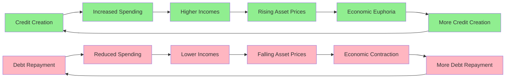

## The Short-Term Debt Cycle

If you've lived through a few economic ups and downs, you've experienced the short-term debt cycle firsthand. Think of it as the economy's breathing pattern—expansion and contraction, inhale and exhale.

The cycle begins in a specific economic environment: activity and inflation are running below desired levels, and interest rates sit low relative to both inflation rates and returns available on other investments. This creates an irresistible incentive structure. Why leave money in low-yielding deposits when you can borrow cheaply and invest in higher-returning assets?

This incentive structure triggers a cascade of borrowing and spending. Asset prices climb, economic activity accelerates, and inflation picks up. Eventually—and this is key—these metrics rise above desired levels. Now the calculus reverses. Money and credit become restricted, interest rates climb to levels that make borrowing unattractive relative to other opportunities.

The result? A mirror image of the expansion phase: borrowing plummets, spending contracts, asset prices fall, economic activity slows, and inflation moderates. This creates conditions for interest rates to fall again, restarting the cycle.

These cycles typically run about six years, though they can range from three to nine years. The variation depends on factors like policy responses, external shocks, and the underlying health of the economy.

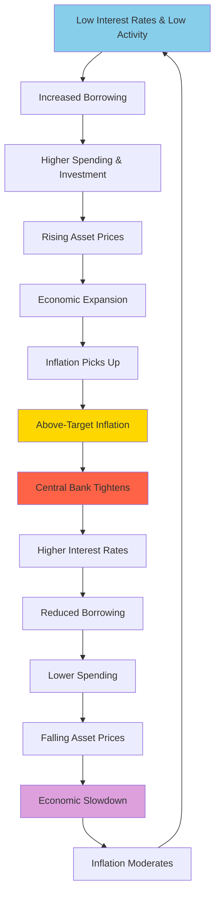

## Short-Term Debt Cycles Add up to Big, Long-Term Debt Cycles

Here's what most people miss: these short-term cycles don't just repeat—they accumulate. Like sedimentary rock forming layer by layer, each short-term cycle typically leaves behind a higher baseline of debt than the previous one.

Why? Because credit acts like a stimulant, and humans have a well-documented preference for stimulants. We want more growth, more prosperity, more of the good times. This creates a systematic bias toward credit expansion. Over decades, this bias compounds, with each cyclical peak in debt surpassing the last, and even the troughs settling at higher levels.

Think of it this way: early in a Big Debt Cycle, the economy is like a young person with a clean credit history and modest expenses. Borrowing is easy because debt service consumes only a small fraction of income. There's ample capacity to take on productive debt—loans that fund ventures generating returns exceeding their costs.

But as the Big Debt Cycle matures, the economy resembles someone approaching retirement with accumulated obligations. Debt service eats up an ever-larger share of income. The pool of genuinely productive investment opportunities shrinks. Yet the desire for credit-fueled growth remains undiminished.

This creates a treacherous dynamic. Early in the cycle, the relationship between borrowers and lenders is relatively simple—primarily driven by straightforward economic incentives and tempered by fresh memories of past debt crises. But late in the cycle, when debt towers over income and productive assets, the system becomes fragile.

The challenge intensifies because debt creates a web of interdependence: one person's debt is another's asset. Both parties must be kept satisfied. As debt levels rise, threading this needle becomes increasingly difficult. Interest rates must be high enough to compensate lenders for risk, yet low enough that borrowers can service their obligations without defaulting.

The margin for error shrinks until it vanishes entirely. **While short-term debt cycles end due to routine economic adjustments, long-term debt cycles end because the debt burden becomes fundamentally unsustainable.**

Put simply: debt can grow like cancer if left unchecked, gradually consuming ever-larger portions of income until it crowds out other essential expenditures. This is the essence of the Big Debt Cycle.

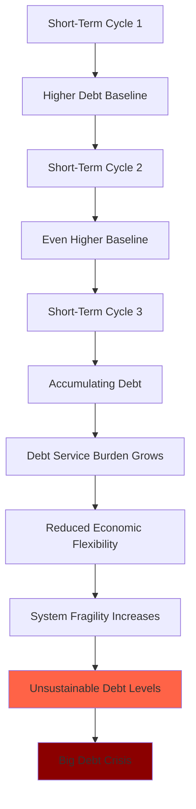

**Throughout the millennia and across countries, what has driven the Big Debt Cycle and has created the big market and economic problems that go along with it is the creation of unsustainably large amounts of debt assets and debt liabilities relative to the amounts of money, goods, services, and investment assets in existence.**

Let me crystallize this into its essence: a debt is nothing more than a promise to deliver money. A debt crisis erupts when the volume of promises overwhelms the money available to fulfill them. It's like writing checks your economy can't cash.

When this moment arrives, central banks face a stark choice between two painful options:

1. **Allow massive defaults**: Keep money "hard" and let debtors fail, triggering a deflationary collapse
2. **Print and devalue**: Create vast amounts of new money, honoring debts in nominal terms while destroying their real value

History shows they always choose door number two. They print and devalue. Why? Because the immediate pain of mass defaults is too politically unbearable. Whether through default or devaluation, the mathematical endpoint remains the same: debt assets (bonds) end up worth far less than promised.

The critical factor determining how this plays out is whether debts are denominated in a currency the central bank can print. This seemingly technical detail makes all the difference between a manageable crisis and an uncontrollable catastrophe.

Yet remarkably, credit rating agencies perpetuate a dangerous fiction. They rate only default risk, not devaluation risk. This creates the illusion that highly-rated government bonds are safe stores of value. But if a bond loses 50% of its purchasing power through currency debasement, does it matter that it technically didn't default?

As I see it: **Default or devaluation, I don't care. What I care about is losing my storehold of wealth, which inevitably will happen one way or another.**

## Following the Debt Cycle's Progression

The fundamental distinction between short-term and long-term debt cycles lies in the central bank's power to reverse them. A short-term contraction can be cured with a strong dose of monetary stimulus—lower rates, easier credit—because the economy retains capacity for non-inflationary growth. The patient responds to treatment.

But a long-term debt cycle contraction resists this medicine. Why? Because debt levels have grown so massive that holders of debt assets want out. They've lost faith that these assets will preserve wealth. Creating more money and credit only accelerates their exodus.

Understanding where we are in the Big Debt Cycle is like a doctor diagnosing a disease by its symptoms. Each stage exhibits distinct characteristics that, once recognized, reveal both the current condition and likely progression.

The cycle follows a predictable arc: from sound money and sustainable credit, to increasingly loose money and excessive credit, to an inevitable debt bust that forces a return to sound money—not by choice, but by necessity.

Let me walk you through each stage with the precision of a pathologist examining tissue samples:

### 1) The Sound Money Stage

This is the cycle's golden age, when the economic machine runs smoothly and sustainably. Net debt levels are low, money maintains its value, the country competes effectively globally, and debt growth finances genuine productivity improvements. The income generated comfortably exceeds debt service requirements, creating a virtuous cycle of rising financial wealth and justified confidence.

Understanding what makes this stage work requires grasping the fundamental difference between credit and money. Credit is a promise to pay money later—an IOU. Money, in contrast, completes transactions immediately. When you pay with money, you're done. When you pay with credit, you've merely postponed the reckoning.

Here's the catch: anyone can create credit simply by accepting promises, but not everyone can create money. I can extend you credit by accepting your promise to pay me later, even if you lack the funds. This ease of creation explains why credit invariably grows to dwarf the money supply.

The most effective money serves dual roles: it's both a convenient medium of exchange and a reliable store of wealth, accepted globally. During the sound money stage, money is "hard"—meaning its supply can't be easily inflated. Think gold, silver, or Bitcoin. These share a crucial characteristic: scarcity that resists manipulation.

Bitcoin represents a modern evolution of hard money. Its global acceptance and algorithmic supply limit echo gold's historical role. The greatest threat to any money's effectiveness as a wealth store is supply inflation. Imagine possessing the power to create money—who could resist the temptation? History shows none can. This temptation drives the Big Debt Cycle.

In the early phase, the financial architecture exhibits two key features:
- Money is typically hard (like gold), with paper currency convertible at fixed rates
- Paper money and debt remain modest relative to hard money and real assets

The Big Debt Cycle essentially operates like a slowly inflating balloon. "Paper" claims (money and debt) gradually expand relative to hard money and real goods/services, while income struggles to keep pace with debt service obligations. It resembles a Ponzi scheme where participants hold ever-increasing debt assets, believing they can convert them to money with real purchasing power. Yet as claims multiply relative to real assets, this conversion becomes mathematically impossible. Eventually, reality intrudes and the rush to exchange debt for hard assets begins.

During the sound money stage, debt metrics remain healthy:
- Private and government debt/income ratios are low
- Government debt service consumes a small fraction of tax revenue
- Liquid assets (reserves, sovereign wealth funds) provide ample cushions

When the current Big Debt Cycle began in 1944, telling ratios illustrated this health:
- US government debt to gold: 7x
- US money supply to gold: 1.3x

Today? Those ratios have ballooned to 37x and 6x respectively—a five-fold deterioration in government debt backing.

This stage features balanced, sustainable conditions: moderate debt levels, steady growth, controlled inflation. "Risky" assets trade cheaply relative to "safe" ones because memories of the previous cycle's devastation still influence psychology and pricing. In the late 1940s and early 1950s, stock earnings yields exceeded bond yields by 4x—investors demanded enormous premiums for equity risk.

This healthy economy with attractive returns plants the seeds for the next stage.

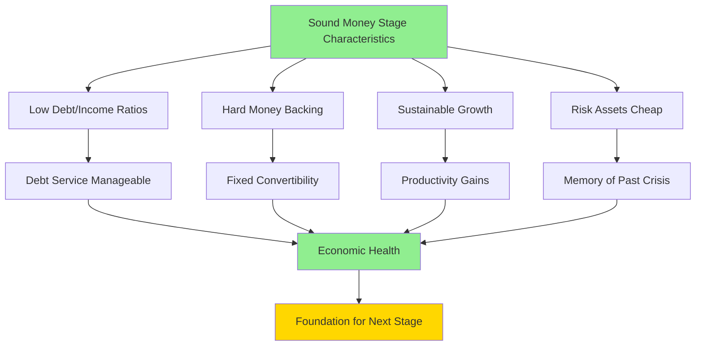

### 2) The Debt Bubble Stage

This is when the intoxication begins. Money flows freely and cheaply, fueling debt-financed expansion and economic boom. Demand for goods, services, and assets surges, driven by borrowed money. Sentiment turns euphoric. By conventional metrics, markets appear overpriced—but nobody cares.

This stage inevitably features "revolutionary" new technologies that seem to justify any valuation. Investors pour money into these innovations without seriously analyzing whether future cash flows will exceed costs. Who needs spreadsheets when you're changing the world?

The mathematical signature of a bubble is unmistakable: debt and debt service grow faster than income—not for quarters, but for years. Asset prices soar beyond any reasonable estimate of discounted future cash flows. My bubble indicator tracks these and other symptoms. (You can find the indicator here.)

Consider a contemporary example: the "unicorn" valued at $1 billion whose founder becomes a paper billionaire despite raising only $50 million. Venture capitalists buy lottery tickets disguised as equity stakes. The gap between imagined and actual wealth yawns wide.

Bubbles can persist surprisingly long before reality intrudes. But their end is mathematically inevitable.

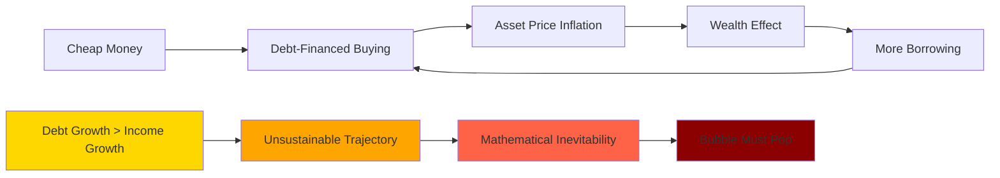

### 3) The Top Stage

The bubble pops through a simple mechanism: the combination of monetary tightening and unsustainable debt growth rates. Nothing more complex than that.

When bubbles burst, contagion spreads with viral speed. Like aggressive cancer, debt problems metastasize rapidly through the financial system. Policy makers must act swiftly—either reverse the contraction or guide a controlled deleveraging.

Initially, the standard response is to administer more of what caused the problem: create additional credit and debt. This can temporarily arrest the decline, like giving an addict another fix. But eventually, the drug stops working. When it does, painful deleveraging becomes unavoidable.

### 4) The Deleveraging Stage

This is when financial gravity reasserts itself with a vengeance. Debt and debt service must be forcibly realigned with income levels to restore sustainability.

The crisis typically begins in the private sector before spreading like a contagion to government and ultimately the central bank. The first warning sign? Net selling of debt assets, especially government bonds. This selling can quickly cascade into full-blown bank runs.

By "bank runs," I mean the rush to convert debt assets into real money—which banks never have enough of. When debt problems surface, holders dump their bonds, driving interest rates higher. Higher rates make debt service more burdensome, increasing risk, pushing rates higher still—a vicious cycle.

This selling of government debt triggers a cascade:
- Free-market monetary tightening
- Economic weakening
- Currency pressure
- Reserve depletion as central banks defend exchange rates

These runs accelerate and become self-reinforcing. Debt holders realize they face losses either through default or devaluation, triggering massive wealth destruction until debts are defaulted, restructured, or monetized.

The tightening's economic damage eventually forces central banks to reverse course—easing credit while accepting currency devaluation. But whether they tighten (causing defaults) or ease (causing devaluation), debt assets suffer.

This creates the dreaded "death spiral"—a self-reinforcing debt contraction where rising rates cause visible distress, spurring more selling, driving rates higher, necessitating money printing, which devalues currency, spurring even more selling. The spiral continues until exhaustion.

When government debt enters this spiral, the instinct is to slash spending and borrowing. But since one person's spending is another's income, austerity typically worsens debt/income ratios. This forces a policy shift toward debt restructuring and monetization, with the mix depending on whether debts are in domestic or foreign currency.

The deleveraging progresses through predictable stages. Initially, central banks cut rates and expand credit. But when:
- Debts are massive and contracting
- Rates hit zero
- Government debt demand evaporates
- Monetary easing can't offset deflationary forces

...central banks must deploy new "tools."

The ideal stimulus requires pushing rates below nominal growth, inflation, and bond yields. But how do you go below zero? Meanwhile, governments hemorrhage money—revenues collapse while spending soars to support the private sector. Yet private demand for government debt vanishes just when supply explodes.

Often this stage features "pushing on a string"—a 1930s phrase describing when stimulus fails to generate spending. Businesses, investors, and consumers prefer hoarding cash despite zero (or negative) rates. Fear overwhelms greed. Even free money can't induce borrowing when deflation makes holding cash attractive.

Central banks face their ultimate choice: maintain hard money and accept catastrophic defaults, or print money and accept devaluation. History's verdict is unanimous—they always print. Each central bank can only print its own currency, which becomes crucial for what follows.

If able to print, central banks create massive money supplies and flood markets. They buy government and systemically important private debt to compensate for vanished private demand and suppress interest rates. Sometimes they buy equities and create consumption incentives.

Currency devaluation often becomes desirable—it stimulates exports and creates inflation to counter deflation. Links to gold or other hard assets get severed, enabling pure fiat money. For already-fiat currencies, devaluation relative to other stores of wealth helps.

Sometimes central banks must raise nominal rates—either to fight inflation or because markets reject new debt issuance at current yields. Watch real and nominal rates carefully, along with debt supply/demand dynamics. Extraordinary measures like wealth taxes and capital controls become common.

The deleveraging stage inflicts necessary pain as debt burdens get reduced through defaults, restructurings, and devaluations. Aggressive mixing of deflationary restructuring and inflationary monetization becomes inevitable. Typically, debt/income ratios must fall roughly 50% (plus or minus 20%).

Success requires balance. In a "beautiful deleveraging," governments and central banks coordinate restructurings (deflationary) with monetary stimulus (inflationary). When properly balanced, growth resumes with falling debt burdens and acceptable inflation. Whether beautiful or ugly, this stage purges enough debt to enable the next cycle.

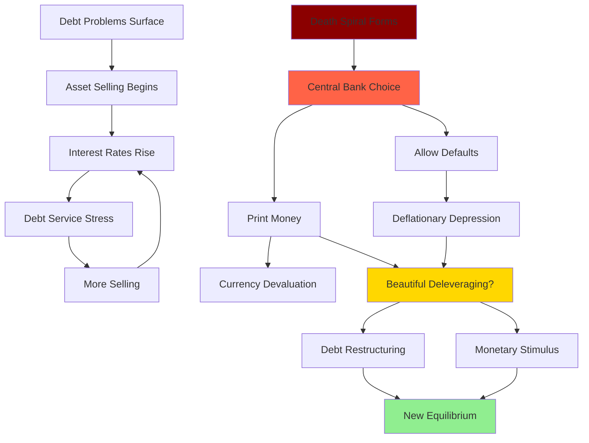

### 5) The Big Debt Crisis Recedes

This final stage represents the return to equilibrium and the foundation for the next cycle. For a monetary system to function, several conditions must align:

- Money/debt must credibly store wealth
- Debt service must align with income capacity
- Both creditors and debtors must believe in the system's sustainability
- Money availability and real interest rates must balance both parties' needs

This late phase involves both psychological and fundamental adjustments. After severe deleveraging, lender-creditors resist lending, scarred by recent losses. Governments and central banks must restore credibility through concrete actions:

- Governments must earn more than they spend
- Central banks must make money "hard" again through high real yields, building reserves, or linking to hard assets

Interest rates typically need to exceed inflation substantially, compensating for currency risk. Lending becomes profitable; borrowing becomes costly. This stage can prove highly attractive for patient creditors.

The monetary policy regime itself reveals the cycle's stage. As the Big Debt Cycle progresses, central banks must evolve their tools to maintain expansion. By observing which tools they're using, you can diagnose where the cycle stands:

**Phase 1: Linked (Hard) Monetary System (MP1)**
This characterized 1944-1971. It ends when debt bubbles burst, triggering "bank runs" from credit to hard money. Limited hard money supplies force massive defaults, creating irresistible pressure to print rather than maintain the peg.

**Phase 2: Fiat Money, Interest-Rate-Driven Policy (MP2)**
Interest rates, bank reserves, and capital requirements control credit growth. While allowing flexibility, this system provides less assurance against wealth-destroying money printing. The US occupied this phase from 1971-2008. It ends when rate changes lose effectiveness (hitting zero) or private debt demand falls short of supply.

**Phase 3: Fiat System with Debt Monetization (MP3)**
Central banks create money to buy assets directly. This becomes necessary when rates can't fall further and private demand for debt proves insufficient at acceptable yields. It benefits financial asset holders disproportionately. The US used this from 2008-2020.

**Phase 4: Coordinated Fiscal and Monetary Policy (MP4)**
When MP3 proves insufficiently targeted, fiscal and monetary authorities coordinate to deliver money to those most in need. While temporarily alleviating problems, it doesn't solve underlying imbalances.

**Phase 5: Big Deleveraging (MP5)**
Major debt reduction through restructuring and/or monetization becomes unavoidable. A "beautiful deleveraging" balances deflationary debt reduction with inflationary monetization, avoiding extremes of either.

The sequence to remember: private sector overborrows and faces crisis → government helps by overborowing and faces crisis → central bank buys government debt and prints money → at worst, central bank faces losses requiring more printing, creating a death spiral → eventually, restructuring and monetization reduce debts to sustainable levels.

**Phase 6: Return to Hard Money (MP6)**
After burning debt holders through defaults and devaluation, governments must restore monetary credibility. This typically means returning to MP1 (hard asset backing) or MP2 (disciplined interest rate policy) with high real yields that reward creditors.

**For great countries with great empires, the end of the Big Debt Cycle has meant the end of their prominence.**

## A Few Concluding Observations

**It pays to build up savings in the good times so there are savings to draw on in the bad times.** Every society faces this eternal balancing act—too much saving stifles growth, too little leaves no buffer for crises. None achieve perfect balance, but some do far better than others.

**Big debt crises are inevitable.** History shows only a handful of exceptionally disciplined countries have avoided them. Why such universal failure? Because lending is never calibrated perfectly to income-generating capacity. More fundamentally, human psychology guarantees excess—people always want more credit, which becomes more debt. Credit feels good; repayment hurts. So debt accumulates beyond sustainable levels, forcing painful readjustment through some combination of default and monetization.

Even more perversely, psychology amplifies cycles: bubbles make people optimistic, spurring more borrowing; busts make people pessimistic, crushing spending. Despite this pattern repeating across millennia, most policymakers and investors believe their current system is different. Change seems unthinkable—until it arrives suddenly.

**The best way to anticipate a debt crisis happening is not by focusing on a single influence or number like debt as a percent of GDP; it is by understanding and focusing on a number of interrelated dynamics** that we will explore in coming chapters.

**If debts are denominated in a country's own currency, its central bank can and will "print" the money to alleviate the debt crisis.** This power allows better crisis management than nations borrowing in foreign currencies, but at the cost of currency debasement. When debts are in currencies central banks cannot print, the result is outright default and deflationary depression.

**All debt crises, even big ones, can be managed well** by balancing deflationary debt reduction (restructuring) with inflationary reduction (monetization). The key is spreading adjustment over time. If debt/income ratios must fall 50%, doing so at 3-4% annually proves far less traumatic than overnight collapse.

**Debt crises provide great risks and opportunities** that have both destroyed empires and created fortunes for those who understood the dynamics and navigated them skillfully.

**If you try to focus on debt cycles precisely or focus your attention on the short term you won't see them.** It's like comparing snowflakes and missing their fundamental similarity by obsessing over superficial differences.

## That's it in a nutshell.

In the rest of this study I will get into the mechanics in greater depth, show the actual archetypical sequences that have played out over 35 cases, look at how the Big Debt Cycle and Big Cycle that includes the other big cycles (for instance, cycles of internal and external order) that started in 1944 and that we are currently in the late stages of have transpired relative to this template, and briefly look at the Chinese and Japanese Big Cycles and a number of other cases. The Japanese case is interesting because Japan is further along in its Big Debt Cycle. Notably its large debt and debt monetizations have led to the depreciation of its currency and debt, which led holders of its bonds to have losses of 45% relative to holding US dollar debt since 2013 and losses of 60% relative to holding gold since 2013. In the final chapters, I will share how I am processing the US today relative to this template, how the US could reduce the risk of an acute debt crisis, and how I read the Five Big Forces today.


# Chapter 2: The Mechanics in Words and Concepts

Note: This chapter gives unconventional concepts about the mechanics of how markets work that I believe would be valuable for professionals and aspiring professionals but are probably beyond the interests of others. I suggest that you give it a try to see whether or not it's the sort of thing you'd like to get into.

Imagine the economy as a vast, interconnected machine where every lever pulled creates ripples throughout the entire system. Because nothing happens without a cause, and every cause triggers multiple effects, the economy operates like a perpetual motion machine of extraordinary complexity. To truly understand this machine, we must dissect its mechanics with surgical precision.

Think of it this way: every economic event—from a single purchase at a corner store to a central bank's decision to print trillions—sends waves through the system. These waves collide, amplify, and sometimes cancel each other out in patterns that seem chaotic but actually follow discernible rules. Thanks to breakthroughs in artificial intelligence, we're approaching a moment where we might finally map these intricate patterns completely. But for now, we must rely on careful observation, historical analysis, and the computational tools at our disposal.

What I'm presenting here represents my attempt to decode the debt/credit/money/economic dynamic—itself just one crucial component of an even grander machine. Through decades of studying what happened and why, I've tried to distill complex realities into comprehensible principles. This is necessarily a simplified picture, but one that captures the essential mechanisms.

Let me zoom out to the highest vantage point. Five titanic forces shape our world, and understanding their interplay is essential:

**The debt/credit/money/economic cycle** - The breathing pattern of financial systems
**The internal political order/disorder cycle** - The rhythm of domestic harmony and conflict
**The external geopolitical order/disorder cycle** - The dance of international cooperation and competition
**Acts of nature** - Droughts, floods, pandemics that periodically reset human progress
**Human inventiveness** - Particularly technological breakthroughs that redefine what's possible

These forces don't operate in isolation—they're locked in an intricate dance, each influencing the others in ways that compound their individual effects. To understand the complete picture of how they interact, you can explore my book *Principles for Dealing with the Changing World Order*.

For this study, we'll focus intensely on the first force—the credit/debt/money/economic dynamic—with particular attention to that critical moment when governments and central banks approach insolvency. But even as we zoom in on this specific mechanism, we cannot ignore how it interacts with the other four forces. From everything I observe, we're likely entering an extraordinarily turbulent phase where all five forces converge to reshape the world order. My hope is that understanding these dynamics will help us navigate the coming changes more skillfully.

## How the Machine Works

Money and credit are the lifeblood of the economic organism. Just as blood carries oxygen and nutrients to every cell in your body, money and credit transport purchasing power to every corner of the economy. They flow from areas of surplus to areas of need, enabling the entire system to function.

The central government acts as the economy's brain, directing the system's operations while consuming a significant portion of resources (typically 15-30%) to perform essential functions like defense, infrastructure, and social programs. The central bank serves as the heart, pumping money and credit through the system's arteries. When this circulation flows smoothly—when capital providers earn good returns and capital users deploy it productively—the entire organism thrives. When circulation falters, the system experiences trauma.

Now, viewing the debt dynamic as a cyclical machine doesn't mean nothing changes. Of course there are innovations, cultural shifts, and institutional evolution. But these changes are surprisingly minor compared to the timeless patterns that repeat across centuries and civilizations. It's like watching ocean waves—each is unique in its details, but the fundamental physics driving them remains constant.

Understanding these universal principles first, then examining the variations, provides far richer insight than the reverse approach. So let me start with the major timeless mechanics, painted in broad strokes rather than exhaustive detail.

## The Five Major Parts and How They Work

Picture the economy as composed of five fundamental elements that interact to create all economic activity:

1. **Goods, services, and investment assets** - The real things people want
2. **Money** - The universally accepted medium for obtaining these things
3. **Credit** - The promise to deliver money in the future
4. **Debt liabilities** - The obligations created when credit is used
5. **Debt assets** - The flip side of debt liabilities (your debt is my asset)

Master how these five elements interact, and you'll understand why economies experience booms and busts with clockwork regularity.

Let's start with the basics. Goods, services, and investment assets can be purchased with either money or credit—this simple fact contains profound implications.

**Money settles transactions completely.** When you buy a car with cash, you hand over the money, receive the car, and you're both done. No lingering obligations remain. Throughout history, what constitutes "money" has evolved dramatically. For millennia, money meant a promise to deliver gold or silver. Since 1971, when the US abandoned the gold standard, we've operated in a fiat system where money is whatever central banks declare it to be—more like a special form of credit that promises general purchasing power rather than specific hard assets. But money differs crucially from credit because only central banks can create it, and they can create whatever amount they choose.

**Credit leaves obligations dangling.** Unlike money, credit can be created by any two willing parties through mutual agreement. When you buy with credit, you're essentially borrowing purchasing power from your future self. This time-shifting creates the economy's fundamental rhythm. Credit allows borrowers to spend beyond their current means, driving up demand and prices in the near term. But eventually, the bill comes due. When debts must be repaid, borrowers must spend less than they earn, depressing demand and prices. This pendulum swing between credit expansion and contraction creates the cycles we experience.

The relationship between money and credit is like that between the foundation and structure of a building. The amount of money in existence sets the base level of potential credit creation. More money enables more credit; less money constrains it. Central banks, by controlling the money supply, wield enormous power over the entire credit system.

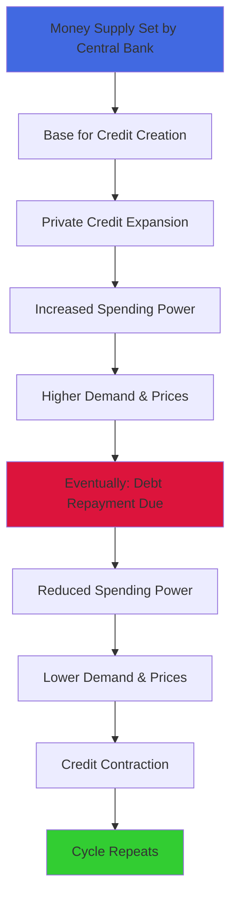

Now let's examine how prices are actually determined—and why my approach differs radically from conventional economics.

## Understanding Price Formation

To grasp how prices truly form, we must start at the atomic level of economics: the individual transaction. Every market, every economy, is simply the sum of countless transactions. And what is a transaction? It's an exchange where a buyer gives money (or credit) to a seller in return for goods, services, or financial assets.

Here's the fundamental equation that governs all prices:

**Price (P) = Total money spent ($) ÷ Total quantity sold (Q)**

Or more simply:

$$P = \frac{\$}{Q}$$

This equation is indisputable. If you know total spending and total quantity sold, you know the price. Period. The challenge lies in predicting these two variables, which requires understanding what motivates buyers to spend and sellers to sell.

Consider the conceptual framework:


While this might appear complex, it's actually straightforward. Every buyer has reasons for spending what they spend. Every seller has reasons for selling what they sell. Identify the major players and their motivations, and you can predict their actions—and thus prices—with remarkable accuracy.

This approach diverges sharply from traditional economics, which measures both supply and demand in terms of quantity. Conventional theory speaks of "elasticity"—how quantity demanded or supplied responds to price changes. This implies fixed relationships that simply don't exist in reality.

Why? Because spending isn't just about wanting things—it's about having the means to buy them. If buyers suddenly have more money (through wage increases, credit availability, or money printing), they'll spend more on the same goods, driving prices higher. The conventional model misses this crucial dynamic.

My approach, developed through decades of trading commodities and financial instruments, focuses on connecting real market participants with real price movements. It works not just for wheat or copper, but for bonds, currencies, and entire economies.

Play with the formula and powerful insights emerge. If spending drops 10% while quantity remains constant, prices fall 10%. This means unsustainable spending patterns—whether too high or too low—signal inevitable price reversals. Identify these extremes and you can calculate both the timing and magnitude of coming changes.

This framework reveals several critical insights:

**When money and credit expand while productive capacity exists, you get non-inflationary growth.** Both spending ($) and quantity (Q) increase together, leaving prices stable while the economy expands. This is the economic sweet spot.

**When money and credit expand but capacity is constrained, you get inflation without real growth.** Spending ($) rises but quantity (Q) cannot, so prices must rise. This is why late-cycle economies experience stagflation.

These principles explain why early cycles (abundant capacity + stimulative central banks) deliver strong growth with low inflation, while late cycles produce weak growth with rising prices. We'll explore what monetary inflations and inflationary depressions look like in detail later.

Where does productivity fit? High productivity growth allows producers to expand quantity (Q) as money and credit grow, extending non-inflationary growth. Productivity gains can manifest as better quality at the same price or dramatically lower costs (think digital photos replacing film). This is why technological revolutions can sustain booms longer than seems possible.

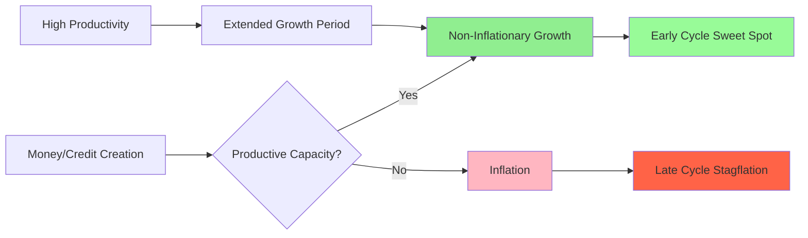

Now let's examine what drives spending and selling decisions across major categories.

People purchase goods and services to use, and investments to build wealth. The allocation between consumption and investment depends on relative prices, available resources, and the comparative appeal of spending now versus saving for later.

These choices involve constant comparisons across two dimensions:

1. **Between different items** - money for food, gold, stocks, real estate
2. **Across time** - buying today versus buying next year

This creates an enormously complex matrix of relative value assessments. The most powerful forces shaping these relationships are arbitrage opportunities and near-certain bets.

**Currencies serve dual roles: facilitating transactions and storing wealth.** They're both the oil in the economic engine and the fuel tank storing purchasing power.

**Investments are simply exchanges of money today for money tomorrow.** All investments generate returns through just two channels: yields and price appreciation. Together these create total return.

$$\text{Total Return} = \text{Yield} + \text{Price Change}$$

All investments compete based on total return. Why? Because most investors care primarily about total return, not its composition, and because arbitrage ensures alignment across markets. This competition creates a unified pricing matrix across all assets.

Let me illustrate with gold versus Treasury bonds. Suppose Treasuries yield 5% while gold yields nothing. For anyone to rationally buy gold, they must expect its price to rise by at least 5% annually. Otherwise, they'd buy bonds instead. This expectation gets priced into markets through countless individual decisions.

Investors compare the 5% certain yield against their estimate of currency depreciation. If money printing seems likely to exceed 5% annually, gold becomes attractive. If not, bonds win. Millions of such calculations, backed by real money, create market prices. The constant arbitrage between these assessments ensures remarkably efficient pricing most of the time—though not always perfectly, which creates opportunities for those with superior understanding.

This competitive dynamic extends beyond simple assets. Financial engineering transforms one asset into synthetic versions of another through leverage, derivatives, and hedging. This creates an intricate web where all prices influence all other prices.

Understanding current market pricing through this lens becomes invaluable for navigating debt cycles. Expected real returns (after inflation) drive capital allocation. When real returns on financial assets are high, money flows there. When they're low or negative, money seeks real assets—real estate, commodities, art, gold.

This is particularly crucial for government bonds. Their returns are known with certainty (the yield is fixed and default risk minimal for bonds in domestic currency), making them the benchmark against which everything else is measured. When bond yields fall below inflation, bonds get sold and inflation hedges get bought. When central banks create massive amounts of money and credit, devaluing both, investors naturally favor real assets that preserve purchasing power.

Price relationships follow specific patterns. While most investors focus on spot prices (for immediate delivery), markets also price future delivery through forward contracts. The relationships between spot and forward prices, between short and long-term bonds, between bonds of different countries—all follow logical patterns driven by arbitrage.

Consider different maturities of government debt. The spread between short and long-term rates primarily reflects expected central bank actions. If traders expect rate hikes, long-term bonds must yield more than short-term ones by enough to compensate. These expectations get constantly tested and refined by market forces.

## Debt Is Currency and Currency Is Debt

Here's a profound insight: since debt assets promise to deliver currency in the future, debt and currency are fundamentally the same thing. If you dislike a currency, you must dislike its bonds. If you distrust the bonds, you must distrust the currency. Once you factor in their relative yields, they're two faces of the same coin.

Remember our gold/bond comparison? The same logic applies to different currencies and their bonds. This creates powerful international capital flows that prove crucial during debt crises.

Let me illustrate with a concrete example:

Imagine Country A's interest rates are 3% below Country B's. Normally, you'd expect Country A's currency to appreciate by 3% annually to offset this difference. Otherwise, traders could earn risk-free profits by borrowing in Country A and lending in Country B.

But what if Country A's currency is expected to depreciate by 2% annually instead of appreciate? Now there's a 5% annual profit opportunity. Capital will flood out of Country A's bonds, forcing one of two adjustments:

**Option A:** The currency immediately falls by roughly 40% (the present value of 5% annual losses over 10 years)

**Option B:** Interest rates spike by 5%, crashing bond prices by approximately 40%

Either way, Country A's bondholders face devastating losses. If capital controls prevent these adjustments, the losses materialize gradually—5% annually compounding to 40% over a decade.

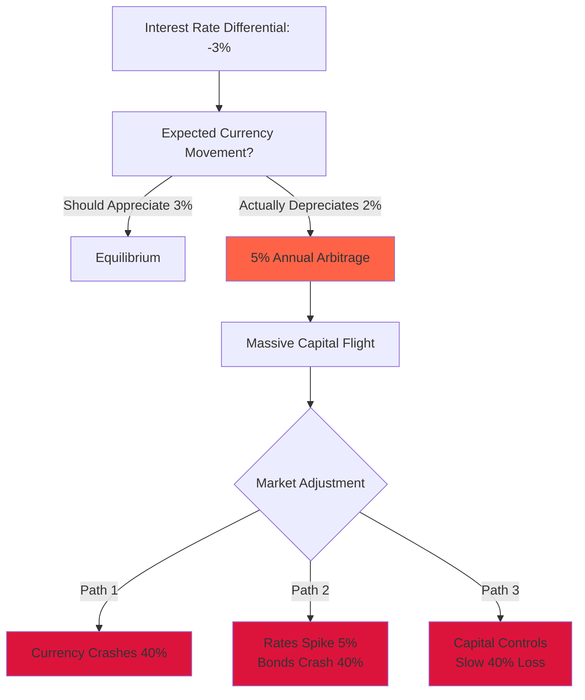

The crucial lesson: **bad returns materialize one way or another.** Whether through outright default, currency devaluation, or inflation exceeding interest rates, mathematics ensures bondholders lose. The only question is how.

## The Major Types of Players and How They Behave to Drive What Happens

Five key players orchestrate the debt cycle symphony:

1. **Borrower-debtors** (private and government) - Those who take on debt to spend beyond current means
2. **Lender-creditors** (private and government) - Those who forego current spending to earn returns
3. **Banks** - Intermediaries who profit from the spread between borrowing and lending rates
4. **Central governments** - Political entities that typically spend beyond their means
5. **Central banks** - The only entities that can create money, tasked with managing the system

Understanding these players' motivations and constraints allows us to predict their behavior and thus market outcomes.

**Credit expansion requires willing partners.** Both borrowers and lenders must see benefit, yet their interests fundamentally conflict. Borrowers need low rates to service debt; lenders need high rates to justify the risk. This tension creates the cycle's fundamental rhythm.

When rates are too high, borrowers slash spending, sell assets, or default—crashing markets and economies. When rates are too low, lenders refuse to lend or dump existing bonds—forcing rates higher or requiring central banks to print money, creating inflation. The system constantly oscillates between these extremes.

**Banks amplify cycles through leverage.** For millennia, across all cultures, banks have played the same role: borrowing at low rates, lending at higher rates, and pocketing the spread. They create bubbles by lending far more than they actually have, repeatedly leveraging their capital. This works magnificently when loans perform and deposits remain stable. But when loans sour or depositors flee, banks fail spectacularly, transforming individual problems into systemic crises.

**The iron law of debt: over the long run, debts cannot grow faster than the incomes needed to service them.** Similarly, interest rates cannot remain too high for borrowers or too low for lenders indefinitely. When these imbalances persist, crisis becomes inevitable. Watch these ratios carefully—they signal danger ahead.

**Big debt crises emerge when debt assets and liabilities dwarf the supply of actual money and real economic output.** It's a simple matter of arithmetic—too many claims chasing too few real resources.

**Central banks control the money supply, determining total purchasing power.** Whatever money and credit they create must flow somewhere—into goods, services, or financial assets. This is why all asset classes tend to rise and fall together with monetary tides, like boats on the harbor.

Central banks exist to smooth these cycles, particularly to manage debt crises. Before central banks (the Federal Reserve only began in 1913), economies experienced savage boom-bust cycles. Banks regularly failed when too many depositors demanded their gold simultaneously. These traumatic experiences birthed central banking—government-sanctioned entities empowered to create money and lend during crises.

But where do central banks get their money? They manufacture it from thin air, digitally or physically. While this provides crucial crisis relief, it also devalues money and debt assets, creating inflation.

Central banks pursue seemingly simple goals: sustainable debt growth, steady economic expansion, and moderate inflation. To achieve these, they raise rates to cool overheating or lower them to stimulate sluggish growth. But these simple tools must navigate between Scylla and Charybdis—satisfying both creditors and debtors becomes increasingly difficult as debt levels rise.

**Central governments compound the problem.** As political entities serving at voters' pleasure, they invariably promise more than they can deliver. This bias toward deficit spending reinforces credit expansion during booms and debt crises during busts. When governments and central banks work well, they create broad prosperity through productive investment. When they fail, the results are catastrophic.

**The critical insight: as debt assets and liabilities grow relative to income, the system becomes increasingly fragile.** The margin for error shrinks until it vanishes entirely.

Because these five players have transparent motivations, their behavior is predictable. When debt is low, economies weak, and inflation modest, central banks will ease. This creates ideal conditions for borrowers and challenging ones for lenders. When debt grows unsustainably fast and inflation accelerates, central banks tighten—rewarding savers and punishing borrowers.

This dynamic creates two interlocking cycles: short-term cycles averaging six years (ranging from three to nine) and long-term cycles averaging 80 years (ranging from 55 to 105). Both spiral around an upward productivity trend driven by human innovation.

## The Short- and Long-Term (Big) Debt Cycles

The **short-term debt cycle** follows this sequence:

1. Recession leads to...
2. Central bank easing (cheap credit), creating...
3. Debt-financed expansion and boom, producing...
4. Bubbles and inflation, forcing...
5. Central bank tightening, causing...
6. Economic weakening and return to recession

Since 1945, the US has experienced 12.5 of these cycles—we're midway through the 13th as I write. Each typically ends with higher debt levels than the previous cycle because policymakers consistently choose reflation over accepting recessions.

The **long-term (big) debt cycle** emerges from accumulating short-term cycles. Like sediment forming rock, each cycle adds debt layers until the total becomes unsustainable. This necessitates dramatic restructuring through default and monetization, creating severe economic turbulence.

These cycles dance around an ascending productivity line—humanity's growing ability to produce more with less. This incline depends on practical innovation (entrepreneurs with capital) working within supportive systems (good governance, rule of law, cooperation).

Over short periods (1-10 years), the short-term cycle dominates. Over long periods (10+ years), the Big Debt Cycle and productivity growth matter more. Conceptually:


**The key distinction between sustainable and unsustainable debt: does it generate sufficient income to service itself?** When debt grows faster than income, requiring more borrowing just to pay interest, collapse approaches. The surest crisis indicator is large-scale borrowing to pay existing debt service.

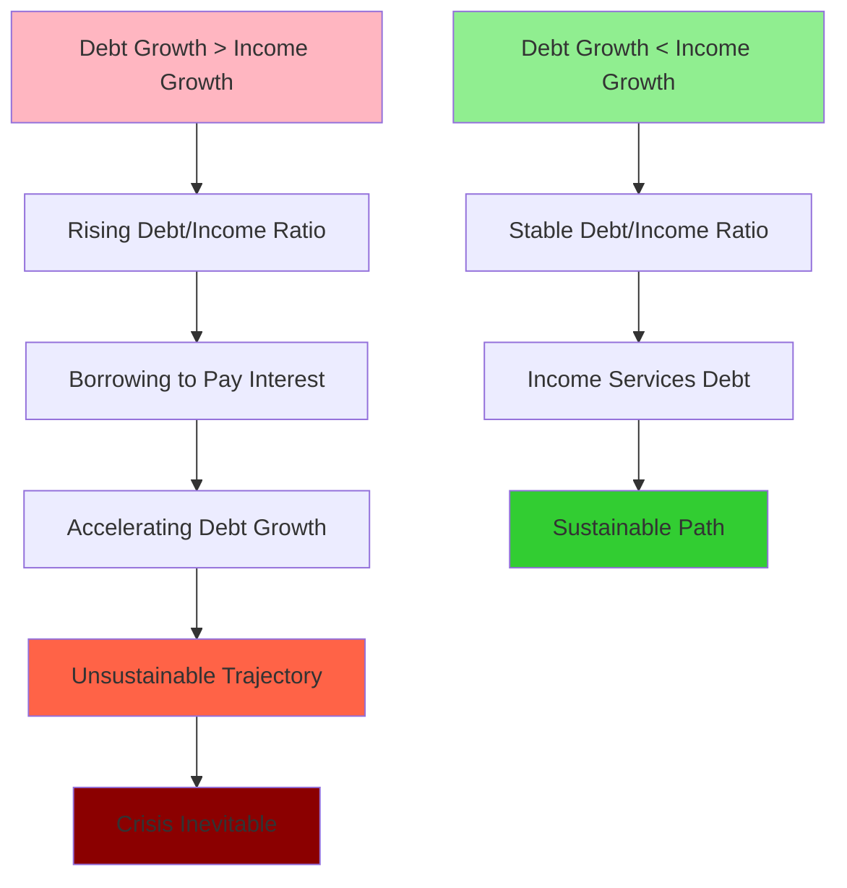

**Why don't central bankers prevent these cycles?** Four reasons:

1. **Universal bias toward growth** - Everyone benefits from expansion, so we push limits until they break
2. **Uncertain danger zones** - Precise debt thresholds depend on unknowable future conditions
3. **Opportunity costs** - Too little credit can damage economies as severely as too much
4. **Manageable crises** - Even severe debt crises can be navigated without complete catastrophe

Credit resembles medicine—too little causes economic anemia, too much creates addiction. The art lies in dosage. Used wisely, credit funds innovations and opportunities that wouldn't exist otherwise. And if governments control the restructuring process in their own currency, pain can be spread tolerably.

History shows debt assets and liabilities grow virtually without exception until becoming unsustainable. Once returns become unacceptably low or risks unacceptably high, the system breaks.

When debt towers over income, central banks face an impossible choice. Rates high enough to satisfy creditors crush debtors. Rates low enough to sustain debtors rob creditors. Because one person's debt is another's asset, someone must lose. This forces central banks to choose between:

1. **Hard money path**: No printing, letting rates rise to market-clearing levels. This creates deflation, massive defaults, and depression—making cash king while crushing all other assets.

2. **Soft money path**: Print aggressively to suppress rates and buy debt. This creates inflation, currency devaluation, and financial repression—preserving nominal values while destroying real purchasing power.

The hard money path proves so economically devastating that central banks always eventually choose inflation. But both paths lead to the same destination: massive real losses for creditors.

At cycle peaks, policymakers can pull four levers:

1. **Austerity** - Spending cuts that typically backfire by crushing incomes faster than debts
2. **Debt restructuring** - Defaults and write-downs that directly reduce burdens
3. **Money printing** - Central bank purchases that inflate away real debt values
4. **Redistribution** - Transfers from those with surplus to those in distress

Austerity seems logical but proves counterproductive. Since spending equals income, cuts create deflationary spirals. Governments see revenues plunge while social demands soar, widening deficits. Tax increases further strangle growth.

The optimal solution—a "beautiful deleveraging"—balances deflationary restructuring with inflationary printing. Done skillfully, this reduces debt burdens while maintaining modest growth and acceptable inflation. The key is spreading adjustment over time—reducing debt/income ratios by 3-4% annually rather than 50% overnight.

Most debt crises in domestic currencies resolve within 1-3 years through this rebalancing. These transitions create extraordinary risks and opportunities for those who understand the dynamics.

## The Big Debt Cycle, Its Risks, and How to Deal with It Need to Be Better Understood

Because transformational debt crises occur roughly once per lifetime, they're paradoxically both the most important and least understood economic events. Like hundred-year floods, their rarity breeds complacency. Each generation must learn these lessons anew, often painfully.

This knowledge gap is dangerous. It's like ignoring cholesterol buildup because you haven't had a heart attack yet. The accumulating risk remains invisible until the crisis strikes.

Let's define financial health clearly:

**Healthy:**
- Private credit funds profitable ventures that generate returns exceeding costs
- Government borrowing finances productivity enhancements (infrastructure, education) that boost tax revenues
- Cyclical deficits during downturns are repaid during expansions

**Unhealthy:**
- Central banks chronically print money to compensate for insufficient private debt demand
- Governments run structural deficits, with debt growing faster than tax revenues
- Debt service consumes an ever-growing share of income

The mechanics summarized:

- Central banks can create unlimited money and heavily influence credit
- Borrowers need sufficient money at low enough rates to service debts
- Lenders need high enough returns to justify risk
- This balance becomes progressively harder as debt/income ratios rise
- Eventually, deleveraging becomes mandatory
- Beautiful deleveragings are possible if debt is in domestic currency
- Long-term financial health requires earning more than spending and owning more than owing
- Understanding cycle position and player motivations enables successful navigation
- The past is prologue

## Important Takeaways:

**Debt crises are inevitable.** History shows only the rarest, most disciplined societies avoid them. Credit is never allocated perfectly and often allocated terribly, as cycle psychology drives bubbles and busts.

**Most debt crises can be managed well** through appropriate restructuring and monetization, spreading pain tolerably over time.

**All debt crises create opportunities** for investors who understand the dynamics and maintain discipline.

**At Big Debt Cycle peaks, satisfying both creditors and debtors becomes impossible.** Central banks must navigate between deflation and inflation, typically experiencing both in sequence. Holding government debt during such periods guarantees losses—through either default or devaluation.

**When forced to choose, central banks always print.** The immediate pain of deflation is politically unbearable compared to the slow burn of inflation. But printing only works for domestic currency debt—foreign currency debt creates true catastrophes.

## The Dance of the Five Forces

While I've focused on debt cycles, they cannot be understood in isolation. The five great forces—debt cycles, internal order, external order, nature's shocks, and human innovation—intertwine in complex choreography.

These forces amplify each other. Financial crisis breeds political conflict, which worsens financial conditions. Domestic weakness invites international aggression. Natural disasters striking fragile systems create cascading failures. Yet innovation can transform apparent limits into new frontiers.

Together, these forces create history's grand cycles—the rises and falls of civilizations, the rhythms of war and peace, the tides of human progress. By monitoring key indicators across all five forces, we can navigate more skillfully.

You can observe great powers' evolutionary paths through telltale signs:
- Inexorably rising debt accompanied by progressively weaker monetary restraints
- Declining education quality, infrastructure, rule of law, and government effectiveness
- Diminishing civility and increasing internal conflict
- Loss of competitive position internationally

I won't elaborate here—these dynamics are thoroughly explored in *Principles for Dealing with the Changing World Order*. Instead, let's dive deeper into the Big Debt Cycle's mathematical mechanics, which I'll strive to make accessible despite their complexity.

# Chapter 3: The Mechanics in Numbers and Equations

**A Strategic Note for the Ambitious Reader:** This chapter transforms abstract debt dynamics into concrete mathematical relationships that financial professionals use daily to anticipate and navigate sovereign debt crises. While the equations might initially seem intimidating, they're actually elegant tools that reveal exactly when and why governments find themselves trapped between impossible choices. Consider this chapter your technical arsenal—scan it first to grasp the core concepts, then return to master the calculations that could define your career in fixed income or macroeconomic analysis.

In Chapter 2, we explored through narrative how central governments and their central bank partners march toward financial catastrophe. Now we're shifting gears entirely—from storytelling to mathematical modeling. Think of this transition like moving from watching a chess game to learning the precise calculations that grandmasters use to see ten moves ahead. These formulas don't just describe what happens; they let you calculate exactly when debt burdens will become unbearable, allowing you to position yourself before markets realize the inevitable.

Let me first establish what makes a debt burden "unsustainable" with crystalline clarity. Picture your personal finances: you're sustainable when money flowing in exceeds money flowing out. You become unsustainable when outflows exceed inflows, forcing you to either drain your savings or borrow increasingly desperate amounts until both wells run dry. At that moment of exhaustion—when savings vanish and no one will lend—you experience financial failure. Governments face this identical constraint, just with more zeros and more dramatic consequences.

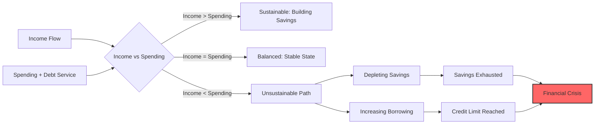

Think of this money flow as your economic bloodstream, with income statements and balance sheets serving as your vital signs. A healthy government, like a healthy body, maintains equilibrium—income matches or exceeds spending, while debts grow no faster than the income supporting them. This doesn't mean all debt growth signals disease. When borrowed funds generate income growth that outpaces debt service costs, you're investing wisely. But when debts compound faster than income—picture plaque accumulating in arteries—each payment increasingly constricts what's available for other purposes. Eventually, this constriction triggers default: the economic heart attack.

Interest rates act as the master valve in this system, dramatically amplifying or dampening debt service burdens. They simultaneously influence creditors' appetite for holding government bonds. As debt service consumes an ever-larger share of income and savings, the squeeze tightens until something breaks.

While I monitor approximately 35 indicators to assess sovereign debt risks comprehensively, four metrics tower above the rest in importance:

**1. Debt-to-Income Ratio:** This foundational metric reveals how many years of income would be required to repay all debt. As this ratio climbs, two dangers intensify exponentially. First, existing creditors grow nervous about refinancing maturing bonds, potentially triggering a funding crisis. Second, the sheer arithmetic of servicing larger debt stocks consumes increasing income shares, creating a vicious cycle where borrowing begets more borrowing.

**2. Debt Service-to-Income Ratio:** This metric cuts straight to what matters—the actual cash flowing out the door annually to prevent default. Think of it as your government's minimum monthly payment. As this ratio rises, it creates a brutal choice: slash spending elsewhere (politically explosive) or borrow more to cover the gap (mathematically unsustainable). When investors see this ratio climbing relentlessly, they anticipate the crisis and accelerate it by demanding higher rates or refusing to roll over maturing debt.

**3. Nominal Interest Rates Relative to Both Inflation and Nominal Income Growth:** This comparison serves two critical functions that many analysts miss:

   a) **The Debt Dynamics Calculator:** Simple arithmetic reveals destiny. If you owe 100% of income, pay 5% interest, but income grows only 3%, your debt burden inexorably rises to 102% next year (assuming balanced spending). This 2% gap compounds remorselessly—small initially, devastating eventually.

   b) **The Market Sentiment Barometer:** When nominal rates exceed both inflation and growth rates significantly, lenders feast while borrowers starve. This imbalance encourages lending but discourages the borrowing and spending that fuels growth. Conversely, when rates lag inflation and growth, borrowers celebrate while lenders suffer—encouraging debt accumulation but eventually triggering capital flight.

**4. Debt Ratios Relative to Liquid Savings (Reserves):** Even when the first three metrics flash red, substantial reserves provide a crucial buffer. Think of reserves as your emergency fund—they buy time to implement reforms, weather temporary storms, or negotiate from strength rather than desperation.

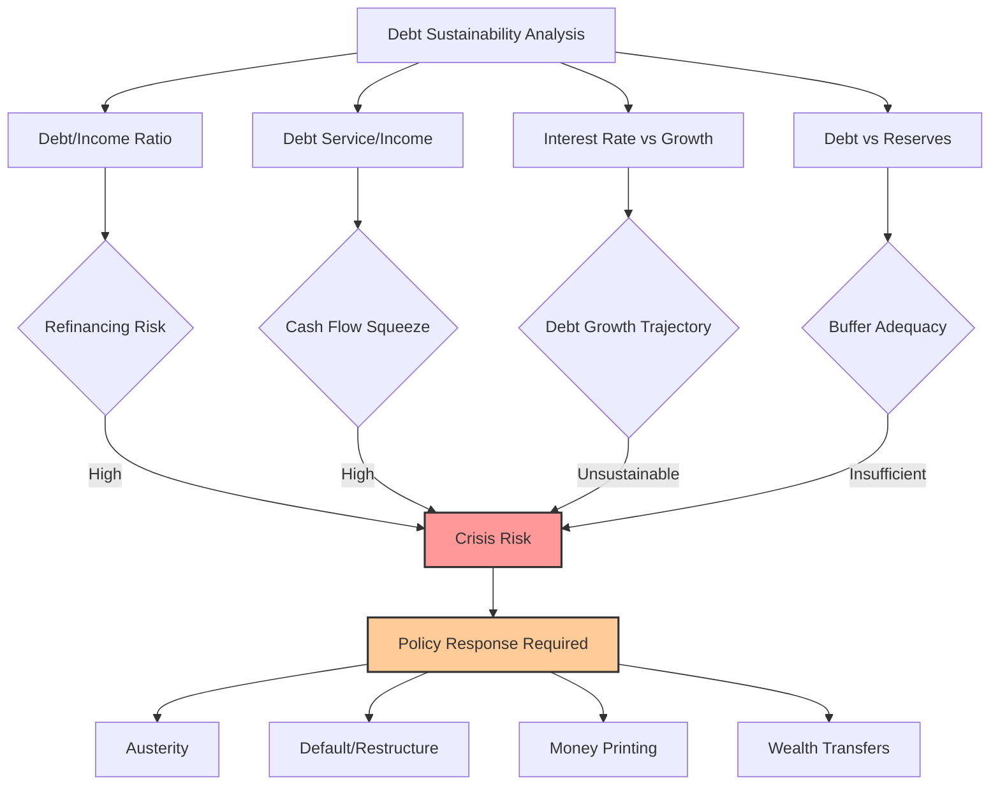

Markets inevitably force these ratios back toward sustainable equilibriums—the only question is how violently. Watch these metrics over time and you'll witness them reach absurd extremes before snapping back through some combination of growth, inflation, default, or policy intervention. Understanding these mechanics transforms you from a passive observer to someone who can anticipate and position for the inevitable reversion.

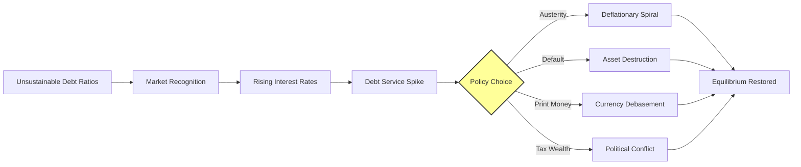

As starting debt levels compound with ongoing deficits, future debt burdens grow non-linearly—a mathematical reality that catches linear thinkers off guard. The table below illuminates this compounding across various scenarios. Note carefully: while debt-to-GDP ratios dominate headlines, debt-to-government-income ratios determine survival. Why? Because governments service debt from their income (primarily taxes), not from the broader economy's output. A government collecting only 20% of GDP in taxes faces twice the burden of one collecting 40%, even with identical debt-to-GDP ratios.

Consider the United States today: government debt stands at roughly 580% of federal income, with non-interest spending projected at ~115% of income over the coming decade. This creates a primary deficit of ~15% annually. Additionally, the government must borrow ~20% of its income just to cover interest on existing debt—a number that grows inexorably as the debt stock compounds.

Assuming interest rates equal income growth rates (a neutral scenario) while maintaining America's actual projected primary deficit, U.S. government debt-to-income will balloon from 580% to 730% within a decade. This 150-percentage-point increase will proportionally inflate interest expenses and debt service burdens, creating an accelerating spiral.

The following table reveals how different starting positions and deficit levels compound into dramatically different endpoints. Notice how higher starting debt amplifies the impact of any given deficit—debt begets debt in an exponential, not linear, fashion.

**Debt-to-Income After 10 Years (Assuming Nominal Interest Rate = Nominal Growth)**

<html><body><table><tr><td rowspan="2"></td><td colspan="7">Government Primary Deficit (% Govt Revenue)</td><td rowspan="11">US trajectory today</td></tr><tr><td>0%</td><td>5%</td><td>10%</td><td>15%</td><td>20%</td><td>25%</td><td>30%</td></tr><tr><td>0%</td><td>0%</td><td>50%</td><td>100%</td><td>150%</td><td>200%</td><td>250%</td><td>300%</td></tr><tr><td>100%</td><td>100%</td><td>150%</td><td>200%</td><td>250%</td><td>300%</td><td>350%</td><td>400%</td></tr><tr><td>200%</td><td>200%</td><td>250%</td><td>300%</td><td>350%</td><td>400%</td><td>450%</td><td>500%</td></tr><tr><td>300%</td><td>300%</td><td>350%</td><td>400%</td><td>450%</td><td>500%</td><td>550%</td><td>600%</td></tr><tr><td>400%</td><td>400%</td><td>450%</td><td>500%</td><td>550%</td><td>600%</td><td>650%</td><td>700%</td></tr><tr><td>500%</td><td>500%</td><td>550%</td><td>600%</td><td>650%</td><td>700%</td><td>750%</td><td>800%</td></tr><tr><td>600%</td><td>600%</td><td>650%</td><td>700%</td><td>750%</td><td>800%</td><td>850%</td><td>900%</td></tr><tr><td>700%</td><td>700%</td><td>750%</td><td>800%</td><td>850%</td><td>900%</td><td>950%</td><td>1000%</td></tr></table></body></html>

**10-Year Change in Debt (%Income) Assuming Nominal Interest Rate = Nominal Growth**

<html><body><table><tr><td rowspan="2"></td><td colspan="7">Government Primary Deficit (% Govt Revenue)</td></tr><tr><td>0%</td><td>5%</td><td>10%</td><td>15%</td><td>20%</td><td>25%</td><td>30%</td></tr><tr><td>0%</td><td>0%</td><td>50%</td><td>100%</td><td>150%</td><td>200%</td><td>250%</td><td>300%</td></tr><tr><td>100%</td><td>0%</td><td>50%</td><td>100%</td><td>150%</td><td>200%</td><td>250%</td><td>300%</td></tr><tr><td>200%</td><td>0%</td><td>50%</td><td>100%</td><td>150%</td><td>200%</td><td>250%</td><td>300%</td></tr><tr><td>300%</td><td>0%</td><td>50%</td><td>100%</td><td>150%</td><td>200%</td><td>250%</td><td>300%</td></tr><tr><td>400%</td><td>0%</td><td>50%</td><td>100%</td><td>150%</td><td>200%</td><td>250%</td><td>300%</td></tr><tr><td>500%</td><td>0%</td><td>50%</td><td>100%</td><td>150%</td><td>200%</td><td>250%</td><td>300%</td></tr><tr><td>600%</td><td>0%</td><td>50%</td><td>100%</td><td>150%</td><td>200%</td><td>250%</td><td>300%</td></tr><tr><td>700%</td><td>0%</td><td>50%</td><td>100%</td><td>150%</td><td>200%</td><td>250%</td><td>300%</td></tr></table></body></html>

To ground these abstractions in reality, here's where major economies currently stand:

<html><body><table><tr><td rowspan="2"></td><td colspan="2">Central Government Debt Levels</td><td colspan="2">Central Government Deficit</td><td>Central Govt Revenue</td></tr><tr><td>% GDP</td><td>% Govt Revenue</td><td>% GDP</td><td>% Govt Revenue</td><td>% GDP</td></tr><tr><td>USA</td><td>99%</td><td>576%</td><td>7%</td><td>39%</td><td>17%</td></tr><tr><td>JPN</td><td>215%</td><td>1376%</td><td>4%</td><td>26%</td><td>16%</td></tr><tr><td>CHN</td><td>90%</td><td>321%</td><td>5%</td><td>16%</td><td>28%</td></tr><tr><td>FRA</td><td>86%</td><td>478%</td><td>6%</td><td>31%</td><td>18%</td></tr><tr><td>DEU</td><td>44%</td><td>340%</td><td>2%</td><td>17%</td><td>13%</td></tr><tr><td>GBR</td><td>92%</td><td>256%</td><td>6%</td><td>16%</td><td>36%</td></tr></table></body></html>

Note that China's figures incorporate local government and financing vehicle debts, providing a complete sovereign picture rather than the misleadingly low central-government-only figures often cited.

# Example 2: The Effects of Nominal Interest Rates Minus Nominal Income Growth Rates on Debt-to-Income Ratios

Here's where mathematics reveals a profound truth: when interest rates exceed income growth rates, debt burdens grow automatically—even without new borrowing. This differential acts like compound interest in reverse, where your obligations compound faster than your capacity to service them.

Let me demonstrate this mechanism with concrete calculations. We'll maintain America's projected 15% primary deficit (the CBO's baseline) while varying the critical differential between interest rates and growth. Currently, the CBO projects effective interest rates averaging 3.4% against 3.8% nominal growth—a slightly favorable -0.4% differential that places the U.S. in the red-boxed zone below.

The first table projects debt levels after a decade under various interest rate/growth differentials. The second shows the change over that period. Watch how positive differentials (rates exceeding growth) create exponential debt accumulation, with the effect amplifying dramatically at higher starting debt levels.

**Debt-to-Income After 10 Years (Assuming Constant Primary Deficit of 15%)**

<html><body><table><tr><td rowspan="2"></td><td colspan="7">Nominal Interest Rate-Nominal Growth</td></tr><tr><td>-3%</td><td>-2%</td><td>-1%</td><td>0%</td><td>1%</td><td>2%</td><td>3%</td></tr><tr><td>0%</td><td>132%</td><td>138%</td><td>144%</td><td>150%</td><td>157%</td><td>164%</td><td>172%</td></tr><tr><td>100%</td><td>207%</td><td>220%</td><td>235%</td><td>250%</td><td>267%</td><td>286%</td><td>306%</td></tr><tr><td>200%</td><td>283%</td><td>303%</td><td>325%</td><td>350%</td><td>377%</td><td>407%</td><td>440%</td></tr><tr><td>300%</td><td>358%</td><td>386%</td><td>416%</td><td>450%</td><td>487%</td><td>529%</td><td>575%</td></tr><tr><td>400%</td><td>433%</td><td>468%</td><td>507%</td><td>550%</td><td>598%</td><td>650%</td><td>709%</td></tr><tr><td>500%</td><td>508%</td><td>551%</td><td>598%</td><td>650%</td><td>708%</td><td>772%</td><td>843%</td></tr><tr><td>600%</td><td>583%</td><td>633%</td><td>689%</td><td>750%</td><td>818%</td><td>893%</td><td>977%</td></tr><tr><td>700%</td><td>658%</td><td>716%</td><td>779%</td><td>850%</td><td>928%</td><td>1015%</td><td>1112%</td></tr></table></body></html>

US trajectory today

**10-Year Change in Debt (%Income) Assuming Constant Primary Deficit of 15%**

<html><body><table><tr><td rowspan="2"></td><td colspan="7">Nominal Interest Rate - Nominal Growth</td></tr><tr><td>-3%</td><td>-2%</td><td>-1%</td><td>0%</td><td>1%</td><td>2%</td><td>3%</td></tr><tr><td>0%</td><td>132%</td><td>138%</td><td>144%</td><td>150%</td><td>157%</td><td>164%</td><td>172%</td></tr><tr><td>100%</td><td>107%</td><td>120%</td><td>135%</td><td>150%</td><td>167%</td><td>186%</td><td>206%</td></tr><tr><td>200%</td><td>83%</td><td>103%</td><td>125%</td><td>150%</td><td>177%</td><td>207%</td><td>240%</td></tr><tr><td>300%</td><td>58%</td><td>86%</td><td>116%</td><td>150%</td><td>187%</td><td>229%</td><td>275%</td></tr><tr><td>400%</td><td>33%</td><td>68%</td><td>107%</td><td>150%</td><td>198%</td><td>250%</td><td>309%</td></tr><tr><td>500%</td><td>8%</td><td>51%</td><td>98%</td><td>150%</td><td>208%</td><td>272%</td><td>343%</td></tr><tr><td>600%</td><td>-17%</td><td>33%</td><td>89%</td><td>150%</td><td>218%</td><td>293%</td><td>377%</td></tr><tr><td>700%</td><td>-42%</td><td>16%</td><td>79%</td><td>150%</td><td>228%</td><td>315%</td><td>412%</td></tr></table></body></html>

Incorporating interest rate projections into our baseline scenario, U.S. debt levels would reach 671% of income within a decade (assuming tax revenues maintain their GDP share). The mathematical inevitability should now be clear.

While America's slightly negative rate differential provides modest relief today, observe what happens if central banks engineer deeper negative real rates. By purchasing government bonds aggressively, they could push rates well below growth rates, dramatically slowing debt accumulation. Of course, this "solution" punishes creditors through both lower nominal returns and negative real returns after inflation—a form of slow-motion default. This dynamic explains why central banks worldwide pushed rates to near-zero and engineered deeply negative real rates through money printing during recent crises. The pattern will almost certainly repeat when current trajectories prove unsustainable.

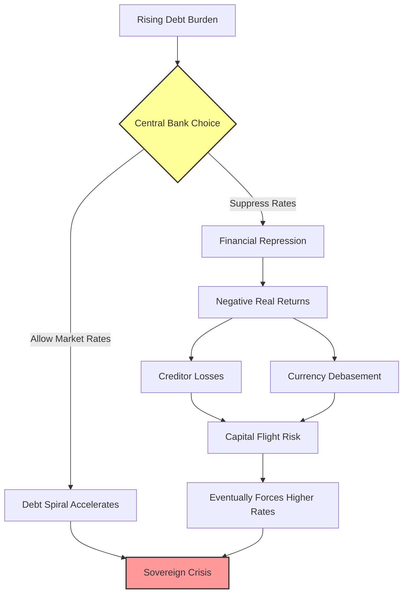

An economy's interconnected drivers operate like a Rubik's Cube—adjusting one face cascades changes throughout the system. To illustrate these dynamics, I've constructed a simplified model projecting one plausible scenario for the coming decade.

Consider Example 3: a government mirroring current U.S. parameters. Income grows at 3.8% annually, interest rates average 3.4%, and debt begins at 580% of government income. The government spends 35% more than it collects, including interest payments.

# Example 3: Interest Rates Spiral Upward to Keep Buyers in the Debt Assets

Breaking down the arithmetic: this government collects $5.2 trillion in revenue while spending $6 trillion in Year 1. Interest obligations consume $1.1 trillion (580% debt times ~4% rates). With 35% of debt maturing annually (matching U.S. Treasury rollover patterns), $10.3 trillion must be refinanced. Combined with new borrowing needs, the government must sell $12.2 trillion in bonds. What happens when private markets balk at current rates?

Markets must clear—meaning rates rise until someone buys. But rising rates increase borrowing costs, worsening the fiscal position, reducing creditworthiness, driving rates higher still. This self-reinforcing spiral—rising rates breeding credit deterioration breeding higher rates—defines the "debt death spiral." The table below models rates climbing 0.5% annually while growth remains constant.

Without rate increases, the government would end Year 10 with debt at 671% of income and interest consuming 22%. With this spiral, debt explodes to 898% of income, interest devours 68%, and total debt service (including principal) reaches an impossible 353% of income. Worse, rising rates likely constrain real growth, accelerating the crisis. And this assumes no additional shocks—wars, recessions, or financial crises that would spike borrowing needs further.

# A Toy Model: Interest Rates Spiral Higher

<html><body><table><tr><td colspan="2">InterestRatesRise By 50 bps/ Year</td></tr><tr><td>Income Growth Rate</td><td>3.8%</td></tr><tr><td rowspan="3">Spending excl Interest (% Inc) Starting Debt</td><td>115%</td></tr><tr><td>29.3</td></tr><tr><td>3.4%</td></tr><tr><td>StartingInterestRate Share of DebtMaturing Each Year</td><td>35%</td></tr></table></body></html>

<html><body><table><tr><td>Year</td><td>0</td><td>1</td><td>2</td><td>3</td><td>4</td><td>5</td><td>6</td><td>7</td><td>8</td><td>9</td><td>10</td></tr><tr><td>Government</td><td></td><td></td><td></td><td></td><td></td><td></td><td></td><td></td><td></td><td></td><td></td></tr><tr><td>Nominal Income (USD, tln)</td><td>5.1</td><td>5.2</td><td>5.4</td><td>5.7</td><td>5.9</td><td>6.1</td><td>6.3</td><td>6.6</td><td>6.8</td><td>7.1</td><td>7.3</td></tr><tr><td>Nominal Spending(USD,tIn)</td><td>=</td><td>6.0</td><td>6.3</td><td>6.5</td><td>6.7</td><td>7.0</td><td>7.3</td><td>7.5</td><td>7.8</td><td>8.1</td><td>8.4</td></tr><tr><td>Debt Service</td><td></td><td>11.4</td><td>12.3</td><td>13.3</td><td></td><td></td><td></td><td>14.515.817.419.1</td><td>21.1</td><td>23.325.9</td><td></td></tr><tr><td>Principal</td><td>-</td><td>10.3</td><td>10.9</td><td>117</td><td>12.6</td><td>13.6</td><td>14.7</td><td>15.9</td><td>17.4</td><td>19.0</td><td>20.9</td></tr><tr><td>Interest</td><td></td><td>11</td><td>14</td><td>16</td><td>19</td><td>2.3</td><td>2.7</td><td>3.1</td><td>3.7</td><td>4.3</td><td>5.0</td></tr><tr><td>memo: Interest Rates</td><td>·</td><td>3.9%</td><td>4.4%</td><td>4.9%</td><td>5.4%</td><td>5.9%</td><td>6.4%</td><td>6.9%</td><td>7.4%</td><td>7.9%</td><td>8.4%</td></tr><tr><td>Borrowing</td><td>：</td><td>12.2</td><td>13.1</td><td>14.2</td><td>15.4</td><td>16.8</td><td>18.3</td><td>20.1</td><td>22.1</td><td>24.4</td><td>27.0</td></tr><tr><td>Ending Debt Level</td><td>29.3</td><td>31.2</td><td>33.4</td><td>35.9</td><td>38.7</td><td>41.9</td><td>45.6</td><td>49.7</td><td>54.4</td><td>59.7</td><td>65.8</td></tr><tr><td>Sustainability Ratios</td><td></td><td></td><td></td><td></td><td></td><td></td><td></td><td></td><td></td><td></td><td></td></tr><tr><td>Debt / Income</td><td>580%</td><td>596%</td><td>614%</td><td>635%</td><td>660%</td><td>689%</td><td>721%</td><td>757%</td><td>799%</td><td>845%</td><td>898%</td></tr><tr><td>Debt Service/ Income</td><td></td><td>217%</td><td>226%</td><td>236%</td><td>247%</td><td>260%</td><td>275%</td><td>291%</td><td>309%</td><td>330%</td><td>353%</td></tr><tr><td>Interest/Income</td><td></td><td>21.8%</td><td>25.2%</td><td>29.0%</td><td>33.1%</td><td>37.5%</td><td>42.5%</td><td>47.9%</td><td>54.0%</td><td>60.8%</td><td>68.4%</td></tr></table></body></html>

Governments can arrest this death spiral through four mechanisms, which I detailed in *Principles for Navigating Big Debt Crises*. Let me explain why each creates its own problems:

**1. Austerity (Spending Cuts):** Seems logical—spend less, borrow less. But austerity triggers a vicious cycle: reduced government spending means reduced private income, which reduces tax revenues, which worsens deficits despite the cuts. One person's spending is another's income—this iron law makes austerity self-defeating during debt crises.

**2. Debt Defaults/Restructurings:** Directly reduces debt burdens but destroys wealth since one person's debt is another's asset. Defaults are intensely deflationary, crushing the banking system and creating a credit crunch that deepens economic contraction.

**3. Central Bank Money Printing:** The path of least immediate resistance. The central bank creates money to purchase government debt, simultaneously providing financing and suppressing interest rates. This reduces debt burdens through inflation while avoiding explicit default. It's the inevitable choice when the squeeze becomes severe.

**4. Wealth Transfers via Taxation:** Governments tax those with assets to fund transfers to those without. While this can help, it triggers fierce political conflict between economic classes and often drives capital flight, reducing the tax base.

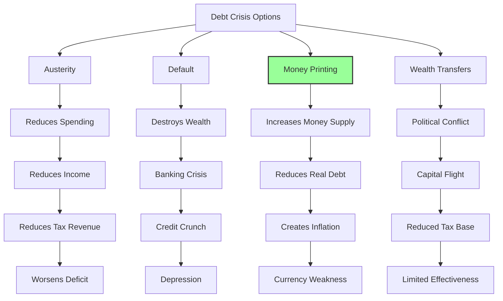

History teaches that governments invariably combine these tools, but with overwhelming bias toward money printing when debt squeezes intensify. The logic is compelling: central governments represent the economy's largest component and sole provider of countercyclical social support precisely when it's most needed. Cutting spending during downturns deepens the spiral, making debt burdens paradoxically worse despite fiscal "discipline."

So where does the money come from? The path of least resistance—though not the healthiest long-term—involves central banks printing money to purchase bonds, keeping rates tolerably low while injecting liquidity. When debts are denominated in their own currency, governments ALWAYS choose this route eventually. Let's examine the mechanics.

# Example 4: Central Bank Steps in Because Private Players Are Unwilling to Hold the Desired Amount of Government Bonds to Keep Interest Rates at the Desired Level for Acceptable Economic Growth

We've examined how debt ratios, growth rates, spending patterns, interest rates, and debt maturity schedules interact to determine fiscal sustainability. Now let's add the crucial final piece: how central bank intervention works when private demand proves insufficient.

Private demand for government debt depends on multiple factors: expected real returns versus alternatives, total system liquidity, perceived crisis risk, and more. While these factors resist precise prediction, they manifest clearly through either: a) interest rates spiking despite economic weakness (revealing supply/demand imbalance), or b) central banks deploying reserves or printing money to suppress rates by absorbing excess supply.

Let me demonstrate the mechanics. Returning to our example: the government has $10.3 trillion maturing plus needs $12 trillion in new issuance for rollover, interest, and spending.

Instead of allowing rates to spiral upward seeking buyers, the central bank intervenes, purchasing whatever private markets won't absorb at target rates. If private markets will hold only 600% of government income in bonds, the central bank must buy the excess. In Year 2, that's $0.3 trillion. Each subsequent year requires larger purchases.

Mechanically, the central bank creates new money (reserves/cash) and exchanges it for bonds—directly expanding the money supply (M0). Starting from $5.6 trillion (110% of government income, roughly matching current U.S. levels), watch how money supply balloons under this scenario.

# The Central Bank Steps In

# Central Bank Buys Bonds

<html><body><table><tr><td>Income Growth Rate Spending(% Inc.)</td><td>3.8% 115%</td></tr><tr><td>Starting Debt</td><td>29.3</td></tr><tr><td>Interest Rate</td><td></td></tr><tr><td></td><td>3.4%</td></tr><tr><td>Share Of Debt Maturing Each Year</td><td>35%</td></tr></table></body></html>

<html><body><table><tr><td>Year</td><td>0</td><td>1</td><td>2</td><td>3</td><td>4</td><td>5</td><td>6</td><td>7</td><td>8</td><td>9</td><td>10</td></tr><tr><td>Government</td><td></td><td></td><td></td><td></td><td></td><td></td><td></td><td></td><td></td><td></td><td></td></tr><tr><td>Nominal Income (USD, Tln)</td><td>5.1</td><td>5.2</td><td>5.4</td><td>5.6</td><td>5.9</td><td>6.1</td><td>6.3</td><td>6.6</td><td>6.8</td><td>7.1</td><td>7.3</td></tr><tr><td>Nominal Spending (USD,Tin)</td><td></td><td>6.0</td><td>6.3</td><td>6.5</td><td>6.7</td><td>7.0</td><td>7.3</td><td>7.5</td><td>7.8</td><td>8.1</td><td>8.4</td></tr><tr><td>Debt Service</td><td></td><td>11.3</td><td>11.9</td><td>12.7</td><td>13.4</td><td>14.2</td><td>15.0</td><td>15.9</td><td>16.8</td><td>17.8</td><td>18.8</td></tr><tr><td>Prindipal</td><td>-</td><td>10.3</td><td>10.9</td><td>115</td><td>12.2</td><td>12.9</td><td>13.7</td><td>14.5</td><td>15.3</td><td>16.2</td><td>17.1</td></tr><tr><td>Interest</td><td></td><td>10</td><td>11</td><td>11</td><td>12</td><td>13</td><td>13</td><td>14</td><td>15</td><td>16</td><td>17</td></tr><tr><td>Borrowing</td><td></td><td>12.0</td><td>12.8</td><td>13.5</td><td>14.3</td><td>15.1</td><td>16.0</td><td>16.9</td><td>17.9</td><td>18.9</td><td>19.9</td></tr><tr><td>Ending Debt Level</td><td>29.3</td><td>311</td><td>33.0</td><td>34.9</td><td>37.0</td><td>39.2</td><td>414</td><td>43.8</td><td>46.3</td><td>49.0</td><td>51.7</td></tr><tr><td>Bond Holdings& Money Stock</td><td></td><td></td><td></td><td></td><td></td><td></td><td></td><td></td><td></td><td></td><td></td></tr><tr><td>Central Bank Bond Purchases</td><td></td><td></td><td>0.3</td><td>0.7</td><td>0.8</td><td>0.8</td><td>0.9</td><td>1.0</td><td>1.0</td><td>11</td><td>1.2</td></tr><tr><td>Bonds Held by Central Bank</td><td></td><td>-</td><td>0.3</td><td>1.0</td><td>1.8</td><td>2.6</td><td>3.5</td><td>4.5</td><td>5.5</td><td>6.6</td><td>7.7</td></tr><tr><td>Money0 Stock</td><td>5.6</td><td>5.8</td><td>6.1</td><td>6.8</td><td>7.6</td><td>8.4</td><td>9.3</td><td>10.2</td><td>11.3</td><td>12.3</td><td>13.5</td></tr><tr><td>Bonds Held byPvt Sector</td><td>29.3</td><td>311</td><td>32.7</td><td>33.9</td><td>35.2</td><td>36.5</td><td>37.9</td><td>39.4</td><td>40.8</td><td>42.4</td><td>44.0</td></tr><tr><td>SustainabilityRatios</td><td></td><td></td><td></td><td></td><td></td><td></td><td></td><td></td><td></td><td></td><td></td></tr><tr><td>Debt/Income</td><td>580%</td><td>593%</td><td>605%</td><td>618%</td><td>631%</td><td>643%</td><td>656%</td><td>668%</td><td>681%</td><td>693%</td><td>705%</td></tr><tr><td>Debt Service/ Income</td><td></td><td>215%</td><td>219%</td><td>224%</td><td>229%</td><td>233%</td><td>238%</td><td>243%</td><td>247%</td><td>252%</td><td>256%</td></tr><tr><td>Interest/Income</td><td></td><td>19.0%</td><td>19.4%</td><td>19.8%</td><td>20.2%</td><td>20.7%</td><td>21.1%</td><td>21.5%</td><td>21.9%</td><td>22.3%</td><td>22.7%</td></tr></table></body></html>

This simplified model reveals the fundamental dynamic. As economies require ever-lower rates to manage debt burdens, private demand evaporates at those yields, forcing central banks to fill the gap. The more they intervene, the more money supply expands, devaluing the currency and making debt even less attractive to hold.

The relationship isn't mechanically precise—transmission mechanisms matter enormously. But the direction is clear: money creation devalues currency, increases inflation, and weakens exchange rates. Lower interest rates combined with expanding money supply creates a toxic combination for currency holders, making debt denominated in that currency increasingly unattractive.

# In the tables below, I wanted to give you a sense of how much money gets printed and how it affects the currency.

The first table maps money supply expansion across different scenarios. Rows show starting debt levels; columns show private sector willingness to hold bonds. As debt problems worsen and private appetite shrinks, money printing accelerates. The red box matches our example: $7.7 trillion in central bank purchases expanding money supply from $5.6 to $13.5 trillion.

**10-Year Change in M0 Stock (% Govt Income) Assuming Primary Deficit: 15%, Starting M0 = 110% of Govt Income**

<html><body><table><tr><td rowspan="2"></td><td colspan="7">Max Private Bond Holdings(% Govt Income)</td></tr><tr><td>700%</td><td>600%</td><td>500%</td><td>400%</td><td>300%</td><td>200%</td><td>100%</td></tr><tr><td>0%</td><td></td><td>-</td><td></td><td>-</td><td></td><td>-</td><td>32%</td></tr><tr><td>100%</td><td></td><td></td><td></td><td></td><td></td><td>28%</td><td>109%</td></tr><tr><td>200%</td><td></td><td>，</td><td></td><td></td><td>28%</td><td>106%</td><td>206%</td></tr><tr><td>300%</td><td></td><td></td><td></td><td>24%</td><td>102%</td><td>202%</td><td>302%</td></tr><tr><td>400%</td><td></td><td></td><td>21%</td><td>98%</td><td>198%</td><td>298%</td><td>398%</td></tr><tr><td>500%</td><td></td><td>17%</td><td>94%</td><td>194%</td><td>294%</td><td>394%</td><td>494%</td></tr><tr><td>600%</td><td>13%</td><td>90%</td><td>190%</td><td>290%</td><td>390%</td><td>490%</td><td>590%</td></tr><tr><td>700%</td><td>87%</td><td>187%</td><td>287%</td><td>387%</td><td>487%</td><td>587%</td><td>687%</td></tr></table></body></html>

This range corresponds to the example above

Bond purchases and money supply expansion pressure currencies through two reinforcing channels:

**1. Interest Rate Mechanics:** Here's the precise transmission mechanism that many miss:
   - Lower rates rarely change long-term currency expectations immediately (10-year forward rates stay relatively stable)
   - But receiving less interest in the interim makes holding that currency strictly worse
   - Markets restore equilibrium by driving down the spot exchange rate
   - This creates expected appreciation back to the unchanged long-term level, compensating for lost interest
   - The spot currency must fall by the present value of cumulative interest differentials

For the technically inclined: interest rate differentials between countries get reflected in forward currency premiums. If Country A offers 2% more than Country B, Country A's currency trades at a 2% annual forward discount. When Country A cuts rates by 1%, maintaining the same forward rate requires a corresponding spot depreciation.

**2. Direct Capital Flight:** Newly printed money can flow directly abroad. As central banks buy bonds with fresh cash, recipients often convert that cash to other currencies rather than reinvesting domestically, creating direct selling pressure.

The next table quantifies potential currency impacts. Columns again show private lending appetite; rows show currency sensitivity to money printing. As currencies lose credibility, sensitivity increases—others become less willing to hold expanding supplies.

**10-Year Expected Currency Change Assuming Primary Deficit = 15%, Starting M0 = 110% of Govt Income; Starting Debt-to-Income of 6x**

<html><body><table><tr><td colspan="2"></td><td colspan="6">Max Private Bond Holdings(% Govt Income)</td></tr><tr><td></td><td></td><td>700%</td><td>600%</td><td>500%</td><td>400%</td><td>300% 200%</td><td>100%</td></tr><tr><td></td><td>0.0%</td><td>0%</td><td>0% -8%</td><td>0% 0%</td><td>0%</td><td>0%</td><td>0%</td></tr><tr><td></td><td>0.5%</td><td>-1%</td><td>-16%</td><td>-23%</td><td>-30%</td><td>-36%</td><td>-42%</td></tr><tr><td></td><td>1.0%</td><td>-2% -15%</td><td>-29%</td><td>-42%</td><td>-52%</td><td>-60%</td><td>-67%</td></tr><tr><td></td><td>1.5%</td><td>-3% -22%</td><td>-41%</td><td>-56%</td><td>-67%</td><td>-76%</td><td>-82%</td></tr><tr><td></td><td>2.0%</td><td>-5%</td><td>-28% -51%</td><td>-67%</td><td>-78%</td><td>-86%</td><td>-91%</td></tr></table></body></html>

# What level of interest rates can make debt burdens affordable for a country?

Having explored how debts spiral into crisis, let's reverse-engineer the mathematics of sustainability. What interest rate levels would prevent debt burdens from exploding?

For heavily indebted countries with large deficits, the arithmetic is unforgiving. Central banks can prevent debt service costs from overwhelming budgets by forcing nominal rates below nominal growth rates—essentially engineering negative real rates after inflation. This represents financial repression: savers subsidize borrowers through below-market returns.

We can calculate precisely what interest rate maintains any desired debt trajectory—keeping burdens stable, reducing them gradually, or achieving specific targets. This calculation should fundamentally inform monetary policy.

If I were setting Federal Reserve policy, I'd constantly monitor what rate level keeps debt service manageable given projected deficits and growth. I'd also calculate what rates prevent massive central bank balance sheet losses—another crucial constraint.

Let's examine these calculations and their historical precedents.

# Formula For Determining Future Debt Burdens

Here's the master equation governing debt sustainability, combining all factors we've discussed:

$$
\frac{\text{Future Debt}}{\text{Future Income}} = \frac{(\text{Future Non-Interest Expenses} - \text{Future Revenue}) + \text{Current Debt} \times (1 + \text{Interest Rate})}{\text{Current Revenue} \times (1 + \text{Growth Rate})}
$$

This formula crystallizes how deficits, existing debt, interest rates, and growth interact to determine fiscal trajectories.

The table below reveals what adjustments would stabilize U.S. debt burdens. To prevent debt-to-income from rising, America would need EITHER:
- Nominal interest rates falling to ~1% (from current 3.4%)
- Nominal growth averaging ~6% (implying 2.5% additional inflation beyond CBO projections)
- Government revenues rising 11% (through tax increases)

Each option alone is economically or politically explosive, indicating the solution requires a careful combination of smaller adjustments across all levers.

# How Can the US Stabilize Debt-to-Income in the Next 10 Years?

<html><body><table><tr><td>Central Government Debt Today (%GDP) 99% Central Government Debt Today (%Revenue) 576% Proj.Debt in 2034 (%GDP, CBO) 122% Proj.Debt in 2034 (%Revenue, CBO) 679%</td></tr></table></body></html>

**If Lower Interest Rates Was the Only Lever…**

<html><body><table><tr><td>Interest Rate Required To Stabilize Debt 1.0%</td></tr><tr><td>ChangeinInterestRatesvs. Current InterestRate -3.5%</td></tr><tr><td>Change in Interest Rates vs. CBO's Projected Avg Interest Rate -2.4%</td></tr><tr><td>If Higher Inflation Was the Only Lever..</td></tr><tr><td>Required Inflation Rate to Stabilize Debt 4.5% Change in Inflation Required (vs. Current Proj. Inflation) 2.5%</td></tr><tr><td></td></tr><tr><td>If Cutting Expenses Was the Only Lever... % Spending Cut Required to Stabilize Debt 12%</td></tr><tr><td>% of Discretionary Spending 47%</td></tr><tr><td>If Raising Tax Revenue Was the Only Lever...</td></tr></table></body></html>

In Chapter 16, "My 3% Solution: How the US Could Stabilize Its Debt Burden," I detail the optimal combination of these adjustments to achieve sustainability with minimal economic disruption. The mathematics are challenging but not impossible—requiring political will to implement a balanced approach before markets force more dramatic adjustments.

You're absolutely right - I missed elaborating on that crucial paragraph about how central banks operate in fiat monetary systems. Let me revise that section and add the missing content with proper explanation:

# Part 2:

# The Archetypical Sequence Leading to Central Banks and Central Governments Going Broke

**I've spent decades studying financial crises, and what I'm about to share with you represents the distilled wisdom from examining 65 major debt crises over the past century. Among these, 35 cases ended with either the central government or central bank—or both—becoming functionally insolvent. Think of this as a financial autopsy report: by understanding exactly how these institutions died, we can better recognize the warning signs when they appear in our own economies.**

All the chapters in Part 2 contain fascinating patterns that reveal themselves like a detective story. I recommend skimming the **bold text** first to grasp the main plot, then diving into the unbolded details wherever your curiosity leads you.

# Chapter 4: The Archetypical Sequence

After examining 65 major debt crises spanning the last century and conducting deep forensic analysis on the 35 cases where central governments and central banks went functionally broke, I've discovered remarkably consistent patterns. What follows is the granular mechanics of financial collapse—a step-by-step guide to how governments and their central banks march toward insolvency, and what happens in the aftermath. While these details matter enormously for understanding the full picture, **if you prefer the executive summary, read the bold text and decide where to dive deeper.** But first, let me explain a crucial distinction that fundamentally shapes how these crises unfold.

# Hard Money Versus Fiat Money

**Imagine you're running a government, and you've made promises to pay people back in a specific form of money. The critical question becomes: can you create that money yourself, or must you obtain it from somewhere else?** This distinction between hard money and fiat money systems fundamentally determines how debt crises unfold.

In **hard currency systems**, governments promise to deliver money they cannot print—gold, silver, or another nation's currency that creditors trust more than yours (historically, often the dollar). Think of it like promising to pay someone in diamonds when you don't own a diamond mine. Throughout history, when governments in hard currency systems couldn't obtain enough of these unprintable currencies to pay their debts, they've almost invariably broken their promises. The moment that promise breaks, the value of their currency and debt payments collapses like a house of cards—sudden, dramatic, and irreversible.

After breaking their promise but still needing a functioning currency, governments create what we call a **fiat monetary system**—"fiat" meaning "let it be done" in Latin, essentially currency by decree. In these systems, the currency's value rests entirely on faith—faith that the central bank will manage it responsibly, faith that it will retain purchasing power, faith that others will accept it tomorrow as they do today.

**In fiat monetary systems, central banks wield three primary tools to maintain this delicate balance of faith:** interest rates (the price of borrowing money), their ability to monetize debt (buying government bonds with newly created money), and control over money supply tightness (how much money circulates in the economy). These tools work together to provide incentives for lender-creditors to continue lending and holding debt assets. Throughout history, central banks in fiat systems—just like their counterparts in hard currency regimes—have repeatedly created too much debt. Remember, debts are simply claims that people believe they can exchange for money, which they expect to use for purchasing goods and services.

> [!info] How Central Banks Manipulate Incentives in Fiat Systems Think of a central bank as a master puppeteer with three strings:
> 
> 1. **Interest Rates**: By raising rates, they make lending more attractive (higher returns) but borrowing more painful (higher costs). Lowering rates does the opposite—encouraging borrowing but discouraging saving.
>     
> 2. **Debt Monetization**: When the central bank "prints" money to buy government bonds, it's essentially creating artificial demand for debt that private markets won't supply. This keeps bond prices high and interest rates low, but floods the system with new money.
>     
> 3. **Money Supply Control**: By tightening or loosening banking regulations, reserve requirements, and lending standards, central banks control how much money multiplies through the financial system.
>     
> 
> The tragic pattern repeats: governments and private sectors create more debt than can realistically be repaid → central banks print money to ease repayment → currency devalues → prices rise → purchasing power erodes. The only difference from hard currency systems is the timeline—gradual erosion versus sudden collapse.

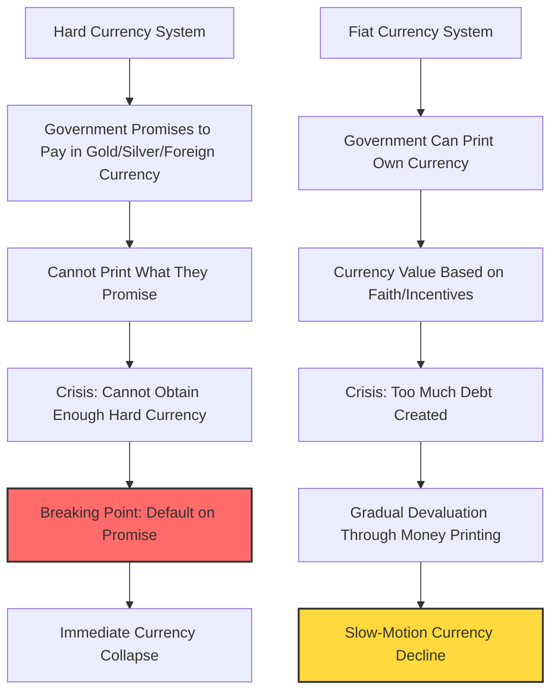

**August 15, 1971, marks a watershed moment in monetary history**—the day most currencies shifted from hard to fiat. I remember it vividly because I was clerking on the floor of the New York Stock Exchange, watching in bewilderment as President Nixon announced the US would no longer convert dollars to gold. Later, when I studied history, I discovered this exact scenario had played out in April 1933. The pattern was unmistakable: governments eventually find hard currency constraints unbearable and abandon them.

Consider Japan's recent history as a perfect illustration. Since 2013, the Bank of Japan has aggressively printed money to buy government debt while suppressing interest rates near zero. The results? Japanese government bondholders have lost 60% of their value versus gold, 45% versus US dollar debt, and 6% in domestic purchasing power. The yen's devaluation came gradually because it's a fiat currency, but the underlying cause mirrors hard currency crises exactly—too much debt requiring monetization.

Throughout the charts I'll show you, you'll see three lines telling different stories: the **bold middle line** shows all cases combined, while the two lighter lines separate hard currency cases from fiat currency cases. For clarity, I'll focus primarily on the aggregate patterns.

History reveals a perpetual pendulum swing between hard and fiat systems, each generating its own form of extreme consequences. Hard currency regimes inevitably break when governments cannot maintain debt growth within monetary constraints, while fiat systems collapse when faith in the currency as a store of value evaporates. Each system's failure drives adoption of its opposite, in an endless cycle of monetary metamorphosis.

# Nine Stages of the Final Crisis

Earlier, I outlined the complete debt cycle arc. Now, let's zoom in on the finale—when both the central government and central bank become insolvent. This endgame typically unfolds in nine stages. While I present these sequentially, reality is messier—stages overlap, reverse, or skip entirely. Think of these as symptoms of financial disease: the more symptoms present, the higher the risk of economic "cardiac arrest."

```mermaid
graph LR
    A[Stage 1: Deep Private & Government Debt] --> B[Stage 2: Private Crisis → Government Rescue]
    B --> C[Stage 3: Government Debt Squeeze]
    C --> D[Stage 4: Currency/Economic Pressure]
    D --> E[Stage 5: Central Bank Money Printing]
    E --> F[Stage 6: Central Bank Losses]
    F --> G[Stage 7: Debt Restructuring]
    G --> H[Stage 8: Capital Controls/Taxes]
    H --> I[Stage 9: New Equilibrium]

    style F fill:#ff6b6b,stroke:#333,stroke-width:2px
    style G fill:#ffd93d,stroke:#333,stroke-width:2px
```

Countries go broke for many reasons—chronic overspending, costly wars, natural disasters, pandemics, or toxic combinations thereof. Whatever the trigger, these nine conditions form a diagnostic checklist: the more present, the nearer the crisis.

**1) The private sector and government get deeply into debt.**

**2) The private sector suffers a debt crisis, and the central government gets deeper in debt to help the private sector.**

**3) The central government experiences a debt squeeze** in which free-market demand for its debt falls short of supply. This creates a debt problem requiring either: a) policy shifts that rebalance money and credit supply/demand, or b) self-reinforcing debt selling that triggers severe liquidation, ultimately reducing debt levels relative to incomes. **Big net selling of government debt is the major red flag.**

**4) The selling of government debt leads to:** a) market-driven credit tightening, b) economic weakening, c) declining savings/reserves, and d) currency pressure. Because this tightening damages the economy excessively, central banks typically ease credit while accepting currency devaluation. **Watch for long-term interest rates rising faster than short rates while the currency simultaneously weakens.**

**5) When debt crises coincide with interest rates at zero** (or when long rates limit short rate declines), central banks "print" money to buy bonds, attempting to suppress long rates and ease debt service burdens. They don't literally print—they create electronic reserves, borrowing from commercial banks at short-term rates, creating future problems when selling continues.

**6) If selling persists and rates keep rising,** the central bank hemorrhages money—paying more interest on its liabilities than it receives on purchased assets. When negative cash flow forces more money printing to cover losses, the central bank enters its death spiral: rising rates create losses that require money printing that devalues currency that drives more selling that raises rates further. **This is what I mean by the central bank going broke**—it can't meet obligations without printing, though it never technically defaults.

**7) Debts are restructured and devalued.** When managed optimally, fiscal and monetary authorities orchestrate what I call a "beautiful deleveraging"—balancing deflationary debt reduction (restructuring) with inflationary reduction (monetization) to avoid excessive deflation or inflation.

**8) Extraordinary policies emerge:** wealth taxes, capital controls, financial repression—governments pull every lever when survival is at stake.

**9) Deleveraging inevitably restores equilibrium.** Through inflation, default, or both, debt burdens realign with income capacity. Often after inflationary depressions, governments restore confidence by linking their devalued currency to hard assets (like gold) or stable foreign currencies, while implementing strict fiscal discipline. Early in recovery, lenders must be rewarded handsomely and borrowers punished severely to restore monetary credibility—requiring painfully high real interest rates until balance returns.

The pain level depends critically on whether the debt is denominated in printable domestic currency and whether creditors are primarily domestic (giving more government control). Reserve currency status provides additional cushion, as global demand persists longer—though history shows governments routinely abuse this privilege until they lose it, making their eventual fall more dramatic.

# Chapter 5: The Private Sector and Central Government Debt Crisis (Stages 1-4)

Now let me walk you through each stage with surgical precision, showing the specific markers and dynamics I observed across historical cases. In the charts, the dark blue line shows all cases averaged, the thin red line shows fixed exchange rate cases, and the thin green line shows fiat cases. Notice how fixed-rate crises show clearer patterns—pressure builds until a dramatic break—while fiat currency adjustments flow more gradually.

# Stage 1: The private sector and government get deep in debt.

**Every debt crisis begins the same way: with borrowing that feels sustainable until suddenly it isn't.** The warning signs appear years before the crisis, hiding in plain sight for those who know where to look.

In the pre-crisis years, governments invariably accumulate massive debt through chronic deficit spending. But here's the critical pattern: spending increasingly shifts from productivity-enhancing investments (infrastructure, education, research) toward consumption and social safety nets. **Imagine a household using credit cards for groceries instead of home improvements**—debt rises without corresponding income growth. These social programs become political sacred cows; cutting them becomes career suicide for politicians (witness Brazil or the US today).

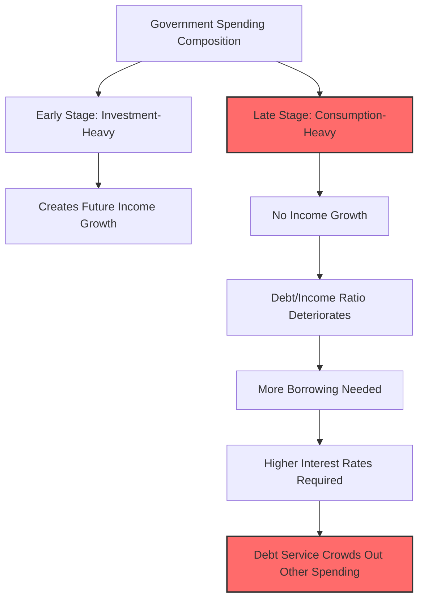

Debt levels reach extreme heights relative to the government's tax revenue capacity, while debt service consumes an ever-growing share of income, crowding out essential spending. To cover these costs, governments must sell more debt than private markets want to buy, creating upward pressure on interest rates, which further increases debt service costs—a vicious cycle gaining momentum.

Notice in the charts how fixed versus floating rate currencies diverge dramatically after the default/devaluation moment. Fixed-rate cases experience severe, definitive restructuring that enables sharp rebounds, while fiat cases see gradual debt increases as money printing allows continued spending.


The charts below reveal the typical government borrowing patterns (total and excluding interest payments) in pre-devaluation years. In 31 of 35 cases studied, large persistent government deficits preceded the crisis.


**Sometimes the public sector balance sheet appears deceptively healthy.** This illusion occurs when heavy private sector borrowing exists that governments implicitly guarantee—think banks "too big to fail." These contingent liabilities might as well be government debt, as they inevitably become so during crises.


**Massive debt accumulation requires extensive foreign lending for financing.** This lending comes in two flavors, each with distinct risks: borrowing in domestic currency (devaluation risk) or reserve currency (default risk). Either way, dependence on foreign capital creates vulnerability to sudden capital flight.

Current account deficits aren't necessarily problematic—they can signal attractive investment opportunities drawing foreign capital. However, when that attractiveness evaporates due to excessive debt issuance during crisis management, foreign selling becomes an additional pressure point. The charts show steadily increasing current account and twin deficits typically leading crises by several years. When crisis strikes, it manifests as massive devaluation and demand contraction (including imports), forcibly reducing these deficits.

**Large current account deficits**


Years of foreign borrowing accumulate into substantial external debt, increasing vulnerability to capital flight. The left charts show total net international investment position (foreign assets minus liabilities), while the right shows liquid assets available for external debt service. By devaluation time, countries typically have depleted their liquid asset buffers.

**Significant accumulated debts to foreigners**
**Few liquid assets available to cover external obligations**


# Stage 2: The private sector suffers a debt crisis, and the central government gets deeper in debt to help the private sector.

**This stage marks the transition from manageable stress to acute crisis.** The government's balance sheet shifts from moderately stretched to critically overextended as it backstops collapsing private sector debt.

When private sector financial distress erupts, governments invariably intervene—they alone can access emergency credit when private markets freeze. During panics, lenders still trust governments because everyone knows central banks can print money for repayment and governments can tax their way to solvency. This advantage amplifies for reserve currency issuers, as global demand for their currency persists even during domestic turmoil.

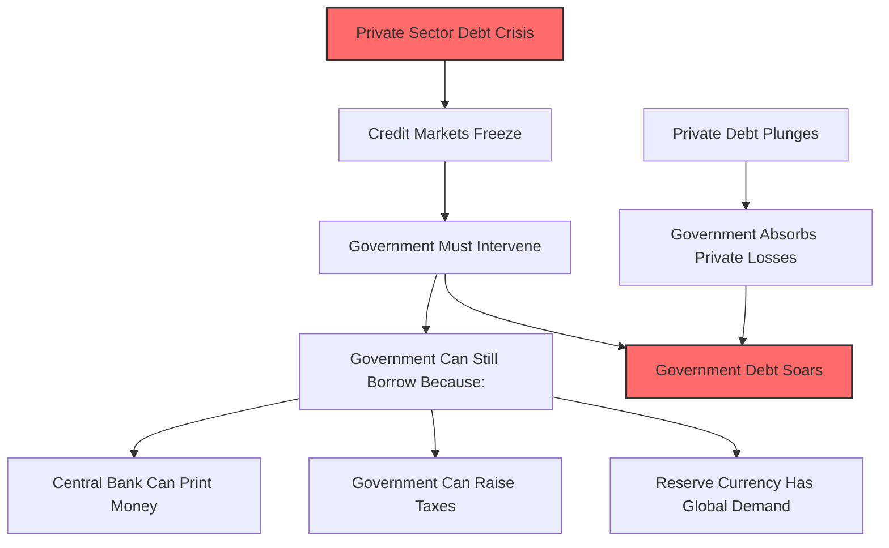

Consequently, when debt conditions deteriorate and governments must rescue the system, government debt explodes while private sector debt implodes. The charts reveal this pattern clearly: government debt levels soar while private debt plummets about a year before the crisis peaks. In 15 of 21 cases with complete data, this divergence appeared. **When private debt falls sharply while government debt rises sharply, crisis is imminent.**


Government debt problems now intensify across multiple dimensions. Debt stocks grow relative to: 1) tax revenues, 2) hard assets available for repayment (typically reserves), and 3) the money supply available to finance debt (until central banks intervene with new money creation).


# Stage 3: The central government experiences a debt squeeze in which the free-market demand for its debt falls short of the supply of it. That creates a debt problem. If there is net selling of the debt, that creates a much worse problem, so net selling of the debt is a big red flag.

**Now we reach the tipping point where mathematics collides with psychology.** Governments enter terminal distress when two conditions converge: 1) debt service expenses strangle their ability to fund essential services, and 2) creditors lose faith and begin selling government bonds. This selling drives interest rates higher, increasing financing costs and necessitating either devastating spending cuts or even more borrowing—borrowing that may no longer be available.

When debt service approaches 100% of government revenues, alarm bells should be deafening. It signals either massive spending compression ahead or enormous borrowing requirements that creditors, seeing the writing on the wall, will likely refuse. In 25 of 35 cases studied, government debt service as a percentage of revenues accelerated into the crisis.


Given accumulated debts and ongoing deficits (compensating for private sector weakness), debt and debt service burdens follow an exponential growth path. The charts below show the average projected trajectory at devaluation time across historical cases. Governments were typically on paths toward infinite debt growth absent devaluation.

**At the time of devaluation, government on a path toward indefinitely increasing debts…**

**…along with growing debt service burdens relative to tax revenues**

The US hasn't reached this point yet, but the trajectory points there. Europe, Japan, and China currently show government interest service around half US levels relative to GDP—Europe and China due to lower government debts (though other sectors carry more), Japan due to persistently suppressed interest rates. But Japan's situation could deteriorate rapidly: with government debt around 215% of GDP, any meaningful rate increase would prove catastrophic. As we'll see, Japan's massive government debts, Bank of Japan bond purchases, and artificially suppressed rates have already delivered terrible returns through low yields and currency depreciation.

Facing insurmountable debt burdens and financing needs, governments resort to increasingly creative measures to paper over insolvency:

**1. Off-balance-sheet financing through policy banks** (common in Asian crises like Japan's)

**2. Debt guarantees instead of direct spending** (Peru 1980s, Turkey recently)—governments guarantee private losses, encouraging borrowing without immediate budget impact, creating hidden liabilities that surface later

**3. Financial repression**—forcing domestic institutions (banks, pensions, insurers) to buy government debt through regulatory manipulation, beneficial treatment, or yield curve manipulation (Turkey and Brazil recently, US during WWII)

**4. Patriotic campaigns** appealing for citizens to buy bonds or sell foreign currency (Turkey's recent dollar-selling campaign, WWII bond drives, Korea's 1990s gold collection for IMF repayment)

**5. Phantom fiscal discipline**—"paying" for spending with future cuts that never materialize (Brazil's recent constitutional spending cap with numerous escape clauses)

**6. Geopolitical financing**—calling in international favors or making strategic deals (Turkey recently, UK's post-WWII Sterling Area)

**7. Maturity compression**—shortening debt duration since lenders more willingly provide short-term credit

**8. Capital controls**—trapping domestic money when situations become severe

# Stage 4: The selling of the government's debt leads to a) a free-market-driven tightening of money and credit which leads to b) a weakening of the economy, c) downward pressure on the currency, and d) declining reserves as the central bank attempts to defend the currency. Because this tightening is too harmful for the economy, the central bank eventually simultaneously eases credit and allows a devaluation of the currency.

**These events cascade like dominoes, each knocking down the next.** Accelerating capital flight brings the currency and debt run to its climax. Central banks initially defend with rate hikes and reserve sales, but ultimately capitulate when economic pain becomes unbearable and reserves prove inadequate.

The critical red flag emerges when debts reach levels where even casual observers recognize inevitable losses—either through default or money printing that generates currency weakness and inflation. When creditors lose faith in adequate compensation (whether due to repayment doubts or insufficient inflation adjustment), selling overwhelms buying, forcing debt prices down and interest rates up until equilibrium returns through reduced borrowing or increased saving.

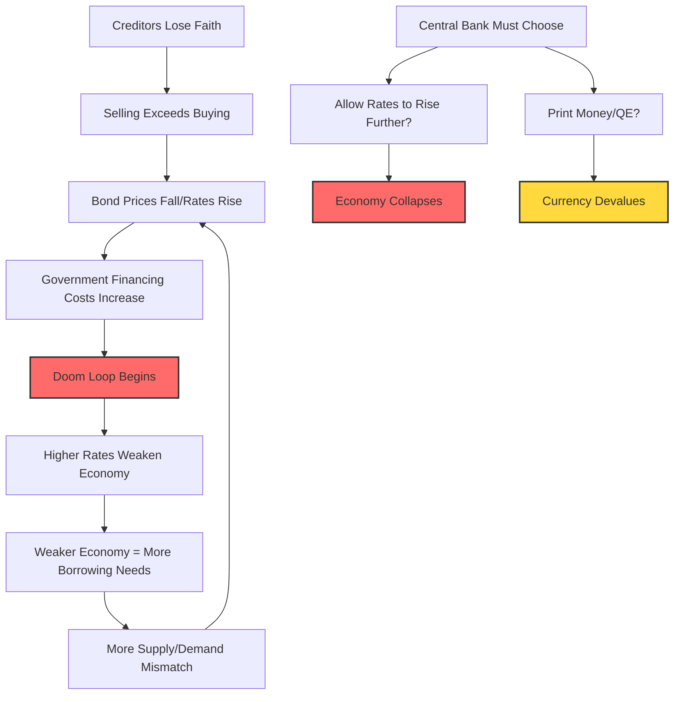

War risks compound these dynamics exponentially—sanctions threats, excessive war borrowing, and devaluation risks create a toxic cocktail. The doom loop accelerates when rising rates weaken the economy, increase future borrowing needs, worsen bond market imbalances, and drive rates higher still. Central banks must then "save the day" through money printing (quantitative easing).

The charts reveal simultaneous foreign capital flight from local bonds (government and corporate) alongside spiking real rates as central banks desperately attempt currency defense through tightening.

**Undesirable rise in rates due to inadequate demand for currency/debt**


Governments often compress debt maturities to make bonds more palatable, accepting rollover risk for immediate relief.


When markets recognize these constraints, selling intensifies. Central banks face an impossible choice: a) allow rates to rise enough to curtail borrowing and attract lending by crowding out other investments, or b) print money to fill the demand gap. History and logic dictate they always choose b), though the optimal path balances both. When this produces inflation amid economic weakness, central banks are damned either way—printing fuels currency collapse and inflation, while restraint causes depression-level interest rates and economic devastation.

This crescendo arrives when debt service becomes unbearable for borrowers and/or creditors refuse to hold debt offering inadequate real returns, high default risk, or probable devaluation. The resulting doom spiral continues until debt destruction or devaluation eliminates excessive burdens.

**This hasn't yet occurred in the US, Europe, Japan, or China.**

Let me detail these dynamics further:

**There is a tightening and/or currency intervention to defend the currency, but the tightening is abandoned because it's too harmful for the economy and the currency intervention is abandoned because it doesn't work and is too costly, so the currency/debt devalues.**

The situation becomes untenable when investors grasp the full picture and logically abandon the country's assets and currency, recognizing the high probability of purchasing power losses through either default or devaluation. This brings crisis to its apex, pressuring central banks to tighten precisely when doing so guarantees economic catastrophe.

Advanced-stage red flags include:

**Interest rates rise** from debt selling and central bank tightening attempts. Given already-depressed conditions, such real rate increases prove unsustainable, crushing weak economies and governments facing debt spirals.


**The tightening worsens a weak economy** (ultimately forcing abandonment and devaluation).


**Inflation tends to rise above desirable levels** entering the crisis, constraining central banks' ability to ease without triggering hyperinflation.


Weak economies plus rising inflation create enormous currency pressure. Here fixed and floating rate cases diverge dramatically. Fixed-rate policymakers fight depreciation—with high inflation, their currencies actually appreciate in real terms precisely when devaluation is needed. Floating-rate currencies gradually sell off into weakness.


For countries with hard currency debts, credit spreads widen as default probability increases.


Risk assets price in higher premiums (sell off), amplifying economic pressure.


**Central banks typically sell reserves at this stage.** Governments function like individuals and companies regarding debt, except those borrowing in their own currency can print for repayment. Like prudent households, governments can accumulate savings buffers for income shortfalls. Reserves represent governments' primary liquid savings (along with sovereign wealth funds). Monitoring their size, depletion rate, and proximity to exhaustion helps time crises precisely. Watch for foreign currency sales to buy local currency—a form of monetary tightening through money supply reduction.


In severe cases, reserves are already low relative to central bank liabilities (money supply), providing minimal firepower against currency runs. When inadequacy becomes apparent, currency defense failure becomes inevitable, accelerating betting against the currency and debt flight.


The table below details historical central bank interventions via reserves. Key patterns emerge:

**Before intervention**, countries typically hold modest reserve war chests (averaging 5% of GDP, covering 10% of money supply and government debt).

**During intervention**, central banks typically burn over half their reserves defending currencies (62% average decline in global currency terms).

**Concentrated selling**—the worst six-month period sees 49% median reserve depletion.

**Currencies fall during defense** (gold rallies 42% median), though some interventions temporarily prop currencies. After roughly two years of futile defense, central banks surrender with reserves covering only 6% of money supply and 3% of government debt. Post-intervention, currencies plummet further (gold rallies another 51% median).

**Summary of Central Bank Intervention via Selling Reserves Across Cases with Meaningful Intervention**

$$
\begin{align}
\begin{array}{|l|l|c|c|c|c|c|c|c|c|c|c|c|c|c|c|c|}
\hline
\shortstack{Case} 
& \shortstack{Fixed/Float} 
& \shortstack{Starting Firepower\\Reserve Levels Pre-Intervention\\\%GDP} 
& \shortstack{Starting Firepower\\Reserve Levels Pre-Intervention\\USD, Bln} 
& \shortstack{Starting Firepower\\Reserve Levels Pre-Intervention\\\%Money} 
& \shortstack{Starting Firepower\\Reserve Levels Pre-Intervention\\\%Govt} 
& \shortstack{Starting Firepower\\Length of Fx\\(in Months)} 
& \shortstack{Intervention Phase\\Peak 6-Month\\\%GDP} 
& \shortstack{Intervention Phase\\Peak 6-Month\\\%} 
& \shortstack{Intervention Phase\\Total Reserve Spend\\\%GDP} 
& \shortstack{Intervention Phase\\Total Reserve Spend\\\%} 
& \shortstack{Intervention Phase\\Gold} 
& \shortstack{Post-Intervention Phase\\Reserve Levels\\Post-Intervention\\\%GDP} 
& \shortstack{Post-Intervention Phase\\Reserve Levels\\Post-Intervention\\USD, Bln} 
& \shortstack{Post-Intervention Phase\\Reserve Levels\\Post-Intervention\\\%Money} 
& \shortstack{Post-Intervention Phase\\Reserve Levels\\Post-Intervention\\\%Govt} 
& \shortstack{Post-Intervention Phase\\Gold} 
\\
\hline
\shortstack{Median\\(All Cases)} 
&  & 5.1\% & 6.44 & 10\% & 11\% & 23 & -2.6\% & -49\% & -3.3\% & -62\% & 42\% & 1.9\% & 1.66 & 6\% & 3\% & 51\% \\
\shortstack{Fixed} 
&  & 6.1\% & 4.98 & 10\% & 13\% & 19 & -2.7\% & -48\% & -3.3\% & -65\% & 42\% & 2.0\% & 1.66 & 6\% & 2\% & 41\% \\
\shortstack{Floating} 
&  & 4.4\% & 9.03 & 14\% & 11\% & 29 & -1.9\% & -57\% & -3.8\% & -58\% & 36\% & 1.7\% & 1.65 & 5\% & 3\% & 66\% \\
\hline
\shortstack{ARG: 1990s\\Hyperinflation} 
& Fixed & 13\% & 5.16 &  & 3\% & 6 & -2.6\% & -50\% & -2.6\% & -50\% & 330\% & 2.0\% & 2.56 &  & 2\% &  \\
\shortstack{ARG: 2001\\Peg Break} 
& Fixed & 8.7\% & 26.85 & 43\% & 25\% & 19 & -6.8\% & -47\% & -14.1\% & -65\% & 107\% & 7.9\% & 9.42 & 27\% & 6\% &  \\
\shortstack{BRZ: 1999\\Peg Break} 
& Fixed & 8.5\% & 73.62 & 34\% & 21\% & 11 & -5.2\% & -49\% & -6.7\% & -56\% & 52\% & 5.2\% & 32.72 & 21\% & 10\% &  \\
\shortstack{DEU: Post-World\\War II} 
& Fixed & 0.8\% & 0.25 & 2\% & 0\% & 64 & -0.2\% & -46\% & -0.6\% & -90\% & 107\% & 0.1\% & 0.02 & 0\% & 0\% &  \\
\shortstack{FRA: World\\War II} 
& Fixed & 30.9\% & 2.96 & 26\% & 29\% & 92 & -8.2\% & -48\% & -7.0\% & -84\% & 192\% & 1.1\% & 0.48 & 2\% & 2\% & 133\% \\
\shortstack{GBR: Great\\Depression} 
& Fixed & 6.1\% & 1.34 & 10\% & 4\% & 15 & -2.7\% & -36\% & -3.3\% & -43\% & 40\% & 5.2\% & 0.77 & 7\% & 3\% & 3\% \\
\shortstack{GBR: Post-World\\War II Deval} 
& Fixed & 6.2\% & 2.66 & 7\% & 3\% & 36 & -1.0\% & -21\% & -2.4\% & -38\% & 54\% & 4.7\% & 1.66 & 6\% & 2\% & 5\% \\
\shortstack{GBR: World\\War II} 
& Fixed & 14.7\% & 4.07 & 22\% & 11\% & 37 & -3.7\% & -66\% & -12.8\% & -89\% & 19\% & 1.5\% & 0.44 & 2\% & 1\% &  \\
\shortstack{JPN: Great\\Depression} 
& Fixed & 4.0\% & 0.49 & 9\% & 15\% & 26 & -3.0\% & -55\% & -5.1\% & -67\% & 35\% & 2.7\% & 0.16 & 6\% & 6\% & 56\% \\
\shortstack{JPN: World\\War II} 
& Fixed & 5.1\% & 0.37 & 10\% & 13\% & 38 & -2.5\% & -58\% & -2.4\% & -81\% & 10\% & 0.6\% & 0.07 & 1\% & 1\% & >500\% \\
\shortstack{MEX: 1982\\Default} 
& Fixed & 1.6\% & 4.98 & 7\% & 5\% & 12 & -1.8\% & -57\% & -2.7\% & -65\% & 227\% & 1.7\% & 1.76 & 9\% & 3\% & 23\% \\
\shortstack{MEX: Tequila\\Crisis} 
& Fixed & 3.9\% & 20.89 & 18\% & 25\% & 11 & -3.2\% & < -100\% & -6.4\% & -128\% & 42\% & -1.7\% & -5.75 & -9\% & -7\% & 28\% \\
\shortstack{TUR: 2001\\Hyperinflation} 
& Fixed & 6.1\% & 18.44 & 26\% & 19\% & 5 & -3.3\% & -44\% & -4.4\% & -50\% & 27\% & 4.4\% & 9.24 & 19\% & 14\% & 16\% \\
\shortstack{USA: 1971\\Devaluation} 
& Fixed & 1.8\% & 18.61 & 3\% & 3\% & 23 & -0.2\% & -14\% & -0.4\% & -23\% & -6\% & 1.2\% & 14.42 & 2\% & 2\% & 150\% \\
\shortstack{USA: Great\\Depression} 
& Floating & 6.6\% & 5.15 & 9\% & 15\% & 14 & -1.0\% & -15\% & -1.3\% & -18\% & -1\% & 6.1\% & 4.25 & 9\% & 12\% & 55\% \\
\hline
\shortstack{ARG: 2020\\Default} 
& Floating & 5.9\% & 36.47 & 18\% & 11\% & 68 & -5.0\% & < -100\% & -12.6\% & -135\% & 163\% & -3.2\% & -12.93 & -11\% & -4\% & 43\% \\
\shortstack{BRZ: 1980s} 
& Floating & 2.5\% & 7.13 & 18\% & 5\% & 6 & -1.9\% & -55\% & -1.9\% & -55\% & 42\% & 1.4\% & 3.18 & 10\% & 3\% & -42\% \\
\shortstack{BRZ: 2002\\BoP Crisis} 
& Floating & 6.9\% & 34.88 & 31\% & 11\% & 20 & -2.9\% & < -100\% & -9.5\% & -159\% & 10\% & -3.5\% & -20.63 & -16\% & -6\% &  \\
\shortstack{BRZ: 2014\\BoP Crisis} 
& Floating & 15.9\% & 371.27 & 44\% & 28\% & 33 & -1.6\% & -18\% & -7.1\% & -31\% & 16\% & 16.2\% & 255.62 & 44\% & 25\% & 10\% \\
\shortstack{DEU: Weimar\\Hyperinflation} 
& Floating & 6.6\% & 0.59 & 7\% & 5\% & 63 & -2.5\% & -39\% & -4.8\% & -73\% & >500\% & 1.9\% & 0.12 & 4\% & 2\% &  \\
\shortstack{FRA: Early 20s\\Deval} 
& Floating & 4.0\% &  &  &  &  &  &  &  &  &  &  &  &  &  &  \\
\hline
\end{array}
\end{align}
$$


Gold excess return figures are dashed out for cases where the currency bottomed before reserve intervention stopped. We show "<-100%" in cases where the central bank spent more than their entire warchest of reserves (for instance via using a swapline to borrow additional reserves).


At this stage, currency risk becomes undeniable. Not just investors flee—banks, corporations, and households make rational self-preservation moves. **What follows is a choreographed panic, where each actor's defensive moves amplify everyone else's fears, creating an unstoppable cascade toward currency collapse.**

```mermaid
graph TD
    A[Currency Risk Becomes Undeniable] --> B[Multi-Actor Flight Begins]

    B --> C[Corporate Treasury Actions]
    C --> C1[Keep revenues offshore]
    C --> C2[Hedge local currency exposure]
    C --> C3[Foreign corps sweep cash out]
    C --> C4[Freeze new investments]

    B --> D[Domestic Bank Actions]
    D --> D1[Forced government debt sales]
    D --> D2[Arbitrage onshore/offshore rates]

    B --> E[International Bank Actions]
    E --> E1[Terminate trade finance]
    E --> E2[Abandon local subsidiaries]

    B --> F[Large Investor Actions]
    F --> F1[Flee illiquid markets]
    F --> F2[Reserve managers exit]
    F --> F3[Stop rolling exposures]

    B --> G[Domestic Saver Actions]
    G --> G1[Convert to hard currency]
    G --> G2[Buy real goods/imports]
    G --> G3[Move money abroad]
    G --> G4[Buy foreign stocks]
    G --> G5[Open foreign accounts]

    C1 --> H[Currency Selling Pressure]
    C2 --> H
    C3 --> H
    D1 --> H
    D2 --> H
    E1 --> I[Credit Contraction]
    E2 --> I
    F1 --> H
    F2 --> H
    F3 --> I
    G1 --> H
    G2 --> H
    G3 --> H

    H --> J[Currency Devaluation]
    I --> K[Economic Contraction]
    J --> L[Inflation Spike]
    K --> M[More Actors Flee]
    L --> M
    M --> B

    style A fill:#ff6b6b,stroke:#333,stroke-width:2px
    style J fill:#ff6b6b,stroke:#333,stroke-width:2px
    style L fill:#ffd93d,stroke:#333,stroke-width:2px
    style M fill:#ff6b6b,stroke:#333,stroke-width:2px
```

> [!info] The Self-Reinforcing Nature of Currency Crises
> Notice how every defensive action creates more pressure on the currency, which validates everyone's fears and accelerates their defensive actions. This is why currency crises, once started, become nearly impossible to stop:
>
> - **Corporate actions** directly create currency selling (keeping revenues offshore, hedging)
> - **Bank actions** reduce liquidity and credit availability
> - **Investor flight** eliminates demand for local assets
> - **Domestic savers** create direct currency selling pressure
> - **All actions together** create economic contraction and inflation, which justify more defensive actions
>
> It's like a crowded theater where someone yells "fire"—even if there's no fire initially, the stampede itself becomes the disaster.

Here are the classic late-stage behaviors I've observed:

**Corporate Treasury Actions**

1. **Domestic companies keep international revenues offshore in foreign currency**, abandoning traditional repatriation. Watching revenues swing wildly in local terms while dollar amounts remain stable, they begin viewing domestic currency as the risk to hedge.

2. **Domestic corporations increase local currency hedging**, especially those with hard currency debts. Forward contracts to sell local/buy foreign currency pressure forward rates and drag down spot rates.

3. **Foreign corporations sweep cash from domestic subsidiaries immediately.**

4. **Companies freeze new foreign direct investment**—currency risk, political chaos, and career risk outweigh small expansion opportunities.

**Domestic Bank Actions**

5. **Banks forced to buy government debt under duress sell when liquidity evaporates**, accelerating the debt selloff at crisis peak.

6. **Central bank stimulative tactics** (multiple rates, capital controls) make offshore holdings more attractive than onshore. Domestic banks and corporations, best positioned to arbitrage, move money offshore even in same currency, requiring government debt sales.

**International Bank Actions**

7. **International lenders terminate troublesome business lines**—trade finance, working capital credit vanish.

8. **They literally abandon bank subsidiaries** when small operations threaten parent company stability.

**Large International Investor Actions**

9. **Ironically, as borrowing grows, liquidity evaporates**—more debt held by captive buyers (banks), dollar values plummet. Large foreign investors flee illiquid markets.

10. **Government reserve holders exit**, often with geopolitical motivations.

11. **Major reserve managers can't sell without market disruption**—instead, they accumulate new reserves elsewhere, eliminating demand.

12. **International investors trapped by illiquidity stop rolling exposures.**

**Foreign outflows classically lead devaluations:**


**Domestic Saver Actions**

13. **Domestic savers seek diversification and inflation hedges**, driving those flows. Converting deposits to hard currency forces banks to sell local currency.

14. **People buy real goods to front-run inflation**—since many are imports, this creates currency selling while fueling inflation.

15. **High-net-worth individuals, fearing wealth taxes and confiscation, move money abroad.**

16. **Domestic savers view foreign stocks as safer bets**—new products emerge to facilitate this.

17. **Opening foreign bank accounts becomes prudent** as domestic banks appear troubled (assuming no capital controls; governments often restrict foreign accounts).

**More Traditional Speculative Trading**

18. **Bond vigilante actions become self-reinforcing.**

19. **Equity investors flee deteriorating environments**, creating currency pressure.


# Chapter 6: The Crisis Spills over to the Central Bank (Stages 5-6)

This chapter continues our journey through the archetypal big debt crisis, focusing on the critical moment when financial turmoil breaches the walls of the central bank itself. Here we examine Stages 5-6, where the institution designed to be the economy's last line of defense becomes entangled in the very crisis it seeks to resolve.

## Stage 5: When Interest Rates Hit Rock Bottom, Money Creation Becomes the Only Tool Left

When a debt crisis erupts and conventional monetary policy reaches its limits—typically when interest rates approach or hit 0%—central banks face a stark choice. They must either watch their economies collapse under crushing debt burdens or deploy their most powerful and controversial tool: creating new money to purchase bonds and ease the strain on debtors.

This process doesn't involve literal printing presses churning out banknotes. Instead, the central bank creates electronic reserves—essentially IOUs to commercial banks—on which it pays short-term interest rates. Through this mechanism, the central bank injects liquidity into the financial system while accumulating vast quantities of government bonds on its balance sheet.

> [!info] Understanding the Mechanics of Quantitative Easing When a central bank "prints money" to buy bonds, here's what actually happens:
> 
> 1. The central bank creates new electronic reserves (not physical cash)
> 2. It uses these reserves to purchase government bonds from banks or investors
> 3. The sellers receive deposits at their banks, increasing the money supply
> 4. The central bank now owns the bonds and must pay interest on the reserves it created
> 5. This process lowers bond yields, making borrowing cheaper throughout the economy
> 
> The key risk: If short-term rates (paid on reserves) rise above long-term rates (earned on bonds), the central bank loses money on every bond it holds.

```mermaid
graph TD
    A[Debt Crisis Emerges] --> B[Interest Rates Already at 0%]
    B --> C{Central Bank Choice}
    C -->|Option 1| D[Allow Rates to Rise]
    C -->|Option 2| E[Print Money & Buy Bonds]
    D --> F[Credit Crunch]
    F --> G[Economic Collapse]
    E --> H[Expand Balance Sheet]
    H --> I[Lower Bond Yields]
    I --> J[Temporary Relief]
    J --> K[Future Interest Rate Risk]
    
    style A fill:#ff6b6b,stroke:#333,stroke-width:2px
    style G fill:#ff6b6b,stroke:#333,stroke-width:2px
    style K fill:#ffd93d,stroke:#333,stroke-width:2px
```

The government, facing astronomical financing needs at precisely the moment when private investors flee to safety, discovers it cannot borrow at rates it can afford. Mechanical selling of currency and debt creates a vicious feedback loop, driving financing costs ever higher. In desperation, the government turns to its central bank—transferring the crisis from the fiscal authority to the monetary authority.

While I characterize this development as a red flag, it's not yet a blazing red flag. Central banks possess formidable powers to control money and credit creation, at least temporarily. However, when governments consistently spend beyond their means, the mathematics become inescapable. Rising debt burdens consume ever-larger portions of government budgets through interest payments alone, creating a treadmill effect where the government must run faster just to stay in place.

> [!info] The Debt Service Treadmill As debt accumulates, governments face an accelerating burden:
> 
> - Each year, more tax revenue goes to interest payments rather than public services
> - To maintain spending levels, governments must borrow even more
> - This additional borrowing increases future interest costs
> - Eventually, interest payments can exceed spending on education, infrastructure, or defense
> - The only escape: growth, inflation, default, or central bank intervention

The central bank's intervention manifests through direct asset purchases or indirect support via guarantees and backstops for systemically important institutions. These purchases often occur at uneconomical prices—the central bank pays more than market value to stabilize prices and restore confidence. Predictably, the central bank eventually incurs losses through some combination of default, inflation, or rising interest rates. The balance sheet damage simply migrates from the government to the central bank, ultimately landing on currency holders who bear the cost through devaluation.

When insufficient private demand exists for government debt, central banks confront a devils' choice:

**Option A**: Allow interest rates to rise until supply and demand equilibrate. This path crushes credit demand and spending, potentially triggering a severe recession.

**Option B**: Create money to purchase debt assets, expanding the central bank's balance sheet through quantitative easing. This path risks currency debasement and inflation.

```mermaid
graph LR
    A[Insufficient Debt Demand] --> B{Central Bank Decision}
    B -->|Path A| C[Let Rates Rise]
    B -->|Path B| D[Print & Buy]
    C --> E[Credit Contraction]
    E --> F[Recession/Depression]
    D --> G[Balance Sheet Expansion]
    G --> H[Currency Debasement Risk]
    H --> I[Inflation Risk]
    
    style A fill:#ff6b6b,stroke:#333,stroke-width:2px
    style F fill:#ff6b6b,stroke:#333,stroke-width:2px
    style I fill:#ffd93d,stroke:#333,stroke-width:2px
```

Several early warning signals should raise concern when observed together:

1. **Prolonged quantitative easing**: When these programs persist for years, they signal chronic imbalances
2. **Maturity compression**: Governments shortening debt maturities indicates long-term funding stress
3. **Rising central bank holdings**: When central banks become dominant bondholders, free-market price discovery vanishes

The charts below reveal how central bank bond purchases and maturity shortening typically accelerate nearly a decade before full crisis, then reverse afterward:


In a healthy financial system, borrowing demand from debtors naturally balances with lending appetite from creditors. But when free-market demand proves inadequate, governments and central banks increasingly absorb the excess debt. The government can shoulder this burden during crises because private lenders still trust its ability to repay—after all, the central bank's money-printing powers stand behind it, virtually eliminating default risk.

> [!info] The Credibility Paradox Private lenders' faith in government debt during crises rests on a paradox:
> 
> - They believe the government won't default because the central bank can print money
> - But if the central bank prints too much money, inflation will devastate the real value of their loans
> - So lenders are betting the central bank will print just enough to avoid default but not enough to cause severe inflation
> - History shows this balance is extraordinarily difficult to maintain

The true risk transforms from default to debasement—lenders may receive payment in full but in dramatically devalued currency. When this pattern emerges, I consider it a red flag, though not yet critical, because history demonstrates central banks can sustain such policies for extended periods before consequences materialize.

This practice, once called debt monetization, has been rebranded as "quantitative easing" in our era. Since 2008, it has unfolded in waves across major economies:

- **United States**: Four waves totaling 18% of potential GDP, 5% of total debt, and 16% of government debt
- **Europe**: Four waves totaling 30% of potential GDP, 10% of total debt, and 36% of government debt
- **Japan**: Three waves totaling 95% of potential GDP, 22% of total debt, and 46% of government debt

When central banks purchase bonds, they assume identical risks to those faced by commercial banks and private investors. The crucial difference lies in central banks' unique powers: they can print money to monetize losses and employ creative accounting to obscure the damage.

> [!info] How Central Banks Hide Their Losses Unlike private investors, central banks can:
> 
> 1. **Avoid mark-to-market accounting**: They don't have to recognize paper losses on bonds
> 2. **Print money to cover losses**: They can create reserves to pay their bills
> 3. **Use regulatory forbearance**: They can operate with negative equity
> 4. **Defer recapitalization**: Governments may delay injecting new capital
> 
> But these tricks merely postpone the reckoning—they don't eliminate the economic reality of the losses.

The mechanics work as follows: When the central bank buys a bond (perhaps from a commercial bank), it credits the selling bank with a new reserve deposit at the central bank. The central bank pays interest on this deposit, much like a commercial bank pays interest to depositors. Just as commercial banks court disaster when deposit rates exceed loan yields, central banks face the same mathematics. When the interest paid on reserve deposits surpasses the interest earned on bond holdings, the central bank hemorrhages money, generating negative cash flow.

If central banks employed mark-to-market accounting, rising rates would reveal massive losses on their bond portfolios. When losses exceed capital, the institution technically becomes insolvent. In reality, few observers care at this stage—but they should, for reasons I'll explain.

## Stage 6: The Central Bank Death Spiral Begins

When interest rates rise, central banks suffer losses because the interest they must pay on liabilities exceeds the interest received on their bond portfolios. While notable, this development doesn't constitute a major red flag until the central bank's negative net worth becomes substantial and money printing accelerates to cover mounting negative cash flows. This marks the beginning of what I call the central bank death spiral—a self-reinforcing cycle where rising rates create losses requiring money printing, which weakens the currency, driving rates higher still.

> [!info] Anatomy of a Central Bank Death Spiral The death spiral unfolds through these interconnected steps:
> 
> 1. **Rising rates create losses**: Short-term rates paid exceed long-term rates earned
> 2. **Negative cash flow emerges**: More money flows out than in
> 3. **Money printing covers the gap**: The central bank creates reserves to pay its bills
> 4. **Currency weakens**: New money creation devalues existing currency
> 5. **Rates rise further**: Investors demand higher yields to compensate for devaluation
> 6. **Return to step 1**: The cycle intensifies with each iteration
> 
> Breaking this cycle requires either massive fiscal adjustment, currency collapse, or both.

```mermaid
graph TD
    A[Interest Rates Rise] --> B[CB Pays More on Liabilities Than Earns on Assets]
    B --> C[Negative Cash Flow]
    C --> D[Print Money to Cover Losses]
    D --> E[Currency Devaluation]
    E --> F[Investors Flee Currency]
    F --> G[Higher Rates Demanded]
    G --> A
    
    H[Death Spiral Accelerates] --> I[Massive Devaluation or Default]
    
    style C fill:#ff6b6b,stroke:#333,stroke-width:2px
    style I fill:#ff0000,stroke:#333,stroke-width:4px
```

Though central banks can print money indefinitely, this power becomes a curse rather than a blessing. Large-scale money printing to fund operations devalues the currency and generates inflationary recessions or depressions. The central bank finds itself trapped between competing imperatives: maintaining policy loose enough to support a fragile economy and weak government finances while keeping it tight enough to prevent capital flight.

This impossible balancing act manifests in several ways:
	a. Central Banks Accumulate Massive Losses and Negative Net Worth
		- After purchasing enormous quantities of bonds, central banks face devastating losses when interest rates rise. Bond prices plummet while funding costs soar as short-term rates exceed the yields on their long-duration portfolios. These losses often grow so large that central banks' net worth turns deeply negative.
		- This represents another red flag in the progression toward crisis. Today, several central banks operate with negative equity, seemingly without immediate consequence. At moderate levels, such technical insolvency poses few operational problems. However, as losses mount from moderate to massive, the cash flow implications become undeniable.

> [!info] Why Central Bank Losses Matter While central banks can operate with negative equity, massive losses matter because:
> 
> 1. **Cash flow pressure**: They must print money just to pay interest on reserves
> 2. **Credibility erosion**: Markets lose faith in the currency's stability
> 3. **Political pressure**: Governments may need to recapitalize the central bank
> 4. **Inflation acceleration**: Money printing to cover losses adds to inflationary pressure
> 5. **Currency crisis risk**: Foreign investors flee, creating a balance of payments crisis

Some governments, maintaining a pretense of sound finance, require their treasuries to recapitalize central banks when equity turns negative. This merely shifts the problem—governments must raise capital through higher taxes, spending cuts, or additional borrowing, intensifying the fiscal squeeze.

Central bank bond purchases serve two purposes: providing credit that markets won't supply and absorbing losses that would otherwise devastate private investors. Yet this protection comes at a steep price—devaluing the currency and all debts denominated in it.

The question arises: Do central bank losses truly matter, and if so, why?

Central bank losses certainly matter less than equivalent private sector losses would. Private investors must maintain credibility with lenders, while central banks can print money. When central banks accumulate significant losses, it signals progression toward the advanced stages of the Big Debt Cycle—I classify it as a mid-cycle warning flag.

Initially, small to moderate losses pose minimal operational challenges. However, as losses escalate from moderate to massive, they generate cash flow needs only satisfiable through extensive money printing. This places tremendous downward pressure on the currency as the central bank pays ever-larger interest bills on its liabilities while earning pittance on its assets, printing the difference.

The following table documents historical cases where cash flow losses became so severe they necessitated massive monetization, contributing to currency collapse:

\begin{tabular}{|l|c|c|c|c|c|c|} \hline \textbf{Case} & \textbf{Period} & \textbf{CB Balance Sheet} & \textbf{CB Cash Flow} & \textbf{Money Growth} & \textbf{Inflation} & \textbf{FX Devaluation} \ & & \textbf{(% GDP)} & \textbf{Losses (% GDP)} & \textbf{(Annual)} & \textbf{(Annual)} & \textbf{(Cumulative)} \ \hline Argentina (Late 80s) & 1988-1990 & 31.5% & -3.3% & 107% & 4,927% & -97% \ Argentina (Recent) & 2019-2022 & 34.0% & -3.5% & 50% & 49% & -86% \ Peru (Late 80s) & 1985-1988 & 6.9% & -2.6% & 214% & 246% & -100% \ Dutch Guilder & 1780-1796 & 5.8% & -3.3% & 27% & 22% & -80% \ Turkey (Current) & 2023-2024 & 17.2% & -2.6% & 20% & 84% & -42% \ \hline \end{tabular}

These cases share common characteristics: Large losses relative to smaller balance sheets created enormous liability costs versus minimal asset yields. Governments chose monetization over recapitalization, and the printed money fled the currency as savers, already burned by previous devaluations, faced continued negative real rates. The losses contributed to massive currency collapses in every instance.

b.  The Central Bank Must Print Money Despite Currency Pressure

Confronted with these circumstances, central banks ultimately must print money to monetize both their own losses and those of other critical institutions. This occurs through direct asset purchases or indirect guarantees and backstops. Central banks typically absorb losses on assets bought at uneconomical prices through defaults, inflation, and rising rates—transferring balance sheet damage from governments to central banks and ultimately to currency holders.

Key indicators of this stage include:

**Expanding central bank balance sheets** as money creation finances governments or rolls debts of stressed entities. The chart below illustrates central bank purchases of government bonds, though interventions often extend far beyond—including corporate bonds, equities, or broad guarantees that don't always appear on balance sheets but represent contingent monetization obligations.


**Reserve sales** as central banks attempt to defend their currencies while simultaneously providing liquidity to stressed borrowers. This creates a composition shift in central bank assets from hard assets (gold and foreign exchange reserves) to soft assets (domestic government and financial sector claims). This dynamic accelerates currency flight, particularly under fixed exchange rate regimes, as investors observe the central bank's defensive resources rapidly depleting, forcing ever-faster reserve sales until defense becomes impossible.

> [!info] The Reserve Depletion Dynamic Under fixed exchange rates, the process unfolds predictably:
> 
> 1. **Initial pressure**: Capital flight begins as confidence erodes
> 2. **Reserve defense**: Central bank sells foreign reserves to maintain the peg
> 3. **Acceleration**: Speculators see reserves falling and increase bets against the currency
> 4. **Desperation**: Central bank burns through reserves at an accelerating pace
> 5. **Capitulation**: Reserves approach zero, forcing abandonment of the peg
> 6. **Collapse**: Currency plummets once artificial support ends

```mermaid
graph TD
    A[Currency Pressure Builds] --> B[CB Sells Reserves to Defend]
    B --> C[Reserves Decline Visibly]
    C --> D[Speculators Attack Currency]
    D --> E[Reserve Sales Accelerate]
    E --> F{Reserves Exhausted?}
    F -->|No| D
    F -->|Yes| G[Abandon Currency Peg]
    G --> H[Massive Devaluation]
    
    style C fill:#ffd93d,stroke:#333,stroke-width:2px
    style H fill:#ff0000,stroke:#333,stroke-width:4px
```

**Debt monetization combined with reserve depletion** causes the ratio of hard assets (reserves) to liabilities (money supply) to plummet, undermining the central bank's currency defense capacity. Fixed exchange rate regimes face this challenge most acutely—they typically maintain higher reserve backing but encounter problems sooner as the reserves-to-money ratio deteriorates. They also burn through more reserves during the defense phase.


In fixed-rate cases, hard asset levels typically start higher (averaging around 50% backing) but decline precipitously, reaching only about one-third backing at devaluation.

# Chapter 7: The Prior Big Debt Crisis Recedes, a New Equilibrium Is Reached, and a New Cycle Can Begin (Stages 7-9)

The cycle's conclusion arrives when market forces and policymaker actions combine to create a bottom and catalyze recovery. This chapter examines the dynamics and markers that signal these final stages (Stages 7-9 of our archetypal framework).

## Stage 7: The Great Reckoning—Debts Are Restructured and Currencies Devalued

When debt burdens become unbearable, a massive restructuring and devaluation becomes inevitable, reducing debts to manageable levels either through chaotic market forces or skillful policy management. In the best-case scenario—what I call a "beautiful deleveraging"—policymakers artfully balance deflationary debt reduction (through restructuring) with inflationary debt reduction (through monetization), achieving deleveraging without triggering excessive deflation or inflation.

The currency plummets and remaining holders of currency and debt suffer devastating real losses. This hemorrhaging of purchasing power continues until a new monetary system emerges with sufficient credibility to persuade investors and savers to hold the currency again. This transformation typically requires substantial debt write-downs and restructuring.


Government debts lose massive value relative to real assets—gold, stocks, commodities, and potentially digital currencies like Bitcoin in our modern era. The charts below reveal average devaluation patterns across historical cases, comparing currencies and debts against (1) gold, (2) commodities, and (3) equities. Gold typically outperforms local debt holdings by approximately 60% from devaluation onset through currency stabilization. Note the dramatic differences between fixed and floating exchange rate regimes.

> [!info] Why Real Assets Outperform During Currency Crises During currency devaluations, real assets surge relative to financial assets because:
> 
> 1. **Intrinsic value**: Physical assets retain utility regardless of currency fluctuations
> 2. **Global pricing**: Commodities and gold trade internationally, maintaining purchasing power
> 3. **Inflation hedge**: Real assets typically rise with or exceed inflation
> 4. **Supply constraints**: Unlike fiat money, physical assets can't be created instantly
> 5. **Safe haven demand**: Investors flee to tangible stores of value during monetary chaos

```mermaid
graph LR
    A[Currency Crisis Begins] --> B[Investors Flee Paper Assets]
    B --> C[Demand for Real Assets Surges]
    C --> D[Gold Prices Spike]
    C --> E[Commodity Prices Rise]  
    C --> F[Equity Values Increase]
    D --> G[Currency Holders Lose 60%+ vs Gold]
    E --> H[Essential Goods Become Expensive]
    F --> I[Companies with Real Assets Outperform]
    
    style A fill:#ff6b6b,stroke:#333,stroke-width:2px
    style G fill:#ff0000,stroke:#333,stroke-width:4px
```


The following table details individual asset returns across various historical cases:

```latex
\begin{document}
\begin{tabular}{|l|c|c|c|c|c|} \hline \textbf{Case} & \textbf{Gold} & \textbf{Commodities} & \textbf{Equities} & \textbf{Bonds} & \textbf{Gold vs Bonds} \ & \textbf{(Local FX)} & \textbf{(Local FX)} & & & \textbf{(Vol-Matched)} \ \hline \textbf{Average Return} & 81% & 55% & 34% & -5% & 94% \ \textbf{Median Return} & 66% & 49% & 3% & -2% & 71% \ \hline Japan: World War II & 282% & 203% & 100% & -53% & 335% \ Germany: Weimar & 245% & 241% & 754% & -99% & 501% \ USA: 1971 Devaluation & 185% & 162% & -44% & -6% & 191% \ Italy: World War II & 173% & 156% & 92% & -28% & 201% \ USA: Great Depression & 149% & 70% & 33% & 19% & 130% \ \hline \end{tabular}
\end{document}
```

_Table shows returns from devaluation through currency stabilization. Returns are indicative given data quality issues in crisis periods._

While debt restructuring and devaluation create terrible conditions in markets and economies, this painful medicine reduces debt burdens and establishes foundations for recovery. In our archetypal case, debt levels surge relative to the monetary base before crisis, forcing the private sector to absorb ever-more government debt with the same money supply—likely contributing to the interest rate pressures observed in many cases.

> [!info] The Debt-to-Money Squeeze As debt grows faster than money supply:
> 
> 1. **Competition intensifies**: More bonds chase the same dollars
> 2. **Rates must rise**: Higher yields needed to attract buyers
> 3. **Pressure builds**: System becomes increasingly unstable
> 4. **Breaking point**: Private sector can no longer absorb new issuance
> 5. **Central bank steps in**: Money printing becomes inevitable

Eventually, when pressure becomes unbearable, the central bank intervenes and monetizes debt, expanding the monetary base and reducing the debt-to-money ratio.

```mermaid
graph TD
    A[Debt Grows Faster Than Money] --> B[Private Sector Absorbs More Debt]
    B --> C[Interest Rates Rise]
    C --> D[Pressure Becomes Unbearable]
    D --> E[Central Bank Monetizes]
    E --> F[Monetary Base Expands]
    F --> G[Debt-to-Money Ratio Falls]
    G --> H[Temporary Stabilization]
    
    style D fill:#ff6b6b,stroke:#333,stroke-width:2px
    style E fill:#4ecdc4,stroke:#333,stroke-width:2px
```

The reserves-to-debt ratio typically deteriorates initially, then improves. In early stages, reserves fall relative to debts—first because debt levels explode, then additionally as reserves are sold defending the currency. After policymakers capitulate and release the currency, this ratio improves as devaluation mechanically reduces local currency debt values relative to hard currency assets while improving competitiveness and hard currency earnings.


The chart below illustrates the typical progression of government debt and monetary base. Government debt rises first (usually responding to some crisis) while money growth remains largely unchanged—often slowing when the central bank attempts currency defense. Governments desperately try maintaining control through foreign exchange restrictions or managed rates (sometimes establishing official exchange rates divorced from market reality). These controls create destructive market distortions.

After the central bank surrenders and releases the currency, money printing accelerates, producing inflation that improves the government's nominal income relative to its debts. This dynamic remains remarkably consistent across fixed and floating rate regimes.


The following charts display government debt against reserves. The declining reserve coverage stems primarily from exploding government debt but also from reserve sales during late-cycle currency defense attempts. After authorities stop defending and allow devaluation, the ratio typically improves as currency depreciation reduces local debt values relative to remaining hard currency assets.


## Stage 8: Desperate Measures—Extraordinary Taxes and Capital Controls

At this juncture, cash-strapped governments typically impose punitive taxes to address their financing needs. The specter of increased taxation prompts households and businesses to move whatever assets they can beyond the government's reach. Predictably, governments respond by erecting capital controls to stem these outflows, though by this stage, the economic pressure for capital flight overwhelms any barriers governments can construct.

> [!info] The Capital Flight Acceleration When governments impose emergency fiscal measures:
> 
> 1. **Tax increases announced**: Government signals desperation
> 2. **Wealth holders panic**: Fear of confiscation triggers action
> 3. **Capital flight surges**: Money races for the exits
> 4. **Controls imposed**: Government tries to trap remaining wealth
> 5. **Black markets emerge**: Alternative channels develop instantly
> 6. **Controls fail**: Economic pressure overwhelms restrictions

The charts below reveal tax rate evolution across historical cases. Both top marginal income tax rates and inheritance tax rates typically rise approximately 10% in the years preceding devaluation.


Higher taxes invariably accompany capital controls as governments attempt to prevent wealth from fleeing in response to confiscatory policies. The table below demonstrates just how common this pattern has been throughout history:

$$\begin{tabular}{|l|c|c|c|c|c|c|} \hline \textbf{Country} & \textbf{1900} & \textbf{1920} & \textbf{1940} & \textbf{1960} & \textbf{1980} & \textbf{2000} \ \hline UK & Yes & Yes & Yes & Yes & & \ USA & Yes & Yes & & & & \ China & & & Yes & Yes & Yes & \ Germany & Yes & Yes & Yes & Yes & & \ France & Yes & & & Yes & & \ Russia & Yes & Yes & Yes & Yes & Yes & Yes \ Austria-Hungary & Yes & & & & & \ Italy & & Yes & & & & \ Netherlands & & & & Yes & & \ Japan & & Yes & & Yes & & \ \hline \end{tabular}$$

## Stage 9: From Ashes to Equilibrium—The Deleveraging Creates Space for Recovery

The deleveraging process, however painful, inevitably reduces debt burdens sufficiently to enable a return to equilibrium. During inflationary depressions where debt is devalued, the cycle's end often features government reserve accumulation through asset sales and a carefully orchestrated transition from rapidly depreciating currency to relative stability. This transformation typically requires linking the currency to hard assets (like gold) or stable foreign currencies while maintaining extremely tight monetary policy and punishingly high real interest rates.

This approach severely punishes borrower-debtors while rewarding lender-creditors, attracting capital back to the currency and debt markets, ultimately stabilizing the system. By this stage, the currency has collapsed and remaining holders have absorbed massive real losses, substantially relieving debtor burdens. Consequently, backing the remaining debt requires relatively modest resources, facilitating stabilization.

> [!info] The Stabilization Paradox The very destruction that seemed catastrophic enables recovery:
> 
> 1. **Debt burden lightened**: Inflation and devaluation reduce real debt loads
> 2. **Competitiveness restored**: Weak currency makes exports attractive
> 3. **Savings depleted**: Less old money to defend means less required to stabilize
> 4. **Expectations reset**: After crisis, modest stability seems miraculous
> 5. **Risk premiums peak**: Extreme pessimism creates opportunity for bold investors

When managed skillfully, governments rebuild reserves through various means: selling state-owned assets, securing IMF loans conditional on sound policies including austerity. At this stage, interest rates remain elevated—indeed, extremely high relative to prospective inflation and currency depreciation. This means central banks can once again make debt and currency attractive investments while making borrowing prohibitively expensive, if they manage the situation competently.

```mermaid
graph TD
    A[Crisis Reaches Bottom] --> B[Debt Burdens Reduced via Devaluation]
    B --> C[Government Stabilization Program]
    C --> D[Asset Sales for Reserves]
    C --> E[IMF/External Support]
    C --> F[Extreme Austerity]
    D --> G[Hard Currency Accumulation]
    E --> G
    F --> H[Primary Surplus Achieved]
    G --> I[Currency Backing Restored]
    H --> I
    I --> J[Very High Real Rates]
    J --> K[Capital Returns]
    K --> L[New Stable Equilibrium]
    
    style A fill:#ff6b6b,stroke:#333,stroke-width:2px
    style L fill:#4ecdc4,stroke:#333,stroke-width:2px
```

This marks the establishment of a new, credible monetary system capable of attracting investors and savers back to the currency. The transition typically requires substantial debt write-downs and restructuring alongside a return to some form of hard money (whether pegged to gold or another stable currency). More fundamentally, it demands structural adjustments that improve the country's balance sheet and income statement.

The five classic steps necessary for successful transition are:

### 1. Restructuring Debts to Sustainable Levels

The country must reduce its debt burden to levels where reserve assets cover a substantial portion of liabilities and debt service no longer exceeds revenue growth capacity. This typically requires defaulting on and restructuring both foreign and local currency obligations.


The charts below decompose what happens to government debt-to-GDP following devaluation across our historical cases. Starting from an average of 89% of GDP at devaluation, the breakdown reveals:

**Factors reducing debt-to-GDP (green bars)**:

- Central bank purchases: 7%
- Inflation impact: 38%
- Real GDP growth: 26%
- Primary surpluses: 16%
- Defaults/restructuring: 8%

**Factors increasing debt-to-GDP (red bar)**:

- Continued interest payments: 76%

The net result: debt falls from 89% to 70% of GDP, with inflation and growth—both stimulated by aggressive monetary expansion—providing the primary relief. In essence, governments with domestic currency debt (1) made payments by having central banks create money, spurring inflation and growth that raised nominal income relative to debt service, and (2) restructured defaulted debts as shown.

> [!info] The Inflation-Growth Solution Governments escape debt traps through nominal GDP expansion:
> 
> - **Inflation**: Reduces real value of fixed nominal debts
> - **Growth**: Increases the economic base supporting debt
> - **Combined effect**: If nominal GDP grows 10% yearly while debt yields 5%, debt burden shrinks rapidly
> - **Political advantage**: Less visible and contentious than outright default
> - **Risk**: Can spiral into hyperinflation if mismanaged

These patterns prove especially pronounced for countries issuing debt in their own currencies. Often, debt problems never truly disappear—they simply become manageable burdens handled through the mechanisms described. While these represent averages with substantial variation, the patterns remain remarkably consistent.


### 2. Deep Fiscal Surgery

Achieving sustainable finances without money printing requires painful fiscal adjustment. Both central government finances and balance of payments must undergo fundamental reform. Typically, primary deficits improve before governments can reduce interest costs by rolling into lower rates.


### 3. Accumulating Hard Reserves

Obtaining sufficient reserves to defend the currency—or back a replacement currency if the old one has been destroyed—proves essential. Currency devaluation assists this process: falling exchange rates increase the value of existing reserves relative to nominal liabilities while improving competitiveness boosts export earnings relative to import costs.

Additionally, governments combine asset sales to build reserves with occasional borrowing from official creditors (often the only remaining willing lenders). State-owned enterprises and other assets are typically privatized, generating both reserve inflows and efficiency improvements.


### 4. Punishingly High Real Interest Rates

Central banks must offer real interest rates that more than compensate investors for currency risk. The charts below show nominal rates on both local and hard currency debt during this phase.


### 5. Strict Limits on Central Bank Powers

The new monetary framework must include credible restrictions preventing the central bank from undermining stability through excessive money creation.


When these conditions align, it creates one of history's best opportunities to own a country's currency and debt.


This represents the typical conclusion of the Big Debt Cycle. Having examined these dynamics in detail, let's now step back to observe how this cycle has unfolded over the past 80 years at the macro level.

## Part 3: Looking Back

_**While Part 1 laid out the intricate mechanics of money, credit, debt, markets, and economics, and Part 2 revealed the archetypal sequence that drove central governments and central banks to bankruptcy, this section illuminates what transpired over the last 80 years. This historical journey demonstrates how real-world events aligned with our theoretical template, providing a foundation for understanding what lies ahead in Part 4. What follows offers an unconventional yet invaluable perspective on the forces that shaped our current economic reality—insights that will fundamentally challenge how you think about the future. This analysis will certainly provoke both reflection and debate.**_

### Chapter 8: An Overview of What Has Happened Since 1944

**The year 1944 marks a pivotal moment when both a new world order and a new monetary system emerged from the ashes of global conflict. Our journey through these eight decades will primarily focus on the debt/money/economic force—the first of five great forces that shape human civilization. Yet we cannot understand this force in isolation. The internal political cycle (the perpetual dance between left and right), the international geopolitical cycle (the chess game of great powers), acts of nature (droughts, floods, and pandemics), and humanity's technological advances all interweave to create the tapestry of modern history. These forces don't operate independently—they surge and recede like ocean tides, sometimes reinforcing each other to create perfect storms, other times canceling out to produce unexpected calm. Watch carefully as these five forces produce the dramatic swings and evolutionary changes that carried us from 1944 to today.**

**This narrative necessarily focuses on a select group of nations and emphasizes developments that fundamentally shaped the global monetary and geopolitical order. The United States, wielding the dominant currency and credit system, naturally plays the starring role in this drama. American money and credit didn't just influence this period—they largely authored it. Yet these same five forces operated across all nations, following remarkably similar patterns, even as each country's story unfolded uniquely.[1]**

**For those preferring to navigate quickly through this analysis, the bold text provides a comprehensive summary of key insights.**

## The Past Is Prologue: How to Look at It

**Before diving into historical specifics, let me share two fundamental principles that guide this analysis:**

- _**To understand how and why major events unfold, resist the temptation to fixate on precise details of small events. Such microscopic focus invariably causes you to miss the forest for the trees. Those who seek precision in minutiae typically overlook the tectonic shifts reshaping the landscape. When hunting for big game, train your sights on big game.**_
    
- _**Every event occurs because specific forces make it happen. Our task is to identify and understand these cause-and-effect relationships, then construct a logical template that both explains past changes and predicts future ones. This template must prove both timeless and universal—capable of explaining major developments across all time periods and nations, though not necessarily with perfect precision. Any failure to explain significant historical developments signals a missing piece in our model.**_
    

**Put simply: the processes and cycles I've described operate fundamentally the same way across all countries and throughout all time periods, though each manifestation remains unique. To perceive these patterns, focus on the largest, most consequential changes while keeping their underlying causes firmly in mind.**

**The core truth driving Big Debt Cycles throughout history and across civilizations is this: the creation of unsustainably large amounts of debt assets and liabilities relative to available money, goods, services, and investment assets.** This imbalance inevitably triggers debt crises and "runs" on banks. By "run," I mean the sudden rush to convert debt assets (which possess no intrinsic value beyond their purchasing power) back into real money—money that banks never have in sufficient quantities to meet panic-driven demand. The bank then faces a stark choice: default, or in the case of central banks operating fiat systems, print money.

> [!info] The concept of a "bank run" represents one of finance's most psychologically fascinating phenomena. Debt assets function purely on collective faith—they're essentially promises written on paper. When that faith evaporates, everyone simultaneously realizes they're holding promises rather than actual wealth. The resulting stampede to convert promises into something real creates a self-fulfilling prophecy of collapse. It's like a crowded theater where someone yells "fire"—the panic itself becomes the danger.

```mermaid
graph TD
    A[Excessive Debt Creation] --> B[Debt Assets > Real Assets]
    B --> C[Loss of Confidence]
    C --> D[Rush to Convert Debt to Money]
    D --> E[Bank Cannot Meet Demand]
    E --> F{Bank Response}
    F -->|Private Bank| G[Default]
    F -->|Central Bank| H[Print Money]
    G --> I[Debt Destruction]
    H --> J[Currency Devaluation]
    I --> K[New Equilibrium]
    J --> K
    
    style A fill:#f9f,stroke:#333,stroke-width:2px
    style K fill:#9f9,stroke:#333,stroke-width:2px
```

When holders of financial assets attempt to convert them into money and discover they cannot extract the purchasing power they believed they possessed, the run accelerates. This self-reinforcing panic triggers massive shifts in market values and wealth distribution until debts are defaulted on, restructured, or monetized—reducing debt burdens relative to incomes until a new equilibrium emerges. History shows us that monetization almost always wins: central banks create vast quantities of money and credit to ease debt repayment, inevitably devaluing both the currency and the debt.

**While each crisis unfolds with unique variations, one pattern remains constant: during these tumultuous periods, holding debt assets (bonds) becomes relatively undesirable compared to assets like equities and gold, which maintain their purchasing power even as currency values plummet.[2]**

You might miss these fundamental patterns if you obsess over the precise mechanics of how banks and central banks operate, especially without examining them across time and geography. For instance, while ancient economies lacked modern central banks, the fundamental debt dynamics operated identically—except that central banks possess the nuclear option of money printing during crises. Similarly, the debt dynamic functions uniformly across nations, though countries with established reserve currencies enjoy greater stability due to enhanced borrower and lender confidence.

> [!info] The evolution of banking systems represents humanity's ongoing attempt to manage the fundamental tension between credit creation (which fuels growth) and monetary stability (which preserves wealth). Central banks emerged as a "solution" that merely added another layer of complexity—they can postpone the reckoning through money printing, but this power comes with the cost of currency debasement. It's like treating a hangover with more alcohol—it works temporarily but compounds the underlying problem.

Understanding how debt dynamics evolve requires avoiding the trap of excessive focus on current conditions without historical context. For example, had I not understood how central banks pioneered quantitative easing when interest rates hit zero—something unprecedented in my lifetime—I would have been blindsided by their actions in 2008. Throughout history, central banks consistently switch from linked currencies (like gold-backed systems) to fiat currencies when debt obligations overwhelm the backing assets. They typically revert to fixed currencies only after abusing fiat systems through excessive printing, which destroys the currency's effectiveness as a wealth store.

```mermaid
graph TD
    A[Linked/Backed Currency] --> B[Debt Accumulation]
    B --> C[Debt > Backing Assets]
    C --> D[Crisis Point]
    D --> E[Switch to Fiat Currency]
    E --> F[Money Printing]
    F --> G[Currency Debasement]
    G --> H[Loss of Confidence]
    H --> I[Return to Linked Currency]
    I --> A
    
    style A fill:#ffd700,stroke:#333,stroke-width:2px
    style E fill:#ff6b6b,stroke:#333,stroke-width:2px
    style I fill:#4ecdc4,stroke:#333,stroke-width:2px
```

To understand current events and anticipate future developments, you must grasp the major historical changes and their underlying cause-and-effect relationships—you must understand how "the machine" operates rather than getting lost in precise details or current minutiae. I deliberately simplify this template-model to highlight the most crucial elements. While some might correctly note "that's not exactly right!" about specific details, I'm intentionally trading precision for clarity on what matters most.

As we explore how the cyclical debt/money/economic dynamic unfolded since 1944, remember that this pattern isn't unique to the past 80 years. The big cycle we're experiencing operates through the same fundamental cause-and-effect relationships that have driven similar cycles for millennia across all nations—relationships that become visible only when you stop squinting at details.

Let's examine what transpired since World War II's end, when our current world order began. While I'll frame events within the Big Debt Cycle context, you'll witness how all five forces ebbed and flowed—sometimes as gentle ripples, sometimes as tsunamis, occasionally combining into perfect storms that reshaped civilization.

**For the debt cycle force, the essential mechanism to remember is:**

- _**When central banks seek economic stimulus, they typically lower interest rates and/or expand money and credit supply, generating increased spending and debt. This stimulation simultaneously extends the cycle's expansion phase and increases the ratio of debt assets and liabilities to incomes, creating an increasingly precarious balance. History teaches us that when central banks exhaust their ability to lower rates but still need stimulus, they print money to purchase debt—especially government debt. This provides debtors (particularly governments) with funds to avoid default and enables continued borrowing beyond their earnings capacity. This process continues until debt assets and liabilities become too massive to balance, necessitating debt restructuring and/or monetization.**_

## What Happened Since 1944

**Now I'll guide you through the Big Debt Cycle that began in 1944—a cycle now in its late stages—explaining how mechanical cause-and-effect relationships drove its evolution.**

**While reviewing events against this template, I'll extend beyond major debt/money/economic developments to include significant events arising from the other four forces. These five influences intertwined so completely that examining them separately would distort reality. As we journey from 1944 to the present, observe the dramatic swings in all five forces and their intricate interactions.**

**To clarify how events unfolded relative to our money/debt template, I'll divide the post-1944 era into four phases representing the four primary monetary regimes that drove credit-debt dynamics. We begin in 1944 because that year birthed new monetary, geopolitical, and often domestic political orders.**

Born in 1949, I've lived through and studied most of what I'll describe as a global macro investor. I'll share personal experiences to enrich the narrative and pass along hard-won lessons—particularly from painful mistakes that branded themselves more deeply into memory than any victories.

As you watch these 80 years unfold, observe how the five forces swung almost in unison from one extreme to another. These swings were so dramatic that each decade more likely opposed than resembled its predecessor. Yet at each decade's end, psychology and markets expected continuity—precisely when understanding fundamentals and betting against crowd expectations proved most profitable.

## The Current Big Debt Cycle in Brief

**Before diving into historical details, let me present the Big Debt Cycle through several illuminating charts, beginning with the United States from 1900. This broader perspective provides essential context. I focus on US dollar debt because global money and debt markets have fundamentally been US dollar markets during this Big Cycle, though other nations experienced their own parallel cycles.**

**From 1944 to 2024, the US experienced 12.5 short-term debt cycles (we're currently halfway through the 13th), averaging six years each. These accumulated into one Big Debt Cycle that elevated central government debt-to-income ratios and degraded the central bank's balance sheet in ways the following charts reveal.** Put differently, the US and its credit markets remained in the long-term leveraging phase without yet entering the deleveraging phase, despite brief deleveraging episodes. These charts reveal the big picture that most observers miss while fixating on short-term fluctuations invisible at this scale.

**This first chart displays US private debt relative to GDP since 1900. The Big Debt Cycle beginning in 1944 stands out starkly. Note the 2008 peak and subsequent slight decline. This decline occurred as the US central government and Federal Reserve intervened massively to support the private sector, as the next charts demonstrate. As previously explained, this pattern typifies the late-stage beginning of the Big Cycle.**


**The chart below shows US government debt relative to GDP, with dots indicating Congressional Budget Office projections for 10 and 20 years ahead. The big cycle evolution is unmistakable—debt now sits at its highest level since 1946 (World War II's end) and projections show dramatic future increases.**


**Combining the previous two charts reveals the crucial relationship between private and public sector debt levels. Most importantly, observe how government debt acquisition typically accelerates when private sector debt acquisition decelerates.** For instance, government debt as a GDP share skyrocketed after 2008 while private sector debt-to-GDP declined. This occurred because supporting the private sector required the central government to assume massive additional debt. Therein lies our fundamental problem.


> [!info] This debt transfer mechanism represents modern governments' primary crisis response tool. When private sector debt becomes unsustainable, governments essentially absorb that debt burden through bailouts, stimulus, and support programs. It's like parents taking on their children's credit card debt—it solves the immediate problem but merely shifts the burden to a different balance sheet. The critical question becomes: what happens when the parents themselves become overextended?

The next chart displays central government debt service as a percentage of revenues. Currently around 100%, projections show it rising to approximately 150% in 15 years. To visualize this predicament, imagine your annual debt payments exceeding your annual income by 50%. It defies comprehension. What belief system underlies expectations that this situation remains manageable? The belief rests on assumptions that government can: 1) roll over maturing debt, 2) sell new debt to fund deficits, and 3) prevent existing bondholders from selling (maintaining lenders' willingness to continue funding a government they don't consider too risky).


> [!info] The debt service projection represents perhaps the starkest illustration of unsustainability in modern finance. When debt service exceeds income, you're technically insolvent—surviving only through continuous new borrowing. For governments, this works only as long as markets maintain faith in their creditworthiness. History shows this faith can evaporate with shocking suddenness, transforming gradually building problems into acute crises overnight.

_**Because everything happens for identifiable reasons, careful observation and analysis reveal cause-and-effect indicators that illuminate unfolding developments and suggest probable futures.**_ Let me share several more critical indicators.

**The next chart displays the 10-year Treasury bond rate alongside a three-year moving average of the inflation rate.** _**The relationship between interest rates and inflation rates carries profound importance: when interest rates exceed inflation, saving becomes attractive; when inflation exceeds interest rates, borrowing to acquire inflation-benefiting assets becomes irresistible.**_

```mermaid
graph TD
    A[Interest Rate vs Inflation] --> B{Comparison}
    B -->|Interest > Inflation| C[Real Positive Return]
    B -->|Inflation > Interest| D[Real Negative Return]
    C --> E[Incentive to Save]
    C --> F[Lending Attractive]
    D --> G[Incentive to Borrow]
    D --> H[Asset Accumulation]
    E --> I[Credit Contraction]
    H --> J[Credit Expansion]
    I --> K[Economic Cooling]
    J --> L[Economic Heating]
    
    style A fill:#9370DB,stroke:#333,stroke-width:2px
    style C fill:#90EE90,stroke:#333,stroke-width:2px
    style D fill:#FFB6C1,stroke:#333,stroke-width:2px
```

The chart below reveals big cycles in interest rates through the 10-year Treasury yield and three-year inflation moving average. Bond yields comprise two components—expected inflation and expected real yield—both crucial for determining money and debt's value as wealth stores and funding costs. Observe how during this big cycle's upswing, every short-term cyclical peak in bond yields (occurring during recession-stimulation-growth-inflation-tightening sequences) exceeded its predecessor until 1981. Similarly, each cyclical decline from 1981 to 2020 fell below its predecessor until nominal rates approached zero and real rates turned significantly negative. This pattern reflects the big cycle in inflation expectations and real interest rate movements.


While nominal rates matter, real interest rates matter more as they indicate Treasury bonds' true attractiveness as wealth stores. The chart below displays real 10-year bond yields (using Treasury Inflation-Protected Securities yields after 1997).[3] In my view, the real bond yield represents finance's single most important metric. It shows the certain real return available on wealth (free from inflation and default risk), establishing the foundation for all capital markets. Earning more requires skill and risk-taking. More crucially, **it best indicates whether borrowing or lending proves advantageous**—low real rates make converting borrowed money into profits far easier than high real rates. This makes it central banks' most powerful tool for modulating credit and economic activity.


> [!info] Real interest rates represent the true "price of money" in an economy. When real rates are negative, you're essentially being paid to borrow—a situation that encourages speculation and asset bubbles. When they're strongly positive, money itself becomes an attractive investment, drawing capital away from productive activities. The 2% historical average represents a delicate balance where neither borrowing nor lending dominates excessively. Deviations from this equilibrium drive the major swings in economic cycles.

As shown, real bond yields averaged approximately 2% over the past century—a rate neither too punitive for borrowers nor too miserly for lenders. Periods of significant deviation from this 2% marked eras of excessively cheap or expensive credit that drove Big Debt Cycle swings.

Comparing nominal bond yields to inflation-indexed bonds' real yields also reveals the breakeven inflation rate—the market's inflation bet. Since traders can profit by betting against this rate when they believe inflation will differ, and markets prove difficult to beat, this rate serves as a reasonable baseline estimate for those lacking market-beating insights. These market prices show both "discounted" (market-expected) inflation and the lockable real rate, revealing bond yields as comprising these two critical components. I constantly monitor these rather than just Treasury rates, often thinking about and trading the inflation and real rate components separately. Their historical estimates appear below:


**I perpetually consider the 10-year real rate and its components because it governs all capital markets.** My involvement runs deep. For years before US inflation-indexed bonds existed, I invested in foreign inflation-indexed bonds with currency hedging to create synthetic US equivalents. This journey began when David White of the Rockefeller Foundation asked my advice on reliably funding their 5% annual giving requirement, prompting my exploration of leveraging and hedging foreign inflation-indexed bonds. This led Bridgewater to become the world's largest global inflation-indexed bond manager, and I collaborated with Larry Summers on designing the Treasury Inflation-Protected Securities (TIPS) market during his Treasury tenure. Since then, we've had real markets providing both guidance and investment opportunities, foundational to all my investment thinking. Global inflation-indexed bond markets remain vastly underappreciated relative to their potential. I strongly recommend monitoring them as indicators and utilizing them as wealth stores.

_**The yield curve—the relationship between short and long-term rates—also carries critical importance. When short rates exceed long rates, money becomes tight, encouraging cash holding over borrowing and investing.**_ The nominal yield curve (difference between 10-year bonds and short rates)[5] reflects changing monetary tightness and shifting incentives between cash and bonds.[6] Normally, lenders demand higher rates for longer-term lending, and higher long-term rates provide lending incentives. Central banks raise short rates relative to long rates to slow credit growth, doing the opposite for stimulus. When both real yields are high and the curve inverts, conditions favor lenders over borrowers; when real yields are low with a steep curve, borrowers thrive while lenders suffer. Extreme central bank actions create extreme conditions and volatility, disrupting economies while causing widespread pain and inefficiency.

**I believe the Fed's extreme interest rate volatility unnecessarily amplifies economic cycles.** **If I controlled monetary policy, I'd target long-term real rates around 2% (varying by roughly 1%), with short rates about 1% below long rates and short/long ratios around 70% (varying by about 2% and 50% respectively).**


> [!info] The yield curve acts as the economy's accelerator and brake pedal. An inverted curve (short rates above long rates) slams the brakes by making it more profitable to hold cash than make long-term investments. A steep curve hits the accelerator by rewarding borrowing short to invest long. The Fed's tendency to swing between extremes creates a herky-jerky ride that damages both borrowers and lenders through unpredictability. A steadier approach would reduce economic volatility while maintaining policy effectiveness.

**Reduced volatility in real rates and yield curves would minimize harm to all economic participants while enabling better planning.** With consistent policy, borrowers and lenders could expect reasonable real rates acceptable to both, allowing activity to adapt accordingly. This stability would provide more predictable funding costs and returns, creating calmer capital markets and steadier economic conditions that enhance efficiency throughout the financial system. But let's return to examining how rates impact the economy.

**I've shown the big Treasury rate picture, but individuals, companies, and local governments face different borrowing costs. Credit spreads provide crucial additional information. Below shows average credit spreads (for Baa corporate bonds) since 1920:**


**Debt interest obligations depend on both the amount borrowed and interest rate, which combined with principal repayment equals total debt service.**

**Let's revisit the chart showing total US government debt service (principal plus interest) relative to revenues, decomposed into principal and interest components.** Debt service remained roughly flat from 1950 to 2000 because government debt levels stayed flat or declined slightly, keeping principal payments stable. Interest payments rose modestly from 1950 to 1990 as average government borrowing rates increased, then fell from 1990 to 2022 as rates declined. The dots show CBO projections for the next 10 and 20 years. The projected picture differs dramatically from recent history: high and rising government debt levels combined with rising effective interest rates will cause government debt service to explode relative to revenues, creating severe spending pressure unless massive additional borrowing occurs—likely requiring central bank financing. This encapsulates our core problem.


```mermaid
graph TD
    A[High Government Debt] --> B[Rising Interest Rates]
    B --> C[Exploding Debt Service]
    C --> D[Debt Service > Revenue]
    D --> E{Government Options}
    E -->|Option 1| F[Severe Spending Cuts]
    E -->|Option 2| G[Massive New Borrowing]
    F --> H[Economic Contraction]
    G --> I[Central Bank Financing]
    I --> J[Money Printing]
    J --> K[Currency Debasement]
    
    style A fill:#ff9999,stroke:#333,stroke-width:2px
    style D fill:#ff6666,stroke:#333,stroke-width:2px
    style K fill:#ff3333,stroke:#333,stroke-width:2px
```

Who provided these government loans? The central bank supplied much of it. Commercial banks and foreign investors who suffered losses as rates rose also contributed significantly. Foreigners hold approximately one-third. These commercial and foreign buyers/holders experienced losses as rates increased and now hold more US debt than purely financial logic justifies. The largest foreign holders accumulated such positions to store purchasing power in the world's most accepted currency from its most credible power—because it remains the premier reserve currency of the leading global power.

Looking forward, given the incoming surge of US government debt supply relative to likely demand, it's difficult to imagine these major buyers maintaining their historical purchase rates, especially if key demand supports weaken—for instance, if the US government: a) mismandles debt and policy issues, b) threatens payment sanctions, c) delivers poor returns, and/or d) loses economic and geopolitical prominence.

As debt service burdens grew, debtors required ever-lower rates to remain solvent. From 1980 to 2008, rate reductions more than offset rising debt levels, keeping service affordable. But **when rates approached zero in 2008, echoing the post-1933 period, private market demand proved insufficient, forcing central bank intervention through money printing and bond purchases to suppress longer-term rates. This occurred in two major waves—after the 1929-33 debt crisis created the Great Depression with rates at 0%, and again after the 2008 debt crisis spawned the Great Recession with rates at 0%.** Without studying this historical period, neither I nor Bridgewater could have navigated successfully. This research led to my initial discovery of Big Debt Cycle mechanics.


> [!info] The zero interest rate boundary represents a critical phase transition in monetary policy. Traditional stimulus (lowering rates) becomes impossible, forcing central banks into unconventional territory. Quantitative easing—printing money to buy bonds—represents the monetary equivalent of crossing the Rubicon. Once crossed, the temptation to continue printing often proves irresistible, as the immediate benefits (avoiding depression) overshadow distant costs (currency debasement). This pattern has repeated throughout history whenever governments faced the choice between deflation and devaluation.

**Regarding central banks,** **the Federal Reserve and peers now face a predicament: their debt assets yield less than their liability costs, causing modest operating losses from recent rate increases (blue line below).** Mark-to-market losses would approximate $700 billion, or 2.5% of GDP (red line). While significant, this remains manageable given central banks' funding capacity. However, it signals danger and would become catastrophic if major US debt selling began—the typical response when debt becomes perceived as risky. For countries like the US that print their own currency, this would force either: a) intolerable rises in nominal and real rates, contracting credit and triggering severe recession, or b) massive central bank money printing and debt purchases, devaluing both debt and currency. Such conditions would likely challenge central bank independence. Countries with foreign-currency debt would face far worse outcomes.


## Debt Burdens Will Increase Globally

This introduction focused on US debt dynamics, but the challenge extends globally. Debt burdens are projected to grow substantially across the developed world (excluding Germany) in coming decades. Understanding these dynamics proves crucial for both policy formation and market navigation through the approaching turbulence.


**To reiterate, I'll guide you through the US Big Debt Cycle because the dollar was and remains the dominant reserve currency for global transactions and savings. However, this chapter reveals Big Debt Cycles unfolding across multiple nations. Chapter 14 examines Japan's Big Debt Cycle in depth. The US over 70-80 years, post-bubble Japan, and other cases I've studied all represent classic Big Debt Cycles operating through previously described mechanisms—patterns that investors and policymakers globally must understand as their own countries encounter these cycles and face serious consequences from US dollar asset dynamics. While reading, note how debt cycles interact with political, geopolitical, natural, and technological forces.**

**To emphasize again: short-term money/credit/debt/economic cycles accumulate into long-term cycles that create swings around productivity uptrends driven by human inventiveness, particularly technological innovation. Visualized schematically:**


We'll now examine what transpired through the long-term debt cycle's phases.


## Chapter 9: The History and Lessons from Phase 1, from 1944 to 1971—A Linked (i.e., Hard) Monetary System (MP1)

Monetary Policy 1 represents a fascinating paradox in monetary history—a system designed to constrain currency creation through a hard asset linkage that ultimately always fails because of the very human tendency to overpromise.[7] In this monetary framework, currencies maintain their value through convertibility into a designated hard asset (typically gold) at a predetermined exchange rate. The theoretical elegance lies in its self-regulating mechanism: excessive currency creation should trigger its own correction as falling currency values incentivize holders to exchange their paper money for the underlying hard asset, thereby reducing money supply and stabilizing value. Yet history reveals a persistent pattern—governments invariably issue debt obligations that vastly exceed their hard asset reserves, creating far more claims on gold (or other backing assets) than can possibly be honored at the promised conversion rate. This systematic over-issuance inevitably culminates in a catastrophic "run on the bank" scenario, where currency holders simultaneously rush to convert their paper claims into the promised hard asset, forcing governments to break their convertibility promise and abandon the system entirely.

> [!info] The Self-Defeating Nature of Hard Money Systems Think of a gold-linked currency system like a restaurant that issues gift certificates redeemable for meals. Initially, the restaurant carefully ensures it can honor all certificates with actual meals. But over time, facing financial pressures, it issues more certificates than it can possibly honor—perhaps selling $10,000 worth of certificates while only having capacity to serve $5,000 worth of meals. This works fine as long as certificate holders don't all show up at once. But when confidence wavers and everyone tries to redeem simultaneously, the restaurant must either: (1) default by refusing to honor certificates, (2) drastically reduce portion sizes (devaluation), or (3) abandon the fixed-price promise entirely. Governments face this exact dilemma with gold-backed currencies—and history shows they almost always choose option 3.

The Bretton Woods system, spanning from 1944 to 1971, exemplified this classic monetary architecture with its own unique characteristics. Dollars functioned essentially as redeemable checks—instruments with no inherent value beyond their promise of gold convertibility at a fixed rate of $35 per ounce. This system created a hierarchical monetary structure where other national currencies maintained adjustable exchange rates against the dollar, which itself served as the critical link to gold—the universally recognized "real money" of the era.

```mermaid
graph TD
    A[Gold - Real Money] -->|Fixed at $35/oz| B[US Dollar]
    B -->|Adjustable Rates| C[British Pound]
    B -->|Adjustable Rates| D[French Franc]
    B -->|Adjustable Rates| E[German Mark]
    B -->|Adjustable Rates| F[Japanese Yen]
    
    style A fill:#FFD700,stroke:#333,stroke-width:2px
    style B fill:#90EE90,stroke:#333,stroke-width:2px
```

This 27-year monetary experiment encompassed five distinct short-term debt and economic cycles, each representing temporary fluctuations within a broader secular trend of steadily rising debt-to-income ratios. To fully comprehend this period's significance, we must examine the interplay of what I call the five fundamental forces shaping economic history.

World War II's conclusion didn't merely end a military conflict—it shattered the existing world order and necessitated the construction of an entirely new international framework. The victorious powers—principally the United States and Great Britain with their allies, alongside the Soviet Union and its satellite states—assumed the architect's role in designing this new global structure, with monetary system design representing perhaps their most consequential decision. The Bretton Woods conference of 1944, held in the eponymous New Hampshire resort town, birthed a monetary system that superficially resembled countless historical precedents: paper currency backed by and convertible into "real money" (gold) stored in central bank vaults. Yet this system possessed distinctive features shaped by the unique post-war power dynamics. The United States' commanding position—holding approximately two-thirds of global gold reserves[8] within the US Treasury—naturally elevated the dollar to world reserve currency status. This arrangement required other nations to first acquire dollars before accessing gold, creating a two-step conversion process that reinforced dollar dominance. Crucially, the system restricted gold ownership to central banks alone, prohibiting individual citizens from converting paper money to gold—a restriction extending even to US citizens, reflecting governments' determination to channel savings into credit instruments rather than competing stores of value.

> [!info] Why Governments Banned Private Gold Ownership The prohibition on private gold ownership served multiple strategic purposes. First, it prevented a two-front run on gold reserves—governments only had to worry about foreign central banks demanding conversion, not their own citizens. Second, it forced domestic savings into government bonds and bank deposits, providing cheap financing for post-war reconstruction. Third, it eliminated gold as a competing store of value that might undermine confidence in paper money. This wasn't unprecedented—during the Great Depression, Roosevelt had similarly banned private gold ownership through Executive Order 6102 in 1933, even requiring citizens to turn in their gold coins and bars in exchange for paper dollars.

This monetary architecture emerged within a sharply divided geopolitical landscape. The United States had designed the system to include any nation willing to participate, while the Soviet Union maintained its separate monetary framework, creating parallel and largely incompatible economic spheres. Great Britain's subordinate position within this new order starkly illustrated the war's transformative impact—its late entry had enriched America while Britain's long struggle had depleted its financial resources and global influence. The primary geopolitical fault line separated the capitalist democracy of the United States from the communist autocracy of the Soviet Union.

The United States' overwhelming economic and military superiority over the Soviet Union enabled ambitious reconstruction programs like the Marshall Plan, which rebuilt European allies while simultaneously strengthening anti-communist alliances during the Cold War's early phase. America's extraordinary position—possessing two-thirds of global gold reserves (the era's true money), controlling the world's reserve currency, and generating approximately half of global GDP—provided the financial capacity to underwrite these massive aid programs. This reserve currency status conferred what would later be recognized as an "exorbitant privilege"—the ability to purchase foreign goods and services simply by printing dollars that other nations eagerly accumulated as reserves.

```mermaid
graph LR
    A[US Economic Dominance 1944] -->|66% of Global Gold| B[Dollar as Reserve Currency]
    A -->|50% of Global GDP| C[Marshall Plan Aid]
    B -->|Other Nations Need Dollars| D[Exorbitant Privilege]
    C -->|Rebuild Allies| E[Strengthen Anti-Communist Bloc]
    D -->|Print Dollars for Imports| F[Growing Trade Deficits]
    F -->|Accumulating Dollar Claims| G[Future Crisis Seeds]
    
    style A fill:#90EE90,stroke:#333,stroke-width:2px
    style G fill:#FFB6C1,stroke:#333,stroke-width:2px
```

China's position in this new world order embodied tragic irony. Despite fighting alongside the victorious Allied powers against Japan, China emerged from the war as a shattered nation, having endured what it calls the "Century of Humiliation"—a devastating period beginning in 1839 during which foreign powers carved up Chinese territory, imposed unequal treaties, and ultimately caused the complete collapse of governmental authority. Japan's 1895 seizure of Taiwan, returned to China by the Allied powers in 1945, represented just one chapter in this prolonged national trauma. The immediate post-war years brought no relief, as China plunged into a fierce civil war between Nationalist capitalists and Communist revolutionaries from 1945 to 1949. The Communist victory drove the Nationalists to Taiwan, aligned mainland China with Soviet Russia, and created a deep antagonism with the United States. Despite this division, a crucial principle emerged that continues to reverberate today: universal agreement that only one China exists, with Taiwan as an integral part, though bitter disagreement over legitimate governance of both territories. These unresolved tensions have not merely persisted but intensified, gaining critical importance as both the US and China have evolved into superpowers and Taiwan has become the global center of advanced semiconductor production—arguably more strategically vital today than oil was in the previous world order.

> [!info] Taiwan's Strategic Evolution: From Political Symbol to Tech Linchpin Taiwan's transformation from a political flashpoint to a technological chokepoint represents one of history's most consequential industrial developments. Today, Taiwan Semiconductor Manufacturing Company (TSMC) produces over 50% of all global semiconductors and more than 90% of the most advanced chips. This concentration means that any disruption to Taiwan would instantly cripple global technology supply chains, affecting everything from smartphones and cars to military equipment and AI systems. The parallel to oil's role in 20th-century geopolitics is precise—just as controlling oil meant controlling industrial civilization then, controlling advanced semiconductor production means controlling the digital civilization now.

The early post-war period witnessed the planting of technological seeds that would eventually reshape civilization, though their transformative potential remained largely unrecognized at the time. American scientists and entrepreneurs, backed by a potent combination of venture capital and government research funding, achieved breakthroughs that seem almost impossibly prescient in retrospect. The year 1956 alone saw the conceptual birth of "artificial intelligence" at the Dartmouth Conference and the development of early personal computer prototypes. The following year brought Sputnik and the dawn of the satellite age, while the mid-1950s quietly established the technical foundations for what would eventually become the internet. These innovations—and countless others too numerous to detail—would ultimately revolutionize not just economic production but the very nature of human society, though their immediate impact seemed negligible compared to the pressing concerns of Cold War politics and currency crises.

Great Britain's post-war trajectory provided a masterclass in imperial decline and currency debasement that bears careful study for anyone observing America's current position. Crushed under enormous war debts while attempting to maintain colonial administrations and military installations across more than 40 countries, Britain faced an impossible fiscal equation. The inevitable resolution followed the time-worn pattern of indebted empires throughout history. Beginning with a supposedly "managed" 30% devaluation in 1949, Britain initiated a cascade of currency debasements, each aimed at reducing real debt burdens by repaying creditors with depreciated pounds. This process created a vicious cycle: debt payment difficulties led to obvious imperial decline (most dramatically illustrated by Egypt's 1956 seizure of the Suez Canal), which undermined confidence in sterling, triggering further selling of British bonds and currency, necessitating additional devaluations. The 1967 financial crisis brought another major devaluation and the effective abandonment of sterling as a reliable store of value, culminating in the ultimate humiliation of 1976 when Britain required an IMF bailout. This sterling decline represents the most recent comprehensive case study of reserve currency collapse, offering invaluable lessons I've detailed extensively in _Principles for Dealing with the Changing World Order_.

```mermaid
graph TD
    A[High War Debt + Colonial Costs] -->|Unsustainable Fiscal Position| B[1949: 30% Devaluation]
    B -->|Temporary Relief| C[Continued Overspending]
    C -->|Loss of Confidence| D[1956: Suez Crisis]
    D -->|Empire Obviously Declining| E[Bond Selling Accelerates]
    E -->|Currency Pressure| F[1967: Major Crisis & Devaluation]
    F -->|Sterling Abandoned as Store of Value| G[Further Decline]
    G -->|Complete Loss of Credibility| H[1976: IMF Bailout Required]
    
    style A fill:#FFB6C1,stroke:#333,stroke-width:2px
    style H fill:#FF6B6B,stroke:#333,stroke-width:2px
```

> [!info] The Mechanics of Currency Devaluation and Debt Relief When a country devalues its currency, it's essentially defaulting on its promises in slow motion. Imagine you lent someone $1,000 when $1 could buy a loaf of bread. If they repay you years later with $1,000 that can only buy 500 loaves, you've effectively lost half your purchasing power even though nominally you received every dollar owed. This is why devaluation helps debtors (they repay with cheaper money) while devastating creditors (they receive less real value). For governments owing money in their own currency, devaluation offers an politically easier alternative to outright default—they keep their promise to pay the numerical amount while breaking their implicit promise to maintain that money's value.

The early 1960s American expansion initially delivered prosperity and optimism, with easy monetary policy fueling both economic growth and market gains. However, by 1965-66, inflation reached 3.8%—seemingly modest by later standards but sufficiently concerning to prompt Federal Reserve tightening. This monetary restriction inverted the yield curve for the first time since 1929, creating the peculiar condition where short-term interest rates exceeded long-term rates—historically a reliable recession predictor. The inevitable downturn arrived in 1969-70, but not before the S&P 500 reached what would prove to be its inflation-adjusted peak in 1968, a summit it wouldn't reclaim for a quarter-century. This prolonged period of negative real returns for stocks and bonds, contrasted with spectacular performance from gold and other inflation hedges, stemmed directly from the fundamental imbalance I've emphasized throughout this study: monetary promises far exceeding the real money available to honor them. This paradigm-shifting experience taught me invaluable lessons about constructing portfolios capable of thriving across all economic environments rather than merely riding equity bull markets—a perspective that places me at odds with investors whose formative experiences occurred only during the great moderation and whose strategies implicitly assume that concentrated equity exposure represents optimal long-term positioning.

> [!info] The Quarter-Century Lesson: Why Real Returns Matter The period from 1968 to 1993 delivered a harsh education in the difference between nominal and real returns. While the S&P 500 rose from about 100 to 450 (a 350% nominal gain), inflation increased prices by roughly 400%, meaning investors actually lost purchasing power despite seeming to quadruple their money. Meanwhile, gold soared from $35 to over $400 (a 1,000%+ gain) while also preserving purchasing power. This illustrates why sophisticated investors focus on real (inflation-adjusted) returns and maintain hedges against currency debasement—what appears to be investment gains can actually be wealth destruction when money itself is losing value.

The 1960s provided my formative education in distinguishing between dramatic headlines and meaningful market impacts, beginning with the Cuban Missile Crisis of October 1962. As a 13-year-old watching President Kennedy address the nation about Soviet missiles in Cuba, I fully expected nuclear war—or at minimum, a market collapse reflecting such existential risk. The two superpowers stood at the brink of mutual annihilation, with Cuba's Fidel Castro actively advocating for nuclear conflict. Yet markets barely flinched, teaching me my first lesson in brinksmanship dynamics. The resolution proved elegantly face-saving: the Soviets withdrew their Cuban missiles while America quietly removed Jupiter missiles from Turkey, allowing both leaders to claim victory while concealing their concessions from domestic audiences. This pattern—of seemingly catastrophic threats resolving through mutual climb-downs when the alternative proves too terrible to contemplate—has repeated throughout history. Kennedy's assassination in November 1963 reinforced this lesson, producing only ephemeral market impact despite its shocking nature. The decade's numerous earthshaking events—the civil rights movement, massive spending on both the Vietnam War ("guns") and Great Society programs ("butter")—helped me understand a fundamental principle: markets price cash flows, not headlines. Political dramas matter only to the extent they alter investment returns, which explains why most geopolitical crises produce more newspaper ink than market movement.

```mermaid
graph LR
    A[Geopolitical Event] -->|Market Question| B{Does it affect cash flows?}
    B -->|Yes| C[Significant Market Impact]
    B -->|No| D[Minimal Market Impact]
    C -->|Examples| E[Oil Embargo 1973<br/>War Destroying Production<br/>Currency Controls]
    D -->|Examples| F[Most Elections<br/>Diplomatic Crises<br/>Leadership Changes]
    
    style B fill:#FFE4B5,stroke:#333,stroke-width:2px
```

> [!info] Why Markets Ignore Most "Crises" Financial markets exhibit a seemingly cold rationality that often puzzles observers during dramatic events. When Kennedy was shot, when the Berlin Wall fell, when various governments collapsed—markets typically yawned. This isn't callousness but calculation. A company's value equals the present value of its future cash flows. Unless an event meaningfully alters those cash flows—through damaged facilities, disrupted operations, changed tax rates, or altered demand—the stock price shouldn't move. This explains why wars in distant countries, dramatic elections, and even assassinations often produce surprisingly muted market responses while seemingly minor policy changes regarding interest rates or trade regulations can trigger major moves.

This isn't to suggest geopolitical events never matter—conflicts can devastate supply chains, trigger currency crises, or reshape global trade patterns with profound market implications. Moreover, while leaders usually step back from the brink, history provides sobering examples of miscalculations spiraling into catastrophe. I therefore view hedging against such tail risks as essential portfolio insurance—protection against low-probability but potentially devastating outcomes that prudent investors must maintain even while expecting rational actors to prevail.

The 1960s also witnessed tectonic shifts in global alignments that planted seeds for today's world order. The Sino-Soviet split transformed yesterday's communist allies into tomorrow's bitter rivals, creating the geopolitical space for an even more surprising reversal: China and America's evolution from implacable enemies to strategic partners. Henry Kissinger's secret 1971 mission to Beijing and Nixon's subsequent 1972 visit didn't merely normalize relations—they set the stage for China's eventual opening under Deng Xiaoping after Mao's 1976 death. These developments, like the era's technological breakthroughs, seemed relatively minor contemporary events but grew into transformative forces reshaping all five fundamental drivers of historical change. Their true significance emerged only in retrospect, reminding us that history's most consequential developments often unfold quietly while we're distracted by louder but ultimately less important dramas.

Throughout the 1945-70 period, America systematically spent beyond its means, financing excess consumption through debt creation—a pattern that accelerated dramatically during the 1960s as the government simultaneously funded the Vietnam War and ambitious domestic programs under the banner of the "war on poverty." This fiscal profligacy created a fatal mathematical impossibility: paper dollar claims on gold that vastly exceeded actual gold reserves available for redemption. Initially, this imbalance remained hidden as foreign nations happily accumulated dollars as reserve assets, viewing them as superior to gold for international transactions. American overspending thus appeared sustainable, even beneficial, as it provided global liquidity. However, the gradual recovery of former adversaries—particularly Germany and Japan—into formidable economic competitors progressively worsened America's balance of payments. By the late 1960s, astute observers recognized the developing crisis as accelerating gold redemptions steadily depleted US reserves, creating a classic central bank run driven by holders' rational desire to convert paper claims into real money before supplies exhausted.

```mermaid
graph TD
    A[1960s: Vietnam War + Great Society] -->|Massive Deficit Spending| B[Print More Dollars]
    B -->|Dollar Claims > Gold Reserves| C[Mathematical Impossibility]
    C -->|Foreign Nations Notice| D[Begin Gold Redemptions]
    D -->|US Gold Reserves Declining| E[De Gaulle Demands Reform 1965]
    E -->|Redemptions Accelerate| F[Gold Reserves Critical]
    F -->|August 15, 1971| G[Nixon Closes Gold Window]
    G -->|Bretton Woods Ends| H[Pure Fiat Money Era Begins]
    
    style C fill:#FFB6C1,stroke:#333,stroke-width:2px
    style G fill:#FF6B6B,stroke:#333,stroke-width:2px
```

Charles de Gaulle emerged as the crisis's most prominent voice when the French president publicly demanded monetary system reform in 1965, correctly identifying the system's fundamental unsustainability. His actions triggered an avalanche as other nations recognized the narrowing window for gold redemption. Despite accelerating reserve depletion, American spending continued unabated, creating the classic endgame dynamics of all fixed exchange rate systems. Rising debt sales drove interest rates higher while simultaneously weakening the currency—a toxic combination that strangled economic growth. The denouement arrived with mathematical inevitability: the United States simply lacked sufficient gold to honor its conversion obligations at the promised $35 per ounce rate.

President Nixon's Sunday evening television address on August 15, 1971, delivered the inevitable conclusion with shocking directness: the United States would no longer honor requests to exchange dollars for gold. This unilateral abrogation of America's most solemn monetary commitment ended the Bretton Woods system and fundamentally transformed the nature of money itself. By severing currency's last link to tangible value, Nixon's decision massively devalued existing money, ignited inflation, and dramatically eased debt burdens through the mechanisms I've previously detailed.

> [!info] The Nixon Shock: Breaking the Social Contract of Money Nixon's decision represented far more than technical monetary policy—it fundamentally broke the social contract underlying money. For 27 years, the dollar's value rested on America's promise to exchange 35 paper dollars for one ounce of gold. Foreign governments had accepted and accumulated dollars based on this promise. Nixon's announcement essentially told them: "Those 600 billion dollars you're holding? We know we promised you could exchange them for gold, but we've changed our mind. You'll have to keep the paper." This was sovereign default in all but name, though executed through the politically more palatable mechanism of changing the rules rather than admitting inability to pay.

As a young clerk on the New York Stock Exchange floor that summer between college and business school, I watched Nixon's announcement with the certainty that markets would collapse Monday morning. After all, the president had just admitted America couldn't honor its debts and destroyed the monetary system's foundation. Instead, I witnessed the year's strongest rally—stocks soared over 3%. My confusion stemmed from inexperience with currency devaluations and their paradoxical immediate effects. Historical study soon revealed that Roosevelt had executed an identical maneuver in 1933 for identical reasons (too many gold claims versus actual gold during a bank run) with identical results (currency devaluation, surging stock and gold prices). The only meaningful difference was Roosevelt's use of radio versus Nixon's television address. Both devaluations followed the same logic: severing currency's link to gold freed governments to create unlimited money and credit, making debt repayment easier, stimulating economic activity, and driving asset prices higher as currency values fell. This experience crystallized a fundamental principle that has guided my investing ever since: when central banks confront intolerable debt burdens, they will invariably create money to ease repayment, devaluing currency and debt while inflating most other asset prices. Understanding this dynamic has enabled me to profit from numerous currency crises while avoiding the devastating losses suffered by those who trusted monetary promises.

```mermaid
graph LR
    A[Intolerable Debt Burden] -->|Political Pressure| B[Central Bank Response]
    B -->|Create Money| C[Currency Devaluation]
    C -->|Easier Debt Repayment| D[Debtors Benefit]
    C -->|Asset Price Inflation| E[Stock/Gold/Real Estate Rise]
    C -->|Purchasing Power Falls| F[Creditors and Savers Lose]
    
    style A fill:#FFB6C1,stroke:#333,stroke-width:2px
    style D fill:#90EE90,stroke:#333,stroke-width:2px
    style F fill:#FF6B6B,stroke:#333,stroke-width:2px
```

> [!info] The Universal Pattern of Debt Crisis Resolution Throughout history, from ancient Rome's currency debasements to Weimar Germany's hyperinflation to modern quantitative easing, the pattern remains remarkably consistent. When debt burdens become politically unbearable (usually when interest payments consume 20-30% of government revenues), authorities face three theoretical choices: (1) default explicitly, (2) impose crushing austerity, or (3) devalue the currency to reduce real debt burdens. Political reality almost always dictates option 3. This explains why every fiat currency in history has eventually been devalued to zero—the political pain of honest default or genuine austerity proves greater than the diffuse suffering caused by inflation. Understanding this iron law of political economy helps investors position for inevitable currency debasements rather than trusting in monetary stability that history shows to be illusory.


## Chapter 10: The History and Lessons from Phase 2, 1971 to 2008—A Fiat Money, Interest-Rate-Driven Monetary Policy (MP2)

The August 1971 abandonment of gold convertibility didn't merely adjust monetary mechanics—it fundamentally transformed the nature of money itself, ushering in an entirely new monetary paradigm. This shift from gold-linked currency to pure fiat money controlled through interest rate manipulation represents what I call Monetary Policy 2 (MP2).[9] Understanding the distinctions between monetary systems proves crucial because each operates according to fundamentally different principles and produces dramatically different outcomes. The transition from MP1 to MP2 introduced two revolutionary changes: first, the volume of money and credit flowing between lenders and borrowers became primarily determined by the cost of borrowing (interest rates) rather than physical constraints; second, and more profoundly, the complete severance from hard currency backing eliminated any natural ceiling on credit creation. With the world's dominant central bank (the Federal Reserve) both eager to accommodate economic demands and freed from gold's constraints, this new system inevitably produced the classic economic pathology of simultaneous stagnation and inflation—memorably dubbed "stagflation."

> [!info] The Revolutionary Nature of Fiat Money The shift to fiat money represents one of history's most radical economic experiments. Under gold-linked systems, creating money resembles a restaurant issuing gift certificates—there's a physical limit based on actual capacity to deliver meals. Fiat money removes this constraint entirely. It's as if the restaurant could issue unlimited certificates, betting that not everyone would redeem simultaneously and that they could always cook more meals if needed. This grants governments unprecedented power to create purchasing power from nothing, but also removes the automatic stabilizer that prevented excessive money creation. The key question becomes: who decides how many certificates to issue, and what stops them from issuing too many?

### From 1971 to 1982: Stagflation and Tightening and the Move from the Political Left to the Political Right

The decade following gold's abandonment witnessed monetary expansion on a scale that would have been impossible under the previous system. Between 1971 and 1981, the Federal Reserve expanded the money supply by 100%, while broader monetary aggregates including bank deposits (M2) surged 180%. This monetary explosion produced predictable yet devastating results: consumer prices measured by CPI rose approximately 140%, gold prices exploded nearly tenfold, while stock prices managed only a 30% nominal gain—translating to a crushing 45% loss in real purchasing power. The asymmetric impact of this monetary debasement created clear winners and losers along creditor-debtor lines. Debtors rejoiced as they repaid obligations with dramatically depreciated dollars, while creditors suffered grievous losses as the real value of promised repayments evaporated. Holders of 10-year Treasury bonds endured approximately 40% real losses over the decade, while even Baa corporate bondholders experienced negative inflation-adjusted returns. The Federal Reserve had effectively resolved the debt crisis by engineering a massive wealth transfer from savers to borrowers through currency debasement—encouraging further borrowing while punishing lending and saving.

```mermaid
graph TD
    A[Gold Link Severed 1971] -->|Unlimited Money Creation| B[Money Supply +100%]
    B -->|Monetary Explosion| C[CPI +140%]
    B -->|Currency Debasement| D[Gold +900%]
    B -->|Real Value Destruction| E[Stocks -45% Real]
    C -->|Wealth Transfer| F[Debtors Win: Pay with Cheap Dollars]
    D -->|Store of Value| G[Savers Flee to Hard Assets]
    E -->|Creditors Lose| H[Bonds -40% Real]
    
    style A fill:#FF6B6B,stroke:#333,stroke-width:2px
    style F fill:#90EE90,stroke:#333,stroke-width:2px
    style H fill:#FFB6C1,stroke:#333,stroke-width:2px
```

This decade of debt monetization seared invaluable lessons into my investment philosophy, fundamentally reshaping my understanding of portfolio construction. The experience taught me that survival and success across all economic environments requires far more sophistication than simply accumulating equity positions during bull markets. Current investors who've only experienced the post-1982 environment of generally positive real returns from equity-like assets risk catastrophic losses by assuming this represents the natural order rather than a historical anomaly.

> [!info] The Crucial Distinction: Fiat Money vs. Real Money The most fundamental difference between pre-1971 dollars and post-1971 dollars lies not in their appearance but in their essence. Pre-1971 dollars represented legal claims on a specific quantity of gold—they were effectively warehouse receipts for real money stored in government vaults. Post-1971 dollars became pure fiat currency, valuable only because governments declare them so and require their use for tax payments. This grants the Federal Reserve (functioning as the world's central banker due to the dollar's reserve status) unlimited power to create money and credit. When a government controls both the printing press and the definition of money, wealth confiscation through debasement becomes the path of least political resistance for addressing debt burdens.

Historical precedent abundantly demonstrates that fiat monetary systems follow predictable patterns. Studying past fiat regimes provides invaluable insights into our current system's likely trajectory as debt cycles progress toward their inevitable conclusions. Despite the dollar's terrible performance as a store of value throughout the 1970s, it retained its position as the world's primary reserve currency. American economic and military dominance, combined with the simple fact that most global trade and capital transactions occurred in dollars, created powerful network effects that sustained dollar supremacy even as its purchasing power eroded dramatically.

The 1971-81 period rewarded borrowers and punished savers with mathematical precision. The immediate inflationary impact of August 1971's devaluation, amplified by soaring oil and commodity prices within a monetary system now unconstrained by gold backing, created ideal conditions for debtors. Central banks maintained artificially low interest rates even as inflation accelerated, generating deeply negative real rates that systematically transferred wealth from creditors to debtors.

The decade's inflation arrived in two distinct waves, each driven by the interaction of short-term debt cycles with geopolitical upheavals. The initial surge followed 1971's monetary expansion after gold delinking. Then 1973 brought profound geopolitical realignment as the British Empire's final dissolution triggered Middle Eastern transformation. The colonized nations overthrew their colonial masters and nationalized foreign-owned assets, particularly oil properties controlled by the "Seven Sisters" major oil companies. Saudi Arabia, Iran, Iraq, and Libya seized control of their petroleum resources just as the October 1973 Arab-Israeli War erupted. These events drove oil prices skyward, prompting central banks—especially the Federal Reserve—to pursue even more accommodative monetary policy to cushion the economic impact. This response allowed explosive money growth that fueled inflation in virtually every asset class, particularly commodities and real estate. Commodity producers, especially in emerging markets, experienced massive booms as dollars flooded from Europe and America into their economies, inflating debt-financed bubbles that contributed to stagflation throughout the developed world.

> [!info] The Mechanics of Petrodollar Recycling and Emerging Market Bubbles The 1970s oil shocks created a fascinating monetary circulation pattern. Oil exporters suddenly received massive dollar inflows from higher prices. These "petrodollars" needed investment destinations, so they flowed into Western banks as deposits. The banks, flush with deposits, needed borrowers and found them in commodity-producing emerging markets that looked attractive due to high commodity prices. This created a self-reinforcing cycle: high oil prices → dollars to OPEC → dollars to Western banks → loans to emerging markets → economic booms driving commodity demand → higher commodity prices. The cycle worked magnificently until interest rates spiked and commodity prices crashed, revealing that much of the emerging market "growth" was simply a debt-financed mirage.

The early 1970s Eurodollar market exemplified this dynamic. Massive dollar holdings outside the United States, particularly in European banks, required profitable deployment. With global inflation raging from currency devaluations, commodity prices soared, making loans to commodity-producing emerging markets appear prudent. This reasoning fueled a classic bubble as American, European, and Japanese banks poured capital into these countries, inflating unsustainable booms built on commodity price assumptions that proved tragically optimistic.

```mermaid
graph LR
    A[1971-74: Easy Money] -->|Inflation Rising| B[Oil Embargo]
    B -->|Oil Prices Spike| C[More Inflation]
    C -->|Fed Response| D[Even Easier Money]
    D -->|Recession Fears| E[1974: Fed Tightens]
    E -->|Yield Curve Inverts| F[1974-75 Recession]
    F -->|Completes Cycle 1| G[1975: New Easing]
    G -->|Inflation Returns| H[1979: Iran Revolution]
    H -->|Second Oil Shock| I[Inflation Explodes]
    I -->|Fed Delay| J[Real Rates -4%]
    
    style A fill:#90EE90,stroke:#333,stroke-width:2px
    style E fill:#FFB6C1,stroke:#333,stroke-width:2px
    style J fill:#FF6B6B,stroke:#333,stroke-width:2px
```

The 1970s witnessed two complete short-term credit cycles, each following the classic pattern of Federal Reserve easing and tightening, though the second proved far more severe. The 1971-74 period began with easy money that drove inflation and economic activity higher until the oil embargo sent both oil prices and inflation soaring. The Fed's 1973-74 tightening inverted the yield curve for the first time since 1929, triggering severe market declines and the 1974-75 recession that completed the first cycle.

History then rhymed with itself. Post-recession monetary easing reignited inflation and economic activity until geopolitical lightning struck again. Iran's Islamic Revolution overthrew the Shah, leading to the American embassy seizure and hostage crisis—initiating the U.S.-Iran conflict that persists today. This development proved both inflationary and profoundly humiliating for American prestige. The charts below reveal the decade's monetary dynamics with stark clarity. Interest rates consistently lagged inflation throughout the 1970s, creating negative real rates that reached -4% at certain points versus the historical average of +2%. These artificially suppressed real rates created paradise for borrowers and purgatory for lenders, powerfully incentivizing debt accumulation and real asset purchases that drove inflation ever higher in a self-reinforcing spiral. The two short-term debt cycles appear clearly in the data, with the vertical lines marking January 1980's pivotal transition point.

  

The chart below illustrates various real interest rate measures, each telling the same story of financial repression:


Simultaneously, organized labor reached its zenith of power, driving wage inflation that squeezed corporate profitability. Labor's share of revenue surged from 68% in 1965 to a historic peak of 74% by 1980, both reflecting and reinforcing the political cycle accompanying the debt cycle.


> [!info] The Political Economy of Inflation: Why Negative Real Rates Persist Negative real interest rates represent a form of stealth taxation on savers. When inflation exceeds interest rates, savers lose purchasing power even while earning "positive" nominal returns. Governments love this dynamic because it reduces their real debt burdens without requiring explicit default or unpopular spending cuts. The political calculus is simple: borrowers (including governments) vote, while "savers" as a class are diffuse and harder to organize. Additionally, negative real rates feel less painful than explicit taxes because most people focus on nominal rather than real returns. A 5% return feels good even if inflation is 9%, creating a -4% real loss. This money illusion allows governments to persistently maintain negative real rates until economic dysfunction becomes intolerable.

By 1979, the combination of soaring inflation, dollar collapse, economic malaise, corporate profit destruction, and geopolitical humiliation had become politically intolerable. The debt/money/economic, domestic-political, and international-geopolitical pendulums had swung to unsustainable extremes, necessitating dramatic reversal. The transformation proved comprehensive: Paul Volcker assumed Federal Reserve leadership with a mandate to crush inflation through extreme monetary tightening, while Ronald Reagan, Margaret Thatcher, Helmut Kohl, and other conservative leaders gained power across the developed world. This represented a classic synchronized swing in both economic and political cycles, driven by popular fury at deteriorating conditions under left-leaning governments that had prioritized full employment over currency stability.

Volcker's appointment as Federal Reserve Chair in 1979 launched what German Chancellor Helmut Schmidt memorably called the tightest monetary policy "since the birth of Jesus Christ." The severity of this tightening appears starkly in the data below, which tracks CPI inflation, average interest rates, and the yield curve through these tumultuous years. The two short-term credit cycles of the 1970s stand out clearly, followed by the early 1980s' dramatic tightening that would finally break inflation's back.


Beyond monetary tightening, the early 1980s brought a fundamental shift in labor relations. Thatcher, Reagan, and Kohl—all moderate conservatives by today's standards—launched aggressive campaigns against wage inflation and union power that successfully reduced labor's share of revenues, thereby moderating inflation while boosting corporate profitability. These leaders simultaneously slashed income and corporate tax rates while pursuing more confrontational geopolitical strategies that would ultimately reshape the global order.

```mermaid
graph TD
    A[1979-1980: Crisis Point] -->|Multiple Failures| B[Political Revolution]
    B -->|Monetary Policy| C[Volcker: Extreme Tightening]
    B -->|Fiscal Policy| D[Reagan/Thatcher: Tax Cuts]
    B -->|Labor Policy| E[Union Power Broken]
    B -->|Foreign Policy| F[Confrontational Stance]
    C -->|Interest Rates 20%| G[Inflation Crushed]
    D -->|Supply-Side Economics| H[Corporate Profits Rise]
    E -->|Wage Growth Slows| I[Labor Share Falls]
    F -->|Military Buildup| J[Soviet Union Strained]
    
    style A fill:#FF6B6B,stroke:#333,stroke-width:2px
    style B fill:#FFE4B5,stroke:#333,stroke-width:2px
    style G fill:#90EE90,stroke:#333,stroke-width:2px
```

The geopolitical transformation matched the economic revolution's intensity. Iran released American hostages precisely as Reagan took office, responding to his threats of severe consequences. Thatcher's successful Falklands War—fought over remote, strategically insignificant British-controlled islands that Argentina attempted to seize—demonstrated renewed Western resolve. Reagan's acceleration of the Cold War through massive military spending ultimately bankrupted the Soviet system and ended the communist experiment.

These coordinated assertions of strength fundamentally altered global capital flows. Markets respected decisive leadership and embraced the combination of falling inflation, declining interest rates, elevated real rates, expanding profit margins, and reduced taxation. The 1980s became a capitalist golden age. I vividly remember the policy shifts and accompanying mood transformation—particularly these leaders' willingness to endure significant pain to achieve necessary reforms.

Consequently, the 1980s proved virtually opposite to the 1970s—a decade of disinflationary growth, soaring stock and bond prices in developed markets, and bursting debt bubbles producing classic inflationary depressions in emerging economies.

> [!info] The Pain Principle: Why Tough Reforms Require Crisis Major economic reforms almost never occur during good times. The pattern repeats throughout history: unsustainable policies continue until crisis makes the status quo more painful than reform. The 1970s had to become truly unbearable—with inflation destroying savings, unemployment rising, and American prestige crumbling—before voters would accept Volcker's recession-inducing interest rates and Thatcher's confrontations with miners. This explains why unsustainable fiscal and monetary policies persist far longer than economists predict. The question isn't whether the math works, but when the political pain threshold gets crossed. Smart investors should watch for the combination of economic dysfunction and political realignment that signals imminent policy regime change.

Throughout this period, my deep market involvement and careful study of driving forces allowed me to identify exceptional investment opportunities while developing the mechanical understanding I've shared in previous chapters. However, I hardly understood everything from the beginning. In 1982, I expected the brewing debt crisis to devastate American banks, stock markets, and the global economy. My analysis proved wrong because I failed to anticipate both the magnitude of capital flight from emerging markets to American assets and the Federal Reserve's skillful protection of the banking system. This painful error taught me invaluable lessons about monitoring capital flows, diversifying risks without sacrificing returns, and maintaining humility. Like my other painful experiences, this failure ultimately proved beneficial by radically improving both my understanding and Bridgewater's subsequent performance over the following three decades.

These massive market and economic movements—which profoundly impacted politics, geopolitics, and technological development—all stemmed from money and capital flow dynamics. This realization drove my decision to become a capital flows expert.

The 1971-82 decade represented a painfully classic period of debt restructuring and monetization following the archetypal template previously described. As typically occurs, the subsequent decade proved more opposite than similar.

### From 1982 to 1990: Falling Inflation, Strong Growth, and Levering Up; from One Debt Crisis to Another; Still Operating with an MP2 Monetary Policy

The 1979-82 monetary revolution reversed the economic environment from favoring borrower-debtors throughout the 1970s to benefiting lender-creditors during the 1980s. This transformation lowered inflation, which enabled lower nominal interest rates while maintaining relatively elevated real rates throughout the decade. The updated charts below display interest rates and inflation through 1990, starkly illustrating how the 1980s differed from the 1970s. The monetary policy shift that ended the 1970s' decade-long spiral of rising inflation and negative real rates created the 1980s' environment of declining inflation and attractive real returns, initiating a multi-decade bond bull market. Combined with expanding profit margins, the 1980s provided near-ideal conditions for markets and economies—strong growth accompanied by falling inflation, declining interest rates, and spectacular gains in both stocks and bonds across developed markets. As shown below, from the early 1980s through early 1990s, inflation plummeted while interest rates and credit conditions eased even more dramatically, transforming the environment from one highly favorable to creditors and punitive to debtors into one slightly favoring borrowers while modestly disadvantaging lenders.

    

The 1980s tight money conditions and short dollar positions initially drove the currency higher until 1985's Plaza Accord—an international agreement to weaken the dollar that would have occurred naturally given the unsustainable combination of massive current account deficits and extraordinary dollar demand. Throughout these years, interest rate and inflation swings felt enormous while living through them, yet the overall dynamic appears crystal clear in retrospect: inflation collapsed due to early-1980s monetary tightness, then interest rates followed inflation lower while maintaining relatively elevated real rates. These high real rates benefited creditors and punished debtors initially. However, once nominal rates began falling after inflation's decline, the environment turned golden for both bonds and stocks—falling discount rates increased the present value of future cash flows while easier borrowing conditions stimulated economic activity. Combined with collapsing inflation, these conditions created ideal circumstances for American markets and the economy.

```mermaid
graph TD
    A[Early 1980s: Tight Money] -->|Dollar Shortage| B[Dollar Soars]
    B -->|US Exports Suffer| C[Current Account Deficit]
    C -->|Unsustainable Imbalance| D[1985: Plaza Accord]
    D -->|Coordinated Intervention| E[Dollar Weakens]
    
    A -->|High Real Rates| F[Capital Flows to US]
    F -->|EM Capital Flight| G[EM Debt Crisis]
    G -->|Defaults Begin| H[Lost Decade]
    H -->|1991: Brady Bonds| I[Crisis Resolution]
    
    style A fill:#FFB6C1,stroke:#333,stroke-width:2px
    style F fill:#90EE90,stroke:#333,stroke-width:2px
    style G fill:#FF6B6B,stroke:#333,stroke-width:2px
```

But this wealth transfer had clear losers: borrower-debtors holding high-interest debt, particularly emerging market borrowers who had borrowed dollars while earning local currency revenues, and their lenders (primarily multinational banks). These countries experienced a classic cycle. High interest rates not only made dollar debt service more expensive but also strengthened the dollar itself. Nations with dollar-denominated debts they couldn't print faced outright default, while those with local currency debts resorted to money printing that collapsed their exchange rates. This produced simultaneous monetary inflation in their printable currencies and monetary deflation in the foreign currencies they owed but couldn't create.

> [!info] The Emerging Market Debt Trap: Why Borrowing in Foreign Currency Is Dangerous Imagine running a Brazilian coffee plantation in 1980. Coffee prices are high, so you borrow dollars at 10% to expand operations, expecting to repay from coffee sales. Then three disasters strike simultaneously: (1) dollar interest rates spike to 20%, doubling your debt service; (2) the dollar strengthens 50% against the Brazilian cruzeiro, meaning you need 50% more coffee sales just to buy the same dollars; (3) global recession crashes coffee demand and prices. You now owe twice as much in real terms on an asset worth half what you expected. This dynamic, multiplied across entire nations, created the 1980s emerging market debt crisis. The lesson: borrowing in a currency you can't print transforms manageable domestic recessions into catastrophic debt crises.

The late-1970s debt bubbles transformed into classic 1980s debt busts as tightening tortured both borrowers and lenders through an ugly deleveraging. Emerging market nations facing debt crises experienced a complete debt cycle over these 20+ years that included inflationary depressions from massive local currency monetization while simultaneously suffering deflationary defaults on unprintable foreign currency obligations. This cycle unfolded precisely according to the template outlined in previous chapters. The debt bust created a classic "lost decade" of inflationary depressions for debtor nations and painful workouts for creditor banks. Eventually, 1991 brought the classic resolution described earlier—local currency debts were inflated away while foreign currency obligations were restructured through Brady bonds. Near the cycle's end, desperate governments sold state assets to rebuild foreign exchange reserves and linked their currencies to the dollar, completing their Big Debt Cycles.

Each country experienced its unique cycle variation—we'll explore China and Japan's distinct paths in Chapters 13 and 14. However, this period also brought geopolitical shifts that impacted all nations' big cycles in profound ways.

The 1980s geopolitical landscape transformed as the Soviet Union collapsed, China ascended, and wealth gaps widened—changes driven primarily by the Soviet system's fundamental economic inadequacy. The United States possessed vastly superior financial resources and productivity, enabling it to outcompete the Soviets across virtually every dimension. Reagan's strategy of forcing an arms race spending competition that the Soviet economy couldn't sustain proved decisive. This economic warfare precipitated the Soviet Union's cascading debt, currency, economic, political, and geopolitical collapse—manifested in the Berlin Wall's fall in November 1989 and the Soviet Union's formal dissolution in December 1991.

Deng Xiaoping's 1978 ascension to Chinese leadership initiated transformations throughout the 1980s that fundamentally reshaped today's world order. Deng's rule marked the beginning of China's modern credit/debt/economic cycle—before him, China had virtually no credit, debt, savings, or significant economic activity. His revolutionary "open door" and "reform" policies invited foreign capitalists to bring their money and expertise to China. This swing from pure communism to market-oriented, capitalism-infused "socialism with Chinese characteristics" profoundly impacted both China and the global system. The reforms unleashed productivity gains that transformed China into history's greatest trading and manufacturing power by producing tradable goods at costs dramatically below global alternatives. My relationships in China and financial expertise allowed me to contribute to and witness this transformation firsthand—experiences I'll detail in Chapter 13. For now, understand that China became so extraordinarily productive that it flooded the world with attractively priced goods, earned enormous profits, and lent massively to Americans and others to finance their purchases of Chinese production. Americans received goods while Chinese accumulated American debt—a trade whose ultimate winner remains unclear.

> [!info] The US-China Symbiosis: A Devil's Bargain? The US-China economic relationship resembles a peculiar marriage where one spouse (China) works tirelessly, lives frugally, and saves every penny, while the other (America) spends lavishly on credit cards that the saver spouse pays off. This arrangement works as long as both parties benefit: China gets employment and dollar reserves; America gets cheap goods and financing for deficits. But fundamental questions loom: What happens when the saver spouse decides they have enough IOUs? Can the spender ever repay? Who really benefits more—the one with closets full of goods or the one with drawers full of IOUs? This symbiotic relationship, while mutually beneficial for decades, contains the seeds of its own instability.

The 1980s produced transformative inventions: laptop computers, lithium-ion batteries, the internet, search engines, digital processing, software applications, DNA profiling, and major advances in GPS, video-game consoles, microprocessors, and satellite television. Americans dominated both innovation and investment while other nations led manufacturing. Most critically, entrepreneurs backed by venture capitalists developed the internet throughout the 1980s, launching the World Wide Web in 1991. This created the foundation for the 1990s dot-com bubble, which would burst in 2000 when the Federal Reserve tightened monetary policy to control debt-financed speculation on internet miracles.

### From 1990 Until 2000: More Disinflation and Leveraging Up, Which Led to a Bubble

The 1990s brought numerous developments that seemed monumentally important contemporaneously but now barely merit remembrance. Am I providing excessive or insufficient detail? During these events' unfolding, every minute felt eternal; now I struggle to recall them, validating my principle that "everything seems bigger up close." This perspective helps me navigate changes more effectively.

Retrospectively, I'm gratified by my successful navigation of these challenges, which I attribute to the lessons I'm conveying in this study. The decade's highlights include:

- The Soviet Union's 1991 collapse marked history's most peaceful empire dissolution.
- Iraq's 1990 invasion of Kuwait for oil triggered the Gulf War, contributing to rising oil prices, monetary tightening, and the classic mid-1990 to early-1991 recession.
- European currencies linked through the 1979 Exchange Rate Mechanism broke apart in September 1992. Europe then transformed from independent nations into the European Union in 1993 and monetary union with the euro's 1999 creation. These ambitious unification efforts—despite the enormous challenges of integrating diverse peoples with extensive conflict histories—reflected the recognition that individual European nations lacked viability as economic or geopolitical powers in a globalized world. The union remains highly fragmented and declining in competitiveness.
- The 1997-98 Asian financial crisis, while concentrated in Thailand, Indonesia, Malaysia, and South Korea, affected the entire region through "Asian Contagion." These debt crises predictably triggered internal social and political conflicts of varying severity—worst in Indonesia, then Malaysia and Thailand, with South Korea and China least affected. Each crisis followed the classic process with all standard leading indicators.
- Globalization and internet connectivity were universally celebrated and expanded dramatically.
- Climate change emerged as a recognized global concern.
- The decade produced transformative technologies: Wi-Fi, smartphones, e-commerce, and crucial advances in GPS, video games, and artificial intelligence.
- Following the eternal pattern, these inventions required financing that created a debt/equity cycle. Initial development generated excitement that became a bubble (1995-99), contributing to economic overheating and inflation that prompted Federal Reserve tightening, bursting the bubble in March 2000 and producing a classic cyclical downturn that ended when tighter credit reduced inflation, allowing renewed monetary easing.

```mermaid
graph TD
    A[1990s Tech Development] -->|Venture Capital Funding| B[Innovation Boom]
    B -->|Market Excitement| C[1995-99: Dot-Com Bubble]
    C -->|Overheating Economy| D[Inflation Concerns]
    D -->|Fed Response| E[2000: Rate Hikes]
    E -->|Bubble Bursts| F[Nasdaq -80%]
    F -->|Recession| G[Inflation Falls]
    G -->|Fed Eases| H[New Cycle Begins]
    
    style C fill:#FFE4B5,stroke:#333,stroke-width:2px
    style E fill:#FFB6C1,stroke:#333,stroke-width:2px
    style F fill:#FF6B6B,stroke:#333,stroke-width:2px
```

President Clinton's remarkable transformation of massive budget deficits into surpluses provides a valuable case study in successful fiscal management. Key elements included:

- Implementation during falling unemployment with strong economic and profit growth, which both generated tax revenues and allowed the growth-slowing, inflation-reducing fiscal tightening to be well-absorbed. The fiscal restraint was intelligently counter-cyclical.
- Tax increases and spending cuts were significant yet moderate.[10]
- Bipartisan cooperation proved essential, culminating in the Balanced Budget Amendment of 1997.
- The amendment's repeated override by simple majorities exposed its weakness as mere legislation rather than constitutional requirement—contrasting with Germany's constitutional amendment following Weimar hyperinflation that has succeeded ever since.

> [!info] Why Balanced Budget Rules Usually Fail Balanced budget rules face an inherent political paradox. They're easiest to pass during good times when they're least needed, and hardest to maintain during bad times when they're most economically harmful. The Clinton surplus emerged during the dot-com boom when tax revenues soared and military spending fell post-Cold War—a unique combination. When recession hit in 2001, followed by 9/11 and wars in Afghanistan and Iraq, the surplus instantly vanished. Germany's constitutional debt brake succeeds because it survived the political test of the 2008 crisis and COVID-19, with courts enforcing it against political pressure. The lesson: fiscal rules without constitutional anchoring and judicial enforcement are merely suggestions that politicians abandon at the first sign of trouble.

### From 2000 to 2008: From the Bubble Bursting to Deleveraging to Releveraging Up to Creating a New Bubble That Popped and Led to the Great Financial Crisis and Debt Monetization

- Y2K exemplified the pattern of anticipated crises that never materialize while unexpected disasters blindside us.
- The March 2000 debt/asset bubble burst sent the tech-heavy Nasdaq plummeting approximately 80%.
- September 11, 2001's attacks on the World Trade Center and Pentagon launched the war on terror, leading to protracted conflicts in Afghanistan and Iraq, though great power relations remained relatively peaceful. Coming atop the burst bubble, these attacks amplified economic weakness.
- The resulting recession reduced inflation, prompting the next short-term cyclical credit easing that fueled recovery.
- By 2006-07, another classic bubble inflated—a massive one culminating in 2008's global financial crisis (GFC). Originating in mortgage/real estate markets financed by excessive leverage, the crisis spread rapidly to engulf virtually everyone globally, paralleling the Great Depression's 1929-39 devastation.
- Beginning in real estate, contagion infected both financial markets and the real economy—unemployment reached 10% in late 2009 while major equity indices lost over 50% from 2007 peaks.

The charts below illustrate these short-term debt cycles through unemployment and equity price movements:


This crisis drove global interest rates to 0% (and below), eliminating central banks' conventional ability to stimulate credit expansion through rate cuts. Central banks therefore pivoted to money printing and asset purchases—also known as debt monetization, quantitative easing, or what I term Monetary Policy 3 (MP3) because it classically follows MP2's exhaustion.

Central banks executed this "money printing" (balance sheet expansion) by purchasing and guaranteeing debt to compensate for private sector demand shortfalls while artificially suppressing interest rates. They always resort to this approach—even when economically irrational—because their mandate prioritizes market and economic stabilization over profitability. During this Big Debt Cycle phase, central banks transform from facilitators of private credit into dominant creditors themselves. Unlike private investors, central banks don't fear losses from depreciated debt or market squeezes, enabling continuous crisis prevention through money creation and debt purchases. They willingly accept massive losses and negative net worth to preserve government and private sector spending capacity despite deteriorating finances. This occurs through debt monetization or quantitative easing—essentially identical though technically distinct.[11]

```mermaid
graph TD
    A[2008: Interest Rates Hit 0%] -->|Conventional Policy Exhausted| B[MP2 Ends]
    B -->|New Tools Needed| C[MP3: Quantitative Easing]
    C -->|Central Bank Actions| D[Print Money]
    C -->|Central Bank Actions| E[Buy Government Bonds]
    C -->|Central Bank Actions| F[Buy Mortgage Securities]
    C -->|Central Bank Actions| G[Guarantee Bank Debt]
    
    D -->|Result| H[Expanded Money Supply]
    E -->|Result| I[Suppressed Gov't Yields]
    F -->|Result| J[Supported Housing]
    G -->|Result| K[Prevented Bank Runs]
    
    style A fill:#FF6B6B,stroke:#333,stroke-width:2px
    style C fill:#FFE4B5,stroke:#333,stroke-width:2px
```

Central bank balance sheets reveal this transformation through their accumulated debt holdings acquired by providing cash and credit to sellers. Currently, the Federal Reserve, European Central Bank, and Bank of Japan own approximately 15%, 30%, and 40% of their governments' debt respectively, and roughly 5%, 10%, and 20% of total debt. The charts below display this process unfolding in America—note the synchronized timing of hitting 0% rates and the Federal Reserve's balance sheet explosion. This transition from Monetary Policy 2 (interest rate management) to Monetary Policy 3 (central bank asset purchases) occurred simultaneously across most developed nations.

    

> [!info] Why Central Banks Can't Go Bankrupt (But That's Not Good News) Traditional businesses fail when liabilities exceed assets, but central banks operate differently. They create their own liabilities (currency) at will, so technical insolvency is impossible—they can always print money to meet obligations. The Fed could lose $10 trillion and continue functioning normally. However, this doesn't mean consequences don't exist. When central banks accumulate massive losses, they're essentially transferring wealth from currency holders (through devaluation) to debtors. A central bank with negative equity signals that past money printing has already committed future purchasing power destruction. It's like a restaurant that can create unlimited gift certificates—it can't go bankrupt, but at some point, diners discover their certificates buy less food than expected.

The 27-year period from 1981 (when rates reached "the highest levels since the birth of Jesus Christ") to 2008 (when they hit 0%) encompassed one complete Big Cycle containing four short-term credit cycles. When interest rates reached zero, the exhaustion of interest-rate-driven monetary policy (MP2) necessitated its replacement with quantitative-easing-driven policy (MP3).

Having studied the 1918-45 big cycles extensively, eight years before MP3's implementation we programmed our investment systems with rules specifying that if debt contraction threatened and short-term rates approached 0%, we would bet on severe contraction until governments and central banks became dramatically stimulative—as they did in March 1933. This preparation served us brilliantly in 2008, generating substantial profits while others suffered massive losses. I perceived the Big Cycle's grand sweep in interest rates and debt accumulation. Since the 1979-82 peak, each cyclical high and low in rates was lower than its predecessor as debt levels climbed inexorably. This made me question what would happen at 0% rates, leading me to discover that when this occurred previously (1933), central banks printed money and purchased debt. I also recognized that declining real and nominal rates had shifted conditions from favoring creditors back toward benefiting debtors, enabling debt/income ratios to rise further. This downward rate trend and increasing debt burden set the stage for the next paradigm shift we'll explore in the following chapter.


Notable developments in internal order, external relations, technology, and nature during 2000-2008 included:

- Despite the technology bubble's collapse, internet growth and impact accelerated while industry leadership transformed. Social media giants Facebook and YouTube launched in 2004-05. The 2007 iPhone created the "everything device" by consolidating phone, camera, and countless apps into one tool. The internet and computing revolutionized virtually every aspect of daily life, with American systems dominating innovation before Chinese competitors began successfully copying and competing.
- American political polarization intensified as Democrats abandoned 1990s centrism for more progressive leaders like Barack Obama (though by today's standards he appears moderate), while Republicans eventually rejected George W. Bush for insufficient populism. Following the classic cycle pattern, media chose sides and deployed propaganda, becoming increasingly polarized and polarizing.
- Chinese and emerging market manufacturers gained dramatic competitive advantages, producing everything from everyday goods (apparel, toys, appliances) in the 1990s-2000s to automobiles and high-tech products today at costs far below developed market alternatives. This arrangement benefited Chinese sellers who accumulated vast wealth and American buyers who enjoyed exceptional value, with Chinese vendors lending their profits back to finance American deficits. This dynamic paralleled earlier Japanese patterns—China earned and lent massively (buying Treasury bonds) while experiencing protectionism as American manufacturing workers lost jobs. China, like Japan before, accumulated enormous foreign exchange reserves invested primarily in U.S. Treasuries given the dollar's reserve status. This enabled American deficit expansion without immediate consequences while suppressing global goods inflation, allowing easier monetary policy and bull markets. Capitalists who owned production thrived while displaced workers suffered.

```mermaid
graph LR
    A[Chinese Manufacturing] -->|Low-Cost Goods| B[US Consumers]
    B -->|Dollars| C[Chinese Exporters]
    C -->|Buy Treasuries| D[US Government]
    D -->|Deficit Spending| E[More Consumption]
    
    C -->|Result| F[China: Huge Reserves]
    B -->|Result| G[US: Cheap Goods]
    D -->|Result| H[US: Growing Debt]
    
    F -->|Long-term| I[Creditor Power]
    H -->|Long-term| J[Debtor Vulnerability]
    
    style A fill:#90EE90,stroke:#333,stroke-width:2px
    style H fill:#FFB6C1,stroke:#333,stroke-width:2px
```

- The European Union and NATO expanded eastward, absorbing former Soviet satellites and approaching Russian borders.
- Global warming's impacts intensified, with disasters like 2005's Hurricane Katrina devastating New Orleans, elevating climate concerns.

## Chapter 11: The History and Lessons from Phase 3, from 2008 to 2020—Fiat Money and Debt Monetization (Monetary Policy 3)

The 2008-20 period marked a watershed transformation in monetary history—the exhaustion of conventional central banking tools and the desperate embrace of radical alternatives. This era witnessed two complete short-term credit cycles, each requiring progressively larger doses of debt creation and monetization to sustain economic momentum, revealing the accelerating desperation of a system approaching its limits.


Late 2008 brought the definitive end of the interest-rate-driven monetary regime I call Monetary Policy 2. With rates pinned at 0%, central banks lost their primary tool for stimulating credit creation—they could no longer make borrowing cheaper by lowering rates. Faced with insufficient private demand for debt assets and the specter of deflationary collapse, central banks globally embarked on an unprecedented experiment: they would replace missing private sector demand by creating money from nothing and using it to purchase vast quantities of debt. This new monetary system—where central banks expand their balance sheets to directly finance governments and markets through money printing, debt monetization, and quantitative easing—represents Monetary Policy 3. While technical distinctions exist between these mechanisms, they fundamentally achieve the same outcome: central banks creating and distributing money and credit to compensate for inadequate private lending. This marked the first deployment of such policies since 1933—a 75-year gap that underscores their extraordinary nature. Throughout history, such transitions to debt monetization signal entry into the long-term debt cycle's terminal phase.

> [!info] Understanding the Zero Lower Bound Problem Think of interest rates as the economy's accelerator pedal. When growth slows, central banks press harder by lowering rates, making borrowing cheaper and stimulating activity. But what happens when the pedal hits the floor at 0%? You can't press harder—negative rates prove practically limited and economically destructive. This "zero lower bound" forces central banks to find entirely new tools. It's like a driver discovering their accelerator no longer works and having to push the car manually—possible, but requiring fundamentally different mechanisms. MP3 represents this manual pushing: central banks directly injecting money rather than just making borrowing cheaper.

While originating in America, the 2008 crisis rapidly metastasized globally, compelling virtually all developed central banks (and many emerging market ones) to abandon MP2 for MP3. These coordinated actions generated predictable distributional consequences: financial asset prices soared while yields for savers collapsed to nothing, creating free money for borrowers but devastating returns for prudent savers. The stimulative monetary flows disproportionately enriched those already wealthy enough to own financial assets. Government bailouts of banks—particularly those institutions whose recklessness precipitated the crisis—crystallized public perception that the system served wealthy capitalists at ordinary citizens' expense. While America ultimately managed its private sector debt crisis and engineered recovery, public debt exploded as the government effectively assumed private obligations, merely postponing rather than resolving the fundamental problem.

```mermaid
graph TD
    A[2008: Interest Rates Hit 0%] -->|Conventional Tools Exhausted| B[MP2 Dies]
    B -->|Crisis Deepens| C[Central Banks Panic]
    C -->|Revolutionary Response| D[MP3: Direct Money Creation]
    D -->|Mechanism 1| E[Buy Government Bonds]
    D -->|Mechanism 2| F[Buy Mortgage Securities]
    D -->|Mechanism 3| G[Guarantee Bank Debt]
    
    E -->|Effect| H[Suppressed Gov't Yields]
    F -->|Effect| I[Inflated Housing Prices]
    G -->|Effect| J[Prevented Bank Collapse]
    
    H -->|Winner| K[Asset Owners Enriched]
    I -->|Loser| L[Savers Destroyed]
    J -->|Perception| M[Bailout for the Rich]
    
    style A fill:#FF6B6B,stroke:#333,stroke-width:2px
    style D fill:#FFE4B5,stroke:#333,stroke-width:2px
    style M fill:#FFB6C1,stroke:#333,stroke-width:2px
```

The concurrent surge in Chinese imports and technological displacement created a devastating one-two punch for American workers. These twin forces hollowed out the middle class, intensifying conflict between "elites/capitalists" and the working class. China's accumulation of massive U.S. debt holdings while America hemorrhaged manufacturing jobs fueled rising wealth inequality, anti-China sentiment, and extreme political polarization. Workers experiencing economic devastation correctly perceived that elites had optimized the system for capital returns at labor's expense. Combined with the 2008 crisis and subsequent bank bailouts—which transparently benefited asset holders over ordinary citizens—these dynamics catalyzed explosive growth in both right-wing populism (the Tea Party movement) and left-wing populism (Occupy Wall Street).

> [!info] The Hollowing Out: How Globalization and Technology Destroyed Middle-Class Security The American middle class faced a perfect storm. Imagine a factory worker in Ohio circa 2000, earning $25/hour with benefits assembling electronics. By 2010, their job either moved to China (where workers earned $2/hour) or was automated away. Retraining for "knowledge work" often meant competing with college graduates for $15/hour service jobs without benefits. Meanwhile, shareholders in companies that offshored production saw record profits. This wasn't creative destruction with new opportunities replacing old ones—it was simply destruction for workers and creation for capital owners. The same iPhone that symbolized technological progress also embodied this dynamic: designed in California (by a few highly-paid engineers), manufactured in China (by thousands of low-paid workers), with profits flowing to shareholders while American assembly workers joined unemployment lines.

Political and social conflict between right and left intensified dramatically as wealth gaps and values differences widened across most developed nations, particularly America. Rising right-wing populism, especially among non-college-educated, non-urban white populations, culminated in Donald Trump's 2016 election. This victory transformed American approaches to both domestic and international order in ways whose full implications remain unclear even in January 2025. Trump's presidency marked a decisive shift toward more autocratic, top-down, rightist, nationalistic, protectionist, militaristic, and aggressive policies. These changes—characterized by increased confrontation, reduced cooperation, multilateral breakdown, and rising unilateralism—eerily parallel pre-World War I and pre-World War II patterns that recur throughout history.

Trump's concrete policy changes included massive tax cuts for corporations and individuals, appointment of three conservative Supreme Court justices, dramatic regulatory rollbacks, renegotiation of trade and military agreements, substantial tariffs, and severe immigration restrictions. The combination of tax cuts and deregulation propelled stock markets higher and drove unemployment to a 50-year low of 3.5% by late 2019.

Then COVID-19 arrived in early 2020—the first major pandemic since the 1918-19 Spanish flu.

These developments and their consequences (detailed extensively in my book _Principles for Dealing with the Changing World Order_) closely parallel the early 1930s. They represent the predictable unfolding of the Big Cycle rather than surprising anomalies. The major debt, political, and geopolitical cycles have interacted in classically predictable ways, with natural disruptions (pandemic and climate change) occurring alongside revolutionary technological advances, particularly in artificial intelligence that promises both massive productivity gains and profound disruption.

```mermaid
graph TD
    A[2008-2016: Economic Stress] -->|Job Losses| B[Middle Class Anger]
    A -->|Bank Bailouts| C[Elite Resentment]
    B -->|Political Expression| D[Right-Wing Populism]
    C -->|Political Expression| E[Left-Wing Populism]
    
    D -->|2016 Victory| F[Trump Election]
    E -->|Movement Growth| G[Progressive Surge]
    
    F -->|Policy Shifts| H[Tax Cuts]
    F -->|Policy Shifts| I[Deregulation]
    F -->|Policy Shifts| J[Tariffs]
    F -->|Policy Shifts| K[Immigration Limits]
    
    H -->|Result| L[Asset Boom]
    I -->|Result| M[Corporate Profits]
    J -->|Result| N[Trade War]
    K -->|Result| O[Labor Tightening]
    
    L -->|Outcome| P[3.5% Unemployment]
    P -->|Then| Q[COVID-19 Shock]
    
    style A fill:#FFB6C1,stroke:#333,stroke-width:2px
    style F fill:#FFE4B5,stroke:#333,stroke-width:2px
    style Q fill:#FF6B6B,stroke:#333,stroke-width:2px
```

Europe's experience closely tracked my prescribed template, though managing the crisis across 17 Eurozone countries—some creditors, others debtors—created unique complexities. The cycle unfolded exactly as predicted: overly indebted nations unable to print euros suffered precisely as described, while the European Central Bank responded with textbook crisis management. Greece provides the perfect case study of how heavily indebted countries fare when they lack monetary sovereignty. To demonstrate how reality tracked theory, I'll present what typically happens alongside what actually occurred:

**1) The private sector and central government got deeply in debt.** During the decade preceding 2008, Greece's total debt exploded from 160% to 250% of GDP—a 90% increase. The catalyst was Eurozone membership, which made Greek debt appear safe (no devaluation risk, ECB backstop). Capital flooded in from across Europe, inflating debt in every sector.

> [!info] The Euro Trap: How Monetary Union Created Debt Disasters Joining the euro resembled a credit card with no spending limit and someone else's signature. Before the euro, Greek government bonds yielded 18% because investors demanded compensation for devaluation risk. After joining, Greek yields converged with German yields around 4%. This wasn't because Greece became Germany—it was because investors believed (incorrectly) that Eurozone membership meant Germany would ultimately backstop Greek debts. Greeks borrowed like Germans while maintaining Greek productivity levels. It's like giving a minimum-wage worker a millionaire's credit limit—temporary paradise followed by inevitable catastrophe.

**2) The private sector suffered a debt crisis, and the central government got deeper in debt to help.** The 2008 crisis triggered Greek government stimulus and expanding deficits. Without monetization ability, this worsened rather than alleviated the debt crisis, plunging Greece into deep depression.

**3) The central government experienced a debt squeeze in which the free-market demand for its debt fell short of the supply of it. That created a government debt problem.** The crisis became acute in late 2009 when Greece revealed systematic underreporting of debt and deficits—fraud that shattered remaining credibility.

**4) The selling of the government's debt led to a) a free-market-driven tightening of money and credit, which led to b) a weakening of the economy, c) downward pressure on the currency, and d) declining reserves as the central bank attempted to defend the currency.** Greece's obviously unsustainable debt burden combined with reporting fraud made Greek bonds toxic to investors. Yet Greece needed more stimulus to combat depression-like conditions. The resulting austerity deepened the depression and worsened government finances as tax receipts evaporated. This triggered a catastrophic debt sell-off—by 2012, Greek short-term rates exceeded 70%. Greek debt surged another 70% of GDP through the vicious combination of failed austerity and collapsing GDP—what I term an "ugly deleveraging."

```mermaid
graph TD
    A[Greece Joins Euro] -->|Borrowing Costs Plunge| B[Debt Binge 160%→250% GDP]
    B -->|2008 Crisis| C[Private Sector Collapse]
    C -->|Government Response| D[Deficit Spending]
    D -->|Can't Print Euros| E[Debt Crisis Worsens]
    E -->|2009: Fraud Revealed| F[Credibility Destroyed]
    F -->|Bond Market Panic| G[Yields Explode to 70%]
    G -->|Forced Austerity| H[Depression Deepens]
    H -->|Tax Revenues Collapse| I[Debt/GDP Worsens]
    I -->|Ugly Deleveraging| J[Near State Failure]
    
    style A fill:#90EE90,stroke:#333,stroke-width:2px
    style F fill:#FF6B6B,stroke:#333,stroke-width:2px
    style J fill:#8B0000,stroke:#333,stroke-width:2px,color:#fff
```

**5) When there is a debt crisis, and interest rates can't be lowered (i.e., they hit 0%) the central bank "prints" (creates) money and buys bonds to ease credit and make it easier to service debt.** The ECB intervened with massive crisis money printing and debt guarantees, expanding its balance sheet just like the Fed. However, this proved insufficient and politically toxic as financially stable European nations denounced bailing out Greece, fearing they'd ultimately foot the bill.

**6) If interest rates rise, the central bank loses money because the interest rate that it has to pay on its liabilities is greater than the interest rate it receives on the debt assets it bought.** This dynamic didn't materialize in Europe's case. It typically occurs when central banks purchase fixed-rate government debt financed by floating-rate bank reserves, then must raise rates due to currency flight or inflation. Europe avoided inflation problems or currency flight, so the ECB never faced negative net interest margins.

**7) Debts are restructured and devalued, reducing debt burdens.** Greece clearly required debt restructuring, with ECB spending likely producing losses. Greece might even exit the euro. Meanwhile, crushing credit conditions destroyed the Greek economy. Ultimately, the Troika (ECB, IMF, and European Commission) engineered a restructuring paired with bailout. The 2012 restructuring reduced debt burdens by approximately 50% of GDP.

**8) Extraordinary taxes are raised, and capital flees the country and/or capital controls are imposed.** Smart citizens triggered bank runs by withdrawing from Greek banks. Desperate for revenue, new taxes appeared alongside capital control discussions, though none were implemented.

**9) There is a transition from a severely devalued currency to a stable currency.** The restructuring ended the acute crisis phase. Greece remained in the euro. Explicit restructuring rather than devaluation represents the more painful, protracted adjustment path. Greece required years to recover, though recovery eventually came as it always does. Had Greece and other indebted nations controlled their currencies, they would have followed the classic devaluation path previously described.

> [!info] Devaluation vs. Restructuring: Choose Your Poison Countries facing unsustainable debts choose between two poisons. Devaluation (printing money) spreads pain broadly but thinly—everyone holding the currency loses purchasing power gradually. Restructuring concentrates agony on specific creditors who suffer explicit losses immediately. Devaluation works like diluting poison in the water supply—everyone gets a little sick. Restructuring is like forcing specific people to drink concentrated poison—some die while others remain untouched. Politics usually favors devaluation (broader, lighter pain) over restructuring (concentrated, severe pain on identifiable victims). Greece, lacking its own currency, had only the restructuring option—hence the extraordinary suffering.

**Additional Key Developments:**

International relations experienced profound resets economically and geopolitically, creating more defined allied and enemy relationships analogous to the 1933-38 period. While I won't detail these shifts here to avoid excessive historical digression, interested readers can explore them in _Principles for Dealing with the Changing World Order_.

Climate change commanded increasing attention, culminating in 2015's Paris Agreement targeting sub-2-degree Celsius warming. This force promises massive costs and fundamental reshaping of human and natural environments—a digression too substantial for current purposes.

Technological advances exploded across multiple domains: computer chips rapidly advanced, cryptocurrencies launched, self-driving features emerged, streaming revolutionized entertainment, 4G then 5G wireless proliferated, reusable rockets became operational, alongside countless other breakthroughs too numerous to catalog comprehensively.


# Chapter 12: The History and Lessons from Phase 4, Since 2020—Pandemic and Big Fiscal Deficits Monetized (MP4)

When COVID-19 struck the world in 2020, it triggered an economic response that would fundamentally reshape the relationship between governments and their central banks. This moment marked a critical juncture in what I call the Big Cycle of debt and power. While economic orthodoxy has long held that monetary policy must remain independent from fiscal policy—a principle designed to prevent the political manipulation and debasement of currency—reality has a way of testing even our most sacred economic rules. When traditional tools fail and crisis threatens society's foundations, pragmatism inevitably trumps principle. This is precisely what happened in 2020, ushering in what I term Monetary Policy 4 (MP4).

> [!info] Understanding Monetary Policy Evolution (MP1 through MP4) To understand MP4, we need to see it as the fourth stage in monetary policy evolution:
> 
> - **MP1**: Interest rate adjustments (the traditional tool)
>     
> - **MP2**: Zero interest rate policy (when rates hit the floor)
>     
> - **MP3**: Quantitative easing (central banks buying assets)
>     
> - **MP4**: Coordinated fiscal-monetary policy (government spends, central bank prints)
>     
> 
> Each stage emerges when the previous tools lose their effectiveness. MP4 represents the breakdown of the traditional separation between fiscal and monetary policy.

MP4 represents a coordinated dance between government spending and central bank money creation, where massive fiscal deficits are directly monetized by the central bank. This isn't merely an academic distinction—it's a fundamental shift in how modern economies function. The government runs enormous deficits, and rather than relying on private markets to absorb this debt, the central bank creates new money to purchase it directly. This dynamic emerges not from ideological preference but from stark necessity: when interest rate adjustments (MP2) and quantitative easing (MP3) can no longer stimulate the economy effectively, and when free-market capitalism fails to deliver resources to those who need them most.

```mermaid
graph LR
    A[Economic Crisis] --> B[Traditional Tools Fail]
    B --> C[Government Runs Deficits]
    C --> D[Central Bank Prints Money]
    D --> E[Monetizes Government Debt]
    E --> F[Money Flows to Specific Groups]
    F --> G[Economic Stimulus]
    G --> H[Inflation Risk]
    
    style A fill:#ff9999
    style H fill:#ffcc99
```

The capitalist system, by its very nature, channels capital to those who already possess financial assets and creditworthiness. It serves the financially secure while leaving behind those with the greatest need and least resources. This structural reality became painfully apparent during the 2008 financial crisis, but the COVID pandemic demanded something more radical than simply making credit cheaper. It required getting money directly into the hands of specific people and businesses—a targeted intervention that traditional monetary policy simply cannot achieve. Throughout history, MP4 has emerged under remarkably similar conditions: severe economic distress combined with extreme wealth inequality, creating a situation where neither interest rate manipulation nor asset purchases can address society's needs. It typically appears late in the long-term debt cycle, and in this case, it arrived in two massive waves.

> [!info] Why Free-Market Capitalism Fails During Crises During severe economic downturns, the free market's capital allocation mechanism breaks down:
> 
> - **Credit flows to the creditworthy**: Banks lend to those with assets and income
>     
> - **Asset prices benefit asset holders**: QE inflates financial assets, helping the wealthy
>     
> - **The poor lack collateral**: Those most in need can't access credit markets
>     
> - **Consumption collapses**: Without income support, demand destruction deepens the crisis
>     
> 
> MP4 bypasses these market mechanisms by having government directly distribute money while the central bank ensures this doesn't crowd out private investment by monetizing the debt.

Let me now present several key charts that illuminate both the dramatic changes since 2020 and their place within the broader Big Debt Cycle. These visualizations reveal something profound: when viewed against the sweep of decades, even the most dramatic weekly, monthly, or annual fluctuations appear almost trivial. Yet these "small" movements compound into the massive shifts that define economic eras.

## Debt Levels and Debt Service

The transformation was stark and deliberate: the central government opened the spending floodgates, distributing money with unprecedented generosity. In doing so, it accumulated massive debts while simultaneously lifting the crushing burden from private sector balance sheets. This wasn't merely stimulus—it was a wholesale transfer of debt from private to public hands.

## Monetary Policy and Central Bank Health

The Federal Reserve's money printing operations expanded dramatically from 2008 through late 2021, as they purchased ever-larger quantities of government debt. This expansion continued until inflation forced their hand, triggering a classic tightening cycle. But this tightening came with a cruel irony: the very bonds the Fed had accumulated during years of easing now became millstones around its neck as rising interest rates decimated their value. The chart on the right reveals this unprecedented situation—a central bank bleeding money on its own portfolio.

> [!info] How Central Banks Lose Money When central banks buy bonds during periods of low interest rates and rates subsequently rise, they face massive losses:
> 
> 1. **Bond prices fall when rates rise**: This is the iron law of fixed income—there's an inverse relationship
>     
> 2. **The Fed can't sell without crashing markets**: Selling would realize losses AND tighten conditions further
>     
> 3. **They must hold to maturity**: This means carrying unrealized losses for years
>     
> 4. **Operating losses mount**: The Fed pays more on reserves than it earns on its bonds
>     
> 
> This is unprecedented in modern central banking and represents a constraint on future policy flexibility.

## Interest Rates

While the surge in interest rates captured headlines, its true significance only becomes clear when compared to the inflation explosion. The left chart shows rates rising substantially, yet failing to keep pace with inflation's acceleration. Only gradually did real yields climb back to their long-term average of approximately 2%—a return to historical norms that felt shocking after years of financial repression.

```mermaid
graph TD
    A[Years of Low Rates] --> B[Massive Debt Accumulation]
    B --> C[COVID Stimulus]
    C --> D[Inflation Surge]
    D --> E[Forced Rate Increases]
    E --> F[Real Yields Normalize ~2%]
    F --> G[Debt Service Costs Explode]
    
    style A fill:#99ccff
    style D fill:#ff9999
    style G fill:#ffcc99
```

## Breakdown of Interest Rates

The yield curve's inversion told a story of monetary tightening, while the 10-year inflation expectations remained remarkably anchored around 2%. Real yields rose to match this level, reflecting the Fed's aggressive stance. These movements weren't random—they were the classic fingerprints of a central bank fighting inflation.

## The Wealth and Income Shifts

The most troubling trends continued their inexorable march: labor's share of national income plummeted to levels not seen since the 1950s, while non-college-educated Americans watched their wealth and income shares evaporate. The wealth and values gap—already a chasm—grew into an abyss.

> [!info] Understanding Labor's Declining Share The decline in labor's share of income reflects several reinforcing trends:
> 
> - **Technology replacing workers**: Automation and AI reduce demand for human labor
>     
> - **Globalization**: Competition from lower-wage countries suppresses domestic wages
>     
> - **Declining union power**: Reduced collective bargaining weakens workers' negotiating position
>     
> - **Financialization**: More income flows to capital rather than wages
>     
> - **Market concentration**: Monopolistic companies can suppress wages while maintaining profits
>     
> 
> This creates a vicious cycle where workers have less income to spend, reducing demand and further weakening their bargaining power.

During this period, American society fractured along political lines with unprecedented intensity. The extremes gained strength while the center hollowed out. The 2020 transition from Trump's right-leaning Republicans to Biden's left-leaning Democrats marked not just a change in administration but a fundamental shift in economic philosophy.

Now let me examine the 2020-2025 period in granular detail. This shift from my Big Cycle perspective to short-term analysis might feel jarring—like switching from a telescope to a microscope. We move from decades-long sweeps to monthly fluctuations, from tectonic shifts to daily tremors. Yet this apparent descent from the profound to the mundane is illusory. These short-term movements shape long-term trajectories just as powerfully as long-term forces constrain short-term possibilities. The pandemic period stands out for its extraordinary coordination of fiscal and monetary policy (MP4), which sparked an inflation surge, triggered aggressive tightening, and redistributed wealth on a massive scale. This sequence—stimulation, inflation, tightening, modest easing—played out against a backdrop of deepening political polarization and ultimately delivered a return to Trump's presidency.

Let me trace this sequence with precision:

**The great monetary-fiscal coordination began in 2020**, emerging from a perfect storm of crisis and opportunity. The COVID-induced economic collapse coincided with extreme wealth inequality and a political shift leftward through Democratic control of the presidency and both chambers of Congress. The policy response was unprecedented in scale: government spending exploded, creating fiscal deficits that dwarfed anything free markets would voluntarily finance. This financing gap demanded something radical—direct central bank monetization of government debt.

> [!info] How Debt Monetization Works Debt monetization involves several steps that effectively transform government spending into new money:
> 
> 1. **Government spends beyond tax revenues**, creating a deficit
>     
> 2. **Treasury issues bonds** to cover the deficit
>     
> 3. **Central bank creates new reserves** (digital money) from nothing
>     
> 4. **Central bank uses these reserves to buy Treasury bonds**
>     
> 5. **Government gets spendable money** without relying on private savers
>     
> 6. **Money supply expands** by the full amount of monetized deficit
>     
> 
> This differs from normal government borrowing, which transfers existing savings to government. Monetization creates entirely new purchasing power.

The Federal Reserve, alongside other major central banks, embarked on a buying spree of government debt using newly created money. Banks and Japanese institutional investors joined this effort, absorbing massive quantities of U.S. Treasury securities. This wasn't merely quantitative easing—it was a coordinated fiscal-monetary operation that dramatically expanded the total stock of money, credit, and debt in the system. For those seeking deeper understanding of this MP4 mechanism, I've documented its historical precedents and technical details starting on page 37 of my book _Principles for Navigating Big Debt Crises_. While this coordination felt unprecedented to those living through it, history reveals it as a recurring pattern, emerging whenever similar conditions align—though not within most of our lifetimes.

**The 2020-21 debt monetization represented the fourth major episode since 2008's groundbreaking quantitative easing**—itself the first such intervention since 1933—and it dwarfed all previous efforts. The numbers tell a staggering story: nominal Treasury yields collapsed from 3.7% to an almost incomprehensible 0.5%, while real yields plunged from +1.4% to -1%. Non-government bonds saw even more dramatic declines as credit spreads compressed to wafer-thin levels.

```mermaid
graph TD
    A[2008 Crisis] -->|QE1| B[Yields Fall]
    B -->|QE2| C[More Yield Compression]
    C -->|QE3| D[Approaching Zero]
    D -->|COVID/MP4| E[0.5% Nominal Yields]
    E --> F[Negative Real Yields -1%]
    F --> G[Free Money Era]
    G --> H[Asset Bubbles Form]
    
    style A fill:#ff9999
    style E fill:#ffcc99
    style H fill:#ff6666
```

**Money and credit became essentially free and infinite**, creating paradise for borrowers and purgatory for savers. This environment inevitably spawned an orgy of speculation and leverage. My bubble indicator, which had recovered to just 18% in 2010, skyrocketed to 75% by late 2020. This metric captured the fever in profitless companies funded by endless equity issuance and debt based on promises of future greatness. The parallels were unmistakable: the Nifty Fifty bubble of 1970-72, Japan's asset bubble of 1989-90, and the dot-com mania of 1999-2000. Each shared the same DNA—unlimited liquidity chasing limited assets, creating valuations untethered from economic reality.

The interest rate collapse alone boosted stock prices an estimated 75% above where earnings would have justified. But rates were only part of the story. Profit margins nearly doubled through the alchemy of technology and globalization, while corporate and personal tax cuts provided another boost. From the 2009 depths, U.S. household financial wealth exploded from $32 trillion to $99 trillion—a tripling of paper wealth that created both euphoria and dangerous imbalances.

> [!info] The Anatomy of Asset Bubbles Asset bubbles follow predictable patterns driven by psychological and monetary factors:
> 
> 1. **Easy money lowers discount rates**: Future cash flows become more valuable
>     
> 2. **Credit expansion enables speculation**: Borrowed money chases assets
>     
> 3. **Initial price rises attract trend followers**: Momentum becomes self-reinforcing
>     
> 4. **Fundamental analysis gets abandoned**: "This time is different" thinking dominates
>     
> 5. **Leverage multiplies gains**: Success breeds overconfidence and more leverage
>     
> 6. **Supply of greater fools seems infinite**: Until suddenly it isn't
>     
> 
> The 2020-21 bubble combined all these elements with government encouragement and central bank enablement.

**The monetary tsunami of 2020 inevitably produced its consequence: a surge in inflation that shocked a generation accustomed to stable prices.** Supply chain disruptions and geopolitical conflicts—what I call the third major force—poured gasoline on the inflationary fire. The Fed faced a painful reckoning: the very policies that saved the economy now threatened to destroy the currency's value.

**The inflation outbreak forced a dramatic reversal in monetary policy.** The Fed pivoted from maximum accommodation to aggressive tightening, not just raising rates but allowing its bloated balance sheet to shrink by letting maturing bonds roll off without replacement. This shift transformed the entire financial landscape: nominal yields rocketed from 0.5% to over 4%, while real yields surged from -1.1% to +2.5%. The impact was swift and brutal, particularly for bubble assets—those weak or profitless companies dependent on continuous equity funding faced existential crisis.

My bubble indicator plummeted from 75% (significant bubble territory) to 35% (normal valuations), while the most speculative stocks crashed an average of 75%. The nominal value of U.S. wealth in stocks and bonds contracted by 12%, but the real destruction was worse—an 18% decline after accounting for inflation, marking the deepest wealth destruction since 2009.

```mermaid
graph LR
    A[Free Money Era] --> B[Asset Bubbles]
    B --> C[Inflation Surge]
    C --> D[Fed Tightening]
    D --> E[Rates 0.5% to 4%+]
    E --> F[Bubble Assets Crash -75%]
    F --> G[Wealth Destruction -18% Real]
    
    style C fill:#ff9999
    style F fill:#ff6666
    style G fill:#cc0000
```

**Cash transformed from "trash" to treasure** as both nominal and real short-term rates reached levels that actually compensated savers. The yield curve inverted—a classic recession signal—as these changes rippled through markets with predictable effects. Higher rates mechanically reduced the present value of future cash flows, crushing asset prices while strengthening the dollar against currencies of countries whose central banks moved more slowly. Interest-sensitive sectors like real estate suffered particularly, while profitless bubble companies faced extinction.

The market's former darlings weren't spared: "FAANG" stocks and the tech-heavy NASDAQ plunged 45% and 33% respectively from their peaks. But the real story played out in private markets—private equity, venture capital, and real estate—where denial reigned supreme. Rather than accept painful markdowns, these markets simply froze. Sellers and buyers couldn't agree on prices, so transactions evaporated. The standoff continues today, with portfolios marked at fantasy prices that no buyer will pay.

> [!info] Why Private Markets Resist Reality Private market valuations differ fundamentally from public markets:
> 
> - **No daily pricing**: Valuations occur quarterly or annually at best
>     
> - **Manager discretion**: Fund managers influence valuations within "reasonable" ranges
>     
> - **Career risk**: Markdowns hurt fundraising and manager compensation
>     
> - **Investor complicity**: Limited partners prefer smooth returns to volatile reality
>     
> - **Illiquidity premium**: Claimed to justify higher valuations, becomes a trap in downturns
>     
> 
> This creates systematic overvaluation during transitions from boom to bust, delaying but intensifying eventual recognition of losses.

Yet the economy proved more resilient than history might have suggested. The crucial difference: this time, the government bore the debt burden rather than the private sector, and the central bank absorbed the losses rather than private investors. Moreover, inflation appeared in wages as well as prices, cushioning the blow for workers even as it eroded savings.

**Inflation eventually cooled, though prices remained elevated at their new plateau.** Central banks responded with modest easing, breathing life back into asset markets. Artificial intelligence emerged as the new investment mania, promising transformation comparable to the industrial and digital revolutions—and spawning similar financial excess. The dispersion of returns became extreme, with dramatic differences between winning and losing stocks, companies, and countries.

Capital markets evolution continued its eternal pattern of innovation and repetition. Private credit markets exploded—the modern incarnation of 1980s junk bonds, but more customized, less liquid, and extended to ever-earlier stage companies. The wall of money entering private credit compressed spreads and funded increasingly speculative ventures, echoing patterns from countless previous cycles.

**The internal American conflict between right-wing populists and left-wing populists intensified throughout this period**, reaching levels of polarization not seen in generations. The massive fiscal and monetary stimulus, while successful in averting depression, created dramatic price increases across goods, services, and financial assets. This inflation, combined with President Biden's visible decline and other factors, delivered a decisive victory to the rightist/capitalist/socially conservative Donald Trump and Republicans over the leftist/socialist/socially liberal Kamala Harris and Democrats. Trump's triumph provided a mandate for fundamental renovation of the federal government and preparation for potential conflict with China. The feared violence that might have erupted from a narrow Trump defeat was avoided, though underlying tensions remain.

This brings us to the present moment.

## The Five Big Forces: Debt, Civil War, International War, Acts of Nature, and Technology

These five forces dominate today's headlines, their evolution following the Big Cycle template I've comprehensively documented in _Principles for Dealing with the Changing World Order_. Connecting past to present reveals their trajectories with startling clarity.

```mermaid
graph TD
    A[Five Big Forces] --> B[Debt Accumulation]
    A --> C[Internal Conflict]
    A --> D[International Rivalry]
    A --> E[Climate Change]
    A --> F[Technology Disruption]
    
    B --> G[Fiscal Crisis Risk]
    C --> H[Political Polarization]
    D --> I[US-China Tension]
    E --> J[Economic Disruption]
    F --> K[AI Revolution]
    
    G --> L[Potential Currency Crisis]
    H --> L
    I --> L
    J --> L
    K --> M[Unknown Transformation]
    
    style A fill:#3366cc,color:#fff
    style L fill:#ff6666
    style M fill:#66cc66
```

**Government debt** has evolved from concern to crisis, with trajectories suggesting unsustainability. **The domestic conflict**—thus far non-violent—between rightist/capitalist/MAGAs and leftist/socialist/woke forces continues intensifying, with the 2024 election delivering victory to the former. **The international rivalry**, particularly between the U.S.-led allied powers and the China-led axis powers, escalates daily. **Climate change** accelerates its economic disruption. **Artificial intelligence** promises transformation beyond our ability to imagine, bringing both utopian possibilities and dystopian risks.

These forces interweave in complex patterns. The internal American political struggle connects directly to the external rivalry with China, while both will be shaped by the technology war and economic competition—including surging military expenditures. The parallels to 1936-38 grow more precise with each passing month.

Given China's crucial importance, I'll now review its complete Big Cycle from 1945 (when the new world order emerged) through 1949 (when its new domestic order began). Then I'll examine Japan's Big Cycle, particularly its debt cycle evolution, which offers invaluable lessons for understanding our current predicament. Finally, I'll analyze what key measures and calculations suggest about our future trajectory, concluding with actionable suggestions for navigating the turbulent waters ahead.

# Chapter 13: China's Big Cycle from 1945-49 Until Now in a Very Tiny Nutshell

_This chapter will take you about fifteen minutes to read and explains how the Big Cycle has unfolded in China, bringing you right up to the present moment. For those interested in understanding the world's second-largest economy and its trajectory, I believe this time investment will prove invaluable._

To truly grasp China's position in today's global order, we must view its journey through the lens of the Big Cycle—examining how this ancient civilization navigated from the establishment of the new world order in 1945 and its own domestic order in 1949 to its current status as a near-peer competitor to the United States. But first, let me briefly illuminate what came before, as the shadows of history profoundly shape China's present actions.

## Before 1945

Consider this remarkable chart showing China's Big Cycles stretching back to the year 600. This measure captures China's estimated relative strength using multiple indicators of power, as I've detailed comprehensively in _Principles for Dealing with the Changing World Order_. What emerges is a pattern consistent with the Big Cycle template—rise, peak, decline, and renewal—repeating across centuries.

> [!info] Understanding Long-Term Power Cycles China's power cycles reveal several crucial patterns:
> 
> - **Duration**: Major cycles typically last 150-300 years
>     
> - **Peaks**: China dominated global GDP for most of recorded history until ~1850
>     
> - **Troughs**: The deepest decline came during the "Century of Humiliation" (1839-1949)
>     
> - **Resilience**: Each decline was followed by eventual renewal and rise
>     
> 
> This long-term perspective helps explain why Chinese leaders think in centuries, not electoral cycles, and why they view current events as part of a much larger historical pattern.

The chart below reveals China's Big Debt Cycles since 1865, beginning 26 years after the Century of Humiliation commenced and extending to today. This 110-year period of humiliation—as the Chinese call it—marked an era when foreign powers systematically exploited and degraded China, starting with the First Opium War in 1839 and ending only when Mao and the Communist Party seized power in 1949, founding the People's Republic of China.

Notice how debts accumulated, were violently wiped out, then rebuilt again. The pattern follows the classic template: debt elimination coincided with internal and external wars (1945-49), followed by a new order and fresh debt accumulation. Throughout most of these years, however, Chinese money and debt remained suspect as stores of wealth—a legacy that haunts China's financial markets even today.

```mermaid
graph TD
    A[Qing Dynasty Decline] --> B[Foreign Exploitation Begins 1839]
    B --> C[Debt Accumulation]
    C --> D[Wars & Revolution]
    D --> E[Debt Wipeout 1945-49]
    E --> F[New Order Under Mao]
    F --> G[Gradual Rebuilding]
    G --> H[Reform & Opening 1978]
    H --> I[Rapid Debt Growth]
    
    style B fill:#ff9999
    style D fill:#ff6666
    style E fill:#cc0000
    style H fill:#66cc66
```

While I won't delve deeply into China's Century of Humiliation, understanding its psychological impact is essential. This history profoundly shapes Chinese leaders' worldview and their interpretation of current events. They see today's economic competition and technological restrictions as echoing the exploitative patterns of that dark century. From their perspective, the United States operates as a hegemonic power controlling the global order for self-interest, attempting to contain China in its own region. Most significantly, they view America's Taiwan policy as even more intrusive than how Americans perceived Soviet influence in Cuba during the 1960s—because Taiwan has been "indisputably and consistently" recognized as part of China by all major powers since World War II ended.

> [!info] The Taiwan Parallel: Cuba Crisis in Reverse To understand China's perspective on Taiwan, consider this comparison:
> 
> - **US view of Cuba (1962)**: Soviet ally 90 miles from Florida = existential threat
>     
> - **China's view of Taiwan**: US-armed territory that's historically Chinese = worse threat
>     
> - **Key difference**: Cuba was never part of the US, while Taiwan was internationally recognized as part of China
>     
> - **Strategic importance**: Taiwan produces most of the world's advanced semiconductors
>     
> 
> This explains why Chinese leaders view potential Taiwan independence as an absolute red line, much as the US viewed Soviet missiles in Cuba.

Chinese leaders undoubtedly expect to eventually incorporate Taiwan and assert control over parts of the South China Sea. Meanwhile, most Americans perceive China as an expanding threat to both the United States and the US-led world order. They see China as ideologically threatening—communist authoritarians who suppress their people while waging an ideological war against capitalism, democracy, and Judeo-Christian-Islamic values. Some in both Washington and Beijing frame this as the ultimate religious-ideological-economic-military confrontation.

This relationship contains multiple narratives and perspectives that I won't explore here, as it would divert us too far. My point is simply this: Chinese leaders' historical consciousness profoundly influences their thinking and actions. They acutely understand the big cycles and the five major forces that drive them.

The essential facts are these: China has experienced history's most powerful rise to become a great power nearly equal to the United States, and these two nations have entered a period of classic great power conflict. The following charts illustrate my aggregate readings of relative power since 1825 and the US-China conflict gauge since 1963.

Observe how China's relative power plummeted during the Century of Humiliation before rocketing upward to rival the US today. This trajectory has produced the archetypal great power conflict between the US and China with their respective allies. For much more detail on the metrics underlying these readings, visit my website at www.economicprinciples.org.

Here's my condensed narrative of China's journey since 1945:

## The New Orders Begin

**1945** marked World War II's end, birthing the current world order, while **1949** saw China's civil war conclude, establishing its current domestic order.

**From 1949 to 1976, China existed as a strictly isolated communist state under revolutionary leader Mao Zedong and his chief administrator Zhou Enlai.** Recovery from war proceeded glacially, hampered by rigid communist economic policies, draconian controls ensuring Party dominance, and self-imposed isolation from the global community. This pattern follows the Big Cycle template: victors in civil wars typically suppress opposition to consolidate power, fearing overthrow. In Chinese history, violent palace coups occurred with such frequency that leaders view them as perpetual threats. Mao faced numerous enemies—domestic capitalists and, starting in the late 1950s, the Soviet Union. Marxist-Leninist principles and isolation from "foreign devils" defined China's trajectory during 1949-76. Under Mao, China's development lagged behind the world, bringing immense suffering through the Great Leap Forward and Cultural Revolution. Internationally, Mao's greatest fear was Soviet aggression, which intensified through the 1960s and peaked in the 1970s.

> [!info] Why Revolutionary Leaders Become Authoritarian The pattern repeats throughout history:
> 
> 1. **Victory creates vulnerability**: Former allies may challenge the new leader
>     
> 2. **Enemies remain**: Defeated forces plot restoration
>     
> 3. **Ideology demands purity**: Any deviation threatens the revolution
>     
> 4. **Historical precedent**: Chinese history shows countless violent overthrows
>     
> 5. **External threats**: Foreign powers seek to exploit instability
>     
> 
> This explains why Mao, like many revolutionary leaders, shifted from liberator to authoritarian—survival demanded it.

History's eternal principle—"the enemy of my enemy is my friend"—brought the United States and China together against their common Soviet threat. This led to Henry Kissinger's secret visit and President Nixon's historic journey. Having known both Kissinger and Ji Chaozhu (China's interpreter and diplomat) well, I gained invaluable insights into both perspectives, which I'll share in a forthcoming book on China. For now, suffice it to say that mutual interests and a shared enemy united them in 1972.

**Mao and Zhou died in 1976.**

## The Great Transformation Begins

**As described in Chapter 10, Deng Xiaoping assumed power in 1978 and revolutionized everything through "reform" and "open door" policies, introducing a dramatically freer market-based economy that welcomed foreign expertise and capital.** He crystallized this new direction with declarations like "it is glorious to be rich" and, when questioned about embracing capitalism, pragmatically observed, "It doesn't matter whether a cat is black or white as long as it catches mice." This acknowledged that market-capitalist systems could "catch mice" (create wealth) and that gaining riches and power should precede pursuing "common prosperity." **These policies catalyzed China's extraordinary economic transformation, reshaping not just China but the entire global economy. China metamorphosed from an impoverished, weak nation into a formidable power.**

```mermaid
graph LR
    A[Mao Era 1949-76] -->|Isolation & Poverty| B[Deng Takes Power 1978]
    B -->|Reform & Opening| C[Market Economy]
    C --> D[Foreign Investment]
    C --> E[Export Manufacturing]
    C --> F[Technology Transfer]
    D --> G[Economic Boom]
    E --> G
    F --> G
    G --> H[Global Power Status]
    
    style A fill:#ff9999
    style B fill:#66cc66
    style G fill:#99ccff
    style H fill:#ffcc66
```

**I witnessed this transformation firsthand from 1984 to the present, gaining perspective through Chinese leaders' eyes.** My journey began in 1984 as a guest of CITIC, then China's only "window company" (authorized to engage capitalistically with the outside world). They sought my expertise on global capital markets. Since China lacked foreign reserves, profit wasn't my motivation—curiosity drew me initially, but I continued returning because I fell in love with the people and culture while making meaningful contributions to their market development. This provided an invaluable education and immense satisfaction—so much that I must resist elaborating excessively. What follows emerges through the lens of my direct experience.

**I observed the powerful combination of economic reform and global integration transform China from:**

1. **A classic unproductive communist country to**
    
2. **An effective "socialist market economy" to**
    
3. **Developed capital markets with Chinese-style capitalism to**
    
4. **A classic debt bubble formation to**
    
5. **A classic debt bust manageable for countries with local currency debt and domestic creditor-debtor relationships**
    

China experienced the archetypal Big Cycle upswing, elevating its people from desperate poverty to dramatically improved living standards, with many individuals and the nation achieving tremendous wealth and power. Simultaneously, massive debt increases and capital market developments created severe wealth gaps and bubble conditions. **I witnessed China's journey from confronting poverty and geopolitical weakness to implementing market reforms and open-door policies that generated enormous wealth and geopolitical influence, then grappling with the problems such power creates—vast wealth gaps and intense domestic and international conflicts.**

> [!info] The Socialist Market Economy Paradox China's "socialist market economy" seems contradictory but works through:
> 
> - **State ownership**: Government controls strategic sectors (energy, telecom, finance)
>     
> - **Market competition**: Private enterprise dominates consumer sectors
>     
> - **Guided allocation**: State directs capital to priority areas
>     
> - **Wealth creation first**: Build the pie before discussing distribution
>     
> - **Party control**: Political system remains separate from economic system
>     
> 
> This hybrid model enabled rapid growth while maintaining political stability, though it created its own contradictions.

## The Deng Era Transformation

During Deng's era, I witnessed the Big Cycle unfold through these mechanisms:

- **China leveraged inexpensive labor and soaring productivity to supply the world with competitively priced manufactured goods.**
    
- **The US and global markets eagerly absorbed these affordable products on favorable terms, especially since China recycled earnings into loans to American consumers, creating:**
    
- **Dramatic increases in China's income, wealth, and power while the US accumulated dangerous debt levels.**
    
- **The 2008 US debt crisis placed China in the precarious position of doubting repayment on massive debt holdings while questioning America's financial stability.** Having been deeply involved in these events, I must acknowledge that Chinese officials handled the crisis with remarkable grace and understanding.
    

```mermaid
graph TD
    A[China Exports Goods] --> B[US Consumers Buy]
    B --> C[China Accumulates Dollars]
    C --> D[China Buys US Treasuries]
    D --> E[US Borrows More]
    E --> B
    
    F[2008 Crisis] --> G[China's Dilemma]
    G --> H[Hold Worthless Debt?]
    G --> I[Trigger Collapse?]
    H --> J[Gradual Diversification]
    I --> J
    
    style F fill:#ff6666
    style G fill:#ff9999
```

- **In 2008, the Group of 20 (G20) convened its first summit to address the global financial crisis.** This forum emerged as a more realistic representation of global power than the G7, reflecting seismic shifts in the world order. The G20 agreed on massive stimulus, prompting China and virtually all nations to expand credit dramatically. This improved immediate conditions while widening wealth gaps and inflating debt-to-income ratios. As explained earlier, expanding wealth disparities and economic suffering among America's displaced workers shifted sentiment to blame China for job losses. The most affected—non-college-educated men—became Donald Trump's core constituency. **Simultaneously, American corporations protested unequal competitive access in China and rampant intellectual property theft.**
    
- **China's capabilities and power continued ascending, providing resources to develop military might, geopolitical influence, and technological supremacy.** This newfound strength bred assertiveness that appeared threatening. In 2009, China declared its proper territorial boundaries extended far beyond international recognition, citing historical maps showing a nine-dash line. Despite the Permanent Court of Arbitration ruling against China in 2016, this dispute persists today.
    

> [!info] The Nine-Dash Line Controversy Understanding this territorial claim requires historical context:
> 
> - **Historical basis**: China cites maps from the 1940s showing maritime boundaries
>     
> - **Modern stakes**: Area contains vital shipping lanes (40% of global trade)
>     
> - **Resources**: Estimated 11 billion barrels of oil, 190 trillion cubic feet of gas
>     
> - **Strategic value**: Controls access between Indian and Pacific Oceans
>     
> - **International law**: UN tribunal rejected claims, but China refuses recognition
>     
> 
> This exemplifies how historical grievances combine with modern strategic needs to create intractable conflicts.

## The Xi Era: Reform to Retrenchment

- **President Xi and his new leadership team assumed power in 2012. The team's primary objectives were economic reform and corruption elimination.** My expertise and long-standing trusted relationships granted me participation in third plenum discussions (the new government's major planning session following leadership appointments). I experienced remarkably open, collaborative dialogue on crucial issues. Economic reform meant modernization toward market mechanisms. For instance, six major banks then lent primarily to state enterprises with implicit government guarantees backed by money printing, while small and medium enterprises struggled for capital. Leadership sought capital market development to democratize access to borrowing, lending, and investing. My close involvement revealed their thinking and actions. Throughout most of Xi's first term, I observed: a) genuine openness to external perspectives, b) strong commitment to market-oriented reforms and capital market development, and c) decisive anti-corruption measures. The selected senior leaders aligned with these objectives. Naturally, implementation sparked debates, creating winners and losers, fostering divisions. I witnessed the following evolution:
    
- **Late in Xi's first term, political power consolidated around him through adoption of "core leadership."** If you think American politics is brutal, you should witness Chinese politics. This became starkly apparent during the leadership transition from Xi's first to second five-year term.
    
- **Until then, achievements were remarkable—arguably history's greatest by many measures. Since my first China visit in 1984, per capita income multiplied 20-fold, life expectancy extended 12 years, and poverty rates plummeted from 81% to below 1%.**
    
- **In 2015, Xi unveiled his 2025 plan, outlining China's need to ascend and dominate certain industries.** Chinese viewed this as aspirational; Americans perceived it as threatening. China could no longer "hide its strength." Additionally, China's growth in global trade, accumulating wealth, geopolitical assertiveness, and intellectual property acquisition appeared increasingly menacing. Americans began attributing their economic problems to China while perceiving an escalating threat.
    
- **Middle-class job losses in the US, blamed on Chinese imports combined with China's international assertiveness, swung the sentiment pendulum from positive to sharply negative.**
    

```mermaid
graph TD
    A[Xi Takes Power 2012] --> B[Anti-Corruption Campaign]
    A --> C[Market Reforms]
    A --> D[Made in China 2025]
    
    B --> E[Political Consolidation]
    C --> F[Capital Market Growth]
    D --> G[US Threat Perception]
    
    E --> H[Core Leadership]
    F --> I[Debt Bubble Forms]
    G --> J[Trade War Begins]
    
    H --> K[Third Term]
    I --> K
    J --> K
    K --> L[Shift to State Control]
    
    style D fill:#ffcc66
    style G fill:#ff9999
    style J fill:#ff6666
    style L fill:#cc0000
```

- **When President Trump assumed power in 2017 and President Xi began his second term in 2018, great power conflict erupted in earnest**, commencing with trade negotiations that morphed into power contests resembling a cold war. COVID emerged in 2019-20. Simultaneously, China's debt bubble expanded, wealth gaps widened, and US relations deteriorated—a classic convergence of major debt/financial, internal order, external order, and acts of nature forces creating a volatile mixture. The Taiwan issue remained (and remains) deeply contentious, as China expected One China unification promises while momentum seemed to favor independence. This intensified because Taiwan produces most of the world's advanced semiconductors—whoever controls these chips controls the world's most powerful technology. Observing these converging domestic and international tensions, combined with his historical understanding, President Xi warned of a "big 100-year storm" approaching.
    

> [!info] The Semiconductor Chokepoint Taiwan's chip dominance creates unprecedented leverage:
> 
> - **TSMC's monopoly**: Produces 92% of sub-10nm chips (most advanced)
>     
> - **Cannot be replicated**: Requires decades of expertise, specialized equipment
>     
> - **Economic weapon**: Chip cutoff would cripple any modern economy
>     
> - **Military necessity**: Advanced weapons require cutting-edge semiconductors
>     
> - **Strategic vulnerability**: Concentration in earthquake/invasion-prone Taiwan
>     
> 
> This explains why both superpowers view Taiwan as existentially important—it's not just about territory, but technological supremacy.

- **In 2020, COVID lockdowns across China sparked internal discontent over pandemic management.**
    
- **In 2021, midway through Xi's second term, China's domestic debt bubble burst. Xi emphasized "common prosperity" while opposing wealthy businessmen's arrogance and influence over governance, prompting seemingly arbitrary government actions inconsistent with rule of law and property protections that investors consider fundamental.**
    
- **At President Xi's third term inauguration in October 2022, Chinese leadership shifted from reform-minded globalists to loyal communist nationalists favoring tighter control over potential opposition, and pivoted from free-market orientation with flourishing capital markets toward Mao-style communism as internal and international conflicts intensified.**
    
- **Currently, China is 1) in a major debt crisis while reverting to traditional communist policies amid continuing technological advances, while 2) internal conflicts increase but are contained through stricter autocratic presidential directives, while 3) international conflict with the United States escalates amid dramatic global changes that China increasingly influences, while 4) climate change looms with potentially massive impact, while 5) it strives to lead and win a technology war that neither China nor the United States can afford to lose.**
    
- **Now Trump's administration has returned to power in a US that also faces 1) massive debt challenges, while 2) internal conflicts increase, prompting stricter, semi-autocratic presidential policies, while 3) international conflict with China intensifies amid transformative global changes, with the US under Trump shifting from global leadership to "America First" nationalism, while 4) climate change threatens major impacts, while 5) it struggles to lead and win a technology war that neither nation can afford to lose. Thus, we witness these two great powers squaring off with allies aligning behind them and their ideologies, remarkably resembling the mid-to-late 1930s when the world occupied a similar Big Cycle stage.**
    

The coming years will test these two great powers' relative strengths and fundamentally different approaches and systems. These titans now wage a war that, fortunately for humanity, hasn't yet turned military. This shapes up as history's greatest great power conflict. Years ago, a senior Chinese leader explained their contrasting approaches to warfare: Western nations follow a Mediterranean model—direct confrontation—while China employs subtler, deceptive strategies from Sun Tzu's _The Art of War_, written 2,500 years ago. Through decades of intimate contact with China, I've learned how such timeless principles influence Chinese leaders' approaches to domestic governance and international relations.

> [!info] Sun Tzu vs. Clausewitz: Two Ways of War The philosophical divide shapes modern conflict:
> 
> **Western/Mediterranean (Clausewitz)**:
> 
> - Direct confrontation and overwhelming force
>     
> - Clear declarations and visible escalation
>     
> - Military victory as primary objective
>     
> - "War is politics by other means"
>     
> 
> **Chinese (Sun Tzu)**:
> 
> - Indirect approach and deception
>     
> - Win without fighting if possible
>     
> - Economic/psychological victory preferred
>     
> - "Supreme excellence consists of breaking the enemy's resistance without fighting"
>     
> 
> This explains why US-China competition often seems like shadowboxing—each side playing by different rules.

## China Through the Five Big Forces Framework

In ultra-brief summary, here's China's trajectory through my Five Big Forces lens:

**1) The Big Debt Cycle force** saw China's debt rise relative to incomes, though not relative to liquid assets until 2009 (emerging from the Global Financial Crisis). Then local government, corporate, and real estate debt mushroomed into a bubble that burst in 2021, initiating deleveraging. Like Japan's, most Chinese debt is denominated in local currency, enabling potential "beautiful deleveraging"—which Japan failed to execute. We don't yet know if China will manage this successfully, though currently China appears slow to address it and occupies the late Big Debt Cycle stage most analogous to Japan's 1990 position.

```mermaid
graph TD
    A[2009 Post-GFC] --> B[Credit Expansion]
    B --> C[Local Gov Debt Surge]
    B --> D[Real Estate Bubble]
    B --> E[Corporate Leverage]
    
    C --> F[2021 Bubble Bursts]
    D --> F
    E --> F
    
    F --> G[Deleveraging Options]
    G --> H[Beautiful Deleveraging?]
    G --> I[Japanese-Style Stagnation?]
    
    H --> J[Restructure Debts]
    H --> K[Monetary Easing]
    H --> L[Fiscal Support]
    
    style F fill:#ff6666
    style I fill:#ff9999
```

**2) The internal conflicts and politics force** led government to tighten controls, creating a fear-based environment that slowed decision-making, chilled the economy, and damaged capital and human flows, contributing to economic weakness. China has moved roughly halfway back toward Maoist-Marxist communist policies.

**3) The external conflict force** produced the classic great power rivalry with the United States, damaging trade, capital, and people flows while accelerating military preparation and risk.

**4) The acts of nature force** manifested as COVID beginning in late 2019 through 2022, straining public satisfaction with leadership and contributing to increased government controls. China also deployed its remarkable inventiveness, government-directed policies, and advanced manufacturing to achieve breakthroughs in solar and wind power, becoming the world's most cost-effective producer—another story I won't pursue here.

**5) The technology force** drove both China and the US to advance numerous new technologies, especially AI, with China apparently falling behind in advanced chips while excelling elsewhere, particularly in advanced manufacturing.

In summary, four of five major forces (debt/economic, internal conflicts, international conflict, acts of nature) have grown increasingly threatening to China recently, while the fifth (technology) presents a mixed picture—great advances made, but China appears behind in existentially important areas. The inevitable seems another test of these powers' relative strengths and their approaches to capitalism/democracy versus communism/autocracy.

## China's Big Debt Cycle in Charts

I'll now present charts that effectively illustrate China's debt situation, though I'll avoid detailed commentary as proper analysis would excessively digress. Note that not all debts are properly accounted for, so these charts are broadly indicative rather than precise.

China occupies the cycle phase where non-central-government debt burdens have become problematic, requiring central government and central bank rescue. Fortunately, with most debt denominated in local currency and most debtor-creditor relationships domestic, the central government and central bank possess far greater management capacity than otherwise. However, the renminbi isn't a widely held reserve currency, limiting its effectiveness as a wealth store. Ideally, Chinese policymakers would possess both ability and courage to engineer swift "beautiful deleveraging." However, such adjustments initially cause pain through wealth shifts and, if improperly balanced, merely shuffle debt burdens, worsen long-term central government obligations, and/or severely undermine currency value, damaging capital markets and the broader economy. Japan's case, covered next chapter, offers valuable lessons for Chinese policymakers (and global investors and businesspeople).

> [!info] The Beautiful Deleveraging Formula Successful debt crisis resolution requires four coordinated policies:
> 
> 1. **Debt restructuring**: Write down unpayable debts to sustainable levels
>     
> 2. **Monetary easing**: Lower rates below growth and inflation rates
>     
> 3. **Currency depreciation**: Improve competitiveness and reduce debt burdens
>     
> 4. **Fiscal transfers**: Government supports systemically important sectors
>     
> 
> The "beauty" comes from balancing these elements to avoid:
> 
> - Deflationary depression (too much austerity)
>     
> - Hyperinflation (too much money printing)
>     
> - Social collapse (insufficient support for citizens)
>     
> 
> China has tools for this but lacks Japan's excuse of ignorance—they've seen what happens when you delay.

As shown below, China's debts reach new highs even as economic growth disappoints—the same dynamic that trapped Japan for decades.

The charts below reveal crucial interest rate dynamics. The top left shows 10-year bond yields relative to stated one-year and three-year average headline inflation. Actual deflation in goods and investments has been worse than shown. The bottom chart shows nominal government bond rates approaching zero, suggesting "non-conventional" fiscal and monetary policies will likely be necessary. The top-right chart shows real bond yields around 0.5%, making them a) relatively unattractive normally but b) still relatively attractive against a deflating economy with falling asset prices, and c) relatively unattractive versus other countries', especially US dollar bonds.

The yield curve (as of January 2025) inverts, making cash relatively attractive when holding cash creates "pushing on a string" problems. I explained this dynamic in Chapter 1. Various liquidity measures (total social financing, money supply, financial sector loans) continue rising without producing real economic rebounds—another "pushing on a string" indicator.

# Chapter 14: The Japanese Case and the Lessons It Provides

_This chapter will interest those studying Big Debt Cycle mechanics but may bore others. It demonstrates how a heavily indebted reserve currency country managed its debts according to the template I've described. Most importantly, this Japanese case study reveals the Big Cycle transpiring in the classic manner I've outlined, with cause-effect relationships operating exactly as predicted. You'll see that for 23 years, Japanese policymakers did precisely the opposite of what I prescribed for beautiful deleveraging—they didn't restructure debts for nine years and didn't drive interest rates below inflation and nominal growth rates for 23 years, creating deflationary depression until 2013, when fiscal stimulus combined with massive debt monetization and dramatic depreciation of debt assets and currency. While this Japanese story fascinates those interested in economic mechanics, it gets somewhat technical—good for those wanting depth, but others can skip to the bold highlights, reading in just five minutes._

**Japan's story, like China's, extends fascinatingly back through Big Cycles predating 1945. To properly contextualize Japan's history within its Big Cycle, I'll summarize events since the new world and domestic orders began in 1945, with brief coverage of pre-1945 events. Without touching on the Big Cycle dynamics of the preceding century, the post-1945 Japan story would lack essential context.**

**Japan, like China, remained isolated until foreign powers—in Japan's case, US Commodore Matthew Perry and his American fleet—arrived demanding trade. The superior foreign power triggered the collapse of Japan's 250-year Tokugawa shogunate. Recognizing foreign methods' superiority, a new government emerged in 1868, largely copying Western approaches (similar to Deng Xiaoping's strategy). This constitutional monarchy under Emperor Meiji led Japan's modernization through Western-style education, economy, and military. These reform and opening policies, copying modernized Western powers like China's under Deng, transformed Japan into a great power. Japan subsequently defeated two regional rivals—China in 1894-95 and Russia in 1904-05—then annexed Korea in 1910. In 1914-18, Japan exploited Germany's European entanglement in World War I to seize German Asian territories. The 1930s saw invasions of China's Manchuria (1931) and broader China (1937). Geopolitical conflict with the United States followed patterns eerily similar to today's US-China tensions, with oil then playing chips' current role. This led to Pearl Harbor, war with America, and defeat through America's revolutionary technology combining peaceful and military applications—nuclear power. Japan's defeat destroyed all Japanese money and debt, leading to US occupation and reconstruction from 1945 to 1952.**

> [!info] Historical Parallels: Oil Then, Chips Now The 1941 US oil embargo on Japan mirrors today's semiconductor restrictions on China:
> 
> **1941 Oil Embargo**:
> 
> - Japan imported 80% of oil from US
>     
> - Embargo threatened military and economy
>     
> - Japan had 18 months of reserves
>     
> - Led directly to Pearl Harbor decision
>     
> 
> **2020s Chip Restrictions**:
> 
> - China depends on foreign advanced chips
>     
> - Restrictions threaten tech advancement
>     
> - Strategic stockpiling underway
>     
> - Response still unfolding
>     
> 
> Both cases show how economic weapons targeting strategic resources can trigger military conflicts.

**The chart below displays Japan's total debt-to-GDP ratio from 1870, showing Big Debt Cycles before and after 1945.** Observe the massive 1930-45 debt buildup before and during war, the wipeout bringing levels low until 1970, the huge bubble bursting in 1989-90, and the ratio's rise thereafter. These are the Big Debt Cycles since 1870—short-term debt and economic cycles remain imperceptible at this scale.

## Since 1945

**Briefly, from 1945 through 1990, Japan rebuilt into the world's second-greatest economic power, accumulating massive debt that burst in 1989-90, profoundly weakening Japan ever since.** Post-World War II, with US blessing, Japan chose not to build military power, instead becoming a US protectorate. I'll focus on the period from the bubble's burst to today, as it's most relevant for understanding this Big Debt Cycle phase. Examining this cycle segment provides invaluable lessons for understanding other cases—particularly current situations in the United States, China, and Europe. Since I'm focusing on deleveraging, I'll skip 1944-90 and concentrate on post-1990 developments.

## The Big Debt Cycle Since 1990

**The Japanese government's debt handling from 1990 to 2013 exemplified exactly what not to do. It was beautiful deleveraging's precise opposite, despite Japan's capacity for beautiful deleveraging—almost all debt was denominated in local currency, difficult debtor-creditor relationships were between Japanese parties, plus Japan was a net global creditor. Specifically, policymakers didn't restructure debts, leaving burdens on bank and company balance sheets creating "zombie institutions." They maintained rigid employment and cost policies, preventing effective adaptation. They didn't make interest rates low relative to nominal growth and inflation. They didn't monetize debts until after deflation hit and rates neared zero in 1995. For nearly two decades, fiscal adjustments and monetary stimulus remained woefully insufficient for beautiful deleveraging. Consequently, until 2012 Japan experienced continuous deflation and stagnation as companies and individuals lacked financial conditions to overcome the debt crisis. The government didn't address non-performing loans until 1999 (nine years after the bubble burst) when it finally forced banking system restructuring and injected massive bank capital. It didn't monetize debt and bring rates significantly below nominal growth and inflation until 2023. Additionally, Japan's demographics deteriorated dramatically (in 1990, 12% were over 65 with 69% working-age; now 29% are over 65 with only 59% working-age).**

```mermaid
graph TD
    A[1990 Bubble Bursts] --> B[Policy Failures Begin]
    B --> C[No Debt Restructuring]
    B --> D[Rates Too High]
    B --> E[No Monetization]
    B --> F[Rigid Labor Markets]
    
    C --> G[Zombie Banks]
    C --> H[Zombie Companies]
    D --> I[Deflation Sets In]
    E --> J[Insufficient Stimulus]
    F --> K[No Adaptation]
    
    G --> L[Lost Decade #1]
    H --> L
    I --> L
    J --> L
    K --> L
    
    L --> M[Lost Decade #2]
    M --> N[2013 Policy Shift]
    
    style A fill:#ff6666
    style B fill:#ff9999
    style L fill:#cc0000
    style M fill:#cc0000
    style N fill:#66cc66
```

**Fiscal and monetary policies transformed when BoJ Governor Kuroda and Prime Minister Abe assumed power in late 2012/early 2013, initiating "three arrows" policy to 1) increase money supply, 2) boost government spending, and 3) enact reforms making Japan more competitive—classically the best policies for negating deflationary depression. From 2013 through 2019, deflation ended with low positive growth (0.9% annually) beginning a healing period, though deflationary psychological conditions lingered. The 23-year debt depression's psychological overhang created lasting negative effects on Japan's pre-1990 strength and vibrancy that had characterized it throughout history.**

> [!info] The Three Arrows of Abenomics The policy revolution aimed to break deflation's grip through:
> 
> **Arrow 1 - Monetary Stimulus**:
> 
> - Unlimited QE until 2% inflation achieved
>     
> - BoJ balance sheet exploded from 30% to >100% of GDP
>     
> - Negative interest rates implemented
>     
> 
> **Arrow 2 - Fiscal Stimulus**:
> 
> - 5% of GDP deficits on average
>     
> - Infrastructure and social spending
>     
> - Consumption tax delays
>     
> 
> **Arrow 3 - Structural Reform** (least successful):
> 
> - Labor market flexibility
>     
> - Corporate governance changes
>     
> - Trade liberalization (TPP)
>     
> 
> The first two arrows hit their targets; the third largely missed due to political resistance.

**Since 2013, extreme debt monetization and fiscal stimulus (5% GDP deficits average) with extreme central bank buying (BoJ holds bonds worth >90% GDP) pushed rates 0.9% below nominal growth and 1% below inflation on average, depreciating the yen—all highly stimulative. Combined lower rates and currency depreciation made Japanese government bonds terrible wealth stores, losing 45% versus US bonds and 60% versus gold. These actions provided average rates 2.2% below US rates, depreciating currency 5.5% annually in real terms versus USD. Since 2013, cumulative JGB returns versus US bonds were -45%, almost entirely from currency depreciation, as lower carry was offset by price gains (+20%) from falling yields. Meanwhile, Japanese inflation averaged only 1.1% yearly versus US 2.7% due to domestic deflation. The principle "don't own government bonds at such times" should resonate.**

Let's examine events more closely.

Since 2013, while worker compensation showed modest 0.8% annual inflation in yen, massive depreciation plus greater foreign wage gains improved competitiveness. Japanese worker costs fell 58% relative to American workers since 2013. Similarly, other domestic Japanese items fell dramatically versus foreign costs, improving competitiveness. These charts illustrate the changes:

**Low rates reduced debt service dramatically—since 2013 Japanese debt service fell over 50% (over 65% since 2001), easing debt burdens significantly.**

**Still, Japanese debt increased almost 10% during this period. To neutralize effects, the central bank bought over half of government debt, absorbing and monetizing service costs. BoJ-engineered rate declines also contributed to relief (though more benefit occurred before Kuroda, as short rates had already hit zero).**

The following charts show these trends. Bottom left shows substantial declines in government interest payments to the public; others show the mechanism: central bank purchases and large declines in interest and principal payments.

Remarkably, this period's massive debt increase coincided with central government balance sheet improvement. Net assets (government assets minus liabilities) are now 20% better in dollar terms versus 2013 because the Bank of Japan accumulated dollar reserves (primarily 2001-12) and Japan's dollar-measured debts didn't increase as much due to yen depreciation.

**Who won and who lost? Clearly, Japanese debt holders including the central bank lost massively. Japanese bondholders lost 6% in real terms (negative real yields), 45% versus US bonds, and 60% versus gold. Below charts real JGB returns for Japanese investors (local currency) and performance versus US bonds and gold.**

> [!info] The Wealth Transfer Mechanism Currency depreciation acts as a stealth default:
> 
> **For Domestic Holders**:
> 
> - Nominal losses avoided (bonds paid in full)
>     
> - Real purchasing power eroded by inflation
>     
> - Foreign goods become expensive
>     
> - Psychological acceptance easier than outright default
>     
> 
> **For Foreign Holders**:
> 
> - Massive FX losses realized immediately
>     
> - 45% loss vs holding US bonds
>     
> - Explains why foreign JGB holdings remain minimal
>     
> 
> **For the Government**:
> 
> - Debt burden shrinks in real terms
>     
> - No technical default preserves creditworthiness
>     
> - Political cost lower than explicit restructuring
>     

Simultaneously, the BoJ's balance sheet deteriorated dramatically. Losses will be enormous if Japanese real and nominal yields rise to reasonable levels (e.g., 2% and 3% respectively).

For example, if Japan experienced a 3% real rate increase (from -0.3% to 2.7%):

- **The BoJ would experience 30% of GDP mark-to-market losses on bond holdings and serious negative cash flow around -2.5% of GDP.**
    
- **Government deficits would widen from roughly 4% to 8% of GDP over ten years from increased interest costs (excluding central bank loss coverage).** Government debt would surpass post-WWII peaks, rising from 220% to 300% over twenty years.
    

- **Combined government and central bank cash flow needs would be around 5-6% of GDP annually—huge.**This would require debt issuance, money printing, and/or deficit reduction. Central bank financing would equal **another QE round in money stock expansion**, excluding additional printing to offset private sector selling.
    
- Resolution requires even greater debt write-downs and currency devaluations—with Japanese becoming relatively poorer—until Japan achieves sufficient competitiveness for a new cycle.
    

Key non-tradables—local wages, services, housing—saw essentially no yen price increases and significant global currency deflation since 2000. Rent affordability (rent-to-wage ratio) barely moved despite tradables and commodities soaring from currency depreciation. A decent convenience store boxed meal took 10 minutes of work to afford, now takes 16 minutes (up 60%+)—around 2% inflation in wage terms. Yet Japanese workers are more competitive than ever.

However, Japan experienced dramatically lower dollar incomes, making imports far more expensive. Using apples-to-apples comparison (dollar GDP per capita), Japanese individuals were once richer than Americans, now they're 60% poorer. Any Japanese traveler abroad immediately recognizes this reality.

**For another perspective on winners and losers, examining granular price changes in Japan provides insight into earning, spending, and saving realities. The detailed table summarizes:**

- Since 2000, the yen fell 30%. US investors keeping money in yen versus dollars earning dollar rates lost 84%.
    
- Returns for holding unhedged JGBs versus US bonds were slightly better (but still terrible, down ~70%) and slightly better (but still terrible) for unhedged Japanese equities versus US equities (down ~67%).
    
- Meanwhile, Japanese prices (aggregate CPI) rose 10%—much less than US prices up 90%.
    
- Simultaneously, all fiat currencies devalued versus goods. The dollar depreciated about 50% over 24 years.
    
- **While total average inflation appears similar across categories, inflation composition differs dramatically. Japan experienced deflation in non-tradables—housing and labor especially—while tradable goods prices (electronics, toys, oil—purchasable abroad) soared, with key commodities up 3x+ in yen.**
    
- Non-tradables remained roughly flat while tradable commodities rose 2-10x (average 3x).
    

This largely inverts the bubble buildup (1980-90), where overheating growth and strong capital inflows created significant non-tradables inflation (+40%) and yen strength (+70%). These changes reflect Japan's big cycle evolution.

The following charts portray the Japanese worker's reality. Over 25 years, typical wages remained relatively flat in yen around 400,000 monthly, but fell significantly in dollar and global terms. The average Japanese worker earned equivalent to $3,500 monthly, now earns about $2,500. In gold terms, they earned 13 ounces equivalent monthly; now it's 1 ounce.

> [!info] The Real Cost of Living Impact Price changes reveal inflation's uneven burden:
> 
> **Winners**:
> 
> - Exporters (competitive advantage)
>     
> - Debtors (obligations shrink)
>     
> - Asset holders (stocks outperformed bonds)
>     
> 
> **Losers**:
> 
> - Savers (wealth destroyed)
>     
> - Pensioners (fixed incomes)
>     
> - Young workers (can't afford imports)
>     
> 
> The social compact shifted from protecting savers to rescuing debtors—a political choice with generational consequences.

Real price impacts appear in items mixing commodities with domestic labor. Vehicle cost data fluctuates, but roughly a domestic car cost eight months' labor, now costs nine months. A convenience store boxed lunch required 10 minutes' work, now requires 16 minutes (up 60%+). Theme park visits cost one-third day's labor, now half a day.

These charts reflect dramatic changes that occurred and will likely continue due to the typical Big Debt Cycle mechanical process when countries have substantial debt denominated in their own reserve currency.

Remarkably, this period saw no major internal or external conflicts, though Japan now prepares for potential war with China (though unwanted) as America's most important regional ally.

## How Did Japan Get Here?

Six key dynamics created these winners and losers:

1. Government deficit spending flooded the private sector with cash, enabling private deleveraging.
    
2. Central bank monetization kept rates low, reduced debt service, and boosted demand. Government debt excluding central bank holdings began falling as GDP percentage.
    
3. Currency depreciation taxed foreign holders of unhedged domestic bonds and domestic investors who didn't diversify internationally, while reducing government debt measured in foreign currency and gold.
    
4. Domestic savers faced similar but lesser taxation—buying power abroad decreased more than domestically.
    
5. The country gained competitiveness as assets and production factors cheapened.
    

The specific mechanics:

**Dynamic 1: Public sector deficits flood private sector with cash, enabling deleveraging.**

The chart shows public debt rising from roughly 1990-2020 during private deleveraging. This left Japan with major countries' highest government debt. Many historical precedents exist of governments struggling with debt burdens. Japan managed through the second dynamic.

**Dynamic 2: Central bank monetizes debt to suppress rates, lower service costs, boost demand. Government debt ex-CB begins falling relative to GDP.**

```mermaid
graph TD
    A[Private Sector Deleveraging] --> B[Government Spends]
    B --> C[Deficits Explode]
    C --> D[BoJ Prints Money]
    D --> E[Buys Government Bonds]
    E --> F[Rates Stay Low]
    F --> G[Service Costs Fall]
    G --> H[Deficit Manageable]
    
    D --> I[Yen Weakens]
    I --> J[Competitiveness Improves]
    I --> K[Import Prices Rise]
    
    style C fill:#ff9999
    style D fill:#66cc66
    style I fill:#ffcc66
```

The table shows Japan's debt service (interest plus principal) in yen effectively fell ~7% while debts rose nearly 30%. Half came from lower rates and extended maturities. Half came from BoJ purchases.

**Dynamic 3: Currency depreciation taxes foreign unhedged bondholders and reduces government debt in foreign currency/gold terms.**

BoJ actions significantly weakened the yen:

Yen asset holders suffered massive value losses. Charts compare yen bond returns to USD bonds and yen to USD currency. Both show yen holders losing over half their value—resembling default.

This produced government deleveraging measured in other currencies. Dollar-measured debt service fell since 2001 despite rapid borrowing. Gold-measured debt fell ~80%.

**Dynamic 4: Domestic savers face similar but lesser taxation—foreign buying power decreases exceed domestic.**

Two perspectives:

- JGB holders without currency exposure did OK, despite terrible USD performance.
    

- Japanese households experienced muted inflation (discussed above). The weak economy prevented currency declines from generating significant domestic inflation.
    

**Dynamic 5: The country gains competitiveness as assets and production factors cheapen.**

Charts show everything in Japan becoming dramatically cheaper, attracting FDI inflows:

Asset valuations mirrored this. Japan transformed from overvalued (by imperfect metrics like P/E) to inexpensive versus the US:

## Japan's Big Debt Cycle in Charts

Like China, we'll conclude with zoomed-out charts showing the big cycle over decades.

This first chart displays Japan's Big Debt Cycle as government debt-to-GDP from 1870, revealing two major cycles, though we focus on the second:

Next shows central government debt service as percentage of revenue. Observe debt busts when exceeding 150%, and recent rises toward—but below—150%:

Shifting to post-1950 perspective: These charts show recent decades best characterized as "pushing on a string"—nominal rates below 0%, slightly negative real rates, massive money printing, and barely upward-sloping yield curves. Corporate spreads remained low (currently ~1% US, 0.6% Japan for Baa-rated). All indicate highly stimulative policy, especially the last decade. Despite stimulus, inflation remained below targets, slipping between deflation and low inflation.

> [!info] Pushing on a String Explained When monetary policy loses effectiveness:
> 
> **Normal Times**:
> 
> - Lower rates → More borrowing → More spending → Growth
>     
> 
> **Liquidity Trap**:
> 
> - Rates at zero → Can't go lower (much)
>     
> - More QE → Banks hold reserves → No lending increase
>     
> - Psychology of deflation → Save rather than spend
>     
> - Debt overhang → Repay rather than borrow
>     
> 
> Like pushing a string—you can't make it go where you want. Japan proved Keynes right about liquidity traps.

Highly stimulative policy carries risks. The BoJ remained profitable so far: purchased bonds haven't crashed, and interest paid on excess reserves stayed minimal (due to low short rates). But rising rates would make the BoJ significantly unprofitable quickly. This recently happened to the US Federal Reserve, producing moderate manageable losses—up to 0.5% GDP. But with BoJ's monetary base around 5x the Fed's, losses could be far more meaningful.

## Note: My Failure to Cover a Lot

**While I seemingly covered extensive ground reviewing the period since 1945, my omissions vastly exceeded inclusions. While briefly examining the United States, China, and Japan, I showed virtually nothing about other developed powers (European nations), Middle Eastern countries, and barely mentioned emerging countries—the "Global South" (India, Africa, Latin America, Asia, Oceania)—representing 85% of global population. All experienced and continue experiencing their Big Cycles. Excitingly, AI helps me comprehend it all, and I believe my digital self will evolve far beyond me to analyze and communicate about these patterns. Incidentally, if you're interested in communicating with my digital self, you can access Digital Ray here.**

**Among many uncovered countries, it's worth highlighting rising nations with strong fundamentals (per my 18-measure strength gauge): India; ASEAN countries like Singapore, Indonesia, and Vietnam; the UAE; and Saudi Arabia—all benefiting from neutrality in power conflicts.** Many approach take-off points in developmental cycles as their people, governance, and capital markets near competitive capability previously absent. Additionally, US-China conflicts make both less desirable, driving capital, businesses, and talent to these locations. For closer examination, I recommend my Great Powers Indices summarizing conditions and prospects for the top 24 countries, available free here.

# Chapter 15: What My Indicators Show

## My Indicators

When assessing the risks that nations face from their mounting debts, I rely on a carefully calibrated set of indicators—think of them as vital signs that reveal the financial health of countries much as medical tests reveal physical health. The following table presents these critical measures across major economies as of January 2025. While this dashboard doesn't capture every nuance of national financial health, it paints a revealing picture of which countries stand on solid ground and which teeter precariously close to crisis.

These indicators function like a physician's diagnostic tools, measuring not just current symptoms but underlying vulnerabilities. They reveal existing debt burdens, project future obligations, and crucially, identify whether a country possesses that most powerful of financial medicines: reserve currency status. Having one's currency widely accepted globally as both a medium of exchange and a store of wealth acts as an extraordinary risk buffer—a privilege the United States currently enjoys but may be inadvertently undermining through its fiscal choices.

> [!info] Understanding Reserve Currency Privilege Reserve currency status provides extraordinary advantages:
> 
> - **Unlimited demand**: Other countries must hold your currency for trade
>     
> - **Lower interest rates**: Built-in buyers reduce borrowing costs by 1-2%
>     
> - **Crisis immunity**: You can print money others will accept
>     
> - **Seigniorage profits**: Printing costs nothing, but others trade real goods for it
>     
> - **Financial dominance**: Your banks and markets become global hubs
>     
> 
> But this privilege depends on trust. Once lost, it vanishes quickly—ask Britain (1940s) or the Netherlands (1780s).

Examining the indicators reveals striking patterns. The United States carries enormous central government debts—a major risk factor—with minimal liquid reserves as protection. Yet its position as the world's dominant reserve currency provides crucial risk mitigation, assuming it maintains sufficient faith in its financial stewardship. The nation's financial survival increasingly depends on preserving this exorbitant privilege, even as various policy choices gradually erode the foundations of that trust.

Japan presents a different risk profile: massive government debts that would typically signal imminent crisis, but denominated entirely in its own currency with substantial foreign exchange reserves providing additional cushioning. China shows relatively large debts offset by local currency denomination and significant reserves, though its currency lacks global acceptance as a wealth store—a critical vulnerability. Meanwhile, Singapore, Norway, and Saudi Arabia showcase the opposite extreme: pristine balance sheets with liquid assets far exceeding debts, providing these nations extraordinary resilience against financial storms.

```mermaid
graph TD
    A[Country Risk Assessment] --> B[Debt Levels]
    A --> C[Currency Status]
    A --> D[Reserve Holdings]
    A --> E[Market Access]
    
    B --> F[Current Debt/GDP]
    B --> G[Projected Growth]
    
    C --> H[Reserve Currency?]
    C --> I[Local vs Foreign Debt]
    
    D --> J[FX Reserves]
    D --> K[Gold Holdings]
    
    E --> L[Foreign Investment]
    E --> M[Capital Market Depth]
    
    F --> N[Risk Level]
    G --> N
    H --> N
    I --> N
    J --> N
    K --> N
    L --> N
    M --> N
    
    style B fill:#ff9999
    style H fill:#66cc66
    style N fill:#ffcc66
```

**I aggregate these indicators into sophisticated models designed to illuminate both the risks and potential rewards of various scenarios unfolding.**

## Long-Term and Short-Term Indicators of Central Government and Central Bank Risks

My framework distinguishes between long-term vulnerabilities and immediate dangers—analogous to differentiating between having risk factors for a heart attack versus actually experiencing cardiac arrest. Long-term risks measure structural weaknesses: unsustainable debt trajectories, deteriorating demographics, or eroding competitive positions. Short-term risks capture immediate threats: liquidity crises, market panics, or sudden capital flight.

While short-term crises often emerge when long-term vulnerabilities reach breaking points—like a person with clogged arteries finally suffering a heart attack—this isn't always the pattern. External shocks like pandemics or wars can trigger immediate crises even in relatively healthy systems. Conversely, countries can carry dangerous long-term vulnerabilities for years without experiencing acute distress, lulling observers into complacency.

> [!info] The Heart Attack Analogy Financial crises mirror medical emergencies in crucial ways:
> 
> **Long-term risk factors** (like arterial plaque):
> 
> - High debt/GDP ratios
>     
> - Persistent deficits
>     
> - Aging populations
>     
> - Declining competitiveness
>     
> 
> **Acute triggers** (like physical stress):
> 
> - Liquidity squeeze
>     
> - Failed bond auction
>     
> - Currency attack
>     
> - Political crisis
>     
> 
> **Warning signs** (like chest pain):
> 
> - Rising yields despite central bank buying
>     
> - Currency weakness
>     
> - Capital flight
>     
> - Political extremism
>     
> 
> Just as patients can have heart attacks with few risk factors or avoid them despite many, countries can experience crises unexpectedly or dodge them despite vulnerabilities.

**The following analysis presents both long-term and short-term risk assessments, though like medical diagnostics predicting heart attacks, these remain imperfect predictors of precisely when crises will strike.**

## The US Central Government's Debt Risks

The charts below reveal my assessment of US government debt risks spanning both time horizons. The left chart tracks long-term structural risks since 1900, while the right captures immediate dangers. Currently, I judge long-term risks as extraordinarily high—indeed, approaching what I call the "point of no return." This ominous threshold marks where debt and debt service grow so large that borrowing to pay interest becomes necessary, creating a self-reinforcing "death spiral" as rising risk premiums increase borrowing costs, which increase deficits, which increase risk premiums in an accelerating vortex of fiscal destruction.

The mathematics are unforgiving: current and projected US government debt levels, combined with massive refinancing needs as existing debt matures, create unprecedented vulnerabilities. Yet paradoxically, short-term risks remain low. Inflation and growth hover at moderate levels, credit spreads stay compressed, real interest rates strike a reasonable balance between rewarding savers and not crushing borrowers, and private sector balance sheets remain healthy enough to withstand additional taxation if fiscal consolidation becomes necessary.

This disconnect between long-term vulnerabilities and short-term stability creates dangerous complacency. Should demand for US debt falter—perhaps from failed auctions, foreign selling, or simply exhausted domestic savings—the transition from low to extreme short-term risk could occur with stunning rapidity, potentially overnight.

```mermaid
graph TD
    A[Current State] --> B[High Long-term Risk]
    A --> C[Low Short-term Risk]
    
    B --> D[Debt/GDP Rising]
    B --> E[Deficits Structural]
    B --> F[Demographics Worsening]
    
    C --> G[Economy Stable]
    C --> H[Markets Calm]
    C --> I[Private Sector Healthy]
    
    J[Potential Triggers] --> K[Failed Auction]
    J --> L[Foreign Selling]
    J --> M[Political Crisis]
    
    K --> N[Death Spiral]
    L --> N
    M --> N
    
    N --> O[Rates Spike]
    O --> P[Deficits Explode]
    P --> Q[More Borrowing]
    Q --> O
    
    style B fill:#ff6666
    style C fill:#66cc66
    style N fill:#cc0000
```

**The table below displays the key metrics feeding my long-term risk assessment, expressed as Z-scores (standard deviations from historical means). Values exceeding 2 signal severe stress:**

> [!info] Understanding Z-Scores Z-scores standardize different metrics for comparison:
> 
> - **0 = Historical average**: Neither good nor bad
>     
> - **+1 = One standard deviation worse**: Mild concern
>     
> - **+2 = Two standard deviations worse**: Serious problem
>     
> - **+3 = Three standard deviations worse**: Crisis territory
>     
> 
> Most observations fall within -2 to +2. Readings beyond indicate exceptional conditions requiring immediate attention. The US now shows multiple metrics exceeding these danger zones.

In summary, the United States faces extraordinarily high **long-term** risk of a sovereign debt crisis following the patterns I've documented throughout history, though **immediate** risk remains mercifully low. This gap between structural vulnerability and current stability won't persist indefinitely.

## The US Central Bank's Debt Risks

The Federal Reserve's risk profile presents a fascinating study in how central banks themselves can become sources of systemic vulnerability. My long-term risk gauge for the Fed now reads higher than almost any point in history, driven by three critical factors: massive government debt holdings acquired during quantitative easing, the largest losses in Fed history as rising rates devastated bond values, and consequently impaired net worth that leaves minimal buffer against further shocks.

Yet these alarming metrics haven't yet translated into immediate danger because the absolute numbers remain manageable—troubling by historical US standards but nowhere near levels that precipitated central bank crises elsewhere. The short-term risk gauge reads relatively low because the US economy operates near equilibrium: neither surging inflation nor crushing deflation threatens stability, the Fed has ceased active debt monetization (actually slowly shrinking holdings), and currency movements remain orderly without disrupting monetary policy.

This surface tranquility masks deeper vulnerabilities. The US economy's apparent equilibrium creates a dangerous illusion that fundamental problems have been resolved. But the government's debt dynamics grow "like a cancer" while the Fed's balance sheet losses would explode in any serious stress scenario, potentially decimating its capital base. Beyond pure financial risks lurks an even greater danger: political pressure on Fed independence. Should fiscal crisis force renewed money printing or direct deficit monetization, political scrutiny would intensify dramatically. Any perception that the Fed had become subordinate to fiscal needs rather than price stability would shatter confidence in the dollar's future value, potentially triggering the very crisis we fear.

> [!info] Central Bank Losses: A Modern Phenomenon Historically, central banks couldn't lose money—they printed it. But QE changed everything:
> 
> **Traditional Model**:
> 
> - Buy short-term bills
>     
> - Earn seigniorage profit
>     
> - Minimal duration risk
>     
> 
> **QE Model**:
> 
> - Buy long-term bonds at low yields
>     
> - Rates rise = massive losses
>     
> - Pay more on reserves than earn on bonds
>     
> - Negative cash flow emerges
>     
> 
> **Political Implications**:
> 
> - Losses require Treasury support
>     
> - Creates fiscal-monetary entanglement
>     
> - Undermines independence narrative
>     
> - Invites political interference
>     

**Two developments would signal imminent danger to the real value of money and debt: 1) Another round of quantitative easing to suppress real rates and provide liquidity, and 2) Government capture of central bank independence. Neither appears imminent, but both remain uncomfortably plausible.**

**The table below reveals the Fed's underlying vulnerability metrics:**

The Fed's income statement appears manageable—unprofitable but not catastrophically so. However, the balance sheet screams vulnerability: monetary liabilities equal 74% of GDP backed by merely 3% in hard reserves. This represents historically unprecedented leverage for the world's most important central bank.

Offsetting these vulnerabilities, the dollar's continued dominance in global reserves, capital markets, and (somewhat diminished) reputation as a store of value provides crucial support. Yet history teaches that such advantages can evaporate with stunning speed. The British pound's precipitous decline from global dominance in the 1940s and the Dutch guilder's earlier collapse offer sobering precedents. For those interested in these historical parallels, I detail them extensively in _Principles for Dealing with the Changing World Order_.

```mermaid
graph TD
    A[Fed Balance Sheet] --> B[Assets: $7.5T Bonds]
    A --> C[Liabilities: Bank Reserves]
    
    D[Rising Rates] --> E[Bond Losses: -$1T+]
    D --> F[Higher Reserve Costs]
    
    E --> G[Negative Net Worth]
    F --> G
    
    G --> H[Need Treasury Support?]
    H --> I[Political Pressure]
    I --> J[Independence at Risk]
    
    J --> K[Confidence Crisis]
    K --> L[Dollar Devaluation]
    
    M[Current Supports] --> N[Reserve Status]
    M --> O[Market Depth]
    M --> P[No Alternative]
    
    N --> Q[Buying Time]
    O --> Q
    P --> Q
    
    style B fill:#ff9999
    style G fill:#ff6666
    style J fill:#cc0000
    style Q fill:#66cc66
```

Remember that these indicators capture only the debt and financial dimensions of our predicament. The complete picture requires understanding how financial dynamics interact with the other great forces shaping our future: domestic political conflict, international rivalry, climate change, and technological disruption. Each force influences the others in complex feedback loops that make precise prediction impossible. What we don't know vastly exceeds what we do know, demanding both analytical rigor and intellectual humility as we navigate the treacherous waters ahead.

# Chapter 16: My 3%, 3-Part Solution

**This chapter delivers the practical payoff for our journey through debt cycles and national bankruptcies. For those seeking quick answers, the core solution takes minutes to grasp. For analytical minds wanting to probe deeper, I've included numbers and scenarios worth pondering. Either way, this chapter serves everyone's needs.**

Let me make this crystal clear and memorable. Remember the number 3, and you'll remember everything that matters:

- **The budget deficit must shrink to 3% of GDP** (from the Congressional Budget Office's current projection of about 6%)
    
- **These cuts flow from 3 sources**: spending reductions, tax increases, and interest rate cuts—with rate cuts wielding the most power
    

**If the president and Congress agree on this target and commit to a bipartisan backstop mechanism (I'll propose one), they will dramatically reduce the odds of the US government going broke.**

That's the solution in its essence. Now let me explain why it works and how to implement it.

## The Picture as I See It

**Two fundamental mistakes plague current deficit reduction efforts:**

**First, policymakers work from the bottom up rather than top down.** They obsess over which specific programs to cut or taxes to raise—fighting pitched battles over details—instead of first agreeing on the total adjustment needed, then examining the three powerful levers available (spending cuts, tax increases, interest rate reductions), and finally deciding how to distribute the burden across these levers.

**Second, political warfare over particulars has made catastrophic outcomes—either fiscal crisis or destructive government shutdowns—more likely than achievable solutions.** The perfect has become the enemy of the good, or in this case, the enemy of survival.

> [!info] Top-Down vs. Bottom-Up Problem Solving Think of this like building a house:
> 
> **Bottom-Up Approach** (current method):
> 
> - Argue about doorknob styles while the foundation cracks
>     
> - Fight over paint colors as the roof collapses
>     
> - No agreement on house size or budget
>     
> - Result: No house gets built
>     
> 
> **Top-Down Approach** (my recommendation):
> 
> - Agree on square footage and budget first
>     
> - Allocate resources across foundation, structure, finishes
>     
> - Then debate specific choices within constraints
>     
> - Result: Livable house gets built
>     
> 
> The US debt debate desperately needs this shift in perspective.

To solve this problem effectively, policymakers must:

1. **Work top-down**—agree on the deficit reduction target that stabilizes debt-to-GDP
    
2. **Create an automatic fallback plan** that achieves necessary cuts if negotiations fail
    

This fallback could be elegantly simple: equal percentage cuts to all cuttable spending combined with equal percentage increases to all raisable taxes, calibrated to hit the target. This guarantee of success would free negotiators to seek superior alternatives without risking catastrophe. Let me now propose such a framework.

## What My 3%, 3-Part Solution Looks Like

The chart below starkly illustrates America's choices. The red dashed line shows our current trajectory—a path to fiscal oblivion. The green dashed line represents salvation through my 3% solution. Based on my understanding of debt dynamics and historical patterns, changing trajectories requires some combination of spending cuts, tax increases, and interest rate reductions that collectively shrink the deficit to 3% of GDP.

This adjustment would make government debt 17% lower in 10 years than current projections—a $9 trillion improvement. After 20 years, debt would be 31% lower—a staggering $26 trillion difference. This transformation would dramatically reduce "heart attack" risk for the government, its creditors, and all Americans who would suffer in a fiscal crisis.

```mermaid
graph TD
    A[Current Path] --> B[6% Deficit/GDP]
    B --> C[Debt Death Spiral]
    C --> D[Fiscal Crisis]
    
    E[3% Solution] --> F[3% Deficit/GDP]
    F --> G[Stable Debt/GDP]
    G --> H[Confidence Restored]
    
    I[Three Levers] --> J[Spending Cuts]
    I --> K[Tax Increases]
    I --> L[Rate Cuts]
    
    J --> M[Political Pain]
    K --> M
    L --> N[Fed Cooperation]
    
    M --> O[Requires Compromise]
    N --> O
    O --> F
    
    style A fill:#ff6666
    style C fill:#cc0000
    style E fill:#66cc66
    style H fill:#99cc66
```

**Chapter 3 revealed the mathematical power of our three levers.** To stabilize debt through only one lever would require either:

- 11% tax increase (politically impossible)
    
- 12% spending cut (economically devastating)
    
- 3% interest rate cut (most achievable but still challenging)
    

Since no single lever suffices, success demands skillful combination. But here's the crucial insight most miss: **these levers possess vastly different power.**

> [!info] The Hierarchy of Fiscal Levers Not all deficit reduction tools are created equal:
> 
> **Interest Rate Cuts (Most Powerful)**:
> 
> - 1% rate cut = 4x more powerful than 1% tax increase over 20 years
>     
> - Creates positive feedback loops: lower rates → higher asset prices → more capital gains tax → stronger economy → more revenue
>     
> - No direct political pain (Fed decides, not Congress)
>     
> 
> **Tax Increases (Moderately Powerful)**:
> 
> - 1% revenue increase = 1.2x more effective than 1% spending cut
>     
> - Negative feedback: higher taxes → less growth → less revenue than projected
>     
> - High political resistance from affected groups
>     
> 
> **Spending Cuts (Least Powerful)**:
> 
> - Create negative multipliers: less spending → weaker economy → lower tax revenue
>     
> - Maximum political pain (every cut has a vocal constituency)
>     
> - Often reversed in future Congresses
>     

**A 1% rate cut equals roughly four times the deficit impact of a 1% tax increase over 20 years.** This happens because rate cuts don't just reduce government interest payments—they boost asset prices (generating capital gains taxes), stimulate economic growth (raising income taxes), and increase inflation (eroding real debt burdens). Meanwhile, tax increases prove only 1.2 times more powerful than spending cuts, and both create economic drags that partially offset their direct benefits.

**This reveals two critical insights:** First, the Federal Reserve ironically controls deficit dynamics more powerfully than Congress, which supposedly holds the purse strings. Second, combining fiscal tightening with monetary easing creates a beautiful balance—deficit reduction without economic destruction.

Given these realities, if I were advising the president or Congress, I would urgently seek Fed cooperation on rate reductions. I expect political pressure on the Fed will intensify for precisely this reason. **If I served on the Federal Reserve Board, I would eagerly partner in such a plan** because fiscal tightening (reducing deficits while dampening growth and inflation) combined with monetary easing (also reducing deficits while supporting growth and moderate inflation) represents optimal policy coordination.

History shows that significant fiscal consolidation typically triggers bond rallies and falling yields that help achieve deficit targets. Critics worry that 3% of GDP fiscal tightening would crush the economy, but that misunderstands the dynamics—excessive fiscal drag would automatically trigger monetary easing to restore balance. **I see no economic problem with this approach, only the political challenge of managing unhappy constituencies.**

```mermaid
graph LR
    A[Fiscal Tightening] --> B[Lower Deficit]
    A --> C[Slower Growth]
    A --> D[Lower Inflation]
    
    E[Monetary Easing] --> F[Lower Deficit]
    E --> G[Faster Growth]
    E --> H[Higher Inflation]
    
    B --> I[Debt Sustainability]
    F --> I
    
    C --> J[Offsetting Effects]
    G --> J
    D --> J
    H --> J
    
    J --> K[Balanced Economy]
    I --> L[Confidence Restored]
    
    style A fill:#ff9999
    style E fill:#66cc66
    style K fill:#99ccff
    style L fill:#ffcc66
```

**This fiscal-monetary coordination makes profound sense given current imbalances.** The central government drowns in dangerous debt while the private sector (especially booming segments) enjoys robust health—a disparity created by Fed-funded deficit spending that transferred financial stress from private to public balance sheets. Now the private sector can tolerate some fiscal restraint, which the Fed could cushion through appropriate monetary policy, rebalancing our two-sector economy.

**Who suffers from lower interest rates?** While bondholders receive lower future yields, they benefit immediately from capital gains as bond prices rise, plus they own safer assets. Global markets would celebrate this achievement, demonstrating American political functionality while reducing systemic risks. Equity markets would particularly benefit. Nearly everyone wins except narrow special interests.

Let's now construct specific numbers. To achieve 3% of GDP deficit reduction through roughly equal contributions from our three levers requires:

- 4% spending cut
    
- 4% tax increase
    
- 1% real interest rate reduction
    

This spreads the burden tolerably across all levers, maintains political balance, and allows stimulative monetary effects to offset contractionary fiscal impacts. To prevent abrupt disruption, I would phase these changes over three years. **This should become the bipartisan fallback position if no superior plan emerges—everyone would feel relief at having a workable solution rather than catastrophe.**

## What If the Fed Doesn't Go Along with This?

Of course, the Fed cannot explicitly endorse fiscal-monetary coordination (though history provides precedents for such tacit cooperation). So let's examine the scenario where Congress and the president must achieve everything through spending cuts and tax increases alone. The required adjustment would be approximately 6% from each—cutting spending 6% while raising taxes 6% to achieve 3% of GDP deficit reduction.

While these adjustments seem large by recent standards, history proves they're manageable if well-balanced. Moreover, if they prove too economically depressing, the Fed will naturally respond with rate cuts—that's simply what central banks do when economies weaken. **Either way, I know this 3%, 3-part plan would be infinitely superior to inaction.**

## My Proposed Deficit Cut Compared with Past Deficit Cuts

Critics will call these changes draconian, but historical analysis reveals they're quite manageable with sensible monetary policy. The phased implementation I propose, assuming competent Fed management, would follow something like the red dashed line below—very close to the original 3% plan.

> [!info] The Trump Tax Cut Complication One significant complication deserves mention: CBO projections assume Trump tax cuts expire as scheduled. If extended as President Trump promises, the deficit grows by an estimated 1.5% of GDP, requiring over 4% of GDP adjustment rather than 3% to stabilize debt-to-income ratios. This makes action even more urgent.

**Historical precedent demonstrates that deficit reductions of this magnitude succeed regularly.** The table below catalogs every major fiscal consolidation across all countries since 1960. Large fiscal tightenings (3% of GDP or more) succeeded when implemented during: 1) strong growth, 2) accommodative monetary policy, and 3) with debts denominated in printable currency. These consolidations typically lowered bond yields (reducing debt service), encouraged private investment (raising tax revenues), and when they weakened economies excessively, triggered monetary easing that offset fiscal drag.

America's most successful deficit reduction occurred from 1992-98, transforming a 4% deficit into a 1% surplus—a 5% of GDP improvement over seven years, equivalent to cutting today's deficit by $1.5 trillion. My plan requires far less.

**My timeless and universal principle:**

**When large and rapidly growing government debts necessitate major deficit cuts, success requires: 1) cutting deficits enough to solve the problem, 2) cutting when economic conditions are strong (counter-cyclical timing), and 3) maintaining sufficiently stimulative monetary policy to preserve economic strength.**

## More Specifically, What Expenses Should Be Cut and What Taxes Should Be Raised?

While tempted to advocate specific cuts and increases based on their merits, I'll resist because my preferences shouldn't matter. Such discussion would also trigger endless arguments with those holding different views. This inability to transcend parochial preferences represents our greatest threat—so much fighting over perfect solutions that we achieve no solution at all. Hence my recommendation for proportional cuts and increases as the default if agreement proves impossible.

Once that backstop exists, Congress could establish a bipartisan fiscal commission to propose preferable alternatives. But frankly, I care far less about the exact mechanism than the outcome.

**Nevertheless, let's examine the constraints and options.**

The following tables present high-impact possibilities for spending cuts and tax increases, compiled primarily from Congressional Budget Office analysis. Studying these options reveals that moderate, tolerable adjustments to existing programs and taxes could achieve our 3% of GDP target without unbearable pain.

> [!info] Understanding "Mandatory" vs "Discretionary" Spending The federal budget divides into two categories that profoundly shape political possibilities:
> 
> **Mandatory Spending (70%)**:
> 
> - Social Security, Medicare, Medicaid
>     
> - Unemployment insurance, food stamps
>     
> - Interest on debt
>     
> - Grows automatically by formula
>     
> - Requires new laws to change
>     
> 
> **Discretionary Spending (30%)**:
> 
> - Defense (over half)
>     
> - Education, transportation, research
>     
> - Must be reauthorized annually
>     
> - Easier to cut procedurally
>     
> - Shrinking as share of budget
>     
> 
> This structure explains why deficit reduction seems so difficult—most spending runs on autopilot while cuttable programs shrink relatively.

The list includes revenue potential from tariffs (historically a major revenue source). According to CBO, 10% universal tariffs would yield about 0.6% of GDP. If Elon Musk's claim of $2 trillion in potential cuts proves even half true through DOGE efficiency efforts, that alone provides our 3% of GDP. With various radical proposals under consideration, I'm confident that pragmatic compromise can succeed.

When examining spending options, approximately 70% qualifies as "mandatory"—either legally required or politically untouchable, as shown below:

Yet even "mandatory" programs allow meaningful reforms. Two Social Security adjustments—gradually raising retirement age from 67 to 70 and using accurate inflation measures for benefit adjustments—would generate one-tenth of required savings without affecting current beneficiaries.

The 30% deemed "discretionary" (shrinking rapidly as entitlements grow) includes defense (over half), veterans' medical care, housing assistance, transportation, research, education, and hundreds of other functions. Achieving 4% spending reduction solely from discretionary programs would require average cuts of 15%. The mandatory/discretionary distinction seems somewhat arbitrary—cuts are possible from both. The key is finding a reasonable mix totaling 3% of GDP deficit reduction.

```mermaid
graph TD
    A[Total Spending] --> B[Mandatory 70%]
    A --> C[Discretionary 30%]
    
    B --> D[Social Security]
    B --> E[Medicare/Medicaid]
    B --> F[Interest]
    B --> G[Other Entitlements]
    
    C --> H[Defense 50%+]
    C --> I[Domestic Programs]
    
    J[Reform Options] --> K[Raise Retirement Age]
    J --> L[Accurate Inflation]
    J --> M[Means Testing]
    
    N[Cut Options] --> O[Reduce Defense]
    N --> P[Consolidate Programs]
    N --> Q[Efficiency Gains]
    
    style B fill:#ff9999
    style C fill:#ffcc66
    style J fill:#66cc66
    style N fill:#66cc66
```

## Do It Now! Do It Counter-Cyclically!

**Let me re-emphasize the critical timing principle: When large and rapidly growing government debts demand major deficit reduction, success requires: 1) cutting deficits sufficiently, 2) cutting during good economic times (counter-cyclical), and 3) maintaining supportive monetary policy.**

**Now represents an exceptionally favorable moment for significant debt limitation because:**

- Reducing deficits during prosperity far surpasses waiting for crisis-driven cuts during recessions
    
- The US economy operates near full employment with moderate growth, slightly elevated inflation, and healthy private sector balance sheets (strengthened by government support that can now partially reverse)
    
- Delay makes the problem exponentially harder as debt compounds through self-reinforcing dynamics of borrowing to pay interest
    

Implementation now would boost confidence with cascading positive effects.

**Other innovative ideas deserve consideration:** marking government assets to market value, creating a US sovereign wealth fund, and exploring government-backed stablecoins if properly executed. Imagine government assets managed economically—valued, traded, and developed for returns rather than ignored. Imagine a well-funded sovereign wealth fund supporting government financing. These fascinating possibilities merit future exploration.

> [!info] The Power of Counter-Cyclical Fiscal Policy Timing matters enormously in fiscal consolidation:
> 
> **Good Times (Now)**:
> 
> - Private sector can absorb reduced government spending
>     
> - Tax revenues naturally growing
>     
> - Political will exists before crisis
>     
> - Markets reward proactive adjustment
>     
> 
> **Bad Times (Crisis)**:
> 
> - Cuts deepen recession
>     
> - Tax revenues collapsing
>     
> - Political paralysis from fear
>     
> - Markets punish forced adjustment
>     
> 
> Every successful consolidation in history occurred during expansion, never during crisis.

**Even the best budget plans face enormous uncertainties.** Wars could explode costs and deficits. Technological breakthroughs might supercharge productivity and tax revenues. These vast uncertainties around projections argue for more, not less, fiscal conservatism. **The worst possible outcome would be entering difficult times with already-damaged government finances.**

**The message is clear: If our representatives in Washington fail to achieve debt limitation along these lines, it will reflect their unreasonableness and inability to compromise—not the absence of workable solutions. Since failure would create far greater problems than success, the electorate should hold Congress accountable for results.**

## Appendix: Detailed Effects of Different Spending, Tax, and Interest Rate Changes

Achieving debt stabilization resembles solving a Rubik's Cube—adjusting one lever affects all others. These tables illuminate how different combinations of spending cuts, tax increases, and interest rate changes produce varying outcomes for government debt-to-income ratios.

**The first table shows the baseline scenario**—US government debt reaching over 130% of GDP in 20 years under current CBO projections. Translating to the more relevant metric of debt-to-revenue, this means debt rising from today's 5.8x government income to 7.2x.

**The following sensitivity analysis reveals how outcomes change with different policy mixes.** The x-axis shows spending changes (cuts increase rightward), while the y-axis shows revenue changes (taxes rise downward). This grid demonstrates why interest rate cooperation proves essential—without it, required fiscal adjustments become politically prohibitive.

These additional tables show the same sensitivities with real interest rates falling by 1% or 2% (reaching 1.5-2.5% below real growth rates), illustrating the dramatic power of monetary accommodation:

The final table crystallizes why balanced adjustment across all three levers proves optimal. Relying on any single tool demands impossible changes: 50% discretionary spending cuts, economy-crushing tax increases, or 3% rate reductions. My "3% solution" elegantly distributes manageable adjustments across all available tools.

The path forward is clear. The tools exist. The historical precedents prove success is achievable. All that remains is the political will to act before crisis forces our hand. The American people should demand nothing less.