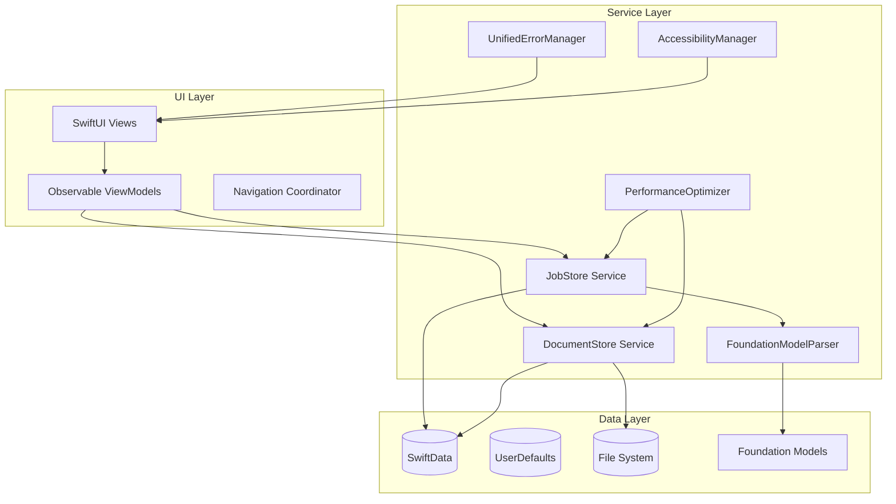

# CareerJourney Architecture Documentation

**Version:** 1.0  
**Last Updated:** January 13, 2025  
**Target Audience:** Developers, architects, and technical stakeholders

## Table of Contents

1. [Overview](#overview)
2. [Architecture Principles](#architecture-principles)
3. [System Architecture](#system-architecture)
4. [Data Layer](#data-layer)
5. [Service Layer](#service-layer)
6. [UI Layer](#ui-layer)
7. [State Management](#state-management)
8. [Error Handling](#error-handling)
9. [Performance Architecture](#performance-architecture)
10. [Security Architecture](#security-architecture)
11. [Testing Architecture](#testing-architecture)
12. [Deployment Architecture](#deployment-architecture)
13. [Design Patterns](#design-patterns)
14. [Technology Stack](#technology-stack)
15. [Architectural Decision Records](#architectural-decision-records)

---

## Overview

CareerJourney is a native macOS application built with Swift and SwiftUI, designed to help users manage their job application process. The application follows a **local-first architecture** with modern reactive programming patterns, ensuring data privacy, performance, and native user experience.

### Core Architecture Philosophy

- **Local-First**: All data processing and storage happens on-device
- **Reactive**: UI automatically updates based on observable data changes
- **Modular**: Clear separation of concerns with well-defined boundaries
- **Native**: Leverages platform-specific capabilities and design patterns
- **Type-Safe**: Comprehensive use of Swift's type system for reliability
- **Performance-Optimized**: Efficient data access and memory management

---

## Architecture Principles

### 1. **Local-First Computing**
```
Principle: All user data remains on the user's device
- No cloud dependencies for core functionality
- Privacy by design
- Offline-first operation
- User control over data
```

### 2. **Reactive Architecture**
```
Principle: UI reflects data state automatically
- Observable objects drive UI updates
- Declarative UI with SwiftUI
- Single source of truth for data
- Unidirectional data flow
```

### 3. **Separation of Concerns**
```
Principle: Each component has a single responsibility
- Clear layer boundaries
- Dependency injection
- Protocol-oriented design
- Testable components
```

### 4. **Native Platform Integration**
```
Principle: Leverage macOS capabilities fully
- Native UI components and patterns
- Platform-specific optimizations
- Accessibility support
- System integration (file system, notifications)
```

---

## System Architecture



### Layer Responsibilities

#### **UI Layer**
- **SwiftUI Views**: Declarative UI components
- **Observable ViewModels**: Business logic and state management
- **Navigation**: App-wide navigation coordination

#### **Service Layer**
- **JobStore**: Job application CRUD operations and business logic
- **DocumentStore**: Document management and file operations
- **FoundationModelParser**: AI-powered job posting parsing
- **Support Services**: Error handling, performance monitoring, accessibility

#### **Data Layer**
- **SwiftData**: Primary persistence layer for structured data
- **UserDefaults**: Configuration and lightweight data storage
- **File System**: Document storage and backup files
- **Foundation Models**: On-device LLM for intelligent parsing

---

## Data Layer

### SwiftData Schema Design

```swift
// Core Entity Relationships
@Model class SwiftDataJobApplication {
    // Primary job data with relationships to documents
    var documents: [SwiftDataJobDocument] = []
}

@Model class SwiftDataJobDocument {
    // Document metadata with optional job association
    var associatedJobID: UUID?
}

@Model class SwiftDataDocumentCategory {
    // Document organization structure
    var documents: [SwiftDataJobDocument] = []
}
```

### Data Flow Architecture

```
1. User Input → ViewModel → Service Layer → SwiftData
2. Data Changes → SwiftData → Service Layer → @Published → UI Update
3. File Operations → Service Layer → File System → SwiftData Metadata
```

### Migration Strategy

```swift
// Automatic migration from legacy UserDefaults
if swiftDataJobs.isEmpty && hasLegacyData() {
    migrateLegacyData() // One-time migration
    markMigrationComplete()
}
```

### Backup and Recovery

- **JSON Export**: Human-readable backup format
- **Incremental Backups**: Track changes for efficient backups
- **Cross-Platform Compatibility**: Backup format supports future platforms
- **Data Validation**: Integrity checks during import/export

---

## Service Layer

### Service Design Pattern

```swift
@MainActor
protocol ServiceProtocol: ObservableObject {
    func initializeDataIfNeeded()
    func save() throws
}

// Implementation ensures thread safety and observable updates
class ConcreteService: ServiceProtocol {
    @Published var data: [DataType] = []
    private var modelContext: ModelContext?
}
```

### Dependency Injection

```swift
// Constructor injection for loose coupling
class JobStore: ObservableObject {
    init(documentStore: DocumentStore? = nil) {
        self.documentStore = documentStore
    }
}

// Environment injection for SwiftUI
struct ContentView: View {
    @EnvironmentObject var jobStore: JobStore
    @EnvironmentObject var documentStore: DocumentStore
}
```

### Service Coordination

```swift
// Services coordinate through well-defined interfaces
class JobStore {
    func addJob(_ job: JobApplication) {
        // 1. Validate job data
        // 2. Save to SwiftData
        // 3. Parse skills if document store available
        // 4. Update published properties
        // 5. Handle errors gracefully
    }
}
```

---

## UI Layer

### MVVM with Observable Pattern

```swift
// Modern Swift Observable pattern
@Observable
class JobDetailViewModel {
    var job: JobApplication
    var isEditing: Bool = false
    
    func save() {
        // Business logic here
        jobStore.updateJob(job)
    }
}

// SwiftUI View consumption
struct JobDetailView: View {
    @State private var viewModel: JobDetailViewModel
    
    var body: some View {
        // Declarative UI that automatically updates
    }
}
```

### Navigation Architecture

```swift
// Coordinator pattern for complex navigation
@Observable
class NavigationCoordinator {
    var selectedJob: UUID?
    var selectedSection: ViewSection = .jobDetails
    var navigationPath: [ViewSection] = []
}
```

### State Management Hierarchy

```
1. App-Level State: NavigationCoordinator, ServiceInstances
2. Feature-Level State: JobStore, DocumentStore
3. View-Level State: ViewModels, @State properties
4. Component-Level State: Form data, UI state
```

---

## State Management

### Observable Architecture

```swift
// Reactive state propagation
class JobStore: ObservableObject {
    @Published var jobApplications: [SwiftDataJobApplication] = []
    @Published var selectedJobIDs: Set<UUID> = []
    
    // State changes automatically trigger UI updates
    func updateJobStatus(_ ids: Set<UUID>, to status: JobStatus) {
        // Mutation triggers @Published update
        jobApplications = jobApplications.map { job in
            ids.contains(job.id) ? job.with(status: status) : job
        }
    }
}
```

### State Synchronization

```swift
// SwiftData → Service → UI synchronization
private func loadJobs() {
    let descriptor = FetchDescriptor<SwiftDataJobApplication>()
    jobApplications = try context.fetch(descriptor)
    // @Published automatically notifies UI subscribers
}
```

### State Persistence Strategy

- **Immediate Persistence**: Critical data saved immediately
- **Batched Updates**: Non-critical updates batched for performance
- **Auto-Save**: Periodic saves for data safety
- **Conflict Resolution**: Handle concurrent modifications gracefully

---

## Error Handling

### Unified Error Management

```swift
// Centralized error handling and user notification
class UnifiedErrorManager: ObservableObject {
    @Published var currentAlert: AlertItem?
    
    enum Severity {
        case info, warning, error
    }
    
    func show(message: String, severity: Severity) {
        // Display appropriate UI feedback
    }
}
```

### Error Recovery Patterns

```swift
// Graceful degradation and retry logic
func parseJobPosting(text: String, maxRetries: Int = 2) async throws -> ParsedJobPosting {
    var lastError: Error?
    
    for attempt in 0...maxRetries {
        do {
            return try await attemptParsing(text)
        } catch {
            lastError = error
            if attempt < maxRetries {
                await Task.sleep(nanoseconds: UInt64(pow(2.0, Double(attempt)) * 1_000_000_000))
            }
        }
    }
    
    // Fallback to pattern-based parsing
    return parseWithPatterns(text)
}
```

### Error Categories and Handling

1. **Data Persistence Errors**: Automatic retry with user notification
2. **Validation Errors**: Immediate user feedback with correction guidance
3. **File System Errors**: Graceful degradation with alternative approaches
4. **AI Processing Errors**: Fallback to pattern-based processing
5. **Network Errors**: N/A (local-first architecture)

---

## Performance Architecture

### Memory Management

```swift
// Efficient memory usage patterns
class DocumentStore: ObservableObject {
    // Lazy loading for large documents
    private var documentCache: [UUID: Data] = [:]
    
    func loadDocument(_ id: UUID) -> Data? {
        if let cached = documentCache[id] {
            return cached
        }
        
        // Load only when needed
        let data = loadFromDisk(id)
        documentCache[id] = data
        return data
    }
}
```

### Database Optimization

```swift
// Efficient SwiftData queries
let descriptor = FetchDescriptor<SwiftDataJobApplication>(
    predicate: #Predicate<SwiftDataJobApplication> { job in
        job.status == .applied && job.dateOfApplication > startDate
    },
    sortBy: [SortDescriptor(\.dateOfApplication, order: .reverse)]
)
```

### Background Processing

```swift
// Non-blocking operations
func uploadDocumentsNonAsync(from urls: [URL]) {
    // Process synchronously but efficiently
    // UI updates happen on main thread via @Published
    for url in urls {
        let document = processDocument(url)
        DispatchQueue.main.async {
            self.documents.append(document)
        }
    }
}
```

### Performance Monitoring

```swift
// Built-in performance tracking
@Observable
class PerformanceOptimizer {
    func trackMemoryUsage() -> Double {
        var info = mach_task_basic_info()
        // Get actual memory usage
        return Double(info.resident_size) / 1024.0 / 1024.0
    }
    
    func optimizeIfNeeded() {
        if memoryUsage > threshold {
            clearCaches()
            compactDatabase()
        }
    }
}
```

---

## Security Architecture

### Data Protection

```swift
// Local data security measures
class DocumentStore {
    func uploadDocumentsNonAsync(from urls: [URL]) {
        for url in urls {
            // Security-scoped resource access
            let accessing = url.startAccessingSecurityScopedResource()
            defer {
                if accessing {
                    url.stopAccessingSecurityScopedResource()
                }
            }
            
            // Process securely
        }
    }
}
```

### Privacy Architecture

- **No Network Requests**: All processing happens locally
- **Sandboxed Environment**: macOS app sandbox for security
- **User-Controlled Data**: Users control all their data
- **Encryption at Rest**: System-level encryption via FileVault
- **Access Control**: Fine-grained permissions for file access

### Security Boundaries

```
1. App Sandbox → System Resources
2. Security-Scoped Resources → File Access
3. SwiftData → Database Security
4. Foundation Models → AI Processing (local only)
```

---

## Testing Architecture

### Test Strategy

```swift
// Comprehensive testing approach
struct JobStoreTests {
    @Test("Job creation with validation")
    func testJobCreation() async throws {
        let store = JobStore()
        let job = JobApplication.create(
            companyName: "Test Corp",
            jobTitle: "Developer",
            status: .applied
        )
        
        store.addJob(job)
        
        #expect(store.jobApplications.count == 1)
        #expect(store.jobApplications.first?.companyName == "Test Corp")
    }
}
```

### Testing Layers

1. **Unit Tests**: Service layer logic and data models
2. **Integration Tests**: Service interactions and data flow
3. **UI Tests**: User workflows and interface validation
4. **Performance Tests**: Memory usage and operation speed
5. **Memory Leak Tests**: Resource cleanup validation

### Test Data Management

```swift
#if DEBUG
extension JobStore {
    func addSampleDataIfNeeded() {
        // Provide realistic test data for development
    }
    
    static func mock() -> JobStore {
        // Create mock instance for previews and tests
    }
}
#endif
```

---

## Deployment Architecture

### Build Configuration

```swift
// Environment-specific configurations
#if DEBUG
let isDevelopment = true
let enableLogging = true
#else
let isDevelopment = false
let enableLogging = false
#endif
```

### Distribution Strategy

- **Direct Distribution**: macOS app bundle
- **App Store Ready**: Includes all required metadata and assets
- **Code Signing**: Developer ID for distribution outside App Store
- **Notarization**: Apple notarization for security

### Version Management

```swift
// Semantic versioning strategy
struct Version {
    static let current = "1.0.0"
    static let buildNumber = "1"
    static let compatibilityVersion = "1.0"
}
```

---

## Design Patterns

### Observable Pattern

```swift
// Modern Swift observation for reactive UI
@Observable
class ViewModel {
    var data: [Item] = []
    
    func updateData() {
        // Automatic UI updates via observation
    }
}
```

### Repository Pattern

```swift
// Data access abstraction
protocol JobRepository {
    func fetchJobs() async throws -> [JobApplication]
    func save(_ job: JobApplication) async throws
}

class SwiftDataJobRepository: JobRepository {
    // Concrete implementation using SwiftData
}
```

### Strategy Pattern

```swift
// Parsing strategy selection
protocol ParsingStrategy {
    func parse(_ text: String) async throws -> ParsedJobPosting
}

class AIParsingStrategy: ParsingStrategy { /* Implementation */ }
class PatternParsingStrategy: ParsingStrategy { /* Implementation */ }
```

### Dependency Injection Pattern

```swift
// Constructor and environment injection
struct ContentView: View {
    @EnvironmentObject var jobStore: JobStore
    @EnvironmentObject var documentStore: DocumentStore
    
    var body: some View {
        // Use injected dependencies
    }
}
```

---

## Technology Stack

### Core Technologies

| Layer | Technology | Version | Purpose |
|-------|------------|---------|---------|
| Language | Swift | 6.0+ | Primary development language |
| UI Framework | SwiftUI | Latest | Declarative user interface |
| Persistence | SwiftData | Latest | Data modeling and persistence |
| AI Processing | Foundation Models | Latest | On-device LLM capabilities |
| Testing | Swift Testing | Latest | Modern testing framework |

### Supporting Technologies

| Component | Technology | Purpose |
|-----------|------------|---------|
| Package Management | Swift Package Manager | Dependency management |
| Code Quality | SwiftLint | Code style enforcement |
| Documentation | Swift DocC | API documentation |
| Build System | Xcode Build System | Compilation and linking |
| Distribution | Xcode Organizer | App Store submission |

### Framework Dependencies

```swift
// Core system frameworks
import SwiftUI
import SwiftData
import Foundation
import AppKit

// Optional AI capabilities
#if canImport(FoundationModels)
import FoundationModels
import LanguageModel
#endif

// Document handling
import UniformTypeIdentifiers
import PDFKit
import QuickLook
```

---

## Architectural Decision Records

### ADR-001: SwiftData vs Core Data

**Decision**: Use SwiftData for data persistence

**Context**: Need modern, efficient data persistence solution

**Rationale**:
- Native Swift integration with better type safety
- Simplified relationship modeling
- Automatic migration capabilities
- SwiftUI integration with @Query property wrapper
- Future-proofed for Swift ecosystem evolution

**Consequences**:
- Requires iOS 17+ / macOS 14+ minimum deployment target
- Limited to platforms supporting SwiftData
- Migration path from Core Data requires bridge implementation

### ADR-002: Observable vs ObservableObject

**Decision**: Use @Observable for new ViewModels, maintain @ObservableObject for services

**Context**: Swift 5.9 introduced @Observable macro for improved performance

**Rationale**:
- @Observable provides better performance with selective view updates
- Cleaner syntax without @Published property wrappers
- Better compile-time optimization
- Maintains compatibility with existing @ObservableObject services

**Consequences**:
- Mixed architecture during transition period
- Developer education needed for new pattern
- Improved runtime performance for UI updates

### ADR-003: Local-First Architecture

**Decision**: Process all data locally without cloud dependencies

**Context**: User privacy concerns and offline functionality requirements

**Rationale**:
- Complete user control over personal data
- No dependency on internet connectivity
- Compliance with privacy regulations
- Reduced operational complexity
- Better performance for local operations

**Consequences**:
- No automatic sync across devices
- Larger app bundle size for AI models
- Manual backup/restore responsibility on users
- Potential isolation from cloud-based integrations

### ADR-004: Foundation Models for AI

**Decision**: Use Apple's Foundation Models framework for job parsing

**Context**: Need intelligent job posting parsing with privacy preservation

**Rationale**:
- On-device processing preserves privacy
- Leverages hardware acceleration (Neural Engine)
- No API costs or rate limiting
- Graceful degradation to pattern-based parsing
- Future compatibility with Apple's AI roadmap

**Consequences**:
- Platform-specific implementation
- Requires newer hardware for optimal performance
- Fallback implementation needed for compatibility
- Limited customization compared to custom models

### ADR-005: Unified Error Management

**Decision**: Implement centralized error handling with UnifiedErrorManager

**Context**: Need consistent error reporting and user experience

**Rationale**:
- Consistent error presentation across the app
- Centralized logging and debugging capabilities
- Separation of error handling from business logic
- Configurable error severity and presentation
- Better user experience with contextual error messages

**Consequences**:
- Additional abstraction layer
- Dependency injection required for all services
- Potential over-engineering for simple error cases
- Need for comprehensive error categorization

### ADR-006: Service Layer Architecture

**Decision**: Implement service layer with dependency injection

**Context**: Need clean separation between UI and business logic

**Rationale**:
- Clear separation of concerns
- Improved testability with mock services
- Reusable business logic across different UI components
- Easier maintenance and evolution
- Better support for complex business workflows

**Consequences**:
- Increased complexity for simple operations
- Learning curve for dependency injection patterns
- Potential over-abstraction for small features
- Need for careful lifecycle management

---

## Future Architecture Considerations

### Scalability Patterns

1. **Multi-Window Support**: Architecture supports multiple document windows
2. **Plugin Architecture**: Extensible service layer for future plugins
3. **Cross-Platform**: Core services designed for potential iOS/iPad ports
4. **Performance Scaling**: Efficient handling of large datasets

### Evolution Strategy

1. **Incremental Migration**: Gradual adoption of new patterns and technologies
2. **Backward Compatibility**: Maintain support for existing data formats
3. **API Stability**: Stable internal APIs for long-term maintenance
4. **Technology Refresh**: Regular evaluation of new Swift/SwiftUI features

### Technical Debt Management

1. **Regular Refactoring**: Scheduled refactoring cycles for code health
2. **Pattern Consistency**: Gradual migration to consistent architectural patterns
3. **Documentation Updates**: Keep architecture documentation current
4. **Performance Monitoring**: Continuous monitoring for performance regressions

---

This architecture documentation serves as the definitive guide for understanding CareerJourney's technical design and implementation patterns. It should be updated as the architecture evolves and new patterns are adopted.