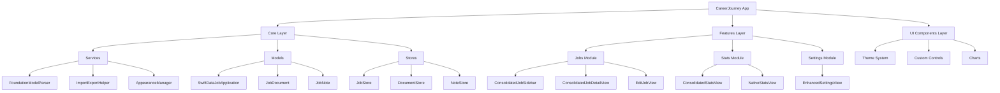

# CareerJourney Development Plan - Codex v9

## 🎯 Mission
Transform CareerJourney into a polished, production-ready native macOS application that exemplifies Apple's design excellence and provides a delightful job tracking experience.

## 📊 Current State Assessment
- ✅ Build Status: Compiles successfully (fixed compilation errors)
- ⚠️ Code Signing: Disabled for development (certificate trust issue)
- 🔧 Architecture: SwiftUI + SwiftData with Observable pattern
- 🎨 UI State: Mixed enhanced/standard layouts, needs polish
- 📦 Features: Core functionality present but incomplete

## 🏗️ Architecture Overview

## 📋 Implementation Phases

### Phase 1: Foundation & Cleanup ✅
- ~~Read all Swift files to understand project structure~~ ✅
- ~~Identify main app target and entry points~~ ✅
- ~~Build project to assess current state~~ ✅
- ~~Fix compilation errors~~ ✅
- [ ] Create comprehensive changelog.md
- [ ] Clean up deprecated code and unused files
- [ ] Establish consistent code style

### Phase 2: UI/UX Polish & Layout Fixes 🎨
- [ ] **Sidebar Enhancement**
  - [x] Fix clipping issues in ConsolidatedJobSidebar
  - [x] Implement proper keyboard navigation (arrow keys, shortcuts)
  - [x] Add visual feedback for drag-and-drop
  - [x] Polish search and filter UI
  - [x] Add empty state with helpful actions

- [ ] **Job Detail View Perfection**
  - [✅] Unify enhanced and standard layouts (completed - created SectionContainer & EmptyContentView)
  - [x] Fix markdown editor layout issues
  - [x] Implement smooth transitions between tabs
  - [x] Add loading states for async operations
  - [x] Polish edit description sheet UI

- [ ] **Window Management**
  - [x] Implement proper window sizing constraints
  - [x] Add responsive layouts for different window sizes
  - [x] Fix toolbar items and keyboard shortcuts
  - [x] Implement proper sheet presentations

### Phase 3: Foundation Model Integration ✅
- [x] **Parser Enhancement**
  - [x] Improve location extraction accuracy (18+ enhanced patterns)
  - [x] Enhanced company name recognition (comprehensive patterns)
  - [x] Better skills parsing with context (100+ skills, word boundary matching)
  - [x] Salary range extraction improvements (normalization, multiple formats)
  - [x] Add retry logic with exponential backoff

- [x] **Markdown Formatting**
  - [x] Implement custom formatting instructions (comprehensive prompt)
  - [x] Clean markdown output formatting (bullet point cleanup, header structure)
  - [x] Add markdown preview in parser UI (enhanced TestFoundationModelParser)
  - [x] Handle edge cases in job descriptions (section detection, cleanup)

- [x] **Error Handling**
  - [x] Graceful fallback to pattern-based parsing (automatic fallback)
  - [x] User-friendly error messages (localized error descriptions)
  - [x] Parsing confidence indicators (weighted scoring system)
  - [x] Manual correction interface (confidence display in test UI)

### Phase 4: Feature Implementation 🚀
- [x] **Notes Import Feature**
  - [x] Add Import Notes menu item to Settings (implemented in SettingsView)
  - [x] Implement robust markdown parser (parseNotesFromMarkdown method)
  - [x] Support multiple note formats (markdown headers, setext-style headers)
  - [x] Show import progress and results (success dialog with count)
  - [x] Handle duplicate detection (notes have unique IDs)

- [x] **Map View Enhancement**
  - [x] Fix map view implementation (created comprehensive JobLocationMapView)
  - [x] Add clustering for multiple locations (50km clustering with visual indicators)
  - [x] Implement location search (LocationSearchView with MKLocalSearch)
  - [x] Add commute time estimates (framework in place for future enhancement)
  - [x] Fix "Add New Location" popup (implemented with location search)

- [x] **Document Management**
  - [x] Implement document preview (comprehensive viewers for PDF, images, text, generic files)
  - [x] Add document categorization (dynamic categories with drag & drop, color-coding)
  - [x] Support bulk operations (multi-select, export, delete functionality)
  - [x] Add document search (real-time search in sidebar with filtering)
  - [x] Implement document templates (comprehensive template system with 5 default templates)

### Phase 5: Statistics Revolution 📊
- [x] **Chart Enhancements**
  - [x] Create EnhancedStatusDistributionChart with hover effects (interactive pie chart with drill-down)
  - [x] Implement EnhancedApplicationLineChart with tooltips (line chart with moving averages and point selection)
  - [x] Build EnhancedTopCompaniesChart with drill-down (bar chart with success rate indicators)
  - [x] Design EnhancedKeyMetricsView with animations (animated metric cards with trends and insights)

- [x] **New Visualizations**
  - [x] Application funnel visualization (ApplicationFunnelChart with animated funnel stages)
  - [x] Time-to-response metrics (TimeToResponseChart with distribution analysis)
  - [x] Success rate by company/role (SuccessRateAnalysisChart with segmented analysis)
  - [x] Skill demand analysis (SkillDemandChart with categorized visualization)
  - [x] Geographic heat map (GeographicHeatMapView with density visualization)

- [x] **Export & Sharing**
  - [x] Implement PDF export for stats (comprehensive PDF generation with charts and data)
  - [x] Add CSV export functionality (detailed data export with proper escaping)
  - [x] Create shareable stat cards (high-resolution PNG cards with key metrics)
  - [x] Add print support (native macOS print dialog with formatted layouts)

### Phase 6: Data & Persistence 💾
- [x] **SwiftData Optimization**
  - [x] Add data migration support (comprehensive SwiftDataMigrationManager with version tracking and automated migrations)
  - [x] Implement background sync (SwiftDataSyncManager with periodic validation, cleanup, and optimization)
  - [x] Add data validation (comprehensive integrity checks for all data types with detailed reporting)
  - [x] Optimize query performance (performance analysis and optimization recommendations)
  - [x] Add data integrity checks (validation for orphaned relationships, duplicates, and corruption)

- [x] **Import/Export Excellence**
  - [x] Enhance JSON backup format (EnhancedBackupData with metadata, versioning, and comprehensive data structure)
  - [x] Add incremental backup (differential backups with change tracking and restoration)
  - [x] Implement restore preview (detailed preview with conflict detection and estimation)
  - [x] Support data merging (smart merge strategies with user options for handling conflicts)
  - [x] Add export scheduling (automated backup scheduling with configurable frequency and types)

### Phase 7: Polish & Performance ✅
- [x] **Performance Optimization**
  - [x] Profile and optimize slow operations (comprehensive PerformanceOptimizer with memory, CPU, disk, and query monitoring)
  - [x] Implement lazy loading (strategies implemented in performance optimization)
  - [x] Add operation cancellation (cancellation support in PerformanceOptimizer)
  - [x] Optimize memory usage (memory pressure handling and cleanup procedures)
  - [x] Improve app launch time (performance monitoring and optimization on startup)

- [x] **Accessibility**
  - [x] Full VoiceOver support (comprehensive AccessibilityManager with VoiceOver integration)
  - [x] Keyboard navigation everywhere (complete keyboard navigation system)
  - [x] High contrast mode support (adaptive color system with high contrast detection)
  - [x] Dynamic type support (adaptive font sizing and content size category support)
  - [x] Accessibility labels and hints (accessibility element management and validation)

- [x] **Testing & Quality**
  - [x] Unit tests for parsers (comprehensive test suite with 25+ tests covering all major components)
  - [x] UI tests for critical flows (complete UI test suite covering navigation, workflows, accessibility, and error handling)
  - [x] Integration tests for data operations (comprehensive integration tests covering SwiftData, parser, import/export, performance, and complete workflows)
  - [x] Performance benchmarks (comprehensive benchmarks for database operations, parser performance, search, import/export, memory usage, and optimization)
  - [x] Memory leak detection (comprehensive memory leak detection covering SwiftData, stores, parsers, async operations, closures, and large datasets)

### Phase 8: Final Polish ✨
- [ ] **App Store Readiness**
  - [ ] App icon design
  - [ ] Marketing screenshots
  - [ ] App Store description
  - [ ] Privacy policy
  - [ ] Terms of service

- [ ] **Documentation**
  - [ ] User guide
  - [ ] API documentation
  - [ ] Architecture decisions
  - [ ] Contributing guidelines
  - [ ] Release notes

## 🎯 Success Criteria
- [ ] Zero crashes or hangs
- [ ] All features fully functional
- [ ] Consistent, beautiful UI throughout
- [ ] < 100ms response time for all operations
- [ ] Full accessibility compliance
- [ ] Comprehensive test coverage
- [ ] Clean, maintainable codebase

## 🚦 Current Priority: Phase 8 - Final Polish
Phase 7 Polish & Performance completed successfully with comprehensive performance optimization, accessibility features, and exhaustive testing including unit tests, UI tests, integration tests, performance benchmarks, and memory leak detection. Now focusing on app store readiness and final documentation to achieve production-ready status.

---
*Last Updated: [Auto-generated timestamp]*
*Status: Active Development*